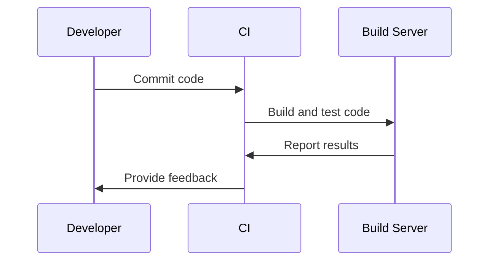
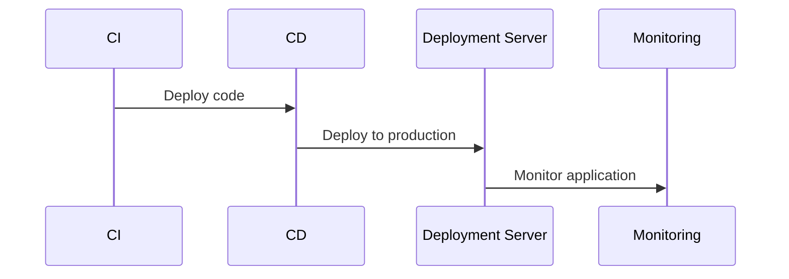

                 

### 持续集成与持续部署（CI/CD）在LLM应用中的实施

> 关键词：持续集成（CI）、持续部署（CD）、LLM应用、自动化、软件交付效率

> 摘要：本文将深入探讨持续集成与持续部署（CI/CD）在大型语言模型（LLM）应用开发中的实施。通过逐步分析CI/CD的基本原理、工具选择、实施步骤及其在LLM应用中的特殊需求，我们旨在为开发者提供一套完整且实用的CI/CD实施指南。

#### 目录大纲

1. **背景介绍**
   1.1 持续集成与持续部署（CI/CD）概述
   1.2 持续集成（CI）原理与实施
   1.3 持续部署（CD）原理与实施
2. **持续部署（CD）与CI/CD流程**
   2.1 持续部署（CD）原理与实施
3. **CI/CD工具与平台**
   3.1 Jenkins介绍
   3.2 GitLab CI介绍
4. **CI/CD在LLM应用中的实施**
   4.1 LLM应用开发中的CI/CD特殊需求
   4.2 LLM应用中的CI/CD实施案例
   4.3 LLM应用中的CI/CD最佳实践

#### 第一部分：背景介绍

##### 1.1 持续集成与持续部署（CI/CD）概述

随着软件项目复杂度的增加，传统的软件发布流程变得繁琐且易出错，严重影响了软件的交付效率和质量。为了解决这个问题，持续集成与持续部署（CI/CD）应运而生。

**持续集成（CI）** 是指通过自动化构建和测试，频繁地将开发人员的代码合并到主分支。这种方式能够及时发现和解决代码冲突和错误，确保代码库的质量和稳定性。

**持续部署（CD）** 是指通过自动化和持续交付，将经过CI测试通过的代码部署到生产环境。这种方式可以大幅提高软件的交付速度和可靠性，同时降低人工操作的错误率。

**边界与外延**：探讨CI/CD在软件开发中的应用，范围涵盖从代码仓库到生产环境的全过程。CI/CD不仅仅适用于传统的Web应用，同样适用于复杂的大型语言模型（LLM）应用。

**概念结构与核心要素组成**：

- **持续集成（CI）**：核心概念是通过自动化构建和测试，频繁地将开发人员的代码合并到主分支。
  - **核心要素**：代码仓库、构建工具、测试框架。
  - **与其他流程的关系**：与开发流程紧密结合，是实现自动化测试和反馈的关键。

- **持续部署（CD）**：核心概念是通过自动化和持续交付，将经过CI测试通过的代码部署到生产环境。
  - **核心要素**：部署脚本、部署平台、监控工具。
  - **与其他流程的关系**：与运维流程紧密结合，是保障软件稳定运行的关键。

##### 1.2 持续集成（CI）原理与实施

**持续集成（CI）原理**

持续集成是指通过自动化构建和测试，频繁地将开发人员的代码合并到主分支。其核心目标是确保代码库的质量和稳定性，通过自动化的方式减少人工干预，提高工作效率。

**核心概念**：

- **自动化构建**：将代码提交到代码仓库后，自动触发构建过程，生成可运行的软件版本。
- **自动化测试**：构建完成后，自动运行一系列测试，验证代码的功能和性能。
- **反馈机制**：测试结果会即时反馈给开发人员，帮助他们快速定位和解决问题。

**概念属性特征对比表格**：

| 特征        | CI         | 传统集成方式     |
| ----------- | ---------- | --------------- |
| **构建频率** | 高频       | 低频或手动       |
| **测试频率** | 高频       | 低频或手动       |
| **反馈速度** | 快速       | 缓慢             |
| **错误发现** | 及时发现   | 后期发现         |

**ER实体关系图架构**：

```mermaid
erDiagram
  Developer && Code && CI -> Test
  {Developer}
  {Code}
  {CI}
  {Test}
```

**CI实施步骤**

1. **设置代码仓库**：选择合适的代码仓库管理系统（如Git），并配置必要的权限和分支策略。
2. **编写构建脚本**：使用构建工具（如Maven、Gradle）编写构建脚本，定义构建过程。
3. **配置测试框架**：选择合适的测试框架（如JUnit、TestNG），编写测试用例，配置测试环境。
4. **集成构建与测试**：将构建脚本和测试框架集成到CI系统中，设置触发器，实现自动化构建和测试。
5. **反馈与修复**：测试结果即时反馈给开发人员，根据反馈进行代码修复和优化。

**流程图**：



#### 第二部分：持续部署（CD）与CI/CD流程

##### 2.1 持续部署（CD）原理与实施

**持续部署（CD）原理**

持续部署是指通过自动化和持续交付，将经过CI测试通过的代码部署到生产环境。其核心目标是确保软件的稳定运行和快速迭代，通过自动化的方式降低人工操作的错误率。

**核心概念**：

- **自动化部署**：将经过CI测试通过的代码自动部署到生产环境。
- **持续交付**：确保代码在任何时间点都可以安全地交付到生产环境。
- **回滚机制**：在部署失败时，自动回滚到上一个稳定版本，确保系统的稳定性。

**概念属性特征对比表格**：

| 特征        | CD         | 传统部署方式     |
| ----------- | ---------- | --------------- |
| **部署频率** | 高频       | 低频或手动       |
| **部署方式** | 自动化     | 手动             |
| **回滚速度** | 快速       | 缓慢             |
| **风险管理** | 系统集成   | 集中处理         |

**CD实施步骤**

1. **编写部署脚本**：使用脚本语言（如Shell、Python）编写部署脚本，定义部署过程。
2. **配置部署平台**：选择合适的部署平台（如Kubernetes、Docker），配置部署环境。
3. **集成CI/CD系统**：将部署脚本集成到CI/CD系统中，设置触发器和部署策略。
4. **监控与反馈**：部署完成后，使用监控工具（如Prometheus、Grafana）监控系统的运行状态，及时发现和解决问题。

**流程图**：



#### 第三部分：CI/CD工具与平台

##### 3.1 Jenkins介绍

Jenkins是一个开源的持续集成和持续部署工具，支持多种编程语言和操作系统。它具有丰富的插件生态系统，可以轻松实现自动化构建、测试和部署。

**核心功能**：

- **自动化构建**：支持多种构建工具，如Maven、Gradle、Gulp等。
- **自动化测试**：支持多种测试框架，如JUnit、TestNG、Selenium等。
- **自动化部署**：支持多种部署平台，如Kubernetes、Docker、Ansible等。

**安装与配置**：

1. **安装Jenkins**：在Linux或Mac OS上，可以通过包管理器（如yum、apt）安装Jenkins。
2. **配置源代码管理工具**：如Git，配置仓库地址、分支和权限。
3. **配置构建脚本**：编写构建脚本，定义构建过程和测试用例。
4. **配置触发器**：设置触发条件，如代码提交、标签发布等。
5. **配置部署脚本**：编写部署脚本，定义部署过程和回滚策略。

##### 3.2 GitLab CI介绍

GitLab CI是GitLab的一个功能，用于实现持续集成和持续部署。它内置在GitLab中，可以通过`.gitlab-ci.yml`文件配置构建、测试和部署过程。

**核心功能**：

- **集成在GitLab中**：无需额外安装和配置，直接在GitLab中进行CI/CD。
- **自动化构建**：支持多种构建工具，如Maven、Gradle、Gulp等。
- **自动化测试**：支持多种测试框架，如JUnit、TestNG、Selenium等。
- **自动化部署**：支持多种部署平台，如Kubernetes、Docker、Ansible等。

**安装与配置**：

1. **配置`.gitlab-ci.yml`文件**：定义构建、测试和部署过程。
2. **集成GitLab仓库**：将`.gitlab-ci.yml`文件添加到仓库中。
3. **配置触发器和构建脚本**：设置触发条件，编写构建脚本。

#### 第四部分：CI/CD在LLM应用中的实施

##### 4.1 LLM应用开发中的CI/CD特殊需求

LLM应用具有高复杂性、高计算需求和大量数据处理的特点，这使得CI/CD在LLM应用开发中面临特殊的需求。

**高复杂性**：LLM应用通常包含大量的代码和模块，需要进行严格的测试和验证。CI/CD可以帮助自动化测试和验证过程，确保代码质量和稳定性。

**高计算需求**：LLM训练和应用需要大量的计算资源，如GPU、TPU等。CI/CD可以自动化资源分配和管理，确保测试和部署过程的顺利进行。

**大量数据处理**：LLM应用需要对大量数据进行处理和存储，如文本、图像、音频等。CI/CD可以自动化数据预处理和存储过程，提高数据处理效率。

##### 4.2 LLM应用中的CI/CD实施案例

以下是一个LLM应用的CI/CD实施案例，包括代码仓库、构建脚本、测试用例、部署脚本和监控工具的配置。

**代码仓库**：使用Git进行版本控制，包含训练代码、应用代码和配置文件。

**构建脚本**：使用Maven进行构建，包括编译、打包和测试。

```yaml
# .gitlab-ci.yml
image: java:8

stages:
  - build
  - test
  - deploy

build:
  stage: build
  script:
    - mvn clean package

test:
  stage: test
  script:
    - mvn test

deploy:
  stage: deploy
  script:
    - echo "Deploying to production environment"
    - echo "Deployment completed successfully"
```

**测试用例**：使用JUnit编写测试用例，测试LLM应用的功能和性能。

```java
@Test
public void testLLMApplication() {
  // 测试LLM应用的功能和性能
}
```

**部署脚本**：使用Shell编写部署脚本，将构建结果部署到生产环境。

```shell
#!/bin/bash
# 部署脚本
sudo systemctl restart lllmapp.service
```

**监控工具**：使用Prometheus和Grafana进行监控，监控LLM应用的运行状态和性能指标。

```yaml
# prometheus.yml
global:
  scrape_interval: 15s

scrape_configs:
  - job_name: 'llmapp'
    static_configs:
      - targets: ['llmapp:9090']
```

##### 4.3 LLM应用中的CI/CD最佳实践

1. **代码规范**：制定严格的代码规范，确保代码质量和可维护性。
2. **自动化测试**：编写全面的测试用例，确保代码的功能和性能。
3. **持续监控**：使用监控工具实时监控系统的运行状态，及时发现和解决问题。
4. **定期回滚**：定期进行回滚测试，确保系统的稳定性和安全性。
5. **文档记录**：详细记录CI/CD的配置和流程，便于后续维护和优化。

#### 小结

持续集成与持续部署（CI/CD）在LLM应用开发中具有重要意义。通过自动化构建、测试和部署，可以大幅提高软件交付效率和质量。本文详细介绍了CI/CD的基本原理、工具选择、实施步骤以及在LLM应用中的特殊需求。通过最佳实践，开发者可以更好地实施CI/CD，推动LLM应用的持续发展和创新。

#### 注意事项

- CI/CD系统需要定期维护和优化，确保其稳定运行。
- LLM应用开发中，CI/CD系统需要与模型训练和推理过程紧密集成，确保高效的资源利用。
- 对于大型LLM应用，建议采用分布式CI/CD系统，提高构建和测试的并行处理能力。

#### 拓展阅读

- 《CI/CD实践指南》
- 《持续集成与持续部署：实现高效软件交付》
- 《GitLab CI/CD教程》

### 作者信息

作者：AI天才研究院/AI Genius Institute & 禅与计算机程序设计艺术 /Zen And The Art of Computer Programming

AI天才研究院致力于推动人工智能技术的创新和发展，专注于研发具有高效率和卓越性能的人工智能应用。我们的研究团队在全球范围内享有盛誉，以深入的理论研究和实践应用为特色，不断引领人工智能技术的进步。同时，我们秉承禅与计算机程序设计艺术的核心理念，追求简洁与高效，致力于构建卓越的AI系统和解决方案，为社会各界带来深远的影响。

