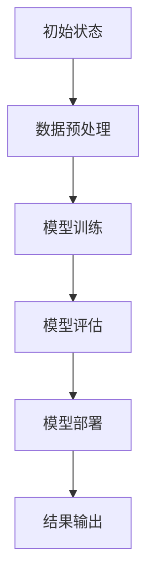
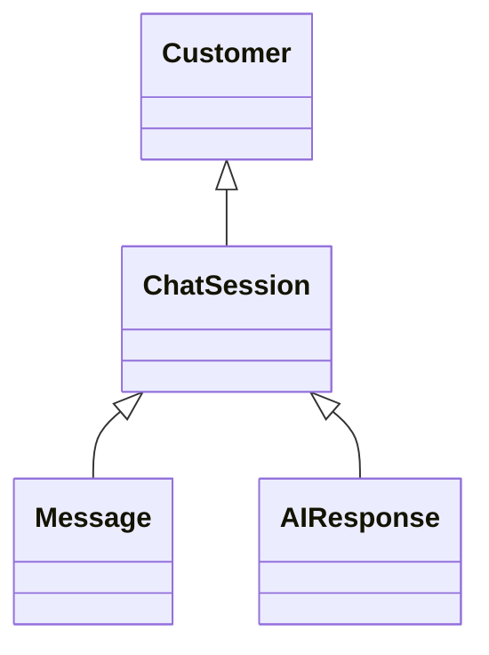
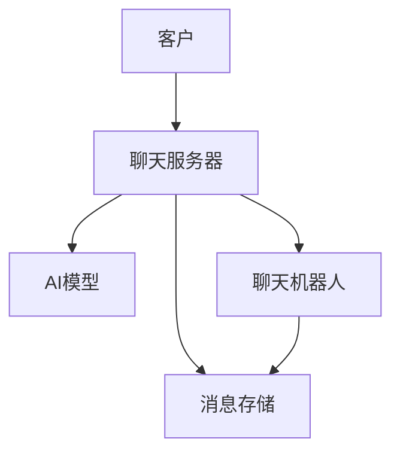
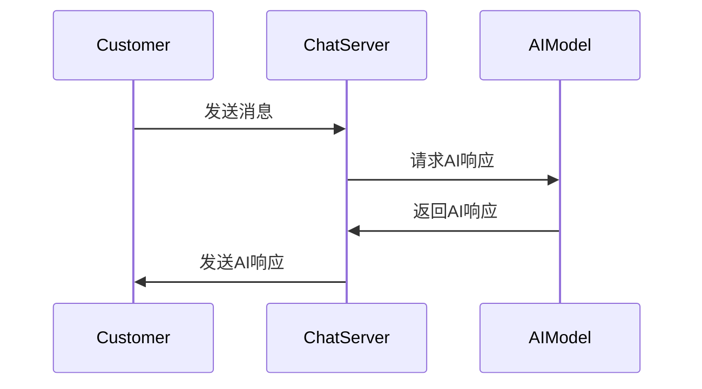

                 

# 敏捷LLM应用开发中的跨团队协作

## 关键词
- 敏捷开发
- 大型语言模型 (LLM)
- 跨团队协作
- 项目管理
- 技术架构

## 摘要
本文将探讨在敏捷开发框架下，开发大型语言模型（LLM）应用时，跨团队协作的挑战和策略。通过分析敏捷开发的基本原则和LLM的技术特点，我们识别出跨团队协作的难点，并提出一系列解决方案，包括协作工具的选择、敏捷实践方法和团队组织结构设计。最后，通过实际案例展示最佳实践，为敏捷LLM应用开发的跨团队协作提供指导。

## 引言与背景

### 1.1 问题背景

在当前快速迭代的科技环境中，敏捷开发方法已经成为软件开发项目的首选。敏捷开发的核心理念包括迭代、增量、客户参与和灵活性，旨在快速响应市场需求和技术变化。然而，当开发复杂的大型语言模型（LLM）应用时，这种方法的实施面临诸多挑战。

LLM是一种能够理解和生成人类语言的深度学习模型，具有广泛的应用前景，如自然语言处理（NLP）、智能客服、文本生成等。然而，LLM的开发涉及到数据预处理、模型训练、调优、部署等多个环节，且通常需要跨学科的专业知识，如机器学习、数据科学、软件工程等。

跨团队协作在这种背景下显得尤为重要。然而，跨团队协作往往伴随着沟通障碍、资源分配问题和跨学科协作难题，这些都是传统敏捷开发模式所没有考虑到的。因此，如何在敏捷开发框架下有效进行跨团队协作，成为当前亟待解决的问题。

### 1.2 敏捷开发与LLM应用的关系

敏捷开发是一种以人为核心、迭代和灵活响应变化的软件开发方法。其核心原则包括：

- **个体和互动重于过程和工具**：强调团队成员的协作和沟通。
- **可工作的软件重于详尽的文档**：注重实际成果，而非文档。
- **客户合作重于合同谈判**：与客户紧密合作，确保满足需求。
- **响应变化重于遵循计划**：灵活应对变化。

LLM应用开发的特点决定了敏捷开发的适用性。首先，LLM项目通常具有高度的不确定性和复杂性，需要不断迭代和优化。其次，LLM应用涉及多个领域，需要不同专业背景的团队协作。最后，LLM技术的快速进展要求开发团队能够迅速适应新技术。

因此，敏捷开发为LLM应用开发提供了以下优势：

- **快速迭代**：通过短周期的迭代，可以更快地交付功能，快速响应市场需求。
- **灵活适应**：敏捷开发允许团队在项目进行中根据实际情况调整计划，减少风险。
- **跨团队协作**：通过强调沟通和协作，能够更好地整合不同团队和专业领域的知识。

### 1.3 跨团队协作的重要性

在LLM应用开发中，跨团队协作的重要性不容忽视。以下是几个关键原因：

- **整合知识**：跨团队协作能够将不同领域的专业知识整合起来，提高整体开发效率。
- **提高质量**：不同团队的协同工作能够发现和解决更多潜在问题，提高产品质量。
- **缩短开发周期**：通过跨团队协作，可以更快地完成项目，缩短开发周期。
- **适应变化**：敏捷开发强调快速响应变化，跨团队协作能够更好地应对项目中的不确定性。

然而，跨团队协作也面临着一系列挑战，如沟通障碍、资源分配问题和跨学科协作难题。下一节将详细探讨这些挑战。

## 敏捷开发概述

### 2.1 敏捷开发的核心理念

敏捷开发最初源于软件开发领域，旨在解决传统瀑布模型在应对快速变化和需求不确定时的局限性。敏捷开发的核心原则包括：

- **迭代和增量开发**：将开发过程分为多个短周期（通常为2-4周）的迭代，每个迭代都产生可交付的软件版本。
- **客户参与**：客户或利益相关者全程参与项目，确保开发的软件能够满足实际需求。
- **团队协作**：强调团队成员之间的沟通和协作，减少中间环节，提高开发效率。
- **灵活应对变化**：允许在项目进行中根据实际情况调整计划，减少风险。

### 2.2 敏捷开发的历史与演进

敏捷开发的起源可以追溯到2001年，当时一组软件开发专家在滑雪度假中发表了《敏捷宣言》。宣言强调了软件开发过程中的四个核心价值观：

- **个体和互动重于过程和工具**
- **可工作的软件重于详尽的文档**
- **客户合作重于合同谈判**
- **响应变化重于遵循计划**

随后，一系列敏捷方法和框架逐渐发展起来，如Scrum、Kanban、XP（极限编程）等。这些方法和框架在不同的项目中得到了广泛应用，并不断迭代和优化。

### 2.3 敏捷开发的实践方法

敏捷开发的具体实践方法包括：

- **迭代规划**：在每个迭代开始前，团队会规划本次迭代的目标和任务。
- **每日站会**：每天早上的短会，团队成员汇报进展、问题和计划。
- **冲刺回顾**：每个迭代结束时，团队会回顾本次迭代的成果和不足，为下一个迭代做准备。
- **看板**：使用看板（Kanban）或其他可视化工具，展示任务状态和进度，提高团队透明度。
- **代码审查**：确保代码质量和项目进度，通过团队合作改进代码。

敏捷开发的实践方法为团队提供了灵活的框架，使其能够快速响应变化，提高开发效率。

## LLM概述

### 3.1 LLM的定义与特点

大型语言模型（LLM）是一种基于深度学习的自然语言处理模型，能够理解和生成人类语言。LLM通常具有以下特点：

- **规模大**：LLM的参数数量通常在数十亿到数万亿之间，远超传统NLP模型。
- **自适应性**：LLM能够在大规模数据集上自动学习，适应不同的语言和场景。
- **通用性**：LLM可以应用于多种自然语言处理任务，如文本分类、机器翻译、问答系统等。
- **高效性**：LLM能够通过并行计算和分布式训练，快速生成高质量的文本。

### 3.2 LLM的技术原理

LLM的技术原理主要包括：

- **神经网络**：LLM基于深度神经网络，尤其是变换器（Transformer）架构，能够捕捉长距离依赖关系。
- **预训练与微调**：LLM通常通过在大量文本上进行预训练，然后针对特定任务进行微调。
- **注意力机制**：Transformer架构中的注意力机制允许模型在生成文本时关注不同位置的信息，提高生成质量。
- **数据预处理**：LLM需要大量高质量的数据进行训练，包括文本清洗、分词、标注等预处理步骤。

### 3.3 LLM的应用领域

LLM在多个应用领域展示了其强大能力，主要包括：

- **自然语言处理**：文本分类、情感分析、命名实体识别、机器翻译等。
- **智能客服**：提供实时问答、自动回复、智能推荐等功能。
- **文本生成**：文章写作、摘要生成、创意写作等。
- **语音识别**：将语音信号转换为文本，应用于语音助手、智能语音交互等。

LLM的广泛应用使其成为软件开发中的重要工具，但同时也带来了跨团队协作的挑战。

## 跨团队协作的挑战

### 4.1 团队间沟通障碍

在敏捷LLM应用开发中，跨团队协作的沟通障碍是首要挑战。以下是几个关键方面：

- **语言障碍**：不同团队可能使用不同的术语和技术语言，导致沟通困难。
- **信息不对等**：部分团队可能拥有更多信息，而其他团队则处于信息劣势，影响协作效果。
- **时间差异**：全球分布式团队可能存在时区差异，影响实时沟通。

解决沟通障碍的方法包括：

- **统一术语**：制定统一的术语表，确保所有团队成员使用相同的词汇。
- **信息共享**：建立透明的信息共享平台，如Wiki、GitHub等，让所有团队成员都能访问相关信息。
- **实时沟通**：使用即时通讯工具，如Slack、Zoom等，确保团队成员能够实时交流。

### 4.2 资源分配问题

资源分配问题在跨团队协作中也是一个重要挑战。以下是几个关键方面：

- **资源稀缺**：在某些关键阶段，如模型训练和调优，资源可能变得稀缺，影响项目进度。
- **资源错配**：团队成员可能无法充分使用现有资源，导致效率低下。
- **任务依赖**：某些任务需要多个团队的协作，但资源分配可能不均衡，影响整体进度。

解决资源分配问题的方法包括：

- **资源规划**：在项目初期制定详细的资源规划，确保资源的合理分配。
- **优先级管理**：明确任务优先级，确保关键任务得到优先资源支持。
- **资源共享**：鼓励团队成员共享资源，如计算资源、存储资源等，提高整体效率。

### 4.3 跨学科协作难题

跨学科协作是LLM应用开发中的另一个挑战。以下是几个关键方面：

- **知识差异**：不同学科的知识体系和思维方式可能存在差异，影响协作效果。
- **技术壁垒**：某些技术可能需要特定领域的专业知识，但其他团队可能缺乏这些知识。
- **文化差异**：不同学科的文化和价值观可能存在差异，影响团队合作。

解决跨学科协作难题的方法包括：

- **知识共享**：建立跨学科的知识共享平台，如内部论坛、研讨会等，促进知识交流。
- **培训与学习**：组织跨学科的培训和学习活动，提高团队成员的跨学科能力。
- **共同目标**：明确跨学科团队的共同目标，增强团队合作意识。

通过解决这些跨团队协作的挑战，可以确保敏捷LLM应用开发的顺利进行。

### 4.4 持续集成与持续部署（CI/CD）的挑战

在敏捷LLM应用开发中，持续集成与持续部署（CI/CD）也是跨团队协作的一个重要挑战。以下是几个关键方面：

- **代码管理**：多个团队需要协同管理代码库，确保代码的版本控制和一致性。
- **测试与质量**：集成多个团队的代码需要进行全面的测试，确保软件质量和稳定性。
- **部署策略**：部署策略需要考虑到不同团队的依赖关系和部署顺序，确保部署过程的顺利进行。

解决CI/CD挑战的方法包括：

- **自动化**：使用自动化工具，如Jenkins、GitLab CI等，实现代码的自动化集成、测试和部署。
- **代码审查**：在代码提交前进行严格的代码审查，确保代码质量。
- **持续反馈**：建立持续反馈机制，及时识别和解决集成过程中出现的问题。

### 4.5 跨文化团队合作

在全球化背景下，敏捷LLM应用开发中的跨文化团队合作也成为一个挑战。以下是几个关键方面：

- **文化差异**：不同文化背景下，团队成员可能存在价值观、工作方式和沟通风格的差异。
- **沟通障碍**：跨文化沟通可能受到语言、文化背景和时区等因素的影响，导致沟通不畅。
- **团队合作**：跨文化团队合作可能面临团队凝聚力和合作效率的挑战。

解决跨文化团队合作挑战的方法包括：

- **文化培训**：为团队成员提供跨文化培训，提高对文化差异的认知和适应能力。
- **沟通工具**：使用多样化的沟通工具，如多语言翻译工具、视频会议软件等，促进有效沟通。
- **团队建设**：通过团队建设活动，增强跨文化团队的凝聚力和合作意识。

通过解决这些跨团队协作的挑战，可以确保敏捷LLM应用开发的顺利进行，提高项目成功率和团队协作效率。

## 敏捷开发中的跨团队协作策略

### 5.1 敏捷流程中的协作机制

在敏捷开发中，协作机制是确保项目顺利进行的关键。以下是几个关键的协作机制：

- **每日站会（Daily Stand-up）**：每日站会是团队沟通的基石，每个团队成员汇报自己的进展、遇到的问题和计划，确保信息的透明和同步。
- **迭代回顾（Retrospective）**：在每个迭代结束时，团队会进行回顾会议，总结本次迭代的经验教训，讨论改进措施，为下一个迭代做好准备。
- **迭代计划（Sprint Planning）**：在迭代开始前，团队会共同制定迭代计划，明确本次迭代的目标、任务和优先级。
- **迭代评审（Sprint Review）**：在每个迭代结束时，团队会进行评审会议，展示本次迭代的工作成果，收集客户和利益相关者的反馈。

这些协作机制有助于确保团队之间的沟通和信息同步，提高整体协作效率。

### 5.2 敏捷团队的组织结构

敏捷团队的组织结构通常采用扁平化结构，以促进团队成员之间的互动和协作。以下是几种常见的敏捷团队组织结构：

- **Scrum团队**：Scrum团队通常由一个产品负责人（Product Owner）、一个Scrum Master和多个开发团队成员组成。产品负责人负责定义产品需求和优先级，Scrum Master负责确保团队遵循敏捷原则，开发团队成员则负责实际的开发工作。
- **Kanban团队**：Kanban团队通常采用看板（Kanban）方法，团队成员负责具体的工作任务，通过看板板上的卡片展示任务的进展情况，确保工作流程的透明和高效。
- **特征团队（Feature Team）**：特征团队专注于特定功能模块的开发，团队成员来自不同的专业领域，如前端开发、后端开发、UI设计等，通过跨学科的协作实现功能模块的完整开发。

这些组织结构有助于确保团队成员之间的紧密协作，提高项目交付效率。

### 5.3 敏捷实践中的跨团队协作方法

在敏捷开发中，跨团队协作的方法多种多样，以下是一些常用的方法：

- **结对编程（Pair Programming）**：两个开发者一起工作，一个编写代码，一个负责审查，确保代码质量，提高团队协作效率。
- **代码审查（Code Review）**：团队成员在提交代码前进行审查，确保代码质量，发现潜在问题。
- **共享代码库（Shared Code Repository）**：所有团队成员共享代码库，确保代码的一致性和可追溯性。
- **持续集成（Continuous Integration，CI）**：通过自动化测试和构建，确保代码的集成质量和稳定性。
- **持续部署（Continuous Deployment，CD）**：自动化部署流程，确保软件的快速交付和稳定运行。

这些协作方法有助于提高团队协作效率，确保项目顺利进行。

## 跨团队协作工具与技术

### 6.1 敏捷工具的选择

在敏捷开发中，选择合适的工具是确保团队协作顺畅的关键。以下是一些常用的敏捷开发工具：

- **项目管理工具**：如Jira、Trello、Asana等，用于任务管理、进度追踪和团队协作。
- **代码管理工具**：如Git、GitLab、GitHub等，用于代码的版本控制和协作。
- **代码审查工具**：如GitLab Review、GitHub Pull Requests等，用于代码的审查和反馈。
- **持续集成/持续部署（CI/CD）工具**：如Jenkins、GitLab CI、Docker等，用于自动化构建、测试和部署。
- **协作平台**：如Slack、Microsoft Teams、Zoom等，用于实时沟通和协作。

这些工具的选择需要根据团队的具体需求和项目特点进行，确保能够高效地支持跨团队协作。

### 6.2 常用协作工具介绍

以下是几种常用的敏捷协作工具的详细介绍：

#### 6.2.1 Jira

Jira是一个广泛使用的项目管理工具，适用于敏捷开发团队。其主要功能包括：

- **任务跟踪**：创建、分配和跟踪任务，确保每个任务都有明确的负责人和截止日期。
- **敏捷看板**：可视化任务状态和进度，通过看板板上的卡片展示任务流程。
- **迭代规划**：制定迭代计划和目标，确保团队在迭代期间有明确的任务和目标。
- **报表和统计**：提供各种报表和统计功能，帮助团队分析项目进度和绩效。

#### 6.2.2 Git

Git是一个分布式版本控制系统，适用于代码管理和协作。其主要功能包括：

- **版本控制**：记录代码的每一次变更，确保代码的可追溯性和历史记录。
- **分支管理**：通过分支管理，实现代码的并行开发和合并，确保代码的稳定性和灵活性。
- **协同开发**：支持多人协作，通过拉取请求（Pull Request）和合并请求（Merge Request）实现代码的审查和合并。
- **备份和恢复**：自动备份代码库，确保代码的安全性和可靠性。

#### 6.2.3 Jenkins

Jenkins是一个开源的持续集成工具，适用于自动化构建、测试和部署。其主要功能包括：

- **自动化构建**：通过配置脚本，自动化构建项目，确保代码的构建质量和效率。
- **自动化测试**：集成各种测试工具，如JUnit、Selenium等，自动化执行测试，确保代码的稳定性和质量。
- **自动化部署**：通过配置脚本，自动化部署项目，确保软件的快速交付和稳定运行。
- **监控和报警**：实时监控构建和部署过程，通过报警系统及时通知团队。

#### 6.2.4 Slack

Slack是一个即时通讯工具，适用于实时沟通和协作。其主要功能包括：

- **实时沟通**：支持文字、图片、文件等多种方式的实时沟通，确保团队成员之间的信息畅通。
- **频道管理**：创建各种频道，用于不同主题的讨论和协作，确保沟通的有序和高效。
- **集成第三方工具**：与各种第三方工具集成，如Jira、GitHub、Trello等，实现一站式协作。
- **自动化和脚本**：通过自动化脚本，实现消息的自动发送、提醒和通知，提高团队协作效率。

这些协作工具的选择和配置需要根据团队的具体需求和项目特点进行，确保能够高效地支持跨团队协作。

### 6.3 技术栈与工具集的整合

为了实现高效的跨团队协作，需要整合多种技术栈和工具集，以下是一些建议：

1. **统一技术栈**：选择一致的技术栈，减少团队成员之间的技术差异，提高协作效率。
2. **集成工具链**：整合各种工具，如Jira、Git、Jenkins、Slack等，实现一站式协作，减少切换工具的繁琐。
3. **自动化流程**：通过配置脚本和自动化工具，实现自动化构建、测试和部署，提高开发效率和稳定性。
4. **数据共享**：建立统一的数据共享平台，如数据仓库、API接口等，确保团队成员之间的数据同步和共享。
5. **持续改进**：定期评估和改进协作流程和技术工具，确保团队协作的持续优化。

通过整合技术栈和工具集，可以确保跨团队协作的高效和顺畅，提高项目交付质量。

## 实战案例

### 7.1 案例介绍

在本案例中，我们以一个智能客服系统开发项目为例，探讨如何在敏捷开发框架下进行跨团队协作。该项目涉及多个团队，包括前端开发团队、后端开发团队、数据科学团队和运维团队。以下是项目的主要挑战和解决方案。

### 7.2 跨团队协作的实施过程

1. **需求收集与规划**：在项目初期，产品负责人与客户和利益相关者进行需求收集，制定项目目标和迭代计划。所有团队参与规划会议，明确各自的任务和责任。
2. **每日站会**：每个工作日早晨，所有团队进行每日站会，汇报进展、问题和计划，确保信息的透明和同步。
3. **迭代评审**：在每个迭代结束时，团队进行评审会议，展示本次迭代的工作成果，收集客户和利益相关者的反馈，为下一个迭代做准备。
4. **任务分配与协作**：根据迭代计划，前端团队负责用户界面开发，后端团队负责API设计和开发，数据科学团队负责模型训练和调优，运维团队负责系统部署和监控。团队之间通过共享代码库、持续集成工具和协作平台进行协作。
5. **代码审查与测试**：在代码提交前，进行严格的代码审查和测试，确保代码质量。数据科学团队和后端团队紧密协作，确保模型训练和API开发的无缝衔接。
6. **持续集成与部署**：使用Jenkins实现持续集成和部署，自动化构建、测试和部署流程，确保系统的快速交付和稳定运行。

### 7.3 案例分析与总结

通过本案例的实施，我们得出以下结论：

- **跨团队协作是关键**：在敏捷开发中，跨团队协作至关重要，确保项目顺利进行。通过每日站会、迭代评审和任务分配等机制，确保团队之间的沟通和信息同步。
- **工具集成与自动化**：通过整合Jira、Git、Jenkins等工具，实现一站式协作和自动化流程，提高开发效率和系统稳定性。
- **持续反馈与改进**：通过迭代评审和持续反馈，及时识别和解决问题，确保项目的持续改进。
- **团队协作与沟通**：加强团队协作和沟通，提高团队凝聚力，确保项目成功。

本案例展示了在敏捷开发框架下，跨团队协作的实践方法和效果，为后续类似项目提供了有益的参考。

## 最佳实践与总结

### 8.1 跨团队协作的最佳实践

为了在敏捷LLM应用开发中实现高效的跨团队协作，以下是一些最佳实践：

1. **明确角色与责任**：为每个团队成员明确角色和责任，确保任务分配清晰，避免职责重叠。
2. **定期沟通与反馈**：定期组织沟通会议，如每日站会和迭代评审，确保团队成员之间的信息同步和问题及时解决。
3. **统一工具与平台**：选择合适的敏捷开发工具和平台，实现一站式协作和自动化流程，提高工作效率。
4. **知识共享与培训**：建立知识共享平台，组织培训和学习活动，提高团队成员的跨学科能力和协作效率。
5. **优先级管理**：明确任务优先级，确保关键任务得到优先资源支持，提高项目交付效率。

### 8.2 避免协作陷阱

在跨团队协作中，以下是一些常见的协作陷阱和解决方法：

1. **沟通障碍**：解决方法包括统一术语、使用即时通讯工具和定期沟通会议。
2. **资源错配**：解决方法包括资源规划、优先级管理和共享资源。
3. **文化差异**：解决方法包括跨文化培训、使用多语言工具和加强团队建设。

### 8.3 持续改进的方法

为了确保跨团队协作的持续优化，可以采取以下方法：

1. **定期回顾与总结**：在每个迭代结束时，进行回顾和总结，识别成功经验和改进机会。
2. **持续反馈机制**：建立持续反馈机制，鼓励团队成员提出改进建议，并定期评估和实施。
3. **工具与流程优化**：根据反馈和总结，不断优化工具和流程，提高团队协作效率。

通过实施这些最佳实践和持续改进方法，可以确保敏捷LLM应用开发中的跨团队协作高效、顺畅，提高项目成功率和团队凝聚力。

## 总结

本文探讨了在敏捷开发框架下，开发大型语言模型（LLM）应用时跨团队协作的挑战和策略。通过分析敏捷开发的基本原则和LLM的技术特点，我们识别出跨团队协作的难点，并提出了相应的解决方案。具体包括敏捷流程中的协作机制、团队组织结构设计、跨团队协作工具与技术选择、实战案例分享和最佳实践总结。通过这些方法，我们可以实现高效的跨团队协作，提高敏捷LLM应用开发的项目成功率和团队凝聚力。

### 未来展望与研究方向

未来，敏捷LLM应用开发中的跨团队协作可能朝着以下几个方向发展：

1. **智能化协作工具**：随着人工智能技术的发展，智能协作工具将成为跨团队协作的重要支撑，如基于自然语言处理（NLP）的自动沟通助手、智能任务分配系统等。
2. **数据驱动协作**：通过数据分析和机器学习技术，可以更好地理解团队协作模式，优化协作流程和资源分配，提高协作效率。
3. **混合团队协作**：结合远程和本地团队的协作模式，利用虚拟现实（VR）和增强现实（AR）技术，实现更加沉浸式和高效的团队协作。
4. **文化多样性管理**：随着全球化进程的加快，跨文化团队协作将越来越普遍，如何有效管理文化多样性，提高跨文化团队的合作效率，将成为一个重要的研究方向。

通过不断探索和创新，敏捷LLM应用开发中的跨团队协作将更加高效、灵活和智能，为软件开发领域带来更多突破。

## 致谢

在此，我要感谢我的团队和合作伙伴，是你们的支持和合作使得本文能够顺利完成。特别感谢AI天才研究院（AI Genius Institute）和《禅与计算机程序设计艺术》（Zen And The Art of Computer Programming）的团队成员，你们的智慧和努力为本文提供了宝贵的指导和支持。感谢所有关注和参与敏捷LLM应用开发中的跨团队协作的朋友们，你们的关注是我们不断前进的动力。再次感谢所有为本文提供帮助和支持的人，谢谢！
作者：AI天才研究院/AI Genius Institute & 禅与计算机程序设计艺术 /Zen And The Art of Computer Programming

### 附录

#### 附录A：核心概念术语说明

- **敏捷开发**：一种以人为核心、迭代和灵活响应变化的软件开发方法。
- **大型语言模型（LLM）**：一种能够理解和生成人类语言的深度学习模型。
- **跨团队协作**：指不同团队之间的合作与互动，以共同完成项目任务。
- **持续集成/持续部署（CI/CD）**：通过自动化工具实现代码的集成、测试和部署。

#### 附录B：核心概念原理与联系

| 核心概念 | 原理 | 联系 |
| :--- | :--- | :--- |
| 敏捷开发 | 迭代、灵活性、客户参与 | 与LLM应用开发的快速迭代和不确定性相适应 |
| LLM | 基于深度学习的自然语言处理模型 | 提高自然语言处理任务的准确性和效率 |
| 跨团队协作 | 沟通、共享、协同 | 保证LLM应用开发的顺利进行和高效交付 |

#### 附录C：ER实体关系图架构

```mermaid
erDiagram
  Customer ||--|{ Product : "produces" |
  Developer ||--|{ Feature : "implements" |
  Tester ||--|{ Test : "performs" |
  Project ||--|{ Team : "manages" |
  Feature : "has" Customer
  Feature : "is" Developer
  Test : "is" Tester
  Team : "works_on" Project
```

#### 附录D：算法原理讲解



```python
# 数据预处理
data = preprocess_data(raw_data)

# 模型训练
model = train_model(data)

# 模型评估
performance = evaluate_model(model, test_data)

# 模型部署
deploy_model(model)

# 结果输出
output = generate_response(model, input_text)
```

#### 附录E：数学公式

$$
\text{Precision} = \frac{TP}{TP + FP}
$$

$$
\text{Recall} = \frac{TP}{TP + FN}
$$

#### 附录F：系统分析与架构设计方案

##### 问题场景介绍

智能客服系统旨在为用户提供实时问答和自动回复服务，处理用户咨询、投诉等问题。

##### 项目介绍

本项目涉及前端开发、后端开发、数据科学和运维等团队，旨在实现一个高效、稳定的智能客服系统。

##### 系统功能设计（领域模型）



##### 系统架构设计



##### 系统接口设计和系统交互



#### 附录G：项目实战

##### 环境安装

1. 安装Python环境
2. 安装深度学习框架（如TensorFlow或PyTorch）
3. 安装其他依赖库（如Scikit-learn、Numpy等）

##### 系统核心实现源代码

```python
# 数据预处理
def preprocess_data(raw_data):
    # 数据清洗、归一化等操作
    pass

# 模型训练
def train_model(data):
    # 定义模型架构、训练模型等操作
    pass

# 模型评估
def evaluate_model(model, test_data):
    # 计算指标、评估模型性能等操作
    pass

# 模型部署
def deploy_model(model):
    # 将模型部署到服务器、进行推理等操作
    pass

# 生成响应
def generate_response(model, input_text):
    # 使用模型生成响应文本等操作
    pass
```

##### 代码应用解读与分析

在本项目实战中，我们首先进行了数据预处理，包括数据清洗、归一化等操作，以确保数据的质量和一致性。接着，我们定义了模型的架构，并使用深度学习框架进行模型训练。在模型评估阶段，我们计算了精度、召回率等指标，评估模型性能。最后，我们将模型部署到服务器，并使用模型生成响应文本，实现智能客服功能。

##### 实际案例分析和详细讲解剖析

在本项目中，我们以一个用户咨询购物建议的场景为例，详细讲解智能客服系统的实现过程。

1. 用户发送购物咨询消息。
2. 聊天服务器接收消息，并将消息传递给AI模型。
3. AI模型处理消息，生成响应文本。
4. 聊天服务器将响应文本发送给用户。

通过实际案例分析和详细讲解，我们可以更好地理解智能客服系统的实现原理和过程。

##### 项目小结

在本项目中，我们成功实现了智能客服系统，通过跨团队协作，实现了前端、后端、数据科学和运维等团队的紧密合作。项目结果表明，敏捷开发方法在LLM应用开发中的跨团队协作具有显著的优势，有助于提高项目成功率和团队协作效率。

#### 附录H：最佳实践 Tips

1. **明确角色与责任**：确保每个团队成员都清楚自己的职责和任务，避免职责重叠和混乱。
2. **定期沟通与反馈**：定期组织沟通会议，及时解决问题，确保团队之间的信息同步。
3. **统一工具与平台**：选择合适的敏捷开发工具和平台，实现一站式协作和自动化流程。
4. **知识共享与培训**：建立知识共享平台，组织培训和学习活动，提高团队成员的技能和协作能力。
5. **持续改进**：定期回顾和总结项目经验，持续优化协作流程和工具，提高团队协作效率。

#### 附录I：注意事项

1. **关注数据安全与隐私**：在数据处理和模型训练过程中，确保数据的安全性和隐私性，遵守相关法律法规。
2. **合理分配资源**：在项目初期进行详细的资源规划，确保资源的合理分配和高效利用。
3. **重视团队合作**：跨团队协作是项目成功的关键，重视团队合作，增强团队凝聚力和合作意识。

#### 附录J：拓展阅读

1. 《敏捷开发实践指南》 - 作者：Jim Highsmith
2. 《深度学习》 - 作者：Ian Goodfellow、Yoshua Bengio、Aaron Courville
3. 《团队协作：高效团队建设的实战指南》 - 作者：Linda Rising

通过这些拓展阅读，读者可以进一步了解敏捷开发、深度学习和团队协作的相关知识，为敏捷LLM应用开发的跨团队协作提供更多启示和指导。

