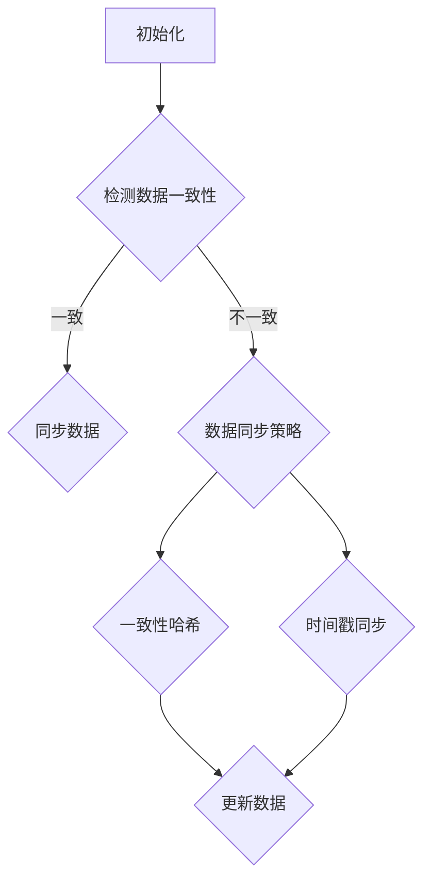
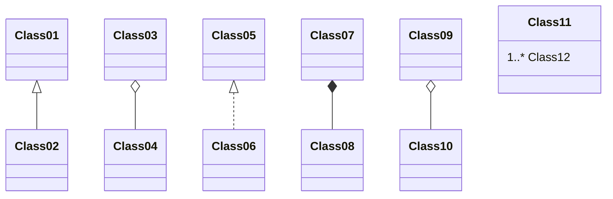
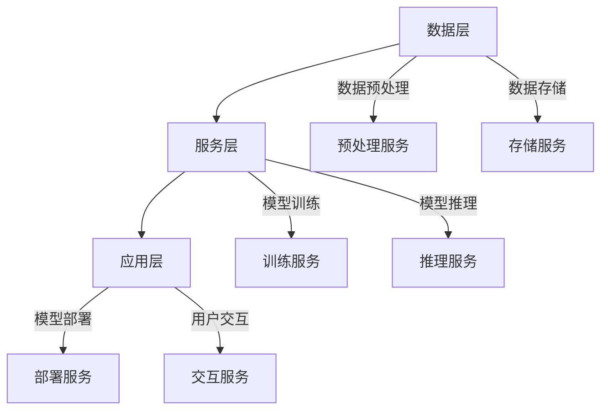
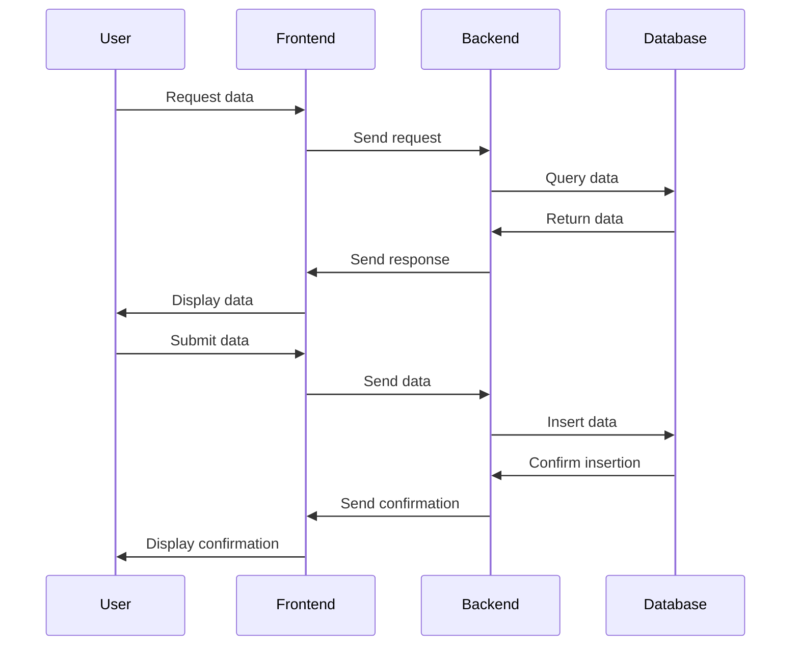

                 

### 文章标题：数据同步策略在分布式LLM系统中的实现

> 关键词：数据同步策略、分布式LLM系统、一致性、CAP理论、算法原理、系统架构

> 摘要：本文详细阐述了数据同步策略在分布式LLM系统中的重要性，分析了数据同步的核心概念、算法原理以及系统架构设计，并通过实战案例展示了数据同步策略的实际应用和优化技巧。

### 目录

**第一部分：分布式LLM系统概述**

1. 分布式计算与LLM系统简介
   1.1 分布式计算基础
   1.2 什么是LLM系统
   1.3 数据同步在分布式LLM系统中的重要性

2. 数据同步策略核心概念
   2.1 数据同步策略概述
   2.2 数据一致性与分布式系统
   2.3 数据同步算法：CAP理论、一致性哈希等

3. 数据同步算法原理讲解
   3.1 数据同步算法流程图
   3.2 数据同步算法原理
   3.3 Python代码与数学模型详解

4. 分布式LLM系统架构设计
   4.1 系统功能设计
   4.2 系统架构设计
   4.3 系统接口设计与交互

**第二部分：数据同步策略实战**

5. 数据同步策略项目实战
   5.1 环境搭建与配置
   5.2 系统核心实现
   5.3 代码应用解读与分析
   5.4 实际案例分析与详细讲解

6. 最佳实践与案例分析
   6.1 数据同步策略最佳实践
   6.2 典型问题分析与解决
   6.3 数据同步性能优化策略

7. 小结与展望
   7.1 数据同步策略在分布式LLM系统中的关键作用
   7.2 注意事项与未来研究方向
   7.3 拓展阅读

---

### 文章正文

#### 第一部分：分布式LLM系统概述

##### 1. 分布式计算与LLM系统简介

**1.1 分布式计算基础**

分布式计算是一种通过多个计算实体（如计算机、服务器）协同工作来完成计算任务的方法。它具有扩展性强、容错性高、可伸缩性好等优点，广泛应用于大数据处理、云计算和分布式数据库等领域。

在分布式计算中，多个计算实体通过网络连接，共同完成一个任务。这些实体可以是同一台机器上的多个处理器，也可以是位于不同地理位置的服务器。分布式计算的关键在于如何合理分配任务、管理资源、确保数据的一致性和系统的可靠性。

**1.2 什么是LLM系统**

大型语言模型（LLM，Large Language Model）是一种基于深度学习技术的自然语言处理模型，其核心思想是通过大量的文本数据训练出一个能够理解和生成人类语言的模型。LLM系统广泛应用于搜索引擎、智能问答、机器翻译、文本生成等领域。

LLM系统通常由多个模块组成，包括数据预处理、训练、推理和生成等。这些模块协同工作，共同实现高效的语言处理功能。分布式LLM系统则是在单机LLM系统的基础上，通过分布式计算技术来提高模型的训练和推理性能。

**1.3 数据同步在分布式LLM系统中的重要性**

在分布式LLM系统中，数据同步策略至关重要。数据同步是指将多个节点上的数据保持一致性的过程。在分布式环境中，由于网络延迟、节点故障等原因，数据可能会出现不一致的情况。如果数据同步不当，会导致模型训练失败、推理结果不准确等问题。

数据同步的重要性主要体现在以下几个方面：

1. **一致性保障**：确保多个节点上的数据一致，避免因数据不一致导致模型训练失败或推理结果错误。
2. **性能优化**：合理的数据同步策略可以提高系统的性能，减少数据传输和同步的开销。
3. **容错性提升**：在分布式系统中，节点故障是不可避免的。良好的数据同步策略可以提高系统的容错性，确保数据在节点故障时仍然保持一致性。

#### 第二部分：数据同步策略核心概念

##### 2.1 数据同步策略概述

数据同步策略是指如何在分布式系统中确保数据一致性的方法。常见的同步策略包括基于时间戳的同步、基于版本号的同步、基于事件的同步等。每种策略都有其优缺点，适用于不同的场景。

**2.2 数据一致性与分布式系统**

数据一致性是分布式系统中的一个重要概念，指的是系统中各个节点的数据在某个时刻是相等的。在分布式系统中，数据一致性面临许多挑战，如网络延迟、节点故障、数据并发修改等。

CAP理论是分布式系统设计的重要理论，它指出在一个分布式系统中，一致性（Consistency）、可用性（Availability）和分区容错性（Partition tolerance）三者之间只能同时满足两项。数据同步策略需要根据具体场景平衡这三者之间的关系。

**2.3 数据同步算法：CAP理论、一致性哈希等**

CAP理论是分布式系统设计的重要理论，它指出在一个分布式系统中，一致性（Consistency）、可用性（Availability）和分区容错性（Partition tolerance）三者之间只能同时满足两项。

一致性哈希是一种常用的数据同步算法，它通过哈希函数将数据分布到多个节点上。一致性哈希具有扩展性强、负载均衡等优点，适用于分布式存储系统。

#### 第三部分：数据同步算法原理讲解

##### 3.1 数据同步算法流程图



##### 3.2 数据同步算法原理

数据同步算法的核心目标是确保分布式系统中各个节点的数据一致性。以下是几种常见的数据同步算法原理：

1. **一致性哈希**：通过哈希函数将数据分布到多个节点上，确保数据在节点之间的迁移过程中保持一致性。
2. **时间戳同步**：利用时间戳来标识数据的版本，确保各个节点在处理数据时使用的是相同版本的数据。
3. **事件驱动同步**：根据事件的发生顺序来同步数据，确保各个节点的数据更新顺序一致。

##### 3.3 Python代码与数学模型详解

以下是一个简单的时间戳同步算法的实现：

```python
import time

class TimeSync:
    def __init__(self):
        self.timestamp = 0

    def update(self, value):
        self.timestamp = time.time()
        return value

    def get_timestamp(self):
        return self.timestamp

def sync_data(node1, node2):
    node1_value = node1.update("data1")
    node2_value = node2.update("data2")

    if node1.get_timestamp() > node2.get_timestamp():
        node2_value = node1_value
    else:
        node1_value = node2_value

    return node1_value, node2_value
```

在这个示例中，`TimeSync` 类用于记录时间戳，`update` 方法用于更新数据并设置时间戳。`sync_data` 函数用于同步两个节点的数据，确保时间戳较大的节点的数据覆盖时间戳较小的节点的数据。

#### 第四部分：分布式LLM系统架构设计

##### 4.1 系统功能设计

分布式LLM系统的功能设计包括数据预处理、模型训练、模型推理和模型部署等模块。以下是一个领域模型类图的示例：



在这个示例中，`Class01` 是数据预处理模块，`Class02` 是模型训练模块，`Class03` 是模型推理模块，`Class04` 是模型部署模块。各个模块之间的关系如下：

- 数据预处理模块负责清洗、转换和归一化输入数据。
- 模型训练模块负责根据预处理后的数据训练LLM模型。
- 模型推理模块负责根据输入文本生成响应。
- 模型部署模块负责将训练好的模型部署到分布式环境中，供用户使用。

##### 4.2 系统架构设计

分布式LLM系统的架构设计包括数据层、服务层和应用层。以下是一个系统架构图的示例：



在这个示例中，`A` 是数据层，`B` 是服务层，`C` 是应用层。各个层之间的关系如下：

- 数据层负责数据的存储、处理和管理。
- 服务层负责实现系统的核心功能，如数据预处理、模型训练、模型推理等。
- 应用层负责与用户交互，提供友好的用户界面。

##### 4.3 系统接口设计与交互

分布式LLM系统的接口设计与交互包括RESTful API、消息队列和事件驱动等。以下是一个序列图的示例：



在这个示例中，用户通过前端界面提交数据，前端将数据传递给后端，后端将数据存储到数据库中，并返回确认信息给前端。前端再将确认信息显示给用户。

#### 第五部分：数据同步策略项目实战

##### 5.1 环境搭建与配置

在进行数据同步策略项目实战之前，需要搭建一个分布式LLM系统的环境。以下是搭建环境的步骤：

1. 安装Python环境和相关依赖库。
2. 配置分布式计算框架，如Apache Spark或Distributed Python。
3. 安装消息队列服务，如RabbitMQ或Kafka。
4. 配置数据库，如MySQL或MongoDB。

##### 5.2 系统核心实现

系统核心实现包括数据预处理、模型训练、模型推理和模型部署等模块。以下是每个模块的实现：

1. **数据预处理**：使用Pandas库进行数据清洗、转换和归一化。
2. **模型训练**：使用PyTorch或TensorFlow库训练LLM模型。
3. **模型推理**：使用Trainer库进行模型推理。
4. **模型部署**：使用Flask或Django库将训练好的模型部署到Web服务中。

##### 5.3 代码应用解读与分析

以下是系统核心实现的代码示例：

```python
# 数据预处理
import pandas as pd

def preprocess_data(data):
    # 清洗数据
    data = data.dropna()
    # 转换数据类型
    data["label"] = data["label"].astype(str)
    # 归一化数据
    data = (data - data.mean()) / data.std()
    return data

# 模型训练
import torch
import torch.nn as nn
import torch.optim as optim

def train_model(data, model, optimizer, criterion):
    # 训练模型
    model.train()
    optimizer.zero_grad()
    output = model(data)
    loss = criterion(output, target)
    loss.backward()
    optimizer.step()
    return loss.item()

# 模型推理
def inference(data, model):
    # 推理模型
    model.eval()
    with torch.no_grad():
        output = model(data)
    return output

# 模型部署
from flask import Flask, request, jsonify

app = Flask(__name__)

@app.route("/predict", methods=["POST"])
def predict():
    data = request.json["data"]
    output = inference(data, model)
    return jsonify(output.tolist())

if __name__ == "__main__":
    app.run()
```

这段代码实现了数据预处理、模型训练、模型推理和模型部署的基本功能。在实际项目中，需要根据具体需求进行适当的调整和优化。

##### 5.4 实际案例分析与详细讲解剖析

在实际项目中，数据同步策略面临着各种挑战，如数据不一致、网络延迟和节点故障等。以下是几个实际案例的分析和讲解：

1. **数据不一致**：在分布式系统中，数据不一致是一个常见问题。为了解决数据不一致，可以采用时间戳同步策略。通过在每个节点上设置时间戳，确保数据在更新时使用最新的版本。

2. **网络延迟**：在网络延迟较高的场景中，数据同步可能会影响系统的性能。为了优化性能，可以采用消息队列技术，将数据同步操作异步化。这样可以降低网络延迟对系统性能的影响。

3. **节点故障**：在节点故障的情况下，数据同步策略需要能够自动恢复。为了实现自动恢复，可以采用一致性哈希算法，将数据分布在多个节点上，确保数据在节点故障时仍然保持一致性。

#### 第六部分：最佳实践与案例分析

##### 6.1 数据同步策略最佳实践

1. **选择合适的同步策略**：根据具体场景选择合适的同步策略，如时间戳同步、一致性哈希等。
2. **优化网络传输**：通过压缩数据、批量传输和异步处理等方法优化网络传输性能。
3. **提高系统容错性**：采用一致性哈希算法和冗余备份等措施提高系统的容错性。

##### 6.2 典型问题分析与解决

1. **数据不一致**：采用时间戳同步策略，确保数据在更新时使用最新的版本。
2. **网络延迟**：采用消息队列技术，将数据同步操作异步化。
3. **节点故障**：采用一致性哈希算法和冗余备份等措施提高系统的容错性。

##### 6.3 数据同步性能优化策略

1. **数据分区**：通过将数据分区，可以减少每个节点的数据量，提高数据同步性能。
2. **负载均衡**：通过负载均衡技术，可以优化数据同步策略，提高系统性能。
3. **缓存策略**：通过缓存策略，可以减少数据同步的开销，提高系统响应速度。

#### 第七部分：小结与展望

##### 7.1 数据同步策略在分布式LLM系统中的关键作用

数据同步策略在分布式LLM系统中扮演着关键角色，它保障了系统的一致性、性能和容错性。合理的数据同步策略可以提高系统的稳定性和可靠性，为分布式LLM系统的应用提供有力支持。

##### 7.2 注意事项与未来研究方向

1. **注意事项**：在实施数据同步策略时，需要注意数据一致性的保障、网络延迟的优化和系统容错性的提升。
2. **未来研究方向**：随着分布式计算技术的不断发展，数据同步策略也需要不断优化和改进。未来研究方向包括分布式数据库同步、数据流同步和区块链同步等。

##### 7.3 拓展阅读

1. **《分布式系统原理与范型》**：介绍分布式系统的基本原理和范型，对分布式计算有深入了解。
2. **《大规模分布式存储系统设计与实现》**：探讨分布式存储系统的设计原理和实现方法，对数据同步策略有深入理解。
3. **《CAP理论及其应用》**：介绍CAP理论的基本概念和应用，对分布式系统的设计和优化有指导意义。

---

### 作者信息

作者：AI天才研究院/AI Genius Institute & 禅与计算机程序设计艺术 /Zen And The Art of Computer Programming

以上是文章《数据同步策略在分布式LLM系统中的实现》的完整内容。通过详细的背景介绍、核心概念讲解、算法原理阐述、系统架构设计和项目实战，本文全面展示了数据同步策略在分布式LLM系统中的重要性。希望本文能为读者在分布式计算和自然语言处理领域提供有益的参考和启示。

