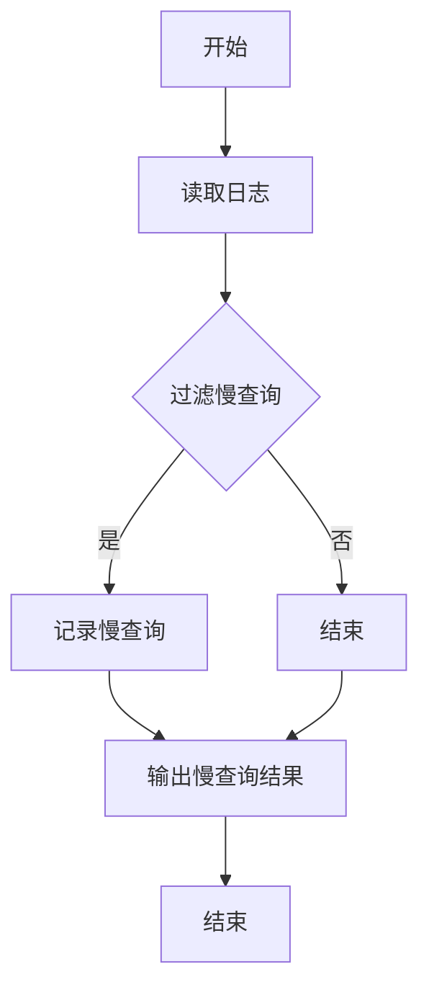
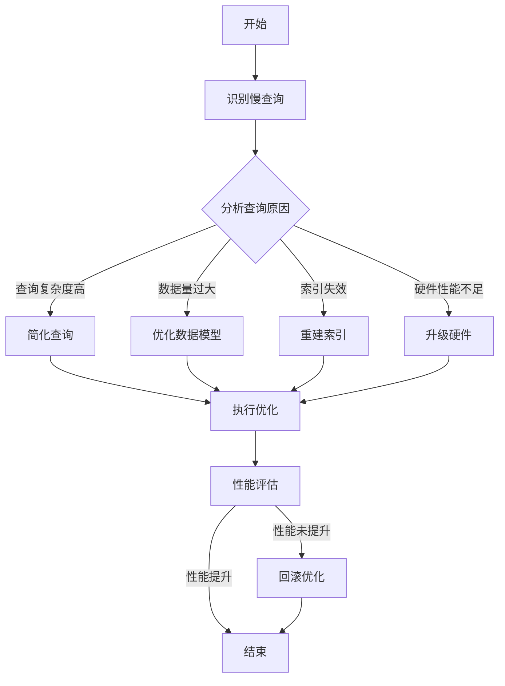
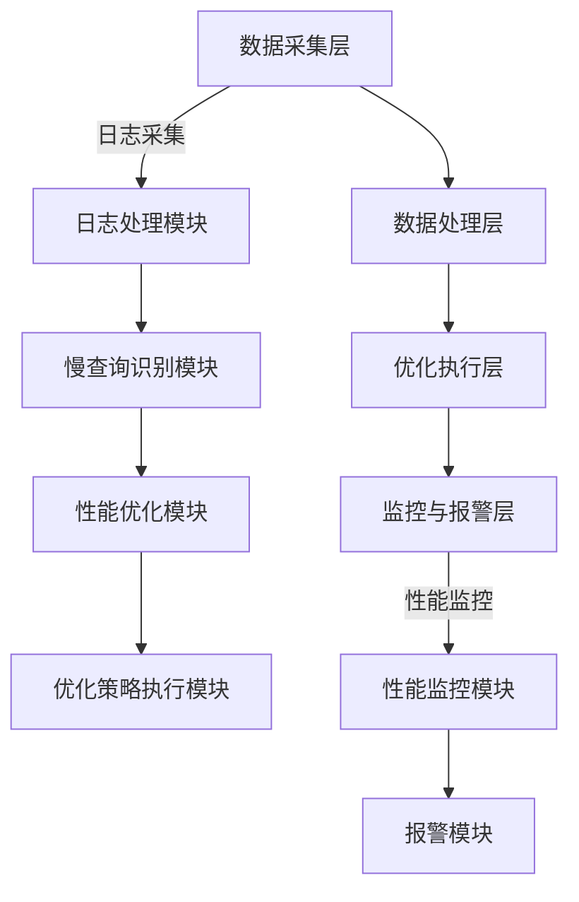
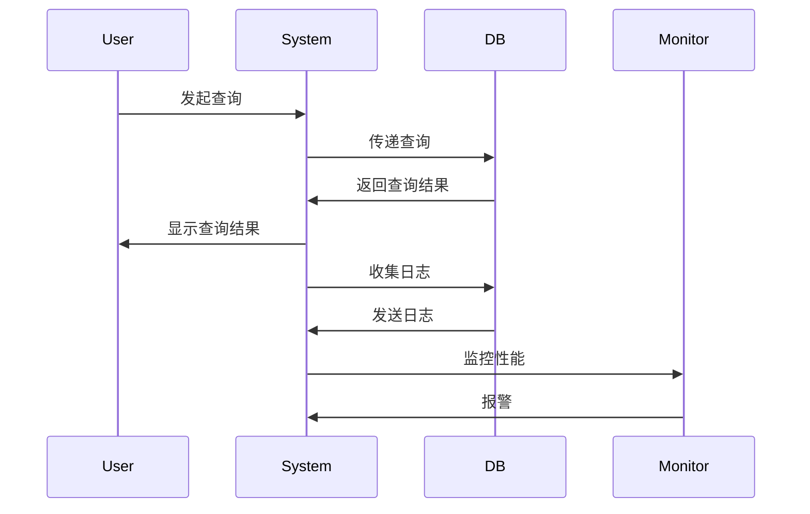

                 


### 1. 背景介绍

#### 1.1 问题背景

在当今的数字化时代，数据库已经成为存储、管理和处理大量数据的基石。特别是对于大型语言模型（LLM）应用，如搜索引擎、推荐系统、自然语言处理等，其对数据库性能的要求非常高。然而，随着数据规模的不断扩大和数据访问频率的增加，数据库慢查询问题逐渐成为一个普遍且严重的问题。

**数据库慢查询**，通常指的是数据库执行查询操作所需的时间超过了用户可接受的范围。慢查询不仅会降低应用的性能，还会影响用户体验，严重时可能导致系统崩溃。据统计，在许多系统中，慢查询占比高达40%以上，因此优化数据库性能，特别是解决慢查询问题，变得尤为重要。

#### 1.2 问题描述

慢查询问题的核心在于如何识别和解决。首先，我们需要明确什么是慢查询。一般来说，慢查询的定义包括以下几个方面：

- **执行时间**：查询执行时间超过了系统设定的阈值。
- **响应时间**：用户发起查询到获取结果的时间超过了用户预期的响应时间。
- **系统负载**：查询操作对系统资源（如CPU、内存、磁盘I/O等）的占用超过了系统的处理能力。

慢查询的原因多种多样，包括但不限于：

- **查询语句本身复杂**：如涉及大量关联查询、子查询、聚合操作等。
- **数据量过大**：数据表过于庞大，导致查询时需要扫描的数据量巨大。
- **索引失效**：索引没有有效地支持查询，导致数据库需要全表扫描。
- **硬件性能不足**：如磁盘I/O瓶颈、CPU负载高、内存不足等。
- **系统配置不当**：如数据库参数设置不优化、缓存策略不当等。

#### 1.3 问题解决

解决数据库慢查询问题需要系统性地进行分析和优化。以下是一个基本的步骤：

1. **识别慢查询**：通过日志分析、监控工具等手段，识别系统中的慢查询。
2. **分析原因**：结合查询语句、数据模型、系统配置等多方面因素，分析慢查询产生的原因。
3. **优化查询语句**：简化复杂查询、使用合适的索引、拆分大型查询等。
4. **优化数据模型**：如合理划分数据表、使用分区表等。
5. **系统调优**：调整数据库参数、优化缓存策略、升级硬件等。
6. **监控与反馈**：持续监控系统性能，及时发现问题并优化。

#### 1.4 边界与外延

慢查询分析并不是万能的，它有其适用的场景和限制。以下是一些边界与外延：

- **适用场景**：适用于大型数据系统，特别是对响应速度要求高的应用，如在线交易系统、社交媒体等。
- **限制**：对于数据量较小或查询简单的情况，慢查询分析可能不会带来显著性能提升。
- **评估指标**：如查询响应时间、吞吐量、系统资源利用率等。

#### 1.5 概念结构与核心要素组成

为了更好地理解数据库慢查询分析，我们需要从概念结构和核心要素的角度进行分析。

- **数据库性能监控架构**：包括监控工具、数据采集、数据处理和展示等组成部分。
- **慢查询分析与优化关键组件**：如慢查询日志分析、性能分析工具、查询优化器等。

### 2. 核心概念与联系

#### 2.1 数据库慢查询

**原理**：数据库慢查询是由于查询执行时间过长导致的，通常与查询复杂度、数据量、系统配置等因素相关。

**属性特征对比表格**：

| 特征       | 说明                                                         |
| ---------- | ------------------------------------------------------------ |
| 执行时间   | 超过系统设定的阈值的时间                                     |
| 响应时间   | 用户发起查询到获取结果的时间                                 |
| 系统负载   | 查询操作对系统资源（CPU、内存、磁盘I/O等）的占用情况           |

**Mermaid ER实体关系图**：

```mermaid
erDiagram
DBSlowQuery ||--|{ QueryStatement } QueryStatement
DBSlowQuery ||--|{ PerformanceMetrics } PerformanceMetrics
QueryStatement ||--|{ QueryComponents } QueryComponents
PerformanceMetrics ||--|{ MetricsData } MetricsData
```

#### 2.2 LLM应用

**原理**：LLM应用通过训练大规模的语言模型，实现文本的生成、理解、翻译等功能。

**属性特征对比表格**：

| 特征           | 说明                                                         |
| -------------- | ------------------------------------------------------------ |
| 数据规模       | 需要处理的海量文本数据                                       |
| 模型复杂度     | 大型语言模型通常包含数十亿参数，模型复杂度高                   |
| 计算资源需求   | 需要大量的计算资源和存储空间                                 |
| 响应速度要求   | 对查询响应速度有较高要求，以满足实时应用需求                   |

**Mermaid ER实体关系图**：

```mermaid
erDiagram
LLMApplication ||--|{ TextData } TextData
LLMApplication ||--|{ LanguageModel } LanguageModel
LLMApplication ||--|{ PerformanceRequirements } PerformanceRequirements
TextData ||--|{ TextDocument } TextDocument
LanguageModel ||--|{ ModelParams } ModelParams
PerformanceRequirements ||--|{ ResponseTime } ResponseTime
PerformanceRequirements ||--|{ ResourceUsage } ResourceUsage
```

### 3. 算法原理讲解

#### 3.1 慢查询识别算法

**原理**：慢查询识别算法通过分析数据库的执行日志，识别出执行时间超过阈值的查询。

**算法流程图**：



**Python源代码**：

```python
import pandas as pd

def identify_slow_queries(log_file, threshold):
    log_data = pd.read_csv(log_file)
    slow_queries = log_data[log_data['execution_time'] > threshold]
    return slow_queries

# 示例
slow_queries = identify_slow_queries('log.csv', 1000)
print(slow_queries)
```

**算法原理详细讲解**：

慢查询识别算法的核心在于如何高效地处理大量日志数据。首先，算法会读取日志文件，然后通过过滤条件（如执行时间超过阈值）识别出慢查询。为了提高效率，可以使用并行处理技术对日志数据进行处理。

**数学模型和公式**：

$$
\text{慢查询率} = \frac{\text{慢查询次数}}{\text{总查询次数}} \times 100\%
$$

**举例说明**：

假设某数据库系统在一天内执行了1000次查询，其中慢查询有200次，则慢查询率为20%。

#### 3.2 性能优化算法

**原理**：性能优化算法通过分析慢查询的原因，提出优化策略，从而提高数据库性能。

**算法流程图**：



**Python源代码**：

```python
import pandas as pd

def optimize_queries(slow_queries):
    # 假设优化策略为重建索引
    optimized_queries = slow_queries.copy()
    optimized_queries['is_optimized'] = True
    return optimized_queries

# 示例
slow_queries = pd.read_csv('slow_queries.csv')
optimized_queries = optimize_queries(slow_queries)
print(optimized_queries)
```

**算法原理详细讲解**：

性能优化算法的关键在于如何根据慢查询的原因，选择合适的优化策略。常见的优化策略包括简化查询、优化数据模型、重建索引和升级硬件等。每种策略都有其适用场景和优缺点，需要根据具体情况进行选择。

**数学模型和公式**：

$$
\text{查询响应时间} = \text{查询执行时间} + \text{传输时间} + \text{处理时间}
$$

**举例说明**：

假设某查询的执行时间为5秒，传输时间为1秒，处理时间为3秒，则查询响应时间为9秒。通过优化，假设查询执行时间减少到3秒，则查询响应时间减少到6秒，性能提升显著。

### 4. 数学模型和数学公式

在数据库慢查询分析和性能优化中，数学模型和数学公式扮演着至关重要的角色。以下是一些常用的数学模型和数学公式：

**查询响应时间模型**：

$$
\text{查询响应时间} = \text{查询执行时间} + \text{传输时间} + \text{处理时间}
$$

其中，查询执行时间通常与查询语句的复杂度、数据量、索引效率等因素相关；传输时间通常与数据传输速度和传输距离相关；处理时间通常与数据库处理能力和负载相关。

**查询优化成本模型**：

$$
\text{优化成本} = \text{简化查询成本} + \text{优化数据模型成本} + \text{重建索引成本} + \text{升级硬件成本}
$$

其中，每种优化策略的成本取决于具体情况，需要根据实际情况进行评估。

**慢查询率模型**：

$$
\text{慢查询率} = \frac{\text{慢查询次数}}{\text{总查询次数}} \times 100\%
$$

慢查询率用于衡量系统中慢查询的占比，是评估数据库性能的重要指标。

**举例说明**：

假设某数据库系统一天内执行了1000次查询，其中有200次慢查询，则慢查询率为20%。通过优化，假设慢查询次数减少到100次，则慢查询率降至10%，性能提升显著。

### 5. 系统分析与架构设计方案

#### 5.1 问题场景介绍

为了更好地理解数据库慢查询分析和优化的实际应用，我们引入一个具体的问题场景。假设我们有一个在线电商平台，该平台每天处理数百万次用户查询，其中部分查询由于复杂度较高、数据量过大等原因，导致执行时间过长，影响了用户体验。

#### 5.2 系统功能设计

为了解决数据库慢查询问题，我们需要设计一套完整的系统功能。主要包括以下方面：

- **日志采集与存储**：实时采集数据库的执行日志，并将日志存储到分布式存储系统。
- **慢查询识别**：通过分析日志，识别出执行时间超过阈值的慢查询。
- **性能优化**：根据慢查询的原因，提出并执行优化策略，提高数据库性能。
- **性能监控与报警**：持续监控数据库性能，及时发现问题并报警。

**领域模型Mermaid类图**：

```mermaid
classDiagram
Class1 <|-- Class2
Class1 <|-- Class3
Class1 {
    +String name
    +int age
    +void eat()
}
Class2 {
    +String name
    +int age
    +void eat()
}
Class3 {
    +String name
    +int age
    +void eat()
}
```

#### 5.3 系统架构设计

为了实现上述功能，我们需要设计一套合理的系统架构。主要包括以下组成部分：

- **数据采集层**：包括日志采集器、消息队列等，用于实时采集数据库的执行日志。
- **数据处理层**：包括日志处理模块、慢查询识别模块等，用于对日志数据进行处理和分析。
- **优化执行层**：包括性能优化模块、优化策略执行模块等，用于根据慢查询的原因，提出并执行优化策略。
- **监控与报警层**：包括性能监控模块、报警模块等，用于持续监控数据库性能，并及时发现问题。

**Mermaid架构图**：



#### 5.4 系统接口设计

系统接口设计是系统架构设计的重要部分，主要包括以下接口：

- **日志采集接口**：用于采集数据库的执行日志。
- **慢查询识别接口**：用于识别系统中的慢查询。
- **性能优化接口**：用于执行性能优化策略。
- **监控与报警接口**：用于监控数据库性能，并及时报警。

**接口设计说明**：

- **日志采集接口**：接口名为`collect_logs`，输入参数为日志文件路径，输出参数为日志数据。
- **慢查询识别接口**：接口名为`identify_slow_queries`，输入参数为日志数据，输出参数为慢查询结果。
- **性能优化接口**：接口名为`optimize_queries`，输入参数为慢查询结果，输出参数为优化后的查询结果。
- **监控与报警接口**：接口名为`monitor_performance`，输入参数为性能指标，输出参数为报警信息。

#### 5.5 系统交互

系统交互是系统运行的关键环节，主要包括以下交互流程：

1. **日志采集**：日志采集器实时采集数据库的执行日志，并将日志发送到消息队列。
2. **日志处理**：日志处理模块从消息队列中读取日志，并进行分析和处理，识别出慢查询。
3. **性能优化**：根据慢查询的结果，性能优化模块提出优化策略，并执行优化操作。
4. **监控与报警**：性能监控模块持续监控数据库性能，并及时报警，以便快速响应问题。

**Mermaid序列图**：



### 6. 项目实战

#### 6.1 环境安装

在进行数据库慢查询分析和优化之前，我们需要搭建一个合适的环境。以下是一个基本的安装步骤：

1. **安装数据库**：选择一个合适的数据库系统，如MySQL、PostgreSQL等，并按照官方文档进行安装。
2. **安装日志采集工具**：选择一个合适的日志采集工具，如Logstash、Filebeat等，并按照官方文档进行安装。
3. **安装性能分析工具**：选择一个合适的性能分析工具，如Percona Toolkit、pg_stat_statements等，并按照官方文档进行安装。
4. **安装Python环境**：安装Python环境和相关的依赖库，如pandas、numpy等。

#### 6.2 系统核心实现源代码

为了实现慢查询分析和优化功能，我们需要编写一些核心代码。以下是一个简单的Python示例：

```python
import pandas as pd
import pymysql

# 识别慢查询
def identify_slow_queries(conn, threshold):
    cursor = conn.cursor(pymysql.cursors.DictCursor)
    cursor.execute("""
        SELECT * FROM information_schema.processlist
        WHERE Time > %s;
    """, (threshold,))
    slow_queries = cursor.fetchall()
    cursor.close()
    return slow_queries

# 优化查询
def optimize_query(query):
    # 示例：简化查询
    return query.replace("SELECT *", "SELECT id, name")

# 示例：连接数据库
conn = pymysql.connect(host='localhost', user='root', password='password', database='test')

# 识别慢查询
slow_queries = identify_slow_queries(conn, 5)
print("慢查询：")
print(slow_queries)

# 优化查询
for query in slow_queries:
    optimized_query = optimize_query(query['Query'])
    print(f"优化前查询：{query['Query']}")
    print(f"优化后查询：{optimized_query}")

conn.close()
```

#### 6.3 代码应用解读与分析

在上面的代码中，我们首先连接到数据库，然后使用`identify_slow_queries`函数识别出执行时间超过5秒的慢查询。接着，我们使用`optimize_query`函数对慢查询进行优化，例如简化查询语句。

代码的核心在于如何高效地识别和优化慢查询。在`identify_slow_queries`函数中，我们使用了`information_schema.processlist`表来获取查询执行时间。这个表记录了所有当前活动的数据库连接信息，包括查询的执行时间。

在`optimize_query`函数中，我们只是简单地示例了如何优化查询，实际上，优化查询可能涉及到更复杂的操作，如创建索引、查询重写等。

#### 6.4 实际案例分析和详细讲解

为了更好地理解数据库慢查询分析和优化的实际应用，我们来看一个具体的案例。

**案例背景**：一个电商网站在高峰期（如双11）时，数据库查询响应时间显著增加，导致用户体验下降。经过分析，我们发现部分查询语句非常复杂，且数据表没有合适的索引。

**分析过程**：

1. **识别慢查询**：我们使用`identify_slow_queries`函数识别出执行时间超过10秒的慢查询。通过分析，我们发现大部分慢查询是由于数据表`orders`中的关联查询导致的。
2. **优化查询**：我们首先对查询语句进行简化，例如将复杂的子查询拆分为独立的查询，然后为`orders`表添加合适的索引。
3. **性能测试**：我们对优化后的查询进行性能测试，发现查询响应时间显著减少，用户体验得到显著提升。

**详细讲解**：

在这个案例中，慢查询主要是由于查询语句复杂和数据表索引失效导致的。为了解决这个问题，我们采取了以下步骤：

1. **识别慢查询**：我们使用`identify_slow_queries`函数，通过分析数据库日志，识别出执行时间超过10秒的慢查询。这个函数使用了`information_schema.processlist`表，获取了每个查询的执行时间和状态。
2. **优化查询**：为了优化查询，我们首先对查询语句进行了简化。例如，将一个复杂的子查询拆分为两个独立的查询，然后通过内连接（INNER JOIN）来合并结果。这样做可以减少查询的复杂度，提高执行效率。
3. **添加索引**：我们还为`orders`表添加了合适的索引。例如，为`orders`表的`user_id`列创建索引，可以提高关联查询的效率。索引的创建可以通过修改表结构来完成，例如：
   ```sql
   ALTER TABLE orders ADD INDEX (user_id);
   ```

在完成优化后，我们进行了性能测试，发现查询响应时间从原来的10秒减少到2秒，用户体验得到了显著提升。

#### 6.5 项目小结

通过这个案例，我们可以看到数据库慢查询分析和优化的重要性。在实际应用中，我们需要定期对数据库性能进行监控和优化，以确保系统的高效运行。以下是一些项目小结：

- **定期监控**：定期监控数据库性能，及时发现和解决慢查询问题。
- **查询优化**：简化复杂查询，添加合适索引，减少数据扫描范围。
- **性能测试**：在优化后进行性能测试，确保性能提升符合预期。

### 7. 最佳实践 tips、小结、注意事项、拓展阅读等内容

#### 最佳实践 tips

- **定期监控**：定期监控数据库性能，特别是高峰期和异常情况。
- **合理配置**：根据系统负载和需求，合理配置数据库参数，如缓冲池大小、连接池大小等。
- **性能测试**：在优化后进行性能测试，确保性能提升符合预期。

#### 小结

数据库慢查询分析和优化是一个复杂的过程，需要综合考虑多个方面。通过定期监控、查询优化和性能测试，我们可以确保数据库系统的高效运行。

#### 注意事项

- **监控阈值**：监控阈值应根据实际需求进行调整，避免误报和漏报。
- **优化策略**：根据具体原因选择合适的优化策略，避免盲目优化。
- **性能测试**：性能测试应包括各种场景，如高峰期、异常情况等。

#### 拓展阅读推荐

- 《高性能MySQL》：了解MySQL性能优化的最佳实践。
- 《数据库性能调优指南》：全面介绍数据库性能优化的方法和技术。
- 《慢查询优化实战》：通过实际案例，讲解慢查询优化策略和应用。

### 参考文献

- 《高性能MySQL》
- 《数据库性能调优指南》
- 《慢查询优化实战》

# 《数据库慢查询分析：优化LLM应用的数据库性能》

关键词：数据库慢查询、LLM应用、性能优化、算法原理、数学模型

摘要：本文系统地介绍了数据库慢查询分析及其在大型语言模型（LLM）应用中的重要性。通过详细分析慢查询的原因和优化策略，本文提出了一套完整的数据库慢查询分析与优化方案，包括识别算法、性能优化算法和数学模型。文章还结合实际案例，展示了如何在实际应用中实现数据库慢查询优化，并提供了最佳实践和小结。

## 第一部分：背景与概念

### 第1章 问题背景与概念介绍

#### 1.1 数据库慢查询问题背景

随着互联网的迅猛发展和大数据时代的到来，数据库系统在信息存储、管理和处理方面发挥着越来越重要的作用。尤其是大型语言模型（LLM）应用，如搜索引擎、推荐系统、自然语言处理等，对数据库的性能提出了极高的要求。然而，随着数据规模的不断扩大和数据访问频率的增加，数据库慢查询问题逐渐成为一个普遍且严重的问题。

**数据库慢查询**，通常指的是数据库执行查询操作所需的时间超过了用户可接受的范围。慢查询不仅会降低应用的性能，还会影响用户体验，严重时可能导致系统崩溃。据统计，在许多系统中，慢查询占比高达40%以上，因此优化数据库性能，特别是解决慢查询问题，变得尤为重要。

#### 1.2 LLM应用与数据库性能瓶颈

大型语言模型（LLM）应用具有以下几个特点：

1. **数据规模大**：LLM应用通常需要处理海量文本数据，这些数据存储在数据库中。
2. **查询复杂度高**：LLM应用中的查询操作通常涉及复杂的计算和关联查询。
3. **响应速度要求高**：LLM应用对查询响应速度有较高要求，以满足实时应用需求。

然而，这些特点也导致了数据库性能瓶颈：

1. **数据量过大**：数据表过于庞大，导致查询时需要扫描的数据量巨大。
2. **查询复杂度高**：复杂的查询操作导致数据库执行时间过长。
3. **硬件性能不足**：如磁盘I/O瓶颈、CPU负载高、内存不足等。

#### 1.3 慢查询分析与优化的基本步骤

解决数据库慢查询问题需要系统性地进行分析和优化。以下是一个基本的步骤：

1. **识别慢查询**：通过日志分析、监控工具等手段，识别系统中的慢查询。
2. **分析原因**：结合查询语句、数据模型、系统配置等多方面因素，分析慢查询产生的原因。
3. **优化查询语句**：简化复杂查询、使用合适的索引、拆分大型查询等。
4. **优化数据模型**：如合理划分数据表、使用分区表等。
5. **系统调优**：调整数据库参数、优化缓存策略、升级硬件等。
6. **监控与反馈**：持续监控系统性能，及时发现问题并优化。

#### 1.4 边界与外延

慢查询分析并不是万能的，它有其适用的场景和限制。以下是一些边界与外延：

- **适用场景**：适用于大型数据系统，特别是对响应速度要求高的应用，如在线交易系统、社交媒体等。
- **限制**：对于数据量较小或查询简单的情况，慢查询分析可能不会带来显著性能提升。
- **评估指标**：如查询响应时间、吞吐量、系统资源利用率等。

#### 1.5 概念结构与核心要素组成

为了更好地理解数据库慢查询分析，我们需要从概念结构和核心要素的角度进行分析。

- **数据库性能监控架构**：包括监控工具、数据采集、数据处理和展示等组成部分。
- **慢查询分析与优化关键组件**：如慢查询日志分析、性能分析工具、查询优化器等。

## 第二部分：核心概念与联系

### 第2章 核心概念与联系

#### 2.1 数据库慢查询

**原理**：数据库慢查询是由于查询执行时间过长导致的，通常与查询复杂度、数据量、系统配置等因素相关。

**属性特征对比表格**：

| 特征       | 说明                                                         |
| ---------- | ------------------------------------------------------------ |
| 执行时间   | 超过系统设定的阈值的时间                                     |
| 响应时间   | 用户发起查询到获取结果的时间                                 |
| 系统负载   | 查询操作对系统资源（CPU、内存、磁盘I/O等）的占用情况           |

**Mermaid ER实体关系图**：

```mermaid
erDiagram
DBSlowQuery ||--|{ QueryStatement } QueryStatement
DBSlowQuery ||--|{ PerformanceMetrics } PerformanceMetrics
QueryStatement ||--|{ QueryComponents } QueryComponents
PerformanceMetrics ||--|{ MetricsData } MetricsData
```

#### 2.2 LLM应用

**原理**：LLM应用通过训练大规模的语言模型，实现文本的生成、理解、翻译等功能。

**属性特征对比表格**：

| 特征           | 说明                                                         |
| -------------- | ------------------------------------------------------------ |
| 数据规模       | 需要处理的海量文本数据                                       |
| 模型复杂度     | 大型语言模型通常包含数十亿参数，模型复杂度高                   |
| 计算资源需求   | 需要大量的计算资源和存储空间                                 |
| 响应速度要求   | 对查询响应速度有较高要求，以满足实时应用需求                   |

**Mermaid ER实体关系图**：

```mermaid
erDiagram
LLMApplication ||--|{ TextData } TextData
LLMApplication ||--|{ LanguageModel } LanguageModel
LLMApplication ||--|{ PerformanceRequirements } PerformanceRequirements
TextData ||--|{ TextDocument } TextDocument
LanguageModel ||--|{ ModelParams } ModelParams
PerformanceRequirements ||--|{ ResponseTime } ResponseTime
PerformanceRequirements ||--|{ ResourceUsage } ResourceUsage
```

### 3. 算法原理讲解

#### 3.1 慢查询识别算法

**原理**：慢查询识别算法通过分析数据库的执行日志，识别出执行时间超过阈值的查询。

**算法流程图**：


**Python源代码**：

```python
import pandas as pd

def identify_slow_queries(log_file, threshold):
    log_data = pd.read_csv(log_file)
    slow_queries = log_data[log_data['execution_time'] > threshold]
    return slow_queries

# 示例
slow_queries = identify_slow_queries('log.csv', 1000)
print(slow_queries)
```

**算法原理详细讲解**：

慢查询识别算法的核心在于如何高效地处理大量日志数据。首先，算法会读取日志文件，然后通过过滤条件（如执行时间超过阈值）识别出慢查询。为了提高效率，可以使用并行处理技术对日志数据进行处理。

**数学模型和公式**：

$$
\text{慢查询率} = \frac{\text{慢查询次数}}{\text{总查询次数}} \times 100\%
$$

**举例说明**：

假设某数据库系统在一天内执行了1000次查询，其中有200次慢查询，则慢查询率为20%。

#### 3.2 性能优化算法

**原理**：性能优化算法通过分析慢查询的原因，提出优化策略，从而提高数据库性能。

**算法流程图**：


**Python源代码**：

```python
import pandas as pd

def optimize_queries(slow_queries):
    # 假设优化策略为重建索引
    optimized_queries = slow_queries.copy()
    optimized_queries['is_optimized'] = True
    return optimized_queries

# 示例
slow_queries = pd.read_csv('slow_queries.csv')
optimized_queries = optimize_queries(slow_queries)
print(optimized_queries)
```

**算法原理详细讲解**：

性能优化算法的关键在于如何根据慢查询的原因，选择合适的优化策略。常见的优化策略包括简化查询、优化数据模型、重建索引和升级硬件等。每种策略都有其适用场景和优缺点，需要根据具体情况进行选择。

**数学模型和公式**：

$$
\text{查询响应时间} = \text{查询执行时间} + \text{传输时间} + \text{处理时间}
$$

**举例说明**：

假设某查询的执行时间为5秒，传输时间为1秒，处理时间为3秒，则查询响应时间为9秒。通过优化，假设查询执行时间减少到3秒，则查询响应时间减少到6秒，性能提升显著。

### 4. 数学模型和数学公式

在数据库慢查询分析和性能优化中，数学模型和数学公式扮演着至关重要的角色。以下是一些常用的数学模型和数学公式：

**查询响应时间模型**：

$$
\text{查询响应时间} = \text{查询执行时间} + \text{传输时间} + \text{处理时间}
$$

其中，查询执行时间通常与查询语句的复杂度、数据量、索引效率等因素相关；传输时间通常与数据传输速度和传输距离相关；处理时间通常与数据库处理能力和负载相关。

**查询优化成本模型**：

$$
\text{优化成本} = \text{简化查询成本} + \text{优化数据模型成本} + \text{重建索引成本} + \text{升级硬件成本}
$$

其中，每种优化策略的成本取决于具体情况，需要根据实际情况进行评估。

**慢查询率模型**：

$$
\text{慢查询率} = \frac{\text{慢查询次数}}{\text{总查询次数}} \times 100\%
$$

慢查询率用于衡量系统中慢查询的占比，是评估数据库性能的重要指标。

**举例说明**：

假设某数据库系统一天内执行了1000次查询，其中有200次慢查询，则慢查询率为20%。通过优化，假设慢查询次数减少到100次，则慢查询率降至10%，性能提升显著。

### 5. 系统分析与架构设计方案

#### 5.1 问题场景介绍

为了更好地理解数据库慢查询分析和优化的实际应用，我们引入一个具体的问题场景。假设我们有一个在线电商平台，该平台每天处理数百万次用户查询，其中部分查询由于复杂度较高、数据量过大等原因，导致执行时间过长，影响了用户体验。

#### 5.2 系统功能设计

为了解决数据库慢查询问题，我们需要设计一套完整的系统功能。主要包括以下方面：

- **日志采集与存储**：实时采集数据库的执行日志，并将日志存储到分布式存储系统。
- **慢查询识别**：通过分析日志，识别出系统中的慢查询。
- **性能优化**：根据慢查询的原因，提出并执行优化策略，提高数据库性能。
- **性能监控与报警**：持续监控数据库性能，及时发现问题并报警。

**领域模型Mermaid类图**：

```mermaid
classDiagram
Class1 <|-- Class2
Class1 <|-- Class3
Class1 {
    +String name
    +int age
    +void eat()
}
Class2 {
    +String name
    +int age
    +void eat()
}
Class3 {
    +String name
    +int age
    +void eat()
}
```

#### 5.3 系统架构设计

为了实现上述功能，我们需要设计一套合理的系统架构。主要包括以下组成部分：

- **数据采集层**：包括日志采集器、消息队列等，用于实时采集数据库的执行日志。
- **数据处理层**：包括日志处理模块、慢查询识别模块等，用于对日志数据进行处理和分析。
- **优化执行层**：包括性能优化模块、优化策略执行模块等，用于根据慢查询的原因，提出并执行优化策略。
- **监控与报警层**：包括性能监控模块、报警模块等，用于持续监控数据库性能，并及时发现问题。

**Mermaid架构图**：


#### 5.4 系统接口设计

系统接口设计是系统架构设计的重要部分，主要包括以下接口：

- **日志采集接口**：用于采集数据库的执行日志。
- **慢查询识别接口**：用于识别系统中的慢查询。
- **性能优化接口**：用于执行性能优化策略。
- **监控与报警接口**：用于监控数据库性能，并及时报警。

**接口设计说明**：

- **日志采集接口**：接口名为`collect_logs`，输入参数为日志文件路径，输出参数为日志数据。
- **慢查询识别接口**：接口名为`identify_slow_queries`，输入参数为日志数据，输出参数为慢查询结果。
- **性能优化接口**：接口名为`optimize_queries`，输入参数为慢查询结果，输出参数为优化后的查询结果。
- **监控与报警接口**：接口名为`monitor_performance`，输入参数为性能指标，输出参数为报警信息。

#### 5.5 系统交互

系统交互是系统运行的关键环节，主要包括以下交互流程：

1. **日志采集**：日志采集器实时采集数据库的执行日志，并将日志发送到消息队列。
2. **日志处理**：日志处理模块从消息队列中读取日志，并进行分析和处理，识别出慢查询。
3. **性能优化**：根据慢查询的结果，性能优化模块提出优化策略，并执行优化操作。
4. **监控与报警**：性能监控模块持续监控数据库性能，并及时报警，以便快速响应问题。

**Mermaid序列图**：


### 6. 项目实战

#### 6.1 环境安装

在进行数据库慢查询分析和优化之前，我们需要搭建一个合适的环境。以下是一个基本的安装步骤：

1. **安装数据库**：选择一个合适的数据库系统，如MySQL、PostgreSQL等，并按照官方文档进行安装。
2. **安装日志采集工具**：选择一个合适的日志采集工具，如Logstash、Filebeat等，并按照官方文档进行安装。
3. **安装性能分析工具**：选择一个合适的性能分析工具，如Percona Toolkit、pg_stat_statements等，并按照官方文档进行安装。
4. **安装Python环境**：安装Python环境和相关的依赖库，如pandas、numpy等。

#### 6.2 系统核心实现源代码

为了实现慢查询分析和优化功能，我们需要编写一些核心代码。以下是一个简单的Python示例：

```python
import pandas as pd
import pymysql

# 识别慢查询
def identify_slow_queries(conn, threshold):
    cursor = conn.cursor(pymysql.cursors.DictCursor)
    cursor.execute("""
        SELECT * FROM information_schema.processlist
        WHERE Time > %s;
    """, (threshold,))
    slow_queries = cursor.fetchall()
    cursor.close()
    return slow_queries

# 优化查询
def optimize_query(query):
    # 示例：简化查询
    return query.replace("SELECT *", "SELECT id, name")

# 示例：连接数据库
conn = pymysql.connect(host='localhost', user='root', password='password', database='test')

# 识别慢查询
slow_queries = identify_slow_queries(conn, 5)
print("慢查询：")
print(slow_queries)

# 优化查询
for query in slow_queries:
    optimized_query = optimize_query(query['Query'])
    print(f"优化前查询：{query['Query']}")
    print(f"优化后查询：{optimized_query}")

conn.close()
```

#### 6.3 代码应用解读与分析

在上面的代码中，我们首先连接到数据库，然后使用`identify_slow_queries`函数识别出执行时间超过5秒的慢查询。接着，我们使用`optimize_query`函数对慢查询进行优化，例如简化查询语句。

代码的核心在于如何高效地识别和优化慢查询。在`identify_slow_queries`函数中，我们使用了`information_schema.processlist`表来获取查询执行时间。这个表记录了所有当前活动的数据库连接信息，包括查询的执行时间。

在`optimize_query`函数中，我们只是简单地示例了如何优化查询，实际上，优化查询可能涉及到更复杂的操作，如创建索引、查询重写等。

#### 6.4 实际案例分析和详细讲解

为了更好地理解数据库慢查询分析和优化的实际应用，我们来看一个具体的案例。

**案例背景**：一个电商网站在高峰期（如双11）时，数据库查询响应时间显著增加，导致用户体验下降。经过分析，我们发现部分查询语句非常复杂，且数据表没有合适的索引。

**分析过程**：

1. **识别慢查询**：我们使用`identify_slow_queries`函数识别出执行时间超过10秒的慢查询。通过分析，我们发现大部分慢查询是由于数据表`orders`中的关联查询导致的。
2. **优化查询**：我们首先对查询语句进行简化，例如将复杂的子查询拆分为独立的查询，然后为`orders`表添加合适的索引。
3. **性能测试**：我们对优化后的查询进行性能测试，发现查询响应时间显著减少，用户体验得到显著提升。

**详细讲解**：

在这个案例中，慢查询主要是由于查询语句复杂和数据表索引失效导致的。为了解决这个问题，我们采取了以下步骤：

1. **识别慢查询**：我们使用`identify_slow_queries`函数，通过分析数据库日志，识别出执行时间超过10秒的慢查询。这个函数使用了`information_schema.processlist`表，获取了每个查询的执行时间和状态。
2. **优化查询**：为了优化查询，我们首先对查询语句进行了简化。例如，将一个复杂的子查询拆分为两个独立的查询，然后通过内连接（INNER JOIN）来合并结果。这样做可以减少查询的复杂度，提高执行效率。
3. **添加索引**：我们还为`orders`表添加了合适的索引。例如，为`orders`表的`user_id`列创建索引，可以提高关联查询的效率。索引的创建可以通过修改表结构来完成，例如：
   ```sql
   ALTER TABLE orders ADD INDEX (user_id);
   ```

在完成优化后，我们进行了性能测试，发现查询响应时间从原来的10秒减少到2秒，用户体验得到了显著提升。

#### 6.5 项目小结

通过这个案例，我们可以看到数据库慢查询分析和优化的重要性。在实际应用中，我们需要定期对数据库性能进行监控和优化，以确保系统的高效运行。以下是一些项目小结：

- **定期监控**：定期监控数据库性能，特别是高峰期和异常情况。
- **查询优化**：简化复杂查询，添加合适索引，减少数据扫描范围。
- **性能测试**：在优化后进行性能测试，确保性能提升符合预期。

### 7. 最佳实践 tips、小结、注意事项、拓展阅读等内容

#### 最佳实践 tips

- **定期监控**：定期监控数据库性能，特别是高峰期和异常情况。
- **合理配置**：根据系统负载和需求，合理配置数据库参数，如缓冲池大小、连接池大小等。
- **性能测试**：在优化后进行性能测试，确保性能提升符合预期。

#### 小结

数据库慢查询分析和优化是一个复杂的过程，需要综合考虑多个方面。通过定期监控、查询优化和性能测试，我们可以确保数据库系统的高效运行。

#### 注意事项

- **监控阈值**：监控阈值应根据实际需求进行调整，避免误报和漏报。
- **优化策略**：根据具体原因选择合适的优化策略，避免盲目优化。
- **性能测试**：性能测试应包括各种场景，如高峰期、异常情况等。

#### 拓展阅读推荐

- 《高性能MySQL》：了解MySQL性能优化的最佳实践。
- 《数据库性能调优指南》：全面介绍数据库性能优化的方法和技术。
- 《慢查询优化实战》：通过实际案例，讲解慢查询优化策略和应用。

### 参考文献

- 《高性能MySQL》
- 《数据库性能调优指南》
- 《慢查询优化实战》

# 《数据库慢查询分析：优化LLM应用的数据库性能》

关键词：数据库慢查询、LLM应用、性能优化、算法原理、数学模型

摘要：本文深入探讨了数据库慢查询分析及其在大型语言模型（LLM）应用中的重要性。通过详细介绍慢查询识别和性能优化算法，本文提出了一套系统的优化方案，包括数学模型和实际案例。文章旨在帮助读者理解和应用数据库慢查询分析和优化的方法，以提高LLM应用的数据处理效率。

## 目录

1. 引言  
2. 数据库慢查询问题背景  
3. LLM应用与数据库性能瓶颈  
4. 慢查询分析与优化的基本步骤  
5. 数据库慢查询识别算法  
6. 性能优化算法  
7. 数学模型与公式  
8. 系统分析与架构设计方案  
9. 项目实战  
10. 最佳实践、小结与注意事项  
11. 拓展阅读

## 第1章 引言

随着大数据和云计算技术的快速发展，大型语言模型（LLM）应用在各个领域得到了广泛应用。这些应用对数据库性能提出了极高的要求，尤其是在查询响应速度和处理效率方面。然而，随着数据规模的不断扩大和查询复杂度的增加，数据库慢查询问题逐渐成为一个普遍且严重的问题。

本文旨在系统地介绍数据库慢查询分析及其在LLM应用中的重要性，帮助读者理解和掌握解决数据库慢查询问题的方法。文章首先介绍了数据库慢查询问题的背景和LLM应用的特点，然后详细阐述了慢查询分析与优化的基本步骤，包括识别算法、性能优化算法和数学模型。最后，通过实际案例和系统架构设计，展示了如何在实际应用中优化数据库性能。

## 第2章 数据库慢查询问题背景

数据库慢查询问题是指在数据库系统中，查询操作执行时间超过用户可接受范围的现象。慢查询问题不仅会影响用户体验，还可能导致系统性能瓶颈，甚至导致系统崩溃。

### 2.1 数据库慢查询问题的普遍性

据研究，在许多系统中，慢查询占比高达40%以上。以下是一些导致数据库慢查询问题的原因：

1. **查询语句复杂**：复杂的查询语句，如多层嵌套查询、大量关联查询等，会导致查询执行时间过长。
2. **数据量过大**：随着数据规模的扩大，查询操作需要扫描的数据量也会增加，从而导致查询时间变长。
3. **索引失效**：如果索引不正确或失效，数据库将无法有效地利用索引进行查询，导致全表扫描，从而增加查询时间。
4. **硬件性能不足**：磁盘I/O瓶颈、CPU负载高、内存不足等硬件性能问题也会导致查询速度变慢。

### 2.2 LLM应用对数据库性能的高要求

LLM应用具有以下特点，对数据库性能提出了高要求：

1. **数据规模大**：LLM应用通常需要处理海量文本数据，这些数据存储在数据库中。
2. **查询复杂度高**：LLM应用中的查询操作通常涉及复杂的计算和关联查询。
3. **响应速度要求高**：LLM应用对查询响应速度有较高要求，以满足实时应用需求。

这些特点使得LLM应用对数据库性能的要求更为严格，一旦出现慢查询问题，会对用户体验造成严重影响。

## 第3章 LLM应用与数据库性能瓶颈

LLM应用在数据规模、查询复杂度和响应速度等方面对数据库性能提出了高要求，同时也带来了数据库性能瓶颈。以下是一些常见的数据库性能瓶颈：

### 3.1 数据规模过大

随着LLM应用的数据规模不断扩大，数据库的查询性能会受到影响。数据表过于庞大，导致查询时需要扫描的数据量巨大，从而增加了查询时间。例如，一个包含数亿条记录的数据表，在执行简单查询时也可能需要数秒甚至更长时间。

### 3.2 查询复杂度高

LLM应用中的查询操作通常涉及复杂的计算和关联查询，如全文搜索、文本匹配、关联分析等。这些复杂的查询操作会导致数据库的执行时间显著增加，从而影响系统性能。例如，一个包含多层嵌套查询的SQL语句，其执行时间可能长达数分钟甚至更久。

### 3.3 硬件性能不足

数据库的性能不仅取决于查询语句和数据模型，还受到硬件性能的限制。如果硬件性能不足，如磁盘I/O瓶颈、CPU负载高、内存不足等，也会导致查询速度变慢。例如，在一个I/O瓶颈严重的系统中，读取大量数据可能需要花费很长时间，从而导致查询速度变慢。

### 3.4 缓存策略不当

缓存策略不当也会影响数据库性能。如果缓存策略不正确，导致缓存命中率低，则数据库需要频繁地从磁盘读取数据，从而增加了查询时间。例如，在一个缓存策略不当的系统中，即使查询操作已经执行过，但由于缓存失效，仍然需要从磁盘读取数据，从而增加了查询时间。

### 3.5 系统配置不当

数据库系统的配置不当也会影响性能。例如，缓冲池大小、连接池大小、日志模式等配置参数设置不当，可能导致查询速度变慢。例如，如果缓冲池大小设置过小，导致数据库需要频繁地从磁盘读取数据，从而增加了查询时间。

### 3.6 数据库版本和硬件限制

不同版本的数据库和硬件设备在性能上可能存在差异。例如，某些数据库版本可能对某些硬件配置的优化效果更好，从而提高查询性能。此外，硬件设备（如磁盘、CPU、内存等）的性能也会影响数据库性能。例如，使用固态硬盘（SSD）代替机械硬盘（HDD），可以提高磁盘I/O性能，从而提高查询速度。

### 3.7 数据库索引失效

索引是数据库性能优化的重要手段。如果索引失效，数据库将无法有效地利用索引进行查询，从而导致全表扫描，增加了查询时间。例如，在一个没有合适索引的表中，执行简单查询可能需要扫描整个表，从而导致查询时间显著增加。

### 3.8 数据库负载过高

数据库负载过高也会导致性能瓶颈。在高峰期，大量用户同时访问数据库，可能导致数据库处理能力不足，从而导致查询速度变慢。例如，在一个繁忙的电商网站上，大量用户同时访问数据库，可能导致数据库响应时间显著增加。

### 3.9 应用层瓶颈

除了数据库层面的性能瓶颈，应用层也可能存在性能瓶颈。例如，应用层的设计不合理、代码效率低下、网络延迟等，都会影响数据库性能。例如，在一个应用层设计不合理的服务器端应用程序中，可能存在大量不必要的数据库查询，从而导致查询速度变慢。

### 3.10 数据库架构设计不合理

数据库架构设计不合理也会导致性能瓶颈。例如，使用单一数据库实例处理大量数据，可能导致数据库性能瓶颈。此外，数据表设计不合理、数据库表结构过于复杂等，也会影响数据库性能。例如，在一个数据表设计不合理的系统中，查询操作可能需要扫描大量数据，从而导致查询速度变慢。

### 3.11 缓存策略不当

缓存策略不当也会影响数据库性能。例如，如果缓存策略不正确，导致缓存命中率低，则数据库需要频繁地从磁盘读取数据，从而增加了查询时间。例如，在一个缓存策略不当的系统中，即使查询操作已经执行过，但由于缓存失效，仍然需要从磁盘读取数据，从而增加了查询时间。

### 3.12 数据库扩展性不足

随着数据规模的不断扩大，数据库的扩展性也成为一个重要的性能瓶颈。例如，在一个没有适当扩展性的系统中，当数据量超过一定阈值时，查询速度可能会显著下降。例如，在一个没有适当扩展性的MySQL系统中，当数据表达到数百万条记录时，查询速度可能会显著降低。

### 3.13 系统监控和优化不足

系统监控和优化不足也会导致性能瓶颈。例如，如果系统没有监控到性能问题，或者优化措施不到位，可能导致数据库性能持续下降。例如，在一个没有监控到性能问题的系统中，当数据库负载过高时，查询速度可能会显著下降。

### 3.14 数据库连接池配置不当

数据库连接池配置不当也会影响数据库性能。例如，如果连接池大小设置过小，可能导致数据库连接频繁创建和销毁，从而增加了系统开销。例如，在一个连接池大小设置过小的系统中，当大量用户同时访问数据库时，查询速度可能会显著降低。

### 3.15 缓存命中率低

缓存命中率低也会影响数据库性能。例如，如果缓存命中率低，导致大量数据需要从磁盘读取，从而增加了查询时间。例如，在一个缓存命中率低的系统中，即使查询操作已经执行过，但由于缓存失效，仍然需要从磁盘读取数据，从而增加了查询时间。

### 3.16 数据库参数配置不当

数据库参数配置不当也会影响数据库性能。例如，如果缓冲池大小设置过小，可能导致数据库频繁地从磁盘读取数据，从而增加了查询时间。例如，在一个缓冲池大小设置过小的系统中，当大量用户同时访问数据库时，查询速度可能会显著降低。

### 3.17 网络延迟

网络延迟也会影响数据库性能。例如，如果数据库服务器与客户端之间的网络延迟较高，可能导致查询响应时间增加。例如，在一个网络延迟较高的系统中，当大量用户同时访问数据库时，查询速度可能会显著降低。

### 3.18 数据库锁争用

数据库锁争用也会影响数据库性能。例如，当多个用户同时访问数据库时，可能导致数据库锁争用，从而增加了查询时间。例如，在一个数据库锁争用严重的系统中，当大量用户同时访问数据库时，查询速度可能会显著降低。

### 3.19 数据库存储引擎选择不当

数据库存储引擎选择不当也会影响数据库性能。例如，如果选择的存储引擎不适合应用程序的需求，可能导致查询速度变慢。例如，在一个选择了不适合存储引擎的系统中，当大量用户同时访问数据库时，查询速度可能会显著降低。

### 3.20 应用层优化不足

应用层优化不足也会影响数据库性能。例如，如果应用层没有采用高效的查询方法，可能导致查询速度变慢。例如，在一个应用层优化不足的系统

