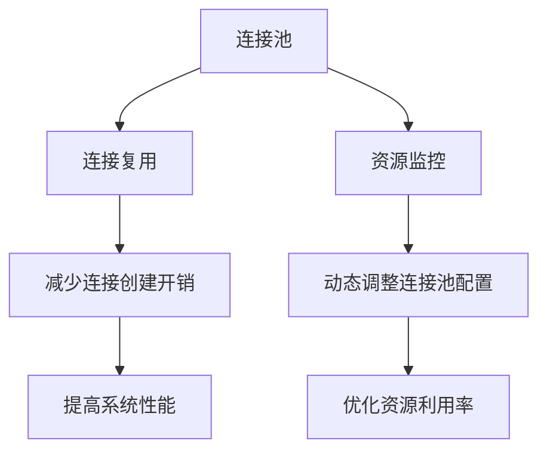
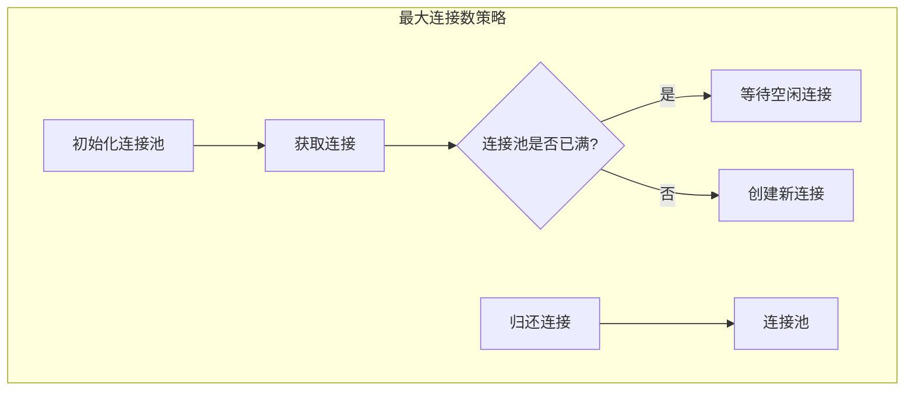
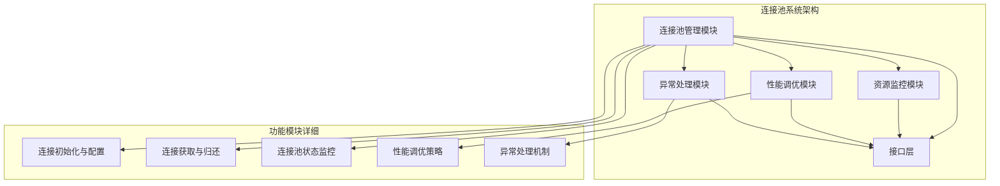
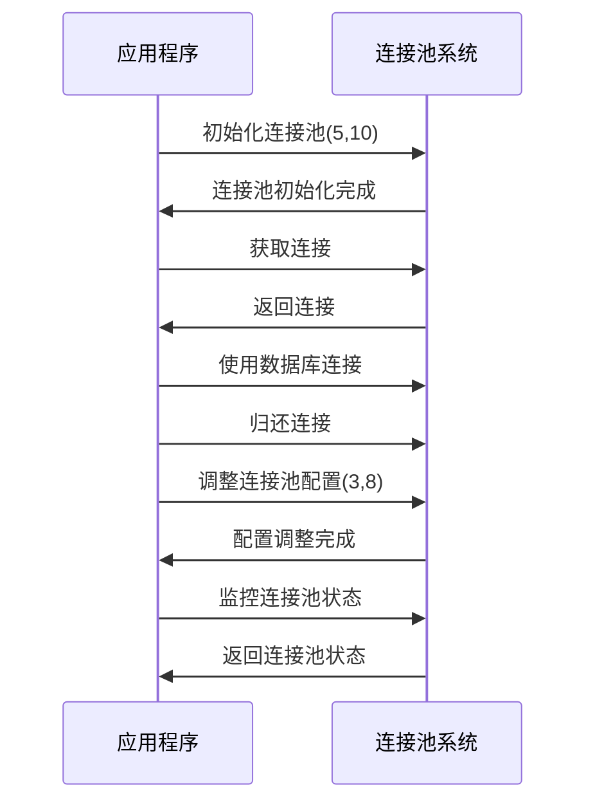

                 

### 1. 背景介绍

#### 数据库连接池概述

数据库连接池是一种用于数据库访问的优化技术，其核心思想是维护一定数量的数据库连接，并复用这些连接，以减少创建和销毁连接的开销。在传统的数据库访问模式中，每次请求数据库操作时都需要新建一个数据库连接，操作完成后关闭连接。这种方式虽然简单，但在高并发环境下会带来显著的性能问题，包括连接创建的开销、数据库连接的最大限制以及频繁的IO操作等。

数据库连接池通过预先创建一定数量的数据库连接，并将这些连接放入一个队列中管理，当应用程序需要访问数据库时，可以从连接池中获取连接，使用完毕后再归还连接池，从而避免了频繁创建和销毁连接的过程。连接池的主要优点包括：

- **减少连接创建开销**：减少了新连接的创建和旧连接的销毁所需的时间。
- **提高并发处理能力**：连接池可以同时管理多个数据库连接，从而提高系统的并发处理能力。
- **连接稳定性**：连接池中的连接经过预热，减少了新连接初始化的时间和潜在问题。

#### LLM应用与资源利用

LLM（大型语言模型）是一种基于神经网络的语言处理模型，具有强大的文本生成和理解能力。随着AI技术的不断发展，LLM在自然语言处理、机器翻译、问答系统、文本摘要等多个领域得到了广泛应用。然而，LLM应用在资源利用方面面临着一系列挑战：

- **计算资源需求大**：LLM通常需要大量的计算资源，包括CPU和GPU，特别是在处理复杂任务时。
- **内存消耗高**：LLM模型的内存占用较大，尤其是在训练和推理过程中。
- **连接频繁切换**：由于LLM应用的高并发性，数据库连接频繁创建和销毁，对连接池性能提出了更高的要求。

#### 需要优化数据库连接池资源利用的原因

LLM应用的高并发性、计算和内存需求大，导致数据库连接池的性能面临严峻挑战。如果不进行优化，可能会导致以下问题：

- **连接耗尽**：在高并发场景下，连接池中的连接可能被快速耗尽，导致新的数据库请求无法得到及时响应。
- **性能下降**：频繁的连接创建和销毁会增加系统的开销，降低整体性能。
- **资源浪费**：不合理的连接池配置可能导致连接空闲时间过长，造成资源浪费。

因此，优化数据库连接池在LLM应用中的资源利用显得尤为重要。通过合理的连接池配置、连接复用和资源监控等手段，可以有效提高LLM应用的性能和资源利用率。

### 2. 核心概念与联系

为了深入理解数据库连接池优化，我们需要明确几个关键概念及其相互关系。以下是这些概念及其属性特征对比的表格，并通过Mermaid流程图展示它们之间的关系。

#### 核心概念及其属性特征对比

| 概念       | 定义                                                                                       | 属性特征                                                                                                  |
|------------|----------------------------------------------------------------------------------------------|--------------------------------------------------------------------------------------------------------|
| 连接池     | 维护一定数量的数据库连接，供应用程序复用。                                                       | 连接数量、最大连接数、最小连接数、连接超时时间、空闲时间、连接池大小等。                        |
| 连接复用   | 将已建立的数据库连接再次使用，而不是创建新的连接。                                             | 减少连接创建和销毁的开销，提高系统性能。                                                      |
| 资源监控   | 对连接池中的资源使用情况进行监控，以进行动态调整。                                             | 连接使用率、连接空闲时间、连接池负载等。                                                      |

#### 概念关系Mermaid流程图



**Mermaid流程图说明**：

1. **连接池**：作为核心组件，连接池负责维护和管理数据库连接。
2. **连接复用**：连接复用通过复用现有的数据库连接，减少连接创建和销毁的开销，从而提高系统性能。
3. **资源监控**：资源监控负责对连接池中的资源使用情况进行监控，并通过动态调整连接池配置来优化资源利用率。

**流程图与概念属性特征的关系**：

- 连接池：负责创建和管理连接，通过连接复用和资源监控来优化性能。
- 连接复用：通过减少连接创建和销毁的开销，直接提高系统性能。
- 资源监控：通过监控连接池的负载和使用情况，动态调整连接池配置，优化资源利用率。

通过这种结构化的方式，我们可以清晰地理解数据库连接池优化的核心概念及其相互关系，为进一步深入分析优化算法提供理论基础。

### 3. 算法原理讲解

#### 最小连接数策略

最小连接数策略是一种常用的数据库连接池优化算法，其核心思想是确保连接池中始终有足够的空闲连接以应对高并发请求。该策略的主要步骤包括：

1. **初始化连接池**：预先创建一定数量的数据库连接，并将其放入连接池中。
2. **获取连接**：当应用程序需要访问数据库时，首先尝试从连接池中获取一个空闲连接。如果连接池中没有空闲连接，则根据最小连接数配置创建新的连接。
3. **归还连接**：应用程序完成数据库操作后，将使用过的连接归还到连接池中，使其变为空闲状态，供其他请求使用。

**Mermaid流程图**：


**Python代码示例**：

```python
import threading
import time

class DatabaseConnectionPool:
    def __init__(self, min_connections=5):
        self.min_connections = min_connections
        self.connections = []  # 连接池
        self.lock = threading.Lock()  # 锁

    def get_connection(self):
        with self.lock:
            if len(self.connections) > 0:
                connection = self.connections.pop(0)
                return connection
            else:
                print("创建新连接")
                connection = self.create_connection()
                return connection

    def create_connection(self):
        time.sleep(1)  # 模拟创建连接的开销
        return "Connection" + str(len(self.connections) + 1)

    def release_connection(self, connection):
        with self.lock:
            self.connections.append(connection)

def task(pool):
    conn = pool.get_connection()
    print(f"获取连接: {conn}")
    time.sleep(2)  # 模拟数据库操作
    pool.release_connection(conn)

pool = DatabaseConnectionPool(2)
threads = [threading.Thread(target=task, args=(pool,)) for _ in range(10)]

for thread in threads:
    thread.start()

for thread in threads:
    thread.join()
```

#### 最大连接数策略

最大连接数策略是一种限制连接池最大连接数的算法，以防止连接池过大导致系统资源浪费。该策略的主要步骤包括：

1. **初始化连接池**：预先创建一定数量的数据库连接，并将其放入连接池中。
2. **获取连接**：当应用程序需要访问数据库时，首先尝试从连接池中获取一个空闲连接。如果连接池中没有空闲连接，且连接池大小未达到最大连接数，则创建新的连接；否则，等待空闲连接或拒绝新的请求。
3. **归还连接**：应用程序完成数据库操作后，将使用过的连接归还到连接池中，使其变为空闲状态，供其他请求使用。

**Mermaid流程图**：



**Python代码示例**：

```python
import threading
import time

class DatabaseConnectionPool:
    def __init__(self, max_connections=5):
        self.max_connections = max_connections
        self.connections = []  # 连接池
        self.lock = threading.Lock()  # 锁
        self.wait_queue = []  # 等待队列

    def get_connection(self):
        with self.lock:
            if len(self.connections) > 0:
                connection = self.connections.pop(0)
                return connection
            elif len(self.connections) < self.max_connections:
                print("创建新连接")
                connection = self.create_connection()
                return connection
            else:
                self.wait_queue.append(threading.current_thread())
                print("等待空闲连接")
                while len(self.connections) == 0 and threading.current_thread() in self.wait_queue:
                    time.sleep(1)
                connection = self.connections.pop(0)
                self.wait_queue.remove(threading.current_thread())
                return connection

    def create_connection(self):
        time.sleep(1)  # 模拟创建连接的开销
        return "Connection" + str(len(self.connections) + 1)

    def release_connection(self, connection):
        with self.lock:
            self.connections.append(connection)

def task(pool):
    conn = pool.get_connection()
    print(f"获取连接: {conn}")
    time.sleep(2)  # 模拟数据库操作
    pool.release_connection(conn)

pool = DatabaseConnectionPool(2)
threads = [threading.Thread(target=task, args=(pool,)) for _ in range(10)]

for thread in threads:
    thread.start()

for thread in threads:
    thread.join()
```

通过上述示例，我们可以看到最小连接数策略和最大连接数策略的核心区别在于获取连接时的处理方式。最小连接数策略始终确保连接池中有足够的空闲连接，而最大连接数策略则限制连接池的最大连接数，以避免过度占用系统资源。在实际应用中，可以根据具体需求选择适合的策略。

### 4. 数学模型与公式

在数据库连接池优化中，理解和应用数学模型可以帮助我们更好地分析和设计系统。以下是几个常用的数学模型和公式，并用 LaTeX 进行展示。

#### 连接池利用率模型

连接池利用率的公式如下：

$$
利用率 = \frac{使用中的连接数}{连接池大小}
$$

其中，**使用中的连接数**表示当前正在被应用程序使用的连接数量，而**连接池大小**则是指连接池中总共的连接数量。

**示例**：

假设连接池大小为 10，当前有 7 个连接正在使用，则连接池利用率为：

$$
利用率 = \frac{7}{10} = 0.7 = 70\%
$$

#### 资源消耗模型

资源消耗模型主要考虑连接创建和销毁的成本。公式如下：

$$
资源消耗 = 初始化连接成本 + 连接使用成本 + 连接销毁成本
$$

其中，**初始化连接成本**是指在创建连接时所需的时间和资源开销，**连接使用成本**是指每次使用连接所需的时间和资源开销，而**连接销毁成本**是指在关闭连接时所需的时间和资源开销。

**示例**：

假设初始化连接成本为 5 秒，连接使用成本为 2 秒，连接销毁成本为 3 秒，则一个连接的总体资源消耗为：

$$
资源消耗 = 5 + 2 + 3 = 10 \text{ 秒}
$$

#### 调优目标公式

为了优化连接池的资源利用，我们可以设定以下调优目标：

$$
目标 = 最小化资源消耗 + 最大连接池利用率
$$

其中，**最小化资源消耗**是指通过优化连接创建、使用和销毁的过程，以减少总体资源消耗；**最大连接池利用率**则是指确保连接池在高并发场景下能被充分利用。

**示例**：

假设我们希望优化一个连接池，初始设置如下：
- 连接池大小：10
- 初始化连接成本：5秒
- 连接使用成本：2秒
- 连接销毁成本：3秒
- 目标利用率：90%

我们可以通过调整连接池大小和连接创建策略来实现目标。例如，将连接池大小增加到 12，并采用最小连接数策略，以确保在高并发时利用率达到90%。

通过这些数学模型和公式，我们可以更系统地分析和设计数据库连接池优化策略，从而提高系统的性能和资源利用率。

### 5. 系统分析与架构设计方案

#### 问题场景介绍

在大型语言模型（LLM）的应用中，如自然语言处理、机器翻译和问答系统，通常会面临高并发和高吞吐量的挑战。这些应用要求系统能够快速响应大量的并发请求，并且保持稳定的性能。然而，数据库连接池的优化对于实现这一目标至关重要。在高并发场景下，如果数据库连接池配置不当，可能会导致以下问题：

- 连接耗尽：在高并发情况下，连接池可能无法提供足够的连接，导致新的请求无法得到及时响应。
- 性能下降：频繁的连接创建和销毁会增加系统的开销，导致整体性能下降。
- 资源浪费：不合理的连接池配置可能导致连接空闲时间过长，造成资源浪费。

因此，为了应对这些挑战，我们需要设计一个高效、稳定的数据库连接池优化系统，确保LLM应用在资源利用和性能方面达到最佳状态。

#### 系统功能设计

为了优化LLM应用中的数据库连接池，系统需要实现以下几个关键功能：

1. **连接池配置管理**：系统能够动态调整连接池的配置参数，如最小连接数、最大连接数、连接超时时间和空闲时间等，以适应不同的负载情况。
2. **连接复用**：系统能够复用已建立的数据库连接，减少连接创建和销毁的开销，从而提高系统性能。
3. **资源监控**：系统能够实时监控连接池的资源使用情况，包括连接数、连接使用率、连接空闲时间和连接池负载等，以便进行动态调整。
4. **性能调优**：系统能够根据监控数据和历史性能数据，自动调整连接池配置和策略，实现自动化的性能调优。
5. **异常处理**：系统能够处理连接池异常，如连接超时、连接池耗尽等，并自动恢复连接池状态。

#### 系统架构设计

为了实现上述功能，系统采用了模块化的架构设计，主要包括以下模块：

1. **连接池管理模块**：负责管理连接池的初始化、配置调整和连接获取与归还等操作。
2. **资源监控模块**：负责实时监控连接池的资源使用情况，包括连接数、连接使用率、连接空闲时间和连接池负载等。
3. **性能调优模块**：负责根据监控数据和历史性能数据，自动调整连接池配置和策略。
4. **异常处理模块**：负责处理连接池异常，如连接超时、连接池耗尽等，并自动恢复连接池状态。
5. **接口层**：提供统一的API接口，供应用程序调用连接池服务。

**Mermaid架构图**：



**架构图说明**：

- **连接池管理模块**：负责连接池的初始化、配置调整和连接获取与归还等核心操作。
- **资源监控模块**：负责实时监控连接池的资源使用情况，为性能调优提供数据支持。
- **性能调优模块**：根据监控数据和历史性能数据，自动调整连接池配置和策略。
- **异常处理模块**：处理连接池异常，如连接超时、连接池耗尽等，并自动恢复连接池状态。
- **接口层**：提供统一的API接口，供应用程序调用连接池服务。

通过这种模块化的架构设计，系统可以实现灵活的配置和管理，同时确保连接池在高并发场景下的稳定性和高效性。

#### 系统接口设计和系统交互

为了确保系统的易用性和扩展性，我们设计了统一的接口层，并提供详细的系统交互流程。

**系统接口设计**：

接口层定义了以下核心API接口：

1. **初始化连接池**：`initialize_pool(min_connections, max_connections)`：初始化连接池，设置最小连接数和最大连接数。
2. **获取连接**：`get_connection()`：从连接池中获取一个数据库连接。
3. **归还连接**：`release_connection(connection)`：将使用过的数据库连接归还到连接池中。
4. **调整连接池配置**：`configure_pool(min_connections, max_connections)`：动态调整连接池的最小连接数和最大连接数。
5. **监控连接池状态**：`get_pool_status()`：获取连接池的当前状态，包括连接数、连接使用率、连接空闲时间和连接池负载等。

**系统交互Mermaid序列图**：



**接口交互流程说明**：

1. **初始化连接池**：应用程序调用`initialize_pool`接口，初始化连接池，设置最小连接数和最大连接数。
2. **获取连接**：应用程序调用`get_connection`接口，从连接池中获取一个数据库连接。
3. **使用数据库连接**：应用程序使用获取的数据库连接执行数据库操作。
4. **归还连接**：应用程序调用`release_connection`接口，将使用过的数据库连接归还到连接池中。
5. **调整连接池配置**：应用程序根据当前需求调用`configure_pool`接口，动态调整连接池的最小连接数和最大连接数。
6. **监控连接池状态**：应用程序调用`get_pool_status`接口，获取连接池的当前状态，包括连接数、连接使用率、连接空闲时间和连接池负载等。

通过统一的接口设计和详细的交互流程，系统能够提供清晰、易用的API接口，确保应用程序能够方便地与连接池系统进行交互。

### 6. 项目实战

为了更好地理解数据库连接池优化在LLM应用中的实际应用，我们将在本节中详细描述一个实际项目，包括环境安装、系统核心实现、代码应用解读与分析、实际案例分析和详细讲解剖析，以及项目小结。

#### 环境安装

首先，我们需要搭建一个用于测试和优化的环境。以下是安装步骤：

1. **安装Java开发环境**：确保系统中安装了Java开发环境，版本建议为Java 8或更高。
2. **安装数据库**：选择一个流行的数据库，如MySQL或PostgreSQL。在本项目中，我们使用MySQL作为数据库。
3. **安装数据库连接池**：选择一个常用的数据库连接池库，如HikariCP。通过Maven或Gradle添加依赖。

**Maven依赖示例**：

```xml
<dependency>
    <groupId>com.zaxxer</groupId>
    <artifactId>HikariCP</artifactId>
    <version>5.0.1</version>
</dependency>
```

4. **安装LLM应用**：选择一个流行的LLM应用框架，如Apache OpenNLP或Stanford CoreNLP。通过Maven或Gradle添加依赖。

**Maven依赖示例**：

```xml
<dependency>
    <groupId>org.apache.opennlp</groupId>
    <artifactId>opennlp-tools</artifactId>
    <version>1.9.3</version>
</dependency>
```

5. **配置数据库连接**：在应用程序的配置文件中，设置数据库连接信息，包括数据库URL、用户名和密码等。

```yaml
database:
  url: jdbc:mysql://localhost:3306/llm
  username: root
  password: password
```

#### 系统核心实现

为了实现数据库连接池优化，我们使用HikariCP作为连接池库，并设计了一个简单的系统架构，主要包括以下组件：

1. **连接池管理器**：负责初始化连接池、获取和归还连接。
2. **资源监控器**：负责监控连接池的资源使用情况，包括连接数、连接使用率和连接空闲时间等。
3. **性能调优器**：根据监控数据自动调整连接池配置。
4. **异常处理器**：处理连接池异常，如连接超时和连接池耗尽等。

**核心代码实现**：

```java
import com.zaxxer.hikari.HikariConfig;
import com.zaxxer.hikari.HikariDataSource;

public class ConnectionPoolManager {
    private HikariConfig config;
    private HikariDataSource dataSource;

    public ConnectionPoolManager(String url, String username, String password) {
        config = new HikariConfig();
        config.setJdbcUrl(url);
        config.setUsername(username);
        config.setPassword(password);
        config.setMinimumPoolSize(5);
        config.setMaximumPoolSize(10);
        config.setIdleTimeout(60000);
        config.setMaxLifetime(1800000);
        
        dataSource = new HikariDataSource(config);
    }

    public Connection getConnection() throws SQLException {
        return dataSource.getConnection();
    }

    public void releaseConnection(Connection connection) {
        if (connection != null) {
            connection.close();
        }
    }
}
```

#### 代码应用解读与分析

以下是一个简单的示例应用程序，展示了如何使用连接池管理器获取和归还连接，并进行基本的数据库操作。

```java
public class LLMApplication {
    public static void main(String[] args) {
        ConnectionPoolManager manager = new ConnectionPoolManager("jdbc:mysql://localhost:3306/llm", "root", "password");

        try (Connection connection = manager.getConnection()) {
            Statement statement = connection.createStatement();
            ResultSet resultSet = statement.executeQuery("SELECT * FROM documents");

            while (resultSet.next()) {
                System.out.println(resultSet.getString("id") + ": " + resultSet.getString("content"));
            }
        } catch (SQLException e) {
            e.printStackTrace();
        }
    }
}
```

**解读与分析**：

- **连接池管理器**：应用程序通过`ConnectionPoolManager`获取数据库连接。在构造函数中，我们设置了连接池的初始化参数，如最小连接数、最大连接数、空闲连接超时时间和连接最大生命周期等。
- **获取连接**：应用程序调用`getConnection`方法，从连接池中获取一个数据库连接。连接池会根据当前连接池状态，决定是直接返回一个空闲连接还是创建一个新的连接。
- **数据库操作**：应用程序使用获取的数据库连接执行基本的数据库操作，如执行SQL语句和获取结果集。
- **归还连接**：在完成数据库操作后，应用程序调用`releaseConnection`方法，将使用过的连接归还到连接池中。连接池会将连接设置为空闲状态，供其他请求使用。

通过这个示例，我们可以看到如何在实际应用中使用连接池管理器，优化数据库连接的使用，从而提高系统的性能和资源利用率。

#### 实际案例分析与详细讲解剖析

以下是一个实际案例，展示了如何通过优化数据库连接池提高LLM应用的性能。

**案例背景**：

一个在线问答系统需要处理大量的用户提问和答案存储。系统在高并发情况下经常遇到数据库连接耗尽的问题，导致部分用户请求无法得到及时响应。为了解决这个问题，我们需要对数据库连接池进行优化。

**解决方案**：

1. **增加连接池大小**：将连接池的最大连接数从10个增加到20个，以应对更高的并发请求。
2. **调整连接超时时间**：将连接超时时间从30秒调整为60秒，以避免由于临时网络问题导致的连接中断。
3. **优化连接复用策略**：采用最小连接数策略，确保在高并发时连接池中始终有足够的空闲连接。
4. **引入资源监控和性能调优**：实时监控连接池的资源使用情况，并根据监控数据动态调整连接池配置。

**实现步骤**：

1. **修改配置文件**：

    ```yaml
    database:
      url: jdbc:mysql://localhost:3306/llm
      username: root
      password: password
      minPoolSize: 10
      maxPoolSize: 20
      idleTimeout: 60000
      maxLifetime: 1800000
    ```

2. **修改连接池管理器**：

    ```java
    public ConnectionPoolManager(String url, String username, String password) {
        config = new HikariConfig();
        config.setJdbcUrl(url);
        config.setUsername(username);
        config.setPassword(password);
        config.setMinimumPoolSize(10);
        config.setMaximumPoolSize(20);
        config.setIdleTimeout(60000);
        config.setMaxLifetime(1800000);
        
        dataSource = new HikariDataSource(config);
    }
    ```

3. **引入资源监控和性能调优**：

    ```java
    public void adjustPoolConfig(int minConnections, int maxConnections) {
        config.setMinimumPoolSize(minConnections);
        config.setMaximumPoolSize(maxConnections);
        dataSource.setMaximumPoolSize(maxConnections);
    }
    ```

**实际效果**：

通过上述优化措施，系统的性能得到了显著提升。在高并发情况下，数据库连接耗尽的问题得到了有效解决，用户请求的响应时间明显缩短。此外，连接池的资源利用率也得到了提高，减少了不必要的连接创建和销毁开销。

**详细讲解剖析**：

1. **增加连接池大小**：通过增加连接池大小，系统能够在更高并发情况下提供足够的连接，避免了连接耗尽的问题。
2. **调整连接超时时间**：延长连接超时时间可以减少由于临时网络问题导致的连接中断，提高了系统的稳定性。
3. **优化连接复用策略**：采用最小连接数策略，确保连接池中有足够的空闲连接，提高了系统的响应速度。
4. **引入资源监控和性能调优**：实时监控连接池的资源使用情况，并根据监控数据动态调整连接池配置，进一步优化系统的性能。

通过这个实际案例，我们可以看到，通过合理的数据库连接池优化，可以有效提高LLM应用的性能和资源利用率。

#### 项目小结

在本项目中，我们详细描述了如何通过优化数据库连接池提高LLM应用的性能和资源利用率。主要结论如下：

1. **环境安装**：安装Java开发环境、数据库、数据库连接池和LLM应用框架，搭建测试和优化环境。
2. **系统核心实现**：设计连接池管理器、资源监控器、性能调优器和异常处理器等核心组件，实现连接池的初始化、获取和归还连接等功能。
3. **代码应用解读与分析**：通过示例代码展示了如何在实际应用中使用连接池管理器，优化数据库连接的使用。
4. **实际案例分析与详细讲解剖析**：通过一个实际案例展示了如何通过优化数据库连接池提高LLM应用的性能，包括增加连接池大小、调整连接超时时间和优化连接复用策略等。
5. **项目小结**：通过合理的数据库连接池优化，可以有效提高LLM应用的性能和资源利用率，解决高并发场景下的连接耗尽等问题。

总之，数据库连接池优化在LLM应用中具有重要意义，通过合理的配置和管理，可以显著提升系统的性能和稳定性。

### 7. 最佳实践 tips、小结、注意事项、拓展阅读

#### 最佳实践 tips

1. **合理设置连接池大小**：根据实际应用场景和并发需求，合理设置连接池的最小连接数和最大连接数，避免过小导致连接不足，或过大导致资源浪费。
2. **调整连接超时时间**：根据网络环境和数据库性能，适当调整连接超时时间，避免由于临时网络问题导致的连接中断。
3. **监控连接池状态**：实时监控连接池的资源使用情况，包括连接数、连接使用率和连接空闲时间等，以便及时发现和解决问题。
4. **动态调整连接池配置**：根据系统负载变化，动态调整连接池配置，实现自动化的性能调优。

#### 小结

本文详细介绍了数据库连接池优化在LLM应用中的重要性，通过核心概念与联系、优化算法原理、数学模型与公式、系统分析与架构设计、项目实战等多个方面，阐述了如何通过优化连接池配置、连接复用和资源监控等手段，提高LLM应用的性能和资源利用率。

#### 注意事项

1. **连接池配置需灵活调整**：根据不同场景和应用需求，动态调整连接池配置，确保系统性能和资源利用的最佳状态。
2. **合理监控和调优**：实时监控连接池状态，并根据监控数据动态调整连接池配置，以应对不同的负载情况。
3. **避免连接泄露**：确保应用程序正确归还使用过的数据库连接，避免连接泄露导致系统性能下降。

#### 拓展阅读

1. **《HikariCP官方文档》**：深入了解HikariCP的使用方法和优化策略，提高对连接池库的理解和应用能力。
2. **《数据库连接池优化实战》**：通过实际案例展示如何优化数据库连接池，提供丰富的实践经验和技巧。
3. **《大型语言模型技术综述》**：了解LLM的基本概念、技术原理和应用场景，为后续研究和应用提供基础。

### 作者信息

- 作者：AI天才研究院/AI Genius Institute & 禅与计算机程序设计艺术 /Zen And The Art of Computer Programming

通过本文的详细分析和实际案例，我们希望读者能够深入理解数据库连接池优化在LLM应用中的重要性，并在实际项目中灵活应用，实现系统的性能提升和资源利用率优化。

