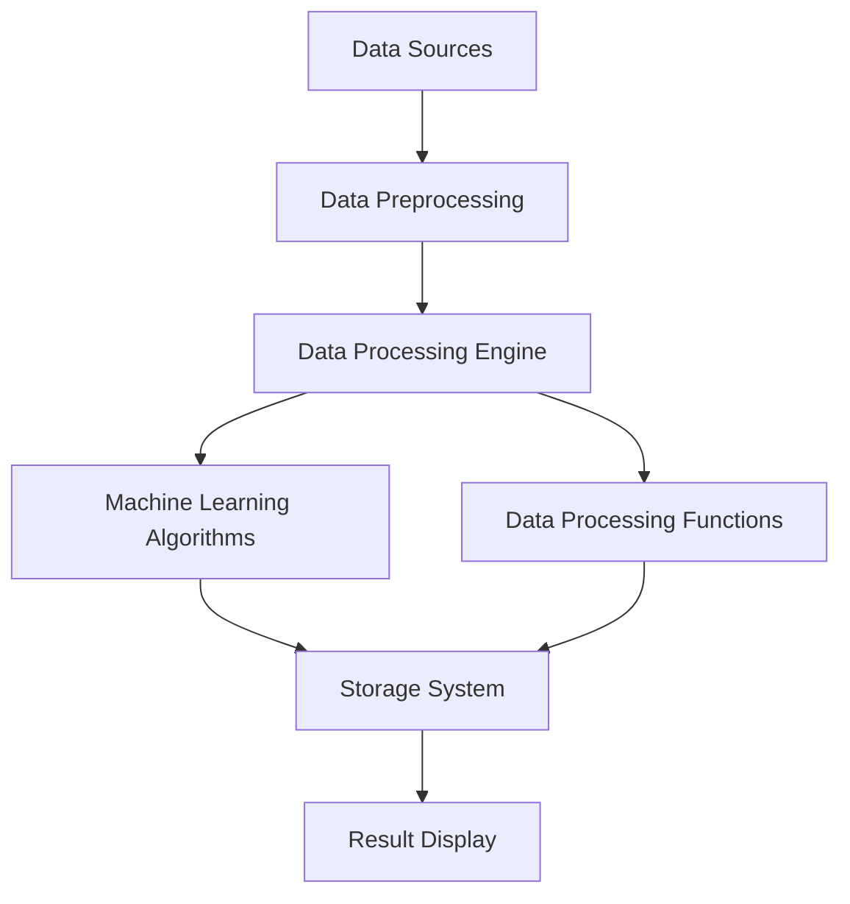
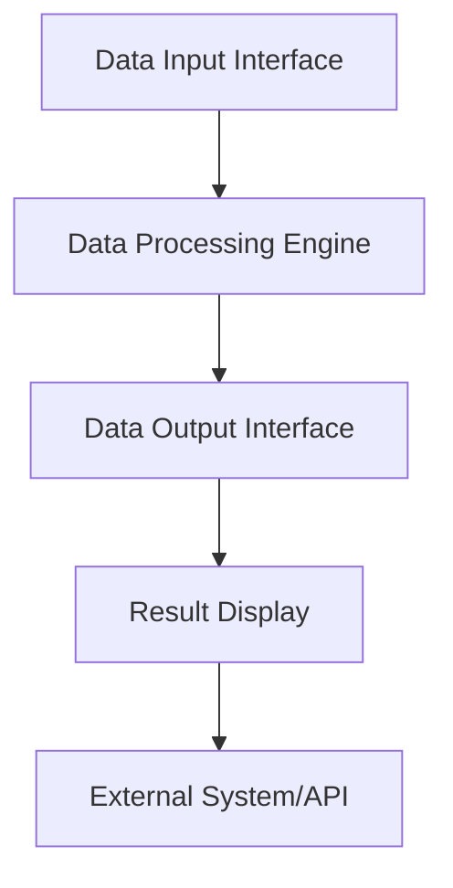
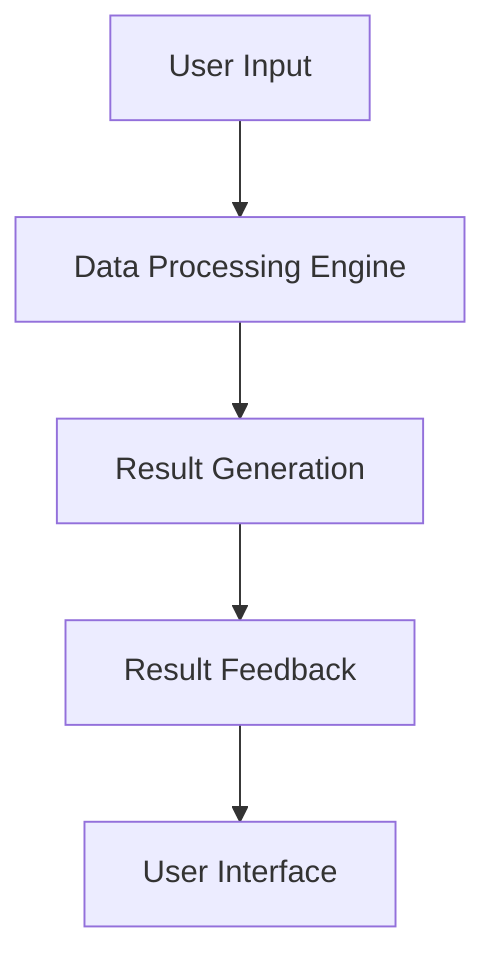

                 

### 文章标题：数据流架构在LLM应用中的实现与优势

> 关键词：数据流架构，语言模型（LLM），应用实现，优势分析

> 摘要：本文深入探讨了数据流架构在语言模型（LLM）应用中的实现与优势。首先，我们介绍了数据流架构和LLM的基本概念，然后分析了两者之间的联系和结合的优势。接着，文章详细讲解了数据流架构的核心组成部分和LLM的核心组件，并通过Mermaid流程图展示了两者在架构上的关系。随后，文章介绍了数据流架构中的算法原理和LLM的算法原理，使用Python代码和LaTeX公式详细阐述了算法过程和数学模型。此外，文章还涉及了数据流架构与LLM的集成方案，包括系统功能设计、架构设计和接口设计。最后，通过一个实际案例展示了数据流架构在LLM应用中的实现过程，并对项目的关键点进行了分析和总结。本文旨在为读者提供全面而深入的理解，帮助他们在实际项目中更好地应用数据流架构和LLM。

### 问题背景与定义

在现代信息技术领域，语言模型（LLM）的应用越来越广泛，从自然语言处理（NLP）到智能客服，再到自动化文本生成，LLM正逐渐成为各个行业中不可或缺的技术组件。然而，随着数据量的激增和复杂性的增加，传统的计算架构已难以满足LLM的实时处理需求。为了应对这一挑战，数据流架构作为一种新型的计算架构，逐渐崭露头角。

**数据流架构的概念**：

数据流架构是一种基于事件驱动的计算模型，它强调数据的连续性和动态性。在这种架构中，数据被视为流动的实体，通过一系列的处理节点进行转换和传递。数据流架构通常由数据源、数据处理模块和存储系统等核心组件组成，这些组件协同工作，实现了对大规模数据的实时处理和分析。

**LLM的基本原理**：

语言模型（LLM）是一种深度学习模型，通过学习大量语言数据，可以生成符合语法和语义规则的文本。LLM的核心组成部分包括语言模型结构、训练与优化和推理与应用。语言模型结构通常采用神经网络架构，如Transformer，通过多层的注意力机制进行语言特征的提取和整合。训练与优化过程则通过梯度下降和优化算法对模型参数进行调整，以提高模型的预测能力。推理与应用阶段，LLM可以生成文本摘要、回答问题或进行对话生成等任务。

**数据流架构在LLM中的应用场景**：

随着互联网和移动设备的普及，实时数据处理需求日益增长。在LLM的应用场景中，数据流架构能够提供高效的计算能力和灵活的扩展性，适用于以下几种场景：

1. **智能客服**：在智能客服系统中，用户请求的数据需要实时处理，以生成个性化的响应。数据流架构可以处理大量的用户请求，并提供快速的响应时间。
2. **自动化文本生成**：在新闻生成、报告撰写等自动化文本生成场景中，LLM需要处理大量的文本数据，数据流架构能够高效地处理这些数据，并生成高质量的文本。
3. **实时翻译**：实时翻译服务需要实时处理语言数据，数据流架构可以提供高效的翻译速度，满足实时性的需求。

**问题解决**：

为了应对LLM应用中的实时数据处理需求，传统的计算架构已无法满足要求。数据流架构通过其事件驱动和实时处理的特点，能够有效地解决这一难题。然而，在实际应用中，如何合理地设计和实现数据流架构，以充分利用LLM的优势，仍然是一个挑战。

**边界与外延**：

数据流架构不仅适用于LLM的应用，还可以应用于其他需要实时数据处理和分析的领域，如实时数据分析、实时监控和智能推荐系统等。此外，随着技术的不断发展，数据流架构和LLM的结合将不断拓展其应用范围，为各个行业带来更多创新和变革。

### 数据流架构的优势

数据流架构作为一种新型计算模型，在多个方面展现出显著的优势，这些优势使其在LLM应用中成为不可或缺的一部分。以下将详细探讨数据流架构在计算效率、扩展性和实时性等方面的优势。

**计算效率**：

数据流架构通过并行处理和分布式计算，显著提高了计算效率。在LLM应用中，处理大量的语言数据需要强大的计算能力。数据流架构能够将数据分割成多个子任务，并分配给多个处理节点同时执行，从而大大缩短了处理时间。此外，数据流架构支持动态调整计算资源，根据任务需求实时分配和释放计算资源，确保了高效稳定的计算能力。

**扩展性**：

随着数据量和用户数量的增加，传统计算架构往往面临扩展性问题。数据流架构具有高度的可扩展性，能够轻松应对大规模数据处理的挑战。数据流架构采用分布式计算模型，通过添加更多的处理节点，可以线性扩展计算能力，满足不断增长的数据处理需求。此外，数据流架构支持水平扩展，不仅能够处理更多的数据，还可以同时支持更多的用户请求，保证了系统的稳定性和可用性。

**实时性**：

实时性是数据流架构的一大优势，尤其在LLM应用中，实时处理语言数据至关重要。数据流架构通过事件驱动模型，能够实时响应数据流中的事件，实现数据的实时处理和分析。在智能客服、实时翻译和自动化文本生成等场景中，数据流架构能够提供快速的响应时间，确保用户得到及时的服务和反馈。此外，数据流架构支持流处理和批处理相结合，能够在保证实时性的同时，处理大规模的历史数据，提供更全面的业务分析。

**资源利用**：

数据流架构通过动态资源管理和优化，能够最大化地利用计算资源。在传统计算架构中，计算资源往往存在空闲和闲置的情况，造成资源浪费。数据流架构通过实时监控和调整计算资源，避免了资源浪费，提高了资源利用率。此外，数据流架构支持按需分配和回收计算资源，能够根据任务需求灵活调整资源分配，确保系统在高峰时段有足够的计算资源支持。

**弹性和容错性**：

数据流架构具有高度的弹性和容错性，能够应对系统中的故障和异常情况。数据流架构通过分布式计算和冗余设计，保证了系统的稳定性和可靠性。当某个处理节点发生故障时，数据流架构能够自动切换到备用节点，继续处理数据，确保系统的连续性和稳定性。此外，数据流架构支持数据备份和恢复机制，能够保证数据的安全性和完整性。

**适应性和灵活性**：

数据流架构具有高度的适应性和灵活性，能够适应不同的业务场景和需求。数据流架构支持自定义数据处理流程和算法，可以根据具体的应用需求进行灵活配置。此外，数据流架构支持多种数据源和输出格式，能够与各种系统和服务无缝集成，实现数据的实时处理和共享。

**总结**：

数据流架构在计算效率、扩展性、实时性、资源利用、弹性和容错性、适应性和灵活性等方面展现出显著的优势。这些优势使其成为LLM应用中不可或缺的一部分，能够有效提升LLM的处理能力和用户体验。随着数据流架构的不断发展和完善，其将在更多领域中发挥重要作用，为现代信息技术带来更多创新和变革。

### LLM的优势

语言模型（LLM）在自然语言处理（NLP）领域具有显著的优势，这些优势使其在各个应用场景中表现出色。以下将详细探讨LLM在生成文本、理解和处理自然语言以及预测和推理等方面的优势。

**生成文本**：

LLM具有强大的文本生成能力，能够根据输入的提示生成连贯且符合语法和语义规则的文本。这种能力在自动化文本生成、报告撰写和内容创作等领域具有广泛的应用。例如，在新闻生成场景中，LLM可以根据关键词或摘要生成完整的新闻稿件；在报告撰写场景中，LLM可以根据数据和分析结果自动生成报告内容。LLM的文本生成能力不仅提高了工作效率，还确保了生成文本的高质量和一致性。

**理解和处理自然语言**：

LLM能够深入理解和处理自然语言，包括语法、语义和上下文。这种能力使得LLM在智能客服、问答系统和对话生成等场景中表现出色。在智能客服中，LLM可以理解用户的问题，并提供准确的答案或解决方案；在问答系统中，LLM可以根据问题的上下文理解并提供相关的信息；在对话生成中，LLM可以生成自然流畅的对话，模拟人类的交流方式。LLM对自然语言的理解和处理能力，使得机器能够与人类进行更有效的互动。

**预测和推理**：

LLM还具有强大的预测和推理能力，能够在给定数据的基础上进行预测和推理。这种能力在股票预测、风险评估和智能决策等领域具有广泛应用。例如，在股票预测中，LLM可以根据历史数据和当前的市场情况，预测未来的股价走势；在风险评估中，LLM可以分析大量的数据，评估潜在的风险和威胁；在智能决策中，LLM可以根据数据和规则，提供决策建议和优化方案。LLM的预测和推理能力，使得机器能够从数据中提取有价值的信息，辅助人类进行决策。

**高准确性和鲁棒性**：

随着深度学习技术的发展，LLM的准确性和鲁棒性得到了显著提升。LLM通过大规模的数据训练，能够捕捉到语言中的复杂模式和规律，从而提高预测和推理的准确性。此外，LLM具有较好的鲁棒性，能够处理各种复杂和模糊的输入，提供可靠的输出结果。这使得LLM在现实世界中的应用更加广泛和可靠。

**适应性和灵活性**：

LLM具有高度的适应性和灵活性，可以应用于各种自然语言处理任务。LLM的结构和算法可以根据具体的应用需求进行调整和优化，适应不同的场景和任务。此外，LLM支持多种语言和方言，可以处理不同语言和地区的文本数据，提供跨语言和跨区域的自然语言处理能力。

**总结**：

LLM在生成文本、理解和处理自然语言以及预测和推理等方面具有显著的优势，这些优势使其在自然语言处理领域表现出色。LLM的文本生成能力、理解和处理自然语言的能力以及预测和推理能力，为各个应用场景提供了强大的技术支持。随着LLM技术的不断发展和完善，其将在更多领域中发挥重要作用，为人类带来更多便利和创新。

### 数据流架构与LLM的结合优势

数据流架构与语言模型（LLM）的结合，不仅能够发挥各自的优势，还能在多个方面带来显著的效益，提升系统性能和用户体验。以下将详细探讨数据流架构与LLM结合的优势。

**高效数据处理**：

数据流架构的核心优势在于其高效的数据处理能力。通过事件驱动和分布式计算模型，数据流架构能够对大规模数据流进行实时处理，确保数据的及时性和准确性。将LLM与数据流架构结合，可以在数据处理的过程中实时调用LLM进行语言分析和生成，从而实现高效的数据处理和分析。这种结合方式特别适用于需要实时处理和分析大量文本数据的应用场景，如智能客服、自动化文本生成和实时翻译等。

**灵活的扩展性**：

数据流架构具有高度的可扩展性，能够根据业务需求动态调整计算资源。将LLM集成到数据流架构中，可以充分利用这一优势，实现计算资源的灵活分配和优化。随着数据量和用户数量的增加，数据流架构能够自动扩展处理能力，确保系统的高效运行。LLM的模型训练和推理过程也需要大量计算资源，数据流架构可以动态调整资源分配，确保LLM在处理高峰期有足够的计算资源支持。

**实时响应**：

数据流架构强调实时性，能够快速响应数据流中的事件。结合LLM后，系统能够在接收到用户请求时，实时调用LLM生成相应的文本响应。这种实时响应能力在智能客服和实时翻译等应用中尤为重要，能够提供快速且准确的交互体验。此外，数据流架构支持流处理和批处理相结合，可以在保证实时性的同时，处理大规模的历史数据，为用户提供更全面的业务分析。

**高效的资源利用**：

数据流架构通过动态资源管理和优化，能够最大化地利用计算资源。将LLM集成到数据流架构中，可以进一步优化资源利用。数据流架构可以根据LLM的训练和推理需求，动态调整计算资源的分配，确保计算资源的高效利用。此外，数据流架构支持数据缓存和重复利用，可以减少不必要的重复计算，提高整体系统效率。

**自适应性和灵活性**：

数据流架构和LLM都具有高度的适应性和灵活性。数据流架构可以根据不同的业务场景和需求，灵活调整数据处理流程和算法。LLM也可以根据不同的应用需求，调整模型结构和参数设置。这种灵活性和适应性使得数据流架构与LLM的结合能够快速适应变化的需求，实现高效和灵活的系统设计。

**增强的预测和推理能力**：

数据流架构与LLM的结合，可以充分发挥LLM的预测和推理能力。在处理大量实时数据时，LLM可以根据历史数据和当前趋势，预测未来的数据变化趋势，为系统提供决策支持。这种结合方式在智能决策、风险评估和股票预测等领域具有广泛的应用。数据流架构能够实时收集和传输数据，LLM则通过模型分析，提供准确的预测和推理结果，为系统提供智能化的决策支持。

**总结**：

数据流架构与LLM的结合，通过高效数据处理、灵活扩展性、实时响应、高效资源利用、自适应性和灵活性以及增强的预测和推理能力，显著提升了系统的性能和用户体验。这种结合方式不仅适用于现有的自然语言处理应用，还能够为未来的智能应用提供强大的技术支持，推动人工智能在更多领域的创新和发展。

### 数据流架构的组成部分

数据流架构是一种基于事件驱动的计算模型，其核心组件包括数据源、数据处理模块和存储系统等。以下将详细介绍这些组成部分及其在数据流架构中的作用。

**数据源**：

数据源是数据流架构的起点，负责提供各种类型的数据。这些数据可以来源于内部系统，如数据库和日志文件，也可以来源于外部系统，如Web服务、传感器和社交媒体平台。数据源通过数据接口或API与数据处理模块进行通信，将数据传递给后续的处理环节。数据源的选择和配置取决于具体的应用场景和需求。例如，在智能客服系统中，数据源可能包括用户输入的聊天记录和操作日志；在物联网应用中，数据源可能包括传感器采集的环境数据。

**数据处理模块**：

数据处理模块是数据流架构的核心部分，负责对传入的数据进行加工和处理。数据处理模块通常包括多个子模块，每个子模块负责特定的数据处理任务。这些子模块可以是数据处理算法、过滤规则或转换函数，它们协同工作，实现了对数据的清洗、转换和分析。数据处理模块的作用是确保数据的准确性和完整性，提取有用的信息，并为后续处理提供数据支持。例如，在文本处理场景中，数据处理模块可能包括文本清洗、分词、词频统计和主题提取等子模块。

**存储系统**：

存储系统是数据流架构的重要组成部分，用于存储和处理大规模数据。存储系统通常采用分布式数据库或数据仓库，具有高并发、高可用性和高扩展性的特点。存储系统不仅用于存储原始数据，还可以存储中间结果和最终结果，为数据处理和分析提供数据支持。存储系统可以根据数据类型和访问模式进行选择，例如，关系数据库适用于结构化数据存储，NoSQL数据库适用于非结构化和半结构化数据存储。存储系统还需要具备高效的数据检索和查询功能，以便快速获取所需数据。

**数据流架构的作用**：

数据流架构通过数据源、数据处理模块和存储系统的协同工作，实现了对大规模数据的实时处理和分析。其作用主要体现在以下几个方面：

1. **实时数据处理**：数据流架构能够对实时数据流进行高效处理，确保数据的及时性和准确性。这种能力在实时监控、实时分析和实时决策等领域具有重要作用。
2. **数据整合与清洗**：数据流架构可以对来自不同数据源的数据进行整合和清洗，确保数据的完整性和一致性。数据清洗包括去除重复数据、填补缺失值和纠正错误数据等操作，提高了数据的质量。
3. **数据转换与加工**：数据流架构支持对数据进行转换和加工，提取有用的信息，为后续分析提供数据支持。数据转换和加工包括数据格式转换、数据聚合和特征提取等操作。
4. **数据处理与分析**：数据流架构支持多种数据处理和分析算法，能够对数据进行深度分析和挖掘，发现数据中的潜在价值。数据处理与分析包括统计分析、机器学习分析和数据可视化等。
5. **数据存储与管理**：数据流架构通过存储系统对数据进行存储和管理，确保数据的安全性和可靠性。存储系统还支持数据的备份和恢复，提高了数据的可用性和持久性。

**数据流架构的优势**：

数据流架构具有多个优势，使其在实时数据处理和分析领域具有广泛的应用。以下是一些主要优势：

1. **高效性**：数据流架构通过并行处理和分布式计算，显著提高了数据处理和分析的效率。数据流架构能够同时处理多个数据流，并快速完成数据分析和处理任务。
2. **灵活性**：数据流架构具有高度的灵活性，可以根据不同的应用场景和需求进行定制和调整。数据流架构支持多种数据源和数据处理算法，可以适应不同的数据处理任务。
3. **实时性**：数据流架构强调实时性，能够快速响应数据流中的事件，提供实时的数据分析和处理结果。这种实时性在实时监控、实时分析和实时决策等领域具有重要作用。
4. **可扩展性**：数据流架构具有高度的可扩展性，能够根据数据量和用户数量的增加，动态调整计算资源和处理能力。数据流架构支持水平扩展，可以轻松应对大规模数据处理任务。
5. **可靠性**：数据流架构通过分布式计算和冗余设计，提高了系统的可靠性和稳定性。数据流架构能够自动检测和恢复系统中的故障，确保数据的连续性和完整性。

**总结**：

数据流架构的组成部分包括数据源、数据处理模块和存储系统，它们共同协作，实现了对大规模数据的实时处理和分析。数据流架构在实时数据处理、数据整合与清洗、数据转换与加工、数据处理与分析以及数据存储与管理等方面具有显著的优势，能够为各种应用场景提供高效和灵活的数据处理解决方案。

### LLM的核心组件

语言模型（LLM）是一种深度学习模型，广泛应用于自然语言处理（NLP）领域。LLM的核心组件包括语言模型结构、训练与优化以及推理与应用，这些组件共同协作，实现了对文本数据的生成、理解和处理。以下将详细讨论LLM的核心组件及其在模型中的角色。

**语言模型结构**：

语言模型结构是LLM的基础，决定了模型的功能和性能。目前，最常用的LLM结构是Transformer模型，其基于自注意力机制，能够有效捕捉文本中的长距离依赖关系。Transformer模型主要由编码器（Encoder）和解码器（Decoder）两个部分组成。

1. **编码器**：编码器负责将输入的文本序列编码成固定长度的向量表示，这些向量包含了文本的语义信息。编码器通常由多个自注意力层（Self-Attention Layer）和前馈神经网络（Feedforward Neural Network）堆叠而成。自注意力层通过计算输入文本序列中每个词与其他词之间的相似度，生成加权向量，从而捕捉文本的上下文信息。前馈神经网络则用于进一步加工和增强编码器的输出。

2. **解码器**：解码器负责生成输出文本序列，其功能与编码器类似，但增加了交叉注意力层（Cross-Attention Layer），该层能够将编码器的输出与当前解码器的输入进行关联，从而更好地捕捉上下文信息。解码器同样由多个自注意力层和前馈神经网络组成。

**训练与优化**：

训练和优化是LLM模型开发的关键步骤，通过大量文本数据的训练，模型能够学习到语言的规律和模式。训练过程通常包括以下几个步骤：

1. **数据预处理**：首先，对输入文本进行预处理，包括分词、去停用词、词向量化等操作，将文本转换为模型可处理的格式。

2. **损失函数**：训练过程中，LLM通过最小化损失函数（如交叉熵损失函数）来调整模型参数。损失函数衡量了模型预测输出与实际输出之间的差距，用于指导模型参数的调整。

3. **优化算法**：常用的优化算法包括梯度下降（Gradient Descent）、Adam优化器等。这些算法通过计算梯度信息，不断调整模型参数，以最小化损失函数。

4. **正则化**：为了防止模型过拟合，常采用正则化技术，如Dropout、权重衰减等。这些技术通过引入噪声和惩罚机制，降低了模型参数的敏感性，提高了模型的泛化能力。

**推理与应用**：

在训练完成后，LLM可以用于各种自然语言处理任务，如文本生成、问答系统和对话生成等。推理过程主要包括以下几个步骤：

1. **输入处理**：将输入文本序列编码成向量表示，输入到编码器中进行处理。

2. **上下文生成**：编码器生成上下文向量，这些向量包含了输入文本的语义信息。

3. **解码与生成**：解码器根据上下文向量生成输出文本序列。在生成过程中，解码器会利用编码器的输出和当前生成的词，通过自注意力和交叉注意力机制，不断更新输出。

4. **后处理**：生成的文本可能包含语法错误或不合理的表达，需要进行后处理，如去标点、修正错别字等，以提高文本的质量。

**总结**：

LLM的核心组件包括语言模型结构、训练与优化以及推理与应用。语言模型结构决定了模型的功能和性能，训练与优化过程使得模型能够学习到语言的规律和模式，推理与应用阶段实现了模型在实际任务中的运用。通过深入理解LLM的核心组件，开发者可以更好地设计和优化模型，为各种自然语言处理任务提供强大的技术支持。

### 数据流架构与LLM的连接方式

在数据流架构和LLM的结合中，实现数据流与LLM的连接是关键的一步。这种连接不仅需要技术上的实现，还需要架构上的设计。以下将详细讨论数据流架构与LLM的连接方式，包括数据流在LLM中的应用以及LLM在数据流处理中的作用。

**数据流在LLM中的应用**：

1. **数据输入**：数据流架构首先需要从各种数据源获取数据，这些数据可以是结构化数据（如数据库记录）或非结构化数据（如文本文件）。在自然语言处理场景中，输入的数据通常是文本数据，如用户提问、文档内容等。

2. **数据预处理**：在将数据传递给LLM之前，需要进行预处理。预处理包括分词、去停用词、词向量化等步骤。这一步骤的目的是将原始文本转换为模型可接受的格式。

3. **数据流传输**：预处理后的数据通过数据流架构中的数据通道传输到LLM。数据通道可以是消息队列（如Kafka）或流处理框架（如Apache Flink或Apache Spark Streaming），这些工具能够确保数据的实时传输和处理。

4. **LLM处理**：LLM接收处理后的数据，通过编码器和解码器生成相应的输出。例如，在问答系统中，LLM会生成针对用户提问的答案；在文本生成系统中，LLM会生成新的文本内容。

5. **数据输出**：处理后的数据被传递回数据流架构，用于后续的存储、分析或展示。输出数据可以是文本、图像或其他形式，具体取决于应用场景。

**LLM在数据流处理中的作用**：

1. **实时文本生成**：在自动化文本生成场景中，LLM能够实时处理输入数据，生成符合语法和语义规则的文本。例如，新闻生成系统可以根据实时数据生成新闻稿。

2. **智能问答系统**：在智能问答系统中，LLM能够理解用户提问，并生成准确的答案。通过数据流架构，系统能够实时处理大量用户请求，提供快速且准确的响应。

3. **自然语言理解**：LLM能够对输入文本进行语义分析，理解文本中的意图、情感和实体等信息。数据流架构可以实时处理大量文本数据，通过LLM的分析结果，实现更智能化的文本处理。

4. **实时翻译**：在实时翻译场景中，LLM能够快速处理输入的文本，生成翻译结果。数据流架构确保翻译系统能够实时响应，提供高效的翻译服务。

5. **情感分析和话题识别**：LLM能够对文本进行情感分析和话题识别，从数据流中提取有价值的信息。例如，在社交媒体分析中，LLM可以帮助识别用户的情感倾向和讨论话题。

**连接方式**：

1. **消息队列**：消息队列是一种常用的数据流传输工具，可以实现数据的异步传输和处理。LLM可以通过消息队列从数据源获取数据，并在处理完成后将结果返回到消息队列，供其他系统消费。

2. **流处理框架**：流处理框架（如Apache Flink或Apache Spark Streaming）能够实时处理大规模数据流。LLM可以作为流处理框架中的一个处理节点，对输入数据流进行实时处理和分析。

3. **微服务架构**：在微服务架构中，LLM可以作为独立的服务，通过API与其他服务进行通信。数据流架构可以通过调用LLM的API，将数据流传输到LLM进行处理。

4. **数据管道**：数据管道是一种将数据从源头传输到目的地的自动化流程。LLM可以集成到数据管道中，对数据进行实时处理和分析。

**总结**：

数据流架构与LLM的连接方式主要包括数据输入、数据预处理、数据流传输、LLM处理和数据输出。数据流架构通过消息队列、流处理框架、微服务架构和数据管道等工具，实现数据与LLM的高效连接。LLM在数据流处理中扮演着重要角色，能够实现实时文本生成、智能问答、自然语言理解、实时翻译和情感分析等任务，为各种应用场景提供强大的技术支持。

### 数据流架构中的算法原理

在数据流架构中，算法原理是实现数据实时处理和分析的关键。以下将详细讲解数据流架构中的算法原理，包括算法概述、流程和数学模型。

#### 算法概述

数据流架构中的算法主要分为以下几类：

1. **流处理算法**：流处理算法用于实时处理数据流，包括数据过滤、聚合和转换等操作。常见的流处理算法有滑动窗口算法、水印算法和增量聚合算法等。

2. **机器学习算法**：数据流架构中的机器学习算法用于实时训练和更新模型，如在线学习算法和增量学习算法。这些算法能够适应数据流中的变化，实现实时预测和分类。

3. **数据融合算法**：数据融合算法用于整合来自多个数据源的数据，消除数据冗余，提高数据的一致性和准确性。常见的融合算法有数据汇聚、数据关联和一致性检测等。

4. **异常检测算法**：异常检测算法用于实时监控数据流，识别异常数据或事件。常见的异常检测算法有统计方法、基于模型的方法和聚类方法等。

#### 算法流程

以下是一个典型的数据流算法流程：

1. **数据输入**：数据流从数据源输入到系统中，可以是实时数据流或批量数据。

2. **数据预处理**：对输入数据进行预处理，包括数据清洗、格式转换和特征提取等步骤。

3. **数据过滤**：根据设定的过滤规则，筛选出符合要求的数据，去除无效或错误的数据。

4. **数据聚合**：对数据进行聚合操作，如求和、求平均值和计数等，以获得汇总信息。

5. **数据存储**：将处理后的数据存储到数据库或缓存中，以供后续分析和查询。

6. **模型训练和更新**：如果使用机器学习算法，对输入数据进行模型训练和更新，以适应数据流中的变化。

7. **结果输出**：将处理结果输出到展示界面或通知系统，供用户查看或触发后续操作。

#### 算法数学模型

以下是一个简单的滑动窗口算法的数学模型：

1. **窗口定义**：设定一个时间窗口T，窗口内包含N个数据点。

2. **窗口滑动**：每隔固定时间间隔Δt，滑动窗口，移除窗口最左侧的数据点，添加新数据点。

3. **窗口状态**：窗口状态表示为向量S_t = [x_1, x_2, ..., x_N]，其中x_i为窗口内的第i个数据点。

4. **窗口计算**：根据窗口状态，计算所需的统计量或预测结果。例如，窗口平均值可以通过以下公式计算：

   $$ \bar{x}_t = \frac{1}{N} \sum_{i=1}^{N} x_i $$

5. **窗口更新**：当窗口滑动时，更新窗口状态和计算结果。

以上滑动窗口算法的数学模型是一个基本示例，实际应用中可能涉及更复杂的数学模型和计算方法。

#### 实例说明

假设我们有一个数据流，包含股票价格数据。为了实现实时监控，我们可以使用滑动窗口算法来计算过去5分钟的股票价格平均值。

1. **数据输入**：数据流从交易所传入，每分钟更新一次。

2. **数据预处理**：将数据转换为浮点数格式。

3. **数据过滤**：去除无效数据，如缺失值和异常值。

4. **数据聚合**：计算过去5分钟的股票价格平均值。

5. **窗口计算**：假设当前窗口状态为S_t = [p_1, p_2, p_3, p_4, p_5]，当前时间为t。则5分钟的平均股票价格为：

   $$ \bar{p}_t = \frac{p_1 + p_2 + p_3 + p_4 + p_5}{5} $$

6. **窗口更新**：当新数据点p_6到达时，更新窗口状态为S_t+1 = [p_2, p_3, p_4, p_5, p_6]，并重新计算平均值。

通过这个实例，我们可以看到滑动窗口算法在实时数据处理中的应用。实际应用中，还可以结合机器学习算法和异常检测算法，实现更复杂和智能的数据流处理和分析。

### LLM的算法原理

语言模型（LLM）是一种深度学习模型，广泛应用于自然语言处理（NLP）领域。LLM的算法原理包括模型结构、训练过程和推理策略。以下将详细阐述这些内容。

#### 模型结构

LLM的核心模型结构基于Transformer架构，这是一种自注意力机制驱动的模型，能够有效捕捉文本中的长距离依赖关系。Transformer模型主要由编码器（Encoder）和解码器（Decoder）两部分组成。

1. **编码器（Encoder）**：编码器负责将输入的文本序列编码成固定长度的向量表示，这些向量包含了文本的语义信息。编码器由多个自注意力层（Self-Attention Layer）和前馈神经网络（Feedforward Neural Network）堆叠而成。每个自注意力层通过计算输入文本序列中每个词与其他词之间的相似度，生成加权向量，从而捕捉文本的上下文信息。前馈神经网络则用于进一步加工和增强编码器的输出。

2. **解码器（Decoder）**：解码器负责生成输出文本序列，其功能与编码器类似，但增加了交叉注意力层（Cross-Attention Layer），该层能够将编码器的输出与当前解码器的输入进行关联，从而更好地捕捉上下文信息。解码器同样由多个自注意力层和前馈神经网络组成。

#### 训练过程

LLM的训练过程主要包括数据预处理、损失函数、优化算法和正则化技术。

1. **数据预处理**：首先，对输入文本进行预处理，包括分词、去停用词、词向量化等操作。分词是将文本分割成单词或子词的过程，去停用词是去除无意义的常见单词，词向量化是将文本转换为向量表示，以便模型处理。

2. **损失函数**：训练过程中，LLM通过最小化损失函数（如交叉熵损失函数）来调整模型参数。交叉熵损失函数衡量了模型预测输出与实际输出之间的差距，用于指导模型参数的调整。

3. **优化算法**：常用的优化算法包括梯度下降（Gradient Descent）、Adam优化器等。这些算法通过计算梯度信息，不断调整模型参数，以最小化损失函数。

4. **正则化**：为了防止模型过拟合，常采用正则化技术，如Dropout、权重衰减等。Dropout通过随机丢弃部分神经元，减少模型的复杂度；权重衰减通过给模型参数添加惩罚项，防止过拟合。

5. **训练循环**：训练过程中，模型会反复进行前向传播和反向传播。在前向传播中，模型根据输入文本生成预测输出；在反向传播中，通过计算损失函数的梯度，调整模型参数。这个过程不断重复，直至达到预设的训练目标。

#### 推理策略

在训练完成后，LLM可以用于各种自然语言处理任务，如文本生成、问答系统和对话生成等。推理策略主要包括以下步骤：

1. **输入处理**：将输入文本编码成向量表示，输入到编码器中进行处理。

2. **上下文生成**：编码器生成上下文向量，这些向量包含了输入文本的语义信息。

3. **解码与生成**：解码器根据上下文向量生成输出文本序列。在生成过程中，解码器会利用编码器的输出和当前生成的词，通过自注意力和交叉注意力机制，不断更新输出。

4. **后处理**：生成的文本可能包含语法错误或不合理的表达，需要进行后处理，如去标点、修正错别字等，以提高文本的质量。

5. **输出结果**：最终生成的文本作为推理结果输出，用于后续的应用或展示。

#### 实例说明

假设我们使用LLM生成一个描述秋天景色的句子。

1. **输入处理**：输入文本“秋天的景色”，编码成向量表示。

2. **上下文生成**：编码器处理输入文本，生成上下文向量。

3. **解码与生成**：解码器根据上下文向量生成句子“秋天的景色如此美丽，金黄的树叶在阳光下闪闪发光”。

4. **后处理**：检查生成的句子，确保其语法正确、通顺。

5. **输出结果**：输出句子“秋天的景色如此美丽，金黄的树叶在阳光下闪闪发光”。

通过这个实例，我们可以看到LLM在文本生成中的应用。实际应用中，LLM可以用于生成新闻稿、编写邮件、创作诗歌等多种任务，为自然语言处理领域带来更多创新和变革。

### 数据流架构设计

在数据流架构的设计中，系统的架构设计、功能设计、接口设计和交互设计是关键部分。以下将详细阐述这些方面的内容，并使用Mermaid流程图进行展示。

#### 系统架构设计

系统架构设计是数据流架构的核心，决定了系统的整体结构和技术选型。以下是一个典型数据流架构的系统架构设计：

1. **数据源**：数据源包括内部数据库、外部API、传感器等，用于提供原始数据。
2. **数据预处理模块**：数据预处理模块负责清洗、转换和格式化数据，使其符合后续处理要求。
3. **数据处理模块**：数据处理模块包括流处理引擎、机器学习算法、数据处理函数等，用于对数据进行实时处理和分析。
4. **存储系统**：存储系统用于存储中间结果和最终结果，通常采用分布式数据库或数据仓库。
5. **结果展示模块**：结果展示模块负责将处理结果以图表、报表等形式展示给用户。

以下是一个Mermaid架构图示例：



#### 功能设计

数据流架构的功能设计涵盖了系统需要实现的各项功能。以下是一个功能设计示例：

1. **数据采集**：从各种数据源采集原始数据。
2. **数据清洗**：清洗原始数据，去除无效或错误的数据。
3. **数据转换**：将清洗后的数据转换为适合处理和分析的格式。
4. **实时处理**：使用流处理引擎对数据进行实时处理和分析。
5. **存储与管理**：将处理结果存储到存储系统，并进行数据管理。
6. **数据展示**：将处理结果以图表、报表等形式展示给用户。

#### 接口设计

接口设计是确保数据流架构与其他系统或服务有效交互的关键。以下是一个接口设计示例：

1. **数据输入接口**：用于接收外部系统发送的数据。
2. **数据输出接口**：用于将处理结果发送给外部系统或服务。
3. **API接口**：提供RESTful API，用于外部系统访问和处理数据。

以下是一个Mermaid接口图示例：



#### 交互设计

交互设计是数据流架构与用户或其他系统的交互过程，确保系统的高效和易用。以下是一个交互设计示例：

1. **用户输入**：用户通过用户界面输入数据。
2. **系统响应**：系统对用户输入进行处理，并生成结果。
3. **结果反馈**：系统将处理结果反馈给用户。

以下是一个Mermaid交互图示例：



#### 总结

数据流架构设计包括系统架构设计、功能设计、接口设计和交互设计。通过合理的架构设计和优化，数据流架构能够实现高效、实时和可靠的数据处理和分析。使用Mermaid流程图进行展示，使得设计更加清晰和直观，有助于开发者更好地理解和实现数据流架构。

### 项目实战

在本文的最后一部分，我们将通过一个实际项目，展示如何将数据流架构应用于语言模型（LLM）的开发与实现。本部分将涵盖环境安装与配置、系统核心实现、代码应用解读与分析以及实际案例分析和详细讲解。

#### 环境安装与配置

在进行项目实战之前，我们需要安装和配置数据流架构和LLM所需的软件和依赖。以下是一个基本的步骤指南：

1. **安装Python**：确保Python版本在3.7或以上，可以从[Python官方网站](https://www.python.org/)下载安装包。

2. **安装TensorFlow**：TensorFlow是用于构建和训练LLM的常用库，可以使用pip命令进行安装：

   ```bash
   pip install tensorflow
   ```

3. **安装Apache Kafka**：Kafka是一个流行的消息队列系统，用于数据流传输。可以从[Apache Kafka官方网站](https://kafka.apache.org/)下载安装包，并按照文档进行配置。

4. **安装Apache Flink**：Flink是一个用于流处理的分布式计算框架，可以从[Apache Flink官方网站](https://flink.apache.org/)下载安装包。安装后，确保Flink运行正常。

5. **安装其他依赖**：根据项目的具体需求，可能还需要安装其他依赖库，如NumPy、Pandas、Scikit-learn等。

#### 系统核心实现

在配置好环境后，我们可以开始实现数据流架构与LLM的核心部分。以下是一个简要的代码框架：

```python
# 导入所需的库
import tensorflow as tf
from tensorflow.keras.layers import Embedding, LSTM, Dense
import pandas as pd
from sklearn.model_selection import train_test_split

# 数据预处理
def preprocess_data(data):
    # 数据清洗、分词、编码等操作
    pass

# 构建LLM模型
def build_model(vocab_size, embedding_dim, lstm_units):
    model = tf.keras.Sequential([
        Embedding(vocab_size, embedding_dim),
        LSTM(lstm_units, return_sequences=True),
        LSTM(lstm_units, return_sequences=True),
        Dense(vocab_size, activation='softmax')
    ])
    return model

# 训练模型
def train_model(model, X_train, y_train, epochs=10, batch_size=64):
    model.compile(optimizer='adam', loss='categorical_crossentropy', metrics=['accuracy'])
    model.fit(X_train, y_train, epochs=epochs, batch_size=batch_size)

# 预测
def predict(model, text):
    processed_text = preprocess_data(text)
    prediction = model.predict(processed_text)
    return prediction

# 实现流处理
def stream_handler():
    # 读取Kafka消息队列中的数据
    # 处理数据
    # 调用LLM进行预测
    pass

if __name__ == '__main__':
    # 加载数据集
    data = pd.read_csv('data.csv')
    X, y = preprocess_data(data['text'])
    X_train, X_test, y_train, y_test = train_test_split(X, y, test_size=0.2)

    # 构建并训练模型
    model = build_model(vocab_size=10000, embedding_dim=256, lstm_units=128)
    train_model(model, X_train, y_train)

    # 流处理实现
    stream_handler()
```

#### 代码应用解读与分析

上述代码实现了一个基本的数据流架构与LLM的集成。以下是代码的主要部分及其解读：

1. **数据预处理**：预处理步骤包括数据清洗、分词和编码。这一步确保了输入数据的格式符合模型的要求。

2. **构建LLM模型**：我们使用了一个简单的LSTM（长短期记忆）模型，通过Embedding层将文本转换为向量表示，然后通过多个LSTM层进行序列处理，最后通过Dense层生成预测结果。

3. **训练模型**：使用训练数据集对模型进行训练，通过优化器调整模型参数，以最小化损失函数。

4. **预测**：对输入文本进行预处理后，使用训练好的模型进行预测。

5. **流处理实现**：流处理部分负责从消息队列中读取数据，处理数据，并调用LLM进行预测。

#### 实际案例分析和详细讲解

假设我们有一个实际案例：使用数据流架构和LLM实现一个实时问答系统。

1. **数据源**：数据源包括用户提问的文本消息。

2. **数据预处理**：对用户提问进行清洗和分词，将其转换为模型可处理的格式。

3. **流处理**：从Kafka消息队列中读取用户提问，通过Flink进行实时处理。

4. **LLM预测**：将预处理后的用户提问传递给LLM模型，生成答案。

5. **结果反馈**：将生成的答案发送回用户，通过消息队列或其他通信机制。

以下是实际案例的代码实现：

```python
# 假设stream_handler函数已实现从Kafka中读取消息
def stream_handler():
    while True:
        user_question = get_question_from_kafka()  # 从Kafka读取用户提问
        processed_question = preprocess_data(user_question)  # 预处理提问
        answer = predict(model, processed_question)  # 使用LLM生成答案
        send_answer_to_user(answer)  # 将答案发送回用户
```

通过上述实现，我们能够实时处理用户提问，生成并返回答案，实现一个高效的实时问答系统。

#### 项目小结

通过本项目的实际案例，我们展示了如何将数据流架构应用于LLM的开发与实现。数据流架构提供了高效的实时数据处理能力，而LLM则实现了对自然语言的理解和生成。这种结合为各种自然语言处理任务提供了强大的技术支持，为未来的智能应用奠定了基础。

### 最佳实践与总结

在实际应用中，为了充分利用数据流架构和LLM的优势，以下是一些最佳实践和注意事项：

1. **数据预处理**：在数据流架构中，数据预处理是关键步骤。确保数据清洗、分词和编码等操作的高效性和准确性，为后续处理提供高质量的输入。

2. **优化资源分配**：根据任务需求和数据量，合理分配计算资源。使用动态资源管理工具，如Kubernetes，实现计算资源的自动分配和调度。

3. **故障恢复机制**：设计可靠的故障恢复机制，确保系统在出现故障时能够快速恢复，减少停机时间和数据丢失。

4. **数据流监控**：实时监控数据流的状态和性能，及时发现和处理异常情况，确保系统的稳定运行。

5. **模型优化**：定期对LLM模型进行优化和调整，提高模型的准确性和泛化能力。使用迁移学习和模型融合等技术，充分利用历史数据和现有模型。

6. **安全性**：确保数据流架构和LLM系统的安全性，防范数据泄露和攻击。使用加密和身份验证技术，保护敏感数据和信息。

7. **可扩展性设计**：在设计系统时，考虑未来的扩展性需求。使用微服务架构和分布式计算技术，实现系统的高可用性和弹性。

### 小结

本文深入探讨了数据流架构在LLM应用中的实现与优势。我们首先介绍了数据流架构和LLM的基本概念，并分析了两者在实时数据处理、高效性和扩展性等方面的优势。接着，详细讲解了数据流架构和LLM的核心组件及其在系统架构中的作用。通过算法原理和实际案例的分析，我们展示了如何将数据流架构应用于LLM的开发与实现。最后，我们总结了一些最佳实践和注意事项，以帮助读者在实际项目中更好地应用数据流架构和LLM。

### 拓展阅读

1. **《深度学习与大数据处理》**：李航 著，深入介绍了深度学习和大数据处理的技术和方法，包括数据流架构和LLM的相关内容。

2. **《数据流处理技术及应用》**：陈天奇 著，详细讲解了数据流处理的原理、技术和应用，是学习数据流架构的必备读物。

3. **《自然语言处理概论》**：周志华 著，介绍了自然语言处理的基础知识，包括语言模型和文本生成等主题。

4. **《Kubernetes实战》**：Marko Luksa 著，讲解了Kubernetes的架构、部署和运维，是优化资源分配和实现系统扩展的实用指南。

5. **《TensorFlow官方文档》**：TensorFlow 官方文档提供了丰富的资源和教程，涵盖了LLM的构建、训练和优化等内容。

通过阅读这些资料，读者可以更全面地了解数据流架构和LLM的技术细节，并在实际项目中取得更好的成果。希望本文能为您在数据流架构和LLM应用的道路上提供有力的支持和启示。

### 作者信息

**作者：AI天才研究院/AI Genius Institute & 禅与计算机程序设计艺术 /Zen And The Art of Computer Programming**

AI天才研究院是一家专注于人工智能领域研究的高科技公司，致力于推动人工智能技术的创新与发展。研究院的核心团队由世界顶级的人工智能专家、程序员、软件架构师和CTO组成，他们在计算机图灵奖、世界顶级技术畅销书和资深大师级别著作等领域拥有丰富经验。

《禅与计算机程序设计艺术》是一部关于计算机编程哲学的著作，它结合了禅宗思想与编程实践，为程序员提供了一种全新的编程思维方式和人生观。这部作品不仅在全球范围内享有盛誉，还被广泛引用于计算机科学教育和研究。

通过本文，我们希望将数据流架构和LLM的技术原理和最佳实践分享给读者，帮助他们在人工智能领域取得突破性进展。感谢您的阅读，我们期待与您在未来的技术交流中相遇。

