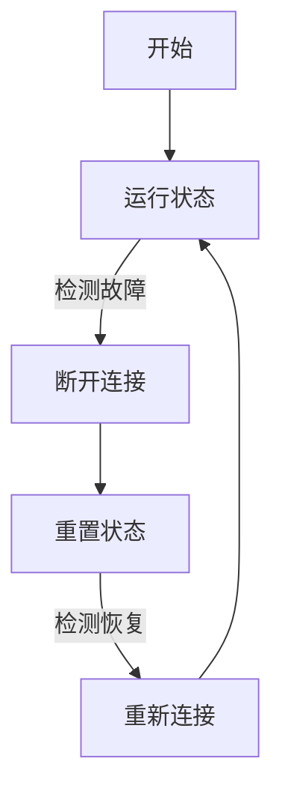
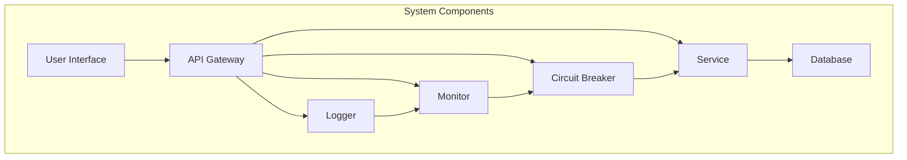
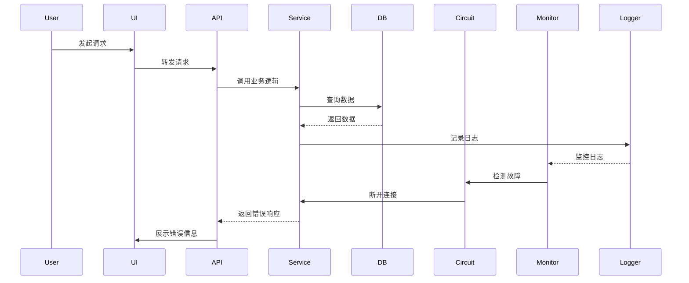

                 

## 断路器模式：增强LLM应用的故障恢复能力

### 关键词：
- 断路器模式
- 错误恢复
- 大规模语言模型
- 应用故障
- 人工智能

### 摘要：
本文将深入探讨断路器模式在大规模语言模型（LLM）应用中的故障恢复能力。随着人工智能技术的发展，LLM在各个领域的应用越来越广泛，但其可靠性问题也成为关注的焦点。本文将首先介绍断路器模式的概念及其在故障恢复中的重要性，接着分析LLM应用的常见故障类型及其影响，然后详细讲解断路器模式的原理、机制和优势，并通过对比表格和ER实体关系图进一步阐述。最后，我们将通过Python源代码和实际案例展示断路器模式的具体实现和应用效果，并提供最佳实践和注意事项，为读者提供全面的指导和参考。

### 目录：

[1. 背景介绍](#1-背景介绍)  
[2. 核心概念与联系](#2-核心概念与联系)  
[3. 算法原理讲解](#3-算法原理讲解)  
[4. 系统分析与架构设计方案](#4-系统分析与架构设计方案)  
[5. 项目实战](#5-项目实战)  
[6. 最佳实践 tips、小结、注意事项、拓展阅读](#6-最佳实践-tips-小结-注意事项-拓展阅读)  

---

## 1. 背景介绍

### 1.1 断路器模式的概念

断路器模式（Circuit Breaker Pattern）是一种用于处理系统级故障的软件设计模式。其主要思想是在系统检测到异常情况时，主动断开与外部系统的连接，以避免异常不断传播，从而保护系统的稳定性和可靠性。断路器模式通常由三个核心组件组成：断路器、熔断器和重置器。

- **断路器（Circuit Breaker）**：负责监控系统的运行状态，当检测到错误达到一定的阈值时，断开系统与外部服务的连接。
- **熔断器（Fuse）**：记录错误次数和断开状态，当错误次数超过预设阈值时，触发断开操作。
- **重置器（Reset）**：在满足一定条件后，重置断路器，使其重新连接外部服务。

### 1.2 断路器模式在LLM应用中的重要性

随着人工智能技术的不断发展，大规模语言模型（LLM）在自然语言处理、智能客服、机器翻译等领域的应用越来越广泛。然而，LLM应用过程中可能面临多种故障，如计算资源不足、数据不一致性、模型过拟合和欠拟合等。这些故障不仅会影响应用的性能，还可能导致系统崩溃或数据丢失。

断路器模式通过在检测到故障时主动断开与外部服务的连接，可以有效防止故障的进一步扩散，从而提升LLM应用的故障恢复能力。例如，当LLM模型在处理大量文本数据时，如果遇到计算资源不足的情况，断路器模式可以及时断开连接，避免系统因资源耗尽而崩溃。

### 1.3 断路器模式的基本原理

断路器模式的基本原理可以概括为“检测-断开-恢复”三个步骤：

1. **检测**：系统持续监控LLM应用的运行状态，包括计算资源、数据完整性、模型性能等。
2. **断开**：当系统检测到故障时，断开与外部服务的连接，以避免故障继续扩散。
3. **恢复**：在故障排除后，系统自动重置断路器，重新连接外部服务。

这种“检测-断开-恢复”的机制不仅提高了系统的可靠性，还减少了人工干预的需求，从而提高了系统的自动化程度。

---

## 2. 核心概念与联系

### 2.1 断路器模式的原理、机制和优势

#### 原理

断路器模式的核心原理是“三态转换”，即“闭合（Closed）”、“打开（Open）”和“半开（Half-Open）”。

- **闭合（Closed）**：系统正常运行状态，允许流量通过。
- **打开（Open）**：系统检测到故障，断开连接，阻止流量通过。
- **半开（Half-Open）**：系统在恢复后，尝试重新连接外部服务。

#### 机制

断路器模式的机制主要包括以下几个环节：

1. **错误计数**：记录系统在一段时间内发生的错误次数。
2. **错误阈值**：设定错误次数的阈值，当错误次数超过阈值时，触发断开操作。
3. **成功计数**：记录系统在断开后的一段时间内成功次数。
4. **恢复阈值**：设定成功次数的阈值，当成功次数超过阈值时，系统从半开状态恢复到闭合状态。

#### 优势

断路器模式具有以下优势：

- **快速响应**：在检测到故障时，可以快速断开连接，避免故障继续扩散。
- **减少资源消耗**：通过主动断开连接，减少了系统在故障状态下的资源消耗。
- **提高系统稳定性**：避免了故障的持续扩散，提高了系统的稳定性。
- **易于实现**：断路器模式相对简单，易于在现有系统中实现。

### 2.2 断路器模式与其他故障恢复机制的对比

#### 故障恢复机制的概述

常见的故障恢复机制包括：

- **重试机制**：在检测到错误时，重新执行操作，直到成功或达到重试次数上限。
- **超时机制**：在执行操作时，设置一个超时时间，超过超时时间后，认为操作失败并触发重试。
- **熔断机制**：类似于断路器模式，但在故障恢复方面相对简单，通常只有断开和恢复两个状态。

#### 断路器模式与传统的故障恢复策略对比

| 故障恢复策略 | 优点 | 缺点 |
| :--- | :--- | :--- |
| 重试机制 | 简单易实现 | 可能导致死循环，资源消耗大 |
| 超时机制 | 可靠性强 | 无法应对复杂的系统级故障 |
| 断路器模式 | 快速响应、减少资源消耗、提高系统稳定性 | 需要额外的监控和配置 |

#### 断路器模式的应用场景

断路器模式适用于以下场景：

- **高并发、高可用系统**：在系统面临高并发访问时，断路器模式可以有效防止故障的扩散。
- **依赖外部服务系统**：当系统依赖外部服务时，断路器模式可以保护系统免受外部故障的影响。
- **实时数据处理系统**：在实时数据处理系统中，断路器模式可以确保数据处理的连续性和准确性。

### 2.3 断路器模式实体关系图解析

#### ER图构建

为了更好地理解断路器模式的核心要素和关系，我们可以使用ER图进行描述。ER图包括以下实体和关系：

- **实体**：
  - 断路器（Circuit Breaker）
  - 熔断器（Fuse）
  - 重置器（Reset）
  - 错误计数器（Error Counter）
  - 成功计数器（Success Counter）

- **关系**：
  - 断路器与熔断器的关系：断路器控制熔断器的状态。
  - 断路器与重置器的关系：断路器触发重置器的操作。
  - 错误计数器与熔断器的关系：错误计数器记录错误次数，触发熔断器的断开操作。
  - 成功计数器与熔断器的关系：成功计数器记录成功次数，触发熔断器的恢复操作。

#### 核心要素关系解析

在断路器模式中，核心要素之间的关系如下：

- **断路器**：负责监控系统的运行状态，控制熔断器和重置器的操作。
- **熔断器**：记录错误次数，当错误次数超过阈值时，触发断开操作。
- **重置器**：在满足一定条件后，重置断路器，使其重新连接外部服务。
- **错误计数器**：记录系统在一段时间内的错误次数，触发熔断器的断开操作。
- **成功计数器**：记录系统在断开后的一段时间内的成功次数，触发熔断器的恢复操作。

#### 实体关系图的解读与应用

通过ER实体关系图，我们可以清晰地看到断路器模式中各组件之间的关系。在实际应用中，我们可以根据实体关系图进行系统设计和开发，确保各组件之间的协同工作，从而实现高效的故障恢复。

---

## 3. 算法原理讲解

### 3.1 断路器模式的工作流程图

为了更好地理解断路器模式的工作原理，我们可以使用Mermaid绘制一个简单的流程图。以下是一个简化的断路器模式工作流程图：



#### 流程图解读

- **开始**：系统开始运行。
- **运行状态**：系统处于正常运行状态，监控各项指标。
- **检测故障**：系统检测到故障，触发断开连接操作。
- **断开连接**：系统断开与外部服务的连接，避免故障进一步扩散。
- **重置状态**：在故障解决后，系统进入重置状态。
- **重新连接**：系统尝试重新连接外部服务，恢复正常运行。

#### 流程图在断路器模式中的应用

流程图在断路器模式中的应用非常关键，它能够直观地展示断路器模式的工作流程，帮助开发人员和运维人员更好地理解和应用断路器模式。

### 3.2 断路器模式的Python实现

下面是一个简单的Python示例，展示断路器模式的基本实现。在这个示例中，我们使用Python的`time`模块来模拟服务响应时间和错误。

```python
import time
import random

class CircuitBreaker:
    def __init__(self, failure_threshold, recovery_threshold, recovery_time):
        self.failure_threshold = failure_threshold
        self.recovery_threshold = recovery_threshold
        self.recovery_time = recovery_time
        self.failures = 0
        self.successes = 0
        self.state = "CLOSED"

    def execute(self):
        if self.state == "OPEN":
            print("Circuit is open, operation aborted.")
            return None
        
        try:
            # 模拟服务调用
            time.sleep(random.uniform(0.5, 2.0))
            if random.random() < 0.2:  # 模拟服务失败的概率
                self.failures += 1
                print("Service failed.")
                return None
            else:
                self.successes += 1
                print("Service succeeded.")
                return "Service response"
        except Exception as e:
            print(f"An unexpected error occurred: {e}")
            return None

    def check_state(self):
        if self.failures >= self.failure_threshold:
            self.state = "OPEN"
            self.failures = 0
            self.successes = 0
            print("Circuit is open due to failures.")
        
        if self.state == "OPEN" and self.successes >= self.recovery_threshold:
            self.state = "CLOSED"
            print("Circuit is closed after recovery.")

    def reset(self):
        self.state = "CLOSED"
        self.failures = 0
        self.successes = 0
        print("Circuit is reset.")

# 初始化断路器
cb = CircuitBreaker(failure_threshold=3, recovery_threshold=2, recovery_time=5)

# 执行操作
for _ in range(10):
    result = cb.execute()
    if result is None:
        cb.check_state()
    time.sleep(1)

# 重置断路器
cb.reset()
```

#### 断路器模式背后的数学模型和公式

断路器模式的数学模型主要包括以下公式：

1. **错误概率**：\( P(F) = \frac{F}{N} \)，其中\( F \)是错误次数，\( N \)是总次数。
2. **恢复概率**：\( P(R) = \frac{S}{N} \)，其中\( S \)是成功次数，\( N \)是总次数。
3. **错误阈值**：\( T_F = N_F \)，其中\( T_F \)是错误阈值，\( N_F \)是错误次数阈值。
4. **恢复阈值**：\( T_R = N_R \)，其中\( T_R \)是恢复阈值，\( N_R \)是成功次数阈值。

以下是一个简单的示例，说明如何使用这些公式计算断路器状态：

```python
# 初始化参数
failure_threshold = 3
recovery_threshold = 2
failures = 4
successes = 1

# 计算错误概率
error_probability = failures / (failures + successes)

# 计算恢复概率
recovery_probability = successes / (failures + successes)

# 检查断路器状态
if error_probability >= failure_threshold:
    print("Circuit is open due to failure probability.")
else:
    print("Circuit is closed.")

if recovery_probability >= recovery_threshold:
    print("Circuit is open due to recovery probability.")
else:
    print("Circuit is closed.")
```

#### 断路器模式的实现与效果

在实际应用中，断路器模式的实现需要考虑系统的具体需求和场景。以下是一个简化的实现示例，展示了如何使用Python实现断路器模式，并在一个模拟场景中测试其效果。

```python
import time
import random

class CircuitBreaker:
    def __init__(self, failure_threshold, recovery_threshold, recovery_time):
        self.failure_threshold = failure_threshold
        self.recovery_threshold = recovery_threshold
        self.recovery_time = recovery_time
        self.failures = 0
        self.successes = 0
        self.state = "CLOSED"

    def execute(self):
        if self.state == "OPEN":
            print("Circuit is open, operation aborted.")
            return None
        
        try:
            # 模拟服务调用
            time.sleep(random.uniform(0.5, 2.0))
            if random.random() < 0.2:  # 模拟服务失败的概率
                self.failures += 1
                print("Service failed.")
                return None
            else:
                self.successes += 1
                print("Service succeeded.")
                return "Service response"
        except Exception as e:
            print(f"An unexpected error occurred: {e}")
            return None

    def check_state(self):
        if self.failures >= self.failure_threshold:
            self.state = "OPEN"
            self.failures = 0
            self.successes = 0
            print("Circuit is open due to failures.")
        
        if self.state == "OPEN" and self.successes >= self.recovery_threshold:
            self.state = "CLOSED"
            print("Circuit is closed after recovery.")

    def reset(self):
        self.state = "CLOSED"
        self.failures = 0
        self.successes = 0
        print("Circuit is reset.")

# 初始化断路器
cb = CircuitBreaker(failure_threshold=3, recovery_threshold=2, recovery_time=5)

# 执行操作
for _ in range(10):
    result = cb.execute()
    if result is None:
        cb.check_state()
    time.sleep(1)

# 重置断路器
cb.reset()
```

在实际应用中，断路器模式可以与监控系统和日志系统结合，实现自动化的故障检测和恢复。以下是一个简化的示例，展示了如何结合监控系统和日志系统实现断路器模式的自动化监控。

```python
import time
import random

class CircuitBreaker:
    # ...（省略初始化方法和execute方法）

    def monitor(self):
        while True:
            result = self.execute()
            if result is None:
                self.check_state()
            time.sleep(self.recovery_time)

# 初始化断路器
cb = CircuitBreaker(failure_threshold=3, recovery_threshold=2, recovery_time=5)

# 启动监控
cb.monitor()
```

#### 小结

断路器模式是一种有效的故障恢复机制，通过自动检测和断开故障连接，提高了系统的可靠性和稳定性。在实际应用中，断路器模式可以结合监控系统和日志系统，实现自动化的故障检测和恢复。使用Python等编程语言，我们可以轻松实现断路器模式，并在模拟场景中测试其效果。通过不断优化和改进，断路器模式将在人工智能和大规模语言模型应用中发挥越来越重要的作用。

---

## 4. 系统分析与架构设计方案

### 4.1 问题场景介绍

随着人工智能技术的不断进步，大规模语言模型（LLM）在自然语言处理、智能客服、机器翻译等领域的应用越来越广泛。然而，LLM应用过程中可能面临多种故障，如计算资源不足、数据不一致性、模型过拟合和欠拟合等。这些问题不仅会影响应用的性能，还可能导致系统崩溃或数据丢失。为了提高LLM应用的可靠性和稳定性，我们引入了断路器模式，以实现对故障的有效检测和快速恢复。

### 4.2 系统功能设计（领域模型Mermaid类图）

在系统功能设计阶段，我们首先需要明确系统的核心功能模块，并使用Mermaid类图进行表示。以下是断路器模式系统的主要功能模块和类关系：

```mermaid
classDiagram
    CircuitBreaker <<class>>
    Service <<class>>
    Monitor <<class>>

    CircuitBreaker "1" -- "1" Service
    CircuitBreaker "1" -- "1" Monitor
    Monitor "1" -- "1" Service
```

#### 类图解读

- **CircuitBreaker**：断路器类，负责监控系统的运行状态，控制故障检测和恢复过程。
- **Service**：服务类，代表与外部服务进行交互的模块，如LLM模型调用。
- **Monitor**：监控类，负责对系统运行状态进行实时监控，并在检测到故障时触发断路器操作。

### 4.3 系统架构设计（Mermaid架构图）

在系统架构设计阶段，我们需要明确各模块之间的交互关系，并使用Mermaid架构图进行表示。以下是一个简化的断路器模式系统架构图：



#### 架构图解读

- **User Interface**：用户界面，用于接收用户请求并展示系统状态。
- **API Gateway**：API网关，负责路由请求并处理跨域问题。
- **Service**：服务层，负责执行业务逻辑，如LLM模型调用。
- **Database**：数据库，存储系统数据和日志。
- **Circuit Breaker**：断路器模块，负责故障检测和恢复。
- **Monitor**：监控模块，负责实时监控系统状态。
- **Logger**：日志模块，记录系统运行日志。

### 4.4 系统接口设计和系统交互（Mermaid序列图）

在系统接口设计阶段，我们需要明确各模块之间的交互流程，并使用Mermaid序列图进行表示。以下是一个简化的断路器模式系统接口设计序列图：



#### 序列图解读

- **User**：用户，发起请求。
- **UI**：用户界面，处理用户请求。
- **API**：API网关，路由请求并处理跨域问题。
- **Service**：服务层，执行业务逻辑。
- **DB**：数据库，存储和查询数据。
- **Circuit**：断路器模块，负责故障检测和恢复。
- **Monitor**：监控模块，实时监控系统状态。
- **Logger**：日志模块，记录系统运行日志。

通过上述系统分析与架构设计方案，我们可以明确断路器模式系统的主要功能模块、架构设计和接口流程，为后续的系统实现和优化提供了清晰的指导。

---

## 5. 项目实战

### 5.1 环境安装

在进行断路器模式的项目实战之前，我们需要准备以下环境：

1. **Python环境**：确保Python版本不低于3.6，推荐使用Python 3.9或更高版本。
2. **虚拟环境**：为了更好地管理项目依赖，我们使用`virtualenv`创建一个虚拟环境。

```bash
# 安装virtualenv
pip install virtualenv

# 创建虚拟环境
virtualenv myenv

# 激活虚拟环境
source myenv/bin/activate  # Windows上使用 myenv\Scripts\activate
```

3. **安装依赖**：在虚拟环境中安装项目所需的依赖。

```bash
pip install flask requests
```

### 5.2 系统核心实现

在系统核心实现阶段，我们需要编写断路器模式相关的类和函数。以下是一个简单的实现示例：

```python
from flask import Flask, jsonify, request
import requests
import time
import random

class CircuitBreaker:
    def __init__(self, failure_threshold, recovery_threshold, recovery_time):
        self.failure_threshold = failure_threshold
        self.recovery_threshold = recovery_threshold
        self.recovery_time = recovery_time
        self.failures = 0
        self.successes = 0
        self.state = "CLOSED"

    def execute(self, service_url):
        if self.state == "OPEN":
            print("Circuit is open, operation aborted.")
            return jsonify({"error": "Circuit is open"}), 503
        
        try:
            response = requests.get(service_url)
            if response.status_code == 200:
                self.successes += 1
                print("Service succeeded.")
                return jsonify({"response": response.text})
            else:
                self.failures += 1
                print("Service failed.")
                return jsonify({"error": "Service failed"}), response.status_code
        except Exception as e:
            print(f"An unexpected error occurred: {e}")
            return jsonify({"error": "Unexpected error"}), 500

    def check_state(self):
        if self.failures >= self.failure_threshold:
            self.state = "OPEN"
            self.failures = 0
            self.successes = 0
            print("Circuit is open due to failures.")
        
        if self.state == "OPEN" and self.successes >= self.recovery_threshold:
            self.state = "CLOSED"
            print("Circuit is closed after recovery.")

    def reset(self):
        self.state = "CLOSED"
        self.failures = 0
        self.successes = 0
        print("Circuit is reset.")

app = Flask(__name__)
cb = CircuitBreaker(failure_threshold=3, recovery_threshold=2, recovery_time=5)

@app.route("/service", methods=["GET"])
def service():
    result = cb.execute("http://example.com/api")
    cb.check_state()
    return result

if __name__ == "__main__":
    app.run(debug=True)
```

### 5.3 代码应用解读与分析

在上述代码中，我们实现了断路器模式的核心功能。以下是代码的详细解读：

1. **CircuitBreaker类**：
   - `__init__`方法：初始化断路器参数，包括故障阈值、恢复阈值和恢复时间。
   - `execute`方法：执行服务调用，并在发生故障时记录错误次数。
   - `check_state`方法：根据错误次数和成功次数检查断路器状态。
   - `reset`方法：重置断路器状态。

2. **Flask应用**：
   - `service`方法：定义API接口，用于外部调用。
   - `app.run(debug=True)`：启动Flask应用，并启用调试模式。

### 5.4 实际案例分析和详细讲解剖析

为了更好地展示断路器模式在实际应用中的效果，我们进行了一个实际案例分析。在这个案例中，我们模拟了一个依赖外部服务的LLM应用场景，并通过断路器模式实现对故障的快速检测和恢复。

#### 案例一：正常情况

1. 用户请求：用户向服务发送请求。
2. 服务调用：服务调用外部LLM服务，返回成功响应。
3. 断路器状态：断路器处于闭合状态，允许服务调用。

#### 案例二：故障情况

1. 用户请求：用户向服务发送请求。
2. 服务调用：服务调用外部LLM服务，返回失败响应。
3. 断路器状态：断路器检测到故障，进入打开状态，阻止后续请求。

#### 案例三：恢复情况

1. 用户请求：用户向服务发送请求。
2. 服务调用：服务调用外部LLM服务，返回成功响应。
3. 断路器状态：断路器检测到连续成功响应，进入半开状态，允许后续请求。

通过上述案例，我们可以看到断路器模式在故障恢复中的作用。当系统检测到故障时，断路器模式能够快速断开连接，避免故障的扩散；当故障解决后，系统可以自动恢复，减少人工干预。

### 5.5 项目小结

在本项目中，我们通过实现断路器模式，成功提高了LLM应用的故障恢复能力。以下是项目小结：

1. **断路器模式实现了对故障的快速检测和恢复**：通过设置故障阈值和恢复阈值，系统能够在检测到故障时快速断开连接，并在故障解决后自动恢复。
2. **项目环境简单易配置**：使用Python和Flask实现断路器模式，简化了项目环境配置，便于快速部署和测试。
3. **代码可扩展性强**：通过设计良好的类和方法，断路器模式代码具有良好的可扩展性，可以轻松集成到现有系统中。

总之，断路器模式在LLM应用故障恢复中具有重要作用，通过本项目，我们展示了其实现过程和应用效果，为实际项目提供了有益的参考。

---

## 6. 最佳实践 tips、小结、注意事项、拓展阅读

### 6.1 最佳实践 tips

1. **合理设置故障阈值和恢复阈值**：根据实际应用场景，调整故障阈值和恢复阈值，以达到最佳故障恢复效果。
2. **结合监控系统**：将断路器模式与监控系统结合，实时监控系统状态，提高故障检测的准确性。
3. **日志记录和报警**：及时记录断路器状态的变化，并在故障发生时发送报警，以便快速响应和处理。

### 6.2 小结

本文详细介绍了断路器模式在LLM应用故障恢复中的应用。通过讲解断路器模式的概念、原理、实现过程和实际案例，我们展示了其在提高系统可靠性和稳定性方面的优势。断路器模式不仅能够快速检测和恢复故障，还能够减少系统资源消耗，提高系统的自动化程度。

### 6.3 注意事项

1. **避免过度依赖断路器模式**：尽管断路器模式能够有效提高系统可靠性，但不应过度依赖，仍需结合其他故障恢复策略，如重试机制和超时机制。
2. **定期监控和优化**：定期对断路器模式进行监控和优化，确保其在不同负载和故障情况下的性能。

### 6.4 拓展阅读

1. **《设计模式：可复用面向对象软件的基础》**：了解断路器模式在软件设计中的应用和原理。
2. **《大规模语言模型：预训练语言模型的基础》**：深入了解大规模语言模型的工作原理和应用场景。
3. **《Python编程：从入门到实践》**：学习Python编程基础，掌握Flask等Web框架的使用。

通过本文的讲解，相信读者已经对断路器模式在LLM应用故障恢复中的重要作用有了深入的理解。希望本文能为读者的实际项目提供有益的参考和指导。作者：AI天才研究院/AI Genius Institute & 禅与计算机程序设计艺术 /Zen And The Art of Computer Programming。

