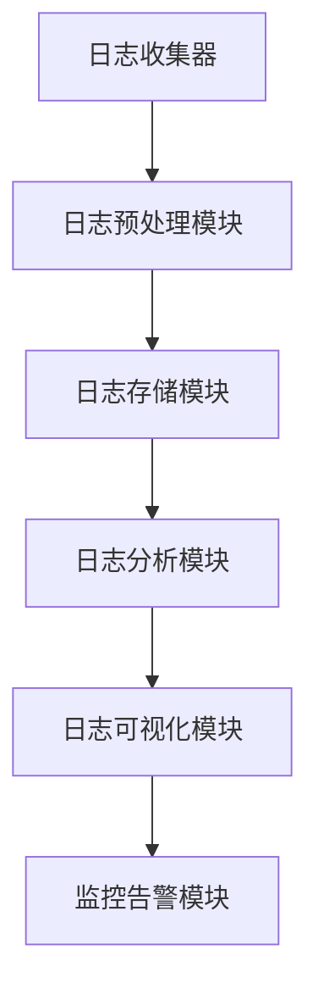
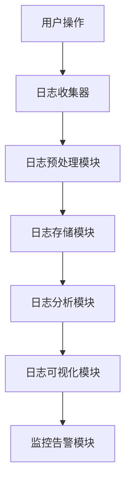

                 

### 日志结构化：提高LLM应用日志的可分析性

在当今大数据和人工智能（AI）的时代，日志分析已经成为企业日常运营中不可或缺的一部分。对于大规模语言模型（LLM）应用而言，日志的质量直接关系到其性能优化、故障排查和安全性保障。然而，传统的日志格式往往不够结构化，导致分析效率低下，难以支持复杂的数据挖掘和实时监控。本文将探讨日志结构化的概念、重要性、技术方法、应用场景以及未来趋势，旨在提高LLM应用日志的可分析性。

## 核心关键词

- **日志结构化**
- **大规模语言模型（LLM）**
- **日志分析**
- **数据挖掘**
- **实时监控**
- **人工智能（AI）**
- **性能优化**
- **故障排查**
- **安全性保障**

## 摘要

本文首先介绍了日志结构化的背景和意义，特别是在LLM应用中的重要性。接着，我们将定义日志结构化，并详细阐述其目标和关键要素。随后，我们将探讨日志的收集与预处理方法，包括操作系统和服务日志的收集、应用层日志收集以及分布式系统的日志收集策略。然后，本文将介绍日志结构化的技术与方法，包括日志标准化的标准化、日志分析算法及其性能评估指标。接下来，我们将讨论日志可视化与监控技术，包括常见日志可视化工具和日志监控系统设计。文章还将分析日志结构化在运维管理和安全分析中的应用，并总结日志结构化的最佳实践和发展趋势。最后，我们将展望日志结构化在未来的发展方向。

## 第1章：日志结构化的意义与重要性

### 1.1 日志结构化的背景

#### 1.1.1 数据爆炸与日志分析的需求

随着互联网和云计算的快速发展，企业生成和收集的数据量呈指数级增长。这些数据以日志形式记录了系统的运行状态、用户行为、错误报告等详细信息。然而，传统的日志格式往往是简单的文本记录，缺乏统一的结构和格式，导致日志分析成为一个复杂且耗时的工作。

#### 1.1.2 LLM应用日志的特殊性

大规模语言模型（LLM）作为一种先进的AI技术，被广泛应用于自然语言处理（NLP）、文本生成、问答系统等。LLM应用生成的日志不仅包含大量的文本数据，还涉及模型训练、推理、用户交互等复杂过程。这使得LLM应用日志具有更高的信息密度和复杂性，需要更为精细化的结构化处理。

#### 1.1.3 日志结构化对LLM应用的改进

日志结构化能够提高日志的可读性和可分析性，从而提升LLM应用的性能优化、故障排查和安全性。具体来说，日志结构化有以下几方面的改进：

- **提高日志查询效率**：结构化日志便于快速定位和检索特定信息，减少查询时间。
- **增强日志可视化**：结构化日志能够更直观地展示系统运行状态和用户行为，有助于监控和问题排查。
- **支持实时监控**：结构化日志便于实现实时监控和告警，快速响应系统异常。
- **提升日志分析深度**：结构化日志支持更复杂的数据挖掘和分析，帮助发现潜在问题和优化机会。

### 1.2 日志结构化的定义与目标

#### 1.2.1 日志结构化的定义

日志结构化是指将原始的文本日志转换为具有固定结构和格式的数据格式，以便于存储、查询和分析。结构化日志通常包含一系列预定义的标签和属性，每个日志条目都按照这些标签和属性进行组织。

#### 1.2.2 日志结构化的目标

日志结构化的主要目标是提高日志数据的可读性、可分析性和可扩展性。具体目标包括：

- **统一日志格式**：实现不同系统和应用程序日志格式的统一，便于集中管理和分析。
- **规范化日志内容**：确保日志内容包含必要的信息和属性，减少数据冗余和丢失。
- **优化数据查询**：通过结构化日志，实现快速、高效的日志查询和统计分析。
- **支持数据挖掘**：提供丰富的日志数据，便于进行数据挖掘和分析，发现潜在问题和优化机会。
- **增强系统监控**：通过结构化日志，实现对系统运行状态和用户行为的实时监控和告警。

#### 1.2.3 日志结构化的关键要素

日志结构化需要考虑以下几个关键要素：

- **日志格式**：选择适合的日志格式，如JSON、XML等，实现日志数据的统一和标准化。
- **日志标签**：定义一系列预定义的日志标签，用于标识日志条目的关键信息。
- **日志属性**：为每个日志条目分配适当的属性，如时间戳、用户ID、操作类型等。
- **日志存储**：设计高效的日志存储方案，确保日志数据的持久化和安全性。
- **日志分析工具**：提供强大的日志分析工具，支持日志数据的查询、分析和可视化。

### 1.3 日志结构化的优势

日志结构化具有以下几个显著的优势：

- **提高日志分析效率**：结构化日志便于快速查询和分析，减少数据预处理时间。
- **增强日志可读性**：结构化日志以易于理解和处理的形式呈现，提高日志的可读性。
- **优化资源利用**：结构化日志减少数据冗余，提高存储和传输效率，降低资源消耗。
- **支持跨系统日志集成**：通过统一日志格式，实现不同系统和应用程序日志的集成和分析。
- **促进数据治理**：结构化日志有助于实现数据标准化和管理，提高数据质量和一致性。

### 1.4 日志结构化的挑战

尽管日志结构化具有诸多优势，但在实际应用中也面临着一些挑战：

- **日志格式一致性**：实现不同系统和应用程序日志格式的一致性是一个复杂的过程。
- **日志数据质量**：日志数据质量直接影响结构化日志的有效性，需要确保日志内容的准确性和完整性。
- **日志处理性能**：大规模日志数据的处理需要高效的处理算法和存储方案，以保证实时性和稳定性。
- **日志安全性**：结构化日志可能涉及敏感数据，需要确保日志存储和处理的安全性。

### 1.5 小结

日志结构化在LLM应用中具有重要意义，能够显著提高日志的可分析性和实用性。通过定义统一的日志格式、标签和属性，实现日志数据的标准化和规范化，有助于提高日志查询和分析效率。同时，日志结构化也为实时监控和故障排查提供了有力的支持，为LLM应用的性能优化和安全性保障提供了重要保障。然而，日志结构化也面临着格式一致性、数据质量和处理性能等挑战，需要采用有效的技术和管理策略来应对。

## 第2章：LLM应用日志的收集与处理

### 2.1 日志收集的重要性

在LLM应用中，日志收集是确保系统稳定运行和性能优化的重要环节。通过收集系统运行过程中的各类日志，可以全面了解系统的运行状态、用户行为、错误报告等信息，为后续的日志分析和优化提供数据基础。同时，日志收集也是实现实时监控和故障排查的重要手段。

### 2.2 日志收集的方法

#### 2.2.1 操作系统与服务的日志收集

操作系统和服务的日志收集是日志收集的基本组成部分。常用的操作系统如Linux和Windows都提供了丰富的日志功能，如syslog、Windows Event Log等。以下是一些常见的日志收集方法：

- **syslog**：syslog是一种标准化的日志收集工具，适用于Linux和Unix系统。通过配置syslog daemon，可以将系统的运行日志发送到集中日志服务器，便于集中管理和分析。
- **Windows Event Log**：Windows Event Log是Windows操作系统自带的一种日志收集机制，用于记录系统的各类事件和错误。通过Windows Event Log Collector工具，可以将事件日志收集到指定的存储位置。

#### 2.2.2 应用层日志收集

应用层日志收集主要关注LLM应用的日志记录和收集。应用层日志通常包含用户操作、模型训练和推理过程等信息，是日志分析的重要数据来源。以下是一些常见应用层日志收集方法：

- **自定义日志记录器**：在LLM应用中，可以通过自定义日志记录器（如log4j、slf4j等）来记录系统运行过程中的各类日志信息。自定义日志记录器具有灵活的日志格式和配置选项，可以满足不同应用场景的需求。
- **API调用日志**：通过记录API调用日志，可以了解用户在使用LLM应用时的操作行为，如查询请求、更新操作等。API调用日志通常包含用户ID、请求参数、响应结果等关键信息。

#### 2.2.3 分布式系统的日志收集策略

在分布式系统中，日志收集面临着更大的挑战。分布式系统的日志通常分布在多个节点上，需要采用适当的收集策略，确保日志数据的完整性和一致性。以下是一些分布式系统日志收集策略：

- **集中式日志收集**：集中式日志收集是将分布式系统的日志集中存储在统一的日志服务器上。通过配置logstash、fluentd等日志收集工具，可以实现分布式系统的日志集中管理和分析。
- **分布式日志收集**：分布式日志收集是将日志收集任务分配到各个节点上，通过本地日志收集器将日志发送到中心日志服务器。分布式日志收集可以提高日志收集的效率和容错能力。

### 2.3 日志处理

#### 2.3.1 日志预处理

日志预处理是日志分析的重要环节，包括日志格式标准化、去噪和清洗等步骤。以下是一些常见的日志预处理方法：

- **日志格式标准化**：将不同来源的日志转换为统一的格式，如JSON或XML。通过定义日志标签和属性，确保日志数据的一致性和可读性。
- **日志去噪**：去除无效、重复或异常的日志记录，提高日志数据的质量。可以通过过滤规则、统计方法等手段实现。
- **日志清洗**：修复错误的日志记录，如时间戳错误、数据格式错误等。通过数据校验和修复算法，确保日志数据的准确性。

#### 2.3.2 日志聚合

日志聚合是将分散的日志数据汇总到一起，便于集中管理和分析。以下是一些常见的日志聚合方法：

- **时间窗口聚合**：将时间窗口内的日志记录汇总为一个日志条目，如将1分钟的日志记录汇总为一个1分钟的日志条目。通过时间窗口聚合，可以快速了解系统运行状态和趋势。
- **字段聚合**：将相同字段的不同日志记录合并为一个日志条目，如将不同用户的操作日志合并为一个日志条目。通过字段聚合，可以更全面地了解系统运行状态。

#### 2.3.3 日志压缩

日志压缩是减少日志数据存储空间的重要手段。以下是一些常见的日志压缩方法：

- **文本压缩**：通过文本压缩算法，如gzip、bzip2等，将文本日志压缩为更小的文件。文本压缩适用于大部分日志数据，可以提高存储和传输效率。
- **图像和多媒体压缩**：对于包含图像和多媒体数据的日志，可以采用相应的图像和多媒体压缩算法，如JPEG、H.264等。图像和多媒体压缩可以有效减少数据体积，提高存储和传输效率。

### 2.4 小结

LLM应用日志的收集与处理是确保日志数据质量和分析效率的关键环节。通过多种日志收集方法，可以全面收集操作系统、应用层和分布式系统的日志数据。同时，日志预处理、日志聚合和日志压缩等处理方法，可以提高日志数据的可读性和分析效率，为后续的日志分析和优化提供有力支持。

## 第3章：日志结构化的技术与方法

### 3.1 日志标准化的标准化

日志标准化是日志结构化的核心步骤，其目的是将不同来源和格式的日志数据转换为统一、标准化的格式，以便于后续的数据存储、查询和分析。以下是一些常见的日志标准化技术：

#### 3.1.1 日志格式转换

日志格式转换是将原始的文本日志转换为结构化数据格式，如JSON、XML等。通过定义日志标签和属性，可以确保日志数据的一致性和可读性。

#### 3.1.2 日志标签定义

日志标签是指用于标识日志条目关键信息的预定义字段。通过定义日志标签，可以明确日志条目的结构和内容，提高日志数据的可读性和可分析性。

#### 3.1.3 日志属性赋值

日志属性是指为日志条目分配的预定义字段值。通过为日志条目赋值，可以丰富日志数据的内容，便于后续的数据分析。

#### 3.1.4 日志标准化工具

常见的日志标准化工具包括logstash、fluentd、Apache Kafka等。这些工具提供了丰富的日志处理功能，可以高效地将不同来源和格式的日志数据转换为统一的结构化格式。

### 3.2 日志分析算法

日志分析算法是指用于处理和挖掘日志数据，提取有用信息和模式的算法。以下是一些常见的日志分析算法：

#### 3.2.1 统计分析算法

统计分析算法用于对日志数据进行统计分析，提取日志数据的基本特征和分布情况。常见的统计分析算法包括均值、中位数、方差等。

#### 3.2.2 机器学习算法

机器学习算法用于从日志数据中学习模式，进行预测和分类。常见的机器学习算法包括决策树、支持向量机（SVM）、神经网络等。

#### 3.2.3 模式识别算法

模式识别算法用于识别日志数据中的异常模式和趋势。常见的模式识别算法包括聚类、关联规则挖掘、时间序列分析等。

#### 3.2.4 日志分析算法的性能评估

日志分析算法的性能评估是衡量算法效果的重要手段。常见的性能评估指标包括准确率、召回率、F1值等。

### 3.3 日志分析算法的优化策略

为了提高日志分析算法的效果和效率，可以采用以下优化策略：

#### 3.3.1 数据预处理

通过数据预处理，可以去除无效数据、填补缺失数据，提高日志数据的质量和一致性。

#### 3.3.2 特征工程

通过特征工程，可以提取日志数据中的关键特征，减少数据维度，提高算法的准确性和效率。

#### 3.3.3 算法调优

通过算法调优，可以调整算法的参数，优化算法的效果。常见的调优方法包括交叉验证、网格搜索等。

#### 3.3.4 分布式计算

通过分布式计算，可以并行处理大规模日志数据，提高日志分析的速度和效率。

### 3.4 日志分析工具

日志分析工具是进行日志分析的重要工具，可以提供数据可视化、报表生成、告警等功能。以下是一些常见的日志分析工具：

#### 3.4.1 Elasticsearch

Elasticsearch是一个开源的搜索引擎，可以用于大规模日志数据的存储、查询和分析。通过Kibana插件，可以实现日志数据的可视化展示。

#### 3.4.2 Logstash

Logstash是一个开源的数据收集和处理工具，可以用于收集、处理和传输日志数据。通过配置，可以将日志数据转换为统一的结构化格式，并存储到Elasticsearch中。

#### 3.4.3 Fluentd

Fluentd是一个开源的数据收集工具，可以用于收集、处理和转发日志数据。通过配置，可以将日志数据发送到各种数据存储和数据处理平台。

#### 3.4.4 Nagios

Nagios是一个开源的监控工具，可以用于监控系统的运行状态，并通过日志分析进行告警和故障排查。

### 3.5 小结

日志结构化是提高日志数据可分析性的重要手段，通过日志标准化、日志分析算法和日志分析工具，可以实现日志数据的统一、规范化和高效分析。日志结构化不仅可以提高日志查询和分析的效率，还可以为系统性能优化、故障排查和安全性保障提供有力支持。

## 第4章：日志可视化与监控

### 4.1 日志可视化的概念与重要性

日志可视化是将结构化日志数据以图形化的方式展示出来，使得用户可以直观地理解和分析日志数据。日志可视化在LLM应用中具有重要意义，主要体现在以下几个方面：

- **提高日志分析效率**：通过图形化的方式展示日志数据，用户可以快速定位和识别异常日志，提高日志分析效率。
- **增强日志可读性**：图形化的展示方式使得复杂的日志数据更加直观易懂，降低用户的学习成本。
- **支持实时监控**：实时日志可视化可以实时反映系统运行状态和用户行为，支持系统故障排查和性能优化。
- **支持跨领域应用**：日志可视化技术可以应用于不同领域的应用，如运维管理、安全分析、业务监控等。

### 4.2 常见的日志可视化工具

目前，市面上有许多流行的日志可视化工具，以下是其中几个常见的工具：

- **Elasticsearch和Kibana**：Elasticsearch是一个强大的开源搜索引擎，而Kibana是其配套的可视化分析工具。Kibana提供了丰富的可视化组件，如图表、表格和地图等，可以帮助用户快速创建交互式的日志分析仪表板。
- **Grafana**：Grafana是一个开源的监控和可视化工具，支持多种数据源，包括Elasticsearch、InfluxDB、Prometheus等。通过Grafana，用户可以创建自定义的仪表板，实时监控和分析日志数据。
- **Grafana Cloud**：Grafana Cloud是Grafana的云服务平台，提供了自动化的部署、监控和管理功能。通过Grafana Cloud，用户可以轻松地将日志数据上传到云平台，并实现实时监控和可视化分析。
- **Splunk**：Splunk是一个企业级的数据分析和可视化工具，可以处理和分析大规模的日志数据。Splunk提供了强大的搜索和查询功能，同时支持丰富的可视化组件，如图表、热图和仪表板等。

### 4.3 可视化设计原则

为了实现有效的日志可视化，设计可视化时应遵循以下原则：

- **简洁性**：保持设计的简洁性，避免过多的细节和冗余信息，确保用户能够快速理解和分析数据。
- **直观性**：选择直观的视觉元素，如颜色、形状和大小，来表示日志数据的不同特征，提高可视化的可读性。
- **交互性**：提供交互功能，如筛选、过滤和拖拽等，使用户可以动态地探索和分析日志数据。
- **一致性**：保持设计风格和视觉元素的一致性，确保用户在不同可视化组件之间能够无缝切换和交互。

### 4.4 常见的日志可视化组件

日志可视化工具通常提供多种可视化组件，以支持不同类型的日志数据分析。以下是一些常见的可视化组件：

- **折线图**：用于展示日志数据的趋势和变化，如访问量的时间序列变化。
- **柱状图**：用于展示日志数据的分布情况，如不同类型的错误数量。
- **饼图**：用于展示日志数据的占比情况，如用户访问来源的分布。
- **热图**：用于展示日志数据的热点区域，如系统负载的高峰时段。
- **地理地图**：用于展示日志数据的地理位置信息，如全球用户分布。
- **表格**：用于展示详细的日志数据记录，如具体的日志条目信息。

### 4.5 日志可视化案例分析

以下是一个日志可视化的案例分析：

#### 案例背景

一家电商公司希望通过日志可视化来监控其网站的性能和用户行为。公司收集了网站访问日志、服务器日志和数据库日志等数据，并使用Elasticsearch进行存储和查询。

#### 可视化设计

1. **访问量趋势图**：使用折线图展示每天、每小时和每分钟的网站访问量，帮助公司了解访问量的波动情况。
2. **错误分布图**：使用柱状图展示不同类型的错误数量和比例，帮助公司识别常见的错误类型。
3. **用户行为分析**：使用饼图展示用户访问来源的分布，帮助公司了解用户的地理位置和来源渠道。
4. **服务器负载热图**：使用热图展示服务器的CPU、内存和磁盘负载情况，帮助公司识别负载高峰时段。
5. **地理地图**：使用地理地图展示全球用户的分布，帮助公司了解用户的地域分布情况。

#### 可视化效果

通过上述可视化组件，公司可以实时监控网站的性能和用户行为，快速识别问题和优化机会。例如，当发现访问量突然下降时，可以通过趋势图分析访问量的波动原因，并通过错误分布图识别可能的错误类型。同时，通过用户行为分析和地理地图，公司可以优化网站的用户体验和营销策略。

### 4.6 小结

日志可视化是提高日志数据可分析性和实用性的重要手段。通过使用合适的日志可视化工具和设计原则，可以直观地展示日志数据，帮助用户快速理解和分析日志信息。日志可视化不仅在LLM应用中具有重要作用，还可以应用于其他领域的应用，如运维管理、安全分析和业务监控等。通过有效的日志可视化，企业可以实时监控系统性能，快速识别问题和优化机会，提高业务效率和用户体验。

## 第5章：日志结构化在运维管理和安全分析中的应用

### 5.1 日志结构化在运维管理中的应用

日志结构化在运维管理中发挥着重要作用，通过结构化的日志数据，可以实现对系统运行状态的实时监控、性能优化和故障排查。

#### 5.1.1 运维监控与告警

运维监控是确保系统稳定运行的关键环节，通过结构化日志，可以实现以下功能：

- **实时监控**：将结构化日志实时传输到监控平台，如Elasticsearch、Kibana或Grafana，通过图表和仪表板展示系统状态，如CPU利用率、内存使用情况、网络流量等。
- **告警机制**：通过配置告警规则，当系统参数超过预设阈值时，自动触发告警，如邮件、短信或短信通知，及时通知运维人员。

#### 5.1.2 异常检测与故障排除

结构化日志在异常检测和故障排除方面具有显著优势：

- **日志分析**：通过日志分析工具，对结构化日志进行统计分析，发现异常模式和趋势。例如，当某类错误频繁出现时，可以及时定位到故障原因。
- **故障排查**：利用结构化日志，运维人员可以快速定位到故障发生的时间、地点和原因，如某台服务器、某个应用模块或某个用户操作。通过日志回溯，可以重现故障过程，便于故障排查和修复。

#### 5.1.3 性能优化与调优

日志结构化有助于实现系统性能优化和调优：

- **性能监控**：通过监控日志数据，如请求处理时间、响应时间和系统负载等，可以及时发现系统瓶颈，优化资源配置。
- **调优策略**：根据日志分析结果，制定优化策略，如增加服务器资源、调整网络带宽或优化数据库查询。

#### 5.1.4 运维日志可视化

运维日志可视化是提高运维管理效率的重要手段：

- **图表展示**：通过折线图、柱状图、饼图等图表，展示系统运行状态和性能指标，如CPU利用率、内存使用情况和网络流量等。
- **实时监控**：实时展示系统运行状态，如服务器负载、应用运行状态和用户访问情况等。
- **告警联动**：当系统参数超过阈值时，实时触发告警，并联动相关监控工具，实现自动化处理。

### 5.2 日志结构化在安全分析中的应用

日志结构化在安全分析中同样具有重要意义，通过结构化日志数据，可以实现对安全事件的监测、威胁分析和安全响应。

#### 5.2.1 安全事件监测

- **实时监测**：通过实时收集和解析结构化日志，监测系统中的安全事件，如登录失败、文件访问异常等。
- **威胁识别**：利用日志分析工具，对结构化日志进行模式识别和关联分析，识别潜在的安全威胁。

#### 5.2.2 安全威胁分析

- **威胁分析**：通过分析结构化日志，确定安全事件的来源、类型和影响范围。
- **趋势预测**：根据历史日志数据，预测潜在的安全威胁，如DDoS攻击、恶意软件感染等。

#### 5.2.3 安全响应与防护

- **安全响应**：当检测到安全事件时，根据预设的安全响应策略，自动执行相应的防护措施，如防火墙规则调整、安全审计等。
- **威胁防护**：通过日志分析，及时发现和防范潜在的安全威胁，如入侵尝试、数据泄露等。

#### 5.2.4 安全日志可视化

安全日志可视化有助于提高安全分析效率：

- **事件趋势图**：展示安全事件的数量和类型随时间的变化趋势。
- **威胁地图**：展示安全威胁的地理位置分布。
- **告警联动**：当检测到安全威胁时，实时触发告警，并联动相关工具，实现自动化处理。

### 5.3 小结

日志结构化在运维管理和安全分析中具有广泛的应用价值。通过结构化日志，可以实现系统运行状态的实时监控、性能优化和故障排查，提高运维管理效率。同时，日志结构化也有助于实现安全事件的监测、威胁分析和安全响应，提高网络安全防护能力。通过日志可视化，可以直观地展示日志数据，提高日志分析效率和安全性。随着日志结构化技术的不断发展，其在运维管理和安全分析中的应用将越来越广泛，为企业和组织的数据安全和业务稳定提供有力保障。

## 第6章：日志结构化的发展趋势与挑战

### 6.1 日志结构化的发展趋势

随着大数据和人工智能技术的不断发展，日志结构化技术在各个方面都呈现出显著的发展趋势：

#### 6.1.1 新兴技术的引入

- **云计算与边缘计算**：日志结构化技术正在向云计算和边缘计算领域扩展，以应对大规模、分布式日志数据的需求。
- **区块链**：区块链技术的引入，为日志数据的完整性和安全性提供了新的保障，有助于实现日志数据的不可篡改和透明性。

#### 6.1.2 跨领域应用的发展

- **物联网（IoT）**：随着物联网设备的普及，日志结构化技术被广泛应用于智能家居、智能城市等领域，以实现设备监控和数据分析。
- **人工智能（AI）与机器学习**：日志结构化与AI、机器学习的结合，使得日志数据的分析更加智能化，能够自动识别异常模式和预测潜在问题。

#### 6.1.3 日志结构化与AI的结合

- **智能日志分析**：通过引入AI技术，实现对日志数据的智能分析和预测，提高日志分析的效率和准确性。
- **自动化日志处理**：利用AI技术，实现日志数据的自动化处理和清洗，减少人工干预，提高日志处理效率。

### 6.2 日志结构化面临的挑战

尽管日志结构化技术取得了显著的发展，但在实际应用中仍面临一系列挑战：

#### 6.2.1 数据隐私与安全性

- **数据隐私**：日志结构化过程中，可能会涉及敏感数据的收集和处理，如何保护用户隐私成为一大挑战。
- **安全性**：日志数据的安全性至关重要，如何确保日志数据在传输和存储过程中的安全性，防止数据泄露和篡改，是亟待解决的问题。

#### 6.2.2 大规模日志处理

- **性能瓶颈**：随着日志数据量的不断增大，如何提高日志处理性能，避免出现性能瓶颈，是当前的一个重要挑战。
- **存储优化**：如何高效地存储和管理大规模日志数据，降低存储成本，也是亟待解决的问题。

#### 6.2.3 日志分析的可解释性

- **可解释性**：在引入AI技术进行日志分析时，如何保证分析结果的可解释性，让用户能够理解分析过程和结果，是一个重要挑战。

### 6.3 未来发展方向

为了应对上述挑战，日志结构化技术在未来可能的发展方向包括：

#### 6.3.1 安全性和隐私保护

- **隐私保护技术**：引入差分隐私、同态加密等技术，保护用户隐私。
- **安全防护**：采用加密通信、访问控制等技术，确保日志数据的安全性。

#### 6.3.2 大规模日志处理

- **分布式处理**：采用分布式计算框架，如Apache Kafka、Apache Flink等，提高日志处理性能。
- **存储优化**：采用压缩、去重等技术，降低存储成本。

#### 6.3.3 日志分析的可解释性

- **可解释性模型**：引入可解释性算法，如LIME、SHAP等，提高分析结果的可解释性。
- **交互式分析**：开发交互式日志分析工具，使用户能够直观地理解和操作日志分析结果。

### 6.4 小结

日志结构化技术正朝着智能化、安全化和高效化的方向发展，尽管面临一系列挑战，但随着技术的不断进步，这些问题有望得到有效解决。日志结构化技术的未来发展将更加紧密地与大数据、人工智能等技术相结合，为企业和组织提供更全面、更准确的日志分析服务，助力业务发展和创新。

## 第7章：日志结构化最佳实践与总结

### 7.1 日志结构化最佳实践

为了确保日志结构化的有效实施，以下是一些最佳实践：

#### 7.1.1 设计原则与策略

- **标准化**：确保日志格式和字段定义的统一性，便于集中管理和分析。
- **灵活性**：设计灵活的日志结构，以适应不同应用场景和需求变化。
- **可扩展性**：考虑未来可能的需求扩展，预留足够的空间和扩展机制。
- **易用性**：简化日志收集和处理的流程，提高用户体验。

#### 7.1.2 实施步骤与工具

- **日志收集**：使用合适的日志收集工具，如logstash、fluentd等，确保日志数据的完整性和实时性。
- **日志预处理**：对日志数据进行去噪、清洗和格式转换，提高日志数据的质量。
- **日志存储**：选择高效的日志存储方案，如Elasticsearch、Apache Kafka等，确保日志数据的持久化和安全性。
- **日志分析**：使用日志分析工具，如Kibana、Grafana等，实现日志数据的可视化和深度分析。

#### 7.1.3 持续优化与反馈

- **定期评估**：定期评估日志结构化的效果，根据反馈进行调整和优化。
- **用户培训**：为运维人员和开发人员提供培训，确保他们能够熟练使用日志分析工具。
- **自动化**：引入自动化脚本和工具，减少人工干预，提高日志处理的效率。

### 7.2 总结与展望

日志结构化技术在提升LLM应用的可分析性、性能优化和安全性方面具有重要意义。通过实施日志结构化，企业能够实现实时监控、故障排查和业务优化。未来，随着大数据和人工智能技术的发展，日志结构化技术将进一步与这些前沿技术相结合，推动日志分析领域的创新。

### 7.3 小结

日志结构化不仅是技术层面的优化，更是业务发展的关键支撑。通过遵循最佳实践，企业可以实现高效、可靠的日志结构化，为业务决策提供数据支持，助力企业持续发展。展望未来，日志结构化将在更多领域发挥重要作用，推动企业数字化转型和智能化升级。

### 作者信息

**作者：** AI天才研究院/AI Genius Institute & 禅与计算机程序设计艺术 /Zen And The Art of Computer Programming

## 附录

### 附录A：核心概念术语说明

- **日志结构化**：将原始的文本日志转换为具有固定结构和格式的数据格式，以便于存储、查询和分析。
- **大规模语言模型（LLM）**：一种基于深度学习的技术，能够处理和生成大规模的语言数据。
- **日志分析**：对日志数据进行处理、挖掘和分析，提取有用信息和模式。
- **数据挖掘**：从大量数据中提取潜在的模式和信息，用于决策支持。
- **实时监控**：对系统运行状态和用户行为进行实时监测，及时发现和处理问题。

### 附录B：问题场景介绍

在一家电商公司中，由于业务规模不断扩大，系统日志的数据量和复杂性也随之增加。传统的文本日志格式难以满足高效分析的需求，导致故障排查和性能优化效率低下。为了应对这一挑战，公司决定实施日志结构化，以提高日志的可分析性和实用性。

### 附录C：项目介绍

项目名称：电商系统日志结构化改造

项目目标：实现电商系统日志的标准化、结构化和高效分析，提高故障排查和性能优化效率。

项目范围：涵盖系统日志、应用日志、数据库日志等不同类型的日志数据。

### 附录D：系统功能设计

- **日志收集**：实现各类日志数据的收集和存储，包括操作系统日志、应用日志、数据库日志等。
- **日志预处理**：对收集到的日志数据进行去噪、清洗和格式转换，提高日志数据质量。
- **日志存储**：采用Elasticsearch等日志存储工具，确保日志数据的持久化和安全性。
- **日志分析**：利用日志分析工具，实现日志数据的实时监控、趋势分析和故障排查。

### 附录E：系统架构设计

**系统架构图：**（使用mermaid绘制）



### 附录F：系统接口设计

- **日志收集接口**：提供API接口，用于接收和发送日志数据。
- **日志查询接口**：提供API接口，用于查询和分析日志数据。
- **监控告警接口**：提供API接口，用于监控系统和告警通知。

### 附录G：系统交互

**系统交互序列图：**（使用mermaid绘制）



### 附录H：环境安装与系统核心实现

#### 环境安装

1. 安装Elasticsearch和Kibana：在服务器上安装Elasticsearch和Kibana，配置Elasticsearch集群，并启动Kibana服务。
2. 安装Logstash：在日志收集器上安装Logstash，配置Logstash输入、过滤和输出插件，用于日志数据的收集和传输。

#### 系统核心实现

1. **日志收集器**：编写Python脚本，通过syslog、filebeat等方式收集系统日志，并发送至Logstash。
2. **日志预处理模块**：使用Logstash配置文件，对收集到的日志数据进行去噪、清洗和格式转换。
3. **日志存储模块**：配置Elasticsearch索引，将预处理后的日志数据存储到Elasticsearch中。
4. **日志分析模块**：使用Elasticsearch API，实现对日志数据的实时查询和分析。
5. **日志可视化模块**：通过Kibana，创建可视化仪表板，展示日志数据的统计信息和趋势。
6. **监控告警模块**：配置Kibana告警插件，实现对系统运行状态的实时监控和告警通知。

### 附录I：代码应用解读与分析

#### 代码示例：日志收集器

```python
import os
import json
import requests

LOGSTASH_HOST = 'logstash:9600'
LOGSTASH_ENDPOINT = f'http://{LOGSTASH_HOST}/_socket'

def send_log_to_logstash(log_data):
    headers = {'Content-Type': 'application/json'}
    response = requests.post(LOGSTASH_ENDPOINT, headers=headers, data=log_data)
    if response.status_code != 200:
        print(f"Error sending log to Logstash: {response.status_code}")

def read_syslog():
    with open('/var/log/syslog', 'r') as f:
        lines = f.readlines()
    syslog_logs = [line.strip() for line in lines]
    return syslog_logs

def preprocess_logs(syslog_logs):
    processed_logs = []
    for log in syslog_logs:
        log_data = {'source': 'syslog', 'message': log}
        processed_logs.append(json.dumps(log_data))
    return processed_logs

if __name__ == '__main__':
    syslog_logs = read_syslog()
    for log in preprocess_logs(syslog_logs):
        send_log_to_logstash(log)
```

#### 代码解读

- **read_syslog()**：读取系统日志文件，获取日志条目。
- **preprocess_logs()**：对日志条目进行预处理，将文本日志转换为JSON格式。
- **send_log_to_logstash()**：将预处理后的日志数据发送到Logstash。

#### 分析

该代码示例展示了如何收集和发送系统日志到Logstash。通过读取系统日志文件，对日志条目进行预处理，将文本日志转换为JSON格式，然后通过HTTP POST请求发送到Logstash。这种处理方式可以确保日志数据的标准化和结构化，便于后续的日志分析和处理。

### 附录J：实际案例分析和详细讲解

#### 案例背景

一家电商公司在实施日志结构化改造后，通过Elasticsearch和Kibana实现了日志的实时监控和可视化分析。在一次系统故障中，通过日志分析工具迅速定位了故障原因。

#### 案例分析

1. **日志收集**：系统故障发生时，系统日志被实时收集并传输到Elasticsearch中。
2. **日志预处理**：日志数据经过Logstash进行去噪、清洗和格式转换，确保日志数据的准确性。
3. **日志分析**：使用Kibana的搜索功能，运维人员检索了与故障相关的日志条目，通过时间筛选，发现故障发生前系统负载异常。
4. **可视化展示**：在Kibana仪表板中，运维人员通过柱状图和折线图，详细分析了系统负载的变化趋势，确认了故障原因。

#### 详细讲解

- **日志收集**：系统故障发生时，日志收集器会实时收集系统日志，并发送到Elasticsearch。通过这种实时收集机制，确保了故障发生时的日志数据不会被遗漏。
- **日志预处理**：通过Logstash，日志数据经过去噪和清洗，确保了日志数据的准确性。例如，去除重复日志条目、修复格式错误等。
- **日志分析**：运维人员使用Kibana的搜索功能，根据关键词和时间范围检索与故障相关的日志条目。通过时间筛选，运维人员发现了故障发生前系统负载异常的日志条目。
- **可视化展示**：在Kibana仪表板中，运维人员通过柱状图和折线图，详细分析了系统负载的变化趋势。柱状图显示了不同时间段的系统负载，而折线图则展示了系统负载的连续变化。通过这些图表，运维人员能够清晰地看到系统负载何时开始上升，从而确认故障发生的时间点。

#### 项目小结

通过日志结构化改造，电商公司实现了对系统日志的实时监控和高效分析。在这次系统故障中，通过日志分析工具，运维人员迅速定位了故障原因，并进行了有效的故障排查。日志结构化的实施，不仅提高了故障排查效率，也为系统的性能优化和安全性保障提供了有力支持。

### 附录K：最佳实践 tips、小结、注意事项、拓展阅读

#### 最佳实践 tips

1. **统一日志格式**：确保日志格式的一致性，便于集中管理和分析。
2. **优化日志收集策略**：针对不同应用场景，选择合适的日志收集工具和策略，确保日志数据的完整性和实时性。
3. **定期维护**：定期清理日志数据，避免日志存储空间不足，影响系统性能。

#### 小结

日志结构化技术在提升LLM应用的可分析性、性能优化和安全性方面具有重要意义。通过遵循最佳实践，企业可以实现高效、可靠的日志结构化，为业务决策提供数据支持，助力企业持续发展。

#### 注意事项

1. **数据隐私**：在日志结构化过程中，注意保护用户隐私，避免敏感信息泄露。
2. **日志分析工具选择**：根据业务需求和资源情况，选择合适的日志分析工具。
3. **日志处理性能**：确保日志处理系统的性能，避免日志堆积和性能瓶颈。

#### 拓展阅读

1. 《日志管理：设计、实现与优化》
2. 《大数据日志处理：技术原理与实战》
3. 《Elasticsearch实战：全文检索、日志分析和数据可视化》
4. 《Kubernetes日志管理实战》
5. 《Prometheus监控与告警实战》

通过阅读这些书籍，读者可以更深入地了解日志结构化的技术原理和应用实践，提高日志管理的技能和经验。

