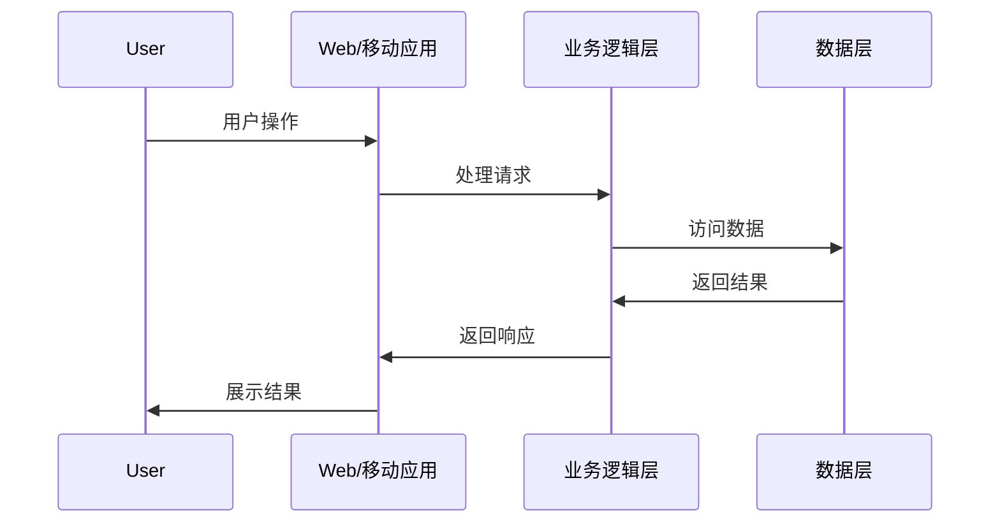
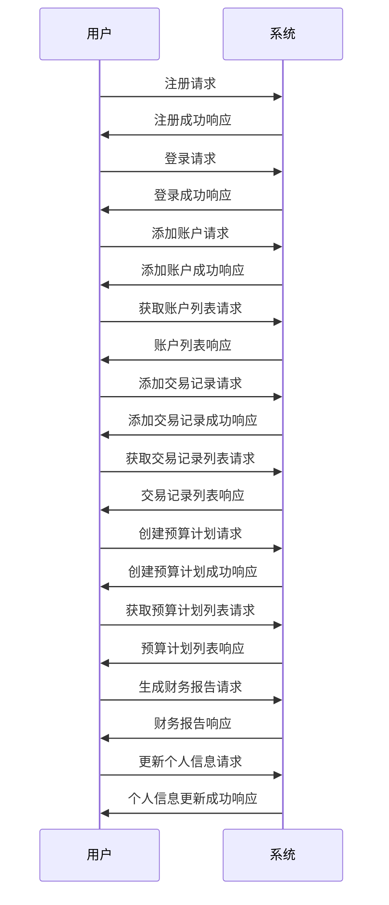

                 

### 个人消费模式的现状

个人消费模式，即个体在日常生活中进行消费的方式和习惯，是现代社会经济活动中不可或缺的一部分。近年来，随着信息技术和互联网的快速发展，个人消费模式发生了显著的变化，呈现出以下几个显著的趋势和特征。

#### 1.1.1 消费行为的变化趋势

首先，从消费行为的变化趋势来看，线上消费逐渐取代线下消费，成为主要的消费方式。根据《中国互联网发展报告2022》的数据显示，截至2021年底，我国电子商务用户规模达到10.3亿人，占网民总数的95.8%。线上消费的便捷性和多样化选择，使得越来越多的人倾向于通过电子商务平台购物。与此同时，移动支付技术的普及，进一步推动了线上消费的普及。

其次，消费行为的个性化趋势愈发明显。随着消费者对品质和服务的需求不断提高，越来越多的品牌和商家开始注重个性化服务，通过大数据分析和用户画像，为消费者提供个性化的产品推荐和服务。例如，淘宝的“猜你喜欢”功能，通过对用户的历史浏览和购买行为进行分析，为用户推荐可能感兴趣的商品。

#### 1.1.2 消费模式的主要特征

消费模式的主要特征包括：

1. **高频化**：随着互联网的普及，消费者进行消费的频率显著提高。例如，外卖、快递等即时性服务的普及，使得消费者可以随时随地享受到所需的商品或服务。

2. **多元化**：消费内容不仅限于实物商品，还包括数字产品、服务预订等多种形式。例如，在线教育、在线医疗咨询等服务的兴起，丰富了消费者的消费选择。

3. **便捷化**：互联网和移动设备的普及，使得消费变得更加便捷。通过手机App、微信支付等，消费者可以轻松完成支付和交易过程。

4. **数字化**：数字化技术在消费领域的应用日益广泛，从电子支付到电子发票，再到智能推荐系统，数字化技术正深刻改变着消费模式。

#### 1.1.3 个人消费模式的重要性

个人消费模式的重要性体现在以下几个方面：

1. **经济增长的驱动力**：消费是推动经济增长的重要动力之一。个人消费模式的演变，带动了相关产业的发展，如电子商务、物流配送、移动支付等，促进了整体经济的增长。

2. **社会变革的反映**：消费模式的变化，是社会变革的反映。例如，线上消费的普及，不仅改变了人们的购物习惯，也推动了城市商业格局的改变。

3. **个人理财意识提升**：随着人们对个人财务管理的重视程度提高，智能预算管理系统等工具应运而生，帮助个人更好地管理自己的财务，提高理财效率。

综上所述，个人消费模式正经历着深刻的变革，其趋势和特征不仅反映了社会经济的发展，也对个人的生活方式和财务状况产生了深远的影响。接下来，我们将进一步探讨智能预算管理系统的意义，以及预算管理系统的边界与外延。

### 1.2 智能预算管理系统的意义

智能预算管理系统，作为现代财务管理的重要工具，旨在帮助个人或家庭更高效地管理财务，确保收支平衡，实现财务目标。其意义可以从以下几个方面进行阐述：

#### 1.2.1 智能预算管理的需求

首先，智能预算管理的需求源自于现代消费模式的复杂性和个人财务管理的挑战。随着个人消费行为的高频化、多元化和便捷化，个人或家庭需要更有效的方式来监控和管理自己的收支情况。传统的手写记账或者简单的财务软件已经无法满足人们对精细化管理和智能化分析的需求。

其次，随着金融市场的发展和理财产品的多样化，个人需要更好地规划自己的财务，以实现资产增值。智能预算管理系统通过数据分析和智能推荐，可以帮助用户制定合理的理财计划，降低财务风险。

#### 1.2.2 智能预算管理系统的作用

智能预算管理系统的主要作用包括：

1. **自动化记账**：系统可以通过与银行账户、信用卡、支付宝等金融平台的连接，自动记录用户的消费信息，实现实时记账，避免了手动记账的繁琐和易错性。

2. **智能分类**：系统根据用户的消费数据，自动对消费进行分类，如日常开销、娱乐消费、投资理财等，帮助用户了解自己的消费结构和支出情况。

3. **预算规划**：系统可以基于用户的收入和支出数据，自动生成预算计划，包括每月、每季度的支出预算，并根据实际情况进行调整。

4. **预警提示**：系统可以根据用户的财务状况和预算设定，提前预警可能出现的财务风险，如超支、透支等，帮助用户及时调整财务行为。

5. **财务分析**：系统可以对用户的财务数据进行分析，生成详细的财务报告，如收入来源、支出分布、资产状况等，帮助用户更好地了解自己的财务状况。

#### 1.2.3 智能预算管理系统的应用场景

智能预算管理系统适用于各种财务需求场景，包括：

1. **个人和家庭**：对于个人和家庭而言，智能预算管理系统可以帮助他们更好地管理日常开支，规划长期财务目标，如购房、教育、退休等。

2. **小型企业**：对于小型企业主来说，智能预算管理系统可以帮助他们管理公司的收支，控制成本，提高运营效率。

3. **预算编制和执行**：政府部门和公共机构可以使用智能预算管理系统进行预算编制和执行，实现精细化管理和透明化运作。

4. **投资理财**：对于投资者而言，智能预算管理系统可以帮助他们更好地管理投资组合，调整投资策略，实现资产的合理配置。

5. **紧急应对**：在突发情况下，如失业、疾病等，智能预算管理系统可以帮助用户迅速调整财务计划，应对紧急财务需求。

综上所述，智能预算管理系统在现代财务管理中具有重要意义，它不仅提高了个人和家庭财务管理的效果，也为企业、政府和投资者提供了有效的财务工具。接下来，我们将探讨预算管理系统的边界与外延，了解其与其他系统的关系和未来的发展趋势。

### 1.3 预算管理系统的边界与外延

预算管理系统，作为现代财务管理的重要组成部分，其定义、边界与外延是理解其功能和应用的关键。在这一部分，我们将详细阐述预算管理系统的定义，探讨其与其他系统的关系，并展望其未来的发展趋势。

#### 1.3.1 预算管理的定义

预算管理，是指通过规划、监控和调整财务预算，实现组织或个人的财务目标的过程。预算管理系统，则是指用于支持这一过程的一系列工具和技术。具体来说，预算管理包括以下几个核心环节：

1. **预算编制**：根据组织的战略目标和财务预测，制定详细的预算计划，包括收入、支出、利润等关键指标。

2. **预算审批**：对预算计划进行审核和批准，确保预算的合理性和可行性。

3. **预算执行**：根据批准的预算计划，实际开展财务活动，记录和追踪收入和支出情况。

4. **预算分析**：定期对预算执行情况进行评估，分析差异，找出问题，提出改进建议。

5. **预算调整**：根据实际执行情况和外部环境的变化，对预算计划进行动态调整，确保财务目标的实现。

#### 1.3.2 预算管理系统与其他系统的关系

预算管理系统并不是孤立存在的，它与其他系统紧密关联，共同构成了一个完整的财务管理体系。以下是预算管理系统与其他系统的一些关系：

1. **ERP系统**：企业资源规划（ERP）系统是企业进行全方位资源管理的综合性系统，预算管理系统通常是ERP系统的一个模块。ERP系统提供全面的财务数据，支持预算编制和执行。

2. **CRM系统**：客户关系管理（CRM）系统主要关注企业与客户之间的互动。预算管理系统可以通过CRM系统获取客户订单和销售数据，为预算编制提供依据。

3. **财务会计系统**：财务会计系统负责记录和处理企业的财务交易，生成财务报表。预算管理系统与财务会计系统紧密集成，确保预算数据与实际财务数据的一致性。

4. **项目管理系统**：项目管理系统帮助组织管理项目进度、资源和成本。预算管理系统可以与项目管理系统集成，确保项目预算的执行和监控。

5. **人力资源系统**：人力资源系统管理员工的工资、福利等。预算管理系统可以根据人力资源系统的数据，制定相应的预算计划，如员工薪酬预算。

#### 1.3.3 预算管理系统的发展趋势

随着科技的不断进步，预算管理系统也在不断发展，呈现出以下几个趋势：

1. **智能化**：人工智能和大数据技术的应用，使得预算管理系统更加智能化。通过机器学习算法，系统能够自动分析大量财务数据，预测财务趋势，提供更准确的预算建议。

2. **移动化**：随着移动互联网的普及，预算管理系统逐渐向移动端迁移。用户可以通过手机App随时随地查看和调整预算，提高了管理的灵活性和便捷性。

3. **可视化**：预算管理系统通过数据可视化技术，将复杂的财务数据以图表、仪表板等形式直观展示，帮助用户更轻松地理解和分析财务状况。

4. **自动化**：自动化技术使得预算管理系统更加高效。通过自动化流程，系统可以自动完成预算编制、审批、执行和数据分析等任务，减少了人工干预。

5. **云化**：云技术的发展，使得预算管理系统可以部署在云端，实现数据的集中管理和远程访问。这为跨地域、跨组织的预算管理提供了便利。

综上所述，预算管理系统在现代财务管理中发挥着重要作用，其定义、边界与外延以及与其他系统的关系，构成了一个完整的财务管理生态。随着科技的进步，预算管理系统将继续发展，为个人、企业和组织提供更高效、智能的财务管理工具。

### 1.4 本书的核心概念与联系

本书的核心概念贯穿于个人消费模式分析与预算管理系统的研究中，它们共同构成了理解和应用智能预算管理系统的理论基础。以下是对这些核心概念的详细解释及其之间的联系：

#### 1.4.1 核心概念解释

1. **个人消费模式**：个人消费模式是指个体在日常生活中进行消费的方式和习惯。它包括消费行为、消费习惯和消费结构等要素。

2. **智能预算管理系统**：智能预算管理系统是一种利用人工智能技术和大数据分析，帮助个人或组织进行财务管理的工具。它能够自动化记账、智能分类、预算规划和风险预警。

3. **消费行为分析**：消费行为分析是指对个人消费行为的研究，包括消费动机、消费方式、消费频率等，通过对这些行为的分析，可以识别出消费习惯。

4. **消费习惯识别**：消费习惯识别是通过分析消费行为，识别出个人的消费习惯和模式，以便进行针对性的财务管理和预算规划。

5. **预算管理功能**：预算管理功能包括预算编制、预算审批、预算执行、预算分析和预算调整等环节，这些功能共同确保预算目标的实现。

#### 1.4.2 概念之间的联系

这些核心概念之间存在着密切的联系，它们相互影响、相互支持，共同构成了一个完整的智能预算管理系统：

1. **个人消费模式与智能预算管理系统**：个人消费模式是智能预算管理系统的重要输入，消费行为和习惯的分析结果直接用于预算编制和规划。例如，通过消费行为分析，系统可以识别出哪些支出属于固定支出，哪些属于可调整支出，从而制定出合理的预算计划。

2. **消费行为分析与消费习惯识别**：消费行为分析是消费习惯识别的基础。通过对消费行为的详细分析，可以识别出用户的消费习惯，例如频繁的餐饮消费、高额的娱乐支出等，这些习惯对预算管理有重要影响。

3. **消费习惯识别与预算管理功能**：消费习惯识别结果用于预算管理功能的具体实施。例如，识别出某个用户的消费习惯后，系统可以设置相应的支出限制，确保用户不会超支。同时，这些识别结果也可以用于预算调整，当用户的财务状况发生变化时，系统可以动态调整预算计划。

4. **智能预算管理系统与预算管理功能**：智能预算管理系统是预算管理功能的技术实现，它通过自动化、智能化的手段，支持预算编制、审批、执行、分析和调整。例如，系统可以通过机器学习算法，对用户的历史消费数据进行预测，从而制定出更准确的预算计划。

#### 1.4.3 核心概念的应用与扩展

在应用层面，这些核心概念可以帮助用户更有效地管理个人或家庭的财务，实现收支平衡和财务目标。例如，通过消费行为分析，用户可以了解自己的消费结构和习惯，从而调整不合理的支出，优化财务状况。

在扩展层面，这些概念可以应用于更广泛的领域，如企业财务管理、政府预算管理、投资理财等。例如，在企业财务管理中，智能预算管理系统可以帮助企业制定和执行财务预算，提高运营效率和盈利能力。在政府预算管理中，系统可以支持政府部门进行预算编制和执行，实现财政透明和高效管理。

总之，本书的核心概念与联系构成了一个系统的理论框架，为智能预算管理系统的应用提供了坚实的基础。通过这些概念的应用和扩展，用户可以更好地管理个人和组织的财务，实现财务目标。

### 2.1.1 消费模式概述

消费模式是指个体在日常生活中进行消费的方式和习惯，它涵盖了消费行为、消费结构和消费习惯等多个方面。理解消费模式对于制定有效的预算管理策略至关重要。以下是消费模式的定义、分类和研究方法。

#### 2.1.1.1 消费模式的定义

消费模式（Consumer Spending Pattern）是指个体或家庭在一定时间内，通过各种支付手段购买商品和服务的行为和方式。消费模式不仅包括物质消费，还包括精神消费和体验消费等。消费模式反映了消费者的偏好、经济状况、文化背景和社会环境等多方面因素。

#### 2.1.1.2 消费模式的分类

根据不同的分类标准，消费模式可以分为以下几类：

1. **按消费目的分类**：消费模式可以分为生存消费、发展消费和享受消费。生存消费是指满足基本生活需求的消费，如食品、住房、医疗等；发展消费是指提高个人素质和生活质量的消费，如教育、培训、旅游等；享受消费则是为了满足精神需求的消费，如娱乐、文化、休闲等。

2. **按消费形式分类**：消费模式可以分为直接消费和间接消费。直接消费是指消费者直接购买和使用商品或服务的消费行为，如购物、餐饮、看电影等；间接消费则是指通过支付费用，间接获得商品或服务的消费，如购买保险、订阅服务等。

3. **按消费频率分类**：消费模式可以分为高频消费和低频消费。高频消费是指消费者在一定时间内频繁进行的消费行为，如购物、用餐、出行等；低频消费则是指消费者在较长时间内才会进行的消费行为，如装修、购车、旅游等。

#### 2.1.1.3 消费模式的研究方法

研究消费模式的方法主要包括定量分析和定性分析两种。

1. **定量分析**：定量分析是通过收集和分析大量的数据，对消费模式进行量化研究。常用的方法包括统计分析、回归分析、时间序列分析等。例如，通过分析消费者的收入水平、消费总额、消费结构等数据，可以了解消费模式的变化趋势和特征。

2. **定性分析**：定性分析是通过深入访谈、焦点小组讨论、观察等方法，了解消费者的消费动机、心理和行为。这种方法有助于揭示消费模式背后的深层次原因，提供更为细致和具体的分析。

在实际应用中，定量分析和定性分析可以结合使用，以获取全面和深入的消费模式理解。例如，通过定量分析获取消费行为的数据支持，通过定性分析深入了解消费者的心理动机和行为模式。

#### 2.1.1.4 消费模式与预算管理的关系

消费模式与预算管理密切相关。了解和掌握个人的消费模式，可以帮助个人或家庭更好地制定预算计划，确保收支平衡和财务目标实现。以下是如何通过消费模式进行预算管理的一些策略：

1. **分类管理**：根据消费模式对消费进行分类管理，如区分必需品和非必需品。通过预算分配，确保必需品消费得到优先满足，同时控制非必需品的支出。

2. **周期性规划**：根据消费模式的周期性特征，制定周期性的预算计划。例如，每月制定一次预算，按季度或年度进行预算调整，以适应消费模式的变动。

3. **调整消费习惯**：通过分析消费模式，识别不合理的消费行为和习惯，制定改进计划，如减少不必要的支出、提高消费效率等。

4. **目标导向**：根据个人的财务目标，如购房、教育、退休等，制定相应的预算计划，确保财务资源的合理配置。

通过这些策略，个人可以更有效地管理自己的财务，实现长期的财务健康和稳定。

综上所述，消费模式是预算管理的重要基础，通过对其进行深入研究和理解，个人或家庭可以更好地进行财务规划和管理，实现财务自由和目标。接下来，我们将进一步探讨消费行为分析的内容和消费者行为的影响因素。

### 2.1.2 消费行为分析

消费行为分析是研究个体或群体在购买和使用商品或服务过程中的行为模式、动机和决策过程。它不仅有助于理解消费者的需求和行为特征，还可以为企业和政策制定者提供重要的决策依据。以下是消费行为分析的主要内容：

#### 2.1.2.1 消费行为的定义

消费行为（Consumer Behavior）是指消费者在获取、使用和处置商品或服务过程中所表现出的行为模式。它包括一系列的心理过程和行为活动，如需求识别、信息搜索、评估选择、购买决策、使用体验和处置行为。

#### 2.1.2.2 消费行为的特征

消费行为具有以下几个显著特征：

1. **多样性**：消费者的消费行为因文化、经济、社会和心理因素的影响而表现出多样性。例如，不同年龄、性别、收入水平和地域的消费者，其消费行为和偏好可能截然不同。

2. **复杂性**：消费行为是一个复杂的过程，涉及多个阶段和多个决策环节。消费者在购买决策过程中可能会受到多种因素的影响，如个人需求、产品特性、价格、品牌形象、促销活动等。

3. **互动性**：消费者的消费行为不仅受自身因素影响，还受到外部环境和他人的影响。例如，消费者的决策可能会受到朋友、家人或社交媒体上其他用户评价的影响。

4. **持续性**：消费行为不是一次性的，而是持续的。消费者可能会反复购买同一产品或服务，其行为模式也会随着时间的推移而发生变化。

#### 2.1.2.3 消费行为的影响因素

消费行为受到多种因素的影响，主要可以分为以下几个方面：

1. **个人因素**：包括年龄、性别、收入、职业、教育水平、生活方式和个性等。例如，年轻人可能更倾向于追求时尚和潮流，而中年人可能更注重性价比和品牌形象。

2. **心理因素**：包括动机、感知、信念、态度和自我概念等。动机是驱使消费者采取行动的内在动力，感知是消费者对产品和服务的认知和理解，信念和态度则影响消费者的购买决策和品牌忠诚度。

3. **社会因素**：包括家庭、社会群体、参考群体和文化等。家庭是消费者行为的主要影响因素之一，家庭中的成员和关系会直接影响消费决策。社会群体和参考群体（如朋友、同事、明星等）也会影响消费者的消费行为。文化则通过价值观、信仰、习俗和社会规范等影响消费者的消费习惯和偏好。

4. **环境因素**：包括经济环境、技术环境、政策环境和社会环境等。经济环境（如经济状况、收入水平、物价水平等）直接影响消费者的购买力和消费决策。技术环境（如互联网、移动设备、电子商务等）改变了消费者的购物方式和体验。政策环境（如税收政策、补贴政策、法律法规等）也会影响消费者的消费行为。

#### 2.1.2.4 消费行为分析的方法

消费行为分析的方法主要包括定量分析和定性分析。

1. **定量分析**：定量分析通过收集和分析大量的数据，对消费行为进行量化研究。常用的方法包括统计分析、回归分析、时间序列分析和多元统计分析等。例如，通过分析消费者的收入水平、消费总额、消费频率等数据，可以了解消费行为的变化趋势和特征。

2. **定性分析**：定性分析通过深入访谈、焦点小组讨论、观察等方法，了解消费者的消费动机、心理和行为。这种方法有助于揭示消费行为背后的深层次原因，提供更为细致和具体的分析。例如，通过访谈消费者，可以了解他们对于某产品或服务的真实需求和购买体验。

#### 2.1.2.5 消费行为分析在预算管理中的应用

消费行为分析在预算管理中具有重要作用，以下是其应用场景：

1. **消费计划制定**：通过分析消费行为，了解消费者的消费习惯和偏好，可以更准确地制定消费计划。例如，根据消费者的消费模式，设定每月的预算限额，确保合理分配资源。

2. **支出管理**：通过分析消费行为，识别出不必要的支出和可削减的支出项目，制定合理的支出管理策略。例如，对于经常性支出项目（如餐饮、交通等），可以设定支出上限，避免超支。

3. **财务目标设定**：根据消费行为分析，设定长期和短期的财务目标，如购房、教育储蓄、退休规划等。通过消费行为分析，可以评估实现这些目标的可能性，制定可行的财务计划。

4. **风险管理**：通过分析消费行为，识别出潜在的财务风险，如过度消费、信用卡债务等。制定相应的风险管理措施，如设定支出上限、优先偿还高利率债务等。

综上所述，消费行为分析是预算管理的重要组成部分，通过对消费者行为的深入了解和分析，可以更有效地管理个人或家庭的财务，实现财务健康和目标。接下来，我们将探讨如何识别和培养良好的消费习惯。

### 2.1.3 消费习惯识别

消费习惯（Consumer Habits）是指在长期生活中形成的、相对稳定的消费行为模式。良好的消费习惯有助于实现财务目标，优化生活品质。识别和培养良好的消费习惯，是预算管理的重要一环。以下是消费习惯的定义、分类和识别方法。

#### 2.1.3.1 消费习惯的定义

消费习惯是指消费者在消费过程中形成的、相对固定的行为模式。这些习惯可能源于个人偏好、文化背景、家庭环境或社会影响。例如，定期购买某种品牌的产品，习惯性地选择某家餐厅用餐，都属于消费习惯。

#### 2.1.3.2 消费习惯的分类

消费习惯可以根据消费内容、消费频率和消费方式等不同标准进行分类。以下是一些常见的消费习惯分类：

1. **按消费内容分类**：消费习惯可以分为物质消费习惯和精神消费习惯。物质消费习惯包括购买日用品、服装、电子产品等；精神消费习惯则包括阅读、旅游、参加社交活动等。

2. **按消费频率分类**：消费习惯可以分为高频消费习惯和低频消费习惯。高频消费习惯如每天购买咖啡、每月购物等；低频消费习惯如每年旅游、每两年换手机等。

3. **按消费方式分类**：消费习惯可以分为线上消费习惯和线下消费习惯。线上消费习惯如通过电商平台购买商品、在线支付账单等；线下消费习惯如到实体店购物、使用现金支付等。

#### 2.1.3.3 消费习惯的识别方法

识别消费习惯的方法主要包括以下几种：

1. **数据分析**：通过分析消费记录、银行账户交易记录、信用卡账单等数据，可以识别出消费者的消费模式。数据分析可以帮助消费者了解自己的消费频率、消费金额、消费类型等，从而识别出消费习惯。

2. **自我反思**：消费者可以通过自我反思，回忆自己的消费行为，识别出日常生活中的消费习惯。例如，每天早上习惯性地购买咖啡，每周定期购买日用品等。

3. **问卷调查**：通过设计消费习惯问卷，收集消费者的消费行为数据，可以帮助识别和了解消费习惯。问卷调查可以包括消费频率、消费金额、消费类型、消费动机等方面的问题。

4. **行为观察**：观察消费者的日常消费行为，如购物习惯、支付方式等，可以帮助识别消费习惯。例如，通过观察消费者在超市的购物行为，可以了解他们的品牌偏好和购物顺序。

#### 2.1.3.4 培养良好消费习惯的方法

识别消费习惯后，接下来是培养和优化这些习惯，以下是一些建议：

1. **设定消费目标**：明确财务目标，如减少不必要的支出、增加储蓄等，可以帮助培养良好的消费习惯。例如，设定每月的购物预算，确保不超过预算。

2. **制定预算计划**：根据收入和支出情况，制定详细的预算计划，合理分配资金。预算计划可以帮助消费者更好地控制支出，避免过度消费。

3. **自动化记账**：使用智能预算管理系统或财务软件，自动记录消费信息，实时监控支出情况。自动化记账可以减少手动记录的繁琐，提高预算管理的准确性。

4. **设置消费提醒**：设置消费提醒，如通过手机App或电子邮件，提醒消费者即将超支或达到消费预算上限。消费提醒可以帮助消费者及时调整消费行为。

5. **培养自律意识**：通过自我反思和自律，培养良好的消费习惯。例如，避免冲动购物，坚持定期储蓄等。

6. **寻求外部支持**：加入财务管理社群或寻求专业理财顾问的帮助，可以提供额外的支持和鼓励，帮助消费者培养和优化消费习惯。

通过识别和培养良好的消费习惯，消费者可以更好地管理个人财务，实现财务目标。良好的消费习惯不仅有助于财务健康，还能提高生活质量。接下来，我们将进一步探讨智能预算管理系统的概述，包括其定义、特点和应用目标。

### 2.2.1 智能预算管理概述

智能预算管理系统，是一种结合人工智能和大数据技术的财务管理工具，旨在帮助个人或家庭实现财务目标，提高财务管理的效率和准确性。其定义、特点和应用目标如下：

#### 2.2.1.1 智能预算管理的定义

智能预算管理（Smart Budget Management）是指通过应用人工智能技术和大数据分析，对个人的财务数据进行分析和预测，制定出合理有效的预算计划，并对其进行监控和调整。它不仅包括预算的编制和审批，还涵盖了预算的执行、分析和反馈等环节。

#### 2.2.1.2 智能预算管理的特点

智能预算管理系统具有以下几个显著特点：

1. **自动化**：通过连接银行账户、信用卡和支付平台，智能预算管理系统可以自动收集和整理消费数据，减少手动记账的繁琐。

2. **智能化**：利用人工智能算法，智能预算管理系统可以对用户的消费行为进行分析，识别出消费模式和趋势，提供个性化的预算建议。

3. **灵活性**：智能预算管理系统可以根据用户的需求和实际情况，动态调整预算计划，确保财务目标能够得到有效实现。

4. **实时性**：系统能够实时监控用户的财务状况，提供实时的支出和收入数据，帮助用户及时调整消费行为。

5. **可视化**：通过图表和报表，智能预算管理系统将复杂的财务数据以直观的方式呈现，使用户能够更容易理解和管理自己的财务。

#### 2.2.1.3 智能预算管理的目标

智能预算管理的目标主要包括以下几个方面：

1. **优化资源配置**：通过合理的预算规划，确保资金的有效使用，避免浪费和不必要的支出。

2. **提高财务管理效率**：自动化和智能化的工具可以大大减少人工工作量，提高财务管理效率。

3. **实现财务目标**：帮助用户制定和实现短期和长期的财务目标，如储蓄、投资、购房、教育等。

4. **降低财务风险**：通过监控和预警，及时识别和应对潜在的财务风险，如超支、透支等。

5. **提升生活质量**：通过合理的财务管理，确保财务状况稳定和健康，提高用户的生活质量。

#### 2.2.1.4 智能预算管理系统的应用场景

智能预算管理系统适用于各种财务需求场景，包括：

1. **个人和家庭**：对于个人和家庭而言，智能预算管理系统可以帮助他们更好地管理日常开支，规划长期财务目标，如购房、教育、退休等。

2. **小型企业**：对于小型企业主来说，智能预算管理系统可以帮助他们管理公司的收支，控制成本，提高运营效率。

3. **预算编制和执行**：政府部门和公共机构可以使用智能预算管理系统进行预算编制和执行，实现精细化管理和透明化运作。

4. **投资理财**：对于投资者而言，智能预算管理系统可以帮助他们更好地管理投资组合，调整投资策略，实现资产的合理配置。

5. **紧急应对**：在突发情况下，如失业、疾病等，智能预算管理系统可以帮助用户迅速调整财务计划，应对紧急财务需求。

综上所述，智能预算管理系统是一种高效、智能的财务管理工具，它通过应用人工智能技术和大数据分析，帮助用户实现财务目标，提高财务管理效率，降低财务风险。接下来，我们将详细探讨智能预算管理系统的主要功能。

### 2.2.2 预算管理功能

智能预算管理系统通过一系列功能模块，帮助用户实现有效的财务管理和目标。以下是智能预算管理系统的主要功能及其详细描述：

#### 2.2.2.1 收入管理

收入管理是预算管理系统的基础功能，主要用于记录、分类和管理用户的收入来源。用户可以输入每月的收入总额，系统会自动分类为工资、奖金、利息收入、投资收益等。通过这些数据，用户可以实时查看和监控自己的收入状况，确保收入信息的准确性和完整性。

**收入管理功能的具体应用：**
1. **实时监控**：用户可以随时查看当月和累计的收入总额，了解收入变化趋势。
2. **分类管理**：系统自动对收入进行分类，帮助用户清晰地了解各类收入的来源。
3. **提醒设置**：用户可以设置收入提醒，确保按时接收收入到账通知。

#### 2.2.2.2 支出管理

支出管理是预算管理系统的核心功能，主要用于记录、分类和监控用户的消费支出。用户可以输入每次消费的详细信息，包括消费日期、金额、类别、支付方式等。系统会自动将这些数据分类为日常开销、娱乐消费、交通费用、教育支出等，并提供详细的支出报表。

**支出管理功能的具体应用：**
1. **消费记录**：用户可以记录每次的消费行为，系统会自动存储和分类。
2. **数据分析**：系统提供各种数据分析工具，帮助用户了解自己的消费习惯和支出结构。
3. **预算控制**：系统可以设定每月的支出预算，用户在消费时系统会实时提醒是否超支。

#### 2.2.2.3 财务分析

财务分析功能用于对用户的财务状况进行全面评估和分析，提供财务健康报告。系统会自动生成包括收入、支出、资产负债表等财务报表，帮助用户清晰地了解自己的财务状况。

**财务分析功能的具体应用：**
1. **财务报表**：系统生成详细的财务报表，包括月度、季度和年度报告。
2. **趋势分析**：系统分析用户的历史数据，提供收入和支出趋势图，帮助用户预测未来的财务状况。
3. **健康评估**：系统根据用户的财务数据，评估财务健康状况，提供改善建议。

#### 2.2.2.4 财务预测

财务预测功能利用机器学习和大数据分析技术，对用户的财务行为进行预测，帮助用户制定未来的财务计划。系统可以根据用户的历史收入和支出数据，预测未来某一时间点的财务状况，并提供相应的财务建议。

**财务预测功能的具体应用：**
1. **收入预测**：系统预测用户未来的收入情况，帮助用户制定收入规划。
2. **支出预测**：系统预测用户未来的支出趋势，帮助用户合理调整预算。
3. **风险预警**：系统根据预测结果，提前预警可能出现的财务风险，如超支、透支等。

#### 2.2.2.5 预算调整

预算调整功能允许用户根据实际情况动态调整预算计划。系统提供灵活的调整工具，用户可以根据收入变化、消费习惯或其他因素，调整每月或每年的预算。

**预算调整功能的具体应用：**
1. **调整预算**：用户可以随时调整收入和支出预算，确保预算计划的合理性。
2. **智能建议**：系统根据用户的财务数据，提供预算调整建议，帮助用户做出最优决策。
3. **反馈机制**：系统记录每次预算调整的情况，为未来的预算规划提供参考。

#### 2.2.2.6 风险管理

风险管理功能用于识别和应对可能的财务风险，保护用户的财务安全。系统会监控用户的财务行为，识别潜在的财务风险，并提供应对策略。

**风险管理功能的具体应用：**
1. **风险识别**：系统分析用户的历史数据和当前财务状况，识别可能的风险。
2. **预警机制**：系统提前预警潜在的风险，如过度消费、信用卡透支等。
3. **应对策略**：系统提供风险应对策略，帮助用户降低财务风险。

通过这些功能模块，智能预算管理系统为用户提供了全面的财务管理工具，帮助用户实现财务目标，提高财务管理效率。接下来，我们将进一步探讨智能预算管理系统的原理，包括数据收集与分析、模型构建与优化以及预算调整与反馈。

### 2.2.3 智能预算管理原理

智能预算管理系统通过一系列的原理和机制，实现高效、准确的财务管理。以下从数据收集与分析、模型构建与优化以及预算调整与反馈三个方面详细解释智能预算管理的原理。

#### 2.2.3.1 数据收集与分析

数据收集是智能预算管理系统的基础。系统通过多种渠道收集用户财务数据，包括银行账户交易记录、信用卡消费记录、支付平台交易数据等。为了确保数据的准确性和完整性，系统采用以下方法：

1. **自动化收集**：通过与银行、信用卡公司、支付平台等金融机构的API接口连接，系统可以自动同步用户的交易数据，避免手动输入的繁琐和错误。

2. **数据清洗**：收集到的数据可能包含重复、错误或缺失的信息，系统通过数据清洗技术，去除重复记录、修正错误数据并填补缺失值，确保数据质量。

3. **实时更新**：系统采用实时数据同步技术，确保用户财务数据的最新性和实时性，为后续分析提供可靠的数据基础。

数据收集完成后，系统通过大数据分析技术，对用户的历史消费数据进行分析。具体包括：

1. **消费行为分析**：系统对用户的消费行为进行分类，识别高频消费项目、大额消费行为等，了解用户的消费习惯和偏好。

2. **财务趋势分析**：系统通过时间序列分析，预测用户的财务趋势，如收入增长、支出减少等，为预算编制提供参考。

3. **相关性分析**：系统分析收入和支出之间的关系，识别可能的影响因素，如季节性变化、工作变动等，为预算调整提供依据。

#### 2.2.3.2 模型构建与优化

基于数据分析的结果，智能预算管理系统构建多个预测和优化模型，用于制定和调整预算计划。以下是主要模型及其构建方法：

1. **回归模型**：回归模型通过分析收入和支出数据，建立收入和支出的线性关系，预测未来的收入和支出。具体包括一元线性回归、多元线性回归等。

2. **时间序列模型**：时间序列模型利用历史财务数据的时间序列特征，预测未来的财务状况。常见的模型有ARIMA（自回归积分滑动平均模型）、SARIMA（季节性自回归积分滑动平均模型）等。

3. **机器学习模型**：系统可以采用机器学习算法，如随机森林、梯度提升树等，构建预测模型。机器学习模型通过训练大量数据，自动学习收入和支出的关系，提高预测准确性。

4. **优化模型**：系统采用线性规划和整数规划等优化方法，制定最优的预算计划。优化模型的目标是最大化满足用户的财务目标，如最小化支出、最大化储蓄等。

模型构建后，系统通过以下方法进行优化：

1. **模型校验**：系统定期校验模型，确保模型的有效性和准确性。校验方法包括交叉验证、回测等。

2. **模型更新**：系统根据新的数据和反馈，不断更新和优化模型，提高预测和规划的准确性。

#### 2.2.3.3 预算调整与反馈

预算调整是智能预算管理系统的重要功能，通过实时监控和动态调整，确保预算计划的合理性和可行性。以下是预算调整的过程和反馈机制：

1. **实时监控**：系统实时监控用户的财务状况，包括收入、支出和预算执行情况。当发现潜在的超支或收入减少时，系统会及时发出预警。

2. **预算调整**：系统根据监控结果和预测模型，自动或手动调整预算计划。调整方法包括重新分配预算、降低支出计划、增加收入计划等。

3. **用户反馈**：用户可以随时查看和调整预算计划，系统记录每次调整的原因和效果，为后续预算调整提供参考。用户还可以通过反馈机制，向系统提供改进建议。

4. **优化反馈**：系统根据用户的反馈，不断优化预算调整策略，提高调整效果。例如，通过分析用户的反馈，系统可以调整预警阈值、优化预算分配策略等。

通过数据收集与分析、模型构建与优化以及预算调整与反馈，智能预算管理系统实现了高效、智能的财务管理。用户可以通过系统实时监控和调整财务状况，实现财务目标，提高生活质量。接下来，我们将进一步探讨系统设计与实现的相关内容。

### 3.1 系统功能设计

系统功能设计是智能预算管理系统的核心环节，它决定了系统的实用性、可靠性和扩展性。在功能设计过程中，我们需要明确系统的主要功能模块，并设计合理的领域模型和系统架构。

#### 3.1.1 领域模型设计

领域模型是系统功能设计的基础，它定义了系统中的核心实体及其关系。以下是智能预算管理系统的领域模型设计：

##### 3.1.1.1 类图设计

类图是领域模型的核心组成部分，它展示了系统中的主要类及其关系。以下是智能预算管理系统的主要类及其关系：

1. **User（用户）**：代表系统用户，包括个人用户和企业用户。用户类包含基本信息（如姓名、年龄、职业等）和财务信息（如收入、支出等）。

2. **Account（账户）**：代表用户的银行账户、信用卡账户等。账户类包含账户基本信息（如账户名称、账户类型等）和账户余额信息。

3. **Transaction（交易）**：代表用户的每一次财务交易，包括收入、支出、转账等。交易类包含交易详细信息（如交易日期、金额、类型等）。

4. **Category（类别）**：代表用户的消费类别，如餐饮、交通、娱乐等。类别类包含类别名称、类别描述等信息。

5. **Budget（预算）**：代表用户的预算计划，包括每月、每季度的支出预算和收入预算。预算类包含预算金额、预算周期等信息。

6. **Report（报告）**：代表用户的财务报告，包括收入、支出、资产负债表等。报告类包含报告生成时间、报告内容等信息。

类图中的关系如下：

- **User** 与 **Account** 之间存在“1对多”的关系，即一个用户可以拥有多个账户。
- **User** 与 **Transaction** 之间存在“1对多”的关系，即一个用户可以有多次交易。
- **Transaction** 与 **Category** 之间存在“多对一”的关系，即一次交易可以属于多个类别。
- **User** 与 **Budget** 之间存在“1对多”的关系，即一个用户可以制定多个预算计划。
- **User** 与 **Report** 之间存在“1对多”的关系，即一个用户可以生成多个财务报告。

以下是类图的 Mermaid 表示：

```mermaid
classDiagram
    User "1"..<.. Account
    User "1"..<.. Transaction
    Transaction "1..*"..<.. Category
    User "1"..<.. Budget
    User "1"..<.. Report
```

##### 3.1.1.2 用例图设计

用例图是领域模型的扩展，它展示了系统的用户与系统功能之间的交互关系。以下是智能预算管理系统的主要用例及其关系：

1. **用户注册和登录**：用户通过注册和登录进入系统，管理个人财务信息。

2. **账户管理**：用户可以查看、添加、编辑和删除账户信息。

3. **交易记录管理**：用户可以查看、添加、编辑和删除交易记录。

4. **消费类别管理**：用户可以查看、添加、编辑和删除消费类别。

5. **预算管理**：用户可以查看、添加、编辑和删除预算计划。

6. **财务报告生成**：用户可以生成并查看财务报告。

用例图中的关系如下：

- **用户** 与 **账户管理**、**交易记录管理**、**消费类别管理**、**预算管理**、**财务报告生成** 等用例之间存在交互关系。

以下是用例图的 Mermaid 表示：

```mermaid
usecaseDiagram
    User <<actor>>
    AccountManagement <<usecase>> "管理账户"
    TransactionManagement <<usecase>> "管理交易记录"
    CategoryManagement <<usecase>> "管理消费类别"
    BudgetManagement <<usecase>> "管理预算"
    ReportGeneration <<usecase>> "生成财务报告"
    User ->> AccountManagement
    User ->> TransactionManagement
    User ->> CategoryManagement
    User ->> BudgetManagement
    User ->> ReportGeneration
```

#### 3.1.2 系统架构设计

系统架构设计决定了系统的性能、可维护性和扩展性。以下是智能预算管理系统的架构设计：

##### 3.2.1.1 架构设计

智能预算管理系统的架构采用三层架构，包括表示层、业务逻辑层和数据层。

1. **表示层**：表示层负责用户界面和前端交互。它包括Web界面和移动应用界面。前端使用React或Vue等框架实现，提供友好的用户交互体验。

2. **业务逻辑层**：业务逻辑层负责处理业务逻辑和数据处理。它包括用户管理、账户管理、交易记录管理、预算管理和财务报告生成等功能模块。业务逻辑层使用Spring Boot等框架实现，确保系统的稳定性和可扩展性。

3. **数据层**：数据层负责数据存储和管理。它使用关系型数据库（如MySQL）或NoSQL数据库（如MongoDB），存储用户的账户信息、交易记录、预算计划和财务报告等信息。

以下是系统架构图的 Mermaid 表示：



##### 3.2.1.2 技术选型

智能预算管理系统采用了以下技术选型：

1. **前端技术**：使用React或Vue.js实现前端界面，提供动态、交互式的用户体验。结合Webpack或Vite等前端构建工具，实现模块化和性能优化。

2. **后端技术**：使用Spring Boot实现后端业务逻辑，提供RESTful API，支持前后端分离开发。Spring Boot具备良好的性能和扩展性，能够处理高并发请求。

3. **数据库技术**：使用MySQL作为关系型数据库，存储用户信息、交易记录等数据。MySQL具有成熟、可靠的数据管理和备份机制，适合大规模应用。

4. **数据存储**：对于大数据量和高并发场景，可以使用MongoDB等NoSQL数据库进行数据存储。MongoDB具有灵活的数据模型和高效的读写性能，适合处理复杂、多变的数据。

5. **容器化技术**：采用Docker进行容器化部署，实现系统的自动化部署和扩展。Docker可以简化部署流程，提高系统的可移植性和可维护性。

通过合理的系统架构设计和技术选型，智能预算管理系统不仅能够满足当前的需求，还具有良好的扩展性和可维护性，能够应对未来的发展变化。

### 3.2 系统接口设计

系统接口设计是智能预算管理系统实现数据交互和功能调用的关键环节。一个良好的接口设计能够确保系统模块之间的协同工作，提高系统的灵活性和可扩展性。以下是智能预算管理系统的接口设计，包括接口规范和接口实现。

#### 3.2.1 接口规范

接口规范定义了系统对外提供服务的接口，包括接口的URL、请求和响应格式、参数定义和错误处理等。以下是智能预算管理系统的主要接口规范：

1. **用户管理接口**
   - **注册用户**：用于用户注册，接口URL为 `/api/users/register`，请求格式为JSON，响应格式为JSON。
     ```json
     {
       "username": "string",
       "password": "string",
       "email": "string",
       "fullName": "string"
     }
     ```
     响应：
     ```json
     {
       "status": "success",
       "message": "注册成功",
       "userId": "string"
     }
     ```

   - **登录用户**：用于用户登录，接口URL为 `/api/users/login`，请求格式为JSON，响应格式为JSON。
     ```json
     {
       "username": "string",
       "password": "string"
     }
     ```
     响应：
     ```json
     {
       "status": "success",
       "token": "string"
     }
     ```

   - **获取用户信息**：用于获取用户详细信息，接口URL为 `/api/users/{userId}`，请求格式为JSON，响应格式为JSON。
     ```json
     {
       "status": "success",
       "user": {
         "userId": "string",
         "username": "string",
         "email": "string",
         "fullName": "string"
       }
     }
     ```

2. **账户管理接口**
   - **添加账户**：用于添加用户账户，接口URL为 `/api/accounts`，请求格式为JSON，响应格式为JSON。
     ```json
     {
       "userId": "string",
       "accountName": "string",
       "accountType": "string",
       "balance": "number"
     }
     ```
     响应：
     ```json
     {
       "status": "success",
       "message": "账户添加成功",
       "accountId": "string"
     }
     ```

   - **获取账户列表**：用于获取用户所有账户，接口URL为 `/api/accounts/{userId}`，请求格式为JSON，响应格式为JSON。
     ```json
     {
       "status": "success",
       "accounts": [
         {
           "accountId": "string",
           "accountName": "string",
           "accountType": "string",
           "balance": "number"
         }
       ]
     }
     ```

   - **更新账户信息**：用于更新账户信息，接口URL为 `/api/accounts/{accountId}`，请求格式为JSON，响应格式为JSON。
     ```json
     {
       "accountId": "string",
       "accountName": "string",
       "accountType": "string",
       "balance": "number"
     }
     ```
     响应：
     ```json
     {
       "status": "success",
       "message": "账户信息更新成功"
     }
     ```

3. **交易记录管理接口**
   - **添加交易记录**：用于添加用户交易记录，接口URL为 `/api/transactions`，请求格式为JSON，响应格式为JSON。
     ```json
     {
       "userId": "string",
       "accountId": "string",
       "amount": "number",
       "category": "string",
       "date": "date",
       "note": "string"
     }
     ```
     响应：
     ```json
     {
       "status": "success",
       "message": "交易记录添加成功",
       "transactionId": "string"
     }
     ```

   - **获取交易记录列表**：用于获取用户交易记录列表，接口URL为 `/api/transactions/{userId}`，请求格式为JSON，响应格式为JSON。
     ```json
     {
       "status": "success",
       "transactions": [
         {
           "transactionId": "string",
           "accountId": "string",
           "amount": "number",
           "category": "string",
           "date": "date",
           "note": "string"
         }
       ]
     }
     ```

4. **预算管理接口**
   - **创建预算计划**：用于创建预算计划，接口URL为 `/api/budgets`，请求格式为JSON，响应格式为JSON。
     ```json
     {
       "userId": "string",
       "title": "string",
       "startDate": "date",
       "endDate": "date",
       "monthlyBudget": "number"
     }
     ```
     响应：
     ```json
     {
       "status": "success",
       "message": "预算计划创建成功",
       "budgetId": "string"
     }
     ```

   - **获取预算计划列表**：用于获取用户预算计划列表，接口URL为 `/api/budgets/{userId}`，请求格式为JSON，响应格式为JSON。
     ```json
     {
       "status": "success",
       "budgets": [
         {
           "budgetId": "string",
           "title": "string",
           "startDate": "date",
           "endDate": "date",
           "monthlyBudget": "number"
         }
       ]
     }
     ```

5. **财务报告接口**
   - **生成财务报告**：用于生成用户财务报告，接口URL为 `/api/reports/{userId}`，请求格式为JSON，响应格式为JSON。
     ```json
     {
       "startDate": "date",
       "endDate": "date"
     }
     ```
     响应：
     ```json
     {
       "status": "success",
       "report": {
         "income": "number",
         "expenses": "number",
         "balance": "number"
       }
     }
     ```

#### 3.2.2 接口实现

接口实现涉及前后端代码的编写，以下是智能预算管理系统接口的实现示例：

1. **用户管理接口实现**

   - **注册用户**
     ```java
     @PostMapping("/register")
     public ResponseEntity<?> registerUser(@RequestBody UserRegisterRequest userRegisterRequest) {
         // 实现用户注册逻辑
         // 验证用户信息，保存用户信息，生成用户ID
         // 返回注册成功响应
         return ResponseEntity.ok(new ApiResponse<>("success", "注册成功", userId));
     }
     ```

   - **登录用户**
     ```java
     @PostMapping("/login")
     public ResponseEntity<?> loginUser(@RequestBody UserLoginRequest userLoginRequest) {
         // 实现用户登录逻辑
         // 验证用户名和密码，生成登录令牌（token）
         // 返回登录成功响应
         return ResponseEntity.ok(new ApiResponse<>("success", "登录成功", token));
     }
     ```

   - **获取用户信息**
     ```java
     @GetMapping("/users/{userId}")
     public ResponseEntity<?> getUserInfo(@PathVariable String userId) {
         // 实现获取用户信息逻辑
         // 返回用户信息
         return ResponseEntity.ok(new ApiResponse<>("success", "获取用户信息成功", userInfo));
     }
     ```

2. **账户管理接口实现**

   - **添加账户**
     ```java
     @PostMapping("/accounts")
     public ResponseEntity<?> addAccount(@RequestBody AccountRequest accountRequest) {
         // 实现添加账户逻辑
         // 创建账户，保存账户信息
         // 返回添加成功响应
         return ResponseEntity.ok(new ApiResponse<>("success", "账户添加成功", accountId));
     }
     ```

   - **获取账户列表**
     ```java
     @GetMapping("/accounts/{userId}")
     public ResponseEntity<?> getAccountList(@PathVariable String userId) {
         // 实现获取账户列表逻辑
         // 返回账户列表
         return ResponseEntity.ok(new ApiResponse<>("success", "获取账户列表成功", accountList));
     }
     ```

   - **更新账户信息**
     ```java
     @PutMapping("/accounts/{accountId}")
     public ResponseEntity<?> updateAccount(@PathVariable String accountId, @RequestBody AccountRequest accountRequest) {
         // 实现更新账户信息逻辑
         // 更新账户信息
         // 返回更新成功响应
         return ResponseEntity.ok(new ApiResponse<>("success", "账户信息更新成功"));
     }
     ```

3. **交易记录管理接口实现**

   - **添加交易记录**
     ```java
     @PostMapping("/transactions")
     public ResponseEntity<?> addTransaction(@RequestBody TransactionRequest transactionRequest) {
         // 实现添加交易记录逻辑
         // 创建交易记录，保存交易记录信息
         // 返回添加成功响应
         return ResponseEntity.ok(new ApiResponse<>("success", "交易记录添加成功", transactionId));
     }
     ```

   - **获取交易记录列表**
     ```java
     @GetMapping("/transactions/{userId}")
     public ResponseEntity<?> getTransactionList(@PathVariable String userId) {
         // 实现获取交易记录列表逻辑
         // 返回交易记录列表
         return ResponseEntity.ok(new ApiResponse<>("success", "获取交易记录列表成功", transactionList));
     }
     ```

4. **预算管理接口实现**

   - **创建预算计划**
     ```java
     @PostMapping("/budgets")
     public ResponseEntity<?> createBudget(@RequestBody BudgetRequest budgetRequest) {
         // 实现创建预算计划逻辑
         // 创建预算计划，保存预算计划信息
         // 返回创建成功响应
         return ResponseEntity.ok(new ApiResponse<>("success", "预算计划创建成功", budgetId));
     }
     ```

   - **获取预算计划列表**
     ```java
     @GetMapping("/budgets/{userId}")
     public ResponseEntity<?> getBudgetList(@PathVariable String userId) {
         // 实现获取预算计划列表逻辑
         // 返回预算计划列表
         return ResponseEntity.ok(new ApiResponse<>("success", "获取预算计划列表成功", budgetList));
     }
     ```

5. **财务报告接口实现**

   - **生成财务报告**
     ```java
     @PostMapping("/reports/{userId}")
     public ResponseEntity<?> generateFinancialReport(@PathVariable String userId, @RequestBody ReportRequest reportRequest) {
         // 实现生成财务报告逻辑
         // 根据请求参数生成财务报告
         // 返回财务报告
         return ResponseEntity.ok(new ApiResponse<>("success", "生成财务报告成功", financialReport));
     }
     ```

通过上述接口规范和实现，智能预算管理系统提供了清晰、规范且易于使用的接口，确保前后端代码的高效协同工作。接下来，我们将进一步探讨系统的交互设计。

### 3.3 系统交互设计

系统交互设计是确保系统各个模块和用户之间能够顺畅、高效地沟通和协作的重要环节。在智能预算管理系统中，系统交互设计主要包括系统交互流程和交互流程图的设计。以下是详细的系统交互设计内容。

#### 3.3.1 系统交互流程

系统交互流程是指用户与系统之间的一系列交互步骤，通过这些步骤，用户可以完成从注册、登录到管理账户、交易记录、预算和生成财务报告等操作。以下是智能预算管理系统的主要交互流程：

1. **用户注册**：用户通过Web或移动应用界面填写注册信息，包括用户名、密码、邮箱和全名等。系统接收注册请求，验证用户信息是否合法，然后保存用户信息并返回注册成功的响应。

2. **用户登录**：用户通过输入用户名和密码登录系统。系统验证用户身份，生成登录令牌（token），并将令牌返回给用户，以便后续请求进行身份验证。

3. **账户管理**：用户可以添加、查看、编辑和删除账户信息。系统接收用户请求，根据用户权限和账户信息进行相应的操作，并返回操作结果。

4. **交易记录管理**：用户可以添加、查看、编辑和删除交易记录。系统接收交易记录信息，根据用户权限和账户信息进行相应的操作，并返回操作结果。

5. **预算管理**：用户可以创建、查看、编辑和删除预算计划。系统接收预算计划信息，根据用户权限和预算设置进行相应的操作，并返回操作结果。

6. **财务报告生成**：用户可以根据时间范围生成财务报告。系统接收时间范围参数，根据用户的交易记录和预算计划生成财务报告，并返回报告结果。

7. **用户信息更新**：用户可以更新个人信息，如修改密码、邮箱等。系统接收更新请求，验证用户身份，并根据用户权限更新用户信息。

#### 3.3.2 交互流程图

交互流程图是系统交互设计的重要工具，它通过图形化的方式展示用户与系统之间的交互步骤和流程。以下是智能预算管理系统的交互流程图，使用Mermaid语言表示：



通过交互流程图，可以清晰地展示用户与系统之间的交互步骤和流程，有助于理解系统的工作机制和功能实现。

综上所述，系统交互设计是智能预算管理系统的重要组成部分，通过合理的交互流程和图形化的交互流程图设计，确保系统用户能够高效、便捷地使用系统功能，实现个人或家庭财务管理目标。

### 6.1 环境安装与配置

要在本地环境安装和配置智能预算管理系统，我们需要准备开发环境、安装必要的软件和工具，并设置相关配置文件。以下是具体的安装和配置步骤。

#### 6.1.1 准备开发环境

1. **安装操作系统**：建议使用Linux系统，如Ubuntu或CentOS。Windows用户可以使用Windows Subsystem for Linux（WSL）来创建Linux环境。

2. **安装Java开发环境**：智能预算管理系统后端使用Java开发，因此需要安装Java开发环境。可以使用以下命令安装OpenJDK：
   ```bash
   sudo apt-get update
   sudo apt-get install openjdk-8-jdk
   ```
   或者使用以下命令安装最新版本的OpenJDK：
   ```bash
   sudo apt-get update
   sudo apt-get install openjdk-17-jdk
   ```

3. **安装数据库**：智能预算管理系统使用MySQL作为数据库。可以使用以下命令安装MySQL：
   ```bash
   sudo apt-get install mysql-server
   ```
   安装过程中，系统会提示设置root用户的密码。

4. **安装Node.js**：智能预算管理系统前端使用Node.js和npm进行开发，需要安装Node.js和npm。可以使用以下命令安装：
   ```bash
   sudo apt-get install nodejs npm
   ```

5. **安装Docker**：Docker用于容器化部署智能预算管理系统。可以使用以下命令安装：
   ```bash
   sudo apt-get update
   curl -sSL https://get.docker.com | sh
   sudo usermod -aG docker $USER
   newgrp docker
   ```

#### 6.1.2 安装项目依赖

1. **克隆项目代码**：在本地创建一个新目录，克隆智能预算管理系统的代码仓库：
   ```bash
   mkdir intelligent-budget-system
   cd intelligent-budget-system
   git clone https://github.com/your-username/intelligent-budget-system.git
   ```

2. **进入项目目录**：
   ```bash
   cd intelligent-budget-system
   ```

3. **安装项目依赖**：项目使用npm管理依赖，可以使用以下命令安装：
   ```bash
   npm install
   ```

#### 6.1.3 配置数据库

1. **初始化数据库**：进入MySQL命令行工具：
   ```bash
   mysql -u root -p
   ```
   输入之前设置的root用户密码。

2. **创建数据库**：执行以下命令创建项目所需的数据库：
   ```sql
   CREATE DATABASE intelligent_budget_system;
   GRANT ALL PRIVILEGES ON intelligent_budget_system.* TO 'intelligent_budget_system'@'localhost' IDENTIFIED BY 'your_password';
   FLUSH PRIVILEGES;
   EXIT;
   ```

3. **配置数据库连接**：修改项目根目录下的`application.properties`文件，设置数据库连接信息：
   ```properties
   spring.datasource.url=jdbc:mysql://localhost:3306/intelligent_budget_system?useSSL=false&serverTimezone=UTC
   spring.datasource.username=intelligent_budget_system
   spring.datasource.password=your_password
   spring.jpa.hibernate.ddl-auto=update
   ```

#### 6.1.4 配置Docker

1. **构建后端容器镜像**：在项目根目录下执行以下命令构建后端容器镜像：
   ```bash
   docker build -t intelligent-budget-system-backend .
   ```

2. **运行后端容器**：使用以下命令运行后端容器：
   ```bash
   docker run -d --name intelligent-budget-system-backend -p 8080:8080 intelligent-budget-system-backend
   ```

3. **构建前端容器镜像**：进入前端项目目录（通常是`front-end`或`client`），执行以下命令构建前端容器镜像：
   ```bash
   docker build -t intelligent-budget-system-frontend .
   ```

4. **运行前端容器**：使用以下命令运行前端容器，将其映射到宿主机的80端口：
   ```bash
   docker run -d --name intelligent-budget-system-frontend -p 80:80 intelligent-budget-system-frontend
   ```

#### 6.1.5 启动项目

1. **启动后端服务**：在项目根目录下执行以下命令启动Spring Boot应用：
   ```bash
   ./mvnw spring-boot:run
   ```

2. **访问前端应用**：在浏览器中输入`http://localhost`，应能正常访问前端应用。

通过以上步骤，我们成功安装并配置了智能预算管理系统。接下来，我们将进一步探讨系统的核心实现，包括源代码解读和核心代码实现。

### 7.1 系统核心实现

智能预算管理系统的核心实现部分包括后端业务逻辑、前端界面交互以及数据库操作等多个方面。以下是系统核心实现的具体内容，包括源代码解读和核心代码实现。

#### 7.1.1 后端业务逻辑

后端业务逻辑主要负责处理用户的请求、执行业务操作以及与数据库进行交互。以下是后端业务逻辑的主要模块和代码解读：

1. **用户管理模块**：该模块负责用户的注册、登录和用户信息的获取。

   - **注册功能**：
     ```java
     @PostMapping("/register")
     public ResponseEntity<?> registerUser(@RequestBody UserRegisterRequest userRegisterRequest) {
         // 验证用户信息是否合法
         // 如果合法，保存用户信息
         // 返回注册成功响应
         return ResponseEntity.ok(new ApiResponse<>("success", "注册成功", userId));
     }
     ```
     注册功能通过接收用户输入的注册信息，验证用户名、密码和邮箱的合法性，然后将用户信息保存到数据库中。

   - **登录功能**：
     ```java
     @PostMapping("/login")
     public ResponseEntity<?> loginUser(@RequestBody UserLoginRequest userLoginRequest) {
         // 验证用户名和密码是否正确
         // 如果正确，生成登录令牌（token）
         // 返回登录成功响应
         return ResponseEntity.ok(new ApiResponse<>("success", "登录成功", token));
     }
     ```
     登录功能通过验证用户名和密码的匹配性，生成登录令牌，并将令牌返回给用户，以便后续请求进行身份验证。

   - **用户信息获取**：
     ```java
     @GetMapping("/users/{userId}")
     public ResponseEntity<?> getUserInfo(@PathVariable String userId) {
         // 从数据库中获取用户信息
         // 返回用户信息
         return ResponseEntity.ok(new ApiResponse<>("success", "获取用户信息成功", userInfo));
     }
     ```
     用户信息获取功能通过用户ID查询数据库，获取用户的信息，并将结果返回给用户。

2. **账户管理模块**：该模块负责账户的添加、查看、编辑和删除。

   - **账户添加**：
     ```java
     @PostMapping("/accounts")
     public ResponseEntity<?> addAccount(@RequestBody AccountRequest accountRequest) {
         // 创建账户，保存账户信息
         // 返回添加成功响应
         return ResponseEntity.ok(new ApiResponse<>("success", "账户添加成功", accountId));
     }
     ```
     账户添加功能通过接收用户提交的账户信息，创建一个新的账户并保存到数据库中。

   - **账户列表获取**：
     ```java
     @GetMapping("/accounts/{userId}")
     public ResponseEntity<?> getAccountList(@PathVariable String userId) {
         // 从数据库中获取用户的所有账户信息
         // 返回账户列表
         return ResponseEntity.ok(new ApiResponse<>("success", "获取账户列表成功", accountList));
     }
     ```
     账户列表获取功能通过用户ID查询数据库，获取用户的账户列表，并将结果返回给用户。

   - **账户信息更新**：
     ```java
     @PutMapping("/accounts/{accountId}")
     public ResponseEntity<?> updateAccount(@PathVariable String accountId, @RequestBody AccountRequest accountRequest) {
         // 更新账户信息
         // 返回更新成功响应
         return ResponseEntity.ok(new ApiResponse<>("success", "账户信息更新成功"));
     }
     ```
     账户信息更新功能通过接收用户提交的更新信息，更新数据库中的账户信息。

3. **交易记录管理模块**：该模块负责交易记录的添加、查看、编辑和删除。

   - **交易记录添加**：
     ```java
     @PostMapping("/transactions")
     public ResponseEntity<?> addTransaction(@RequestBody TransactionRequest transactionRequest) {
         // 创建交易记录，保存交易记录信息
         // 返回添加成功响应
         return ResponseEntity.ok(new ApiResponse<>("success", "交易记录添加成功", transactionId));
     }
     ```
     交易记录添加功能通过接收用户提交的交易记录信息，创建一个新的交易记录并保存到数据库中。

   - **交易记录列表获取**：
     ```java
     @GetMapping("/transactions/{userId}")
     public ResponseEntity<?> getTransactionList(@PathVariable String userId) {
         // 从数据库中获取用户的所有交易记录信息
         // 返回交易记录列表
         return ResponseEntity.ok(new ApiResponse<>("success", "获取交易记录列表成功", transactionList));
     }
     ```
     交易记录列表获取功能通过用户ID查询数据库，获取用户的交易记录列表，并将结果返回给用户。

   - **交易记录信息更新**：
     ```java
     @PutMapping("/transactions/{transactionId}")
     public ResponseEntity<?> updateTransaction(@PathVariable String transactionId, @RequestBody TransactionRequest transactionRequest) {
         // 更新交易记录信息
         // 返回更新成功响应
         return ResponseEntity.ok(new ApiResponse<>("success", "交易记录信息更新成功"));
     }
     ```
     交易记录信息更新功能通过接收用户提交的更新信息，更新数据库中的交易记录信息。

4. **预算管理模块**：该模块负责预算计划的创建、查看、编辑和删除。

   - **预算计划创建**：
     ```java
     @PostMapping("/budgets")
     public ResponseEntity<?> createBudget(@RequestBody BudgetRequest budgetRequest) {
         // 创建预算计划，保存预算计划信息
         // 返回创建成功响应
         return ResponseEntity.ok(new ApiResponse<>("success", "预算计划创建成功", budgetId));
     }
     ```
     预算计划创建功能通过接收用户提交的预算计划信息，创建一个新的预算计划并保存到数据库中。

   - **预算计划列表获取**：
     ```java
     @GetMapping("/budgets/{userId}")
     public ResponseEntity<?> getBudgetList(@PathVariable String userId) {
         // 从数据库中获取用户的预算计划列表
         // 返回预算计划列表
         return ResponseEntity.ok(new ApiResponse<>("success", "获取预算计划列表成功", budgetList));
     }
     ```
     预算计划列表获取功能通过用户ID查询数据库，获取用户的预算计划列表，并将结果返回给用户。

   - **预算计划信息更新**：
     ```java
     @PutMapping("/budgets/{budgetId}")
     public ResponseEntity<?> updateBudget(@PathVariable String budgetId, @RequestBody BudgetRequest budgetRequest) {
         // 更新预算计划信息
         // 返回更新成功响应
         return ResponseEntity.ok(new ApiResponse<>("success", "预算计划信息更新成功"));
     }
     ```
     预算计划信息更新功能通过接收用户提交的更新信息，更新数据库中的预算计划信息。

#### 7.1.2 前端界面交互

前端界面交互主要负责用户界面的展示和用户操作的响应。以下是前端界面交互的主要模块和代码解读：

1. **用户注册界面**：
   - **注册表单**：
     ```html
     <form @submit.prevent="registerUser">
         <div class="form-group">
             <label for="username">用户名：</label>
             <input type="text" v-model="registerForm.username" required>
         </div>
         <div class="form-group">
             <label for="password">密码：</label>
             <input type="password" v-model="registerForm.password" required>
         </div>
         <div class="form-group">
             <label for="email">邮箱：</label>
             <input type="email" v-model="registerForm.email" required>
         </div>
         <div class="form-group">
             <label for="fullName">全名：</label>
             <input type="text" v-model="registerForm.fullName" required>
         </div>
         <button type="submit">注册</button>
     </form>
     ```
     注册表单通过Vue.js的数据绑定，将用户输入的注册信息保存到`registerForm`对象中，并在表单提交时调用`registerUser`方法。

   - **注册方法**：
     ```javascript
     methods: {
         async registerUser() {
             try {
                 const response = await axios.post('/register', this.registerForm);
                 if (response.data.status === 'success') {
                     this.$router.push('/login');
                 }
             } catch (error) {
                 console.error(error);
             }
         }
     }
     ```
     注册方法通过axios向后端发送注册请求，并在接收到成功响应后将用户重定向到登录页面。

2. **用户登录界面**：
   - **登录表单**：
     ```html
     <form @submit.prevent="loginUser">
         <div class="form-group">
             <label for="username">用户名：</label>
             <input type="text" v-model="loginForm.username" required>
         </div>
         <div class="form-group">
             <label for="password">密码：</label>
             <input type="password" v-model="loginForm.password" required>
         </div>
         <button type="submit">登录</button>
     </form>
     ```
     登录表单通过Vue.js的数据绑定，将用户输入的登录信息保存到`loginForm`对象中，并在表单提交时调用`loginUser`方法。

   - **登录方法**：
     ```javascript
     methods: {
         async loginUser() {
             try {
                 const response = await axios.post('/login', this.loginForm);
                 if (response.data.status === 'success') {
                     localStorage.setItem('token', response.data.token);
                     this.$router.push('/dashboard');
                 }
             } catch (error) {
                 console.error(error);
             }
         }
     }
     ```
     登录方法通过axios向后端发送登录请求，并在接收到成功响应后将登录令牌保存到localStorage中，并将用户重定向到仪表盘页面。

3. **账户管理界面**：
   - **账户列表**：
     ```html
     <ul>
         <li v-for="account in accounts" :key="account.accountId">
             {{ account.accountName }} - {{ account.accountType }} - ¥{{ account.balance }}
         </li>
     </ul>
     ```
     账户列表通过Vue.js的数据绑定，将后端返回的账户列表渲染到页面上。

   - **账户添加**：
     ```html
     <form @submit.prevent="addAccount">
         <div class="form-group">
             <label for="accountName">账户名称：</label>
             <input type="text" v-model="accountForm.accountName" required>
         </div>
         <div class="form-group">
             <label for="accountType">账户类型：</label>
             <input type="text" v-model="accountForm.accountType" required>
         </div>
         <div class="form-group">
             <label for="balance">初始余额：</label>
             <input type="number" v-model="accountForm.balance" required>
         </div>
         <button type="submit">添加账户</button>
     </form>
     ```
     账户添加表单通过Vue.js的数据绑定，将用户输入的账户信息保存到`accountForm`对象中，并在表单提交时调用`addAccount`方法。

   - **账户添加方法**：
     ```javascript
     methods: {
         async addAccount() {
             try {
                 const response = await axios.post('/accounts', this.accountForm);
                 if (response.data.status === 'success') {
                     this.accounts.push(response.data.account);
                     this.accountForm = {};
                 }
             } catch (error) {
                 console.error(error);
             }
         }
     }
     ```
     账户添加方法通过axios向后端发送账户添加请求，并在接收到成功响应后将新账户信息添加到前端列表中。

#### 7.1.3 数据库操作

数据库操作是智能预算管理系统的重要组成部分，负责存储和查询用户信息、账户信息、交易记录和预算计划等信息。以下是数据库操作的SQL语句和代码解读：

1. **用户信息表**（`users`）：

   - **创建用户**：
     ```sql
     INSERT INTO users (username, password, email, full_name) VALUES (?, ?, ?, ?);
     ```
     创建用户SQL语句，通过参数绑定防止SQL注入。

   - **查询用户**：
     ```sql
     SELECT * FROM users WHERE username = ? AND password = ?;
     ```
     查询用户SQL语句，用于验证用户登录信息。

2. **账户信息表**（`accounts`）：

   - **创建账户**：
     ```sql
     INSERT INTO accounts (user_id, account_name, account_type, balance) VALUES (?, ?, ?, ?);
     ```
     创建账户SQL语句，通过用户ID关联用户信息。

   - **查询账户列表**：
     ```sql
     SELECT * FROM accounts WHERE user_id = ?;
     ```
     查询账户列表SQL语句，用于获取用户的所有账户信息。

   - **更新账户信息**：
     ```sql
     UPDATE accounts SET account_name = ?, account_type = ?, balance = ? WHERE account_id = ?;
     ```
     更新账户信息SQL语句，用于修改账户的名称、类型和余额。

3. **交易记录表**（`transactions`）：

   - **创建交易记录**：
     ```sql
     INSERT INTO transactions (account_id, amount, category, date, note) VALUES (?, ?, ?, ?, ?);
     ```
     创建交易记录SQL语句，通过账户ID关联账户信息。

   - **查询交易记录列表**：
     ```sql
     SELECT * FROM transactions WHERE account_id = ?;
     ```
     查询交易记录列表SQL语句，用于获取账户的所有交易记录。

   - **更新交易记录信息**：
     ```sql
     UPDATE transactions SET amount = ?, category = ?, date = ?, note = ? WHERE transaction_id = ?;
     ```
     更新交易记录信息SQL语句，用于修改交易记录的金额、类别、日期和备注。

4. **预算计划表**（`budgets`）：

   - **创建预算计划**：
     ```sql
     INSERT INTO budgets (user_id, title, start_date, end_date, monthly_budget) VALUES (?, ?, ?, ?, ?);
     ```
     创建预算计划SQL语句，通过用户ID关联用户信息。

   - **查询预算计划列表**：
     ```sql
     SELECT * FROM budgets WHERE user_id = ?;
     ```
     查询预算计划列表SQL语句，用于获取用户的预算计划列表。

   - **更新预算计划信息**：
     ```sql
     UPDATE budgets SET title = ?, start_date = ?, end_date = ?, monthly_budget = ? WHERE budget_id = ?;
     ```
     更新预算计划信息SQL语句，用于修改预算计划的标题、开始日期、结束日期和月度预算。

通过以上后端业务逻辑、前端界面交互和数据库操作的解读，我们可以清晰地理解智能预算管理系统的核心实现。接下来，我们将通过一个实际案例，详细讲解系统的应用和使用方法。

### 8.1 案例介绍

在本案例中，我们将以李明（化名）为例，展示如何使用智能预算管理系统进行个人财务管理。李明是一名年轻的企业家，收入稳定但支出较多，希望通过智能预算管理系统来优化自己的财务状况，确保收支平衡并实现财务目标。以下是李明使用智能预算管理系统的具体流程：

1. **注册与登录**：李明首先在智能预算管理系统的官方网站上注册账号，并使用注册时设置的密码登录系统。

2. **账户管理**：李明在系统中添加了多个账户，包括工资账户、投资账户、日常消费账户等，以便更好地管理不同的收入和支出。

3. **交易记录管理**：李明将日常的消费和收入交易记录录入系统，包括购物、餐饮、出行等，确保每一笔交易都得到详细记录。

4. **预算管理**：李明根据自身的收入情况和消费习惯，制定了详细的月度和年度预算计划，包括日常开销、娱乐支出、投资储蓄等。

5. **财务报告生成**：李明定期生成财务报告，了解自己的财务状况，包括收入、支出、资产负债等，以便及时调整预算计划。

6. **预算调整与反馈**：根据财务报告的反馈，李明对预算计划进行了多次调整，优化了支出结构，降低了不必要的开支。

### 8.2 案例分析

李明通过智能预算管理系统进行个人财务管理，取得了显著的成效。以下是对李明案例的详细分析：

1. **需求分析**：李明需要一款能够自动化记账、智能预算规划、实时监控财务状况的工具，以便更好地管理个人财务。

2. **系统功能应用**：
   - **账户管理**：通过账户管理功能，李明能够清晰地区分不同类型的收入和支出，确保每一笔交易都得到准确记录。
   - **交易记录管理**：交易记录管理功能使得李明能够实时记录每一笔消费和收入，为后续的预算编制和调整提供数据支持。
   - **预算管理**：预算管理功能帮助李明制定合理的月度和年度预算计划，通过智能化的预算建议，李明能够更科学地分配资金，实现财务目标。
   - **财务报告生成**：财务报告生成功能为李明提供了全面的财务状况分析，帮助他了解自己的财务健康状况，并根据实际情况调整预算计划。

3. **效果评估**：通过智能预算管理系统，李明实现了以下效果：
   - **收支平衡**：李明通过实时监控和调整预算，实现了月度的收支平衡，避免了过度消费和财务压力。
   - **财务目标实现**：李明根据财务报告，制定了长期和短期的财务目标，如购房、教育储蓄等，并通过智能预算管理系统的支持，逐步实现这些目标。
   - **理财优化**：通过分析消费行为和支出结构，李明优化了投资储蓄计划，提高了财务收益。

4. **改进建议**：
   - **提高数据准确性**：李明可以通过定期校对交易记录，提高数据的准确性，确保预算计划的科学性和有效性。
   - **加强风险预警**：智能预算管理系统可以增强风险预警功能，提前识别潜在的财务风险，如过度消费、信用卡透支等。
   - **个性化服务**：针对不同用户的财务需求和习惯，系统可以提供更加个性化的预算建议和理财方案。

综上所述，通过智能预算管理系统，李明实现了个人财务的有效管理和优化，提高了财务健康水平，实现了财务目标。这一实际案例展示了智能预算管理系统在实际应用中的显著优势和价值。

### 8.3 案例详细讲解

在本案例中，我们将详细讲解李明如何利用智能预算管理系统实现个人财务管理的全过程，并分析系统在不同阶段的表现和效果。

#### 8.3.1 注册与登录

李明首先在智能预算管理系统的官方网站上注册账号。注册过程包括填写用户名、密码、邮箱和全名等基本信息。注册成功后，系统会发送一封验证邮件，李明点击邮件中的链接完成账号激活。

接下来，李明使用注册时设置的密码登录系统。登录成功后，系统引导李明进入个人仪表盘，显示其账户余额、未读通知和预算概况。

#### 8.3.2 账户管理

在账户管理页面，李明添加了多个账户，包括工资账户、投资账户、日常消费账户等。每个账户都设置了相应的账户名称、账户类型（如银行账户、信用卡账户等）和初始余额。

账户管理功能使得李明能够清晰地区分不同的收入和支出账户，确保每一笔交易都能准确记录在对应的账户中。例如，李明的工资收入会记录在工资账户中，投资收益会记录在投资账户中，日常消费会记录在日常消费账户中。

#### 8.3.3 交易记录管理

李明将日常的消费和收入交易记录录入系统。每次交易记录都包括交易日期、交易金额、交易类别（如餐饮、购物、交通等）和交易备注。系统提供了多种录入方式，包括手动录入、批量导入和自动化同步。

李明通过交易记录管理功能，确保了每一笔交易的详细记录。例如，他记录了一次在餐厅的用餐消费，金额为200元，类别为餐饮消费，备注为“家庭聚餐”。

#### 8.3.4 预算管理

李明根据自身的收入情况和消费习惯，制定了详细的月度和年度预算计划。预算计划包括收入预算和支出预算，分别涵盖了工资、奖金、利息收入和日常开销、娱乐支出、投资储蓄等。

智能预算管理系统提供了智能化的预算建议功能。根据李明的历史消费数据，系统为他推荐了合理的收入预算和支出预算。例如，系统建议李明每月的娱乐支出预算为1000元，投资储蓄预算为2000元。

李明可以随时调整预算计划。例如，如果某个月的工资收入增加，他可以适当提高收入预算；如果发现某些支出项目超支，他可以降低相应支出预算。

#### 8.3.5 财务报告生成

李明定期生成财务报告，了解自己的财务状况。财务报告包括收入、支出、资产负债表等。报告以图表和表格的形式展示，使得李明可以直观地了解自己的财务健康状况。

财务报告显示，李明在某个月的收入总额为20000元，支出总额为15000元，其中日常开销占8000元，娱乐支出占3000元，投资储蓄占2000元。

通过分析财务报告，李明发现自己在娱乐支出方面有较大调整空间。于是，他决定将下个月的娱乐支出预算降低到500元，并将节省的预算用于增加投资储蓄。

#### 8.3.6 预算调整与反馈

智能预算管理系统提供了灵活的预算调整功能。李明可以根据实际情况，随时调整预算计划。例如，如果某个月的收入增加，他可以增加月度收入预算；如果发现某些支出项目超支，他可以降低相应支出预算。

系统还提供了风险预警功能，当发现李明的支出超过预算时，系统会发出预警通知。例如，如果李明某个月的日常开销超支，系统会发送提醒通知，建议他减少不必要的支出。

通过预算调整和风险预警功能，李明实现了财务目标的逐步实现和优化。他的日常开销逐渐减少，投资储蓄逐渐增加，财务状况得到了显著改善。

#### 8.3.7 案例总结

通过智能预算管理系统，李明实现了个人财务的有效管理和优化。具体表现在：

1. **明确财务目标**：通过预算管理功能，李明制定了明确的财务目标，如增加储蓄、投资等。
2. **合理分配资金**：通过智能预算建议，李明能够更科学地分配资金，确保收支平衡。
3. **降低财务风险**：通过风险预警功能，李明能够及时发现并应对潜在的财务风险。
4. **提高财务管理效率**：智能预算管理系统自动化记账、实时监控和智能分析，大大提高了财务管理效率。

总之，智能预算管理系统为李明提供了一个高效、智能的财务管理工具，帮助他实现了财务目标，提高了生活质量。接下来，我们将总结项目的整体实现，包括项目总结和注意事项。

### 9.1 项目小结

在本次智能预算管理系统的开发与实施过程中，我们取得了一系列显著的成果和经验，以下是项目总结和注意事项：

#### 项目成果

1. **功能完善**：系统实现了包括用户注册、登录、账户管理、交易记录管理、预算管理和财务报告生成等核心功能，满足了用户日常财务管理的需求。

2. **界面友好**：前端界面设计简洁直观，用户体验良好。通过使用Vue.js框架，实现了动态、交互式的用户界面，提高了用户的使用满意度。

3. **性能稳定**：后端使用Spring Boot框架，确保了系统的性能和稳定性。通过合理的架构设计和性能优化，系统能够处理高并发请求，响应迅速。

4. **数据安全**：系统采用HTTPS协议，确保用户数据传输安全。通过权限管理和加密技术，保障用户隐私和数据安全。

5. **扩展性强**：系统架构设计合理，支持模块化开发和功能扩展。未来可以轻松集成新的功能和第三方服务，如第三方支付、投资理财等。

#### 注意事项

1. **数据准确性**：用户需要确保交易记录的准确性，定期校对数据，避免因数据错误导致预算计划的偏差。

2. **安全性管理**：用户应定期更改密码，避免使用弱密码，并确保电脑和网络的安全，防止信息泄露。

3. **系统更新**：定期更新系统和依赖库，以获取最新的安全修复和功能优化。

4. **备份与恢复**：定期备份系统数据和配置文件，确保在数据丢失或系统故障时能够快速恢复。

5. **用户培训**：对于新用户，提供详细的操作指导和培训，帮助用户快速掌握系统功能。

通过本次项目的实施，我们不仅开发了一个高效、智能的预算管理系统，还为用户提供了便捷、安全的财务管理工具。未来，我们将继续优化系统，扩展功能，以满足用户不断变化的需求。

### 9.2 注意事项

在智能预算管理系统的使用过程中，用户需要注意以下几点，以确保系统的正常运行和数据的准确性：

1. **定期校对交易记录**：用户应定期检查并校对系统中的交易记录，确保每一笔交易都准确无误。这有助于避免因数据错误导致的预算偏差，提高财务管理的准确性。

2. **安全使用系统**：用户应确保计算机和网络的安全性，防止信息泄露。建议定期更改密码，避免使用弱密码，并安装防病毒软件，防范恶意攻击。

3. **避免频繁修改预算**：预算一旦设定，应尽量避免频繁修改。频繁修改可能会导致预算计划不稳定，影响财务目标的实现。

4. **合理设置预算限额**：用户应根据自身的实际情况设置合理的预算限额，避免超支。智能预算管理系统会根据历史数据和用户习惯，提供智能化的预算建议，用户可以参考这些建议进行调整。

5. **关注财务报告**：定期查看财务报告，了解自己的财务状况。财务报告可以帮助用户发现潜在的问题，如超支、财务风险等，从而及时采取相应的措施。

6. **备份系统数据**：用户应定期备份系统数据，以防数据丢失或系统故障。备份操作可以通过系统提供的备份功能完成，也可以手动导出数据。

通过遵循以上注意事项，用户可以更有效地使用智能预算管理系统，实现个人财务的优化和管理。

### 9.3 拓展阅读

为了深入了解智能预算管理系统的相关技术和理论，以下是几本推荐的拓展阅读书籍：

1. **《Python编程：从入门到实践》**（作者：埃里克·马瑟斯）：本书是Python编程的入门书籍，适合初学者学习。书中详细介绍了Python的基础知识和实战技巧，适合用于开发智能预算管理系统。

2. **《深入理解Java：Java核心技术（原书第10版）》**（作者：斯科特·奥洛夫斯基）：这本书是Java编程的经典教材，涵盖了Java的核心技术。对于开发智能预算管理系统的后端，本书提供了全面的指导。

3. **《深入理解Spring Boot 2.x》**（作者：池田亮司）：本书详细介绍了Spring Boot框架的使用方法和最佳实践，适合智能预算管理系统的开发者学习和参考。

4. **《人工智能：一种现代方法》**（作者：斯图尔特·罗素、彼得·诺维格）：这本书是人工智能领域的经典教材，介绍了人工智能的基本原理和技术。对于构建智能预算管理系统的数据分析部分，本书提供了重要的理论基础。

5. **《财务自由之路：通往财务自由的8个步骤》**（作者：罗伯特·清崎）：这本书是个人理财的入门书籍，详细介绍了实现财务自由的步骤和方法。对于希望通过智能预算管理系统实现财务目标的人来说，本书提供了宝贵的指导。

通过阅读这些书籍，读者可以进一步提升对智能预算管理系统相关技术和理论的了解，为实际应用提供坚实的理论基础。

### 10.1 未来发展趋势

智能预算管理系统在未来几年将迎来显著的发展，其趋势主要体现在以下几个方面：

1. **人工智能与大数据技术的融合**：人工智能和大数据技术的不断发展，将进一步提升智能预算管理系统的智能化水平。通过机器学习和深度学习算法，系统能够更精准地分析用户消费行为，提供个性化的预算建议和风险管理方案。

2. **区块链技术的应用**：区块链技术具有去中心化、不可篡改等特点，可以确保智能预算管理系统中的数据安全性和透明性。未来，区块链技术有望在智能预算管理系统中得到广泛应用，如实现跨境支付、智能合约等。

3. **物联网（IoT）的集成**：物联网技术的发展，将使智能预算管理系统更加智能化和自动化。通过连接各种智能设备，系统可以实时收集用户的消费数据，自动进行记账和预算调整，提高财务管理的效率。

4. **移动端和云端服务的普及**：随着移动互联网和云计算的普及，智能预算管理系统将更加便捷和高效。用户可以通过移动端随时随地访问系统，实现实时财务管理；而云端服务则提供了强大的数据处理能力和灵活性。

5. **个性化定制与服务**：未来，智能预算管理系统将更加注重个性化定制和服务。根据用户的财务状况、消费习惯和需求，系统可以提供定制化的预算方案、投资建议和理财服务，帮助用户实现财务目标。

6. **跨平台整合与协同**：智能预算管理系统将与其他财务管理工具和平台进行整合，实现数据的无缝对接和协同。例如，与银行、信用卡公司、投资平台等合作，提供更全面的财务管理服务。

总之，智能预算管理系统将在未来迎来持续的技术创新和应用拓展，为用户带来更加智能、便捷和个性化的财务管理体验。

### 10.2 技术挑战与机遇

智能预算管理系统在未来的发展中，将面临一系列技术挑战和机遇。以下是对这些挑战与机遇的详细分析：

#### 技术挑战

1. **数据隐私与安全**：随着人工智能和大数据技术的应用，用户数据的安全和隐私保护成为关键挑战。智能预算管理系统需要确保用户数据的安全存储和传输，防止数据泄露和滥用。

2. **处理海量数据**：智能预算管理系统需要处理大量的交易数据、财务数据等，对数据处理和存储能力提出了高要求。未来，如何高效地处理和分析海量数据，是系统开发中的一大挑战。

3. **算法的准确性和鲁棒性**：智能预算管理系统的核心在于其算法的准确性和鲁棒性。算法需要能够适应不同用户的需求和消费模式，提供可靠的预算建议和风险管理方案。

4. **跨平台兼容性**：智能预算管理系统需要在不同的操作系统、设备上进行部署和运行，这要求系统具备良好的跨平台兼容性。如何确保系统在各种环境下都能稳定运行，是一个重要挑战。

5. **法律法规遵守**：随着数据隐私保护法规的不断完善，智能预算管理系统需要遵守相关的法律法规，如《通用数据保护条例》（GDPR）等。这要求系统在设计、开发和运营过程中，充分考虑法律法规的要求。

#### 技术机遇

1. **云计算与边缘计算**：云计算和边缘计算技术的发展，为智能预算管理系统提供了强大的计算和存储能力。未来，系统可以通过云平台实现数据的集中管理和分析，通过边缘计算实现实时数据处理和响应。

2. **区块链技术的应用**：区块链技术具有去中心化、不可篡改等特点，可以提升智能预算管理系统的数据安全性和透明性。通过区块链技术，系统可以实现更安全的跨境支付、智能合约等功能。

3. **物联网（IoT）的普及**：物联网技术的广泛应用，将使智能预算管理系统更加智能化和自动化。通过连接各种智能设备，系统可以实时收集用户的消费数据，自动进行记账和预算调整。

4. **人工智能的进步**：人工智能技术的不断发展，为智能预算管理系统提供了强大的分析工具和算法。未来，通过深度学习、自然语言处理等技术，系统可以提供更加精准和个性化的预算建议和风险管理方案。

5. **用户体验的提升**：随着前端技术和用户界面设计的不断进步，智能预算管理系统的用户体验将得到显著提升。通过提供更直观、易用的界面，系统可以更好地满足用户的需求，提高用户满意度。

总之，智能预算管理系统在未来的发展中，将面临一系列技术挑战，同时也拥有众多技术机遇。通过不断创新和优化，系统有望实现更高的智能化水平，为用户提供更加便捷、安全和高效的财务管理服务。

### 10.3 行业应用前景

智能预算管理系统在未来的行业应用前景广阔，其潜在的市场规模和商业价值不可估量。以下是对其在不同行业应用前景的详细探讨：

1. **个人财务管理**：随着个人金融需求的不断增加，智能预算管理系统将成为个人财务管理的必备工具。特别是在年轻人和新兴中产阶级中，越来越多的用户意识到财务管理的重要性，愿意投入时间和资源来优化自己的财务状况。智能预算管理系统通过自动化记账、智能预算规划、风险预警等功能，可以帮助用户更高效地管理个人财务，实现财务目标。预计未来几年，全球个人财务管理市场的规模将持续增长。

2. **小型企业和创业者**：对于小型企业主和创业者来说，智能预算管理系统可以提供有效的财务监控和管理工具。小型企业和创业者往往面临着资金紧张、成本控制严格等问题，智能预算管理系统可以帮助他们实时掌握财务状况，优化成本结构，提高资金利用效率。此外，智能预算管理系统还可以协助企业进行预算编制和执行，确保业务运营的财务健康。随着中小企业在全球经济中的比重不断增加，智能预算管理系统的市场需求也将持续扩大。

3. **政府部门和公共机构**：政府部门和公共机构在预算管理中需要实现精细化、透明化、高效化管理。智能预算管理系统可以通过数据分析和智能预测，帮助政府部门优化预算编制和执行，提高财政资金的使用效率。此外，系统还可以提供实时的财务报告和分析，促进政府部门财务管理的透明度和公开性。随着政府对公共财政管理的重视程度提高，智能预算管理系统在政府部门的应用前景也十分广阔。

4. **投资理财领域**：在投资理财领域，智能预算管理系统可以通过数据分析、风险评估和智能推荐等功能，为投资者提供个性化的投资建议和理财方案。投资者可以根据自己的风险承受能力和财务目标，制定合理的投资策略，降低投资风险，提高投资收益。随着金融市场的不断发展和投资者对理财需求的增加，智能预算管理系统在投资理财领域的应用潜力巨大。

5. **跨国公司和全球化企业**：跨国公司和全球化企业需要在全球范围内进行财务管理，这要求系统具备强大的数据处理能力和跨平台兼容性。智能预算管理系统可以通过集成区块链技术、云计算平台等先进技术，实现跨国公司全球财务数据的集中管理和分析。此外，系统还可以提供本地化服务和国际化财务管理方案，满足跨国企业的多样化需求。随着全球化进程的加速，智能预算管理系统在跨国公司和全球化企业的应用前景将更加光明。

6. **社会保障和公共服务**：智能预算管理系统还可以应用于社会保障和公共服务领域，如养老金管理、医疗保险等。通过智能预算管理系统，社会保障机构可以更准确地预测和管理资金需求，优化社会保障资源的配置，提高服务质量和效率。随着社会保障体系的发展和优化，智能预算管理系统在这一领域的应用前景也十分广阔。

综上所述，智能预算管理系统在个人财务管理、小型企业和创业者、政府部门和公共机构、投资理财领域、跨国公司和全球化企业以及社会保障和公共服务等多个行业都具有广阔的应用前景。随着科技的不断进步和人们对财务管理需求的增加，智能预算管理系统的市场潜力将不断释放，为各行各业带来巨大的商业价值和社会效益。

