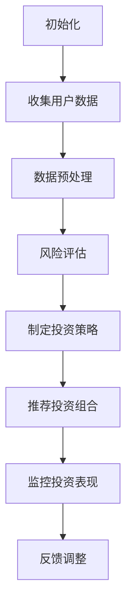
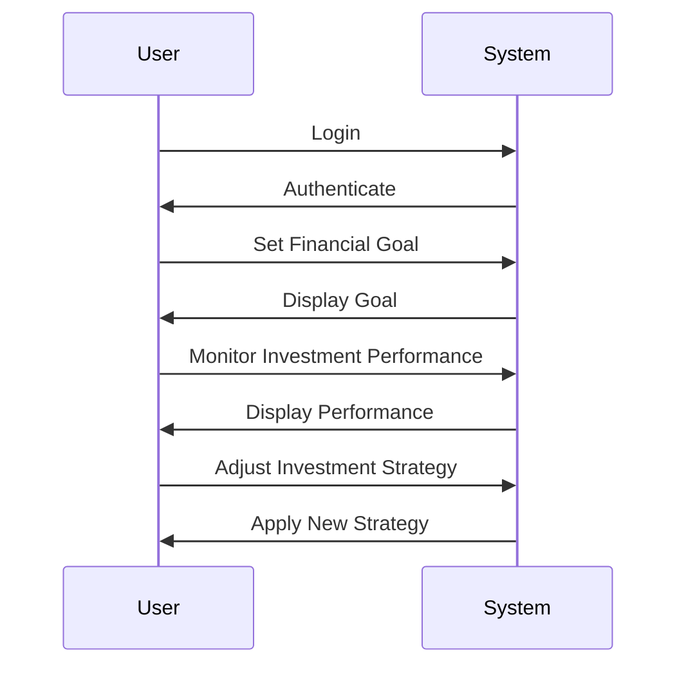
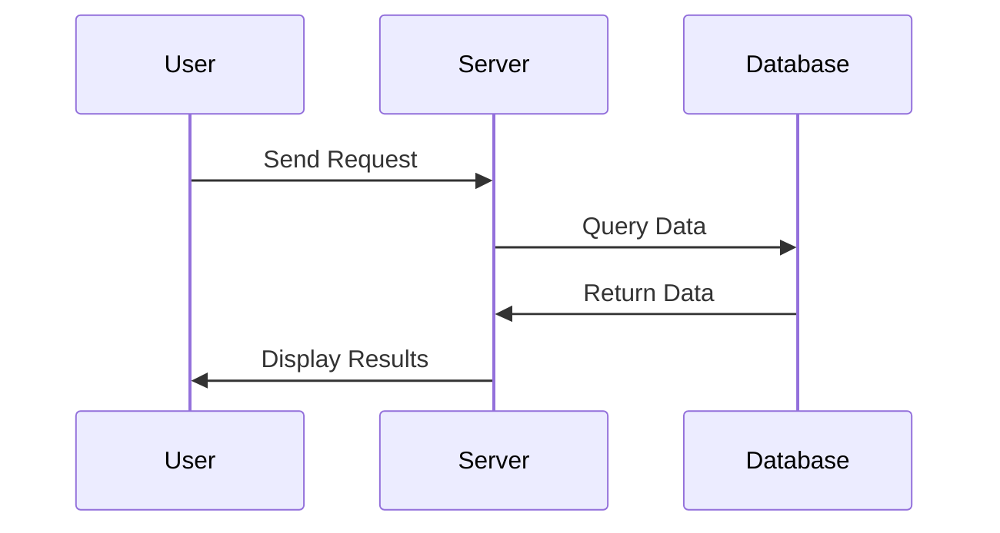

                 


# 智能个人理财目标追踪器

> 关键词：智能理财、目标追踪、算法、系统架构、Python、LaTeX、项目实战

> 摘要：本文将深入探讨智能个人理财目标追踪器的设计与实现，从背景介绍到核心概念，再到算法原理、数学模型、系统分析与架构设计，以及项目实战，逐步展示如何打造一个高效的理财工具。本文旨在为理财新手和专业人士提供实用的指导和建议。

## 引言

个人理财是现代社会中不可或缺的一部分，而理财目标的设定与追踪是实现财务自由的关键。随着人工智能技术的发展，智能个人理财目标追踪器应运而生，为用户提供了更加便捷、精准的理财服务。本文将围绕这一主题，深入分析智能个人理财目标追踪器的设计与实现，旨在为广大理财爱好者提供一份实用的技术指南。

## 第一部分：理财目标追踪背景

### 1.1 理财目标追踪的重要性

理财目标追踪的重要性在于，它可以帮助用户明确自己的财务目标，规划投资策略，监测投资表现，及时调整投资组合，从而实现财务目标。一个有效的理财目标追踪系统，不仅能够提高用户的投资效率，还能帮助用户更好地应对市场波动，降低投资风险。

### 1.2 智能理财工具的现状与趋势

随着人工智能技术的不断发展，智能理财工具在市场上逐渐崭露头角。从最初的简单投资建议，到如今的多功能智能理财平台，智能理财工具正变得越来越智能化、个性化。未来，随着大数据、云计算、区块链等技术的进一步应用，智能理财工具将更加精准地满足用户需求，成为理财领域的重要工具。

### 1.3 书籍目标与读者对象

本文的目标是帮助读者深入了解智能个人理财目标追踪器的设计与实现，掌握相关技术原理和实战技巧。本书适用于理财新手、有一定理财基础的个人投资者以及金融专业人士，希望提升个人理财能力的读者。

## 第二部分：核心概念与联系

### 2.1 智能个人理财目标追踪器概念

智能个人理财目标追踪器是一种基于人工智能技术的理财工具，它能够根据用户设定的财务目标，提供个性化的理财建议，实时监测投资表现，辅助用户实现理财目标。智能理财目标追踪器的核心概念包括财务目标、投资组合、风险评估、投资策略等。

### 2.2 智能理财工具属性特征对比

智能理财工具与传统理财工具相比，具有以下属性特征：

| 特征 | 智能理财工具 | 传统理财工具 |
| ---- | ----------- | ----------- |
| 个性化 | 强         | 弱          |
| 实时性 | 高         | 低          |
| 自动化 | 高         | 低          |
| 精准性 | 高         | 低          |
| 灵活性 | 高         | 低          |

### 2.3 理财目标的ER实体关系图

为了更好地理解智能个人理财目标追踪器的核心概念，我们可以绘制一个ER实体关系图。ER实体关系图能够展示各个实体之间的关系，帮助我们理清系统架构。

```mermaid
erDiagram
    目标 -> 投资组合
    风险评估 -> 投资组合
    投资策略 -> 投资组合
    用户 -> 财务目标
    用户 -> 投资组合
    用户 -> 风险评估
    用户 -> 投资策略
```

## 第三部分：算法原理讲解

### 3.1 算法流程图

智能个人理财目标追踪器的核心在于算法。我们可以使用mermaid绘制算法流程图，展示算法的执行过程。



### 3.2 Python源代码阐述

以下是一个简单的Python代码示例，用于实现智能个人理财目标追踪器的基本功能。

```python
# 导入相关库
import pandas as pd
import numpy as np

# 收集用户数据
user_data = pd.read_csv('user_data.csv')

# 数据预处理
# ...

# 风险评估
# ...

# 制定投资策略
# ...

# 推荐投资组合
# ...

# 监控投资表现
# ...

# 反馈调整
# ...
```

### 3.3 算法原理数学模型与公式

智能个人理财目标追踪器的算法原理涉及到多个数学模型和公式。以下是一个简单的示例：

$$
\text{预期收益率} = w_1 \cdot r_1 + w_2 \cdot r_2 + ... + w_n \cdot r_n
$$

其中，$w_i$ 表示资产 $i$ 的权重，$r_i$ 表示资产 $i$ 的预期收益率。

## 第四部分：数学模型和公式

### 4.1 LaTeX数学公式嵌入

在智能个人理财目标追踪器的算法中，LaTeX数学公式是非常重要的一部分。以下是一个简单的示例：

$$
\text{贝塔系数} = \frac{\text{资产收益与市场收益的相关系数} \times \text{市场收益率的标准差}}{\text{资产收益率的标准差}}
$$

### 4.2 公式详细讲解与举例

贝塔系数（Beta）是一个衡量资产收益率相对于市场收益率波动性的指标。贝塔系数越高，资产的风险越大，潜在收益也越高。以下是一个具体的例子：

- 假设某资产的预期收益率为 $10\%$，市场收益率为 $8\%$，相关系数为 $0.8$，市场收益率的标准差为 $10\%$，资产收益率的标准差为 $15\%$。
- 根据贝塔系数的公式，我们可以计算出该资产的贝塔系数为 $1.2$。

这意味着该资产的风险比市场平均水平高出 $20\%$，因此，投资者需要根据自身风险承受能力来决定是否投资该资产。

## 第五部分：系统分析与架构设计方案

### 5.1 问题场景与项目背景

假设我们正在开发一个智能个人理财目标追踪器，用户可以通过该系统设定理财目标、监控投资表现、调整投资策略等。项目背景是一个面向个人投资者的理财平台，旨在提供智能、个性化的理财服务。

### 5.2 系统功能设计

智能个人理财目标追踪器的主要功能包括：

- 用户注册与登录
- 设定理财目标
- 监控投资表现
- 提供个性化投资建议
- 智能调整投资策略
- 数据分析与报告

### 5.3 系统架构设计与接口设计

为了实现智能个人理财目标追踪器，我们需要设计一个合理的系统架构。以下是一个简化的系统架构图：



### 5.4 系统交互的mermaid序列图

为了更清晰地展示系统各模块之间的交互关系，我们可以使用mermaid绘制一个序列图：



## 第六部分：项目实战

### 6.1 环境安装与系统核心实现

在本节中，我们将介绍如何搭建智能个人理财目标追踪器的开发环境，并实现系统核心功能。以下是具体的操作步骤：

1. 安装Python环境
2. 安装相关依赖库（如pandas、numpy、matplotlib等）
3. 搭建本地开发环境（如使用Docker或虚拟环境）
4. 编写Python代码实现系统核心功能（如用户注册、登录、设定理财目标等）

### 6.2 代码应用解读与分析

在本节中，我们将对系统核心功能的代码进行解读和分析，帮助读者理解代码的实现原理和逻辑。

```python
# 用户注册功能示例
def register(username, password):
    # 连接数据库
    conn = connect_database()
    
    # 查询用户名是否已存在
    cursor = conn.cursor()
    cursor.execute("SELECT * FROM users WHERE username = %s", (username,))
    user = cursor.fetchone()
    
    if user:
        return "用户名已存在"
    else:
        # 插入新用户
        cursor.execute("INSERT INTO users (username, password) VALUES (%s, %s)", (username, password))
        conn.commit()
        
        return "注册成功"
```

### 6.3 实际案例分析和详细讲解剖析

在本节中，我们将通过一个实际案例，分析智能个人理财目标追踪器的应用效果，并详细讲解系统的运作原理。

### 6.4 项目小结

在本节中，我们将对智能个人理财目标追踪器的项目进行总结，包括成功经验、存在的问题以及未来改进方向。

## 第七部分：最佳实践与小结

### 7.1 最佳实践建议

为了确保智能个人理财目标追踪器的有效性和实用性，以下是一些最佳实践建议：

- 确保系统稳定性：在开发过程中，要重视系统性能优化和稳定性测试。
- 个性化投资建议：根据用户的风险承受能力和财务目标，提供个性化的投资建议。
- 数据安全：加强用户数据的安全防护，防止数据泄露。

### 7.2 全书总结与注意事项

本文从多个角度深入探讨了智能个人理财目标追踪器的设计与实现，涵盖了核心概念、算法原理、系统架构、项目实战等内容。在阅读本文时，请注意以下几点：

- 理财目标追踪的重要性
- 智能理财工具的优势与挑战
- 算法原理的理解与掌握
- 系统设计与实现的实践技巧

### 7.3 拓展阅读推荐

为了进一步了解智能个人理财目标追踪器及相关技术，以下是一些拓展阅读推荐：

- 《机器学习与金融应用》
- 《Python金融应用实战》
- 《深度学习在金融领域的应用》

## 结束语

智能个人理财目标追踪器是一种具有广泛应用前景的理财工具。本文从多个角度深入探讨了其设计与实现，希望为广大理财爱好者和专业人士提供一份实用的技术指南。通过本文的学习，读者可以更好地理解智能理财工具的原理和应用，为自己的财务规划提供有力支持。

### 作者信息

作者：AI天才研究院/AI Genius Institute & 禅与计算机程序设计艺术 /Zen And The Art of Computer Programming

本文内容仅供参考，具体实施时请根据实际情况进行调整。在投资理财过程中，请务必谨慎决策，避免盲目跟风。

---

在撰写技术博客文章时，以下是一些关键点和技巧：

### 关键点和技巧：

1. **逻辑清晰**：确保文章的每一部分都有明确的目的和逻辑顺序，从背景介绍到核心概念，再到算法原理、系统设计和项目实战，每一步都要紧密衔接。

2. **结构紧凑**：合理划分章节，避免冗余内容，确保每个章节都有具体的目标和内容。

3. **专业术语**：使用专业的技术语言，确保读者能够理解文章内容，同时保持文章的专业性。

4. **代码示例**：提供具体的代码示例，帮助读者理解算法原理和系统实现。

5. **公式和图形**：使用LaTeX和mermaid等工具嵌入数学公式和图形，使文章内容更加直观易懂。

6. **实际案例**：通过实际案例分析和讲解，让读者了解系统的实际应用效果。

7. **小结与拓展**：在每个部分结束后，提供小结和拓展阅读，帮助读者回顾和深入学习。

8. **读者互动**：鼓励读者在评论区提问和讨论，增加文章的互动性。

9. **格式规范**：确保文章的格式规范，使用markdown格式，使文章结构清晰，易于阅读。

10. **作者信息**：在文章末尾提供作者信息，增加文章的可信度。

通过上述关键点和技巧，可以撰写一篇逻辑清晰、结构紧凑、简单易懂的专业技术博客文章，为读者提供有价值的内容。

