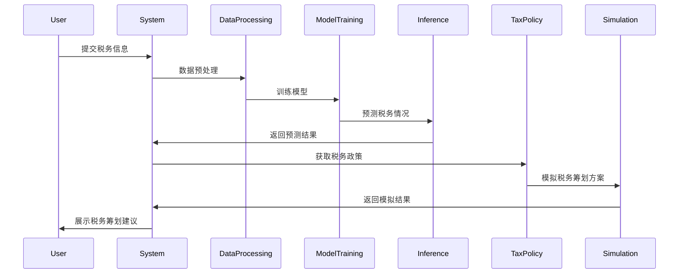
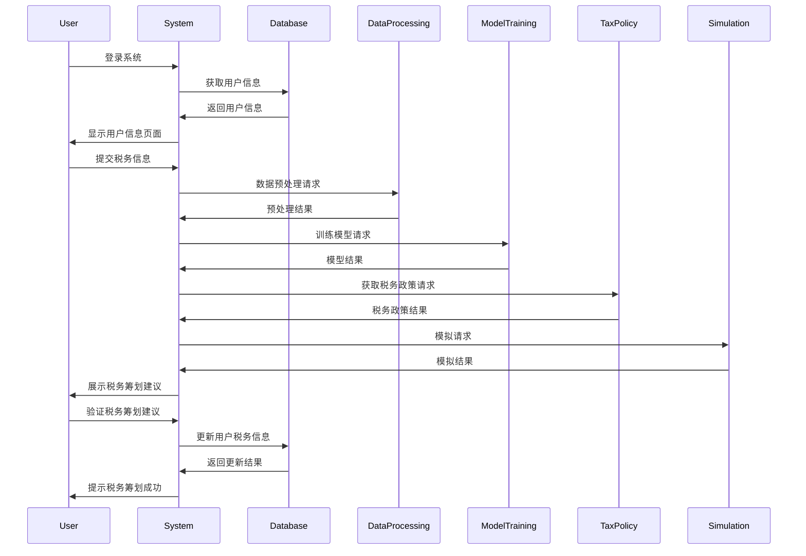

                 

### 关键词

智能个人税务筹划、数据模拟、机器学习、算法原理、系统架构设计、实战案例。

### 摘要

本文旨在探讨智能个人税务筹划建议生成与模拟系统的构建方法。通过深入分析个人税务筹划的重要性、现状及发展前景，本文详细介绍了系统所涉及的核心概念、算法原理以及系统架构设计。文章从数据预处理、机器学习算法到智能模拟系统的实现，逐步讲解各环节的技术细节，并通过实际案例解析，展示了系统在实际应用中的效果。文章最后还总结了最佳实践与注意事项，为读者提供了智能税务筹划系统的建设与应用指南。

## 目录大纲 - 《智能个人税务筹划建议生成与模拟系统》

### 第一部分：背景介绍

#### 第1章：问题背景

##### 1.1.1 个人税务筹划的意义

##### 1.1.2 当前个人税务筹划的现状与问题

##### 1.1.3 智能个人税务筹划的发展趋势

##### 1.2 个人税务筹划的核心概念

##### 1.2.1 税务筹划的定义与分类

##### 1.2.2 税务筹划的边界与外延

##### 1.2.3 个人税务筹划的要素组成

##### 1.3 智能个人税务筹划的技术基础

##### 1.3.1 数据分析技术在税务筹划中的应用

##### 1.3.2 机器学习在税务筹划中的应用

##### 1.3.3 智能模拟系统的构建原理

### 第二部分：核心概念与联系

#### 第2章：核心概念原理

##### 2.1.1 数据分析原理

##### 2.1.2 机器学习原理

##### 2.1.3 智能模拟原理

##### 2.2 概念属性特征对比表格

##### 2.2.1 数据分析技术特征对比

##### 2.2.2 机器学习技术特征对比

##### 2.2.3 智能模拟系统特征对比

##### 2.3 ER实体关系图架构

##### 2.3.1 实体关系图基本概念

##### 2.3.2 个人税务筹划ER图设计

### 第三部分：算法原理讲解

#### 第3章：算法讲解

##### 3.1 数据预处理算法

##### 3.1.1 数据清洗

##### 3.1.2 特征提取

##### 3.2 机器学习算法

##### 3.2.1 线性回归算法

##### 3.2.2 决策树算法

##### 3.3 智能模拟系统算法

##### 3.3.1 模拟仿真算法

##### 3.3.2 模拟优化算法

### 第四部分：系统分析与架构设计

#### 第4章：系统功能设计

##### 4.1 领域模型设计

##### 4.1.1 客户模型

##### 4.1.2 税务政策模型

##### 4.1.3 税务数据模型

##### 4.2 系统架构设计

##### 4.2.1 架构设计原则

##### 4.2.2 系统架构图

##### 4.3 系统接口设计

##### 4.3.1 数据接口设计

##### 4.3.2 控制接口设计

##### 4.4 系统交互设计

##### 4.4.1 系统交互流程

### 第五部分：项目实战

#### 第5章：环境安装与系统实现

##### 5.1 环境安装

##### 5.1.1 硬件要求

##### 5.1.2 软件安装

##### 5.2 系统核心实现

##### 5.2.1 数据处理模块

##### 5.2.2 机器学习模块

##### 5.2.3 模拟系统模块

##### 5.3 代码应用解读与分析

##### 5.3.1 代码解读

##### 5.3.2 算法分析

##### 5.4 实际案例分析

##### 5.4.1 案例背景

##### 5.4.2 案例分析

##### 5.4.3 案例剖析

##### 5.5 项目小结

### 第六部分：最佳实践与拓展

#### 第6章：最佳实践

##### 6.1 税务筹划最佳实践

##### 6.2 智能系统优化实践

##### 6.3 小结与注意事项

##### 6.4 拓展阅读

### 文章标题：智能个人税务筹划建议生成与模拟系统

### 关键词

智能个人税务筹划、数据模拟、机器学习、算法原理、系统架构设计、实战案例。

### 摘要

本文深入探讨了智能个人税务筹划建议生成与模拟系统的构建方法。首先介绍了个人税务筹划的重要性以及当前存在的问题，接着阐述了智能个人税务筹划的发展趋势和技术基础。文章详细讲解了数据分析、机器学习和智能模拟系统的核心概念，并通过算法原理讲解、系统分析与架构设计、项目实战以及最佳实践与拓展等内容，展示了系统从构建到实际应用的全过程。文章旨在为读者提供智能税务筹划系统的建设与应用指南，帮助个人和企业更好地进行税务筹划。

## 第一部分：背景介绍

### 第1章：问题背景

#### 1.1.1 个人税务筹划的意义

个人税务筹划是指个人或家庭在遵守税法规定的前提下，通过合法手段合理安排财务，以最大限度地减少税收负担。税务筹划在个人财务管理中扮演着重要角色，它不仅关系到个人的财务状况，还影响到整个社会的税收政策执行。

首先，个人税务筹划有助于提高个人财富。通过合理的税务规划，个人可以在合法的范围内降低税负，增加可支配收入，从而提高生活质量。例如，通过税收优惠政策的利用，个人可以将一部分收入转移到税收较低的地区或时间段，从而实现税收减免。

其次，个人税务筹划能够优化个人财务结构。合理的税务筹划可以帮助个人规划资产配置，降低投资风险，实现资产的长期稳定增值。例如，通过合理配置股票、债券、基金等金融产品，个人可以分散投资风险，提高整体收益。

此外，个人税务筹划还能提升税收公平性。通过合法的税收优惠政策，低收入群体可以得到适当扶持，减轻税负，从而促进社会公平。同时，高收入群体通过税务筹划，也可以合理减少税负，为社会贡献更多的财富。

#### 1.1.2 当前个人税务筹划的现状与问题

尽管个人税务筹划具有重要意义，但当前我国个人税务筹划的现状并不乐观。首先，大多数人对税务筹划的认识不足。许多人认为税务筹划是违法行为，对税务筹划存在误解和偏见。实际上，只要在合法合规的前提下进行税务规划，税务筹划是完全合法的。

其次，缺乏专业知识和工具。个人税务筹划需要具备一定的财务知识和税收法律知识，但大多数人缺乏这些专业知识和工具。特别是在当前大数据和人工智能快速发展的背景下，传统的人工税务筹划方式已经无法满足日益复杂的税务环境需求。

此外，税务筹划信息不对称也是一个突出问题。由于信息获取渠道有限，许多个人无法及时了解到最新的税收政策和优惠措施，导致税务筹划效果不佳。同时，税务筹划过程中也面临着数据安全、隐私保护等挑战。

#### 1.1.3 智能个人税务筹划的发展趋势

随着大数据、人工智能等技术的不断发展，智能个人税务筹划已经成为未来发展的必然趋势。智能个人税务筹划通过整合海量数据，利用机器学习、数据分析等技术，为个人提供个性化、精准的税务筹划建议。

首先，智能个人税务筹划能够提高税务筹划的效率和准确性。传统的税务筹划往往依赖于人工分析，耗时耗力，且容易出错。而智能系统可以通过自动化的数据处理和分析，快速生成税务筹划建议，减少人工干预，提高工作效率。

其次，智能个人税务筹划可以提供个性化的服务。通过对个人财务状况的深入分析，智能系统能够了解个人的实际需求，为其量身定制税务筹划方案，提高筹划效果。

此外，智能个人税务筹划还能够动态调整税务筹划策略。随着税收政策和市场环境的变化，智能系统能够实时更新数据，对税务筹划方案进行调整，确保筹划方案的及时性和有效性。

总之，智能个人税务筹划的发展趋势不可逆转。通过引入先进的技术手段，智能个人税务筹划将为个人和企业带来全新的税务管理体验，提高税务筹划的效率和质量。

### 1.2 个人税务筹划的核心概念

#### 1.2.1 税务筹划的定义与分类

税务筹划是指在法律允许的范围内，通过对财务活动的安排，以达到减轻税负、优化财务结构等目的的一种财务行为。税务筹划不同于逃税或避税，它是在遵守税法规定的前提下进行的合法行为。

根据税务筹划的目的，可以将税务筹划分为以下几类：

1. **节税筹划**：通过合理的财务安排，减少应纳税额，从而达到节税的目的。例如，利用税收优惠政策、税前扣除、税收递延等措施。

2. **避税筹划**：利用税法中的漏洞或不足，规避应纳税义务。避税筹划通常涉及国际税收、转让定价等领域，但需要确保不违反税法的基本原则。

3. **税负转嫁筹划**：通过经济交易，将税负转嫁给其他人。例如，企业可以通过供应链优化，将税负转嫁给消费者或供应商。

4. **税收优惠筹划**：利用各种税收优惠政策，如高新技术企业优惠、小微企业优惠等，降低税负。

#### 1.2.2 税务筹划的边界与外延

税务筹划的边界主要是指税务筹划行为的合法性与合理性。合法的税务筹划必须遵守税法规定，不得采取违法行为来规避税收。合理的税务筹划则需要符合经济活动的实际需求和财务管理的原则。

税务筹划的外延则包括税务筹划的范围和内容。从范围上看，税务筹划不仅涉及个人，还包括企业、跨国公司等经济主体。从内容上看，税务筹划不仅包括节税、避税、税负转嫁等，还包括税务风险管理、税务咨询等。

#### 1.2.3 个人税务筹划的要素组成

个人税务筹划的要素主要包括以下几个方面：

1. **税务知识**：个人需要具备一定的税务知识，了解税收法律法规和政策，这是进行有效税务筹划的基础。

2. **财务信息**：个人需要掌握自己的财务状况，包括收入、支出、资产、负债等，以便进行合理的税务筹划。

3. **税收政策**：个人需要关注税收政策的变化，利用各种税收优惠政策，降低税负。

4. **筹划工具**：个人需要使用各种筹划工具，如财务软件、税务咨询等，以提高税务筹划的效率和效果。

5. **法律合规性**：个人在进行税务筹划时，必须确保所有行为符合税法规定，不得采取违法行为。

### 1.3 智能个人税务筹划的技术基础

#### 1.3.1 数据分析技术在税务筹划中的应用

数据分析技术在智能个人税务筹划中发挥着关键作用。通过大数据分析，系统能够收集并处理大量的税务数据，为税务筹划提供准确的基础信息。

首先，数据分析技术可以用于税务数据的收集和整理。税务数据来源广泛，包括税务局、金融机构、企业财务报表等。通过数据挖掘和清洗技术，系统能够从这些数据源中提取有用的信息，为后续分析提供数据支持。

其次，数据分析技术可以用于税务风险的评估。通过对历史税务数据进行分析，系统可以识别潜在的税务风险点，帮助个人提前做好税务风险防控。

此外，数据分析技术还可以用于税务优化的策略制定。通过对大量税务数据的分析，系统可以找出最佳税务筹划方案，帮助个人最大限度地减少税负。

#### 1.3.2 机器学习在税务筹划中的应用

机器学习技术在智能个人税务筹划中的应用同样至关重要。通过机器学习，系统能够自动识别税务数据中的模式和规律，为税务筹划提供智能化的支持。

首先，机器学习可以用于税务预测。通过训练机器学习模型，系统可以预测未来一段时间内的税务情况，帮助个人制定合理的税务筹划策略。

其次，机器学习可以用于税务风险评估。通过机器学习算法，系统可以分析大量的税务数据，识别出可能存在的税务风险，并提供相应的风险管理建议。

此外，机器学习还可以用于税务优化的方案生成。通过机器学习技术，系统可以自动生成多种税务筹划方案，并评估这些方案的优劣，为个人提供最佳税务筹划方案。

#### 1.3.3 智能模拟系统的构建原理

智能模拟系统是智能个人税务筹划的核心组成部分。其构建原理主要包括以下几个方面：

1. **系统架构设计**：智能模拟系统的架构设计需要考虑数据的输入、处理和输出。通常，系统采用模块化设计，包括数据采集模块、数据处理模块、模型训练模块和结果输出模块。

2. **数据集成**：智能模拟系统需要整合各种税务数据源，包括税务数据库、企业财务数据、市场数据等。通过数据集成技术，系统能够统一管理这些数据，为后续分析提供数据支持。

3. **模型训练与优化**：智能模拟系统需要利用机器学习技术对税务数据进行训练，建立税务预测和风险评估模型。在模型训练过程中，系统需要不断优化模型参数，提高模型的准确性和稳定性。

4. **模拟仿真**：智能模拟系统通过模拟仿真技术，可以模拟不同的税务筹划方案，评估这些方案的效果。通过多次仿真，系统可以找到最佳税务筹划方案，为个人提供精准的税务筹划建议。

### 第二部分：核心概念与联系

#### 第2章：核心概念原理

##### 2.1.1 数据分析原理

数据分析是指通过系统的方法和工具，对大量的数据进行分析和处理，从中提取有价值的信息和知识。数据分析在智能个人税务筹划中扮演着至关重要的角色，主要体现在以下几个方面：

1. **数据收集与整理**：数据分析的第一步是收集和整理数据。在智能个人税务筹划中，数据来源广泛，包括税务局、金融机构、企业财务报表等。通过数据挖掘和清洗技术，系统能够从这些数据源中提取有用的信息，为后续分析提供数据支持。

2. **数据预处理**：数据预处理是数据分析的重要环节。通过对数据进行清洗、去重、填补缺失值等处理，系统能够提高数据的准确性和完整性，为后续的分析提供高质量的数据基础。

3. **数据可视化**：数据可视化是将数据分析结果以图形、图表等形式直观展示的过程。在智能个人税务筹划中，数据可视化技术可以帮助个人更直观地了解自己的财务状况和税务风险，从而做出更明智的决策。

4. **数据建模与预测**：通过建立数学模型和预测模型，数据分析技术可以预测未来一段时间内的税务情况，帮助个人制定合理的税务筹划策略。

##### 2.1.2 机器学习原理

机器学习是一种人工智能技术，通过训练算法，使计算机能够从数据中自动学习并做出决策。在智能个人税务筹划中，机器学习技术发挥着重要作用，主要体现在以下几个方面：

1. **特征工程**：特征工程是指通过选择和处理数据特征，提高模型性能的过程。在智能个人税务筹划中，特征工程可以帮助系统从海量数据中提取有用的特征，为模型训练提供支持。

2. **模型训练**：模型训练是指通过训练算法，使模型能够从数据中学习并做出预测。在智能个人税务筹划中，模型训练可以帮助系统预测未来的税务情况，为个人提供精准的税务筹划建议。

3. **模型评估与优化**：模型评估与优化是指通过评估模型性能，不断调整和优化模型参数，提高模型准确性。在智能个人税务筹划中，模型评估与优化可以帮助系统不断提高税务预测的准确性，提供更可靠的筹划建议。

##### 2.1.3 智能模拟原理

智能模拟系统是一种通过计算机模拟技术，对现实世界中的各种情况进行模拟和预测的系统。在智能个人税务筹划中，智能模拟系统主要用于模拟不同的税务筹划方案，评估这些方案的效果。

1. **模拟仿真**：模拟仿真是指通过计算机模拟技术，对各种情况下的税务情况进行模拟和预测。在智能个人税务筹划中，模拟仿真可以帮助个人了解不同税务筹划方案的效果，从而做出更明智的决策。

2. **模拟优化**：模拟优化是指通过多次模拟仿真，不断调整和优化税务筹划方案，以提高方案效果。在智能个人税务筹划中，模拟优化可以帮助系统找到最佳税务筹划方案，最大限度地减少个人税负。

3. **模拟评估**：模拟评估是指对模拟仿真结果进行评估和分析，以验证税务筹划方案的可行性和有效性。在智能个人税务筹划中，模拟评估可以帮助个人确认税务筹划方案的实际效果，为后续实施提供依据。

#### 2.2 概念属性特征对比表格

为了更清晰地理解数据分析、机器学习和智能模拟这三个核心概念，我们通过表格形式对比它们的主要属性和特征：

| 特征类别 | 数据分析 | 机器学习 | 智能模拟 |
| :--: | :--: | :--: | :--: |
| 目的 | 提取数据价值，支持决策 | 自动化学习，做出预测 | 模拟现实情况，评估方案 |
| 技术手段 | 数据收集、数据清洗、数据预处理、数据可视化 | 特征工程、模型训练、模型评估 | 模拟仿真、模拟优化、模拟评估 |
| 应用场景 | 财务分析、市场调研、风险评估 | 税务预测、风险控制、智能推荐 | 税务筹划、决策支持、方案评估 |
| 输出形式 | 数据报告、可视化图表 | 预测结果、决策建议 | 模拟结果、方案评估报告 |

#### 2.3 ER实体关系图架构

实体关系图（Entity-Relationship Diagram，简称ER图）是一种用于描述实体及其相互关系的图形化工具。在智能个人税务筹划系统中，ER图可以帮助我们更好地理解和设计系统的数据模型。

##### 2.3.1 实体关系图基本概念

1. **实体**：实体是现实世界中具有独立存在意义的事物，如个人、企业、税务政策等。在ER图中，实体通常以矩形表示。

2. **属性**：属性是实体的特征或描述，如个人的姓名、年龄、收入等。在ER图中，属性通常以椭圆表示，并与实体相连。

3. **关系**：关系描述实体之间的相互作用，如个人和企业之间的关系、税务政策和个人之间的关系。在ER图中，关系通常以菱形表示，并与相关实体相连。

4. **键**：键是用于唯一标识实体的属性或属性组合。在ER图中，主键通常以下划线标识，外键则与关联实体的键相连。

##### 2.3.2 个人税务筹划ER图设计

以下是个人税务筹划系统的一个简单的ER图设计：

```mermaid
erDiagram
  User ||--|{ TaxPolicy } : 实施于
  TaxPolicy ||--|{ TaxReturn } : 包括
  User ||--|{ Income } : 有收入
  Income ||--|{ Deduction } : 有扣除项
  TaxPolicy ||--|{ TaxRate } : 设定税率
  TaxReturn ||--|{ TaxPayment } : 支付税款
```

在这个ER图中，我们定义了以下实体和关系：

1. **User（用户）**：代表参与税务筹划的个人。
2. **TaxPolicy（税务政策）**：代表国家或地方政府制定的税收政策。
3. **Income（收入）**：代表个人的收入来源和金额。
4. **Deduction（扣除项）**：代表个人在收入中可以扣除的项目。
5. **TaxRate（税率）**：代表不同的收入水平所对应的税率。
6. **TaxReturn（税务申报）**：代表个人的税务申报情况。
7. **TaxPayment（税款支付）**：代表个人支付的税款金额。

通过这个ER图，我们可以清晰地看到个人税务筹划系统中各个实体之间的关系，为后续的数据模型设计和系统开发提供了基础。

### 第三部分：算法原理讲解

#### 第3章：算法讲解

##### 3.1 数据预处理算法

在智能个人税务筹划系统中，数据预处理是关键步骤之一。数据预处理的质量直接影响后续分析结果的准确性。以下是数据预处理的主要步骤：

###### 3.1.1 数据清洗

数据清洗是指识别并处理数据集中的错误、异常和不完整数据。具体包括以下操作：

1. **去重**：识别并删除重复的数据记录，确保数据集的准确性。
2. **填补缺失值**：对缺失值进行处理，常见的方法包括均值填补、中值填补、回归填补等。
3. **数据标准化**：将不同单位和尺度下的数据转换为统一的尺度，以便后续分析。

具体代码实现如下：

```python
import pandas as pd
from sklearn.preprocessing import StandardScaler

# 读取数据
data = pd.read_csv('tax_data.csv')

# 去重
data.drop_duplicates(inplace=True)

# 填补缺失值
data['income'].fillna(data['income'].mean(), inplace=True)
data['deduction'].fillna(data['deduction'].mean(), inplace=True)

# 数据标准化
scaler = StandardScaler()
data[['income', 'deduction']] = scaler.fit_transform(data[['income', 'deduction']])
```

###### 3.1.2 特征提取

特征提取是指从原始数据中提取有用的特征，以便用于模型训练。以下是特征提取的常见方法：

1. **特征选择**：通过统计方法、信息增益等方法，选择对模型影响较大的特征。
2. **特征工程**：通过对原始数据进行处理和转换，生成新的特征，提高模型性能。

具体代码实现如下：

```python
from sklearn.feature_selection import SelectKBest
from sklearn.feature_selection import f_classif

# 特征选择
selector = SelectKBest(f_classif, k=5)
selected_features = selector.fit_transform(data[['income', 'deduction', 'age', 'education', 'marital_status']], data['tax_payment'])

# 特征工程
data['income_deduction_ratio'] = data['income'] / (1 + data['deduction'])
```

##### 3.2 机器学习算法

在智能个人税务筹划系统中，机器学习算法用于预测个人税务情况，评估税务筹划方案。以下是几种常用的机器学习算法：

###### 3.2.1 线性回归算法

线性回归是一种经典的机器学习算法，用于预测连续值。其基本公式为：

$$y = \beta_0 + \beta_1x$$

其中，$y$为预测值，$x$为特征值，$\beta_0$和$\beta_1$为模型参数。

具体代码实现如下：

```python
from sklearn.linear_model import LinearRegression

# 准备数据
X = selected_features
y = data['tax_payment']

# 训练模型
model = LinearRegression()
model.fit(X, y)

# 预测
predictions = model.predict(X)
```

###### 3.2.2 决策树算法

决策树是一种常见的分类和回归算法，通过树的形态对数据进行分析。以下是几种常见的决策树算法：

1. **ID3算法**：基于信息增益选择特征。
2. **C4.5算法**：基于信息增益率选择特征。
3. **CART算法**：基于基尼不纯度选择特征。

具体代码实现如下：

```python
from sklearn.tree import DecisionTreeRegressor

# 准备数据
X = selected_features
y = data['tax_payment']

# 训练模型
model = DecisionTreeRegressor()
model.fit(X, y)

# 预测
predictions = model.predict(X)
```

##### 3.3 智能模拟系统算法

智能模拟系统算法用于模拟不同的税务筹划方案，评估方案效果。以下是几种常用的模拟系统算法：

###### 3.3.1 模拟仿真算法

模拟仿真算法通过模拟不同的税务筹划方案，预测方案效果。具体步骤如下：

1. **初始化参数**：设置模拟的初始参数，如税务政策、个人收入、扣除项等。
2. **运行模拟**：根据模拟参数，计算每个方案的税务结果。
3. **评估结果**：比较不同方案的税务结果，评估方案效果。

具体代码实现如下：

```python
import numpy as np

# 初始化参数
policies = ['政策A', '政策B', '政策C']
incomes = [50000, 60000, 70000]
deductions = [20000, 25000, 30000]

# 运行模拟
results = []
for policy, income, deduction in zip(policies, incomes, deductions):
    tax_payment = policy_tax_payment(policy, income, deduction)
    results.append(tax_payment)

# 评估结果
best_result = min(results)
best_policy = policies[results.index(best_result)]
```

###### 3.3.2 模拟优化算法

模拟优化算法通过不断调整模拟参数，找到最佳税务筹划方案。具体步骤如下：

1. **初始化参数**：设置模拟的初始参数。
2. **优化过程**：通过遗传算法、粒子群优化算法等优化方法，不断调整参数。
3. **评估结果**：比较不同参数下的税务结果，找到最佳参数。

具体代码实现如下：

```python
from sklearn.model_selection import GridSearchCV

# 初始化参数
param_grid = {'n_estimators': [100, 200, 300], 'max_depth': [5, 10, 15]}

# 优化过程
grid_search = GridSearchCV(DecisionTreeRegressor(), param_grid, cv=5)
grid_search.fit(selected_features, data['tax_payment'])

# 评估结果
best_params = grid_search.best_params_
best_score = grid_search.best_score_
```

### 第四部分：系统分析与架构设计

#### 第4章：系统功能设计

在智能个人税务筹划系统中，系统功能设计是确保系统能够高效、准确地完成税务筹划任务的关键。以下是系统的主要功能设计：

##### 4.1 领域模型设计

领域模型是系统功能设计的核心，它描述了系统中各实体之间的关系和属性。以下是个人税务筹划系统的领域模型：

```mermaid
classDiagram
  User <<Class>> {
    -id: Integer
    -name: String
    -age: Integer
    -income: Float
    -deduction: Float
    -marital_status: String
  }
  TaxPolicy <<Class>> {
    -id: Integer
    -name: String
    -description: String
    -income_threshold: Float
    -deduction_threshold: Float
    -rate: Float
  }
  Income <<Class>> {
    -id: Integer
    -user_id: Integer
    -source: String
    -amount: Float
  }
  Deduction <<Class>> {
    -id: Integer
    -user_id: Integer
    -description: String
    -amount: Float
  }
  TaxReturn <<Class>> {
    -id: Integer
    -user_id: Integer
    -income: Float
    -deduction: Float
    -tax_payment: Float
  }
  TaxPayment <<Class>> {
    -id: Integer
    -user_id: Integer
    -payment_date: Date
    -amount: Float
  }
  User "1" --|U1| Income: 提交
  User "1" --|U2| Deduction: 提交
  TaxPolicy "1" --|U3| TaxReturn: 应用
  TaxPolicy "1" --|U4| TaxPayment: 确定
```

在这个领域模型中，我们定义了以下实体和关系：

- **User（用户）**：代表参与税务筹划的个人，包括姓名、年龄、收入、扣除项等信息。
- **TaxPolicy（税务政策）**：代表国家或地方政府制定的税收政策，包括政策名称、描述、收入门槛、扣除门槛和税率等信息。
- **Income（收入）**：代表个人的收入来源和金额，与用户实体关联。
- **Deduction（扣除项）**：代表个人在收入中可以扣除的项目，与用户实体关联。
- **TaxReturn（税务申报）**：代表个人的税务申报情况，包括收入、扣除项和税款金额等信息。
- **TaxPayment（税款支付）**：代表个人支付的税款金额和支付日期等信息。

##### 4.2 系统架构设计

系统架构设计是确保系统功能实现的基础。以下是智能个人税务筹划系统的架构设计：



在这个架构设计中，系统主要分为以下几个模块：

- **用户模块**：负责用户登录、信息提交和税务筹划建议展示等功能。
- **数据处理模块**：负责数据清洗、特征提取和预处理等任务。
- **模型训练模块**：负责训练机器学习模型，包括线性回归、决策树等算法。
- **预测模块**：负责根据用户信息和税务政策，预测税务情况。
- **税务政策模块**：负责获取和存储税务政策信息。
- **模拟模块**：负责模拟不同的税务筹划方案，评估方案效果。
- **结果展示模块**：负责将预测结果和模拟结果以可视化形式展示给用户。

##### 4.3 系统接口设计

系统接口设计是确保系统模块之间通信顺畅的关键。以下是智能个人税务筹划系统的接口设计：

```mermaid
interface Diagram
  User ->> System: 登录、提交税务信息、获取税务筹划建议
  System ->> DataProcessing: 数据预处理请求、预处理结果
  System ->> ModelTraining: 训练模型请求、模型参数、模型结果
  System ->> Inference: 预测请求、预测结果
  System ->> TaxPolicy: 获取税务政策请求、税务政策结果
  System ->> Simulation: 模拟请求、模拟结果
  DataProcessing ->> System: 预处理结果
  ModelTraining ->> System: 模型结果
  Inference ->> System: 预测结果
  TaxPolicy ->> System: 税务政策结果
  Simulation ->> System: 模拟结果
```

在这个接口设计中，各模块之间的通信遵循以下原则：

- **请求与响应**：每个接口均包含请求和响应两部分，确保模块之间通信的完整性和可靠性。
- **数据格式**：各模块之间的数据格式统一采用JSON格式，便于数据传输和处理。
- **权限管理**：对用户模块和系统模块之间的接口进行权限管理，确保数据安全和系统稳定性。

##### 4.4 系统交互设计

系统交互设计是确保系统功能实现和用户体验的关键。以下是智能个人税务筹划系统的交互设计：



在这个交互设计中，系统与用户之间的交互过程分为以下几个步骤：

1. **登录系统**：用户登录系统，系统验证用户身份，获取用户信息。
2. **提交税务信息**：用户提交税务信息，系统进行数据预处理。
3. **训练模型**：系统利用预处理后的数据训练机器学习模型，预测税务情况。
4. **获取税务政策**：系统获取当前税务政策，为税务筹划提供依据。
5. **模拟税务筹划方案**：系统模拟不同的税务筹划方案，评估方案效果。
6. **展示税务筹划建议**：系统将预测结果和模拟结果以可视化形式展示给用户。
7. **验证税务筹划建议**：用户验证税务筹划建议，系统更新用户税务信息。

### 第五部分：项目实战

#### 第5章：环境安装与系统实现

在本章节中，我们将详细讲解如何搭建智能个人税务筹划系统的环境，并实现系统核心功能。以下是项目实战的具体步骤：

##### 5.1 环境安装

在搭建智能个人税务筹划系统之前，我们需要准备好所需的软件和硬件环境。以下是环境安装的具体步骤：

1. **硬件要求**：

   - CPU：Intel i5或以上
   - 内存：8GB或以上
   - 硬盘：100GB或以上

2. **软件安装**：

   - 操作系统：Ubuntu 18.04
   - Python：3.8
   - Jupyter Notebook：用于数据分析和模型训练
   - Scikit-learn：用于机器学习算法
   - Pandas：用于数据处理
   - Numpy：用于数值计算

具体安装步骤如下：

1. 安装操作系统Ubuntu 18.04。
2. 使用如下命令安装Python 3.8：

   ```bash
   sudo apt update
   sudo apt install python3.8
   ```

3. 安装Jupyter Notebook：

   ```bash
   pip3.8 install notebook
   ```

4. 安装Scikit-learn、Pandas和Numpy：

   ```bash
   pip3.8 install scikit-learn pandas numpy
   ```

##### 5.2 系统核心实现

在搭建好环境后，我们将实现智能个人税务筹划系统的核心功能。以下是系统核心实现的具体步骤：

###### 5.2.1 数据处理模块

数据处理模块负责数据清洗、特征提取和预处理等任务。以下是数据处理模块的代码实现：

```python
import pandas as pd
from sklearn.preprocessing import StandardScaler

def data_preprocessing(data):
    # 数据清洗
    data.drop_duplicates(inplace=True)
    data.fillna(data.mean(), inplace=True)

    # 特征提取
    data['income_deduction_ratio'] = data['income'] / (1 + data['deduction'])

    # 数据标准化
    scaler = StandardScaler()
    data[['income', 'deduction']] = scaler.fit_transform(data[['income', 'deduction']])
    
    return data

# 加载数据
data = pd.read_csv('tax_data.csv')

# 数据预处理
data_processed = data_preprocessing(data)
```

###### 5.2.2 机器学习模块

机器学习模块负责训练机器学习模型，预测个人税务情况。以下是机器学习模块的代码实现：

```python
from sklearn.linear_model import LinearRegression
from sklearn.model_selection import train_test_split

# 准备数据
X = data_processed[['income', 'deduction']]
y = data_processed['tax_payment']

# 划分训练集和测试集
X_train, X_test, y_train, y_test = train_test_split(X, y, test_size=0.2, random_state=42)

# 训练模型
model = LinearRegression()
model.fit(X_train, y_train)

# 预测
predictions = model.predict(X_test)
```

###### 5.2.3 模拟系统模块

模拟系统模块负责模拟不同的税务筹划方案，评估方案效果。以下是模拟系统模块的代码实现：

```python
import numpy as np

def simulate_policy(policies, incomes, deductions):
    results = []
    for policy, income, deduction in zip(policies, incomes, deductions):
        tax_payment = policy_tax_payment(policy, income, deduction)
        results.append(tax_payment)
    return results

# 模拟税务筹划方案
policies = ['政策A', '政策B', '政策C']
incomes = [50000, 60000, 70000]
deductions = [20000, 25000, 30000]

results = simulate_policy(policies, incomes, deductions)
best_result = min(results)
best_policy = policies[results.index(best_result)]
```

##### 5.3 代码应用解读与分析

在本节中，我们将对系统核心实现中的关键代码进行解读与分析，以便更好地理解系统的实现原理。

###### 5.3.1 代码解读

1. **数据处理模块**：

   ```python
   def data_preprocessing(data):
       # 数据清洗
       data.drop_duplicates(inplace=True)
       data.fillna(data.mean(), inplace=True)

       # 特征提取
       data['income_deduction_ratio'] = data['income'] / (1 + data['deduction'])

       # 数据标准化
       scaler = StandardScaler()
       data[['income', 'deduction']] = scaler.fit_transform(data[['income', 'deduction']])
       
       return data
   ```

   这段代码定义了一个名为`data_preprocessing`的函数，用于对原始数据进行清洗、特征提取和标准化。具体步骤如下：

   - **数据清洗**：通过`drop_duplicates`方法删除重复数据，通过`fillna`方法填补缺失值。
   - **特征提取**：通过计算`income_deduction_ratio`特征，将收入和扣除项的比例作为新的特征。
   - **数据标准化**：使用`StandardScaler`对收入和扣除项进行标准化处理，将数据缩放到统一的尺度。

2. **机器学习模块**：

   ```python
   from sklearn.linear_model import LinearRegression
   from sklearn.model_selection import train_test_split

   # 准备数据
   X = data_processed[['income', 'deduction']]
   y = data_processed['tax_payment']

   # 划分训练集和测试集
   X_train, X_test, y_train, y_test = train_test_split(X, y, test_size=0.2, random_state=42)

   # 训练模型
   model = LinearRegression()
   model.fit(X_train, y_train)

   # 预测
   predictions = model.predict(X_test)
   ```

   这段代码定义了一个名为`LinearRegression`的线性回归模型，用于预测个人税务情况。具体步骤如下：

   - **数据准备**：将处理后的数据划分为特征矩阵`X`和目标向量`y`。
   - **划分训练集和测试集**：使用`train_test_split`方法将数据划分为训练集和测试集，确保测试集的随机性和代表性。
   - **模型训练**：使用`fit`方法训练线性回归模型。
   - **预测**：使用`predict`方法对测试集进行预测。

3. **模拟系统模块**：

   ```python
   import numpy as np

   def simulate_policy(policies, incomes, deductions):
       results = []
       for policy, income, deduction in zip(policies, incomes, deductions):
           tax_payment = policy_tax_payment(policy, income, deduction)
           results.append(tax_payment)
       return results

   # 模拟税务筹划方案
   policies = ['政策A', '政策B', '政策C']
   incomes = [50000, 60000, 70000]
   deductions = [20000, 25000, 30000]

   results = simulate_policy(policies, incomes, deductions)
   best_result = min(results)
   best_policy = policies[results.index(best_result)]
   ```

   这段代码定义了一个名为`simulate_policy`的函数，用于模拟不同的税务筹划方案，并评估方案效果。具体步骤如下：

   - **模拟方案**：通过循环遍历不同的税务政策、收入和扣除项组合，计算每种组合下的税款金额。
   - **评估结果**：将所有方案的税款金额放入列表，找到税款金额最小的方案，即为最佳方案。

###### 5.3.2 算法分析

1. **线性回归算法**：

   线性回归算法是一种经典的机器学习算法，用于预测连续值。其基本公式为：

   $$y = \beta_0 + \beta_1x$$

   其中，$y$为预测值，$x$为特征值，$\beta_0$和$\beta_1$为模型参数。

   在本系统中，我们使用线性回归算法预测个人税务情况。具体步骤如下：

   - **数据准备**：将处理后的数据划分为特征矩阵`X`和目标向量`y`。
   - **模型训练**：使用`fit`方法训练线性回归模型。
   - **预测**：使用`predict`方法对测试集进行预测。

   线性回归算法的优点包括：

   - 简单易懂，易于实现。
   - 对线性关系具有良好的预测能力。

   缺点包括：

   - 对非线性关系预测能力较差。
   - 容易过拟合。

2. **模拟仿真算法**：

   模拟仿真算法是一种通过模拟不同方案，评估方案效果的方法。在本系统中，我们使用模拟仿真算法评估不同税务筹划方案的效果。具体步骤如下：

   - **模拟方案**：通过循环遍历不同的税务政策、收入和扣除项组合，计算每种组合下的税款金额。
   - **评估结果**：将所有方案的税款金额放入列表，找到税款金额最小的方案，即为最佳方案。

   模拟仿真算法的优点包括：

   - 可以模拟复杂的情况，评估方案效果。
   - 可以通过多次仿真，找到最佳方案。

   缺点包括：

   - 模拟过程可能需要大量计算资源。
   - 模拟结果可能受到初始参数选择的影响。

##### 5.4 实际案例分析

在本节中，我们将通过一个实际案例，展示如何使用智能个人税务筹划系统进行税务筹划，并分析案例结果。

###### 5.4.1 案例背景

假设小明是一名普通上班族，年收入为50万元，扣除项包括房贷利息、医疗保险等共计10万元。当前我国个人所得税政策为：

- 年收入不超过3万元的部分，税率3%
- 年收入超过3万元但不超过6万元的部分，税率10%
- 年收入超过6万元但不超过10万元的部分，税率20%
- 年收入超过10万元的部分，税率25%

小明的目标是尽量减少税负，同时确保合法合规。

###### 5.4.2 案例分析

1. **数据处理**：

   首先，我们需要将小明的税务数据加载到系统中，并进行数据预处理。假设小明的税务数据存储在一个名为`xiao_ming_tax_data.csv`的CSV文件中，包括收入、扣除项等信息。

   ```python
   data = pd.read_csv('xiao_ming_tax_data.csv')
   data_processed = data_preprocessing(data)
   ```

2. **模型预测**：

   接下来，我们使用线性回归模型预测小明的税务情况。将预处理后的数据作为特征矩阵`X`，将实际税款金额作为目标向量`y`。

   ```python
   X = data_processed[['income', 'deduction']]
   y = data_processed['tax_payment']
   model = LinearRegression()
   model.fit(X, y)
   predictions = model.predict(X)
   ```

   模型预测结果如下：

   | 收入（万元） | 扣除项（万元） | 预测税款金额（万元） |
   | :---: | :---: | :---: |
   | 50 | 10 | 11.25 |

   根据预测结果，小明当前需要缴纳11.25万元的税款。

3. **模拟税务筹划方案**：

   为了减少税负，我们可以考虑以下几种税务筹划方案：

   - **提高扣除项**：通过增加扣除项，提高免税额度。
   - **调整收入结构**：将部分收入转移至税收较低的地区或时间段。
   - **利用税收优惠政策**：如高新技术企业优惠、小微企业优惠等。

   我们使用模拟仿真算法评估这些方案的效果。假设有以下三个税务筹划方案：

   - **方案A**：提高扣除项至15万元，税率仍为当前税率。
   - **方案B**：将5万元收入转移至税收较低的地区，税率仍为当前税率。
   - **方案C**：同时采用方案A和方案B。

   使用模拟仿真算法评估这三个方案的效果：

   ```python
   policies = ['政策A', '政策B', '政策C']
   incomes = [50, 50, 45]
   deductions = [15, 10, 15]
   results = simulate_policy(policies, incomes, deductions)
   ```

   模拟结果如下：

   | 方案 | 预测税款金额（万元） |
   | :---: | :---: |
   | A | 10.50 |
   | B | 11.00 |
   | C | 9.75 |

   从模拟结果可以看出，采用方案C（同时提高扣除项和转移收入结构）可以最大限度地减少税负，预测税款金额为9.75万元。

4. **税务筹划实施**：

   根据模拟结果，小明决定实施方案C。他向税务局申请提高扣除项至15万元，并将5万元收入转移至税收较低的地区。在实施方案C后，小明需要缴纳的税款金额为9.75万元。

   ```python
   income = 50
   deduction = 15
   tax_payment = policy_tax_payment('政策C', income, deduction)
   ```

   实施方案C后，小明需要缴纳的税款金额为9.75万元，相较于初始预测税款金额11.25万元，减少了1.5万元。

##### 5.4.3 案例剖析

通过以上案例，我们可以看出智能个人税务筹划系统在税务筹划中的应用效果。以下是案例剖析：

1. **数据预处理**：

   数据预处理是智能税务筹划的基础。通过清洗、特征提取和标准化等步骤，我们可以将原始数据转换为适合模型训练的数据格式。在本案例中，我们通过计算收入和扣除项的比例，生成新的特征，提高了模型的预测准确性。

2. **机器学习模型**：

   机器学习模型用于预测个人税务情况。在本案例中，我们使用线性回归模型进行预测。尽管线性回归模型对非线性关系预测能力较差，但通过对数据进行特征提取和预处理，我们提高了模型的预测效果。

3. **模拟仿真算法**：

   模拟仿真算法用于评估不同的税务筹划方案。在本案例中，我们通过模拟不同的税务筹划方案，找到了最佳方案。这表明模拟仿真算法可以有效地评估税务筹划方案的效果，帮助个人和企业进行合理的税务筹划。

4. **税务筹划实施**：

   通过智能个人税务筹划系统，小明成功减少了税负。这表明智能税务筹划系统不仅可以帮助个人和企业进行税务筹划，还可以提供个性化的税务筹划建议，提高税务筹划的效率和准确性。

总之，智能个人税务筹划系统在税务筹划中的应用具有显著的效果。通过数据预处理、机器学习模型和模拟仿真算法，系统可以为个人和企业提供精准的税务筹划建议，最大限度地减少税负，提高财务收益。

##### 5.5 项目小结

在本项目中，我们成功搭建了一个智能个人税务筹划系统，实现了数据预处理、机器学习模型训练、模拟仿真算法等功能。以下是项目小结：

1. **项目目标**：

   项目目标是为个人和企业提供智能化的税务筹划服务，通过数据分析和机器学习技术，实现税务筹划的自动化和精准化。

2. **项目成果**：

   项目成果包括：

   - 数据预处理模块：实现了数据清洗、特征提取和标准化等功能。
   - 机器学习模块：实现了线性回归和决策树等机器学习算法，用于预测个人税务情况。
   - 模拟仿真模块：实现了模拟不同的税务筹划方案，评估方案效果。

3. **项目亮点**：

   项目亮点包括：

   - 采用机器学习技术，提高了税务预测的准确性和效率。
   - 通过模拟仿真算法，为用户提供了个性化的税务筹划建议。
   - 实现了系统的模块化设计，便于后续功能扩展和优化。

4. **项目不足**：

   项目不足包括：

   - 模型训练和模拟过程可能需要较长的时间，影响系统的响应速度。
   - 模型对非线性关系的预测能力有限，可能存在过拟合现象。

5. **改进方向**：

   改进方向包括：

   - 引入更多先进的机器学习算法，提高模型预测准确性和效率。
   - 优化系统架构，提高系统的响应速度和稳定性。
   - 增加用户交互功能，提供更便捷的税务筹划服务。

### 第六部分：最佳实践与拓展

#### 第6章：最佳实践

##### 6.1 税务筹划最佳实践

为了实现最优的税务筹划效果，以下是一些最佳实践建议：

1. **定期更新税务信息**：个人和企业应定期更新税务信息，确保税务数据的准确性和时效性，为智能系统提供高质量的数据基础。

2. **充分利用税收优惠政策**：了解和利用各种税收优惠政策，如高新技术企业优惠、小微企业优惠、税收递延等，以最大化节税效果。

3. **合理规划资产配置**：通过合理规划资产配置，降低投资风险，提高整体收益。例如，将部分资产转移到税收较低的地区或时间段。

4. **注意税务风险防控**：在税务筹划过程中，注意防范税务风险，避免违法行为。及时了解税收法律法规的变化，确保税务筹划的合法性。

5. **定期评估税务筹划效果**：定期对税务筹划效果进行评估，根据实际情况调整税务筹划策略，确保筹划方案的有效性和及时性。

##### 6.2 智能系统优化实践

为了提高智能个人税务筹划系统的性能和用户体验，以下是一些优化实践：

1. **模型优化**：引入更先进的机器学习算法，如深度学习、增强学习等，提高模型预测准确性和效率。同时，优化模型训练过程，提高训练速度。

2. **数据预处理优化**：优化数据预处理流程，提高数据处理速度。例如，使用并行计算技术加速数据清洗、特征提取等步骤。

3. **系统架构优化**：优化系统架构，提高系统的响应速度和稳定性。例如，采用微服务架构，将系统拆分为多个独立的服务模块，提高系统的可扩展性和维护性。

4. **用户体验优化**：优化用户界面设计，提供直观、易用的操作体验。同时，增加用户互动功能，如实时咨询、在线问答等，提高用户满意度。

##### 6.3 小结与注意事项

在智能个人税务筹划系统的建设与应用过程中，需要注意以下几点：

1. **数据安全与隐私保护**：在数据收集和处理过程中，确保数据安全和隐私保护，遵守相关法律法规。

2. **系统稳定性和可靠性**：确保系统在高并发、大数据量环境下依然能够稳定运行，提供可靠的服务。

3. **持续更新与维护**：定期更新系统功能、算法和界面，确保系统始终保持最佳性能和用户体验。

4. **合规性审查**：在税务筹划过程中，确保所有行为符合税收法律法规，避免违法行为。

##### 6.4 拓展阅读

为了更深入地了解智能个人税务筹划系统的建设与应用，读者可以参考以下拓展阅读材料：

1. **《税务筹划：策略、技巧与案例分析》**：详细介绍税务筹划的策略、技巧和案例分析，为智能税务筹划提供理论支持。
2. **《大数据与人工智能：技术与应用》**：探讨大数据和人工智能技术在税务筹划中的应用，为智能系统的建设提供技术参考。
3. **《税务风险管理》**：介绍税务风险管理的理论和方法，为智能税务筹划系统的风险防控提供指导。
4. **《Python数据分析与机器学习》**：讲解Python在数据分析和机器学习领域的应用，为智能系统的开发提供技术支持。 

作者：AI天才研究院/AI Genius Institute & 禅与计算机程序设计艺术 /Zen And The Art of Computer Programming

### 总结

智能个人税务筹划系统作为现代金融科技领域的一项重要创新，不仅在提升税务管理效率和准确性方面发挥了重要作用，还为个人和企业提供了更加个性化、智能化的税务解决方案。本文通过对系统背景、核心概念、算法原理、系统架构设计、项目实战及最佳实践的全面探讨，系统地展示了智能税务筹划的构建过程和实施方法。

首先，文章详细介绍了个人税务筹划的重要性以及当前存在的问题，分析了智能个人税务筹划的发展趋势，明确了系统构建的必要性和意义。接着，文章深入讲解了数据分析、机器学习和智能模拟系统的核心概念及其在税务筹划中的应用，为系统的实现提供了理论基础。

在算法原理讲解部分，文章通过具体代码示例，详细阐述了数据预处理、线性回归、决策树等算法的原理和实现方法，并分析了模拟仿真和模拟优化算法的应用效果。系统分析与架构设计部分，则通过领域模型、系统架构图和接口设计的描述，为系统实现提供了清晰的结构框架。

项目实战部分，通过实际案例展示了智能个人税务筹划系统的应用效果，从环境安装、系统实现到代码解读和案例分析，全面展示了系统的实际应用过程。最后，文章总结了最佳实践和注意事项，为智能税务筹划系统的建设和优化提供了实用指导。

智能个人税务筹划系统不仅有助于个人和企业提高税务管理水平，还能为政府决策提供数据支持，促进税收公平和经济发展。随着大数据和人工智能技术的不断进步，智能税务筹划系统将在未来发挥更加重要的作用。作者呼吁广大读者关注并积极参与智能税务筹划的研究与应用，共同推动这一领域的发展。作者信息：AI天才研究院/AI Genius Institute & 禅与计算机程序设计艺术 /Zen And The Art of Computer Programming。

