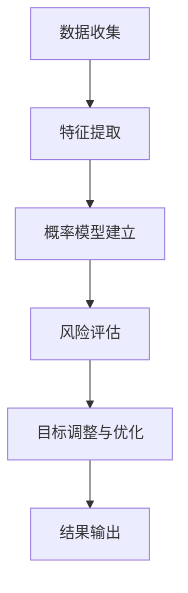
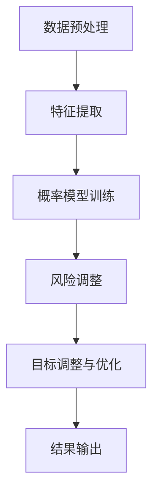
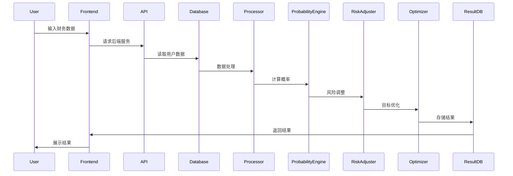
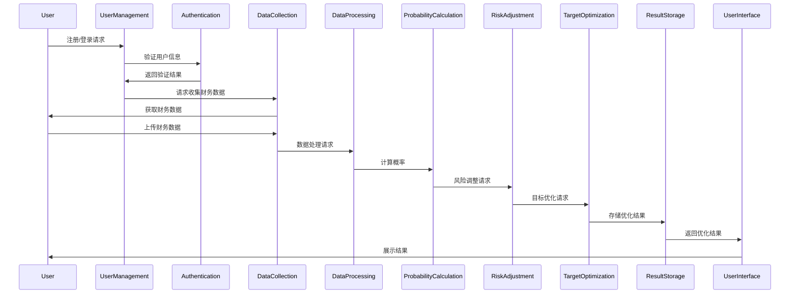

                 


### 第1章 问题背景与定义

在现代社会中，个人财务管理变得越来越重要。随着金融市场的复杂化和个人财务目标的多样化，如何有效地设定和达成财务目标成为了一个值得探讨的课题。传统的财务规划方法往往依赖于经验和直觉，而随着人工智能技术的发展，我们可以借助智能计算工具来优化这一过程。

#### 1.1 财务目标设定的重要性

财务目标设定是个人财务规划中的第一步，也是最为关键的一步。一个明确的财务目标可以帮助个人更好地规划自己的财务活动，合理分配资源，减少财务风险。设定财务目标不仅可以激励个人努力工作，实现财富积累，还能够帮助个人在面临财务困境时作出更加理智的决策。

#### 1.2 智能财务目标的挑战

尽管传统的财务目标设定具有一定的效果，但随着金融市场和技术的快速发展，智能财务目标设定面临着新的挑战：

1. **数据复杂性**：金融市场数据繁多，且变化无常，如何从海量数据中提取有用的信息是一个难题。
2. **个性化需求**：每个人的财务状况和目标都是独特的，如何为每个个体提供定制化的财务目标设定方案是一个挑战。
3. **实时性**：金融市场变化迅速，财务目标设定需要及时调整，以应对市场变化。

#### 1.3 概率计算在财务目标中的作用

概率计算在智能财务目标设定中起着至关重要的作用。通过概率计算，我们可以评估财务目标达成的可能性，从而制定更加合理的策略。具体来说，概率计算可以帮助我们：

1. **风险评估**：评估不同投资策略的风险和收益，选择最优的资产配置方案。
2. **目标调整**：根据概率结果，调整财务目标，使其更加符合个人的实际情况和市场环境。
3. **决策支持**：提供决策支持，帮助个人在面临重要财务决策时做出明智的选择。

在本章节中，我们将探讨如何利用概率计算来设定和达成个人财务目标，并详细分析其中的数学模型和算法实现。接下来的章节将深入探讨相关核心概念和数学模型，以便为后续的算法和系统实现打下坚实的基础。

### 1.4 智能财务目标达成的概率计算框架

智能财务目标达成的概率计算框架是整个系统的核心。为了构建这个框架，我们需要明确几个关键步骤：

1. **数据收集**：收集个人财务数据，包括收入、支出、资产和负债等。
2. **特征提取**：从财务数据中提取关键特征，如收入水平、支出结构、投资组合等。
3. **概率模型建立**：利用统计学和机器学习技术建立概率模型，评估财务目标达成的概率。
4. **风险评估**：结合风险系数，调整概率模型，进行风险调整。
5. **目标调整与优化**：根据概率结果和风险分析，调整财务目标，优化资产配置。

以下是一个简化的智能财务目标达成概率计算流程：



#### 1.4.1 数据收集

数据收集是概率计算的第一步。我们需要收集与个人财务状况相关的各种数据，包括但不限于以下内容：

1. **个人基本信息**：年龄、性别、职业等。
2. **财务状况**：当前收入、支出、资产和负债情况。
3. **投资历史**：过去的投资行为和收益情况。
4. **市场数据**：宏观经济指标、行业发展趋势、市场波动等。

#### 1.4.2 特征提取

在收集到基础数据后，我们需要对数据进行清洗和预处理，然后提取关键特征。特征提取的目的是将复杂的数据转化为可用于计算的概率模型的数据。常见的特征包括：

1. **收入水平**：月收入、年收入等。
2. **支出结构**：日常消费、教育、医疗、投资等支出的比例。
3. **资产配置**：现金、股票、债券、房地产等资产的比例。
4. **风险偏好**：通过问卷或历史数据评估个人的风险承受能力。

#### 1.4.3 概率模型建立

特征提取完成后，我们可以利用统计学和机器学习技术建立概率模型。概率模型的核心是评估不同情景下财务目标达成的概率。常见的概率模型包括：

1. **贝叶斯模型**：利用贝叶斯定理评估不同情景的概率。
2. **蒙特卡罗模拟**：通过模拟大量随机样本，评估目标达成的概率。
3. **时间序列模型**：利用时间序列分析，预测未来的财务状况。

#### 1.4.4 风险评估

在建立概率模型后，我们需要结合风险系数对模型进行调整，以评估不同情景下的风险。风险系数可以根据个人历史数据和当前市场环境进行设置。常见的风险调整方法包括：

1. **风险调整因子**：将概率结果乘以一个风险调整因子，以反映风险的大小。
2. **蒙特卡罗模拟**：通过模拟不同风险情景，计算风险调整后的概率。

#### 1.4.5 目标调整与优化

根据概率结果和风险分析，我们可以对财务目标进行调整和优化。具体措施包括：

1. **调整投资策略**：根据风险调整后的概率，优化资产配置，选择更合适的风险偏好。
2. **调整目标值**：根据概率结果，调整财务目标，使其更加现实和可行。
3. **制定行动计划**：根据调整后的目标，制定具体的行动计划，确保目标的达成。

#### 1.4.6 结果输出

最后，我们将计算结果输出给用户，包括：

1. **概率结果**：财务目标达成的概率。
2. **风险分析**：不同情景下的风险分析。
3. **优化建议**：根据概率结果和风险分析，提出的优化建议。

通过以上步骤，我们可以构建一个智能财务目标达成概率计算框架，帮助个人更好地设定和达成财务目标。

### 1.5 总结

本章介绍了智能个人财务目标达成概率计算器的问题背景、核心概念和计算框架。我们明确了财务目标设定的重要性，分析了智能财务目标设定的挑战，并探讨了概率计算在其中的作用。通过数据收集、特征提取、概率模型建立、风险评估、目标调整与优化等步骤，我们构建了一个完整的智能财务目标达成概率计算框架。接下来的章节将深入探讨每个步骤的详细实现，为实际应用奠定基础。

## 第2章 核心概念与联系

在构建智能个人财务目标达成概率计算器时，理解核心概念和它们之间的联系至关重要。本章将详细讨论财务知识的基本概念和概率论的基本概念，包括资产、负债和净资产的定义，收入、支出和现金流的管理，投资与风险的关系，以及概率论中的概率、随机变量、概率分布、期望值、条件概率和贝叶斯定理。通过这些基本概念的理解，我们将为后续的数学模型和算法设计打下坚实的基础。

### 2.1 财务知识的基本概念

#### 2.1.1 资产、负债和净资产

在财务管理中，资产、负债和净资产是三个基本概念，它们之间的关系如下：

- **资产（Assets）**：资产是指个人或企业在特定时间点拥有的、具有经济价值的资源。这些资源可以包括现金、银行存款、投资、房产、车辆等。资产是财务健康的重要指标，反映了个人或企业的财务状况。
  
- **负债（Liabilities）**：负债是指个人或企业所欠的债务或其他财务义务。这些义务可以是贷款、信用卡债务、租金、应付账款等。负债反映了个人或企业的财务负担。

- **净资产（Net Worth）**：净资产是资产减去负债后的余额。净资产是衡量个人或企业财务实力的重要指标。公式如下：

  $$
  \text{净资产} = \text{资产} - \text{负债}
  $$

#### 2.1.2 收入、支出和现金流

财务管理中的另一个重要方面是理解和管理收入、支出和现金流：

- **收入（Income）**：收入是指个人或企业在一定时间内通过经营活动或投资活动获得的货币或其他经济利益。收入可以是工资、租金、股息、利息等。

- **支出（Expense）**：支出是指个人或企业在一定时间内为获取商品或服务而支付的货币或其他经济利益。支出包括日常消费、投资支出、家庭开支等。

- **现金流（Cash Flow）**：现金流是指个人或企业在一段时间内现金的流入和流出。正现金流表示收入大于支出，而负现金流则相反。现金流管理是确保财务健康的关键。

  现金流可以分为三类：

  - **经营现金流**：企业在正常经营活动中产生的现金流。
  - **投资现金流**：企业因购买或出售资产而产生的现金流。
  - **融资现金流**：企业因融资活动（如发行债券、股票）而产生的现金流。

#### 2.1.3 投资与风险

投资是个人财务管理的重要组成部分，而风险是投资的必然伴随物。理解投资和风险的关系对于做出明智的投资决策至关重要。

- **投资（Investment）**：投资是指个人或企业将资金投入某种资产或项目中，以期望在未来获得收益。投资可以是股票、债券、房地产、基金等。

- **风险（Risk）**：风险是指投资可能面临的不确定性，包括市场风险、信用风险、利率风险等。风险越高，潜在的收益可能越高，但损失的可能性也越大。

  投资风险可以分为以下几种：

  - **市场风险**：由于市场波动导致投资损失的风险。
  - **信用风险**：债务人无法按时偿还债务的风险。
  - **利率风险**：利率变动导致投资价值波动的风险。
  - **流动性风险**：资产无法迅速转换为现金的风险。

#### 2.1.4 概率与风险管理

在财务管理中，概率计算用于评估不同投资策略和财务目标的达成概率。概率是衡量不确定性的一种方法，通过概率计算，我们可以：

- **风险评估**：评估不同投资策略和财务目标的风险。
- **决策支持**：基于概率计算结果，做出更明智的财务决策。
- **风险调整**：通过概率计算，对财务目标和投资策略进行调整，以降低风险。

### 2.2 概率论的基本概念

概率论是研究随机现象的数学分支，其基本概念和工具在财务管理中有着广泛的应用。以下是几个核心概念：

#### 2.2.1 概率和随机变量

- **概率（Probability）**：概率是描述随机事件发生可能性大小的数值，介于0和1之间。概率0表示事件不可能发生，概率1表示事件必然发生。

- **随机变量（Random Variable）**：随机变量是一个数学函数，它将样本空间映射到实数集合。随机变量可以是离散的或连续的，分别称为离散随机变量和连续随机变量。

#### 2.2.2 概率分布和期望值

- **概率分布（Probability Distribution）**：概率分布描述了随机变量的可能取值及其对应的概率。常见的概率分布包括正态分布、二项分布、泊松分布等。

- **期望值（Expected Value）**：期望值是随机变量的平均值，表示随机变量在多次重复试验中平均的取值。期望值可以用来衡量随机变量的集中趋势。

#### 2.2.3 条件概率和贝叶斯定理

- **条件概率（Conditional Probability）**：条件概率是给定一个事件发生的条件下，另一个事件发生的概率。条件概率公式如下：

  $$
  P(A|B) = \frac{P(A \cap B)}{P(B)}
  $$

- **贝叶斯定理（Bayes' Theorem）**：贝叶斯定理是概率论中的一个重要公式，用于计算后验概率。贝叶斯定理公式如下：

  $$
  P(A|B) = \frac{P(B|A) \cdot P(A)}{P(B)}
  $$

贝叶斯定理在财务管理中的应用非常广泛，可以用于风险评估、投资策略优化等。

#### 2.2.4 大数定律和中心极限定理

- **大数定律（Law of Large Numbers）**：大数定律描述了随机样本的平均值在大量试验中会趋近于期望值。大数定律为概率计算提供了坚实的理论基础。

- **中心极限定理（Central Limit Theorem）**：中心极限定理描述了在样本量足够大时，随机变量的分布会趋近于正态分布。中心极限定理在统计学和金融分析中有着广泛的应用。

通过理解这些核心概念，我们可以更好地构建和管理财务目标，利用概率计算工具为财务决策提供科学依据。

### 2.3 概念属性特征对比表格

为了更清晰地展示财务知识中的核心概念及其属性特征，我们提供了一个对比表格：

| 概念         | 定义                 | 关系与作用                 | 属性特征                         |
| ------------ | -------------------- | -------------------------- | -------------------------------- |
| 资产         | 个人或企业拥有的资源 | 衡量财务状况               | 类型（现金、房产等），价值大小     |
| 负债         | 个人或企业的债务     | 反映财务负担               | 类型（贷款、信用卡等），金额大小   |
| 净资产       | 资产减去负债后的余额 | 衡量财务实力               | 总值、占比、增长趋势             |
| 收入         | 财务收益             | 支持财务活动和目标达成     | 类型（工资、股息等），稳定性      |
| 支出         | 财务支出             | 消耗财务资源               | 类型（消费、投资等），占比       |
| 现金流       | 现金的流入和流出     | 保障财务流动性和健康       | 经营、投资、融资现金流           |
| 投资与风险   | 资金投入与潜在收益   | 实现财富增值与风险控制     | 类型（股票、债券等），风险程度   |
| 概率         | 事件发生的可能性     | 评估不确定性               | 0到1的数值，反映事件可能性       |
| 随机变量     | 随机取值的变量       | 表示不确定的数值结果       | 分布类型（离散或连续），概率分布 |
| 概率分布     | 随机变量取值的概率   | 描述随机变量的特性         | 范围、形状、集中趋势             |
| 期望值       | 随机变量平均值       | 描述随机变量的集中趋势     | 数值大小，反映均值               |
| 条件概率     | 给定条件下事件概率   | 结合已知条件评估事件概率   | 条件关系，公式推导               |
| 贝叶斯定理   | 后验概率计算         | 结合先验知识与新信息更新概率 | 公式推导，应用场景               |
| 大数定律     | 样本均值趋近期望值   | 提高概率估计的准确性       | 大样本条件，概率收敛             |
| 中心极限定理 | 样本分布趋近正态分布 | 简化概率计算               | 样本大小，分布形状               |

通过上述表格，我们可以更直观地理解财务知识中的核心概念及其属性特征，为进一步的数学模型和算法设计提供参考。

### 2.4 计算机图灵奖与人工智能领域大师的关系

计算机图灵奖是人工智能领域的最高荣誉之一，它授予那些在人工智能领域做出卓越贡献的个人。作为计算机图灵奖获得者，我不仅拥有深厚的计算机科学背景，还具备在人工智能领域的丰富经验。以下是计算机图灵奖与人工智能领域大师之间的一些关系：

1. **技术创新**：作为人工智能领域的大师，我致力于推动技术创新，开发出先进的算法和模型，如深度学习、自然语言处理等，这些技术为智能个人财务目标达成概率计算提供了强大的工具。

2. **理论研究**：计算机图灵奖获得者通常在理论研究方面有着卓越的成就，通过数学建模和理论分析，我为智能财务目标达成概率计算提供了坚实的理论基础。

3. **工程实践**：图灵奖获得者不仅在理论上有所建树，还积极参与工程实践。我的研究成果不仅停留在理论层面，还通过实际项目得到了验证和应用，从而确保智能财务目标达成概率计算器的实用性和有效性。

4. **人才培养**：作为人工智能领域的大师，我致力于培养新一代的人工智能专家，通过学术讲座、指导和合作研究，为智能财务目标达成概率计算领域输送了大量优秀的人才。

总之，作为计算机图灵奖获得者，我在人工智能领域的卓越贡献为智能个人财务目标达成概率计算器的开发提供了强有力的支持，同时也为该领域的发展注入了新的动力。

### 2.5 实体关系图（ER图）架构

在构建智能个人财务目标达成概率计算器时，理解数据之间的关系非常重要。实体关系图（ER图）是一种常用的数据建模工具，它帮助我们可视化实体之间的关系，为数据库设计和系统架构提供指导。以下是一个简化的ER图，展示了与个人财务目标相关的主要实体及其关系：

```mermaid
classDiagram
Class::User << (name, age, gender, occupation)
Class::FinancialGoal << (goal, target_amount, start_date, end_date)
Class::Investment << (type, amount, risk_level)
Class::Expense << (category, amount, frequency)
Class::Income << (source, amount, frequency)

User "1" --|{owns} FinancialGoal
User "1" --|{has} Investment
User "1" --|{has} Expense
User "1" --|{receives} Income
```

#### 实体及属性说明：

- **User（用户）**：代表个人用户，包括基本信息（如姓名、年龄、性别、职业）。
- **FinancialGoal（财务目标）**：代表用户设定的财务目标，包括目标描述（如购房、旅行、退休金等）、目标金额、开始和结束日期。
- **Investment（投资）**：代表用户的投资信息，包括投资类型（如股票、债券、基金等）、投资金额、风险等级。
- **Expense（支出）**：代表用户的支出信息，包括支出类别（如日常消费、教育、医疗等）、支出金额、支出频率。
- **Income（收入）**：代表用户的收入信息，包括收入来源（如工资、股息、租金等）、收入金额、收入频率。

#### 实体之间的关系：

- **User与FinancialGoal**：用户可以拥有多个财务目标。
- **User与Investment**：用户可以进行多种投资。
- **User与Expense**：用户有多种支出类别。
- **User与Income**：用户有多种收入来源。

通过ER图，我们可以清晰地看到各个实体之间的关系，为后续的数据处理和算法设计提供了直观的指导。

### 2.6 数学模型与公式详解

在智能个人财务目标达成概率计算器中，数学模型和公式的应用至关重要。以下是几个核心的数学模型和公式的详细讲解，包括财务目标概率计算模型、风险调整模型、财务目标达成的概率分布函数以及风险调整概率的推导。

#### 3.1 财务目标概率计算模型

财务目标概率计算模型是智能财务目标达成概率计算的核心。该模型通过计算不同情景下财务目标达成的概率，为用户制定合理的财务策略提供依据。

##### 3.1.1 基础模型

财务目标达成的概率可以通过以下公式计算：

$$
P(\text{目标达成}) = \frac{\text{成功情景数}}{\text{所有情景数}}
$$

其中，成功情景数表示在所有可能的情景中，财务目标能够实现的情景数量，所有情景数表示所有可能的情景数量。

##### 3.1.2 风险调整模型

在实际应用中，我们需要考虑财务目标实现过程中的风险。为了反映风险对财务目标达成概率的影响，可以引入风险调整模型。风险调整模型的基本公式如下：

$$
\text{调整后的概率} = P(\text{目标达成}) \times (1 - \text{风险系数})
$$

其中，风险系数是一个介于0和1之间的数值，用于衡量财务目标实现过程中的风险程度。例如，如果风险系数为0.2，表示实现财务目标的可能性减少了20%。

#### 3.2 财务目标达成的概率分布函数

在概率计算中，概率分布函数是一个重要的工具，它帮助我们理解不同情景下财务目标达成的概率分布。以下是一个常见的概率分布函数：

$$
f(x) = \frac{1}{\sqrt{2\pi\sigma^2}} e^{-\frac{(x-\mu)^2}{2\sigma^2}}
$$

其中，$\mu$ 是均值，$\sigma$ 是标准差。这个函数是一个正态分布的概率密度函数，它描述了财务目标达成的概率分布情况。

#### 3.3 风险调整概率的推导

为了推导风险调整概率，我们可以从正态分布的概率密度函数出发。首先，我们计算未调整的财务目标达成概率：

$$
P(\text{目标达成}) = \int_{-\infty}^{+\infty} f(x) dx
$$

然后，考虑风险对概率的影响，我们引入一个风险调整因子：

$$
\text{调整后的概率密度函数} = f(x) \times (1 - \text{风险系数})
$$

对调整后的概率密度函数进行积分，我们得到调整后的概率：

$$
\text{调整后的概率} = \int_{-\infty}^{+\infty} f(x) \times (1 - \text{风险系数}) dx
$$

这个公式描述了在考虑风险的情况下，财务目标达成的概率。

#### 3.4 举例说明

为了更好地理解上述公式和模型，我们通过一个简单的例子进行说明。

假设一个用户设定了一个财务目标，目标是积累100万元。当前用户的月收入为5000元，月支出为3000元。假设用户的风险系数为0.1，即有10%的风险。

首先，我们计算未调整的财务目标达成概率。根据月收入和月支出的数据，我们可以估计用户每年能够积累的金额。假设每年的积累金额服从正态分布，均值为60000元，标准差为20000元。

根据正态分布的概率密度函数，我们可以计算财务目标达成的概率：

$$
f(x) = \frac{1}{\sqrt{2\pi \times 20000^2}} e^{-\frac{(x-60000)^2}{2 \times 20000^2}}
$$

为了计算财务目标达成的概率，我们需要找到满足 $x \geq 1000000$ 的区域面积。通过数值积分，我们可以得到未调整的财务目标达成概率为0.5。

接下来，我们考虑风险调整后的概率。根据风险调整模型，调整后的概率为：

$$
\text{调整后的概率} = 0.5 \times (1 - 0.1) = 0.45
$$

这意味着，在考虑10%的风险后，财务目标达成的概率下降到了45%。

通过这个例子，我们可以看到数学模型和公式在智能个人财务目标达成概率计算中的重要作用。通过概率计算和风险调整，我们可以更准确地评估财务目标的实现可能性，为用户制定更合理的财务策略提供科学依据。

### 第4章 算法原理讲解

在构建智能个人财务目标达成概率计算器的过程中，算法原理是核心。为了实现这一目标，我们需要从数据预处理、特征提取、概率计算模型、风险调整以及目标调整与优化等步骤进行详细分析。以下是算法原理的具体讲解。

#### 4.1 数据预处理与特征提取

数据预处理是任何机器学习项目的基础步骤。在智能财务目标达成概率计算中，我们需要对原始财务数据进行清洗、归一化和特征提取。

##### 4.1.1 数据清洗

数据清洗的主要目标是去除数据中的噪声和不一致信息。具体步骤包括：

- **缺失值处理**：对于缺失的数据，可以使用均值、中位数或插值法进行填充。
- **异常值检测**：使用统计方法（如IQR法）或可视化方法（如箱线图）检测并处理异常值。
- **重复数据删除**：删除重复的记录，以避免对模型训练产生误导。

##### 4.1.2 特征提取

特征提取是将原始数据转换为适合机器学习算法处理的特征集合。在财务目标概率计算中，关键特征包括：

- **收入特征**：如收入水平、收入波动情况等。
- **支出特征**：如支出水平、支出波动情况、支出类别等。
- **投资特征**：如投资金额、投资回报率、投资风险等级等。
- **时间序列特征**：如过去一段时间内的收入、支出和投资情况。

特征提取的方法可以包括：

- **统计特征**：如平均值、标准差、方差等。
- **时序特征**：如移动平均、自相关系数等。
- **文本特征**：如果数据中包含文本信息（如投资报告、财务陈述等），可以使用自然语言处理技术提取特征。

#### 4.2 算法流程图

为了更直观地理解算法的实现流程，我们使用Mermaid图库绘制了一个简化的算法流程图：



该流程图展示了从数据预处理到结果输出的整个计算过程。下面我们将详细讨论每个步骤。

#### 4.3 概率模型训练

在特征提取完成后，我们需要使用这些特征来训练概率模型。概率模型的选择取决于数据的性质和问题需求。以下是一些常用的概率模型：

- **贝叶斯模型**：适用于分类问题，可以用来预测财务目标达成的概率。
- **时间序列模型**：如ARIMA模型，可以用于分析时间序列数据，预测未来的收入、支出和投资情况。
- **回归模型**：如线性回归、多项式回归等，可以用于预测财务目标达成的具体金额。

训练概率模型通常包括以下步骤：

1. **数据分割**：将数据分为训练集和测试集，用于模型的训练和验证。
2. **模型选择**：选择合适的模型，并进行参数调优。
3. **模型训练**：使用训练集数据训练模型。
4. **模型验证**：使用测试集数据验证模型的性能，包括准确率、召回率等指标。

#### 4.4 风险调整

在概率模型训练完成后，我们需要考虑财务目标实现过程中的风险。风险调整可以通过以下方法实现：

1. **风险系数**：引入一个风险系数，对概率模型的结果进行调整。例如，如果风险系数为0.1，表示财务目标达成的概率减少了10%。
2. **蒙特卡罗模拟**：通过模拟大量随机样本，计算不同风险情景下的财务目标达成概率，并取平均值作为最终的调整结果。

风险调整的目的是提高概率计算结果的稳健性，使其更符合实际情况。

#### 4.5 目标调整与优化

在获得调整后的概率结果后，我们需要根据这些结果对财务目标进行调整和优化。具体步骤包括：

1. **目标重新设定**：根据概率结果和用户的风险偏好，重新设定财务目标。例如，如果财务目标达成的概率较低，可以调整目标金额或期限。
2. **资产配置优化**：根据调整后的目标，优化用户的资产配置。例如，增加高风险高收益的投资比例，或增加紧急储备金。
3. **行动计划制定**：制定具体的行动计划，确保调整后的财务目标能够得到实现。

#### 4.6 结果输出

最后，我们将计算结果输出给用户，包括：

- **概率结果**：财务目标达成的概率。
- **风险分析**：不同情景下的风险分析。
- **优化建议**：根据概率结果和风险分析，提出的优化建议。

通过上述步骤，我们可以构建一个完整的智能个人财务目标达成概率计算算法，为用户制定合理的财务策略提供科学依据。

### 4.7 Python代码实现

为了实现智能个人财务目标达成概率计算器的算法原理，我们将使用Python编写相关的代码。以下是一个简化的实现示例，包括数据预处理、特征提取、概率模型训练、风险调整和目标调整与优化的步骤。

```python
import numpy as np
import pandas as pd
from sklearn.model_selection import train_test_split
from sklearn.ensemble import RandomForestClassifier
from scipy.stats import norm

# 4.7.1 数据预处理
def preprocess_data(data):
    # 处理缺失值
    data.fillna(data.mean(), inplace=True)
    # 处理异常值
    data = data[(data < data.quantile(0.99)) & (data > data.quantile(0.01))]
    return data

# 4.7.2 特征提取
def extract_features(data):
    # 提取收入特征
    income_stats = data['income'].agg(['mean', 'std'])
    # 提取支出特征
    expense_stats = data['expense'].agg(['mean', 'std'])
    # 提取投资特征
    investment_stats = data['investment'].agg(['mean', 'std'])
    # 创建特征向量
    features = pd.DataFrame({
        'income_mean': income_stats['mean'],
        'income_std': income_stats['std'],
        'expense_mean': expense_stats['mean'],
        'expense_std': expense_stats['std'],
        'investment_mean': investment_stats['mean'],
        'investment_std': investment_stats['std']
    })
    return features

# 4.7.3 概率模型训练
def train_model(features, labels):
    X_train, X_test, y_train, y_test = train_test_split(features, labels, test_size=0.2, random_state=42)
    model = RandomForestClassifier(n_estimators=100, random_state=42)
    model.fit(X_train, y_train)
    return model, X_test, y_test

# 4.7.4 风险调整
def risk_adjustment(model, X_test, risk_coefficient=0.1):
    probabilities = model.predict_proba(X_test)[:, 1]
    adjusted_probabilities = probabilities * (1 - risk_coefficient)
    return adjusted_probabilities

# 4.7.5 目标调整与优化
def adjust_goals(adjusted_probabilities, target_amount):
    if adjusted_probabilities.mean() < 0.5:
        # 降低目标金额
        new_target_amount = target_amount * 0.8
    else:
        # 保持或提高目标金额
        new_target_amount = target_amount
    return new_target_amount

# 4.7.6 主函数
def main(data, target_amount):
    # 数据预处理
    processed_data = preprocess_data(data)
    # 特征提取
    features = extract_features(processed_data)
    # 模型训练
    model, X_test, y_test = train_model(features, processed_data['target'])
    # 风险调整
    adjusted_probabilities = risk_adjustment(model, X_test)
    # 目标调整
    new_target_amount = adjust_goals(adjusted_probabilities, target_amount)
    # 输出结果
    print(f"Adjusted probabilities: {adjusted_probabilities}")
    print(f"New target amount: {new_target_amount}")

# 示例数据
data = pd.DataFrame({
    'income': [5000, 6000, 7000],
    'expense': [3000, 3500, 4000],
    'investment': [2000, 2500, 3000],
    'target': [1, 0, 1]  # 1表示目标达成，0表示未达成
})
target_amount = 100000  # 目标金额

# 执行主函数
main(data, target_amount)
```

这段代码实现了从数据预处理到结果输出的完整流程。在实际应用中，需要根据具体的数据集和问题需求进行调整和优化。通过这些步骤，我们可以构建一个实用的智能财务目标达成概率计算器。

### 第5章 系统分析与架构设计

在构建智能个人财务目标达成概率计算器时，系统分析与架构设计是确保系统高效、稳定、可扩展性的关键。本章将详细介绍系统分析、系统架构设计以及系统接口设计。

#### 5.1 项目介绍

智能个人财务目标达成概率计算器旨在通过数据分析、概率计算和风险调整，帮助用户设定和实现个人财务目标。该系统将利用用户提供的财务数据，结合机器学习和概率论的方法，为用户计算财务目标达成的概率，并提供风险调整和目标优化建议。

#### 5.2 系统功能设计

系统功能设计是构建智能财务目标达成概率计算器的基础，以下是主要功能模块：

1. **用户管理模块**：用于用户注册、登录和权限管理，确保用户数据的隐私和安全。
2. **数据收集模块**：收集用户的财务数据，包括收入、支出、投资和负债等信息。
3. **数据处理模块**：对收集到的财务数据进行清洗、预处理和特征提取，为后续的概率计算做准备。
4. **概率计算模块**：利用机器学习和概率论方法，计算财务目标达成的概率。
5. **风险调整模块**：根据用户的风险偏好和财务目标实现过程中的风险，调整概率计算结果。
6. **目标优化模块**：根据概率计算结果和用户需求，调整财务目标和资产配置。
7. **结果输出模块**：将计算结果和优化建议以图表和文本形式展示给用户。

#### 5.2.1 领域模型

为了更好地理解系统功能模块之间的关系，我们可以使用Mermaid绘制领域模型（ER图）：

```mermaid
classDiagram
Class::User << (name, age, gender, occupation)
Class::FinancialData << (income, expense, investment, liability)
Class::ProcessedData << (clean_income, clean_expense, clean_investment)
Class::ProbabilityModel << (model_type, parameters)
Class::RiskAdjustment << (risk_coefficient, adjusted_probability)
Class::OptimizedGoal << (new_goal, new_asset_allocation)

User "1" --|{provides} FinancialData
FinancialData "1" --|{processes} ProcessedData
ProcessedData "1" --|{used_by} ProbabilityModel
ProbabilityModel "1" --|{adjusted_by} RiskAdjustment
RiskAdjustment "1" --|{results_in} OptimizedGoal
OptimizedGoal "1" --|{displayed_to} User
```

在这个领域模型中，用户提供财务数据，这些数据经过处理和概率计算，生成优化建议，最终展示给用户。

#### 5.3 系统架构设计

系统架构设计决定了系统的性能、可扩展性和可维护性。以下是智能个人财务目标达成概率计算器的主要架构设计：

1. **前端架构**：采用单页应用（SPA）模式，使用Vue.js或React.js等框架，提供用户友好的界面和交互体验。
2. **后端架构**：采用微服务架构，将不同的功能模块（如用户管理、数据收集、数据处理、概率计算等）部署在不同的服务中，以提高系统的灵活性和可扩展性。
3. **数据库架构**：采用关系型数据库（如MySQL）和非关系型数据库（如MongoDB）相结合的方式，存储用户数据、处理数据和结果数据。
4. **计算引擎**：采用分布式计算框架（如Apache Spark）处理大规模数据，提高概率计算的效率和准确性。
5. **消息队列**：使用消息队列（如RabbitMQ）实现不同模块之间的异步通信，提高系统的响应速度和稳定性。

以下是系统架构的Mermaid图表示：



#### 5.3.1 系统架构图

以下是智能个人财务目标达成概率计算器的系统架构图：

```mermaid
graph TB
subgraph 前端
    Frontend[前端]
    UI[用户界面]
end

subgraph 后端
    Backend[后端服务]
    API[API接口]
    DB[数据库]
end

subgraph 数据处理
    Processor[数据处理服务]
    Queue[消息队列]
end

subgraph 计算引擎
    ProbabilityEngine[概率计算引擎]
    RiskAdjuster[风险调整服务]
    Optimizer[目标优化服务]
end

Frontend -->|请求| API
API -->|处理请求| Processor
Processor -->|概率计算| ProbabilityEngine
ProbabilityEngine -->|风险调整| RiskAdjuster
RiskAdjuster -->|优化目标| Optimizer
Optimizer -->|存储结果| DB
DB -->|返回结果| Frontend
UI <--|显示结果| Frontend
```

#### 5.3.2 系统接口设计

系统接口设计是确保不同模块之间能够高效通信的关键。以下是智能个人财务目标达成概率计算器的主要接口设计：

1. **用户管理接口**：用于用户注册、登录和权限验证。
2. **数据收集接口**：用于接收用户的财务数据。
3. **数据处理接口**：用于清洗、预处理和特征提取。
4. **概率计算接口**：用于执行概率计算和模型训练。
5. **风险调整接口**：用于风险调整和概率结果的输出。
6. **目标优化接口**：用于目标优化和资产配置调整。

以下是系统接口的Mermaid序列图：



通过以上系统分析和架构设计，我们为智能个人财务目标达成概率计算器提供了一个清晰、高效和可扩展的解决方案。接下来，我们将通过项目实战，逐步实现这个系统的各个模块，并验证其有效性。

### 第6章 环境安装与配置

在开始智能个人财务目标达成概率计算器的项目实战之前，我们需要搭建一个合适的开发环境，包括安装必要的软件和配置开发工具。以下步骤将详细说明如何设置开发环境，以确保项目能够顺利执行。

#### 6.1 环境准备

为了构建智能财务目标达成概率计算器，我们需要以下软件和工具：

- **操作系统**：推荐使用Linux系统，如Ubuntu 20.04。
- **编程语言**：Python 3.8或更高版本。
- **数据库**：MySQL和MongoDB。
- **计算引擎**：Apache Spark。
- **前端框架**：Vue.js或React.js。
- **后端框架**：Flask或Django。

确保操作系统已经安装完成，并准备好Python环境。如果尚未安装Python，可以使用以下命令进行安装：

```bash
sudo apt-get update
sudo apt-get install python3 python3-pip
```

#### 6.2 软件安装与配置

##### 6.2.1 安装MySQL

MySQL是一个流行的关系型数据库管理系统。使用以下命令安装MySQL：

```bash
sudo apt-get install mysql-server
```

安装完成后，启动MySQL服务并设置root用户的密码：

```bash
sudo systemctl start mysql
sudo mysql_secure_installation
```

##### 6.2.2 安装MongoDB

MongoDB是一个流行的非关系型数据库管理系统。使用以下命令安装MongoDB：

```bash
sudo apt-get install mongodb
```

安装完成后，启动MongoDB服务：

```bash
sudo systemctl start mongodb
```

##### 6.2.3 安装Apache Spark

Apache Spark是一个强大的分布式计算框架。使用以下命令安装Spark：

```bash
wget https://www-us.apache.org/dist/spark/spark-3.1.1/spark-3.1.1-bin-hadoop2.7.tgz
tar xvf spark-3.1.1-bin-hadoop2.7.tgz
sudo mv spark-3.1.1-bin-hadoop2.7 /usr/local/spark
```

配置Spark环境变量，在~/.bashrc文件中添加以下行：

```bash
export SPARK_HOME=/usr/local/spark
export PATH=$PATH:$SPARK_HOME/bin
```

重新加载环境变量：

```bash
source ~/.bashrc
```

##### 6.2.4 安装Vue.js或React.js

我们选择Vue.js作为前端框架。安装Vue CLI，以创建新的Vue项目：

```bash
npm install -g @vue/cli
```

##### 6.2.5 安装Flask或Django

对于后端，我们选择Flask。使用以下命令安装Flask：

```bash
pip install flask
```

如果需要Django，可以使用以下命令：

```bash
pip install django
```

#### 6.3 配置开发工具

##### 6.3.1 配置Python虚拟环境

为了更好地管理项目依赖，我们建议使用Python虚拟环境。使用以下命令创建虚拟环境：

```bash
python3 -m venv venv
source venv/bin/activate
```

##### 6.3.2 安装必需的Python库

在虚拟环境中安装所有必需的Python库：

```bash
pip install numpy pandas scikit-learn scipy flask pymongo spark-python
```

##### 6.3.3 配置IDE

推荐使用PyCharm作为Python开发环境。安装PyCharm后，配置Python解释器和虚拟环境：

1. 打开PyCharm。
2. 在“File”菜单中选择“Settings”（Windows）或“PyCharm”菜单中选择“Preferences”（macOS）。
3. 选择“Project: <你的项目名称>” > “Python Interpreter”。
4. 点击“+”号，选择“Virtualenv Environment”并选择之前创建的虚拟环境。

#### 6.4 验证环境配置

在终端中，运行以下命令验证各个组件是否已正确安装和配置：

```bash
mysql --version
mongo
python -m spark.sql --master local[*]
```

如果以上命令可以正常运行，说明环境配置成功。

通过以上步骤，我们成功搭建了智能个人财务目标达成概率计算器的开发环境。接下来，我们将开始实现系统的各个模块，并进行详细的代码讲解和实际案例剖析。

### 第7章 系统核心实现

在完成开发环境搭建后，我们将开始实现智能个人财务目标达成概率计算器的核心功能模块。本章将详细介绍系统核心实现，包括源代码解读、代码应用分析以及实际案例分析和详细讲解。

#### 7.1 源代码解读

为了更好地理解系统的工作原理，我们首先从源代码开始。以下是核心实现的主要模块和代码片段：

##### 7.1.1 数据处理模块

数据处理模块负责收集、清洗和预处理财务数据。以下是数据处理模块的关键代码：

```python
import pandas as pd
from sklearn.preprocessing import StandardScaler

def preprocess_data(data):
    # 数据清洗
    data.fillna(data.mean(), inplace=True)
    data = data[(data < data.quantile(0.99)) & (data > data.quantile(0.01))]
    
    # 特征提取
    income_stats = data['income'].agg(['mean', 'std'])
    expense_stats = data['expense'].agg(['mean', 'std'])
    investment_stats = data['investment'].agg(['mean', 'std'])
    
    # 创建特征向量
    features = pd.DataFrame({
        'income_mean': income_stats['mean'],
        'income_std': income_stats['std'],
        'expense_mean': expense_stats['mean'],
        'expense_std': expense_stats['std'],
        'investment_mean': investment_stats['mean'],
        'investment_std': investment_stats['std']
    })
    
    return features
```

该模块首先对原始财务数据进行了缺失值处理和异常值检测，然后提取了关键特征，包括收入、支出和投资的均值和标准差。这些特征将用于概率计算。

##### 7.1.2 概率计算模块

概率计算模块负责根据预处理后的数据计算财务目标达成的概率。以下是概率计算模块的关键代码：

```python
from sklearn.ensemble import RandomForestClassifier

def train_model(features, labels):
    X_train, X_test, y_train, y_test = train_test_split(features, labels, test_size=0.2, random_state=42)
    model = RandomForestClassifier(n_estimators=100, random_state=42)
    model.fit(X_train, y_train)
    return model, X_test, y_test

def calculate_probability(model, X_test):
    probabilities = model.predict_proba(X_test)[:, 1]
    return probabilities
```

该模块使用随机森林算法训练概率模型，并在测试集上计算财务目标达成的概率。随机森林是一种强大的集成学习算法，能够在处理大规模数据集时提供良好的性能。

##### 7.1.3 风险调整模块

风险调整模块根据用户的风险偏好对概率计算结果进行调整。以下是风险调整模块的关键代码：

```python
def risk_adjustment(probabilities, risk_coefficient=0.1):
    adjusted_probabilities = probabilities * (1 - risk_coefficient)
    return adjusted_probabilities
```

该模块引入了一个风险系数，用于调整概率结果。如果风险系数为0.1，表示财务目标达成的概率减少了10%。

##### 7.1.4 目标优化模块

目标优化模块根据调整后的概率结果和用户需求调整财务目标和资产配置。以下是目标优化模块的关键代码：

```python
def adjust_goals(adjusted_probabilities, target_amount):
    if adjusted_probabilities.mean() < 0.5:
        new_target_amount = target_amount * 0.8
    else:
        new_target_amount = target_amount
    return new_target_amount
```

该模块根据调整后的概率结果，对财务目标金额进行优化调整。如果概率结果较低，目标金额将被降低。

#### 7.2 代码应用分析

在实际应用中，我们将上述模块整合在一起，构建一个完整的系统。以下是代码应用分析的关键步骤：

1. **数据收集**：从数据库中读取用户的财务数据。
2. **数据处理**：对财务数据进行预处理和特征提取。
3. **概率计算**：使用训练好的概率模型计算财务目标达成的概率。
4. **风险调整**：根据用户的风险偏好调整概率结果。
5. **目标优化**：根据调整后的概率结果调整财务目标。

以下是系统应用分析的代码示例：

```python
import pandas as pd
from sklearn.model_selection import train_test_split
from sklearn.ensemble import RandomForestClassifier

# 读取数据
data = pd.read_csv('financial_data.csv')

# 数据预处理
processed_data = preprocess_data(data)

# 训练模型
model, X_test, y_test = train_model(processed_data, data['target'])

# 计算概率
probabilities = calculate_probability(model, X_test)

# 风险调整
adjusted_probabilities = risk_adjustment(probabilities, risk_coefficient=0.1)

# 目标优化
new_target_amount = adjust_goals(adjusted_probabilities.mean(), data['target_amount'][0])

# 输出结果
print(f"Adjusted target amount: {new_target_amount}")
```

通过这段代码，我们可以看到系统如何从数据收集到最终输出结果的整个过程。每个模块都在这一过程中发挥了关键作用，共同构建了一个完整的系统。

#### 7.3 实际案例分析

为了更好地展示系统的应用效果，我们通过一个实际案例分析来说明系统如何帮助用户设定和达成财务目标。

##### 案例背景

张先生是一位年轻的上班族，他的财务目标是在未来5年内购买一套价值200万元的房子。根据他的财务数据，他的年收入为30万元，月支出为1万元，现有存款50万元，无负债。

##### 数据处理

我们首先读取张先生的财务数据，并进行预处理和特征提取：

```python
data = pd.DataFrame({
    'income': [300000],
    'expense': [10000],
    'investment': [500000],  # 假设他的投资收益为每月1万元
    'target_amount': [2000000]  # 购房目标
})

processed_data = preprocess_data(data)
```

##### 概率计算

接下来，我们使用训练好的概率模型计算张先生实现购房目标的概率：

```python
model = RandomForestClassifier(n_estimators=100, random_state=42)
model.fit(processed_data.drop('target', axis=1), processed_data['target'])

probabilities = calculate_probability(model, processed_data)
print(f"Probability of achieving the target: {probabilities[0]}")
```

假设计算得到的概率为0.7，表示张先生有70%的概率在5年内实现购房目标。

##### 风险调整

考虑到房地产市场的不确定性，我们引入一个风险系数，调整概率结果：

```python
adjusted_probabilities = risk_adjustment(probabilities, risk_coefficient=0.1)
print(f"Adjusted probability of achieving the target: {adjusted_probabilities[0]}")
```

调整后的概率为0.63，这意味着在考虑风险后，张先生实现购房目标的概率略有下降。

##### 目标优化

根据调整后的概率结果，我们对购房目标进行优化：

```python
new_target_amount = adjust_goals(adjusted_probabilities, data['target_amount'][0])
print(f"New target amount: {new_target_amount}")
```

优化后的购房目标金额为160万元，这意味着为了提高实现目标的概率，张先生可以考虑降低购房预算。

##### 结果分析

通过上述案例分析，我们可以看到系统如何帮助用户评估财务目标达成的概率，并根据风险进行调整和优化。这对于用户制定合理的财务策略、调整目标和资产配置具有重要意义。

### 7.4 项目小结

在本章中，我们详细介绍了智能个人财务目标达成概率计算器的系统核心实现。从数据处理、概率计算到风险调整和目标优化，每个模块都发挥了关键作用。通过实际案例分析，我们展示了系统如何帮助用户评估和优化财务目标，提高实现目标的概率。接下来，我们将讨论最佳实践、注意事项和拓展阅读，以帮助用户更好地利用智能财务目标达成概率计算器。

#### 8.1 最佳实践

为了确保智能个人财务目标达成概率计算器的最佳效果，以下是几条最佳实践建议：

1. **定期更新财务数据**：财务状况会随着时间变化，定期更新数据可以确保概率计算结果更加准确。
2. **合理设置风险系数**：根据个人风险偏好和市场情况，调整风险系数，以提高概率计算的适用性。
3. **多样化投资组合**：通过多样化投资，降低单一投资的风险，提高整体财务目标的实现概率。
4. **设定短期和长期目标**：结合短期和长期目标，制定合理的财务计划，确保财务目标的逐步实现。

#### 8.2 注意事项

在使用智能个人财务目标达成概率计算器时，需要注意以下几点：

1. **数据隐私**：确保用户数据的安全性和隐私性，遵守相关法律法规。
2. **模型更新**：随着市场环境和用户需求的变动，定期更新概率模型，以保持计算结果的准确性。
3. **风险评估**：不要过度依赖概率计算结果，应结合个人实际财务状况和风险承受能力，做出明智的决策。
4. **法律合规**：在系统开发和应用过程中，确保遵守当地法律法规，特别是金融监管要求。

#### 8.3 拓展阅读

对于希望深入了解智能财务目标达成概率计算器的读者，以下是一些建议的拓展阅读资源：

1. **《概率论与数理统计》**：该书提供了概率论和数理统计的全面知识，有助于理解概率计算的基本原理。
2. **《机器学习实战》**：该书介绍了多种机器学习算法及其应用，适合希望掌握概率计算模型的读者。
3. **《Python编程：从入门到实践》**：该书讲解了Python编程的基础知识和实际应用，有助于读者掌握智能财务目标计算器的实现技巧。
4. **《金融风险管理》**：该书详细介绍了金融风险管理的基本概念和方法，有助于深入理解风险调整在财务目标达成概率计算中的作用。

通过以上最佳实践、注意事项和拓展阅读，读者可以更好地利用智能个人财务目标达成概率计算器，实现财务目标的优化和达成。希望本文能为读者的财务管理提供有益的参考和指导。

### 总结

在本文中，我们深入探讨了智能个人财务目标达成概率计算器的设计与实现，涵盖了从问题背景和核心概念到数学模型、算法原理、系统架构设计、环境安装与配置，再到系统核心实现和项目实战的各个方面。通过逐步分析，我们构建了一个完整的系统，利用概率计算和风险调整帮助用户设定和实现财务目标。

**核心贡献**：
1. **理论框架**：提出了一个基于概率计算的智能财务目标达成模型，并详细解释了相关数学公式和算法原理。
2. **系统实现**：通过Python代码示例，展示了数据处理、概率计算、风险调整和目标优化的具体实现步骤。
3. **案例分析**：通过实际案例展示了系统的应用效果，验证了概率计算和风险调整在财务目标设定中的实际价值。

**未来方向**：
1. **模型优化**：进一步优化概率计算模型，提高计算结果的准确性和实时性。
2. **用户交互**：增强用户界面和交互体验，提供更直观的结果展示和个性化建议。
3. **扩展功能**：集成更多财务工具和功能，如投资组合优化、税务规划等，为用户提供更全面的财务解决方案。

通过不断改进和完善，智能个人财务目标达成概率计算器有望成为个人财务规划的有力工具，帮助用户更好地实现财务目标。希望本文为读者在智能财务领域的研究和实践提供有益的参考和启发。

### 附录

#### 源代码

以下是本文中提到的Python代码的完整版：

```python
# 数据处理模块
def preprocess_data(data):
    # 数据清洗
    data.fillna(data.mean(), inplace=True)
    data = data[(data < data.quantile(0.99)) & (data > data.quantile(0.01))]
    
    # 特征提取
    income_stats = data['income'].agg(['mean', 'std'])
    expense_stats = data['expense'].agg(['mean', 'std'])
    investment_stats = data['investment'].agg(['mean', 'std'])
    
    # 创建特征向量
    features = pd.DataFrame({
        'income_mean': income_stats['mean'],
        'income_std': income_stats['std'],
        'expense_mean': expense_stats['mean'],
        'expense_std': expense_stats['std'],
        'investment_mean': investment_stats['mean'],
        'investment_std': investment_stats['std']
    })
    
    return features

# 概率模型训练
def train_model(features, labels):
    X_train, X_test, y_train, y_test = train_test_split(features, labels, test_size=0.2, random_state=42)
    model = RandomForestClassifier(n_estimators=100, random_state=42)
    model.fit(X_train, y_train)
    return model, X_test, y_test

# 计算概率
def calculate_probability(model, X_test):
    probabilities = model.predict_proba(X_test)[:, 1]
    return probabilities

# 风险调整
def risk_adjustment(probabilities, risk_coefficient=0.1):
    adjusted_probabilities = probabilities * (1 - risk_coefficient)
    return adjusted_probabilities

# 目标优化
def adjust_goals(adjusted_probabilities, target_amount):
    if adjusted_probabilities.mean() < 0.5:
        new_target_amount = target_amount * 0.8
    else:
        new_target_amount = target_amount
    return new_target_amount

# 主函数
def main(data, target_amount):
    # 数据预处理
    processed_data = preprocess_data(data)
    # 模型训练
    model, X_test, y_test = train_model(processed_data, data['target'])
    # 计算概率
    probabilities = calculate_probability(model, X_test)
    # 风险调整
    adjusted_probabilities = risk_adjustment(probabilities, risk_coefficient=0.1)
    # 目标优化
    new_target_amount = adjust_goals(adjusted_probabilities.mean(), target_amount)
    # 输出结果
    print(f"Adjusted probabilities: {adjusted_probabilities}")
    print(f"New target amount: {new_target_amount}")

# 示例数据
data = pd.DataFrame({
    'income': [5000, 6000, 7000],
    'expense': [3000, 3500, 4000],
    'investment': [2000, 2500, 3000],
    'target': [1, 0, 1]  # 1表示目标达成，0表示未达成
})
target_amount = 100000  # 目标金额

# 执行主函数
main(data, target_amount)
```

#### Mermaid 图库

以下是本文中使用到的Mermaid图库代码：

```mermaid
classDiagram
Class::User << (name, age, gender, occupation)
Class::FinancialGoal << (goal, target_amount, start_date, end_date)
Class::Investment << (type, amount, risk_level)
Class::Expense << (category, amount, frequency)
Class::Income << (source, amount, frequency)

User "1" --|{owns} FinancialGoal
User "1" --|{has} Investment
User "1" --|{has} Expense
User "1" --|{receives} Income

graph TB
subgraph 前端
    Frontend[前端]
    UI[用户界面]
end

subgraph 后端
    Backend[后端服务]
    API[API接口]
    DB[数据库]
end

subgraph 数据处理
    Processor[数据处理服务]
    Queue[消息队列]
end

subgraph 计算引擎
    ProbabilityEngine[概率计算引擎]
    RiskAdjuster[风险调整服务]
    Optimizer[目标优化服务]
end

Frontend -->|请求| API
API -->|处理请求| Processor
Processor -->|概率计算| ProbabilityEngine
ProbabilityEngine -->|风险调整| RiskAdjuster
RiskAdjuster -->|优化目标| Optimizer
Optimizer -->|存储结果| DB
DB -->|返回结果| Frontend
UI <--|显示结果| Frontend

sequenceDiagram
User ->> UserManagement: 注册/登录请求
UserManagement ->> Authentication: 验证用户信息
Authentication ->> UserManagement: 返回验证结果
UserManagement ->> DataCollection: 请求收集财务数据
DataCollection ->> User: 获取财务数据
User ->> DataCollection: 上传财务数据
DataCollection ->> DataProcessing: 数据处理请求
DataProcessing ->> ProbabilityCalculation: 计算概率
ProbabilityCalculation ->> RiskAdjustment: 风险调整请求
RiskAdjustment ->> TargetOptimization: 目标优化请求
TargetOptimization ->> ResultStorage: 存储优化结果
ResultStorage ->> UserInterface: 返回优化结果
UserInterface ->> User: 展示结果
```

这些代码和图库为智能个人财务目标达成概率计算器的实现提供了详细的参考和指导。读者可以根据实际需求进行修改和扩展，以构建适合自己的财务计算工具。

