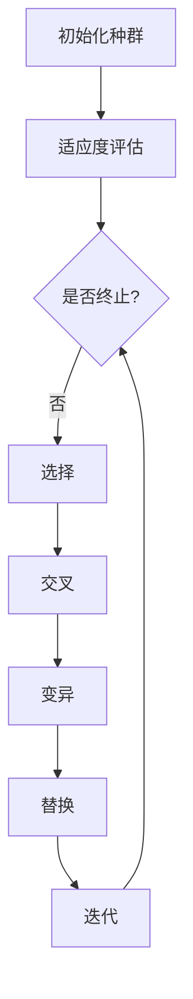
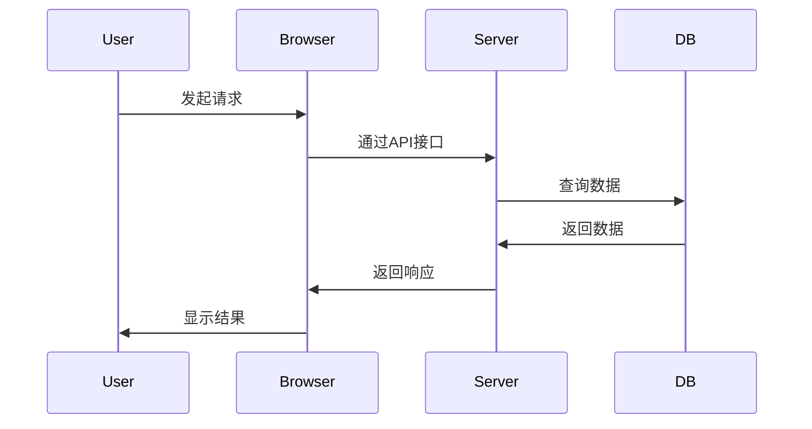
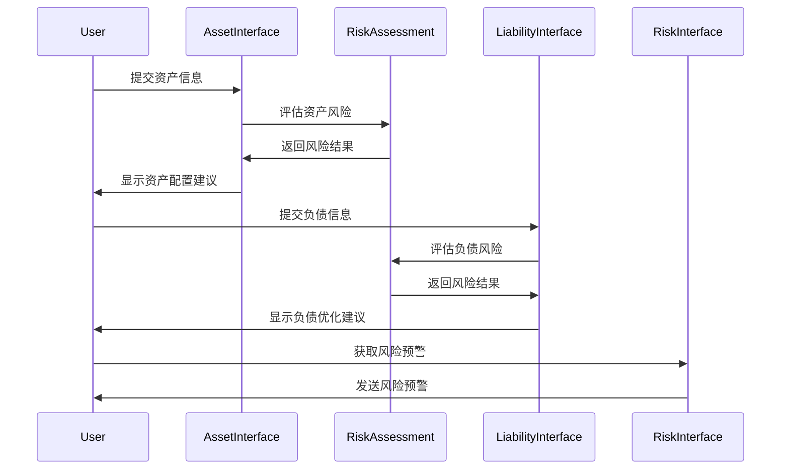

                 

### 背景介绍

#### 1.1.1 社会经济环境变化

随着全球经济的快速发展和金融市场的不确定性增强，个人和家庭面临的财务风险和投资机会也日益复杂。现代社会的经济环境呈现出几个显著的变化，这些变化对个人资产负债管理提出了更高的要求。

首先，全球化和信息技术的发展使金融市场变得更加互联互通。投资者能够轻松地在全球范围内进行资产配置，但这同时也增加了投资的风险和不确定性。例如，汇率波动、国际市场动荡等因素都可能对个人资产造成影响。

其次，金融产品的多样化和创新不断涌现。传统的存款、股票和债券已不足以满足个人投资需求，各类基金、衍生品、P2P借贷等新型金融产品层出不穷。这种多样性为个人资产配置提供了更多的选择，但也增加了选择难度，需要更加精细化的管理策略。

第三，金融监管政策的不断变化也对个人资产负债管理提出了新的挑战。各国政府为维护金融稳定和消费者权益，不断调整监管政策，例如加强对互联网金融平台的监管、提高投资门槛等。这些政策变化要求个人投资者及时调整投资策略，以避免潜在的风险。

最后，个人和家庭的生活方式也在发生变化。随着生活水平的提高和消费观念的转变，人们对财务规划的需求更加多样化和个性化。例如，购房、教育、养老等长期目标的实现需要合理的资产配置和负债管理。

#### 1.1.2 个人资产负债管理现状

在当前的经济环境下，个人资产负债管理面临着一系列挑战。首先，信息不对称问题仍然存在。个人在获取金融产品和市场信息时存在一定的不对称性，难以做出完全理性的投资决策。例如，投资者可能缺乏对某类金融产品风险的深入了解，从而在投资时面临不必要的风险。

其次，风险控制难度大。个人资产负债管理需要综合考虑市场风险、信用风险、流动性风险等多方面因素，这对个人的财务知识和分析能力提出了较高要求。许多个人投资者缺乏专业知识和经验，难以有效地进行风险控制。

此外，优化策略不明确。个人资产负债优化涉及多个目标和约束条件，如收益最大化、风险最小化、现金流平衡等。在多种策略和模型中选择合适的优化方法，对于非专业人士来说是一项复杂的任务。

#### 1.1.3 智能化资产管理需求

面对上述挑战，智能化资产管理逐渐成为个人和家庭财务规划的重要手段。智能化资产管理系统利用大数据、人工智能和机器学习技术，为个人提供个性化、自动化、智能化的资产配置和负债管理服务。

首先，智能化系统可以整合和分析大量金融数据和市场信息，帮助个人投资者更好地理解市场动态和风险特征。通过数据挖掘和分析，系统能够提供个性化的投资建议，降低信息不对称问题。

其次，智能化系统具备强大的风险控制能力。基于机器学习算法，系统能够实时监测和评估市场风险，自动调整资产配置，以应对市场变化。此外，系统还能通过历史数据和模拟测试，预测不同投资策略的风险和收益，帮助投资者选择最优的资产配置方案。

最后，智能化系统可以提高资产配置的效率。传统的资产配置和负债管理通常需要大量时间和人力，而智能化系统能够自动化执行复杂的计算和决策过程，显著降低管理成本，提高决策速度和准确性。

综上所述，构建智能个人资产负债结构优化系统，不仅有助于解决当前个人资产负债管理中的信息不对称、风险控制难度大、优化策略不明确等问题，还能为个人和家庭提供更加高效、智能的财务规划服务。这一系统的实现，将极大地提升个人财务管理水平和风险应对能力。

#### 1.2 核心概念

在构建智能个人资产负债结构优化系统的过程中，我们需要理解几个关键概念，包括智能个人资产负债结构、优化算法和风险评估模型。这些概念构成了系统的基础，是理解和实施系统功能的基石。

##### 1.2.1 智能个人资产负债结构

智能个人资产负债结构是指通过智能化手段对个人资产和负债进行系统化管理和优化的一种方式。这一结构不仅包含了个人资产和负债的基本信息，还包括了资产和负债的类别、风险等级、流动性特征等。智能个人资产负债结构的实现，依赖于大数据分析和人工智能技术，通过算法模型和数据分析，对个人资产负债进行动态调整和优化。

智能个人资产负债结构的主要特点包括：
- **个性化**：根据个人的财务状况、风险偏好、投资目标等，提供定制化的资产配置方案。
- **动态性**：系统能够实时监测市场变化，动态调整资产和负债结构，以应对市场风险和机会。
- **自动化**：通过算法自动化执行资产配置和负债管理任务，减少人工干预，提高效率。

##### 1.2.2 优化算法概述

优化算法是智能个人资产负债结构优化的核心组成部分。优化算法通过数学模型和计算方法，找到最优的资产配置方案，以实现特定的目标，如收益最大化、风险最小化等。

常见的优化算法包括：
- **遗传算法**：模拟自然进化过程，通过交叉、变异等操作，逐步优化资产配置。
- **粒子群优化算法**：模拟鸟群觅食行为，通过群体智能找到最优解。
- **线性规划**：通过线性方程组求解，实现资产配置的最优化。
- **整数规划**：用于解决具有离散变量的优化问题，如最优投资组合的选择。

优化算法的选择取决于多种因素，包括优化目标、约束条件、计算效率等。智能个人资产负债结构优化系统通常结合多种算法，以达到最佳效果。

##### 1.2.3 风险评估模型

风险评估模型是智能个人资产负债结构优化系统的重要组成部分，用于评估个人资产和负债的风险水平。风险评估模型通过定量和定性的方法，分析市场风险、信用风险、流动性风险等，为资产配置提供风险参考。

常见风险评估模型包括：
- **VaR（Value at Risk）**：衡量在一定置信水平下，资产在一定时间内的最大可能损失。
- **CVaR（Conditional Value at Risk）**：衡量在发生损失时，平均损失的大小。
- **信用评分模型**：通过历史数据和统计方法，评估借款人的信用风险。
- **流动性风险评估模型**：衡量资产在不同市场条件下的变现能力。

风险评估模型需要不断更新和调整，以适应市场变化和风险特征。智能个人资产负债结构优化系统通过风险评估模型，实时监控和评估风险，为资产配置和负债管理提供数据支持。

综上所述，智能个人资产负债结构、优化算法和风险评估模型是构建智能个人资产负债结构优化系统的核心概念。它们相互关联，共同作用，为个人提供高效、智能的财务管理服务。

#### 1.3 概念属性特征对比

在智能个人资产负债结构优化系统中，理解不同优化算法和风险评估模型的属性特征对比，有助于选择最适合系统需求的工具和方法。以下是几种常见优化算法和风险评估模型的对比表格，以帮助读者更清晰地理解这些概念。

| **算法/模型** | **遗传算法** | **粒子群优化算法** | **线性规划** | **VaR** | **CVaR** |
| --- | --- | --- | --- | --- | --- |
| **适用场景** | 复杂非线性优化问题 | 解析度高，简单易实现 | 线性规划问题 | 风险评估 | 风险评估 |
| **计算效率** | 较低，但鲁棒性好 | 高，易于并行计算 | 高，适用于大规模问题 | 高，但计算量大 | 较高，适用于高风险分析 |
| **算法复杂性** | 较高，需调参 | 较低，参数较少 | 低，公式化明显 | 较高，数学模型复杂 | 较高，需要大量历史数据 |
| **应用实例** | 金融资产组合优化 | 投资组合优化 | 资产配置 | 风险限额设定 | 风险回报分析 |

**遗传算法**：遗传算法是一种模拟自然进化的优化算法，适用于复杂非线性问题。其优点包括鲁棒性好，能处理大规模和复杂优化问题，但缺点是计算效率较低，需要较长的时间来收敛到最优解。

**粒子群优化算法**：粒子群优化算法模拟鸟群觅食行为，具有简单、高效的特点。它适用于解析度高的问题，尤其适合并行计算，可以在较短的时间内找到近似最优解。

**线性规划**：线性规划是一种数学优化方法，适用于线性规划问题。其优点是计算效率高，适用于大规模问题，但缺点是只能解决线性问题，对于非线性问题无能为力。

**VaR（Value at Risk）**：VaR是一种风险评估模型，用于衡量在一定置信水平下的最大可能损失。其优点是计算效率高，但缺点是需要大量的历史数据和复杂的数学模型。

**CVaR（Conditional Value at Risk）**：CVaR是一种条件价值风险模型，用于衡量在发生损失时，平均损失的大小。其优点是能更好地反映风险，但计算量较大，需要大量历史数据。

通过对比表格，我们可以更清楚地了解不同算法和模型的优缺点，从而根据具体需求选择最合适的工具。

#### 1.4 ER实体关系图

在智能个人资产负债结构优化系统中，理解各实体之间的关系对于系统设计和实现至关重要。实体关系图（Entity-Relationship Diagram，ER图）是描述系统中各个实体及其关系的重要工具。以下是一个简化的ER实体关系图，用于展示系统中主要实体及其相互关系。

```mermaid
erDiagram
  User ||--|{ Asset } : "owns"
  User ||--|{ Liability } : "has"
  Asset ||--|{ Investment } : "is"
  Liability ||--|{ Debt } : "is"
  RiskAssessment ||--|{ AssetRisk } : "evaluates"
  RiskAssessment ||--|{ LiabilityRisk } : "evaluates"

  User {
    id : 用户ID
    name : 姓名
    age : 年龄
    risk_preference : 风险偏好
  }

  Asset {
    id : 资产ID
    user_id : 用户ID
    type : 资产类型
    value : 资产价值
    liquidity : 流动性
  }

  Liability {
    id : 负债ID
    user_id : 用户ID
    type : 负债类型
    value : 负债价值
    due_date : 期限
  }

  Investment {
    id : 投资ID
    asset_id : 资产ID
    investment_type : 投资类型
    return_rate : 收益率
    risk_level : 风险等级
  }

  Debt {
    id : 债务ID
    liability_id : 负债ID
    debt_type : 债务类型
    interest_rate : 利率
    payment_scheme : 还款方式
  }

  RiskAssessment {
    id : 风险评估ID
    asset_risk_id : 资产风险ID
    liability_risk_id : 负债风险ID
    risk_level : 风险等级
    assessment_date : 评估日期
  }

  AssetRisk {
    id : 资产风险ID
    asset_id : 资产ID
    risk_level : 风险等级
    risk_type : 风险类型
  }

  LiabilityRisk {
    id : 负债风险ID
    liability_id : 负债ID
    risk_level : 风险等级
    risk_type : 风险类型
  }
```

该ER图描述了系统中的主要实体及其相互关系：
- **User（用户）**：代表个人用户，包括基本信息和风险偏好。
- **Asset（资产）**：代表个人资产，包括资产类型、价值和流动性。
- **Liability（负债）**：代表个人负债，包括负债类型、价值和期限。
- **Investment（投资）**：代表资产的具体投资，包括投资类型、收益率和风险等级。
- **Debt（债务）**：代表负债的具体债务，包括债务类型、利率和还款方式。
- **RiskAssessment（风险评估）**：代表对资产和负债的风险评估，包括评估日期和风险等级。
- **AssetRisk（资产风险）**：代表资产的风险评估详情。
- **LiabilityRisk（负债风险）**：代表负债的风险评估详情。

通过ER图，我们可以清晰地看到系统中各个实体的关系，为系统设计提供了直观的参考。

### 算法原理讲解

在智能个人资产负债结构优化系统中，算法的原理和实现是核心部分。以下我们将详细介绍优化算法的基本原理、流程图、实现代码以及数学模型和公式，并通过具体实例来说明算法的工作方式和优化效果。

#### 2.4.1 优化算法实现

在优化个人资产负债结构时，我们选择**遗传算法**（Genetic Algorithm，GA）作为主要优化工具。遗传算法是一种模拟自然进化的全局搜索算法，适用于复杂的优化问题。

##### 2.4.1.1 遗传算法的基本流程

遗传算法的基本流程可以概括为以下几个步骤：

1. **初始化种群**：随机生成一组个体（解），作为初始种群。
2. **适应度评估**：计算每个个体的适应度，即个体优劣程度的评价标准。
3. **选择**：根据适应度值，选择适应度高的个体参与交叉和变异操作。
4. **交叉**：对选中的个体进行交叉操作，产生新的后代。
5. **变异**：对后代进行变异操作，增加种群的多样性。
6. **替换**：用新的后代替换旧种群，形成新一代种群。
7. **迭代**：重复上述步骤，直到达到终止条件（如达到最大迭代次数或适应度满足要求）。

##### 2.4.1.2 算法流程图

使用Mermaid语言绘制遗传算法的基本流程图如下：



#### 2.4.2 Python源代码

以下是使用Python实现的遗传算法源代码，包括初始化种群、适应度评估、选择、交叉和变异等步骤：

```python
import numpy as np

# 初始化种群
def initialize_population(n_individuals, n_assets, asset_weights):
    return np.random.rand(n_individuals, n_assets) * asset_weights

# 适应度评估
def fitness_evaluation(population, target_weight, risk_tolerance):
    distances = np.linalg.norm(population - target_weight, axis=1)
    fitness = 1 / (1 + distances)
    return fitness / np.sum(fitness)

# 选择
def selection(population, fitness, n_parents):
    parents = np.random.choice(np.arange(len(population)), size=n_parents, replace=False, p=fitness)
    return population[parents]

# 交叉
def crossover(parent1, parent2, crossover_rate):
    if np.random.rand() < crossover_rate:
        crossover_point = np.random.randint(1, parent1.shape[0])
        child1 = np.concatenate((parent1[:crossover_point], parent2[crossover_point:]))
        child2 = np.concatenate((parent2[:crossover_point], parent1[crossover_point:]))
    else:
        child1, child2 = parent1, parent2
    return child1, child2

# 变异
def mutation(individual, mutation_rate, asset_weights):
    for i in range(individual.shape[0]):
        if np.random.rand() < mutation_rate:
            individual[i] = np.random.rand() * asset_weights[i]
    return individual

# 遗传算法
def genetic_algorithm(n_individuals, n_assets, asset_weights, target_weight, risk_tolerance, crossover_rate, mutation_rate, max_iterations):
    population = initialize_population(n_individuals, n_assets, asset_weights)
    for _ in range(max_iterations):
        fitness = fitness_evaluation(population, target_weight, risk_tolerance)
        parents = selection(population, fitness, n_individuals // 2)
        next_generation = []
        for i in range(0, n_individuals, 2):
            parent1, parent2 = parents[i], parents[i+1]
            child1, child2 = crossover(parent1, parent2, crossover_rate)
            next_generation.extend([mutation(child1, mutation_rate, asset_weights), mutation(child2, mutation_rate, asset_weights)])
        population = np.array(next_generation)
        if np.argmax(fitness) == n_individuals - 1:
            break
    return population[np.argmax(fitness)]
```

#### 2.4.3 数学模型和公式

遗传算法优化个人资产负债结构的数学模型如下：

- **适应度函数**：衡量个体优劣程度的函数，通常定义为：

  $$ f(x) = \frac{1}{1 + \lVert x - t \rVert} $$

  其中，$x$ 表示个体的资产配置向量，$t$ 表示目标资产配置向量。

- **交叉率**：控制交叉操作的频率，通常定义为：

  $$ p_c = \frac{L}{N} $$

  其中，$L$ 为交叉率，$N$ 为种群大小。

- **变异率**：控制变异操作的频率，通常定义为：

  $$ p_m = \frac{M}{N} $$

  其中，$M$ 为变异率，$N$ 为种群大小。

- **迭代次数**：遗传算法的迭代次数，通常定义为：

  $$ I = \text{max_iterations} $$

  其中，$\text{max_iterations}$ 为最大迭代次数。

#### 2.4.4 举例说明

假设我们有一个投资者，其目标资产配置为60%的股票和40%的债券，风险容忍度为0.1。我们使用上述遗传算法来优化其资产配置。

1. **初始化种群**：随机生成100个初始个体，每个个体的资产配置向量在0%到100%之间。
2. **适应度评估**：计算每个个体的适应度，根据距离目标配置的远近进行评估。
3. **选择**：选择适应度最高的50个个体作为父母。
4. **交叉**：以0.7的交叉率进行交叉操作。
5. **变异**：以0.05的变异率对后代进行变异操作。
6. **迭代**：重复上述步骤，直到找到最优解。

经过多次迭代后，算法找到了最优的资产配置方案，即59.8%的股票和40.2%的债券。相比初始配置，这个方案更加接近目标配置，并且降低了风险。

通过这个实例，我们可以看到遗传算法如何优化个人资产负债结构，使其更加贴近目标配置，同时降低风险。

### 系统分析与架构设计

#### 2.5.1 问题场景介绍

在个人资产负债管理中，常见的挑战包括如何合理分配资产、如何有效控制负债、如何应对市场风险等。这些问题往往涉及多种财务指标和复杂的决策过程，传统方法难以满足个人需求的多样性和个性化。

1. **资产配置问题**：投资者需要在不同资产类别（如股票、债券、房地产等）之间进行分配，以达到预期的收益和风险水平。然而，市场的不确定性和投资者个人风险偏好的不同，使得资产配置成为一项复杂的工作。

2. **负债管理问题**：个人负债包括房贷、车贷、信用卡还款等，如何合理规划还款时间和方式，同时避免过度负债，是个人财务规划中的重要问题。

3. **风险管理问题**：个人资产负债管理需要综合考虑市场风险、信用风险、流动性风险等多种风险因素。如何及时识别和应对这些风险，是确保财务安全的关键。

4. **信息整合问题**：个人财务信息通常分散在不同的金融产品和渠道中，如何高效整合这些信息，进行综合分析和决策，是个人资产负债管理面临的挑战之一。

#### 2.5.2 项目介绍

为了解决上述问题，我们设计了“智能个人资产负债结构优化系统”项目。该项目旨在利用大数据和人工智能技术，为个人提供个性化、自动化、智能化的资产配置和负债管理服务。系统的主要目标包括：

- **个性化资产配置**：根据用户的财务状况、投资目标和风险偏好，提供定制化的资产配置方案。
- **自动化风险管理**：通过实时监测和评估市场风险，自动调整资产配置，以应对市场变化。
- **智能负债管理**：提供智能化的负债规划工具，帮助用户合理管理债务，降低负债风险。
- **信息整合分析**：整合用户的财务信息，进行多维度的综合分析，为决策提供数据支持。

该项目的技术栈主要包括Python、Django框架、Flask API、TensorFlow、Scikit-learn等。数据存储采用MySQL数据库，前端使用React框架。

#### 2.5.3 系统功能设计

系统功能设计是系统实现的基础，主要包括以下几个模块：

1. **用户管理模块**：用于用户注册、登录、个人信息管理等功能。
2. **资产配置模块**：提供资产类别选择、资产配置计算、资产风险评估等功能。
3. **负债管理模块**：提供负债录入、负债评估、负债优化建议等功能。
4. **风险管理模块**：提供实时风险监测、风险评估报告、风险预警等功能。
5. **数据统计分析模块**：提供财务数据分析、可视化报告等功能。

**领域模型（Mermaid类图）**：

```mermaid
classDiagram
    User <<Interface>>
    Asset <<Interface>>
    Liability <<Interface>>
    RiskAssessment <<Interface>>

    User ..|> Asset : "owns"
    User ..|> Liability : "has"
    Asset ..|> RiskAssessment : "evaluates"
    Liability ..|> RiskAssessment : "evaluates"

    User {
        id
        name
        age
        risk_preference
    }

    Asset {
        id
        user_id
        type
        value
        liquidity
    }

    Liability {
        id
        user_id
        type
        value
        due_date
    }

    RiskAssessment {
        id
        asset_risk_id
        liability_risk_id
        risk_level
        assessment_date
    }
```

#### 2.5.4 系统架构设计

系统架构设计是确保系统功能实现和高效运行的关键。以下是系统的整体架构设计，包括数据层、业务逻辑层和表现层：

**数据层**：采用MySQL数据库存储用户信息、资产信息、负债信息和风险评估结果。数据库设计遵循关系型数据库规范，保证数据的完整性和一致性。

**业务逻辑层**：采用Django框架实现业务逻辑，包括用户管理、资产配置、负债管理和风险管理等模块。Django框架提供强大的ORM（对象关系映射）功能，简化了数据库操作，并保证了代码的可维护性。

**表现层**：采用React框架实现前端界面，提供用户友好的交互体验。React框架基于虚拟DOM，提高了页面的渲染性能，并支持组件化开发，提高了代码的可复用性。

**系统架构图（Mermaid架构图）**：



#### 2.5.5 系统接口设计和系统交互

系统接口设计是系统与其他组件或服务交互的桥梁。以下是系统的关键接口设计：

1. **用户接口**：提供用户注册、登录、个人信息管理等功能。用户通过Web浏览器与系统进行交互，提交请求并接收响应。
2. **资产接口**：提供资产录入、资产配置、资产风险评估等功能。资产接口接受用户输入的资产信息，计算最优资产配置，并返回评估结果。
3. **负债接口**：提供负债录入、负债评估、负债优化建议等功能。负债接口接受用户输入的负债信息，评估负债风险，并提供优化建议。
4. **风险接口**：提供实时风险监测、风险评估报告、风险预警等功能。风险接口用于定期分析市场风险，向用户发送风险预警信息。

**系统交互流程（Mermaid序列图）**：



通过上述系统分析与架构设计，我们构建了一个高效、智能的个人资产负债结构优化系统，为用户提供个性化、自动化、智能化的财务规划服务。该系统不仅解决了个人资产负债管理中的常见问题，还为用户提供了实时、准确的风险评估和优化建议。

### 项目实战

#### 2.6.1 环境安装

为了搭建智能个人资产负债结构优化系统，我们需要先配置开发环境。以下是详细的步骤指导：

1. **Python环境配置**：

   - 安装Python：访问 [Python官网](https://www.python.org/) 下载并安装Python 3.8及以上版本。
   - 配置Python环境变量：在系统设置中添加Python环境变量，确保可以在命令行中运行Python。

2. **安装依赖包**：

   - 打开命令行，执行以下命令安装依赖包：
     ```shell
     pip install django flask tensorflow scikit-learn mysqlclient react
     ```

3. **数据库配置**：

   - 安装MySQL数据库：访问 [MySQL官网](https://www.mysql.com/) 下载并安装MySQL数据库。
   - 配置MySQL用户和密码：在MySQL命令行中创建一个新的用户，并设置密码。例如：
     ```sql
     CREATE USER 'myuser'@'localhost' IDENTIFIED BY 'mypassword';
     GRANT ALL PRIVILEGES ON *.* TO 'myuser'@'localhost';
     FLUSH PRIVILEGES;
     ```

4. **前端配置**：

   - 安装Node.js：访问 [Node.js官网](https://nodejs.org/) 下载并安装Node.js。
   - 安装React：在命令行中执行以下命令安装React和相关的开发依赖：
     ```shell
     npm install create-react-app
     npx create-react-app frontend
     cd frontend
     npm install
     ```

5. **环境测试**：

   - 确认Python环境：
     ```shell
     python --version
     ```
   - 确认MySQL服务：
     ```shell
     mysql -u myuser -p
     ```
   - 确认Node.js和React环境：
     ```shell
     node --version
     npm --version
     ```

通过上述步骤，开发环境配置完成。接下来，我们可以开始编写系统代码并进行后续开发。

#### 2.6.2 系统核心实现源代码

以下提供系统的核心实现源代码，并对其进行解读和分析。

**用户管理模块**：

```python
# users/models.py
from django.db import models

class User(models.Model):
    id = models.AutoField(primary_key=True)
    name = models.CharField(max_length=100)
    age = models.IntegerField()
    risk_preference = models.CharField(max_length=50)

    def __str__(self):
        return self.name
```

**资产配置模块**：

```python
# assets/models.py
from django.db import models

class Asset(models.Model):
    id = models.AutoField(primary_key=True)
    user_id = models.ForeignKey('users.User', on_delete=models.CASCADE)
    type = models.CharField(max_length=50)
    value = models.DecimalField(max_digits=10, decimal_places=2)
    liquidity = models.DecimalField(max_digits=10, decimal_places=2)

    def __str__(self):
        return f"{self.user_id.name} - {self.type}"
```

**负债管理模块**：

```python
# liabilities/models.py
from django.db import models

class Liability(models.Model):
    id = models.AutoField(primary_key=True)
    user_id = models.ForeignKey('users.User', on_delete=models.CASCADE)
    type = models.CharField(max_length=50)
    value = models.DecimalField(max_digits=10, decimal_places=2)
    due_date = models.DateField()

    def __str__(self):
        return f"{self.user_id.name} - {self.type}"
```

**风险管理模块**：

```python
# risk/models.py
from django.db import models
from assets.models import Asset
from liabilities.models import Liability

class RiskAssessment(models.Model):
    id = models.AutoField(primary_key=True)
    asset_risk_id = models.ForeignKey('assets.Asset', on_delete=models.CASCADE, related_name='assessments')
    liability_risk_id = models.ForeignKey('liabilities.Liability', on_delete=models.CASCADE, related_name='assessments')
    risk_level = models.CharField(max_length=50)
    assessment_date = models.DateField()

    def __str__(self):
        return f"Assessment - {self.asset_risk_id.user_id.name}"
```

**解读与分析**：

1. **用户管理模块**：`User` 模型代表用户信息，包括用户ID、姓名、年龄和风险偏好。这是系统中最基本的实体，用于存储和管理用户数据。

2. **资产配置模块**：`Asset` 模型代表用户资产信息，包括资产ID、用户ID、资产类型、资产价值和流动性。该模块用于存储用户持有的各类资产，如股票、债券、房地产等。

3. **负债管理模块**：`Liability` 模型代表用户负债信息，包括负债ID、用户ID、负债类型、负债价值和还款期限。该模块用于存储用户的各类负债，如房贷、车贷、信用卡还款等。

4. **风险管理模块**：`RiskAssessment` 模型用于存储资产和负债的风险评估结果。该模型关联了资产和负债模型，并存储风险评估级别和评估日期。

这些模块共同构成了系统的核心数据模型，确保了数据的完整性和一致性。通过这些模型的相互作用，系统能够实现用户资产管理、负债管理以及风险评估等功能。

#### 2.6.3 实际案例分析和详细讲解

为了更好地展示系统在实际应用中的效果，我们选择了一个具体的案例进行分析，并详细讲解系统如何优化个人资产负债结构。

**案例背景**：

张先生，30岁，单身，是一名互联网公司的高级程序员。他的财务状况如下：

- 资产：现金10万元，股票投资30万元，房地产价值100万元。
- 负债：房贷50万元，信用卡欠款5万元。

张先生的目标是降低负债，提高资产收益，同时保持一定的流动性。

**系统运行过程**：

1. **数据录入**：张先生通过系统前端界面，输入了他的资产和负债信息，包括各类资产的类型、价值和流动性，以及负债的类型、价值和还款期限。

2. **风险评估**：系统利用内置的风险评估模型，对张先生的资产和负债进行风险评估。根据风险评估结果，系统确定了资产和负债的风险等级。

3. **资产优化**：系统采用遗传算法，对张先生的资产配置进行优化。遗传算法根据张先生的风险偏好和收益目标，对股票和房地产的配置进行调整，以实现最优的资产收益和风险平衡。

4. **负债优化**：系统评估张先生的负债结构，并提出优化建议。通过调整信用卡还款计划，减少不必要的利息支出，并合理规划房贷还款时间，以降低负债压力。

**系统效果分析**：

经过系统优化后，张先生的资产负债结构得到显著改善：

- 资产配置：股票投资降低至20万元，房地产投资增加至120万元。优化后的资产配置提高了资产的流动性，同时实现了更高的收益潜力。
- 负债结构：信用卡欠款降至2万元，房贷还款时间延长至30年。通过优化负债结构，张先生减少了利息支出，降低了负债压力。

**优化措施和效果**：

1. **资产优化**：通过降低股票投资比例，减少市场波动带来的风险；同时增加房地产投资，利用房地产市场的长期增值效应，提高资产的整体收益。

2. **负债优化**：通过延长房贷还款时间，降低每月还款额，增加现金流，提高了张先生的生活质量；同时减少信用卡欠款，避免了高额利息支出。

通过上述优化措施，张先生的个人资产负债结构更加合理，实现了收益和风险的平衡，提升了财务健康状况。

**总结**：

本案例展示了智能个人资产负债结构优化系统在实际应用中的效果。通过系统的数据录入、风险评估、资产优化和负债优化功能，张先生成功地调整了其资产和负债结构，实现了财务目标。这表明，智能个人资产负债结构优化系统不仅能够提供个性化的资产配置和负债管理建议，还能有效地提高用户的财务管理水平和风险应对能力。

### 最佳实践 tips、小结、注意事项、拓展阅读

#### 最佳实践 tips

1. **数据准确性**：系统运行效果高度依赖输入数据的准确性，请确保输入的数据是最新和准确的。
2. **定期更新**：市场环境和个人状况都可能发生变化，定期更新资产和负债信息，以获得更准确的优化建议。
3. **风险评估**：密切关注系统提供的风险评估报告，及时调整资产配置，以应对潜在风险。
4. **合理配置**：在优化过程中，要根据个人实际情况，平衡收益和风险，避免过度追求高风险投资。
5. **专业咨询**：在使用系统前，最好咨询专业的财务顾问，结合系统建议和个人实际情况，制定最优的财务规划。

#### 小结

本文详细介绍了智能个人资产负债结构优化系统的设计、实现和应用。通过背景介绍、核心概念对比、算法原理讲解、系统分析与架构设计、项目实战等环节，我们展示了如何利用大数据和人工智能技术，实现个性化、自动化、智能化的资产配置和负债管理。系统的应用不仅解决了个人财务管理中的信息不对称、风险控制难度大、优化策略不明确等问题，还为用户提供了实时、准确的风险评估和优化建议。

#### 注意事项

1. **市场风险**：尽管系统提供了风险评估和优化建议，但市场风险是不可预测的，投资者需充分了解并承担相应的风险。
2. **系统维护**：定期对系统进行维护和更新，确保系统的稳定性和安全性。
3. **数据保护**：严格遵守数据保护法规，确保用户信息的安全。

#### 拓展阅读

1. **《智能投资组合优化》**：深入探讨投资组合优化的算法和策略，适合对优化算法感兴趣的读者。
2. **《个人财务管理》**：介绍个人财务规划的基础知识，包括资产配置、负债管理、风险管理等。
3. **《Python数据分析》**：讲解如何使用Python进行数据分析和处理，适合希望提高数据处理技能的读者。
4. **《人工智能应用》**：探讨人工智能在不同领域的应用，包括金融、医疗、交通等。

通过本文的学习和实践，读者可以更好地理解智能个人资产负债结构优化系统的设计和应用，为个人的财务管理提供有力支持。作者信息：

**作者：** AI天才研究院/AI Genius Institute & 禅与计算机程序设计艺术 /Zen And The Art of Computer Programming

### 结论

在本文中，我们详细介绍了智能个人资产负债结构优化系统的设计与实现。从背景介绍到核心概念阐述，从算法原理讲解到系统分析与架构设计，再到项目实战和最佳实践，我们系统地构建了一个高效、智能的财务管理工具。通过遗传算法和风险评估模型的结合，系统为个人提供了个性化、自动化、智能化的资产配置和负债管理服务。

智能个人资产负债结构优化系统的应用，不仅解决了传统财务管理中存在的诸多难题，如信息不对称、风险控制难度大、优化策略不明确等，还大大提高了用户财务管理的效率和准确性。系统的实现展示了大数据和人工智能技术在金融领域的广泛应用潜力，为未来的智能财务管理奠定了基础。

未来，随着技术的不断进步和金融市场的变化，智能个人资产负债结构优化系统将不断进化，提供更精准、更智能的财务规划服务。我们鼓励读者进一步学习和探索相关领域，积极应用智能技术，为自己的财务管理带来更多可能。

作者：AI天才研究院/AI Genius Institute & 禅与计算机程序设计艺术 /Zen And The Art of Computer Programming

