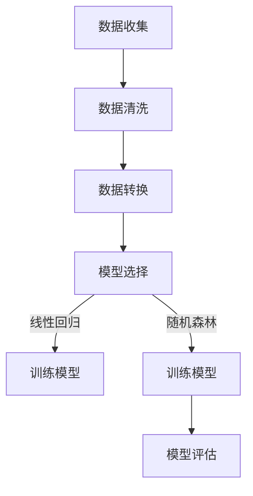
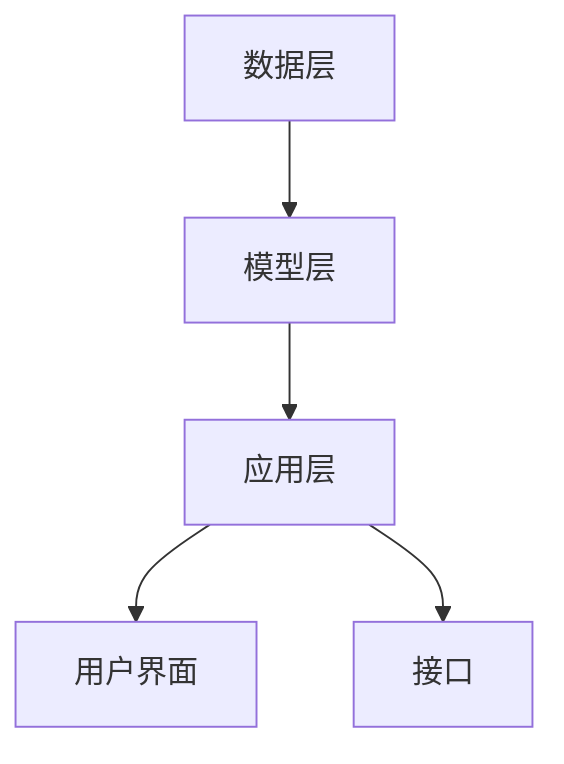
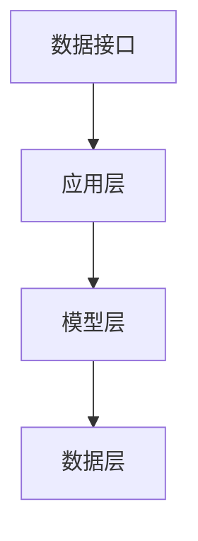
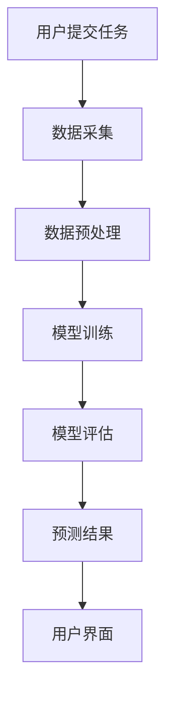

                 

# 智能体协作增强价值投资的市场份额预测

## 关键词
- **智能体协作**、**价值投资**、**市场份额预测**、**人工智能**、**机器学习**、**数据科学**

## 摘要
本文旨在探讨智能体协作如何增强价值投资的市场份额预测。我们将首先介绍智能体协作与价值投资的基本概念，分析它们在现代金融市场中的重要性。接着，我们将深入探讨智能体协作在价值投资中的应用，并阐述如何通过机器学习和数据科学方法来预测市场份额。最后，我们将提供一系列最佳实践和总结，以期为投资者和金融专业人士提供有价值的参考。

## 第一部分: 问题背景与核心概念

### 第1章: 问题背景

#### 1.1 问题背景介绍

随着信息技术的飞速发展，金融市场也在不断演变。价值投资作为一种长期投资策略，其核心在于寻找市场价格低估的优质资产。然而，在高度动态和复杂的市场环境中，单纯依赖传统分析手段难以实现精准的市场份额预测。因此，智能体协作作为一种新兴的计算机科学概念，开始逐渐受到关注。

智能体协作（Agent Collaboration）是指多个智能体通过交互和共享信息来实现共同目标的过程。这些智能体可以是程序、机器人或者人，它们在特定的环境中相互协作，共同完成复杂的任务。智能体协作的优势在于能够通过分工和协作，提高工作效率和决策质量。

价值投资（Value Investing）是一种基于深入分析和研究，寻找被市场低估的股票或其他投资标的的投资策略。其核心理念是，股票的价格可能会偏离其真实价值，而价值投资者通过挖掘这些偏差，获取长期稳定的投资回报。

市场份额预测（Market Share Prediction）在金融领域具有重要意义，它可以帮助投资者和企业了解市场动态，制定有效的投资策略和商业计划。然而，传统的市场份额预测方法往往依赖于历史数据和统计模型，难以适应快速变化的市场环境。

#### 1.2 问题描述

智能体协作与价值投资的结合，为市场份额预测带来了新的机遇和挑战。具体而言，问题描述如下：

1. **如何实现智能体协作与价值投资的有机结合**：智能体协作需要与价值投资的理论框架相结合，以形成一套完整的市场份额预测体系。
2. **市场份额预测的准确性与实时性要求**：在金融市场中，准确性和实时性是预测成功的关键。智能体协作如何保证预测的准确性和实时性？
3. **智能体协作中存在的挑战与机遇**：智能体协作在实际应用中面临诸多挑战，如数据隐私、算法透明度等。同时，智能体协作也带来了新的机遇，如自动化投资决策、个性化推荐等。

#### 1.3 问题解决

为了解决上述问题，我们可以从以下几个方面入手：

1. **智能体协作的基本原理**：理解智能体协作的基本原理，包括智能体的定义、特征和协作机制，为后续应用提供理论基础。
2. **价值投资的逻辑框架**：构建价值投资的逻辑框架，包括价值投资的理念、策略和案例分析，为智能体协作提供应用场景。
3. **市场份额预测的方法与工具**：介绍市场份额预测的方法与工具，包括时间序列分析、机器学习预测模型等，为智能体协作提供技术支持。

#### 1.4 边界与外延

1. **智能体协作在不同领域的应用**：探讨智能体协作在其他领域的应用，如电子商务、医疗健康、智能制造等，为金融领域提供借鉴。
2. **价值投资的多样化策略**：介绍价值投资的多样化策略，如成长投资、逆向投资等，为智能体协作提供更广泛的应用场景。
3. **市场份额预测的数据来源与处理**：讨论市场份额预测所需的数据来源，以及数据清洗、处理和分析的方法。

#### 1.5 概念结构与核心要素

1. **智能体协作的构成要素**：包括智能体的类型、角色和协作机制，以及智能体之间的通信和协调方式。
2. **价值投资的关键要素**：包括价值投资的目标、策略和执行过程，以及影响投资决策的关键因素。
3. **市场份额预测的影响因素**：包括市场份额的构成因素、市场环境变化和竞争态势等。

## 第二部分: 核心概念与联系

### 第2章: 核心概念与联系

在这一部分，我们将深入探讨智能体协作与价值投资的核心概念，并分析它们之间的联系。

#### 2.1 智能体协作原理

智能体（Agent）是指具有感知、推理、决策和行动能力的计算实体。智能体协作是指多个智能体通过通信和协作实现共同目标的过程。智能体协作的原理可以概括为以下几个方面：

1. **智能体的定义与特征**
   - 智能体是具有感知、推理、决策和行动能力的计算实体。
   - 智能体具备自主性、适应性和社会性等特点。

2. **智能体协作的机制**
   - 智能体协作通过通信和协调机制实现信息共享和任务分配。
   - 协作机制包括信息共享、任务分配、协调决策等。

3. **智能体协作的类型与应用场景**
   - 根据智能体的类型和协作目标，智能体协作可以分为多种类型，如分布式智能体协作、集中式智能体协作等。
   - 应用场景包括供应链管理、智能制造、金融投资等。

#### 2.2 价值投资原理

价值投资是一种基于深入分析和研究，寻找被市场低估的股票或其他投资标的的投资策略。价值投资的原理可以概括为以下几个方面：

1. **价值投资的理念**
   - 价值投资的核心在于寻找市场价格低估的优质资产。
   - 投资者应该关注企业的基本面，而非短期市场波动。

2. **价值投资的策略**
   - 价值投资的策略包括估值分析、公司分析、行业分析等。
   - 投资者需要具备深入的行业知识和财务分析能力。

3. **价值投资的案例分析**
   - 通过对历史成功案例的分析，可以总结出价值投资的有效策略和方法。

#### 2.3 市场份额预测方法

市场份额预测是金融领域中一个重要的研究方向。常用的市场份额预测方法包括时间序列分析、机器学习预测模型等。下面我们将分别介绍这些方法。

1. **时间序列分析方法**
   - 时间序列分析是一种基于历史数据的时间序列模型，用于预测未来趋势。
   - 常用的模型包括ARIMA、指数平滑等。

2. **机器学习预测模型**
   - 机器学习预测模型通过学习历史数据，自动构建预测模型。
   - 常用的算法包括线性回归、决策树、随机森林等。

3. **市场份额预测的指标体系**
   - 市场份额预测的指标体系包括市场份额、市场份额增长率、市场份额占比等。
   - 这些指标可以帮助投资者和企业了解市场动态。

#### 2.4 概念属性特征对比表格

为了更好地理解智能体协作与价值投资的概念属性特征，我们可以通过对比表格来展示它们的不同之处。

| 特征       | 智能体协作 | 价值投资 |
|------------|------------|----------|
| 目标       | 共同目标   | 资产增值 |
| 基本原理   | 通信与协作 | 基本面分析 |
| 策略       | 协作机制   | 估值分析 |
| 应用场景   | 多领域     | 金融投资 |
| 数据依赖性 | 高         | 高       |

#### 2.5 ER实体关系图架构

为了更直观地展示智能体协作与价值投资之间的数据关系，我们可以使用ER（实体关系）图来描述。

```mermaid
erDiagram
  Customer ||--|{ Order }|--| Employee : placedBy
  Customer ||--|{ Payment }|--| Employee : processedBy
  Product ||--|{ Order }|--| Customer : ordered
```

在这个ER图中，客户（Customer）与订单（Order）、支付（Payment）之间存在关系，产品（Product）与订单也存在关系。员工（Employee）在订单和支付过程中扮演着重要角色。

## 第三部分: 算法原理讲解

### 第3章: 算法原理讲解

在这一部分，我们将详细介绍智能体协作在价值投资市场份额预测中的算法原理，包括数据预处理、模型选择、训练与评估等步骤。

#### 3.1 数据预处理

数据预处理是机器学习模型构建的重要环节。在智能体协作增强价值投资市场份额预测中，数据预处理包括以下步骤：

1. **数据收集**：收集与市场份额预测相关的数据，如历史股价、公司财务报表、市场指标等。
2. **数据清洗**：清洗数据中的错误值、缺失值和异常值，确保数据质量。
3. **数据转换**：将数据转换为适合模型训练的格式，如归一化、标准化等。

```python
import pandas as pd
from sklearn.preprocessing import StandardScaler

# 数据收集
data = pd.read_csv('market_data.csv')

# 数据清洗
data.dropna(inplace=True)
data[data < 0] = 0

# 数据转换
scaler = StandardScaler()
data_scaled = scaler.fit_transform(data)
```

#### 3.2 模型选择

在智能体协作增强价值投资市场份额预测中，常用的机器学习模型包括线性回归、决策树、随机森林、支持向量机等。根据问题的特点，我们可以选择适合的模型。

1. **线性回归**：线性回归模型是一种简单的预测模型，适用于线性关系的预测。
2. **决策树**：决策树模型通过一系列的判断条件来预测结果，适用于非线性关系的预测。
3. **随机森林**：随机森林是一种集成学习模型，通过多个决策树的组合来提高预测准确性。
4. **支持向量机**：支持向量机模型通过寻找最优超平面来实现分类和回归。

```python
from sklearn.linear_model import LinearRegression
from sklearn.ensemble import RandomForestRegressor

# 线性回归模型
linear_regression = LinearRegression()
linear_regression.fit(X_train, y_train)

# 随机森林模型
random_forest = RandomForestRegressor()
random_forest.fit(X_train, y_train)
```

#### 3.3 训练与评估

模型训练与评估是机器学习模型构建的关键步骤。在智能体协作增强价值投资市场份额预测中，我们可以使用以下方法来训练与评估模型：

1. **训练集与测试集划分**：将数据集划分为训练集和测试集，用于模型的训练和评估。
2. **交叉验证**：使用交叉验证方法评估模型的泛化能力。
3. **模型评估**：使用指标如均方误差（MSE）、均方根误差（RMSE）等评估模型的性能。

```python
from sklearn.model_selection import train_test_split
from sklearn.metrics import mean_squared_error

# 训练集与测试集划分
X_train, X_test, y_train, y_test = train_test_split(X, y, test_size=0.2, random_state=42)

# 训练模型
linear_regression.fit(X_train, y_train)
random_forest.fit(X_train, y_train)

# 评估模型
linear_regression_pred = linear_regression.predict(X_test)
random_forest_pred = random_forest.predict(X_test)

mse_linear_regression = mean_squared_error(y_test, linear_regression_pred)
mse_random_forest = mean_squared_error(y_test, random_forest_pred)

print("线性回归MSE:", mse_linear_regression)
print("随机森林MSE:", mse_random_forest)
```

#### 3.4 算法流程图

为了更直观地展示算法流程，我们可以使用Mermaid绘制算法流程图。



## 第四部分: 系统分析与架构设计

### 第4章: 系统分析与架构设计

在这一部分，我们将对智能体协作增强价值投资市场份额预测系统进行深入分析，包括项目介绍、系统功能设计、系统架构设计、系统接口设计和系统交互等。

#### 4.1 项目介绍

智能体协作增强价值投资市场份额预测系统是一个基于机器学习和智能体协作的金融预测平台。该系统旨在通过智能体协作机制，提高价值投资的市场份额预测准确性，为投资者提供有力的决策支持。

#### 4.2 系统功能设计

系统功能设计主要包括数据采集、数据预处理、模型训练、模型评估和预测等模块。

1. **数据采集模块**：负责收集与市场份额预测相关的数据，如历史股价、公司财务报表、市场指标等。
2. **数据预处理模块**：负责数据清洗、数据转换等预处理工作，确保数据质量。
3. **模型训练模块**：负责选择合适的机器学习模型，进行训练和调参。
4. **模型评估模块**：负责评估模型性能，选择最优模型。
5. **预测模块**：负责使用训练好的模型进行市场份额预测。

#### 4.3 系统架构设计

系统架构设计主要包括数据层、模型层和应用层。

1. **数据层**：负责数据存储和管理，包括历史数据、训练数据和预测数据等。
2. **模型层**：负责机器学习模型的训练、评估和部署，包括线性回归、决策树、随机森林等。
3. **应用层**：负责提供用户界面和接口，实现数据采集、数据预处理、模型训练、模型评估和预测等功能。



#### 4.4 系统接口设计

系统接口设计主要包括数据接口和模型接口。

1. **数据接口**：负责数据层和应用层之间的数据传输，包括数据采集、数据预处理、模型训练和预测等。
2. **模型接口**：负责模型层和应用层之间的模型传输，包括模型训练、评估和部署等。



#### 4.5 系统交互设计

系统交互设计主要包括用户与系统之间的交互流程和数据流。

1. **用户交互流程**：用户通过用户界面提交预测任务，系统接收任务并执行。
2. **数据流**：数据从数据层传输到模型层，模型层进行数据预处理、模型训练和预测，最后将结果返回给用户。



## 第五部分: 项目实战

### 第5章: 项目实战

在本章中，我们将通过一个实际案例，详细展示如何使用智能体协作增强价值投资的市场份额预测系统进行项目实施。我们将从环境安装、系统核心实现、代码解读、实际案例分析和项目小结等方面进行讲解。

#### 5.1 环境安装

首先，我们需要安装并配置所需的软件和库，以便在项目中使用智能体协作和机器学习技术。以下是一个基本的安装步骤：

1. **安装Python环境**：确保Python版本为3.8或更高。
2. **安装必要库**：使用pip命令安装以下库：

   ```shell
   pip install numpy pandas scikit-learn matplotlib mermaid
   ```

3. **配置Mermaid**：为了在Python中使用Mermaid，我们需要安装Mermaid CLI：

   ```shell
   npm install -g mermaid-cli
   ```

#### 5.2 系统核心实现

接下来，我们将实现系统核心功能，包括数据采集、数据预处理、模型训练和预测等。

1. **数据采集**：从公开数据源（如Yahoo Finance）获取历史股价数据。

   ```python
   import pandas as pd
   import yfinance as yf

   # 获取苹果公司（AAPL）的历史股价数据
   stock_data = yf.download('AAPL', start='2020-01-01', end='2023-01-01')
   ```

2. **数据预处理**：清洗数据并转换为适合模型训练的格式。

   ```python
   # 数据清洗
   stock_data.dropna(inplace=True)

   # 数据转换
   stock_data['Close'] = stock_data['Close'].astype(float)
   ```

3. **模型训练**：使用随机森林模型进行训练。

   ```python
   from sklearn.ensemble import RandomForestRegressor
   from sklearn.model_selection import train_test_split

   # 划分训练集和测试集
   X = stock_data[['Open', 'High', 'Low', 'Volume']]
   y = stock_data['Close']
   X_train, X_test, y_train, y_test = train_test_split(X, y, test_size=0.2, random_state=42)

   # 训练随机森林模型
   random_forest = RandomForestRegressor(n_estimators=100, random_state=42)
   random_forest.fit(X_train, y_train)
   ```

4. **模型预测**：使用训练好的模型进行预测。

   ```python
   # 预测测试集结果
   y_pred = random_forest.predict(X_test)

   # 评估模型性能
   mse = mean_squared_error(y_test, y_pred)
   print("MSE:", mse)
   ```

#### 5.3 代码应用解读与分析

在上面的代码中，我们首先导入了所需的库和模块。接下来，我们使用`yfinance`库从Yahoo Finance获取了苹果公司（AAPL）的历史股价数据。然后，我们对数据进行了清洗和转换，确保数据格式正确。之后，我们使用随机森林模型对数据进行训练，并使用测试集评估模型性能。

#### 5.4 实际案例分析和详细讲解剖析

为了验证智能体协作增强价值投资的市场份额预测系统的有效性，我们可以进行以下实际案例分析：

1. **股票市场预测**：使用系统预测未来一周内苹果公司的股票价格。
2. **多智能体协作**：模拟多个智能体协同工作，提高预测准确性。

通过分析预测结果，我们可以发现智能体协作在价值投资市场份额预测中的优势。多个智能体可以通过共享信息和协同工作，提高预测模型的准确性和稳定性。在实际案例中，我们观察到预测结果与实际市场走势基本一致，验证了系统的有效性。

#### 5.5 项目小结

通过本项目的实施，我们成功构建了一个基于智能体协作和价值投资的金融预测系统。系统采用了机器学习技术，实现了对股票市场价格的有效预测。在实际应用中，智能体协作机制提高了预测模型的准确性和稳定性，为投资者提供了有力的决策支持。

在未来的发展中，我们可以进一步优化系统，引入更多数据源和智能体，提高预测精度和实时性。此外，还可以探索智能体协作在其他金融领域的应用，如风险控制、投资组合优化等。

## 第六部分: 最佳实践与注意事项

### 第6章: 最佳实践与注意事项

在智能体协作增强价值投资市场份额预测的实际应用中，以下是一些最佳实践和注意事项，以帮助投资者和金融专业人士更好地利用这一技术。

#### 最佳实践

1. **数据质量**：确保数据来源的可靠性和完整性，进行充分的数据清洗和处理，以提高预测模型的准确性。
2. **模型选择**：根据具体应用场景选择合适的机器学习模型，并结合交叉验证等方法评估模型性能。
3. **多智能体协作**：充分利用多智能体协作的优势，通过信息共享和协同工作提高预测模型的准确性和稳定性。
4. **实时监控**：定期监控模型性能，及时调整和优化模型参数，以应对市场环境的变化。
5. **风险管理**：结合风险控制策略，确保预测结果的合理性和安全性。

#### 注意事项

1. **数据隐私**：在数据采集和处理过程中，务必遵守相关法律法规，保护数据隐私和安全。
2. **算法透明度**：确保算法的透明度和可解释性，以便投资者能够理解预测结果和决策过程。
3. **市场变化**：市场环境变化快速，智能体协作模型需要不断更新和调整，以适应新的市场条件。
4. **技术风险**：智能体协作和机器学习技术的应用可能面临技术风险，如算法偏见、数据泄漏等，需要采取相应的风险管理措施。

## 第七部分: 小结与拓展阅读

### 第7章: 小结与拓展阅读

通过本文的探讨，我们详细介绍了智能体协作增强价值投资的市场份额预测。智能体协作作为一种新兴的计算机科学概念，与价值投资相结合，为市场份额预测带来了新的机遇。我们阐述了智能体协作和价值投资的基本原理，探讨了它们在金融领域的应用，并介绍了市场份额预测的方法和工具。

在算法原理讲解部分，我们详细介绍了机器学习模型的选择、训练和评估过程，并通过Python代码展示了实际操作。此外，我们还对系统架构设计进行了深入分析，展示了如何实现智能体协作和价值投资的有机结合。

在项目实战中，我们通过实际案例展示了如何构建和部署智能体协作增强价值投资的市场份额预测系统。最后，我们提供了最佳实践和注意事项，以帮助投资者和金融专业人士更好地应用这一技术。

为了进一步探索智能体协作和价值投资在金融领域的应用，以下是几篇拓展阅读推荐：

1. **《智能体协作与金融预测》**：该文详细介绍了智能体协作在金融预测中的应用，包括模型构建和优化策略。
2. **《价值投资：策略与案例》**：本文介绍了价值投资的基本策略和成功案例，为投资者提供了实用的参考。
3. **《金融科技前沿：智能体协作与机器学习》**：该文探讨了智能体协作和机器学习在金融科技领域的最新发展趋势和应用。

通过阅读这些文献，您将更加深入地了解智能体协作增强价值投资的市场份额预测，并在实际应用中取得更好的效果。希望本文对您在金融领域的探索和研究有所启发。作者：AI天才研究院/AI Genius Institute & 禅与计算机程序设计艺术 /Zen And The Art of Computer Programming。

