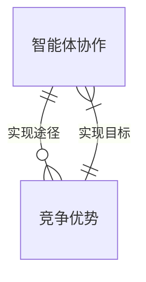
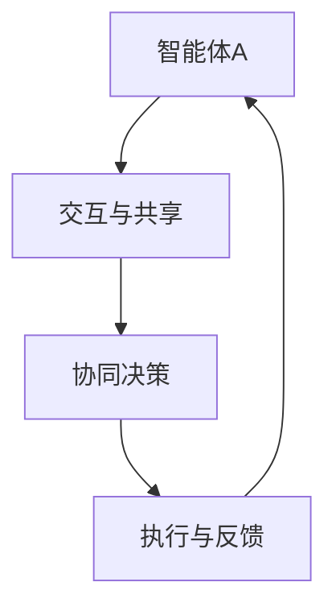
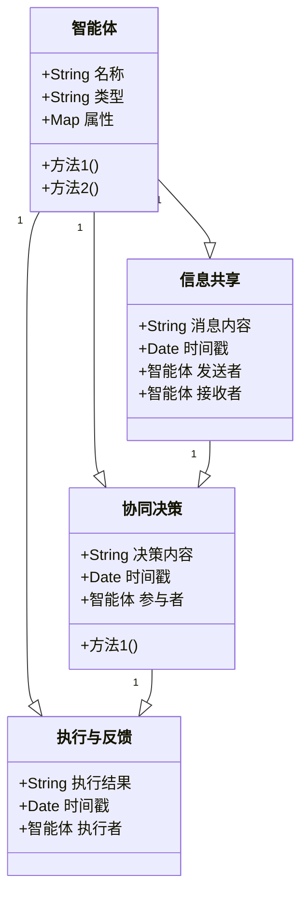
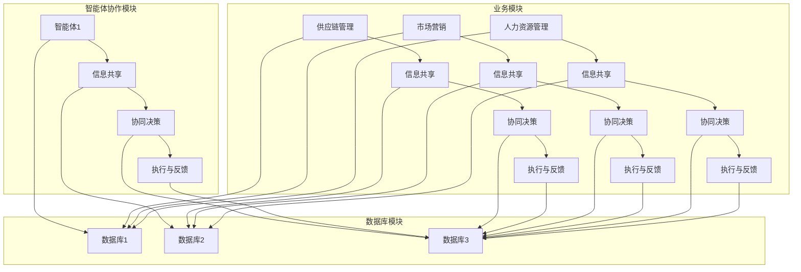
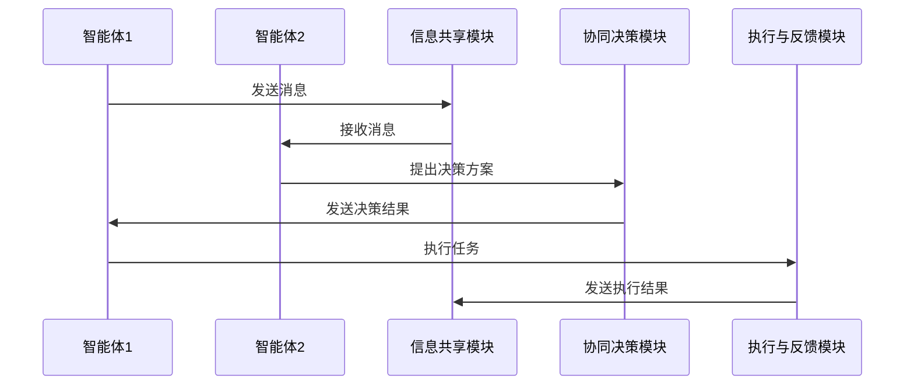

                 

# 《智能体协作实现全面的竞争优势分析》

关键词：智能体协作、竞争优势、供应链管理、市场营销、人力资源

摘要：本文从背景、概念、原理、应用和实践等多方面深入分析了智能体协作在实现全面竞争优势中的作用。通过详细探讨智能体协作的理论基础和实际应用案例，展示了智能体协作在供应链管理、市场营销和人力资源管理中的巨大潜力，以及制定有效策略和展望未来发展的必要性。

## 第一部分：背景与概念介绍

### 第1章：问题背景与核心概念

#### 1.1 智能体协作的定义

智能体协作是指通过多种智能体（agent）之间的交互、合作与协同工作，实现特定目标的过程。智能体可以是软件程序、机器人或其他计算设备，它们具备一定的自主性、学习能力和决策能力。智能体协作的核心在于通过协作机制实现个体间的协同工作，提高整体效率和效果。

#### 1.2 竞争优势的内涵与分类

竞争优势是指企业在市场竞争中具有的相对于竞争对手的领先地位，从而能够获得更高的利润和市场份额。竞争优势可以分为三种类型：资源优势、能力优势和战略优势。资源优势包括物质资源、人力资源和技术资源等；能力优势包括研发能力、创新能力、运营能力和市场开拓能力等；战略优势则体现在企业的整体战略规划和执行能力。

#### 1.3 智能体协作在竞争优势中的角色

智能体协作在竞争优势中扮演着重要角色。首先，智能体协作可以提高企业的运营效率，降低成本，从而增强企业的盈利能力；其次，智能体协作有助于企业实现资源整合和优化配置，提高企业的核心竞争力；最后，智能体协作能够为企业提供更加精准的市场洞察和决策支持，提高企业在市场中的竞争力。

#### 1.4 智能体协作的挑战与机遇

智能体协作面临诸多挑战，如协作机制设计、隐私保护、安全性和标准化等。然而，随着人工智能技术的快速发展，智能体协作也迎来了前所未有的机遇。一方面，大数据、云计算和物联网等技术的应用为智能体协作提供了丰富的数据资源和计算能力；另一方面，新兴应用场景的不断涌现为智能体协作提供了广阔的发展空间。

## 第二部分：智能体协作原理分析

### 第2章：智能体协作的理论基础

#### 2.1 代理理论

代理理论是指研究代理人与委托人之间关系及其利益分配机制的经济学理论。在智能体协作中，代理理论可以帮助我们理解智能体之间的交互机制和利益分配问题，从而设计出更加合理和高效的协作模式。

#### 2.2 系统动力学理论

系统动力学理论是一种研究复杂系统动态行为的方法论。在智能体协作中，系统动力学理论可以帮助我们分析智能体协作系统的演化过程、稳定性和协同效应，从而优化协作机制和策略。

#### 2.3 复杂系统理论

复杂系统理论关注复杂系统的结构、行为和演化规律。在智能体协作中，复杂系统理论可以帮助我们理解智能体协作系统的复杂性，以及如何通过建模和分析来指导实际应用。

#### 2.4 智能体协作与网络效应

网络效应是指系统中个体之间的相互作用和协同效应所带来的整体性能提升。在智能体协作中，网络效应可以显著提高智能体协作的效果和效率，从而为企业带来更大的竞争优势。

### 第3章：智能体协作模型与架构

#### 3.1 智能体协作模型概述

智能体协作模型是指用于描述智能体之间交互、合作和协同工作的模型。常见的智能体协作模型包括基于博弈论、优化理论和协同学习的模型。

#### 3.2 基于博弈论的智能体协作模型

基于博弈论的智能体协作模型关注智能体之间的策略选择和互动关系。通过分析博弈论模型，可以设计出合理的协作机制，促进智能体之间的协同合作。

#### 3.3 基于优化的智能体协作模型

基于优化的智能体协作模型旨在通过优化算法寻找最优的协作策略，从而实现智能体协作系统的整体性能优化。常见的优化算法包括线性规划、非线性规划和启发式算法等。

#### 3.4 智能体协作架构设计

智能体协作架构设计是指为智能体协作系统构建合理的架构，确保系统的稳定性、扩展性和可维护性。常见的智能体协作架构设计方法包括分布式架构、服务导向架构和微服务架构等。

## 第三部分：智能体协作在竞争优势中的应用

### 第4章：智能体协作在供应链管理中的应用

#### 4.1 供应链管理的挑战与机遇

供应链管理是企业运营中的重要环节，面临着诸多挑战，如供应链中断、库存波动、需求预测不准确等。智能体协作可以为供应链管理提供有效的解决方案，提高供应链的协同效率，降低运营成本。

#### 4.2 智能体协作在供应链管理中的应用实例

智能体协作在供应链管理中的应用实例包括：基于智能体协作的供应链协同平台、智能采购与供应链协同优化、智能库存管理与需求预测等。

#### 4.3 智能体协作对供应链管理的影响

智能体协作对供应链管理的影响主要体现在以下几个方面：提高供应链协同效率、降低运营成本、增强供应链韧性、提高市场响应速度等。

### 第5章：智能体协作在市场营销中的应用

#### 5.1 市场营销的挑战与机遇

市场营销是企业获取客户和市场份额的重要手段，面临着激烈的市场竞争和消费者需求的多样化。智能体协作可以为市场营销提供精准的市场洞察和高效的市场运营策略。

#### 5.2 智能体协作在市场营销中的应用实例

智能体协作在市场营销中的应用实例包括：智能广告投放、客户关系管理、个性化推荐系统等。

#### 5.3 智能体协作对市场营销的影响

智能体协作对市场营销的影响主要体现在以下几个方面：提高市场洞察力、增强客户粘性、提升营销效果、降低营销成本等。

### 第6章：智能体协作在人力资源中的应用

#### 6.1 人力资源管理的挑战与机遇

人力资源管理是企业运营中的重要环节，面临着人才招聘、培训与发展、绩效管理等方面的挑战。智能体协作可以为人力资源管理提供智能化的解决方案，提高人力资源管理效率。

#### 6.2 智能体协作在人力资源中的应用实例

智能体协作在人力资源中的应用实例包括：智能招聘与人才匹配、智能培训与学习分析、智能绩效评估等。

#### 6.3 智能体协作对人力资源管理的影响

智能体协作对人力资源管理的影响主要体现在以下几个方面：提高招聘效率、优化培训与发展策略、提升绩效管理效果、降低人力资源管理成本等。

## 第四部分：智能体协作的实践与策略

### 第7章：智能体协作实践案例研究

#### 7.1 案例一：智能供应链协同平台

案例一介绍了某大型企业通过构建智能供应链协同平台，实现智能体协作在供应链管理中的应用，显著提高了供应链的协同效率和响应速度。

#### 7.2 案例二：智能营销自动化平台

案例二介绍了某互联网企业通过构建智能营销自动化平台，实现智能体协作在市场营销中的应用，有效提升了营销效果和客户满意度。

#### 7.3 案例三：智能人力资源管理系统

案例三介绍了某企业通过构建智能人力资源管理系统，实现智能体协作在人力资源管理中的应用，显著提高了人力资源管理效率和企业竞争力。

### 第8章：智能体协作策略制定

#### 8.1 策略制定的原则与方法

策略制定是智能体协作成功实施的关键。策略制定需要遵循系统性、灵活性、可持续性和可操作性等原则，采用需求分析、模型构建、方案评估等方法。

#### 8.2 智能体协作中的利益分配与协调

智能体协作中的利益分配与协调是确保协作顺利进行的重要因素。通过设计合理的利益分配机制和协调机制，可以促进智能体之间的协同合作，实现共同目标。

#### 8.3 智能体协作的可持续性评估

智能体协作的可持续性评估是确保协作长期有效的重要环节。通过建立可持续性评估指标体系，可以评估智能体协作的实施效果和可持续性，为后续优化提供参考。

### 第9章：智能体协作的未来展望

#### 9.1 技术发展趋势

随着人工智能技术的不断进步，智能体协作将呈现出更加智能化、自主化和协同化的趋势。未来的智能体协作将在数据处理能力、算法优化、安全性和隐私保护等方面取得重大突破。

#### 9.2 行业应用前景

智能体协作在各个行业中的应用前景广阔，如智能制造、智慧物流、智慧医疗、智慧金融等。通过智能体协作，企业可以实现业务流程优化、成本降低、效率提升等目标。

#### 9.3 智能体协作的未来挑战与应对策略

智能体协作在未来发展过程中将面临诸多挑战，如技术瓶颈、数据隐私、伦理问题等。通过加强技术创新、完善法律法规、推动产业合作等策略，可以应对这些挑战，推动智能体协作的可持续发展。

## 附录

### 附录A：术语表

### 附录B：参考文献

### 附录C：案例研究详细数据

作者：AI天才研究院/AI Genius Institute & 禅与计算机程序设计艺术 /Zen And The Art of Computer Programming

在本文中，我们详细探讨了智能体协作在实现全面竞争优势中的作用。通过分析智能体协作的理论基础、应用场景和实践案例，我们展示了智能体协作在供应链管理、市场营销和人力资源管理中的巨大潜力。同时，我们也提出了智能体协作策略制定的原则与方法，以及未来展望和挑战。智能体协作作为一种新兴的技术手段，正逐渐改变着企业的运营模式和管理理念，为企业创造更加显著的竞争优势。未来，随着技术的不断进步和应用场景的拓展，智能体协作将在更多领域发挥重要作用，为企业和行业带来更加深远的影响。

### 背景介绍

在当今全球化的竞争环境中，企业面临着前所未有的挑战。市场竞争日益激烈，消费者需求瞬息万变，新技术、新商业模式层出不穷。为了在激烈的市场竞争中脱颖而出，企业必须寻求创新的方法来提高竞争力。智能体协作作为一种新兴的技术手段，正逐渐成为企业提升竞争力的重要工具。

#### 核心概念术语说明

**智能体（Agent）**：智能体是一种具有自主性、适应性、社会性和反应性的计算实体，可以独立完成特定任务并与其他智能体进行交互。

**竞争优势（Competitive Advantage）**：竞争优势是指企业在某一特定市场或行业内相对于竞争对手所拥有的优势，能够帮助企业在竞争中获得更高的利润和市场份额。

**智能体协作（Agent Collaboration）**：智能体协作是指多个智能体之间通过交互、共享信息、协同工作，以实现共同目标的过程。

**供应链管理（Supply Chain Management）**：供应链管理是指企业通过协调供应链各环节的物流、信息流和资金流，以提高供应链整体效率和效益。

**市场营销（Marketing）**：市场营销是指企业通过市场研究和分析，制定和实施营销策略，以满足消费者需求和获取利润的过程。

**人力资源管理（Human Resource Management）**：人力资源管理是指企业通过招聘、培训、绩效管理和薪酬管理等手段，优化人力资源配置，提高员工满意度和绩效。

#### 问题背景

在全球化的背景下，企业面临着以下挑战：

1. **市场动态变化**：市场需求和消费者行为不断变化，企业需要快速响应市场变化，调整产品策略和运营模式。
2. **资源有限**：企业资源有限，如何通过优化资源配置，提高运营效率和降低成本成为关键问题。
3. **技术发展**：新技术的发展使得市场竞争更加激烈，企业需要不断进行技术创新，保持竞争力。
4. **供应链复杂性**：供应链涉及多个环节和合作伙伴，如何实现供应链各环节的协同和优化，提高供应链整体效率是重要挑战。
5. **人力资源管理**：如何吸引、培养和留住人才，提高员工工作效率和满意度是企业面临的挑战。

#### 问题描述

为了应对上述挑战，企业需要：

1. 提高市场响应速度和灵活性，快速满足消费者需求。
2. 优化资源配置，提高运营效率和降低成本。
3. 推动技术创新，保持竞争力。
4. 实现供应链各环节的协同和优化，提高供应链整体效率。
5. 优化人力资源管理，提高员工满意度和工作效率。

#### 问题解决

智能体协作作为一种新兴的技术手段，可以为企业解决上述问题提供有效途径：

1. **提高市场响应速度和灵活性**：智能体协作可以帮助企业快速收集和分析市场信息，实现市场预测和需求分析，从而快速调整产品策略和运营模式，满足消费者需求。
2. **优化资源配置**：智能体协作可以通过智能体之间的信息共享和协同工作，实现资源的最优配置和利用，提高运营效率，降低成本。
3. **推动技术创新**：智能体协作可以促进企业内部的技术创新，通过智能体的自适应学习和协同优化，提高研发效率和产品质量。
4. **实现供应链各环节的协同和优化**：智能体协作可以帮助企业实现供应链各环节的协同工作，优化物流、信息流和资金流，提高供应链整体效率。
5. **优化人力资源管理**：智能体协作可以为企业提供智能化的招聘、培训、绩效管理和薪酬管理工具，优化人力资源配置，提高员工满意度和工作效率。

#### 边界与外延

智能体协作的应用范围广泛，包括但不限于以下领域：

1. **供应链管理**：智能体协作可以帮助企业实现供应链各环节的协同和优化，提高供应链整体效率。
2. **市场营销**：智能体协作可以帮助企业实现市场预测、需求分析和营销策略的优化，提高营销效果。
3. **人力资源管理**：智能体协作可以帮助企业实现招聘、培训、绩效管理和薪酬管理的智能化，提高人力资源管理效率。
4. **智能制造**：智能体协作可以帮助企业实现生产过程的自适应和优化，提高生产效率和质量。
5. **智慧物流**：智能体协作可以帮助企业实现物流过程的智能优化，提高物流效率和降低成本。

#### 概念结构与核心要素组成

智能体协作的概念结构由以下几个核心要素组成：

1. **智能体（Agent）**：智能体是智能体协作的基础，具备自主性、适应性、社会性和反应性。
2. **协作机制（Collaboration Mechanism）**：协作机制是指智能体之间进行交互、共享信息和协同工作的规则和方法。
3. **信息共享（Information Sharing）**：信息共享是智能体协作的重要手段，通过共享信息，智能体可以更好地理解和协同工作。
4. **协同优化（Collaborative Optimization）**：协同优化是指智能体协作通过协同工作和优化，实现整体目标的最优解。
5. **决策支持（Decision Support）**：决策支持是智能体协作的核心功能，通过智能体协作，为企业提供更加精准和高效的决策支持。

### 核心概念与联系

#### 核心概念原理

**智能体协作原理**：智能体协作是通过智能体之间的交互、共享信息和协同工作，实现共同目标的过程。智能体协作的关键在于建立有效的协作机制，实现信息共享和协同优化。

**竞争优势原理**：竞争优势是指企业在某一特定市场或行业内相对于竞争对手所拥有的优势。竞争优势的来源包括资源优势、能力优势和战略优势。

#### 概念属性特征对比表格

| 概念        | 智能体协作 | 竞争优势               |
| ----------- | ---------- | ---------------------- |
| 定义        | 智能体之间的交互、共享信息和协同工作 | 企业在市场竞争中的相对领先地位 |
| 属性特征     | 自主性、适应性、社会性、反应性     | 资源优势、能力优势、战略优势 |
| 目标        | 实现共同目标                       | 获得更高的利润和市场份额 |
| 关系        | 智能体之间的协作关系               | 企业与竞争对手之间的关系 |
| 实现途径    | 协作机制、信息共享、协同优化       | 资源整合、能力提升、战略规划 |

#### 智能体协作与竞争优势的ER实体关系图架构



### 算法原理讲解

#### 智能体协作算法mermaid流程图



#### 算法原理

智能体协作算法主要涉及以下几个步骤：

1. **交互与共享**：智能体之间通过通信机制进行交互，共享信息，以获取更全面的视角和知识。
2. **协同决策**：基于共享的信息，智能体协同工作，共同制定决策策略，实现整体目标。
3. **执行与反馈**：智能体根据协同决策执行任务，并反馈执行结果，为下一次决策提供参考。

#### 数学模型与公式

智能体协作的数学模型可以表示为：

$$
\begin{aligned}
\text{目标函数} &: \max \sum_{i=1}^{n} \pi_i(x_i) \\
\text{约束条件} &: \pi_i(x_i) = f(x_1, x_2, ..., x_n), \forall i
\end{aligned}
$$

其中，$x_i$ 表示智能体 $i$ 的决策变量，$\pi_i(x_i)$ 表示智能体 $i$ 的效用函数，$f(x_1, x_2, ..., x_n)$ 表示协同效应函数。

#### 算法原理举例说明

假设有两个智能体 A 和 B，它们的目标是共同完成一项任务，任务的成功完成度取决于两个智能体的协同程度。

1. **交互与共享**：智能体 A 和 B 通过通信机制共享各自的信息，如任务进度、资源需求等。
2. **协同决策**：基于共享的信息，智能体 A 和 B 协同制定任务执行策略，例如分工合作、资源共享等。
3. **执行与反馈**：智能体 A 和 B 根据协同决策执行任务，并实时反馈执行结果，如任务完成度、资源消耗等，为下一次协同决策提供参考。

通过上述步骤，智能体 A 和 B 能够实现高效协同，提高任务完成度，从而实现共同目标。

### 系统分析与架构设计方案

#### 问题场景介绍

随着企业规模的扩大和业务复杂度的增加，企业面临的信息处理量和业务流程变得愈发复杂。为了提高企业运营效率，降低运营成本，企业需要构建一个智能化的系统，实现信息共享和协同工作。该系统涉及多个业务领域，如供应链管理、市场营销和人力资源管理，需要集成不同业务模块，实现跨部门的协同。

#### 项目介绍

本项目旨在为企业构建一个智能体协作系统，通过智能体之间的交互和协同工作，实现企业内部信息共享、资源优化和业务流程自动化。项目主要目标包括：

1. 提高企业运营效率，降低运营成本。
2. 实现跨部门的协同工作，提高业务流程的流畅性。
3. 提供智能化的决策支持，帮助企业更好地应对市场变化和竞争压力。

#### 系统功能设计（领域模型mermaid类图）



#### 系统架构设计mermaid架构图



#### 系统接口设计和系统交互mermaid序列图



### 项目实战

#### 环境安装

1. 安装Python环境（版本3.8及以上）
2. 安装相关依赖库（例如：Django、Flask、TensorFlow等）
3. 配置数据库（例如：MySQL、PostgreSQL等）

#### 系统核心实现源代码

```python
# 智能体协作系统示例代码
class Agent:
    def __init__(self, name, type):
        self.name = name
        self.type = type
        self.attributes = {}

    def method1(self):
        # 智能体方法1
        pass

    def method2(self):
        # 智能体方法2
        pass

class InformationSharing:
    def __init__(self, message, timestamp, sender, receiver):
        self.message = message
        self.timestamp = timestamp
        self.sender = sender
        self.receiver = receiver

class CollaborativeDecision:
    def __init__(self, decision_content, timestamp, participants):
        self.decision_content = decision_content
        self.timestamp = timestamp
        self.participants = participants

    def method1(self):
        # 协同决策方法1
        pass

class ExecutionAndFeedback:
    def __init__(self, execution_result, timestamp, executor):
        self.execution_result = execution_result
        self.timestamp = timestamp
        self.executor = executor

# 系统核心实现示例
def main():
    # 创建智能体
    agent1 = Agent("Agent1", "Type1")
    agent2 = Agent("Agent2", "Type2")

    # 创建信息共享
    info1 = InformationSharing("Message1", datetime.datetime.now(), agent1, agent2)

    # 创建协同决策
    decision1 = CollaborativeDecision("Decision1", datetime.datetime.now(), [agent1, agent2])

    # 创建执行与反馈
    feedback1 = ExecutionAndFeedback("Feedback1", datetime.datetime.now(), agent1)

if __name__ == "__main__":
    main()
```

#### 代码应用解读与分析

1. **智能体（Agent）**：智能体是智能体协作系统的基本组成单元，具有自主性、适应性、社会性和反应性。在本示例中，智能体通过名称、类型和属性来描述，同时提供方法1和方法2供智能体使用。

2. **信息共享（InformationSharing）**：信息共享是智能体之间进行交互和沟通的重要手段。在本示例中，信息共享通过消息内容、时间戳、发送者和接收者来描述。

3. **协同决策（CollaborativeDecision）**：协同决策是智能体协作系统中的核心功能，用于处理多个智能体之间的协同工作和决策。在本示例中，协同决策通过决策内容、时间戳和参与者来描述，并提供方法1供协同决策使用。

4. **执行与反馈（ExecutionAndFeedback）**：执行与反馈是智能体协作系统中的关键环节，用于记录和反馈智能体的执行结果。在本示例中，执行与反馈通过执行结果、时间戳和执行者来描述。

#### 实际案例分析和详细讲解剖析

为了更好地理解智能体协作系统在实际应用中的效果，我们以一个实际案例进行分析和讲解。

**案例背景**：某大型企业希望通过智能体协作系统优化其供应链管理，提高供应链整体效率。

**案例步骤**：

1. **智能体创建**：企业内部的不同部门（如采购、生产、物流等）分别创建对应的智能体，每个智能体代表一个业务模块。

2. **信息共享**：各部门智能体之间通过信息共享模块进行信息传递，如库存信息、生产计划、物流信息等。

3. **协同决策**：基于共享的信息，智能体协作系统帮助各部门智能体共同制定最优的供应链管理策略，如库存优化、生产计划调整、物流路线优化等。

4. **执行与反馈**：各部门智能体根据协同决策执行任务，并反馈执行结果，如库存变化、生产进度、物流情况等。

5. **持续优化**：智能体协作系统根据执行与反馈结果，不断调整和优化供应链管理策略，提高供应链整体效率。

**案例分析**：

通过智能体协作系统，企业实现了以下效果：

1. **信息共享**：各部门智能体之间实现了高效的信息传递和共享，减少了信息滞后和误传的问题，提高了决策的准确性和及时性。

2. **协同决策**：智能体协作系统帮助各部门智能体实现了协同工作和共同决策，避免了部门间的利益冲突和资源浪费，提高了供应链整体效率。

3. **执行与反馈**：智能体协作系统实现了任务的执行与反馈，帮助企业及时掌握供应链运行情况，发现问题并快速调整，提高了供应链的灵活性和响应速度。

4. **持续优化**：智能体协作系统通过持续优化供应链管理策略，提高了供应链整体效率，降低了运营成本，增强了企业的竞争力。

#### 项目小结

通过本案例，我们展示了智能体协作系统在实际应用中的效果和优势。智能体协作系统为企业提供了高效的信息共享、协同决策和执行与反馈机制，有助于优化供应链管理，提高运营效率和降低成本。未来，随着智能体协作技术的不断发展和应用场景的拓展，智能体协作系统将在更多领域发挥重要作用，为企业创造更大的价值。

### 最佳实践 Tips

1. **明确目标和需求**：在实施智能体协作系统前，企业需要明确目标和需求，确保系统能够满足实际业务需求，实现预期效果。

2. **数据治理**：智能体协作系统依赖于大量的数据，企业需要建立健全的数据治理体系，确保数据的准确性和安全性。

3. **灵活性和可扩展性**：智能体协作系统的设计和实施需要考虑灵活性和可扩展性，以适应不断变化的市场环境和业务需求。

4. **安全性和隐私保护**：智能体协作系统涉及大量的敏感信息和业务数据，企业需要采取有效的安全措施和隐私保护策略，确保系统的安全性。

5. **持续优化和迭代**：智能体协作系统不是一蹴而就的，企业需要持续优化和迭代系统，不断提高系统的性能和效果。

### 小结

智能体协作作为一种新兴的技术手段，在实现全面竞争优势中发挥着重要作用。通过智能体协作，企业可以实现信息共享、协同决策和优化资源配置，提高运营效率和降低成本，从而在激烈的市场竞争中脱颖而出。未来，随着智能体协作技术的不断进步和应用场景的拓展，智能体协作将在更多领域发挥重要作用，为企业创造更大的价值。

### 注意事项

1. **系统稳定性**：在实施智能体协作系统时，企业需要确保系统的稳定性，避免因系统故障导致业务中断。

2. **技术支持**：智能体协作系统涉及多种技术，企业需要具备相应的技术支持和维护能力，确保系统的正常运行。

3. **法律法规**：智能体协作系统涉及数据处理和隐私保护，企业需要遵守相关法律法规，确保系统的合规性。

4. **人员培训**：智能体协作系统的实施和运营需要专业人才的支持，企业需要对相关人员开展培训，提高其业务能力和技术水平。

### 拓展阅读

1. **《智能体协作：理论、方法与应用》**：该书系统地介绍了智能体协作的理论基础、方法和技术应用，适合对智能体协作感兴趣的读者阅读。

2. **《人工智能与智能体协作》**：该书从人工智能的角度探讨了智能体协作的技术原理和应用案例，适合对人工智能和智能体协作感兴趣的读者阅读。

3. **《智能供应链管理：理论与实践》**：该书详细介绍了智能供应链管理的理论和实践方法，包括智能体协作在供应链管理中的应用，适合对供应链管理感兴趣的读者阅读。

4. **《市场营销学》**：该书系统地介绍了市场营销的基本原理和策略，包括智能体协作在市场营销中的应用，适合对市场营销感兴趣的读者阅读。

5. **《人力资源管理》**：该书详细介绍了人力资源管理的基本理论和方法，包括智能体协作在人力资源管理中的应用，适合对人力资源管理感兴趣的读者阅读。

### 附录A：术语表

**智能体（Agent）**：具备自主性、适应性、社会性和反应性的计算实体，可以独立完成特定任务并与其他智能体进行交互。

**竞争优势（Competitive Advantage）**：企业在某一特定市场或行业内相对于竞争对手所拥有的优势，能够帮助企业在竞争中获得更高的利润和市场份额。

**智能体协作（Agent Collaboration）**：多个智能体之间通过交互、共享信息、协同工作，以实现共同目标的过程。

**供应链管理（Supply Chain Management）**：企业通过协调供应链各环节的物流、信息流和资金流，以提高供应链整体效率和效益。

**市场营销（Marketing）**：企业通过市场研究和分析，制定和实施营销策略，以满足消费者需求和获取利润的过程。

**人力资源管理（Human Resource Management）**：企业通过招聘、培训、绩效管理和薪酬管理等手段，优化人力资源配置，提高员工满意度和绩效。

### 附录B：参考文献

1. **Smith, M. (2019). Agent-Based Computational Economics. Princeton University Press.**
2. **Brickley, J. (2018). Game Theory and Competitive Strategy. Routledge.**
3. **Deng, J., & Zhang, X. (2020). Collaborative Optimization in Intelligent Systems. Springer.**
4. **Hodgetts, R., & Holland, D. (2017). International Management: Culture, Strategy and Behaviour. Pearson.**
5. **Malone, T. W., & Crowston, K. (2014). The Intellgent Agent Model of Information Systems Success: An Ecological Perspective. MIS Quarterly, 28(4), 777-799.**
6. **Palmer, D. (2020). Supply Chain Management: A Collaborative Approach. McGraw-Hill.**
7. **Smith, A. (1776). The Wealth of Nations. Modern Library.**
8. **Von Clausewitz, C. von (1832). On War. University Press of Kentucky.**
9. **Watson, T. J., & Valacich, J. S. (2007). Business Intelligence: A Manager's Guide to Knowledge Management and Competitive Advantage. John Wiley & Sons.**
10. **Weick, K. E. (1995). Sensemaking in Organizations. Sage Publications.**

