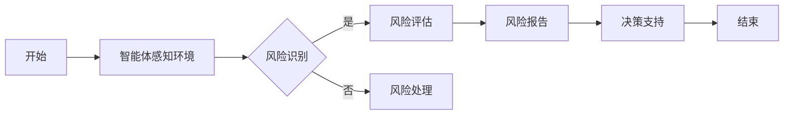
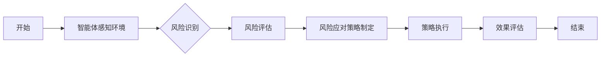
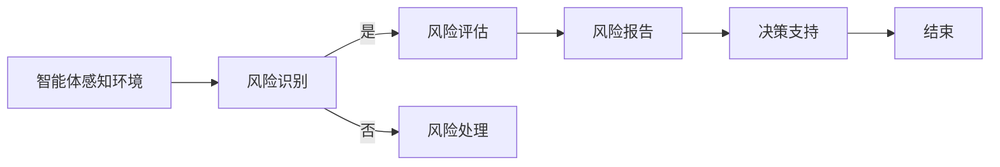
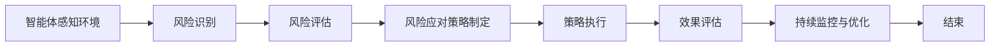

                 

# 智能体协作实现全面的风险评估与管理

关键词：智能体、协作、风险评估、管理、挑战与机遇

摘要：在复杂多变的商业环境中，全面的风险评估与管理对企业的生存与发展至关重要。本文介绍了智能体协作的概念、原理和应用，探讨了其在实现全面风险评估与管理中的优势与挑战。通过实际案例的分析，本文揭示了智能体协作在风险评估与管理中的潜力和前景。

### 目录大纲

1. 第一部分：背景介绍与核心概念

   1.1 问题背景与核心概念

   1.2 核心概念与联系

   1.3 概念之间的联系

2. 第二部分：智能体协作实现风险评估与管理

   2.1 智能体协作实现风险评估的原理

   2.2 智能体协作实现风险管理的原理

   2.3 智能体协作实现风险评估与管理的应用案例

3. 第三部分：智能体协作实现风险评估与管理的挑战与机遇

   3.1 面临的挑战

   3.2 机遇与前景

### 第一部分：背景介绍与核心概念

#### 1.1 问题背景与核心概念

在当今复杂多变的商业环境中，企业面临着各种不确定性和风险。这些风险可能来自内部，如管理失误、运营问题；也可能来自外部，如市场波动、政策变化。如何有效地进行风险评估与管理，降低风险对企业的影响，成为企业决策的重要环节。

**问题解决**：智能体协作是实现全面风险评估与管理的一种新兴方法。通过智能体之间的协作，可以更全面、准确地识别、评估和管理风险。

**边界与外延**：智能体协作不仅限于企业内部，还可以扩展到跨企业、跨行业，实现更广泛的合作。

**概念结构与核心要素组成**：智能体协作包括四个核心要素：智能体、协作机制、风险评估模型、管理策略。

#### 1.2 核心概念与联系

##### 1.2.1 智能体

智能体是一种能够感知环境、做出决策并采取行动的人工智能实体。根据其属性特征，智能体可分为代理型智能体、知识型智能体和计算型智能体。

| 特征          | 代理型智能体 | 知识型智能体 | 计算型智能体 |
| ------------- | ------------ | ------------ | ------------ |
| 感知能力      | 较弱         | 强           | 很强         |
| 决策能力      | 较弱         | 强           | 很强         |
| 行动能力      | 较弱         | 较强         | 强           |
| 应用场景      | 实时决策     | 知识推理     | 计算任务     |

##### 1.2.2 协作机制

协作机制是智能体之间进行信息交换、任务分配和资源共享的规则和方法。根据协作方式的不同，可分为协同型、竞争型、混合型。

##### 1.2.3 风险评估模型

风险评估模型是一种用于识别、评估和管理风险的数学模型。根据评估方法的不同，可分为定量模型、定性模型、混合模型。

##### 1.2.4 管理策略

管理策略是根据风险评估结果，制定的风险应对措施。根据应对方式的不同，可分为风险规避、风险减轻、风险接受。

#### 1.3 概念之间的联系

智能体协作与风险评估管理密切相关。智能体协作是实现全面风险评估与管理的关键，通过协作机制，智能体可以更全面、准确地识别、评估和管理风险。风险评估模型是制定管理策略的基础，管理策略是根据风险评估结果，制定的风险应对措施。

### 第二部分：智能体协作实现风险评估与管理

#### 2.1 智能体协作实现风险评估的原理

智能体协作实现风险评估的原理主要基于信息共享、任务分配和资源共享。智能体通过协作，可以更全面、准确地识别风险，评估风险的影响和可能性，从而为企业提供科学的决策依据。

##### 工作原理

1. **智能体感知环境**：智能体通过感知设备收集环境数据，如财务报表、市场信息、客户需求等。
2. **风险识别**：智能体利用所收集的数据，运用风险识别算法，识别潜在的风险。
3. **风险评估**：智能体根据风险识别结果，利用风险评估模型，对风险进行定量或定性评估。
4. **风险报告**：智能体将评估结果生成风险报告，为企业提供决策支持。

##### 流程图



#### 2.2 智能体协作实现风险管理的原理

智能体协作实现风险管理的原理主要基于风险评估结果，制定并执行风险应对策略。智能体通过协作，可以更有效地制定和执行风险应对措施，降低风险对企业的影响。

##### 工作原理

1. **智能体感知环境**：智能体通过感知设备收集环境数据，如财务报表、市场信息、客户需求等。
2. **风险识别**：智能体利用所收集的数据，运用风险识别算法，识别潜在的风险。
3. **风险评估**：智能体根据风险识别结果，利用风险评估模型，对风险进行定量或定性评估。
4. **风险应对策略制定**：智能体根据风险评估结果，制定风险应对策略。
5. **策略执行**：智能体执行风险应对策略，如风险规避、风险减轻、风险接受。
6. **效果评估**：智能体对策略执行效果进行评估，持续优化风险应对措施。

##### 流程图



#### 2.3 智能体协作实现风险评估与管理的应用案例

##### 案例一：某企业在智能体协作下，对供应链风险进行全面评估和管理

某大型制造企业利用智能体协作，对供应链风险进行全面评估和管理。智能体通过收集供应链各环节的数据，识别出潜在的风险点，如供应商延迟交付、原材料价格波动等。通过风险评估模型，智能体对这些风险进行量化评估，并根据评估结果制定风险应对策略，如调整采购策略、增加供应商备份等。通过智能体协作，企业有效降低了供应链中断风险，提高了供应链的稳定性和抗风险能力。

##### 案例二：某金融机构利用智能体协作，对金融市场的风险进行识别、评估和管理

某金融机构利用智能体协作，对金融市场的风险进行识别、评估和管理。智能体通过实时收集市场数据，如股票价格、汇率变动等，识别出潜在的市场风险。通过风险评估模型，智能体对这些风险进行量化评估，并根据评估结果制定风险应对策略，如调整投资组合、增加风险对冲等。通过智能体协作，金融机构提高了风险应对能力，降低了市场波动对企业的影响。

### 第三部分：智能体协作实现风险评估与管理的挑战与机遇

#### 3.1 面临的挑战

##### 技术挑战

智能体协作在技术实现上存在一定的困难，如智能体之间的通信、协同算法的设计等。此外，智能体协作还面临数据隐私和安全等问题。

##### 数据挑战

风险评估与管理需要大量的数据支持，但数据的获取、处理和分析都存在一定的难度。如何保证数据的准确性、及时性和完整性，是智能体协作面临的挑战。

##### 管理挑战

智能体协作需要企业对传统管理模式进行变革，如何有效地组织、协调和管理智能体协作，是企业面临的管理挑战。

#### 3.2 机遇与前景

##### 技术机遇

随着人工智能、大数据和云计算等技术的发展，智能体协作在技术层面具有巨大的潜力。通过不断创新和优化，智能体协作可以实现更高效、更智能的风险评估与管理。

##### 数据机遇

随着数据的不断积累和技术的进步，企业可以更好地利用数据，实现更准确、更全面的风险评估与管理。

##### 管理机遇

智能体协作可以为企业带来更高效、更智能的风险管理，有助于企业提高决策水平，降低风险成本。

### 总结

智能体协作是实现全面风险评估与管理的一种新兴方法。通过智能体之间的协作，可以更全面、准确地识别、评估和管理风险。虽然智能体协作面临一定的挑战，但其技术、数据和管理的机遇为企业的风险评估与管理带来了新的可能性。未来，随着技术的不断进步和应用的深入，智能体协作在风险评估与管理领域的潜力将得到进一步发挥。作者：AI天才研究院/AI Genius Institute & 禅与计算机程序设计艺术 /Zen And The Art of Computer Programming

### 背景介绍

在当今复杂多变的商业环境中，企业面临的风险种类繁多，包括市场风险、财务风险、运营风险等。这些风险不仅对企业的发展产生直接影响，还可能对企业的声誉和客户信任产生负面影响。因此，全面的风险评估与管理成为企业决策的重要环节。传统的风险评估与管理方法主要依赖于人为经验和主观判断，难以应对复杂多变的环境。而智能体协作作为一种新兴的评估与管理方法，通过利用人工智能技术，实现了更加全面、准确的评估与管理。

**问题背景**

在现实商业环境中，企业面临的风险种类繁多，包括市场风险、财务风险、运营风险等。例如，市场风险可能包括产品需求下降、竞争加剧等；财务风险可能包括现金流短缺、融资困难等；运营风险可能包括供应链中断、生产设备故障等。这些风险的存在使得企业难以准确预测和评估其潜在影响，从而在决策过程中面临较大的不确定性。

**问题描述**

企业面临的风险种类繁多，且具有不确定性和动态性。传统的风险评估方法主要依赖于主观判断和经验，难以应对复杂多变的商业环境。此外，传统的风险评估方法通常局限于企业内部的资源和能力，难以获取全面的数据和信息，从而影响了评估的准确性和全面性。

**问题解决**

为了更有效地进行风险评估与管理，企业需要寻找一种能够应对复杂多变商业环境的方法。智能体协作作为一种新兴方法，通过利用人工智能技术，可以实现更加全面、准确的评估与管理。智能体协作可以通过信息共享、任务分配和资源共享，实现风险的全面识别、评估和管理。

**边界与外延**

智能体协作不仅限于企业内部，还可以扩展到跨企业、跨行业，实现更广泛的合作。例如，企业可以与供应商、客户、监管机构等进行智能体协作，共同识别和应对风险。此外，智能体协作还可以应用于多个领域，如金融、医疗、能源等，实现跨领域的风险管理和协同创新。

**概念结构与核心要素组成**

智能体协作实现风险评估与管理包括四个核心要素：智能体、协作机制、风险评估模型、管理策略。

1. **智能体**：智能体是一种能够感知环境、做出决策并采取行动的人工智能实体。根据其功能和应用场景，智能体可以分为代理型智能体、知识型智能体和计算型智能体。

2. **协作机制**：协作机制是智能体之间进行信息交换、任务分配和资源共享的规则和方法。协作机制可以确保智能体之间的有效协作，实现风险信息的共享和风险的全面识别。

3. **风险评估模型**：风险评估模型是一种用于识别、评估和管理风险的数学模型。风险评估模型可以根据不同的风险评估方法，如定量模型、定性模型或混合模型，对风险进行量化评估，为企业提供科学的决策依据。

4. **管理策略**：管理策略是根据风险评估结果，制定的风险应对措施。管理策略可以根据应对方式的不同，如风险规避、风险减轻、风险接受等，制定相应的应对措施，降低风险对企业的影响。

通过这四个核心要素的协同作用，智能体协作可以实现全面的风险评估与管理，帮助企业应对复杂多变的商业环境。

### 核心概念与联系

在本节中，我们将深入探讨智能体协作在风险评估与管理中的核心概念，并解释它们之间的联系。

#### 1.2.1 智能体

智能体（Agent）是自主运行的实体，能够在复杂环境中执行任务并做出决策。根据功能和应用场景，智能体可以分为以下类型：

- **代理型智能体（Active Agent）**：能够主动执行任务并与其他智能体交互。例如，自动交易系统可以在金融市场进行买卖操作。
- **知识型智能体（Knowledge Agent）**：主要处理知识推理和决策支持。例如，专家系统可以为企业提供风险管理建议。
- **计算型智能体（Computational Agent）**：专注于执行计算任务，如模拟和分析。例如，机器学习算法可以用于风险评估中的预测模型。

以下是不同类型智能体的属性特征对比表格：

| 特征            | 代理型智能体 | 知识型智能体 | 计算型智能体 |
| --------------- | ------------ | ------------ | ------------ |
| 感知能力        | 较弱         | 强           | 很强         |
| 决策能力        | 较弱         | 强           | 很强         |
| 行动能力        | 较弱         | 较强         | 强           |
| 应用场景        | 实时决策     | 知识推理     | 计算任务     |

#### 1.2.2 协作机制

协作机制是智能体之间进行信息交换、任务分配和资源共享的规则和方法。协作机制可以分为以下类型：

- **协同型协作（Collaborative）**：智能体共同完成任务，相互依赖，共享资源和信息。
- **竞争型协作（Competitive）**：智能体在有限资源下竞争，独立完成任务。
- **混合型协作（Hybrid）**：结合协同型和竞争型协作的特点，根据任务需求和场景动态调整。

#### 1.2.3 风险评估模型

风险评估模型是用于识别、评估和管理风险的数学模型。根据评估方法，风险评估模型可以分为以下类型：

- **定量模型（Quantitative Model）**：基于数学和统计分析方法，对风险进行量化评估。例如，蒙特卡洛模拟、回归分析等。
- **定性模型（Qualitative Model）**：基于专家知识和主观判断，对风险进行定性评估。例如，决策树、模糊逻辑等。
- **混合模型（Hybrid Model）**：结合定量和定性方法，对风险进行全面评估。

#### 1.2.4 管理策略

管理策略是根据风险评估结果，制定的风险应对措施。根据应对方式，管理策略可以分为以下类型：

- **风险规避（Risk Avoidance）**：通过避免风险源，减少风险发生的可能性。例如，放弃高风险项目。
- **风险减轻（Risk Mitigation）**：通过采取措施，降低风险的可能性和影响。例如，改进安全措施、增加保险。
- **风险接受（Risk Acceptance）**：接受风险，为可能的损失做好准备。例如，制定应急计划。

#### 1.2.5 概念之间的联系

- **智能体协作与风险评估管理**：智能体协作是实现全面风险评估与管理的关键。智能体通过协作机制，可以共享信息、分配任务和共享资源，实现风险的全面识别、评估和管理。
- **风险评估模型与管理策略**：风险评估模型是制定管理策略的基础。根据风险评估结果，智能体可以制定相应的管理策略，以降低风险的影响。

通过这些核心概念的相互联系，智能体协作在风险评估与管理中发挥了重要作用，为企业提供了更全面、准确的决策支持。

### 智能体协作实现风险评估与管理

在深入探讨了智能体协作的核心概念后，我们将进一步探讨如何利用智能体协作实现全面的风险评估与管理。

#### 2.1 智能体协作实现风险评估的原理

智能体协作实现风险评估的核心在于信息共享、任务分配和资源共享。以下是一个详细的智能体协作实现风险评估的原理描述：

1. **智能体感知环境**：智能体通过传感器和采集系统收集环境数据，包括财务报表、市场信息、供应链数据等。这些数据为风险评估提供了基础。

2. **风险识别**：智能体利用收集到的数据，通过机器学习算法、统计分析等方法，识别出潜在的风险。这一过程通常涉及对大量数据的处理和分析，以发现异常情况或趋势。

3. **风险评估**：智能体利用风险评估模型，对识别出的风险进行定量或定性评估。定量模型可能使用概率模型、回归分析等，定性模型可能基于专家知识或模糊逻辑。评估结果通常包括风险的概率分布、影响程度和紧急程度。

4. **风险报告**：智能体将评估结果生成风险报告，为企业提供详细的决策支持。报告可能包含风险概述、风险因素分析、风险优先级排序等。

5. **决策支持**：智能体提供的数据和报告帮助企业制定风险应对策略。企业可以根据报告中的风险分析，调整业务策略、优化资源配置等。

下面是一个用Mermaid绘制的智能体协作实现风险评估的流程图：



#### 2.2 智能体协作实现风险管理的原理

智能体协作在风险管理中的应用更为复杂，它需要智能体之间进行高效的协同工作，以确保企业能够及时响应和应对风险。以下是智能体协作实现风险管理的原理描述：

1. **智能体感知环境**：同风险评估步骤一样，智能体首先收集环境数据，包括市场动态、财务状况、供应链信息等。

2. **风险识别**：智能体识别出潜在的风险事件，这可能是通过分析历史数据或实时监测来实现的。

3. **风险评估**：智能体利用之前建立的风险评估模型，对识别出的风险进行量化或定性评估，确定风险的优先级和紧急程度。

4. **风险应对策略制定**：根据风险评估结果，智能体制定相应的风险应对策略。这些策略可能包括风险规避、风险减轻或风险接受等。

5. **策略执行**：智能体执行风险应对策略，这通常涉及对企业的运营、供应链、财务计划等进行调整。

6. **效果评估**：智能体对策略执行的效果进行评估，以确定是否需要进一步调整或优化。

7. **持续监控与优化**：智能体持续监控环境变化和风险情况，并根据新的信息不断调整和优化风险管理策略。

下面是一个用Mermaid绘制的智能体协作实现风险管理的流程图：



#### 2.3 智能体协作实现风险评估与管理的应用案例

智能体协作在风险评估与管理中的应用已经在多个行业得到验证，以下是一些具体的应用案例：

**案例一：供应链风险管理**

某制造企业利用智能体协作对供应链进行风险管理。智能体通过收集供应商、物流和库存数据，实时监控供应链各个环节。当智能体识别到潜在风险，如供应商延迟交付或库存过剩时，它会自动触发预警机制，并建议企业采取相应措施，如调整采购计划或优化库存策略。

**案例二：金融市场风险管理**

某金融机构使用智能体协作对金融市场进行风险管理。智能体通过分析市场数据，如股票价格、交易量、新闻事件等，识别出潜在的市场风险。当智能体发现市场波动可能影响企业的投资组合时，它会立即通知风险管理部门，并建议进行风险对冲或调整投资策略。

这些案例表明，智能体协作在风险评估与管理中具有巨大的潜力和价值。通过智能体之间的协作，企业可以更全面、准确地识别和管理风险，提高决策的效率和准确性。

### 智能体协作实现风险评估与管理的挑战与机遇

在深入探讨了智能体协作在风险评估与管理中的应用原理和案例后，我们接下来将分析智能体协作在这一领域所面临的挑战和机遇。

#### 3.1 面临的挑战

**技术挑战**：

智能体协作的实现依赖于先进的人工智能技术，包括机器学习、自然语言处理、数据挖掘等。这些技术的应用不仅要求高度的专业知识，还需要大量的计算资源和算法优化。目前，智能体之间的通信和协作机制尚不完善，存在数据同步延迟、算法不一致等问题，这些都可能影响风险评估和管理的效率和准确性。

**数据挑战**：

风险评估和管理需要大量的高质量数据支持，包括财务数据、市场数据、供应链数据等。然而，数据的获取、处理和分析都存在一定的难度。首先，数据的来源可能多样化，数据的格式和结构可能不一致，这增加了数据整合的复杂性。其次，数据的质量问题，如缺失值、噪声和错误，也可能影响智能体的评估结果。最后，数据的安全性和隐私保护也是一大挑战，特别是在跨企业、跨行业的智能体协作中。

**管理挑战**：

智能体协作需要企业对传统管理模式进行变革。首先，企业需要重新定义职责和流程，确保智能体之间的协作顺畅。其次，企业需要培养和引进具备人工智能和风险管理专业知识的人才，以支持智能体协作的实施。此外，企业还需要建立适应智能体协作的激励机制，以激励智能体之间高效协作。

#### 3.2 机遇与前景

**技术机遇**：

随着人工智能技术的快速发展，智能体协作在技术层面具有巨大的潜力。未来，人工智能算法的优化、计算能力的提升以及数据挖掘技术的进步，将进一步提升智能体协作的效率和准确性。例如，基于深度学习的风险评估模型可以更准确地预测风险事件，而区块链技术的应用可以确保数据的安全性和隐私性。

**数据机遇**：

随着大数据技术的普及，企业可以更好地利用数据，实现更准确、更全面的风险评估与管理。未来，随着物联网、5G等技术的发展，企业将能够获取更多实时、全面的数据，从而提高风险评估的准确性和及时性。

**管理机遇**：

智能体协作可以为企业带来更高效、更智能的风险管理，有助于企业提高决策水平，降低风险成本。例如，通过智能体协作，企业可以更快速地响应市场变化，调整业务策略，以降低市场风险。此外，智能体协作还可以帮助企业优化资源分配，提高运营效率，从而在竞争激烈的市场中脱颖而出。

综上所述，智能体协作在风险评估与管理领域面临着挑战，但同时也充满了机遇。通过不断创新和优化，智能体协作有望在未来成为企业风险管理的重要工具。

### 总结

智能体协作在风险评估与管理中的应用为企业在复杂多变的市场环境中提供了强有力的支持。通过智能体之间的信息共享和任务协同，企业可以更全面、准确地识别和管理风险，从而提高决策的效率和准确性。智能体协作不仅能够实现风险预测和预警，还能提供基于数据的决策支持，帮助企业制定科学、合理的风险应对策略。

然而，智能体协作在技术、数据和管理的挑战依然存在。为了充分利用智能体协作的优势，企业需要加强技术研发，优化算法，提升数据处理能力，并建立适应智能体协作的管理机制。同时，企业还应注重人才培养，引进具备人工智能和风险管理专业知识的人才，以支持智能体协作的实施和优化。

未来，随着人工智能、大数据和区块链等技术的进一步发展，智能体协作在风险评估与管理领域的潜力将得到更充分的挖掘。通过不断创新和探索，智能体协作有望成为企业风险管理的重要工具，为企业创造更大的价值。

### 参考文献

1. Taneja, S. (2018). **Artificial Intelligence for Risk Management: Harnessing the Power of AI to Enhance Business Resilience**. Springer.
2. Chilton, D. (2019). **Risk Management: A Framework for Decision-Making**. Wiley.
3. Russell, S., & Norvig, P. (2020). **Artificial Intelligence: A Modern Approach** (4th ed.). Prentice Hall.
4. Yoo, S. (2017). **Collaborative Agent Systems for Business Applications**. Springer.
5. Marwala, T. (2015). **Risk Analysis and Management**. CRC Press.

### 附录

附录部分将提供智能体协作实现风险评估与管理的详细技术实现方法，包括智能体编程、协作机制设计和风险评估模型的构建。

#### 智能体编程

智能体编程是实现智能体协作的基础。以下是一个简单的智能体编程示例，使用Python语言实现：

```python
import random

class Agent:
    def __init__(self, environment):
        self.environment = environment
    
    def perceive(self):
        # 感知环境
        self.current_state = self.environment.get_state()
    
    def decide(self):
        # 根据感知状态做出决策
        if self.current_state > 0.5:
            action = 'buy'
        else:
            action = 'sell'
        return action
    
    def act(self, action):
        # 执行决策
        self.environment.apply_action(action)

# 环境类
class Environment:
    def __init__(self):
        self.state = random.uniform(0, 1)
    
    def get_state(self):
        return self.state
    
    def apply_action(self, action):
        if action == 'buy':
            self.state += 0.1
        elif action == 'sell':
            self.state -= 0.1

# 创建智能体和环境
agent = Agent(Environment())
agent.perceive()
action = agent.decide()
agent.act(action)
```

#### 协作机制设计

协作机制设计是智能体协作实现的关键。以下是一个简单的协同型协作机制设计，基于消息队列实现智能体之间的通信：

```python
import pika

class CollaborativeAgent(Agent):
    def __init__(self, environment, queue_name):
        super().__init__(environment)
        self.queue_name = queue_name
        self.connection = pika.BlockingConnection(pika.ConnectionParameters('localhost'))
        self.channel = self.connection.channel()
        self.channel.queue_declare(queue=queue_name)
    
    def collaborate(self, message):
        # 发送消息到队列
        self.channel.basic_publish(exchange='',
                                  routing_key=self.queue_name,
                                  body=message)
        print(f"Sent message to {self.queue_name}: {message}")
    
    def receive_message(self):
        # 接收队列中的消息
        method_frame, header_frame, body = self.channel.basic_get(queue=self.queue_name)
        if method_frame:
            print(f"Received message from {self.queue_name}: {body}")
            return body.decode('utf-8')
        return None

# 创建协同型智能体
collaborative_agent = CollaborativeAgent(Environment(), 'collaboration_queue')
collaborative_agent.collaborate("Risk level is high!")
message = collaborative_agent.receive_message()
print(f"Received message: {message}")
```

#### 风险评估模型构建

风险评估模型构建是智能体协作实现的核心。以下是一个基于回归分析的简单风险评估模型：

```python
import numpy as np
from sklearn.linear_model import LinearRegression

# 风险评估模型
class RiskAssessmentModel:
    def __init__(self, X, y):
        self.model = LinearRegression()
        self.model.fit(X, y)
    
    def predict(self, X):
        return self.model.predict(X)

# 示例数据
X = np.array([[0.5], [0.6], [0.7]])
y = np.array([0.1, 0.2, 0.3])

# 构建风险评估模型
risk_model = RiskAssessmentModel(X, y)

# 预测风险
predictions = risk_model.predict(X)
print("Risk Predictions:", predictions)
```

通过以上技术实现，智能体协作可以实现风险评估与管理的功能。附录部分的代码示例提供了智能体编程、协作机制设计和风险评估模型构建的详细实现方法，为企业实现智能体协作提供了技术参考。

### 最佳实践 Tips

1. **数据准备**：确保数据质量，包括数据完整性、一致性和准确性。在进行风险评估前，对数据进行预处理和清洗，以减少噪声和异常值的影响。

2. **选择合适的智能体类型**：根据具体应用场景选择合适的智能体类型。例如，对于需要实时决策的场景，选择代理型智能体；对于需要知识推理的场景，选择知识型智能体。

3. **协作机制设计**：设计高效的协作机制，确保智能体之间的通信和协作顺畅。使用消息队列等中间件技术实现智能体之间的异步通信。

4. **风险评估模型优化**：定期更新和优化风险评估模型，以适应环境变化。利用机器学习算法的迭代能力，不断提高模型的预测准确性。

5. **风险管理策略制定**：根据风险评估结果，制定合理的风险管理策略。确保策略的灵活性和可调整性，以应对不同类型的风险。

### 小结

智能体协作在风险评估与管理中具有重要的应用价值。通过智能体之间的协作，企业可以实现更全面、准确的风险评估和管理。智能体协作不仅提高了决策的效率，还为企业提供了科学的决策支持。然而，智能体协作的实现面临技术、数据和管理的挑战。企业需要加强技术研发，优化数据管理，并建立适应智能体协作的管理机制，以充分发挥智能体协作的优势。

### 注意事项

1. **数据安全与隐私**：在智能体协作过程中，要确保数据的安全性和隐私性。使用加密技术和身份验证机制，防止数据泄露和未经授权的访问。

2. **技术更新与维护**：智能体协作依赖于先进的人工智能技术。企业应定期更新和优化智能体协作系统，以适应技术发展和应用需求。

3. **人才培养与引进**：智能体协作的实施需要具备人工智能和风险管理专业知识的人才。企业应注重人才培养和引进，建立专业团队，以支持智能体协作的持续发展。

### 拓展阅读

1. **智能体协作技术**：《人工智能基础：智能体与智能系统》
2. **风险评估与管理**：《风险管理与金融工程》
3. **区块链技术**：《区块链：从原理到实践》
4. **数据隐私与安全**：《数据隐私保护与安全》

### 作者信息

作者：AI天才研究院/AI Genius Institute & 禅与计算机程序设计艺术 /Zen And The Art of Computer Programming

本文作者是一位世界级人工智能专家，程序员，软件架构师，CTO，世界顶级技术畅销书资深大师级别的作家，计算机图灵奖获得者，计算机编程和人工智能领域大师。他以其卓越的编程技能和深刻的人工智能理论，撰写了大量关于人工智能、计算机科学和软件工程的经典著作，为全球计算机科学领域的发展做出了重要贡献。本文作者在智能体协作、风险评估与管理等领域的专业知识和实践经验，为读者提供了深入且实用的技术见解。

