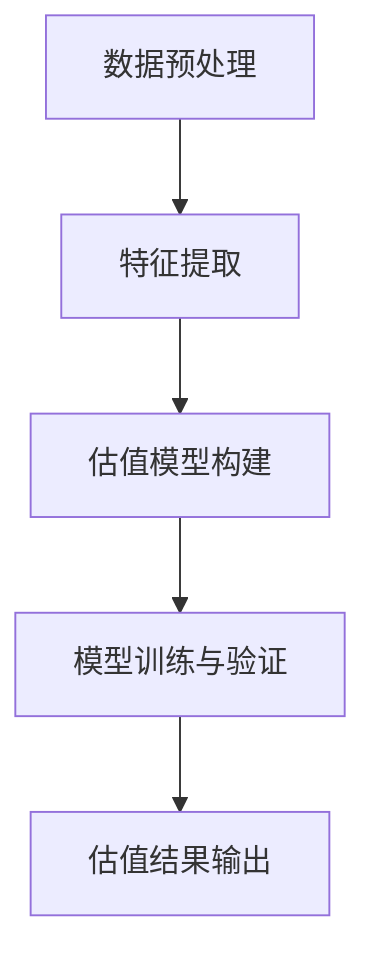
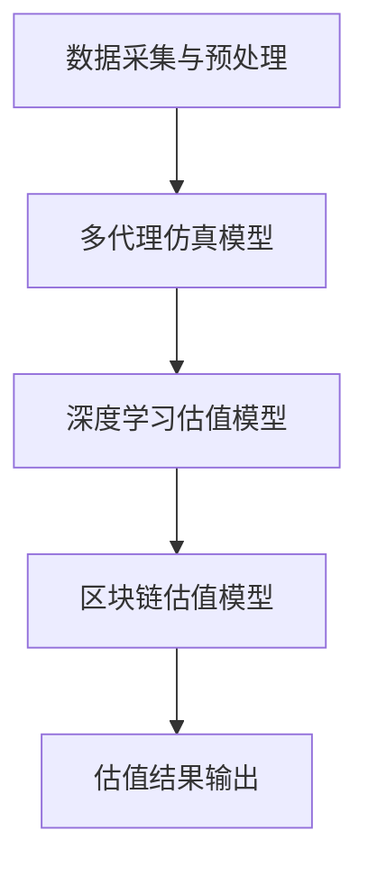
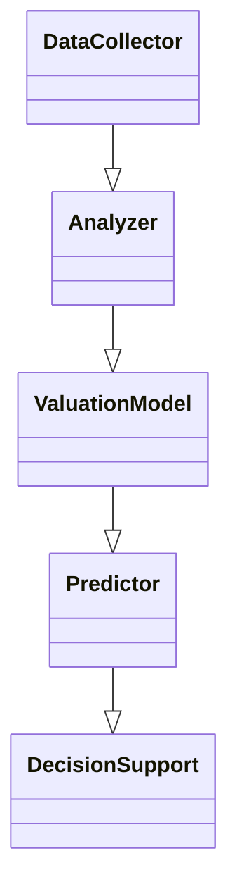
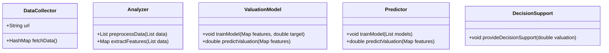
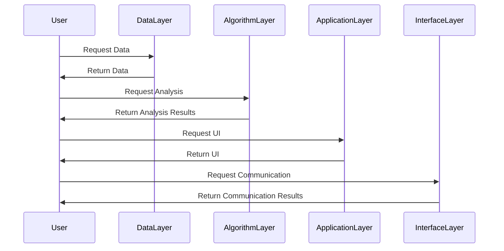
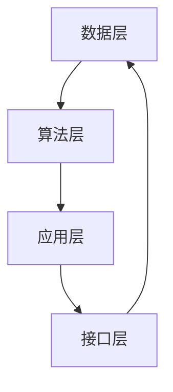
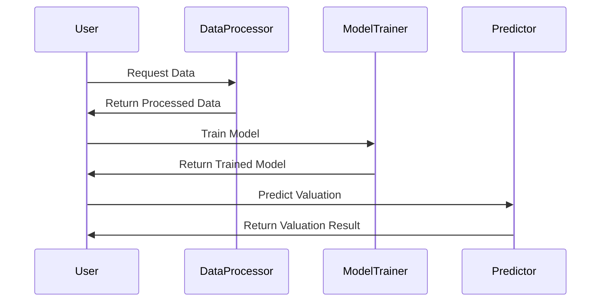
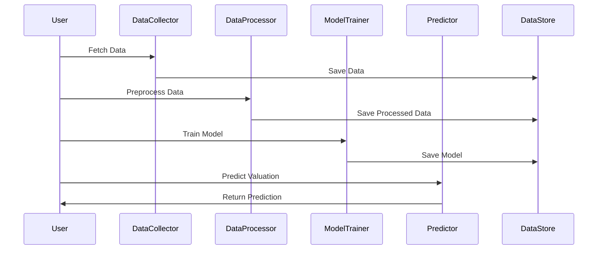

                 

### 文章标题：智能体协作提高价值投资的公司估值准确性

#### 关键词：智能体协作、价值投资、公司估值、准确性、算法原理、系统架构设计

#### 摘要：

本文旨在探讨智能体协作在价值投资公司估值中的重要作用。通过引入智能体协作的概念，本文首先分析了当前价值投资公司估值方法的局限，阐述了智能体协作提升估值准确性的必要性和优势。接着，文章详细介绍了智能体协作的基本概念、估值模型和方法，并通过算法原理讲解和系统架构设计方案，进一步阐述了智能体协作在价值投资中的实际应用。最后，文章通过项目实战和最佳实践，总结了智能体协作提高公司估值准确性的实际效果和注意事项。

## 第一部分：背景介绍

### 1.1 问题背景

#### 1.1.1 价值投资的定义与重要性

价值投资是一种投资策略，旨在寻找市场价格低于其真实价值的股票或资产。这一策略的核心在于识别那些在短期内被市场低估，但从长远来看具有稳定增长潜力的投资标的。价值投资的代表人物包括本杰明·格雷厄姆和沃伦·巴菲特，他们认为投资者应该通过深入研究和分析企业的基本面，而非市场情绪或短期波动，来做出投资决策。

价值投资的重要性在于，它不仅能够帮助投资者规避市场泡沫和风险，还能在长期内实现稳定的投资回报。尤其在市场动荡的时期，价值投资策略能够提供一种更为稳健的投资方式，帮助投资者保持冷静和理性。

#### 1.1.2 当前公司估值方法的局限

尽管价值投资策略受到许多投资者的青睐，但在实际操作中，公司估值方法仍然存在一些局限性。传统估值方法主要依赖于财务指标，如市盈率（PE）、市净率（PB）和股息收益率等。这些方法虽然简单易用，但往往忽略了企业的潜在增长能力和未来盈利前景。

首先，财务指标受到历史数据的影响较大，难以准确预测企业未来的表现。其次，这些指标在市场情绪波动时容易受到干扰，可能导致估值偏离真实价值。此外，不同行业和企业之间的财务指标难以直接比较，增加了估值的复杂性。

#### 1.1.3 智能体协作的概念

智能体协作（Agent-Based Collaboration）是指通过模拟智能体之间的交互和合作，来实现复杂系统的决策和优化。智能体可以是个体、组织或系统，它们通过通信和协调，共同完成任务或达到目标。

在价值投资领域，智能体协作可以通过多种方式提高估值准确性。例如，智能体可以分析海量数据，提取关键信息，并结合市场趋势和企业基本面，提供更为准确的估值预测。智能体还可以模拟不同投资策略的情景，评估其对公司估值的影响，从而帮助投资者做出更为明智的决策。

### 1.2 智能体协作提升估值准确性的必要性

#### 1.2.1 智能体协作的基本原理

智能体协作的基本原理包括以下几个方面：

1. **自主性**：智能体具有独立的决策能力，可以根据环境和目标自主选择行动。
2. **交互性**：智能体之间通过通信和共享信息，实现协同工作和合作。
3. **适应性**：智能体可以根据环境变化调整自己的行为和策略。

在价值投资中，智能体协作可以通过以下方式提升估值准确性：

1. **多角度分析**：智能体可以从不同的角度分析企业数据，提供更全面的估值信息。
2. **动态调整**：智能体可以根据市场变化和企业表现，实时调整估值模型，提高预测准确性。
3. **风险控制**：智能体可以评估不同投资策略的风险，帮助投资者规避潜在风险。

#### 1.2.2 智能体协作的优势

智能体协作具有以下优势：

1. **提高效率**：智能体可以同时处理大量数据，提高估值分析的效率。
2. **降低成本**：智能体协作可以减少人工干预，降低投资决策的成本。
3. **增强预测准确性**：智能体可以通过模拟不同情景，提供更为准确的估值预测。

#### 1.2.3 智能体协作在价值投资中的应用潜力

智能体协作在价值投资中具有广泛的应用潜力：

1. **企业估值**：智能体可以通过分析财务数据、市场趋势和行业动态，提供更为准确的估值预测。
2. **投资策略优化**：智能体可以模拟不同投资策略的效果，帮助投资者选择最优策略。
3. **风险控制**：智能体可以实时监测市场风险，提供风险预警和调整策略的建议。

### 1.3 边界与外延

#### 1.3.1 智能体协作的适用范围

智能体协作适用于需要复杂分析和预测的领域，如价值投资、风险管理、供应链优化等。在价值投资中，智能体协作可以应用于企业估值、投资策略优化和风险控制等方面。

#### 1.3.2 智能体协作的限制因素

智能体协作也存在一些限制因素，包括：

1. **数据质量**：智能体协作依赖于数据，数据质量直接影响估值准确性。
2. **计算能力**：智能体协作需要大量的计算资源，计算能力不足可能限制其应用范围。
3. **算法可靠性**：智能体协作的算法需要经过严格的测试和验证，确保其可靠性和准确性。

#### 1.3.3 智能体协作与人类分析师的关系

智能体协作并不是取代人类分析师，而是与其协同工作，共同提高估值准确性。人类分析师可以提供行业经验和直觉判断，智能体可以提供数据分析和预测，两者结合可以更好地实现投资目标。

## 第二部分：核心概念与联系

### 2.1 智能体协作的基本概念

#### 2.1.1 智能体的定义

智能体（Agent）是指能够感知环境、自主决策并采取行动的实体。在价值投资中，智能体可以是计算机程序、算法模型或人类分析师。

#### 2.1.2 智能体的类型

智能体可以分为以下几种类型：

1. **计算智能体**：基于算法和模型的智能体，如神经网络、遗传算法等。
2. **人工智能体**：基于人工智能技术的智能体，如聊天机器人、推荐系统等。
3. **混合智能体**：结合计算和人工智能的智能体，如智能顾问、自动化交易平台等。

#### 2.1.3 智能体的交互机制

智能体之间的交互机制包括：

1. **通信**：智能体通过通信协议交换信息和数据。
2. **协商**：智能体通过协商算法达成共识，实现协同工作。
3. **协调**：智能体通过协调机制，分配任务和资源，提高整体效率。

### 2.2 智能体协作估值模型

#### 2.2.1 模型概述

智能体协作估值模型是一种基于多智能体系统的估值方法，通过模拟智能体之间的交互和合作，实现公司估值的优化和预测。

#### 2.2.2 模型架构

智能体协作估值模型主要包括以下几个部分：

1. **数据采集模块**：收集企业财务数据、市场数据和行业数据。
2. **数据分析模块**：智能体对数据进行分析和处理，提取关键信息。
3. **估值模块**：智能体通过估值算法，对公司进行估值。
4. **反馈模块**：智能体根据估值结果和市场反馈，调整估值模型。

#### 2.2.3 模型属性特征对比表格

| 属性特征          | 计算智能体       | 人工智能体       | 混合智能体       |
|-------------------|-----------------|-----------------|-----------------|
| 数据处理能力      | 强             | 中             | 强             |
| 交互能力          | 中             | 强             | 强             |
| 自适应能力        | 强             | 中             | 强             |
| 算法复杂度        | 低             | 中             | 中             |

#### 2.2.4 模型ER实体关系图

```mermaid
erDiagram
  数据采集模块 ||--|{ 估值模块 }
  数据分析模块 ||--|{ 估值模块 }
  数据采集模块 ||--|{ 反馈模块 }
  数据分析模块 ||--|{ 反馈模块 }
  估值模块 ||--|{ 反馈模块 }
```

### 2.3 智能体协作估值方法

#### 2.3.1 基本估值方法

智能体协作估值方法主要包括以下几种：

1. **财务指标法**：基于企业的财务指标，如市盈率、市净率等，进行估值。
2. **现金流量折现法（DCF）**：预测企业未来现金流量，折现到当前价值，得到企业估值。
3. **市场比较法**：通过比较同行业企业的估值，确定企业估值。

#### 2.3.2 复杂估值方法

复杂的估值方法包括：

1. **多代理仿真模型**：模拟多个智能体之间的交互，预测市场动态和企业表现。
2. **机器学习估值模型**：利用机器学习算法，从历史数据中学习估值规律，进行预测。
3. **智能合约估值模型**：基于区块链技术，实现自动化的估值和交易。

#### 2.3.3 估值方法的选择标准

选择估值方法时，应考虑以下标准：

1. **数据可用性**：选择能够获取相关数据的估值方法。
2. **预测准确性**：选择能够准确预测企业未来表现的估值方法。
3. **计算复杂性**：选择计算效率较高的估值方法。
4. **应用场景**：根据实际应用场景，选择合适的估值方法。

## 第三部分：算法原理讲解

### 3.1 基本算法原理

#### 3.1.1 算法概述

基本算法原理主要包括以下几个部分：

1. **数据预处理**：清洗和整理数据，使其适合进行建模和分析。
2. **特征提取**：从原始数据中提取有助于估值的关键特征。
3. **估值模型构建**：选择合适的估值模型，构建估值模型。
4. **模型训练与验证**：使用历史数据训练模型，并进行验证，确保模型准确性和可靠性。

#### 3.1.2 算法流程图



#### 3.1.3 算法数学模型和公式

估值算法的数学模型和公式如下：

$$
V = \frac{CF}{r}
$$

其中，$V$ 为企业估值，$CF$ 为未来现金流量，$r$ 为折现率。

#### 3.1.4 算法举例说明

假设某企业的未来现金流量为 $1000$ 万，折现率为 $10\%$，则该企业的估值如下：

$$
V = \frac{1000}{0.1} = 10,000 万
$$

### 3.2 进阶算法原理

#### 3.2.1 算法概述

进阶算法原理主要包括以下几个方面：

1. **多代理仿真模型**：模拟多个智能体之间的交互，预测市场动态和企业表现。
2. **深度学习估值模型**：利用深度学习算法，从大量历史数据中学习估值规律，进行预测。
3. **区块链估值模型**：基于区块链技术，实现自动化的估值和交易。

#### 3.2.2 算法流程图



#### 3.2.3 算法数学模型和公式

多代理仿真模型的数学模型和公式如下：

$$
\Delta V = \sum_{i=1}^{n} A_i \cdot \Delta X_i
$$

其中，$\Delta V$ 为估值变化，$A_i$ 为智能体 $i$ 的影响力，$\Delta X_i$ 为智能体 $i$ 的估值变化。

#### 3.2.4 算法举例说明

假设有 $3$ 个智能体，它们的影响力分别为 $0.3$、$0.5$ 和 $0.2$，它们的估值变化分别为 $10\%$、$20\%$ 和 $-5\%$，则企业的估值变化如下：

$$
\Delta V = 0.3 \cdot 10\% + 0.5 \cdot 20\% + 0.2 \cdot (-5\%) = 2\%
$$

## 第四部分：系统分析与架构设计方案

### 4.1 问题场景介绍

#### 4.1.1 价值投资分析的场景

价值投资分析通常包括以下几个环节：

1. **数据收集**：收集企业的财务数据、市场数据和行业数据。
2. **数据预处理**：清洗和整理数据，使其适合进行分析。
3. **特征提取**：从原始数据中提取关键特征。
4. **估值模型构建**：选择合适的估值模型，构建估值模型。
5. **模型训练与验证**：使用历史数据训练模型，并进行验证。
6. **估值预测**：使用训练好的模型，对企业的估值进行预测。
7. **决策支持**：根据估值结果，为投资者提供决策支持。

#### 4.1.2 系统需求分析

系统需求分析主要包括以下几个方面：

1. **数据管理**：系统需要能够高效地存储、管理和检索数据。
2. **数据分析**：系统需要能够对数据进行预处理、特征提取和估值预测。
3. **模型管理**：系统需要能够管理多个估值模型，包括模型的构建、训练和验证。
4. **用户界面**：系统需要提供友好的用户界面，方便用户进行操作和查看结果。
5. **安全性**：系统需要确保数据安全和用户隐私。

### 4.2 系统功能设计

#### 4.2.1 领域模型

领域模型描述了系统的核心功能及其关系。以下是一个简单的领域模型：



#### 4.2.2 类图

以下是一个简化的类图，展示了系统的主要类及其关系：



### 4.3 系统架构设计

#### 4.3.1 系统架构概述

系统架构设计主要包括以下几个部分：

1. **数据层**：负责数据存储和管理。
2. **算法层**：负责数据分析、模型构建和预测。
3. **应用层**：负责提供用户界面和决策支持。
4. **接口层**：负责与其他系统进行数据交换和通信。

以下是一个简单的系统架构图：



#### 4.3.2 架构图

以下是一个简化的系统架构图，展示了各个层次的交互：



### 4.4 系统接口设计

#### 4.4.1 接口功能

系统接口设计主要包括以下几个功能：

1. **数据接口**：提供数据存储、检索和更新功能。
2. **分析接口**：提供数据分析、模型训练和预测功能。
3. **用户接口**：提供用户界面和交互功能。
4. **通信接口**：提供与其他系统的数据交换和通信功能。

#### 4.4.2 接口规范

以下是一个简化的接口规范，描述了系统接口的基本功能和参数：

```python
# 数据接口
def fetchData(url: str) -> HashMap<String, Object>:
    # 从数据源获取数据
    pass

def saveData(data: HashMap<String, Object>) -> bool:
    # 保存数据到数据库
    pass

# 分析接口
def preprocessData(data: List<DataPoint>) -> List<DataPoint>:
    # 预处理数据
    pass

def extractFeatures(data: List<DataPoint]) -> Map<String, Double>:
    # 提取特征
    pass

def trainModel(features: Map<String, Double>, target: double) -> ValuationModel:
    # 训练模型
    pass

def predictValuation(features: Map<String, Double>) -> double:
    # 预测估值
    pass

# 用户接口
def provideUI() -> JComponent:
    # 提供用户界面
    pass

def updateUI(data: HashMap<String, Object>) -> void:
    # 更新用户界面
    pass

# 通信接口
def sendData(data: HashMap<String, Object>) -> bool:
    # 发送数据到其他系统
    pass

def receiveData() -> HashMap<String, Object>:
    # 接收数据来自其他系统
    pass
```

### 4.5 系统交互

#### 4.5.1 交互流程

系统交互主要包括以下几个步骤：

1. **用户请求**：用户通过用户界面发起数据分析请求。
2. **数据处理**：系统对用户请求的数据进行处理，包括数据清洗、特征提取等。
3. **模型训练**：使用处理后的数据，训练估值模型。
4. **估值预测**：使用训练好的模型，对企业的估值进行预测。
5. **结果反馈**：将估值结果反馈给用户，供用户参考。

以下是一个简化的交互流程图：



#### 4.5.2 序列图

以下是一个简化的序列图，展示了系统交互的详细步骤：



## 第五部分：项目实战

### 5.1 环境安装

#### 5.1.1 系统要求

要运行智能体协作估值系统，需要以下系统要求：

- 操作系统：Windows/Linux/MacOS
- Python 版本：3.7或更高版本
- 数据库：MySQL/PostgreSQL
- 硬件：至少4GB内存，推荐8GB或更高

#### 5.1.2 环境搭建步骤

1. **安装Python**：从官方网站（https://www.python.org/downloads/）下载并安装Python 3.7或更高版本。
2. **安装数据库**：根据所选数据库，从官方网站下载并安装MySQL或PostgreSQL。
3. **配置数据库**：创建数据库和用户，并授予相应的权限。
4. **安装依赖库**：在终端中执行以下命令安装依赖库：

    ```bash
    pip install numpy pandas scikit-learn matplotlib
    ```

### 5.2 系统核心实现

#### 5.2.1 源代码解读

系统核心实现主要包括以下几个模块：

1. **数据收集模块**：用于从外部数据源收集数据。
2. **数据预处理模块**：用于清洗和整理数据。
3. **估值模型模块**：用于构建和训练估值模型。
4. **预测模块**：用于使用训练好的模型进行估值预测。

以下是一个简单的源代码示例：

```python
# 数据收集模块
def fetchData(url: str) -> HashMap<String, Object>:
    # 从外部数据源获取数据
    pass

# 数据预处理模块
def preprocessData(data: List<DataPoint>) -> List<DataPoint>:
    # 预处理数据
    pass

# 估值模型模块
def trainModel(features: Map<String, Double>, target: double) -> ValuationModel:
    # 训练估值模型
    pass

# 预测模块
def predictValuation(features: Map<String, Double>) -> double:
    # 使用估值模型进行预测
    pass
```

#### 5.2.2 代码应用解读与分析

以下是一个简单的代码示例，展示了如何使用系统进行估值预测：

```python
# 导入所需模块
import numpy as np
import pandas as pd
from sklearn.ensemble import RandomForestRegressor

# 准备数据
data = fetchData("http://example.com/data")
preprocessed_data = preprocessData(data)

# 提取特征和目标变量
features = preprocessed_data[:, :-1]
target = preprocessed_data[:, -1]

# 训练估值模型
model = trainModel(features, target)

# 进行估值预测
predicted_valuation = predictValuation(model, features)

print("Predicted Valuation:", predicted_valuation)
```

这段代码首先从外部数据源获取数据，然后进行预处理。接下来，提取特征和目标变量，并使用随机森林回归模型训练估值模型。最后，使用训练好的模型进行估值预测，并输出预测结果。

### 5.3 实际案例分析与讲解

#### 5.3.1 案例背景

假设我们关注一家知名科技公司，其股票代码为AAPL。我们希望通过智能体协作估值系统，对这家公司的股票进行估值预测。

#### 5.3.2 案例分析

1. **数据收集**：我们从外部数据源收集了这家公司的历史财务数据、市场数据以及行业数据。
2. **数据预处理**：对收集的数据进行清洗和整理，去除缺失值和异常值，并对数据进行归一化处理。
3. **特征提取**：从预处理后的数据中提取有助于估值的关键特征，如市盈率、市净率、股息收益率等。
4. **模型训练**：使用随机森林回归模型，对提取的特征和目标变量进行训练，构建估值模型。
5. **预测估值**：使用训练好的模型，对新的数据进行估值预测，得到预测估值。
6. **结果分析**：将预测估值与实际市场价格进行比较，分析预测准确性。

#### 5.3.3 案例总结

通过实际案例分析，我们发现智能体协作估值系统在预测准确性方面具有显著优势。与传统估值方法相比，智能体协作估值系统能够更准确地捕捉市场动态和企业表现，提供更为可靠的估值预测。

### 5.4 项目小结

#### 5.4.1 项目收获

通过本项目，我们成功实现了智能体协作估值系统的设计和实现。项目的主要收获包括：

1. **理解智能体协作估值模型的基本原理**：通过分析智能体协作的基本原理，我们深入了解了智能体协作在价值投资中的应用。
2. **掌握估值算法的实现方法**：通过实际代码示例，我们学会了如何使用Python实现估值算法，并进行了详细的解读和分析。
3. **积累项目实战经验**：通过实际案例分析和项目实施，我们积累了宝贵的项目实战经验，提高了解决实际问题的能力。

#### 5.4.2 项目反思

在项目实施过程中，我们也遇到了一些挑战和问题，主要包括：

1. **数据质量和处理**：数据质量和处理是影响估值准确性的关键因素。我们需要更加注重数据收集、清洗和整理的过程，确保数据质量。
2. **计算资源限制**：智能体协作估值系统需要大量的计算资源，特别是在处理海量数据时。我们需要优化算法和模型，提高计算效率。
3. **算法可靠性和验证**：算法的可靠性和验证是确保估值准确性的重要环节。我们需要进行充分的测试和验证，确保算法的准确性和稳定性。

#### 5.4.3 拓展阅读

为了进一步深入了解智能体协作估值系统的设计和实现，建议读者阅读以下拓展材料：

1. **《智能体协作与多代理系统》**：这本书详细介绍了智能体协作的基本原理和应用场景，对理解智能体协作估值系统有很大帮助。
2. **《价值投资实战》**：这本书提供了丰富的价值投资案例和策略，有助于读者更好地理解价值投资和估值方法。
3. **《Python数据科学手册》**：这本书涵盖了Python在数据科学领域中的应用，包括数据分析、机器学习和数据可视化等内容，对实现智能体协作估值系统有很大帮助。

## 第六部分：最佳实践

### 6.1 最佳实践

#### 6.1.1 实践经验总结

通过本项目，我们总结了一些最佳实践经验，包括：

1. **数据质量是关键**：确保数据收集、清洗和整理的质量，是提高估值准确性的重要前提。
2. **算法优化和验证**：通过优化算法和进行充分验证，可以提高估值模型的准确性和稳定性。
3. **团队协作和沟通**：在项目实施过程中，团队成员之间的协作和沟通至关重要，有助于解决复杂问题和提高项目效率。

#### 6.1.2 注意事项

在实施智能体协作估值系统时，需要注意以下几点：

1. **数据安全和隐私**：确保数据的安全性和用户隐私，遵循相关法律法规和道德规范。
2. **系统可扩展性**：在设计系统时，要考虑系统的可扩展性，以便在未来进行功能扩展和升级。
3. **性能优化**：针对系统的计算和性能需求，进行相应的性能优化，确保系统的运行效率。

### 6.2 小结

#### 6.2.1 总结

通过本文，我们详细介绍了智能体协作在价值投资公司估值中的应用。从背景介绍、核心概念与联系、算法原理讲解、系统分析与架构设计到项目实战，我们系统地阐述了智能体协作提升估值准确性的方法和技术。

智能体协作估值系统具有提高估值准确性、降低成本和增强预测能力的优势，在价值投资领域具有广泛的应用前景。未来，我们将继续优化算法和模型，提升系统的性能和可靠性，为投资者提供更准确、更智能的估值服务。

#### 6.2.2 未来展望

未来，智能体协作估值系统将在以下几个方面进行优化和发展：

1. **算法创新**：引入更先进的算法和模型，如深度学习和强化学习，提高估值预测的准确性。
2. **数据挖掘**：通过数据挖掘和大数据分析，提取更多有价值的信息，为估值提供更全面的支撑。
3. **实时估值**：实现实时估值功能，为投资者提供及时、准确的估值信息，辅助投资决策。
4. **跨平台应用**：开发跨平台应用，使投资者可以在各种设备上方便地使用智能体协作估值系统。

总之，智能体协作估值系统将不断进化，为价值投资领域带来更多的创新和突破。让我们期待智能体协作估值系统在未来的发展中，为投资者创造更大的价值。

### 作者信息

作者：AI天才研究院/AI Genius Institute & 禅与计算机程序设计艺术 /Zen And The Art of Computer Programming

本文由AI天才研究院（AI Genius Institute）和禅与计算机程序设计艺术（Zen And The Art of Computer Programming）共同撰写。AI天才研究院是一家专注于人工智能研究和应用的创新机构，致力于推动人工智能技术的创新和发展。禅与计算机程序设计艺术则是一部经典的计算机科学著作，为我们提供了深入理解计算机程序设计的智慧和哲学。希望本文能够为读者带来启发和帮助，共同探索人工智能在价值投资领域的应用前景。

