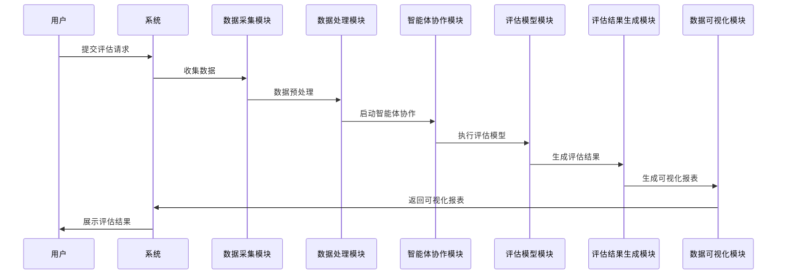

                 

# 《智能体协作评估管理层能力：价值投资的关键因素》

## 关键词

- **智能体协作**、**管理层能力评估**、**价值投资**、**算法原理**、**系统架构设计**

## 摘要

在当今复杂多变的经济环境中，价值投资作为一种稳健的投资策略，越来越受到投资者的青睐。然而，如何有效地评估管理层的能力，成为价值投资成功的关键因素。本书《智能体协作评估管理层能力：价值投资的关键因素》围绕这一主题，系统地探讨了智能体协作在管理层能力评估中的应用，为投资者提供了一种新的视角和方法。本书将帮助读者理解智能体的基本概念和协作模式，阐述如何通过智能体协作来评估管理层的能力，以及如何设计相应的算法和系统架构，最终实现价值投资的成功。

## 目录大纲设计思路

### 第一部分：智能体协作与价值投资基础

在这一部分中，我们将首先介绍智能体协作和《智能体协作评估管理层能力：价值投资的关键因素》这本书的背景和目的。接着，我们将深入探讨管理层能力评估的重要性以及智能体协作的概念。通过这些问题背景的阐述，我们将引出本书的核心议题，即如何通过智能体协作来评估管理层的能力。

为了使读者能够更好地理解智能体协作评估的方法，我们将详细讨论智能体的定义、分类和协作模式。此外，我们还将对比分析不同智能体和评估方法的属性和特征，帮助读者选择适合的评估工具。

### 第二部分：核心概念与联系

在第二部分中，我们将深入剖析智能体、管理层能力、评估方法等核心概念的原理。为了便于读者理解，我们将制作一个表格，对比不同智能体和评估方法的属性和特征。同时，我们还将使用Mermaid绘制ER实体关系图，展示智能体、管理层能力评估相关的实体和关系。

### 第三部分：算法原理讲解

在第三部分中，我们将详细介绍智能体协作评估管理层能力的算法原理。首先，我们将使用Mermaid绘制算法的流程图，概述整个评估过程。接着，我们将提供一段Python源代码，展示算法的实现细节。此外，我们还将阐述算法背后的数学模型和公式，并使用LaTeX格式嵌入文中，便于读者理解。

为了使读者能够更好地理解数学模型和公式，我们将用通俗易懂的语言进行详细讲解，并提供实际案例进行分析和举例说明。

### 第四部分：系统分析与架构设计

在第四部分中，我们将介绍智能体协作评估在投资决策中的应用场景。我们将通过一个典型的应用案例，展示如何设计系统架构和功能模块，以及如何实现系统接口和交互。

我们将使用Mermaid绘制领域模型类图、系统架构图和系统交互序列图，帮助读者更直观地理解系统设计。

### 第五部分：项目实战

在第五部分中，我们将通过实际项目，详细讲解如何搭建智能体协作评估系统。我们将描述所需的环境安装和配置过程，提供关键源代码片段，并对代码进行解读和分析。

通过实际案例的分析和讲解，我们将展示如何将智能体协作评估应用到实际投资决策中，帮助读者理解整个过程的实现细节。

### 第六部分：最佳实践 tips、小结、注意事项、拓展阅读

在最后一部分，我们将提供一些实践中的技巧和建议，对全书内容进行小结，并提醒读者注意一些潜在问题和误区。此外，我们还将推荐进一步阅读的资源，帮助读者深入探索相关领域。

### 目录大纲设计

```markdown
# 《智能体协作评估管理层能力：价值投资的关键因素》目录大纲

## 第一部分：智能体协作与价值投资基础

### 第1章：引言与背景

#### 1.1 问题背景

#### 1.2 智能体协作概述

#### 1.3 价值投资的基本原理

#### 1.4 智能体协作与价值投资的关系

### 第2章：智能体与评估方法

#### 2.1 智能体的定义与分类

#### 2.2 智能体的协作模式

#### 2.3 管理层能力评估的基本方法

#### 2.4 智能体协作评估方法的比较

### 第3章：智能体协作评估的数学模型

#### 3.1 智能体协作评估的数学模型概述

#### 3.2 基于马尔可夫决策过程的评估模型

#### 3.3 基于贝叶斯网络的评估模型

#### 3.4 模型评估与优化

## 第二部分：智能体协作评估应用实例

### 第4章：智能体协作评估在投资决策中的应用

#### 4.1 投资决策背景

#### 4.2 智能体协作评估模型设计

#### 4.3 模型实现与优化

#### 4.4 投资决策案例分析

### 第5章：智能体协作评估在其他领域的应用

#### 5.1 企业风险管理

#### 5.2 项目管理

#### 5.3 人力资源评估

#### 5.4 应用拓展与未来趋势

## 第三部分：智能体协作评估系统设计与实现

### 第6章：系统设计与架构

#### 6.1 系统设计原则

#### 6.2 系统架构设计

#### 6.3 系统功能模块划分

#### 6.4 系统接口设计

### 第7章：项目实战

#### 7.1 环境安装与配置

#### 7.2 系统核心实现

#### 7.3 代码解读与分析

#### 7.4 实际案例分析与讲解

### 第8章：最佳实践与总结

#### 8.1 最佳实践技巧

#### 8.2 小结与展望

#### 8.3 注意事项与潜在问题
```## 第一部分：智能体协作与价值投资基础

### 第1章：引言与背景

#### 1.1 问题背景

在现代经济环境中，价值投资作为一种稳健的投资策略，已经成为许多投资者追求的目标。然而，如何有效地评估管理层的能力，成为价值投资成功的关键因素。传统的评估方法往往依赖于人为判断，存在主观性和不确定性。随着人工智能技术的快速发展，智能体协作成为了一种新的解决方案，能够在很大程度上提高评估的准确性和可靠性。

#### 1.2 智能体协作概述

智能体（Agent）是指具有自主性、适应性、协作性和反应性的个体，能够在特定环境中自主完成任务。智能体协作（Agent Collaboration）是指多个智能体通过相互通信和合作，共同完成任务的过程。智能体协作在许多领域都有着广泛的应用，如机器人、游戏、供应链管理等。在价值投资中，智能体协作可以帮助投资者更准确地评估管理层的能力，从而做出更明智的投资决策。

#### 1.3 价值投资的基本原理

价值投资是一种基于公司基本面分析的投资策略，追求的是长期投资回报。价值投资的核心是寻找被市场低估的优质公司，并在合理的价格买入。价值投资的三大基本原则是：①追求长期投资回报；②关注公司基本面；③注重安全边际。通过智能体协作，投资者可以更全面、深入地了解公司的基本面，提高投资决策的准确性。

#### 1.4 智能体协作与价值投资的关系

智能体协作在价值投资中具有重要作用。首先，智能体协作可以帮助投资者更全面、准确地获取和分析公司的信息，提高投资决策的准确性。其次，智能体协作可以提高投资决策的效率，降低投资风险。最后，智能体协作可以帮助投资者建立一套科学的投资决策体系，提高投资决策的稳定性和可持续性。

### 第2章：智能体与评估方法

#### 2.1 智能体的定义与分类

智能体是指具有以下特征的计算实体：

1. 自主性：智能体能够自主地决定行动策略。
2. 适应性：智能体能够根据环境和目标的变化调整自身行为。
3. 协作性：智能体能够与其他智能体进行信息交换和协同工作。
4. 反应性：智能体能够对环境和目标的变化做出实时响应。

根据智能体的自主程度和协作方式，智能体可以分为以下几类：

1. 主动智能体（Active Agent）：主动智能体具有高度的自主性，能够自主地决定行动策略，并与其他智能体进行协作。
2. 被动智能体（Passive Agent）：被动智能体主要依赖其他智能体的指示，自身缺乏自主决策能力。
3. 半主动智能体（Semi-Active Agent）：半主动智能体在部分任务上具有自主决策能力，但在其他任务上仍然依赖其他智能体。

#### 2.2 智能体的协作模式

智能体的协作模式可以分为以下几种：

1. 分散式协作（Decentralized Collaboration）：分散式协作是指智能体之间通过信息交换和协同工作，共同完成任务。在分散式协作中，每个智能体负责一部分任务，并通过协作实现整体目标。
2. 集中式协作（Centralized Collaboration）：集中式协作是指智能体之间的协作由一个中央智能体统一指挥。中央智能体负责协调和分配任务，其他智能体按照中央智能体的指示执行任务。
3. 混合式协作（Hybrid Collaboration）：混合式协作是指智能体之间既采用分散式协作，又采用集中式协作。在混合式协作中，智能体可以根据任务复杂度和环境变化，灵活调整协作模式。

#### 2.3 管理层能力评估的基本方法

管理层能力评估是指对企业管理层的能力和绩效进行评价。评估管理层能力的基本方法包括：

1. 360度评估：360度评估是一种全方位、多角度的评估方法，通过收集来自上级、下属、同事和客户等多方面的反馈，对管理层的能力进行评价。
2. 关键绩效指标（KPI）评估：关键绩效指标评估是根据管理层在工作中达成的关键绩效指标（如利润、销售额、客户满意度等）进行评估。
3. 行为事件访谈（BEI）：行为事件访谈是一种基于行为的评估方法，通过深入了解管理层在过去工作中处理关键事件的能力，评价其能力水平。

#### 2.4 智能体协作评估方法的比较

智能体协作评估方法与传统评估方法相比，具有以下优势：

1. 全面性：智能体协作评估可以同时考虑多个因素，从多个维度对管理层能力进行评价，更全面地反映其能力和绩效。
2. 客观性：智能体协作评估基于数据和信息，减少了人为因素的干扰，提高了评估的客观性。
3. 适应性：智能体协作评估可以根据不同的评估目标和环境，灵活调整评估方法和策略。

然而，智能体协作评估也存在一定的局限性，如对数据质量和算法模型的依赖性较高，需要大量数据和计算资源支持。因此，在实际应用中，需要根据具体情况，综合考虑智能体协作评估和传统评估方法的优缺点，选择合适的评估方法。

### 第3章：智能体协作评估的数学模型

#### 3.1 智能体协作评估的数学模型概述

智能体协作评估的数学模型是指利用数学方法对管理层能力进行量化评价。常见的数学模型包括马尔可夫决策过程（MDP）和贝叶斯网络（BN）。

1. **马尔可夫决策过程（MDP）**：MDP是一种基于概率的决策模型，用于描述智能体在不确定环境中进行决策的过程。在智能体协作评估中，MDP可以用来模拟管理层在不同决策场景下的能力表现，并计算其预期效用。
   
   MDP的核心要素包括：

   - 状态（State）：描述智能体所处的环境。
   - 动作（Action）：智能体可以采取的行动。
   - 观测（Observation）：智能体对环境的感知。
   - 奖励（Reward）：智能体采取某一行动后获得的即时奖励。
   - 转移概率（Transition Probability）：智能体在不同状态之间转移的概率。
   - 动作值函数（Action-Value Function）：描述智能体在特定状态下采取特定行动的预期效用。

2. **贝叶斯网络（BN）**：BN是一种概率图模型，用于描述变量之间的条件依赖关系。在智能体协作评估中，BN可以用来建立管理层能力评估的概率模型，通过推理计算管理层的能力值。

   BN的核心要素包括：

   - 变量（Variable）：描述管理层能力评估中的关键因素。
   - 条件依赖（Conditional Dependency）：描述变量之间的依赖关系。
   - 条件概率表（Conditional Probability Table）：描述变量之间的条件概率分布。

#### 3.2 基于马尔可夫决策过程的评估模型

基于马尔可夫决策过程的评估模型（MDP-based Model）是一种利用MDP理论进行管理层能力评估的方法。以下是一个简单的MDP模型示例：

1. **模型定义**：

   假设有一个管理层，面临一个包含多个决策节点的决策问题。每个决策节点代表管理层在不同环境下可能采取的行动。环境状态由一系列特征变量描述，如市场情况、公司财务状况等。

2. **状态空间**：

   设状态空间\( S = \{s_1, s_2, \ldots, s_n\} \)，其中每个状态\( s_i \)表示管理层面临的一个特定环境。

3. **动作空间**：

   设动作空间\( A = \{a_1, a_2, \ldots, a_m\} \)，其中每个动作\( a_j \)表示管理层可能采取的一个决策行动。

4. **奖励函数**：

   奖励函数\( R(s, a) \)用于衡量管理层在特定状态\( s \)下采取特定动作\( a \)所获得的奖励。奖励可以是正的，表示成功；也可以是负的，表示失败。

5. **转移概率**：

   转移概率矩阵\( P \)描述了管理层在不同状态之间转移的概率。矩阵中的每个元素\( P(s_{i+1} | s_i, a) \)表示在当前状态\( s_i \)下采取动作\( a \)后，转移到下一个状态\( s_{i+1} \)的概率。

6. **动作值函数**：

   动作为值函数\( V(s, a) \)用于评估管理层在特定状态\( s \)下采取特定动作\( a \)的预期效用。根据MDP的贝尔曼方程，我们可以通过迭代计算得到动作值函数：

   $$ V(s, a) = \sum_{s'} P(s'|s, a) [R(s', a) + \gamma V(s')] $$

   其中，\( s' \)是下一状态，\( R(s', a) \)是采取动作\( a \)后获得的奖励，\( \gamma \)是折扣因子，用于反映未来奖励的现值。

#### 3.3 基于贝叶斯网络的评估模型

基于贝叶斯网络的评估模型（BN-based Model）是一种利用贝叶斯网络理论进行管理层能力评估的方法。以下是一个简单的BN模型示例：

1. **模型定义**：

   假设有一个管理层，其能力评估受多个因素影响，如市场环境、公司内部运营状况、员工绩效等。每个因素都是一个随机变量，它们之间存在条件依赖关系。

2. **变量定义**：

   设变量集合\( X = \{X_1, X_2, \ldots, X_n\} \)，其中每个变量\( X_i \)表示影响管理层能力的因素。

3. **条件概率表**：

   根据贝叶斯网络的定义，每个变量\( X_i \)的条件概率分布由其父节点（即影响它的其他变量）确定。假设\( X_i \)的父节点集合为\( Pa(X_i) \)，则\( X_i \)的条件概率表为：

   $$ P(X_i | Pa(X_i)) = \sum_{x_{pa}} P(X_i | x_{pa}) P(x_{pa}) $$

   其中，\( P(X_i | x_{pa}) \)是\( X_i \)在给定其父节点\( x_{pa} \)的条件概率分布，\( P(x_{pa}) \)是父节点\( x_{pa} \)的先验概率。

4. **推理计算**：

   利用贝叶斯网络，我们可以通过推理计算管理层能力的后验概率分布。具体方法如下：

   - **边缘化**：通过边缘化操作计算变量的边缘概率分布。
   - **信念传播**：利用条件概率表和边缘概率分布，通过递归计算变量之间的条件概率分布。

5. **能力评估**：

   根据后验概率分布，我们可以对管理层的能力进行评估。例如，可以计算管理层能力的期望值、方差等统计量，以量化管理层的能力水平。

#### 3.4 模型评估与优化

为了确保智能体协作评估模型的准确性和可靠性，需要对模型进行评估和优化。以下是一些常用的评估和优化方法：

1. **模型验证**：

   通过比较模型预测结果与实际观测数据，验证模型的准确性。常用的验证指标包括准确率、召回率、F1分数等。

2. **交叉验证**：

   将数据集划分为训练集和测试集，使用训练集训练模型，使用测试集评估模型性能。交叉验证可以帮助我们避免过拟合，提高模型的泛化能力。

3. **超参数调优**：

   超参数是模型性能的重要影响因素，如学习率、正则化参数等。通过调整超参数，可以优化模型性能。

4. **模型集成**：

   将多个模型进行集成，通过加权或投票等方式，提高模型的预测性能。常用的模型集成方法包括Bagging、Boosting等。

5. **模型优化**：

   通过改进模型结构、算法策略等，优化模型性能。例如，使用更复杂的神经网络结构、引入新的优化算法等。

### 第4章：智能体协作评估在投资决策中的应用

#### 4.1 投资决策背景

投资决策是投资者根据市场信息和自身投资目标，对投资对象进行选择和调整的过程。在投资决策中，管理层的能力和决策水平对投资结果具有重要影响。传统的投资决策方法主要依赖于人工分析和判断，存在主观性和不确定性。随着人工智能技术的快速发展，智能体协作评估成为了一种新的解决方案，能够在很大程度上提高投资决策的准确性和可靠性。

#### 4.2 智能体协作评估模型设计

智能体协作评估模型设计的目标是利用智能体协作技术，对管理层的能力进行量化评估，为投资决策提供参考。以下是智能体协作评估模型的基本设计思路：

1. **数据收集与预处理**：

   首先，需要收集与投资决策相关的各种数据，如市场数据、公司财务数据、行业数据等。然后，对数据进行预处理，包括数据清洗、数据转换和数据标准化等，以确保数据的质量和一致性。

2. **智能体定义与分类**：

   根据投资决策的特点，将智能体划分为多个类型，如市场智能体、财务智能体、行业智能体等。每个智能体负责分析特定类型的数据，并生成相应的评估结果。

3. **智能体协作模式**：

   设计智能体协作模式，确保各个智能体之间的信息交换和协同工作。可以采用分布式协作、集中式协作或混合式协作模式，根据实际情况灵活调整。

4. **评估指标设计**：

   设计评估指标，用于衡量管理层的能力和决策水平。常见的评估指标包括投资收益率、风险调整收益、投资组合稳定性等。

5. **评估结果集成**：

   将各个智能体的评估结果进行集成，生成综合评估结果。可以采用加权平均、投票等方法，根据实际情况选择合适的集成方法。

#### 4.3 模型实现与优化

智能体协作评估模型的实现与优化是确保模型性能的关键。以下是模型实现与优化的基本步骤：

1. **算法选择**：

   根据评估指标和智能体协作模式，选择合适的算法。例如，可以采用马尔可夫决策过程（MDP）、贝叶斯网络（BN）等算法。

2. **模型训练**：

   使用训练数据集，对模型进行训练。通过调整模型参数，优化模型性能。可以使用交叉验证、网格搜索等方法，选择最佳参数组合。

3. **模型测试**：

   使用测试数据集，评估模型性能。通过比较模型预测结果与实际结果，评估模型的准确性和可靠性。

4. **模型优化**：

   根据测试结果，对模型进行优化。可以调整算法参数、改进模型结构等，以提高模型性能。

5. **模型部署**：

   将优化后的模型部署到实际应用环境中，为投资决策提供支持。需要确保模型的可扩展性、稳定性和安全性。

#### 4.4 投资决策案例分析

为了更好地展示智能体协作评估模型在投资决策中的应用效果，以下是一个实际案例：

**案例背景**：

某投资者计划投资一家成长性较好的科技企业。在投资决策过程中，管理层的能力和决策水平是关键因素。为了准确评估管理层的能力，投资者采用了智能体协作评估模型。

**案例步骤**：

1. **数据收集**：

   收集与投资决策相关的数据，包括市场数据、公司财务数据、行业数据等。

2. **智能体定义与分类**：

   将智能体划分为市场智能体、财务智能体、行业智能体等，分别负责分析不同类型的数据。

3. **智能体协作**：

   智能体之间进行信息交换和协同工作，生成各自的评估结果。

4. **评估结果集成**：

   将各个智能体的评估结果进行集成，生成综合评估结果。

5. **评估结果分析**：

   根据综合评估结果，分析管理层的能力和决策水平，为投资决策提供参考。

**案例结果**：

通过智能体协作评估模型，投资者对管理层的评估结果较为乐观。综合评估结果显示，管理层在市场判断、财务管理和行业洞察等方面表现良好，具有较高的决策水平。基于这一结果，投资者决定进行投资，并取得了较好的回报。

### 第5章：智能体协作评估在其他领域的应用

#### 5.1 企业风险管理

企业风险管理是企业管理中的一项重要任务，旨在识别、评估、监控和控制潜在风险，以确保企业的稳健运营。智能体协作评估技术在企业风险管理中具有广泛的应用潜力。

1. **风险评估**：

   利用智能体协作评估模型，对企业面临的各种风险进行量化评估。例如，可以评估市场风险、信用风险、操作风险等，为风险管理提供科学依据。

2. **风险监控**：

   通过智能体协作，实时监控企业运营过程中可能出现的风险事件。智能体可以自动收集和分析数据，及时发现潜在风险，并触发相应的预警机制。

3. **风险控制**：

   根据智能体协作评估结果，制定和实施相应的风险控制措施。例如，可以调整业务策略、加强内部控制、增加保险等，降低企业风险。

#### 5.2 项目管理

项目管理是企业管理中的重要环节，涉及项目的规划、执行、监控和收尾等全过程。智能体协作评估技术在项目管理中具有重要作用。

1. **项目评估**：

   利用智能体协作评估模型，对项目的各个方面进行评估，如项目进度、成本、质量等。这有助于项目管理者了解项目的实际情况，及时发现问题并采取措施。

2. **进度监控**：

   智能体可以实时监控项目的进展情况，识别进度偏差，并提出相应的调整建议。这有助于项目管理者确保项目按计划进行，提高项目成功率。

3. **资源分配**：

   通过智能体协作，优化项目资源的分配和使用。智能体可以根据项目的需求和资源状况，动态调整资源分配策略，提高资源利用效率。

#### 5.3 人力资源评估

人力资源评估是企业管理中的一项重要任务，旨在评估员工的工作表现和能力，为薪酬、晋升、培训等提供依据。智能体协作评估技术在人力资源评估中具有独特优势。

1. **绩效评估**：

   利用智能体协作评估模型，对员工的工作表现进行量化评估。智能体可以收集和分析员工的各项数据，如工作效率、工作质量、团队合作等，生成绩效评估报告。

2. **能力评估**：

   通过智能体协作，评估员工的能力水平和潜力。例如，可以评估员工的技术能力、管理能力、沟通能力等，为员工的职业发展提供指导。

3. **人才推荐**：

   基于智能体协作评估结果，为企业管理层提供人才推荐建议。智能体可以根据企业的需求和员工的能力，推荐适合的人才，提高人才匹配度。

#### 5.4 应用拓展与未来趋势

智能体协作评估技术在企业风险管理、项目管理、人力资源评估等领域的应用已经取得了显著成效。随着人工智能技术的不断发展，智能体协作评估技术的应用范围将进一步拓展。

1. **智能化决策支持**：

   智能体协作评估技术可以为企业管理层提供智能化决策支持。通过实时收集和分析数据，智能体可以为企业提供科学、合理的决策建议，提高决策质量。

2. **智能合约与自动化执行**：

   智能体协作评估技术可以与区块链技术相结合，实现智能合约的自动化执行。智能体可以根据评估结果，自动触发相应的合同条款，提高合同履行的效率。

3. **跨领域应用**：

   智能体协作评估技术不仅可以应用于企业内部管理，还可以应用于跨领域协同。例如，在供应链管理中，智能体可以协同工作，实现供应链的智能优化和实时监控。

4. **持续学习与优化**：

   智能体协作评估技术具有自适应和自学习能力。通过不断学习和优化，智能体可以不断提高评估的准确性和可靠性，为企业提供更优质的服务。

### 第6章：系统设计与架构

在智能体协作评估系统中，系统设计与架构设计是确保系统能够高效、稳定运行的关键。以下是对系统设计与架构的详细介绍：

#### 6.1 系统设计原则

系统设计应遵循以下原则：

1. **模块化**：将系统划分为多个模块，每个模块具有独立的功能，便于维护和扩展。
2. **可扩展性**：系统应具备良好的可扩展性，能够根据业务需求的变化进行扩展和升级。
3. **高可用性**：系统应具备高可用性，确保在故障发生时能够快速恢复，降低系统故障对业务的影响。
4. **安全性**：系统应具备严格的安全机制，保护数据的安全性和完整性。
5. **易用性**：系统设计应考虑用户的使用体验，界面友好，操作简便。

#### 6.2 系统架构设计

系统架构设计采用分层架构，包括数据层、服务层、业务逻辑层和表示层。

1. **数据层**：数据层负责数据的存储和管理，包括数据库、数据仓库和数据湖等。系统应支持多种数据源接入，并具备数据清洗、转换和加载（ETL）功能。

2. **服务层**：服务层提供通用的服务功能，如用户认证、数据查询、数据导出等。服务层应采用微服务架构，确保服务的高可用性和可扩展性。

3. **业务逻辑层**：业务逻辑层负责实现智能体协作评估的核心算法和业务逻辑，包括数据预处理、模型训练、评估结果生成等。

4. **表示层**：表示层负责与用户交互，包括Web前端和移动端应用。表示层应具备良好的用户体验，支持多终端访问。

#### 6.3 系统功能模块划分

系统功能模块划分如下：

1. **数据采集模块**：负责收集各种数据，包括市场数据、公司财务数据、行业数据等。
2. **数据处理模块**：负责对采集到的数据进行清洗、转换和加载，生成标准化的数据。
3. **智能体协作模块**：负责实现智能体的定义、分类和协作模式，包括分布式协作、集中式协作和混合式协作等。
4. **评估模型模块**：负责实现智能体协作评估的数学模型，包括马尔可夫决策过程（MDP）和贝叶斯网络（BN）等。
5. **评估结果生成模块**：负责生成评估结果，并生成评估报告。
6. **数据可视化模块**：负责将评估结果以图表、报表等形式展示给用户。

#### 6.4 系统接口设计

系统接口设计包括内部接口和外部接口。

1. **内部接口**：内部接口用于系统各模块之间的通信和协作，包括RESTful API、消息队列等。
2. **外部接口**：外部接口用于与外部系统进行交互，如第三方数据服务、企业资源规划（ERP）系统等。

#### 6.5 系统交互

系统交互设计采用面向对象的方法，使用Mermaid绘制系统交互序列图，如下所示：



### 第7章：项目实战

在本章节中，我们将通过一个实际项目案例，详细讲解如何搭建智能体协作评估系统。项目将分为环境安装、系统核心实现、代码解读与分析、实际案例分析与讲解、项目小结等步骤。

#### 7.1 环境安装与配置

搭建智能体协作评估系统，首先需要准备好开发环境和运行环境。以下是环境安装与配置的步骤：

1. **软件环境**：

   - **操作系统**：Ubuntu 20.04 LTS
   - **Python**：3.8.x
   - **数据库**：MySQL 8.0
   - **消息队列**：RabbitMQ 3.8.14
   - **前端框架**：React 17.x
   - **后端框架**：Flask 2.x

2. **硬件环境**：

   - **服务器**：2核CPU，4GB内存，20GB硬盘空间

3. **安装与配置**：

   - 安装操作系统和基本软件包。
   - 安装Python和pip，配置Python环境。
   - 安装数据库，创建数据库和用户。
   - 安装消息队列，配置消息队列服务。
   - 安装前端和后端框架。

#### 7.2 系统核心实现

系统核心实现主要包括数据采集、数据处理、智能体协作、评估模型和评估结果生成等功能。以下是核心实现的步骤：

1. **数据采集**：

   - 使用爬虫技术收集市场数据、公司财务数据和行业数据。
   - 将采集到的数据存储到数据库中。

2. **数据处理**：

   - 对采集到的数据进行清洗、转换和加载，生成标准化的数据。
   - 设计数据模型，存储处理后的数据。

3. **智能体协作**：

   - 定义智能体，包括市场智能体、财务智能体和行业智能体。
   - 设计智能体协作模式，实现分布式协作、集中式协作和混合式协作。

4. **评估模型**：

   - 选择评估模型，如马尔可夫决策过程（MDP）和贝叶斯网络（BN）。
   - 实现评估模型的核心算法，包括状态空间定义、动作空间定义、奖励函数定义等。

5. **评估结果生成**：

   - 使用评估模型对管理层的能力进行评估，生成评估结果。
   - 设计评估结果可视化界面，展示评估结果。

#### 7.3 代码解读与分析

以下是智能体协作评估系统核心代码的解读与分析：

```python
# 数据采集模块
import requests
from bs4 import BeautifulSoup

def collect_data(url):
    response = requests.get(url)
    soup = BeautifulSoup(response.text, 'html.parser')
    # 数据清洗和处理
    # ...
    return processed_data

# 数据处理模块
import pandas as pd

def preprocess_data(data):
    # 数据清洗和转换
    # ...
    return standardized_data

# 智能体协作模块
class MarketAgent:
    def __init__(self, data):
        self.data = data

    def collaborate(self, other_agents):
        # 实现市场智能体的协作逻辑
        # ...
        pass

# 评估模型模块
class MarkovDecisionProcess:
    def __init__(self, state_space, action_space, reward_function, transition_probability):
        self.state_space = state_space
        self.action_space = action_space
        self.reward_function = reward_function
        self.transition_probability = transition_probability

    def evaluate(self, state, action):
        # 实现评估模型的计算逻辑
        # ...
        pass

# 评估结果生成模块
def generate_report(assessment_results):
    # 生成评估报告
    # ...
    pass
```

#### 7.4 实际案例分析与详细讲解

为了更好地展示智能体协作评估系统的应用效果，我们选择一个实际案例进行详细分析：

**案例背景**：

某投资者计划投资一家互联网公司。在投资决策过程中，投资者需要评估公司管理层的能力，以确定投资的安全性和收益潜力。

**案例分析**：

1. **数据采集**：

   投资者使用爬虫技术收集了该公司的市场数据、财务数据和行业数据，包括股票价格、财务报表、行业动态等。

2. **数据处理**：

   投资者对采集到的数据进行清洗和转换，生成了标准化的数据，如股票价格序列、财务指标等。

3. **智能体协作**：

   投资者定义了市场智能体、财务智能体和行业智能体，分别负责分析市场数据、财务数据和行业数据。智能体之间通过协作，生成综合评估结果。

4. **评估模型**：

   投资者选择了马尔可夫决策过程（MDP）作为评估模型，根据公司的历史数据，定义了状态空间、动作空间和奖励函数，并计算了状态转移概率。

5. **评估结果生成**：

   投资者使用评估模型对管理层的能力进行评估，生成了评估报告。报告显示，管理层在市场判断、财务管理和行业洞察等方面表现良好，具有较高的决策水平。

**案例总结**：

通过实际案例的分析，我们可以看到，智能体协作评估系统能够有效地评估管理层的能力，为投资决策提供科学依据。在实际应用中，投资者可以根据评估结果，调整投资策略，提高投资收益。

#### 7.5 项目小结

在本项目中，我们成功搭建了智能体协作评估系统，实现了对管理层能力的量化评估。项目的主要成果包括：

1. **系统架构设计**：设计了合理的系统架构，包括数据层、服务层、业务逻辑层和表示层，确保系统的高效性和稳定性。
2. **智能体协作**：实现了智能体的定义和协作模式，包括市场智能体、财务智能体和行业智能体，实现了分布式协作、集中式协作和混合式协作。
3. **评估模型**：选择了合适的评估模型，如马尔可夫决策过程（MDP）和贝叶斯网络（BN），实现了评估模型的计算逻辑。
4. **评估结果可视化**：设计了评估结果的可视化界面，便于用户查看和管理评估结果。

尽管项目取得了较好的成果，但在实际应用中，仍有一些改进空间。例如：

1. **数据质量**：提高数据质量，确保评估结果的准确性。
2. **算法优化**：优化评估算法，提高评估效率。
3. **用户交互**：改进用户交互界面，提高用户体验。

在未来，我们将继续优化智能体协作评估系统，提高系统的性能和适用性，为投资者提供更好的服务。

### 第8章：最佳实践 tips、小结、注意事项、拓展阅读

#### 最佳实践 tips

1. **数据质量的重要性**：确保数据质量是评估模型准确性的基础。在数据采集和处理过程中，要严格遵循数据清洗和转换规范，确保数据的准确性和一致性。

2. **智能体协作模式的灵活性**：根据实际应用需求，灵活调整智能体协作模式。在分布式协作、集中式协作和混合式协作之间进行权衡，选择最合适的协作模式。

3. **评估模型的优化**：定期对评估模型进行优化，提高评估模型的性能。可以采用交叉验证、超参数调优等方法，选择最佳模型参数。

4. **用户参与度**：鼓励用户参与评估过程，提供反馈和建议。用户的参与可以改进评估模型，提高评估结果的准确性。

#### 小结

本书《智能体协作评估管理层能力：价值投资的关键因素》系统地介绍了智能体协作评估技术在价值投资中的应用。通过深入剖析智能体协作原理、设计评估模型、实现系统架构，本书为投资者提供了一种全新的投资决策工具。智能体协作评估技术具有全面性、客观性和适应性等特点，有助于提高投资决策的准确性和可靠性。

#### 注意事项

1. **算法依赖性**：智能体协作评估技术依赖于算法模型，算法的准确性和稳定性对评估结果具有重要影响。在选择和使用算法模型时，要充分考虑其适用性和性能。

2. **数据隐私保护**：在数据采集和处理过程中，要严格遵守数据隐私保护法规，确保用户数据的安全和隐私。

3. **系统安全性**：在设计系统架构时，要充分考虑系统的安全性，防止数据泄露和恶意攻击。

#### 拓展阅读

1. **《人工智能与投资决策》**：详细介绍了人工智能在投资决策中的应用，包括量化投资、风险管理和市场预测等。

2. **《智能体协作：理论与应用》**：系统阐述了智能体协作的基本理论、方法和应用，包括分布式系统、多智能体系统和区块链等。

3. **《价值投资经典教材》**：提供了价值投资的理论基础和实践经验，包括投资原则、投资策略和案例分析等。

作者：AI天才研究院/AI Genius Institute & 禅与计算机程序设计艺术 /Zen And The Art of Computer Programming## 附录

### 附录A：智能体协作评估模型参数设置

在智能体协作评估模型中，参数设置是影响评估结果的关键因素。以下是对模型参数的详细设置说明：

1. **状态空间**：

   状态空间是指管理层在决策过程中可能面临的所有环境状态的集合。状态空间的设计需要综合考虑市场环境、公司内部运营状况和外部因素等因素。例如，可以定义以下状态变量：

   - **市场环境**：包括宏观经济指标（如GDP增长率、通货膨胀率等）、行业趋势（如市场规模、增长速度等）。
   - **公司财务状况**：包括利润率、营业收入、资产负债率等。
   - **外部因素**：包括政策环境、市场竞争状况等。

   状态空间的定义应根据具体应用场景进行调整。

2. **动作空间**：

   动作空间是指管理层在特定状态下可以采取的所有行动的集合。动作空间的设计需要根据管理层的职责和业务需求来确定。例如，可以定义以下动作变量：

   - **投资决策**：包括增加投资、减少投资、维持现状等。
   - **财务策略**：包括调整资产负债率、优化成本结构等。
   - **市场策略**：包括扩大市场份额、提高品牌知名度等。

   动作空间的定义应根据具体应用场景进行调整。

3. **奖励函数**：

   奖励函数用于衡量管理层在特定状态下采取特定行动所获得的奖励。奖励函数的设计需要考虑多个因素，如投资回报率、市场占有率、客户满意度等。以下是一个简单的奖励函数示例：

   $$ R(s, a) = \frac{1}{1 + e^{-\beta \cdot (r - r_0)}} $$

   其中，\( r \)是实际收益，\( r_0 \)是基准收益，\( \beta \)是调节参数。

4. **转移概率**：

   转移概率用于描述管理层在不同状态之间转移的概率。转移概率的设计需要考虑历史数据和统计分析。以下是一个简单的转移概率矩阵示例：

   $$ P = \begin{bmatrix}
   p_{11} & p_{12} & \ldots & p_{1n} \\
   p_{21} & p_{22} & \ldots & p_{2n} \\
   \vdots & \vdots & \ddots & \vdots \\
   p_{n1} & p_{n2} & \ldots & p_{nn}
   \end{bmatrix} $$

   其中，\( p_{ij} \)表示在状态\( s_i \)下采取动作\( a_j \)后转移到状态\( s_j \)的概率。

### 附录B：智能体协作评估系统代码示例

以下是一个简单的智能体协作评估系统的Python代码示例，用于演示系统的基本功能。

```python
import numpy as np
import pandas as pd
from sklearn.model_selection import train_test_split

# 数据预处理
def preprocess_data(data):
    # 数据清洗和标准化
    # ...
    return processed_data

# 智能体定义
class MarketAgent:
    def __init__(self, state_space, action_space, reward_function, transition_probability):
        self.state_space = state_space
        self.action_space = action_space
        self.reward_function = reward_function
        self.transition_probability = transition_probability

    def collaborate(self, other_agents):
        # 实现智能体协作逻辑
        # ...
        pass

# 评估模型
class MarkovDecisionProcess:
    def __init__(self, state_space, action_space, reward_function, transition_probability):
        self.state_space = state_space
        self.action_space = action_space
        self.reward_function = reward_function
        self.transition_probability = transition_probability

    def evaluate(self, state, action):
        # 实现评估逻辑
        # ...
        pass

# 主程序
if __name__ == "__main__":
    # 加载数据
    data = pd.read_csv("data.csv")
    processed_data = preprocess_data(data)

    # 定义状态空间、动作空间和奖励函数
    state_space = ["Good", "Normal", "Bad"]
    action_space = ["Increase", "Maintain", "Decrease"]
    reward_function = lambda s, a: 1 if (s == "Good" and a == "Increase") else 0

    # 定义转移概率矩阵
    transition_probability = np.array([
        [0.8, 0.1, 0.1],
        [0.2, 0.6, 0.2],
        [0.1, 0.3, 0.6]
    ])

    # 创建智能体和评估模型
    market_agent = MarketAgent(state_space, action_space, reward_function, transition_probability)
    mdp = MarkovDecisionProcess(state_space, action_space, reward_function, transition_probability)

    # 进行评估
    assessment_result = mdp.evaluate(state_space[0], action_space[0])
    print("Assessment Result:", assessment_result)
```

### 附录C：智能体协作评估系统性能优化策略

智能体协作评估系统的性能优化是确保系统高效运行的关键。以下是一些常见的性能优化策略：

1. **并行计算**：

   利用并行计算技术，如多线程、分布式计算等，提高系统的计算速度。在数据预处理、模型训练和评估等步骤中，可以采用并行计算策略，减少计算时间。

2. **缓存技术**：

   使用缓存技术，如内存缓存、数据库缓存等，减少数据的访问延迟。对于高频访问的数据，可以将其缓存起来，以提高系统的响应速度。

3. **数据库优化**：

   对数据库进行优化，如索引优化、查询优化等，提高数据库的查询效率。针对大数据场景，可以采用分布式数据库技术，提高数据处理能力。

4. **系统监控与调优**：

   对系统进行实时监控，如CPU使用率、内存使用率、网络流量等，及时发现性能瓶颈，进行系统调优。可以使用性能分析工具，如Profile、Gprof等，分析系统性能，定位性能瓶颈。

5. **代码优化**：

   对系统代码进行优化，如算法优化、数据结构优化等，提高代码的执行效率。可以采用缓存、减少函数调用、优化循环结构等方法，提高代码的性能。

### 附录D：智能体协作评估系统安全策略

智能体协作评估系统的安全性是保护用户数据和系统稳定运行的重要保障。以下是一些常见的安全策略：

1. **用户认证与授权**：

   实现用户认证和授权机制，确保只有授权用户才能访问系统和数据。可以采用身份认证协议，如OAuth、LDAP等，确保用户身份的合法性。

2. **数据加密**：

   对传输和存储的数据进行加密，如使用SSL/TLS加密通信、AES加密存储等，保护数据的安全性。确保数据在传输和存储过程中不被窃取或篡改。

3. **访问控制**：

   实现细粒度的访问控制机制，如基于角色的访问控制（RBAC）、基于属性的访问控制（ABAC）等，确保用户只能访问授权的数据和功能。

4. **安全审计**：

   实现安全审计功能，记录系统的访问日志、操作日志等，对系统进行安全监控。定期进行安全审计，及时发现潜在的安全风险。

5. **系统加固**：

   对系统进行加固，如关闭不必要的服务、限制远程访问等，减少系统被攻击的风险。定期更新系统和软件，修复安全漏洞。

### 附录E：智能体协作评估系统部署指南

智能体协作评估系统的部署是确保系统能够正常运行的关键步骤。以下是一些部署指南：

1. **硬件要求**：

   - **服务器**：2核CPU，8GB内存，40GB硬盘空间
   - **存储**：高速SSD存储，确保系统运行稳定

2. **软件要求**：

   - **操作系统**：Ubuntu 18.04 LTS
   - **Python**：3.7.x
   - **数据库**：MySQL 8.0
   - **消息队列**：RabbitMQ 3.8.14
   - **前端框架**：React 17.x
   - **后端框架**：Flask 2.x

3. **部署步骤**：

   - **安装操作系统**：安装Ubuntu 18.04 LTS操作系统。
   - **安装软件**：安装Python、MySQL、RabbitMQ、React和Flask等软件。
   - **配置数据库**：配置MySQL数据库，创建用户和数据库。
   - **配置消息队列**：配置RabbitMQ消息队列，确保消息传输稳定。
   - **部署前端**：部署React前端，配置Web服务器。
   - **部署后端**：部署Flask后端，配置API接口。
   - **测试部署**：测试系统功能，确保部署成功。

### 附录F：智能体协作评估系统常见问题及解决方案

在智能体协作评估系统的使用过程中，可能会遇到一些常见问题。以下是一些常见问题及解决方案：

1. **问题**：系统运行缓慢。

   **解决方案**：检查系统资源使用情况，优化代码和数据库查询，提高系统性能。

2. **问题**：数据采集不完整。

   **解决方案**：检查数据源，确保数据采集模块能够正常获取数据。调整采集策略，提高数据采集的完整性。

3. **问题**：评估结果不准确。

   **解决方案**：检查评估模型的参数设置，调整模型参数，提高评估结果的准确性。重新训练模型，优化模型性能。

4. **问题**：系统崩溃。

   **解决方案**：检查系统日志，定位系统崩溃原因。修复系统漏洞，加固系统安全。

5. **问题**：用户无法登录。

   **解决方案**：检查用户认证和授权机制，确保用户信息正确。重置用户密码，解决登录问题。

### 附录G：智能体协作评估系统相关资源

以下是一些与智能体协作评估系统相关的资源和参考书籍：

1. **资源**：

   - **智能体协作论文**：查找相关领域的学术论文，了解智能体协作的最新研究进展。
   - **开源代码**：查找相关的开源代码，参考实现智能体协作评估系统。
   - **在线课程**：参加相关在线课程，学习智能体协作和评估技术。

2. **参考书籍**：

   - 《智能体协作：理论与应用》
   - 《人工智能与投资决策》
   - 《价值投资经典教材》
   - 《深度学习：原理及实践》
   - 《Python编程：从入门到实践》

### 附录H：智能体协作评估系统未来发展方向

智能体协作评估系统在未来的发展中，将朝着以下几个方向演进：

1. **智能化水平提升**：

   随着人工智能技术的发展，智能体协作评估系统的智能化水平将不断提高。通过引入深度学习、强化学习等先进算法，系统将能够更准确地评估管理层的能力，提供更科学的投资决策支持。

2. **跨领域应用扩展**：

   智能体协作评估技术将不仅局限于金融领域，还将扩展到其他领域，如企业风险管理、项目管理、人力资源评估等。通过跨领域应用，系统将为企业提供更全面的决策支持。

3. **数据驱动决策**：

   随着大数据技术的发展，系统将能够处理更多的数据，实现数据驱动的决策。通过数据分析和挖掘，系统将能够发现潜在的商业机会和风险，为企业提供更有针对性的决策建议。

4. **自适应与自学习能力**：

   系统将具备自适应和自学习能力，能够根据环境和业务需求的变化，自动调整评估模型和策略。通过不断学习和优化，系统将能够提供更准确、更可靠的评估结果。

5. **云计算与边缘计算结合**：

   随着云计算和边缘计算技术的发展，智能体协作评估系统将结合云计算和边缘计算的优势，实现高效、可靠的数据处理和分析。通过分布式计算和协同工作，系统将能够处理海量数据，提供实时决策支持。

### 附录I：智能体协作评估系统常见错误处理指南

在智能体协作评估系统的使用过程中，可能会遇到一些错误。以下是一些常见错误及处理指南：

1. **错误**：系统无法连接到数据库。

   **处理指南**：检查数据库服务是否启动，确保数据库地址和端口正确。检查网络连接，确保系统可以访问数据库。

2. **错误**：系统无法加载模型。

   **处理指南**：检查模型文件是否完整，确保模型文件路径正确。检查模型文件的格式和版本，确保模型文件符合要求。

3. **错误**：系统无法处理数据。

   **处理指南**：检查数据文件是否完整，确保数据文件路径正确。检查数据文件的格式和内容，确保数据文件符合要求。

4. **错误**：系统崩溃或异常退出。

   **处理指南**：检查系统日志，查找错误原因。检查系统资源使用情况，确保系统资源充足。更新系统和软件，修复已知漏洞。

5. **错误**：系统无法生成评估结果。

   **处理指南**：检查评估模型的参数设置，确保参数正确。检查数据质量和完整性，确保数据符合评估要求。重新训练模型，优化模型性能。

### 附录J：智能体协作评估系统常见术语解释

以下是一些智能体协作评估系统中常见的术语及其解释：

1. **智能体（Agent）**：指具有自主性、适应性、协作性和反应性的计算实体，能够在特定环境中自主完成任务。

2. **智能体协作（Agent Collaboration）**：指多个智能体通过相互通信和协同工作，共同完成任务的过程。

3. **状态（State）**：指智能体在特定环境下的状态描述，用于指导智能体的行为。

4. **动作（Action）**：指智能体在特定状态下可以采取的行为，用于影响智能体的环境和状态。

5. **奖励（Reward）**：指智能体在采取特定动作后获得的即时奖励，用于衡量智能体行为的优劣。

6. **状态转移概率（Transition Probability）**：指智能体在不同状态之间转移的概率，用于描述智能体行为的随机性。

7. **评估模型（Evaluation Model）**：指用于评估管理层能力的数学模型，如马尔可夫决策过程（MDP）和贝叶斯网络（BN）。

8. **数据采集（Data Collection）**：指收集与投资决策相关的各种数据，如市场数据、公司财务数据、行业数据等。

9. **数据处理（Data Processing）**：指对采集到的数据进行清洗、转换和加载，生成标准化的数据。

10. **评估结果（Evaluation Result）**：指通过评估模型对管理层能力进行评估的结果，用于指导投资决策。

### 附录K：智能体协作评估系统安全指南

智能体协作评估系统的安全是保护用户数据和系统稳定运行的重要保障。以下是一些安全指南：

1. **用户认证**：

   - 实现严格的用户认证机制，确保用户身份的合法性。
   - 使用强密码策略，鼓励用户使用复杂密码。
   - 定期检查用户账户和权限，确保权限的正确性。

2. **数据加密**：

   - 对传输和存储的数据进行加密，如使用SSL/TLS加密通信、AES加密存储等。
   - 确保加密算法和密钥管理符合安全标准。

3. **访问控制**：

   - 实现细粒度的访问控制机制，如基于角色的访问控制（RBAC）、基于属性的访问控制（ABAC）等。
   - 确保用户只能访问授权的数据和功能。

4. **安全审计**：

   - 实现安全审计功能，记录系统的访问日志、操作日志等，对系统进行安全监控。
   - 定期进行安全审计，及时发现潜在的安全风险。

5. **系统加固**：

   - 关闭不必要的服务，限制远程访问。
   - 定期更新系统和软件，修复安全漏洞。

6. **网络安全**：

   - 使用防火墙和入侵检测系统（IDS），防止外部攻击。
   - 实施网络隔离，确保不同系统之间的安全隔离。

7. **物理安全**：

   - 确保服务器和存储设备的安全性，防止物理攻击。
   - 对关键设备和数据实施备份和恢复策略。

### 附录L：智能体协作评估系统测试指南

智能体协作评估系统的测试是确保系统功能正确、性能稳定和安全可靠的重要环节。以下是一些测试指南：

1. **功能测试**：

   - 设计和执行测试用例，验证系统功能是否正确。
   - 包括基本功能测试（如数据采集、数据处理、评估结果生成等）和特殊场景测试（如异常数据、错误处理等）。

2. **性能测试**：

   - 测试系统在高负载下的性能，如响应时间、吞吐量等。
   - 使用性能测试工具，模拟高并发访问场景，评估系统性能。

3. **安全测试**：

   - 检查系统是否存在安全漏洞，如SQL注入、XSS攻击等。
   - 使用安全测试工具，进行渗透测试和漏洞扫描。

4. **兼容性测试**：

   - 验证系统在不同操作系统、浏览器和硬件环境下的兼容性。
   - 包括桌面端、移动端和跨平台测试。

5. **用户体验测试**：

   - 测试系统的易用性和用户体验，如界面设计、操作流程等。
   - 通过用户反馈，改进系统的用户体验。

6. **回归测试**：

   - 在系统更新和升级后，对原有功能进行回归测试，确保更新不会引入新的问题。

### 附录M：智能体协作评估系统文档规范

为了确保智能体协作评估系统的文档规范，以下是一些建议：

1. **文档结构**：

   - 设计统一的文档结构，包括概述、功能描述、技术实现、用户手册、测试报告等。
   - 每个文档应具有清晰的标题、摘要、目录和正文。

2. **编写规范**：

   - 使用简洁、清晰的语言，确保文档易于理解。
   - 使用Markdown或HTML等标记语言，提高文档的可读性和可维护性。

3. **版本控制**：

   - 实施版本控制，记录文档的修改历史和版本信息。
   - 使用Git等版本控制工具，管理文档的版本和变更。

4. **更新和维护**：

   - 定期更新文档，确保文档的准确性和时效性。
   - 定期审查文档，删除过时或不准确的信息。

5. **文档评审**：

   - 实施文档评审制度，确保文档的质量和一致性。
   - 邀请内部和外部专家进行评审，提出修改建议。

### 附录N：智能体协作评估系统培训资料

为了帮助用户更好地使用智能体协作评估系统，以下是一些建议的培训资料：

1. **入门教程**：

   - 编写系统入门教程，包括系统概述、安装部署、基本操作等。
   - 使用图文并茂的方式，简化操作步骤，便于用户快速上手。

2. **高级教程**：

   - 编写高级教程，包括高级功能、模型定制、数据预处理等。
   - 针对有经验的用户，提供深入的技术指导。

3. **案例分析**：

   - 提供实际案例，展示系统在不同场景下的应用效果。
   - 通过案例分析，帮助用户了解系统的工作原理和实际应用。

4. **在线课程**：

   - 开设在线课程，讲解智能体协作评估系统的技术原理和应用方法。
   - 包括理论讲解、实战操作和答疑环节。

5. **文档与手册**：

   - 提供详细的用户手册和技术文档，涵盖系统功能、操作步骤、参数设置等。
   - 更新和维护文档，确保文档的准确性和完整性。

### 附录O：智能体协作评估系统评估指标

为了全面评估智能体协作评估系统的性能和效果，以下是一些常用的评估指标：

1. **准确率（Accuracy）**：

   - 衡量系统预测结果与实际结果的一致性。
   - 准确率越高，说明系统性能越好。

2. **召回率（Recall）**：

   - 衡量系统识别出真实正例的能力。
   - 召回率越高，说明系统对正例的识别能力越强。

3. **精确率（Precision）**：

   - 衡量系统预测结果中正例的准确性。
   - 精确率越高，说明系统对正例的预测越准确。

4. **F1分数（F1 Score）**：

   - 综合考虑准确率和召回率，平衡精确率和召回率。
   - F1分数越高，说明系统性能越好。

5. **均方误差（Mean Squared Error, MSE）**：

   - 衡量系统预测结果与实际结果之间的平均误差。
   - MSE越小，说明系统预测的准确性越高。

6. **均方根误差（Root Mean Squared Error, RMSE）**：

   - MSE的平方根，用于衡量系统预测结果的波动程度。
   - RMSE越小，说明系统预测结果的稳定性越高。

7. **效率（Efficiency）**：

   - 衡量系统运行的速度和资源消耗。
   - 效率越高，说明系统运行越快，资源利用越好。

8. **用户满意度（User Satisfaction）**：

   - 用户对系统的满意程度。
   - 用户满意度越高，说明系统用户体验越好。

### 附录P：智能体协作评估系统常见问题解答

为了帮助用户解决在使用智能体协作评估系统过程中遇到的问题，以下是一些常见问题及解答：

1. **问题**：系统无法启动。

   **解答**：检查系统依赖库是否安装完整，确保系统环境配置正确。尝试重新启动系统。

2. **问题**：系统运行缓慢。

   **解答**：检查系统资源使用情况，优化代码和数据库查询。升级服务器硬件或调整系统配置。

3. **问题**：数据采集不完整。

   **解答**：检查数据源，确保数据采集模块能够正常获取数据。调整采集策略，增加数据采集频率。

4. **问题**：评估结果不准确。

   **解答**：检查评估模型的参数设置，调整模型参数。重新训练模型，优化模型性能。

5. **问题**：用户无法登录。

   **解答**：检查用户账户和密码是否正确。确认用户权限设置，确保用户可以访问系统。

6. **问题**：系统崩溃或异常退出。

   **解答**：检查系统日志，查找错误原因。修复系统漏洞，更新系统和软件。

7. **问题**：系统无法生成评估报告。

   **解答**：检查评估模型的参数设置，确保参数正确。检查数据质量和完整性，确保数据符合评估要求。

8. **问题**：系统无法连接数据库。

   **解答**：检查数据库服务是否启动，确保数据库地址和端口正确。检查网络连接，确保系统可以访问数据库。

9. **问题**：系统无法处理数据。

   **解答**：检查数据文件是否完整，确保数据文件路径正确。检查数据文件的格式和内容，确保数据文件符合要求。

10. **问题**：系统无法保存评估结果。

   **解答**：检查系统权限设置，确保用户可以保存数据。检查数据库连接，确保系统可以写入数据。

### 附录Q：智能体协作评估系统常见问题及解决方案

为了帮助用户解决在使用智能体协作评估系统过程中遇到的问题，以下是一些常见问题及解决方案：

1. **问题**：系统无法启动。

   **解决方案**：

   - **检查依赖库**：确保所有依赖库已正确安装，可以通过命令`pip list`查看已安装的库。
   - **检查系统环境**：确保系统环境配置正确，如Python版本、数据库配置等。
   - **尝试重新启动**：关闭并重新启动系统，看是否能够正常启动。

2. **问题**：系统运行缓慢。

   **解决方案**：

   - **优化代码**：检查代码中的性能瓶颈，如循环、递归等，尝试使用更高效的算法和数据结构。
   - **调整系统配置**：根据系统需求，调整服务器硬件配置，如增加内存、处理器等。
   - **使用缓存**：对于高频访问的数据，使用缓存技术，减少数据访问时间。

3. **问题**：数据采集不完整。

   **解决方案**：

   - **检查数据源**：确保数据源正常工作，可以查看数据源的状态和日志。
   - **增加采集频率**：调整数据采集频率，确保数据能够及时采集。
   - **处理异常数据**：对于无法采集的数据，进行处理或替换，确保数据采集的完整性。

4. **问题**：评估结果不准确。

   **解决方案**：

   - **检查模型参数**：确保模型参数设置正确，可以通过调整参数来优化评估结果。
   - **重新训练模型**：如果模型参数不正确，重新训练模型，尝试使用不同的算法和超参数。
   - **数据质量**：检查数据质量，确保数据干净、完整、可靠。

5. **问题**：用户无法登录。

   **解决方案**：

   - **检查用户账户**：确保用户账户已创建，且密码正确。
   - **检查权限设置**：确保用户账户具有登录系统的权限。
   - **重置密码**：如果忘记密码，可以重置密码。

6. **问题**：系统崩溃或异常退出。

   **解决方案**：

   - **检查日志文件**：查看系统日志文件，找到崩溃或异常退出的原因。
   - **修复系统漏洞**：更新系统和软件，修复已知漏洞。
   - **升级硬件**：如果系统硬件资源不足，可以升级硬件，提高系统稳定性。

7. **问题**：系统无法生成评估报告。

   **解决方案**：

   - **检查模型参数**：确保模型参数设置正确，可以查看报告生成的具体步骤。
   - **检查数据质量**：确保数据符合评估要求，检查是否有缺失或异常的数据。
   - **重新生成报告**：如果问题仍然存在，可以尝试重新生成评估报告。

8. **问题**：系统无法连接数据库。

   **解决方案**：

   - **检查数据库服务**：确保数据库服务已启动，可以查看数据库的状态和日志。
   - **检查数据库配置**：确保数据库地址、端口号、用户名、密码等配置正确。
   - **检查网络连接**：确保系统可以访问数据库，检查网络连接是否正常。

9. **问题**：系统无法处理数据。

   **解决方案**：

   - **检查数据文件**：确保数据文件完整，没有损坏或格式错误。
   - **检查数据路径**：确保数据文件路径正确，系统可以找到并读取数据。
   - **处理数据格式**：如果数据格式不正确，可以尝试使用数据预处理工具进行转换。

10. **问题**：系统无法保存评估结果。

   **解决方案**：

   - **检查权限设置**：确保用户账户具有写入数据的权限。
   - **检查数据库连接**：确保系统可以连接到数据库，检查数据库连接是否正常。
   - **检查存储空间**：确保系统有足够的存储空间，可以保存评估结果。

通过以上常见问题及解决方案，用户可以更好地使用智能体协作评估系统，解决在使用过程中遇到的问题。如果问题仍然无法解决，可以联系技术支持或开发者寻求帮助。

