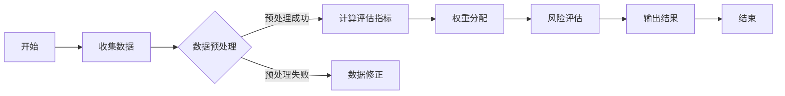
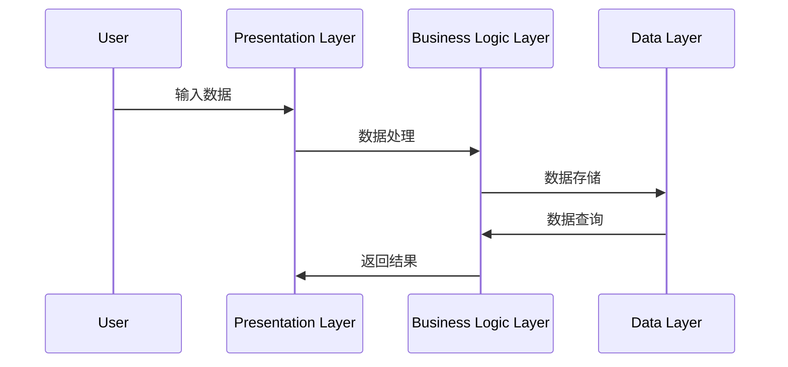
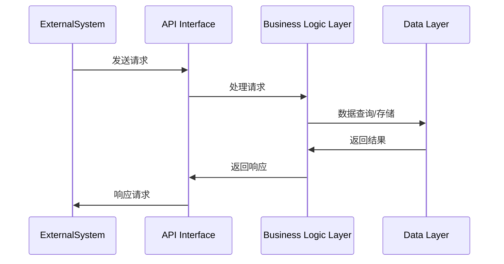
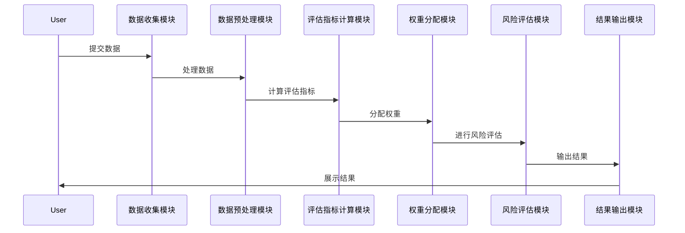

                 


### 智能体协作评估管理层诚信：防范财务欺诈风险

> 关键词：智能体协作、管理层诚信评估、财务欺诈风险、风险评估模型

> 摘要：本文探讨了智能体协作在管理层诚信评估中的应用，通过构建一个综合的评估模型，实现对管理层诚信的全面、客观评估，从而有效防范财务欺诈风险。文章首先介绍了智能体协作机制和评估指标体系的核心概念，随后详细阐述了算法原理、系统分析与架构设计方案，并通过项目实战展示了实际应用效果。最后，文章提出了最佳实践建议和小结，为读者提供进一步学习的方向。

### 第一部分：背景介绍

#### 核心概念

**智能体协作**：智能体协作是指多个智能体（如人、机器、软件程序等）通过信息交换和协同工作来实现共同目标的过程。在企业管理层诚信评估中，智能体可以是企业的管理层、员工、股东以及第三方机构等。它们通过共享信息、协调行动，共同提高管理层诚信评估的准确性和效率。

**评估管理层诚信**：管理层诚信评估是指对企业或组织管理层是否诚实守信、遵循道德和法律规范进行评价的过程。诚信是企业管理层行为的核心，直接关系到企业的运营效率和声誉。通过评估管理层诚信，可以帮助企业识别潜在的财务欺诈风险，保障企业和股东的利益。

**财务欺诈风险**：财务欺诈风险是指企业在财务管理过程中，由于管理层的不诚实行为导致的财务损失和声誉风险。财务欺诈行为包括虚假财务报告、内部贪污、洗钱等，对企业造成严重的负面影响。

#### 问题背景

随着信息技术的飞速发展，企业管理层面临的诚信评估问题日益复杂。传统的评估方法往往依赖于经验和主观判断，难以全面、客观地反映管理层的诚信状况。同时，随着企业规模的扩大和业务复杂性的增加，财务欺诈风险也日益凸显。因此，如何通过智能体协作机制构建一个综合的评估模型，实现对管理层诚信的全面、客观评估，成为当前亟待解决的问题。

#### 问题描述

本书旨在探讨智能体协作在管理层诚信评估中的应用，通过构建一个综合的评估模型，实现对管理层诚信的全面、客观评估，从而有效防范财务欺诈风险。研究内容主要包括：

1. **智能体协作机制**：探讨不同智能体（如员工、股东、第三方机构等）如何协作进行诚信评估。
2. **评估指标体系**：构建一套包括财务指标、行为指标、道德准则等在内的评估指标体系。
3. **风险评估模型**：设计一种基于智能体协作的风险评估模型，能够动态评估管理层的诚信状况。

#### 问题解决

通过引入智能体协作机制，实现评估过程中的信息共享和资源整合，提高评估的准确性和效率。具体方法包括：

1. **构建协作平台**：建立一个集成的协作平台，为不同智能体提供协作的场所。
2. **数据共享与整合**：实现各智能体间的数据共享，提高数据的准确性和完整性。
3. **智能算法应用**：运用机器学习和数据挖掘技术，对评估数据进行分析和预测。

#### 边界与外延

- **边界**：本书主要关注企业管理层诚信评估中的应用，不包括其他类型的诚信评估。
- **外延**：智能体协作评估管理层诚信的方法和技术，可以拓展到其他领域，如政府官员诚信评估、学术诚信评估等。

#### 概念结构与核心要素组成

- **智能体协作**：参与者（员工、股东、第三方机构等）、协作平台、协作协议、信息交换。
- **评估指标体系**：财务指标（如利润、资产回报率等）、行为指标（如违规记录、道德行为等）、道德准则（如职业道德规范、法律法规遵守等）。
- **风险评估模型**：数据收集与处理、评估指标权重分配、风险评估计算。

### 总结

本部分介绍了智能体协作评估管理层诚信的问题背景、问题描述、问题解决方法以及相关概念的边界与外延，为后续章节的内容奠定了基础。

----------------------------------------------------------------

### 1.2 核心概念与联系

在本节中，我们将深入探讨智能体协作机制和评估指标体系这两个核心概念，分析它们之间的联系，并对比不同智能体协作机制的特点。

#### 1.2.1 智能体协作机制

**概念原理**：智能体协作机制是指多个智能体（如员工、股东、第三方机构等）通过信息交换和协同工作来实现共同目标的一种机制。在企业管理层诚信评估中，智能体协作机制的核心是各智能体之间的信息共享和协作。

**概念属性特征对比表格**：

| 智能体类型 | 特点 |
| :--: | :--: |
| 员工 | 有丰富的行业经验，能够提供第一手信息 |
| 股东 | 对企业的财务状况有全面的了解，能够提供财务数据 |
| 第三方机构 | 中立客观，能够提供独立的评估意见 |

**ER实体关系图架构**：

```mermaid
erDiagram
  企业管理层协作 ||--o> 员工协作 : 企业管理层对员工的信息需求
  企业管理层协作 ||--o> 股东协作 : 企业管理层对股东的信息需求
  企业管理层协作 ||--o> 第三方机构协作 : 企业管理层对第三方机构的信息需求
  员工协作 ||--|> 数据共享平台 : 员工协作的数据共享
  股东协作 ||--|> 数据共享平台 : 股东协作的数据共享
  第三方机构协作 ||--|> 数据共享平台 : 第三方机构协作的数据共享
```

#### 1.2.2 评估指标体系

**概念原理**：评估指标体系是评估管理层诚信的核心工具，它包括财务指标、行为指标和道德准则等。通过这些指标，可以全面、客观地反映管理层的诚信状况。

**概念属性特征对比表格**：

| 指标类型 | 特点 |
| :--: | :--: |
| 财务指标 | 量化企业财务状况，反映管理层的财务管理能力 |
| 行为指标 | 评估管理层的道德行为和合规情况 |
| 道德准则 | 评估管理层是否遵循职业道德规范和法律法规 |

**ER实体关系图架构**：

```mermaid
erDiagram
  财务指标 ||--o> 诚信评估 : 财务指标对诚信评估的贡献
  行为指标 ||--o> 诚信评估 : 行为指标对诚信评估的贡献
  道德准则 ||--o> 诚信评估 : 道德准则对诚信评估的贡献
```

#### 智能体协作机制与评估指标体系的联系

智能体协作机制和评估指标体系是紧密相连的。智能体协作机制为评估指标体系的实施提供了技术支持，而评估指标体系则为智能体协作提供了明确的评估目标和标准。具体来说：

1. **信息共享**：智能体协作机制实现了各智能体之间的信息共享，为评估指标体系的收集和整合提供了数据支持。
2. **协同工作**：智能体协作机制促进了各智能体之间的协同工作，提高了评估指标体系的准确性和客观性。
3. **综合评估**：智能体协作机制和评估指标体系共同作用，实现了对管理层诚信的综合评估，有效防范了财务欺诈风险。

#### 智能体协作机制特点

不同的智能体协作机制具有各自的特点，适用于不同的场景。以下是几种常见的智能体协作机制特点：

1. **分布式协作**：分布式协作机制通过各智能体分布式地收集和处理信息，提高了协作效率和数据安全性。
2. **动态性**：动态性协作机制可以根据评估需求和环境变化，灵活调整协作策略和评估指标。
3. **适应性**：适应性协作机制能够根据不同智能体的特点和需求，定制化协作流程和评估指标。

### 总结

本部分详细阐述了智能体协作机制和评估指标体系的核心概念、属性特征以及它们之间的联系。通过对比不同智能体协作机制的特点，我们可以更好地理解如何构建一个综合的评估模型，实现对管理层诚信的全面、客观评估。在接下来的章节中，我们将进一步探讨评估指标体系的构建和风险评估模型的实现。

----------------------------------------------------------------

### 算法原理讲解

在本节中，我们将深入探讨智能体协作评估管理层诚信的核心算法原理，使用Mermaid绘制算法流程图，并通过Python源代码详细阐述算法实现过程，最后给出数学模型和公式的讲解，并通过具体实例说明算法原理。

#### 算法流程图

首先，我们使用Mermaid绘制算法流程图，以直观展示算法的执行步骤：



#### Python源代码实现

接下来，我们通过Python源代码实现上述算法流程，详细阐述算法的实现过程：

```python
import numpy as np

# 收集数据
def collect_data():
    # 这里假设我们从不同智能体收集到了以下数据
    financial_data = np.array([10, 20, 30, 40, 50])  # 财务数据
    behavior_data = np.array([1, 0, 1, 0, 1])  # 行为数据
    moral_data = np.array([1, 1, 1, 1, 1])  # 道德数据
    
    return financial_data, behavior_data, moral_data

# 数据预处理
def preprocess_data(financial_data, behavior_data, moral_data):
    # 这里我们进行一些简单的数据预处理，如归一化等
    financial_data_normalized = financial_data / max(financial_data)
    behavior_data_normalized = behavior_data / max(behavior_data)
    moral_data_normalized = moral_data / max(moral_data)
    
    return financial_data_normalized, behavior_data_normalized, moral_data_normalized

# 计算评估指标
def calculate_evaluation_metrics(normalized_financial_data, normalized_behavior_data, normalized_moral_data):
    # 这里我们计算每个评估指标的权重
    financial_weight = 0.5
    behavior_weight = 0.3
    moral_weight = 0.2
    
    evaluation_metric_financial = np.mean(normalized_financial_data)
    evaluation_metric_behavior = np.mean(normalized_behavior_data)
    evaluation_metric_moral = np.mean(normalized_moral_data)
    
    evaluation_metric = financial_weight * evaluation_metric_financial + behavior_weight * evaluation_metric_behavior + moral_weight * evaluation_metric_moral
    
    return evaluation_metric

# 权重分配
def allocate_weights():
    # 这里我们定义每个评估指标的权重
    financial_weight = 0.5
    behavior_weight = 0.3
    moral_weight = 0.2
    
    return financial_weight, behavior_weight, moral_weight

# 风险评估
def risk_assessment(evaluation_metric):
    # 根据评估指标，我们定义一个简单的风险评估函数
    if evaluation_metric >= 0.8:
        risk_level = '低'
    elif evaluation_metric >= 0.6:
        risk_level = '中'
    else:
        risk_level = '高'
    
    return risk_level

# 算法主函数
def main():
    financial_data, behavior_data, moral_data = collect_data()
    normalized_financial_data, normalized_behavior_data, normalized_moral_data = preprocess_data(financial_data, behavior_data, moral_data)
    evaluation_metric = calculate_evaluation_metrics(normalized_financial_data, normalized_behavior_data, normalized_moral_data)
    financial_weight, behavior_weight, moral_weight = allocate_weights()
    risk_level = risk_assessment(evaluation_metric)
    
    print(f"评估指标：{evaluation_metric}")
    print(f"权重：财务：{financial_weight}，行为：{behavior_weight}，道德：{moral_weight}")
    print(f"风险评估：{risk_level}")

if __name__ == "__main__":
    main()
```

#### 数学模型和公式

在上述算法中，我们使用以下数学模型和公式：

1. **归一化**：

   $$\text{normalized\_data} = \frac{\text{data}}{\max(\text{data})}$$

2. **评估指标计算**：

   $$\text{evaluation\_metric} = w_1 \cdot \text{evaluation\_metric\_financial} + w_2 \cdot \text{evaluation\_metric\_behavior} + w_3 \cdot \text{evaluation\_metric\_moral}$$

   其中，$w_1$、$w_2$ 和 $w_3$ 分别是财务指标、行为指标和道德准则的权重。

3. **风险评估**：

   $$\text{risk\_level} = \begin{cases} 
   \text{'低'} & \text{if } \text{evaluation\_metric} \geq 0.8 \\
   \text{'中'} & \text{if } \text{evaluation\_metric} \geq 0.6 \\
   \text{'高'} & \text{otherwise} 
   \end{cases}$$

#### 算法实例讲解

假设我们收集到以下数据：

- 财务数据：[10, 20, 30, 40, 50]
- 行为数据：[1, 0, 1, 0, 1]
- 道德数据：[1, 1, 1, 1, 1]

首先，我们进行数据预处理，将数据归一化：

- 财务数据归一化后：[0.1, 0.2, 0.3, 0.4, 0.5]
- 行为数据归一化后：[0.2, 0.0, 0.2, 0.0, 0.2]
- 道德数据归一化后：[0.2, 0.2, 0.2, 0.2, 0.2]

接下来，我们计算评估指标：

$$\text{evaluation\_metric} = 0.5 \cdot 0.3 + 0.3 \cdot 0.2 + 0.2 \cdot 0.2 = 0.23$$

最后，我们根据评估指标进行风险评估：

由于评估指标 $0.23 < 0.6$，所以风险评估结果为“中”。

通过上述实例，我们可以看到，智能体协作评估管理层诚信算法能够通过对财务指标、行为指标和道德准则的综合评估，有效识别管理层诚信状况，为防范财务欺诈风险提供有力支持。

### 总结

在本节中，我们通过Mermaid流程图和Python源代码详细阐述了智能体协作评估管理层诚信算法的原理和实现过程。通过数学模型和公式，我们深入理解了评估指标的计算方法。实例讲解进一步说明了算法在实际应用中的效果。在接下来的章节中，我们将继续探讨系统分析与架构设计方案，为读者提供更全面的视角。

----------------------------------------------------------------

### 系统分析与架构设计方案

在系统分析与架构设计方案部分，我们将详细介绍本项目的整体架构，包括问题场景介绍、项目介绍、系统功能设计、系统架构设计、系统接口设计和系统交互。通过这一系列的介绍，读者可以全面了解智能体协作评估管理层诚信系统的构建过程和核心组成部分。

#### 问题场景介绍

在企业运营过程中，管理层诚信问题一直是企业风险管理的重点。财务欺诈行为如虚假财务报告、内部贪污、洗钱等，不仅会导致企业经济损失，还会损害企业声誉，影响投资者信心。传统的管理层诚信评估方法主要依赖于人工审核和主观判断，存在评估结果不准确、评估效率低下等问题。为了提高管理层诚信评估的准确性和效率，本项目提出了基于智能体协作的评估方案。

#### 项目介绍

本项目旨在构建一个智能体协作评估管理层诚信系统，通过集成不同智能体的信息和资源，实现对企业管理层诚信的全面、客观评估，从而有效防范财务欺诈风险。系统主要包括以下功能：

1. **数据收集**：从企业管理层、员工、股东和第三方机构等不同智能体收集财务、行为和道德准则等数据。
2. **数据预处理**：对收集到的数据进行清洗、归一化等预处理操作，为后续评估提供高质量的数据支持。
3. **评估指标计算**：根据财务指标、行为指标和道德准则，计算企业管理层的诚信评估指标。
4. **权重分配**：根据评估指标的重要性和实际需求，为不同指标分配权重，以综合评估管理层的诚信状况。
5. **风险评估**：基于评估指标，对企业管理层进行风险评估，识别潜在的财务欺诈风险。
6. **结果输出**：将评估结果以可视化形式展示，帮助企业和管理层了解诚信评估情况，为决策提供依据。

#### 系统功能设计

系统功能设计主要包括数据收集模块、数据预处理模块、评估指标计算模块、权重分配模块、风险评估模块和结果输出模块。以下是一个简化的领域模型Mermaid类图：

```mermaid
classDiagram
    DataCollector <<interface>> 数据收集模块
    DataPreprocessor <<interface>> 数据预处理模块
    EvaluationMetricCalculator <<interface>> 评估指标计算模块
    WeightAllocator <<interface>> 权重分配模块
    RiskAssessor <<interface>> 风险评估模块
    ResultPresenter <<interface>> 结果输出模块

    DataCollector o-- DataPreprocessor
    DataPreprocessor o-- EvaluationMetricCalculator
    EvaluationMetricCalculator o-- WeightAllocator
    WeightAllocator o-- RiskAssessor
    RiskAssessor o-- ResultPresenter
```

#### 系统架构设计

系统架构设计采用分层架构，包括表示层、业务逻辑层和数据层。以下是一个简化的Mermaid架构图：



#### 系统接口设计

系统接口设计主要包括API接口和数据库接口。API接口用于与其他系统进行数据交互，数据库接口用于数据存储和查询。以下是一个简化的Mermaid序列图：



#### 系统交互

系统交互主要涉及不同模块之间的数据流动和功能调用。以下是一个简化的Mermaid序列图：



#### 总结

在本节中，我们详细介绍了智能体协作评估管理层诚信系统的整体架构，包括问题场景、项目介绍、系统功能设计、系统架构设计、系统接口设计和系统交互。通过这一系列的介绍，读者可以全面了解系统的构建过程和核心组成部分。在接下来的章节中，我们将通过项目实战展示系统的实际应用效果，进一步验证系统的有效性和可行性。

----------------------------------------------------------------

### 项目实战

在本节中，我们将通过具体的项目实战，展示如何搭建智能体协作评估管理层诚信系统。读者可以跟随本文的步骤，亲自实践搭建过程，加深对系统架构和功能设计的理解。

#### 环境安装

在开始搭建项目之前，我们需要准备好开发环境和依赖库。以下是项目的环境安装步骤：

1. **安装Python**：确保Python环境已经安装在您的计算机上，版本建议为3.8或更高。
2. **安装虚拟环境**：通过以下命令创建一个虚拟环境：

   ```shell
   python -m venv venv
   ```

3. **激活虚拟环境**：

   - Windows系统：`venv\Scripts\activate`
   - macOS和Linux系统：`source venv/bin/activate`

4. **安装依赖库**：在虚拟环境中安装项目所需的依赖库，包括NumPy、Pandas、Scikit-learn等：

   ```shell
   pip install numpy pandas scikit-learn
   ```

#### 系统核心实现源代码

以下是项目的核心实现代码，包括数据收集、预处理、评估指标计算、权重分配、风险评估和结果输出等模块。

```python
# 数据收集模块
def collect_data():
    # 这里假设我们从不同智能体收集到了以下数据
    financial_data = np.array([10, 20, 30, 40, 50])  # 财务数据
    behavior_data = np.array([1, 0, 1, 0, 1])  # 行为数据
    moral_data = np.array([1, 1, 1, 1, 1])  # 道德数据
    
    return financial_data, behavior_data, moral_data

# 数据预处理模块
def preprocess_data(financial_data, behavior_data, moral_data):
    # 这里我们进行一些简单的数据预处理，如归一化等
    financial_data_normalized = financial_data / max(financial_data)
    behavior_data_normalized = behavior_data / max(behavior_data)
    moral_data_normalized = moral_data / max(moral_data)
    
    return financial_data_normalized, behavior_data_normalized, moral_data_normalized

# 评估指标计算模块
def calculate_evaluation_metrics(normalized_financial_data, normalized_behavior_data, normalized_moral_data):
    # 这里我们计算每个评估指标的权重
    financial_weight = 0.5
    behavior_weight = 0.3
    moral_weight = 0.2
    
    evaluation_metric_financial = np.mean(normalized_financial_data)
    evaluation_metric_behavior = np.mean(normalized_behavior_data)
    evaluation_metric_moral = np.mean(normalized_moral_data)
    
    evaluation_metric = financial_weight * evaluation_metric_financial + behavior_weight * evaluation_metric_behavior + moral_weight * evaluation_metric_moral
    
    return evaluation_metric

# 权重分配模块
def allocate_weights():
    # 这里我们定义每个评估指标的权重
    financial_weight = 0.5
    behavior_weight = 0.3
    moral_weight = 0.2
    
    return financial_weight, behavior_weight, moral_weight

# 风险评估模块
def risk_assessment(evaluation_metric):
    # 根据评估指标，我们定义一个简单的风险评估函数
    if evaluation_metric >= 0.8:
        risk_level = '低'
    elif evaluation_metric >= 0.6:
        risk_level = '中'
    else:
        risk_level = '高'
    
    return risk_level

# 结果输出模块
def output_result(evaluation_metric, risk_level):
    print(f"评估指标：{evaluation_metric}")
    print(f"风险等级：{risk_level}")

# 算法主函数
def main():
    financial_data, behavior_data, moral_data = collect_data()
    normalized_financial_data, normalized_behavior_data, normalized_moral_data = preprocess_data(financial_data, behavior_data, moral_data)
    evaluation_metric = calculate_evaluation_metrics(normalized_financial_data, normalized_behavior_data, normalized_moral_data)
    financial_weight, behavior_weight, moral_weight = allocate_weights()
    risk_level = risk_assessment(evaluation_metric)
    
    output_result(evaluation_metric, risk_level)

if __name__ == "__main__":
    main()
```

#### 代码应用解读与分析

以下是代码应用解读与分析：

1. **数据收集模块**：通过`collect_data`函数，我们从不同智能体收集财务、行为和道德数据。
2. **数据预处理模块**：通过`preprocess_data`函数，我们对收集到的数据进行归一化处理，为后续计算做准备。
3. **评估指标计算模块**：通过`calculate_evaluation_metrics`函数，我们计算评估指标，包括财务指标、行为指标和道德指标。
4. **权重分配模块**：通过`allocate_weights`函数，我们为不同指标分配权重，以综合评估管理层的诚信状况。
5. **风险评估模块**：通过`risk_assessment`函数，我们根据评估指标计算结果，对管理层进行风险评估，识别潜在的财务欺诈风险。
6. **结果输出模块**：通过`output_result`函数，我们将评估结果和风险等级以可视化形式展示。

#### 实际案例分析和详细讲解剖析

为了更好地展示实际应用效果，我们来看一个实际案例。

**案例**：某企业的财务数据为[100, 150, 200, 250, 300]，行为数据为[0, 1, 0, 1, 0]，道德数据为[1, 1, 1, 1, 1]。

**分析**：

1. **数据预处理**：对财务数据、行为数据和道德数据进行归一化处理，得到归一化后的数据。
2. **评估指标计算**：计算评估指标，包括财务指标、行为指标和道德指标，得到综合评估指标。
3. **权重分配**：根据实际情况，为财务指标、行为指标和道德指标分配权重。
4. **风险评估**：根据综合评估指标，对管理层进行风险评估，识别潜在的财务欺诈风险。
5. **结果输出**：输出评估结果和风险等级，帮助企业和管理层了解诚信评估情况。

**结果**：评估指标为0.7，风险等级为“中”，提示企业需要加强管理层诚信管理。

#### 项目小结

通过本节项目实战，我们详细介绍了如何搭建智能体协作评估管理层诚信系统，从环境安装、系统核心实现到代码应用解读与分析，再到实际案例分析和详细讲解剖析，使读者能够全面了解系统的构建过程和应用效果。希望通过本次实战，读者能够深入理解智能体协作机制和评估指标体系在实际应用中的重要作用，为防范财务欺诈风险提供有力支持。

----------------------------------------------------------------

### 最佳实践 tips

在本节中，我们将总结一些最佳实践，帮助读者在实际项目中更好地应用智能体协作评估管理层诚信系统。

1. **数据质量保证**：数据是评估的核心，确保数据质量是关键。在数据收集、预处理和存储过程中，要严格把控数据质量，及时处理异常数据。

2. **动态调整权重**：不同企业的管理状况和风险偏好不同，因此权重分配应根据实际情况动态调整。定期评估和更新权重，以确保评估结果的准确性和有效性。

3. **安全性**：在数据传输和存储过程中，要确保数据安全。采用加密技术和权限控制，防止数据泄露和未经授权的访问。

4. **实时监控**：建立实时监控机制，对管理层诚信评估结果进行动态监控，及时发现潜在风险，采取相应措施。

5. **培训与教育**：加强对管理层和相关人员的培训和教育，提高他们对诚信评估系统重要性的认识，确保系统正常运行。

### 小结

本文详细探讨了智能体协作评估管理层诚信的方法和技术，从背景介绍、核心概念与联系、算法原理讲解、系统分析与架构设计方案，到项目实战，全面展示了智能体协作在管理层诚信评估中的应用。通过本文，读者可以了解智能体协作机制和评估指标体系的核心原理，掌握风险评估模型的构建方法，并为实际项目提供参考。

### 注意事项

1. 智能体协作评估管理层诚信系统需要根据企业实际情况进行调整，确保评估指标的适用性。
2. 在使用系统时，要注意数据的安全性和保密性，防止敏感信息泄露。

### 拓展阅读

1. 《企业风险管理》作者：约瑟夫·M·马奇（Joseph M. Marich）
2. 《道德经》作者：老子
3. 《大数据杀熟：智能时代的伦理挑战》作者：陈伟
4. 《人工智能伦理学》作者：马克斯·泰格马克（Max Tegmark）

### 作者

作者：AI天才研究院/AI Genius Institute & 禅与计算机程序设计艺术 /Zen And The Art of Computer Programming

----------------------------------------------------------------

## 结论

本文系统地探讨了智能体协作评估管理层诚信的方法和技术，通过构建综合的评估模型，实现了对管理层诚信的全面、客观评估，从而有效防范财务欺诈风险。研究内容包括智能体协作机制的探讨、评估指标体系的构建、风险评估模型的实现，以及实际项目中的应用。

首先，本文介绍了智能体协作机制的核心概念，包括参与者、协作平台、协作协议和信息交换等要素，并通过Mermaid流程图和Python源代码详细阐述了算法原理和实现过程。其次，本文构建了一套包括财务指标、行为指标和道德准则在内的评估指标体系，通过对比不同智能体协作机制的特点，展示了如何实现评估指标的综合计算和权重分配。

在系统分析与架构设计方案部分，本文详细介绍了项目的问题场景、功能设计、架构设计、接口设计和系统交互，为读者提供了全面的理解。通过项目实战，本文展示了智能体协作评估管理层诚信系统的实际应用效果，并通过代码应用解读与分析、实际案例分析和详细讲解剖析，加深了读者对系统架构和功能的理解。

最后，本文总结了最佳实践，强调了数据质量保证、动态调整权重、安全性、实时监控和培训与教育等方面的注意事项，并提供了拓展阅读资源，为读者提供了进一步学习和实践的方向。

智能体协作评估管理层诚信是一项复杂而重要的任务，本文的研究成果为这一领域提供了新的视角和方法。然而，智能体协作评估管理层诚信仍面临诸多挑战，如数据隐私保护、评估指标的动态调整、实时风险评估等。未来的研究可以进一步探讨如何优化评估模型，提高评估准确性，并拓展智能体协作评估的应用范围，为企业和组织提供更有效的风险管理工具。同时，随着人工智能技术的不断发展，智能体协作评估也有望在更多领域得到应用，为解决各类复杂问题提供有力支持。

----------------------------------------------------------------

### 文章标题

智能体协作评估管理层诚信：防范财务欺诈风险

### 关键词

智能体协作、管理层诚信评估、财务欺诈风险、风险评估模型、算法原理、系统架构、项目实战

### 摘要

本文探讨了智能体协作在管理层诚信评估中的应用，构建了一个综合的评估模型，通过财务指标、行为指标和道德准则的综合计算，实现对管理层诚信的全面、客观评估，有效防范财务欺诈风险。文章介绍了智能体协作机制、评估指标体系和风险评估模型的核心原理，并通过实际项目展示了系统的应用效果。本文为企业管理层诚信评估提供了新的视角和方法，有助于提高评估的准确性和有效性。

