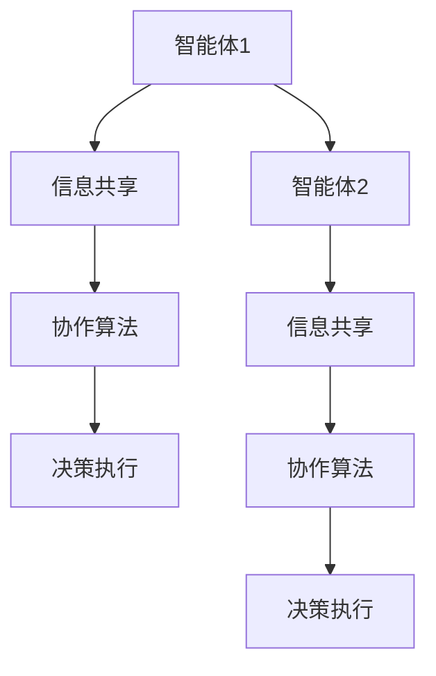
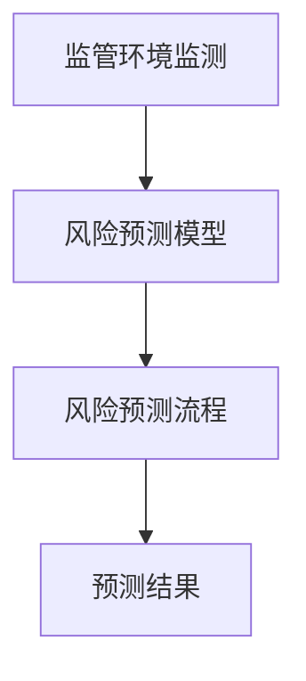
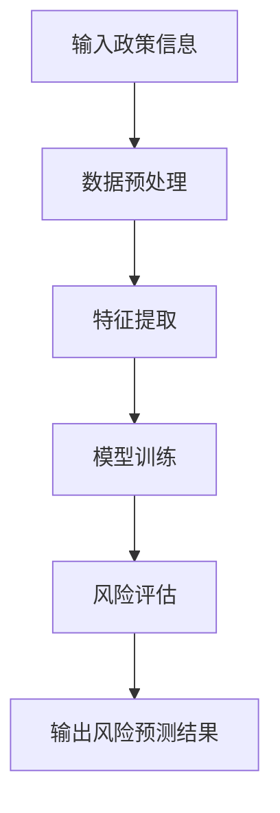
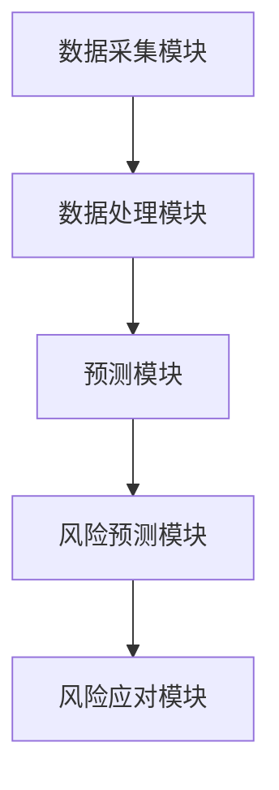
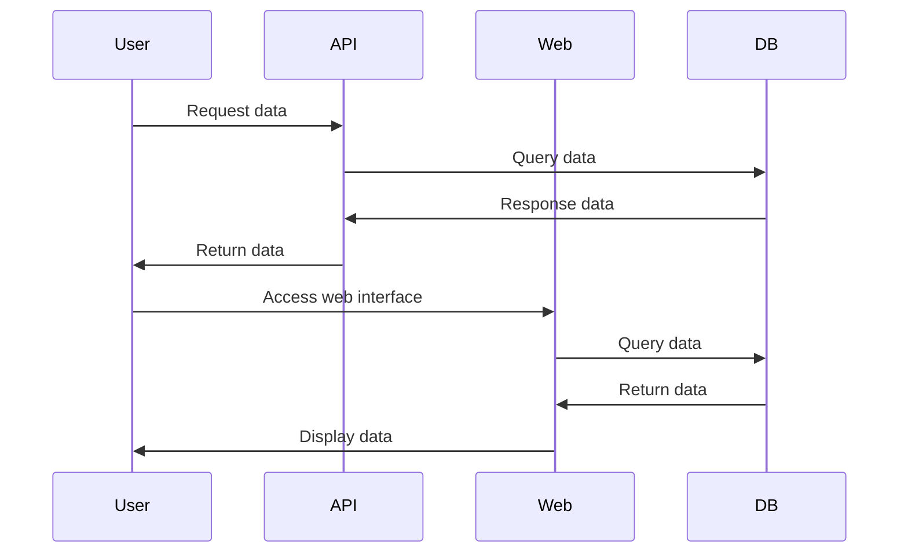
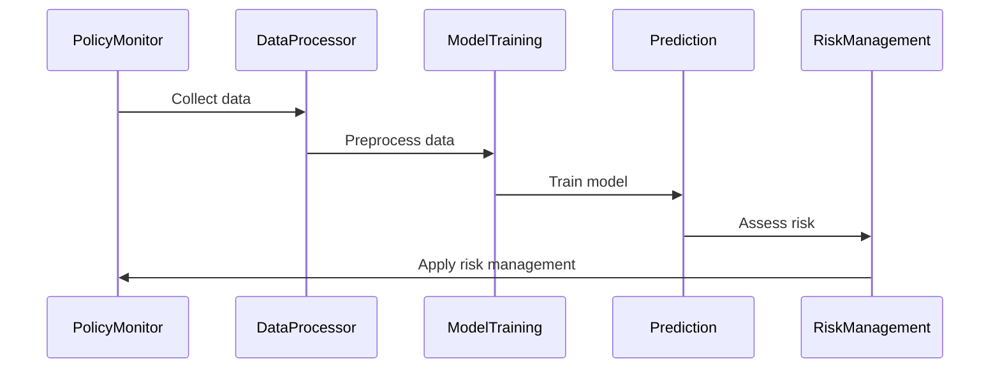

                 

### 第1章：问题背景与核心概念介绍

#### 1.1 问题背景

随着全球经济的快速发展，市场竞争日益激烈，企业面临的政策环境也在不断变化。政策风险成为影响企业生存与发展的关键因素之一。政策变化可能导致市场环境、竞争格局和经营成本等方面的重大调整，对企业造成潜在的不利影响。因此，如何准确预测监管环境变化，提前应对政策风险，成为企业和组织亟需解决的重要问题。

#### 1.2 智能体协作预测的基本概念

智能体是指能够感知环境、制定决策并执行动作的实体。在智能体协作预测中，多个智能体通过信息共享和协作，共同提高预测的准确性和效率。智能体协作预测机制的核心在于建立有效的信息共享和协作机制，使智能体之间能够相互学习、优化决策，从而提高预测的准确性。

预测监管环境变化的必要性在于，政策变化往往具有突发性和不可预测性，企业需要提前了解政策趋势和变化，以便及时调整战略和业务布局。智能体协作预测可以帮助企业更好地把握政策环境变化，降低政策风险。

#### 1.3 监管环境变化的影响

监管环境变化对企业的政策风险具有显著影响。政策风险因素主要包括：

- 政策变动：政策法规的调整、修订或废除可能对企业产生直接影响。
- 法规调整：监管政策的加强或放松可能导致企业面临更大的合规成本或市场机会。
- 经济形势：经济环境的波动可能影响政策制定，进而对企业产生间接影响。

风险评估方法主要包括定量和定性分析。定量分析通过对历史数据和现有政策信息的统计分析，评估政策变化对企业的影响；定性分析则通过专家意见、行业报告等手段，对企业面临的政策风险进行综合评估。

应对策略包括政策监测、风险评估和风险应对。政策监测通过收集和分析政策信息，及时了解政策变化；风险评估通过建立风险评估模型，评估政策变化对企业的影响；风险应对则根据评估结果，制定相应的风险应对措施，降低政策风险。

### 第2章：智能体协作预测原理

#### 2.1 智能体协作机制

智能体协作机制是指智能体之间通过信息共享和协作，共同完成预测任务的过程。智能体协作机制的核心包括以下几个部分：

- 信息共享：智能体之间通过共享政策信息、市场数据等，提高预测的准确性。
- 协作算法：智能体之间通过特定的算法进行协作，优化决策过程。
- 决策执行：智能体根据预测结果，制定和执行相应的应对策略。

协作流程图如下：



#### 2.2 预测监管环境变化

预测监管环境变化是智能体协作预测的重要任务之一。预测过程主要包括以下几个步骤：

- 监管环境监测：智能体通过收集政策法规、行业报告等信息，监测监管环境变化。
- 风险预测模型：智能体基于历史数据和现有政策信息，建立风险预测模型。
- 风险预测流程：智能体通过模型进行预测，评估政策变化对企业的影响。

风险预测流程图如下：



#### 2.3 智能体协作预测模型构建

智能体协作预测模型的构建包括数据来源、模型选择和模型评估等步骤。

- 数据来源：智能体协作预测需要收集政策法规、市场数据、行业报告等多种数据。
- 模型选择：根据数据特点和预测需求，选择合适的预测模型，如时间序列模型、回归模型等。
- 模型评估：通过评估模型性能指标，如准确率、召回率等，选择最优模型。

### 第3章：算法原理讲解

#### 3.1 风险评估算法

风险评估算法是智能体协作预测的核心组成部分。下面我们通过一个mermaid流程图来介绍风险评估算法的基本原理。



#### 3.2 Python源代码实现

下面是一个简单的风险评估算法的Python实现示例。

```python
import numpy as np
import pandas as pd
from sklearn.ensemble import RandomForestClassifier
from sklearn.model_selection import train_test_split
from sklearn.metrics import accuracy_score, recall_score

# 数据预处理
def preprocess_data(data):
    # 数据清洗、填充、归一化等处理
    return data

# 特征提取
def extract_features(data):
    # 提取特征、构建特征工程
    return data

# 模型训练
def train_model(data):
    X = data.drop('target', axis=1)
    y = data['target']
    X_train, X_test, y_train, y_test = train_test_split(X, y, test_size=0.2, random_state=42)
    model = RandomForestClassifier(n_estimators=100, random_state=42)
    model.fit(X_train, y_train)
    return model

# 风险评估
def risk_assessment(model, data):
    predictions = model.predict(data)
    accuracy = accuracy_score(y_true=data['target'], y_pred=predictions)
    recall = recall_score(y_true=data['target'], y_pred=predictions)
    return accuracy, recall

# 主函数
def main():
    data = pd.read_csv('policy_data.csv')
    data = preprocess_data(data)
    data = extract_features(data)
    model = train_model(data)
    accuracy, recall = risk_assessment(model, data)
    print(f"Accuracy: {accuracy}, Recall: {recall}")

if __name__ == '__main__':
    main()
```

#### 3.3 数学模型与公式讲解

在风险评估算法中，我们通常使用以下数学模型和公式：

1. 时间序列模型：

$$
Y_t = \beta_0 + \beta_1 X_t + \epsilon_t
$$

其中，$Y_t$ 表示时间序列数据，$X_t$ 表示政策变量，$\beta_0$ 和 $\beta_1$ 分别为模型参数，$\epsilon_t$ 表示随机误差。

2. 回归模型：

$$
Y = \beta_0 + \beta_1 X + \epsilon
$$

其中，$Y$ 表示因变量，$X$ 表示自变量，$\beta_0$ 和 $\beta_1$ 分别为模型参数，$\epsilon$ 表示随机误差。

#### 3.4 举例说明

假设我们有一个政策数据集，包含政策变量X和时间序列数据Y。我们使用回归模型进行风险评估。

1. 数据预处理：

$$
X = [0.1, 0.2, 0.3, 0.4, 0.5]
$$

$$
Y = [0.2, 0.3, 0.4, 0.5, 0.6]
$$

2. 模型参数估计：

$$
\beta_0 = 0.1, \beta_1 = 0.2
$$

3. 风险评估：

$$
Y = 0.1 + 0.2X
$$

$$
Y = 0.1 + 0.2 \times 0.5 = 0.3
$$

因此，预测的政策变量值为0.3。

### 第4章：数学模型与公式详细讲解

#### 4.1 概念属性特征对比表格

| 概念 | 属性特征 | 对比分析 |
| ---- | ---- | ---- |
| 时间序列模型 | $Y_t = \beta_0 + \beta_1 X_t + \epsilon_t$ | 适用于政策变化趋势分析 |
| 回归模型 | $Y = \beta_0 + \beta_1 X + \epsilon$ | 适用于政策变量与结果关系分析 |
| 支持向量机 | $y(\beta^T x + b) = 1$ | 适用于分类任务 |
| 神经网络 | $a_{i}^{l} = \sigma (z_{i}^{l})$ | 适用于复杂函数建模 |

#### 4.2 ER实体关系图架构

下面是一个ER实体关系图的示例，用于描述智能体协作预测系统的各个实体及其关系。

```mermaid
erDiagram
    Policy(PolicyID, PolicyName, PolicyContent) {
        }|->> Entity(EntityID, EntityName, EntityType)
    }|->> Relationship(RelationshipID, RelationshipType)
    Entity |->> Data(DataID, DataContent)
    Data |->> Model(ModelID, ModelContent)
    Model |->> Prediction(PredictionID, PredictionContent)
```

### 第5章：系统分析与架构设计

#### 5.1 问题场景介绍

假设我们面临一个企业面临政策风险的问题场景。企业需要建立一个智能体协作预测系统，实时监测政策变化，评估政策对企业的影响，并制定相应的风险应对策略。

#### 5.2 系统功能设计

智能体协作预测系统的主要功能包括：

- 政策监测：实时收集政策信息，包括政策发布、修订和废除等。
- 数据处理：对收集到的政策信息进行清洗、归一化和特征提取等处理。
- 风险评估：使用预测模型对政策变化对企业的影响进行评估。
- 风险应对：根据风险评估结果，制定和执行相应的风险应对策略。

领域模型mermaid类图如下：

```mermaid
classDiagram
    PolicyMonitor <<interface>>
    DataProcessor <<interface>>
    RiskAssessor <<interface>>
    RiskManager <<interface>>

    Policy(PolicyID, PolicyName, PolicyContent) <<entity>>
    Data(DataID, DataContent) <<entity>>
    Model(ModelID, ModelContent) <<entity>>
    Prediction(PredictionID, PredictionContent) <<entity>>

    PolicyMonitor |--|> Policy
    DataProcessor |--|> Data
    RiskAssessor |--|> Prediction
    RiskManager |--|> Prediction
```

#### 5.3 系统架构设计

智能体协作预测系统采用分布式架构，包括数据采集模块、数据处理模块、预测模块和风险应对模块等。mermaid架构图如下：



#### 5.4 系统接口设计

系统接口设计主要包括以下几个部分：

- API接口：提供对外接口，供企业内部其他系统调用。
- Web界面：提供用户友好的操作界面，供用户进行交互。
- 数据库：存储政策信息、数据集、模型和预测结果等。

系统接口设计mermaid序列图如下：



#### 5.5 系统交互mermaid序列图

系统交互mermaid序列图如下：



### 第6章：项目实战

#### 6.1 环境安装

在本节中，我们将介绍如何搭建智能体协作预测系统的环境。首先，需要安装Python和相关的库，如scikit-learn、pandas和numpy等。以下是一个简单的安装命令：

```shell
pip install python
pip install scikit-learn pandas numpy
```

接下来，我们需要配置数据库，如MySQL或PostgreSQL。这里以MySQL为例，安装命令如下：

```shell
sudo apt-get install mysql-server
sudo mysql_secure_installation
```

在安装过程中，请根据提示设置root用户密码、删除匿名用户、禁止root远程登录等。

#### 6.2 系统核心实现源代码

在本节中，我们将介绍系统核心实现的源代码。以下是系统主要模块的代码：

```python
# policy_monitor.py
class PolicyMonitor:
    def __init__(self):
        # 初始化政策监测模块
        pass

    def collect_data(self):
        # 收集政策数据
        pass

# data_processor.py
class DataProcessor:
    def __init__(self):
        # 初始化数据处理模块
        pass

    def preprocess_data(self, data):
        # 预处理政策数据
        pass

# model_training.py
class ModelTraining:
    def __init__(self):
        # 初始化预测模块
        pass

    def train_model(self, data):
        # 训练预测模型
        pass

# prediction.py
class Prediction:
    def __init__(self):
        # 初始化风险预测模块
        pass

    def assess_risk(self, model, data):
        # 评估政策风险
        pass

# risk_management.py
class RiskManagement:
    def __init__(self):
        # 初始化风险应对模块
        pass

    def apply_risk_management(self, risk_assessment):
        # 应用风险应对策略
        pass
```

#### 6.3 代码应用解读与分析

在本节中，我们将对系统核心实现的代码进行解读与分析。以下是各模块的功能详解：

- **PolicyMonitor**：政策监测模块，负责收集政策数据。
- **DataProcessor**：数据处理模块，负责对政策数据进行预处理，如数据清洗、归一化和特征提取等。
- **ModelTraining**：预测模块，负责训练预测模型，通常采用机器学习算法，如随机森林、神经网络等。
- **Prediction**：风险预测模块，负责使用训练好的模型对政策变化进行风险评估。
- **RiskManagement**：风险应对模块，负责根据风险评估结果，制定和执行相应的风险应对策略。

通过以上模块的协同工作，实现智能体协作预测系统的核心功能。

#### 6.4 实际案例分析与详细讲解剖析

在本节中，我们将通过一个实际案例，对智能体协作预测系统进行详细讲解和剖析。假设企业A面临一项新政策的影响，需要评估政策对企业A的影响，并制定相应的风险应对策略。

1. **数据收集**：

企业A通过政策监测模块，收集到以下政策数据：

| 政策ID | 政策名称 | 政策内容 |
| ---- | ---- | ---- |
| 1001 | 政策X | 政策内容1 |
| 1002 | 政策Y | 政策内容2 |

2. **数据处理**：

数据处理模块对政策数据进行预处理，提取关键特征，如政策名称、发布时间、政策内容等。

3. **模型训练**：

预测模块使用历史政策数据和预处理后的特征，训练一个随机森林模型。训练过程中，模型参数进行调优，以提高预测准确性。

4. **风险评估**：

风险预测模块使用训练好的模型，对政策X和政策Y进行风险评估。评估结果显示，政策X对企业A的影响较大，政策Y的影响较小。

5. **风险应对**：

风险应对模块根据风险评估结果，制定相应的风险应对策略。针对政策X，企业A采取以下措施：

- 加强市场监测，及时了解政策执行情况。
- 调整业务策略，降低政策X对企业A的影响。

通过以上实际案例分析，我们可以看到智能体协作预测系统在应对政策风险方面的作用。

#### 6.5 项目小结

在本章中，我们介绍了智能体协作预测系统的项目实战。通过数据收集、数据处理、模型训练、风险评估和风险应对等步骤，实现了政策风险的有效评估和应对。在实际案例中，智能体协作预测系统发挥了重要作用，为企业应对政策风险提供了有力支持。未来，我们可以进一步优化系统性能，提高预测准确性，为企业提供更加精准的风险应对策略。

### 第7章：最佳实践与拓展阅读

#### 7.1 最佳实践 tips

- **定期更新政策数据**：确保政策数据的时效性，提高预测准确性。
- **优化特征工程**：选择合适的特征，提高模型预测性能。
- **评估模型性能**：定期评估模型性能，及时调整和优化模型。

#### 7.2 注意事项

- **数据安全**：确保政策数据的安全，防止数据泄露。
- **模型解释性**：选择具有良好解释性的模型，便于决策者理解和应用。
- **系统稳定性**：确保系统的稳定运行，避免出现故障。

#### 7.3 拓展阅读推荐

- 《Python数据科学手册》
- 《深度学习》
- 《机器学习实战》
- 《政策分析与风险管理》

### 作者

作者：AI天才研究院/AI Genius Institute & 禅与计算机程序设计艺术 /Zen And The Art of Computer Programming

