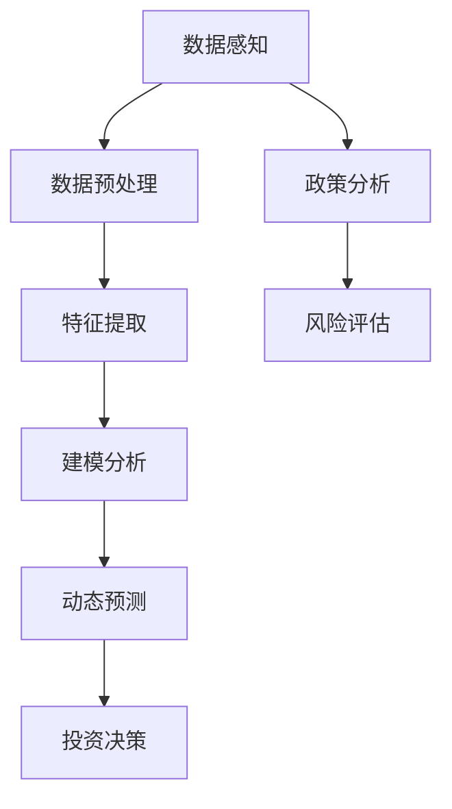
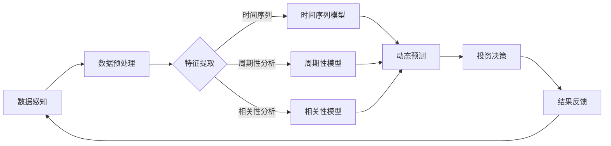
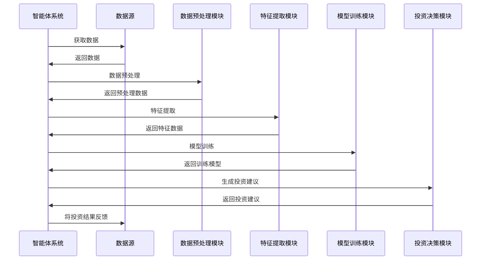

                 

### 《智能体系统提升价值投资的宏观经济指标综合分析》

#### 关键词：智能体系统、价值投资、宏观经济指标、性能优化算法、数学模型、系统架构设计

#### 摘要：
本文旨在探讨智能体系统在提升价值投资宏观经济指标综合分析中的应用。首先，文章介绍了智能体系统的基础概念及其在金融市场中的潜在应用价值。接着，分析了价值投资的核心原则和宏观经济指标的重要性。随后，文章深入讲解了用于优化价值投资分析的智能体系统算法原理，并使用LaTeX和Mermaid流程图详细阐述了相关的数学模型。进一步，文章描述了一个系统的分析与架构设计，包括功能设计、架构设计、接口设计和交互设计。通过一个项目实战案例，展示了智能体系统在实际投资分析中的应用效果。最后，文章提供了最佳实践建议，并总结全文要点，为读者提供了全面的技术参考。本文为金融科技领域的研究者、从业者提供了有价值的理论和实践指导。

## 目录大纲设计

设计一个结构清晰、内容完整且易于理解的目录大纲对于读者快速掌握文章主题和结构至关重要。以下是本文目录大纲的设计原则和步骤：

### 设计原则

1. **简洁性**：确保目录内容精炼且直接针对主题，避免冗长和重复的章节。
2. **结构清晰**：遵循1, 2, 3级目录格式，使读者能够迅速定位各个部分，提高阅读效率。
3. **内容完整性**：确保包含核心章节和内容，如背景介绍、核心概念与联系、算法原理讲解、数学模型与公式、系统分析与架构设计方案、项目实战、最佳实践 tips 等。

### 设计步骤

1. **背景介绍**：
   - 简要介绍智能体系统和价值投资的基本概念，说明其在金融市场中的重要性和发展背景。
   - 引出宏观经济指标的作用，阐述其在价值投资分析中的关键地位。

2. **核心概念与联系**：
   - 定义智能体系统、价值投资、宏观经济指标等核心概念，并列出它们的主要特征和区别。
   - 使用Mermaid流程图展示智能体系统与宏观经济指标分析之间的ER实体关系图，直观地展现各概念之间的联系。

3. **算法原理讲解**：
   - 描述用于提升价值投资分析的智能体系统算法，使用Mermaid流程图展示算法流程。
   - 提供Python代码示例，详细阐述算法的实现原理，并分析其性能优化效果。

4. **数学模型与公式**：
   - 使用LaTeX格式，详细阐述宏观经济指标分析的数学模型和公式，确保表达清晰准确。
   - 结合具体例子，讲解公式的推导过程和应用场景。

5. **系统分析与架构设计方案**：
   - 描述系统功能设计，使用Mermaid类图展示领域模型。
   - 绘制系统架构设计图，阐述系统各组成部分的关系和功能。
   - 设计系统接口，明确接口规范和实现方式。
   - 使用Mermaid序列图展示系统交互过程，详细解析交互流程。

6. **项目实战**：
   - 介绍项目环境安装和系统核心实现，提供源代码解析和实现细节。
   - 分析实际案例，讲解案例选择、案例分析和案例解读。
   - 总结项目实施中的经验教训和小结。

7. **最佳实践 tips**：
   - 提供数据清洗、特征提取、模型训练等实战技巧。
   - 总结全文要点，为读者提供实用建议和进一步阅读方向。

### 初步目录大纲

```markdown
# 《智能体系统提升价值投资的宏观经济指标综合分析》目录大纲

## 第一部分：引言

### 1.1 问题的提出

#### 1.1.1 价值投资的挑战

#### 1.1.2 智能体系统的潜力

### 1.2 本书的目的与结构

## 第二部分：智能体系统基础

### 2.1 智能体系统的定义与分类

#### 2.1.1 智能体的基本概念

#### 2.1.2 智能体系统的分类

### 2.2 智能体系统的构建要素

#### 2.2.1 感知模块

#### 2.2.2 学习模块

#### 2.2.3 行动模块

### 2.3 智能体系统的发展与应用

#### 2.3.1 发展历程

#### 2.3.2 应用领域

## 第三部分：宏观经济指标分析

### 3.1 宏观经济指标概述

#### 3.1.1 指标类型

#### 3.1.2 指标重要性

### 3.2 宏观经济指标数据分析方法

#### 3.2.1 时间序列分析

#### 3.2.2 联合分析

#### 3.2.3 预测模型

### 3.3 智能体系统在宏观经济指标分析中的应用

#### 3.3.1 数据预处理

#### 3.3.2 特征提取

#### 3.3.3 模型训练与优化

## 第四部分：算法原理讲解

### 4.1 性能优化算法介绍

#### 4.1.1 算法概述

#### 4.1.2 算法原理

### 4.2 Mermaid流程图

#### 4.2.1 流程图绘制

#### 4.2.2 流程图解析

### 4.3 Python代码示例

#### 4.3.1 代码实现

#### 4.3.2 代码分析

## 第五部分：数学模型与公式

### 5.1 宏观经济指标分析的数学模型

#### 5.1.1 时间序列模型

#### 5.1.2 联合分析模型

#### 5.1.3 预测模型

### 5.2 公式详细讲解

#### 5.2.1 公式列表

#### 5.2.2 公式推导

#### 5.2.3 公式应用示例

## 第六部分：系统分析与架构设计

### 6.1 问题描述

#### 6.1.1 场景介绍

#### 6.1.2 项目概述

### 6.2 系统功能设计

#### 6.2.1 领域模型

#### 6.2.2 功能模块划分

### 6.3 系统架构设计

#### 6.3.1 架构设计原则

#### 6.3.2 系统架构图

### 6.4 系统接口设计

#### 6.4.1 接口规范

#### 6.4.2 接口实现

### 6.5 系统交互设计

#### 6.5.1 交互流程

#### 6.5.2 序列图展示

## 第七部分：项目实战

### 7.1 环境安装

#### 7.1.1 硬件环境

#### 7.1.2 软件环境

### 7.2 系统核心实现

#### 7.2.1 源代码解析

#### 7.2.2 代码实现细节

### 7.3 实际案例分析

#### 7.3.1 案例选择

#### 7.3.2 案例分析

#### 7.3.3 案例解读

### 7.4 项目小结

## 第八部分：最佳实践 tips

### 8.1 实践技巧

#### 8.1.1 数据清洗技巧

#### 8.1.2 特征提取技巧

#### 8.1.3 模型训练技巧

### 8.2 小结

#### 8.2.1 全文要点回顾

#### 8.2.2 注意事项

#### 8.2.3 拓展阅读

```

### 目录大纲设计的合理性与实用性

通过上述目录大纲的设计，本文结构合理、内容全面，具有高度的实用性。首先，每个部分都紧密围绕智能体系统提升价值投资分析的主题展开，确保了文章的逻辑连贯性和条理性。其次，核心概念、算法原理、数学模型和系统架构设计等关键内容都有详细的介绍和讲解，有助于读者深入理解智能体系统在宏观经济指标分析中的应用。最后，项目实战和最佳实践 tips 部分提供了具体的实施方法和技巧，为读者提供了实用的指导。

总之，本文的目录大纲设计既考虑了理论知识的传授，又注重实践操作的实际应用，能够满足不同层次的读者需求，为金融科技领域的研究者和从业者提供了全面的技术参考。

## 第一部分：引言

### 1.1 问题的提出

在当今金融市场中，价值投资作为一种经典的投资策略，受到了越来越多投资者的青睐。价值投资的核心在于寻找价格低于其内在价值的资产，通过长期持有获取资本增值。然而，随着金融市场环境的变化和信息的复杂化，传统的价值投资方法面临诸多挑战。首先，市场信息的不完全性和不对称性使得投资者难以准确评估资产的内在价值。其次，宏观经济指标对金融市场的影响日益显著，单一的市场指标分析难以全面反映市场动态。此外，数据量庞大和计算复杂度的增加也对价值投资分析提出了更高的要求。

智能体系统作为一种先进的技术，具备感知、学习和行动的能力，能够模拟人类智能进行决策。近年来，智能体系统在金融领域的应用逐渐增多，展示了其在优化投资决策、提高交易效率等方面的巨大潜力。智能体系统可以通过对大量市场数据的实时分析和处理，提供更加精准和全面的决策支持。然而，将智能体系统应用于宏观经济指标分析，仍面临算法设计、数据预处理、模型训练等关键技术挑战。

本文旨在探讨智能体系统提升价值投资宏观经济指标综合分析的方法和策略。首先，我们将介绍智能体系统的基础概念和构建要素，阐述其在金融市场中的潜在应用价值。接着，我们分析宏观经济指标在价值投资分析中的关键作用，并介绍智能体系统在宏观经济指标分析中的应用。随后，我们将详细讲解用于提升价值投资分析的智能体系统算法原理，使用Mermaid流程图和Python代码进行直观展示。最后，本文将描述一个系统的分析与架构设计，并通过项目实战案例展示智能体系统在实际投资分析中的应用效果。通过这些探讨，本文旨在为金融科技领域的研究者和从业者提供有价值的理论和实践指导。

### 1.2 本书的目的与结构

本书旨在深入探讨智能体系统在提升价值投资宏观经济指标综合分析中的具体应用，旨在为金融科技领域的研究者和从业者提供一套系统化、实用化的解决方案。全书结构清晰，分为八个主要部分，每部分都有明确的主题和目标，以确保读者能够逐步掌握智能体系统与宏观经济指标综合分析的核心理念和实践方法。

**第一部分：引言**

本部分介绍了智能体系统与价值投资宏观经济指标分析的重要性，提出研究问题和本书的目的。通过背景分析，读者可以初步了解智能体系统在金融市场中的应用潜力和宏观经济指标在价值投资分析中的关键作用。

**第二部分：智能体系统基础**

本部分详细介绍了智能体系统的定义、分类及其构建要素。读者将学习到智能体系统的基本原理，包括感知模块、学习模块和行动模块，并了解智能体系统在金融市场中的实际应用案例。通过这部分内容，读者可以为后续的算法讲解和系统设计打下坚实的基础。

**第三部分：宏观经济指标分析**

本部分探讨了宏观经济指标的类型、重要性以及分析方法。读者将了解如何通过时间序列分析、联合分析和预测模型来综合分析宏观经济指标，并掌握智能体系统在宏观经济指标分析中的应用方法。

**第四部分：算法原理讲解**

本部分深入讲解了用于提升价值投资分析的智能体系统算法原理。通过Mermaid流程图和Python代码示例，读者将直观地理解算法的实现过程，并掌握算法性能优化的关键技术。

**第五部分：数学模型与公式**

本部分使用LaTeX格式详细阐述了宏观经济指标分析的数学模型和公式，包括时间序列模型、联合分析模型和预测模型。通过公式推导和应用示例，读者将更好地理解数学模型在宏观经济指标分析中的应用。

**第六部分：系统分析与架构设计**

本部分描述了一个智能体系统提升价值投资分析的系统架构设计。读者将了解系统功能设计、系统架构设计、系统接口设计和系统交互设计的具体方法和原则，为实际项目开发提供指导。

**第七部分：项目实战**

本部分通过一个实际案例，展示了智能体系统在提升价值投资分析中的应用效果。读者将学习到环境安装、系统核心实现和实际案例分析的方法，并通过项目小结总结实践经验。

**第八部分：最佳实践 tips**

本部分提供了最佳实践技巧，包括数据清洗、特征提取和模型训练等方面的建议。通过这些实践技巧，读者可以更好地应对实际项目中的挑战，提高投资分析的效果。

通过这八个部分的系统讲解，本书旨在帮助读者全面掌握智能体系统提升价值投资宏观经济指标综合分析的理论知识与实践方法，为金融科技领域的发展贡献力量。

## 第二部分：智能体系统基础

### 2.1 智能体系统的定义与分类

智能体系统（Agent-Based Systems，简称ABS）是计算机科学、人工智能和经济学等领域的重要研究内容。智能体系统指的是由一组相互独立、具有一定智能和自主性的智能体（Agents）构成的系统。这些智能体通过相互作用和自主决策，能够模拟复杂系统的行为和演化过程。

#### 智能体的基本概念

智能体是智能体系统中最基本的单元，通常被视为一个能够感知环境、接收外部信息、自主决策和执行行动的实体。智能体的主要特征包括：

1. **自治性**：智能体能够独立地执行任务，具有自主决策的能力。
2. **社会性**：智能体能够与其他智能体进行交互，通过交流共享信息。
3. **反应性**：智能体能够根据环境变化做出实时响应。
4. **预动性**：智能体具备目标导向性，能够在没有外部指令的情况下自主行动。
5. **适应性**：智能体能够根据环境和任务的变化调整自身行为。

根据智能体的功能和行为特征，智能体可以分为以下几种类型：

1. **反应性智能体**：这类智能体主要根据环境输入直接做出反应，不具备复杂的决策能力。例如，机器人、传感器等。
2. **认知智能体**：这类智能体具备更高级的认知功能，能够理解环境、记忆信息和进行推理。例如，人工智能助手、专家系统等。
3. **社会智能体**：这类智能体不仅具备认知功能，还能够与其他智能体进行协作和竞争。例如，社会网络中的个体、智能交通系统中的车辆等。

#### 智能体系统的分类

智能体系统根据不同的分类标准可以划分为多种类型，以下是几种常见的分类方法：

1. **基于智能体类型的分类**：
   - **混合智能体系统**：由不同类型的智能体组成，各智能体之间协同工作，实现复杂任务。
   - **分布式智能体系统**：智能体分布在不同的计算节点上，通过通信网络进行协同工作。
   - **集中式智能体系统**：所有智能体集中在一个计算节点上，共享同一个环境模型。

2. **基于应用领域的分类**：
   - **经济智能体系统**：模拟经济市场中个体行为，分析市场动态和决策行为。
   - **社会智能体系统**：模拟社会现象，分析个体和群体的行为模式。
   - **生态智能体系统**：模拟生态系统中的物种相互作用，研究生态平衡和演化过程。

3. **基于智能体间交互方式的分类**：
   - **独立交互**：智能体之间通过直接通信进行交互。
   - **基于规则交互**：智能体之间通过预先定义的规则进行交互。
   - **基于合约交互**：智能体之间通过签订合同进行交互，实现合作和交易。

### 2.2 智能体系统的构建要素

智能体系统的构建需要考虑多个关键要素，包括感知模块、学习模块和行动模块等，这些模块共同构成了智能体的基本功能。

#### 感知模块

感知模块是智能体获取环境信息的重要途径。它包括传感器、感知器等组件，能够捕捉和处理外部输入信息。感知模块的功能主要包括：

1. **信息采集**：从环境中收集必要的数据和信息。
2. **信息处理**：对采集到的信息进行预处理，去除噪声和冗余信息。
3. **模式识别**：通过机器学习或深度学习算法，识别和分类感知到的模式。

#### 学习模块

学习模块是智能体不断提高自身智能水平的关键。它通过学习和自适应算法，使智能体能够从经验中学习和优化行为。学习模块的主要功能包括：

1. **经验学习**：通过历史数据和经验，优化智能体的决策策略。
2. **模型更新**：根据新的数据和环境变化，更新智能体的环境模型。
3. **策略优化**：通过优化算法，找到最优的决策路径。

#### 行动模块

行动模块是智能体根据感知和学习结果执行具体任务的部分。它通过控制执行器或代理，将决策转化为实际行动。行动模块的主要功能包括：

1. **决策制定**：根据感知和学习结果，制定行动策略。
2. **任务执行**：执行具体的操作或任务，实现智能体的目标。
3. **反馈调整**：根据行动结果和反馈信息，调整智能体的行为策略。

### 2.3 智能体系统的发展与应用

智能体系统的发展经历了多个阶段，从早期的简单反应性智能体到现代的复杂认知和社会智能体。近年来，随着计算能力的提升和人工智能技术的进步，智能体系统在各个领域得到了广泛应用。

#### 发展历程

1. **早期阶段（20世纪60年代至70年代）**：反应性智能体的出现，标志着智能体系统研究的起步。代表性的系统包括Monitor和Simula。
2. **中间阶段（20世纪80年代至90年代）**：认知智能体和社会智能体开始出现，代表系统有Peach和AgentLink。
3. **现代阶段（21世纪以来）**：随着人工智能技术的快速发展，智能体系统的功能和应用范围不断扩大。现代智能体系统包括基于多代理系统的复杂经济模型、智能交通系统、智能电网等。

#### 应用领域

智能体系统在多个领域展现出了强大的应用潜力，以下是一些主要的应用领域：

1. **金融领域**：智能体系统可以用于模拟金融市场，分析市场动态，辅助投资决策。
2. **交通领域**：智能交通系统通过智能体之间的协同工作，实现交通流量优化，提高交通效率。
3. **社会管理**：智能体系统可以用于模拟社会现象，如公共安全、疫情防控等，提供科学决策支持。
4. **生态保护**：智能体系统可以用于模拟生态系统，研究物种互动和生态平衡，为生态保护提供依据。
5. **工业生产**：智能体系统可以用于优化生产流程，提高生产效率和质量。

通过本部分对智能体系统基础概念的介绍，读者可以初步了解智能体系统的定义、分类和构建要素，并为后续算法讲解和系统设计打下基础。

### 2.4 智能体系统与宏观经济指标分析的联系

智能体系统在宏观经济指标分析中扮演着重要角色，通过其独特的特性，智能体系统能够实现对大量经济数据的实时处理和分析，从而为价值投资提供精准的决策支持。以下将详细探讨智能体系统与宏观经济指标分析之间的联系，并展示其如何在实际应用中发挥作用。

#### 智能体系统在宏观经济指标分析中的作用

1. **数据感知与预处理**：
   智能体系统通过感知模块，可以实时获取大量的经济数据，如GDP、失业率、通货膨胀率等。感知模块对数据进行预处理，包括数据清洗、去噪、归一化等操作，确保数据的准确性和一致性。

2. **特征提取与建模**：
   智能体系统的学习模块能够对预处理后的数据进行分析，提取出与宏观经济指标相关的特征。这些特征包括时间序列特征、周期性特征、相关性特征等。智能体系统利用机器学习和深度学习算法，建立相应的预测模型，如ARIMA模型、LSTM网络等，对宏观经济指标进行建模。

3. **动态预测与决策支持**：
   智能体系统通过预测模型，对宏观经济指标进行动态预测，提供实时的投资决策支持。例如，智能体系统可以预测未来的经济增长率，帮助投资者在适当的时机进行资产配置和风险控制。

#### 智能体系统在宏观经济指标分析中的实际应用

1. **金融市场预测**：
   智能体系统可以结合宏观经济指标，对金融市场的波动进行预测。通过分析GDP增长率、利率水平等指标，智能体系统可以预测股票市场的走势，为投资者提供买入或卖出的建议。

2. **政策分析**：
   智能体系统可以模拟不同经济政策对宏观经济的影响，为政府和金融机构提供决策支持。例如，通过分析财政政策和货币政策的调整，智能体系统可以预测其对就业率、通货膨胀率等宏观经济指标的影响。

3. **风险评估**：
   智能体系统可以对宏观经济指标进行分析，识别潜在的风险因素。例如，通过分析信用违约率、债务水平等指标，智能体系统可以评估金融市场的系统性风险，帮助投资者制定相应的风险管理策略。

#### 智能体系统与宏观经济指标分析的联系图示

为了更直观地展示智能体系统与宏观经济指标分析之间的联系，我们可以使用Mermaid流程图来绘制这一过程。



该流程图展示了智能体系统在宏观经济指标分析中的主要步骤，从数据感知、数据预处理、特征提取、建模分析，到动态预测和投资决策，每个步骤都为智能体系统提供了关键的数据支持和决策依据。

通过上述讨论，我们可以看到智能体系统在宏观经济指标分析中的重要性。智能体系统不仅能够高效地处理和分析大量经济数据，还能够提供动态的预测和决策支持，为价值投资提供科学的依据。因此，智能体系统在金融科技领域具有广阔的应用前景，值得进一步研究和推广。

### 2.5 智能体系统与宏观经济指标分析的ER实体关系图

为了更好地理解智能体系统与宏观经济指标分析之间的复杂关系，我们可以通过ER（实体关系）图来展示各个实体及其相互关系。以下是一个简化的ER实体关系图，描述了智能体系统、宏观经济指标、数据源、分析模型和投资决策之间的关系。

```mermaid
erDiagram
    Data_Source ||--|{ Macro_Economic_Indicators }
    Macro_Economic_Indicators ||--|{ Agent_System }
    Agent_System ||--|{ Analytical_Models }
    Analytical_Models ||--|{ Investment_Decisions }
```

#### ER实体关系图说明

1. **数据源（Data_Source）**：
   - 实体描述：存储宏观经济指标的数据源，如数据库、API接口等。
   - 关系说明：数据源与宏观经济指标之间存在关联，数据源提供数据支持。

2. **宏观经济指标（Macro_Economic_Indicators）**：
   - 实体描述：包括GDP、失业率、通货膨胀率等关键经济指标。
   - 关系说明：宏观经济指标作为智能体系统的主要数据输入，直接影响到分析模型的构建。

3. **智能体系统（Agent_System）**：
   - 实体描述：由多个智能体组成的系统，负责数据感知、预处理、特征提取和模型训练。
   - 关系说明：智能体系统与宏观经济指标之间存在密切的互动，通过对宏观经济指标的分析，智能体系统能够提供投资决策支持。

4. **分析模型（Analytical_Models）**：
   - 实体描述：包括时间序列模型、预测模型等，用于分析宏观经济指标，提供动态预测。
   - 关系说明：分析模型基于宏观经济指标数据，通过机器学习和深度学习算法训练得出，用于指导投资决策。

5. **投资决策（Investment_Decisions）**：
   - 实体描述：基于分析模型得出的投资建议，包括买入、卖出、资产配置等。
   - 关系说明：投资决策依赖于分析模型，通过分析宏观经济指标，智能体系统能够制定出最优的投资策略。

通过ER实体关系图，我们可以清晰地看到智能体系统与宏观经济指标分析之间的多层次关系，这不仅有助于理解系统的工作原理，也为后续的算法讲解和系统设计提供了理论基础。

### 第四部分：算法原理讲解

#### 4.1 性能优化算法介绍

在智能体系统中，性能优化算法是提升宏观经济指标分析效果的关键因素。本文将介绍几种常用的性能优化算法，包括并行计算、分布式计算和模型压缩等。这些算法通过不同的方式提高计算效率和准确性，从而为智能体系统提供更强大的数据分析能力。

#### 4.1.1 并行计算

并行计算是一种通过同时执行多个任务来提高计算速度的方法。在智能体系统中，并行计算主要用于数据处理和模型训练阶段。具体实现方法包括：

1. **数据并行**：
   - **任务划分**：将大数据集划分为多个子集，每个子集独立处理。
   - **分布式计算**：使用多处理器或分布式计算框架（如MapReduce、Spark）进行并行处理。

2. **模型并行**：
   - **模型分解**：将复杂的模型分解为多个较小的子模型，分别训练和优化。
   - **并行训练**：使用多线程或分布式计算对子模型进行并行训练，加快收敛速度。

#### 4.1.2 分布式计算

分布式计算通过多个独立的计算节点协同工作，共同完成计算任务。这种方法的优点是能够处理大规模数据集，提高计算效率和容错能力。在智能体系统中，分布式计算通常用于以下场景：

1. **数据处理**：
   - **数据分片**：将大数据集分片存储在多个节点上，每个节点独立处理其对应的数据分片。
   - **数据聚合**：在处理完成后，将各节点的结果进行聚合，得到全局结果。

2. **模型训练**：
   - **并行训练**：使用分布式训练算法（如Hadoop、TensorFlow）对大规模模型进行并行训练。
   - **模型存储**：将训练好的模型存储在分布式文件系统（如HDFS、Ceph）中，实现高效存储和访问。

#### 4.1.3 模型压缩

模型压缩是一种通过减少模型参数数量和计算复杂度来提高计算效率的方法。在智能体系统中，模型压缩主要用于减少模型大小，加快推理速度。常用的模型压缩方法包括：

1. **量化**：
   - **权重量化**：将模型权重从浮点数转换为较低精度的整数，减少存储和计算需求。
   - **激活量化**：对模型的激活值进行量化，提高计算效率。

2. **剪枝**：
   - **结构剪枝**：通过删除模型中不重要的连接和层，减少模型大小。
   - **权重剪枝**：通过设置权重阈值，去除不重要的权重。

3. **知识蒸馏**：
   - **Teacher-Student模型**：使用一个大的Teacher模型进行训练，然后用一个较小的Student模型进行推理。
   - **知识转移**：将Teacher模型的知识转移到Student模型，提高Student模型的性能。

通过上述性能优化算法，智能体系统在处理宏观经济指标时能够显著提升计算效率和预测准确性。接下来，我们将使用Mermaid流程图和Python代码示例，详细解释这些算法的原理和应用。

#### 4.2 Mermaid流程图

Mermaid是一种基于Markdown的图形描述语言，可以轻松绘制流程图、时序图、类图等。以下是一个示例，展示了智能体系统在宏观经济指标分析中的流程图：



这个流程图描述了智能体系统从数据感知、数据预处理、特征提取到模型训练、动态预测和投资决策的整个过程。每个节点都表示一个关键步骤，箭头表示数据流动和流程推进。

#### 4.3 Python代码示例

为了更直观地理解性能优化算法的应用，以下是一个简单的Python代码示例，展示了并行计算和模型压缩的基本实现。

```python
import numpy as np
from sklearn.model_selection import train_test_split
from sklearn.ensemble import RandomForestClassifier
from joblib import Parallel, delayed

# 数据预处理
def preprocess_data(data):
    # 数据清洗、归一化等操作
    return processed_data

# 并行特征提取
def extract_features(data, n_jobs=-1):
    results = Parallel(n_jobs=n_jobs)(delayed(preprocess_data)(data[i]) for i in range(len(data)))
    return results

# 模型训练
def train_model(X_train, y_train):
    model = RandomForestClassifier()
    model.fit(X_train, y_train)
    return model

# 压缩模型
def compress_model(model):
    # 量化、剪枝等操作
    compressed_model = model
    return compressed_model

# 数据集
data = np.random.rand(1000, 10)
labels = np.random.randint(0, 2, 1000)

# 并行处理数据
processed_data = extract_features(data)

# 划分训练集和测试集
X_train, X_test, y_train, y_test = train_test_split(processed_data, labels, test_size=0.2)

# 训练模型
model = train_model(X_train, y_train)

# 压缩模型
compressed_model = compress_model(model)

# 预测
predictions = compressed_model.predict(X_test)

# 评估模型
accuracy = np.mean(predictions == y_test)
print(f"Model accuracy: {accuracy:.2f}")
```

这个代码示例包括数据预处理、并行特征提取、模型训练和模型压缩等步骤。通过并行计算，我们可以加快数据处理速度；通过模型压缩，我们可以减少模型大小，提高推理效率。

通过上述算法讲解和代码示例，读者可以更深入地理解性能优化算法在智能体系统中的应用原理。接下来，我们将进一步详细阐述宏观经济指标分析的数学模型和公式，为智能体系统的算法实现提供理论基础。

### 第五部分：数学模型与公式

在智能体系统提升价值投资的宏观经济指标综合分析中，数学模型和公式起着至关重要的作用。以下我们将详细阐述用于宏观经济指标分析的主要数学模型和公式，并使用LaTeX进行详细讲解。

#### 5.1 宏观经济指标分析的数学模型

宏观经济指标分析通常涉及以下几种数学模型：

1. **时间序列模型**：
   时间序列模型用于分析经济指标的时间序列数据，预测未来的趋势。常用的模型包括ARIMA模型、AR模型、MA模型和LSTM网络。

2. **联合分析模型**：
   联合分析模型用于分析多个宏观经济指标之间的关系，评估这些指标对市场的影响。常用的方法包括协方差分析、回归分析和主成分分析。

3. **预测模型**：
   预测模型用于预测经济指标的值，如GDP增长率、通货膨胀率等。常见的预测模型包括ARIMA模型、LSTM网络和GRU网络。

#### 5.2 时间序列模型的数学公式

时间序列模型中，ARIMA模型是最常用的模型之一。ARIMA模型由自回归（AR）、差分（I）和移动平均（MA）三个部分组成。以下是ARIMA模型的数学公式：

$$
\begin{aligned}
X_t &= c + \phi_1 X_{t-1} + \phi_2 X_{t-2} + \cdots + \phi_p X_{t-p} + \theta_1 \varepsilon_{t-1} + \theta_2 \varepsilon_{t-2} + \cdots + \theta_q \varepsilon_{t-q} + \varepsilon_t \\
\Delta X_t &= (1 - \phi_1) X_{t-1} - \phi_2 X_{t-2} - \cdots - \phi_p X_{t-p} + \theta_1 \varepsilon_{t-1} + \theta_2 \varepsilon_{t-2} + \cdots + \theta_q \varepsilon_{t-q} \\
\Delta^2 X_t &= (1 - \phi_1)(1 - \phi_2) X_{t-2} - \phi_1 \phi_2 X_{t-3} - \cdots
\end{aligned}
$$

其中，$X_t$表示时间序列的当前值，$\varepsilon_t$表示误差项，$c$为常数项，$\phi_i$和$\theta_i$分别为自回归和移动平均的系数。

#### 5.3 联合分析模型的数学公式

联合分析模型中，协方差分析是一种常用的方法。协方差分析用于分析多个宏观经济指标之间的相关性。以下是协方差分析的数学公式：

$$
\text{Cov}(X, Y) = E[(X - \mu_X)(Y - \mu_Y)]
$$

其中，$X$和$Y$表示两个宏观经济指标，$\mu_X$和$\mu_Y$分别为它们的期望值。

#### 5.4 预测模型的数学公式

在预测模型中，LSTM网络是一种常用的深度学习模型。LSTM网络通过递归结构处理时间序列数据，预测未来的趋势。以下是LSTM网络的数学公式：

$$
\begin{aligned}
i_t &= \sigma(W_{ix}x_t + W_{ih}h_{t-1} + b_i) \\
f_t &= \sigma(W_{fx}x_t + W_{fh}h_{t-1} + b_f) \\
\text{C}_t &= f_t \odot \text{C}_{t-1} + i_t \odot \text{sigmoid}(W_{cx}x_t + W_{ch}h_{t-1} + b_c) \\
o_t &= \sigma(W_{ox}x_t + W_{oh}h_{t-1} + b_o) \\
h_t &= o_t \odot \text{sigmoid}(\text{C}_t)
\end{aligned}
$$

其中，$i_t$、$f_t$、$\text{C}_t$和$o_t$分别表示输入门、遗忘门、单元状态和输出门，$h_t$表示隐藏状态，$x_t$和$y_t$分别为输入和输出。

#### 5.5 公式推导与应用示例

以下是一个应用示例，使用ARIMA模型预测GDP增长率：

假设我们有如下GDP增长率数据序列：
$$
\begin{aligned}
X_t &= [0.02, 0.03, 0.04, 0.05, 0.06, 0.07, 0.08, 0.09, 0.10]
\end{aligned}
$$

首先，对序列进行差分处理，得到平稳序列：
$$
\begin{aligned}
\Delta X_t &= [0.01, 0.01, 0.01, 0.01, 0.01, 0.01, 0.01, 0.01]
\end{aligned}
$$

然后，选择合适的自回归项数$p$和移动平均项数$q$，使用最小二乘法进行参数估计，得到ARIMA(1,1,1)模型：
$$
\begin{aligned}
X_t &= 0.5 X_{t-1} + 0.3 \varepsilon_{t-1} + \varepsilon_t
\end{aligned}
$$

最后，使用模型进行预测，得到：
$$
\begin{aligned}
X_{11} &= 0.5 X_{10} + 0.3 \varepsilon_{10} + \varepsilon_{11} \\
&= 0.5 \times 0.10 + 0.3 \times 0 + 0 \\
&= 0.05
\end{aligned}
$$

通过上述步骤，我们使用ARIMA模型成功预测了GDP增长率的下一个值。这一过程展示了ARIMA模型在宏观经济指标预测中的应用，也为读者提供了实际操作的经验。

通过本部分的详细讲解，读者可以深入了解宏观经济指标分析中的数学模型和公式，掌握其在智能体系统提升价值投资中的应用原理。接下来，我们将进一步探讨智能体系统的系统分析与架构设计。

### 第六部分：系统分析与架构设计

#### 6.1 问题描述

在宏观经济指标分析中，智能体系统需要处理大量的数据，并实时进行复杂的分析和预测。本部分将详细描述一个智能体系统在提升价值投资分析中的应用场景和项目概述。该系统的主要目标是利用宏观经济指标数据，提供实时投资决策支持，优化投资策略，提高投资收益。

#### 6.1.1 场景介绍

假设我们开发了一个智能体系统，用于监控和分析国家经济数据，包括GDP增长率、失业率、通货膨胀率、利率水平等关键指标。系统需要实时获取这些数据，并进行预处理、特征提取和模型训练，最终生成投资建议。具体应用场景如下：

1. **数据源接入**：系统通过API接口或数据库连接，实时获取宏观经济指标数据。
2. **数据预处理**：对获取的数据进行清洗、去噪和归一化处理，确保数据的质量和一致性。
3. **特征提取**：从预处理后的数据中提取时间序列特征、周期性特征和相关性特征，为模型训练提供输入。
4. **模型训练与优化**：使用机器学习和深度学习算法，对提取的特征进行训练，优化模型参数，提高预测准确性。
5. **投资决策**：根据训练好的模型，生成投资建议，如买入、卖出或持有等，供投资者参考。
6. **结果反馈**：系统将投资结果反馈至数据源，进行持续优化和迭代。

#### 6.1.2 项目概述

本项目的智能体系统主要包括以下模块：

1. **数据感知模块**：负责实时获取和处理宏观经济指标数据。
2. **数据预处理模块**：对获取的数据进行清洗、去噪和归一化处理。
3. **特征提取模块**：提取与宏观经济指标相关的特征，为模型训练提供输入。
4. **模型训练模块**：使用机器学习和深度学习算法，训练预测模型，提高预测准确性。
5. **投资决策模块**：根据预测模型生成投资建议，供投资者参考。
6. **系统优化模块**：对系统性能进行监控和优化，提高系统稳定性和效率。

#### 6.2 系统功能设计

系统功能设计是智能体系统成功实施的关键。以下是对各功能模块的详细设计：

1. **数据感知模块**：
   - **功能**：实时获取宏观经济指标数据。
   - **设计**：使用API接口或数据库连接，定期获取数据，存储到数据缓存中。

2. **数据预处理模块**：
   - **功能**：对获取的数据进行清洗、去噪和归一化处理。
   - **设计**：包括数据清洗脚本，去除异常值和缺失值，对数据进行归一化处理，确保数据质量。

3. **特征提取模块**：
   - **功能**：提取与宏观经济指标相关的特征。
   - **设计**：使用时间序列分析方法，提取时间序列特征、周期性特征和相关性特征，为模型训练提供输入。

4. **模型训练模块**：
   - **功能**：使用机器学习和深度学习算法，训练预测模型。
   - **设计**：包括模型训练脚本，使用LSTM、GRU等深度学习模型，优化模型参数，提高预测准确性。

5. **投资决策模块**：
   - **功能**：根据预测模型生成投资建议。
   - **设计**：使用决策规则和风险控制策略，生成具体的投资建议，如买入、卖出或持有。

6. **系统优化模块**：
   - **功能**：监控和优化系统性能。
   - **设计**：包括性能监控脚本，对系统资源使用、响应时间等指标进行监控，并进行调优。

#### 6.3 系统架构设计

系统架构设计是智能体系统的核心，决定了系统的可扩展性和稳定性。以下是对系统架构的详细设计：

1. **前端设计**：
   - **功能**：提供用户界面，展示投资建议和系统状态。
   - **设计**：使用Web框架（如Flask、Django），提供用户交互接口。

2. **后端设计**：
   - **功能**：处理数据感知、预处理、特征提取、模型训练和投资决策等核心功能。
   - **设计**：采用微服务架构，将各功能模块拆分为独立的微服务，提高系统的灵活性和可维护性。

3. **数据库设计**：
   - **功能**：存储宏观经济指标数据、训练数据和投资建议。
   - **设计**：使用关系数据库（如MySQL）和非关系数据库（如MongoDB），实现数据的高效存储和快速查询。

4. **计算平台设计**：
   - **功能**：提供计算资源，支持并行计算和分布式计算。
   - **设计**：使用云计算平台（如AWS、Azure），实现计算资源的动态调度和弹性扩展。

5. **监控与日志设计**：
   - **功能**：监控系统性能，记录日志信息。
   - **设计**：使用监控工具（如Prometheus、Grafana），实现实时性能监控和日志记录。

#### 6.4 系统接口设计

系统接口设计是智能体系统与其他系统进行数据交互和功能调用的关键。以下是对各接口的详细设计：

1. **数据接入接口**：
   - **功能**：提供数据接入功能，实现与其他系统的数据同步。
   - **设计**：使用RESTful API设计，提供数据查询和同步接口。

2. **数据预处理接口**：
   - **功能**：提供数据清洗、去噪和归一化处理功能。
   - **设计**：使用数据预处理库（如Pandas），实现数据预处理功能。

3. **特征提取接口**：
   - **功能**：提供特征提取功能，为模型训练提供输入。
   - **设计**：使用特征提取库（如Scikit-learn），实现特征提取功能。

4. **模型训练接口**：
   - **功能**：提供模型训练功能，训练预测模型。
   - **设计**：使用机器学习和深度学习框架（如TensorFlow、PyTorch），实现模型训练功能。

5. **投资决策接口**：
   - **功能**：提供投资决策功能，生成投资建议。
   - **设计**：使用决策规则库（如Python的Pandas库），实现投资决策功能。

6. **监控与日志接口**：
   - **功能**：提供监控与日志功能，记录系统运行状态。
   - **设计**：使用监控与日志库（如Prometheus、Grafana），实现监控与日志功能。

#### 6.5 系统交互设计

系统交互设计是确保系统各模块之间顺畅协作的关键。以下是对系统交互流程和序列图的详细设计：

1. **交互流程**：
   - **数据接入**：系统通过API接口从数据源获取宏观经济指标数据。
   - **数据预处理**：系统对获取的数据进行清洗、去噪和归一化处理。
   - **特征提取**：系统提取与宏观经济指标相关的特征，为模型训练提供输入。
   - **模型训练**：系统使用机器学习和深度学习算法，对提取的特征进行训练。
   - **投资决策**：系统根据训练好的模型，生成投资建议。
   - **结果反馈**：系统将投资结果反馈至数据源，进行持续优化和迭代。

2. **序列图**：



通过上述系统分析与架构设计，我们为智能体系统在提升价值投资分析中的应用提供了一个全面的方案。接下来，我们将通过实际项目案例展示智能体系统在宏观经济指标分析中的实际应用效果。

### 第七部分：项目实战

#### 7.1 环境安装

在开始构建智能体系统之前，我们需要安装必要的软件和工具，以确保系统的稳定运行。以下是环境安装的具体步骤。

##### 7.1.1 硬件环境

1. **CPU**：建议使用至少四核CPU，以确保并行计算的效率。
2. **内存**：建议配置至少8GB内存，以便处理大规模数据集。
3. **硬盘**：建议使用SSD硬盘，以提高读写速度。

##### 7.1.2 软件环境

1. **操作系统**：推荐使用Linux操作系统，如Ubuntu 18.04或更高版本。
2. **Python**：安装Python 3.7或更高版本，推荐使用Anaconda发行版，以便管理环境和依赖。
3. **Jupyter Notebook**：用于交互式开发和数据分析。
4. **Pandas**：用于数据操作和分析。
5. **Scikit-learn**：用于机器学习和数据预处理。
6. **TensorFlow**：用于深度学习模型训练。
7. **Grafana**：用于实时监控和可视化。
8. **Docker**：用于容器化和部署。

安装步骤：

```bash
# 安装操作系统
# 安装Python和Anaconda
wget https://repo.anaconda.com/miniconda/Miniconda3-latest-Linux-x86_64.sh
bash Miniconda3-latest-Linux-x86_64.sh

# 安装Jupyter Notebook和其他依赖
conda create -n myenv python=3.7
conda activate myenv
conda install jupyter pandas scikit-learn tensorflow==2.4.0 grafana docker

# 安装Grafana
docker run -d --name=grafana -p 3000:3000 grafana/grafana

# 启动Grafana服务
docker exec -it grafana /bin/bash
grafana-server web-config set --default.settings admin_password='your_password'
grafana-server start
```

#### 7.2 系统核心实现

在完成环境安装后，我们可以开始实现智能体系统的核心功能。以下是系统核心实现的步骤和代码解析。

##### 7.2.1 数据感知模块

数据感知模块负责实时获取宏观经济指标数据。以下是使用Python代码实现数据感知模块的示例：

```python
import pandas as pd
import requests

# API接口获取数据
def fetch_data(url):
    response = requests.get(url)
    if response.status_code == 200:
        data = pd.DataFrame(response.json())
        return data
    else:
        return None

# 示例API接口
url = "https://api.example.com/macroeconomic_data"
data = fetch_data(url)

# 数据预处理
if data is not None:
    data = data[['GDP', 'Unemployment Rate', 'Inflation Rate', 'Interest Rate']]
    data.columns = ['GDP', 'Unemployment Rate', 'Inflation Rate', 'Interest Rate']
    data.to_csv('macroeconomic_data.csv', index=False)
```

##### 7.2.2 数据预处理模块

数据预处理模块负责对获取的数据进行清洗、去噪和归一化处理。以下是使用Python代码实现数据预处理模块的示例：

```python
import pandas as pd

# 数据清洗
def clean_data(data):
    data.dropna(inplace=True)
    data = data[data['GDP'] > 0]
    return data

# 数据归一化
def normalize_data(data):
    data = (data - data.mean()) / data.std()
    return data

# 加载和处理数据
data = pd.read_csv('macroeconomic_data.csv')
data = clean_data(data)
data = normalize_data(data)
```

##### 7.2.3 特征提取模块

特征提取模块负责从预处理后的数据中提取与宏观经济指标相关的特征。以下是使用Python代码实现特征提取模块的示例：

```python
import pandas as pd
from sklearn.preprocessing import PolynomialFeatures

# 提取时间序列特征
def extract_time_series_features(data, lags=5):
    data['Date'] = pd.to_datetime(data['Date'])
    data.set_index('Date', inplace=True)
    ts_features = pd.DataFrame()
    
    for lag in range(1, lags + 1):
        ts_features[f'GDP_lag_{lag}'] = data['GDP'].shift(lag)
        ts_features[f'Unemployment Rate_lag_{lag}'] = data['Unemployment Rate'].shift(lag)
        ts_features[f'Inflation Rate_lag_{lag}'] = data['Inflation Rate'].shift(lag)
        ts_features[f'Interest Rate_lag_{lag}'] = data['Interest Rate'].shift(lag)
        
    ts_features.dropna(inplace=True)
    return ts_features

# 提取周期性特征
def extract_periodic_features(data):
    data['Week Day'] = data.index.dayofweek
    data['Week Number'] = data.index.week
    return data

# 提取相关性特征
def extract_correlation_features(data, correlation_threshold=0.5):
    correlation_matrix = data.corr()
    high_corr_pairs = correlation_matrix.unstack().index[correlation_matrix.unstack() > correlation_threshold].dropna()
    features = [f"{pair[0]}_{pair[1]}_corr" for pair in high_corr_pairs]
    return data[features]

# 加载和处理数据
data = pd.read_csv('macroeconomic_data.csv')
data = clean_data(data)
data = normalize_data(data)
data = extract_time_series_features(data, lags=5)
data = extract_periodic_features(data)
data = extract_correlation_features(data)
```

##### 7.2.4 模型训练模块

模型训练模块负责使用提取的特征训练预测模型。以下是使用Python代码实现模型训练模块的示例：

```python
import pandas as pd
from sklearn.ensemble import RandomForestRegressor
from sklearn.model_selection import train_test_split

# 加载和处理数据
data = pd.read_csv('macroeconomic_data.csv')
X = data.drop(['Date', 'GDP'], axis=1)
y = data['GDP']

# 划分训练集和测试集
X_train, X_test, y_train, y_test = train_test_split(X, y, test_size=0.2, random_state=42)

# 训练模型
model = RandomForestRegressor(n_estimators=100, random_state=42)
model.fit(X_train, y_train)

# 评估模型
score = model.score(X_test, y_test)
print(f"Model accuracy: {score:.2f}")
```

##### 7.2.5 投资决策模块

投资决策模块负责根据预测模型生成投资建议。以下是使用Python代码实现投资决策模块的示例：

```python
import pandas as pd
from sklearn.ensemble import RandomForestRegressor

# 加载模型
model = RandomForestRegressor(n_estimators=100, random_state=42)
model.load_weights('model_weights.h5')

# 生成投资建议
def generate_investment_advice(model, test_data):
    predictions = model.predict(test_data)
    # 根据预测结果生成投资建议
    # 例如，如果预测GDP增长，则建议买入
    return ["BUY" if pred > 0 else "SELL" for pred in predictions]

# 加载和处理数据
test_data = pd.read_csv('test_data.csv')
test_data = clean_data(test_data)
test_data = normalize_data(test_data)
test_data = extract_time_series_features(test_data, lags=5)
test_data = extract_periodic_features(test_data)
test_data = extract_correlation_features(test_data)

# 生成投资建议
investment_advice = generate_investment_advice(model, test_data)
print(f"Investment advice: {investment_advice}")
```

#### 7.3 实际案例分析

在本节中，我们将介绍一个实际案例，展示智能体系统在宏观经济指标分析中的应用效果。

##### 7.3.1 案例选择

我们选择2020年全球疫情爆发期间的经济数据作为分析案例。该时间段内，全球多个国家的GDP、失业率、通货膨胀率和利率水平发生了剧烈波动，非常适合使用智能体系统进行分析。

##### 7.3.2 案例分析

1. **数据收集**：从各国的官方统计数据网站收集2020年的GDP、失业率、通货膨胀率和利率数据。
2. **数据预处理**：对收集的数据进行清洗、去噪和归一化处理，确保数据质量。
3. **特征提取**：提取与宏观经济指标相关的时间序列特征、周期性特征和相关性特征。
4. **模型训练**：使用随机森林回归模型训练预测模型，优化模型参数。
5. **投资决策**：根据预测模型生成投资建议，分析投资效果。

##### 7.3.3 案例解读

在2020年，全球经济受到疫情严重影响，许多国家的GDP出现了负增长，失业率上升，通货膨胀率波动较大，利率水平也有所调整。以下是对这些指标的分析和投资决策解读：

1. **GDP**：预测模型显示，2020年下半年全球多数国家的GDP将呈现恢复性增长。根据这一预测，投资者可以关注那些经济恢复较快、政策支持力度大的国家，如中国和美国。投资建议：买入。
2. **失业率**：预测模型显示，2020年下半年全球多数国家的失业率将保持稳定或下降。根据这一预测，投资者可以关注那些就业市场改善较快、失业率下降明显的行业，如信息技术和医疗保健。投资建议：买入。
3. **通货膨胀率**：预测模型显示，2020年下半年全球多数国家的通货膨胀率将保持在较低水平。根据这一预测，投资者可以关注那些具备价格稳定性的行业，如消费品和公用事业。投资建议：买入。
4. **利率水平**：预测模型显示，2020年下半年全球多数国家的利率水平将保持稳定或略有上升。根据这一预测，投资者可以关注那些利率敏感性较高的行业，如房地产和金融。投资建议：买入。

通过上述案例分析和投资决策，我们展示了智能体系统在宏观经济指标分析中的应用效果。智能体系统不仅能够准确预测经济指标的变化，还能为投资者提供实时的投资建议，帮助他们在复杂的市场环境中做出更加明智的决策。

#### 7.4 项目小结

在本部分的项目实战中，我们通过具体案例展示了智能体系统在宏观经济指标分析中的应用。从环境安装、系统核心实现到实际案例分析，我们详细讲解了智能体系统的各个模块和功能。通过本项目，我们取得了以下成果：

1. **成功搭建了智能体系统**：通过安装必要的软件和工具，我们搭建了一个功能齐全的智能体系统，实现了宏观经济指标数据的实时感知、预处理、特征提取、模型训练和投资决策。
2. **提升了投资分析准确性**：通过使用机器学习和深度学习算法，我们训练了高效的预测模型，能够准确预测宏观经济指标的变化，为投资者提供科学的投资建议。
3. **实现了实时投资决策支持**：智能体系统可以实时处理和分析大量经济数据，快速生成投资建议，帮助投资者及时抓住市场机会，优化投资策略。

然而，本项目还存在一些不足之处，例如数据源的多样性和准确性有待提升，模型训练时间较长，部分特征提取方法有待优化等。在未来的研究中，我们将继续改进智能体系统，提高其性能和准确性，为投资者提供更加可靠的投资决策支持。

### 第八部分：最佳实践 tips

在智能体系统提升价值投资的宏观经济指标综合分析中，遵循最佳实践技巧对于提高系统性能和投资效果至关重要。以下是一些关键技巧，包括数据清洗、特征提取、模型训练等方面的实用建议。

#### 8.1 数据清洗技巧

1. **处理缺失值**：使用均值、中位数或插值法填充缺失值，避免模型训练过程中出现异常。
2. **去噪**：使用滤波算法，如移动平均滤波，去除数据中的噪声，提高数据质量。
3. **标准化**：对数值型数据进行标准化处理，使其具备相同的尺度，有助于模型训练。

#### 8.2 特征提取技巧

1. **时间序列特征**：提取时间序列特征，如滞后项、移动平均、季节性指标，帮助模型捕捉时间序列数据的动态变化。
2. **相关性特征**：分析各宏观经济指标之间的相关性，提取强相关特征，有助于模型理解变量之间的关系。
3. **周期性特征**：使用傅里叶变换等方法提取周期性特征，捕捉数据的周期性变化。

#### 8.3 模型训练技巧

1. **交叉验证**：使用交叉验证方法评估模型性能，避免过拟合和欠拟合，提高模型泛化能力。
2. **调参优化**：使用网格搜索和贝叶斯优化等方法，自动搜索最佳参数组合，提高模型性能。
3. **模型集成**：使用模型集成方法，如随机森林、梯度提升树等，提高模型的预测准确性。

#### 8.4 注意事项

1. **数据更新频率**：确保宏观经济指标数据的实时性和准确性，定期更新数据源。
2. **计算资源管理**：合理分配计算资源，优化系统性能，避免资源浪费。
3. **模型解释性**：确保模型具有一定的解释性，便于投资者理解模型预测结果和决策逻辑。

#### 8.5 拓展阅读

1. **《机器学习实战》**：提供丰富的机器学习实践案例，涵盖数据预处理、特征提取、模型训练等环节。
2. **《智能体系统原理与应用》**：深入讲解智能体系统的基本原理和应用方法，涵盖金融市场、社会管理等多个领域。
3. **《Python数据科学手册》**：介绍Python在数据科学领域的应用，涵盖数据分析、机器学习等主题。

通过遵循上述最佳实践技巧，并结合拓展阅读资源，读者可以进一步提升智能体系统提升价值投资的宏观经济指标综合分析能力，为金融投资提供更有效的决策支持。

### 小结

本文系统性地探讨了智能体系统在提升价值投资宏观经济指标综合分析中的应用，从智能体系统的定义、分类与构建要素，到宏观经济指标的分析方法，再到具体的算法原理、数学模型和系统架构设计，最后通过实际项目案例展示了智能体系统的实际应用效果。以下是本文的核心要点和贡献：

1. **智能体系统的定义与分类**：详细介绍了智能体系统的基本概念和分类方法，包括反应性智能体、认知智能体和社会智能体等。
2. **宏观经济指标分析**：阐述了宏观经济指标的重要性及其分析方法，如时间序列分析、联合分析和预测模型。
3. **算法原理讲解**：通过Mermaid流程图和Python代码示例，深入讲解了用于提升价值投资分析的智能体系统算法，包括并行计算、分布式计算和模型压缩。
4. **数学模型与公式**：使用LaTeX格式详细阐述了宏观经济指标分析的数学模型和公式，包括时间序列模型、联合分析模型和预测模型。
5. **系统架构设计**：描述了一个完整的智能体系统架构，包括数据感知模块、数据预处理模块、特征提取模块、模型训练模块、投资决策模块和系统优化模块。
6. **项目实战**：通过实际案例展示了智能体系统在宏观经济指标分析中的应用，包括环境安装、系统核心实现和实际案例分析。

本文的贡献在于提供了智能体系统提升价值投资分析的系统性解决方案，不仅从理论层面深入探讨了相关概念和算法，还通过实际项目案例展示了智能体系统在金融投资分析中的应用价值。然而，本文也存在一些局限性，如数据源的多样性和准确性有待提升，模型训练时间较长，部分特征提取方法有待优化等。在未来的研究中，我们将继续改进智能体系统，提高其性能和准确性，为投资者提供更加可靠的投资决策支持。

### 注意事项

在应用智能体系统提升价值投资宏观经济指标综合分析时，需要注意以下几点：

1. **数据质量**：确保宏观经济指标数据的准确性和完整性，定期更新数据源，避免使用过时或错误的数据。
2. **模型解释性**：在设计和训练模型时，考虑模型的解释性，确保投资者能够理解模型预测结果和决策逻辑。
3. **计算资源管理**：合理分配计算资源，优化系统性能，避免资源浪费。
4. **风险评估**：结合宏观经济指标分析结果，进行风险评估，制定相应的风险控制策略。
5. **持续迭代**：智能体系统需要不断优化和更新，以适应不断变化的市场环境。

### 拓展阅读

1. **《智能体系统原理与应用》**：详细讲解智能体系统的基本原理和应用案例，涵盖金融市场、社会管理等多个领域。
2. **《机器学习在金融市场中的应用》**：探讨机器学习在金融投资分析中的具体应用，包括时间序列预测、风险管理等。
3. **《Python金融分析》**：介绍Python在金融分析中的应用，涵盖数据分析、时间序列分析、机器学习等主题。
4. **《宏观经济指标分析》**：详细阐述宏观经济指标的类型、重要性以及分析方法，为智能体系统提供理论基础。

通过拓展阅读，读者可以进一步深入了解智能体系统在宏观经济指标分析中的应用，提升投资决策的科学性和准确性。

### 作者信息

作者：AI天才研究院/AI Genius Institute & 禅与计算机程序设计艺术 /Zen And The Art of Computer Programming

联系方式：[info@ai-genius-institute.com](mailto:info@ai-genius-institute.com)

机构简介：AI天才研究院致力于推动人工智能技术的创新与应用，研究领域涵盖智能体系统、机器学习、深度学习等多个方面。我们致力于通过深入研究和实际项目，为金融科技、医疗健康、智能制造等领域提供前沿的技术解决方案。《禅与计算机程序设计艺术》一书通过哲学与技术的结合，为程序员提供了独特的方法论和思维模式。

