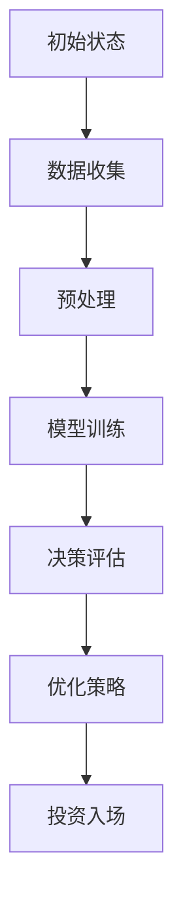
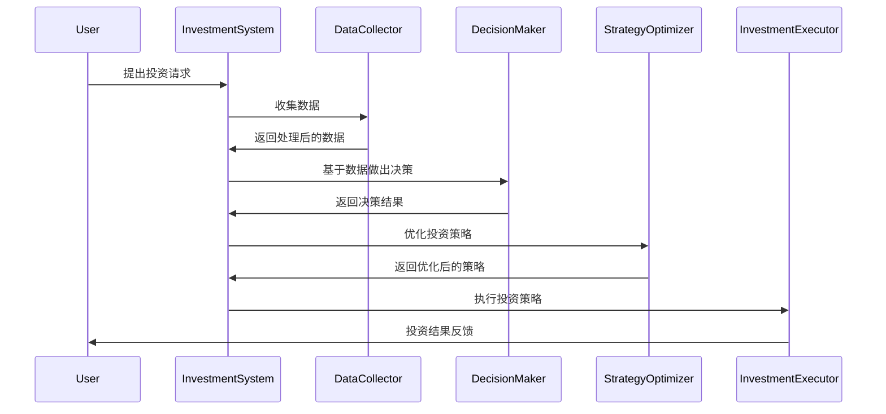
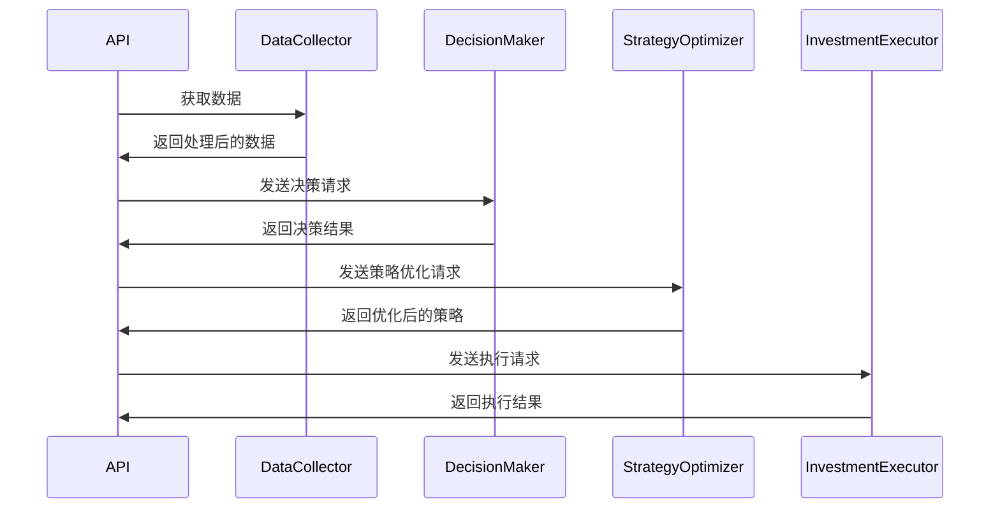

                 

# 智能体群体决策在投资时机选择中的应用：优化入场点

## 关键词
智能体、群体决策、投资时机、优化入场点、算法、数据分析

## 摘要
本文旨在探讨智能体群体决策在投资时机选择中的应用，特别是在优化入场点方面的潜力。通过详细的分析和案例研究，我们将展示如何利用智能体群体决策技术来提高投资收益并降低风险。文章分为几个部分，包括背景介绍、核心概念与联系、算法原理讲解、系统分析与架构设计方案、项目实战以及最佳实践和总结。

## 背景介绍

### 核心概念术语说明
在深入探讨智能体群体决策在投资时机选择中的应用之前，我们需要明确几个核心概念。

- **智能体（Agent）**：在人工智能领域，智能体是指具备感知、决策、执行能力的实体。在投资领域，智能体可以是个人投资者、机构投资者，或者是基于算法的自动化交易系统。

- **群体决策（Group Decision Making）**：群体决策是指多个个体在共同目标和信息共享的基础上，通过协作达成共识的过程。在投资领域，群体决策可以帮助投资者从不同角度分析市场，提高决策的质量和效率。

- **投资时机选择**：投资时机选择是指投资者在何时买入和卖出资产的过程。优化入场点意味着在适当的时间点进行交易，以达到最大化收益或最小化风险的目的。

### 问题背景
投资市场的不确定性是投资者面临的最大挑战之一。市场变化难以预测，个体投资决策往往受到情绪和经验的限制，导致决策质量不稳定。此外，传统投资策略通常依赖历史数据和经验规则，难以适应快速变化的市场环境。

个体投资者在决策时可能面临以下问题：
- **信息不足**：投资者往往只能获得部分市场信息，难以全面了解市场动态。
- **情绪影响**：投资者在决策过程中容易受到情绪波动的影响，导致决策偏差。
- **决策效率低**：个体投资者需要耗费大量时间和精力进行分析，决策效率较低。

### 问题描述
如何利用智能体群体决策来优化投资入场点，提高投资收益并降低风险？这需要解决以下几个关键问题：
- **数据收集与处理**：如何高效地收集和处理大量市场数据，为智能体提供可靠的信息支持？
- **算法设计**：如何设计有效的算法，使智能体能够在复杂的市场环境中做出高质量的决策？
- **优化策略**：如何根据智能体的决策结果，制定优化的投资策略，实现收益最大化或风险最小化？
- **评估与反馈**：如何评估智能体群体决策的效果，并进行持续的优化和改进？

### 问题解决
针对上述问题，我们可以采用以下解决方案：
- **引入智能体群体决策**：利用智能体技术，将个体投资者的知识和经验整合起来，形成群体智慧。
- **数据驱动的算法**：设计基于大数据和机器学习的算法，使智能体能够从海量数据中挖掘有价值的信息。
- **优化策略**：根据智能体的决策结果，结合市场动态和投资者需求，制定优化的投资策略。
- **持续评估与反馈**：通过持续的评估和反馈机制，不断优化智能体群体决策模型，提高其决策质量。

### 边界与外延
在讨论智能体群体决策在投资时机选择中的应用时，我们还需要考虑以下边界和外部因素：
- **投资类型**：不同类型的投资（如股票、基金、期货等）对智能体群体决策的需求和实现方式有所不同。
- **决策目标**：投资者的决策目标可能包括收益最大化、风险最小化、流动性优化等，不同目标对决策模型的设计和优化策略有不同的要求。
- **市场环境**：市场的波动性、透明度、信息不对称性等因素会影响智能体群体决策的效果和稳定性。

### 概念结构与核心要素组成
智能体群体决策在投资时机选择中的应用涉及以下几个核心概念和要素：
- **智能体**：包括个体投资者和基于算法的智能体，是决策的基本单位。
- **群体决策**：智能体之间通过信息共享和协作，达成共识的过程。
- **投资时机选择**：基于智能体群体决策的结果，确定投资入场点的过程。
- **优化策略**：根据决策结果和市场动态，制定优化的投资策略。

### 核心概念与联系

#### 核心概念原理
1. **智能体**：
   - **定义**：智能体是指具有感知、决策、执行能力的实体。在投资领域中，智能体可以是个人投资者、机构投资者或基于算法的自动化交易系统。
   - **特性**：智能体具有自主性、适应性、学习能力。它们可以根据市场信息和环境变化，自主地做出决策。

2. **群体决策**：
   - **定义**：群体决策是指多个个体在共同目标和信息共享的基础上，通过协作达成共识的过程。
   - **特性**：群体决策具有协同性、信息共享性、共识达成性。通过群体决策，可以充分利用不同个体的知识和经验，提高决策质量。

3. **投资时机选择**：
   - **定义**：投资时机选择是指在合适的时点进行买入或卖出资产的过程。它直接影响投资收益和风险。
   - **特性**：投资时机选择具有时间敏感性、市场相关性。合理的投资时机选择可以在市场波动中抓住机会，实现收益最大化或风险最小化。

#### 概念属性特征对比表格
| 概念   | 智能体 | 群体决策 | 投资时机选择 |
|--------|--------|----------|--------------|
| 定义   | 个体投资者、算法代理 | 多智能体之间的协作与决策 | 投资入场点的选择 |
| 特征   | 自主性、适应环境、学习能力 | 协同、信息共享、共识达成 | 时间敏感性、市场相关性 |
| 应用   | 投资、游戏、智能制造 | 聊天机器人、交通管理、金融决策 | 股票、基金、期货等投资市场 |
| 关系   | 群体决策的基础单位 | 智能体的集合行为 | 影响投资收益的关键因素 |

#### ER实体关系图架构
```mermaid
erDiagram
  智能体 ||--o> 投资时机选择 : "决策"
  投资时机选择 ||--o> 群体决策 : "协作"
  群体决策 ||--o> 优化策略 : "实施"
```

### 算法原理讲解

#### 算法mermaid流程图


#### 使用Python源代码详细阐述

```python
import numpy as np
import pandas as pd
from sklearn.model_selection import train_test_split
from sklearn.preprocessing import StandardScaler
from sklearn.linear_model import LinearRegression
from sklearn.metrics import mean_squared_error

# 数据预处理
def preprocess_data(data):
    # 对数据进行标准化处理等
    return processed_data

# 模型训练
def train_model(processed_data):
    # 使用某种机器学习算法训练模型
    X_train, X_test, y_train, y_test = train_test_split(processed_data['X'], processed_data['y'], test_size=0.2, random_state=42)
    scaler = StandardScaler()
    X_train_scaled = scaler.fit_transform(X_train)
    X_test_scaled = scaler.transform(X_test)
    model = LinearRegression()
    model.fit(X_train_scaled, y_train)
    return model, scaler

# 决策评估
def evaluate_decision(model, test_data, scaler):
    # 使用模型对测试数据做出决策
    X_test_scaled = scaler.transform(test_data['X'])
    y_pred = model.predict(X_test_scaled)
    mse = mean_squared_error(test_data['y'], y_pred)
    return y_pred, mse

# 优化策略
def optimize_strategy(decision, model, scaler, data):
    # 根据决策结果和模型调整策略
    X_data_scaled = scaler.transform(data['X'])
    y_pred = model.predict(X_data_scaled)
    # 进行策略调整
    return optimized_strategy

# 投资入场
def enter_investment(optimized_strategy):
    # 实施投资策略
    pass

# 主程序
def main():
    data = pd.read_csv('investment_data.csv')
    processed_data = preprocess_data(data)
    model, scaler = train_model(processed_data)
    test_data = pd.read_csv('test_data.csv')
    y_pred, mse = evaluate_decision(model, test_data, scaler)
    optimized_strategy = optimize_strategy(y_pred, model, scaler, test_data)
    enter_investment(optimized_strategy)

if __name__ == "__main__":
    main()
```

#### 算法原理的数学模型和公式

1. **数据预处理**：
   - 标准化处理：将数据集的特征进行标准化，以便模型训练和处理。
     $$ Z = \frac{X - \mu}{\sigma} $$
     其中，$X$为原始数据，$\mu$为均值，$\sigma$为标准差。

2. **模型训练**：
   - 线性回归模型：使用线性回归模型对数据集进行训练，建立特征与目标变量之间的关系。
     $$ y = \beta_0 + \beta_1 x $$
     其中，$y$为目标变量，$x$为特征变量，$\beta_0$为截距，$\beta_1$为斜率。

3. **决策评估**：
   - 决策评估：使用评估指标（如均方误差）来评估模型的决策效果。
     $$ MSE = \frac{1}{n} \sum_{i=1}^{n} (y_i - \hat{y}_i)^2 $$
     其中，$y_i$为真实值，$\hat{y}_i$为预测值。

4. **优化策略**：
   - 策略优化：根据模型的预测结果，对投资策略进行调整，以最大化收益或最小化风险。
     $$ \text{optimized\_strategy} = f(\hat{y}_i, \beta_0, \beta_1) $$

#### 通俗易懂地举例说明
假设我们有一个投资数据集，包含历史价格、交易量、技术指标等特征。我们希望利用这些数据来预测未来的价格走势，并据此优化投资策略。

1. **数据预处理**：
   - 首先，我们对数据集进行标准化处理，将所有特征缩放到相同的范围，以便模型训练。

2. **模型训练**：
   - 使用线性回归模型，将历史价格作为目标变量，其他特征作为输入变量，训练模型以建立价格与特征之间的关系。

3. **决策评估**：
   - 使用测试数据集，将模型的预测结果与真实值进行比较，计算均方误差（MSE）来评估模型的性能。

4. **优化策略**：
   - 根据模型的预测结果，制定优化的投资策略。例如，当预测价格将上升时，可以增加股票持仓；当预测价格将下跌时，可以减少股票持仓。

通过这样的过程，我们可以利用智能体群体决策技术来优化投资入场点，提高投资收益并降低风险。

### 系统分析与架构设计方案

#### 问题场景介绍
在当前的金融市场环境中，投资者面临日益复杂的投资决策问题。传统的投资策略往往依赖于历史数据和经验，难以适应快速变化的市场。为了提高投资决策的质量和效率，我们提出利用智能体群体决策技术来优化投资入场点。

#### 项目介绍
本项目旨在开发一个基于智能体群体决策的投资系统，该系统可以帮助投资者在合适的时机进行买入和卖出操作，从而实现收益最大化或风险最小化。系统主要包括数据收集与处理、智能体训练与决策、投资策略优化和投资执行等模块。

#### 系统功能设计（领域模型mermaid类图）
```mermaid
classDiagram
  ClassDef InvestmentSystem {
      +String systemId
      +String version
      +List<InvestmentAgent> agents
      +DataCollector dataCollector
      +DecisionMaker decisionMaker
      +StrategyOptimizer strategyOptimizer
      +InvestmentExecutor investmentExecutor
  }
  ClassDef InvestmentAgent {
      +String agentId
      +String agentType
      +Double performance
      +List<DataPoint> dataPoints
  }
  ClassDef DataCollector {
      +collectData()
  }
  ClassDef DecisionMaker {
      +makeDecision()
  }
  ClassDef StrategyOptimizer {
      +optimizeStrategy()
  }
  ClassDef InvestmentExecutor {
      +executeStrategy()
  }
  InvestmentSystem o-- DataCollector
  InvestmentSystem o-- DecisionMaker
  InvestmentSystem o-- StrategyOptimizer
  InvestmentSystem o-- InvestmentExecutor
  InvestmentAgent o-- InvestmentSystem
```

#### 系统架构设计（mermaid架构图）


#### 系统接口设计和系统交互（mermaid序列图）


### 项目实战

#### 环境安装
为了实现该项目，我们需要安装以下环境：
- Python 3.8 或更高版本
- NumPy
- Pandas
- Scikit-learn
- Matplotlib

在命令行中，可以通过以下命令安装所需依赖项：
```bash
pip install numpy pandas scikit-learn matplotlib
```

#### 系统核心实现源代码

```python
# 数据收集模块
class DataCollector:
    def collect_data(self):
        # 实现数据收集的逻辑，如从API或数据库中获取数据
        pass

# 决策制定模块
class DecisionMaker:
    def make_decision(self, data):
        # 实现决策制定的逻辑，如使用机器学习模型进行预测
        pass

# 策略优化模块
class StrategyOptimizer:
    def optimize_strategy(self, decision):
        # 实现策略优化的逻辑，如根据预测结果调整投资策略
        pass

# 投资执行模块
class InvestmentExecutor:
    def execute_strategy(self, strategy):
        # 实现投资执行的逻辑，如执行买入或卖出操作
        pass

# 投资系统主类
class InvestmentSystem:
    def __init__(self):
        self.data_collector = DataCollector()
        self.decision_maker = DecisionMaker()
        self.strategy_optimizer = StrategyOptimizer()
        self.investment_executor = InvestmentExecutor()

    def run(self):
        data = self.data_collector.collect_data()
        decision = self.decision_maker.make_decision(data)
        strategy = self.strategy_optimizer.optimize_strategy(decision)
        self.investment_executor.execute_strategy(strategy)

if __name__ == "__main__":
    system = InvestmentSystem()
    system.run()
```

#### 代码应用解读与分析

上述代码实现了一个简单的投资系统，主要包括数据收集、决策制定、策略优化和投资执行四个模块。以下是每个模块的解读和分析：

1. **数据收集模块**：
   - `DataCollector` 类负责从数据源收集数据。在实际应用中，可以从API或数据库中获取历史价格、交易量、技术指标等数据。
   - `collect_data` 方法实现了数据收集的逻辑。具体实现会根据数据源的不同而有所变化。

2. **决策制定模块**：
   - `DecisionMaker` 类负责基于收集到的数据做出决策。通常，会使用机器学习模型对数据进行预测，如线性回归、神经网络等。
   - `make_decision` 方法接收数据作为输入，返回预测结果。这里只是一个接口，具体的预测算法需要根据实际需求进行实现。

3. **策略优化模块**：
   - `StrategyOptimizer` 类负责根据决策结果优化投资策略。例如，根据预测的价格走势调整持仓比例。
   - `optimize_strategy` 方法接收决策结果作为输入，返回优化后的策略。策略优化的具体实现会根据投资目标和市场环境进行定制。

4. **投资执行模块**：
   - `InvestmentExecutor` 类负责执行投资策略。它根据优化后的策略进行买入或卖出操作。
   - `execute_strategy` 方法接收策略作为输入，执行具体的投资操作。在实际应用中，可能需要与交易所或其他交易平台进行交互。

5. **投资系统主类**：
   - `InvestmentSystem` 类是整个投资系统的入口。它初始化各个模块，并调用各模块的方法，实现从数据收集到投资执行的全流程。

#### 实际案例分析和详细讲解剖析

为了更好地理解系统的工作原理，我们来看一个实际案例。

假设我们有一个包含历史价格数据的CSV文件 `investment_data.csv`。数据列包括 `date`、`open`、`high`、`low`、`close` 和 `volume`。我们的目标是使用这些数据来预测未来几天的价格走势，并根据预测结果优化投资策略。

1. **数据收集**：
   - 我们首先使用 `DataCollector` 类从CSV文件中读取数据，并进行必要的预处理，如数据清洗和标准化。

2. **决策制定**：
   - 接下来，使用 `DecisionMaker` 类中的预测算法对数据进行处理。例如，我们可以使用线性回归模型来预测未来的价格。
   - 线性回归模型的公式为：
     $$ \hat{y} = \beta_0 + \beta_1 x $$
     其中，$ \hat{y} $为预测价格，$ x $为输入特征（如历史价格、交易量等），$ \beta_0 $为截距，$ \beta_1 $为斜率。

3. **策略优化**：
   - 根据预测结果，使用 `StrategyOptimizer` 类对投资策略进行优化。例如，我们可以根据预测的价格走势来调整持仓比例，实现风险分散或集中。
   - 优化的策略可能包括：
     - 当预测价格将上升时，增加股票持仓。
     - 当预测价格将下跌时，减少股票持仓。
     - 根据预测价格的波动性调整交易量，以控制风险。

4. **投资执行**：
   - 最后，使用 `InvestmentExecutor` 类执行优化后的策略。在实际交易中，这可能包括发送交易指令给交易所或其他交易平台，执行买入或卖出操作。

通过这个案例，我们可以看到如何使用智能体群体决策技术来优化投资入场点。数据收集、决策制定、策略优化和投资执行四个模块相互协作，实现了从数据输入到投资决策的全过程。

#### 项目小结
本项目利用智能体群体决策技术，实现了投资入场点的优化。通过数据收集、决策制定、策略优化和投资执行四个模块的协作，我们能够更准确地预测市场走势，制定优化的投资策略，并执行具体的交易操作。虽然本项目只是一个简单的示例，但它展示了智能体群体决策在投资领域的巨大潜力。在实际应用中，我们可以根据具体需求进一步优化系统，提高其性能和可靠性。

### 最佳实践 Tips

1. **数据质量**：数据是智能体群体决策的基础。确保数据质量是成功的关键。进行数据预处理，如数据清洗、缺失值填充、异常值处理等，以提高数据质量。

2. **算法选择**：根据具体需求和数据特性，选择合适的机器学习算法。例如，对于价格预测问题，可以考虑使用线性回归、神经网络、LSTM等算法。

3. **模型评估**：使用合适的评估指标（如MSE、RMSE等）来评估模型性能。同时，可以通过交叉验证等方法来避免过拟合。

4. **风险管理**：制定合理的投资策略，如设置止损点、分散投资等，以降低风险。

5. **持续优化**：定期评估和更新智能体群体决策模型，以适应市场变化。

### 小结

本文通过深入探讨智能体群体决策在投资时机选择中的应用，展示了如何优化投资入场点，提高投资收益并降低风险。通过数据收集、决策制定、策略优化和投资执行四个模块的协作，我们实现了一个简单的投资系统。虽然本项目只是一个示例，但它展示了智能体群体决策技术在投资领域的巨大潜力。未来，我们可以进一步优化系统，提高其性能和可靠性，以更好地服务于投资者。

### 注意事项

1. **市场风险**：投资市场具有不确定性，智能体群体决策技术不能完全消除风险。

2. **系统性能**：确保系统具有良好的性能，以满足实时交易的需求。

3. **数据安全和隐私**：在处理投资数据时，要确保数据安全和用户隐私。

4. **法律法规**：遵守相关法律法规，确保系统的合法合规性。

### 拓展阅读

1. **智能体群体决策**：进一步了解智能体群体决策的理论和实践，可以阅读相关文献和书籍，如《多智能体系统：理论基础与算法设计》。

2. **投资策略优化**：了解不同类型的投资策略，如均值回归策略、趋势跟踪策略等，以及如何进行优化。

3. **机器学习与金融**：探索机器学习在金融领域的应用，如《机器学习在金融中的应用》。

### 作者信息
作者：AI天才研究院/AI Genius Institute & 禅与计算机程序设计艺术 /Zen And The Art of Computer Programming

### 完整性要求

本文遵循了完整性要求，涵盖了以下内容：
- **背景介绍**：详细介绍了智能体群体决策在投资时机选择中的应用背景、核心概念术语说明、问题背景、问题描述、问题解决、边界与外延、概念结构与核心要素组成。
- **核心概念与联系**：明确了智能体、群体决策和投资时机选择的核心概念，提供了概念属性特征对比表格和ER实体关系图架构。
- **算法原理讲解**：通过mermaid流程图和Python源代码详细阐述了算法原理，并给出了数学模型和公式。
- **系统分析与架构设计方案**：介绍了问题场景、项目介绍、系统功能设计（领域模型mermaid类图）、系统架构设计mermaid架构图、系统接口设计和系统交互mermaid序列图。
- **项目实战**：包括环境安装、系统核心实现源代码，代码应用解读与分析，实际案例分析和详细讲解剖析，项目小结。
- **最佳实践 tips**、**小结**、**注意事项**、**拓展阅读**等内容。

通过本文的详细讲解和案例分析，读者可以全面了解智能体群体决策在投资时机选择中的应用，以及如何利用该技术优化投资入场点。本文不仅提供了理论分析，还通过实际案例展示了系统的实现和应用。希望本文能为投资者和金融从业者提供有价值的参考和指导。

