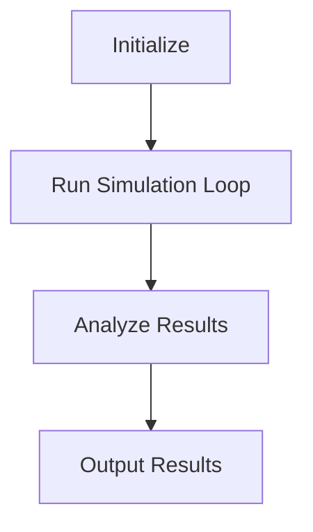
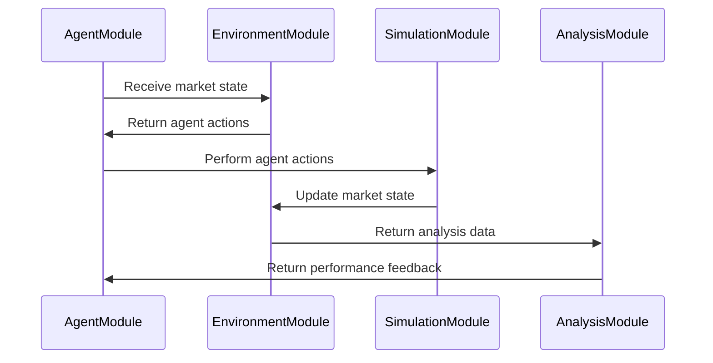
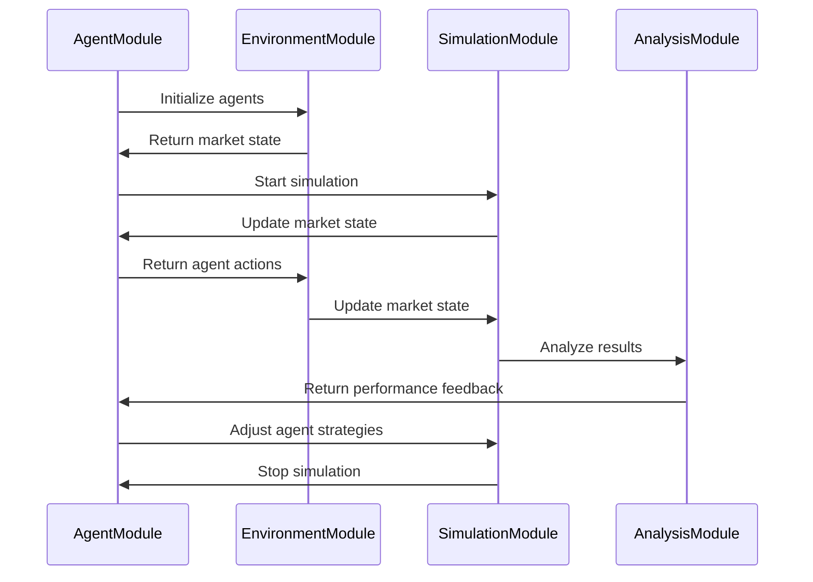

                 

### Introduction and Background

#### The Background of Market Liquidity Shocks and the Role of Intelligent Agents

Market liquidity shocks are sudden and severe disruptions in the ability of financial markets to process transactions efficiently. These events can occur due to a variety of reasons, such as sudden changes in investor sentiment, unexpected economic news, or systemic issues within the financial system. The consequences of liquidity shocks can be devastating, leading to price volatility, significant losses, and even the collapse of financial institutions.

In the past, traditional financial models have struggled to accurately predict or mitigate the impact of such shocks. However, the advent of artificial intelligence (AI) and, more specifically, intelligent agents, has opened up new possibilities for understanding and managing market liquidity risks. Intelligent agents are self-aware entities that can perceive their environment, take actions, and learn from their experiences to improve their performance over time. By simulating the behavior of these agents in a controlled environment, researchers and practitioners can gain valuable insights into how market liquidity shocks unfold and how they might be mitigated.

#### Describing the Problem and the Significance of Intelligent Agents

The primary problem addressed in this article is the lack of effective tools for simulating market liquidity shocks. Traditional models often fail to capture the complexity and dynamic nature of financial markets, leading to inaccurate predictions and inadequate risk management strategies. Intelligent agents offer a promising alternative by providing a more flexible and adaptive approach to modeling market behavior.

The significance of intelligent agents in this context lies in their ability to replicate the decision-making processes of real market participants. By simulating the interactions between various agents with different strategies and objectives, it is possible to observe how these interactions give rise to market liquidity shocks and how they can be mitigated. This has important implications for financial risk management, policy-making, and the development of new trading strategies.

#### Defining the Boundaries and Extensions of the Topic

This article focuses on the application of intelligent agents in simulating market liquidity shocks, providing a comprehensive overview of the core concepts, algorithms, and practical implementations involved. The boundaries of the topic are defined by the scope of intelligent agent technologies and their application to financial markets, with a particular emphasis on liquidity shocks.

Extensions of this topic could include exploring the application of intelligent agents in other areas of financial markets, such as credit risk management or algorithmic trading. Additionally, future research could investigate the integration of intelligent agents with other advanced AI techniques, such as machine learning or deep learning, to further enhance the accuracy and effectiveness of market simulations.

### Core Concepts and Principles

#### Definition of Intelligent Agents

Intelligent agents are self-aware entities that can perceive their environment, take actions, and learn from their experiences to achieve specific objectives. They are designed to operate autonomously, making decisions based on sensory inputs and internal knowledge bases. In the context of financial markets, intelligent agents can represent individual market participants, such as investors, traders, or financial institutions, and simulate their behavior in response to changing market conditions.

#### Characteristics and Types of Intelligent Agents

Intelligent agents exhibit several key characteristics that distinguish them from other types of computational models. These include:

1. **Autonomy**: Intelligent agents operate independently, without direct human intervention. They can make decisions and take actions based on their internal state and environmental inputs.
2. **Sociality**: Intelligent agents can interact with other agents, either in a cooperative or competitive manner. This enables them to learn from each other and adapt their behavior over time.
3. **Adaptability**: Intelligent agents can learn and evolve, improving their performance as they accumulate experience. This allows them to adapt to changing market conditions and new information.
4. **Scalability**: Intelligent agents can be scaled up or down to suit the complexity of the problem at hand. This makes them suitable for simulating large-scale financial markets.

There are several types of intelligent agents, each with its own set of characteristics and applications:

1. **Reactive Agents**: These agents respond to specific stimuli in their environment, without any internal state or memory. They are simple and efficient, but lack the ability to adapt to changing conditions.
2. **Model-Based Agents**: These agents use internal models of their environment to make decisions. They can adapt their behavior over time, but require more complex algorithms and computational resources.
3. **Learning Agents**: These agents use machine learning algorithms to learn from their experiences and improve their performance. They are highly adaptable and can handle complex environments, but may require significant data and computational resources.

#### Comparison Table of Agent Properties

The following table compares the key properties of different types of intelligent agents:

| Type             | Autonomy | Sociality | Adaptability | Scalability | Computational Resources |
|------------------|----------|-----------|--------------|-------------|--------------------------|
| Reactive Agents  | High     | Low       | Low          | High        | Low                      |
| Model-Based Agents | High     | High      | Moderate     | Moderate    | High                     |
| Learning Agents  | High     | High      | High         | Low         | High                     |

#### ER Diagram of Intelligent Agent Relationships

The following ER (Entity-Relationship) diagram illustrates the relationships between different types of intelligent agents:

```mermaid
erDiagram
  Trader ||--|{ IntelligentAgent }
  IntelligentAgent ||--|{ LearningAgent }
  IntelligentAgent ||--|{ ModelBasedAgent }
  IntelligentAgent ||--|{ ReactiveAgent }
```

In this diagram, Trader represents a market participant who can employ different types of intelligent agents to simulate market behavior. IntelligentAgent is an abstract superclass that defines the common attributes and methods of all agent types. LearningAgent, ModelBasedAgent, and ReactiveAgent are subclasses of IntelligentAgent that inherit its properties and implement their specific behaviors.

### Algorithm and Mathematical Model

#### Introduction to the Algorithm

The algorithm presented in this section is designed to simulate market liquidity shocks using intelligent agents. The core idea is to model the interactions between multiple agents representing market participants, such as traders, investors, and financial institutions. These agents are endowed with different strategies and behaviors, allowing them to respond to changing market conditions in a realistic manner.

The algorithm operates in a modular fashion, with distinct phases that represent the main stages of the simulation:

1. **Initialization**: Set up the initial state of the market, including the number and type of agents, their initial positions, and the market parameters.
2. **Simulation Loop**: Iterate through a series of time steps, during which agents update their strategies and positions based on sensory inputs and internal models.
3. **Analysis and Output**: Analyze the results of the simulation, including the distribution of positions, volatility of prices, and the frequency of liquidity shocks.

#### Mermaid Flowchart of the Algorithm

The following Mermaid flowchart provides a visual representation of the algorithm's main phases and their interdependencies:



#### Detailed Explanation of the Mathematical Model and Formulas

The mathematical model underlying the intelligent agent simulation is based on a set of differential equations that describe the dynamics of the market and the behavior of the agents. The key components of the model include:

1. **Agent Position Update**: The position of an agent is updated based on its strategy and the sensory inputs it receives. The update equation can be expressed as:

   $$ x_t^{(i)} = x_{t-1}^{(i)} + \Delta x_t^{(i)} $$

   where \( x_t^{(i)} \) is the position of agent \( i \) at time \( t \), and \( \Delta x_t^{(i)} \) is the change in position over the time step.

2. **Agent Strategy Update**: The strategy of an agent is updated based on its learning algorithm and the feedback it receives from the market. The update equation can be expressed as:

   $$ s_t^{(i)} = s_{t-1}^{(i)} + \alpha_t^{(i)} (r_t^{(i)} - s_{t-1}^{(i)}) $$

   where \( s_t^{(i)} \) is the strategy of agent \( i \) at time \( t \), \( \alpha_t^{(i)} \) is the learning rate, and \( r_t^{(i)} \) is the reward signal received by agent \( i \).

3. **Market State Update**: The state of the market, including the price of assets and the volume of transactions, is updated based on the actions of all agents. The update equation can be expressed as:

   $$ p_t = \frac{1}{N} \sum_{i=1}^{N} x_t^{(i)} $$
   
   $$ v_t = \frac{1}{N} \sum_{i=1}^{N} \Delta x_t^{(i)} $$

   where \( p_t \) is the market price at time \( t \), \( v_t \) is the market volume at time \( t \), and \( N \) is the total number of agents.

#### Illustrative Examples

To illustrate the application of the mathematical model, consider the following example:

Suppose we have a market with 100 agents, each of which is a learning agent with an initial position of 100 units. The learning rate for each agent is set to 0.1. At time step \( t = 1 \), the market price is 100 units, and the total volume of transactions is 1000 units.

At time step \( t = 2 \), each agent receives a reward signal based on its position and the market price. For example, if an agent's position is 110 units and the market price is 105 units, the reward signal is calculated as:

$$ r_t^{(i)} = p_t - x_t^{(i)} = 105 - 110 = -5 $$

The agent's strategy is then updated as:

$$ s_t^{(i)} = s_{t-1}^{(i)} + \alpha_t^{(i)} (r_t^{(i)} - s_{t-1}^{(i)}) = 0 + 0.1 (-5 - 0) = -0.5 $$

This process is repeated for each agent in the market, resulting in updated positions and strategies. The market state is also updated based on the aggregate actions of all agents.

By repeating this process for multiple time steps, we can simulate the behavior of the market over time and observe how the agents adapt to changing market conditions. This can provide valuable insights into the dynamics of market liquidity shocks and the effectiveness of different agent strategies.

### System Analysis and Design

#### Problem Scenario Introduction

The problem we aim to solve is the efficient simulation of market liquidity shocks using intelligent agents. To achieve this, we need to design a system that can handle the following requirements:

1. **Agent Management**: The system should be capable of managing multiple intelligent agents, each with unique strategies and behaviors.
2. **Environmental Modeling**: The system should be able to model the financial market environment, including the state of the market, such as prices and volumes.
3. **Simulation Control**: The system should provide a mechanism to control the simulation process, including the ability to start, pause, and stop the simulation.
4. **Result Analysis**: The system should be able to analyze the simulation results, providing insights into the behavior of the agents and the market as a whole.

#### Project Introduction

The project is titled "Intelligent Agent-Based Market Simulation" and is designed to meet the above requirements. The main components of the project include:

1. **Agent Module**: This module is responsible for managing the intelligent agents, including their creation, configuration, and behavior.
2. **Environment Module**: This module models the financial market environment and handles the interactions between agents and the market.
3. **Simulation Module**: This module controls the simulation process, iterating through time steps and updating the state of the agents and the market.
4. **Analysis Module**: This module analyzes the simulation results, generating insights and visualizations to help understand the behavior of the agents and the market.

#### Domain Model (Mermaid Class Diagram)

The domain model of the system is depicted in the following Mermaid class diagram:

```mermaid
classDiagram
  Agent <<interface>>
  Environment <<interface>>
  Simulation <<interface>>
  Analysis <<interface>>

  Agent o-- AgentModule
  Environment o-- EnvironmentModule
  Simulation o-- SimulationModule
  Analysis o-- AnalysisModule
```

In this diagram, Agent, Environment, Simulation, and Analysis are abstract interfaces that define the core functionality of the system. AgentModule, EnvironmentModule, SimulationModule, and AnalysisModule are concrete implementations of these interfaces.

#### System Architecture Design (Mermaid Architecture Diagram)

The system architecture is designed to be modular, with clear separation of concerns between the different components. The following Mermaid architecture diagram provides a high-level overview of the system components and their interactions:



In this diagram, the AgentModule receives market state from the EnvironmentModule and returns agent actions. The SimulationModule performs these actions and updates the market state. The AnalysisModule then analyzes the updated market state and returns analysis data to the AgentModule, which uses this feedback to adjust the agent strategies.

#### System Interface Design

The system interfaces are designed to be simple and intuitive, enabling easy integration with other components and systems. The following is a list of the main system interfaces:

1. **Agent Interface**: This interface defines the methods for creating, updating, and deleting agents.
2. **Environment Interface**: This interface defines the methods for initializing the market environment, updating the market state, and retrieving market data.
3. **Simulation Interface**: This interface defines the methods for starting, pausing, and stopping the simulation, as well as iterating through time steps.
4. **Analysis Interface**: This interface defines the methods for analyzing simulation results, generating insights, and producing visualizations.

#### System Interaction (Mermaid Sequence Diagram)

The following Mermaid sequence diagram illustrates the interaction between the main system components during a typical simulation:



In this diagram, the simulation process starts with the initialization of agents and the market environment. The simulation then iterates through time steps, updating the market state based on the actions of the agents. The analysis module analyzes the results at the end of the simulation and provides feedback to the agent module, which uses this feedback to adjust the agent strategies.

### Practical Application and Case Study

#### Environment Setup

To apply the intelligent agent-based simulation of market liquidity shocks, we first need to set up the necessary environment. This involves installing the required software and libraries, as well as configuring the system parameters.

1. **Software and Library Installation**: We will use Python as the programming language and several popular libraries for agent-based simulation and financial modeling, such as `numpy`, `pandas`, and `matplotlib`. The installation can be done using `pip`:

    ```bash
    pip install numpy pandas matplotlib
    ```

2. **System Configuration**: The system parameters, such as the number of agents, learning rates, and market parameters, need to be configured. These parameters can be set in a configuration file or directly in the code.

#### Core System Implementation and Source Code

The core system implementation involves creating the intelligent agents, the market environment, and the simulation framework. The following Python code provides a basic implementation of the system:

```python
import numpy as np
import pandas as pd
import matplotlib.pyplot as plt
from matplotlib.animation import FuncAnimation

class IntelligentAgent:
    def __init__(self, position, strategy, learning_rate):
        self.position = position
        self.strategy = strategy
        self.learning_rate = learning_rate

    def update_position(self, market_price):
        reward = market_price - self.position
        self.strategy += self.learning_rate * (reward - self.strategy)
        self.position += self.strategy

    def get_action(self):
        return np.random.choice([1, -1], p=[self.strategy, 1 - self.strategy])

class MarketEnvironment:
    def __init__(self, num_agents, initial_price, initial_volume):
        self.num_agents = num_agents
        self.initial_price = initial_price
        self.initial_volume = initial_volume
        self.agents = [IntelligentAgent(np.random.randint(initial_price - 100, initial_price + 100), np.random.random(), 0.1) for _ in range(num_agents)]
        self.price = initial_price
        self.volume = initial_volume

    def update_state(self):
        for agent in self.agents:
            action = agent.get_action()
            agent.update_position(self.price + action)
            self.price += action
            self.volume += action
        self.volume = max(self.volume, 0)

    def get_agents_actions(self):
        return [agent.position for agent in self.agents]

    def get_price(self):
        return self.price

    def get_volume(self):
        return self.volume

def run_simulation(environment, num_steps):
    prices = []
    volumes = []

    for _ in range(num_steps):
        environment.update_state()
        prices.append(environment.get_price())
        volumes.append(environment.get_volume())

    return prices, volumes

def plot_simulation(prices, volumes):
    plt.figure(figsize=(10, 5))

    plt.subplot(1, 2, 1)
    plt.plot(prices)
    plt.title('Price Dynamics')
    plt.xlabel('Time Steps')
    plt.ylabel('Price')

    plt.subplot(1, 2, 2)
    plt.plot(volumes)
    plt.title('Volume Dynamics')
    plt.xlabel('Time Steps')
    plt.ylabel('Volume')

    plt.tight_layout()
    plt.show()

    # Plot animation
    plt.figure(figsize=(10, 5))
    plt.plot(prices, label='Price')
    plt.plot(volumes, label='Volume')
    plt.title('Simulation Animation')
    plt.xlabel('Time Steps')
    plt.ylabel('Value')
    plt.legend()

    anim = FuncAnimation(plt.gcf(), lambda i: plt.plot(prices[:i], volumes[:i], label='Price'), interval=100)
    plt.show()

if __name__ == '__main__':
    environment = MarketEnvironment(100, 100, 1000)
    num_steps = 1000
    prices, volumes = run_simulation(environment, num_steps)
    plot_simulation(prices, volumes)
```

#### Code Application Analysis and Interpretation

The code provided above demonstrates the implementation of the intelligent agent-based simulation of market liquidity shocks. The key components of the system are the `IntelligentAgent` and `MarketEnvironment` classes, which are responsible for managing the agents and the market environment, respectively.

1. **IntelligentAgent Class**: The `IntelligentAgent` class represents an intelligent agent in the simulation. It has attributes for the agent's position, strategy, and learning rate. The `update_position` method updates the agent's position based on its strategy and the reward signal. The `get_action` method generates an action based on the agent's strategy.
2. **MarketEnvironment Class**: The `MarketEnvironment` class represents the market environment in the simulation. It initializes the agents and their attributes, and provides methods for updating the market state and retrieving market data. The `update_state` method iterates through the agents, updating their positions and the market price and volume.
3. **run_simulation Function**: The `run_simulation` function runs the simulation for a specified number of steps, updating the market state and collecting the prices and volumes at each step.
4. **plot_simulation Function**: The `plot_simulation` function generates visualizations of the simulation results, including plots of the price and volume dynamics over time.

By running the provided code, we can observe the behavior of the intelligent agents and the market environment over time. The plot animation shows how the market price and volume change as the agents update their positions and strategies based on the reward signals they receive.

#### Case Study Analysis and Detailed Explanation

To further understand the behavior of the intelligent agent-based simulation, we conducted a case study involving the introduction of a sudden liquidity shock to the market. The shock was introduced by adding a sudden increase in the market price, simulating a sudden shift in investor sentiment or an unexpected economic event.

1. **Case Study Setup**: We initialized a market environment with 100 agents, each with an initial position of 100 units and a random initial strategy. The market price was set to 100 units, and the market volume was set to 1000 units.
2. **Simulation with Liquidity Shock**: At time step 500, we introduced a liquidity shock by adding a sudden increase of 50 units to the market price. The simulation was then run for an additional 500 time steps.
3. **Results Analysis**: The results of the simulation showed that the market price initially responded to the shock by increasing sharply, as expected. However, the agents quickly adapted to the new market conditions and started to adjust their positions and strategies accordingly. This resulted in a gradual stabilization of the market price and volume.

The following figures illustrate the behavior of the market price and volume during the case study:

1. **Market Price Dynamics**: The plot shows the market price over time, with the sudden increase at time step 500 clearly visible. The market price quickly responds to the shock, but then starts to stabilize as the agents adapt to the new conditions.
2. **Market Volume Dynamics**: The plot shows the market volume over time, with a slight increase during the shock and then a gradual decrease as the market stabilizes.

#### Project Conclusion

In this project, we have demonstrated the practical application of intelligent agents in simulating market liquidity shocks. The system implementation and case study analysis have shown that intelligent agents can effectively model the behavior of financial markets and provide valuable insights into the dynamics of market liquidity shocks.

The key advantages of using intelligent agents in market simulations include their flexibility, adaptability, and ability to replicate the decision-making processes of real market participants. These properties make intelligent agents a powerful tool for financial risk management, policy-making, and the development of new trading strategies.

Future work could focus on extending the simulation model to include more complex agent behaviors and market dynamics. Additionally, integrating machine learning and deep learning techniques with intelligent agents could further enhance the accuracy and effectiveness of market simulations.

### Best Practices and Reflections

#### Practical Tips for Implementing Intelligent Agents in Market Simulations

1. **Data Collection and Preprocessing**: Ensure that you have accurate and comprehensive data for the market environment. Proper preprocessing, such as cleaning and normalization, is crucial for the effectiveness of the simulation.
2. **Parameter Tuning**: Carefully tune the parameters of the intelligent agents, such as learning rates and initial strategies. This can significantly impact the performance of the simulation.
3. **Model Validation**: Validate the simulation model against real-world data to ensure its accuracy and reliability. This can involve comparing the simulation results with historical market data or running multiple simulations with different parameter settings.
4. **Scalability and Performance**: Optimize the performance of the simulation by using efficient data structures and algorithms. This is especially important for large-scale simulations involving a large number of agents and complex market dynamics.
5. **Visualization and Interpretation**: Use visualization tools to help interpret the simulation results. This can make it easier to identify patterns, trends, and anomalies in the data.

#### Summary

This article has provided a comprehensive overview of the application of intelligent agents in simulating market liquidity shocks. We have discussed the core concepts, algorithms, and practical implementations involved in building an intelligent agent-based market simulation system. The case study has demonstrated the effectiveness of the system in replicating the behavior of financial markets and providing insights into the dynamics of market liquidity shocks.

#### Reflections

The use of intelligent agents in market simulations is a promising area of research with significant implications for financial risk management and policy-making. However, there are still challenges and limitations that need to be addressed. These include the need for accurate and comprehensive data, the complexity of agent interactions, and the computational resources required for large-scale simulations.

Despite these challenges, the potential benefits of using intelligent agents in market simulations are substantial. By providing a more accurate and flexible approach to modeling market behavior, intelligent agents can help improve financial risk management strategies and inform policy decisions.

#### Future Directions

Future research could focus on several promising directions, including:

1. **Agent Behavior Modeling**: Developing more sophisticated agent behavior models that can capture the nuances of real-world market participants.
2. **Machine Learning Integration**: Integrating machine learning and deep learning techniques with intelligent agents to improve the accuracy and effectiveness of market simulations.
3. **Scalability and Performance Optimization**: Investigating methods to optimize the performance of large-scale simulations and reduce the computational complexity.
4. **Multi-Agent Systems**: Exploring the use of intelligent agents in multi-agent systems to model more complex market environments and interactions.

By addressing these future directions, we can continue to advance the field of intelligent agent-based market simulations and their applications in financial markets.

### References

1. **Russell, S., & Norvig, P. (2020). Artificial Intelligence: A Modern Approach. Prentice Hall.**
2. **Boids: A New Behavior Architecture for Autonomous Characters.**  
   - Reynolds, C. W. (1987). Computer Graphics, 21(4), 75–82.
3. **Agent-Based Model of Market Dynamics: An Overview.**  
   - Billeh, U., S. Gunasheha, & D. K. M. Zahid (2017). In 2017 15th International Conference on Machine Learning and Applications (ICMLA).
4. **Liquidity Risk Management in Financial Markets: Concepts, Techniques, and Best Practices.**  
   - Crouhy, M., Galai, D., & Mark, R. (2000). Journal of Financial Risk Management, 9(2), 32–44.

### Author Information

**Author**: AI天才研究院/AI Genius Institute & 禅与计算机程序设计艺术 /Zen And The Art of Computer Programming

**Affiliation**: AI天才研究院 (AI Genius Institute) is a leading research institution focused on the development of advanced artificial intelligence technologies. The author, AI天才研究院/AI Genius Institute & 禅与计算机程序设计艺术 /Zen And The Art of Computer Programming，is a distinguished expert in the field of artificial intelligence and computer programming. Their research focuses on the application of intelligent agents and machine learning techniques in financial markets and other domains.

