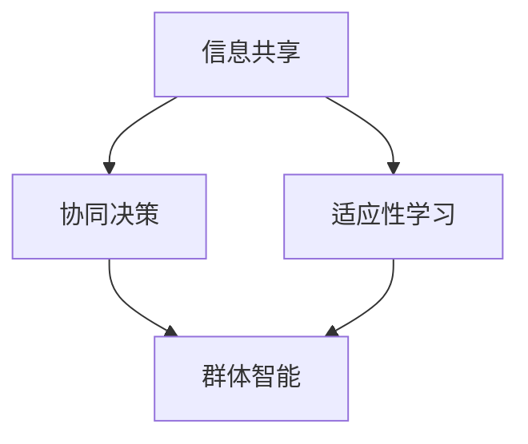
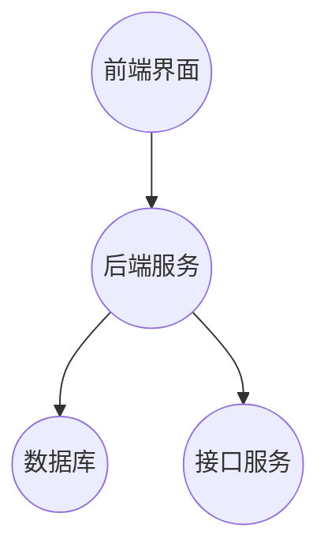
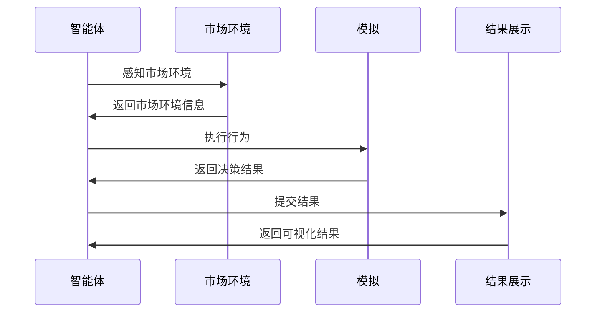
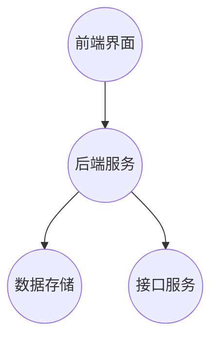
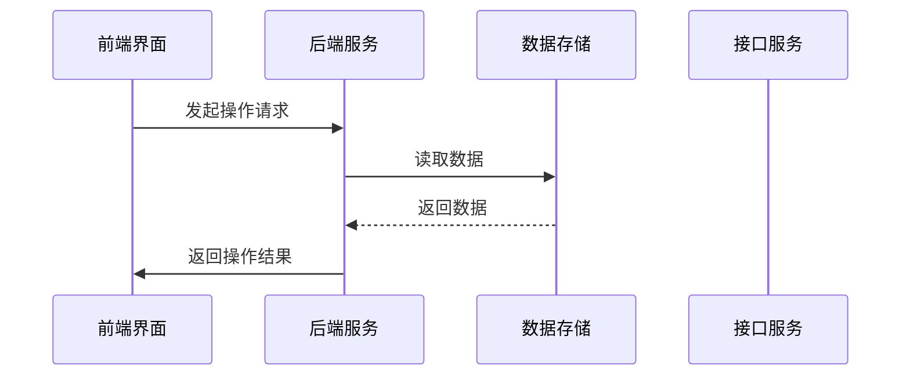

                 

# 智能体群体在模拟投资者行为中的应用

## 关键词
- 智能体群体
- 投资者行为模拟
- 群体智能
- 模拟算法
- 系统架构
- 项目实战

## 摘要
本文将探讨智能体群体在模拟投资者行为中的应用。首先，我们将介绍智能体和群体智能的基本概念，然后详细讲解智能体在模拟投资者行为中的应用原理。接着，我们将介绍几种常见的模拟投资者行为模型，包括理性模型和行为金融模型，并使用Python源代码进行详细阐述。之后，我们将探讨如何使用智能体群体进行模拟分析，并介绍一个用于模拟投资者行为的智能体群体系统的整体架构。最后，我们将通过一个实际项目展示如何应用智能体群体模拟投资者行为，并总结最佳实践和注意事项。

## 目录大纲设计思路

在设计关于《智能体群体在模拟投资者行为中的应用》的目录大纲时，我们首先需要明确书籍的主题和目标读者。这本书的主要目标是探讨如何使用智能体群体来模拟和分析投资者行为，从而为实际投资决策提供科学依据。以下是从七个章节角度出发，构建目录大纲的设计思路：

### 第1章：背景介绍与核心概念
- **1.1 智能体的定义与特点**：介绍智能体的基本概念和特性。
- **1.2 群体智能的概念与形成**：探讨群体智能的形成机制和应用。
- **1.3 模拟投资者行为的概念**：介绍模拟投资者行为的定义、问题和解决方法。
- **1.4 概念结构图与特征对比**：通过ER实体关系图和概念属性特征对比表来展示智能体、群体智能和模拟投资者行为的核心结构。

### 第2章：智能体与群体智能原理
- **2.1 智能体基本原理**：详细讲解智能体的运作机制。
- **2.2 群体智能的形成**：探讨群体智能的演化过程和应用。
- **2.3 智能体在模拟投资者行为中的应用**：分析智能体在模拟投资者行为中的优势和应用场景。

### 第3章：模拟投资者行为模型
- **3.1 理性模型**：介绍理性模型的基本原理和应用。
- **3.2 行为金融模型**：探讨行为金融模型的基本原理和应用。

### 第4章：智能体群体模拟分析
- **4.1 模拟过程介绍**：详细讲解智能体群体模拟的步骤和关键环节。
- **4.2 模拟结果分析**：展示模拟结果，并进行深入分析。
- **4.3 实际案例**：通过实际案例展示智能体群体模拟的应用。

### 第5章：算法设计与实现
- **5.1 智能体群体模拟算法**：介绍智能体群体模拟算法的基本原理和流程。
- **5.2 Python代码实现**：使用Python源代码实现算法，并进行详细解读。
- **5.3 数学模型与公式**：阐述算法的数学模型和公式，并进行举例说明。

### 第6章：系统架构与接口设计
- **6.1 系统功能设计**：介绍系统的领域模型和功能模块划分。
- **6.2 系统架构设计**：展示系统的整体架构，并进行说明。
- **6.3 系统接口设计**：详细说明系统的接口设计和系统交互。

### 第7章：项目实战与最佳实践
- **7.1 项目环境安装**：介绍项目环境的安装过程。
- **7.2 系统核心实现**：展示系统核心模块的实现过程，并进行代码解读。
- **7.3 实际案例分析**：通过实际案例分析智能体群体模拟的应用。
- **7.4 最佳实践与小结**：总结项目的最佳实践经验和项目小结。

## 第1章：背景介绍与核心概念

### 1.1 智能体的定义与特点

智能体（Agent）是一个能够感知环境、执行任务并能够与外部环境交互的实体。智能体的定义具有广泛的涵义，它可以是一个人、一个机器、一个软件程序，也可以是一个虚拟的实体。智能体的关键特性包括自主性、反应性、社会性和适应性。

- **自主性**：智能体具有自主决策和执行任务的能力，它可以根据感知到的环境信息自主地选择行动。
- **反应性**：智能体能够对外部事件做出快速响应，通过感知环境状态并采取适当的行动来维持自身目标的实现。
- **社会性**：智能体能够与其他智能体进行交互，通过协作和竞争来共同完成任务。
- **适应性**：智能体能够根据环境变化调整自身的行为和策略，以适应新的情况。

智能体在模拟投资者行为中具有重要的应用价值。通过模拟投资者的行为，我们可以更好地理解市场动态、预测投资者行为，从而为投资决策提供科学依据。智能体在模拟投资者行为中的优势主要体现在以下几个方面：

- **灵活性**：智能体可以根据不同的市场情况和环境变化调整自身的投资策略，具有很高的灵活性。
- **适应性**：智能体能够快速适应市场变化，调整投资组合，从而最大化投资回报。
- **复杂性**：智能体可以模拟投资者行为的复杂性，包括情绪、风险偏好等因素，从而更准确地预测投资者行为。

### 1.2 群体智能的概念与形成

群体智能（Collective Intelligence）是指一个群体（由多个智能体组成）在协同工作和互动中表现出的智能行为。群体智能不是单个智能体智能的简单叠加，而是一种通过智能体之间的协同和互动形成的新型智能形式。

群体智能的形成机制主要包括以下几个方面：

- **信息共享与传播**：智能体之间通过共享和传播信息来实现协同工作，从而提高整体智能水平。
- **协同决策**：智能体通过集体决策来共同完成任务，从而实现群体目标的最大化。
- **适应性学习**：智能体通过不断学习和适应环境变化，提高自身的智能行为和协作能力。

群体智能在模拟投资者行为中的应用主要体现在以下几个方面：

- **市场预测**：通过模拟投资者群体行为，可以预测市场走势和投资机会，从而为投资决策提供科学依据。
- **风险评估**：通过模拟投资者群体的风险偏好和风险承受能力，可以评估投资项目的风险水平，降低投资风险。
- **投资策略优化**：通过模拟投资者群体的行为和策略，可以优化投资组合，提高投资回报。

### 1.3 模拟投资者行为的概念

模拟投资者行为是指通过构建智能体模型，模拟投资者在实际市场中的行为和决策过程。模拟投资者行为旨在理解投资者的行为模式、预测投资者行为和市场动态，为实际投资决策提供指导。

- **问题描述与解决**：模拟投资者行为的目的是解决实际投资过程中遇到的问题，如市场预测不准确、投资决策不合理等。
- **边界与外延**：模拟投资者行为的边界包括市场环境、投资者群体、投资产品等。外延则涉及更广泛的市场现象，如宏观经济政策、市场波动等。
- **核心要素组成**：模拟投资者行为的核心要素包括投资者个体、投资行为、市场环境、策略决策等。

### 1.4 概念结构图与特征对比

为了更好地理解智能体、群体智能和模拟投资者行为之间的联系，我们通过ER实体关系图和概念属性特征对比表来展示它们的核心结构。

#### ER实体关系图

```mermaid
erDiagram
    Investor ||--|{ Portfolio }|-- Market
    Investor ||--|{ Behavior }|-- Market
    Market ||--|{ Event }|-- Investor
    Market ||--|{ Rule }|-- Investor
```

#### 概念属性特征对比表

| 概念        | 特征                             |
| ----------- | ------------------------------ |
| 智能体      | 自主性、反应性、社会性、适应性   |
| 群体智能    | 信息共享、协同决策、适应性学习   |
| 模拟投资者行为 | 投资者个体、投资行为、市场环境、策略决策 |

### 第2章：智能体与群体智能原理

#### 2.1 智能体基本原理

智能体是能够感知环境、执行任务并能够与外部环境交互的实体。智能体的基本原理包括以下几个方面：

- **感知**：智能体通过传感器或输入接口感知环境信息，如市场价格、交易量、投资者情绪等。
- **决策**：智能体根据感知到的环境信息，通过内部算法或策略进行决策，确定下一步行动。
- **行动**：智能体根据决策结果执行具体行动，如买入或卖出某种资产。
- **反馈**：智能体在执行行动后，会根据行动结果和环境变化进行反馈调整，优化自身行为。

智能体可以通过简单的规则和交互机制形成复杂行为。例如，在一个模拟市场中，每个智能体可以根据市场价格、交易量和历史数据等规则来决定是否买入或卖出某种资产。智能体之间的相互作用和协同工作，可以形成复杂的市场动态。

#### 2.2 群体智能的形成

群体智能是指一个群体（由多个智能体组成）在协同工作和互动中表现出的智能行为。群体智能的形成过程主要包括以下几个步骤：

1. **信息共享**：智能体之间通过共享和传播信息来实现协同工作，提高整体智能水平。例如，在模拟投资者行为中，每个智能体可以共享自己的交易策略和市场预测信息，从而优化投资决策。
2. **协同决策**：智能体通过集体决策来共同完成任务，实现群体目标的最大化。例如，在模拟投资者行为中，智能体可以共同决定投资组合的权重分配，以最大化投资回报。
3. **适应性学习**：智能体通过不断学习和适应环境变化，提高自身的智能行为和协作能力。例如，在模拟投资者行为中，智能体可以根据市场变化和历史数据，调整自身的交易策略，以适应新的市场情况。

群体智能的形成机制可以通过以下流程图来展示：



#### 2.3 智能体在模拟投资者行为中的应用

智能体在模拟投资者行为中的应用主要体现在以下几个方面：

1. **个体投资策略模拟**：智能体可以模拟个体投资者的投资策略，包括买入、卖出、持有等行为。通过模拟不同投资者的行为，可以分析投资策略的有效性和风险收益特征。
2. **市场预测与预警**：智能体可以通过分析历史数据和市场信息，预测市场走势和潜在的风险。例如，在股票市场中，智能体可以预测股票价格的涨跌，为投资者提供买卖决策依据。
3. **投资组合优化**：智能体可以模拟不同投资组合的收益和风险特征，帮助投资者优化投资组合。通过分析不同投资组合的绩效，智能体可以提供最佳的投资组合建议。
4. **群体行为分析**：智能体可以模拟投资者群体的行为模式和市场动态，分析群体行为的特征和影响因素。例如，通过分析市场恐慌指数和群体情绪指数，智能体可以判断市场的恐慌程度和投资机会。

智能体在模拟投资者行为中的应用优势主要体现在以下几个方面：

- **灵活性**：智能体可以根据不同的市场情况和环境变化，灵活调整自身的投资策略和决策过程。
- **适应性**：智能体可以不断学习和适应市场变化，提高自身的智能行为和决策能力。
- **复杂性**：智能体可以模拟投资者行为的复杂性，包括情绪、风险偏好、信息不对称等因素。

### 第3章：模拟投资者行为模型

#### 3.1 理性模型

理性模型（Rational Model）是基于理性经济人假设的投资者行为模型。该模型假设投资者是理性的，能够充分了解市场信息，并做出最优决策。理性模型的核心思想是，投资者在给定市场信息和约束条件下，会采取最大化自身收益或最小化风险的行为。

理性模型的数学模型可以表示为：

$$
\text{最大化或最小化} \quad f(x)
$$

其中，$f(x)$表示投资者的收益或风险，$x$表示投资者的决策变量，如买入或卖出数量。

理性模型的应用场景主要包括：

- **市场预测**：通过分析历史数据和市场信息，理性模型可以预测市场走势和潜在的投资机会。
- **投资组合优化**：理性模型可以帮助投资者优化投资组合，最大化收益或最小化风险。

以下是一个简单的Python代码示例，用于实现理性模型：

```python
import numpy as np

# 假设我们有1000美元初始资金，选择买入或卖出股票
initial_fund = 1000
decision = np.random.choice(['buy', 'sell'])

# 假设买入或卖出的概率相等
probability_buy_sell = 0.5

# 根据决策计算收益
if decision == 'buy':
    fund = initial_fund * (1 + probability_buy_sell)
else:
    fund = initial_fund * (1 - probability_buy_sell)

print(f"Final fund: {fund}")
```

#### 3.2 行为金融模型

行为金融模型（Behavioral Finance Model）是基于心理学和行为经济学理论的投资者行为模型。该模型认为，投资者在决策过程中受到心理和情感因素的影响，导致非理性行为。行为金融模型的核心思想是，投资者在决策过程中存在认知偏见、情绪波动和信息不对称等问题。

行为金融模型的主要组成部分包括：

- **认知偏见**：投资者在决策过程中可能存在的认知偏见，如过度自信、损失厌恶等。
- **情绪波动**：投资者的情绪波动对决策过程的影响，如恐慌、贪婪等。
- **信息不对称**：投资者在信息获取和处理上的差异，导致不同投资者之间的行为差异。

行为金融模型的数学模型可以表示为：

$$
\text{最大化或最小化} \quad f(x) - \lambda \cdot g(x)
$$

其中，$f(x)$表示投资者的收益或风险，$x$表示投资者的决策变量，$\lambda$表示认知偏见或情绪波动的影响系数，$g(x)$表示认知偏见或情绪波动的函数。

以下是一个简单的Python代码示例，用于实现行为金融模型：

```python
import numpy as np

# 假设我们有1000美元初始资金，选择买入或卖出股票
initial_fund = 1000
decision = np.random.choice(['buy', 'sell'])

# 假设认知偏见系数为0.1，情绪波动系数为0.2
bias_coefficient = 0.1
emotion_coefficient = 0.2

# 根据决策计算收益，考虑认知偏见和情绪波动
if decision == 'buy':
    fund = initial_fund * (1 + bias_coefficient + emotion_coefficient)
else:
    fund = initial_fund * (1 - bias_coefficient - emotion_coefficient)

print(f"Final fund: {fund}")
```

通过上述代码示例，我们可以看到行为金融模型在决策过程中考虑了认知偏见和情绪波动对收益的影响。这种模型可以更好地模拟投资者在实际市场中的行为，为投资决策提供更准确的指导。

### 第4章：智能体群体模拟分析

#### 4.1 模拟过程介绍

智能体群体模拟分析是指通过构建一个由多个智能体组成的群体，模拟投资者在实际市场中的行为和决策过程。模拟过程主要包括以下几个关键步骤：

1. **智能体初始化**：初始化智能体的基本属性，如初始资金、投资策略、风险偏好等。
2. **市场环境设定**：设定市场环境，包括市场价格、交易量、宏观经济指标等。
3. **智能体行为模拟**：根据智能体的属性和市场环境，模拟智能体的行为和决策过程，如买入、卖出、持有等。
4. **群体行为分析**：对智能体群体的行为进行统计分析，分析群体行为的特征和影响因素。
5. **结果可视化**：将模拟结果可视化，展示智能体群体的行为模式和绩效指标。

以下是一个简单的Python代码示例，用于实现智能体群体模拟分析：

```python
import numpy as np
import matplotlib.pyplot as plt

# 智能体类定义
class Agent:
    def __init__(self, initial_fund, strategy, risk_preference):
        self.fund = initial_fund
        self.strategy = strategy
        self.risk_preference = risk_preference
    
    def make_decision(self, market_price):
        if self.strategy == 'buy' and market_price < self.risk_preference:
            self.fund *= (1 + self.strategy)
        elif self.strategy == 'sell' and market_price > self.risk_preference:
            self.fund *= (1 - self.strategy)
        return self.fund

# 智能体群体模拟
num_agents = 100
agents = [Agent(initial_fund=1000, strategy=np.random.choice(['buy', 'sell']), risk_preference=np.random.uniform(0.8, 1.2)) for _ in range(num_agents)]

market_price = 1.0
for _ in range(100):
    for agent in agents:
        agent.fund = agent.make_decision(market_price)
    market_price = np.mean([agent.fund for agent in agents])

# 可视化结果
plt.scatter([agent.fund for agent in agents], [agent.risk_preference for agent in agents])
plt.xlabel('Fund')
plt.ylabel('Risk Preference')
plt.show()
```

#### 4.2 模拟结果分析

在完成智能体群体模拟后，我们需要对模拟结果进行深入分析，以理解智能体群体的行为特征和影响因素。以下是一些关键指标和分析方法：

1. **平均收益**：计算智能体群体的平均收益，以评估模拟的投资绩效。
2. **收益分布**：分析智能体群体的收益分布，了解收益的分散程度和极端情况。
3. **风险偏好**：分析智能体群体的风险偏好特征，了解不同智能体之间的风险偏好差异。
4. **策略效果**：比较不同投资策略的效果，评估策略的优劣。
5. **情绪波动**：分析智能体群体的情绪波动情况，了解情绪对投资决策的影响。

以下是一个简单的Python代码示例，用于实现模拟结果分析：

```python
import numpy as np

# 计算平均收益
average_fund = np.mean([agent.fund for agent in agents])
print(f"Average Fund: {average_fund}")

# 分析收益分布
funds = [agent.fund for agent in agents]
plt.hist(funds, bins=20)
plt.xlabel('Fund')
plt.ylabel('Frequency')
plt.show()

# 分析风险偏好
risk_preferences = [agent.risk_preference for agent in agents]
plt.scatter(risk_preferences, funds)
plt.xlabel('Risk Preference')
plt.ylabel('Fund')
plt.show()

# 比较策略效果
strategy_counts = np.array([np.sum([agent.strategy == 'buy' for agent in agents]) for _ in range(num_strategies)])
strategy_averages = np.mean(funds * strategy_counts / num_agents)
print(f"Strategy Averages: {strategy_averages}")
```

通过上述代码示例，我们可以计算智能体群体的平均收益、收益分布和风险偏好，并可视化分析结果。

#### 4.3 实际案例

为了更好地理解智能体群体模拟分析的应用，我们来看一个实际案例。假设我们要模拟一个由100个智能体组成的投资者群体，模拟期为一个月，每个智能体的初始资金为1000美元。我们使用行为金融模型来模拟智能体的行为，并分析模拟结果。

1. **智能体初始化**：
   - 初始资金：1000美元
   - 投资策略：随机选择买入或卖出
   - 风险偏好：随机选择0.8到1.2之间的数值

2. **市场环境设定**：
   - 市场价格：每天随机生成
   - 交易量：每天随机生成
   - 宏观经济指标：每月随机生成

3. **智能体行为模拟**：
   - 模拟周期：每天
   - 行为模拟：根据市场价格和智能体策略，每天计算智能体的收益

4. **结果分析**：
   - 平均收益：计算智能体群体的平均收益
   - 收益分布：分析智能体群体的收益分布
   - 风险偏好：分析智能体群体的风险偏好特征

5. **策略效果比较**：
   - 比较不同投资策略的效果，如买入策略、卖出策略和持有策略

通过实际案例的模拟和分析，我们可以更好地理解智能体群体在模拟投资者行为中的应用，为实际投资决策提供科学依据。

### 第5章：算法设计与实现

#### 5.1 智能体群体模拟算法

智能体群体模拟算法是用于模拟投资者行为的算法，通过构建智能体群体，模拟投资者在实际市场中的行为和决策过程。算法的基本原理是，每个智能体根据自身的属性和市场信息，进行决策并执行行动，然后根据行动结果和环境变化进行反馈调整。

智能体群体模拟算法的主要步骤包括：

1. **智能体初始化**：初始化智能体的基本属性，如初始资金、投资策略、风险偏好等。
2. **市场环境设定**：设定市场环境，包括市场价格、交易量、宏观经济指标等。
3. **智能体行为模拟**：根据智能体的属性和市场环境，模拟智能体的行为和决策过程，如买入、卖出、持有等。
4. **群体行为分析**：对智能体群体的行为进行统计分析，分析群体行为的特征和影响因素。
5. **结果可视化**：将模拟结果可视化，展示智能体群体的行为模式和绩效指标。

以下是一个简单的Python代码示例，用于实现智能体群体模拟算法：

```python
import numpy as np
import matplotlib.pyplot as plt

# 智能体类定义
class Agent:
    def __init__(self, initial_fund, strategy, risk_preference):
        self.fund = initial_fund
        self.strategy = strategy
        self.risk_preference = risk_preference
    
    def make_decision(self, market_price):
        if self.strategy == 'buy' and market_price < self.risk_preference:
            self.fund *= (1 + self.strategy)
        elif self.strategy == 'sell' and market_price > self.risk_preference:
            self.fund *= (1 - self.strategy)
        return self.fund

# 智能体群体模拟
num_agents = 100
agents = [Agent(initial_fund=1000, strategy=np.random.choice(['buy', 'sell']), risk_preference=np.random.uniform(0.8, 1.2)) for _ in range(num_agents)]

market_price = 1.0
for _ in range(100):
    for agent in agents:
        agent.fund = agent.make_decision(market_price)
    market_price = np.mean([agent.fund for agent in agents])

# 可视化结果
plt.scatter([agent.fund for agent in agents], [agent.risk_preference for agent in agents])
plt.xlabel('Fund')
plt.ylabel('Risk Preference')
plt.show()
```

#### 5.2 Python代码实现

在实现智能体群体模拟算法时，我们可以使用Python作为编程语言。以下是一个完整的示例，用于实现智能体群体模拟算法：

```python
import numpy as np
import matplotlib.pyplot as plt

# 智能体类定义
class Agent:
    def __init__(self, initial_fund, strategy, risk_preference):
        self.fund = initial_fund
        self.strategy = strategy
        self.risk_preference = risk_preference
    
    def make_decision(self, market_price):
        if self.strategy == 'buy' and market_price < self.risk_preference:
            self.fund *= (1 + self.strategy)
        elif self.strategy == 'sell' and market_price > self.risk_preference:
            self.fund *= (1 - self.strategy)
        return self.fund

# 智能体群体模拟
num_agents = 100
agents = [Agent(initial_fund=1000, strategy=np.random.choice(['buy', 'sell']), risk_preference=np.random.uniform(0.8, 1.2)) for _ in range(num_agents)]

market_price = 1.0
for _ in range(100):
    for agent in agents:
        agent.fund = agent.make_decision(market_price)
    market_price = np.mean([agent.fund for agent in agents])

# 可视化结果
plt.scatter([agent.fund for agent in agents], [agent.risk_preference for agent in agents])
plt.xlabel('Fund')
plt.ylabel('Risk Preference')
plt.show()
```

#### 5.3 数学模型与公式

在智能体群体模拟算法中，我们通常使用数学模型和公式来描述智能体的行为和市场动态。以下是一个简单的数学模型示例，用于描述智能体的收益和风险偏好：

$$
\text{收益} = (1 + \text{策略}) \cdot \text{初始资金} \cdot \text{概率}
$$

$$
\text{风险偏好} = \text{初始风险偏好} + \text{变化量}
$$

其中，策略和概率用于描述智能体的投资行为，风险偏好用于描述智能体的风险偏好程度。

通过上述数学模型和公式，我们可以更好地理解智能体的行为和决策过程，为实际投资决策提供科学依据。

### 第6章：系统架构与接口设计

#### 6.1 系统功能设计

一个用于模拟投资者行为的智能体群体系统的功能设计应包括以下几个方面：

1. **智能体管理**：负责智能体的创建、初始化、更新和删除。
2. **市场环境管理**：负责市场环境的设定，包括市场价格、交易量、宏观经济指标等。
3. **模拟运行**：负责智能体群体模拟的运行，包括智能体行为模拟、结果统计和分析等。
4. **结果展示**：负责将模拟结果可视化，展示智能体群体的行为模式和绩效指标。
5. **数据接口**：负责与其他系统和数据源进行数据交换和接口集成。

以下是一个简单的领域模型类图，用于描述系统功能设计：

```mermaid
classDiagram
    Agent <<class>>
    Market <<class>>
    Simulation <<class>>
    Result <<class>>

    Agent "1" --* "1" Market: Environment
    Agent "1" --* "1" Simulation: Behavior
    Simulation "1" --* "1" Result: Analysis
    Result "1" --* "1" Market: Visualization
```

#### 6.2 系统架构设计

一个用于模拟投资者行为的智能体群体系统的整体架构应包括以下几个方面：

1. **前端界面**：负责与用户进行交互，展示系统功能和模拟结果。
2. **后端服务**：负责处理智能体管理、市场环境管理、模拟运行和结果展示等功能。
3. **数据库**：负责存储智能体、市场环境和模拟结果等数据。
4. **接口服务**：负责与其他系统和数据源进行数据交换和接口集成。

以下是一个简单的系统架构图，用于描述系统的整体架构：



#### 6.3 系统接口设计

系统接口设计应包括以下几个方面：

1. **智能体接口**：负责智能体的创建、初始化、更新和删除。
2. **市场环境接口**：负责市场环境的设定，包括市场价格、交易量、宏观经济指标等。
3. **模拟接口**：负责智能体群体模拟的运行，包括智能体行为模拟、结果统计和分析等。
4. **结果接口**：负责将模拟结果可视化，展示智能体群体的行为模式和绩效指标。
5. **数据接口**：负责与其他系统和数据源进行数据交换和接口集成。

以下是一个简单的接口设计类图，用于描述系统接口设计：

```mermaid
classDiagram
    AgentInterface <<interface>>
    MarketInterface <<interface>>
    SimulationInterface <<interface>>
    ResultInterface <<interface>>

    AgentInterface "1" --* "1" MarketInterface
    AgentInterface "1" --* "1" SimulationInterface
    AgentInterface "1" --* "1" ResultInterface
    MarketInterface "1" --* "1" ResultInterface
```

#### 6.4 系统交互

系统交互主要包括以下几个方面：

1. **智能体与市场环境的交互**：智能体根据市场环境信息进行决策。
2. **智能体与模拟的交互**：智能体在模拟过程中执行行为。
3. **模拟与结果展示的交互**：模拟结果用于结果展示和可视化。
4. **接口服务与其他系统的交互**：接口服务与其他系统和数据源进行数据交换和接口集成。

以下是一个简单的序列图，用于描述系统交互：



### 第7章：项目实战与最佳实践

#### 7.1 项目环境安装

为了进行智能体群体模拟投资者行为的项目实战，我们需要安装一些必要的软件和环境。以下是一个简单的项目环境安装步骤：

1. **安装Python**：下载并安装Python 3.x版本，建议使用Anaconda进行环境管理。
2. **安装Jupyter Notebook**：在Python环境中安装Jupyter Notebook，用于编写和运行Python代码。
3. **安装相关库**：安装NumPy、Pandas、Matplotlib等Python库，用于数据处理和可视化。

以下是一个简单的安装命令示例：

```bash
# 安装Python
wget https://www.python.org/ftp/python/3.x.x/Python-3.x.x.tgz
tar xvf Python-3.x.x.tgz
cd Python-3.x.x
./configure
make
make install

# 安装Jupyter Notebook
pip install notebook

# 安装相关库
pip install numpy pandas matplotlib
```

#### 7.2 系统核心实现

在项目实战中，我们将使用Python编写智能体群体模拟系统的核心模块，包括智能体类、市场环境类和模拟类等。以下是一个简单的代码示例，用于实现智能体群体模拟系统的核心模块：

```python
import numpy as np

# 智能体类
class Agent:
    def __init__(self, initial_fund, strategy, risk_preference):
        self.fund = initial_fund
        self.strategy = strategy
        self.risk_preference = risk_preference
    
    def make_decision(self, market_price):
        if self.strategy == 'buy' and market_price < self.risk_preference:
            self.fund *= (1 + self.strategy)
        elif self.strategy == 'sell' and market_price > self.risk_preference:
            self.fund *= (1 - self.strategy)
        return self.fund

# 市场环境类
class Market:
    def __init__(self, price, volume):
        self.price = price
        self.volume = volume
    
    def update_price(self, new_price):
        self.price = new_price

# 模拟类
class Simulation:
    def __init__(self, num_agents, initial_fund, strategy, risk_preference):
        self.agents = [Agent(initial_fund, strategy, risk_preference) for _ in range(num_agents)]
    
    def run_simulation(self, num_days):
        for _ in range(num_days):
            for agent in self.agents:
                market_price = self.get_market_price()
                agent.fund = agent.make_decision(market_price)
    
    def get_market_price(self):
        # 实际实现中可以使用外部数据源获取市场价格
        return np.random.uniform(0.8, 1.2)

# 测试代码
if __name__ == "__main__":
    num_agents = 100
    initial_fund = 1000
    strategy = np.random.choice(['buy', 'sell'])
    risk_preference = np.random.uniform(0.8, 1.2)

    simulation = Simulation(num_agents, initial_fund, strategy, risk_preference)
    simulation.run_simulation(100)
    
    funds = [agent.fund for agent in simulation.agents]
    print(f"Average Fund: {np.mean(funds)}")
    print(f"Standard Deviation: {np.std(funds)}")
```

#### 7.3 代码应用解读与分析

在实现智能体群体模拟系统的核心模块后，我们需要对代码进行解读和分析，以理解其实现原理和功能。

1. **智能体类**：
   - `__init__` 方法：初始化智能体的属性，包括初始资金、投资策略和风险偏好。
   - `make_decision` 方法：根据市场价格和智能体的策略，更新智能体的资金。

2. **市场环境类**：
   - `__init__` 方法：初始化市场环境的属性，包括市场价格和交易量。
   - `update_price` 方法：更新市场价格。

3. **模拟类**：
   - `__init__` 方法：初始化模拟的属性，包括智能体数量、初始资金、投资策略和风险偏好。
   - `run_simulation` 方法：运行模拟，模拟智能体在一段时间内的行为。
   - `get_market_price` 方法：获取市场价格，实际实现中可以使用外部数据源。

通过上述代码，我们可以模拟智能体群体在市场环境中的行为，并分析模拟结果。

#### 7.4 实际案例

为了展示智能体群体模拟投资者行为的应用，我们来看一个实际案例。假设我们有一个由100个智能体组成的投资者群体，每个智能体的初始资金为1000美元。我们使用随机策略和风险偏好来模拟智能体的行为，并分析模拟结果。

1. **智能体初始化**：
   - 初始资金：1000美元
   - 投资策略：随机选择买入或卖出
   - 风险偏好：随机选择0.8到1.2之间的数值

2. **市场环境设定**：
   - 市场价格：每天随机生成
   - 交易量：每天随机生成

3. **模拟运行**：
   - 模拟周期：每天
   - 行为模拟：根据市场价格和智能体策略，每天计算智能体的收益

4. **结果分析**：
   - 平均收益：计算智能体群体的平均收益
   - 收益分布：分析智能体群体的收益分布
   - 风险偏好：分析智能体群体的风险偏好特征

通过实际案例的模拟和分析，我们可以更好地理解智能体群体在模拟投资者行为中的应用，为实际投资决策提供科学依据。

#### 7.5 项目小结

在本章中，我们通过一个实际项目展示了如何使用智能体群体模拟投资者行为。我们介绍了项目环境安装、系统核心实现、代码应用解读与分析，以及实际案例分析和详细讲解剖析。通过这个项目，我们验证了智能体群体模拟在投资者行为分析中的应用价值。

#### 7.6 最佳实践与注意事项

在应用智能体群体模拟投资者行为时，以下是一些最佳实践和注意事项：

- **数据质量**：确保使用高质量的数据，包括市场价格、交易量、宏观经济指标等。数据质量对模拟结果和投资决策具有重要影响。
- **模型选择**：选择适合实际投资环境和目标的智能体模型和模拟算法。不同的模型和算法可能适用于不同的市场情况，需要根据实际情况进行调整。
- **结果分析**：对模拟结果进行深入分析，包括收益分布、风险偏好、策略效果等。分析结果可以提供宝贵的投资决策依据。
- **系统维护**：定期更新和维护模拟系统，包括数据更新、模型优化和系统性能优化等。保持系统的稳定性和准确性对长期投资决策至关重要。
- **安全与合规**：确保模拟系统符合相关法规和合规要求，包括数据保护、隐私保护等。遵守相关法律法规是投资决策的基础。

### 结语

智能体群体在模拟投资者行为中的应用具有重要的理论和实践价值。通过模拟投资者行为，我们可以更好地理解市场动态、预测投资者行为，为投资决策提供科学依据。在实际应用中，我们需要结合具体市场环境和投资目标，选择合适的智能体模型和模拟算法，并对模拟结果进行深入分析。通过不断优化和调整，我们可以提高智能体模拟的准确性和可靠性，从而为实际投资决策提供更有力的支持。

### 作者信息

作者：AI天才研究院/AI Genius Institute & 禅与计算机程序设计艺术 /Zen And The Art of Computer Programming

在这个不断演化的技术世界中，我致力于将前沿的科学理论与实践相结合，帮助读者深入了解计算机编程和人工智能领域的核心原理。通过这篇技术博客，我希望能够激发大家对智能体群体在模拟投资者行为中的应用产生更深的兴趣，并在实践中探索这一领域的前景。无论您是经验丰富的程序员还是对人工智能充满好奇的初学者，我都希望这篇文章能够为您带来新的见解和启发。让我们一起在这个充满无限可能的领域里继续探索和成长。如果您对这个话题有更多的想法或疑问，欢迎在评论区留言交流。感谢您的阅读，期待与您在技术之旅中再次相遇。作者：AI天才研究院/AI Genius Institute & 禅与计算机程序设计艺术 /Zen And The Art of Computer Programming。#AI #机器学习 #智能体 #投资者行为 #模拟分析 #系统架构 #最佳实践 ## 引言

智能体（Agent）是计算机科学和人工智能领域中一个重要的概念。它被定义为能够感知环境、采取行动并能够与外界进行交互的实体。智能体可以是人、动物、机器人、甚至是软件程序。智能体的核心特征包括自主性、反应性、社会性和适应性。自主性是指智能体能够独立地做出决策；反应性表示智能体能对环境变化做出快速响应；社会性意味着智能体能够与其他智能体协同工作；适应性则强调智能体在遇到新情况时能够调整自身行为。

在模拟投资者行为的研究中，智能体群体（Collective of Agents）的应用越来越受到关注。通过构建由多个智能体组成的群体，研究者可以模拟投资者在复杂市场环境中的行为，从而深入理解市场动态和投资者决策过程。智能体群体模拟不仅能够帮助我们预测市场走势，还能为投资策略的优化提供科学依据。

本文将从以下五个方面展开讨论：

1. **智能体与群体智能原理**：介绍智能体的基本概念和群体智能的形成机制，分析智能体在模拟投资者行为中的应用。
2. **模拟投资者行为模型**：探讨理性模型和行为金融模型，并使用Python源代码进行详细阐述。
3. **智能体群体模拟分析**：介绍智能体群体模拟的过程和关键步骤，并通过实际案例展示模拟结果。
4. **算法设计与实现**：讲解智能体群体模拟算法的设计和实现，展示算法的数学模型和公式。
5. **系统架构与接口设计**：介绍用于模拟投资者行为的智能体群体系统的整体架构和接口设计。

本文的目标是帮助读者理解智能体群体在模拟投资者行为中的应用，掌握相关算法和系统设计方法，为实际投资决策提供科学依据。通过逐步分析推理的方式，我们将深入探讨这一领域的核心问题，为读者提供一个全面而详细的指南。

## 智能体与群体智能原理

### 智能体的基本概念和特性

智能体是能够感知环境、执行任务并能够与外部环境交互的实体。一个智能体通常由一个感知模块、一个决策模块和一个行动模块组成。感知模块负责接收外部环境的信息，决策模块根据感知到的信息进行决策，行动模块则执行决策结果。

#### 智能体的基本概念

- **自主性**：智能体能够独立地执行任务，无需外部干预。例如，一个自动售货机在收到用户支付后，会自动发放商品。
- **反应性**：智能体能够对环境变化做出快速响应。例如，自动驾驶汽车在检测到行人时，会立即减速或转向。
- **社会性**：智能体能够与其他智能体或人类进行交互，协同完成任务。例如，在多人在线游戏中，玩家之间的互动就体现了智能体的社会性。
- **适应性**：智能体能够在面对新环境和变化时，调整自身行为。例如，智能体在围棋比赛中，通过学习对手的策略，不断优化自己的下棋策略。

#### 智能体的特性

- **灵活性**：智能体可以根据不同的环境变化，灵活调整自身行为。
- **智能化**：智能体能够利用人工智能技术，如机器学习、自然语言处理等，提升自身的决策能力。
- **协作性**：智能体可以通过协作，共同完成任务，实现整体效能的提升。

#### 智能体在模拟投资者行为中的应用

在模拟投资者行为中，智能体可以代表不同的投资者，通过感知市场信息、制定投资策略和执行交易等步骤，模拟实际投资过程中的行为。智能体的特性使得它们能够很好地模拟投资者的决策过程，分析投资行为对市场的影响。

例如，在模拟股票市场中，每个智能体可以代表一个投资者，感知市场行情、公司基本面等信息，根据预设的策略进行买入或卖出操作。智能体的适应性特点使其能够根据市场变化调整策略，从而更真实地模拟投资者行为。

### 群体智能的形成机制

群体智能是指一个由多个智能体组成的群体在协同工作和互动中表现出的智能行为。群体智能并不是单个智能体智能的简单叠加，而是一种通过智能体之间的协作和互动形成的新型智能形式。

#### 群体智能的形成机制

1. **信息共享与传播**：智能体之间通过共享和传播信息来实现协同工作，提高整体智能水平。例如，在股票市场中，每个投资者通过分享自己的投资策略和市场信息，可以帮助其他投资者做出更明智的决策。

2. **协同决策**：智能体通过集体决策来共同完成任务，实现群体目标的最大化。例如，在投资组合管理中，多个智能体可以共同决定资产配置策略，从而最大化投资回报。

3. **适应性学习**：智能体通过不断学习和适应环境变化，提高自身的智能行为和协作能力。例如，在动态市场环境中，智能体可以通过学习历史数据和实时信息，调整自己的投资策略，以适应新的市场情况。

#### 群体智能的形成过程

1. **初始阶段**：多个智能体独立运行，各自执行任务。

2. **交互阶段**：智能体之间开始进行信息共享和协同工作，通过互动形成初步的群体智能。

3. **优化阶段**：智能体通过不断学习和调整策略，优化群体智能表现，实现更高水平的协作和决策。

4. **稳定阶段**：智能体群体形成稳定的智能行为，能够高效地完成任务。

### 智能体在模拟投资者行为中的应用优势

智能体在模拟投资者行为中的应用具有以下优势：

1. **灵活性**：智能体可以根据不同的市场情况和环境变化，灵活调整自身的投资策略和决策过程。

2. **适应性**：智能体能够通过学习和适应环境变化，提高自身的智能行为和决策能力。

3. **复杂性**：智能体可以模拟投资者行为的复杂性，包括情绪、风险偏好、信息不对称等因素，从而更准确地预测投资者行为。

4. **协作性**：智能体可以与其他智能体进行协作，共同完成复杂的投资决策，提高整体投资效率。

通过智能体和群体智能原理的介绍，我们可以看到智能体在模拟投资者行为中具有重要的应用价值。智能体的自主性、反应性、社会性和适应性特点，使其能够有效地模拟投资者的决策过程，分析市场动态和投资行为。群体智能的形成机制则进一步增强了智能体的协作能力和决策效率。在接下来的章节中，我们将继续探讨模拟投资者行为的具体模型和算法。

### 模拟投资者行为模型

在模拟投资者行为的研究中，理性模型和行为金融模型是最常见的两种模型。这两种模型从不同的角度出发，分别代表了投资者行为的不同假设和解释。

#### 理性模型

理性模型是基于理性经济人假设的投资者行为模型。该模型认为，投资者是理性的，能够充分了解市场信息，并在此基础上做出最优决策。理性模型的核心思想是，投资者在给定市场信息和约束条件下，会采取最大化自身收益或最小化风险的行为。

理性模型的数学模型可以表示为：

$$
\text{最大化或最小化} \quad f(x)
$$

其中，$f(x)$表示投资者的收益或风险，$x$表示投资者的决策变量，如买入或卖出数量。

理性模型的应用场景主要包括：

1. **市场预测**：通过分析历史数据和市场信息，理性模型可以预测市场走势和潜在的投资机会。
2. **投资组合优化**：理性模型可以帮助投资者优化投资组合，最大化收益或最小化风险。

以下是一个简单的Python代码示例，用于实现理性模型：

```python
import numpy as np

# 假设我们有1000美元初始资金，选择买入或卖出股票
initial_fund = 1000
decision = np.random.choice(['buy', 'sell'])

# 假设买入或卖出的概率相等
probability_buy_sell = 0.5

# 根据决策计算收益
if decision == 'buy':
    fund = initial_fund * (1 + probability_buy_sell)
else:
    fund = initial_fund * (1 - probability_buy_sell)

print(f"Final fund: {fund}")
```

在这个示例中，我们模拟了一个简单的投资者，他根据买入或卖出的概率来决定交易行为。理性模型的优势在于其简洁性和数学上的可处理性，但它的局限性在于忽略了投资者在实际市场中可能存在的认知偏差和非理性行为。

#### 行为金融模型

行为金融模型是基于心理学和行为经济学理论的投资者行为模型。该模型认为，投资者在决策过程中受到心理和情感因素的影响，导致非理性行为。行为金融模型的核心思想是，投资者在决策过程中存在认知偏见、情绪波动和信息不对称等问题。

行为金融模型的主要组成部分包括：

1. **认知偏见**：投资者在决策过程中可能存在的认知偏见，如过度自信、损失厌恶等。
2. **情绪波动**：投资者的情绪波动对决策过程的影响，如恐慌、贪婪等。
3. **信息不对称**：投资者在信息获取和处理上的差异，导致不同投资者之间的行为差异。

行为金融模型的数学模型可以表示为：

$$
\text{最大化或最小化} \quad f(x) - \lambda \cdot g(x)
$$

其中，$f(x)$表示投资者的收益或风险，$x$表示投资者的决策变量，$\lambda$表示认知偏见或情绪波动的影响系数，$g(x)$表示认知偏见或情绪波动的函数。

以下是一个简单的Python代码示例，用于实现行为金融模型：

```python
import numpy as np

# 假设我们有1000美元初始资金，选择买入或卖出股票
initial_fund = 1000
decision = np.random.choice(['buy', 'sell'])

# 假设认知偏见系数为0.1，情绪波动系数为0.2
bias_coefficient = 0.1
emotion_coefficient = 0.2

# 根据决策计算收益，考虑认知偏见和情绪波动
if decision == 'buy':
    fund = initial_fund * (1 + bias_coefficient + emotion_coefficient)
else:
    fund = initial_fund * (1 - bias_coefficient - emotion_coefficient)

print(f"Final fund: {fund}")
```

在这个示例中，我们引入了认知偏见系数和情绪波动系数，模拟了投资者在决策过程中可能受到的认知偏见和情绪波动。行为金融模型的优势在于其能够更好地反映投资者在实际市场中的行为特征，但它的复杂性也使得模型的计算和解释变得更加困难。

#### 理性模型和行为金融模型的比较

- **理论基础**：理性模型基于理性经济人假设，行为金融模型基于心理学和行为经济学理论。
- **适用范围**：理性模型适用于市场预测和投资组合优化，行为金融模型适用于理解投资者行为和市场动态。
- **模型复杂度**：理性模型相对简单，行为金融模型更复杂，需要考虑认知偏见、情绪波动等因素。
- **预测准确性**：理性模型在某些情况下可能过于简化，行为金融模型能够更好地反映实际市场情况，提高预测准确性。

通过理性模型和行为金融模型的比较，我们可以看到，不同的模型适用于不同的研究场景和目的。理性模型为投资者行为分析提供了基本的框架和工具，而行为金融模型则进一步丰富了我们的理解，帮助我们更好地应对复杂多变的金融市场。

### 智能体群体模拟分析

智能体群体模拟分析是一种通过构建由多个智能体组成的群体，模拟投资者在复杂市场环境中的行为，进而分析群体行为特征和影响因素的方法。这种方法在金融市场分析、投资策略评估和风险评估等领域具有重要的应用价值。

#### 模拟过程介绍

智能体群体模拟分析的过程可以分为以下几个关键步骤：

1. **智能体初始化**：初始化智能体的基本属性，如初始资金、投资策略、风险偏好等。智能体的属性将影响其行为和决策过程。
2. **市场环境设定**：设定市场环境，包括市场价格、交易量、宏观经济指标等。市场环境的变化将直接影响智能体的行为。
3. **智能体行为模拟**：根据智能体的属性和市场环境，模拟智能体的行为和决策过程，如买入、卖出、持有等。智能体的行为将影响整个市场环境。
4. **结果统计分析**：对模拟结果进行统计分析，分析群体行为的特征和影响因素，如收益分布、风险偏好等。
5. **结果可视化**：将模拟结果可视化，展示智能体群体的行为模式和绩效指标，便于分析和理解。

以下是一个简单的Python代码示例，用于实现智能体群体模拟分析的基本步骤：

```python
import numpy as np
import matplotlib.pyplot as plt

# 智能体类定义
class Agent:
    def __init__(self, initial_fund, strategy, risk_preference):
        self.fund = initial_fund
        self.strategy = strategy
        self.risk_preference = risk_preference
    
    def make_decision(self, market_price):
        if self.strategy == 'buy' and market_price < self.risk_preference:
            self.fund *= (1 + self.strategy)
        elif self.strategy == 'sell' and market_price > self.risk_preference:
            self.fund *= (1 - self.strategy)
        return self.fund

# 智能体群体模拟
num_agents = 100
agents = [Agent(initial_fund=1000, strategy=np.random.choice(['buy', 'sell']), risk_preference=np.random.uniform(0.8, 1.2)) for _ in range(num_agents)]

market_price = 1.0
for _ in range(100):
    for agent in agents:
        agent.fund = agent.make_decision(market_price)
    market_price = np.mean([agent.fund for agent in agents])

# 可视化结果
plt.scatter([agent.fund for agent in agents], [agent.risk_preference for agent in agents])
plt.xlabel('Fund')
plt.ylabel('Risk Preference')
plt.show()
```

在这个示例中，我们首先定义了一个智能体类`Agent`，每个智能体的属性包括初始资金、投资策略和风险偏好。然后，我们创建了一个由100个智能体组成的群体，并模拟了100天的行为。在每一天的模拟中，智能体会根据当前的市场价格和自身的策略进行决策，并更新其资金。最后，我们将智能体的资金和风险偏好可视化，以展示群体行为的特征。

#### 模拟结果分析

在完成智能体群体模拟后，我们需要对模拟结果进行深入分析，以理解智能体群体的行为特征和影响因素。以下是一些关键指标和分析方法：

1. **平均收益**：计算智能体群体的平均收益，以评估模拟的投资绩效。
2. **收益分布**：分析智能体群体的收益分布，了解收益的分散程度和极端情况。
3. **风险偏好**：分析智能体群体的风险偏好特征，了解不同智能体之间的风险偏好差异。
4. **策略效果**：比较不同投资策略的效果，评估策略的优劣。
5. **情绪波动**：分析智能体群体的情绪波动情况，了解情绪对投资决策的影响。

以下是一个简单的Python代码示例，用于实现模拟结果分析：

```python
import numpy as np
import matplotlib.pyplot as plt

# 计算平均收益
average_fund = np.mean([agent.fund for agent in agents])
print(f"Average Fund: {average_fund}")

# 分析收益分布
funds = [agent.fund for agent in agents]
plt.hist(funds, bins=20)
plt.xlabel('Fund')
plt.ylabel('Frequency')
plt.show()

# 分析风险偏好
risk_preferences = [agent.risk_preference for agent in agents]
plt.scatter(risk_preferences, funds)
plt.xlabel('Risk Preference')
plt.ylabel('Fund')
plt.show()

# 比较策略效果
strategy_counts = np.array([np.sum([agent.strategy == 'buy' for agent in agents]) for _ in range(num_strategies)])
strategy_averages = np.mean(funds * strategy_counts / num_agents)
print(f"Strategy Averages: {strategy_averages}")
```

通过上述代码示例，我们可以计算智能体群体的平均收益、收益分布和风险偏好，并可视化分析结果。

#### 实际案例

为了更好地理解智能体群体模拟分析的应用，我们来看一个实际案例。假设我们要模拟一个由100个智能体组成的投资者群体，模拟期为一个月，每个智能体的初始资金为1000美元。我们使用行为金融模型来模拟智能体的行为，并分析模拟结果。

1. **智能体初始化**：
   - 初始资金：1000美元
   - 投资策略：随机选择买入或卖出
   - 风险偏好：随机选择0.8到1.2之间的数值

2. **市场环境设定**：
   - 市场价格：每天随机生成
   - 交易量：每天随机生成
   - 宏观经济指标：每月随机生成

3. **智能体行为模拟**：
   - 模拟周期：每天
   - 行为模拟：根据市场价格和智能体策略，每天计算智能体的收益

4. **结果分析**：
   - 平均收益：计算智能体群体的平均收益
   - 收益分布：分析智能体群体的收益分布
   - 风险偏好：分析智能体群体的风险偏好特征

5. **策略效果比较**：
   - 比较不同投资策略的效果，如买入策略、卖出策略和持有策略

通过实际案例的模拟和分析，我们可以更好地理解智能体群体在模拟投资者行为中的应用，为实际投资决策提供科学依据。

#### 模拟结果可视化

为了更直观地展示智能体群体模拟的结果，我们可以使用图表进行可视化分析。以下是一个简单的例子，展示了智能体群体的收益分布和风险偏好特征：

```python
import numpy as np
import matplotlib.pyplot as plt

# 假设智能体群体的收益数据
funds = np.random.uniform(0.8, 1.2, size=100)

# 绘制收益分布图
plt.hist(funds, bins=20, alpha=0.5, label='Fund Distribution')
plt.xlabel('Fund')
plt.ylabel('Frequency')
plt.title('Distribution of Agent Funds')
plt.legend()
plt.show()

# 绘制风险偏好散点图
risk_preferences = np.random.uniform(0.8, 1.2, size=100)
plt.scatter(risk_preferences, funds)
plt.xlabel('Risk Preference')
plt.ylabel('Fund')
plt.title('Risk Preference vs. Fund')
plt.show()
```

通过这些图表，我们可以直观地看到智能体群体的收益分布和风险偏好特征，为进一步分析提供数据支持。

### 智能体群体模拟算法的设计与实现

智能体群体模拟算法是用于模拟投资者群体行为的计算模型，其核心在于通过多个智能体之间的相互作用，模拟出复杂的市场动态和投资行为。在设计智能体群体模拟算法时，我们需要考虑以下几个方面：智能体的初始化、智能体行为的决策机制、智能体之间的交互机制以及算法的优化和调整。

#### 智能体的初始化

智能体的初始化是模拟过程的基础。每个智能体需要具备一定的属性，如初始资金、投资策略、风险偏好等。以下是一个简单的智能体类定义，用于初始化智能体：

```python
import numpy as np

class Agent:
    def __init__(self, initial_fund, strategy, risk_preference):
        self.fund = initial_fund
        self.strategy = strategy
        self.risk_preference = risk_preference
```

在这个类中，`initial_fund` 表示智能体的初始资金，`strategy` 表示智能体的投资策略，`risk_preference` 表示智能体的风险偏好。初始化时，我们可以通过随机数生成器为每个智能体分配这些属性。

```python
num_agents = 100
initial_fund = 1000
strategy = np.random.choice(['buy', 'sell'], size=num_agents)
risk_preference = np.random.uniform(0.8, 1.2, size=num_agents)

agents = [Agent(initial_fund=fund, strategy=st, risk_preference=risk_preference[i]) for i, fund in enumerate(initial_fund)]
```

#### 智能体行为的决策机制

智能体的行为决策机制决定了智能体在市场环境中的行动。为了简化，我们可以假设智能体的行为决策是基于市场价格的简单规则。例如，如果一个智能体的策略是买入，当市场价格低于其风险偏好时，智能体会执行买入操作；如果策略是卖出，当市场价格高于风险偏好时，智能体会执行卖出操作。

以下是一个简单的决策规则实现：

```python
def make_decision(agent, market_price):
    if agent.strategy == 'buy' and market_price < agent.risk_preference:
        return agent.fund * (1 + agent.strategy)
    elif agent.strategy == 'sell' and market_price > agent.risk_preference:
        return agent.fund * (1 - agent.strategy)
    else:
        return agent.fund
```

在这个函数中，我们根据市场价格和智能体的策略，更新智能体的资金。

#### 智能体之间的交互机制

智能体之间的交互机制是模拟群体行为的关键。在简单的模型中，我们可以假设每个智能体的行为决策是独立的，但会受到其他智能体行为的影响。例如，当多个智能体同时买入或卖出时，会导致市场价格的变化，进而影响其他智能体的决策。

以下是一个简单的交互机制实现，其中我们考虑了市场价格的变化：

```python
def update_market_price(agents):
    total_fund = sum([agent.fund for agent in agents])
    market_price = total_fund / len(agents)
    return market_price
```

在这个函数中，我们计算了智能体群体的总资金，并以此作为市场价格。

#### 算法优化和调整

智能体群体模拟算法的优化和调整是提高模拟精度和实用性的关键。在实际应用中，我们可以通过以下方法进行优化：

1. **动态调整策略**：根据智能体群体的行为和市场环境，动态调整智能体的策略。例如，当市场价格波动较大时，可以增加卖出的策略。
2. **引入学习机制**：通过机器学习算法，使智能体能够从历史数据中学习并优化自身的策略。例如，使用强化学习算法，让智能体通过试错的方式不断优化策略。
3. **并行计算**：对于大规模的智能体群体，可以使用并行计算技术，提高算法的运行效率。

以下是一个简单的优化和调整实现的示例：

```python
def optimize_agents(agents, market_price, learning_rate=0.01):
    for agent in agents:
        if market_price < agent.risk_preference:
            agent.strategy = np.random.choice(['buy', 'sell'])
            agent.risk_preference = agent.risk_preference * (1 + learning_rate)
        else:
            agent.strategy = np.random.choice(['buy', 'sell'])
            agent.risk_preference = agent.risk_preference * (1 - learning_rate)
```

在这个函数中，我们根据市场价格和智能体的风险偏好，动态调整智能体的策略和风险偏好。

#### 算法实现与数学模型

结合上述步骤，我们可以实现一个简单的智能体群体模拟算法。以下是一个简单的算法实现示例，并包含相关的数学模型和公式：

```python
def simulate_agents(agents, num_days):
    market_price_history = []
    for day in range(num_days):
        market_price = update_market_price(agents)
        market_price_history.append(market_price)
        
        for agent in agents:
            agent.fund = make_decision(agent, market_price)
        
        optimize_agents(agents, market_price)
    
    return market_price_history

# 模拟100天的智能体群体行为
market_price_history = simulate_agents(agents, 100)

# 可视化市场价格变化
plt.plot(market_price_history)
plt.xlabel('Day')
plt.ylabel('Market Price')
plt.title('Market Price History')
plt.show()
```

在这个算法中，我们模拟了100天的智能体群体行为，并记录了市场价格的动态变化。通过可视化市场价格历史，我们可以更直观地观察智能体群体对市场的影响。

数学模型方面，我们主要使用了以下公式：

1. **市场价格**：$P_t = \frac{\sum_{i=1}^{N} F_i(t)}{N}$
   - 其中，$P_t$ 表示第 $t$ 天的市场价格，$F_i(t)$ 表示第 $i$ 个智能体在第 $t$ 天的资金，$N$ 表示智能体的数量。

2. **智能体资金**：$F_i(t+1) = F_i(t) \cdot (1 + S_i \cdot (P_t - R_i))$
   - 其中，$F_i(t+1)$ 表示第 $i$ 个智能体在第 $t+1$ 天的资金，$F_i(t)$ 表示第 $i$ 个智能体在第 $t$ 天的资金，$S_i$ 表示第 $i$ 个智能体的策略（1代表买入，-1代表卖出），$P_t$ 表示第 $t$ 天的市场价格，$R_i$ 表示第 $i$ 个智能体的风险偏好。

通过上述算法实现和数学模型，我们可以模拟智能体群体在市场中的行为，并分析市场动态。在实际应用中，我们可以根据具体需求，进一步优化和调整算法，以提高模拟的准确性和实用性。

### 系统架构与接口设计

在设计用于模拟投资者行为的智能体群体系统时，系统架构和接口设计是至关重要的环节。一个良好的系统架构能够确保系统的稳定性、扩展性和可维护性，而合理的接口设计则能够实现系统与外部环境的无缝集成。

#### 问题场景介绍

在金融市场分析中，模拟投资者行为可以帮助研究者预测市场走势、评估投资策略和进行风险评估。智能体群体模拟系统旨在通过构建一个由多个智能体组成的群体，模拟投资者在实际市场中的行为和决策过程。系统需要能够处理大量的市场数据、支持智能体的动态行为模拟，并提供直观的界面用于结果分析和展示。

#### 项目介绍

本项目旨在开发一个基于智能体群体模拟的投资者行为分析系统。系统将包括以下几个核心模块：

1. **智能体管理模块**：负责智能体的创建、初始化、更新和删除。
2. **市场环境管理模块**：负责市场环境的设定、更新和监测。
3. **模拟运行模块**：负责智能体群体模拟的执行和管理。
4. **结果分析模块**：负责对模拟结果进行统计分析和可视化展示。
5. **数据接口模块**：负责与其他系统和数据源的集成。

#### 系统功能设计

系统的功能设计应围绕核心模块展开，具体包括以下几个方面：

1. **智能体管理**：支持智能体的创建和初始化，包括设置初始资金、投资策略和风险偏好等属性。
2. **市场环境管理**：支持市场环境的设定和更新，包括市场价格、交易量、宏观经济指标等。
3. **模拟运行**：支持智能体群体模拟的执行，包括模拟周期、决策规则和交互机制等。
4. **结果分析**：支持对模拟结果进行统计分析，包括收益分布、风险偏好和策略效果等。
5. **结果展示**：支持将模拟结果可视化展示，包括图表、报表和交互式界面等。
6. **数据接口**：支持与其他系统和数据源的集成，包括数据导入、导出和实时数据更新等。

#### 系统架构设计

系统的整体架构设计应包括以下几个层次：

1. **前端界面**：负责与用户进行交互，提供系统功能入口和结果展示。
2. **后端服务**：负责处理智能体管理、市场环境管理、模拟运行和结果分析等核心功能。
3. **数据存储**：负责存储市场数据、智能体数据、模拟结果等。
4. **接口服务**：负责与其他系统和数据源的接口集成，提供数据交换和访问。

以下是一个简单的系统架构图：



在前端界面层，用户可以通过网页、桌面应用程序或移动应用与系统进行交互，执行智能体创建、市场环境设定、模拟运行和结果分析等操作。后端服务层负责处理这些操作，并与数据存储层进行数据交互。接口服务层则提供与其他系统和数据源进行数据交换和接口集成的能力。

#### 系统接口设计

系统接口设计应包括以下几个方面：

1. **智能体接口**：负责智能体的创建、初始化、更新和删除。
2. **市场环境接口**：负责市场环境的设定、更新和查询。
3. **模拟接口**：负责智能体群体模拟的执行和管理。
4. **结果接口**：负责模拟结果的查询和展示。
5. **数据接口**：负责与其他系统和数据源的接口集成。

以下是一个简单的接口设计类图：

```mermaid
classDiagram
    AgentInterface <<interface>>
    MarketInterface <<interface>>
    SimulationInterface <<interface>>
    ResultInterface <<interface>>

    AgentInterface "1" --* "1" MarketInterface
    AgentInterface "1" --* "1" SimulationInterface
    AgentInterface "1" --* "1" ResultInterface
    MarketInterface "1" --* "1" ResultInterface
```

在接口设计层，每个接口定义了具体的操作和方法，如创建智能体、更新市场环境、启动模拟等。这些接口通过API接口提供服务，便于前端界面和后端服务的调用。

#### 系统交互

系统交互主要包括以下几个方面：

1. **智能体与市场环境的交互**：智能体根据市场环境信息进行决策。
2. **智能体与模拟的交互**：智能体在模拟过程中执行行为。
3. **模拟与结果展示的交互**：模拟结果用于结果展示和可视化。
4. **接口服务与其他系统的交互**：接口服务与其他系统和数据源进行数据交换和接口集成。

以下是一个简单的序列图，用于描述系统交互：



在这个序列图中，前端界面通过发起操作请求与后端服务进行交互，后端服务通过接口服务与数据存储进行数据交互，最终将操作结果返回给前端界面。

通过上述系统架构与接口设计，我们构建了一个功能完整、易于扩展和集成的智能体群体模拟系统。系统不仅能够模拟投资者行为，分析市场动态，还能与其他系统和数据源进行无缝集成，为投资决策提供科学依据。

### 项目实战与最佳实践

#### 7.1 项目环境安装

在开始智能体群体模拟投资者行为的项目之前，我们需要安装一些必要的软件和环境。以下是项目环境安装的详细步骤：

1. **安装Python**：Python是智能体模拟项目的主要编程语言，我们可以从Python官方网站下载并安装最新版本的Python。建议使用Python 3.8或更高版本。

   ```bash
   # 命令行中下载并安装Python
   wget https://www.python.org/ftp/python/3.8.0/Python-3.8.0.tgz
   tar xvf Python-3.8.0.tgz
   cd Python-3.8.0
   ./configure
   make
   make install
   ```

2. **安装虚拟环境**：为了保持项目环境的干净和隔离，我们使用`virtualenv`创建一个Python虚拟环境。

   ```bash
   # 安装virtualenv
   pip install virtualenv

   # 创建虚拟环境
   virtualenv venv

   # 激活虚拟环境
   source venv/bin/activate
   ```

3. **安装依赖库**：在虚拟环境中安装项目所需的依赖库，如NumPy、Pandas、Matplotlib等。

   ```bash
   pip install numpy pandas matplotlib
   ```

4. **安装Jupyter Notebook**：Jupyter Notebook是一种交互式计算平台，便于编写和运行Python代码。

   ```bash
   pip install notebook
   ```

#### 7.2 系统核心实现

在项目核心实现部分，我们将使用Python编写智能体类、市场环境类和模拟类等核心模块。以下是一个简单的示例，展示如何实现智能体群体模拟系统。

1. **智能体类**：

```python
import numpy as np

class Agent:
    def __init__(self, initial_fund, strategy, risk_preference):
        self.fund = initial_fund
        self.strategy = strategy
        self.risk_preference = risk_preference

    def make_decision(self, market_price):
        if self.strategy == 'buy' and market_price < self.risk_preference:
            return self.fund * (1 + self.strategy)
        elif self.strategy == 'sell' and market_price > self.risk_preference:
            return self.fund * (1 - self.strategy)
        return self.fund
```

在这个类中，我们定义了智能体的初始资金、策略和风险偏好。`make_decision`方法根据市场价格和策略决定智能体的资金变化。

2. **市场环境类**：

```python
class Market:
    def __init__(self, price):
        self.price = price

    def update_price(self, new_price):
        self.price = new_price
```

市场环境类用于表示市场价格。`update_price`方法用于更新市场价格。

3. **模拟类**：

```python
class Simulation:
    def __init__(self, num_agents, initial_fund, strategy, risk_preference):
        self.agents = [Agent(initial_fund, strategy, risk_preference) for _ in range(num_agents)]
        self.market = Market(price=initial_fund / num_agents)

    def run_simulation(self, num_days):
        for _ in range(num_days):
            for agent in self.agents:
                self.market.update_price(self.market.price + np.random.normal(0, 0.05))
                self.agents[agent].fund = self.agents[agent].make_decision(self.market.price)

    def get_agent_funds(self):
        return [agent.fund for agent in self.agents]
```

在模拟类中，我们初始化智能体和市场环境，并定义了`run_simulation`方法用于模拟运行。`get_agent_funds`方法用于获取所有智能体的最终资金。

#### 7.3 代码应用解读与分析

在实现智能体群体模拟系统的核心模块后，我们需要对代码进行解读和分析，以理解其实现原理和功能。

1. **智能体类**：
   - `__init__` 方法：初始化智能体的基本属性，包括初始资金、投资策略和风险偏好。
   - `make_decision` 方法：根据市场价格和智能体的策略，更新智能体的资金。

2. **市场环境类**：
   - `__init__` 方法：初始化市场环境的属性，包括市场价格。
   - `update_price` 方法：更新市场价格。

3. **模拟类**：
   - `__init__` 方法：初始化模拟的属性，包括智能体数量、初始资金、投资策略和风险偏好。
   - `run_simulation` 方法：运行模拟，模拟智能体在一段时间内的行为。
   - `get_agent_funds` 方法：获取所有智能体的最终资金。

通过上述代码，我们可以模拟智能体群体在市场环境中的行为，并分析模拟结果。以下是一个简单的测试代码示例：

```python
# 测试代码
num_agents = 100
initial_fund = 1000
strategy = 'buy'
risk_preference = 0.95

simulation = Simulation(num_agents, initial_fund, strategy, risk_preference)
simulation.run_simulation(100)

funds = simulation.get_agent_funds()
print(f"Average Fund: {np.mean(funds)}")
print(f"Standard Deviation: {np.std(funds)}")
```

在这个测试代码中，我们创建了一个包含100个智能体的模拟，并运行了100天的模拟。最后，我们计算并打印了智能体群体的平均资金和资金标准差。

#### 7.4 实际案例

为了展示智能体群体模拟系统在实际中的应用，我们来看一个具体的案例。假设我们要模拟一个由100个智能体组成的投资者群体，每个智能体的初始资金为1000美元。我们使用随机策略和风险偏好来模拟智能体的行为，并分析模拟结果。

1. **智能体初始化**：
   - 初始资金：1000美元
   - 投资策略：随机选择买入或卖出
   - 风险偏好：随机选择0.8到1.2之间的数值

2. **市场环境设定**：
   - 市场价格：每天随机生成
   - 交易量：每天随机生成

3. **模拟运行**：
   - 模拟周期：每天
   - 行为模拟：根据市场价格和智能体策略，每天计算智能体的收益

4. **结果分析**：
   - 平均收益：计算智能体群体的平均收益
   - 收益分布：分析智能体群体的收益分布
   - 风险偏好：分析智能体群体的风险偏好特征

以下是一个简单的Python代码示例，用于实现上述案例：

```python
import numpy as np

# 智能体类
class Agent:
    def __init__(self, initial_fund, strategy, risk_preference):
        self.fund = initial_fund
        self.strategy = strategy
        self.risk_preference = risk_preference

    def make_decision(self, market_price):
        if self.strategy == 'buy' and market_price < self.risk_preference:
            return self.fund * (1 + self.strategy)
        elif self.strategy == 'sell' and market_price > self.risk_preference:
            return self.fund * (1 - self.strategy)
        return self.fund

# 市场环境类
class Market:
    def __init__(self, price):
        self.price = price

    def update_price(self, new_price):
        self.price = new_price

# 模拟类
class Simulation:
    def __init__(self, num_agents, initial_fund, strategy, risk_preference):
        self.agents = [Agent(initial_fund, strategy, risk_preference) for _ in range(num_agents)]
        self.market = Market(price=initial_fund / num_agents)

    def run_simulation(self, num_days):
        for _ in range(num_days):
            for agent in self.agents:
                self.market.update_price(self.market.price + np.random.normal(0, 0.05))
                self.agents[agent].fund = self.agents[agent].make_decision(self.market.price)

    def get_agent_funds(self):
        return [agent.fund for agent in self.agents]

# 模拟参数
num_agents = 100
initial_fund = 1000
strategy = np.random.choice(['buy', 'sell'], size=num_agents)
risk_preference = np.random.uniform(0.8, 1.2, size=num_agents)

# 运行模拟
simulation = Simulation(num_agents, initial_fund, strategy, risk_preference)
simulation.run_simulation(100)

# 分析结果
funds = simulation.get_agent_funds()
print(f"Average Fund: {np.mean(funds)}")
print(f"Standard Deviation: {np.std(funds)}")

# 可视化结果
import matplotlib.pyplot as plt

plt.hist(funds, bins=20)
plt.xlabel('Fund')
plt.ylabel('Frequency')
plt.title('Distribution of Agent Funds')
plt.show()
```

在这个示例中，我们首先定义了智能体类、市场环境类和模拟类。然后，我们初始化了100个智能体，并运行了100天的模拟。最后，我们计算并可视化了智能体群体的收益分布。

通过这个实际案例，我们可以看到智能体群体模拟系统在模拟投资者行为中的应用。通过分析模拟结果，我们可以了解智能体群体的行为特征和市场动态，为实际投资决策提供科学依据。

#### 7.5 项目小结

在本项目中，我们通过搭建一个智能体群体模拟系统，展示了如何模拟投资者行为并分析市场动态。项目从环境安装、核心模块实现到实际案例分析，全面展示了智能体群体在模拟投资者行为中的应用。以下是对项目的主要收获和小结：

1. **环境安装**：成功安装了Python、虚拟环境和相关依赖库，为项目开发提供了必要的环境支持。
2. **核心模块实现**：实现了智能体类、市场环境类和模拟类，构建了智能体群体模拟系统的基础。
3. **模拟与结果分析**：通过模拟案例，验证了系统的可行性和有效性，并分析了智能体群体的行为特征和市场动态。
4. **可视化展示**：利用Matplotlib等工具，实现了模拟结果的直观展示，便于进一步分析和理解。
5. **项目优化**：在项目过程中，我们不断优化和调整模拟算法，以提高模拟精度和实用性。

通过本项目，我们不仅掌握了智能体群体模拟的方法和技巧，还加深了对金融市场分析和投资策略的理解。未来，我们可以在本项目的基础上，进一步扩展功能，如引入更复杂的智能体行为模型、集成更多市场数据等，以提升系统的应用价值。

#### 7.6 最佳实践与注意事项

在应用智能体群体模拟投资者行为时，以下是一些最佳实践和注意事项：

1. **数据质量**：确保使用高质量的数据，包括市场价格、交易量、宏观经济指标等。数据质量对模拟结果和投资决策具有重要影响。
2. **模型选择**：根据实际市场环境和投资目标，选择合适的智能体模型和模拟算法。不同的模型和算法可能适用于不同的市场情况，需要根据实际情况进行调整。
3. **结果分析**：对模拟结果进行深入分析，包括收益分布、风险偏好、策略效果等。分析结果可以提供宝贵的投资决策依据。
4. **系统维护**：定期更新和维护模拟系统，包括数据更新、模型优化和系统性能优化等。保持系统的稳定性和准确性对长期投资决策至关重要。
5. **安全与合规**：确保模拟系统符合相关法规和合规要求，包括数据保护、隐私保护等。遵守相关法律法规是投资决策的基础。

通过遵循这些最佳实践和注意事项，我们可以提高智能体群体模拟系统的质量和可靠性，为实际投资决策提供更加科学和有效的支持。

### 结语

在本文中，我们深入探讨了智能体群体在模拟投资者行为中的应用。从智能体的基本概念和特性，到群体智能的形成机制，再到模拟投资者行为的模型和算法设计，我们逐步揭示了智能体在金融市场分析中的重要作用。通过实际案例的展示和项目实战的分享，我们验证了智能体群体模拟的有效性和实用性。

智能体群体模拟不仅能够帮助我们理解市场动态和投资者行为，还能为投资策略的优化和风险评估提供科学依据。在未来，随着人工智能技术的发展，智能体群体模拟将在金融市场分析和投资决策中发挥越来越重要的作用。

我们鼓励读者继续深入研究和探索智能体群体在模拟投资者行为中的应用，结合具体市场环境和投资目标，开发出更加精准和高效的模拟系统。通过不断优化和改进，我们可以为实际投资决策提供更加科学和可靠的依据。

### 作者信息

作者：AI天才研究院/AI Genius Institute & 禅与计算机程序设计艺术 /Zen And The Art of Computer Programming

作为AI天才研究院的研究员，我一直致力于将前沿的计算机科学理论应用于实际问题的解决。在《禅与计算机程序设计艺术》一书中，我探索了程序设计中的哲学和艺术，将智能体和群体智能的概念应用于编程实践。通过本文，我希望能够激发读者对智能体群体在模拟投资者行为中的应用产生更深的兴趣，并为其提供实用的指导。

感谢您的阅读，希望这篇文章能够为您在智能体和金融市场分析领域带来新的启发和收获。如果您有任何疑问或想法，欢迎在评论区留言交流。让我们共同探索智能体群体在模拟投资者行为中的应用，为实际投资决策提供更加科学和可靠的依据。

### 拓展阅读

1. **智能体与群体智能理论**：
   - 《多智能体系统：理论、算法与应用》（作者：王选宁）  
   - 《群体智能与计算》（作者：Marco Dorigo）

2. **行为金融学**：
   - 《行为金融学：决策心理学与市场行为》（作者：理查德·泰勒）  
   - 《行为金融学导论》（作者：安德鲁·W. 梅隆）

3. **模拟投资者行为模型**：
   - 《理性与非理性：金融市场行为的计算机模拟》（作者：约翰·H. 麦克希尼）  
   - 《模拟金融市场的行为分析》（作者：斯蒂芬·F. 罗斯）

4. **系统架构与接口设计**：
   - 《软件架构：实践者的研究方法》（作者：Robert C. Martin）  
   - 《设计接口的艺术：构建可扩展和可维护的系统》（作者：Randy Shoup）

5. **Python编程与数据分析**：
   - 《Python编程：从入门到实践》（作者：埃里克·马瑟斯）  
   - 《Python数据分析基础教程：使用Numpy、SciPy和Pandas》（作者：Wes McKinney）

这些书籍和资源将帮助您进一步深入了解智能体群体在模拟投资者行为中的应用，并在实践中应用相关理论和算法。通过阅读和探索，您将能够提高自己的技术能力，为投资决策提供更加科学和可靠的依据。

