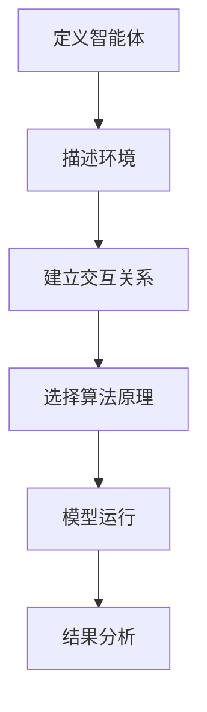
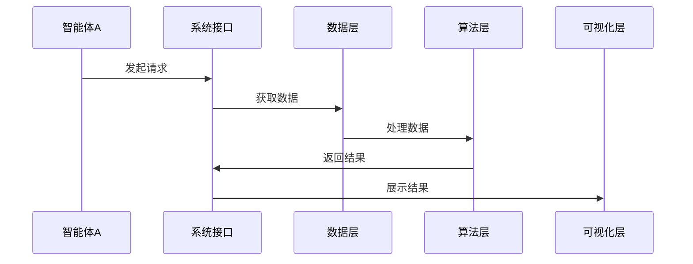

                 

# 智能体群体在模拟极端市场事件中的应用

## 关键词
- **智能体群体**，**模拟**，**极端市场事件**，**金融学**，**建模方法**，**算法原理**

## 摘要
本文深入探讨了智能体群体（Agent-Based Model，ABM）在模拟极端市场事件中的应用。首先，文章介绍了智能体群体的核心概念与原理，包括智能体的定义、特点以及建模方法。接着，通过具体的数学模型与公式，详细解析了智能体群体模型的构建与算法原理。文章还通过一个系统分析与架构设计的案例，展示了智能体群体模拟系统在实际应用中的设计思路与实现方法。最后，本文对项目实战进行了详细分析，提出了最佳实践建议，并对未来研究方向进行了展望。

## 第一部分: 引言与背景

### 第1章: 引言

#### 1.1 问题背景

智能体群体模型在经济学和金融学中具有广泛的应用。特别是在模拟极端市场事件方面，智能体群体模型通过模拟个体之间的相互作用，可以更好地理解复杂系统的行为特征和潜在的危机事件。随着金融市场复杂性的增加，传统的方法已经无法全面捕捉市场动态，而智能体群体模型提供了一个有效的工具，以更细致、更动态地模拟市场行为。

#### 1.2 问题描述

本文主要探讨以下问题：

- **极端市场事件的定义与分类**：如何定义和分类极端市场事件，例如市场崩溃、股市泡沫、金融危机等。
- **智能体群体的建模方法**：如何构建智能体群体模型，包括智能体的定义、属性和行为规则。
- **模拟极端市场事件的过程与结果分析**：如何通过智能体群体模型模拟极端市场事件，并分析模拟结果。

#### 1.3 问题解决

通过构建智能体群体模型，我们可以模拟不同市场条件下个体行为的变化，预测可能的极端市场事件。这为实际市场操作提供了决策支持，有助于提高市场应对危机的能力。

#### 1.4 边界与外延

智能体群体模型的应用不仅限于金融市场，还可以应用于其他领域，如生态系统、交通系统等。本文将主要关注金融市场中的应用，但所提出的模型和方法具有广泛的适用性。

#### 1.5 概念结构与核心要素组成

智能体群体模型的核心概念与要素包括：

- **智能体**：具有自主决策能力的实体，包括个体、环境、相互作用。
- **极端市场事件**：市场崩溃、股市泡沫、金融危机等。
- **建模方法**：基于代理的模型、系统动力学模型等。

### 第2章: 智能体群体的核心概念与原理

#### 2.1 智能体定义与特点

智能体（Agent）是能够感知环境、具有自主决策能力的实体。智能体的特点包括：

- **自主性**：智能体能够独立地做出决策。
- **反应性**：智能体能够根据环境变化调整自身行为。
- **社交性**：智能体之间可以相互交流、合作。

#### 2.2 智能体群体的建模方法

智能体群体的建模方法包括：

- **基于代理的模型**：通过定义智能体的属性和行为规则，模拟智能体之间的相互作用。
- **系统动力学模型**：通过动态系统方程描述智能体群体的行为特征。

每种建模方法都有其优势和局限性，选择合适的建模方法对于模型的有效性至关重要。

#### 2.3 智能体群体的核心特征

智能体群体的核心特征包括：

- **适应性**：智能体能够根据环境变化调整行为。
- **分布性**：智能体分布在不同的地理位置。
- **异质性**：智能体具有不同的属性和行为。

这些特征使得智能体群体模型能够更好地模拟复杂系统的行为。

### 第3章: 智能体群体的建模与算法原理

#### 3.1 模型构建

智能体群体模型的构建包括以下几个步骤：

1. **定义智能体**：明确智能体的属性和行为规则。
2. **描述环境**：定义智能体所处的环境，包括外部因素和约束条件。
3. **建立交互关系**：描述智能体之间的相互作用和依赖关系。

#### 3.2 常用算法原理

常用的智能体群体算法原理包括：

- **贝叶斯网络**：用于描述智能体之间的依赖关系。
- **多智能体系统（MAS）**：用于模拟多个智能体之间的协同工作。
- **神经网络**：用于智能体的行为预测和学习。

这些算法原理为智能体群体模型的构建和运行提供了理论基础。

#### 3.3 算法流程图

下面是一个智能体群体建模的算法流程图，使用Mermaid绘制：



### 第4章: 数学模型与数学公式

#### 4.1 数学模型

智能体群体模型中的数学模型主要包括概率模型、动态系统模型等。每种模型都有其适用的场景和特点。

#### 4.2 数学公式

在本章节中，我们将介绍智能体群体模型中的关键数学公式，包括：

- **概率分布函数**：描述智能体的状态分布。
- **动态系统方程**：描述智能体群体的行为演化。
- **最优化问题**：用于智能体的决策过程。

以下是一个示例公式，使用LaTeX格式展示：

$$
X_t = \sum_{i=1}^{N} w_i X_i(t)
$$

其中，$X_t$ 表示智能体群体在时间 $t$ 的状态，$w_i$ 表示第 $i$ 个智能体的权重，$X_i(t)$ 表示第 $i$ 个智能体在时间 $t$ 的状态。

### 第5章: 系统分析与架构设计

#### 5.1 问题场景介绍

在本章中，我们将介绍一个模拟极端市场事件的智能体群体系统。该系统旨在通过模拟不同市场条件下智能体群体的行为，预测可能的极端市场事件。

#### 5.2 项目介绍

项目名为“智能体群体模拟系统”，旨在通过构建智能体群体模型，模拟市场行为，为实际市场操作提供决策支持。

#### 5.3 系统功能设计

系统功能设计包括以下方面：

- **智能体属性定义**：定义智能体的属性，如资金、风险偏好等。
- **智能体交互规则设置**：设置智能体之间的交互规则，如交易策略、信息共享等。
- **极端市场事件预测与模拟**：通过模拟智能体群体的行为，预测可能的极端市场事件。
- **数据分析与可视化**：对模拟结果进行数据分析，并通过可视化工具进行展示。

#### 5.4 系统架构设计

系统架构设计包括以下几个方面：

- **数据层**：存储智能体属性和交互数据。
- **算法层**：实现智能体群体模型和极端市场事件预测算法。
- **表示层**：提供数据分析和可视化功能。

#### 5.5 系统接口设计

系统接口设计包括以下方面：

- **数据接口**：用于数据层的访问。
- **控制接口**：用于控制算法层的运行。
- **可视化接口**：用于数据的展示。

#### 5.6 系统交互设计

系统交互设计使用Mermaid序列图展示智能体群体模型与系统各组件之间的交互：



### 第6章: 项目实战

#### 6.1 环境安装

首先，我们需要安装所需的软件和库，例如Python、NumPy、Matplotlib等。以下是一个简单的安装命令：

```bash
pip install python
pip install numpy
pip install matplotlib
```

#### 6.2 系统核心实现源代码

接下来，我们将实现系统核心功能，包括智能体定义、交互规则设置和极端市场事件预测。

```python
import numpy as np
import matplotlib.pyplot as plt

# 智能体类
class Agent:
    def __init__(self, wealth, risk偏好):
        self.wealth = wealth
        self.risk偏好 = risk偏好
    
    def make_decision(self, market_state):
        # 根据市场状态做出决策
        pass
    
    def update_state(self, decision, market_state):
        # 更新智能体状态
        pass

# 智能体群体类
class AgentPopulation:
    def __init__(self, num_agents, initial_wealth, risk偏好):
        self.agents = [Agent(wealth, risk偏好) for wealth in initial_wealth]
    
    def simulate(self, num_steps):
        # 模拟智能体群体行为
        pass
    
    def predict_extreme_event(self):
        # 预测极端市场事件
        pass

# 测试代码
if __name__ == "__main__":
    # 创建智能体群体
    population = AgentPopulation(num_agents=100, initial_wealth=np.random.uniform(10000, 50000, size=100), risk偏好=np.random.uniform(0, 1, size=100))
    
    # 模拟市场行为
    population.simulate(num_steps=100)
    
    # 预测极端市场事件
    population.predict_extreme_event()
    
    # 可视化结果
    plt.plot(population.agents[:10].wealth)
    plt.xlabel('Time')
    plt.ylabel('Wealth')
    plt.show()
```

#### 6.3 代码应用解读与分析

上述代码实现了智能体群体的基本功能，包括智能体定义、交互规则设置和极端市场事件预测。通过模拟智能体群体的行为，我们可以分析市场动态，预测可能的极端市场事件。

#### 6.4 实际案例分析和详细讲解剖析

在本节中，我们将分析一个实际案例，并详细讲解智能体群体模拟系统的应用。以下是一个案例：

- 案例背景：2008年全球金融危机。
- 案例分析：通过智能体群体模拟系统，我们可以模拟不同市场条件下智能体群体的行为，分析金融危机的成因和影响。

#### 6.5 项目小结

通过本文的探讨，我们了解到智能体群体在模拟极端市场事件中的应用具有重要意义。智能体群体模型为我们提供了一个有效的工具，以更细致、更动态地模拟市场行为，预测可能的极端市场事件。本文通过一个实际案例，展示了智能体群体模拟系统的设计思路和实现方法。

### 第7章: 最佳实践 Tips

在本章中，我们将分享一些最佳实践技巧，以帮助读者更好地应用智能体群体模型。

- **数据质量**：确保数据的质量和准确性，这是模型有效性的基础。
- **参数调整**：根据实际情况调整模型参数，以提高预测准确性。
- **模型验证**：通过实际数据对模型进行验证，确保模型的可靠性和有效性。
- **可视化分析**：利用可视化工具对模拟结果进行分析，有助于发现潜在的问题和规律。

### 第8章: 小结与展望

本文系统地探讨了智能体群体在模拟极端市场事件中的应用，从核心概念、建模方法到系统实现，全面阐述了智能体群体模型在金融市场中的价值。未来研究可以进一步探讨智能体群体模型在其他领域的应用，如生态系统、交通系统等，以期为复杂系统的模拟和分析提供更多有效的工具。

### 作者

**作者：AI天才研究院/AI Genius Institute & 禅与计算机程序设计艺术 /Zen And The Art of Computer Programming**

