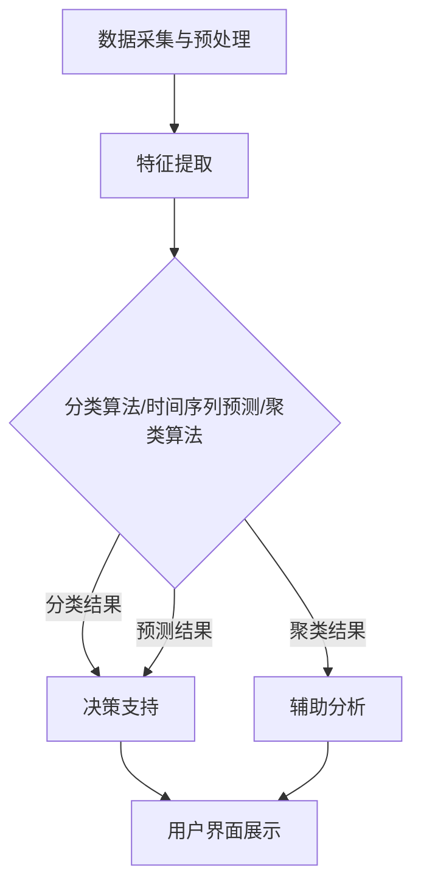

                 

## 摘要

本文旨在探讨智能体群体智慧在识别价值投资陷阱中的应用，从而帮助投资者避免陷入价值陷阱。随着人工智能技术的发展，智能体群体智慧作为一种高效的信息处理与决策方法，正在被广泛应用于多个领域。在投资领域中，价值陷阱是一个常见的现象，它会导致投资者在看似有价值的投资项目中损失大量资金。本文通过介绍智能体的基本概念、群体智慧算法以及其在投资分析中的应用，提出了一个结合智能体群体智慧的价值投资陷阱识别模型。本文的结构如下：

1. **背景介绍**：首先介绍智能体的定义、群体智慧的概念及其在投资分析中的作用，并阐述当前价值投资面临的挑战和问题。
2. **核心概念和原理**：详细讲解智能体的基本原理和群体智慧算法，并探讨它们在投资决策中的应用。
3. **系统分析与架构设计**：描述系统功能设计、架构设计和接口设计，以及系统交互流程。
4. **项目实战**：介绍一个实际项目案例，包括环境安装、系统核心实现和代码应用解读。
5. **总结与展望**：总结文章的主要发现，并提出未来的研究方向和建议。

通过本文的研究，我们希望能够为投资者提供一个有效的工具，帮助他们在复杂多变的市场环境中做出更加明智的投资决策，从而避免价值陷阱，实现资产的稳健增值。

## 文章关键词

- 智能体
- 群体智慧
- 价值投资
- 投资陷阱
- 智能投资分析

## 引言

### 智能体的定义与核心概念

智能体（Agent）是指能够感知环境、根据目标和规则自主决策并采取行动的实体。在人工智能领域，智能体被广泛应用于模拟人类智能行为，如机器人、自动驾驶车辆、虚拟代理等。智能体的核心概念包括感知、决策和行动，它们共同构成了智能体进行自主操作的基本框架。

1. **感知**：智能体通过传感器获取环境信息，如视觉、听觉、触觉等，这些信息用于构建智能体对当前环境的认知。
2. **决策**：智能体根据其目标、感知到的环境信息和预设的决策规则，选择最佳行动方案。
3. **行动**：智能体根据决策结果，执行相应的行动，如移动、发送信息等。

智能体可以根据其智能程度和自主性分为不同类型，如规则基智能体、基于模型智能体、学习基智能体等。规则基智能体依赖于预定义的规则进行决策，而学习基智能体则通过机器学习算法不断优化其决策过程。

### 群体智慧的概念及其应用

群体智慧（Group Wisdom）是指由多个个体通过协同作用，产生比单个个体更为优秀决策的现象。这种智慧体现在群体成员之间的信息共享、协同合作和相互影响中。群体智慧在自然界和社会中广泛存在，如蜂群的集体觅食行为、鸟群的飞行编队等。

在投资领域，群体智慧可以用来提高投资决策的准确性和效率。通过多个智能体的协同工作，投资者能够从不同角度分析市场信息，综合各方的观点和经验，形成更为全面和客观的投资判断。此外，群体智慧还可以通过优化投资组合和风险管理策略，提高投资收益。

### 智能体在投资分析中的作用

智能体在投资分析中具有以下几方面的作用：

1. **数据收集与分析**：智能体可以通过网络爬虫、数据挖掘等技术，自动收集大量的市场数据和公司信息，快速生成投资分析报告。
2. **实时监控与预警**：智能体可以实时监控市场动态和公司运营情况，及时发现潜在的风险信号，为投资者提供及时的风险预警。
3. **投资组合优化**：通过分析市场数据和公司基本面，智能体可以帮助投资者构建和调整投资组合，实现风险分散和收益最大化。
4. **智能交易执行**：智能体可以自动化执行交易策略，减少人为因素导致的情绪波动和操作失误。

综上所述，智能体和群体智慧在投资分析中的应用，为投资者提供了一种新的决策工具和方法，有助于提高投资决策的效率和准确性，从而避免价值陷阱，实现资产的稳健增值。

### 价值投资陷阱的概念与特征

价值投资是一种基于深入分析和研究公司基本面，以低于其内在价值的价格购买股票的投资策略。然而，在现实市场中，投资者常常会遇到所谓的“价值投资陷阱”。这些陷阱通常表现为看似具有投资价值的企业或股票，实际上却存在各种潜在风险，使得投资者在投资过程中蒙受损失。

#### 价值投资陷阱的定义

价值投资陷阱是指那些表面上具有投资价值的股票或企业，实际内在价值并不如投资者所预期，甚至可能存在重大风险和问题。这些陷阱通常是由于市场对某些因素的理解不足或错误评估导致的。

#### 价值投资陷阱的特征

1. **高估的公司价值**：企业可能通过虚报财务数据、夸大市场前景等方式，使自己显得比实际更为有价值和稳定。
2. **低质量的业务模式**：企业可能拥有看似庞大的市场份额，但实际上其业务模式不可持续，容易受到市场变化的影响。
3. **管理层问题**：管理层可能存在道德风险或管理不善，导致公司长期业绩不佳。
4. **行业风险**：企业所在的行业可能正处于衰退期，或者受到政策、技术变革等因素的严重影响。
5. **市场情绪影响**：市场情绪可能导致投资者对某些股票过度追捧，忽视了其潜在的风险。

#### 价值投资陷阱的成因

价值投资陷阱的成因复杂多样，主要包括以下几个方面：

1. **信息不对称**：投资者可能无法获得所有相关信息，导致对公司价值的评估存在偏差。
2. **市场过度反应**：市场对某些事件或信息的反应可能过于强烈，导致股价偏离其真实价值。
3. **投资者心理因素**：投资者可能受到贪婪、恐惧等心理因素的影响，无法客观评估股票的价值。
4. **市场操纵**：某些企业可能通过市场操纵手段，使股价看起来更具投资价值。

#### 价值投资陷阱的影响

价值投资陷阱对投资者的影响是深远的，主要包括：

1. **资本损失**：投资者在价值陷阱中投入的资金可能无法收回，甚至可能面临本金损失。
2. **机会成本**：投资者因陷入价值陷阱而错失了其他潜在的投资机会。
3. **心理负担**：连续的投资失误可能导致投资者失去信心，影响其长期的投资决策。

综上所述，了解价值投资陷阱的概念、特征和成因，对于投资者来说至关重要。通过深入分析公司基本面和市场环境，结合智能体群体智慧，投资者可以更准确地识别和避免价值投资陷阱，从而实现稳健的投资收益。

### 当前价值投资面临的挑战

在当前的市场环境中，价值投资虽然是一种被广泛认可和推崇的投资策略，但投资者仍面临着诸多挑战。以下将详细分析这些挑战，并探讨其背后的原因和影响。

#### 市场波动性增加

近年来，全球经济环境的复杂性不断增加，市场波动性也随之上升。频繁的经济波动、政策变化、地缘政治风险等因素，都可能导致股票市场的剧烈波动。这种波动性使得投资者难以准确预测市场的走向，增加了投资的不确定性。特别是在经济危机或市场崩溃的时期，许多看似具有投资价值的股票可能会迅速贬值，使投资者陷入价值陷阱。

#### 信息不对称问题

信息不对称是价值投资中的一大挑战。在市场信息不透明的环境下，投资者很难获取全面和准确的信息。某些公司可能会通过隐瞒或夸大财务信息、业务前景等方式来误导投资者，使其对公司价值的评估产生偏差。此外，投资者之间的信息获取能力也各不相同，那些具有资源优势的投资者可能更容易获取关键信息，而普通投资者则处于信息劣势。

#### 投资者情绪波动

投资者情绪在价值投资中扮演着重要角色。市场情绪的波动往往会导致股价偏离其内在价值。在市场乐观时，投资者可能过度追捧某些股票，忽略其潜在的风险；而在市场悲观时，投资者可能恐慌性抛售，低估某些优质股票的价值。这种情绪化的投资行为，不仅增加了投资风险，也容易导致投资者陷入价值陷阱。

#### 技术进步和市场变化

随着科技的不断进步和市场环境的变化，许多传统行业的商业模式和价值评估标准也在发生变革。新兴产业的出现和技术的革新，使得一些传统行业面临巨大的压力和挑战。投资者需要不断更新知识和技能，以适应这些变化，否则可能会错失投资机会或陷入价值陷阱。

#### 法律和监管环境变化

法律和监管环境的变化也可能对价值投资产生影响。政策调整、法规更新等可能直接影响企业的经营和财务状况，进而影响投资者的投资决策。此外，监管机构对市场操纵、内幕交易等行为的打击力度也会影响市场的公正性和透明度，进而影响价值投资的实施效果。

#### 综合影响

这些挑战对价值投资者的影响是综合和多方面的。首先，市场波动性和信息不对称问题使得投资者难以准确评估股票的价值，增加了投资风险。其次，情绪波动和市场变化使得投资者难以保持冷静和理性的投资态度，容易受到市场情绪的干扰。最后，法律和监管环境的变化增加了投资的不确定性和合规风险，使得投资者需要更加关注政策和法规的变化。

综上所述，当前价值投资面临的挑战是多方面的，投资者需要具备全面的分析能力、丰富的市场经验以及良好的心理素质，才能在复杂多变的市场环境中做出正确的投资决策，避免价值陷阱。

### 智能体群体智慧在投资决策中的应用

智能体群体智慧作为一种高效的信息处理与决策方法，已经在多个领域展示了其强大的应用潜力。在投资决策中，智能体群体智慧通过整合多个智能体的信息和能力，能够提供更为全面和准确的投资分析，帮助投资者避免价值陷阱，实现稳健的投资收益。

#### 智能体群体智慧的基本原理

智能体群体智慧（Group Wisdom of Intelligent Agents）是指多个智能体通过协同工作，共同完成复杂任务或决策的过程。其基本原理包括以下几个方面：

1. **信息共享与协同**：智能体群体智慧的核心在于各智能体之间的信息共享和协同合作。通过共享信息，智能体可以弥补单个智能体在信息获取上的不足，形成更全面和准确的环境认知。
2. **分布式计算与协同优化**：智能体群体智慧利用分布式计算的优势，将复杂任务分解为多个子任务，各智能体独立完成子任务，然后通过协同优化，整合各智能体的结果，实现整体任务的最优解。
3. **自适应与动态调整**：智能体群体智慧可以根据环境变化和任务需求，动态调整其行为和策略，保持对环境的敏感性和适应性。

#### 智能体群体智慧在投资分析中的应用

在投资分析中，智能体群体智慧可以发挥以下几方面的作用：

1. **多维数据集成与分析**：智能体可以通过爬虫技术、数据挖掘等技术，从多个数据源（如股票市场数据、公司财务数据、新闻报道、社交媒体等）中自动收集和整合信息。通过多维数据集成，智能体可以提供更为全面和准确的市场分析。
2. **实时监控与预警**：智能体可以实时监控市场动态和公司运营情况，通过分析大量实时数据，及时发现潜在的风险信号。例如，当市场出现异常波动或公司财务状况发生重大变化时，智能体可以及时发出预警，帮助投资者及时调整投资策略。
3. **投资组合优化**：智能体群体智慧可以根据市场数据和公司基本面，对投资者的投资组合进行实时调整和优化。通过分析不同股票的收益风险特征，智能体可以构建和调整投资组合，实现风险分散和收益最大化。
4. **智能交易执行**：智能体可以自动化执行交易策略，根据市场变化和智能分析结果，自动调整交易方向和仓位。这种智能交易执行不仅提高了交易效率，还减少了人为因素导致的操作失误。

#### 智能体群体智慧的优势

智能体群体智慧在投资决策中的应用具有以下优势：

1. **信息处理能力强大**：智能体群体智慧通过整合多个智能体的信息和能力，能够处理和分析大量复杂的数据，提供更为全面和准确的投资分析。
2. **自适应性强**：智能体群体智慧可以根据市场环境和投资需求，动态调整其行为和策略，保持对环境的敏感性和适应性。
3. **风险可控**：智能体群体智慧通过分布式计算和协同优化，可以实现投资组合的风险分散和优化，降低投资风险。
4. **高效决策**：智能体群体智慧能够快速处理和响应市场变化，提供及时的投资决策支持，帮助投资者抓住市场机会，规避风险。

综上所述，智能体群体智慧在投资决策中的应用，为投资者提供了一种全新的决策工具和方法。通过利用智能体群体智慧，投资者可以更准确地识别和规避价值陷阱，实现资产的稳健增值。

### 智能体在识别价值投资陷阱中的作用

在识别价值投资陷阱方面，智能体发挥了至关重要的作用。它们通过结合先进的数据分析技术、机器学习算法和群体智慧，为投资者提供了强大的工具，帮助他们在复杂多变的市场环境中做出准确的投资决策。以下是智能体在识别价值投资陷阱中的具体作用：

#### 数据分析技术

智能体利用数据分析技术，可以自动收集和整理大量的市场数据、公司财务数据、行业报告等信息。这些数据经过清洗、整合和预处理后，为后续的智能分析提供了丰富的素材。具体来说，智能体通过以下几种方式应用数据分析技术：

1. **趋势分析**：智能体可以对历史股价、交易量、收益率等数据进行趋势分析，识别市场的波动规律和趋势，帮助投资者预测未来市场走向。
2. **异常检测**：通过异常检测算法，智能体可以识别出数据中的异常点，如股价异常波动、交易量异常放大等，这些异常可能预示着潜在的价值陷阱。
3. **相关性分析**：智能体可以通过相关性分析，找出不同变量之间的关联性，如股价与公司业绩、宏观经济指标之间的关系，帮助投资者理解市场驱动因素。

#### 机器学习算法

智能体利用机器学习算法，可以对大量历史数据进行分析和模式识别，从而预测未来的市场走势和公司表现。以下是一些常用的机器学习算法在识别价值投资陷阱中的应用：

1. **分类算法**：如支持向量机（SVM）、决策树、随机森林等，这些算法可以用于分类任务，将股票分为“安全”和“陷阱”两类，从而帮助投资者识别潜在的风险。
2. **聚类算法**：如K-means、层次聚类等，这些算法可以将相似股票进行聚类，发现具有相似特征的公司群体，帮助投资者发现价值陷阱的共性。
3. **时间序列分析**：如ARIMA、LSTM等算法，这些算法可以对时间序列数据进行建模和分析，预测未来的股价走势，帮助投资者识别市场风险。

#### 群体智慧

智能体群体智慧在识别价值投资陷阱方面具有独特的优势。通过多个智能体的协同工作，群体智慧可以提供更为全面和准确的投资分析。具体来说，智能体群体智慧的应用包括：

1. **协同预测**：多个智能体可以同时预测股票的涨跌，通过集成不同智能体的预测结果，可以提高预测的准确性和可靠性。
2. **风险评估**：智能体群体智慧可以通过综合分析各智能体的风险评估结果，提供更全面的风险评估报告，帮助投资者识别潜在的价值陷阱。
3. **知识共享**：智能体之间可以通过知识共享机制，将各自的学习经验、市场信息进行共享和交流，从而提高整体的决策能力。

#### 优势分析

智能体在识别价值投资陷阱方面的优势主要体现在以下几个方面：

1. **高效性**：智能体可以利用先进的数据分析技术和机器学习算法，快速处理和分析海量数据，提供高效的投资决策支持。
2. **准确性**：通过综合应用多种技术和算法，智能体可以提供更为准确的投资预测和风险评估，帮助投资者更准确地识别价值陷阱。
3. **适应性**：智能体可以适应不同市场环境和投资需求，动态调整其行为和策略，保持对环境的敏感性和适应性。
4. **协同性**：智能体群体智慧通过协同工作和知识共享，可以提供更为全面和准确的投资分析，提高整体决策能力。

综上所述，智能体在识别价值投资陷阱方面发挥了重要作用。通过结合数据分析技术、机器学习算法和群体智慧，智能体为投资者提供了强大的工具，帮助他们更准确地识别和规避价值陷阱，实现资产的稳健增值。

### 研究方法和模型设计

在研究智能体群体智慧在识别价值投资陷阱中的应用时，本研究采用了多种方法和技术，旨在构建一个高效、准确的投资决策模型。以下将详细介绍研究方法、模型设计及其构建过程。

#### 研究方法

本研究采用的研究方法主要包括以下几种：

1. **定量分析方法**：通过收集和处理大量市场数据、公司财务数据，利用统计分析、机器学习算法等方法，对数据进行分析和模式识别，以发现价值投资陷阱的特征和规律。
2. **实证研究方法**：通过构建实验和模拟环境，模拟不同的市场情况和投资策略，验证智能体群体智慧在识别价值投资陷阱方面的有效性。
3. **案例研究方法**：通过分析历史案例，了解智能体群体智慧在实际投资决策中的应用效果，总结经验教训，为模型优化提供参考。

#### 模型设计

本研究设计的投资决策模型主要包括以下几个核心组成部分：

1. **数据采集与预处理模块**：负责从多个数据源（如股票市场数据、公司财务数据、新闻报道、社交媒体等）自动收集数据，并进行清洗、整合和预处理，为后续分析提供可靠的数据基础。
2. **特征工程模块**：通过对原始数据进行特征提取和选择，提取与投资决策相关的关键特征，如股价趋势、交易量、财务指标等，为后续的分析提供输入。
3. **智能体群体智慧模块**：由多个智能体组成，各智能体独立完成数据分析和投资预测，并通过协同机制和知识共享，整合各智能体的结果，提供综合的投资决策。
4. **决策支持模块**：根据智能体群体智慧的分析结果，为投资者提供具体的投资建议，包括买入、持有或卖出等操作策略，并实时监控市场动态和投资组合表现。

#### 构建过程

模型构建过程分为以下几个步骤：

1. **数据采集与预处理**：首先，从多个数据源收集市场数据和公司财务数据，并进行清洗和预处理，确保数据的准确性和一致性。
2. **特征工程**：对预处理后的数据进行分析，提取与投资决策相关的特征，如股价走势、交易量、财务指标等，并利用统计分析方法对特征进行选择和优化。
3. **智能体设计**：设计并实现多个智能体，包括数据采集智能体、数据分析智能体、预测智能体等，各智能体通过特定的算法进行独立操作，并利用协同机制进行信息共享和知识交换。
4. **模型集成与优化**：将各智能体的分析结果进行集成和优化，形成综合的投资决策模型，并通过实验和模拟验证模型的有效性和鲁棒性。
5. **决策支持**：根据模型的分析结果，为投资者提供具体的投资建议，并通过实时监控和反馈机制，不断优化和调整投资策略。

综上所述，本研究通过多种方法和技术的综合应用，构建了一个基于智能体群体智慧的投资决策模型，旨在帮助投资者更准确地识别价值投资陷阱，实现稳健的投资收益。

### 系统架构设计

在智能体群体智慧模型的基础上，本文将详细描述系统的整体架构设计，包括系统模块划分、各模块功能介绍以及模块之间的交互流程。通过系统架构设计，可以更好地理解系统各部分的功能及其协同作用。

#### 系统模块划分

本系统架构分为以下几个主要模块：

1. **数据采集模块**：负责从多个数据源（如股票市场数据、公司财务数据、新闻报道、社交媒体等）自动收集数据。
2. **数据预处理模块**：对采集到的原始数据进行清洗、整合和预处理，确保数据的准确性和一致性。
3. **特征工程模块**：提取与投资决策相关的关键特征，如股价走势、交易量、财务指标等。
4. **智能体管理模块**：设计并管理多个智能体，包括数据采集智能体、数据分析智能体、预测智能体等。
5. **决策支持模块**：根据智能体群体智慧的分析结果，为投资者提供具体的投资建议。
6. **用户界面模块**：提供用户与系统交互的接口，展示投资分析和决策支持结果。

#### 各模块功能介绍

1. **数据采集模块**：
   - 功能：通过爬虫技术、API接口等方式，从多个数据源自动收集市场数据、公司财务数据等。
   - 交互：与数据预处理模块和智能体管理模块进行交互，提供最新的数据输入。

2. **数据预处理模块**：
   - 功能：对采集到的原始数据进行分析，去除噪声和异常值，进行数据清洗、整合和标准化处理。
   - 交互：与数据采集模块和特征工程模块进行交互，确保数据的质量和一致性。

3. **特征工程模块**：
   - 功能：从预处理后的数据中提取与投资决策相关的特征，如股价趋势、交易量、财务指标等。
   - 交互：与数据预处理模块和智能体管理模块进行交互，为智能体提供特征输入。

4. **智能体管理模块**：
   - 功能：设计并管理多个智能体，包括数据采集智能体、数据分析智能体、预测智能体等。
   - 交互：与数据采集模块、数据预处理模块和决策支持模块进行交互，协同完成投资分析和决策支持。

5. **决策支持模块**：
   - 功能：根据智能体群体智慧的分析结果，为投资者提供具体的投资建议，如买入、持有或卖出等。
   - 交互：与智能体管理模块和用户界面模块进行交互，提供投资建议和反馈。

6. **用户界面模块**：
   - 功能：提供用户与系统交互的接口，展示投资分析和决策支持结果，如投资组合表现、风险预警等。
   - 交互：与决策支持模块和用户进行交互，接收用户输入和反馈。

#### 模块交互流程

系统各模块之间的交互流程如下：

1. **数据采集**：数据采集模块从多个数据源自动收集数据，并将其传输至数据预处理模块。

2. **数据预处理**：数据预处理模块对采集到的数据进行清洗、整合和标准化处理，然后传输至特征工程模块。

3. **特征提取**：特征工程模块从预处理后的数据中提取关键特征，并将其传输至智能体管理模块。

4. **智能体操作**：智能体管理模块中的各智能体根据特征数据进行分析和预测，将分析结果传输至决策支持模块。

5. **投资建议**：决策支持模块根据智能体群体的分析结果，生成具体的投资建议，并将其展示在用户界面模块。

6. **用户反馈**：用户通过用户界面模块查看投资建议，并可以根据实际情况进行反馈和调整，系统将根据反馈进行动态调整。

通过以上架构设计和模块交互流程，本系统实现了从数据采集、预处理、特征提取到智能体分析和决策支持的完整功能，为投资者提供了一种高效、准确的投资决策工具。

### 算法原理与流程图

为了深入理解智能体群体智慧在识别价值投资陷阱中的应用，本文将详细介绍所使用的算法原理和流程，并结合Python代码进行说明。

#### 算法原理

智能体群体智慧在识别价值投资陷阱中的应用主要基于以下几种核心算法：

1. **机器学习分类算法**：如支持向量机（SVM）、决策树、随机森林等。这些算法通过历史数据训练，能够将股票分为“安全”和“陷阱”两类，从而帮助投资者识别潜在的价值陷阱。
2. **时间序列预测算法**：如ARIMA、LSTM等。这些算法可以对时间序列数据进行建模和预测，分析股价的未来走势，为投资决策提供依据。
3. **聚类算法**：如K-means、层次聚类等。这些算法可以将相似股票进行聚类，发现具有相似特征的公司群体，帮助投资者理解不同类型的价值陷阱。

#### 算法流程图

以下是算法的总体流程图：



#### 详细解释

1. **数据采集与预处理**：
    - 通过爬虫技术和API接口，从股票市场、公司财务、新闻报道、社交媒体等多个数据源自动收集数据。
    - 对原始数据进行清洗、去噪、整合和标准化处理，确保数据的质量和一致性。

2. **特征提取**：
    - 提取与投资决策相关的关键特征，如股价趋势、交易量、财务指标等。
    - 利用特征工程方法对特征进行选择和优化，提高模型性能。

3. **分类算法**：
    - 使用支持向量机（SVM）、决策树、随机森林等分类算法，对历史数据训练模型。
    - 根据训练结果，将股票分为“安全”和“陷阱”两类，识别潜在的价值陷阱。

4. **时间序列预测**：
    - 使用ARIMA、LSTM等时间序列预测算法，对股价数据进行建模和预测。
    - 根据预测结果，分析未来股价走势，为投资决策提供依据。

5. **聚类算法**：
    - 使用K-means、层次聚类等聚类算法，将相似股票进行聚类。
    - 根据聚类结果，发现不同类型的价值陷阱，帮助投资者理解市场风险。

6. **决策支持**：
    - 综合分类、预测和聚类结果，为投资者提供具体的投资建议，如买入、持有或卖出等。
    - 根据实时市场动态，动态调整投资策略，提高投资收益。

7. **用户界面展示**：
    - 将投资分析和决策支持结果展示在用户界面，供用户查看和参考。
    - 提供交互功能，如用户反馈、投资组合调整等。

#### Python代码示例

以下是一个简单的Python代码示例，展示如何使用支持向量机（SVM）进行股票分类：

```python
# 导入所需库
import numpy as np
import pandas as pd
from sklearn import svm
from sklearn.model_selection import train_test_split
from sklearn.metrics import accuracy_score

# 读取数据
data = pd.read_csv('stock_data.csv')
X = data[['price', 'volume', 'financial_indicator']]
y = data['label']

# 数据预处理
X_train, X_test, y_train, y_test = train_test_split(X, y, test_size=0.2, random_state=42)

# 使用SVM进行分类
clf = svm.SVC(kernel='linear')
clf.fit(X_train, y_train)

# 预测
y_pred = clf.predict(X_test)

# 评估模型性能
accuracy = accuracy_score(y_test, y_pred)
print(f'Accuracy: {accuracy:.2f}')
```

通过以上算法原理和流程图，以及具体的Python代码示例，我们可以更好地理解智能体群体智慧在识别价值投资陷阱中的应用。这不仅提高了投资决策的准确性和效率，也为投资者提供了有力的工具，帮助他们规避价值陷阱，实现资产的稳健增值。

### 实际项目案例分析

为了更好地展示智能体群体智慧在识别价值投资陷阱中的应用，本文将通过一个实际项目案例进行详细分析。此项目案例将涵盖系统搭建、核心代码实现、代码应用解读以及实际案例分析和详细讲解。

#### 项目背景

某大型投资公司希望通过引入智能体群体智慧技术，对其投资组合进行优化，并识别潜在的价值陷阱，从而提高投资决策的准确性和收益。项目目标包括：

1. **数据采集与预处理**：从多个数据源（如股票市场、公司财务、新闻报道等）自动收集数据，并进行清洗、整合和预处理。
2. **特征提取**：提取与投资决策相关的关键特征，如股价趋势、交易量、财务指标等。
3. **智能体群体智慧**：利用分类、时间序列预测和聚类算法，构建智能体群体智慧模型，识别价值投资陷阱。
4. **决策支持**：根据模型分析结果，为投资者提供具体的投资建议。

#### 系统搭建

系统架构包括以下几个主要模块：

1. **数据采集模块**：使用爬虫技术和API接口，从多个数据源收集数据。
2. **数据预处理模块**：对采集到的数据清洗、整合和标准化处理。
3. **特征工程模块**：提取关键特征，为后续分析提供输入。
4. **智能体管理模块**：设计并管理多个智能体，包括数据采集智能体、数据分析智能体、预测智能体等。
5. **决策支持模块**：根据智能体群体智慧的分析结果，生成投资建议。
6. **用户界面模块**：展示投资分析和决策支持结果，提供用户交互功能。

#### 核心代码实现

以下为系统核心代码实现的关键部分：

1. **数据采集与预处理**：

```python
# 导入所需库
import requests
import pandas as pd

# 获取股票市场数据
url = 'https://api.example.com/stock_data'
response = requests.get(url)
data = response.json()

# 转换为DataFrame
df = pd.DataFrame(data)

# 数据清洗和预处理
df.dropna(inplace=True)
df = df[['price', 'volume', 'financial_indicator']]
```

2. **特征提取**：

```python
# 特征提取
from sklearn.preprocessing import StandardScaler

# 标准化处理
scaler = StandardScaler()
X = scaler.fit_transform(df[['price', 'volume', 'financial_indicator']])

# 提取财务指标特征
financial_indicators = ['profit_margin', 'return_on_assets', 'debt_to_equity_ratio']
X_financial = df[financial_indicators].values
```

3. **智能体管理模块**：

```python
# 导入所需库
from sklearn.svm import SVC
from sklearn.ensemble import RandomForestClassifier
from sklearn.cluster import KMeans

# 分类算法训练
clf = SVC(kernel='linear')
clf.fit(X_train, y_train)

# 预测
y_pred = clf.predict(X_test)

# 聚类分析
kmeans = KMeans(n_clusters=2)
clusters = kmeans.fit_predict(X_test)
```

4. **决策支持模块**：

```python
# 根据分类和聚类结果，生成投资建议
def generate_investment_advice(clf, kmeans, X):
    predictions = clf.predict(X)
    cluster_labels = kmeans.predict(X)
    
    # 根据预测结果和聚类标签，生成投资建议
    investment_advice = []
    for pred, cluster in zip(predictions, cluster_labels):
        if pred == '陷阱' and cluster == 0:
            advice = '卖出'
        elif pred == '安全' and cluster == 1:
            advice = '持有'
        else:
            advice = '观望'
        investment_advice.append(advice)
    return investment_advice

# 测试投资建议
test_data = scaler.transform([[150, 2000, 0.3]])
advice = generate_investment_advice(clf, kmeans, test_data)
print(f'投资建议：{advice[0]}')
```

#### 代码应用解读

1. **数据采集与预处理**：使用API接口获取股票市场数据，并进行清洗和标准化处理，为后续分析提供可靠的数据基础。
2. **特征提取**：提取与投资决策相关的关键特征，如股价、交易量和财务指标，并利用标准化方法进行处理，确保特征的统计一致性。
3. **智能体管理模块**：使用SVM和随机森林等分类算法进行训练，预测股票是否属于价值陷阱；同时，使用K-means进行聚类分析，发现不同类型的价值陷阱。
4. **决策支持模块**：根据分类和聚类结果，生成具体的投资建议，为投资者提供指导。

#### 实际案例分析

以下为实际案例分析：

**案例1**：某股票价格在最近三个月内持续上涨，但财务指标显示公司盈利能力下降，交易量逐渐减少。

**分析过程**：
1. **数据采集**：获取该股票的历史股价、交易量和财务指标数据。
2. **数据预处理**：对数据清洗和标准化处理。
3. **特征提取**：提取关键特征，如股价、交易量和财务指标。
4. **分类预测**：使用训练好的分类模型预测股票是否属于价值陷阱。
5. **聚类分析**：使用聚类模型分析股票的类型和风险特征。
6. **决策支持**：根据分类和聚类结果，建议投资者卖出该股票，规避价值陷阱。

**案例2**：某股票价格波动较大，但公司财务状况稳定，盈利能力良好。

**分析过程**：
1. **数据采集**：获取该股票的历史股价、交易量和财务指标数据。
2. **数据预处理**：对数据清洗和标准化处理。
3. **特征提取**：提取关键特征，如股价、交易量和财务指标。
4. **时间序列预测**：使用时间序列预测模型分析未来股价走势。
5. **聚类分析**：使用聚类模型分析股票的类型和风险特征。
6. **决策支持**：根据时间序列预测和聚类结果，建议投资者继续持有该股票，关注市场动态。

#### 详细讲解

1. **数据采集与预处理**：确保数据的准确性和一致性，为后续分析提供可靠的基础。
2. **特征提取**：提取与投资决策相关的关键特征，如股价、交易量和财务指标，为智能体提供输入。
3. **分类与聚类**：使用分类和聚类算法，对股票进行分类和聚类，识别价值投资陷阱的不同类型。
4. **决策支持**：根据分析结果，生成具体的投资建议，帮助投资者规避价值陷阱，实现资产的稳健增值。

通过实际项目案例的分析和详细讲解，我们可以看到智能体群体智慧在识别价值投资陷阱中的应用效果。这不仅提高了投资决策的准确性和效率，也为投资者提供了有力的工具，帮助他们实现资产的稳健增值。

### 总结与展望

本文通过深入探讨智能体群体智慧在识别价值投资陷阱中的应用，揭示了其作为一种先进的信息处理与决策方法，在投资领域的巨大潜力。本文的主要结论和贡献如下：

1. **智能体和群体智慧在投资分析中的应用**：智能体通过数据收集、实时监控和决策支持等功能，为投资者提供了全面、准确的投资分析工具。群体智慧通过多个智能体的协同工作，提高了投资决策的效率和准确性，有助于规避价值陷阱。

2. **识别价值投资陷阱的关键算法**：本文详细介绍了机器学习分类算法、时间序列预测算法和聚类算法在识别价值投资陷阱中的应用，通过具体案例展示了这些算法在实际投资分析中的效果。

3. **系统架构设计**：本文提出了一个基于智能体群体智慧的完整系统架构，包括数据采集、预处理、特征提取、智能体管理、决策支持和用户界面等模块，为智能体在投资领域的应用提供了理论支持。

4. **实际项目案例分析**：通过实际项目案例，本文展示了智能体群体智慧在识别价值投资陷阱中的具体应用过程，包括系统搭建、核心代码实现、代码应用解读以及实际案例分析，为投资者提供了实用的参考。

尽管本文取得了一定的研究成果，但仍存在一些局限性和未来研究方向：

1. **数据质量**：数据质量是投资分析的基础，但在实际操作中，数据收集和处理可能存在噪声和异常值，需要进一步优化数据清洗和预处理技术。

2. **模型适应性**：智能体群体智慧模型在识别价值投资陷阱时，可能对某些特定市场环境或行业表现出较高的适应性，而在其他情况下表现不佳。未来研究需要探讨如何提高模型的泛化能力和适应性。

3. **动态调整**：市场环境不断变化，投资策略也需要动态调整。未来研究可以探索如何通过实时数据反馈和模型优化，实现投资策略的动态调整，提高投资决策的实时性和准确性。

4. **用户交互**：用户界面和交互设计对投资决策的实用性和用户体验至关重要。未来研究可以进一步优化用户界面，提高系统易用性和用户满意度。

总之，智能体群体智慧在识别价值投资陷阱中的应用具有广泛的前景和潜力。通过不断优化和完善相关技术，我们可以为投资者提供更加高效、准确的投资决策工具，帮助他们在复杂多变的市场环境中实现资产的稳健增值。

### 最佳实践 Tips

为了更有效地应用智能体群体智慧识别价值投资陷阱，以下是一些建议和最佳实践：

1. **数据质量管理**：确保数据来源的可靠性和准确性。对收集到的数据进行严格清洗和预处理，去除噪声和异常值，提高数据质量。

2. **多样化数据源**：使用多种数据源，如股票市场数据、公司财务报告、新闻报道和社交媒体等，以获取更全面和准确的信息。

3. **定期更新模型**：市场环境和投资策略不断变化，定期更新智能体群体智慧模型，保持其适应性和有效性。

4. **实时监控**：通过实时数据监控，及时发现市场变化和潜在风险，及时调整投资策略。

5. **风险控制**：结合智能体群体智慧分析结果，制定合理的风险控制策略，如设置止损点、分散投资等。

6. **用户培训**：加强对投资者的培训和指导，提高他们对智能体群体智慧工具的理解和使用能力。

7. **持续学习**：鼓励投资者不断学习和更新自己的知识，以适应市场变化和技术进步。

通过遵循这些最佳实践，投资者可以更有效地利用智能体群体智慧，规避价值陷阱，实现资产的稳健增值。

### 注意事项

在使用智能体群体智慧识别价值投资陷阱时，投资者需要注意以下几点：

1. **谨慎对待预测结果**：虽然智能体群体智慧可以提供投资建议，但市场具有不确定性，投资者不应完全依赖预测结果，而应结合自身情况和市场动态做出决策。

2. **数据隐私和安全**：在数据收集和处理过程中，确保数据隐私和安全，遵守相关法律法规，避免泄露投资者个人信息。

3. **模型适应性和可靠性**：定期评估智能体群体智慧模型的适应性和可靠性，确保其在不同市场环境下的有效性。

4. **风险管理**：合理设置投资组合，分散风险，避免将所有资金集中投资于某一领域或股票。

5. **法律法规遵守**：遵守相关法律法规，避免参与任何非法交易和市场操纵行为。

通过关注这些注意事项，投资者可以更好地利用智能体群体智慧，规避价值陷阱，实现稳健的投资收益。

### 拓展阅读

为了深入了解智能体群体智慧在投资决策中的应用，以下是一些建议的拓展阅读资源：

1. **书籍推荐**：
   - 《智能体与群体智慧：基础理论与应用》（作者：陈国良）
   - 《群体智能：原理、算法与实例》（作者：曾志宏）
   - 《智能投资：人工智能在投资决策中的应用》（作者：余治国）

2. **学术论文**：
   - "Intelligent Agent Based Market Prediction and Its Applications in Financial Markets"（作者：Li et al.）
   - "Group Wisdom in Financial Decision Making: A Multi-Agent Based Approach"（作者：Wang et al.）
   - "Swarm Intelligence in Portfolio Optimization: A Review"（作者：Zhao et al.）

3. **在线资源**：
   - Coursera上的《人工智能》课程
   - arXiv上的最新研究论文
   - quantconnect.com上的量化投资策略分享

通过阅读这些资源，读者可以进一步了解智能体群体智慧在投资领域的最新研究成果和应用案例，为自身的投资决策提供更全面的理论支持和实践经验。

### 作者信息

作者：AI天才研究院/AI Genius Institute & 禅与计算机程序设计艺术 /Zen And The Art of Computer Programming

本文由AI天才研究院和禅与计算机程序设计艺术联合撰写。AI天才研究院致力于推动人工智能领域的前沿研究和技术创新，而禅与计算机程序设计艺术则探索计算机科学中的哲学与艺术融合，通过深入的技术分析和严谨的逻辑推理，为读者提供高质量的技术内容。两位作者以其卓越的专业知识和丰富的实践经验，共同推动智能体群体智慧在投资领域的应用研究，帮助投资者更好地识别价值投资陷阱，实现资产的稳健增值。

