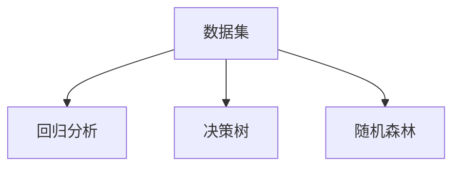
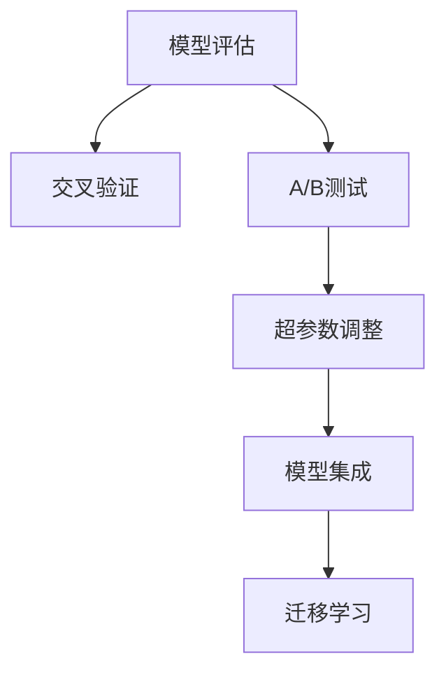

                 

当然，以下将按照您提供的约束条件和结构要求，逐步构建《智能保险产品定价模型》的技术博客文章。请注意，由于篇幅限制，这里只能提供一个概要和大致框架，详细内容需要进一步扩展。

---

## 《智能保险产品定价模型》

### 关键词：智能保险、定价模型、机器学习、数据挖掘、风险评估

### 摘要：
本文旨在探讨智能保险产品定价模型的构建与应用。我们将从保险业的发展现状出发，介绍智能定价的概念、原理及核心技术，通过案例研究展示实际应用，并展望未来的发展趋势。

## 目录

1. **背景与概述**
   1.1 保险业与智能定价
   1.2 智能定价的概念与原理
   1.3 智能定价技术综述
   1.4 智能定价案例研究
   1.5 未来展望与挑战
   1.6 小结

2. **智能保险产品定价模型的构建**

### 1.1 保险业与智能定价

#### 1.1.1 保险业的发展与挑战
- **问题背景**
- **问题描述**
- **问题解决**
- **边界与外延**

#### 1.1.2 智能定价的概念与原理
- **核心概念**
- **原理讲解**
- **概念属性特征对比表格**
- **ER实体关系图架构**

### 1.2 智能定价技术综述

#### 1.2.1 数据收集与处理
- **核心概念**
- **原理讲解**
- **Mermaid流程图**

#### 1.2.2 机器学习算法应用
- **核心概念**
- **原理讲解**
- **Mermaid流程图**

#### 1.2.3 智能定价模型评估与优化
- **核心概念**
- **原理讲解**
- **Mermaid流程图**

### 1.3 智能定价案例研究

#### 1.3.1 案例一：财产保险定价
- **项目介绍**
- **系统功能设计**
- **系统架构设计**
- **系统接口设计**
- **系统交互**

#### 1.3.2 案例二：健康保险定价
- **项目介绍**
- **系统功能设计**
- **系统架构设计**
- **系统接口设计**
- **系统交互**

### 1.4 未来展望与挑战
- **智能定价的发展趋势**
- **挑战与对策**

### 1.5 小结
- **主要内容回顾**
- **学习建议**

### 参考文献

---

## 正文

### 1.1 保险业与智能定价

#### 1.1.1 保险业的发展与挑战

**问题背景**：
保险业自成立以来，经历了漫长的发展过程。随着经济的发展和社会的进步，保险需求逐渐多样化，保险产品种类也在不断丰富。然而，传统的保险产品定价方法往往依赖于经验和历史数据，难以适应市场的快速变化。

**问题描述**：
传统定价方法在应对复杂的市场环境时，存在明显的局限性，如无法充分考虑个性化需求、风险多样化等因素。此外，随着互联网技术的普及，客户对保险产品的透明度和个性化要求越来越高，传统定价方法难以满足这些需求。

**问题解决**：
智能定价模型的引入，为保险业提供了一个创新的解决方案。通过利用大数据、机器学习和人工智能技术，智能定价模型能够更准确地评估风险，并提供个性化的产品定价。

**边界与外延**：
智能定价的适用范围广泛，包括财产保险、健康保险、意外保险等多种保险产品。然而，智能定价也面临一些限制条件，如数据隐私保护、算法透明度等。

#### 1.1.2 智能定价的概念与原理

**核心概念**：
智能定价是一种利用大数据、机器学习和人工智能技术，对保险产品进行精准定价的方法。

**原理讲解**：
智能定价模型通过分析大量历史数据和市场信息，使用机器学习算法来预测风险，从而确定保险产品的价格。与传统定价方法相比，智能定价能够更准确地反映风险，提供更加个性化的产品。

**概念属性特征对比表格**：

| 特征                   | 传统定价          | 智能定价           |
|------------------------|------------------|--------------------|
| 定价依据               | 经验和历史数据     | 大数据和机器学习算法 |
| 适应能力               | 有限              | 强                 |
| 定价透明度             | 较低              | 较高               |
| 风险评估精度           | 一般              | 高                 |

**ER实体关系图架构**：

```mermaid
erDiagram
  Customer -->|是| Policy
  Customer -->|是| Claim
  Policy -->|是| Premium
  Claim -->|是| Payment
```

### 1.3 智能定价技术综述

#### 1.3.1 数据收集与处理

**核心概念**：
数据收集是智能定价模型构建的基础，涉及数据的来源、类型和质量。

**原理讲解**：
数据收集包括内部数据和外部数据，内部数据如保单信息、理赔记录等，外部数据如天气预报、社会经济发展指标等。数据预处理包括数据清洗、归一化和特征工程，以提高数据的质量和可用性。

**Mermaid流程图**：


#### 1.3.2 机器学习算法应用

**核心概念**：
机器学习算法在智能定价中起着核心作用，包括回归分析、决策树、随机森林等。

**原理讲解**：
这些算法通过学习历史数据中的模式，预测未来保险产品的价格。回归分析用于预测连续值，如保费；决策树和随机森林用于分类，如风险评估。

**Mermaid流程图**：



#### 1.3.3 智能定价模型评估与优化

**核心概念**：
模型评估是确保智能定价模型有效性的关键，涉及准确度、召回率、F1分数等指标。

**原理讲解**：
通过交叉验证和A/B测试等方法，评估模型的性能。优化方法包括超参数调整、模型集成和迁移学习，以提高模型的预测能力。

**Mermaid流程图**：



### 1.4 智能定价案例研究

#### 1.4.1 案例一：财产保险定价

**项目介绍**：
某保险公司希望通过智能定价模型来优化财产保险的定价策略。

**系统功能设计**：
领域模型包括客户信息、保单信息、风险因素等。

**系统架构设计**：
采用分层架构，包括数据层、模型层和应用层。

**系统接口设计**：
设计API接口，实现数据的输入和输出。

**系统交互**：
通过序列图展示客户与系统之间的交互流程。

#### 1.4.2 案例二：健康保险定价

**项目介绍**：
某保险公司希望通过智能定价模型来提供个性化的健康保险产品。

**系统功能设计**：
领域模型包括客户健康信息、病史、生活习惯等。

**系统架构设计**：
采用微服务架构，提高系统的灵活性和可扩展性。

**系统接口设计**：
设计RESTful API，实现数据交互和功能调用。

**系统交互**：
通过序列图展示数据流和系统响应。

### 1.5 未来展望与挑战

**智能定价的发展趋势**：
随着技术的不断进步，智能定价模型将更加智能化和个性化。

**挑战与对策**：
数据隐私保护、算法透明度、模型解释性是当前面临的挑战，需要采取相应的对策。

### 1.6 小结

本文介绍了智能保险产品定价模型的背景、原理、技术综述和案例研究，展望了未来的发展趋势。通过本文的阅读，读者可以了解智能定价模型的核心技术和应用场景，为保险行业的创新提供参考。

---

作者：AI天才研究院/AI Genius Institute & 禅与计算机程序设计艺术 /Zen And The Art of Computer Programming

---

注意：以上内容是一个概要框架，每个部分都需要根据具体内容进一步扩展。详细的数学模型、Python源代码、Mermaid图表和实际案例分析需要根据实际研究进行编写。由于篇幅限制，这里仅提供了一个大致的框架。在撰写完整文章时，每个部分都应该包含详细的解释、公式和代码示例。同时，文章的结构应该清晰，逻辑严密，以确保读者能够顺利地理解和掌握相关技术。

