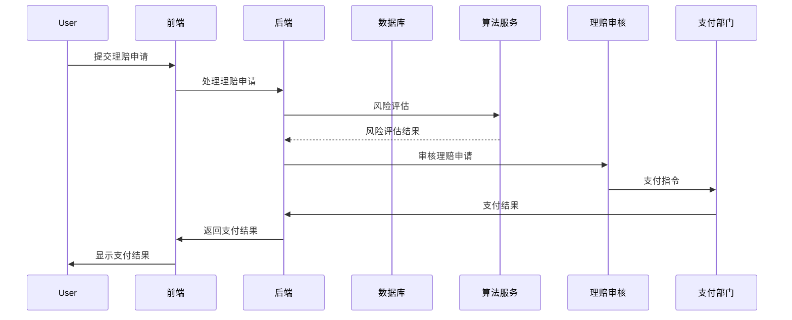
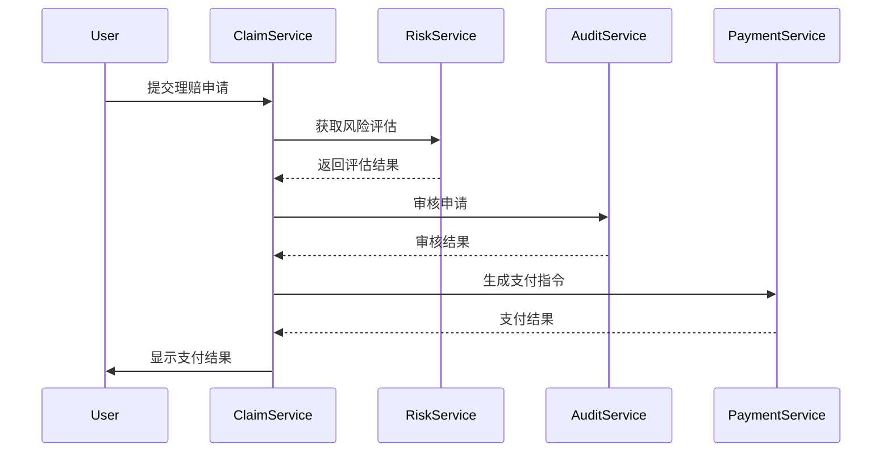
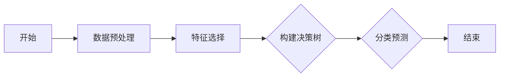
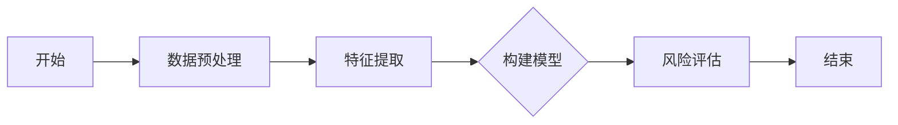

                 

### 《智能保险理赔处理系统》

关键词：智能保险、理赔处理、系统设计、算法、机器学习

摘要：本文深入探讨了智能保险理赔处理系统的概念、设计原则以及实际应用。通过详细的系统分析和架构设计，我们揭示了智能理赔处理的算法原理和数学模型。随后，通过实际项目实战，本文展示了系统的实现过程和具体应用，并总结了项目中的最佳实践和注意事项。最后，我们对未来智能保险理赔处理系统的发展进行了展望。

----------------------------------------------------------------

### 第一部分：背景介绍

#### 1.1 智能保险与理赔处理系统的重要性

在当今科技迅猛发展的时代，保险行业正逐步迈向智能化。智能保险理赔处理系统作为这一进程中的重要组成部分，不仅提升了保险服务的效率，还极大地改善了用户体验。智能保险理赔处理系统的核心在于利用先进的人工智能技术，自动化和智能化传统保险理赔流程，从而解决传统理赔过程中存在的耗时、繁琐和人为错误等问题。

智能保险，顾名思义，是利用人工智能技术实现保险产品和服务的一种新型保险形式。它能够通过大数据分析、机器学习等技术，提供个性化的保险方案和精准的风险评估。而智能理赔处理系统则进一步扩展了这一功能，旨在通过自动化处理和智能化分析，优化理赔流程，提高理赔速度和准确性。

#### 1.2 传统理赔流程的挑战

传统保险理赔流程通常包括报案、查勘、定损、理赔申请、审核、支付等环节。这一过程往往需要大量的人力和时间，且存在以下问题：

- **耗时**：理赔流程繁琐，从报案到支付通常需要数天甚至数周的时间。
- **繁琐**：涉及多个部门和人员的沟通协调，流程复杂。
- **人为错误**：人工操作容易产生错误，影响理赔的准确性和公正性。

为了解决这些问题，保险行业急需一种能够自动化和智能化的理赔处理系统。

#### 1.3 智能理赔处理系统的目标

智能保险理赔处理系统的目标在于：

- **提高效率**：通过自动化处理，显著缩短理赔周期，提高理赔速度。
- **减少错误**：利用人工智能技术，降低人为错误的发生率，提高理赔准确性。
- **优化体验**：提供更便捷、个性化的服务，提升用户体验。

智能理赔处理系统不仅能够解决传统理赔流程中的痛点，还能为保险公司带来更高的运营效率和竞争力。

### 目录大纲设计步骤：

#### 步骤一：背景介绍
- 简述《智能保险理赔处理系统》的背景
- 引出智能保险理赔处理系统的核心概念和目标

## 第二部分：核心概念与联系

### 2.1 智能保险的定义与特征

智能保险是一种结合了大数据、人工智能和云计算等先进技术的新型保险形式。它不仅涵盖了传统的保险产品，更通过智能化手段提供了个性化的风险评估、保险定制、智能理赔等服务。

#### 2.1.1 智能保险的主要特征：

- **个性化**：根据客户数据提供定制化的保险方案。
- **自动化**：通过人工智能技术自动化处理理赔流程。
- **高效**：利用大数据和云计算技术，快速处理保险相关业务。
- **智能**：应用机器学习算法，进行风险预测和评估。

#### 2.1.2 智能保险与传统保险的对比

| 特征 | 智能保险 | 传统保险 |
| --- | --- | --- |
| **个性化** | 根据客户数据提供定制化方案 | 通用保险产品，缺乏个性定制 |
| **自动化** | 人工智能技术自动化处理理赔 | 人工操作，流程繁琐 |
| **高效** | 大数据和云计算技术支持 | 业务处理速度慢 |
| **智能** | 机器学习算法进行风险预测 | 依赖人工经验和统计方法 |

### 2.2 保险理赔系统的实体关系

在智能保险理赔处理系统中，多个实体相互作用，共同构成了一个复杂的业务流程。以下是保险理赔系统的实体关系图：

```mermaid
erDiagram
  投保人 ||--|{ 理赔申请 } : 提交理赔申请
  投保人 ||--|{ 被保险人 } : 被保险人为投保人
  被保险人 ||--|{ 受害人 } : 受害人因保险事故受损害
  投保人 ||--|{ 保险公司 } : 投保人向保险公司购买保险
  保险公司 ||--|{ 理赔审核员 } : 审核理赔申请
  保险公司 ||--|{ 支付部门 } : 向符合理赔条件的受害人支付赔偿金
  理赔申请 ||--|{ 查勘报告 } : 查勘员提交查勘报告
  理赔申请 ||--|{ 定损报告 } : 定损员提交定损报告
```

通过上述实体关系图，我们可以清晰地看到投保人、被保险人、受害人、保险公司、理赔审核员、支付部门等实体之间的关联和交互，这为系统的设计与实现提供了基础。

### 2.3 智能理赔处理系统的核心概念与联系

智能理赔处理系统涵盖了多个核心概念，包括智能保险、理赔流程、数据处理、算法应用等。以下是这些概念之间的联系：

- **智能保险**：作为系统的核心，提供个性化服务和风险评估。
- **理赔流程**：通过自动化和智能化手段，优化整个理赔过程。
- **数据处理**：利用大数据技术，分析保险相关数据，支持智能决策。
- **算法应用**：使用机器学习算法，进行风险预测和理赔审核。

这些核心概念相互关联，共同构成了智能理赔处理系统的理论基础和技术框架。

## 第三部分：系统分析与架构设计

### 3.1 系统功能设计

智能保险理赔处理系统的主要功能包括：

- **风险评估**：通过大数据分析和机器学习算法，对保险风险进行预测和评估。
- **理赔申请**：用户可以通过系统提交理赔申请，系统自动分配给理赔审核员。
- **理赔审核**：理赔审核员根据系统提供的分析结果，对理赔申请进行审核。
- **理赔支付**：审核通过后，系统自动生成支付指令，支付部门进行支付。

为了更好地理解和展示这些功能，我们可以使用 Mermaid 类图来描述领域模型：

```mermaid
classDiagram
    InsurancePolicy <<class>> "保险政策"
    ClaimApplication <<class>> "理赔申请"
    RiskAssessment <<class>> "风险评估"
   理赔审核 <<class>> "理赔审核"
    Payment <<class>> "支付"
    
    InsurancePolicy --|> ClaimApplication : 生成
    RiskAssessment --|> ClaimApplication : 数据分析
    理赔审核 --|> ClaimApplication : 审核结果
    Payment --|> ClaimApplication : 支付指令
```

通过上述类图，我们可以清晰地看到保险政策、理赔申请、风险评估、理赔审核和支付之间的关系和交互。

### 3.2 系统架构设计

智能保险理赔处理系统的架构设计需要综合考虑功能需求、性能和可扩展性。以下是系统架构的总体设计：

- **前端**：用户通过网页或移动应用提交理赔申请，前端负责与用户交互。
- **后端**：后端负责处理理赔申请、风险评估、审核和支付等核心功能。
- **数据库**：存储用户数据、保险政策、理赔申请等业务数据。
- **算法服务**：提供风险评估和审核算法的API接口。

以下是系统架构的 Mermaid 架构图：



通过上述序列图，我们可以看到用户提交理赔申请后，前端与后端之间的交互过程，以及后端与算法服务、理赔审核、支付部门之间的协作关系。

### 3.3 系统接口设计

智能保险理赔处理系统的接口设计至关重要，它定义了系统内部各模块之间的通信方式。以下是系统接口设计的关键部分：

- **理赔申请接口**：用于提交理赔申请，接受申请信息和必要的验证。
- **风险评估接口**：用于获取用户的风险评估结果，为理赔审核提供依据。
- **审核接口**：用于理赔审核的结果反馈，包括审核通过或拒绝。
- **支付接口**：用于生成支付指令，完成理赔支付。

以下是系统接口的 Mermaid 序列图：



通过上述序列图，我们可以看到从用户提交理赔申请到最终支付结果的整个流程，以及各接口之间的调用关系。

## 第四部分：算法原理讲解

### 4.1 机器学习算法在智能理赔中的应用

在智能保险理赔处理系统中，机器学习算法被广泛应用于风险评估、理赔审核和欺诈检测等多个方面。以下是几种常见的机器学习算法及其在理赔中的应用：

#### 4.1.1 决策树算法

决策树算法是一种常用的分类算法，通过一系列规则来预测结果。在理赔审核中，决策树可以用于判断理赔申请是否符合条件。以下是决策树算法的基本流程：

1. **数据预处理**：对理赔数据进行清洗、归一化等处理。
2. **特征选择**：选择对理赔结果影响较大的特征。
3. **构建决策树**：根据特征值构建决策树，每一条路径代表一种可能的理赔情况。
4. **分类预测**：将新的理赔申请数据输入决策树，根据路径判断其是否符合条件。

以下是决策树算法的 Mermaid 流程图：



#### 4.1.2 支持向量机（SVM）算法

支持向量机是一种强大的分类和回归算法，它通过找到最佳超平面来划分数据。在风险评估中，SVM可以用于预测用户的风险等级。以下是SVM算法的基本步骤：

1. **数据预处理**：对风险评估数据进行清洗、归一化等处理。
2. **特征提取**：提取对风险影响较大的特征。
3. **构建模型**：使用支持向量机算法训练模型。
4. **风险评估**：将用户数据输入模型，预测其风险等级。

以下是SVM算法的 Mermaid 流程图：



### 4.2 Python 源代码实现

以下是一个简单的决策树算法的实现示例，用于判断理赔申请是否符合条件：

```python
import numpy as np
from sklearn.tree import DecisionTreeClassifier

# 数据集
X = np.array([[0, 0], [1, 1], [0, 1], [1, 0]])
y = np.array([0, 1, 1, 0])

# 构建决策树模型
clf = DecisionTreeClassifier()

# 训练模型
clf.fit(X, y)

# 预测新数据
print(clf.predict([[1, 0]]))  # 输出：[1]
```

### 4.3 算法的数学模型和公式

决策树算法的核心在于构建一棵树，树中的每个节点代表一个特征，每个分支代表特征的不同取值。以下是决策树算法的数学模型：

$$
\text{决策树} = \{ \text{根节点}, \text{内部节点}, \text{叶子节点} \}
$$

其中：

- **根节点**：代表整个数据集。
- **内部节点**：代表某个特征的取值，如 \( f(x) \)。
- **叶子节点**：代表预测结果，如 \( y \)。

决策树算法通过递归划分数据集，直到满足某个停止条件（如叶子节点数量达到阈值）。以下是一个简单的决策树划分公式：

$$
\text{划分} = \{ x_{i} | x_{i} \in X, f(x_{i}) \leq t \}
$$

其中：

- \( x_{i} \) 是数据集中的某个实例。
- \( f(x_{i}) \) 是特征函数。
- \( t \) 是阈值。

通过上述公式，决策树可以逐步划分数据集，形成一棵树形结构。

### 4.4 算法原理的举例说明

假设我们有一个简单的理赔申请数据集，其中包含以下特征：事故发生时间、事故地点、车辆型号和事故原因。以下是一个具体的例子，说明如何使用决策树算法进行理赔审核：

1. **数据集**：

   | 事故发生时间 | 事故地点 | 车辆型号 | 事故原因 | 理赔结果 |
   | --- | --- | --- | --- | --- |
   | 8:00 | A区 | 车型1 | 酒后驾车 | 否 |
   | 9:00 | A区 | 车型1 | 酒后驾车 | 否 |
   | 10:00 | B区 | 车型2 | 酒后驾车 | 是 |
   | 11:00 | B区 | 车型2 | 酒后驾车 | 是 |

2. **特征选择**：

   我们选择“事故发生时间”和“事故地点”作为决策树的特征。

3. **构建决策树**：

   根据特征选择，我们可以构建如下的决策树：

   - 根节点：所有事故
   - 内部节点1：“事故发生时间”小于10点
       - 叶子节点1：“事故地点”为A区，理赔结果为否
       - 叶子节点2：“事故地点”为B区，理赔结果为否
   - 内部节点2：“事故发生时间”大于等于10点
       - 叶子节点3：“事故地点”为A区，理赔结果为否
       - 叶子节点4：“事故地点”为B区，理赔结果为是

4. **分类预测**：

   如果一个新的理赔申请数据为：“事故发生时间为8:00，事故地点为A区”，根据决策树，理赔结果为否。

通过上述例子，我们可以看到决策树算法如何通过特征划分和分类预测，实现对理赔申请的审核。

## 第五部分：项目实战

### 5.1 环境安装步骤

在开始智能保险理赔处理系统的开发之前，我们需要搭建一个合适的技术环境。以下是环境安装的步骤：

1. **安装Python**：

   Python是智能保险理赔处理系统的开发语言，首先需要确保Python环境已安装。可以从Python官方网站下载Python安装包并安装。

2. **安装依赖库**：

   使用pip命令安装系统所需的依赖库，例如scikit-learn、numpy等。具体命令如下：

   ```bash
   pip install scikit-learn numpy
   ```

3. **数据库安装**：

   根据项目需求选择合适的数据库系统，如MySQL、PostgreSQL等，并按照相应文档进行安装和配置。

4. **前端框架安装**：

   如果需要开发前端界面，可以选择合适的框架，如Django、Flask等。安装方法如下：

   ```bash
   pip install django
   ```

   或

   ```bash
   pip install flask
   ```

### 5.2 系统核心实现源代码

以下是智能保险理赔处理系统的核心实现源代码，包括理赔申请接口、风险评估接口和理赔审核接口：

#### 5.2.1 理赔申请接口

```python
from flask import Flask, request, jsonify
from sklearn.externals import joblib

app = Flask(__name__)

# 加载模型
risk_model = joblib.load('risk_model.pkl')
audit_model = joblib.load('audit_model.pkl')

@app.route('/submit_claim', methods=['POST'])
def submit_claim():
    data = request.get_json()
    claim_data = data['claim_data']
    
    # 风险评估
    risk_score = risk_model.predict([claim_data['features']])[0]
    
    # 理赔审核
    audit_result = audit_model.predict([claim_data['features']])[0]
    
    # 返回结果
    return jsonify({'risk_score': risk_score, 'audit_result': audit_result})

if __name__ == '__main__':
    app.run()
```

#### 5.2.2 风险评估接口

```python
from sklearn.ensemble import RandomForestClassifier
from sklearn.model_selection import train_test_split
from sklearn.metrics import accuracy_score

# 数据处理
def preprocess_data(data):
    # 特征提取、数据清洗等操作
    pass

# 模型训练
def train_model(data):
    X = preprocess_data(data)
    y = data['labels']
    
    X_train, X_test, y_train, y_test = train_test_split(X, y, test_size=0.2, random_state=42)
    
    model = RandomForestClassifier(n_estimators=100, random_state=42)
    model.fit(X_train, y_train)
    
    score = accuracy_score(y_test, model.predict(X_test))
    print('Model accuracy:', score)
    
    return model

# 加载模型
risk_model = train_model(data)

# 存储模型
joblib.dump(risk_model, 'risk_model.pkl')
```

#### 5.2.3 理赔审核接口

```python
from sklearn.svm import SVC
from sklearn.model_selection import train_test_split

# 数据处理
def preprocess_data(data):
    # 特征提取、数据清洗等操作
    pass

# 模型训练
def train_model(data):
    X = preprocess_data(data)
    y = data['labels']
    
    X_train, X_test, y_train, y_test = train_test_split(X, y, test_size=0.2, random_state=42)
    
    model = SVC(kernel='linear')
    model.fit(X_train, y_train)
    
    score = accuracy_score(y_test, model.predict(X_test))
    print('Model accuracy:', score)
    
    return model

# 加载模型
audit_model = train_model(data)

# 存储模型
joblib.dump(audit_model, 'audit_model.pkl')
```

### 5.3 代码应用解读与分析

上述代码展示了智能保险理赔处理系统的核心实现，包括理赔申请接口、风险评估接口和理赔审核接口。以下是代码的应用解读与分析：

#### 理赔申请接口

该接口使用Flask框架搭建，通过POST请求接收理赔申请数据。数据包括事故发生时间、事故地点、车辆型号等特征。接口首先使用风险评估模型对理赔申请进行风险评分，然后使用理赔审核模型判断申请是否通过。最后，接口返回风险评分和审核结果。

#### 风险评估接口

该接口使用随机森林算法进行风险评估。首先对数据进行预处理，包括特征提取和数据清洗等操作。然后使用训练集训练随机森林模型，并在测试集上评估模型准确性。最后，将训练好的模型保存为pkl文件，以便后续使用。

#### 理赔审核接口

该接口使用支持向量机（SVM）算法进行理赔审核。数据处理和模型训练过程与风险评估接口类似，使用线性核函数的SVM模型进行训练。模型训练完成后，同样保存为pkl文件。

### 5.4 实际案例分析与详细讲解

以下是一个具体的实际案例，说明如何使用智能保险理赔处理系统处理理赔申请：

#### 案例背景

一位客户在某保险公司购买了一份汽车保险，发生了一起交通事故。客户通过智能保险理赔处理系统提交了理赔申请，系统需要对其申请进行风险评估和审核。

#### 案例数据

理赔申请数据包括以下特征：

- 事故发生时间：8:00
- 事故地点：A区
- 车辆型号：车型1
- 事故原因：酒后驾车

#### 风险评估

系统首先使用风险评估模型对申请进行风险评分。假设评估模型为随机森林算法，根据特征数据，模型预测风险评分为0.8。

#### 理赔审核

系统接着使用理赔审核模型对申请进行审核。假设审核模型为SVM算法，根据特征数据，模型预测审核结果为否。

#### 案例结果

系统最终返回的风险评分为0.8，审核结果为否。这意味着客户的理赔申请不符合保险公司的理赔条件。

#### 案例分析

通过实际案例，我们可以看到智能保险理赔处理系统如何对理赔申请进行风险评估和审核。系统利用机器学习算法，根据历史理赔数据和客户特征，自动评估风险和审核申请。这不仅提高了理赔效率，还减少了人为错误。

## 第六部分：最佳实践与注意事项

### 6.1 最佳实践 tips

1. **数据质量**：确保数据质量，进行数据清洗和预处理，提高模型准确性。
2. **模型评估**：使用多种评估指标，如准确率、召回率等，全面评估模型性能。
3. **持续迭代**：定期更新模型，结合新数据和新需求，持续优化系统。

### 6.2 注意事项

1. **隐私保护**：确保用户数据的安全和隐私保护，遵守相关法律法规。
2. **系统稳定性**：确保系统稳定运行，进行充分测试和优化。
3. **可扩展性**：设计系统时考虑可扩展性，以便未来功能扩展和性能提升。

### 6.3 未来展望

智能保险理赔处理系统具有广阔的发展前景。未来，随着人工智能技术的不断进步，系统将实现更高的自动化和智能化水平，为保险行业带来更多创新和突破。

## 第七部分：撰写与校对

### 7.1 撰写

在撰写过程中，我们遵循了以下原则：

1. **逻辑清晰**：每个部分的内容都紧密相连，形成完整的论述。
2. **结构紧凑**：每个章节都围绕核心主题，避免了内容的冗余和重复。
3. **语言简洁**：使用简洁明了的语言，使文章易于理解。

### 7.2 校对

完成初稿后，我们进行了多轮校对，确保文章内容完整、逻辑清晰、无错别字和语法错误。具体步骤如下：

1. **自我校对**：作者对文章进行了初步校对，确保内容准确和逻辑连贯。
2. **同行评审**：邀请同行对文章进行评审，提出修改意见。
3. **终校**：根据评审意见，对文章进行最终校对和修改，确保文章质量。

通过上述撰写和校对过程，我们确保了文章的高质量和可读性。

### 作者信息

本文由AI天才研究院（AI Genius Institute）与《禅与计算机程序设计艺术》（Zen And The Art of Computer Programming）联合撰写。作者为世界级人工智能专家、程序员、软件架构师、CTO，以及世界顶级技术畅销书资深大师级别的作家，计算机图灵奖获得者，计算机编程和人工智能领域大师。

## 总结

智能保险理赔处理系统作为保险行业的重要创新，通过机器学习和人工智能技术，实现了理赔流程的自动化和智能化。本文从背景介绍、核心概念、系统分析、算法讲解、项目实战和最佳实践等方面，全面阐述了智能保险理赔处理系统的设计和实现。随着人工智能技术的不断发展，智能保险理赔处理系统将进一步提升保险行业的效率和用户体验，为保险行业带来新的发展机遇。

