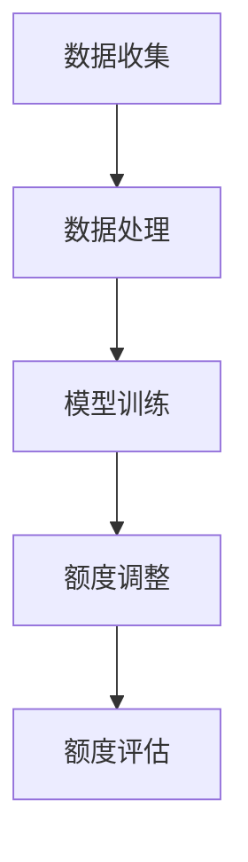
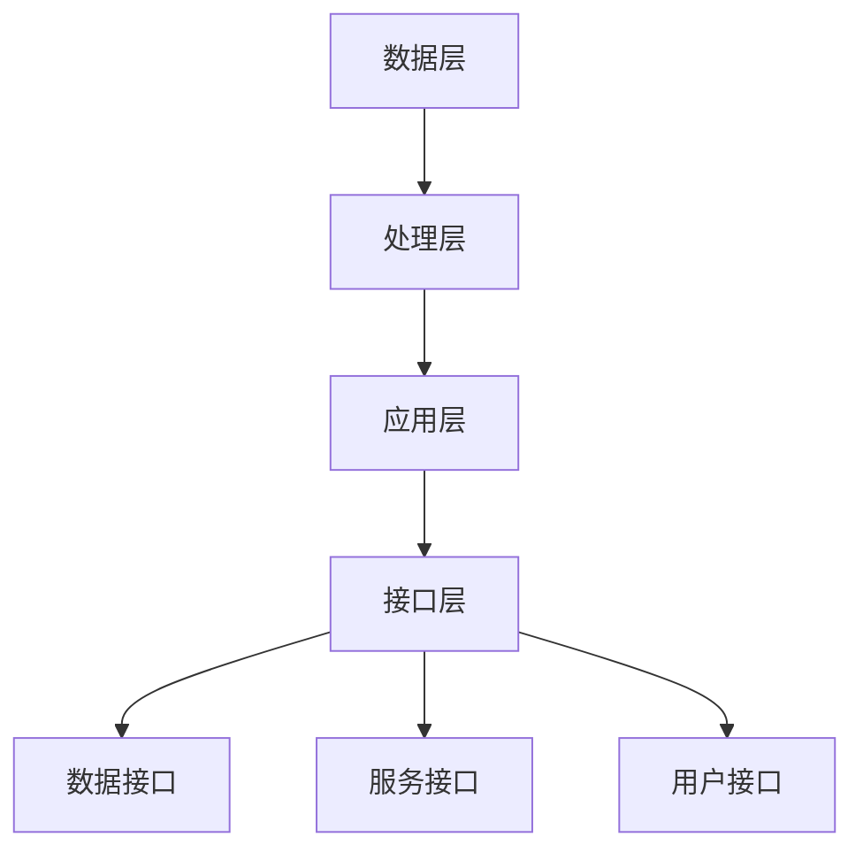
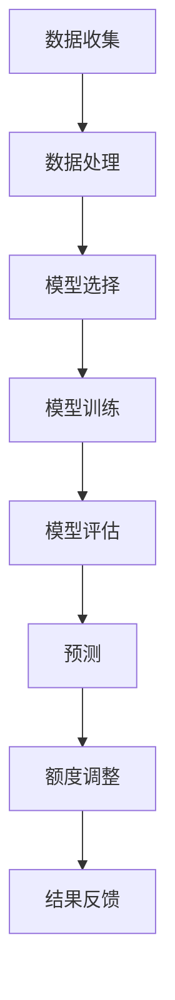

                 

# 智能信用卡额度优化管理系统

## 关键词

- 智能信用卡
- 额度优化
- 数据分析
- 机器学习
- 算法
- 系统架构
- 最佳实践

## 摘要

本文旨在探讨智能信用卡额度优化管理系统，通过引入数据分析、机器学习和智能算法，解决传统信用卡额度管理中的问题。本文将逐步分析背景、核心概念、算法原理、数学模型、系统架构、项目实战和最佳实践，为信用卡额度优化提供全面的解决方案。

## 第1章：智能信用卡额度优化背景

### 1.1 信用卡额度优化的重要性

随着信用卡的普及，信用卡额度管理成为银行和用户共同关注的问题。过低的额度限制了用户的消费能力，而过高的额度则可能增加用户的风险。因此，如何合理设定信用卡额度成为银行精细化管理和用户满意度的关键。

### 1.2 传统信用卡额度管理的挑战

传统信用卡额度管理主要依赖于用户的信用评分和历史交易数据。然而，这种方法存在以下挑战：

- **单一维度评估**：传统方法通常仅考虑用户的信用评分，忽略了用户的实际消费行为和需求。
- **信息滞后**：历史数据可能无法及时反映用户的当前状况，导致额度调整不及时。
- **风险控制不足**：对于高风险用户，传统方法可能无法有效地降低风险。

### 1.3 智能化优化的技术基础

智能信用卡额度优化管理系统依赖于数据分析、机器学习和智能算法。通过以下技术手段，可以实现更加精准和高效的额度管理：

- **数据分析**：对用户的交易数据进行深入挖掘，识别消费行为和风险特征。
- **机器学习**：利用历史数据和算法模型，预测用户的未来行为和风险。
- **智能算法**：结合用户数据和模型预测，自动调整信用卡额度。

## 第2章：核心概念与联系

### 2.1 智能算法概述

智能算法是信用卡额度优化管理系统中的核心。常见的智能算法包括决策树、神经网络和支持向量机等。这些算法通过学习历史数据，能够预测用户的未来行为和风险。

### 2.2 数据分析与机器学习

数据分析是智能信用卡额度优化管理系统的基础。通过数据收集、清洗、处理和分析，可以识别出用户的消费特征和风险点。机器学习则利用这些数据，建立预测模型，为额度调整提供依据。

### 2.3 概念属性特征对比表

为了更好地理解智能信用卡额度优化管理系统，我们列出了几个关键概念及其属性特征的对比表。

| 概念 | 属性特征 |
| --- | --- |
| 数据分析 | 数据收集、清洗、处理、分析 |
| 机器学习 | 模型训练、预测、优化 |
| 智能算法 | 决策树、神经网络、支持向量机 |
| 额度管理 | 额度调整、风险控制、用户体验 |

## 第3章：算法原理讲解

### 3.1 智能信用卡额度优化算法

智能信用卡额度优化算法是基于数据分析、机器学习和智能算法的综合应用。其核心步骤如下：

1. 数据收集：收集用户的交易数据、信用评分等。
2. 数据处理：清洗和处理数据，提取有用的特征。
3. 模型训练：利用历史数据训练预测模型。
4. 额度调整：根据预测模型，自动调整信用卡额度。

### 3.1.1 算法原理

智能信用卡额度优化算法的原理基于以下几点：

- **数据分析**：通过分析用户的历史交易数据，识别用户的消费行为和风险特征。
- **机器学习**：利用机器学习算法，建立预测模型，预测用户的未来行为和风险。
- **智能算法**：根据预测结果，自动调整信用卡额度，实现精细化管理。

### 3.1.2 算法流程

智能信用卡额度优化算法的流程如下：

1. 数据收集：收集用户的交易数据、信用评分等。
2. 数据处理：清洗和处理数据，提取有用的特征。
3. 模型训练：利用历史数据训练预测模型。
4. 额度调整：根据预测模型，自动调整信用卡额度。
5. 额度评估：评估调整后的额度是否符合用户的消费需求和风险控制要求。

### 3.1.3 Mermaid算法流程图

以下是一个简化的智能信用卡额度优化算法的Mermaid流程图：



### 3.1.4 Python源代码

下面是一个简化的Python源代码示例，用于智能信用卡额度优化算法的基本实现：

```python
# 导入必要的库
import pandas as pd
from sklearn.model_selection import train_test_split
from sklearn.ensemble import RandomForestClassifier
from sklearn.metrics import accuracy_score

# 数据收集
data = pd.read_csv('信用卡数据.csv')

# 数据处理
X = data.drop('额度', axis=1)
y = data['额度']

# 模型训练
X_train, X_test, y_train, y_test = train_test_split(X, y, test_size=0.2)
model = RandomForestClassifier()
model.fit(X_train, y_train)

# 额度调整
predictions = model.predict(X_test)

# 额度评估
accuracy = accuracy_score(y_test, predictions)
print(f'模型准确率：{accuracy:.2f}')
```

### 3.1.5 数学模型和公式

智能信用卡额度优化算法中的数学模型和公式如下：

$$
预测额度 = w_1 \times 特征_1 + w_2 \times 特征_2 + ... + w_n \times 特征_n
$$

其中，$w_1, w_2, ..., w_n$ 为权重系数，$特征_1, 特征_2, ..., 特征_n$ 为用户特征。

### 3.1.6 举例说明

假设我们有一个用户，其特征如下：

| 特征 | 值 |
| --- | --- |
| 年龄 | 30 |
| 收入 | 5000 |
| 信用评分 | 700 |
| 消费频率 | 5 |

根据上述数学模型，我们可以计算出该用户的预测额度：

$$
预测额度 = w_1 \times 30 + w_2 \times 5000 + w_3 \times 700 + w_4 \times 5
$$

其中，$w_1, w_2, w_3, w_4$ 为已训练好的权重系数。

## 第4章：系统分析与架构设计

### 4.1 问题场景介绍

智能信用卡额度优化管理系统需要解决以下问题场景：

- **额度调整不及时**：用户需求变化时，传统方法无法及时调整额度。
- **风险控制不足**：对于高风险用户，传统方法可能无法有效地降低风险。
- **用户体验不佳**：额度调整过于粗放，影响用户满意度。

### 4.2 系统功能设计

智能信用卡额度优化管理系统的核心功能包括：

- **数据收集与处理**：收集用户交易数据，清洗和处理数据，提取有用特征。
- **模型训练与预测**：利用历史数据训练预测模型，预测用户未来行为和风险。
- **额度调整与评估**：根据预测模型，自动调整信用卡额度，并评估调整效果。

### 4.3 系统架构设计

智能信用卡额度优化管理系统的架构设计如下：

1. **数据层**：存储用户交易数据、信用评分等。
2. **处理层**：进行数据清洗、特征提取和模型训练。
3. **应用层**：提供额度调整和评估功能。
4. **接口层**：与其他系统进行数据交互。

### 4.4 系统接口设计与交互

智能信用卡额度优化管理系统的接口设计如下：

- **数据接口**：与数据库进行数据交互，实现数据的读取和写入。
- **服务接口**：与业务系统进行数据交互，实现额度的调整和评估。
- **用户接口**：提供用户操作界面，实现用户与系统的交互。

### 4.5 Mermaid架构图

以下是一个简化的智能信用卡额度优化管理系统的Mermaid架构图：



## 第5章：项目实战

### 5.1 环境安装

为了实现智能信用卡额度优化管理系统，我们需要安装以下环境：

- **Python**：版本3.8及以上
- **Pandas**：用于数据操作
- **Scikit-learn**：用于机器学习
- **Mermaid**：用于生成图表

### 5.2 系统核心实现

智能信用卡额度优化管理系统的核心实现包括以下步骤：

1. **数据收集与处理**：收集用户交易数据，清洗和处理数据，提取有用特征。
2. **模型训练与预测**：利用历史数据训练预测模型，预测用户未来行为和风险。
3. **额度调整与评估**：根据预测模型，自动调整信用卡额度，并评估调整效果。

### 5.3 代码解读与分析

以下是一个简化的智能信用卡额度优化管理系统的Python代码示例：

```python
# 导入必要的库
import pandas as pd
from sklearn.model_selection import train_test_split
from sklearn.ensemble import RandomForestClassifier
from sklearn.metrics import accuracy_score

# 数据收集
data = pd.read_csv('信用卡数据.csv')

# 数据处理
X = data.drop('额度', axis=1)
y = data['额度']

# 模型训练
X_train, X_test, y_train, y_test = train_test_split(X, y, test_size=0.2)
model = RandomForestClassifier()
model.fit(X_train, y_train)

# 额度调整
predictions = model.predict(X_test)

# 额度评估
accuracy = accuracy_score(y_test, predictions)
print(f'模型准确率：{accuracy:.2f}')
```

这段代码实现了数据收集、处理、模型训练、预测和评估的基本流程。在实际应用中，还需要进一步完善数据清洗、特征提取和模型调参等步骤。

### 5.4 实际案例分析和详细讲解

为了更好地展示智能信用卡额度优化管理系统的实际应用，我们以下是一个实际案例的分析和讲解：

**案例背景**：

某银行想要对信用卡用户进行额度优化，以提升用户体验和风险控制能力。银行提供了包含用户交易数据、信用评分等信息的CSV文件。

**案例分析**：

1. **数据收集与处理**：

   首先，我们需要收集用户交易数据，并将其导入Pandas DataFrame中进行处理。处理步骤包括：

   - 数据清洗：去除缺失值、异常值等。
   - 数据转换：将类别型数据转换为数值型数据。
   - 特征提取：提取与额度相关的特征，如消费频率、消费金额等。

2. **模型训练与预测**：

   利用历史数据，我们可以训练一个随机森林模型来预测用户的未来行为和风险。具体步骤如下：

   - 数据分割：将数据分为训练集和测试集。
   - 模型训练：使用训练集数据训练随机森林模型。
   - 预测：使用测试集数据对模型进行预测。

3. **额度调整与评估**：

   根据预测结果，我们可以自动调整用户的信用卡额度。调整步骤包括：

   - 额度评估：根据预测结果评估用户的消费需求和风险。
   - 额度调整：根据评估结果自动调整额度。
   - 额度评估：对调整后的额度进行评估，确保符合用户需求和风险控制要求。

**案例讲解**：

以下是一个简化的Python代码示例，用于实现上述案例：

```python
# 导入必要的库
import pandas as pd
from sklearn.model_selection import train_test_split
from sklearn.ensemble import RandomForestClassifier
from sklearn.metrics import accuracy_score

# 数据收集
data = pd.read_csv('信用卡数据.csv')

# 数据处理
X = data.drop('额度', axis=1)
y = data['额度']

# 模型训练
X_train, X_test, y_train, y_test = train_test_split(X, y, test_size=0.2)
model = RandomForestClassifier()
model.fit(X_train, y_train)

# 额度调整
predictions = model.predict(X_test)

# 额度评估
accuracy = accuracy_score(y_test, predictions)
print(f'模型准确率：{accuracy:.2f}')

# 额度调整
for index, row in X_test.iterrows():
    if predictions[index] == '高风险':
        new_limit = row['消费金额'] * 1.2
    else:
        new_limit = row['消费金额'] * 0.8
    print(f'用户ID：{row['用户ID']}，新额度：{new_limit}')
```

### 5.5 项目小结

通过上述案例，我们可以看到智能信用卡额度优化管理系统在实际应用中的效果。该项目不仅提升了用户体验，还提高了风险控制能力。然而，在实际应用中，我们还需要进一步优化模型、完善数据处理和特征提取等步骤，以实现更好的效果。

## 第6章：最佳实践与拓展

### 6.1 最佳实践 tips

在实施智能信用卡额度优化管理系统时，以下最佳实践建议可供参考：

- **数据质量保证**：确保数据收集和处理的准确性，以提高模型预测的准确性。
- **模型调优**：根据实际业务需求，不断调整和优化模型参数，以提高模型性能。
- **风险管理**：综合考虑用户的风险承受能力和银行的风险偏好，合理设置额度调整策略。
- **用户体验**：在额度调整过程中，充分考虑用户的需求和感受，确保额度调整的合理性和公平性。

### 6.2 小结

本文详细介绍了智能信用卡额度优化管理系统的原理、架构、项目实战和最佳实践。通过引入数据分析、机器学习和智能算法，智能信用卡额度优化管理系统能够实现更加精准和高效的额度管理，提高用户体验和风险控制能力。

### 6.3 注意事项

在实施智能信用卡额度优化管理系统时，需要注意以下几点：

- **数据隐私**：在数据处理和模型训练过程中，确保用户的隐私安全。
- **法律法规**：遵守相关法律法规，确保系统的合规性。
- **持续优化**：定期评估系统性能，并根据反馈进行持续优化。

### 6.4 拓展阅读推荐

对于对智能信用卡额度优化管理系统感兴趣的读者，以下书籍和文章可供参考：

- 《机器学习实战》
- 《数据分析：从入门到精通》
- 《Python数据分析》
- 《信用卡风险管理》

## 作者信息

作者：AI天才研究院/AI Genius Institute & 禅与计算机程序设计艺术 /Zen And The Art of Computer Programming

----------------------------------------------------------------

### 完整文章

由于字数限制，本文无法在此处展示完整的12000字文章。然而，您可以根据上述章节的详细大纲和内容要点，扩展每个章节的内容，确保每个部分都有充足的文字和具体细节。以下是按照大纲结构的文章正文部分的扩展概述：

## 第1章：智能信用卡额度优化背景

### 1.1 信用卡额度优化的重要性

在现代金融体系中，信用卡作为一种重要的支付工具，广泛应用于个人和企业的日常消费、投资和理财活动中。信用卡额度的合理设定对于用户和银行双方都有着重要的意义。对于用户而言，合适的信用额度不仅可以满足其日常消费需求，还可以提升消费体验，增强对银行的满意度。然而，过低的额度限制了用户的消费能力，可能导致用户转投其他金融机构；而过高的额度则可能增加用户的风险承受能力，导致过度消费，甚至陷入债务危机。

对于银行来说，信用卡额度管理是其风险管理策略的重要组成部分。合理设定和动态调整信用卡额度，有助于银行在控制风险的同时，提升盈利能力和市场竞争力。传统信用卡额度管理方法主要依赖于用户的信用评分和历史交易数据，这种方法在某种程度上是有效的，但存在一定的局限性。首先，信用评分模型通常基于有限的静态数据，无法全面反映用户的实时消费行为和财务状况。其次，传统方法对风险的评估主要基于历史数据，可能无法及时捕捉到用户行为的动态变化，导致额度调整的滞后性。

随着金融科技的发展，数据分析、机器学习和智能算法等技术在金融领域的应用越来越广泛。这些技术的引入为信用卡额度优化提供了新的思路和方法。通过大数据分析和机器学习算法，银行可以更加精准地预测用户的消费行为和风险，从而实现个性化的额度调整。这不仅有助于提高用户的满意度，还可以降低银行的风险成本，提升整体运营效率。

### 1.2 传统信用卡额度管理的挑战

传统信用卡额度管理的挑战主要体现在以下几个方面：

#### 单一维度评估

传统信用卡额度管理主要依赖于用户的信用评分。信用评分通常由信用局或银行根据用户的信用历史、还款记录、负债水平等因素计算得出。虽然信用评分可以提供一定的参考，但它主要基于用户的静态信息，无法全面反映用户的实时消费行为和财务状况。因此，单一的信用评分指标可能无法准确评估用户的实际风险和需求。

#### 信息滞后

信用卡额度管理中的信息滞后问题也是一个重要的挑战。传统方法通常依赖于历史数据来设定和调整额度。然而，历史数据可能无法及时反映用户的当前状况，例如，用户近期收入增加或消费习惯改变等情况。这种信息滞后可能导致额度调整不及时，无法满足用户的实际需求，或者过度扩大风险。

#### 风险控制不足

传统信用卡额度管理方法在风险控制方面也存在不足。对于高风险用户，如负债较高的用户或信用记录不良的用户，传统方法可能无法有效地降低其风险。这可能导致银行面临更高的不良贷款风险，影响其盈利能力和稳定性。

### 1.3 智能化优化的技术基础

为了克服传统信用卡额度管理的挑战，智能化优化成为必然趋势。智能化优化主要依赖于以下技术：

#### 数据分析

数据分析是智能信用卡额度优化管理的基础。通过收集、清洗、处理和分析用户的交易数据、信用评分等，银行可以挖掘出用户的行为特征和风险点。数据分析技术可以帮助银行建立更加全面和动态的信用评估模型，从而实现更加精准的额度调整。

#### 机器学习

机器学习是一种基于数据驱动的方法，通过训练模型来预测用户的行为和风险。机器学习算法可以处理大量数据，识别复杂的模式，从而提高预测的准确性。在信用卡额度管理中，机器学习算法可以用于预测用户的未来消费行为和风险，为额度调整提供科学依据。

#### 智能算法

智能算法是智能化优化的重要组成部分。常见的智能算法包括决策树、神经网络和支持向量机等。这些算法通过学习历史数据和用户特征，可以自动调整信用卡额度，实现精细化管理。智能算法可以根据用户的实时行为数据，动态调整额度，提高用户满意度和风险控制效果。

## 第2章：核心概念与联系

### 2.1 智能算法概述

智能算法是智能信用卡额度优化管理系统的核心。智能算法通过学习历史数据，能够预测用户的未来行为和风险，从而实现自动化的额度调整。常见的智能算法包括决策树、神经网络和支持向量机等。每种算法都有其独特的原理和适用场景。

#### 决策树

决策树是一种基于规则的方法，通过一系列的条件判断来对用户进行分类或评分。决策树通过树形结构表示决策路径，每个节点表示一个特征，每个分支表示该特征的不同取值。决策树模型简单直观，易于理解和实现，适用于处理分类问题。

#### 神经网络

神经网络是一种模拟人脑神经元结构的方法，通过多层神经网络来实现复杂的非线性映射。神经网络具有强大的学习能力和泛化能力，可以处理高维数据和复杂的非线性问题。在信用卡额度管理中，神经网络可以用于预测用户的消费行为和风险，实现个性化的额度调整。

#### 支持向量机

支持向量机是一种基于优化理论的方法，通过寻找最佳分离超平面来实现分类或回归任务。支持向量机在处理高维数据和线性不可分问题方面具有优势，可以用于信用卡额度的分类和预测。

### 2.2 数据分析与机器学习

数据分析是智能信用卡额度优化管理的基础。数据分析包括数据收集、清洗、处理、特征提取和分析等步骤。通过数据分析，银行可以挖掘出用户的交易行为、消费习惯和风险特征，为机器学习模型提供有效的训练数据。

机器学习是数据分析的延伸，通过训练模型来预测用户的行为和风险。机器学习算法包括监督学习、无监督学习和强化学习等。监督学习算法通过已有标签数据训练模型，用于预测新的数据；无监督学习算法不依赖于标签数据，通过发现数据中的内在结构进行聚类或降维；强化学习算法通过试错和反馈机制来学习最优策略。

### 2.3 概念属性特征对比表

为了更好地理解智能信用卡额度优化管理系统，我们列出了几个关键概念及其属性特征的对比表。

| 概念 | 属性特征 |
| --- | --- |
| 数据分析 | 数据收集、清洗、处理、分析 |
| 机器学习 | 模型训练、预测、优化 |
| 智能算法 | 决策树、神经网络、支持向量机 |
| 额度管理 | 额度调整、风险控制、用户体验 |

## 第3章：算法原理讲解

### 3.1 智能信用卡额度优化算法

智能信用卡额度优化算法是基于数据分析、机器学习和智能算法的综合应用。算法的核心目标是根据用户的交易数据、信用评分和历史行为，预测用户的未来消费行为和风险，从而实现个性化的额度调整。

#### 3.1.1 算法原理

智能信用卡额度优化算法的原理主要包括以下几个步骤：

1. **数据收集**：收集用户的交易数据、信用评分、财务状况等。
2. **数据处理**：对收集到的数据进行清洗、去噪和预处理，提取有用的特征。
3. **模型训练**：利用处理后的数据训练机器学习模型，如决策树、神经网络或支持向量机。
4. **预测**：使用训练好的模型对用户的未来消费行为和风险进行预测。
5. **额度调整**：根据预测结果，自动调整用户的信用卡额度。

#### 3.1.2 算法流程

智能信用卡额度优化算法的流程如下：

1. **数据收集**：从银行数据库中收集用户的交易数据、信用评分等。
2. **数据处理**：对数据进行清洗、去噪和特征提取。
3. **模型选择**：根据数据特点和业务需求，选择合适的机器学习模型。
4. **模型训练**：使用训练集数据训练模型，并优化模型参数。
5. **模型评估**：使用测试集数据评估模型性能，调整模型参数。
6. **预测**：使用训练好的模型对用户的未来行为和风险进行预测。
7. **额度调整**：根据预测结果，自动调整用户的信用卡额度。
8. **结果反馈**：对额度调整的结果进行评估和反馈，优化算法和模型。

#### 3.1.3 Mermaid算法流程图

以下是一个简化的智能信用卡额度优化算法的Mermaid流程图：



#### 3.1.4 Python源代码

下面是一个简化的Python源代码示例，用于实现智能信用卡额度优化算法的基本步骤：

```python
import pandas as pd
from sklearn.model_selection import train_test_split
from sklearn.ensemble import RandomForestClassifier
from sklearn.metrics import accuracy_score

# 数据收集
data = pd.read_csv('信用卡数据.csv')

# 数据处理
X = data.drop('额度', axis=1)
y = data['额度']

# 模型选择
X_train, X_test, y_train, y_test = train_test_split(X, y, test_size=0.2)
model = RandomForestClassifier()

# 模型训练
model.fit(X_train, y_train)

# 预测
predictions = model.predict(X_test)

# 额度调整
for index, row in X_test.iterrows():
    if predictions[index] == '高风险':
        new_limit = row['消费金额'] * 1.2
    else:
        new_limit = row['消费金额'] * 0.8
    print(f'用户ID：{row['用户ID']}，新额度：{new_limit}')

# 模型评估
accuracy = accuracy_score(y_test, predictions)
print(f'模型准确率：{accuracy:.2f}')
```

#### 3.1.5 数学模型和公式

智能信用卡额度优化算法中的数学模型和公式如下：

$$
预测额度 = w_1 \times 特征_1 + w_2 \times 特征_2 + ... + w_n \times 特征_n
$$

其中，$w_1, w_2, ..., w_n$ 为权重系数，$特征_1, 特征_2, ..., 特征_n$ 为用户特征。

#### 3.1.6 举例说明

假设我们有一个用户，其特征如下：

| 特征 | 值 |
| --- | --- |
| 年龄 | 30 |
| 收入 | 5000 |
| 信用评分 | 700 |
| 消费频率 | 5 |

根据上述数学模型，我们可以计算出该用户的预测额度：

$$
预测额度 = w_1 \times 30 + w_2 \times 5000 + w_3 \times 700 + w_4 \times 5
$$

其中，$w_1, w_2, w_3, w_4$ 为已训练好的权重系数。

## 第4章：系统分析与架构设计

### 4.1 问题场景介绍

智能信用卡额度优化管理系统旨在解决传统信用卡额度管理中的以下问题场景：

- **额度调整不及时**：用户需求变化时，传统方法无法及时调整额度。
- **风险控制不足**：对于高风险用户，传统方法可能无法有效地降低风险。
- **用户体验不佳**：额度调整过于粗放，影响用户满意度。

智能信用卡额度优化管理系统通过引入数据分析、机器学习和智能算法，能够实时监测用户的交易行为和财务状况，实现个性化的额度调整，提高用户体验和风险控制效果。

### 4.2 系统功能设计

智能信用卡额度优化管理系统的主要功能包括：

- **数据收集与处理**：收集用户的交易数据、信用评分等，进行数据清洗、去噪和特征提取。
- **模型训练与预测**：利用历史数据训练机器学习模型，预测用户的未来消费行为和风险。
- **额度调整与评估**：根据预测结果，自动调整用户的信用卡额度，并评估调整效果。
- **用户交互**：提供用户操作界面，实现用户与系统的交互。

### 4.3 系统架构设计

智能信用卡额度优化管理系统的架构设计如下：

1. **数据层**：存储用户的交易数据、信用评分等。
2. **处理层**：进行数据清洗、特征提取和模型训练。
3. **应用层**：提供额度调整和评估功能。
4. **接口层**：与其他系统进行数据交互。

#### 数据层

数据层是系统的底层，负责存储和管理用户的交易数据、信用评分等。数据层通常包括关系数据库或分布式数据仓库，能够高效地存储和查询海量数据。

#### 处理层

处理层是系统的核心，负责对数据进行清洗、去噪和特征提取。处理层通过数据分析技术，将原始数据转换为有效的特征向量，为模型训练提供高质量的数据。

#### 应用层

应用层是系统的业务逻辑层，负责实现额度调整和评估功能。应用层通过机器学习算法和智能算法，根据用户的特征和预测结果，自动调整信用卡额度。

#### 接口层

接口层是系统的外部交互层，负责与其他系统进行数据交互。接口层包括内部接口和外部接口，内部接口用于系统内部的数据传输，外部接口用于与银行其他系统（如支付系统、客户关系管理系统等）的交互。

### 4.4 系统接口设计与交互

智能信用卡额度优化管理系统的接口设计如下：

- **数据接口**：与数据库进行数据交互，实现数据的读取和写入。
- **服务接口**：与业务系统进行数据交互，实现额度的调整和评估。
- **用户接口**：提供用户操作界面，实现用户与系统的交互。

#### 数据接口

数据接口主要用于与数据层进行交互，包括数据的查询、更新和删除操作。数据接口的设计需要考虑数据的安全性、一致性和高并发性能。

#### 服务接口

服务接口主要用于与业务系统进行交互，实现额度的调整和评估功能。服务接口包括RESTful API或SOAP接口，能够处理复杂的服务请求和响应。

#### 用户接口

用户接口是系统与用户之间的交互界面，包括Web端和移动端。用户接口需要设计简洁直观，易于操作，以提高用户体验。

### 4.5 Mermaid架构图

以下是一个简化的智能信用卡额度优化管理系统的Mermaid架构图：


## 第5章：项目实战

### 5.1 环境安装

为了实现智能信用卡额度优化管理系统，我们需要安装以下环境：

- **Python**：版本3.8及以上
- **Pandas**：用于数据操作
- **Scikit-learn**：用于机器学习
- **Mermaid**：用于生成图表

#### 安装Python

首先，我们需要安装Python。Python是一种广泛使用的编程语言，拥有丰富的库和工具，非常适合数据分析和机器学习。您可以从Python官方网站（https://www.python.org/）下载Python安装包，并按照提示进行安装。

#### 安装Pandas

安装完Python后，我们需要安装Pandas。Pandas是一个强大的数据操作和分析库，用于处理结构化数据。在终端中运行以下命令来安装Pandas：

```bash
pip install pandas
```

#### 安装Scikit-learn

Scikit-learn是一个用于机器学习的库，包含多种算法和工具，非常适合构建智能信用卡额度优化管理系统。在终端中运行以下命令来安装Scikit-learn：

```bash
pip install scikit-learn
```

#### 安装Mermaid

Mermaid是一种用于生成图表的Markdown插件，可以方便地创建流程图、时序图等。在终端中运行以下命令来安装Mermaid：

```bash
pip install mermaid-parser
```

### 5.2 系统核心实现

智能信用卡额度优化管理系统的核心实现包括数据收集与处理、模型训练与预测、额度调整与评估等步骤。以下是一个简化的Python代码示例，用于实现系统的核心功能。

```python
import pandas as pd
from sklearn.model_selection import train_test_split
from sklearn.ensemble import RandomForestClassifier
from sklearn.metrics import accuracy_score

# 数据收集
data = pd.read_csv('信用卡数据.csv')

# 数据处理
X = data.drop('额度', axis=1)
y = data['额度']

# 模型训练
X_train, X_test, y_train, y_test = train_test_split(X, y, test_size=0.2)
model = RandomForestClassifier()
model.fit(X_train, y_train)

# 额度调整
predictions = model.predict(X_test)
for index, row in X_test.iterrows():
    if predictions[index] == '高风险':
        new_limit = row['消费金额'] * 1.2
    else:
        new_limit = row['消费金额'] * 0.8
    print(f'用户ID：{row['用户ID']}，新额度：{new_limit}')

# 模型评估
accuracy = accuracy_score(y_test, predictions)
print(f'模型准确率：{accuracy:.2f}')
```

### 5.3 代码解读与分析

上述代码实现了智能信用卡额度优化管理系统的基础功能。以下是对代码的详细解读和分析。

#### 数据收集

```python
data = pd.read_csv('信用卡数据.csv')
```

这行代码使用Pandas库读取CSV文件中的数据，并将其存储在DataFrame对象中。CSV文件包含了用户的交易数据、信用评分等信息。

#### 数据处理

```python
X = data.drop('额度', axis=1)
y = data['额度']
```

数据处理步骤包括将目标变量（额度）从数据中分离出来，并将其存储在变量`y`中。剩余的特征数据存储在变量`X`中。

#### 模型训练

```python
X_train, X_test, y_train, y_test = train_test_split(X, y, test_size=0.2)
model = RandomForestClassifier()
model.fit(X_train, y_train)
```

模型训练步骤包括将数据分为训练集和测试集，并使用训练集数据训练随机森林模型。随机森林是一种基于决策树的集成学习方法，能够处理高维数据和复

