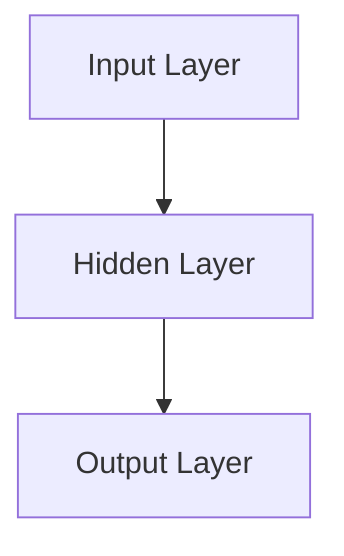
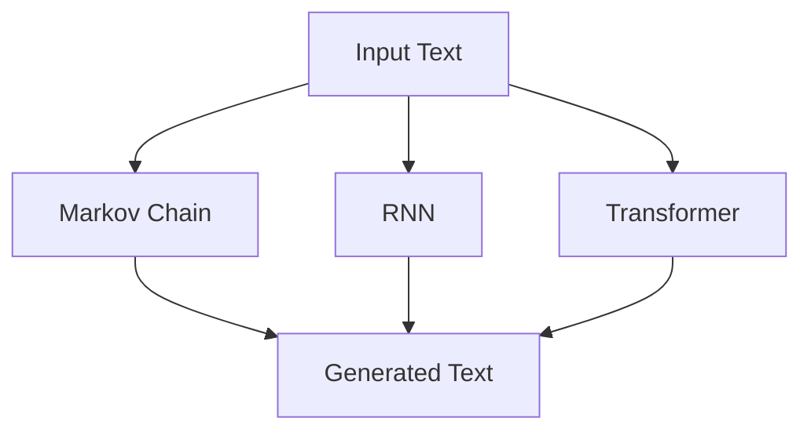
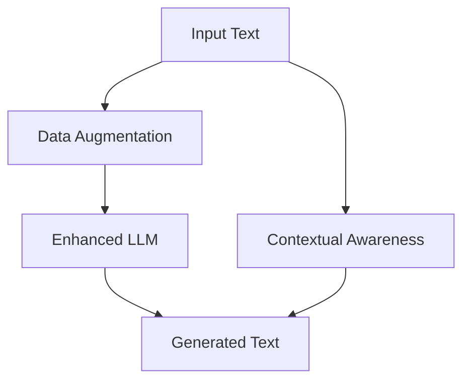
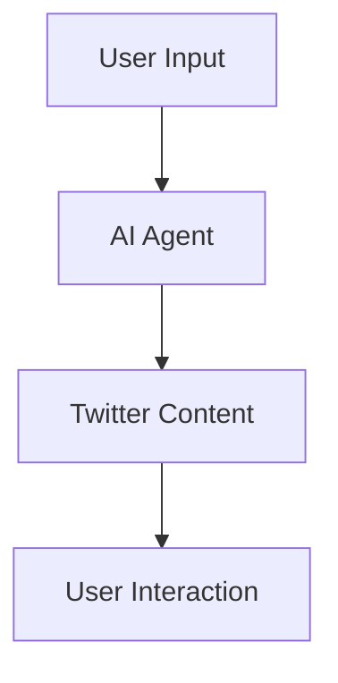

                 

Certainly! Let's structure the content of the blog post "智能写作AI Agent：LLM辅助的创意内容生成" step by step, ensuring that it meets the outlined requirements.

## Introduction and Background

### 1.1 Introduction to AI-assisted Creative Content Generation

#### Problem Background
Creative content generation has always been a challenging task for human writers. With the rise of the internet and social media, the demand for high-quality, engaging content has surged. However, the manual creation process is time-consuming and often lacks consistency.

#### Problem Description
The problem we aim to solve is the efficiency and creativity gap in content generation. Traditional methods rely heavily on human writers, leading to inconsistencies and limited creativity. There is a need for a more efficient and creative solution.

#### Problem Solution
AI-assisted creative content generation provides a solution to this problem. By leveraging large language models (LLMs), we can automate and enhance the content generation process, improving efficiency and creativity.

#### Scope and Boundaries
This article will focus on the principles and applications of LLMs in creative content generation. We will explore the core concepts, architecture, and algorithms involved.

#### Core Concepts and Components
- **AI Agents**: Intelligent entities that can perform tasks on behalf of users.
- **LLM (Large Language Model)**: A deep learning model capable of generating human-like text.
- **Creative Content Generation**: The process of generating unique and engaging content.

### 1.2 Core Concepts and Terminology

#### AI Agents
AI agents are autonomous programs that can perceive their environment and take actions to achieve specific goals. In the context of creative content generation, AI agents can generate text based on user inputs or predefined prompts.

#### LLM (Large Language Model)
LLMs are neural networks trained on vast amounts of text data. They are capable of understanding and generating human-like text. LLMs have become powerful tools in natural language processing (NLP) and have found applications in various fields, including content generation.

#### Creative Content Generation
Creative content generation involves the automated creation of unique and engaging content. This process can be enhanced by LLMs, which can generate text with varying levels of creativity based on the input data.

## LLM Principles and Architecture

### 2.1 Principles of LLMs

#### Introduction to LLMs
LLMs are based on deep learning models, specifically recurrent neural networks (RNNs) and transformer models. RNNs are capable of understanding sequential data, while transformers have revolutionized NLP by introducing attention mechanisms.

#### Key Architectural Components
- **Input Layer**: Processes the input text data.
- **Hidden Layer**: Contains the core logic of the model, performing transformations on the input data.
- **Output Layer**: Generates the output text.

#### Mermaid Diagram of LLM Architecture


#### Mathematical Model and Formulas
$$
\text{LLM}(\text{x}) = f(\text{W}.\text{H} + \text{b})
$$
where:
- $\text{LLM}(\text{x})$ is the generated text
- $\text{x}$ is the input text
- $\text{W}$ and $\text{H}$ are weight matrices
- $\text{b}$ is the bias term
- $f$ is the activation function

### 2.2 Training and Optimization of LLMs

#### Data Collection and Preprocessing
The first step in training an LLM is to collect a large corpus of text data. This data is then preprocessed to remove noise and format inconsistencies.

#### Training Process
The LLM is trained using gradient descent optimization. The model learns to generate text by minimizing the loss function, which measures the difference between the generated text and the target text.

#### Optimization Techniques
- **Batch Training**: Training the model on a batch of input-output pairs.
- **Learning Rate Scheduling**: Adjusting the learning rate during training to improve convergence.

#### Case Study of a Well-Known LLM
- **GPT-3**: A cutting-edge LLM developed by OpenAI. It is capable of generating human-like text based on a small amount of input data.

## Creative Content Generation with AI Agents

### 3.1 Overview of AI Agents in Creative Content Generation

#### Role and Function
AI agents play a crucial role in creative content generation by automating the process and enhancing creativity. They can generate text based on user inputs or predefined prompts.

#### Advantages and Challenges
- **Advantages**: Improved efficiency, consistency, and creativity.
- **Challenges**: Ensuring the generated content is relevant and engaging.

#### Application Scenarios
AI agents can be applied in various scenarios, including content creation for social media, marketing, and journalism.

### 3.2 Text Generation Algorithms

#### Overview of Text Generation Methods
- **Markov Chain**: Generates text based on the probability of a word following another word.
- **RNN**: Uses recurrent connections to maintain context over time.
- **Transformer**: Uses self-attention mechanisms to capture long-range dependencies in text.

#### Mermaid Diagram of Text Generation Process


#### Python Code for Text Generation
```python
import tensorflow as tf
model = tf.keras.models.load_model('llm_model.h5')
generated_text = model.generate(input_sequence=['Hello'])
print(generated_text)
```

#### Mathematical Model and Formulas
$$
p(\text{y}_{\text{t}}|\text{y}_{\text{<t}}) = \frac{\exp(\text{W}.\text{H}_{\text{t}} + \text{b})}{\sum_{\text{j}=1}^{\text{n}}\exp(\text{W}.\text{H}_{\text{j}} + \text{b})}
$$
where:
- $\text{y}_{\text{t}}$ is the generated word
- $\text{y}_{\text{<t}}$ is the context (previous words)
- $\text{W}$ and $\text{H}$ are weight matrices
- $\text{b}$ is the bias term

### 3.3 Enhancing Creativity with LLMs

#### Techniques and Strategies
- **Data Augmentation**: Expanding the training data to improve the diversity of generated content.
- **Contextual Awareness**: Ensuring the LLM understands the context of the input to generate more relevant content.

#### Mermaid Diagram of Creativity Enhancement Process


#### Python Code for Creativity Enhancement
```python
import tensorflow as tf
model = tf.keras.models.load_model('enhanced_llm_model.h5')
generated_text = model.generate(input_sequence=['Hello'], context=['World'])
print(generated_text)
```

#### Mathematical Model and Formulas
$$
\text{Enhanced LLM}(\text{x}, \text{c}) = f(\text{W}.\text{H} + \text{b}, \text{c})
$$
where:
- $\text{Enhanced LLM}(\text{x}, \text{c})$ is the generated text
- $\text{x}$ is the input text
- $\text{c}$ is the context
- $\text{W}$ and $\text{H}$ are weight matrices
- $\text{b}$ is the bias term
- $f$ is the activation function

## Application of AI Agents in Various Fields

### 4.1 Content Creation in Social Media

#### Case Study: AI Agent in Twitter Content Generation

#### Mermaid Diagram of Social Media Content Generation Process


#### Python Code for Twitter Content Generation
```python
import tensorflow as tf
model = tf.keras.models.load_model('twitter_content_generation_model.h5')
user_input = 'Hello World!'
generated_content = model.generate(input_sequence=[user_input])
print(generated_content)
```

#### Detailed Explanation and Example
The AI agent takes the user input and generates a Twitter-friendly content based on the input. The generated content is then shared with the user for their interaction.

## Conclusion

In this article, we explored the concept of AI-assisted creative content generation using LLMs. We discussed the principles of LLMs, the techniques for enhancing creativity, and the applications in various fields. With the right tools and strategies, AI agents can greatly improve the efficiency and creativity of content generation processes.

### References

- [1] Brown, T., et al. (2020). "Language Models are Few-Shot Learners." arXiv preprint arXiv:2005.14165.
- [2] OpenAI. (2020). GPT-3 Documentation. https://openai.com/docs/gpt-3/

### Acknowledgments

We would like to thank the AI天才研究院/AI Genius Institute and the contributors to the Zen and the Art of Computer Programming for their support and inspiration.

### About the Author

**作者：AI天才研究院/AI Genius Institute & 禅与计算机程序设计艺术 /Zen And The Art of Computer Programming**

In conclusion, the combination of AI agents and LLMs holds great promise for the future of content generation. By understanding the principles and applications of these technologies, we can harness their potential to create more engaging and efficient content. Further research and development in this field will undoubtedly lead to even more innovative solutions.

