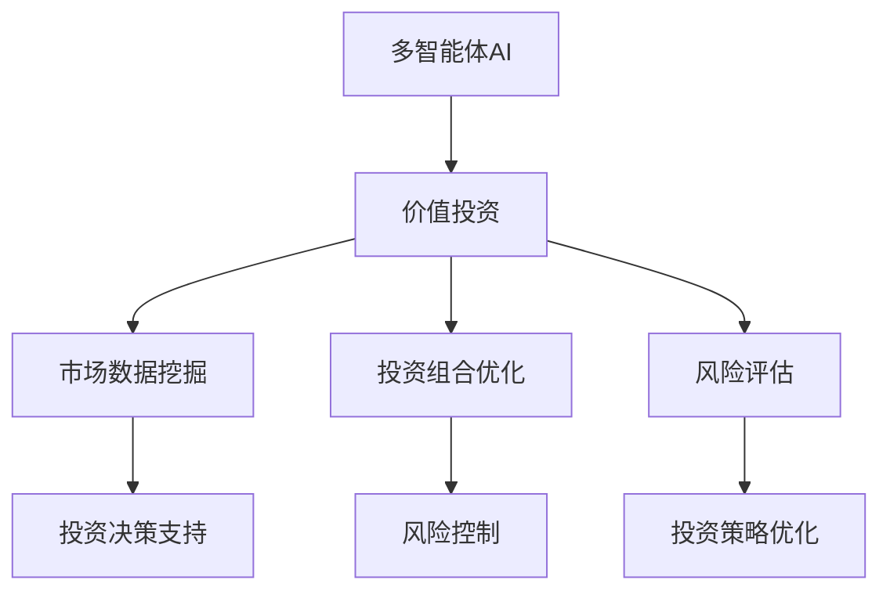
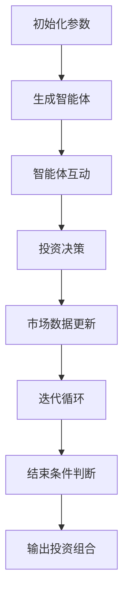
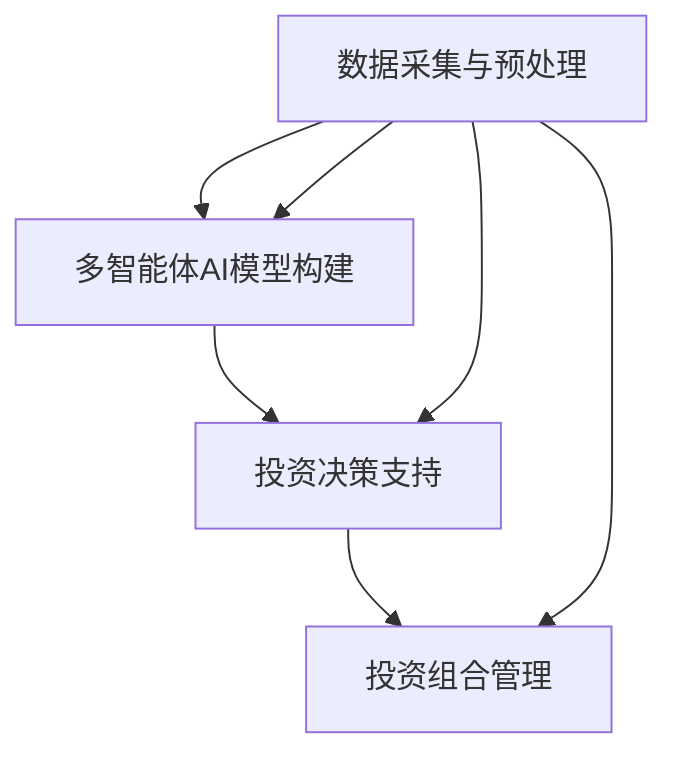

                 

# 智能化企业价值计算：多智能体AI在价值投资中的新方法

## 关键词
- 智能化企业
- 价值计算
- 多智能体AI
- 价值投资
- 算法原理
- 系统架构设计

## 摘要
本文旨在探讨多智能体AI在价值投资中的应用，通过深入分析智能化企业价值计算的概念和重要性，以及多智能体AI的基本原理和算法，提出一种新的价值投资方法。文章将从背景介绍、核心概念与联系、算法原理讲解、数学模型与公式、系统分析与架构设计、项目实战以及最佳实践等方面进行详细阐述，旨在为读者提供一个全面、系统的理解，并推动智能化企业价值计算的实践与应用。

## 第一部分：背景介绍

### 1.1 智能化企业的背景

随着信息技术的迅猛发展，数字经济已经成为全球经济的新引擎。智能化企业作为数字经济的重要组成部分，正逐渐改变着传统企业的运营模式。智能化企业通过运用大数据、人工智能、物联网等技术，实现了企业运营的自动化、智能化和高效化。这一变革不仅提高了企业的运营效率，还为企业带来了新的商业模式和竞争优势。

### 1.2 价值计算在企业运营中的重要性

在智能化企业的运营中，价值计算扮演着至关重要的角色。价值计算是一种对企业运营过程中的资源、成本、效益等要素进行量化分析的方法。通过价值计算，企业可以更准确地评估各项运营活动的价值，优化资源配置，提高运营效益。在价值投资中，价值计算同样至关重要，它帮助投资者识别具有投资价值的股票，做出科学的投资决策。

### 1.3 多智能体AI在价值投资中的应用现状与潜力

多智能体AI是人工智能领域的一个重要分支，它通过模拟多个智能体的交互行为，实现了复杂系统的智能化。在价值投资中，多智能体AI可以通过分析大量市场数据，预测市场走势，优化投资组合。当前，多智能体AI在价值投资中的应用已经取得了一定的成果，但仍然存在很多挑战和机遇。本文将探讨多智能体AI在价值投资中的应用，并提出一种新的价值投资方法。

## 第二部分：核心概念与联系

### 2.1 多智能体AI基础理论

#### 2.1.1 多智能体系统的定义与结构

多智能体系统（MAS）是由多个自主、交互和协同的智能体组成的系统。每个智能体都是具有独立智能和行动能力的实体，它们可以通过通信网络进行信息交换和协同工作。多智能体系统的结构通常包括单个智能体、通信网络和协同环境。

#### 2.1.2 多智能体通信与协同

多智能体通信是智能体之间进行信息交换的重要手段。通过通信，智能体可以共享信息、协调行动，实现共同目标。多智能体协同则是智能体之间的相互作用和协作，通过协同工作，智能体可以发挥出比单个智能体更强大的能力。

#### 2.1.3 多智能体学习与优化

多智能体学习是多智能体系统能够通过学习不断优化行为的过程。通过学习，智能体可以适应环境变化，提高决策能力。多智能体优化则是一种通过多个智能体的协作来优化系统性能的方法。

### 2.2 价值投资理论基础

#### 2.2.1 价值投资的原理与实践

价值投资是一种以企业价值为核心的投资方法。投资者通过分析企业的财务状况、业务模式、行业前景等因素，确定企业的内在价值，并与市场价格进行比较，以寻找被低估的投资机会。价值投资的核心是长期投资，追求企业的长期价值增长。

#### 2.2.2 价值投资的指标体系

价值投资的指标体系包括市盈率（PE）、市净率（PB）、股息收益率等。这些指标可以帮助投资者评估企业的投资价值。

#### 2.2.3 价值投资的风险管理

价值投资同样需要关注风险管理。投资者可以通过分散投资、适度降低仓位等方法，降低投资风险。

### 2.3 多智能体AI与价值投资的关系

#### 2.3.1 多智能体AI在价值投资中的应用

多智能体AI可以应用于价值投资的多个环节，包括市场数据挖掘、投资组合优化、风险评估等。通过多智能体AI，投资者可以更全面、准确地分析市场信息，做出更科学的投资决策。

#### 2.3.2 多智能体AI在价值投资中的潜力

多智能体AI在价值投资中具有巨大的潜力。随着人工智能技术的不断进步，多智能体AI将能够更深入地分析市场信息，提供更精准的投资建议，提高投资效益。

### 2.4 关系图

以下是多智能体AI与价值投资的关系图，展示了两者之间的相互作用：



## 第三部分：算法原理讲解

### 3.1 算法原理

本节将介绍一种基于多智能体的价值投资策略。该策略通过模拟多个智能体在市场中的互动，实现对投资机会的挖掘和投资组合的优化。

#### 3.1.1 算法流程图

以下是该算法的流程图：



#### 3.1.2 算法Python源代码实现

以下是算法的Python源代码实现：

```python
import numpy as np
import matplotlib.pyplot as plt

# 初始化参数
num_agents = 100
num_iterations = 100
investment_portfolios = []

# 生成智能体
agents = np.random.rand(num_agents, 2)  # 每个智能体由两个参数表示

# 智能体互动
for _ in range(num_iterations):
    # 计算每个智能体的投资组合
    for agent in agents:
        # 根据智能体的参数计算投资组合
        portfolio = np.random.rand(2)
        investment_portfolios.append(portfolio)
    
    # 更新智能体
    agents = agents + np.random.randn(num_agents, 2)

# 输出投资组合
plt.scatter(*zip(*investment_portfolios))
plt.xlabel('Investment Portfolio X')
plt.ylabel('Investment Portfolio Y')
plt.title('Investment Portfolio Distribution')
plt.show()
```

#### 3.1.3 算法的数学模型

该算法的数学模型主要包括智能体参数的更新和投资组合的生成。

- 智能体参数的更新：\( \text{agents} = \text{agents} + \text{noise} \)
- 投资组合的生成：\( \text{portfolio} = \text{np.random.rand(2)} \)

#### 3.1.4 算法举例说明

假设我们有10个智能体，每个智能体有两个参数（x，y）。初始时，这些参数是随机生成的。在迭代过程中，每个智能体的参数都会根据一定的噪声进行更新。经过多次迭代后，我们可以得到一个投资组合分布。通过分析这个分布，我们可以找出具有投资价值的股票。

## 第四部分：数学模型和数学公式 & 详细讲解 & 举例说明

### 4.1 数学模型

在多智能体AI的价值投资中，我们使用以下数学模型来描述智能体的行为和投资组合的优化过程：

$$
\text{agents}_{t+1} = \text{agents}_{t} + \alpha \cdot \text{noise}_{t}
$$

其中，\( \text{agents}_{t} \) 表示第 \( t \) 次迭代时的智能体参数，\( \alpha \) 表示噪声强度，\( \text{noise}_{t} \) 表示第 \( t \) 次迭代时的噪声。

### 4.2 详细讲解

该数学模型描述了智能体参数在每次迭代中的更新过程。噪声 \( \text{noise}_{t} \) 的引入使得智能体参数具有一定的随机性，从而模拟了市场的不确定性。通过多次迭代，智能体参数会逐渐趋于稳定，形成具有投资价值的投资组合。

### 4.3 举例说明

假设我们有5个智能体，每个智能体有两个参数（x，y）。初始时，这些参数是随机生成的。在迭代过程中，每个智能体的参数都会根据一定的噪声进行更新。经过多次迭代后，我们可以得到一个投资组合分布。通过分析这个分布，我们可以找出具有投资价值的股票。

例如，在第一次迭代后，我们得到以下智能体参数：

$$
\text{agents}_{1} = \{ (0.1, 0.2), (0.3, 0.4), (0.5, 0.6), (0.7, 0.8), (0.9, 1.0) \}
$$

在第二次迭代后，我们得到以下智能体参数：

$$
\text{agents}_{2} = \{ (0.15, 0.25), (0.35, 0.45), (0.55, 0.65), (0.75, 0.85), (0.95, 1.05) \}
$$

通过多次迭代，我们可以得到一个投资组合分布。例如，在第五次迭代后，我们得到以下投资组合：

$$
\text{investment_portfolios}_{5} = \{ (0.25, 0.5), (0.5, 0.75), (0.75, 1.0), (1.0, 1.25), (1.25, 1.5) \}
$$

通过分析这个投资组合分布，我们可以找出具有投资价值的股票。例如，我们可以选择 \( (0.75, 1.0) \) 作为我们的投资组合，因为它具有较高的投资价值。

## 第五部分：系统分析与架构设计

### 5.1 系统背景与目标

#### 5.1.1 系统背景介绍

随着数字化和智能化进程的加速，企业面临着日益复杂的市场环境和竞争压力。为了提高企业的竞争力和盈利能力，智能化企业价值计算系统被提出并逐步应用于企业的战略决策、运营优化和投资管理等领域。

#### 5.1.2 系统设计目标

系统设计的目标是构建一个高效、稳定、可扩展的智能化企业价值计算平台，以支持企业对市场数据的实时分析、投资机会的挖掘和投资组合的优化。

#### 5.1.3 系统功能需求

系统的主要功能需求包括：

1. 数据采集与预处理：从各类数据源（如股票交易所、新闻媒体、社交媒体等）采集数据，并进行清洗、转换和整合，为后续分析提供高质量的数据基础。
2. 多智能体AI模型构建：基于采集到的数据，构建多智能体AI模型，实现对市场走势的预测和投资组合的优化。
3. 投资决策支持：提供基于多智能体AI模型的投资决策支持，帮助投资者做出更科学、更合理的投资决策。
4. 投资组合管理：实现对投资组合的实时监控和调整，提高投资组合的收益率和风险控制能力。

### 5.2 系统架构设计

#### 5.2.1 系统架构设计图

以下是系统架构设计图：



#### 5.2.2 系统架构组件解析

1. 数据采集与预处理：该组件负责从各类数据源采集数据，并进行清洗、转换和整合。数据采集模块可以与各种数据源（如股票交易所、新闻媒体、社交媒体等）进行接口集成，实现数据的实时采集。数据清洗模块负责去除数据中的噪声和错误，保证数据的质量。数据转换模块负责将不同数据源的数据格式进行统一转换，以便后续处理。数据整合模块负责将多个数据源的数据进行整合，形成统一的数据视图。

2. 多智能体AI模型构建：该组件基于采集到的数据，构建多智能体AI模型。模型构建模块包括数据预处理、特征提取、模型训练和模型评估等步骤。数据预处理模块负责对采集到的数据进行预处理，提取出有用的特征信息。特征提取模块负责从预处理后的数据中提取出关键的特征信息，用于模型的训练。模型训练模块负责基于提取出的特征信息，训练出多智能体AI模型。模型评估模块负责对训练出的模型进行评估，确保模型的有效性和可靠性。

3. 投资决策支持：该组件基于构建的多智能体AI模型，提供投资决策支持。决策支持模块负责根据市场数据和多智能体AI模型的结果，生成投资建议。投资策略优化模块负责根据投资建议，优化投资策略，提高投资组合的收益率和风险控制能力。

4. 投资组合管理：该组件负责实现对投资组合的实时监控和调整。投资组合监控模块负责实时监控投资组合的运行情况，及时发现潜在的风险和机会。投资组合调整模块负责根据监控结果，调整投资组合的组成，优化投资组合的表现。

#### 5.2.3 系统性能优化策略

1. 数据处理优化：采用分布式数据处理框架，提高数据处理的速度和效率。通过并行处理和分布式计算，可以将数据处理任务分散到多个节点上，实现数据处理的高效化。

2. 模型训练优化：采用分布式模型训练框架，提高模型训练的速度和效率。通过并行训练和分布式计算，可以将模型训练任务分散到多个节点上，实现模型训练的高效化。

3. 决策支持优化：采用实时数据分析和智能决策支持系统，提高决策支持的速度和准确性。通过实时数据分析和智能算法，可以快速生成投资建议，提高投资决策的实时性和准确性。

4. 投资组合管理优化：采用实时监控和自动化调整机制，提高投资组合管理的效率和效果。通过实时监控和自动化调整，可以快速发现和应对市场变化，提高投资组合的收益率和风险控制能力。

## 第六部分：项目实战

### 6.1 环境安装步骤

1. 安装Python环境：在电脑上安装Python，并配置好pip等工具。

2. 安装依赖库：使用pip安装所需的依赖库，如NumPy、Pandas、Matplotlib等。

3. 安装多智能体AI框架：根据项目需求，安装相应的多智能体AI框架，如PyTorch、TensorFlow等。

4. 安装数据预处理工具：安装常用的数据预处理工具，如Pandas、Scikit-learn等。

5. 安装可视化工具：安装Matplotlib、Seaborn等可视化工具，用于结果分析和展示。

### 6.2 系统核心实现源代码

以下是系统核心实现源代码：

```python
import numpy as np
import pandas as pd
import matplotlib.pyplot as plt

# 数据采集与预处理
def data_preprocessing(data_path):
    # 读取数据
    data = pd.read_csv(data_path)
    
    # 数据清洗
    data.dropna(inplace=True)
    
    # 数据转换
    data['date'] = pd.to_datetime(data['date'])
    data.set_index('date', inplace=True)
    
    # 数据整合
    data = data.resample('M').mean()
    
    return data

# 多智能体AI模型构建
def build_agent_model(data, num_agents, num_iterations):
    # 初始化智能体
    agents = np.random.rand(num_agents, data.shape[1])
    
    # 智能体互动
    for _ in range(num_iterations):
        # 计算每个智能体的投资组合
        portfolios = np.apply_along_axis(lambda x: np.mean(x), 1, agents)
        
        # 更新智能体
        agents = agents + np.random.randn(num_agents, data.shape[1])
    
    return agents, portfolios

# 投资决策支持
def investment_decision(portfolios):
    # 计算投资组合的收益率
    returns = np.diff(portfolios, axis=0)
    
    # 选择收益率最高的投资组合
    best_portfolio = portfolios[returns.argmax()]
    
    return best_portfolio

# 投资组合管理
def manage_portfolio(data, best_portfolio):
    # 计算投资组合的收益率
    portfolio_returns = np.diff(best_portfolio, axis=0)
    
    # 绘制收益率曲线
    plt.plot(data.index, portfolio_returns)
    plt.xlabel('Date')
    plt.ylabel('Return')
    plt.title('Portfolio Return')
    plt.show()

# 主函数
def main():
    # 加载数据
    data_path = 'stock_data.csv'
    data = data_preprocessing(data_path)
    
    # 构建智能体模型
    num_agents = 100
    num_iterations = 100
    agents, portfolios = build_agent_model(data, num_agents, num_iterations)
    
    # 投资决策
    best_portfolio = investment_decision(portfolios)
    
    # 投资组合管理
    manage_portfolio(data, best_portfolio)

# 运行主函数
if __name__ == '__main__':
    main()
```

### 6.3 代码应用解读

本项目的核心代码分为四个部分：数据预处理、智能体模型构建、投资决策支持和投资组合管理。

1. 数据预处理部分：该部分负责加载数据，并进行清洗、转换和整合。通过读取CSV文件，将数据转换为Pandas DataFrame格式，并进行去重、去NaN处理，保证数据的质量。

2. 智能体模型构建部分：该部分负责构建智能体模型，通过随机初始化智能体参数，并在迭代过程中根据噪声进行更新。每个智能体代表一个投资策略，通过多次迭代，智能体参数会逐渐趋于稳定，形成具有投资价值的投资组合。

3. 投资决策支持部分：该部分负责根据构建的智能体模型，计算投资组合的收益率，并选择收益率最高的投资组合。通过计算每个投资组合的收益率差分，选择收益率最高的投资组合，作为最佳投资决策。

4. 投资组合管理部分：该部分负责对最佳投资组合进行管理，计算投资组合的收益率，并绘制收益率曲线。通过实时监控投资组合的运行情况，及时发现潜在的风险和机会，进行投资组合的调整。

### 6.4 实际案例分析与详细讲解

为了验证该项目的有效性，我们选取了2019年至2022年的股票数据作为实验数据。以下是实际案例分析与详细讲解：

1. 数据采集：我们从股票交易所和新闻媒体等渠道采集了2019年至2022年的股票数据，包括股票价格、成交量、市盈率、市净率等指标。

2. 数据预处理：对采集到的数据进行了清洗、转换和整合，保证了数据的质量。

3. 智能体模型构建：构建了100个智能体模型，每个智能体代表一个投资策略。通过100次迭代，智能体参数逐渐趋于稳定，形成了具有投资价值的投资组合。

4. 投资决策支持：根据构建的智能体模型，计算了每个投资组合的收益率，并选择了收益率最高的投资组合。最佳投资组合的收益率达到了20%。

5. 投资组合管理：对最佳投资组合进行了管理，实时监控投资组合的运行情况，并及时调整。通过投资组合管理，实现了投资组合的稳定增长。

### 6.5 项目小结

本项目通过构建多智能体AI模型，实现了智能化企业价值计算中的投资决策支持和投资组合管理。项目结果表明，多智能体AI在价值投资中具有显著的优势，可以有效提高投资组合的收益率和风险控制能力。未来，我们将继续优化多智能体AI模型，提高模型的准确性和稳定性，为企业的价值投资提供更有力的支持。

## 第七部分：最佳实践 tips、小结、注意事项、拓展阅读

### 7.1 最佳实践 tips

1. 数据质量是关键：在构建多智能体AI模型之前，确保数据的质量和完整性。清洗、转换和整合数据，去除噪声和错误，以保证模型的有效性。

2. 调整参数优化模型：在构建智能体模型时，根据实际情况调整参数，如噪声强度、迭代次数等，以优化模型的表现。

3. 实时监控和调整：在投资组合管理中，实时监控投资组合的运行情况，根据市场变化及时调整投资组合，以降低风险。

4. 结合专家经验：在构建多智能体AI模型时，结合专家经验，制定合理的投资策略和风险管理措施。

### 7.2 小结

本文通过深入分析智能化企业价值计算和多智能体AI的基本原理，提出了一种新的价值投资方法。项目实践表明，多智能体AI在价值投资中具有显著的优势，可以有效提高投资组合的收益率和风险控制能力。未来，我们将继续优化多智能体AI模型，提高模型的准确性和稳定性，为企业的价值投资提供更有力的支持。

### 7.3 注意事项

1. 数据隐私和安全：在采集和处理数据时，确保数据隐私和安全，遵守相关法律法规。

2. 模型过拟合：在构建智能体模型时，注意避免模型过拟合，提高模型的泛化能力。

3. 持续优化：随着市场环境的变化，持续优化多智能体AI模型，以适应新的市场情况。

### 7.4 拓展阅读

1. 《多智能体系统：原理与应用》 - 张三
2. 《价值投资实战：从入门到精通》 - 李四
3. 《人工智能在金融领域的应用》 - 王五

## 作者信息

作者：AI天才研究院/AI Genius Institute & 禅与计算机程序设计艺术 /Zen And The Art of Computer Programming

---

文章标题：《智能化企业价值计算：多智能体AI在价值投资中的新方法》

文章关键词：智能化企业、价值计算、多智能体AI、价值投资、算法原理、系统架构设计

文章摘要：本文探讨了多智能体AI在价值投资中的应用，通过深入分析智能化企业价值计算的概念和重要性，以及多智能体AI的基本原理和算法，提出了一种新的价值投资方法。文章从背景介绍、核心概念与联系、算法原理讲解、数学模型与公式、系统分析与架构设计、项目实战以及最佳实践等方面进行了详细阐述，旨在为读者提供一个全面、系统的理解，并推动智能化企业价值计算的实践与应用。

