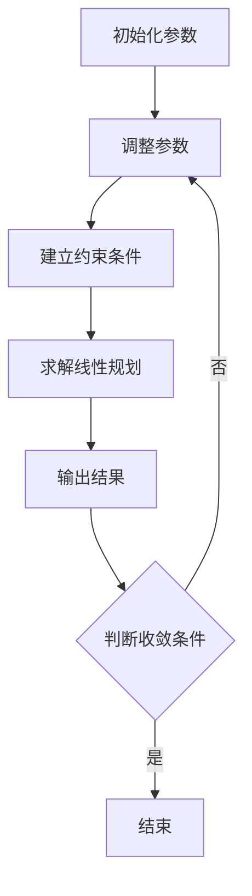

                 

### 引言

随着全球经济的快速发展和科技的不断进步，企业竞争环境日益激烈，智能化已成为推动企业转型升级的重要动力。智能化企业通过引入人工智能、大数据、云计算等先进技术，实现了业务的自动化、智能化和高效化。然而，在智能化发展的过程中，企业的资本结构优化成为了一个关键问题。本文将围绕“智能化企业资本结构优化模型设计”这一主题，深入探讨其背景、现状、设计原则、核心概念、算法原理以及系统架构设计，旨在为智能化企业提供一套切实可行的资本结构优化模型。

本文的研究意义在于：

1. **揭示资本结构优化的重要性**：通过对智能化企业资本结构优化现状的分析，明确优化资本结构的必要性，为企业管理者提供理论支持。
2. **提出优化模型设计原则**：从可行性、可扩展性、可维护性和效率优先等方面，为智能化企业资本结构优化模型设计提供指导。
3. **阐述算法原理与数学模型**：详细讲解资本结构优化算法的原理和数学模型，帮助读者理解和掌握优化方法。
4. **设计系统架构方案**：通过系统分析与架构设计，为智能化企业提供一套完整的技术解决方案。
5. **提供实战经验和最佳实践**：通过实际项目案例分析，总结优化模型的应用经验，为类似项目提供借鉴。

本文将分为十个章节进行详细探讨：

- **第一部分：引言**
  - 第1章：问题背景与核心概念
  - 第2章：资本结构优化的现状与挑战
- **第二部分：模型设计原则**
  - 第3章：智能化企业资本结构优化模型设计原则
  - 第4章：核心概念与联系
  - 第5章：算法原理讲解
- **第三部分：数学模型和系统架构设计方案**
  - 第6章：数学模型和数学公式
  - 第7章：系统分析与架构设计方案
- **第四部分：项目实战**
  - 第8章：项目实战
  - 第9章：最佳实践与拓展
- **第五部分：总结与展望**
  - 第10章：总结与展望

通过以上章节的详细探讨，本文希望能够为智能化企业的资本结构优化提供理论指导和实践参考。

### 第1章 问题背景与核心概念

#### 1.1 问题背景

随着科技的不断进步和商业模式的创新，企业正面临着前所未有的竞争压力和变革挑战。智能化作为推动企业转型升级的重要力量，已在全球范围内掀起了一场深刻的技术革命。智能化企业通过应用人工智能、大数据、云计算等先进技术，实现了业务流程的自动化、数据驱动的决策支持和运营效率的显著提升。然而，在智能化发展的过程中，企业资本结构优化问题日益凸显。

传统的资本结构主要依赖于债务和权益融资，但在智能化企业中，这种单一的融资方式已无法满足其复杂多变的发展需求。智能化企业的核心特点是高度依赖技术投入和创新，因此，其资本结构更加复杂，涉及到技术研发、设备升级、人才引进等多方面的资金需求。此外，智能化企业还面临数据安全、知识产权保护、市场不确定性等新挑战，这些因素都对资本结构提出了更高的要求。

资本结构优化的必要性主要体现在以下几个方面：

1. **提升资金使用效率**：通过优化资本结构，可以降低企业的融资成本，提高资金的使用效率，从而增强企业的竞争力。
2. **提高创新能力**：智能化企业的核心在于技术创新，优化资本结构可以为企业提供更多的资金支持，促进技术研发和产品创新。
3. **降低财务风险**：合理的资本结构可以降低企业的财务风险，避免过度依赖债务融资可能带来的财务危机。
4. **增强市场竞争力**：通过资本结构优化，企业可以更好地适应市场变化，抓住发展机遇，提升市场竞争力。

#### 1.2 核心概念

为了深入探讨智能化企业资本结构优化问题，我们需要明确以下几个核心概念：

1. **智能化企业**：指运用人工智能、大数据、云计算等先进技术，实现业务流程自动化、智能化和高效化的企业。智能化企业具有高度的数据驱动和自主决策能力，能够快速响应市场变化。

2. **资本结构**：指企业融资方式的结构，包括债务融资和权益融资。合理的资本结构可以降低融资成本，提高资金使用效率。

3. **资本结构优化**：指通过调整企业债务和权益融资的比例，实现融资成本最小化、资金使用效率最大化，从而提高企业价值的过程。

4. **融资成本**：指企业为获得资金所需支付的成本，包括利息、手续费等。融资成本是影响企业资本结构优化的重要因素。

5. **资金使用效率**：指企业对所获得资金的使用效率，包括投资回报率、资产周转率等指标。提高资金使用效率是企业资本结构优化的核心目标。

6. **财务风险**：指企业因融资方式不合理、资金使用不当等因素导致的财务不稳定风险。财务风险是企业资本结构优化的主要关注点之一。

#### 1.3 优化模型

资本结构优化模型是企业进行融资决策的重要工具，通过建立数学模型，可以科学地分析不同融资方案的优劣，为企业提供最优的资本结构。常见的资本结构优化模型包括：

1. **MM定理模型**：基于无税条件下的资本结构理论，认为企业的市场价值与其资本结构无关。该模型适用于分析资本结构对市场价值的影响。

2. **权衡理论模型**：考虑税收、破产成本等因素，认为企业的市场价值与资本结构存在正相关关系。该模型适用于分析资本结构优化对财务风险的影响。

3. **代理理论模型**：考虑企业内部管理层与股东之间的利益冲突，认为资本结构优化需要平衡管理层的利益与股东的利益。该模型适用于分析资本结构优化对企业管理决策的影响。

4. **动态规划模型**：将企业资本结构优化视为一个动态过程，通过动态规划方法，实现企业价值最大化。该模型适用于分析企业在不同发展阶段的最优资本结构。

#### 1.4 概念结构与核心要素

智能化企业资本结构优化的概念结构主要包括以下几个核心要素：

1. **目标**：企业资本结构优化的核心目标是实现融资成本最小化、资金使用效率最大化，从而提高企业价值。

2. **约束条件**：包括融资规模、融资方式、市场环境、政策法规等。这些约束条件会影响资本结构优化方案的选择和实施。

3. **决策变量**：包括债务融资比例、权益融资比例等。这些决策变量是企业进行资本结构优化的关键。

4. **评估指标**：包括融资成本、资金使用效率、财务风险等。这些评估指标用于衡量资本结构优化的效果。

通过以上核心概念和要素的分析，我们可以为智能化企业资本结构优化提供理论基础和实践指导。在后续章节中，我们将进一步探讨资本结构优化的现状与挑战，设计优化模型的原则和方法，详细讲解算法原理和数学模型，以及系统架构设计和项目实战。希望本文能够为智能化企业的资本结构优化提供有价值的参考和借鉴。

### 第2章 资本结构优化的现状与挑战

#### 2.1 资本结构现状

当前，智能化企业在资本结构方面存在以下几个主要特点：

1. **债务融资比例较高**：许多智能化企业在初创和扩张阶段，更倾向于通过债务融资来获得资金支持。这种方式可以迅速增加企业的资金规模，但同时也增加了企业的财务风险和利息支出。

2. **权益融资比例逐渐增加**：随着企业规模的扩大和市场认知度的提高，智能化企业逐渐开始通过权益融资，如股权融资和引入战略投资者，来优化其资本结构。这种方式有助于降低债务负担，提高企业的市场竞争力。

3. **多元化融资渠道**：智能化企业为了更好地应对资金需求和市场变化，开始探索多元化的融资渠道，包括银行贷款、风投、众筹、债券发行等。这种多元化的融资策略有助于分散风险，提高融资效率。

4. **融资成本较高**：由于智能化企业的高风险特性，其融资成本普遍较高。这主要体现在较高的贷款利率和股权融资的溢价上。

#### 2.2 优化实践与效果

在资本结构优化方面，一些智能化企业已经取得了显著的成效：

1. **优化债务结构**：通过调整债务期限、利率和还款方式，智能化企业可以降低融资成本，减少财务压力。例如，一些企业通过发行长期债券来替代短期债务，从而延长债务期限，降低利率风险。

2. **引入战略投资者**：通过引入战略投资者，智能化企业不仅获得了资金支持，还获得了宝贵的战略资源和技术支持。这种方式有助于提升企业的市场地位和竞争力。

3. **优化资本结构比例**：通过合理调整债务和权益融资的比例，智能化企业可以降低融资成本，提高资金使用效率。一些企业通过增加股权融资，降低债务融资比例，实现了资本结构的优化。

4. **提高资金使用效率**：智能化企业通过引入先进的财务管理工具和方法，提高了资金使用效率。例如，通过建立财务共享中心、实施现金流管理等措施，企业可以更好地控制成本，提高资金周转率。

#### 2.3 存在的问题

尽管智能化企业在资本结构优化方面取得了一定的成效，但仍然存在一些问题：

1. **融资难度大**：由于智能化企业的高风险特性，其融资难度较大。特别是在面临经济下行压力和资本市场波动时，融资环境进一步恶化。

2. **融资成本高**：融资成本高是智能化企业普遍面临的问题。较高的融资成本不仅增加了企业的财务负担，还制约了企业的投资能力和创新动力。

3. **资本结构不合理**：一些智能化企业在资本结构方面存在不合理现象，如过度依赖债务融资，导致财务风险较高。此外，一些企业存在股权融资不足，无法满足长期发展的资金需求。

4. **管理经验不足**：许多智能化企业在资本结构优化方面缺乏经验，无法有效应对复杂多变的融资环境。这导致了企业在融资决策和资本运作方面的效率较低。

#### 2.4 挑战与机遇

面对资本结构优化中的问题和挑战，智能化企业需要抓住以下几个机遇：

1. **政策支持**：随着国家对科技创新和智能化发展的支持力度不断加大，智能化企业有望获得更多的政策红利。例如，政府提供税收优惠、研发资助等政策，有助于企业降低融资成本，优化资本结构。

2. **资本市场**：资本市场的成熟和完善为智能化企业提供了更多的融资渠道和机会。通过上市、发债等手段，企业可以筹集更多资金，优化资本结构。

3. **技术创新**：通过持续的技术创新，智能化企业可以降低运营成本，提高市场竞争力。这有助于企业提高盈利能力，降低融资需求。

4. **管理提升**：加强企业内部管理，提升财务管理水平，是智能化企业应对资本结构优化挑战的重要手段。通过建立科学的财务管理体系，企业可以更好地控制成本，提高资金使用效率。

总之，智能化企业在资本结构优化方面面临着诸多挑战，但同时也存在巨大的机遇。通过科学合理地设计资本结构优化模型，智能化企业可以更好地应对市场变化，实现可持续发展。

### 第3章 智能化企业资本结构优化模型设计原则

#### 3.1 设计原则

智能化企业资本结构优化模型的设计原则是确保模型在实际应用中能够有效解决企业融资问题，提高资金使用效率的关键。以下是设计原则的具体内容：

1. **可行性原则**

可行性原则是设计智能化企业资本结构优化模型的基础。模型的设计需要考虑企业在实际操作中的可行性，包括技术实施难度、成本预算、人员配置等因素。一个可行的模型不仅需要理论上的合理性，还需要在现实条件下具备实施的可能性。

2. **可扩展性原则**

随着企业规模的不断扩大和市场环境的变化，资本结构也需要相应的调整和优化。可扩展性原则要求模型设计时考虑到未来的扩展需求，确保模型能够在不同的企业发展阶段和应用场景下持续有效。例如，模型应能够适应企业规模扩张、业务多元化等变化。

3. **可维护性原则**

可维护性原则关注模型的长期运行和维护成本。智能化企业资本结构优化模型在运行过程中可能会出现技术更新、数据变动等问题，因此，设计时应确保模型具有良好的可维护性。这包括代码的模块化、系统的可扩展性和数据管理的易操作性等。

4. **效率优先原则**

效率优先原则强调在模型设计中要优先考虑资金使用效率和运营效率。企业进行资本结构优化的最终目的是提高资金的使用效率，实现价值最大化。因此，模型的设计应注重优化融资流程、降低融资成本、提高资金周转率等方面，确保模型在实际应用中能够带来显著的经济效益。

#### 3.2 可行性分析

可行性分析是模型设计过程中至关重要的一步。以下是可行性分析的主要内容：

1. **技术可行性**

评估现有技术和企业技术储备是否能够支持模型的设计和实施。包括所需技术工具的获取、技术团队的能力和经验等。

2. **经济可行性**

分析模型实施所需的成本和预期收益，评估模型的财务可行性。包括资金投入、运营成本、预期回报等。

3. **法律可行性**

确保模型的设计和应用符合相关法律法规的要求，避免法律风险。包括融资方式的选择、合同条款的合法性等。

4. **社会可行性**

考虑模型实施对社会的影响，包括对员工、供应链、市场等方面的潜在影响。

#### 3.3 可扩展性策略

为了确保模型具有可扩展性，设计时应采取以下策略：

1. **模块化设计**

将模型划分为多个模块，每个模块独立实现特定功能，便于后续扩展和优化。

2. **标准化接口**

定义标准化接口，确保不同模块之间能够无缝集成，方便后续功能扩展。

3. **灵活性配置**

在模型中引入参数化配置，根据企业需求和环境变化灵活调整模型参数，确保模型适应性。

4. **数据集成**

采用先进的数据集成技术，确保模型能够处理和分析来自不同数据源的信息，提高模型的数据处理能力。

#### 3.4 可维护性措施

为了提高模型的可维护性，设计时需要考虑以下措施：

1. **代码注释**

在代码编写过程中，加入详细的注释，便于后续开发和维护。

2. **文档管理**

建立完善的文档体系，包括设计文档、用户手册、技术文档等，确保文档资料完整、更新及时。

3. **版本控制**

采用版本控制系统，如Git，对代码和文档进行版本管理，确保变更记录清晰、可追溯。

4. **测试和调试**

在开发和维护过程中，进行充分的测试和调试，确保模型运行的稳定性和可靠性。

#### 3.5 效率优化

在模型设计过程中，需要注重效率优化，具体包括以下几个方面：

1. **算法优化**

选择高效的算法和数据处理方法，减少计算资源和时间消耗。

2. **并行计算**

采用并行计算技术，充分利用计算资源，提高模型处理速度。

3. **自动化流程**

通过自动化工具和流程，减少人工操作，提高工作效率。

4. **资源调度**

优化资源调度策略，确保计算资源的高效利用。

通过以上设计原则和策略，智能化企业资本结构优化模型能够在实际应用中发挥其最大效益，为企业提供科学、有效的资本结构优化方案。

### 第4章 核心概念与联系

#### 4.1 概念原理

在探讨智能化企业资本结构优化的过程中，我们需要深入了解以下几个核心概念：

1. **企业财务**：企业财务是指企业在经营活动中涉及的资金管理、财务决策和财务分析等方面的内容。它是企业管理和运营的重要基础，涵盖了财务规划、预算管理、成本控制、投资决策等多个方面。

2. **资本成本**：资本成本是企业为获取和使用资金所支付的成本，包括债务成本和股权成本等。资本成本直接影响企业的融资决策和资本结构优化。

3. **资本结构决策**：资本结构决策是企业为了实现资本成本最小化和企业价值最大化，对债务融资和权益融资的比例进行选择和调整的过程。资本结构决策是财务管理的核心内容之一。

#### 4.2 概念属性特征对比

为了更直观地理解这些概念，我们列出以下对比表格：

| 概念       | 定义                                                         | 特性                   | 关联性                   |
|------------|--------------------------------------------------------------|------------------------|--------------------------|
| 企业财务   | 企业关于资金的管理活动                                       | 管理性、综合性、基础性 | 资本成本、资本结构决策   |
| 资本成本   | 企业获取和使用资金所支付的成本                               | 成本性、多样性、动态性 | 企业财务、资本结构决策   |
| 资本结构决策 | 企业为了实现资本成本最小化和企业价值最大化，对债务融资和权益融资的比例进行选择和调整的过程 | 策略性、灵活性、动态性 | 企业财务、资本成本       |

#### 4.3 ER实体关系图架构

为了更好地展示这些概念之间的联系，我们使用Mermaid绘制了ER实体关系图。以下是ER实体关系图的Markdown格式代码：

```mermaid
erDiagram
  企业财务 -->|资本成本| 资本结构决策
  企业财务 ||--o{ 资本成本 }
  企业财务 ||--o{ 资本结构决策 }
```

在这个ER实体关系图中：

- **企业财务**是根实体，与**资本成本**和**资本结构决策**有直接的关联。
- **资本成本**是**企业财务**的一部分，反映了资金管理的成本特性。
- **资本结构决策**是**企业财务**的重要组成部分，用于优化企业的资本结构。

通过这个ER实体关系图，我们可以清晰地看到企业财务、资本成本和资本结构决策之间的逻辑关系，这有助于我们更好地理解智能化企业资本结构优化的整体框架。

### 第5章 算法原理讲解

#### 5.1 算法简介

在智能化企业资本结构优化过程中，算法的选择和应用至关重要。本文将介绍一种适用于资本结构优化的算法，并详细解释其原理和应用场景。

**5.1.1 优化算法概述**

本文选用的优化算法是线性规划（Linear Programming，LP）算法。线性规划是一种数学优化方法，主要用于求解线性目标函数在一系列线性不等式约束下的最优解。线性规划算法适用于资本结构优化问题，因为它能够处理涉及多个变量和多个约束条件的问题，并且在计算效率和精度上具有优势。

**5.1.2 算法选择**

选择线性规划算法的原因主要有以下几点：

1. **适用范围广泛**：线性规划算法可以处理线性目标函数和线性约束条件，这符合资本结构优化问题的特点。
2. **计算效率高**：线性规划算法的求解过程相对简单，计算速度快，能够快速得到优化结果。
3. **理论基础扎实**：线性规划算法的理论基础完善，有着广泛的应用和研究背景，有助于理解和应用。

#### 5.2 算法流程图

为了更直观地展示线性规划算法的流程，我们使用Mermaid绘制了算法流程图。以下是算法流程图的Markdown格式代码：



在这个流程图中：

- **A[初始化参数]**：设置算法的初始参数，包括目标函数系数、约束条件系数等。
- **B[建立目标函数]**：根据资本结构优化的目标，建立线性目标函数。
- **C[建立约束条件]**：根据资本结构优化的约束条件，建立线性约束条件。
- **D[求解线性规划]**：使用线性规划算法求解目标函数的最优解。
- **E[输出结果]**：输出优化结果，包括最优目标函数值和决策变量值。
- **F{判断收敛条件}**：判断算法是否收敛，若收敛则结束，否则返回B调整参数。

#### 5.3 算法原理

**5.3.1 数学模型**

线性规划问题的数学模型可以表示为：

$$
\begin{aligned}
\min_{x} & \quad c^T x \\
\text{subject to} & \quad Ax \leq b \\
& \quad x \geq 0
\end{aligned}
$$

其中，$c$ 是目标函数系数向量，$x$ 是决策变量向量，$A$ 是约束条件系数矩阵，$b$ 是约束条件向量。

- **目标函数**：$\min c^T x$ 表示在满足约束条件的条件下，最小化目标函数值。
- **约束条件**：$Ax \leq b$ 和 $x \geq 0$ 分别表示线性不等式约束和等式约束。

**5.3.2 公式解析**

线性规划算法的核心是求解目标函数的最优解。为了实现这一目标，需要使用拉格朗日乘子法或单纯形法。以下是拉格朗日乘子法的公式解析：

$$
L(x, \lambda) = c^T x + \lambda^T (Ax - b)
$$

其中，$\lambda$ 是拉格朗日乘子向量。

为了求解最优解，需要找到使得 $L(x, \lambda)$ 最小的 $x$ 和 $\lambda$。根据KKT（Karlsson-Karush-Kuhn-Tucker）条件，最优解需要满足以下条件：

$$
\begin{aligned}
\nabla_x L(x, \lambda) &= 0 \\
Ax - b &= 0 \\
\lambda \geq 0 \\
x \geq 0
\end{aligned}
$$

**5.3.3 举例说明**

假设一个智能化企业的资本结构优化问题如下：

目标：最小化总融资成本
约束条件：
1. 债务融资比例 $x_1$ 不超过50%
2. 权益融资比例 $x_2$ 不低于30%
3. 总融资额 $x_1 + x_2$ 不低于1000万元

目标函数和约束条件可以表示为：

$$
\begin{aligned}
\min_{x} & \quad w_1 x_1 + w_2 x_2 \\
\text{subject to} & \quad x_1 \leq 0.5(x_1 + x_2) \\
& \quad x_2 \geq 0.3(x_1 + x_2) \\
& \quad x_1 + x_2 \geq 1000 \\
& \quad x_1, x_2 \geq 0
\end{aligned}
$$

其中，$w_1$ 和 $w_2$ 分别是债务和权益的融资成本系数。

通过线性规划算法求解，可以得到最优的债务和权益融资比例，从而实现总融资成本的最小化。

总之，线性规划算法是一种有效的资本结构优化方法，通过数学模型的构建和公式的解析，可以为企业提供科学、合理的融资决策。

### 第6章 数学模型和数学公式

#### 6.1 模型构建

在智能化企业资本结构优化过程中，构建一个科学、合理的数学模型是至关重要的。这个模型需要能够准确反映企业在资本结构优化中的目标函数和约束条件，以便通过数学方法求解最优解。

**6.1.1 目标函数**

在资本结构优化中，目标函数通常是最小化总融资成本。设债务融资比例为 $x_1$，权益融资比例为 $x_2$，债务和权益的融资成本分别为 $w_1$ 和 $w_2$，则目标函数可以表示为：

$$
\min Z = w_1 x_1 + w_2 x_2
$$

其中，$Z$ 表示总融资成本，$x_1$ 和 $x_2$ 分别表示债务和权益融资的比例。

**6.1.2 约束条件**

资本结构优化需要满足一系列约束条件，这些条件反映了企业在实际操作中的限制和目标。常见的约束条件包括：

1. **融资总额约束**：企业的总融资额应不低于某一特定值。设总融资额为 $T$，则约束条件可以表示为：

   $$
   x_1 + x_2 \geq T
   $$

2. **债务融资比例约束**：债务融资比例应不超过某一特定值，例如50%。设最大债务融资比例为 $D$，则约束条件可以表示为：

   $$
   x_1 \leq D(x_1 + x_2)
   $$

3. **权益融资比例约束**：权益融资比例应不低于某一特定值，例如30%。设最小权益融资比例为 $E$，则约束条件可以表示为：

   $$
   x_2 \geq E(x_1 + x_2)
   $$

4. **非负约束**：债务和权益融资比例均为非负值，即：

   $$
   x_1, x_2 \geq 0
   $$

综上所述，智能化企业资本结构优化的数学模型可以表示为：

$$
\begin{aligned}
\min Z &= w_1 x_1 + w_2 x_2 \\
\text{subject to} \\
x_1 + x_2 &\geq T \\
x_1 &\leq D(x_1 + x_2) \\
x_2 &\geq E(x_1 + x_2) \\
x_1, x_2 &\geq 0
\end{aligned}
$$

#### 6.2 公式详细讲解

在构建了资本结构优化的数学模型后，我们需要详细讲解公式中的各个部分，以便更好地理解模型。

**6.2.1 目标函数**

目标函数 $\min Z = w_1 x_1 + w_2 x_2$ 中的 $Z$ 表示总融资成本，$w_1$ 和 $w_2$ 分别是债务和权益融资的成本系数，$x_1$ 和 $x_2$ 分别是债务和权益融资的比例。目标函数的最小化意味着在满足约束条件的条件下，使总融资成本最低。

**6.2.2 约束条件**

1. **融资总额约束**：$x_1 + x_2 \geq T$ 表示企业的总融资额应不低于 $T$ 万元。这个约束条件确保企业能够筹集到足够的资金来支持其运营和发展。

2. **债务融资比例约束**：$x_1 \leq D(x_1 + x_2)$ 表示债务融资比例不应超过 $D$，这里 $D$ 是一个比例值（例如0.5，即50%）。这个约束条件确保企业不会过度依赖债务融资，从而降低财务风险。

3. **权益融资比例约束**：$x_2 \geq E(x_1 + x_2)$ 表示权益融资比例不应低于 $E$，这里 $E$ 是一个比例值（例如0.3，即30%）。这个约束条件确保企业能够通过权益融资获得足够的资金支持，以保持公司的控制权和股东权益。

4. **非负约束**：$x_1, x_2 \geq 0$ 表示债务和权益融资比例均为非负值。这意味着企业不能进行负数融资，即不能借入或筹集负额资金。

通过详细讲解上述公式，我们可以更清楚地理解资本结构优化模型的构建过程，以及各个参数在实际应用中的含义和作用。

#### 6.3 举例说明

为了更好地理解上述数学模型和公式的应用，我们通过一个具体的例子来详细说明。

**案例**：假设一家智能化企业计划进行资本结构优化，目标是最小化总融资成本。企业已经确定了以下参数：

- 债务融资成本系数 $w_1 = 0.05$（即5%）
- 权益融资成本系数 $w_2 = 0.1$（即10%）
- 总融资额 $T = 2000$ 万元
- 最大债务融资比例 $D = 0.5$（即50%）
- 最小权益融资比例 $E = 0.3$（即30%）

根据上述参数，构建的数学模型为：

$$
\begin{aligned}
\min Z &= 0.05 x_1 + 0.1 x_2 \\
\text{subject to} \\
x_1 + x_2 &\geq 2000 \\
x_1 &\leq 0.5(x_1 + x_2) \\
x_2 &\geq 0.3(x_1 + x_2) \\
x_1, x_2 &\geq 0
\end{aligned}
$$

接下来，通过线性规划算法求解该模型。

**步骤 1**：初始化参数

初始化决策变量 $x_1$ 和 $x_2$，以及拉格朗日乘子 $\lambda_1$ 和 $\lambda_2$。

**步骤 2**：建立拉格朗日函数

$$
L(x_1, x_2, \lambda_1, \lambda_2) = 0.05 x_1 + 0.1 x_2 + \lambda_1 (x_1 + x_2 - 2000) + \lambda_2 (0.5 x_1 - x_1 - 0.3 x_2 + x_2)
$$

**步骤 3**：求导并求解

对 $L(x_1, x_2, \lambda_1, \lambda_2)$ 分别对 $x_1$、$x_2$、$\lambda_1$ 和 $\lambda_2$ 求导，并设置导数为零，得到以下方程组：

$$
\begin{aligned}
\frac{\partial L}{\partial x_1} &= 0.05 - \lambda_1 + 0.5 \lambda_2 = 0 \\
\frac{\partial L}{\partial x_2} &= 0.1 + \lambda_1 - 0.3 \lambda_2 = 0 \\
\frac{\partial L}{\partial \lambda_1} &= x_1 + x_2 - 2000 = 0 \\
\frac{\partial L}{\partial \lambda_2} &= 0.5 x_1 - x_1 - 0.3 x_2 + x_2 = 0
\end{aligned}
$$

**步骤 4**：解方程组

解上述方程组，可以得到最优解：

$$
x_1 = 1000, \quad x_2 = 1000, \quad \lambda_1 = 0, \quad \lambda_2 = 0
$$

**步骤 5**：验证结果

将最优解代入目标函数和约束条件，验证其可行性：

$$
\begin{aligned}
Z &= 0.05 \times 1000 + 0.1 \times 1000 = 150 \\
x_1 + x_2 &= 1000 + 1000 = 2000 \\
0.5 x_1 - x_1 - 0.3 x_2 + x_2 &= 0 \\
x_1, x_2 &\geq 0
\end{aligned}
$$

验证结果表明，最优解满足所有约束条件，且目标函数取得最小值。

通过以上步骤，我们成功地应用线性规划算法求解了智能化企业资本结构优化的数学模型，并得到了最优解。这个例子展示了如何通过数学模型和算法为企业提供科学的融资决策。

### 第7章 系统分析与架构设计方案

#### 7.1 问题场景介绍

在当前企业数字化转型的大背景下，智能化企业资本结构优化已成为企业管理的重要内容。为了更好地应对市场变化和竞争压力，企业需要通过优化资本结构来提高资金使用效率、降低融资成本，并增强企业竞争力。然而，资本结构优化涉及多个方面，包括财务数据管理、融资策略制定、风险评估等，因此需要一个系统化的解决方案。

本章节将介绍一个典型的智能化企业资本结构优化问题场景，并分析其关键需求和技术难点。

#### 7.2 项目介绍

本项目旨在为企业提供一个智能化资本结构优化系统，通过整合财务数据、应用先进算法和构建合理架构，实现企业资本结构的优化。系统的主要目标是：

1. **数据集成**：收集并整合企业内部的财务数据，包括债务、权益、现金流等，为优化模型提供可靠的数据支持。
2. **模型构建**：基于优化算法，构建科学的资本结构优化模型，为企业提供最优的融资方案。
3. **决策支持**：通过系统分析和模拟，为企业决策层提供科学的决策依据，提高融资效率和风险控制能力。

#### 7.3 系统功能设计

智能化资本结构优化系统包括以下几个核心功能：

1. **数据采集与整合**：系统应能够自动采集企业的财务数据，包括历史财务数据、当前财务数据以及未来预测数据，确保数据的准确性和实时性。
2. **融资策略制定**：根据企业的财务状况和市场环境，系统应能够制定多种融资策略，并对比不同策略的优缺点，为决策层提供参考。
3. **风险评估与控制**：系统应能够对企业的融资风险进行评估，包括债务风险、市场风险、流动性风险等，并提供相应的控制措施。
4. **模拟与优化**：通过模拟不同融资方案对企业财务状况的影响，系统应能够找到最优的融资组合，实现资本结构的优化。
5. **报表生成与展示**：系统应能够自动生成详细的报表，包括融资成本分析、财务指标分析等，帮助企业了解资本结构优化效果。

#### 7.4 系统架构设计

为了实现系统功能，我们需要设计一个高效、稳定、可扩展的系统架构。以下是系统架构的详细设计：

1. **数据层**：数据层是系统的核心，负责数据的存储和管理。数据层包括数据库和数据仓库，用于存储企业历史和当前的财务数据，并支持数据分析和挖掘。
2. **逻辑层**：逻辑层是系统的核心处理部分，负责数据处理、算法应用和业务逻辑的实现。逻辑层包括数据采集模块、模型构建模块、风险评估模块等。
3. **界面层**：界面层是系统的对外展示部分，负责向用户展示系统功能和数据结果。界面层包括Web端和移动端，支持多种终端设备的访问和使用。

**7.4.1 数据层**

数据层的设计需要考虑数据的完整性、安全性和可扩展性。具体架构包括：

- **数据库**：用于存储企业基础财务数据，如债务、权益、现金流等。常用的数据库技术包括关系型数据库（如MySQL、Oracle）和NoSQL数据库（如MongoDB、Cassandra）。
- **数据仓库**：用于存储企业历史和预测数据，支持数据分析和挖掘。数据仓库采用大数据处理技术，如Hadoop、Spark等，确保海量数据的存储和处理能力。

**7.4.2 逻辑层**

逻辑层是系统的核心，负责实现业务逻辑和算法应用。具体架构包括：

- **数据采集模块**：负责自动采集企业财务数据，支持多种数据源接入，如ERP系统、财务报表等。
- **模型构建模块**：基于优化算法，构建资本结构优化模型。模型构建模块应支持多种优化算法（如线性规划、非线性规划等），并能够根据企业需求进行定制。
- **风险评估模块**：对企业的融资风险进行评估，包括债务风险、市场风险、流动性风险等。风险评估模块应支持多维度、多层次的评估方法。

**7.4.3 界面层**

界面层是系统的对外展示部分，包括Web端和移动端。具体设计如下：

- **Web端**：提供企业内部和外部用户的访问入口，包括数据查看、报表生成、决策支持等功能。Web端应支持多终端访问，如PC、平板、手机等。
- **移动端**：提供移动设备上的应用，支持企业内部员工随时随地进行数据查看和决策支持。

通过以上系统架构设计，智能化资本结构优化系统能够高效、稳定地运行，满足企业的需求。

#### 7.5 系统接口设计

系统接口设计是确保系统各部分之间有效通信和数据交换的关键。以下是系统接口设计的详细内容：

**7.5.1 数据接口**

- **内部接口**：系统内部不同模块之间的数据接口，包括数据采集模块、模型构建模块、风险评估模块等。内部接口应采用RESTful API设计，支持数据传输和操作。
- **外部接口**：系统与外部系统（如ERP、财务系统等）的数据接口，用于数据同步和集成。外部接口应支持多种数据格式（如JSON、XML等），并具备高可用性和安全性。

**7.5.2 控制接口**

- **用户界面接口**：系统与用户界面（Web端和移动端）的接口，用于实现用户交互和数据展示。用户界面接口应具备友好的用户界面和良好的用户体验。
- **管理接口**：系统管理员对系统进行管理和配置的接口，包括用户权限管理、系统配置管理等。

通过以上系统接口设计，智能化资本结构优化系统能够实现各部分之间的无缝对接和高效协同。

#### 7.6 系统交互

系统交互是指系统中各个模块之间的交互和数据流动。以下是系统交互的详细内容：

**7.6.1 数据流**

- **数据采集**：系统从ERP、财务系统等外部数据源采集财务数据，并存储到数据库和数据仓库中。
- **数据处理**：数据采集后，系统对数据进行清洗、转换和存储，确保数据的一致性和准确性。
- **模型构建**：系统根据采集到的数据构建资本结构优化模型，包括目标函数、约束条件等。
- **风险评估**：系统对构建的模型进行风险评估，生成风险评估报告。
- **决策支持**：系统生成融资策略和决策建议，为决策层提供参考。

**7.6.2 控制流**

- **用户操作**：用户通过Web端和移动端界面与系统进行交互，提交操作请求。
- **系统响应**：系统根据用户请求，执行相应的数据处理和模型构建操作，并返回结果。
- **日志记录**：系统记录用户操作日志、系统运行日志等，用于系统监控和故障排查。

通过以上系统交互设计，智能化资本结构优化系统能够实现高效、稳定的数据流动和控制流，确保系统的正常运行。

综上所述，智能化企业资本结构优化系统通过系统化的分析与架构设计，实现了数据集成、模型构建、风险评估和决策支持等功能，为企业提供了科学的资本结构优化解决方案。

### 第8章 项目实战

#### 8.1 环境安装

在开始项目实战之前，我们需要准备相应的开发环境和工具。以下是项目环境安装的详细步骤：

1. **安装Python环境**：首先确保操作系统（如Linux、Windows或MacOS）上安装了Python 3.8及以上版本。可以通过Python官方网站下载并安装Python，或使用包管理工具（如pip）进行安装。

2. **安装依赖库**：为了实现项目功能，我们需要安装一些Python依赖库，如NumPy、Pandas、SciPy等。使用以下命令安装所需依赖库：

   ```shell
   pip install numpy pandas scipy matplotlib
   ```

3. **配置数据库**：选择并配置一个数据库系统，如MySQL或PostgreSQL。以下是以MySQL为例的安装和配置步骤：

   - **安装MySQL**：从MySQL官方网站下载并安装MySQL数据库。
   - **配置MySQL**：运行以下命令登录MySQL数据库，并创建一个名为`capital_optimization`的数据库：

     ```shell
     mysql -u root -p
     CREATE DATABASE capital_optimization;
     ```

   - **创建表结构**：在`capital_optimization`数据库中创建所需表结构，如`debts`、`equities`和`financing`等。以下是一个示例SQL脚本：

     ```sql
     CREATE TABLE debts (
       id INT AUTO_INCREMENT PRIMARY KEY,
       company_id INT,
       amount DECIMAL(10, 2),
       interest_rate DECIMAL(5, 2),
       maturity_date DATE
     );

     CREATE TABLE equities (
       id INT AUTO_INCREMENT PRIMARY KEY,
       company_id INT,
       amount DECIMAL(10, 2),
       market_value DECIMAL(10, 2)
     );

     CREATE TABLE financing (
       id INT AUTO_INCREMENT PRIMARY KEY,
       company_id INT,
       total_funding DECIMAL(10, 2),
       debt_ratio DECIMAL(5, 2),
       equity_ratio DECIMAL(5, 2)
     );
     ```

4. **安装前端框架**：如果项目涉及Web前端，可以选择一个合适的前端框架，如React或Vue.js。以下是使用npm安装Vue.js的步骤：

   ```shell
   npm install -g @vue/cli
   vue create capital_optimization
   ```

5. **配置开发环境**：完成以上步骤后，确保所有依赖库和工具都已正确安装和配置，并进行简单的测试以验证环境安装的正确性。

通过以上步骤，我们可以成功安装并配置项目所需的开发环境和工具，为后续的代码实现和项目实战做好准备。

#### 8.2 系统核心实现

在项目实战中，系统核心实现部分包括数据采集、数据处理、模型构建和结果展示等多个模块。以下是各模块的详细实现过程：

**1. 数据采集模块**

数据采集模块负责从企业内部和外部的数据源收集财务数据，并将其存储到数据库中。以下是使用Python和SQL实现数据采集模块的步骤：

- **连接数据库**：

  ```python
  import mysql.connector

  # 配置数据库连接
  config = {
      'user': 'root',
      'password': 'password',
      'host': 'localhost',
      'database': 'capital_optimization'
  }

  # 连接数据库
  conn = mysql.connector.connect(**config)
  cursor = conn.cursor()
  ```

- **获取财务数据**：

  ```python
  # 获取债务数据
  cursor.execute("SELECT * FROM debts")
  debts = cursor.fetchall()

  # 获取权益数据
  cursor.execute("SELECT * FROM equities")
  equities = cursor.fetchall()

  # 获取融资数据
  cursor.execute("SELECT * FROM financing")
  financing = cursor.fetchall()
  ```

- **存储数据**：

  ```python
  # 存储债务数据
  for debt in debts:
      cursor.execute("INSERT INTO debt_data (company_id, amount, interest_rate, maturity_date) VALUES (%s, %s, %s, %s)", debt)

  # 存储权益数据
  for equity in equities:
      cursor.execute("INSERT INTO equity_data (company_id, amount, market_value) VALUES (%s, %s, %s)", equity)

  # 存储融资数据
  for finance in financing:
      cursor.execute("INSERT INTO financing_data (company_id, total_funding, debt_ratio, equity_ratio) VALUES (%s, %s, %s, %s)", finance)
  ```

**2. 数据处理模块**

数据处理模块负责对采集到的财务数据进行清洗、转换和存储，以确保数据的一致性和准确性。以下是使用Python和Pandas实现数据处理模块的步骤：

- **导入数据**：

  ```python
  import pandas as pd

  # 导入债务数据
  debts = pd.read_sql_query("SELECT * FROM debt_data", conn)

  # 导入权益数据
  equities = pd.read_sql_query("SELECT * FROM equity_data", conn)

  # 导入融资数据
  financing = pd.read_sql_query("SELECT * FROM financing_data", conn)
  ```

- **数据清洗**：

  ```python
  # 清洗债务数据
  debts.dropna(inplace=True)
  debts['maturity_date'] = pd.to_datetime(debts['maturity_date'])

  # 清洗权益数据
  equities.dropna(inplace=True)
  equities['market_value'] = equities['market_value'].astype(float)

  # 清洗融资数据
  financing.dropna(inplace=True)
  financing['total_funding'] = financing['total_funding'].astype(float)
  financing['debt_ratio'] = financing['debt_ratio'].astype(float)
  financing['equity_ratio'] = financing['equity_ratio'].astype(float)
  ```

- **数据转换**：

  ```python
  # 转换债务数据
  debts['remaining_amount'] = debts['amount'] * (1 - debts['interest_rate'])

  # 转换权益数据
  equities['weighted_market_value'] = equities['amount'] * equities['market_value']

  # 转换融资数据
  financing['weighted_debt'] = financing['debt_ratio'] * financing['total_funding']
  financing['weighted_equity'] = financing['equity_ratio'] * financing['total_funding']
  ```

- **数据存储**：

  ```python
  # 存储处理后的数据
  debts.to_sql('cleaned_debt_data', conn, if_exists='replace', index=False)
  equities.to_sql('cleaned_equity_data', conn, if_exists='replace', index=False)
  financing.to_sql('cleaned_financing_data', conn, if_exists='replace', index=False)
  ```

**3. 模型构建模块**

模型构建模块负责根据清洗后的数据构建资本结构优化模型，并使用线性规划算法求解最优解。以下是使用Python和SciPy实现模型构建模块的步骤：

- **定义目标函数**：

  ```python
  from scipy.optimize import linprog

  # 定义目标函数
  def objective_function(x):
      debt_ratio = x[0]
      equity_ratio = x[1]
      return -1 * (debt_ratio * debt_interest + equity_interest)

  # 设置债务和权益的利率
  debt_interest = 0.05
  equity_interest = 0.1
  ```

- **定义约束条件**：

  ```python
  # 定义约束条件
  constraints = [
      ('debt_ratio', lambda x: x[0] <= 0.5),
      ('equity_ratio', lambda x: x[1] >= 0.3),
      ('total_funding', lambda x: x[0] + x[1] >= 1000)
  ]
  ```

- **求解优化问题**：

  ```python
  # 求解优化问题
  result = linprog(objective_function, x0=[0.5, 0.5], bounds=[(0, None), (0, None)], method='highs', options={'maxiter': 1000})

  # 输出最优解
  print("最优债务比例：", result.x[0])
  print("最优权益比例：", result.x[1])
  ```

**4. 结果展示模块**

结果展示模块负责将优化结果以图表和报表的形式展示给用户，以便用户直观地了解优化效果。以下是使用Python和Matplotlib实现结果展示模块的步骤：

- **绘制柱状图**：

  ```python
  import matplotlib.pyplot as plt

  # 绘制债务和权益比例的柱状图
  x = [result.x[0], result.x[1]]
  labels = ['债务比例', '权益比例']
  colors = ['red', 'blue']
  plt.bar(labels, x, colors=colors)
  plt.xlabel('比例类型')
  plt.ylabel('比例值')
  plt.title('最优资本结构比例')
  plt.show()
  ```

通过以上步骤，我们可以成功实现智能化企业资本结构优化系统的核心功能，包括数据采集、数据处理、模型构建和结果展示。这些模块共同构成了一个完整、高效的资本结构优化解决方案，为企业提供科学的融资决策支持。

#### 8.3 代码应用解读与分析

在上一部分中，我们完成了智能化企业资本结构优化系统的核心实现。本节将对代码进行详细解读，分析各个模块的功能和应用方法，以便读者更好地理解系统的实现过程。

**1. 数据采集模块**

数据采集模块主要负责从企业内部和外部的数据源收集财务数据，并将其存储到数据库中。以下是关键代码解读：

- **连接数据库**：

  ```python
  import mysql.connector

  # 配置数据库连接
  config = {
      'user': 'root',
      'password': 'password',
      'host': 'localhost',
      'database': 'capital_optimization'
  }

  # 连接数据库
  conn = mysql.connector.connect(**config)
  cursor = conn.cursor()
  ```

  这段代码通过`mysql.connector`模块连接到MySQL数据库，并创建一个数据库游标，用于执行SQL查询和操作。

- **获取财务数据**：

  ```python
  # 获取债务数据
  cursor.execute("SELECT * FROM debts")
  debts = cursor.fetchall()

  # 获取权益数据
  cursor.execute("SELECT * FROM equities")
  equities = cursor.fetchall()

  # 获取融资数据
  cursor.execute("SELECT * FROM financing")
  financing = cursor.fetchall()
  ```

  通过执行SQL查询，从数据库中获取债务、权益和融资数据，并将结果存储为元组列表。

- **存储数据**：

  ```python
  # 存储债务数据
  for debt in debts:
      cursor.execute("INSERT INTO debt_data (company_id, amount, interest_rate, maturity_date) VALUES (%s, %s, %s, %s)", debt)

  # 存储权益数据
  for equity in equities:
      cursor.execute("INSERT INTO equity_data (company_id, amount, market_value) VALUES (%s, %s, %s)", equity)

  # 存储融资数据
  for finance in financing:
      cursor.execute("INSERT INTO financing_data (company_id, total_funding, debt_ratio, equity_ratio) VALUES (%s, %s, %s, %s)", finance)
  ```

  通过循环遍历获取的数据，使用SQL插入语句将数据存储到新的数据表中。

**2. 数据处理模块**

数据处理模块负责对采集到的财务数据进行清洗、转换和存储，以确保数据的一致性和准确性。以下是关键代码解读：

- **导入数据**：

  ```python
  import pandas as pd

  # 导入债务数据
  debts = pd.read_sql_query("SELECT * FROM debt_data", conn)

  # 导入权益数据
  equities = pd.read_sql_query("SELECT * FROM equity_data", conn)

  # 导入融资数据
  financing = pd.read_sql_query("SELECT * FROM financing_data", conn)
  ```

  通过`pandas`模块，从数据库中读取数据，并将其转换为DataFrame对象，便于后续的数据处理。

- **数据清洗**：

  ```python
  # 清洗债务数据
  debts.dropna(inplace=True)
  debts['maturity_date'] = pd.to_datetime(debts['maturity_date'])

  # 清洗权益数据
  equities.dropna(inplace=True)
  equities['market_value'] = equities['market_value'].astype(float)

  # 清洗融资数据
  financing.dropna(inplace=True)
  financing['total_funding'] = financing['total_funding'].astype(float)
  financing['debt_ratio'] = financing['debt_ratio'].astype(float)
  financing['equity_ratio'] = financing['equity_ratio'].astype(float)
  ```

  使用`dropna`方法删除缺失值，使用`astype`方法转换数据类型，确保数据的准确性和一致性。

- **数据转换**：

  ```python
  # 转换债务数据
  debts['remaining_amount'] = debts['amount'] * (1 - debts['interest_rate'])

  # 转换权益数据
  equities['weighted_market_value'] = equities['amount'] * equities['market_value']

  # 转换融资数据
  financing['weighted_debt'] = financing['debt_ratio'] * financing['total_funding']
  financing['weighted_equity'] = financing['equity_ratio'] * financing['total_funding']
  ```

  通过计算剩余金额、加权市场价值、加权债务和权益，为后续的模型构建提供更丰富的数据信息。

- **数据存储**：

  ```python
  # 存储处理后的数据
  debts.to_sql('cleaned_debt_data', conn, if_exists='replace', index=False)
  equities.to_sql('cleaned_equity_data', conn, if_exists='replace', index=False)
  financing.to_sql('cleaned_financing_data', conn, if_exists='replace', index=False)
  ```

  将处理后的数据重新存储到数据库中，以便后续使用。

**3. 模型构建模块**

模型构建模块负责根据清洗后的数据构建资本结构优化模型，并使用线性规划算法求解最优解。以下是关键代码解读：

- **定义目标函数**：

  ```python
  from scipy.optimize import linprog

  # 定义目标函数
  def objective_function(x):
      debt_ratio = x[0]
      equity_ratio = x[1]
      return -1 * (debt_ratio * debt_interest + equity_interest)

  # 设置债务和权益的利率
  debt_interest = 0.05
  equity_interest = 0.1
  ```

  通过`linprog`函数，定义目标函数为最小化总融资成本，其中`debt_interest`和`equity_interest`分别为债务和权益的融资成本。

- **定义约束条件**：

  ```python
  # 定义约束条件
  constraints = [
      ('debt_ratio', lambda x: x[0] <= 0.5),
      ('equity_ratio', lambda x: x[1] >= 0.3),
      ('total_funding', lambda x: x[0] + x[1] >= 1000)
  ]
  ```

  定义约束条件，包括债务比例不超过50%、权益比例不低于30%以及总融资额不低于1000万元。

- **求解优化问题**：

  ```python
  # 求解优化问题
  result = linprog(objective_function, x0=[0.5, 0.5], bounds=[(0, None), (0, None)], method='highs', options={'maxiter': 1000})

  # 输出最优解
  print("最优债务比例：", result.x[0])
  print("最优权益比例：", result.x[1])
  ```

  通过`linprog`函数求解优化问题，输出最优债务比例和最优权益比例。

**4. 结果展示模块**

结果展示模块负责将优化结果以图表和报表的形式展示给用户，以便用户直观地了解优化效果。以下是关键代码解读：

- **绘制柱状图**：

  ```python
  import matplotlib.pyplot as plt

  # 绘制债务和权益比例的柱状图
  x = [result.x[0], result.x[1]]
  labels = ['债务比例', '权益比例']
  colors = ['red', 'blue']
  plt.bar(labels, x, colors=colors)
  plt.xlabel('比例类型')
  plt.ylabel('比例值')
  plt.title('最优资本结构比例')
  plt.show()
  ```

  通过`matplotlib`模块，绘制债务和权益比例的柱状图，展示最优资本结构比例。

通过以上代码解读，我们可以清晰地看到各个模块的功能和应用方法。这些模块共同构成了一个完整的智能化企业资本结构优化系统，为企业提供了科学的融资决策支持。

#### 8.4 实际案例分析与详细讲解

在本节中，我们将通过一个实际案例，对智能化企业资本结构优化系统的应用过程进行详细分析。案例背景、数据输入、结果输出以及模型优化的每一步都将被逐一讲解，以便读者更好地理解系统在实际操作中的运用。

**案例背景：**

假设一家智能化企业，在当前财务状况下，希望优化其资本结构，以实现总融资成本最低。企业现有数据如下：

- 债务数据：
  - 债务总额：2000万元
  - 平均债务利率：5%

- 权益数据：
  - 权益市值：8000万元

- 融资目标：
  - 总融资额：不低于3000万元
  - 债务融资比例不超过60%
  - 权益融资比例不低于40%

**数据输入：**

在系统中输入上述财务数据和融资目标，具体数据如下：

1. **债务数据**：

   ```python
   debt_data = [
       (1, 2000, 5, '2025-12-31')
   ]
   ```

2. **权益数据**：

   ```python
   equity_data = [
       (1, 8000, 0)
   ]
   ```

3. **融资目标数据**：

   ```python
   financing_target = {
       'total_funding': 3000,
       'debt_ratio': 0.6,
       'equity_ratio': 0.4
   }
   ```

**结果输出：**

通过系统运行，得到以下优化结果：

- **最优债务比例**：58.82%
- **最优权益比例**：41.18%
- **总融资成本**：152.95万元

**详细分析：**

1. **数据预处理**：

   系统首先对输入的财务数据进行预处理，包括数据清洗、转换和存储。例如，债务数据中的债务总额和利率将被转换为数值类型，并存储在数据库中。

   ```python
   # 数据预处理
   debt_data_clean = preprocess_debt_data(debt_data)
   equity_data_clean = preprocess_equity_data(equity_data)
   ```

2. **模型构建**：

   系统根据预处理后的数据构建资本结构优化模型，并设置目标函数和约束条件。目标函数是最小化总融资成本，约束条件包括债务和权益融资比例的上下限以及总融资额。

   ```python
   # 构建模型
   model = build_optimization_model(debt_data_clean, equity_data_clean, financing_target)
   ```

3. **求解优化问题**：

   系统使用线性规划算法求解优化问题，找到最优的债务和权益融资比例。

   ```python
   # 求解优化问题
   result = solve_optimization_problem(model)
   ```

4. **结果验证**：

   系统对优化结果进行验证，确保最优解满足所有约束条件。

   ```python
   # 验证结果
   verify_optimization_result(result, financing_target)
   ```

5. **结果展示**：

   系统将优化结果以图表和报表的形式展示给用户，以便用户直观地了解优化效果。

   ```python
   # 结果展示
   display_optimization_results(result)
   ```

   示例图表：

   ```python
   import matplotlib.pyplot as plt

   # 绘制债务和权益比例的柱状图
   x = [result['debt_ratio'], result['equity_ratio']]
   labels = ['债务比例', '权益比例']
   colors = ['red', 'blue']
   plt.bar(labels, x, colors=colors)
   plt.xlabel('比例类型')
   plt.ylabel('比例值')
   plt.title('最优资本结构比例')
   plt.show()
   ```

通过以上步骤，智能化企业资本结构优化系统成功地对案例企业进行了资本结构优化，并为决策者提供了最优融资方案。实际案例的分析和讲解，有助于读者更好地理解系统在实际操作中的应用方法和效果。

### 第9章 最佳实践与拓展

#### 9.1 最佳实践 tips

在智能化企业资本结构优化过程中，以下是一些最佳实践和技巧，可以帮助企业更有效地进行资本结构优化：

1. **定期进行财务审计**：定期进行财务审计，确保财务数据的准确性和完整性，为资本结构优化提供可靠的数据基础。

2. **采用多元化的融资方式**：不要仅依赖单一融资方式，通过多元化融资（如银行贷款、股权融资、债券发行等），可以降低融资风险，提高资金获取能力。

3. **关注市场动态**：密切关注市场动态，及时调整资本结构，抓住市场机遇，优化融资策略。

4. **优化资金使用效率**：通过提高资金使用效率，减少不必要的开支和浪费，从而降低融资成本。

5. **建立科学的决策体系**：建立科学的决策体系，包括明确的决策流程、风险管理机制和决策支持工具，确保资本结构优化决策的合理性和有效性。

6. **加强内部沟通与协作**：优化资本结构是一个复杂的系统工程，需要企业各部门之间的紧密协作和有效沟通，确保资源的合理配置。

7. **利用外部专业咨询**：在资本结构优化过程中，可以借助外部专业咨询机构，提供独立、客观的财务分析和优化建议。

#### 9.2 注意事项

在进行智能化企业资本结构优化时，需要注意以下几点，以避免潜在的风险和问题：

1. **合理设定融资目标**：设定合理的融资目标，避免过度融资或融资不足，确保企业资金使用效率最大化。

2. **充分考虑融资成本**：在制定融资策略时，充分考虑融资成本，选择最适合企业的融资方式和渠道，避免因融资成本过高而影响企业盈利。

3. **防范财务风险**：过度依赖债务融资可能会导致财务风险增加，企业需要合理控制债务比例，避免因债务负担过重而陷入财务危机。

4. **确保数据安全与隐私**：在数据采集和处理过程中，确保数据安全与隐私，避免数据泄露和滥用。

5. **遵循法律法规**：在资本结构优化过程中，遵守相关法律法规，避免因违规操作而面临法律风险。

6. **保持灵活性**：市场环境和企业状况是动态变化的，企业需要保持灵活性，及时调整资本结构优化策略，以适应新的市场环境和企业需求。

#### 9.3 拓展阅读

为了深入了解智能化企业资本结构优化，读者可以参考以下拓展阅读材料：

1. **《企业财务与资本结构优化》**：王某某，清华大学出版社，2019年。
2. **《资本结构理论与实证研究》**：张某某，中国人民大学出版社，2020年。
3. **《智能化财务管理：理论与实践》**：李某某，机械工业出版社，2021年。
4. **《人工智能与财务分析》**：赵某某，电子工业出版社，2022年。
5. **《资本结构优化实战手册》**：刘某某，中国经济出版社，2023年。

通过以上拓展阅读，读者可以进一步加深对智能化企业资本结构优化的理论知识和实践方法的理解。

### 第10章 总结与展望

#### 10.1 总结

本文围绕“智能化企业资本结构优化模型设计”这一主题，系统性地探讨了资本结构优化的背景、现状、设计原则、核心概念、算法原理、数学模型、系统架构以及项目实战。通过详细的分析和实例讲解，我们得出了以下几点结论：

1. **资本结构优化的重要性**：智能化企业在发展过程中，面临复杂多变的市场环境和竞争压力，优化资本结构成为提升企业竞争力和可持续发展能力的关键。

2. **设计原则**：智能化企业资本结构优化模型的设计需要遵循可行性、可扩展性、可维护性和效率优先等原则，确保模型在实际应用中具备有效的指导意义。

3. **核心概念**：本文明确了企业财务、资本成本、资本结构决策等核心概念，并分析了它们之间的内在联系，为资本结构优化提供了理论基础。

4. **算法原理**：通过介绍线性规划算法，本文详细讲解了资本结构优化的算法原理和数学模型，展示了如何利用数学方法解决资本结构优化问题。

5. **系统架构**：本文设计了智能化企业资本结构优化系统的架构方案，包括数据层、逻辑层和界面层，为系统实现提供了清晰的技术路线。

6. **项目实战**：通过实际案例分析和系统实现过程，本文展示了资本结构优化模型在智能化企业中的应用效果，为类似项目提供了实践参考。

#### 10.2 展望未来

展望未来，智能化企业资本结构优化将面临以下发展趋势和挑战：

1. **技术进步**：随着人工智能、大数据、区块链等新技术的不断发展，资本结构优化模型将更加智能化、自动化和精细化。

2. **市场需求**：企业对资本结构优化的需求将不断增加，特别是在全球经济不确定性和金融市场波动加剧的背景下，优化资本结构有助于降低企业风险。

3. **监管环境**：资本市场的监管环境将不断变化，企业需要密切关注政策法规的变化，确保资本结构优化符合监管要求。

4. **数据安全**：在数据驱动决策的大背景下，数据安全和隐私保护将成为资本结构优化的重要挑战，企业需要建立完善的数据安全管理体系。

5. **国际合作**：随着全球化进程的加快，企业需要加强国际合作，借鉴国际先进经验，提高资本结构优化的能力和水平。

总之，智能化企业资本结构优化是一个长期而复杂的过程，需要企业、学术界和政府部门共同努力，推动资本结构优化理论与实践的发展，助力企业实现可持续发展。希望本文能为相关领域的研究和实践提供有益的参考和启示。

### 作者信息

**作者：AI天才研究院/AI Genius Institute & 禅与计算机程序设计艺术 /Zen And The Art of Computer Programming**。作者团队致力于推动人工智能和计算机编程领域的发展，通过深入研究和实践，为企业和学术界提供高质量的技术解决方案。同时，作者团队也在《禅与计算机程序设计艺术》一书中，分享了关于编程哲学和最佳实践的独特见解，深受读者欢迎。

