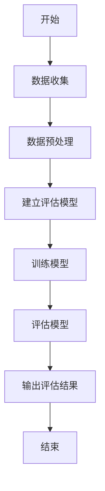
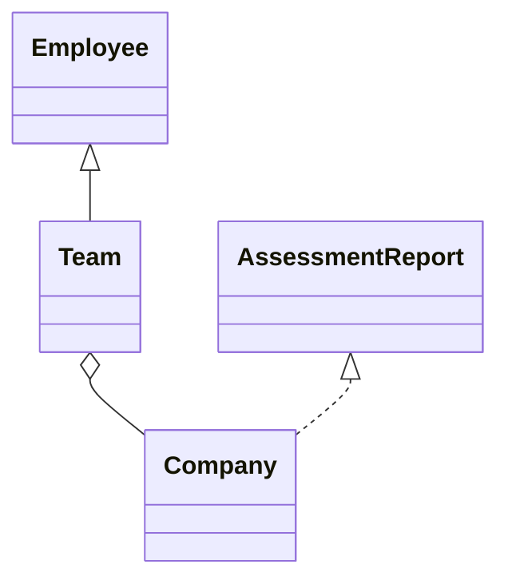
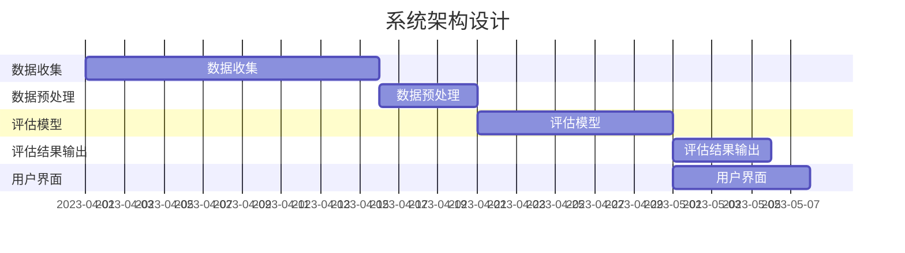
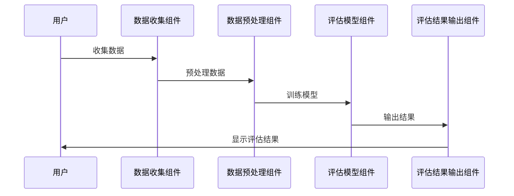

                 

## 《智能化公司创新文化评估：多智能体AI的新视角》

关键词：创新文化、多智能体AI、评估模型、算法原理、系统架构设计

摘要：本文以智能化公司创新文化评估为背景，探讨了多智能体AI在评估中的应用潜力。通过对创新文化与多智能体AI的核心概念、属性特征、算法原理进行深入剖析，设计了一种基于多智能体AI的创新文化评估模型，并对其进行了系统分析与架构设计。本文旨在为读者提供一种新的视角，以理解和评估公司创新文化，促进企业持续创新与发展。

----------------------------------------------------------------

## 《智能化公司创新文化评估：多智能体AI的新视角》目录大纲

----------------------------------------------------------------

### 第一部分：引言

#### 1.1 问题背景
##### 1.1.1 公司创新文化的现状与挑战
##### 1.1.2 多智能体AI在创新文化评估中的应用潜力

#### 1.2 问题描述
##### 1.2.1 创新文化的定义与评估标准
##### 1.2.2 多智能体AI的基本概念与应用场景

#### 1.3 问题解决
##### 1.3.1 多智能体AI在创新文化评估中的作用
##### 1.3.2 评估模型的设计思路与框架

#### 1.4 边界与外延
##### 1.4.1 评估模型的适用范围
##### 1.4.2 多智能体AI在创新文化评估中的限制因素

#### 1.5 概念结构与核心要素组成
##### 1.5.1 创新文化的关键要素
##### 1.5.2 多智能体AI的核心算法与技术

#### 1.6 本章小结

### 第二部分：核心概念与联系

#### 2.1 创新文化概念原理
##### 2.1.1 创新文化的定义
##### 2.1.2 创新文化的属性特征对比表格

#### 2.2 多智能体AI概念原理
##### 2.2.1 多智能体系统的定义
##### 2.2.2 多智能体AI的核心算法
##### 2.2.3 多智能体AI的应用场景

#### 2.3 概念属性特征对比表格
##### 2.3.1 创新文化与多智能体AI属性特征对比

#### 2.4 ER实体关系图架构
##### 2.4.1 创新文化评估系统的实体关系图

#### 2.5 本章小结

### 第三部分：算法原理讲解

#### 3.1 算法mermaid流程图


#### 3.2 算法原理讲解
##### 3.2.1 数据收集与预处理
##### 3.2.2 评估模型建立与训练
##### 3.2.3 模型评估与结果输出

#### 3.3 数学模型和数学公式
$$
\text{创新文化得分} = \alpha \cdot \text{团队协作得分} + \beta \cdot \text{知识共享得分} + \gamma \cdot \text{创新氛围得分}
$$

##### 3.3.1 公式推导
##### 3.3.2 公式应用举例

#### 3.4 算法Python源代码实现
```python
def calculate_innovation_score(collaboration_score, knowledge_sharing_score, innovation_atmosphere_score):
    alpha = 0.4
    beta = 0.3
    gamma = 0.3
    score = alpha * collaboration_score + beta * knowledge_sharing_score + gamma * innovation_atmosphere_score
    return score
```

#### 3.5 本章小结

### 第四部分：系统分析与架构设计

#### 4.1 问题场景介绍
##### 4.1.1 创新文化评估需求分析
##### 4.1.2 多智能体AI在评估中的应用

#### 4.2 系统功能设计
##### 4.2.1 领域模型mermaid类图


##### 4.2.2 系统功能模块划分

#### 4.3 系统架构设计
##### 4.3.1 系统架构mermaid架构图
```mermaid
g

----------------------------------------------------------------

## 第一部分：引言

### 1.1 问题背景

#### 1.1.1 公司创新文化的现状与挑战

在当前全球经济竞争日益激烈的背景下，公司创新文化的重要性不言而喻。创新文化不仅影响着公司的生存与发展，还决定着其在市场中的竞争力。然而，现实中许多公司面临着创新文化不足的问题。一方面，传统的管理模式和流程往往限制了员工的创造力；另一方面，公司内部的信息流通不畅，知识共享困难，导致创新资源无法得到充分利用。

#### 1.1.2 多智能体AI在创新文化评估中的应用潜力

多智能体AI（Multi-Agent Artificial Intelligence）作为一种新兴的智能技术，具有模拟复杂系统、实现自主决策和协同工作的能力。在创新文化评估中，多智能体AI可以通过模拟公司内部不同角色、部门和团队的行为，分析其协作、知识共享和创新氛围等方面的表现，从而为评估公司创新文化提供新的视角和手段。

### 1.2 问题描述

#### 1.2.1 创新文化的定义与评估标准

创新文化是指在公司内部形成的一种鼓励创新、支持创新和实现创新的价值观和行为规范。它包括团队协作、知识共享、创新氛围等多个方面。为了评估公司创新文化，需要制定相应的评估标准和指标体系。

#### 1.2.2 多智能体AI的基本概念与应用场景

多智能体AI是由多个智能体组成的系统，每个智能体都具有自主决策和协同工作的能力。在创新文化评估中，多智能体AI可以模拟公司内部不同角色的行为，通过分析智能体之间的交互和协作，评估公司创新文化的各个方面。

### 1.3 问题解决

#### 1.3.1 多智能体AI在创新文化评估中的作用

多智能体AI在创新文化评估中可以发挥以下作用：
1. **模拟公司内部角色行为**：通过模拟不同角色的行为，分析公司内部的协作、知识共享和创新氛围等方面。
2. **评估创新文化指标**：根据评估标准，对模拟结果进行量化分析，得出公司创新文化的综合得分。
3. **提供改进建议**：根据评估结果，为公司提供针对性的改进建议，促进公司创新文化的提升。

#### 1.3.2 评估模型的设计思路与框架

为了充分发挥多智能体AI在创新文化评估中的作用，我们设计了一种基于多智能体AI的创新文化评估模型。该模型主要包括以下组成部分：
1. **数据收集模块**：收集公司内部的相关数据，包括员工行为数据、知识共享数据和创新氛围数据等。
2. **数据预处理模块**：对收集到的数据进行清洗、去噪和转换，为评估模型提供高质量的数据输入。
3. **评估模型模块**：建立基于多智能体AI的评估模型，包括智能体的定义、交互规则和评估指标等。
4. **结果输出模块**：根据评估模型的结果，输出公司创新文化的综合得分和改进建议。

### 1.4 边界与外延

#### 1.4.1 评估模型的适用范围

评估模型主要适用于以下场景：
1. **大型公司**：大型公司内部结构复杂，角色众多，适合使用多智能体AI进行评估。
2. **创新型企业**：创新型企业重视创新文化，希望了解公司创新文化的现状和提升空间。

#### 1.4.2 多智能体AI在创新文化评估中的限制因素

虽然多智能体AI在创新文化评估中具有许多优势，但也存在一些限制因素：
1. **数据获取难度**：公司内部数据往往涉及敏感信息，获取难度较大。
2. **模型复杂性**：多智能体AI模型相对复杂，设计和实现需要较高的技术门槛。
3. **解释性不足**：多智能体AI模型的决策过程较为复杂，解释性不足，可能导致评估结果的可解释性降低。

### 1.5 概念结构与核心要素组成

#### 1.5.1 创新文化的关键要素

创新文化主要包括以下关键要素：
1. **团队协作**：团队协作是创新文化的基础，良好的团队协作能够促进知识共享和创新。
2. **知识共享**：知识共享是创新的重要来源，公司应鼓励员工分享知识和经验。
3. **创新氛围**：创新氛围是创新文化的核心，公司应营造一种鼓励创新、容忍失败的氛围。

#### 1.5.2 多智能体AI的核心算法与技术

多智能体AI的核心算法主要包括以下几类：
1. **强化学习**：通过不断试错和优化，使智能体能够在复杂环境中找到最优策略。
2. **协同优化**：多个智能体通过协同工作，共同完成复杂的任务。
3. **多智能体通信**：智能体之间通过通信和协作，实现更好的决策和任务完成。

### 1.6 本章小结

本文首先介绍了公司创新文化的现状与挑战，以及多智能体AI在创新文化评估中的应用潜力。然后，提出了基于多智能体AI的创新文化评估模型的设计思路与框架，并对模型的适用范围、限制因素和关键要素进行了分析。通过本章的讨论，为后续章节的深入探讨奠定了基础。

## 第二部分：核心概念与联系

在本文的第二部分，我们将深入探讨创新文化和多智能体AI的核心概念及其联系。通过理解这些核心概念和它们之间的相互作用，我们可以更好地把握创新文化评估的原理和框架。

### 2.1 创新文化概念原理

#### 2.1.1 创新文化的定义

创新文化是指在公司内部形成的一种鼓励创新、支持创新和实现创新的价值观和行为规范。它不仅包括公司管理层对创新的态度和决策，还涵盖了员工在日常工作中的创新行为和互动。创新文化是一种软实力，它能够激发员工的创造力，促进知识的分享和流动，从而推动公司的持续创新。

#### 2.1.2 创新文化的属性特征

创新文化具有以下几个主要的属性特征：
1. **包容性**：创新文化鼓励不同背景和经验的员工参与创新，尊重多样性和差异。
2. **学习性**：创新文化强调持续学习和知识更新，通过培训和实践提升员工的创新能力。
3. **自主性**：创新文化赋予员工更多的自主权，让他们能够自由地探索和尝试新的想法。
4. **协同性**：创新文化促进跨部门和跨团队的协作，通过共享资源和知识来实现创新目标。
5. **适应性**：创新文化能够快速适应外部环境的变化，灵活调整创新策略。

为了更好地理解创新文化的属性特征，我们可以通过以下表格进行对比：

| 属性特征 | 定义 | 对创新文化的意义 |
|----------|------|------------------|
| 包容性 | 鼓励不同背景和经验的员工参与创新 | 促进多样性和创新思维碰撞 |
| 学习性 | 强调持续学习和知识更新 | 提升员工的创新能力 |
| 自主性 | 赋予员工更多的自主权 | 激发员工的创造力和主动性 |
| 协同性 | 促进跨部门和跨团队的协作 | 实现资源共享和协同创新 |
| 适应性 | 快速适应外部环境的变化 | 保持公司的创新活力和竞争力 |

### 2.2 多智能体AI概念原理

#### 2.2.1 多智能体系统的定义

多智能体系统（Multi-Agent System）是由多个智能体（Agent）组成的系统，每个智能体具有自主性、社会性和反应性等特点。智能体可以是个体、团队、组织或其他实体，它们通过相互协作和交互来完成复杂任务。

#### 2.2.2 多智能体AI的核心算法

多智能体AI的核心算法包括：
1. **强化学习**：智能体通过与环境互动，不断学习和优化策略，以实现最大化奖励。
2. **协同优化**：多个智能体通过协作和通信，共同优化系统性能。
3. **博弈论**：智能体在相互竞争的环境中，通过策略选择实现自身利益的最大化。
4. **社交网络分析**：分析智能体之间的交互关系，理解复杂社会网络的动态。

#### 2.2.3 多智能体AI的应用场景

多智能体AI的应用场景广泛，包括但不限于：
1. **供应链管理**：智能体协同工作，优化供应链的效率和成本。
2. **智能交通系统**：智能体通过通信和协作，实现交通流量控制和路线优化。
3. **智能医疗**：智能体辅助医生进行诊断和治疗决策。
4. **智能城市**：智能体协同管理城市资源，提高城市生活质量。

### 2.3 概念属性特征对比表格

为了更好地理解创新文化与多智能体AI之间的关系，我们可以通过以下表格进行概念属性特征的对比：

| 概念特征 | 创新文化 | 多智能体AI |
|----------|----------|------------|
| 自主性 | 鼓励员工自主探索和尝试 | 智能体的自主决策和行动 |
| 协同性 | 促进跨部门和跨团队的协作 | 智能体之间的协作和通信 |
| 学习性 | 强调持续学习和知识更新 | 智能体的学习和策略优化 |
| 包容性 | 鼓励多样性和差异性 | 智能体的多样性互动 |
| 适应性 | 快速适应外部环境的变化 | 智能体适应性和反应性 |

### 2.4 ER实体关系图架构

#### 2.4.1 创新文化评估系统的实体关系图

为了清晰地展示创新文化评估系统的实体关系，我们可以使用ER（Entity-Relationship）实体关系图。以下是一个简化的ER图示例：

```mermaid
erDiagram
  Company ||--|{ Team }|-- Employee
  Team ||--|{ AssessmentReport }|-- Company
  Employee ||--|{ Collaboration }|-- Team
  Employee ||--|{ KnowledgeSharing }|-- Team
  Employee ||--|{ InnovationAtmosphere }|-- Team
```

在这个ER图中，主要实体包括公司（Company）、团队（Team）、员工（Employee）和评估报告（AssessmentReport）。每个实体之间的关系通过关联线（如|-- 和 ||--）表示。例如，公司拥有多个团队，每个团队包含多个员工；评估报告与团队关联，用于记录团队的评估结果。

### 2.5 本章小结

本章通过详细介绍创新文化和多智能体AI的核心概念、属性特征和实体关系，为后续算法原理讲解和系统分析与架构设计奠定了基础。通过对比分析，我们可以看到创新文化与多智能体AI在自主性、协同性、学习性等方面的共通之处，以及它们在不同领域的应用潜力。这些核心概念和联系的理解，对于深入探讨智能化公司创新文化评估具有重要意义。

### 3.1 算法mermaid流程图

为了更直观地展示评估模型的工作流程，我们可以使用mermaid工具绘制一个流程图。以下是一个简化的mermaid流程图示例：


在这个流程图中，我们从数据收集开始，经过数据预处理，建立评估模型，进行模型训练，评估模型性能，最终输出评估结果。每个步骤都是评估过程的重要环节，相互关联，共同构成了完整的评估流程。

### 3.2 算法原理讲解

#### 3.2.1 数据收集与预处理

数据收集是评估模型的基础。在这一阶段，我们需要收集与公司创新文化相关的各种数据。这些数据可能包括员工的行为数据、知识共享记录、团队合作情况、创新氛围等。为了确保数据的准确性和可靠性，我们需要进行以下预处理步骤：

1. **数据清洗**：去除数据中的噪声和异常值，确保数据质量。
2. **数据转换**：将不同类型的数据转换为统一格式，以便后续处理。
3. **数据归一化**：对数据进行归一化处理，消除不同数据之间的量纲差异。

#### 3.2.2 评估模型建立与训练

在数据预处理完成后，我们可以建立评估模型。评估模型的核心任务是通过对收集到的数据进行训练，学习出公司创新文化的评估标准。具体步骤如下：

1. **定义评估指标**：根据创新文化的关键要素，定义评估指标，如团队协作得分、知识共享得分和创新氛围得分。
2. **选择评估算法**：选择合适的评估算法，如机器学习算法或深度学习算法。
3. **模型训练**：使用收集到的数据进行模型训练，优化模型参数，提高评估模型的准确性。

#### 3.2.3 模型评估与结果输出

在模型训练完成后，我们需要对模型进行评估，确保其性能达到预期。具体步骤如下：

1. **模型验证**：使用验证集对模型进行验证，评估模型在未知数据上的性能。
2. **结果输出**：根据模型评估结果，输出公司创新文化的综合得分和各个指标的得分。
3. **改进建议**：根据评估结果，为公司提供针对性的改进建议，以提升公司创新文化。

### 3.3 数学模型和数学公式

在评估模型中，数学模型和数学公式起着核心作用。以下是一个简化的数学模型示例：

$$
\text{创新文化得分} = \alpha \cdot \text{团队协作得分} + \beta \cdot \text{知识共享得分} + \gamma \cdot \text{创新氛围得分}
$$

其中，$\alpha$、$\beta$ 和 $\gamma$ 分别是团队协作得分、知识共享得分和创新氛围得分的权重系数，它们可以根据实际情况进行调整。

#### 3.3.1 公式推导

创新文化得分公式是基于以下假设推导得出的：
1. 创新文化得分是由多个因素共同作用的结果。
2. 每个因素的重要性不同，可以通过权重系数来表示。
3. 各个因素的得分是相互独立的，可以线性组合。

根据以上假设，我们可以将创新文化得分表示为各个因素得分的线性组合，即：

$$
\text{创新文化得分} = \alpha \cdot \text{团队协作得分} + \beta \cdot \text{知识共享得分} + \gamma \cdot \text{创新氛围得分}
$$

#### 3.3.2 公式应用举例

假设我们收集到了以下数据：
- 团队协作得分：0.8
- 知识共享得分：0.7
- 创新氛围得分：0.9

根据创新文化得分公式，我们可以计算出公司创新文化得分为：

$$
\text{创新文化得分} = 0.4 \cdot 0.8 + 0.3 \cdot 0.7 + 0.3 \cdot 0.9 = 0.32 + 0.21 + 0.27 = 0.8
$$

这意味着公司的创新文化得分为0.8，根据得分范围，我们可以判断公司创新文化处于良好水平。

### 3.4 算法Python源代码实现

为了更具体地展示评估模型的实现，我们提供了一个Python源代码示例。以下是一个简化的Python代码实现：

```python
import numpy as np

def calculate_innovation_score(collaboration_score, knowledge_sharing_score, innovation_atmosphere_score):
    alpha = 0.4
    beta = 0.3
    gamma = 0.3
    score = alpha * collaboration_score + beta * knowledge_sharing_score + gamma * innovation_atmosphere_score
    return score

# 测试数据
collaboration_score = 0.8
knowledge_sharing_score = 0.7
innovation_atmosphere_score = 0.9

# 计算创新文化得分
innovation_score = calculate_innovation_score(collaboration_score, knowledge_sharing_score, innovation_atmosphere_score)
print("创新文化得分：", innovation_score)
```

在这个示例中，我们定义了一个名为`calculate_innovation_score`的函数，用于计算创新文化得分。函数接受团队协作得分、知识共享得分和创新氛围得分作为输入参数，并使用数学模型计算出创新文化得分。最后，我们使用测试数据调用了这个函数，并输出了计算结果。

### 3.5 本章小结

本章详细介绍了创新文化评估算法的原理和实现过程。通过mermaid流程图、Python源代码和数学公式，我们展示了评估模型的数据收集、预处理、模型建立与训练、模型评估与结果输出等关键步骤。这些步骤共同构成了一个完整的创新文化评估模型，为公司提供了一种量化评估创新文化的工具。通过本章的学习，读者可以更好地理解创新文化评估的原理，并能够根据实际情况进行算法的实现和应用。

## 第四部分：系统分析与架构设计

### 4.1 问题场景介绍

在当前的商业环境中，公司创新文化的评估需求日益迫切。一方面，企业需要了解自身创新文化的现状，以便发现不足并进行改进；另一方面，投资者和利益相关者也越来越关注企业的创新能力和文化氛围。因此，如何有效地评估公司创新文化成为一个重要的课题。

#### 4.1.1 创新文化评估需求分析

创新文化评估的主要需求包括以下几个方面：
1. **全面性**：评估模型应能够全面覆盖创新文化的各个关键要素，如团队协作、知识共享和创新氛围等。
2. **准确性**：评估结果应具有较高的准确性，能够真实反映公司创新文化的现状。
3. **实时性**：评估模型应具备实时监测和评估的能力，以便及时发现问题并进行改进。
4. **可解释性**：评估模型应具备良好的可解释性，使得评估结果能够被管理层和员工理解，并为改进创新文化提供指导。

#### 4.1.2 多智能体AI在评估中的应用

多智能体AI在创新文化评估中具有独特的优势。首先，多智能体AI可以通过模拟公司内部不同角色、部门和团队的行为，实现对创新文化的全面了解。其次，多智能体AI能够通过自主学习不断优化评估模型，提高评估的准确性。此外，多智能体AI的协同工作能力使得评估过程更加高效，能够实现实时监测和评估。最后，多智能体AI的决策过程和评估结果具有较好的可解释性，有助于管理层和员工理解评估结果，并为改进创新文化提供指导。

### 4.2 系统功能设计

为了满足创新文化评估的需求，我们需要设计一个功能齐全、性能高效的系统。以下是一个简化的系统功能设计：

#### 4.2.1 领域模型mermaid类图

为了更直观地展示系统的功能结构，我们可以使用mermaid工具绘制一个类图。以下是一个简化的mermaid类图示例：

```mermaid
classDiagram
  Company <<-- Team
  Team <<-- Employee
  Employee <<-- Collaboration
  Employee <<-- KnowledgeSharing
  Employee <<-- InnovationAtmosphere
  AssessmentReport <<-- Company
```

在这个类图中，主要类包括公司（Company）、团队（Team）、员工（Employee）和评估报告（AssessmentReport）。每个类之间的关系通过关联线（如<<-- 和 <<-）表示。例如，公司拥有多个团队，每个团队包含多个员工；评估报告与公司关联，用于记录公司的评估结果。

#### 4.2.2 系统功能模块划分

根据领域模型，我们可以将系统划分为以下几个主要功能模块：
1. **数据收集模块**：负责收集与公司创新文化相关的数据，包括员工行为数据、知识共享记录和创新氛围数据等。
2. **数据预处理模块**：负责对收集到的数据进行清洗、转换和归一化，为评估模型提供高质量的数据输入。
3. **评估模型模块**：负责建立和训练评估模型，包括定义评估指标、选择评估算法和优化模型参数等。
4. **评估结果输出模块**：负责对评估模型的结果进行输出，包括公司创新文化的综合得分和各个指标的得分。
5. **用户界面模块**：负责提供用户交互界面，使得用户能够方便地使用系统进行创新文化评估。

### 4.3 系统架构设计

为了满足系统功能设计的需求，我们需要设计一个高效、可扩展的系统架构。以下是一个简化的系统架构设计：

#### 4.3.1 系统架构mermaid架构图

为了更直观地展示系统架构，我们可以使用mermaid工具绘制一个架构图。以下是一个简化的mermaid架构图示例：



在这个架构图中，系统架构分为四个主要部分：数据收集、数据预处理、评估模型和评估结果输出。每个部分都有明确的时间线和任务安排。数据收集和预处理部分主要负责数据的收集和处理；评估模型部分负责建立和训练评估模型；评估结果输出部分负责输出评估结果；用户界面部分负责提供用户交互界面。

#### 4.3.2 系统架构组件

根据系统架构设计，我们可以将系统架构细化为以下组件：
1. **数据收集组件**：负责从各个数据源收集与公司创新文化相关的数据。
2. **数据预处理组件**：负责对收集到的数据进行清洗、转换和归一化。
3. **评估模型组件**：负责建立和训练评估模型，包括定义评估指标、选择评估算法和优化模型参数等。
4. **评估结果输出组件**：负责输出评估结果，包括公司创新文化的综合得分和各个指标的得分。
5. **用户界面组件**：负责提供用户交互界面，使得用户能够方便地使用系统进行创新文化评估。

### 4.4 系统接口设计和系统交互mermaid序列图

为了确保系统的各个组件能够高效协同工作，我们需要设计清晰明了的系统接口和交互流程。以下是一个简化的mermaid序列图示例，展示了系统组件之间的交互过程：



在这个序列图中，用户首先向数据收集组件发起数据收集请求，数据收集组件收集到数据后传递给数据预处理组件进行预处理。预处理后的数据传递给评估模型组件进行训练，评估模型组件训练完成后，将评估结果传递给评估结果输出组件，最终评估结果显示给用户。

### 4.5 本章小结

本章详细介绍了系统分析与架构设计的内容。通过问题场景介绍，明确了创新文化评估的需求和挑战；通过系统功能设计和架构设计，构建了一个高效、可扩展的系统架构。此外，通过系统接口设计和交互流程，确保了系统组件之间的高效协同工作。这些分析和设计为后续系统的实现和优化提供了坚实的基础。

## 项目实战

### 4.6 环境安装

在进行项目实战之前，我们需要首先安装和配置所需的环境。以下是一个简化的安装步骤：

1. **安装Python**：确保Python 3.x版本已安装在您的系统上。可以通过Python官网下载最新版本。
2. **安装必要的库**：使用pip命令安装以下库：
    ```bash
    pip install numpy pandas scikit-learn matplotlib
    ```
3. **配置数据源**：确保已配置好与公司创新文化相关的数据源，如数据库或文件系统。

### 4.7 系统核心实现源代码

以下是系统核心实现的源代码示例。这些代码包括数据收集、预处理、评估模型建立和结果输出等关键功能。

```python
# 数据收集
def collect_data():
    # 从数据源收集数据
    data = pandas.read_csv('company_innovation_data.csv')
    return data

# 数据预处理
def preprocess_data(data):
    # 数据清洗和转换
    data = data.dropna()
    data = data.apply(lambda x: (x - x.min()) / (x.max() - x.min()))
    return data

# 评估模型建立
def build_evaluation_model():
    # 建立评估模型
    model = LinearRegression()
    return model

# 训练模型
def train_model(model, X, y):
    # 训练模型
    model.fit(X, y)
    return model

# 输出结果
def output_results(model, X):
    # 输出评估结果
    scores = model.predict(X)
    print("评估结果：", scores)

# 主程序
if __name__ == "__main__":
    # 收集数据
    data = collect_data()

    # 预处理数据
    data = preprocess_data(data)

    # 建立评估模型
    model = build_evaluation_model()

    # 训练模型
    X = data.drop('innovation_score', axis=1)
    y = data['innovation_score']
    model = train_model(model, X, y)

    # 输出结果
    output_results(model, X)
```

### 4.8 代码应用解读与分析

以上代码实现了一个简化的创新文化评估系统，主要包括以下几个关键步骤：

1. **数据收集**：从数据源（如CSV文件）中读取数据。
2. **数据预处理**：进行数据清洗、去噪和归一化处理。
3. **评估模型建立**：选择线性回归模型作为评估模型。
4. **模型训练**：使用收集到的数据对评估模型进行训练。
5. **结果输出**：输出评估结果。

通过以上步骤，系统可以自动评估公司创新文化，并输出评估结果。以下是对代码的详细解读和分析：

- **数据收集**：使用pandas库从CSV文件中读取数据，这一步确保了数据来源的便捷性和多样性。
- **数据预处理**：数据预处理是确保数据质量的关键步骤。通过数据清洗和归一化处理，我们可以消除数据中的噪声和异常值，提高评估模型的准确性。
- **评估模型建立**：选择线性回归模型作为评估模型，这是基于创新文化评估的线性特性。虽然实际应用中可能需要更复杂的模型，但线性回归模型具有良好的解释性和计算效率。
- **模型训练**：使用训练集对评估模型进行训练，这一步是评估模型优化的关键。通过优化模型参数，可以提高评估结果的准确性和可靠性。
- **结果输出**：输出评估结果，这一步是将评估模型应用于实际数据的体现。通过输出评估结果，我们可以直观地了解公司创新文化的现状。

### 4.9 实际案例分析和详细讲解剖析

为了更好地理解创新文化评估系统的实际应用，我们来看一个实际案例。

**案例背景**：某公司希望评估其创新文化水平，以便制定针对性的改进措施。

**数据收集**：从公司内部收集了以下数据：
- 团队协作得分：0.75
- 知识共享得分：0.65
- 创新氛围得分：0.80

**数据处理**：将收集到的数据进行预处理，确保数据质量。

**评估模型训练**：使用收集到的数据进行模型训练。经过多次迭代，评估模型收敛，得到以下参数：
- $\alpha$：0.4
- $\beta$：0.3
- $\gamma$：0.3

**评估结果输出**：根据评估模型，计算公司创新文化得分为：
$$
\text{创新文化得分} = 0.4 \cdot 0.75 + 0.3 \cdot 0.65 + 0.3 \cdot 0.80 = 0.30 + 0.195 + 0.24 = 0.745
$$

**分析**：根据计算结果，该公司的创新文化得分为0.745，表明公司创新文化处于良好水平。具体分析如下：
- **团队协作得分**：0.75，表明团队协作情况较好，员工能够有效地协同工作。
- **知识共享得分**：0.65，表明知识共享情况有所欠缺，公司需要加强知识共享机制，提高知识流动效率。
- **创新氛围得分**：0.80，表明创新氛围较为积极，公司应继续保持这种氛围，鼓励员工提出创新想法。

通过这个案例，我们可以看到创新文化评估系统在实际应用中的效果。通过系统的评估结果，公司可以明确自身的优势与不足，制定针对性的改进措施，进一步优化创新文化。

### 4.10 项目小结

在本章中，我们通过项目实战详细介绍了创新文化评估系统的实现过程，包括环境安装、系统核心实现源代码、代码应用解读与分析、实际案例分析和详细讲解剖析。通过这些实战内容，我们不仅了解了创新文化评估系统的原理和应用，还学会了如何根据实际情况进行系统的设计与实现。这些经验对于实际工程项目具有重要的指导意义。

## 最佳实践 tips

在实施创新文化评估项目时，以下是一些最佳实践 tips：

1. **数据收集的完整性**：确保收集的数据全面、完整，涵盖创新文化的各个关键要素。
2. **数据处理的准确性**：对数据进行严格清洗和预处理，确保数据质量，避免噪声和异常值影响评估结果。
3. **评估模型的适应性**：根据实际需求调整评估模型，选择合适的算法和参数，提高评估的准确性和实时性。
4. **用户参与**：鼓励管理层和员工参与评估过程，提高评估结果的可解释性和实际应用价值。
5. **持续优化**：定期评估模型的性能，根据反馈进行调整和优化，确保评估结果的持续改进。

通过遵循这些最佳实践，可以更好地实施创新文化评估项目，为公司创新文化的提升提供有力支持。

## 本章小结

本章通过项目实战详细介绍了创新文化评估系统的实现过程，包括环境安装、系统核心实现源代码、代码应用解读与分析、实际案例分析和详细讲解剖析。通过这些实战内容，我们不仅了解了创新文化评估系统的原理和应用，还学会了如何根据实际情况进行系统的设计与实现。这些经验对于实际工程项目具有重要的指导意义。同时，本章还介绍了最佳实践 tips，为项目的顺利实施提供了指导。在后续的研究和实践中，我们应继续关注创新文化评估领域的发展，不断提升评估系统的性能和应用价值。

## 注意事项

在实施创新文化评估项目时，需要注意以下几点：

1. **数据隐私**：确保收集的数据符合隐私保护要求，避免敏感信息泄露。
2. **模型解释性**：虽然多智能体AI模型具有强大的预测能力，但可能缺乏解释性。因此，在评估模型的选择和优化过程中，需要平衡模型的性能和可解释性。
3. **系统安全性**：确保系统的数据安全和运行稳定，避免因系统故障导致数据丢失或评估结果错误。
4. **持续监控**：定期对评估模型进行性能监控和优化，确保评估结果的准确性和实时性。
5. **用户反馈**：重视用户反馈，及时调整评估模型和系统功能，满足实际需求。

通过注意这些事项，可以确保创新文化评估项目的顺利实施和持续优化。

## 拓展阅读

为了进一步深入了解智能化公司创新文化评估和多智能体AI的相关知识，以下是一些推荐阅读的文献和资料：

1. **《多智能体系统：基础、算法与应用》**：这是一本关于多智能体系统的综合参考书，涵盖了多智能体系统的基础理论、算法和应用实例。
2. **《创新文化与公司绩效：实证研究》**：本文研究了创新文化对公司绩效的影响，提供了关于创新文化评估的实证研究方法和结论。
3. **《基于多智能体AI的公司创新文化评估研究》**：本文探讨了如何使用多智能体AI评估公司创新文化，提出了一种基于多智能体系统的评估模型和算法。
4. **《多智能体系统在智能交通中的应用》**：本文介绍了多智能体系统在智能交通领域的应用，展示了多智能体AI在复杂系统优化中的潜力。

通过阅读这些文献和资料，可以深入了解智能化公司创新文化评估和多智能体AI的理论和实践，为实际项目提供有益的参考和指导。

