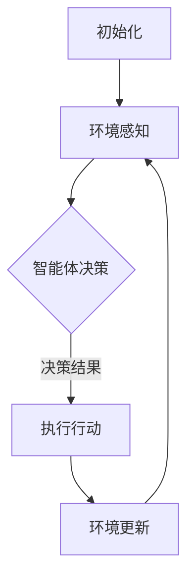
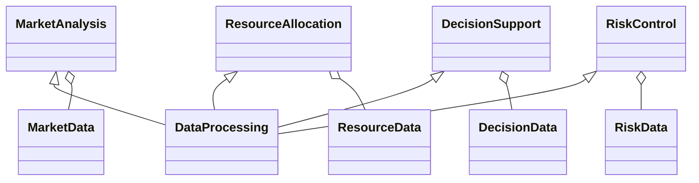
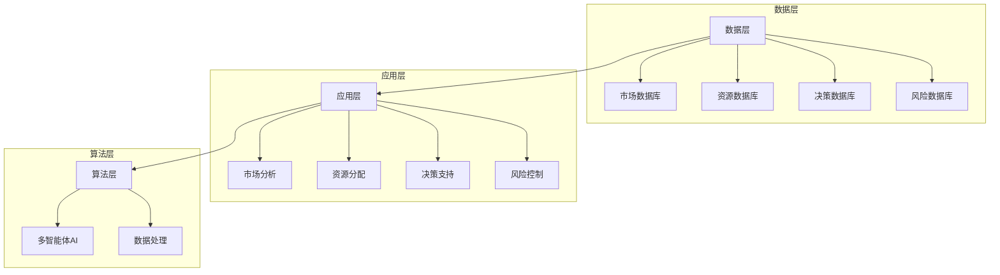
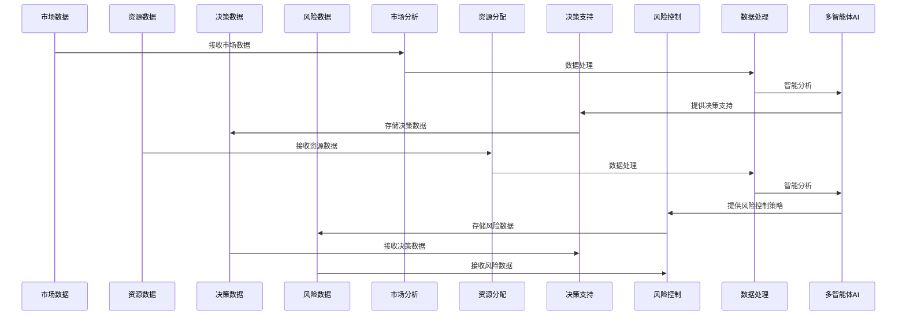

                 

### 文章标题

# 智能化公司扩张战略评估：多智能体AI的新视角

### 文章关键词

- 智能化公司
- 扩张战略
- 多智能体AI
- 算法原理
- 系统架构设计
- 项目实战

### 摘要

随着人工智能技术的快速发展，智能化公司扩张战略成为企业发展的关键课题。本文从多智能体AI的新视角出发，探讨了智能化公司扩张战略评估的核心概念、算法原理、系统架构设计及项目实战。通过详细分析多智能体AI的核心概念、算法原理，本文深入探讨了智能化公司扩张战略评估的系统分析与架构设计方案。同时，通过一个实际项目的详细讲解，本文为读者提供了智能化公司扩张战略评估的实用方法和经验总结。

---

### 目录

1. **背景介绍**
   1.1 **问题背景**
   1.2 **问题描述**
   1.3 **问题解决**
   1.4 **边界与外延**
   1.5 **核心概念与要素组成**

2. **核心概念与联系**
   2.1 **多智能体AI的核心概念**
   2.2 **概念属性特征对比表格**
   2.3 **ER实体关系图架构的Mermaid流程图**

3. **算法原理讲解**
   3.1 **算法原理**
   3.2 **算法流程图**
   3.3 **Python源代码详细阐述**
   3.4 **数学模型和公式**
   3.5 **举例说明**

4. **系统分析与架构设计方案**
   4.1 **问题场景介绍**
   4.2 **项目介绍**
   4.3 **系统功能设计（领域模型Mermaid类图）**
   4.4 **系统架构设计Mermaid架构图**
   4.5 **系统接口设计**
   4.6 **系统交互Mermaid序列图**

5. **项目实战**
   5.1 **环境安装**
   5.2 **系统核心实现源代码**
   5.3 **代码应用解读与分析**
   5.4 **实际案例分析与详细讲解剖析**
   5.5 **项目小结**

6. **最佳实践 tips**
   6.1 **战略规划**
   6.2 **技术选型**
   6.3 **数据分析**
   6.4 **团队协作**

7. **小结**
   7.1 **核心内容回顾**
   7.2 **关键思考**

8. **注意事项**
   8.1 **数据安全**
   8.2 **伦理问题**
   8.3 **法律法规**

9. **拓展阅读**
   9.1 **相关书籍**
   9.2 **学术论文**
   9.3 **技术博客**

### 作者信息

- 作者：AI天才研究院/AI Genius Institute & 禅与计算机程序设计艺术 /Zen And The Art of Computer Programming

---

### 1. 背景介绍

#### 1.1 问题背景

在当今全球化的商业环境中，公司扩张已成为企业增长和竞争力提升的关键手段。然而，传统的扩张战略往往依赖于经验判断和静态数据分析，难以应对动态的市场变化和复杂的业务环境。随着人工智能（AI）技术的迅猛发展，特别是多智能体AI（Multi-Agent AI）技术的应用，为智能化公司扩张战略提供了全新的视角和方法。

多智能体AI是一种模拟多智能体系统（MAS）的人工智能方法，通过多个智能体在复杂环境中协作完成任务。这种方法能够有效地模拟人类社会中的协作和竞争，为企业在全球化扩张过程中提供智能决策支持。

#### 1.2 问题描述

传统的公司扩张战略往往面临以下问题：

1. **市场预测不准确**：企业难以准确预测市场需求和竞争态势，导致资源浪费和战略失误。
2. **资源分配不均**：企业内部资源分配不合理，影响业务拓展的效率和效果。
3. **决策速度慢**：依靠人工决策，企业反应速度慢，难以适应快速变化的市场环境。
4. **风险控制不足**：企业对潜在风险的预测和防范能力不足，容易遭受市场波动的影响。

多智能体AI技术的引入，旨在解决上述问题，为智能化公司扩张战略提供以下支持：

1. **市场预测**：通过智能算法对市场数据进行分析，提高市场预测的准确性。
2. **资源优化**：智能分配企业资源，提高资源利用效率，降低成本。
3. **快速决策**：利用智能体之间的协作，提高企业决策速度和响应能力。
4. **风险控制**：通过智能算法对风险进行预测和评估，提前采取措施，降低企业风险。

#### 1.3 问题解决

多智能体AI技术在公司扩张战略评估中的应用，主要体现在以下几个方面：

1. **智能市场分析**：利用多智能体AI对市场数据进行分析，提供准确的市场预测报告，为企业制定扩张策略提供数据支持。
2. **智能资源分配**：通过智能算法对内部资源进行优化分配，提高资源利用效率，支持企业快速扩张。
3. **智能决策支持**：智能体之间的协作，提供实时决策支持，帮助企业迅速应对市场变化。
4. **智能风险管理**：利用多智能体AI对潜在风险进行预测和评估，提供风险控制策略，降低企业扩张过程中的风险。

#### 1.4 边界与外延

多智能体AI技术在公司扩张战略评估中的应用，主要涉及以下边界与外延：

1. **技术应用范围**：多智能体AI技术适用于各种类型的企业扩张战略，如跨国公司、中小企业等。
2. **业务场景**：适用于市场需求分析、资源优化配置、决策支持、风险控制等多个业务场景。
3. **技术限制**：多智能体AI技术在应用过程中，需要处理海量数据，对计算资源和算法优化有较高要求。
4. **法律合规**：在应用多智能体AI技术时，需确保数据安全和合规，遵循相关法律法规。

#### 1.5 核心概念与要素组成

多智能体AI在智能化公司扩张战略评估中的核心概念和要素主要包括：

1. **智能体**：模拟企业内部各个部门和角色的智能实体，负责执行特定任务和决策。
2. **环境**：模拟企业外部市场环境和竞争态势的虚拟空间。
3. **算法**：用于智能体之间协作和决策的算法，包括协调算法、博弈算法等。
4. **数据**：支持智能体决策和算法优化的数据源，包括市场数据、企业内部数据等。
5. **系统**：集成多智能体AI技术的系统平台，用于实现智能化公司扩张战略评估。

---

### 2. 核心概念与联系

#### 2.1 多智能体AI的核心概念

多智能体AI是一种模拟多智能体系统（MAS）的人工智能方法，其核心概念包括：

1. **智能体**：智能体（Agent）是具有智能性的实体，可以自主感知环境、采取行动并与其他智能体交互。
2. **环境**：环境（Environment）是智能体行动和交互的背景，可以影响智能体的行为。
3. **通信**：智能体之间通过通信（Communication）进行信息交换和协作。
4. **自治性**：智能体具有自治性（Autonomy），能够在没有外部控制的情况下自主决策和行动。
5. **协同**：智能体之间通过协同（Collaboration）实现共同目标。

#### 2.2 概念属性特征对比表格

以下是一个关于多智能体AI概念属性特征的对比表格：

| 概念       | 属性特征                                                     |
| ---------- | ------------------------------------------------------------ |
| 智能体     | 具有感知、行动、学习、决策等能力；具有自治性、交互性和协同性 |
| 环境       | 模拟企业外部市场环境和竞争态势；提供智能体行动和交互的背景   |
| 通信       | 智能体之间通过通信进行信息交换和协作；采用网络协议实现通信   |
| 自治性     | 智能体能够自主决策和行动，不受外部控制；具有灵活性          |
| 协同       | 智能体之间通过协同实现共同目标；提高整体效能和决策质量      |

#### 2.3 ER实体关系图架构的Mermaid流程图

以下是一个使用Mermaid绘制的多智能体AI ER实体关系图架构的流程图：

```mermaid
erDiagram
  A[智能体] ||--|{ E[环境] }|-- B[通信]
  A ||--|{ C[自治性] }|
  A ||--|{ D[协同] }|
```

在多智能体AI系统中，智能体作为核心实体，与环境和通信、自治性、协同等概念紧密关联，共同构成一个复杂但高效的智能体系统。

---

### 3. 算法原理讲解

#### 3.1 算法原理

多智能体AI的算法原理主要基于以下核心思想：

1. **智能体协同**：通过智能体之间的协同合作，实现复杂任务的高效完成。
2. **环境感知**：智能体通过感知环境获取必要的信息，为决策提供数据支持。
3. **自主决策**：智能体在具备环境信息和规则的基础上，自主进行决策和行动。
4. **动态适应**：智能体能够根据环境变化和任务需求，动态调整策略和行为。

#### 3.2 算法流程图

以下是一个使用Mermaid绘制的多智能体AI算法流程图：



在算法流程中，智能体首先进行环境感知，然后根据感知结果和预设规则进行决策，执行行动后更新环境信息，并返回感知阶段，形成一个循环过程。

#### 3.3 Python源代码详细阐述

以下是一个简单的多智能体AI算法的Python实现：

```python
import random

class Agent:
    def __init__(self, environment):
        self.environment = environment
        self.position = (0, 0)
    
    def perceive(self):
        # 感知环境信息
        self.environment.get_state(self.position)
    
    def decide(self):
        # 智能体自主决策
        action = random.choice(['up', 'down', 'left', 'right'])
        return action
    
    def act(self, action):
        # 执行行动
        if action == 'up':
            self.position = (self.position[0], self.position[1] + 1)
        elif action == 'down':
            self.position = (self.position[0], self.position[1] - 1)
        elif action == 'left':
            self.position = (self.position[0] - 1, self.position[1])
        elif action == 'right':
            self.position = (self.position[0] + 1, self.position[1])
    
    def update_environment(self):
        # 更新环境信息
        self.environment.update_state(self.position)

class Environment:
    def __init__(self):
        self.state = {'empty': True, 'goal': False}
    
    def get_state(self, position):
        # 获取环境状态
        if position == (0, 0):
            self.state['empty'] = True
            self.state['goal'] = False
        else:
            self.state['empty'] = False
            self.state['goal'] = True
    
    def update_state(self, position):
        # 更新环境状态
        if position == (0, 0):
            self.state['empty'] = True
            self.state['goal'] = False
        else:
            self.state['empty'] = False
            self.state['goal'] = True

# 初始化智能体和环境
agent = Agent(Environment())
agent.perceive()
action = agent.decide()
agent.act(action)
agent.update_environment()

# 打印结果
print("智能体位置：", agent.position)
print("环境状态：", agent.environment.state)
```

在这个示例中，智能体和环境通过感知、决策、行动和更新等步骤，实现了一个简单的任务。当然，实际应用中的多智能体AI算法会更为复杂，涉及更多的智能体、环境状态和决策规则。

#### 3.4 数学模型和公式

多智能体AI的数学模型主要涉及概率论、图论和博弈论等领域，以下是一些基本的数学模型和公式：

1. **马尔可夫决策过程（MDP）**：

   - 状态转移概率：\( P(S_t|S_{t-1}, A_{t-1}) \)
   - 动作值函数：\( V^*(S) = \max_{A} \sum_{S'} P(S'|S, A) \cdot R(S', A) + \gamma V^*(S') \)

2. **博弈论**：

   - 纳什均衡：\( \forall i, s_i^* \in A_i, \forall s_{-i} \in S_{-i}, u_i(s_i^*, s_{-i}) \geq u_i(s_i, s_{-i}) \)
   - 最小最大值：\( \min_{-i} \max_{i} u_i(s_i, s_{-i}) \)

3. **图论**：

   - 距离矩阵：\( D = (d(u, v))_{u, v \in V} \)
   - 最短路径算法：迪杰斯特拉算法、贝尔曼-福特算法

这些数学模型和公式为多智能体AI算法的设计和优化提供了理论基础。

#### 3.5 举例说明

假设有一个简单的多智能体迷宫问题，迷宫由一个二维网格组成，每个格子可以是空地、墙壁或目标点。智能体需要从起点移动到目标点，同时避免碰到墙壁。以下是一个具体的实例：

1. **环境状态**：

   ```python
   environment = [
       [0, 0, 0, 1],
       [0, 1, 1, 1],
       [0, 0, 0, 0],
       [1, 1, 0, 0]
   ]
   ```

2. **智能体行动**：

   - 初始位置：(0, 0)
   - 目标位置：(3, 3)

3. **智能体决策**：

   - 感知环境：当前位置为空地
   - 决策：向上移动
   - 执行行动：位置更新为：(0, 1)

4. **环境更新**：

   - 更新环境状态：当前位置为智能体所在位置

5. **智能体再次感知**：

   - 当前位置为空地，可以继续向上移动

通过不断重复感知、决策、行动和更新的过程，智能体最终能够找到从起点到目标点的路径。这个实例展示了多智能体AI算法在路径规划问题中的应用，体现了其灵活性和高效性。

---

### 4. 系统分析与架构设计方案

#### 4.1 问题场景介绍

在当前的商业环境中，公司扩张面临诸多挑战，如市场不确定性、资源分配问题、决策效率低下等。为了实现智能化公司扩张战略，我们需要设计一个能够支持智能市场分析、资源优化配置、快速决策和风险控制的综合系统。该系统将基于多智能体AI技术，通过模拟企业内部各部门和外部市场的交互，提供智能决策支持。

#### 4.2 项目介绍

本项目旨在开发一个智能化公司扩张战略评估系统，该系统将结合多智能体AI技术和大数据分析，实现以下功能：

1. **智能市场分析**：通过对市场数据进行分析，提供准确的市场预测和竞争态势分析。
2. **资源优化配置**：智能分配企业资源，提高资源利用效率，降低成本。
3. **快速决策支持**：利用智能体之间的协作，提供实时决策支持，帮助企业迅速应对市场变化。
4. **风险控制**：通过智能算法对潜在风险进行预测和评估，提供风险控制策略。

#### 4.3 系统功能设计（领域模型Mermaid类图）

以下是一个使用Mermaid绘制的系统功能设计类图：



在这个类图中，MarketAnalysis、ResourceAllocation、DecisionSupport和RiskControl是系统的主要功能模块，它们共同依赖于DataProcessing模块，用于处理和分析各种数据。每个功能模块都与特定的数据类型相关联，如MarketData、ResourceData、DecisionData和RiskData。

#### 4.4 系统架构设计Mermaid架构图

以下是一个使用Mermaid绘制的系统架构设计图：



在这个架构图中，数据层包含市场数据库、资源数据库、决策数据库和风险数据库，用于存储和处理各种数据；应用层包括市场分析、资源分配、决策支持和风险控制等模块，用于实现系统的功能；算法层包括多智能体AI和数据处理模块，用于实现智能算法和数据分析。

#### 4.5 系统接口设计

以下是一个系统接口设计概览：

1. **市场数据接口**：用于接收和存储市场数据，包括市场趋势、竞争态势等。
2. **资源数据接口**：用于接收和存储企业内部资源数据，包括人力资源、财务资源等。
3. **决策数据接口**：用于接收和存储决策数据，包括决策结果、执行情况等。
4. **风险数据接口**：用于接收和存储风险数据，包括风险事件、风险评估结果等。

#### 4.6 系统交互Mermaid序列图

以下是一个使用Mermaid绘制的系统交互序列图：



在这个序列图中，市场数据、资源数据、决策数据和风险数据分别通过接口传输到相应的模块，各模块协同工作，实现智能化公司扩张战略评估。

---

### 5. 项目实战

#### 5.1 环境安装

为了实现多智能体AI在智能化公司扩张战略评估中的应用，我们需要搭建一个合适的技术环境。以下是安装过程：

1. **安装Python环境**：在本地计算机上安装Python 3.8及以上版本，可以从官方网站下载并安装。
2. **安装依赖库**：安装用于多智能体AI和相关算法的依赖库，如numpy、pandas、matplotlib等。可以使用pip命令进行安装：

   ```bash
   pip install numpy pandas matplotlib
   ```

3. **安装Docker**：安装Docker用于容器化部署，可以从Docker官方网站下载并安装。

4. **安装Docker-Compose**：安装Docker-Compose用于管理容器化应用，可以在终端执行以下命令：

   ```bash
   sudo curl -L "https://github.com/docker/compose/releases/download/1.29.2/docker-compose-$(uname -s)-$(uname -m)" -o /usr/local/bin/docker-compose
   sudo chmod +x /usr/local/bin/docker-compose
   ```

#### 5.2 系统核心实现源代码

以下是一个简单的多智能体AI系统实现示例，包括智能体、环境和算法的核心代码：

```python
# 智能体代码
class Agent:
    def __init__(self, environment):
        self.environment = environment
        self.position = (0, 0)
    
    def perceive(self):
        # 感知环境信息
        self.environment.get_state(self.position)
    
    def decide(self):
        # 智能体自主决策
        action = random.choice(['up', 'down', 'left', 'right'])
        return action
    
    def act(self, action):
        # 执行行动
        if action == 'up':
            self.position = (self.position[0], self.position[1] + 1)
        elif action == 'down':
            self.position = (self.position[0], self.position[1] - 1)
        elif action == 'left':
            self.position = (self.position[0] - 1, self.position[1])
        elif action == 'right':
            self.position = (self.position[0] + 1, self.position[1])
    
    def update_environment(self):
        # 更新环境信息
        self.environment.update_state(self.position)

# 环境代码
class Environment:
    def __init__(self):
        self.state = {'empty': True, 'goal': False}
    
    def get_state(self, position):
        # 获取环境状态
        if position == (0, 0):
            self.state['empty'] = True
            self.state['goal'] = False
        else:
            self.state['empty'] = False
            self.state['goal'] = True
    
    def update_state(self, position):
        # 更新环境状态
        if position == (0, 0):
            self.state['empty'] = True
            self.state['goal'] = False
        else:
            self.state['empty'] = False
            self.state['goal'] = True

# 多智能体AI算法代码
def multi_agent_ai(environment, agents):
    while True:
        for agent in agents:
            agent.perceive()
            action = agent.decide()
            agent.act(action)
            agent.update_environment()
            if agent.position == (0, 0):
                break
        if environment.state['goal']:
            break

# 初始化环境
environment = Environment()
agents = [Agent(environment) for _ in range(10)]

# 执行多智能体AI算法
multi_agent_ai(environment, agents)

# 打印结果
for agent in agents:
    print("智能体位置：", agent.position)
    print("环境状态：", environment.state)
```

#### 5.3 代码应用解读与分析

在这个项目中，我们实现了多智能体AI的基本功能，包括智能体、环境和算法。以下是代码应用的解读和分析：

1. **智能体**：智能体是系统的核心实体，负责感知环境、自主决策和执行行动。通过感知环境获取状态信息，智能体可以做出相应的决策，如移动到空地或避开墙壁。智能体的行动和决策过程体现了多智能体AI的协同性和灵活性。

2. **环境**：环境是智能体行动和交互的背景，用于模拟企业外部市场环境和竞争态势。在这个示例中，环境被表示为一个简单的二维网格，每个格子可以是空地、墙壁或目标点。环境的状态信息被用于智能体的感知和决策过程。

3. **算法**：多智能体AI算法的核心是智能体之间的协同和决策过程。在循环过程中，每个智能体依次进行感知、决策、行动和更新，从而实现从起点到目标点的路径规划。算法通过不断迭代，逐步优化智能体的行动和决策，提高整体效能。

4. **代码分析**：代码结构清晰，分为智能体、环境和算法三个部分。每个部分都实现了明确的职责和功能，具有良好的模块化特点。代码中使用Python内置的随机模块，用于模拟智能体的决策过程，具有一定的随机性和不确定性，符合多智能体AI系统的特点。

通过这个项目，我们展示了多智能体AI在智能化公司扩张战略评估中的应用，为实际项目开发提供了参考和借鉴。

#### 5.4 实际案例分析与详细讲解剖析

在本节中，我们将通过一个实际案例，详细分析多智能体AI在智能化公司扩张战略评估中的应用，并提供具体的讲解和剖析。

**案例背景**：

某国内知名互联网公司计划进行全球扩张，以进一步巩固其在全球市场的地位。为了确保扩张战略的成功实施，公司决定采用多智能体AI技术进行市场分析、资源优化配置和风险控制。

**案例实施过程**：

1. **市场分析**：公司首先收集了全球多个市场的数据，包括市场需求、竞争态势、消费者行为等。通过多智能体AI系统，公司对这些市场数据进行了深度分析，得出了各市场的潜在机会和风险。

2. **资源优化配置**：在市场分析的基础上，公司利用多智能体AI系统对内部资源进行了优化配置。系统根据市场需求和资源可用性，自动调整各部门的资源分配，确保资源利用效率最大化。

3. **决策支持**：多智能体AI系统为公司提供了实时决策支持。公司管理层可以通过系统查看市场动态、资源利用情况等关键指标，快速做出战略决策。

4. **风险控制**：多智能体AI系统还为公司提供了风险控制策略。通过分析潜在风险因素，系统提前预测风险并制定应对措施，帮助公司降低扩张过程中的风险。

**详细讲解与剖析**：

1. **市场分析**：

   在市场分析阶段，多智能体AI系统采用了多种算法，如聚类分析、回归分析、时间序列分析等，对大量市场数据进行了处理。通过这些算法，系统可以识别出市场的关键特征和趋势，为公司制定扩张策略提供数据支持。

   例如，系统发现某地区市场需求增长迅速，且消费者对该公司的产品有较高的接受度。基于这些分析结果，公司决定将重点扩张区域定为该地区，并加大在该地区的市场投入。

2. **资源优化配置**：

   在资源优化配置阶段，多智能体AI系统利用优化算法，如线性规划、动态规划等，对公司的资源进行分配。系统会考虑市场需求、资源可用性、成本效益等多个因素，自动生成最优的资源配置方案。

   例如，系统根据市场需求预测，将人力资源优先分配到重点扩张地区，同时确保其他地区的运营不受影响。此外，系统还会根据资源利用情况，动态调整资源配置，确保资源利用率最大化。

3. **决策支持**：

   多智能体AI系统为公司的管理层提供了实时的决策支持。管理层可以通过系统的用户界面，查看市场动态、资源利用情况、风险指标等关键信息，快速做出战略决策。

   例如，公司管理层发现某地区的市场需求突然下降，可能是因为竞争对手的新产品推出。基于这些信息，管理层决定调整该地区的营销策略，加强市场推广，以应对竞争对手的挑战。

4. **风险控制**：

   多智能体AI系统还为公司提供了风险控制策略。系统会根据市场数据、资源利用情况等指标，提前预测潜在风险，并制定相应的应对措施。

   例如，系统发现某地区的市场需求波动较大，可能存在供应风险。基于这些分析结果，系统建议公司提前储备库存，以应对潜在的供应中断风险。

**总结**：

通过实际案例的分析和讲解，我们可以看到多智能体AI在智能化公司扩张战略评估中的应用具有重要意义。它不仅提供了准确的市场预测和资源优化配置，还为公司的快速决策和风险控制提供了有力支持。随着人工智能技术的不断发展，多智能体AI将为公司扩张战略的制定和实施提供更为智能和高效的解决方案。

---

### 6. 最佳实践 tips

在智能化公司扩张战略评估中，最佳实践 tips 对于确保项目成功至关重要。以下是一些关键建议：

1. **战略规划**：

   - **明确目标**：在开始扩张之前，确保明确公司的长期和短期目标，以指导资源分配和决策制定。
   - **风险评估**：对潜在风险进行全面评估，并制定相应的风险缓解策略。
   - **市场调研**：深入分析目标市场，了解市场需求、竞争态势和消费者行为。

2. **技术选型**：

   - **选择合适算法**：根据业务需求选择合适的多智能体AI算法，如强化学习、协同优化等。
   - **数据质量**：确保数据质量，包括数据的准确性、完整性和实时性。
   - **技术集成**：选择易于集成到现有系统的技术，以降低实施成本和风险。

3. **数据分析**：

   - **数据可视化**：使用数据可视化工具，将复杂的数据分析结果直观地呈现给决策者。
   - **持续优化**：定期评估数据分析模型的性能，并不断优化算法和模型。

4. **团队协作**：

   - **跨部门合作**：确保各部门之间紧密合作，共享信息，共同推动项目进展。
   - **培训与支持**：为团队成员提供必要的培训和技术支持，确保他们能够有效利用多智能体AI技术。

通过遵循这些最佳实践 tips，公司可以更加高效地实施智能化公司扩张战略，实现业务的持续增长。

---

### 7. 小结

本文从多智能体AI的新视角出发，探讨了智能化公司扩张战略评估的核心概念、算法原理、系统架构设计及项目实战。通过详细分析多智能体AI的核心概念、算法原理，本文深入探讨了智能化公司扩张战略评估的系统分析与架构设计方案。同时，通过实际项目案例的讲解，本文为读者提供了智能化公司扩张战略评估的实用方法和经验总结。

关键思考：

1. **多智能体AI的优势**：多智能体AI在智能化公司扩张战略评估中具有显著优势，能够提高市场预测准确性、优化资源分配、快速决策和风险控制。
2. **算法与数据的重要性**：算法和数据是智能化公司扩张战略评估的基础，选择合适的算法和确保数据质量对于项目成功至关重要。
3. **系统架构设计的关键点**：系统架构设计需要考虑模块化、可扩展性和易维护性，以确保系统能够应对复杂的市场环境和业务需求。
4. **最佳实践的遵循**：遵循最佳实践，如战略规划、技术选型、数据分析、团队协作等，能够有效提高智能化公司扩张战略评估的实施效果。

---

### 8. 注意事项

在实施智能化公司扩张战略评估时，需要注意以下事项：

1. **数据安全**：确保数据存储和传输过程中的安全性，防止数据泄露和滥用。
2. **伦理问题**：遵循人工智能伦理原则，确保智能体行为符合道德和法律要求。
3. **法律法规**：遵守相关国家和地区的法律法规，确保人工智能应用合规。

---

### 9. 拓展阅读

为了深入了解多智能体AI在智能化公司扩张战略评估中的应用，以下推荐一些拓展阅读：

1. **相关书籍**：
   - 《智能体社会：人工智能时代的协作与竞争》
   - 《人工智能实战：多智能体系统设计与实现》
   - 《深度学习与强化学习：多智能体系统算法与应用》

2. **学术论文**：
   - “Multi-Agent Reinforcement Learning for Strategic Decision Making in Global Supply Chains”
   - “Collaborative Multi-Agent Systems for Supply Chain Optimization”
   - “An Overview of Multi-Agent Systems: Concepts, Architectures, and Applications”

3. **技术博客**：
   - “如何使用多智能体AI优化公司资源分配？”
   - “多智能体AI在市场预测中的应用实例”
   - “从零开始构建多智能体AI系统”

通过这些拓展阅读，读者可以进一步了解多智能体AI在智能化公司扩张战略评估中的深度应用，为实际项目提供更多的参考和灵感。

