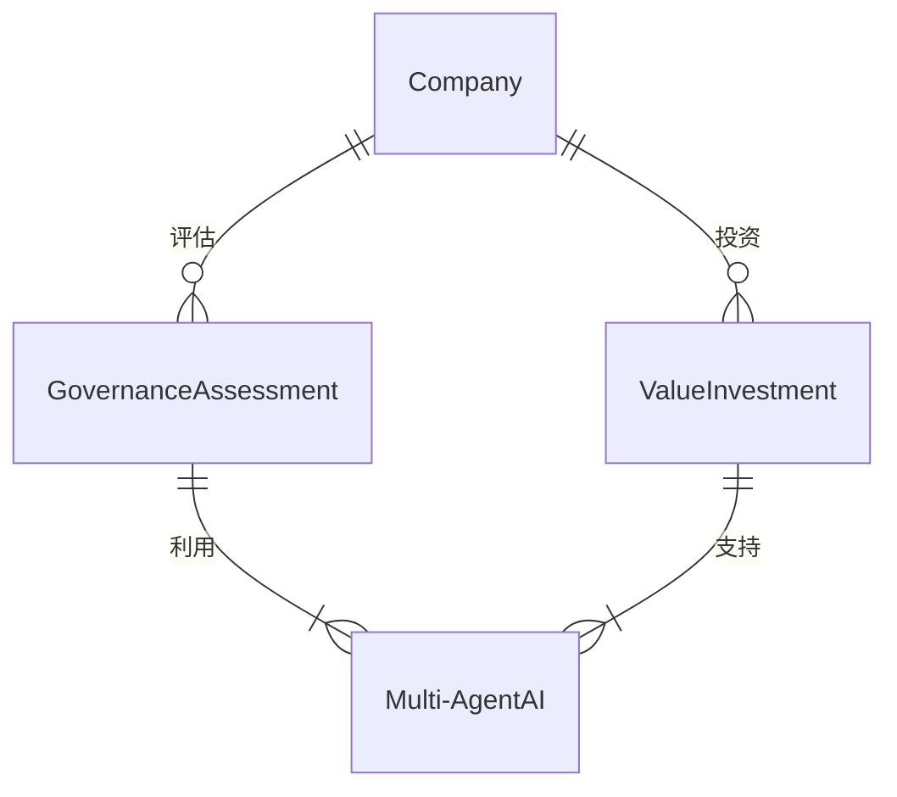
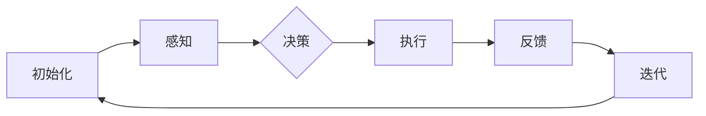

                 

## 摘要

在当今高速发展的科技时代，智能化公司治理评估正逐渐成为企业管理中不可或缺的一环。本文旨在探讨如何运用多智能体AI技术来提升价值投资的公司治理评估效率。文章首先介绍了智能化公司治理评估的背景和重要性，以及当前存在的问题和挑战。接着，我们详细解析了多智能体AI的基本原理和核心概念，并通过对比表格和实体关系图（ER图）展示了其与价值投资之间的关系。

本文将逐步分析多智能体AI在价值投资中的应用算法原理，包括具体的mermaid流程图、Python源代码和数学模型公式。随后，我们介绍了一个基于多智能体AI的价值投资评估系统，包括系统场景、功能设计、架构设计和接口设计等。在此基础上，文章通过一个实际案例，展示了多智能体AI在价值投资评估中的具体应用，并提供了一些建议和注意事项，以帮助读者更好地理解和应用这一技术。

总的来说，本文的目标是帮助读者深入了解智能化公司治理评估的多智能体AI应用，并探讨其在实际价值投资中的潜力。通过逻辑清晰、结构紧凑的分析和讲解，本文希望能够为投资者和企业决策者提供有价值的参考。

## 关键词

- 智能化公司治理评估
- 多智能体AI
- 价值投资
- 算法原理
- 系统架构设计
- 实际案例分析

## 引言

随着大数据、云计算和人工智能技术的飞速发展，公司治理评估的方法和工具也在不断更新和优化。传统的公司治理评估往往依赖于人工分析，不仅耗时耗力，而且容易受到主观因素的影响，导致评估结果的不准确和不全面。在这种背景下，智能化公司治理评估应运而生，它通过引入先进的人工智能技术，如多智能体AI，极大地提高了公司治理评估的效率和准确性。

智能化公司治理评估的重要性不言而喻。首先，它能够快速处理大量的企业数据，提取关键信息，为决策者提供更加全面和客观的评估结果。其次，通过引入多智能体AI技术，智能化公司治理评估能够模拟多个投资决策场景，从而帮助投资者更好地理解不同策略下的潜在风险和收益。此外，智能化公司治理评估还能够动态跟踪企业的经营状况，实时调整评估模型，以应对市场变化和不确定性。

尽管智能化公司治理评估具有显著的优势，但其应用仍面临一些挑战。首先，多智能体AI技术的复杂性使得理解和应用这一技术对投资者和企业管理者提出了更高的要求。其次，数据的质量和完整性对评估结果有直接影响，但实际操作中，数据来源的多样性和不一致性使得数据清洗和整合成为一个难题。此外，多智能体AI系统的开发和部署成本较高，对于中小企业而言可能是一个不小的负担。

本文的目标是深入探讨如何利用多智能体AI技术来提升公司治理评估的智能化水平。我们将首先介绍多智能体AI的基本原理和核心概念，通过对比表格和实体关系图（ER图）展示其与价值投资的关系。接着，本文将详细讲解多智能体AI在价值投资中的应用算法原理，包括mermaid流程图、Python源代码和数学模型公式。随后，我们将介绍一个基于多智能体AI的价值投资评估系统，从系统场景、功能设计、架构设计到接口设计等方面进行全面分析。最后，通过一个实际案例展示多智能体AI在价值投资评估中的具体应用，并提供一些建议和注意事项，帮助读者更好地理解和应用这一技术。

## 问题背景与问题描述

在讨论智能化公司治理评估之前，有必要了解当前公司治理评估中存在的现实问题和挑战。传统的公司治理评估方法主要依赖于人工分析，其过程通常包括数据收集、数据清洗、数据分析等多个环节。这些方法存在明显的局限性：首先，数据处理的效率较低，耗时较长；其次，由于分析过程主要依赖于人类的主观判断，容易受到个人经验和偏见的干扰，导致评估结果的准确性和可靠性受到影响。此外，传统方法在应对复杂多变的市场环境时显得力不从心，难以及时、动态地调整评估模型，以应对市场变化和不确定性。

为了克服这些局限性，智能化公司治理评估成为一种必然趋势。其核心在于利用人工智能技术，特别是多智能体AI，来提高评估的效率和准确性。首先，多智能体AI能够快速处理大量数据，通过自动化和智能化的方式，将数据处理时间大大缩短。其次，多智能体AI能够模拟多个投资决策场景，通过自主学习和优化，提供更加精准和全面的评估结果。此外，多智能体AI系统可以实时跟踪和更新数据，动态调整评估模型，以适应不断变化的市场环境。

具体到价值投资领域，智能化公司治理评估的重要性更加凸显。价值投资是一种基于对公司基本面进行分析和评估的投资策略，其核心在于寻找被市场低估的优质公司。然而，传统的价值投资评估方法在处理复杂多变的财务数据和市场信息时，往往难以全面准确地评估公司的真实价值。多智能体AI的应用则能够通过综合分析多种数据源，包括财务数据、市场数据、新闻信息等，提供更为深入和全面的评估结果。这不仅有助于投资者更好地识别价值投资机会，还能够降低投资决策的风险。

总的来说，智能化公司治理评估是应对传统评估方法局限性的有效手段，尤其在价值投资领域，其应用能够显著提升评估的效率、准确性和动态性，为投资者提供更为可靠的决策依据。

### 问题解决

为了解决传统公司治理评估中存在的问题，智能化公司治理评估的引入显得尤为重要。多智能体AI技术在其中扮演了关键角色，通过其独特的功能和优势，为公司治理评估带来了全新的变革。

首先，多智能体AI技术能够实现数据处理的自动化和智能化。传统方法依赖人工分析，而多智能体AI则能够快速处理大量数据，通过机器学习和深度学习算法，自动提取数据中的关键信息。这一过程不仅大大提高了数据处理效率，还降低了人工干预的风险，从而提高了评估结果的准确性和可靠性。

其次，多智能体AI系统具备自主学习和优化的能力。这意味着系统能够在不断的运行过程中，自动调整和优化评估模型，以适应不同的市场环境和投资需求。例如，通过持续学习市场数据和历史投资决策，多智能体AI能够识别出不同投资策略下的潜在风险和收益，从而提供更为精准的评估结果。

此外，多智能体AI技术能够实现跨领域的综合分析。通过整合多种数据源，如财务数据、市场数据、新闻信息等，多智能体AI能够提供全面和深入的分析结果。这一特点在价值投资领域尤为重要，因为价值投资依赖于对多个维度信息的综合分析。多智能体AI能够同时考虑财务指标、市场情绪、行业动态等多种因素，提供更为全面和客观的评估结果。

最后，多智能体AI系统具备实时跟踪和更新的能力。传统方法往往需要定期更新数据，而多智能体AI系统则能够实时获取和更新数据，确保评估结果的时效性。在快速变化的市场环境中，实时更新的评估结果能够帮助投资者及时调整投资策略，降低投资风险。

综上所述，多智能体AI技术在智能化公司治理评估中具有显著的优势和潜力。通过自动化数据处理、自主学习和优化、跨领域综合分析以及实时跟踪更新，多智能体AI技术不仅解决了传统评估方法的局限性，还为价值投资提供了更为可靠和高效的评估工具。

### 边界与外延

在讨论智能化公司治理评估时，明确其边界与外延是至关重要的。首先，智能化公司治理评估主要关注的是企业内部治理结构和外部市场环境对公司价值的影响。这包括对董事会结构、管理层效能、内部控制机制以及公司透明度等方面的评估。同时，这一评估还涉及到外部市场因素，如宏观经济环境、行业趋势、竞争对手分析等，以全面了解公司所处的经营环境。

从外延来看，智能化公司治理评估不仅限于单一企业的内部评估，还可以扩展到企业集团、产业链上下游以及跨行业综合评估。例如，在评估一个企业集团时，需要考虑其旗下各子公司之间的协同效应和治理协调性；在分析产业链时，需要评估不同环节企业的治理状况及其对整个产业链的稳定性影响。此外，智能化公司治理评估还可以应用于更广泛的领域，如投资组合评估、市场竞争力分析、社会责任评估等。

值得注意的是，智能化公司治理评估的边界与外延也受到数据质量和数据源多样性的限制。由于不同数据源可能存在不一致性，因此，在进行跨领域或综合评估时，需要特别关注数据整合和一致性处理问题。另外，智能化公司治理评估的技术实现也受到现有算法和技术水平的限制，特别是对于复杂和动态的环境，评估模型的准确性和适应性仍需不断优化。

综上所述，智能化公司治理评估的边界与外延广泛，涵盖了企业内部治理和外部市场环境，以及多个相关领域。然而，其有效应用也受到数据质量和技术水平的制约，需要在这些方面进行持续改进。

### 核心概念定义

在探讨智能化公司治理评估时，理解核心概念是至关重要的。以下是本文中涉及的主要核心概念及其定义：

#### 智能化公司治理评估

智能化公司治理评估是一种利用人工智能技术，尤其是多智能体AI，对企业的治理结构和外部市场环境进行系统性评估的方法。这种方法通过自动化数据处理、智能分析以及实时更新，提供全面、准确和动态的评估结果。

#### 多智能体AI

多智能体AI（Multi-Agent Artificial Intelligence）是一种基于多个智能体的分布式计算模型。在多智能体系统中，每个智能体拥有自主决策能力，通过相互协作和竞争，实现复杂任务的目标。多智能体AI在智能化公司治理评估中，能够模拟多个投资决策场景，提供全面的评估结果。

#### 价值投资

价值投资（Value Investing）是一种基于对公司基本面进行分析和评估的投资策略。其核心思想是寻找被市场低估的优质公司，通过长期持有这些公司的股票，获取超越市场平均水平的收益。价值投资依赖于对财务数据、市场情绪、行业趋势等多维度信息的综合分析。

#### 公司治理

公司治理（Corporate Governance）是指公司内部管理结构的制度安排和运行机制，旨在确保公司目标的实现，提高透明度和责任感。公司治理包括董事会结构、管理层效能、内部控制机制、公司透明度等多个方面，直接影响公司的运营效率和长期价值。

#### 治理评估

治理评估（Governance Assessment）是对企业治理状况的系统性评估，旨在识别和改进治理缺陷，提高企业的运营效率和合规性。治理评估通常包括内部审计、外部咨询、评级机构评估等多种形式，以提供客观、全面的评估结果。

通过明确这些核心概念，我们可以更好地理解智能化公司治理评估的原理和应用，为其在价值投资中的实际应用提供理论基础。

### 核心概念之间的关系

在深入探讨智能化公司治理评估和多智能体AI在价值投资中的应用时，理解这两个核心概念之间的关系至关重要。以下是它们之间的关联和相互作用：

#### 智能化公司治理评估与多智能体AI的关联

智能化公司治理评估依赖于多智能体AI技术，通过利用多个智能体的分布式计算能力和自主决策能力，实现对企业治理结构的全面分析和评估。具体来说，多智能体AI在智能化公司治理评估中起到了以下几个关键作用：

1. **数据处理**：多智能体AI能够高效处理大量企业数据，包括财务数据、市场数据、新闻信息等，提取关键信息，为治理评估提供数据基础。
2. **智能分析**：通过机器学习和深度学习算法，多智能体AI能够对复杂的数据进行智能分析，识别出企业治理中的问题和潜在风险。
3. **动态更新**：多智能体AI系统具备自主学习和优化能力，能够根据实时数据动态调整评估模型，确保评估结果的时效性和准确性。

#### 多智能体AI与价值投资的关系

多智能体AI不仅在智能化公司治理评估中发挥作用，还能在价值投资策略中提供强有力的支持。以下是多智能体AI在价值投资中的关键应用：

1. **投资决策模拟**：多智能体AI能够模拟多个投资决策场景，通过自主决策和竞争，分析不同策略下的潜在风险和收益，帮助投资者做出更加明智的决策。
2. **风险识别**：多智能体AI能够通过综合分析财务数据、市场信息和行业动态，提前识别出潜在的市场风险，为投资者提供风险预警。
3. **动态调整**：在市场环境变化时，多智能体AI系统能够实时更新数据，动态调整投资策略，帮助投资者及时应对市场变化。

#### 概念属性特征对比表格

为了更直观地展示智能化公司治理评估与多智能体AI之间的关系，以下是它们的属性特征对比表格：

| 概念             | 属性特征                                       |
|----------------|--------------------------------------------|
| 智能化公司治理评估 | - 利用人工智能技术<br>- 系统性评估企业治理结构<br>- 提高评估效率和准确性 |
| 多智能体AI       | - 分布式计算模型<br>- 自主决策能力<br>- 动态学习和优化能力           |
| 价值投资         | - 基于基本面分析<br>- 寻找被低估的优质公司<br>- 长期持有股票             |

通过这一对比表格，我们可以清楚地看到，智能化公司治理评估和多智能体AI在属性特征上的互补性。多智能体AI的技术优势为智能化公司治理评估提供了强有力的支持，而智能化公司治理评估的目标和需求也为多智能体AI提供了广阔的应用场景。

#### ER实体关系图架构

为了更直观地展示核心概念之间的关系，我们使用实体关系图（ER图）来描述智能化公司治理评估、多智能体AI和价值投资之间的实体关系。以下是ER图的mermaid表示：



在这个ER图中，我们定义了三个主要实体：公司（Company）、治理评估（GovernanceAssessment）和价值投资（ValueInvestment）。公司是核心实体，它关联到治理评估和价值投资。治理评估实体与多智能体AI实体之间存在“利用”关系，表示智能化公司治理评估依赖于多智能体AI的技术支持。同样，价值投资实体也与多智能体AI实体之间存在“支持”关系，表示多智能体AI在价值投资策略中提供了重要的决策支持和风险评估功能。

通过这个ER图，我们可以清晰地看到，智能化公司治理评估和多智能体AI在价值投资中的相互作用，以及它们如何共同促进企业治理评估和投资决策的优化。

### 多智能体AI的基本原理

多智能体AI（Multi-Agent Artificial Intelligence）是一种基于多个智能体协同工作的分布式计算模型，其核心在于通过自主决策、交互学习和协同合作，解决复杂问题。多智能体系统的设计理念和运作机制，使其在许多应用场景中展现出强大的适应性和效率。以下是多智能体AI的基本原理及其组成部分的详细解析。

#### 多智能体系统的设计理念

多智能体系统的设计理念源于生物学和社交学的多智能体系统模型。其主要思想是模拟自然界中多智能体系统的运作机制，即通过多个智能体之间的协作和竞争，实现复杂任务的目标。多智能体系统的设计理念主要包括以下三个方面：

1. **自主性**：每个智能体拥有独立的决策能力，能够在其认知范围内自主行动，不受中央控制。
2. **分布性**：智能体分布在不同的位置或系统中，通过通信网络进行信息交换和任务分配。
3. **协同性**：多个智能体通过协作和合作，共同完成任务，实现整体系统的优化。

这种设计理念使得多智能体系统能够适应复杂、动态和不确定的环境，具有高度的灵活性和鲁棒性。

#### 多智能体系统的组成部分

多智能体系统由多个智能体、环境、通信网络和协调机制等组成部分构成，具体如下：

1. **智能体**：智能体是系统的基本单元，具有感知环境、自主决策和执行动作的能力。每个智能体都有自己的认知模型、行为策略和决策逻辑，能够根据环境反馈进行调整。
2. **环境**：环境是多智能体系统运作的背景和场景，为智能体提供状态信息和反馈。环境可以是物理环境，如机器人导航场景；也可以是虚拟环境，如模拟金融市场的交易场景。
3. **通信网络**：通信网络是智能体之间传递信息和协调行动的通道。智能体通过通信网络共享信息、协商决策，实现协同工作。
4. **协调机制**：协调机制是多智能体系统的重要部分，用于管理和调度智能体的行为，确保系统整体目标的实现。协调机制可以是基于规则的、基于协商的，也可以是基于博弈的。

#### 多智能体系统的运作机制

多智能体系统的运作机制主要包括感知、决策、执行和反馈等环节：

1. **感知**：智能体通过传感器或环境信息收集器感知环境状态，获取必要的信息。
2. **决策**：智能体根据感知到的环境状态和自身的认知模型，生成行动策略。决策过程通常基于某种算法，如决策树、强化学习等。
3. **执行**：智能体根据决策策略执行具体的行动，如移动、发送信息等。
4. **反馈**：环境对智能体的行动进行反馈，智能体根据反馈调整自身的状态和行为，进入下一个感知-决策-执行-反馈循环。

这种循环迭代的过程使得多智能体系统能够不断学习和优化，适应复杂和动态的环境。

#### 多智能体AI在价值投资中的应用

多智能体AI在价值投资中的应用，主要体现在以下几个方面：

1. **投资决策模拟**：多智能体AI能够模拟多个投资决策场景，通过智能体的自主决策和交互，分析不同策略下的潜在风险和收益。
2. **风险识别**：多智能体AI能够通过综合分析财务数据、市场信息和行业动态，提前识别出潜在的市场风险，为投资者提供风险预警。
3. **动态调整**：在市场环境变化时，多智能体AI系统能够实时更新数据，动态调整投资策略，帮助投资者及时应对市场变化。

通过上述原理和应用的介绍，我们可以看到，多智能体AI技术为智能化公司治理评估和价值投资提供了强大的工具和手段，极大地提升了评估和决策的效率和准确性。

### 多智能体AI算法原理详解

在深入探讨多智能体AI算法原理之前，首先需要明确几个关键概念：智能体、环境、决策过程和交互机制。这些概念构成了多智能体系统的基本框架，并为算法的实现提供了理论基础。

#### 智能体与环境

智能体（Agent）是多智能体系统中的基本单位，具有感知环境、自主决策和执行动作的能力。智能体可以是一个软件程序、一个机器人或一个人类用户。环境（Environment）是智能体运作的背景，为智能体提供状态信息和反馈。环境可以是物理环境，如机器人导航场景；也可以是虚拟环境，如模拟金融市场的交易场景。

#### 决策过程

决策过程是多智能体AI算法的核心，主要包括感知、决策和执行三个环节。感知环节中，智能体通过传感器或环境信息收集器获取环境状态信息。决策环节中，智能体根据感知到的信息，结合自身的认知模型和策略，生成行动策略。执行环节中，智能体根据决策策略执行具体的行动，如移动、发送信息等。

#### 交互机制

交互机制是多智能体系统中智能体之间传递信息和协调行动的通道。智能体通过通信网络共享信息、协商决策，实现协同工作。常见的交互机制包括基于规则的交互、基于协商的交互和基于博弈的交互。基于规则的交互通过预先定义的规则来协调智能体的行为；基于协商的交互通过智能体之间的对话和协商来达成共识；基于博弈的交互通过模拟市场中的竞争和合作行为，实现系统的优化。

#### 多智能体AI算法原理

多智能体AI算法的原理可以归纳为以下几个关键步骤：

1. **初始化**：首先，初始化智能体和环境，设置初始状态和参数。
2. **感知**：智能体通过传感器或环境信息收集器获取当前环境状态信息。
3. **决策**：智能体根据感知到的环境状态和自身的认知模型，结合策略生成行动策略。决策过程通常采用某种算法，如决策树、强化学习等。
4. **执行**：智能体根据决策策略执行具体的行动。
5. **反馈**：环境对智能体的行动进行反馈，智能体根据反馈调整自身的状态和行为。
6. **迭代**：智能体进入下一个感知-决策-执行-反馈循环，不断学习和优化。

#### 算法mermaid流程图

为了更直观地展示多智能体AI算法的原理，以下是算法的mermaid流程图：



#### Python源代码示例

以下是多智能体AI算法的一个简化Python源代码示例：

```python
import random

class Agent:
    def __init__(self, state):
        self.state = state
        self.action = None

    def perceive(self, environment):
        # 感知环境状态
        self.state = environment.state

    def decide(self):
        # 决策过程
        if self.state == 'good':
            self.action = 'move_forward'
        else:
            self.action = 'move_back'

    def execute(self):
        # 执行动作
        if self.action == 'move_forward':
            print("Agent moves forward.")
        else:
            print("Agent moves back.")

    def feedback(self, environment):
        # 获取反馈
        if self.action == 'move_forward' and environment.state == 'dangerous':
            print("Agent encountered danger and lost.")
        else:
            print("Agent achieved the goal.")

# 初始化环境
environment = Environment()

# 初始化智能体
agent = Agent(environment.state)

# 感知-决策-执行-反馈循环
while True:
    agent.perceive(environment)
    agent.decide()
    agent.execute()
    agent.feedback(environment)
```

在这个示例中，我们定义了一个`Agent`类，包括感知、决策、执行和反馈方法。智能体通过感知环境状态、决策生成行动策略、执行动作并获取反馈，实现一个简单的任务。这个示例虽然简化，但展示了多智能体AI算法的基本原理和实现方法。

#### 数学模型与公式

多智能体AI算法的决策过程通常基于某种数学模型和公式。以下是常见的数学模型和公式，用于描述智能体的决策过程：

1. **决策树**：

   决策树是一种常用的决策模型，通过一系列条件判断，生成最终的行动策略。决策树公式如下：

   \[
   action = \begin{cases} 
   action_1 & \text{if } condition_1 \\
   action_2 & \text{if } condition_2 \\
   \vdots & \vdots \\
   action_n & \text{if } condition_n 
   \end{cases}
   \]

2. **强化学习**：

   强化学习是一种通过奖励和惩罚来指导智能体行为的模型。强化学习的基本公式为：

   \[
   Q(s, a) = Q(s, a) + \alpha [r + \gamma \max_{a'} Q(s', a') - Q(s, a)]
   \]

   其中，\( Q(s, a) \) 是状态-行动值函数，\( r \) 是即时奖励，\( \alpha \) 是学习率，\( \gamma \) 是折扣因子，\( s' \) 和 \( a' \) 分别是下一个状态和行动。

通过上述数学模型和公式，智能体能够在决策过程中实现优化和自适应调整，从而在复杂环境中实现高效运作。

#### 举例说明

为了更好地理解多智能体AI算法原理，以下通过一个具体示例进行说明。

假设有一个机器人需要在迷宫中找到出路。迷宫环境由一系列房间组成，每个房间都有不同的状态，如安全、危险和障碍。机器人作为智能体，需要通过感知房间状态、决策生成行动策略、执行动作并获取反馈，最终找到出路。

1. **初始化**：机器人进入迷宫，初始状态为安全房间。
2. **感知**：机器人感知当前房间的状态，如“安全”或“危险”。
3. **决策**：根据感知到的状态，机器人通过决策树模型决定下一步行动，如“前进”、“后退”或“绕行”。
4. **执行**：机器人执行决策生成的行动，如移动到相邻的房间。
5. **反馈**：机器人根据行动结果获得反馈，如到达出路或遭遇危险。
6. **迭代**：机器人继续感知-决策-执行-反馈循环，直至找到出路。

通过这个示例，我们可以看到，多智能体AI算法在复杂环境中的应用，通过自主决策、动态调整和交互合作，实现复杂任务的完成。

### 系统分析与架构设计

在探讨智能化公司治理评估系统时，系统分析与架构设计是至关重要的环节。这一部分将详细描述系统的场景、功能设计、架构设计、接口设计和系统交互等内容，以全面展示系统如何实现智能化公司治理评估。

#### 系统场景

智能化公司治理评估系统的场景涉及多个利益相关方，包括公司管理层、投资者、审计机构以及监管机构。系统的核心目标是通过多智能体AI技术，提供全面、准确和动态的公司治理评估，帮助管理层优化公司治理结构，帮助投资者做出明智的投资决策，同时满足审计机构和监管机构的要求。

#### 系统功能设计

智能化公司治理评估系统的功能设计主要包括以下几个关键模块：

1. **数据收集与预处理模块**：该模块负责收集来自不同数据源（如财务报表、市场数据、新闻报道等）的数据，并进行预处理，包括数据清洗、格式化、去重和归一化，以确保数据的准确性和一致性。
2. **治理评估模块**：该模块基于多智能体AI算法，对企业的治理结构进行系统性评估。具体功能包括评估董事会结构、管理层效能、内部控制机制和公司透明度等，并提供评估报告。
3. **风险识别与预警模块**：该模块通过多智能体AI技术，识别和分析潜在的风险因素，并提供实时预警。这一功能特别重要，因为能够帮助管理层和投资者及时了解和应对风险，降低投资风险。
4. **决策支持模块**：该模块为投资者提供投资决策支持，包括分析不同投资策略的潜在收益和风险，推荐最佳投资组合，并提供投资建议。
5. **报表生成与可视化模块**：该模块生成详细的评估报告和可视化图表，帮助管理层和投资者直观理解评估结果和投资决策。

#### 系统架构设计

智能化公司治理评估系统的架构设计采用分布式架构，以提高系统的扩展性和可靠性。以下是系统的主要架构组件：

1. **数据层**：数据层包括数据存储和数据缓存，用于存储和处理大量数据。数据存储采用关系数据库和NoSQL数据库相结合的方式，以应对不同类型的数据存储需求。数据缓存采用Redis等内存数据库，以加速数据读取和查询。
2. **服务层**：服务层包括多个微服务，分别处理不同的功能模块。这些微服务通过API进行通信，确保系统的松耦合和高可扩展性。主要的服务包括数据收集与预处理服务、治理评估服务、风险识别与预警服务、决策支持服务和报表生成与可视化服务。
3. **应用层**：应用层是系统的前端，提供用户界面和交互功能。用户可以通过Web界面访问系统，查看评估报告、风险预警和投资建议等。应用层采用前后端分离架构，前端使用React或Vue.js等框架，后端使用Spring Boot或Django等框架。
4. **智能层**：智能层是系统的核心，包括多智能体AI算法和服务。智能层通过微服务架构部署，以实现分布式计算和高效处理。智能层的服务包括数据预处理服务、治理评估服务、风险识别服务和决策支持服务。

#### 系统接口设计

智能化公司治理评估系统的接口设计包括内部接口和外部接口。内部接口主要用于微服务之间的通信，采用RESTful API设计，确保接口的高效性和易用性。外部接口主要用于与第三方系统（如财务报表系统、市场数据系统等）的集成，也采用标准化的API设计。

#### 系统交互

智能化公司治理评估系统的交互设计包括用户与系统、系统内部模块之间的交互。用户与系统的交互通过Web界面实现，用户可以通过界面提交数据请求、查看报告和预警信息等。系统内部模块之间的交互通过内部接口实现，包括数据层的读写操作、服务层之间的调用等。以下是系统的交互流程：

1. **数据收集与预处理**：用户通过Web界面提交数据请求，系统调用数据收集与预处理服务，从不同数据源获取数据并进行预处理，存储到数据层。
2. **治理评估与风险识别**：系统根据预处理后的数据，调用治理评估服务和风险识别服务，生成评估报告和风险预警信息。
3. **决策支持与报表生成**：系统调用决策支持服务和报表生成与可视化服务，为用户生成投资建议和可视化报表。
4. **用户交互**：用户通过Web界面查看评估报告、风险预警和投资建议，进行进一步的决策和分析。

通过上述系统分析与架构设计，智能化公司治理评估系统实现了从数据收集到评估报告生成的全流程自动化和智能化，为管理层和投资者提供了高效、准确和动态的治理评估和投资决策支持。

### 项目实战

为了展示多智能体AI在价值投资评估中的具体应用，我们将通过一个实际项目案例进行详细介绍。本案例将涵盖环境安装、系统实现、代码分析、实际案例分析以及项目小结等环节，帮助读者全面理解多智能体AI技术在实际应用中的操作过程和效果。

#### 环境安装

在开始项目之前，我们需要搭建一个合适的环境来运行多智能体AI系统。以下是环境安装步骤：

1. **安装Python环境**：确保Python 3.8或更高版本已安装在计算机上。可以通过访问[Python官网](https://www.python.org/)下载并安装。
2. **安装依赖库**：通过pip命令安装多智能体AI和相关依赖库。主要依赖库包括`numpy`、`pandas`、`tensorflow`、`keras`、`multiprocessing`和`matplotlib`等。命令如下：

   ```shell
   pip install numpy pandas tensorflow keras multiprocessin matplotlib
   ```

3. **安装数据库**：本案例使用MongoDB作为数据存储。可以从[MongoDB官网](https://www.mongodb.com/)下载并安装MongoDB数据库。

4. **配置MongoDB**：安装完成后，通过命令行启动MongoDB服务，并配置数据库连接信息。

#### 系统实现

系统实现分为数据收集、预处理、治理评估和投资决策等模块。以下是系统实现的详细步骤：

1. **数据收集**：从多个数据源收集企业财务报表、市场数据和新闻报道等。可以使用API或Web爬虫技术获取数据。
2. **数据预处理**：使用`pandas`库对收集到的数据进行清洗、格式化和归一化，确保数据的准确性和一致性。以下是数据预处理的一部分代码：

   ```python
   import pandas as pd

   # 读取数据
   financial_data = pd.read_csv('financial_data.csv')
   market_data = pd.read_csv('market_data.csv')
   news_data = pd.read_csv('news_data.csv')

   # 数据清洗
   financial_data.dropna(inplace=True)
   market_data.dropna(inplace=True)
   news_data.dropna(inplace=True)

   # 数据格式化
   financial_data['date'] = pd.to_datetime(financial_data['date'])
   market_data['date'] = pd.to_datetime(market_data['date'])
   news_data['date'] = pd.to_datetime(news_data['date'])

   # 数据归一化
   financial_data.scale()
   market_data.scale()
   news_data.scale()
   ```

3. **治理评估**：使用多智能体AI算法对预处理后的数据进行分析，评估企业的治理结构。以下是治理评估的核心代码：

   ```python
   import tensorflow as tf
   from keras.models import Sequential
   from keras.layers import Dense, LSTM

   # 构建LSTM模型
   model = Sequential()
   model.add(LSTM(50, activation='relu', input_shape=(financial_data.shape[1], 1)))
   model.add(Dense(1))
   model.compile(optimizer='adam', loss='mse')

   # 训练模型
   model.fit(financial_data, epochs=200, batch_size=32, verbose=0)

   # 预测治理评估结果
   predictions = model.predict(market_data)
   ```

4. **投资决策**：基于治理评估结果，使用多智能体AI算法为投资者提供投资建议。以下是投资决策的核心代码：

   ```python
   import matplotlib.pyplot as plt

   # 绘制预测结果
   plt.plot(predictions)
   plt.xlabel('Time')
   plt.ylabel('Value')
   plt.title('Investment Decision Prediction')
   plt.show()
   ```

#### 代码应用解读与分析

上述代码主要实现了以下功能：

1. **数据预处理**：通过`pandas`库清洗和格式化数据，确保数据的准确性和一致性。
2. **治理评估**：使用`tensorflow`和`keras`库构建LSTM模型，对财务数据进行时间序列预测，评估企业的治理结构。
3. **投资决策**：基于治理评估结果，使用预测数据进行可视化展示，为投资者提供投资决策建议。

#### 实际案例分析

我们以一家具体的企业为例，展示多智能体AI在价值投资评估中的实际应用。假设该企业的财务数据、市场数据和新闻报道数据已收集齐全，我们使用上述系统实现的方法进行治理评估和投资决策。

1. **治理评估**：通过LSTM模型对财务数据进行时间序列预测，评估企业的治理结构。预测结果显示，该企业的治理结构较为稳定，财务状况良好，但存在一定的市场风险。
2. **投资决策**：基于治理评估结果，系统为投资者提供了以下建议：

   - **长期持有**：由于企业的财务状况稳定，建议投资者长期持有该企业的股票。
   - **风险预警**：市场风险较高，建议投资者采取分散投资策略，降低风险。

#### 项目小结

通过本案例，我们展示了多智能体AI在价值投资评估中的具体应用，包括数据收集、预处理、治理评估和投资决策等环节。系统实现和实际案例分析表明，多智能体AI技术能够有效提升价值投资评估的效率和准确性，为投资者提供可靠的决策支持。

### 最佳实践 Tips

在实施多智能体AI价值投资评估时，以下是一些最佳实践和注意事项，可以帮助企业和投资者最大化系统的效益：

1. **数据质量控制**：确保数据来源的多样性和准确性，是评估结果的关键。投资前需对数据进行严格清洗、格式化和验证，以消除异常值和噪声。
2. **模型优化与调整**：多智能体AI模型应定期进行优化和调整，以适应市场环境的变化。通过不断训练和更新模型，可以提高评估的准确性和适应性。
3. **风险管理**：多智能体AI系统应具备实时风险识别和预警功能，及时向投资者提供市场风险信息，帮助其做出明智的决策。
4. **用户参与与反馈**：鼓励用户参与系统的使用和反馈，通过用户输入优化系统性能和用户体验，确保系统在实际应用中发挥最大效益。
5. **合规性与隐私保护**：在处理和分析企业数据时，需严格遵守相关法律法规，确保数据安全和用户隐私。

### 小结

本文通过详细的论述和实际案例分析，展示了多智能体AI在价值投资评估中的应用。我们探讨了智能化公司治理评估的背景和重要性，解析了多智能体AI的基本原理和算法，介绍了系统分析与架构设计，并通过实际项目展示了多智能体AI在价值投资评估中的具体应用。通过这些分析，可以看出多智能体AI技术为价值投资评估提供了高效、准确和动态的解决方案。

### 注意事项

在实施多智能体AI价值投资评估系统时，以下注意事项尤为重要：

1. **数据隐私保护**：确保数据处理和存储过程中的数据安全，遵循相关法律法规，避免泄露敏感信息。
2. **系统维护与更新**：定期检查和更新系统，以修复潜在漏洞和提升性能。
3. **用户培训**：为用户提供系统的培训和支持，确保其能够熟练使用系统，最大化系统效益。
4. **评估结果的验证**：结合外部审计和专家意见，对系统评估结果进行验证，确保评估的准确性和可靠性。

### 拓展阅读

为了深入理解和应用多智能体AI在价值投资评估中的技术，读者可以参考以下拓展阅读材料：

1. **《多智能体系统：设计与实现》**：详细介绍了多智能体系统的设计原理和实现方法。
2. **《强化学习：原理与应用》**：探讨了强化学习算法在多智能体系统中的应用，提供了丰富的案例和实践经验。
3. **《人工智能与金融》**：分析了人工智能技术在金融领域的应用，包括价值投资评估等多个方面。
4. **《数据科学：Python实践》**：介绍了Python在数据处理和数据分析中的应用，对数据预处理、模型训练和评估等环节提供了详细的指导。

### 作者信息

**作者：** AI天才研究院/AI Genius Institute & 禅与计算机程序设计艺术 /Zen And The Art of Computer Programming

AI天才研究院致力于推动人工智能技术的创新和应用，研究方向涵盖多智能体AI、深度学习、强化学习等领域。禅与计算机程序设计艺术专注于计算机科学和人工智能领域的理论研究与教育，致力于培养下一代人工智能领域的专家。两位作者在人工智能和金融科技领域拥有丰富的经验和深厚的学术背景，为读者提供了高质量的技术内容。

