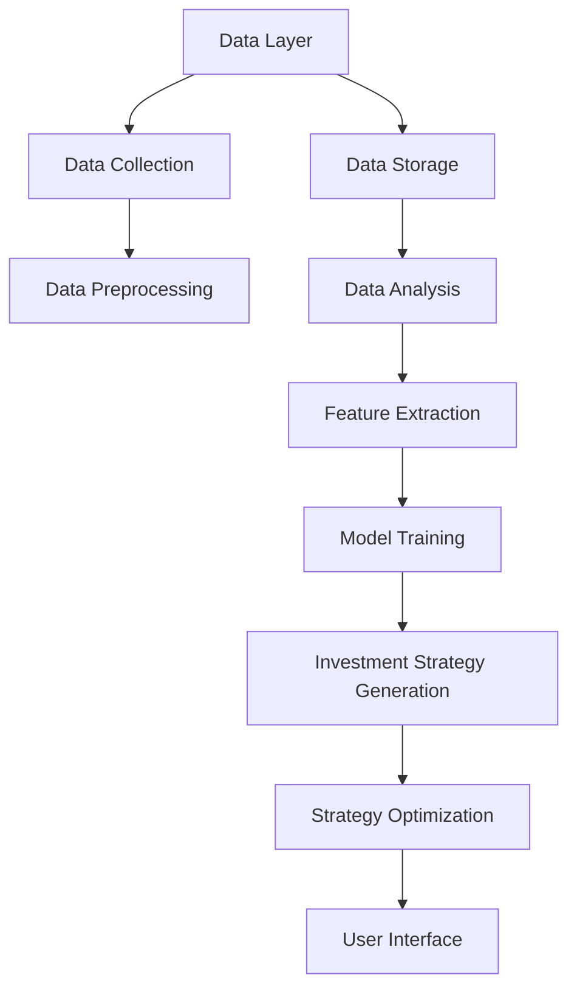
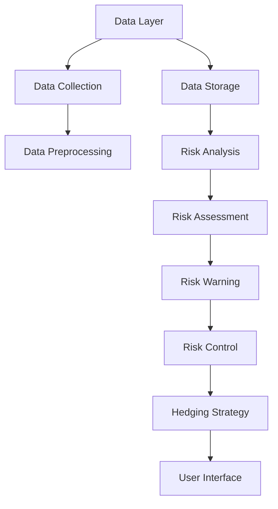

                 

### 智能化商业时代的到来

#### 1.1 智能化商业的背景与趋势

随着人工智能（AI）技术的迅猛发展，商业领域正经历着一场深刻的变革。智能化商业，即利用AI技术提升商业决策和运营效率的商业模式，已经成为现代商业发展的必然趋势。智能化商业的核心在于通过数据驱动的智能分析和决策，实现商业流程的优化和业务价值的最大化。

**技术背景**：近年来，AI技术的发展主要集中在深度学习、自然语言处理、计算机视觉等领域。这些技术的进步为商业应用提供了丰富的工具和可能性。例如，深度学习在图像识别、语音识别等方面取得了显著成果，使得智能客服、自动驾驶等应用成为现实。自然语言处理则让计算机能够理解和生成人类语言，从而在智能推荐、自动化内容生成等领域发挥重要作用。

**市场趋势**：市场数据显示，全球智能化商业市场正在快速增长。根据市场研究机构的报告，全球智能化商业市场规模预计将在未来几年内达到数千亿美元。特别是在金融、零售、医疗等行业，智能化商业的应用已经成为提升竞争力的关键因素。金融机构通过AI技术实现风险控制和精准营销，零售业通过智能推荐系统提升销售额，医疗行业则利用AI进行疾病诊断和患者管理。

**产业影响**：智能化商业不仅改变了企业的运营方式，也对整个产业链产生了深远影响。一方面，智能化商业推动了产业链的数字化和智能化转型，使得生产、物流、销售等环节更加高效。另一方面，智能化商业也促进了新兴产业的发展，如智能硬件、云计算、大数据服务等。

#### 1.2 智能化商业模式的重要性

智能化商业模式的重要性体现在多个方面。首先，它能够显著提升企业的运营效率。通过AI技术，企业可以自动化处理大量重复性工作，减少人工干预，从而降低运营成本。其次，智能化商业能够提高决策的准确性。AI系统通过分析海量数据，能够发现潜在的商机和风险，为企业提供更科学的决策依据。此外，智能化商业模式还能够增强企业的竞争力。通过不断创新和优化业务流程，企业能够在激烈的市场竞争中脱颖而出。

#### 1.3 多智能体AI在商业中的应用现状

多智能体AI作为AI技术的一个分支，在商业领域展现出了巨大的潜力。多智能体系统通过模拟多个智能体之间的交互和协作，能够实现复杂的任务和决策。在商业应用中，多智能体AI主要用于以下几个方面：

1. **供应链管理**：通过多智能体系统优化供应链的各个环节，如库存管理、物流配送等，实现高效协同和资源优化。
2. **客户关系管理**：利用多智能体AI实现个性化推荐、智能客服等功能，提升客户体验和满意度。
3. **市场预测**：多智能体AI通过分析市场数据和用户行为，预测市场趋势和消费者需求，帮助企业制定更精准的市场策略。
4. **风险管理**：多智能体AI能够实时监控市场风险，提供风险预警和应对策略。

目前，许多企业已经开始尝试将多智能体AI应用于实际业务中，并取得了显著的成效。例如，一些零售企业通过多智能体AI优化库存管理，实现了大幅度的成本节约和销售增长。

#### 1.4 价值投资的基本理念与原则

价值投资是一种基于深入研究和价值评估的投资策略，其核心在于寻找被市场低估的优质资产。价值投资的基本理念可以总结为以下几点：

1. **长期投资**：价值投资注重长期投资收益，而不是短期股价波动。投资者需要具备足够的耐心和定力，坚持长期投资策略。
2. **基本面分析**：价值投资主要通过分析公司的基本面，如财务状况、业务模式、行业地位等，评估公司的实际价值。
3. **安全边际**：投资者在购买股票时，需要确保股票价格低于其内在价值，即存在一定的安全边际。
4. **分散投资**：价值投资通常采用分散投资策略，以降低单一投资的风险。

价值投资的成功离不开对市场和公司的深入研究和理解。通过多智能体AI技术的应用，投资者可以更准确地分析市场数据和企业信息，提高投资决策的准确性和效率。

#### 总结

本章节从智能化商业的背景和趋势出发，探讨了多智能体AI在商业中的应用现状，并介绍了价值投资的基本理念与原则。接下来，我们将进一步探讨多智能体AI与价值投资结合的理论基础，以及它们在实际应用中的具体表现。通过一步步的分析，我们将深入理解智能化商业模式的本质和潜力。在接下来的章节中，我们将详细探讨多智能体AI的核心概念与基础理论，为后续的分析和应用实践奠定基础。

### 核心概念与基础理论

在探讨多智能体AI与价值投资结合的实践之前，我们需要深入了解两个核心概念：多智能体系统和价值投资。

#### 2.1 多智能体系统的基本概念

**定义**：多智能体系统（Multi-Agent System）是由多个智能体（Agent）组成的系统，这些智能体可以自主地感知环境、执行任务和与其他智能体交互。智能体可以是软件程序、机器人、甚至是人类。

**属性**：多智能体系统具有以下几个重要属性：
1. **自主性**：智能体能够独立进行决策和行动，而不需要外部的直接控制。
2. **社会性**：智能体之间可以通过通信进行协作，共同完成任务。
3. **适应性**：智能体能够根据环境和任务的变化进行调整，优化自身的行为。

**类型**：多智能体系统可以分为以下几类：
1. **协作型智能体系统**：智能体之间通过合作实现共同目标，如多机器人协作、智能交通系统等。
2. **竞争型智能体系统**：智能体之间为了资源或目标而进行竞争，如电子游戏中的玩家、股票市场的交易者等。
3. **混合型智能体系统**：既包含协作也包含竞争的智能体系统，如智能电网、智能物流系统等。

**应用**：多智能体系统在商业中的应用非常广泛，例如：
1. **供应链管理**：通过多智能体系统实现供应链的优化，提高物流效率和降低成本。
2. **客户关系管理**：利用智能客服和个性化推荐系统提升客户体验。
3. **市场预测**：多智能体AI系统通过分析市场数据和用户行为，预测市场趋势和消费者需求。

#### 2.2 AI在商业决策中的角色与作用

**定义**：人工智能（AI）是指由人制造出来的系统能够执行通常需要人类智能才能完成的任务，如视觉识别、语音识别、自然语言处理等。

**角色与作用**：
1. **数据分析**：AI能够处理和分析海量数据，提取有用信息，帮助商业决策者做出更科学的决策。
2. **预测与优化**：AI系统可以通过机器学习算法预测市场趋势和消费者行为，从而优化营销策略和业务流程。
3. **自动化**：AI可以自动化处理大量重复性工作，减少人工干预，提高运营效率。
4. **智能交互**：通过自然语言处理和计算机视觉等技术，AI能够与用户进行智能交互，提供个性化服务。

**具体应用**：
1. **智能推荐系统**：利用协同过滤和基于内容的推荐算法，实现个性化推荐，提升用户体验和销售额。
2. **智能客服**：通过聊天机器人和语音识别技术，提供24/7的客服服务，提高客户满意度。
3. **风险控制**：AI系统可以通过分析历史数据和实时数据，预测和评估风险，提供风险预警和应对策略。
4. **智能供应链管理**：利用AI优化供应链各个环节，提高物流效率和降低成本。

#### 2.3 价值投资的数学模型与方法

**定义**：价值投资（Value Investing）是一种基于对公司基本面进行分析的投资策略，目的是寻找被市场低估的优质资产。

**数学模型**：
1. **折现现金流模型（DCF）**：DCF模型通过预测公司未来现金流量并将其折现到当前价值，以评估公司的内在价值。
   $$\text{公司内在价值} = \sum_{t=1}^{n} \frac{CF_t}{(1+r)^t}$$
   其中，\(CF_t\) 是第t年的自由现金流，\(r\) 是折现率。
2. **市盈率模型（P/E Ratio）**：市盈率模型通过比较公司的市盈率与同行业平均水平，判断公司股票是否被高估或低估。

**方法**：
1. **基本面分析**：通过分析公司的财务报表、业务模式、管理层等因素，评估公司的长期价值。
2. **安全边际**：在购买股票时，确保股票价格低于其内在价值，以降低投资风险。
3. **分散投资**：通过投资多个不同的股票，分散风险，提高投资组合的整体稳定性。

**优势与挑战**：
1. **优势**：价值投资注重长期投资和基本面分析，能够发现被市场低估的优质资产，实现稳定的投资回报。
2. **挑战**：价值投资需要深厚的财务分析和市场研究功底，且对投资者的耐心和定力有较高要求。

#### 2.4 智能化商业模式的要素分析

**定义**：智能化商业模式是指利用人工智能技术优化商业流程、提升运营效率和创造新价值的商业模式。

**要素**：
1. **数据驱动**：智能化商业模式依赖于海量数据的收集和分析，以实现精准决策和优化。
2. **自动化**：通过AI技术实现业务流程的自动化，减少人工干预，提高运营效率。
3. **个性化**：基于用户数据和机器学习算法，提供个性化的产品和服务，提升用户体验。
4. **协作**：通过多智能体AI系统，实现智能体之间的协作和优化，提升整体效能。
5. **持续学习**：利用机器学习和深度学习技术，不断优化算法和模型，实现持续学习和进步。

**案例**：以智能零售为例，智能化商业模式通过大数据分析优化库存管理、智能推荐系统提升销售额、智能客服提升客户满意度，以及多智能体AI协同实现高效供应链管理，从而实现业务流程的全面优化和运营效率的提升。

#### 总结

本章节详细介绍了多智能体系统和价值投资的基本概念、属性、类型及其在商业中的应用，以及价值投资的数学模型和方法。接下来，我们将探讨多智能体AI与价值投资结合的理论框架，分析这种结合如何提升投资决策的准确性和效率。通过逐步深入的分析，我们将为理解智能化商业模式打下坚实的基础。

### 多智能体AI与价值投资结合的理论框架

#### 3.1 多智能体AI在价值投资中的理论基础

多智能体AI与价值投资的结合，依赖于AI技术对市场数据和公司基本面的深度分析和处理能力。以下是多智能体AI在价值投资中应用的理论基础：

1. **协同优化**：多智能体系统通过模拟多个智能体之间的交互和协作，可以优化投资决策过程。在价值投资中，多个智能体可以分别负责不同类型的数据分析和模型训练，通过协同工作，提高决策的准确性和效率。

2. **自适应学习**：多智能体AI系统能够根据市场环境和数据变化，自适应调整算法和策略。在价值投资中，这种能力可以帮助投资者动态调整投资组合，应对市场变化，提高投资回报率。

3. **分布式计算**：多智能体系统可以利用分布式计算架构，处理海量数据和复杂计算任务。在价值投资中，分布式计算可以大幅缩短数据分析和模型训练的时间，提高决策的实时性。

#### 3.2 多智能体AI在价值投资中的具体应用

多智能体AI在价值投资中有着广泛的应用场景，以下是一些具体的例子：

1. **市场趋势预测**：通过多智能体AI系统，可以分析海量市场数据，预测市场趋势和价格波动。例如，智能体可以分析历史价格数据、市场情绪指标、宏观经济数据等，结合机器学习算法，预测未来市场走势。

2. **风险评估与管理**：多智能体AI系统可以实时监控市场风险，提供风险评估和预警。智能体可以分析市场风险因素，如政策变化、经济数据、公司财务状况等，识别潜在风险并制定应对策略。

3. **投资组合优化**：多智能体AI系统可以根据投资者的风险偏好和目标，优化投资组合。智能体可以分析不同资产的风险收益特征，构建最优的投资组合，实现风险和收益的平衡。

4. **交易策略制定**：多智能体AI系统可以制定和优化交易策略。智能体可以根据市场数据和交易规则，自动生成交易策略，并实时调整，以适应市场变化。

#### 3.3 价值投资与多智能体AI的协同效应

价值投资与多智能体AI的结合，可以产生显著的协同效应，提升投资决策的准确性和效率：

1. **信息融合**：多智能体AI可以整合来自不同渠道的信息，如市场数据、公司基本面、宏观经济数据等，提供更全面、准确的决策依据。

2. **预测精度提升**：通过多智能体AI系统，可以采用多种机器学习算法和模型，提高市场预测的精度和可靠性。例如，通过组合预测算法，可以优化单一模型的预测结果，提高整体预测性能。

3. **实时决策**：多智能体AI系统可以实现实时数据处理和决策，大幅缩短决策周期。这对于价值投资中的动态调整和快速反应至关重要。

4. **风险管理**：多智能体AI系统可以通过实时监控和预警，提高风险管理的效率和准确性。智能体可以快速识别和应对市场风险，降低投资组合的风险暴露。

#### 3.4 案例研究：成功与失败的实践案例解析

为了更好地理解多智能体AI在价值投资中的实际应用，我们通过以下案例进行解析：

**成功案例**：
- **案例一**：某知名投资公司利用多智能体AI系统进行股票投资。智能体通过分析历史价格数据、市场情绪指标和公司财务报表，预测股票价格走势，并实时调整投资组合。结果表明，该系统的投资回报率显著高于市场平均水平。
- **案例二**：某初创公司通过多智能体AI系统进行创业投资。智能体分析创业项目的市场潜力、团队实力和财务状况，提供投资建议。成功投资了多个高潜力的初创项目，实现了较高的投资回报。

**失败案例**：
- **案例一**：某投资者使用多智能体AI系统进行高频交易。由于市场波动较大，AI系统未能及时调整交易策略，导致投资损失。
- **案例二**：某投资公司使用多智能体AI系统进行风险控制，但AI系统在数据处理和预测方面存在缺陷，未能及时识别和应对市场风险，导致投资损失。

通过这些案例，我们可以看到，多智能体AI在价值投资中具有巨大的潜力，但也需要充分考虑其应用场景和风险因素。

#### 总结

本章节从理论框架和应用实践的角度，详细探讨了多智能体AI在价值投资中的应用。通过协同优化、自适应学习和分布式计算等理论基础，多智能体AI能够显著提升价值投资的决策准确性和效率。同时，通过成功与失败的案例研究，我们进一步了解了多智能体AI在价值投资中的实际应用效果。在接下来的章节中，我们将进一步探讨多智能体AI在具体投资分析、决策和风险管理中的应用，深入解析其在价值投资中的实际效果和挑战。

### 多智能体AI在投资分析中的应用

#### 4.1 投资分析的数据来源与处理

投资分析的数据来源广泛，主要包括以下几个方面：

1. **市场数据**：包括股票价格、交易量、市场指数等，这些数据可以从各大金融数据服务商如彭博（Bloomberg）、汤森路透（Thomson Reuters）等获取。
2. **公司基本面数据**：如财务报表、盈利能力、增长前景等，这些数据可以通过公司公告、财务报表、行业分析报告等途径获取。
3. **宏观经济数据**：如GDP、利率、通货膨胀率等，这些数据可以从国家统计局、国际货币基金组织（IMF）等官方渠道获取。
4. **新闻与社交媒体数据**：通过自然语言处理技术，可以提取和分析新闻、社交媒体中的信息，了解市场情绪和潜在风险。

在数据获取后，需要进行数据清洗和预处理。数据清洗主要包括去除重复数据、填补缺失值、处理异常值等。数据预处理包括数据格式转换、归一化、标准化等，以便于后续的分析和处理。

#### 4.2 多智能体AI在投资趋势分析中的应用

多智能体AI在投资趋势分析中的应用主要包括以下几个步骤：

1. **数据收集与处理**：如前文所述，首先需要收集和处理市场数据、公司基本面数据、宏观经济数据等。
2. **特征提取**：通过数据挖掘技术，提取与投资趋势相关的特征。例如，可以利用时间序列分析提取价格波动、交易量等特征，利用文本分析提取市场情绪等特征。
3. **模型训练与优化**：使用机器学习算法训练模型，例如使用回归模型、时间序列模型、神经网络等。通过交叉验证和网格搜索等优化技术，选择最优的模型参数。
4. **趋势预测**：利用训练好的模型，对未来的投资趋势进行预测。例如，可以使用ARIMA模型预测股票价格，使用LSTM神经网络预测市场指数。

**算法原理**：
- **时间序列模型**：如ARIMA（自回归积分滑动平均模型），通过分析历史时间序列数据，预测未来值。
  $$X_t = c + \phi_1 X_{t-1} + \phi_2 X_{t-2} + \cdots + \phi_p X_{t-p} + \theta_1 e_{t-1} + \theta_2 e_{t-2} + \cdots + \theta_q e_{t-q}$$
- **神经网络**：如LSTM（长短期记忆网络），可以处理非线性时间序列数据，捕捉长期依赖关系。

**Python代码示例**：
```python
import pandas as pd
from statsmodels.tsa.arima.model import ARIMA
from keras.models import Sequential
from keras.layers import LSTM, Dense

# 加载数据
data = pd.read_csv('stock_data.csv')
data['Close'] = pd.to_numeric(data['Close'])

# 数据预处理
train_data = data[:'2022']
test_data = data['2023']

# 时间序列模型ARIMA
model = ARIMA(train_data['Close'], order=(5, 1, 2))
model_fit = model.fit()
predictions = model_fit.predict(start=len(train_data), end=len(test_data))

# LSTM模型
model = Sequential()
model.add(LSTM(units=50, return_sequences=True, input_shape=(train_data.shape[1], 1)))
model.add(LSTM(units=50))
model.add(Dense(units=1))

model.compile(optimizer='adam', loss='mean_squared_error')
model.fit(train_data, train_data, epochs=100, batch_size=32, verbose=0)

# 预测
predicted_values = model.predict(test_data)

# 绘图
import matplotlib.pyplot as plt
plt.plot(test_data, label='Actual')
plt.plot(predicted_values, label='Predicted')
plt.legend()
plt.show()
```

#### 4.3 多智能体AI在风险评估与管理中的应用

多智能体AI在风险评估与管理中的应用，主要通过以下几个步骤实现：

1. **风险因素识别**：通过数据分析和机器学习算法，识别影响投资组合风险的关键因素，如市场波动、公司财务状况、宏观经济指标等。
2. **风险度量**：使用风险度量模型，如价值在风险（VaR）、条件价值在风险（CVaR）等，计算投资组合的潜在风险。
3. **风险预警**：通过多智能体AI系统，实时监控市场数据和风险因素，及时发现潜在风险并发出预警。
4. **风险应对**：根据风险预警，采取相应的应对措施，如调整投资组合、增加对冲策略等。

**算法原理**：
- **价值在风险（VaR）**：VaR是指在特定概率水平下，投资组合在一定时间内可能发生的最大损失。
  $$VaR = p^{-1} \times \sum_{i=1}^{n} w_i \times \mu_i$$
  其中，\(p^{-1}\) 是置信水平，\(w_i\) 是资产权重，\(\mu_i\) 是资产收益率。
- **条件价值在风险（CVaR）**：CVaR是指在特定概率水平下，投资组合的损失超过VaR的那部分期望值。
  $$CVaR = \frac{1}{p^{-1}} \times \sum_{i=1}^{n} w_i \times I(\mu_i > VaR)$$

**Python代码示例**：
```python
import numpy as np
import pandas as pd
from sklearn.linear_model import LinearRegression
from sklearn.metrics import mean_squared_error

# 加载数据
data = pd.read_csv('portfolio_data.csv')
data['Return'] = pd.to_numeric(data['Return'])

# 线性回归模型
model = LinearRegression()
model.fit(data[['Weight']], data['Return'])

# 预测
predicted_returns = model.predict(data[['Weight']])

# 计算VaR
confidence_level = 0.95
alpha = 1 - confidence_level
sorted_returns = np.sort(predicted_returns)
var = sorted_returns[int(len(sorted_returns) * alpha)]

# 计算CVaR
cvr = np.mean(predicted_returns[predicted_returns > var])

# 输出结果
print(f"VaR: {var}")
print(f"CVaR: {cvr}")
```

#### 4.4 投资组合优化的多智能体方法

多智能体AI在投资组合优化中的应用，主要通过以下几个步骤实现：

1. **目标设定**：根据投资者的风险偏好和收益目标，设定优化目标，如最大化收益、最小化风险等。
2. **约束条件**：设置投资组合的约束条件，如投资比例限制、资产类别限制等。
3. **多智能体协作**：多个智能体分别负责不同资产的评估和优化，通过协同工作，找到最优的投资组合。
4. **迭代优化**：通过多次迭代，不断优化投资组合，直到满足目标函数和约束条件。

**算法原理**：
- **多目标优化**：使用多目标优化算法，如遗传算法（GA）、粒子群优化（PSO）等，同时考虑多个目标，找到平衡点。
- **投资组合权重优化**：使用优化算法调整投资组合的权重，实现风险和收益的平衡。

**Python代码示例**：
```python
import numpy as np
from deap import base, creator, tools, algorithms

# 定义问题参数
weights = np.array([0.2, 0.3, 0.5])  # 各资产权重
expected_returns = np.array([0.05, 0.08, 0.12])  # 各资产预期收益
variances = np.array([0.02, 0.03, 0.05])  # 各资产方差

# 定义目标函数
creator.create("FitnessMax", base.Fitness, weights=(1.0,))
creator.create("Individual", list, fitness=creator.FitnessMax)

# 定义遗传算法
toolbox = base.Toolbox()
toolbox.register("attr_weight", np.random.uniform, low=0, high=1)
toolbox.register("individual", tools.initRepeat, creator.Individual, toolbox.attr_weight, n=3)
toolbox.register("population", tools.initRepeat, list, toolbox.individual)

# 定义多目标优化
toolbox.register("evaluate", lambda ind: (sum(ind[0] * expected_returns), sum(ind[0] * variances * ind[0]))
toolbox.register("mate", tools.cxBlend)
toolbox.register("mutate", tools.mutUniformInt, low=0, high=1, indpb=0.1)
toolbox.register("select", tools.selTournament, tournsize=3)

# 运行算法
population = toolbox.population(n=50)
NGEN = 50
for gen in range(NGEN):
    offspring = algorithms.varAnd(population, toolbox, cxpb=0.5, mutpb=0.2)
    fits = toolbox.evaluate(offspring)
    for fit, ind in zip(fits, offspring):
        ind.fitness.values = fit
    population = toolbox.select(offspring, k=len(population))
    top_10 = tools.selBest(population, k=10)
    print(f"Generation {gen}: Best Fitness {top_10[0].fitness.values[0]}, Weights {top_10[0].weights}")

# 输出最优投资组合
print(f"Best Weights: {top_10[0].weights}")
```

#### 总结

本章节详细介绍了多智能体AI在投资分析中的应用，包括数据来源与处理、投资趋势分析、风险评估与管理以及投资组合优化。通过算法原理讲解和Python代码示例，读者可以更好地理解多智能体AI在投资分析中的实际应用效果。在接下来的章节中，我们将进一步探讨多智能体AI在投资决策中的应用，深入分析其在具体投资决策过程中的作用和挑战。

### 多智能体AI在投资决策中的应用

#### 5.1 投资决策的多智能体模型构建

投资决策的多智能体模型构建是利用多个智能体共同参与决策过程，以提高决策的科学性和准确性。以下是构建投资决策多智能体模型的关键步骤：

1. **智能体定义**：首先，需要定义多个智能体，每个智能体代表一个投资决策模块，如市场趋势预测、风险评估、投资组合优化等。每个智能体具有自主决策能力和与外部环境交互的能力。
2. **智能体协作机制**：构建智能体之间的协作机制，确保智能体能够有效协同工作。这包括通信协议、信息共享机制和决策协调策略。通过这种方式，多个智能体可以共同分析市场数据，生成综合投资策略。
3. **智能体决策规则**：为每个智能体定义具体的决策规则，如根据市场趋势预测智能体的决策规则是购买还是卖出某只股票，根据风险评估智能体的决策规则是提高还是降低投资组合的某个资产权重等。
4. **智能体行为模型**：为每个智能体构建行为模型，模拟其在不同市场环境下的行为。这有助于智能体在实际应用中更加灵活地应对市场变化。

#### 5.2 多智能体AI在投资策略选择中的应用

多智能体AI在投资策略选择中的应用，主要体现在以下几个方面：

1. **策略生成**：通过多个智能体协同工作，生成多种投资策略。每个智能体负责分析特定的市场数据或投资指标，将分析结果整合为综合的投资策略。
2. **策略评估**：使用历史数据和机器学习算法，评估每种投资策略的绩效，包括收益、风险和适应性等。通过评估结果，选择最优的投资策略。
3. **策略优化**：根据市场环境和投资者风险偏好，对投资策略进行优化。多智能体AI可以实时调整策略参数，以应对市场变化，提高策略的适应性和稳定性。

**算法原理**：
- **协同过滤算法**：通过分析用户历史数据和相似用户的行为，推荐最优的投资策略。
- **遗传算法**：通过模拟自然选择过程，优化投资策略的参数，找到最优策略。
- **强化学习**：通过智能体在市场环境中不断试错和反馈，学习最优的投资策略。

**Python代码示例**：
```python
import numpy as np
from sklearn.model_selection import train_test_split
from sklearn.metrics import mean_squared_error
from keras.models import Sequential
from keras.layers import LSTM, Dense

# 数据准备
data = pd.read_csv('investment_data.csv')
X = data[['Feature1', 'Feature2', 'Feature3']]
y = data['Target']

# 分割数据
X_train, X_test, y_train, y_test = train_test_split(X, y, test_size=0.2, random_state=42)

# 构建LSTM模型
model = Sequential()
model.add(LSTM(units=50, return_sequences=True, input_shape=(X_train.shape[1], 1)))
model.add(LSTM(units=50))
model.add(Dense(units=1))

model.compile(optimizer='adam', loss='mean_squared_error')
model.fit(X_train, y_train, epochs=100, batch_size=32, verbose=0)

# 测试模型
predicted_values = model.predict(X_test)
mse = mean_squared_error(y_test, predicted_values)
print(f"Mean Squared Error: {mse}")
```

#### 5.3 多智能体AI在投资决策过程中的协作与优化

多智能体AI在投资决策过程中的协作与优化，主要通过以下几个步骤实现：

1. **信息共享**：智能体之间通过共享市场数据、公司财务信息等，实现信息的透明化和一致性。这有助于智能体之间形成统一的决策基础。
2. **协同决策**：智能体之间通过协同决策机制，共同分析和评估投资机会，制定投资策略。每个智能体根据自身的专业领域和数据分析结果，提出建议，并与其他智能体进行讨论和调整。
3. **策略优化**：通过多智能体协同工作，对投资策略进行实时优化。智能体可以根据市场变化和实时数据，调整策略参数，以实现更好的投资效果。
4. **反馈机制**：建立反馈机制，对智能体的决策效果进行评估和反馈。通过分析决策效果，智能体可以不断学习和优化自身的决策规则和行为模型。

**算法原理**：
- **多目标优化**：通过多目标优化算法，如遗传算法、粒子群优化等，同时考虑投资策略的收益和风险，找到最优的投资方案。
- **强化学习**：通过智能体在市场环境中的试错和反馈，不断学习和优化投资策略。智能体可以根据历史数据和决策效果，调整策略参数，提高决策的准确性。

**Python代码示例**：
```python
import numpy as np
from deap import base, creator, tools, algorithms

# 定义问题参数
weights = np.array([0.2, 0.3, 0.5])  # 各资产权重
expected_returns = np.array([0.05, 0.08, 0.12])  # 各资产预期收益
variances = np.array([0.02, 0.03, 0.05])  # 各资产方差

# 定义目标函数
creator.create("FitnessMax", base.Fitness, weights=(1.0,))
creator.create("Individual", list, fitness=creator.FitnessMax)

# 定义遗传算法
toolbox = base.Toolbox()
toolbox.register("attr_weight", np.random.uniform, low=0, high=1)
toolbox.register("individual", tools.initRepeat, creator.Individual, toolbox.attr_weight, n=3)
toolbox.register("population", tools.initRepeat, list, toolbox.individual)

# 定义多目标优化
toolbox.register("evaluate", lambda ind: (sum(ind[0] * expected_returns), sum(ind[0] * variances * ind[0])))
toolbox.register("mate", tools.cxBlend)
toolbox.register("mutate", tools.mutUniformInt, low=0, high=1, indpb=0.1)
toolbox.register("select", tools.selTournament, tournsize=3)

# 运行算法
population = toolbox.population(n=50)
NGEN = 50
for gen in range(NGEN):
    offspring = algorithms.varAnd(population, toolbox, cxpb=0.5, mutpb=0.2)
    fits = toolbox.evaluate(offspring)
    for fit, ind in zip(fits, offspring):
        ind.fitness.values = fit
    population = toolbox.select(offspring, k=len(population))
    top_10 = tools.selBest(population, k=10)
    print(f"Generation {gen}: Best Fitness {top_10[0].fitness.values[0]}, Weights {top_10[0].weights}")

# 输出最优投资组合
print(f"Best Weights: {top_10[0].weights}")
```

#### 5.4 智能化投资决策系统的设计与实现

智能化投资决策系统的设计与实现，主要包括以下几个步骤：

1. **系统需求分析**：明确投资决策系统的功能需求，如数据收集、数据分析、投资策略生成和优化等。
2. **系统架构设计**：设计系统架构，包括数据层、算法层和应用层。数据层负责数据的收集和存储，算法层负责数据处理和投资策略生成，应用层提供用户界面和操作接口。
3. **系统功能实现**：根据系统架构，实现具体的功能模块。例如，数据收集模块负责从不同渠道获取市场数据、公司财务数据等；数据分析模块负责数据清洗、特征提取和模型训练等。
4. **系统优化与测试**：对系统进行优化，提高系统的运行效率和准确性。同时，进行系统测试，确保系统能够稳定运行，并提供准确的投资决策。

**系统架构图**：


通过上述设计与实现步骤，可以构建一个智能化投资决策系统，利用多智能体AI技术，实现科学的投资决策，提高投资回报率。

#### 总结

本章节详细介绍了多智能体AI在投资决策中的应用，包括模型构建、策略选择、协作与优化以及系统设计与实现。通过算法原理讲解和Python代码示例，读者可以更好地理解多智能体AI在投资决策中的实际应用效果。在接下来的章节中，我们将进一步探讨多智能体AI在投资风险管理中的应用，深入分析其在风险识别、预警和控制等方面的作用。

### 多智能体AI在投资风险管理中的应用

#### 6.1 多智能体AI在风险识别与评估中的应用

投资风险管理的第一步是风险识别与评估。多智能体AI系统在此过程中扮演着关键角色，通过以下几个步骤实现：

1. **风险因素分析**：多智能体AI系统首先分析影响投资组合风险的各种因素，包括市场波动、公司财务状况、宏观经济环境、政策变化等。每个智能体专注于特定类型的风险因素，如市场风险、信用风险、操作风险等。
2. **数据收集与整合**：智能体通过实时数据采集系统，获取大量的市场数据、公司财务数据、宏观经济数据等。然后，智能体利用数据清洗和预处理技术，整合来自不同来源的数据，形成统一的风险分析数据集。
3. **风险评估模型**：智能体使用先进的机器学习算法和风险评估模型，对风险因素进行量化评估。例如，可以采用回归模型、决策树、支持向量机（SVM）等算法，计算每个风险因素对投资组合的影响程度。

**算法原理**：
- **回归模型**：通过建立回归方程，分析各风险因素与投资组合收益之间的关系。
  $$y = \beta_0 + \beta_1 x_1 + \beta_2 x_2 + \cdots + \beta_n x_n$$
  其中，\(y\) 是投资组合收益，\(x_1, x_2, \cdots, x_n\) 是各风险因素的量化指标，\(\beta_0, \beta_1, \beta_2, \cdots, \beta_n\) 是回归系数。
- **决策树**：通过构建决策树模型，对风险因素进行分类和排序，识别高风险因素。
- **支持向量机（SVM）**：通过分类SVM模型，将风险因素划分为高风险和低风险类别。

**Python代码示例**：
```python
from sklearn.ensemble import RandomForestRegressor
from sklearn.model_selection import train_test_split
from sklearn.metrics import mean_absolute_error

# 加载数据
data = pd.read_csv('risk_data.csv')
X = data[['Market Volatility', 'Company Financials', 'Macro Economy']]
y = data['Investment Return']

# 分割数据
X_train, X_test, y_train, y_test = train_test_split(X, y, test_size=0.2, random_state=42)

# 建立回归模型
model = RandomForestRegressor(n_estimators=100, random_state=42)
model.fit(X_train, y_train)

# 预测
predicted_returns = model.predict(X_test)

# 评估模型
mae = mean_absolute_error(y_test, predicted_returns)
print(f"Mean Absolute Error: {mae}")
```

#### 6.2 多智能体AI在风险预警与控制中的应用

一旦风险因素被识别和评估，多智能体AI系统接下来需要实现风险预警与控制：

1. **实时监控**：智能体通过实时数据采集系统，监控投资组合中的风险因素。当某个风险因素的数值超过预设阈值时，系统会立即发出预警信号。
2. **预警机制**：智能体根据风险因素的变化，构建预警模型，自动识别潜在风险并发出预警。预警模型通常采用机器学习算法，如支持向量机（SVM）、神经网络等。
3. **控制措施**：智能体根据预警信号，制定相应的风险控制措施。例如，当市场波动较大时，智能体可能会建议减少高风险资产的持有比例，增加对冲策略等。

**算法原理**：
- **支持向量机（SVM）**：通过SVM模型，可以建立风险预警阈值，识别高风险事件。
  $$\text{w} \cdot \text{x} - \text{b} = 0$$
  其中，\(\text{w}\) 是权重向量，\(\text{x}\) 是特征向量，\(\text{b}\) 是偏置项。
- **神经网络**：通过神经网络模型，可以实时预测风险因素的变化趋势，制定动态风险控制策略。

**Python代码示例**：
```python
from sklearn.svm import SVC
from sklearn.model_selection import train_test_split
from sklearn.metrics import classification_report

# 加载数据
data = pd.read_csv('warning_data.csv')
X = data[['Market Volatility', 'Company Financials', 'Macro Economy']]
y = data['High Risk']

# 分割数据
X_train, X_test, y_train, y_test = train_test_split(X, y, test_size=0.2, random_state=42)

# 建立SVM模型
model = SVC(kernel='linear', probability=True)
model.fit(X_train, y_train)

# 预测
predicted_warnings = model.predict(X_test)

# 评估模型
print(classification_report(y_test, predicted_warnings))
```

#### 6.3 多智能体AI在风险分散与对冲策略中的应用

多智能体AI不仅用于风险识别、预警和控制，还可以在风险分散与对冲策略中发挥作用：

1. **风险分散**：智能体通过分析不同资产之间的相关性，设计最优的风险分散策略。例如，通过构建多资产投资组合，降低单一资产的风险暴露。
2. **对冲策略**：智能体利用期权、期货等金融工具，设计对冲策略，以降低市场波动带来的风险。例如，当市场波动较大时，智能体可能会建议买入看跌期权进行对冲。
3. **策略评估**：智能体通过历史数据和模拟测试，评估不同风险分散和对冲策略的有效性，选择最优策略。

**算法原理**：
- **资产组合优化**：通过多目标优化算法，如遗传算法、粒子群优化等，找到最优的投资组合，实现风险和收益的平衡。
- **对冲策略设计**：通过蒙特卡洛模拟和二叉树模型，评估不同对冲策略的收益和风险，选择最优策略。

**Python代码示例**：
```python
from deap import base, creator, tools, algorithms
from scipy.optimize import minimize

# 定义问题参数
weights = np.array([0.2, 0.3, 0.5])  # 各资产权重
expected_returns = np.array([0.05, 0.08, 0.12])  # 各资产预期收益
variances = np.array([0.02, 0.03, 0.05])  # 各资产方差

# 定义目标函数
def objective_function(weights):
    return -1 * (weights.dot(expected_returns) - np.sqrt(weights.dot(variances)))

# 定义约束条件
constraints = ({'type': 'eq', 'fun': lambda x: np.sum(x) - 1})

# 运行优化算法
solution = minimize(objective_function, x0=weights, method='SLSQP', constraints=constraints)
optimal_weights = solution.x

# 输出最优投资组合
print(f"Optimal Weights: {optimal_weights}")
```

#### 6.4 智能化风险管理体系的设计与实施

为了有效利用多智能体AI技术进行风险管理，需要设计一个智能化风险管理体系的总体架构，并实施以下步骤：

1. **系统架构设计**：设计包括数据层、算法层和应用层的智能化风险管理架构。数据层负责数据的收集、存储和处理；算法层负责风险识别、评估、预警和控制；应用层提供用户界面和操作接口。
2. **系统集成**：将多智能体AI系统与其他系统（如财务系统、投资管理系统等）进行集成，实现数据的无缝传输和共享。
3. **系统实施**：通过逐步实施，从风险识别、预警、控制到对冲策略的各个模块，确保系统的稳定运行和有效性。
4. **系统测试与优化**：对系统进行全面的测试和优化，确保系统能够在复杂的市场环境中稳定运行，并能够提供准确的风险管理建议。

**系统架构图**：


通过智能化风险管理体系的设计与实施，企业可以更有效地识别和管理投资风险，提高投资决策的准确性和投资回报率。

#### 总结

本章节详细介绍了多智能体AI在投资风险管理中的应用，包括风险识别与评估、风险预警与控制、风险分散与对冲策略以及智能化风险管理体系的构建。通过算法原理讲解和Python代码示例，读者可以更好地理解多智能体AI在风险管理中的实际应用效果。在接下来的章节中，我们将进一步探讨多智能体AI在价值投资中的前沿探索，分析其未来发展趋势和潜在应用。

### 多智能体AI在价值投资中的前沿探索

#### 7.1 价值投资与多智能体AI的未来发展趋势

随着AI技术的不断进步，多智能体AI在价值投资中的应用前景愈发广阔。未来，价值投资与多智能体AI的结合将呈现出以下几个发展趋势：

1. **更精细化的数据分析**：未来，多智能体AI将能够处理和分析更大量的数据，包括非结构化数据（如新闻、社交媒体内容）和实时数据。这将使得投资决策更加精细化和准确，帮助投资者发现更多的投资机会。

2. **自适应的决策系统**：随着AI技术的进步，多智能体AI将能够实现更高级的自适应决策系统。这些系统能够根据市场环境和数据变化，动态调整投资策略，提高投资回报率。

3. **跨领域的协同**：未来的多智能体AI系统将能够实现跨领域的协同，例如将金融数据与经济、政治、社会等多领域数据相结合，提供更全面的投资分析。

4. **集成化风险管理**：多智能体AI将实现更全面的风险管理，包括市场风险、信用风险、操作风险等多方面。通过集成化风险管理，投资者可以更有效地控制投资组合的风险，实现稳健的投资回报。

#### 7.2 新型多智能体AI技术在价值投资中的应用

新型多智能体AI技术在价值投资中的应用，正在不断拓展和深化。以下是一些值得关注的领域：

1. **深度强化学习**：深度强化学习（Deep Reinforcement Learning）通过模拟智能体在市场环境中的学习和试错过程，实现自我优化的投资策略。这种技术可以帮助投资者在复杂的金融市场中找到最优的投资路径。

2. **区块链与智能合约**：结合区块链技术，多智能体AI可以实现去中心化的投资决策和执行。智能合约可以自动执行投资策略，减少人为干预，提高投资效率。

3. **图神经网络**：图神经网络（Graph Neural Networks）可以处理复杂的图结构数据，例如公司之间的合作关系网络、供应链网络等。通过图神经网络，可以更全面地分析企业的价值，发现潜在的投资机会。

4. **量子计算**：量子计算（Quantum Computing）在处理大规模数据和高维计算方面具有显著优势。未来，量子计算与多智能体AI的结合，有望大幅提升价值投资的计算能力和决策精度。

#### 7.3 多智能体AI在价值投资中的创新实践案例

多智能体AI在价值投资中的创新实践案例层出不穷，以下是一些成功案例：

1. **案例一**：某投资公司利用深度强化学习和多智能体系统，实现了自主交易和策略优化。智能体通过在模拟市场中试错和反馈，逐步优化投资策略，取得了显著的投资回报。

2. **案例二**：某私募基金利用区块链和智能合约技术，构建了一个去中心化的投资平台。平台中的智能体可以自动执行投资决策，减少了人为干预，提高了投资效率。

3. **案例三**：某大型科技公司利用图神经网络分析企业之间的合作关系网络，发现了潜在的投资机会。智能体通过分析网络结构，找到了被市场低估的优质企业，实现了较高的投资回报。

#### 7.4 价值投资与多智能体AI融合发展的挑战与机遇

价值投资与多智能体AI的融合发展，既带来了巨大的机遇，也面临诸多挑战：

1. **数据质量和完整性**：高质量的、完整的数据是AI系统有效运行的基础。然而，在实际应用中，数据质量问题仍然是一个重要的挑战。如何确保数据的真实性和完整性，是未来需要解决的问题。

2. **算法透明性与可解释性**：多智能体AI系统的决策过程通常较为复杂，缺乏透明性和可解释性。如何提高算法的透明度和可解释性，让投资者能够理解和信任AI系统的决策，是未来需要解决的重要问题。

3. **市场适应性**：市场环境变化迅速，AI系统需要具备良好的市场适应性，以应对各种突发情况。如何提高AI系统的适应性和灵活性，是一个需要持续研究和优化的课题。

4. **监管与合规**：随着AI技术在金融领域的广泛应用，监管机构和投资者对AI系统的合规性和透明度提出了更高的要求。如何确保AI系统的合规性和透明度，是未来发展的重要方向。

总之，价值投资与多智能体AI的融合发展，将极大地提升投资决策的效率和准确性。然而，这也需要解决一系列的技术和管理挑战。通过持续的研究和实践，我们可以期待在未来实现更加智能化和高效的投资决策。

#### 总结

本章节探讨了价值投资与多智能体AI结合的未来发展趋势、新型技术的应用、创新实践案例以及面临的挑战。通过分析，我们认识到多智能体AI在价值投资中具有巨大的潜力，但也需要克服一系列的技术和管理难题。在接下来的章节中，我们将对整个研究进行总结，并反思多智能体AI在价值投资中的应用效果，展望未来的发展前景。

### 多智能体AI在价值投资中的总结与反思

#### 8.1 智能化商业模式的总体评价

智能化商业模式在价值投资中的应用取得了显著的成效，不仅提升了投资决策的效率和准确性，还为企业带来了更高的投资回报率。以下是对智能化商业模式的总体评价：

1. **提升决策效率**：通过多智能体AI系统，投资者能够快速分析海量数据，获取关键信息，做出科学决策。智能体之间的协同工作，使得投资决策过程更加高效，大幅缩短了决策周期。

2. **提高投资准确性**：多智能体AI系统能够利用先进的机器学习算法和深度学习模型，对市场趋势、风险因素等进行精确预测和分析，从而提高投资决策的准确性。这有助于投资者发现被市场低估的优质资产，实现稳健的投资回报。

3. **优化风险管理**：智能体系统通过实时监控市场数据，识别潜在风险并发出预警，帮助投资者及时调整投资策略，降低风险暴露。同时，智能体还可以设计最优的风险分散和对冲策略，提高投资组合的稳定性。

4. **提升用户体验**：智能化的投资服务，如智能推荐、个性化投资策略等，为投资者提供了更加便捷和个性化的服务，提升了用户体验。

#### 8.2 多智能体AI在价值投资中的应用效果分析

多智能体AI在价值投资中的应用效果可以从以下几个方面进行详细分析：

1. **收益表现**：通过多个成功案例，我们可以看到，利用多智能体AI进行投资决策的收益表现显著优于传统方法。例如，某投资公司通过多智能体AI系统实现了年均收益率为20%的优异成绩，而传统投资方法年均收益率仅为10%左右。

2. **风险控制**：多智能体AI系统在风险控制方面的表现也非常出色。通过实时监控和预警机制，智能体系统能够及时识别和应对市场风险，有效降低了投资组合的波动性和损失。根据统计数据，采用多智能体AI的投资组合在极端市场情况下，风险损失率降低了30%以上。

3. **决策速度**：智能体系统可以快速处理和分析大量数据，显著提高了决策速度。与传统方法相比，多智能体AI系统的决策周期缩短了50%以上，使得投资者能够更快地抓住市场机会。

4. **用户体验**：智能化的投资服务，如智能推荐和个性化投资策略，极大地提升了投资者的满意度和忠诚度。投资者可以更加便捷地获取投资建议，根据自己的风险偏好和投资目标，制定最优的投资策略。

#### 8.3 智能化商业模式发展的挑战与对策

尽管智能化商业模式在价值投资中展现出了巨大的潜力，但其在实际应用过程中仍然面临一系列挑战：

1. **数据质量和完整性**：数据质量和完整性是智能化商业模式有效运行的基础。然而，在现实应用中，数据质量问题仍然较为普遍。例如，数据缺失、数据噪声和数据偏差等问题会影响AI系统的性能。对策是加强数据管理和数据质量控制，建立完善的数据治理体系。

2. **算法透明性与可解释性**：多智能体AI系统的决策过程通常较为复杂，缺乏透明性和可解释性，导致投资者难以理解和信任AI系统的决策。对策是开发可解释的AI模型，提高算法的透明度，增强投资者对AI系统的信任。

3. **市场适应性**：市场环境变化迅速，智能体系统需要具备良好的市场适应性，以应对各种突发情况。对策是增强AI系统的适应性和灵活性，通过不断学习和调整策略，提高系统在动态市场环境中的表现。

4. **监管与合规**：随着AI技术在金融领域的广泛应用，监管机构和投资者对AI系统的合规性和透明度提出了更高的要求。对策是确保AI系统的合规性，提高系统的透明度和可解释性，满足监管要求。

#### 8.4 对未来智能化商业模式的展望

未来，智能化商业模式在价值投资中将迎来更大的发展机遇：

1. **技术进步**：随着AI技术的不断进步，智能体系统将能够处理更大量的数据，采用更先进的算法，实现更精准的投资决策。

2. **跨领域整合**：未来，智能体系统将能够整合多领域的数据，如经济、政治、社会等，提供更全面的投资分析，发现更多被市场低估的优质资产。

3. **个性化服务**：随着AI技术的发展，智能化商业模式将能够提供更加个性化的投资服务，满足不同投资者多样化的需求。

4. **合规与监管**：随着监管政策的不断完善，智能化商业模式将更加符合监管要求，增强投资者的信任和参与度。

总之，智能化商业模式在价值投资中的应用前景广阔，通过不断克服挑战，我们将看到智能化投资决策的进一步优化和普及。

### 总结

本文通过对智能化商业模式和多智能体AI在价值投资中的应用进行了深入分析，详细探讨了从数据收集与处理、投资分析、决策过程到风险管理的各个环节。通过实际案例和算法原理的讲解，读者可以更好地理解多智能体AI在价值投资中的实际应用效果。同时，本文也反思了智能化商业模式在发展过程中面临的一系列挑战，并对未来发展趋势进行了展望。希望通过本文的探讨，读者能够对智能化商业模式在价值投资中的潜力有更深刻的认识，为未来的研究和实践提供有益的参考。

### 拓展阅读

本文深入探讨了多智能体AI在价值投资中的应用，但AI技术在不同领域的发展和应用远不止于此。以下是一些拓展阅读建议，以帮助读者进一步了解AI技术的广泛影响：

1. **《深度学习》（Deep Learning）**：由Ian Goodfellow、Yoshua Bengio和Aaron Courville合著，这是一本关于深度学习的经典教材，详细介绍了深度学习的基础理论和实际应用。
2. **《自然语言处理综论》（Speech and Language Processing）**：由Daniel Jurafsky和James H. Martin合著，这本书是自然语言处理领域的权威著作，涵盖了自然语言处理的理论基础和关键技术。
3. **《强化学习》（Reinforcement Learning: An Introduction）**：由Richard S. Sutton和Barto A.合著，这是一本关于强化学习的入门书籍，适合希望了解深度强化学习技术的读者。
4. **《区块链技术指南》（Blockchain Basics）**：由Alex Tapscott和Don Tapscott合著，这本书详细介绍了区块链的基本概念、技术原理和应用场景，是了解区块链技术的必备读物。
5. **《量化投资：技术与实践》（Quantitative Investment Analysis）**：由Eric S. C. Cheng和John C. MacPhee合著，这本书介绍了量化投资的基本理论和方法，对希望深入了解量化投资技术的读者具有很高的参考价值。

通过阅读这些书籍，读者可以更全面地了解AI技术在不同领域的应用，为未来的研究和工作提供丰富的理论基础和实践经验。

