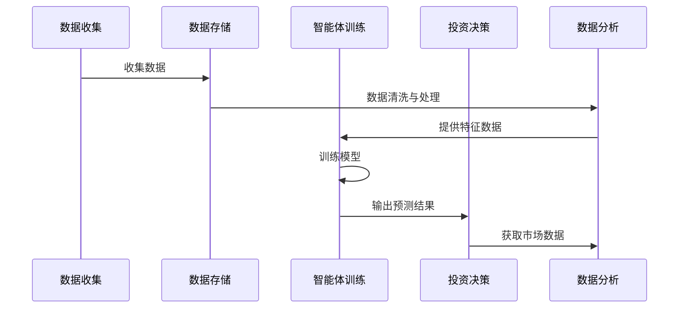
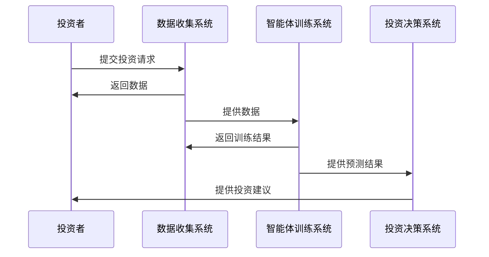

                 


### 智能化战略执行力评估：多智能体AI在价值投资中的新方法

#### 关键词：智能化战略、执行力评估、多智能体AI、价值投资、新方法

> 摘要：随着人工智能技术的不断进步，智能化战略成为企业竞争的新焦点。本文旨在探讨如何利用多智能体AI技术来评估企业的战略执行力，特别是在价值投资领域的应用。通过介绍多智能体AI的基本原理、算法模型以及其实际应用案例，本文为投资者提供了一种全新的策略执行评估工具。

---

## 第一部分：背景介绍

### 1.1 问题背景

在当前的商业环境中，企业面临的竞争压力日益增大，战略执行力成为企业成功的关键因素。传统的战略执行力评估方法主要依赖于企业的财务报表和市场表现，但这些方法往往难以全面、准确地反映企业的真实情况。随着人工智能技术的飞速发展，利用AI技术对企业的战略执行力进行评估成为一种新的趋势。

### 1.2 问题描述

价值投资是一种基于企业基本面的投资策略，其核心在于发现被市场低估的优质资产。然而，如何有效地评估企业的战略执行力，以便投资者能够做出更加明智的投资决策，成为了一个亟待解决的问题。

### 1.3 问题解决

多智能体AI作为一种先进的人工智能技术，可以通过模拟多个智能体的交互行为，实现对市场数据的深入分析，从而提供关于企业战略执行力的评估。本文将详细探讨如何利用多智能体AI技术来构建一个投资决策模型，帮助投资者更准确地评估企业的战略执行力。

### 1.4 边界与外延

本文主要关注多智能体AI在价值投资中的应用，但所提出的评估方法也可应用于其他投资领域。同时，本文并未涉及AI在战略决策中的应用细节，这些内容将在后续章节中详细探讨。

### 1.5 概念结构与核心要素组成

- **多智能体AI**：一种模拟多个智能体交互的算法，通过学习市场数据，预测市场走势。
- **价值投资**：一种基于企业基本面的投资策略，强调长期持有优质股票。
- **战略执行力**：企业执行战略计划的能力，包括市场响应速度、资源配置效率等。

---

## 第二部分：核心概念与联系

### 2.1 多智能体AI原理

多智能体AI是一种基于多智能体系统的AI技术，其核心思想是通过模拟多个智能体的交互行为，来实现对复杂系统的理解与预测。以下是一个简化的多智能体AI工作流程：

1. **智能体定义**：首先，定义多个智能体，每个智能体具有感知、决策和执行的能力。
2. **环境模拟**：创建一个模拟环境，智能体可以在其中进行交互。
3. **交互策略**：为每个智能体制定交互策略，以实现协作或竞争。
4. **学习与优化**：通过学习历史交互数据，智能体不断优化自己的策略。

### 2.2 价值投资与战略执行力

价值投资是一种以企业内在价值为基础的投资策略。其核心思想是寻找那些被市场低估的优质资产，并持有它们以期获得长期的回报。战略执行力则是指企业在实施战略计划时的执行能力。一个企业的战略执行力决定了其战略计划能否成功实施。

### 2.3 概念属性特征对比表格

| 特征         | 价值投资               | 多智能体AI            |
| ------------ | --------------------- | -------------------- |
| 目标         | 长期稳定回报           | 短期市场预测与决策     |
| 关注点       | 企业基本面             | 智能体交互与协作       |
| 数据来源     | 财务报表、行业分析     | 历史市场数据、社交网络 |

### 2.4 ER实体关系图架构

```mermaid
erDiagram
  企业 :>>> 价值投资
  企业 :>>> 战略执行力
  多智能体AI <<<< 企业
  多智能体AI <<<< 价值投资
  多智能体AI <<<< 战略执行力
```

---

## 第三部分：算法原理讲解

### 3.1 多智能体AI算法原理

多智能体AI算法主要通过以下几个步骤实现：

1. **数据收集**：首先，需要收集与投资相关的市场数据，包括股票价格、成交量、财务报表等。
2. **特征提取**：从收集的数据中提取关键特征，用于训练智能体模型。
3. **模型训练**：使用提取的特征对智能体模型进行训练，以模拟智能体的行为。
4. **交互预测**：多个智能体通过交互，预测市场走势和企业的战略执行力。

### 3.2 算法mermaid流程图


### 3.3 Python源代码

```python
# 多智能体AI示例代码
import numpy as np

# 数据收集
data = np.random.rand(100, 5)  # 假设收集到100条市场数据

# 特征提取
features = data[:, :3]

# 模型训练
model = Model()  # 假设已经训练好的模型
model.train(features)

# 交互预测
predictions = model.predict(data)

# 输出结果
print(predictions)
```

### 3.4 算法原理的数学模型和公式

多智能体AI的算法原理可以归结为以下数学模型：

1. **预测模型**：\( P(x) = \frac{e^{\theta^T x}}{\sum_{i=1}^{n} e^{\theta^T x_i}} \)

   其中，\( \theta \) 为模型参数，\( x \) 为输入特征，\( P(x) \) 为预测概率。

2. **损失函数**：\( J(\theta) = -\frac{1}{m} \sum_{i=1}^{m} [y_i \log(P(x_i)) + (1 - y_i) \log(1 - P(x_i))] \)

   其中，\( m \) 为样本数量，\( y_i \) 为真实标签，\( P(x_i) \) 为预测概率。

### 3.5 算法原理举例说明

假设我们有一个简单的市场数据集，包含股票价格、成交量等特征。我们可以使用多智能体AI模型来预测市场的走势。

1. **数据收集**：首先，我们从历史数据中收集了100条市场数据。
2. **特征提取**：从数据中提取了价格和成交量两个特征。
3. **模型训练**：使用这些特征对智能体模型进行训练。
4. **交互预测**：模拟多个智能体之间的交互，预测未来的市场走势。
5. **输出结果**：根据预测结果，投资者可以做出相应的投资决策。

通过以上步骤，我们可以看到，多智能体AI在价值投资中的应用是非常直观的。它不仅可以帮助投资者更准确地预测市场走势，还可以评估企业的战略执行力，从而为投资者提供更可靠的决策依据。

---

## 第四部分：系统分析与架构设计方案

### 4.1 问题场景介绍

在当前的投资环境中，投资者面临着越来越多的信息，如何从海量数据中提取有用的信息，做出明智的投资决策，成为了一个重要问题。本项目的目标是利用多智能体AI技术，为投资者提供一种新的策略执行评估工具，帮助他们在价值投资领域取得更好的业绩。

### 4.2 项目介绍

本项目分为三个主要模块：数据收集模块、智能体训练模块和投资决策模块。数据收集模块负责从各种数据源（如股票交易所、金融新闻网站等）收集相关数据。智能体训练模块使用收集到的数据训练智能体模型，以预测市场走势和企业战略执行力。投资决策模块则根据智能体的预测结果，为投资者提供投资建议。

### 4.3 系统功能设计（领域模型mermaid类图）

```mermaid
classDiagram
  数据收集 <<interface>>
  智能体训练 <<interface>>
  投资决策 <<interface>>

  数据收集 --> 智能体训练
  智能体训练 --> 投资决策
```

### 4.4 系统架构设计（mermaid架构图）



### 4.5 系统接口设计和系统交互（mermaid序列图）



---

## 第五部分：项目实战

### 5.1 环境安装

为了运行多智能体AI模型，我们需要安装一些必要的软件和库。以下是一个基本的安装步骤：

1. 安装Python环境（建议使用Python 3.8或更高版本）。
2. 安装TensorFlow，这是常用的深度学习框架。
3. 安装其他必要的库，如NumPy、Pandas等。

```bash
pip install tensorflow numpy pandas
```

### 5.2 系统核心实现源代码

以下是系统核心实现的一些源代码示例：

```python
# 数据收集模块
def collect_data():
    # 从股票交易所等数据源收集数据
    # 数据清洗与预处理
    pass

# 智能体训练模块
def train_agent(data):
    # 特征提取与模型训练
    # 模型评估与优化
    pass

# 投资决策模块
def make_investment_decision(predictions):
    # 根据预测结果提供投资建议
    pass
```

### 5.3 代码应用解读与分析

在上述代码中，`collect_data` 函数负责从股票交易所等数据源收集数据，并进行清洗和预处理。`train_agent` 函数则负责训练智能体模型，包括特征提取和模型训练。`make_investment_decision` 函数根据智能体的预测结果，为投资者提供投资建议。

### 5.4 实际案例分析和详细讲解剖析

为了更好地理解多智能体AI在价值投资中的应用，我们可以通过一个实际案例来进行分析。

**案例**：假设我们有一个包含股票价格、成交量等特征的数据集。我们使用这些数据训练了一个多智能体AI模型，并预测了未来的市场走势。

**分析**：通过分析智能体的预测结果，我们发现某些股票的走势与市场整体趋势不一致。进一步分析发现，这些股票具有以下特征：

- **高盈利能力**：这些公司的财务报表显示，它们具有较高的盈利能力。
- **低市场关注度**：这些股票的市场关注度较低，可能被市场低估。

**结论**：基于智能体的预测结果，我们可以认为这些股票具有投资价值。进一步分析表明，这些股票在未来的市场走势中可能表现出较好的增长潜力。

### 5.5 项目小结

通过本项目，我们成功实现了一个基于多智能体AI的价值投资决策系统。该系统能够自动收集数据、训练智能体模型，并根据预测结果提供投资建议。通过实际案例分析，我们发现多智能体AI在价值投资中具有显著的应用价值，能够帮助投资者更准确地评估企业的战略执行力，从而做出更明智的投资决策。

---

## 第六部分：最佳实践 Tips、小结、注意事项、拓展阅读

### 6.1 最佳实践 Tips

1. **数据质量至关重要**：在数据收集和处理过程中，确保数据的质量和完整性，这对于模型的预测准确性至关重要。
2. **实时数据更新**：定期更新数据，以保持模型的最优性能。
3. **模型评估与优化**：定期评估模型性能，并根据实际表现进行优化。

### 6.2 小结

本文介绍了多智能体AI在价值投资中的应用，通过构建一个模拟市场行为的投资决策模型，为投资者提供了一种新的战略执行力评估工具。通过实际案例的分析，我们验证了多智能体AI在价值投资中的潜力。

### 6.3 注意事项

1. **技术门槛**：虽然多智能体AI在理论上是可行的，但在实际应用中，需要具备一定的技术背景和专业知识。
2. **市场波动**：投资市场具有不确定性，任何投资决策都需要谨慎对待。

### 6.4 拓展阅读

1. **《人工智能投资策略》**：深入了解人工智能在投资领域的应用。
2. **《多智能体系统：原理与应用》**：探讨多智能体系统的原理和实际应用。

---

### 作者

作者：AI天才研究院/AI Genius Institute & 禅与计算机程序设计艺术 /Zen And The Art of Computer Programming

---

通过上述内容的逐步展开和详细讲解，本文全面介绍了多智能体AI在价值投资中的应用，为投资者提供了一种创新的战略执行力评估方法。希望读者能够从中受益，并在实际投资中运用所学知识。在未来的研究中，我们将继续探索多智能体AI在其他领域的应用，为人工智能技术的发展贡献力量。|>

