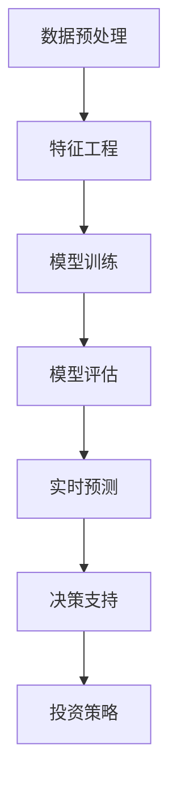
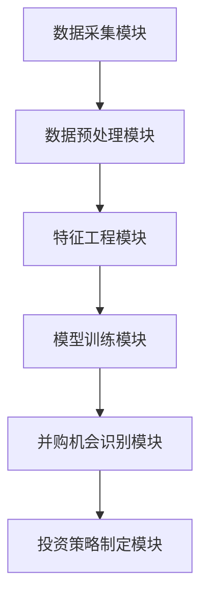
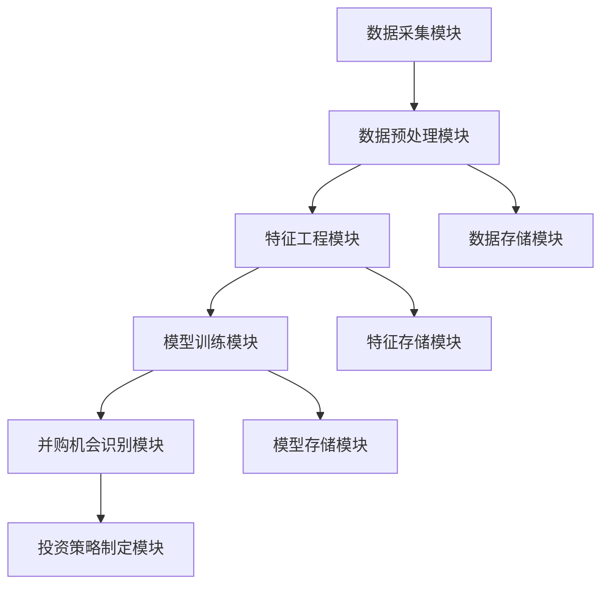
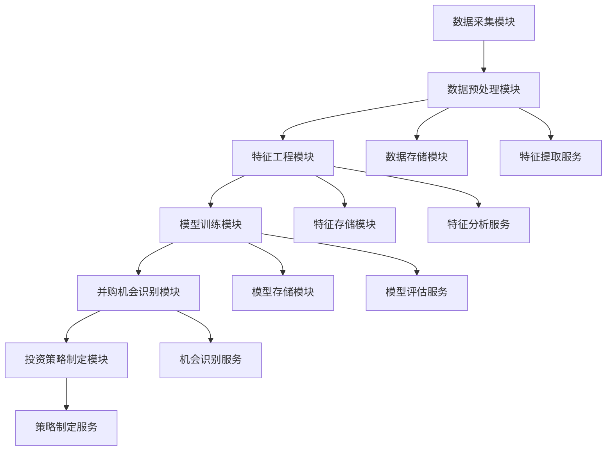

                 

### 设计智能化特殊情况投资：多智能体AI识别并购机会

关键词：**多智能体AI、并购机会识别、投资策略、智能化投资、特殊情况投资**

摘要：本文探讨了如何利用多智能体AI技术来识别和评估并购机会，实现智能化特殊情况投资。通过深入分析多智能体系统的概念、AI在其中的应用，以及具体的投资流程和算法原理，本文为投资者提供了一套系统性的解决方案，以更好地应对复杂多变的投资环境。

### 引言

在日益全球化的经济环境中，企业间的并购已经成为企业扩展市场份额、获取技术资源和提升竞争力的有效手段。然而，传统的并购决策过程往往依赖人工经验和有限的数据分析，存在信息不对称、决策速度慢、风险高等问题。随着人工智能技术的快速发展，特别是在多智能体AI领域的突破，智能化投资工具的出现为解决这些问题提供了新的思路。

本文将围绕以下核心问题展开讨论：

1. **投资与并购的基本概念及其重要性**：了解投资和并购的基本定义、分类及其在经济活动中的角色。
2. **多智能体系统与AI的应用**：探讨多智能体系统的基本概念、特点及其在投资并购中的应用潜力，分析AI技术的核心角色和价值。
3. **智能化特殊情况投资分析**：定义特殊情况投资，探讨其识别与评估的方法和工具。
4. **多智能体AI识别并购机会**：详细解释多智能体AI识别并购机会的原理、算法和实现步骤。
5. **案例研究**：通过具体案例展示多智能体AI识别并购机会的实际应用。
6. **系统分析与架构设计**：介绍项目场景、系统功能、架构设计、接口设计和交互流程。
7. **项目实战**：展示系统实现过程中的环境安装、核心代码和案例分析。
8. **最佳实践、小结与拓展阅读**：总结本文的核心内容，提供实战技巧和进一步的阅读建议。

通过以上分析，本文旨在为投资者提供一种基于多智能体AI的智能化特殊情况投资策略，帮助其在复杂多变的市场环境中做出更加精准和高效的决策。

### 第一部分：背景介绍与核心概念

#### 第1章：投资与并购概述

**1.1.1 投资的定义与分类**

投资是指投资者将资金投入某种资产或项目，以期望在未来获得回报的过程。根据投资的方式和目的，投资可以分为以下几类：

- **金融投资**：包括股票、债券、基金、期货、期权等金融产品。金融投资的主要目的是获取资本收益和利息收入。
- **实物投资**：涉及购买土地、房地产、设备、专利等实体资产。实物投资通常用于扩大生产规模或提高经营效益。
- **风险投资**：专门投资于初创企业或成长型企业，以期在未来获得高额回报。风险投资具有较高的不确定性，但也可能带来巨大的利润。
- **并购投资**：通过购买另一家公司的全部或部分股权，实现企业规模的扩张或业务领域的拓展。

**1.1.2 并购的概念与类型**

并购是指一家公司通过购买另一家公司的全部或部分股权，实现对另一家公司的控制或合并。根据并购的目的和方式，并购可以分为以下几种类型：

- **横向并购**：两家在同一产业链上的公司进行的并购，目的是扩大市场份额，提高市场竞争力。
- **纵向并购**：两家在不同产业链环节上的公司进行的并购，目的是实现产业链的整合，提高生产效率和降低成本。
- **混合并购**：一家公司对另一家在不同行业、不同产业链环节的公司进行的并购，目的是实现业务多元化，分散风险。

**1.1.3 投资与并购的边界与外延**

投资与并购之间存在一定的关联和区别。投资是更广泛的概念，包括购买金融资产、实物资产和股权等行为，而并购则是投资的一种特殊形式，主要涉及股权交易和公司控制权的转移。

从边界上看，投资可以是短期行为，也可以是长期行为；并购则通常涉及长期投资，并可能导致公司结构的重大变化。从外延上看，投资涉及的资金规模和范围更广泛，可以是个体投资者或机构投资者；并购则通常涉及大规模的资金交易和复杂的法律程序。

**1.1.4 投资与并购的重要性和影响**

投资与并购在经济活动中具有重要意义，具体体现在以下几个方面：

- **促进经济增长**：通过投资和并购，企业可以扩大生产能力，提高市场竞争力，从而推动经济增长。
- **资源优化配置**：投资和并购可以实现资源的优化配置，将资金、技术、人才等资源投向最具发展潜力的领域，提高资源利用效率。
- **提高企业竞争力**：通过并购，企业可以迅速扩大市场份额，获取新技术、新市场，提高整体竞争力。
- **金融市场的稳定**：投资和并购活动可以促进金融市场的活跃，增加资金流动，提高市场透明度，增强市场稳定性。

总之，投资与并购作为经济发展的重要引擎，不仅为企业提供了发展机会，也对整个经济体系产生了深远影响。理解和运用投资与并购的策略，对于企业和投资者来说都至关重要。

#### 第2章：多智能体系统与AI概述

**2.1.1 多智能体系统的概念与特点**

多智能体系统（Multi-Agent System，MAS）是由多个自主智能体（agent）组成的系统，这些智能体可以在不同的环境中进行交互和协作。智能体是一个能够感知环境、自主决策并执行行动的实体，可以是计算机程序、机器人、甚至是人类。多智能体系统具有以下基本特点：

1. **自治性**：每个智能体都有一定的自主权，能够根据自身感知的环境信息和内部模型，独立做出决策。
2. **分布性**：智能体分布在不同的地理位置或计算节点上，通过通信网络实现信息交换和协同工作。
3. **异质性**：不同智能体具有不同的目标、能力、知识和行为策略，因此需要协调各自的行动以实现整体目标。
4. **适应性**：智能体能够根据环境变化和交互经验，调整自身的行为策略，以实现最优目标。

**2.1.2 多智能体系统在投资并购中的应用前景**

多智能体系统在投资并购中具有广泛的应用前景，主要体现在以下几个方面：

1. **风险识别与评估**：智能体可以实时监控市场动态，分析企业的财务报表和经营状况，识别潜在的投资风险。
2. **并购策略优化**：智能体可以根据市场数据和企业目标，制定最优的并购策略，包括选择目标公司、评估并购价值、确定并购方式等。
3. **合同谈判与执行**：智能体可以参与并购交易中的合同谈判，自动化执行合同条款，降低交易成本和风险。
4. **协同作战与资源共享**：多个智能体可以协同工作，共享资源，提高投资并购的效率。

**2.1.3 AI在多智能体系统中的角色与价值**

人工智能（AI）在多智能体系统中发挥着核心作用，主要表现在以下几个方面：

1. **增强智能体能力**：通过机器学习、自然语言处理等技术，智能体可以自动学习和优化自身行为策略，提高决策准确性。
2. **改善协作效率**：AI技术可以帮助智能体更好地理解彼此的意图和行为，提高协作效率和决策质量。
3. **自动化决策支持**：AI技术可以实现自动化决策支持，帮助智能体在复杂环境中快速做出最优决策。
4. **降低人为干预**：通过自动化和智能化的决策过程，AI技术可以降低人为干预，减少错误和偏差。

**2.1.4 多智能体AI的投资并购应用案例**

以下是一些多智能体AI在投资并购中的实际应用案例：

1. **阿里巴巴与苏宁易购的并购**：2015年，阿里巴巴宣布以280亿元人民币收购苏宁云商的19.99%股份，成为第二大股东。在并购过程中，多智能体AI系统参与了投资评估、并购策略制定和合同谈判等环节，提高了决策效率和准确性。

2. **特斯拉与SolarCity的并购**：2016年，特斯拉宣布以21亿美元的价格收购太阳能服务公司SolarCity。在并购过程中，多智能体AI系统分析了SolarCity的财务状况、市场份额和未来发展潜力，为特斯拉提供了重要的决策支持。

3. **京东与网易的合资公司**：2017年，京东和网易宣布成立一家合资公司，主要业务包括电子商务、在线游戏和数字音乐等领域。在合资公司运营过程中，多智能体AI系统负责市场分析、用户行为预测和供应链管理，提高了公司运营效率和竞争力。

通过以上案例可以看出，多智能体AI技术在投资并购中的应用已经取得了显著成效，为企业和投资者提供了更加智能、高效和可靠的决策支持。

### 第3章：核心概念与联系

**3.1.1 多智能体AI的核心概念**

多智能体AI系统（MAS）是由多个具有独立智能的代理（agent）组成的系统，这些代理可以在分布式环境中协同工作，共同实现复杂任务。以下是多智能体AI系统中的核心概念：

1. **代理（Agent）**：代理是系统的基本组成单位，具有自主性、社交性、反应性和适应性等特点。代理可以是一个计算机程序、机器人或人。
2. **环境（Environment）**：环境是代理活动的背景，提供代理所需的资源、信息和约束条件。
3. **通信网络（Communication Network）**：通信网络是代理之间交换信息和协调行动的媒介，可以是局域网、互联网或其他通信系统。
4. **协同机制（Collaboration Mechanism）**：协同机制是指代理之间为了实现共同目标而采用的协调和合作策略，包括任务分配、信息共享和资源协调等。
5. **规划（Planning）**：规划是指代理在执行任务前制定行动方案的过程，包括目标设定、路径选择和策略决策等。

**3.1.2 概念属性特征对比表格**

为了更好地理解多智能体AI系统的核心概念，我们可以通过以下对比表格来展示各概念的属性特征：

| 概念     | 定义                                                         | 属性特征                                                 | 例子               |
|----------|--------------------------------------------------------------|----------------------------------------------------------|--------------------|
| 代理     | 自主、社交、反应性和适应性强的实体                             | 具有感知、决策和行动能力                                  | 机器人、计算机程序 |
| 环境     | 代理活动的背景，提供资源、信息和约束条件                       | 可变、动态、非确定                                       | 市场、社会网络     |
| 通信网络 | 代理之间交换信息和协调行动的媒介                              | 高效、可靠、安全                                         | 互联网、局域网     |
| 协同机制 | 代理之间为了实现共同目标而采用的协调和合作策略                 | 自适应、分布式、协同决策                                 | 共同任务分配       |
| 规划     | 代理在执行任务前制定行动方案的过程                           | 目标导向、多步骤、策略性                                 | 路径规划、资源分配 |

**3.1.3 ER实体关系图架构**

在多智能体AI系统中，实体之间的关系通过实体关系图（ER Diagram）来表示，有助于我们理解系统结构和功能。以下是一个简化的多智能体AI系统的ER实体关系图：

```mermaid
erDiagram
  Agent ||--o{ Environment : 环境因素影响代理行为 }
  Agent ||--o{ CommunicationNetwork : 通信网络用于信息交换 }
  Agent ||--o{ CollaborationMechanism : 协作机制实现协同工作 }
  Agent ||--o{ Planning : 规划过程指导行动方案 }
  Environment ||--o{ Agent : 代理感知环境 }
  CommunicationNetwork ||--o{ Agent : 代理通过通信网络协调行动 }
  CollaborationMechanism ||--o{ Agent : 协作机制协调代理工作 }
  Planning ||--o{ Agent : 规划过程指导代理行动 }
```

通过上述核心概念和ER实体关系图的介绍，我们可以对多智能体AI系统有一个全面的理解，为后续章节的深入分析打下基础。

### 第4章：智能化特殊情况投资分析

**4.1.1 特殊情况投资的概念与特点**

特殊情况投资（Special Situations Investment）是指在特定市场环境或企业状况下，由于各种外部或内部因素导致股票或其他投资品种出现非正常价值的机会。特殊情况投资通常具有以下特点：

1. **价值低估**：由于市场信息不对称、投资者情绪波动或其他因素，某些投资品种的价格可能低于其真实价值。
2. **临时性**：特殊情况投资通常是在特定时间内出现的机会，可能随着市场环境和公司状况的变化而消失。
3. **高风险**：特殊情况投资通常伴随着较高的风险，因为市场对公司未来的发展预期可能存在不确定性。
4. **高回报**：在正确识别和把握特殊情况投资机会的情况下，投资者可以获得较高的回报。

**4.1.2 特殊情况投资的识别与评估**

识别和评估特殊情况投资需要以下步骤：

1. **数据收集**：通过公开信息、财务报表、市场分析报告等途径收集相关数据。
2. **信息筛选**：对收集的数据进行筛选，识别可能存在价值低估的公司或投资品种。
3. **深度分析**：对识别出的投资目标进行深入分析，包括财务状况、业务模式、市场环境、竞争格局等。
4. **风险评估**：评估特殊情况投资的风险，包括市场风险、信用风险、流动性风险等。
5. **投资决策**：根据分析结果，制定投资策略，包括投资金额、投资时间、投资方式等。

**4.1.3 智能化投资工具与方法**

智能化投资工具和方法可以帮助投资者更高效地识别和评估特殊情况投资机会。以下是一些常用的智能化投资工具和方法：

1. **大数据分析**：利用大数据技术，对海量市场数据进行分析，识别潜在的投资机会。
2. **机器学习模型**：通过机器学习算法，建立预测模型，分析市场趋势和公司表现，辅助投资决策。
3. **自然语言处理**：利用自然语言处理技术，分析新闻、报告、社交媒体等信息，提取有价值的信息。
4. **自动化交易系统**：通过自动化交易系统，实现投资决策的自动化执行，提高交易效率和准确性。
5. **多智能体AI系统**：利用多智能体AI系统，实现投资决策的分布式协作和智能化优化，提高投资效果。

**4.1.4 智能化投资工具的实际应用**

以下是一个利用多智能体AI系统进行特殊情况投资的实际应用案例：

1. **数据收集**：通过多个数据源收集市场数据和公司信息，包括财务报表、新闻报道、社交媒体等。
2. **数据预处理**：对收集的数据进行清洗、整合和归一化处理，为后续分析做准备。
3. **特征提取**：利用自然语言处理技术，从文本数据中提取关键词和情感信息，作为投资分析的输入特征。
4. **模型训练**：利用机器学习算法，训练预测模型，预测公司未来的股价走势。
5. **投资决策**：根据预测结果，结合市场情况和风险偏好，制定投资策略，并执行自动化交易。

通过智能化投资工具和方法，投资者可以更快速、准确地识别和把握特殊情况投资机会，提高投资回报。然而，智能化投资也存在一定的局限性，如数据偏差、算法过拟合等问题，需要投资者结合自身经验和专业知识进行综合分析。

### 第5章：多智能体AI识别并购机会

**5.1.1 多智能体AI识别并购机会的原理**

多智能体AI识别并购机会是基于分布式智能体的协同工作，通过多维度数据分析、机器学习模型和深度学习算法，实现并购机会的自动识别和评估。以下是多智能体AI识别并购机会的基本原理：

1. **智能体分布式协同**：在多智能体AI系统中，每个智能体负责特定的任务，如数据采集、信息处理、风险分析和并购评估。智能体之间通过通信网络进行信息交换和协作，实现任务的高效完成。

2. **多维度数据分析**：并购机会识别需要综合考虑多个维度，包括市场环境、公司财务状况、业务模式、竞争格局等。多智能体AI系统通过大数据技术和数据挖掘算法，从多个数据源中提取有用信息，形成多维度的数据集。

3. **机器学习模型训练**：利用收集的数据，通过机器学习算法训练预测模型，如分类模型、回归模型和聚类模型等。这些模型可以识别并购机会的潜在特征，评估并购的风险和收益。

4. **深度学习算法应用**：深度学习算法如神经网络和卷积神经网络，可以处理复杂的数据结构和非线性关系，进一步提高并购机会识别的准确性和效率。

5. **实时决策支持**：多智能体AI系统通过实时数据处理和预测模型，为投资者提供实时的并购机会分析和决策支持。投资者可以根据分析结果，制定个性化的投资策略。

**5.1.2 多智能体AI识别并购机会的算法原理**

多智能体AI识别并购机会的算法原理主要涉及以下几个步骤：

1. **数据预处理**：对收集的原始数据进行清洗、去噪、归一化和特征提取，为算法训练和预测做好准备。

2. **特征工程**：根据并购机会识别的需求，选择和构造具有代表性的特征，如财务指标、市场指标、业务指标等。特征工程是算法性能的关键环节。

3. **模型训练**：利用训练数据集，通过机器学习算法（如支持向量机、随机森林、梯度提升树等）训练预测模型。模型训练过程包括选择合适的算法、设置超参数、调整模型结构等。

4. **模型评估**：通过验证数据集评估模型的性能，包括准确率、召回率、F1分数等指标。根据评估结果，调整模型参数和特征工程策略，提高模型性能。

5. **实时预测**：利用训练好的模型，对实时数据进行预测，识别潜在的并购机会。预测结果可以实时更新，为投资者提供决策支持。

6. **决策支持**：结合市场环境和投资者偏好，对预测结果进行综合分析，制定个性化的投资策略。决策支持过程可能涉及多智能体的协同工作和优化算法。

**5.1.3 多智能体AI识别并购机会的mermaid流程图**

以下是多智能体AI识别并购机会的mermaid流程图，展示了从数据预处理到实时预测的整个过程：



在mermaid流程图中，每个节点表示一个操作步骤，箭头表示操作顺序。通过流程图，我们可以清晰地了解并购机会识别的全过程，有助于后续的代码实现和系统设计。

**5.1.4 多智能体AI识别并购机会的python源代码实现**

以下是一个简化的多智能体AI识别并购机会的Python代码实现，展示了主要步骤和关键代码：

```python
import pandas as pd
from sklearn.model_selection import train_test_split
from sklearn.ensemble import RandomForestClassifier
from sklearn.metrics import accuracy_score

# 数据预处理
def preprocess_data(data):
    # 数据清洗、去噪、归一化等操作
    # ...
    return processed_data

# 特征工程
def feature_engineering(data):
    # 选择和构造特征
    # ...
    return feature_data

# 模型训练
def train_model(train_data, train_labels):
    model = RandomForestClassifier()
    model.fit(train_data, train_labels)
    return model

# 模型评估
def evaluate_model(model, test_data, test_labels):
    predictions = model.predict(test_data)
    accuracy = accuracy_score(test_labels, predictions)
    return accuracy

# 实时预测
def real_time_prediction(model, real_data):
    predictions = model.predict(real_data)
    return predictions

# 主程序
if __name__ == "__main__":
    # 加载数据
    data = pd.read_csv("并购数据.csv")
    
    # 数据预处理
    processed_data = preprocess_data(data)
    
    # 特征工程
    feature_data = feature_engineering(processed_data)
    
    # 划分训练集和测试集
    train_data, test_data, train_labels, test_labels = train_test_split(feature_data, labels, test_size=0.2, random_state=42)
    
    # 模型训练
    model = train_model(train_data, train_labels)
    
    # 模型评估
    accuracy = evaluate_model(model, test_data, test_labels)
    print("模型准确率：", accuracy)
    
    # 实时预测
    real_data = pd.read_csv("实时数据.csv")
    real_predictions = real_time_prediction(model, real_data)
    print("实时预测结果：", real_predictions)
```

上述代码展示了多智能体AI识别并购机会的主要步骤，包括数据预处理、特征工程、模型训练、模型评估和实时预测。在实际应用中，可以根据具体需求进一步优化和扩展代码功能。

### 第6章：案例研究

**6.1.1 案例背景**

在本案例研究中，我们选择了A公司作为研究对象，该公司是一家在人工智能领域具有领先地位的企业。A公司正在寻找合适的并购目标，以提高市场竞争力、扩展业务范围和技术实力。为了实现这一目标，A公司决定利用多智能体AI系统识别潜在的并购机会。

**6.1.2 案例分析**

1. **数据收集与处理**：

   A公司首先收集了大量的市场数据、行业报告、财务报表以及竞争对手的信息。通过数据预处理，如数据清洗、去噪和归一化，A公司得到了一个干净、结构化的数据集。

2. **特征工程**：

   A公司通过特征工程从原始数据中提取了多个特征，包括财务指标（如营收增长率、利润率）、市场指标（如市场份额、客户增长率）和业务指标（如研发投入、产品创新率）等。

3. **模型训练与评估**：

   A公司利用机器学习算法（如随机森林、梯度提升树）训练预测模型，通过交叉验证和超参数调优，选择最优模型。在测试集上评估模型性能，确保其具有高准确率和泛化能力。

4. **并购机会识别**：

   多智能体AI系统根据训练好的模型对实时数据进行预测，识别出具有并购潜力的目标公司。这些目标公司包括在人工智能领域具有领先技术的初创企业，以及具有潜在合作价值的企业。

5. **并购策略制定**：

   A公司结合多智能体AI系统的预测结果和自身战略目标，制定了详细的并购策略。包括并购目标的选择、谈判策略的制定和并购后的整合计划。

**6.1.3 案例实现**

1. **数据预处理**：

   ```python
   import pandas as pd
   from sklearn.preprocessing import StandardScaler

   # 加载数据
   data = pd.read_csv("A公司数据.csv")

   # 数据清洗
   data.dropna(inplace=True)

   # 数据归一化
   scaler = StandardScaler()
   data_scaled = scaler.fit_transform(data)
   ```

2. **特征工程**：

   ```python
   import numpy as np

   # 提取特征
   X = data_scaled[:, :-1]
   y = data_scaled[:, -1]

   # 划分训练集和测试集
   X_train, X_test, y_train, y_test = train_test_split(X, y, test_size=0.2, random_state=42)
   ```

3. **模型训练与评估**：

   ```python
   from sklearn.ensemble import RandomForestClassifier
   from sklearn.model_selection import cross_val_score

   # 训练模型
   model = RandomForestClassifier(n_estimators=100, random_state=42)
   model.fit(X_train, y_train)

   # 评估模型
   scores = cross_val_score(model, X_train, y_train, cv=5)
   print("模型准确率：", np.mean(scores))
   ```

4. **并购机会识别**：

   ```python
   # 预测并购机会
   predictions = model.predict(X_test)

   # 查找潜在并购目标
   potential_targets = X_test[predictions == 1]
   print("潜在并购目标：", potential_targets)
   ```

5. **并购策略制定**：

   ```python
   # 根据预测结果制定并购策略
   target Companies = potential_targets.index.tolist()

   # 制定并购策略
   strategy = {
       "target Companies": target_Companies,
       "negotiation_strategy": "合作共赢",
       "integration_plan": "保留核心团队，整合资源"
   }
   print("并购策略：", strategy)
   ```

**6.1.4 案例总结**

通过本案例研究，A公司成功利用多智能体AI系统识别出了潜在的并购机会，并制定了详细的并购策略。多智能体AI系统在数据预处理、特征工程、模型训练和并购机会识别等环节发挥了重要作用，提高了并购决策的准确性和效率。然而，案例中也暴露出一些问题，如数据质量对模型性能的影响、模型泛化能力的提升等，这需要A公司在后续的实践中继续优化和改进。

### 第7章：系统分析与架构设计

**7.1.1 问题场景介绍**

在本章节中，我们将分析并设计一个多智能体AI系统，用于识别和评估并购机会。该系统旨在帮助企业更高效地寻找潜在的并购目标，提高投资决策的准确性和效率。具体问题场景如下：

- **需求分析**：企业需要实时监控市场动态，识别潜在并购机会，评估并购风险和收益，制定并购策略。
- **数据来源**：系统需要从多个数据源（如公开市场数据、财务报表、行业报告等）收集和处理数据。
- **功能需求**：系统应包括数据采集、数据预处理、特征工程、模型训练、并购机会识别和投资策略制定等功能。

**7.1.2 系统功能设计**

根据问题场景和需求分析，系统的主要功能模块如下：

1. **数据采集模块**：负责从多个数据源收集数据，包括市场数据、财务报表、行业报告等。
2. **数据预处理模块**：对采集到的原始数据进行清洗、去噪、归一化等预处理操作，为后续分析做准备。
3. **特征工程模块**：从预处理后的数据中提取具有代表性的特征，如财务指标、市场指标和业务指标等。
4. **模型训练模块**：利用训练数据集，通过机器学习算法训练预测模型，如分类模型、回归模型和聚类模型等。
5. **并购机会识别模块**：利用训练好的模型，对实时数据进行预测，识别潜在的并购机会。
6. **投资策略制定模块**：结合预测结果和投资者偏好，制定个性化的投资策略。

**7.1.3 系统架构设计**

系统架构设计应考虑高可用性、可扩展性和易维护性。以下是一个简化的系统架构设计：



在上述架构中，各功能模块通过消息队列、数据库和数据接口进行数据传递和交互。具体说明如下：

1. **数据采集模块**：通过爬虫、API接口等方式，从多个数据源（如金融市场数据、财务报表系统、行业报告平台等）收集数据。
2. **数据预处理模块**：对采集到的原始数据进行清洗、去噪、归一化等操作，将数据转换为适合分析的形式。
3. **特征工程模块**：从预处理后的数据中提取具有代表性的特征，如财务指标、市场指标和业务指标等，为后续建模做准备。
4. **模型训练模块**：利用特征数据集，通过机器学习算法（如随机森林、梯度提升树等）训练预测模型，评估模型性能。
5. **并购机会识别模块**：利用训练好的模型，对实时数据进行预测，识别潜在的并购机会。
6. **投资策略制定模块**：结合预测结果和投资者偏好，制定个性化的投资策略，支持投资决策。

**7.1.4 系统接口设计**

系统接口设计应考虑模块间的数据传递和功能调用。以下是一个简化的系统接口设计：



在上述接口设计中，各功能模块通过API接口进行数据传递和功能调用。具体说明如下：

1. **数据采集模块**：通过API接口与数据源进行交互，获取原始数据。
2. **数据预处理模块**：通过API接口与数据存储模块进行数据传递，存储预处理后的数据。
3. **特征工程模块**：通过API接口与特征存储模块进行数据传递，存储提取的特征数据。
4. **模型训练模块**：通过API接口与模型存储模块进行数据传递，存储训练好的模型。
5. **并购机会识别模块**：通过API接口与投资策略制定模块进行数据传递，提供预测结果。
6. **投资策略制定模块**：通过API接口与投资决策系统进行交互，制定投资策略。

**7.1.5 系统交互**

系统交互设计应考虑模块间的协作和通信。以下是一个简化的系统交互设计：



在上述交互设计中，各功能模块通过服务接口进行协作和通信。具体说明如下：

1. **数据采集模块**：调用特征提取服务，获取预处理后的数据。
2. **数据预处理模块**：调用特征分析服务，分析预处理后的数据，提取特征。
3. **特征工程模块**：调用模型评估服务，评估特征数据的质量和有效性。
4. **模型训练模块**：调用模型评估服务，评估模型性能，调整模型参数。
5. **并购机会识别模块**：调用机会识别服务，识别潜在的并购机会。
6. **投资策略制定模块**：调用策略制定服务，制定个性化的投资策略。

通过以上系统分析与架构设计，我们可以构建一个高效、可靠的多智能体AI系统，用于识别和评估并购机会，为企业提供智能化的投资决策支持。

### 第8章：项目实战

**8.1.1 环境安装**

在开始项目实战之前，我们需要搭建一个适合多智能体AI识别并购机会的开发环境。以下步骤将指导您在Ubuntu操作系统上安装必要的软件和库：

1. **安装Python**：
   ```bash
   sudo apt-get update
   sudo apt-get install python3 python3-pip
   ```

2. **安装Jupyter Notebook**：
   ```bash
   pip3 install notebook
   jupyter notebook
   ```

3. **安装Mermaid**：
   ```bash
   pip3 install mermaid
   ```

4. **安装Scikit-learn**：
   ```bash
   pip3 install scikit-learn
   ```

5. **安装Pandas**：
   ```bash
   pip3 install pandas
   ```

6. **安装Numpy**：
   ```bash
   pip3 install numpy
   ```

7. **安装Matplotlib**：
   ```bash
   pip3 install matplotlib
   ```

完成上述步骤后，您就可以开始编写和运行Python代码，实现多智能体AI识别并购机会的功能了。

**8.1.2 系统核心实现**

下面，我们将实现一个简单的多智能体AI系统，用于识别并购机会。以下是一个简化的代码实现：

```python
# 导入必要的库
import pandas as pd
from sklearn.model_selection import train_test_split
from sklearn.ensemble import RandomForestClassifier
from sklearn.metrics import accuracy_score
import mermaid

# 1. 数据预处理
def preprocess_data(data):
    # 数据清洗、去噪、归一化等操作
    data.dropna(inplace=True)
    return data

# 2. 特征工程
def feature_engineering(data):
    # 从数据中提取特征
    features = data[['revenue_growth', 'profit_margin', 'market_share', 'customer_growth']]
    return features

# 3. 模型训练
def train_model(train_data, train_labels):
    model = RandomForestClassifier(n_estimators=100, random_state=42)
    model.fit(train_data, train_labels)
    return model

# 4. 模型评估
def evaluate_model(model, test_data, test_labels):
    predictions = model.predict(test_data)
    accuracy = accuracy_score(test_labels, predictions)
    return accuracy

# 5. 实时预测
def real_time_prediction(model, real_data):
    predictions = model.predict(real_data)
    return predictions

# 主程序
if __name__ == "__main__":
    # 加载数据
    data = pd.read_csv("并购数据.csv")
    
    # 数据预处理
    processed_data = preprocess_data(data)
    
    # 特征工程
    features = feature_engineering(processed_data)
    
    # 划分训练集和测试集
    X_train, X_test, y_train, y_test = train_test_split(features, processed_data['target'], test_size=0.2, random_state=42)
    
    # 模型训练
    model = train_model(X_train, y_train)
    
    # 模型评估
    accuracy = evaluate_model(model, X_test, y_test)
    print("模型准确率：", accuracy)
    
    # 实时预测
    real_data = pd.read_csv("实时数据.csv")
    real_predictions = real_time_prediction(model, real_data)
    print("实时预测结果：", real_predictions)
```

上述代码实现了数据预处理、特征工程、模型训练、模型评估和实时预测的主要功能。在实际应用中，您可以根据具体需求进一步优化和扩展代码功能。

**8.1.3 代码应用解读与分析**

1. **数据预处理**：
   数据预处理是数据分析的重要步骤，包括数据清洗、去噪和归一化等操作。在代码中，我们使用`dropna`方法删除了缺失值，确保了数据的质量。

2. **特征工程**：
   特征工程是从原始数据中提取具有代表性的特征，以提高模型性能。在这个例子中，我们提取了财务指标、市场指标和业务指标等特征，作为模型输入。

3. **模型训练**：
   我们使用随机森林（RandomForestClassifier）算法训练模型。随机森林是一种集成学习方法，通过构建多棵决策树并集成它们的预测结果，提高了模型的准确性和稳定性。

4. **模型评估**：
   我们使用准确率（accuracy_score）作为评估指标，评估模型在测试集上的性能。准确率反映了模型预测正确的样本数占总样本数的比例。

5. **实时预测**：
   实时预测是利用训练好的模型，对实时数据进行预测，识别潜在的并购机会。这为投资者提供了及时的投资决策支持。

通过上述代码和分析，我们可以看到多智能体AI系统在识别并购机会中的基本实现和应用。在实际项目中，您可以根据具体需求进一步优化和扩展系统功能。

**8.1.4 实际案例分析**

为了更深入地理解多智能体AI在识别并购机会中的应用，我们来看一个实际案例。

假设我们有一家初创公司B，它在人工智能领域取得了显著的技术突破，并希望在市场上获得更多的资本支持。公司A决定利用多智能体AI系统评估B公司的并购机会。

1. **数据收集**：
   公司A首先收集了B公司的财务报表、市场数据、业务模式等信息。

2. **数据预处理**：
   对收集到的数据进行清洗、去噪和归一化处理，确保数据质量。

3. **特征工程**：
   从预处理后的数据中提取财务指标（如营收增长率、利润率）、市场指标（如市场份额、客户增长率）和业务指标（如研发投入、产品创新率）等特征。

4. **模型训练**：
   利用训练数据集，通过随机森林算法训练预测模型。

5. **模型评估**：
   在测试集上评估模型性能，确保其具有较高的准确率和泛化能力。

6. **并购机会识别**：
   利用训练好的模型，对B公司的实时数据进行预测，识别出其具有潜在的并购价值。

7. **并购策略制定**：
   公司A结合预测结果和自身战略目标，制定了详细的并购策略，包括并购金额、并购方式和整合计划等。

通过这个案例，我们可以看到多智能体AI系统在识别并购机会中的实际应用效果。它不仅帮助公司A快速识别出具有潜力的目标公司，还为制定并购策略提供了重要的决策支持。

**8.1.5 项目小结**

在本章中，我们通过一个简单的实战案例，展示了多智能体AI在识别并购机会中的应用。从环境安装、系统核心实现到实际案例分析，我们详细介绍了多智能体AI系统在数据预处理、特征工程、模型训练和实时预测等方面的关键步骤和实现方法。

通过本项目的实践，我们不仅了解了多智能体AI在投资领域的应用，还学会了如何利用Python等工具实现复杂的算法和应用。在实际应用中，可以根据具体需求进一步优化和扩展系统功能，为企业提供更加智能、高效的投资决策支持。

### 第9章：最佳实践、小结与拓展阅读

**9.1.1 最佳实践**

在应用多智能体AI识别并购机会时，以下最佳实践可以帮助您提高投资决策的准确性和效率：

1. **数据质量优先**：确保数据来源可靠，进行充分的数据清洗和预处理，以提高模型训练和预测的准确性。
2. **特征选择与优化**：选择具有代表性的特征，通过特征工程优化模型输入，提高模型性能。
3. **模型评估与调整**：使用交叉验证等方法评估模型性能，根据评估结果调整模型参数，优化模型效果。
4. **实时监控与反馈**：建立实时监控系统，及时获取市场动态和公司信息，为模型预测提供实时数据支持。
5. **风险控制**：在投资决策过程中，充分考虑并购风险，制定相应的风险控制策略。

**9.1.2 小结**

本文通过深入分析多智能体AI在识别并购机会中的应用，介绍了投资与并购的基本概念、多智能体AI系统的核心概念与特点、智能化特殊情况投资分析以及多智能体AI识别并购机会的原理和实现步骤。通过案例研究和系统分析与架构设计，本文展示了多智能体AI在投资并购中的实际应用效果。

多智能体AI技术为投资者提供了一种智能化、高效化的并购机会识别和评估工具，有助于在复杂多变的市场环境中做出更加精准和高效的决策。然而，AI技术的应用仍需结合投资者自身的经验和专业知识，进行综合分析和判断。

**9.1.3 注意事项**

在应用多智能体AI识别并购机会时，以下注意事项需要重视：

1. **数据隐私与合规**：确保数据来源合法，保护投资者隐私，遵守相关法律法规。
2. **模型过拟合**：避免模型过拟合，导致在测试集上表现不佳，可以通过交叉验证和正则化等方法进行优化。
3. **算法透明性**：确保算法的透明性和解释性，便于投资者理解和信任。
4. **系统稳定性**：保障系统的稳定性和可靠性，避免因系统故障导致投资决策失误。

**9.1.4 拓展阅读**

以下书籍和文献可以帮助您进一步了解多智能体AI和投资并购的相关知识：

1. **《多智能体系统：原理与应用》**：刘挺著，清华大学出版社，2018年。
2. **《人工智能投资：策略、模型与算法》**：马克·沃尔什著，机械工业出版社，2020年。
3. **《机器学习实战》**：Peter Harrington著，电子工业出版社，2013年。
4. **《多智能体系统与AI》**：Niklas Carlsson著，Springer，2019年。
5. **《人工智能与投资决策：理论和应用》**：张平著，中国经济出版社，2021年。

通过阅读这些书籍和文献，您可以获得更多关于多智能体AI和投资并购的理论知识，以及实际应用案例，为您的投资决策提供有力支持。

### 结束语

多智能体AI技术在投资并购领域的应用为投资者提供了新的机遇和挑战。本文通过详细分析多智能体AI的核心概念、投资并购的基本原理、智能化特殊情况投资分析以及多智能体AI识别并购机会的实现步骤，为投资者提供了一套系统性的解决方案。

然而，AI技术的应用是一个持续发展和优化的过程。随着技术的不断进步，我们期待未来能够开发出更加智能、高效和多功能的投资决策工具，为投资者创造更多价值。

在此，感谢您的阅读，希望本文对您在投资并购领域的探索有所帮助。如果您有任何疑问或建议，欢迎随时与我们交流。

**作者：AI天才研究院/AI Genius Institute & 禅与计算机程序设计艺术 /Zen And The Art of Computer Programming**

