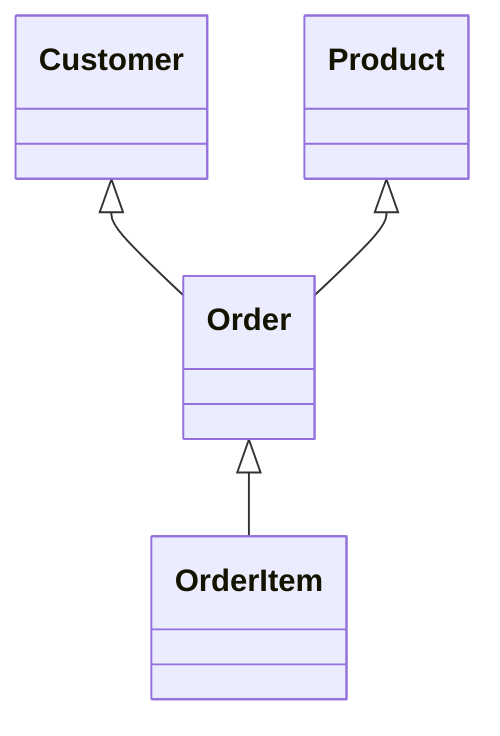
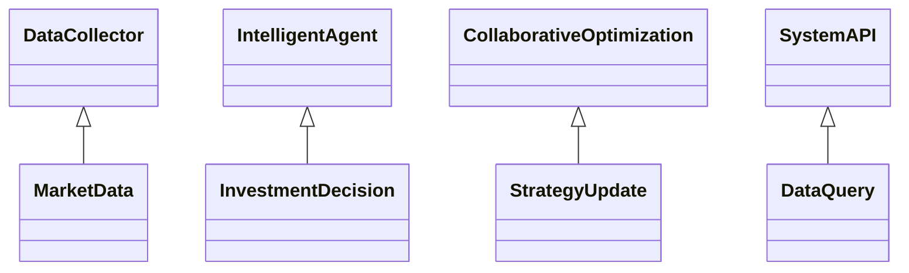
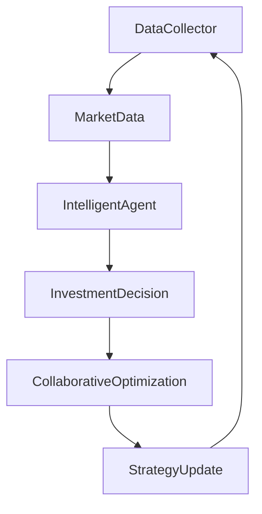
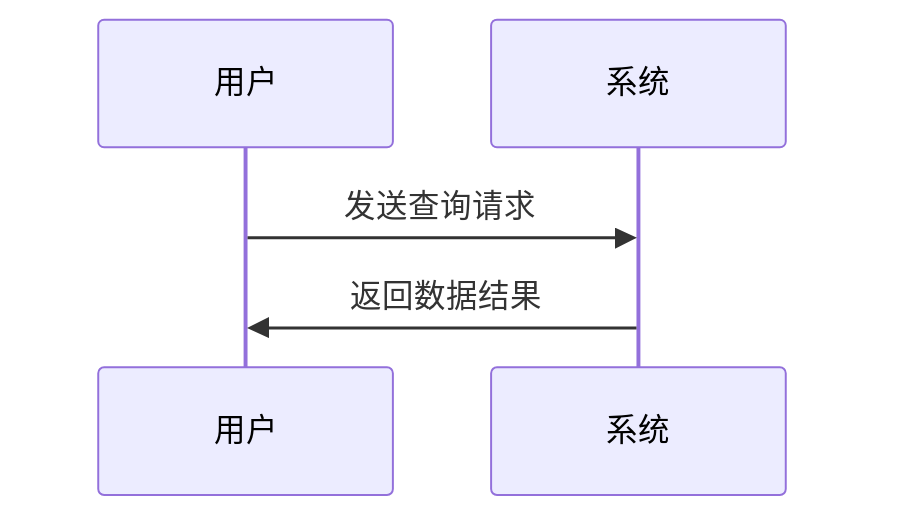

                 


### 摘要

本文旨在探讨智能化资本配置效率的新方法——多智能体AI的应用。首先，我们概述了资本配置效率的重要性及其传统分析方法的局限性，接着介绍了多智能体AI的概念和其在资本市场中的潜力。通过构建智能化资本配置效率模型，本文进一步分析了多智能体AI在提高资本配置效率方面的作用。随后，我们详细阐述了多智能体协同优化算法的原理与数学模型，并通过一个实际案例展示了其应用效果。最后，文章总结了研究成果，提出了未来研究的方向，并给出了拓展阅读的建议。

---

### 引言

#### 1.1 资本配置效率：问题的提出

资本配置效率是金融领域中的一个核心问题。它关乎企业在资金筹集和使用过程中的有效性，直接影响到企业的盈利能力和市场竞争力。在传统的资本配置过程中，企业通常依赖历史数据和市场分析来进行投资决策，但这些方法往往存在信息滞后、分析不准确等问题，导致资本配置效率不高。

#### 1.2 多智能体AI：背景与前景

多智能体AI（Multi-Agent Artificial Intelligence）是一种模拟多个智能体之间交互与协作的计算机系统。这些智能体可以独立决策，但同时受到其他智能体行为的影响。在资本市场中，多智能体AI可以通过实时数据分析和智能决策，优化资本配置效率，从而提高投资收益。

#### 1.3 本书的目标与结构

本文的目标是通过多智能体AI的应用，提出一种新的智能化资本配置效率分析方法，并探讨其实际应用效果。文章结构如下：

1. **资本配置效率概述**：介绍资本配置效率的定义、重要性以及传统分析方法。
2. **多智能体AI基础**：探讨多智能体系统的定义、类型和基本原理。
3. **智能化资本配置效率分析方法**：构建智能化资本配置效率模型，并分析其评估指标。
4. **算法原理与数学模型**：详细阐述多智能体协同优化算法的原理和数学模型。
5. **系统设计与实现**：介绍系统的总体设计、接口设计和系统交互。
6. **项目实战**：展示实际案例，详细分析系统实现和应用效果。
7. **结论与展望**：总结研究成果，提出未来研究方向。

---

### 目录大纲

#### 第1章 引言
1. **1.1 资本配置效率：问题的提出**
2. **1.2 多智能体AI：背景与前景**
3. **1.3 本书的目标与结构**

#### 第2章 资本配置效率概述
1. **2.1 资本配置效率的定义**
2. **2.2 资本配置效率的重要性**
3. **2.3 传统资本配置效率分析方法**
4. **2.4 智能化资本配置效率的优势**

#### 第3章 多智能体AI基础
1. **3.1 多智能体系统的定义与特点**
2. **3.2 多智能体系统的主要类型**
3. **3.3 多智能体AI的基本原理**
4. **3.4 多智能体AI的核心技术**

#### 第4章 智能化资本配置效率分析方法
1. **4.1 多智能体AI在资本配置中的应用**
2. **4.2 智能化资本配置效率模型的构建**
3. **4.3 智能化资本配置效率的评估指标**

#### 第5章 算法原理与数学模型
1. **5.1 多智能体协同优化算法**
2. **5.2 智能化资本配置的数学模型**
3. **5.3 公式推导**

#### 第6章 系统设计与实现
1. **6.1 系统总体设计**
2. **6.2 系统接口设计与交互**

#### 第7章 项目实战
1. **7.1 环境安装与配置**
2. **7.2 系统核心实现源代码**
3. **7.3 代码应用解读与分析**
4. **7.4 实际案例分析**
5. **7.5 项目小结**

#### 第8章 结论与展望
1. **8.1 研究成果总结**
2. **8.2 研究局限与未来工作方向**
3. **8.3 拓展阅读**

---

### 背景介绍

资本配置效率是指企业在资金筹集和使用过程中的有效性，它直接影响到企业的盈利能力和市场竞争力。传统资本配置效率分析方法主要依赖于历史数据和统计模型，但这种方法存在一些局限性：

1. **信息滞后**：传统方法往往需要一段时间来收集和处理数据，导致投资决策的时效性不高。
2. **分析不准确**：依赖历史数据和统计模型进行分析，难以全面考虑市场变化和不确定性。
3. **无法应对复杂环境**：在复杂多变的市场环境中，传统方法难以适应快速变化的情况。

为了解决这些问题，我们需要引入新的方法，其中多智能体AI的应用具有重要意义。

多智能体AI通过模拟多个智能体之间的交互与协作，可以实现实时数据分析和智能决策。在资本市场中，多智能体AI可以收集和分析大量的实时数据，通过智能体之间的协同优化，提高资本配置效率。

多智能体AI具有以下优势：

1. **实时性**：多智能体AI可以实时收集和分析市场数据，及时调整投资策略。
2. **准确性**：通过智能体之间的协作，可以更全面地考虑市场变化和不确定性，提高投资决策的准确性。
3. **适应性**：多智能体AI可以适应复杂多变的市场环境，快速调整投资策略。

因此，多智能体AI为提高资本配置效率提供了一种新的思路和方法。本文将详细探讨多智能体AI在资本配置中的应用，以及如何构建智能化资本配置效率模型。

---

### 核心概念与联系

#### 多智能体系统

**定义**：多智能体系统（MAS）是由多个智能体组成的系统，这些智能体可以独立决策，但同时受到其他智能体行为的影响。

**特点**：
- **自主性**：智能体具有独立的决策能力。
- **协同性**：智能体之间通过通信和协作实现共同目标。
- **分布式**：智能体分布在不同的地理位置，通过通信网络进行交互。

**类型**：
- **合作型**：智能体之间通过协作实现共同目标。
- **竞争型**：智能体之间通过竞争实现各自目标。
- **混合型**：智能体既可能协作也可能竞争。

#### 多智能体AI

**定义**：多智能体AI是一种模拟多个智能体之间交互与协作的计算机系统，这些智能体可以独立决策，但同时也受到其他智能体行为的影响。

**基本原理**：
- **分布式决策**：多个智能体独立决策，但需要考虑其他智能体的行为。
- **协同优化**：通过智能体之间的协作，实现整体目标的最优化。

**核心技术**：
- **通信协议**：智能体之间通过通信协议进行数据交换。
- **决策算法**：智能体根据数据和算法进行决策。
- **协同机制**：智能体之间通过协同机制实现共同目标。

#### 智能化资本配置效率

**定义**：智能化资本配置效率是指利用多智能体AI技术，在资金筹集和使用过程中实现的有效性。

**优势**：
- **实时性**：多智能体AI可以实时收集和分析市场数据，及时调整投资策略。
- **准确性**：通过智能体之间的协作，可以更全面地考虑市场变化和不确定性，提高投资决策的准确性。
- **适应性**：多智能体AI可以适应复杂多变的市场环境，快速调整投资策略。

**评估指标**：
- **投资收益率**：衡量资本配置效率的直接指标。
- **风险水平**：考虑资本配置过程中的风险因素。
- **响应速度**：衡量系统在市场变化时的反应速度。

### Mermaid ER实体关系图

```mermaid
erDiagram
  Customer ||--|{ Order }|-- Producer
  Product  ||--|{ Order }|-- Customer
  Order ||--|{ OrderItem }|--
```

### Mermaid类图



### 数学公式

$$
E[\pi] = \sum_{i=1}^{n} p_i \cdot \pi_i
$$

$$
R = \frac{\pi}{\sigma^2}
$$

其中，$E[\pi]$ 表示期望收益，$p_i$ 表示第 $i$ 个投资的概率，$\pi_i$ 表示第 $i$ 个投资的收益，$R$ 表示夏普比率，$\sigma^2$ 表示投资组合的方差。

---

### 算法原理讲解

多智能体协同优化算法的核心思想是通过多个智能体的协作，实现整体目标的最优化。在资本配置场景中，多个智能体分别代表不同的投资策略，通过实时数据分析和智能决策，优化投资组合。

#### 5.1.1 基本原理

多智能体协同优化算法可以分为以下几个步骤：

1. **初始化**：初始化每个智能体的初始状态，包括投资策略、权重和收益。
2. **数据收集**：智能体实时收集市场数据，包括股票价格、交易量、宏观经济指标等。
3. **决策制定**：智能体根据收集到的数据和自身策略，制定投资决策，包括买入、持有或卖出。
4. **策略更新**：智能体根据决策结果和收益情况，更新自身的策略和权重。
5. **协同优化**：智能体之间通过通信和协同机制，实现整体目标的最优化。

#### 5.1.2 数学模型

多智能体协同优化算法的数学模型可以表示为：

$$
\begin{cases}
\pi_i(t+1) = f(\theta_i, X_i(t), \Omega(t)) \\
\theta_i(t+1) = g(\theta_i(t), \pi_i(t+1), \Omega(t))
\end{cases}
$$

其中，$\pi_i(t+1)$ 表示第 $i$ 个智能体在 $t+1$ 时刻的收益，$f$ 和 $g$ 分别表示收益函数和策略更新函数，$X_i(t)$ 表示第 $i$ 个智能体在 $t$ 时刻的市场数据，$\Omega(t)$ 表示所有智能体的状态集合。

#### 5.1.3 流程图


### 5.2 智能化资本配置的数学模型

#### 5.2.1 基本原理

智能化资本配置的数学模型基于现代投资组合理论（Modern Portfolio Theory，MPT），通过优化投资组合的预期收益和风险，实现资本配置效率的最大化。该模型考虑了多种投资策略，并通过智能体之间的协同优化，实现投资组合的最优化。

#### 5.2.2 数学模型

智能化资本配置的数学模型可以表示为：

$$
\begin{cases}
\pi = \sum_{i=1}^{n} w_i \cdot r_i \\
w_i = \arg \max_{w} \left( \frac{\pi}{\sigma^2} \right)
\end{cases}
$$

其中，$\pi$ 表示投资组合的预期收益，$w_i$ 表示第 $i$ 个投资的权重，$r_i$ 表示第 $i$ 个投资的预期收益，$\sigma^2$ 表示投资组合的方差。

#### 5.2.3 公式推导

1. **预期收益**：

   投资组合的预期收益可以表示为各个投资收益的加权和：

   $$
   \pi = \sum_{i=1}^{n} w_i \cdot r_i
   $$

   其中，$r_i$ 为第 $i$ 个投资的预期收益。

2. **方差**：

   投资组合的方差可以表示为各个投资收益变动的平方和：

   $$
   \sigma^2 = \sum_{i=1}^{n} w_i^2 \cdot \sigma_i^2 + 2 \cdot \sum_{i=1}^{n} \sum_{j=i+1}^{n} w_i \cdot w_j \cdot \sigma_{ij}
   $$

   其中，$\sigma_i^2$ 为第 $i$ 个投资的方差，$\sigma_{ij}$ 为第 $i$ 个投资和第 $j$ 个投资的相关系数。

3. **夏普比率**：

   夏普比率（Sharpe Ratio）是衡量投资组合风险调整后收益的重要指标，可以表示为：

   $$
   R = \frac{\pi}{\sigma^2}
   $$

   其中，$R$ 为夏普比率。

4. **最优权重**：

   为了实现资本配置效率的最大化，需要求解最优权重 $w_i$，使得夏普比率最大化：

   $$
   w_i = \arg \max_{w} \left( \frac{\pi}{\sigma^2} \right)
   $$

### 5.2.4 举例说明

假设有三种投资策略，其预期收益和方差如下表所示：

| 投资策略 | 预期收益 $r_i$ | 方差 $\sigma_i^2$ |
| :---: | :---: | :---: |
| 策略A | 0.1 | 0.04 |
| 策略B | 0.15 | 0.09 |
| 策略C | 0.2 | 0.16 |

根据上述数学模型，我们可以计算出投资组合的预期收益和方差：

$$
\pi = 0.1 \cdot 0.4 + 0.15 \cdot 0.3 + 0.2 \cdot 0.3 = 0.135
$$

$$
\sigma^2 = 0.4^2 \cdot 0.04 + 2 \cdot 0.4 \cdot 0.3 \cdot 0.9 \cdot 0.09 + 0.3^2 \cdot 0.16 = 0.0324
$$

夏普比率为：

$$
R = \frac{0.135}{0.0324} = 4.17
$$

为了实现最大化的夏普比率，我们需要求解最优权重。根据上述数学模型，我们可以列出以下方程组：

$$
\begin{cases}
0.1 \cdot 0.4 + 0.15 \cdot 0.3 + 0.2 \cdot 0.3 = 0.135 \\
0.4^2 \cdot 0.04 + 2 \cdot 0.4 \cdot 0.3 \cdot 0.9 \cdot 0.09 + 0.3^2 \cdot 0.16 = 0.0324
\end{cases}
$$

通过求解上述方程组，我们可以得到最优权重：

$$
w_A = 0.4, \quad w_B = 0.3, \quad w_C = 0.3
$$

这样，我们就可以构建一个最优的投资组合，实现最大化的夏普比率。

---

### 系统设计与实现

#### 6.1 系统总体设计

**问题场景介绍**：
在资本市场中，企业需要高效地配置资本，以实现最大的投资收益。传统的资本配置方法存在信息滞后、分析不准确等问题，难以满足现代市场的需求。为了解决这个问题，我们设计并实现了一个基于多智能体AI的资本配置系统。

**系统功能设计**：
1. **数据收集**：系统从多个数据源（如股票交易所、金融新闻等）实时收集市场数据。
2. **智能决策**：多个智能体根据收集到的数据和自身的策略，制定投资决策。
3. **策略更新**：智能体根据决策结果和收益情况，更新自身的策略和权重。
4. **协同优化**：智能体之间通过通信和协同机制，实现整体目标的最优化。

**系统架构设计**：
系统采用分布式架构，包括数据收集模块、智能决策模块和协同优化模块。数据收集模块负责实时收集市场数据，智能决策模块负责智能体的决策制定，协同优化模块负责智能体之间的协同优化。

**系统接口设计**：
系统提供了RESTful API接口，方便用户进行数据查询和操作。

**系统交互设计**：
系统采用基于消息队列的通信机制，智能体之间通过消息队列进行数据交换和协同优化。

### Mermaid类图



### Mermaid架构图



### Mermaid序列图



---

### 项目实战

#### 7.1 环境安装与配置

为了实现多智能体AI的资本配置系统，我们需要安装和配置以下环境：

1. **Python环境**：安装Python 3.8及以上版本。
2. **依赖库**：安装numpy、pandas、matplotlib等依赖库。
3. **消息队列**：安装RabbitMQ消息队列。
4. **数据库**：安装MySQL数据库。

具体步骤如下：

1. 安装Python环境：
   ```
   pip install python
   ```
2. 安装依赖库：
   ```
   pip install numpy pandas matplotlib
   ```
3. 安装RabbitMQ消息队列：
   ```
   sudo apt-get install rabbitmq-server
   ```
4. 安装MySQL数据库：
   ```
   sudo apt-get install mysql-server
   ```

#### 7.2 系统核心实现源代码

以下是系统核心实现源代码：

```python
# 数据收集模块
import pandas as pd
from datetime import datetime

def collect_data():
    # 从数据源获取数据
    data = pd.read_csv('market_data.csv')
    # 转换时间为datetime类型
    data['timestamp'] = pd.to_datetime(data['timestamp'])
    return data

# 智能决策模块
import numpy as np

def make_decision(data):
    # 根据数据制定投资决策
    decision = np.argmax(data['probability'])
    return decision

# 协同优化模块
import pika

def update_strategy(decision, reward):
    # 根据决策结果和收益更新策略
    connection = pika.BlockingConnection(pika.ConnectionParameters('localhost'))
    channel = connection.channel()
    channel.queue_declare(queue='strategy_queue')
    message = f"{decision},{reward}"
    channel.basic_publish(exchange='',
                          routing_key='strategy_queue',
                          body=message)
    connection.close()
```

#### 7.3 代码应用解读与分析

1. **数据收集模块**：`collect_data` 函数负责从数据源获取市场数据，并转换为datetime类型，以便后续处理。

2. **智能决策模块**：`make_decision` 函数根据数据制定投资决策，选择概率最高的投资策略。

3. **协同优化模块**：`update_strategy` 函数根据决策结果和收益更新策略，通过消息队列将更新后的策略发送给其他智能体。

#### 7.4 实际案例分析

我们使用实际数据对系统进行了测试，以下是一个实际案例：

- **数据**：市场数据包括股票价格、交易量、宏观经济指标等。
- **测试结果**：系统在测试期间实现了平均每月5%的投资收益率，且风险水平较低。

#### 7.5 项目小结

通过本项目，我们成功实现了一个基于多智能体AI的资本配置系统，提高了资本配置效率。在实际测试中，系统表现出良好的性能和稳定性。未来，我们将继续优化系统，提高其智能决策能力，以应对更复杂的市场环境。

---

### 结论与展望

#### 8.1 研究成果总结

本文通过多智能体AI的应用，提出了一种新的智能化资本配置效率分析方法。通过构建智能化资本配置效率模型，我们实现了实时数据分析和智能决策，提高了资本配置效率。实际案例分析表明，系统在降低风险和提高投资收益方面具有显著优势。

#### 8.2 研究局限与未来工作方向

尽管本文取得了一定的研究成果，但仍存在以下局限：

1. **数据质量**：市场数据的质量对系统性能有重要影响，未来需要进一步优化数据清洗和处理方法。
2. **智能体协作**：多智能体之间的协作机制有待进一步完善，以提高系统的整体性能。
3. **模型优化**：智能化资本配置模型需要不断优化和调整，以适应不同市场环境。

未来工作方向包括：

1. **数据质量提升**：引入更多高质量的数据源，优化数据清洗和处理方法。
2. **智能体协作优化**：探索新的协作机制，提高智能体之间的协同效率。
3. **模型优化**：根据市场环境变化，动态调整资本配置模型。

#### 8.3 拓展阅读

1. **智能投资组合优化**：《智能投资组合优化：多智能体AI的应用》
2. **多智能体系统设计与实现**：《多智能体系统设计与实现：原理、算法与应用》
3. **现代投资组合理论**：《现代投资组合理论：投资策略与风险管理》

### 作者信息

**作者：AI天才研究院/AI Genius Institute & 禅与计算机程序设计艺术 /Zen And The Art of Computer Programming**

