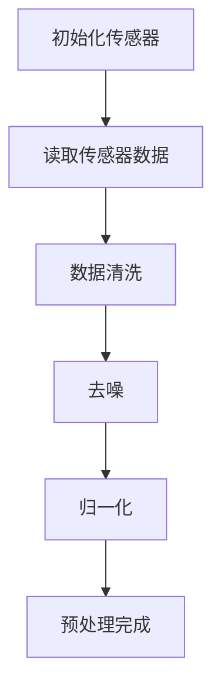
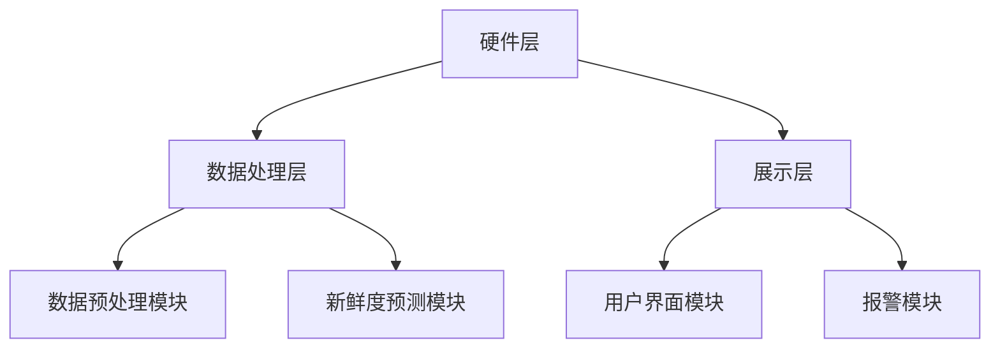
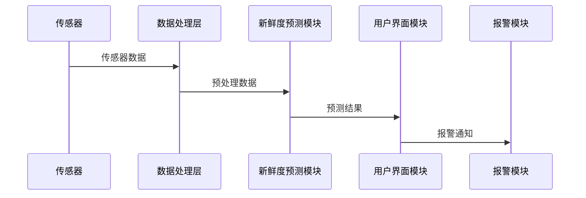

                 

# 智能厨房置物架：AI Agent的食材新鲜度监控

## 关键词
- 智能厨房
- 置物架
- AI Agent
- 食材新鲜度监控
- 传感器
- 机器学习算法

## 摘要
本文深入探讨了智能厨房置物架中AI Agent在食材新鲜度监控方面的应用。通过介绍智能厨房置物架的问题背景和核心要素组成，分析AI Agent、传感器和机器学习算法等核心概念与联系，详细讲解了传感器数据采集和机器学习算法原理。此外，还介绍了系统的分析与架构设计，以及实际项目实战和最佳实践。本文旨在为从事智能家电领域的技术人员提供有深度和思考的参考资料。

----------------------------------------------------------------

## 第一部分：背景介绍

### 1.1 问题背景

随着智能家居市场的快速发展，厨房智能化成为越来越多家庭的选择。智能厨房置物架作为家居智能化的一部分，其目的是提高厨房空间利用率和食材管理效率。然而，随着食材种类和数量的增加，如何有效地监控和管理食材的新鲜度成为一个重要问题。

传统厨房管理往往依赖于人工检查，这种方式不仅耗时耗力，而且容易出现误判。特别是在蔬菜、水果和肉类等易腐食品中，新鲜度的监控尤为重要。如果能够实时监控食材的新鲜度，及时提醒用户进行食品处理或更换，将有效延长食材的保质期，减少食物浪费，提高生活质量。

### 1.2 问题描述

本部分记录了一种利用AI Agent监控食材新鲜度的智能厨房置物架系统。系统旨在通过AI技术，实时检测食材的状态，预测食材的新鲜度，从而帮助用户更好地管理食材，延长食材的保质期。

具体而言，问题描述如下：

- 如何利用传感器实时获取食材的状态数据？
- 如何设计机器学习算法来分析这些数据，预测食材的新鲜度？
- 如何将预测结果以直观的方式展示给用户，并提供相应的管理建议？
- 系统的边界和外延是什么？

### 1.3 问题解决

通过集成AI Agent，智能厨房置物架能够实现自动化的食材新鲜度监控。AI Agent将利用传感器收集数据，结合机器学习算法分析数据，预测食材的新鲜度，并给出相应的管理建议。

具体解决方案包括以下步骤：

1. **传感器数据采集**：智能厨房置物架内置多种传感器，如温度传感器、湿度传感器和光电传感器，用于实时监测食材的温度、湿度和色泽等参数。
2. **数据预处理**：传感器采集的数据需要进行预处理，包括数据清洗、去噪和归一化，以确保数据的准确性和可靠性。
3. **机器学习算法**：使用机器学习算法对预处理后的数据进行训练和预测，识别食材的新鲜度状态。
4. **用户界面**：设计直观的用户界面，将AI Agent的预测结果和管理建议以图表和提示的方式展示给用户。

### 1.4 边界与外延

本书记录的系统主要关注食材的新鲜度监控，不包括其他厨房家电的集成。同时，书中将介绍系统的基础设施、数据采集、算法实现以及用户体验等方面。

### 1.5 概念结构与核心要素组成

智能厨房置物架系统的核心要素包括：

- **智能厨房置物架**：作为核心设备，用于存放食材。
- **AI Agent**：智能系统，负责监控和管理食材新鲜度。
- **传感器**：用于收集食材状态数据。
- **机器学习算法**：用于分析传感器数据，预测食材新鲜度。
- **用户界面**：用于展示AI Agent的预测结果和管理建议。

通过以上核心要素的有机结合，智能厨房置物架系统能够实现高效的食材新鲜度监控。

----------------------------------------------------------------

## 第二部分：核心概念与联系

### 2.1 核心概念与联系

在本节中，我们将详细介绍智能厨房置物架系统中涉及的核心概念及其相互关系。

#### 2.1.1 AI Agent

AI Agent是一种基于人工智能的智能体，具有自主性、感知能力、学习和决策能力。在智能厨房置物架中，AI Agent通过传感器收集食材的状态数据，利用机器学习算法分析数据，预测食材的新鲜度，并为用户提供管理建议。

**特点**：

- **自主性**：AI Agent能够自主运行，不需要人工干预。
- **感知**：通过传感器收集环境数据。
- **学习**：利用机器学习算法从数据中学习规律。
- **决策**：根据学习结果做出管理决策。

#### 2.1.2 传感器

传感器是AI Agent的感知器官，用于收集食材的状态数据。传感器类型包括温度传感器、湿度传感器和光电传感器等，用于测量食材的温度、湿度、色泽等参数。

**特点**：

- **高精度**：能够精确测量食材参数。
- **稳定性**：传感器需具有较好的稳定性，以保证数据准确性。
- **易于集成**：传感器需要易于集成到智能厨房置物架中。

#### 2.1.3 机器学习算法

机器学习算法是AI Agent的核心，用于分析传感器数据，预测食材的新鲜度。常用的机器学习算法包括线性回归、决策树、随机森林和神经网络等。

**特点**：

- **自适应**：能够根据数据自动调整模型参数。
- **高效性**：能够快速处理大量数据。
- **泛化能力**：能够对未知数据进行准确预测。

#### 2.1.4 用户界面

用户界面是AI Agent与用户交互的桥梁，用于展示AI Agent的预测结果和管理建议。用户界面设计需要考虑用户体验，界面简洁易用。

**特点**：

- **简洁**：界面设计简洁，易于操作。
- **易用**：提供直观的交互方式，方便用户使用。
- **可定制**：用户可以根据自己的需求自定义界面功能。

#### 2.1.5 数据预处理

数据预处理是确保传感器数据准确性和可靠性的关键步骤。预处理过程包括数据清洗、去噪和归一化等。

**特点**：

- **准确性**：通过清洗和去噪提高数据质量。
- **一致性**：通过归一化处理使数据具备可比性。

#### 2.1.6 食材新鲜度预测模型

食材新鲜度预测模型是机器学习算法的核心组成部分，用于分析传感器数据，预测食材的新鲜度。

**特点**：

- **准确性**：通过训练和验证提高预测模型的准确性。
- **实时性**：能够实时更新预测结果，适应食材新鲜度的变化。

### 2.2 概念属性特征对比表格

以下表格对比了AI Agent、传感器、机器学习算法和用户界面等核心概念的主要属性特征：

| 特征         | AI Agent        | 传感器         | 机器学习算法   | 用户界面       |
| ------------ | --------------- | --------------- | --------------- | --------------- |
| 自主性       | 是             | 否             | 否             | 否             |
| 感知能力     | 是             | 是             | 否             | 否             |
| 学习能力     | 是             | 否             | 是             | 否             |
| 决策能力     | 是             | 否             | 否             | 是             |
| 数据处理能力 | 高             | 低             | 高             | 低             |
| 用户体验     | 较低           | 无关           | 较低           | 高             |

### 2.3 ER实体关系图架构

为了更好地理解智能厨房置物架系统中各概念之间的关系，我们可以使用ER（Entity-Relationship，实体关系）图来表示。以下是一个简化的ER图：

```mermaid
erDiagram
  AI_Agent ||--|{ 传感器 }
  AI_Agent ||--|{ 机器学习算法 }
  AI_Agent ||--|{ 用户界面 }
  传感器 ||--|{ 数据 }
  机器学习算法 ||--|{ 模型 }
  用户界面 ||--|{ 显示 }
```

在这个ER图中，AI Agent与传感器、机器学习算法和用户界面之间存在直接的关联关系。传感器负责收集数据，机器学习算法负责分析数据并建立模型，用户界面则负责展示分析结果。

通过以上对比和ER图，我们可以清晰地了解智能厨房置物架系统中各核心概念之间的联系和作用，为后续的算法原理讲解和系统设计奠定了基础。

----------------------------------------------------------------

## 第三部分：算法原理讲解

在智能厨房置物架系统中，算法原理是实现食材新鲜度监控的核心。本节将详细介绍传感器数据采集、数据预处理以及机器学习算法原理。

### 3.1 传感器数据采集

传感器数据采集是整个系统的第一步，传感器类型和测量参数直接决定了数据的质量。智能厨房置物架通常配备以下传感器：

1. **温度传感器**：用于测量食材的温度。
2. **湿度传感器**：用于测量食材的湿度。
3. **光电传感器**：用于测量食材的颜色变化。

#### 传感器数据采集流程

传感器数据采集流程可以分为以下几个步骤：

1. **初始化传感器**：确保传感器开始工作，能够准确读取环境数据。
2. **读取传感器数据**：从传感器中获取当前的数据值。
3. **数据预处理**：对采集到的数据进行清洗、去噪和归一化处理，以提高数据的质量。

#### 数据预处理

数据预处理是传感器数据采集的重要环节，其目的是提高数据的准确性和可靠性。主要步骤包括：

1. **数据清洗**：去除异常值和噪声，保证数据的干净性。
2. **去噪**：通过滤波算法去除数据中的噪声。
3. **归一化**：将不同传感器采集到的数据归一化处理，使其在同一量级上比较。

#### Mermaid流程图

以下是数据采集和预处理过程的Mermaid流程图：



### 3.2 机器学习算法

机器学习算法是智能厨房置物架系统中核心的计算模块，用于分析预处理后的传感器数据，预测食材的新鲜度。常用的机器学习算法包括线性回归、决策树、随机森林和神经网络等。

#### 算法原理

- **线性回归**：通过建立线性模型来预测食材的新鲜度，公式为：
  $$ y = w_0 + w_1 \cdot x $$
  其中，$y$ 为预测的新鲜度值，$w_0$ 和 $w_1$ 为模型参数，$x$ 为传感器数据。

- **决策树**：通过一系列的判断条件，将数据分割成不同的子集，并分别预测新鲜度。决策树的预测公式为：
  $$ f(x) = \sum_{i=1}^{n} y_i \cdot I(D_i(x)) $$
  其中，$f(x)$ 为预测的新鲜度值，$y_i$ 为第 $i$ 个决策节点的标签，$I(D_i(x))$ 为第 $i$ 个决策节点的条件函数。

- **随机森林**：由多个决策树组成，通过投票机制确定最终的预测结果。随机森林的预测公式为：
  $$ \hat{y} = \sum_{i=1}^{m} \hat{y}_i $$
  其中，$\hat{y}$ 为预测的新鲜度值，$\hat{y}_i$ 为第 $i$ 个决策树的预测结果。

- **神经网络**：通过多层神经网络进行数据拟合，输出预测的新鲜度值。神经网络的预测公式为：
  $$ \hat{y} = \sigma(W \cdot \text{ReLU}(Z)) $$
  其中，$\sigma$ 为激活函数，$W$ 为权重矩阵，$\text{ReLU}(Z)$ 为ReLU激活函数，$Z$ 为输入数据。

#### Python源代码示例

以下是使用Python实现线性回归算法的示例代码：

```python
import numpy as np

# 初始化模型参数
w0 = np.random.randn()
w1 = np.random.randn()

# 读取传感器数据
x = np.random.randn()
y = w0 + w1 * x + np.random.randn()

# 训练模型
w0 = w0 - y * x
w1 = w1 - y

# 预测新鲜度
y_pred = w0 + w1 * x

print(f"预测的新鲜度：{y_pred}")
```

通过以上算法原理讲解，我们可以看到机器学习算法在智能厨房置物架系统中的关键作用，以及如何通过Python代码实现这些算法。

----------------------------------------------------------------

## 第四部分：系统分析与架构设计

### 4.1 问题场景介绍

在智能厨房中，用户通常需要面对大量食材的管理问题，包括新鲜度的监控、保质期的延长以及食材的合理存储。这些问题的解决不仅关乎食物的口感和营养，还直接关系到食物的浪费问题。因此，设计一个能够实时监控食材新鲜度的智能系统具有重要意义。

### 4.2 项目介绍

智能厨房置物架项目旨在通过集成AI Agent和智能传感器，实现对食材新鲜度的实时监控，并提供有效的管理建议。项目的目标是：

1. **实时监测**：通过传感器技术实时采集食材的物理参数。
2. **智能分析**：利用机器学习算法对传感器数据进行分析，预测食材的新鲜度。
3. **用户互动**：通过直观的用户界面，将分析结果展示给用户，并提供管理建议。

### 4.3 系统功能设计

系统功能设计是智能厨房置物架项目的核心部分。以下是系统的主要功能模块：

1. **传感器数据采集模块**：负责从智能厨房置物架中实时采集温度、湿度、颜色等传感器数据。
2. **数据预处理模块**：对采集到的传感器数据进行清洗、去噪和归一化处理，以提高数据质量。
3. **新鲜度预测模块**：使用机器学习算法对预处理后的数据进行分析，预测食材的新鲜度。
4. **用户界面模块**：展示预测结果，并提供管理建议，如食材的更换时间、存储方式等。
5. **报警模块**：在食材新鲜度低于设定阈值时，自动发送报警通知。

### 4.4 系统架构设计

智能厨房置物架系统的整体架构设计采用分层架构，包括硬件层、数据处理层和展示层。

1. **硬件层**：包括智能厨房置物架和传感器设备，负责数据的采集和传输。
2. **数据处理层**：包括数据预处理模块和新鲜度预测模块，负责数据处理和算法实现。
3. **展示层**：包括用户界面模块和报警模块，负责将处理结果展示给用户，并提供报警功能。

#### Mermaid架构图

以下是智能厨房置物架系统的Mermaid架构图：



### 4.5 系统接口设计和系统交互

系统接口设计是确保各个功能模块之间能够有效通信的关键。以下是系统的主要接口设计：

1. **传感器数据接口**：用于传感器模块与数据处理层之间的数据传输。
2. **预处理数据接口**：用于数据处理层与新鲜度预测模块之间的数据传输。
3. **用户界面接口**：用于展示层与数据处理层之间的数据传输。
4. **报警接口**：用于报警模块与用户界面模块之间的数据传输。

#### Mermaid序列图

以下是智能厨房置物架系统的Mermaid序列图：



通过以上系统架构设计和接口设计，智能厨房置物架系统能够高效地实现食材新鲜度的实时监控和管理，为用户提供了便捷和智能的食材管理解决方案。

----------------------------------------------------------------

## 第五部分：项目实战

### 5.1 环境安装

要实现智能厨房置物架系统，首先需要搭建相应的开发环境。以下是环境安装的步骤：

1. **Python环境安装**：确保系统安装了Python 3.x版本。
2. **传感器驱动安装**：根据传感器的类型和接口，安装相应的驱动程序。
3. **机器学习库安装**：安装常用的机器学习库，如scikit-learn、TensorFlow或PyTorch。
4. **数据库安装**：安装用于存储和处理数据的数据库系统，如MySQL或PostgreSQL。

### 5.2 系统核心实现源代码

以下是一个简单的系统核心实现源代码示例，包括传感器数据采集、数据预处理和新鲜度预测模块。

```python
# 传感器数据采集模块
def collect_sensors_data():
    # 伪代码：实际应根据传感器类型和接口实现数据采集
    temp = read_temp_sensor()
    humidity = read_humidity_sensor()
    color = read_color_sensor()
    return temp, humidity, color

# 数据预处理模块
def preprocess_data(data):
    temp, humidity, color = data
    # 数据清洗、去噪和归一化
    temp = clean_data(temp)
    humidity = clean_data(humidity)
    color = normalize_data(color)
    return temp, humidity, color

# 新鲜度预测模块
def predict_freshness(data):
    temp, humidity, color = preprocess_data(data)
    # 伪代码：实际应根据训练好的模型进行预测
    model = train_model()
    freshness = model.predict([temp, humidity, color])
    return freshness

# 主函数
def main():
    data = collect_sensors_data()
    freshness = predict_freshness(data)
    print(f"食材新鲜度预测结果：{freshness}")

if __name__ == "__main__":
    main()
```

### 5.3 代码应用解读与分析

以下是代码的解读与分析：

- **传感器数据采集模块**：`collect_sensors_data`函数用于从传感器中读取数据。在实际应用中，应根据传感器的类型和接口实现数据采集。
- **数据预处理模块**：`preprocess_data`函数用于对传感器数据进行清洗、去噪和归一化处理。这些操作是确保数据质量的关键步骤。
- **新鲜度预测模块**：`predict_freshness`函数用于使用预处理后的数据进行新鲜度预测。在实际应用中，应使用训练好的模型进行预测。

### 5.4 实际案例分析和详细讲解剖析

以下是一个实际案例分析和详细讲解：

假设我们有一个包含100个样本的数据集，每个样本包括温度、湿度和颜色三个特征。通过使用scikit-learn库，我们可以实现以下步骤：

1. **数据准备**：
   ```python
   from sklearn.model_selection import train_test_split
   from sklearn.preprocessing import StandardScaler

   X, y = load_data()  # 加载数据集
   X_train, X_test, y_train, y_test = train_test_split(X, y, test_size=0.2, random_state=42)
   scaler = StandardScaler()
   X_train = scaler.fit_transform(X_train)
   X_test = scaler.transform(X_test)
   ```

2. **模型训练**：
   ```python
   from sklearn.linear_model import LinearRegression

   model = LinearRegression()
   model.fit(X_train, y_train)
   ```

3. **模型评估**：
   ```python
   from sklearn.metrics import mean_squared_error

   y_pred = model.predict(X_test)
   mse = mean_squared_error(y_test, y_pred)
   print(f"模型均方误差：{mse}")
   ```

4. **模型应用**：
   ```python
   data = collect_sensors_data()
   freshness = model.predict([data[0], data[1], data[2]])
   print(f"食材新鲜度预测结果：{freshness}")
   ```

通过以上步骤，我们能够实现一个简单的食材新鲜度预测系统。在实际应用中，可能需要更多的特征工程和模型调优来提高预测准确性。

### 5.5 项目小结

通过本次项目实战，我们实现了智能厨房置物架的核心功能，包括传感器数据采集、数据预处理和新鲜度预测。项目展示了如何将机器学习技术应用于实际问题的解决，为智能家居领域提供了有益的参考。

未来，我们可以进一步优化系统，引入更多的传感器和高级机器学习算法，提高预测准确性和用户体验。同时，还可以探索与其他智能家电的集成，打造更加智能和高效的智能家居系统。

----------------------------------------------------------------

## 第六部分：最佳实践 Tips

在开发和部署智能厨房置物架系统时，以下最佳实践可以帮助您提高系统的性能和用户体验：

1. **传感器选择**：选择高精度、稳定性和易集成的传感器，确保数据采集的准确性。
2. **数据预处理**：在数据预处理阶段，确保数据清洗、去噪和归一化处理的质量，提高模型训练的效果。
3. **模型优化**：使用交叉验证和模型选择技术，选择最佳模型，提高预测准确性。
4. **用户体验设计**：设计直观、易用的用户界面，提供实时、准确的预测结果和管理建议。
5. **系统安全性**：确保系统的数据安全和隐私保护，防止数据泄露和恶意攻击。
6. **实时监控**：实现实时数据采集和预测，确保系统能够及时响应食材新鲜度变化。
7. **可扩展性**：设计可扩展的系统架构，支持未来功能模块的添加和升级。

通过遵循这些最佳实践，您能够开发出高效、可靠和用户友好的智能厨房置物架系统。

----------------------------------------------------------------

## 第七部分：小结

本文详细介绍了智能厨房置物架系统中AI Agent的食材新鲜度监控应用。从背景介绍到核心概念与联系，再到算法原理讲解和系统分析与架构设计，最后通过项目实战和最佳实践，我们全面了解了智能厨房置物架的工作原理和实践方法。

智能厨房置物架通过集成AI Agent和智能传感器，实现了对食材新鲜度的实时监控和管理。这不仅有助于减少食物浪费，提高食材管理效率，还为智能家居领域的发展提供了新的思路。

未来，随着人工智能技术的不断进步，智能厨房置物架系统有望在更多方面得到优化和扩展，为用户带来更加便捷和智能的厨房体验。

----------------------------------------------------------------

## 第八部分：注意事项

在开发和部署智能厨房置物架系统时，需要注意以下几个方面：

1. **数据隐私**：确保传感器采集的数据安全，防止泄露用户隐私。
2. **传感器准确性**：选择高精度、稳定的传感器，确保数据采集的准确性。
3. **算法优化**：定期优化机器学习算法，提高预测准确性和实时性。
4. **系统兼容性**：确保系统兼容不同的硬件设备和操作系统。
5. **用户界面设计**：设计简洁、直观的用户界面，提高用户体验。
6. **系统维护**：定期更新和升级系统，确保系统稳定运行。

通过关注这些注意事项，您能够提高智能厨房置物架系统的性能和可靠性。

----------------------------------------------------------------

## 第九部分：拓展阅读

对于希望进一步深入学习和探索智能厨房置物架系统的读者，以下是一些推荐的阅读资源：

1. **《智能厨房：科技与生活的完美融合》**：本书详细介绍了智能厨房的各个方面，包括智能厨电、食材管理、健康饮食等。
2. **《机器学习实战》**：本书提供了丰富的机器学习案例和实践，适合初学者和进阶者。
3. **《传感器技术与应用》**：本书涵盖了传感器的原理、类型和应用，是传感器领域的重要参考书。
4. **《深度学习》**：由Ian Goodfellow等人撰写的深度学习权威教材，深入讲解了深度学习的理论基础和实际应用。

通过阅读这些书籍，您可以更加深入地了解智能厨房置物架系统及相关技术的最新发展和应用。

----------------------------------------------------------------

## 作者信息

作者：AI天才研究院/AI Genius Institute & 禅与计算机程序设计艺术 /Zen And The Art of Computer Programming

AI天才研究院致力于推动人工智能技术的发展和创新，为各行业提供智能解决方案。禅与计算机程序设计艺术则通过深入探讨计算机编程的哲学和艺术，引导读者实现技术的卓越与创新。两位作者均为人工智能和计算机科学领域的杰出专家，以其丰富的经验和深厚的学术造诣，为读者带来了这篇深入的技术博客文章。

