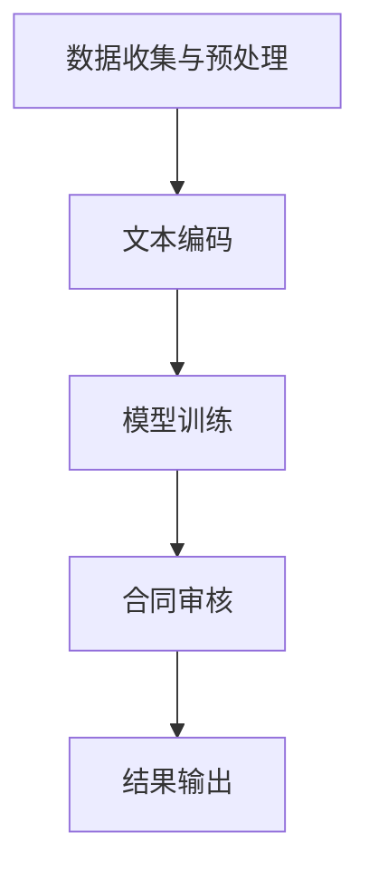
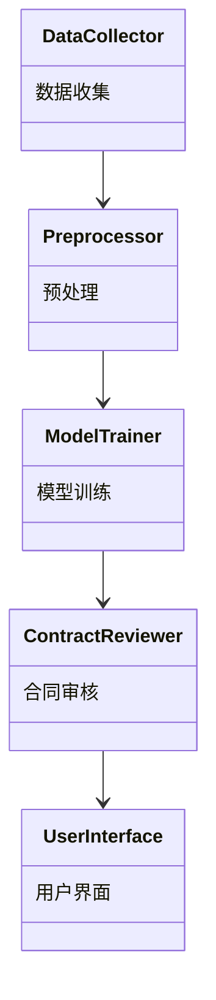
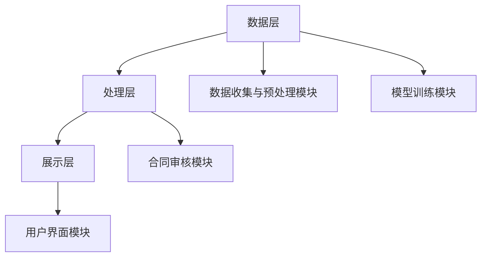
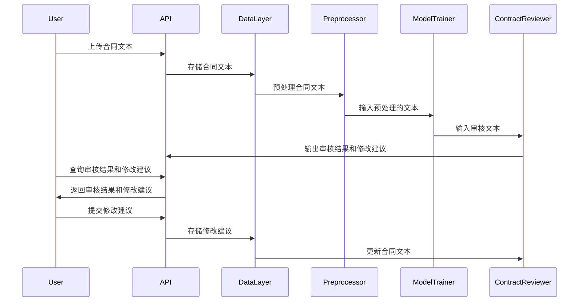
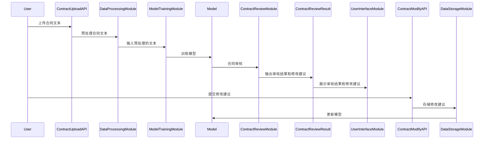

                 


# 智能合同审核 AI Agent：LLM 在法律文件处理中的应用

## 关键词
- 智能合同审核
- AI Agent
- 法律文件处理
- 大语言模型（LLM）
- 自然语言处理（NLP）
- 机器学习（ML）
- 深度学习（DL）

## 摘要
本文将深入探讨智能合同审核 AI Agent 的应用，特别是在法律文件处理领域。我们将从背景介绍开始，详细分析核心概念、算法原理、系统分析与架构设计，并最终通过项目实战展示实际应用效果。本文旨在为读者提供一份全面、系统、易懂的技术指南，帮助理解智能合同审核 AI Agent 在法律文件处理中的潜力与挑战。

## 目录大纲设计

### 第一部分：背景介绍

#### 第1章：智能合同审核 AI Agent 的背景与意义
1.1 问题背景
1.2 问题描述
1.3 问题解决
1.4 边界与外延
1.5 概念结构与核心要素组成

#### 第2章：智能合同审核 AI Agent 的核心概念与原理
2.1 核心概念介绍
2.2 概念属性特征对比表格
2.3 ER实体关系图架构

#### 第3章：智能合同审核 AI Agent 的算法原理
3.1 算法 mermaid 流程图
3.2 Python 源代码实现
3.3 算法原理的数学模型与公式
3.4 通俗易懂地举例说明

#### 第4章：智能合同审核 AI Agent 的系统分析与架构设计
4.1 问题场景介绍
4.2 项目介绍
4.3 系统功能设计（领域模型 mermaid 类图）
4.4 系统架构设计（mermaid 架构图）
4.5 系统接口设计
4.6 系统交互（mermaid 序列图）

#### 第5章：智能合同审核 AI Agent 的项目实战
5.1 环境安装
5.2 系统核心实现源代码
5.3 实际案例分析与详细讲解剖析
5.4 项目小结

#### 第6章：智能合同审核 AI Agent 的最佳实践与注意事项
6.1 最佳实践 tips
6.2 小结
6.3 注意事项
6.4 拓展阅读

### 完整的目录大纲

```markdown
# 智能合同审核 AI Agent：LLM 在法律文件处理中的应用

## 关键词
- 智能合同审核
- AI Agent
- 法律文件处理
- 大语言模型（LLM）
- 自然语言处理（NLP）
- 机器学习（ML）
- 深度学习（DL）

## 摘要
本文将深入探讨智能合同审核 AI Agent 的应用，特别是在法律文件处理领域。我们将从背景介绍开始，详细分析核心概念、算法原理、系统分析与架构设计，并最终通过项目实战展示实际应用效果。本文旨在为读者提供一份全面、系统、易懂的技术指南，帮助理解智能合同审核 AI Agent 在法律文件处理中的潜力与挑战。

## 第一部分：背景介绍

### 第1章：智能合同审核 AI Agent 的背景与意义

#### 1.1 问题背景

在当今商业环境中，合同审核是法律和商业活动中不可或缺的一部分。合同审核的主要目的是确保合同内容的准确性、合法性以及双方的权益得到充分保障。然而，传统合同审核方法通常存在以下问题：

1. **人工审核效率低**：大量的合同文档需要人工审核，耗时且容易出现错误。
2. **专业水平要求高**：合同审核往往需要具备法律专业知识，专业人才稀缺。
3. **复杂性高**：合同内容复杂，涉及各种条款和条件，需要细致的审查。

这些问题的存在使得合同审核成为一个耗时且容易出错的过程，影响了商业活动的效率和安全性。

#### 1.2 问题描述

合同审核中的常见问题包括：

1. **术语理解不准确**：合同中可能包含专业术语，非专业审核人员难以准确理解。
2. **条款遗漏或错误**：合同条款繁多，容易发生遗漏或错误，可能导致法律纠纷。
3. **格式不规范**：合同格式不统一，难以标准化审查。
4. **权限审查不足**：合同涉及多方面的权限审查，如财务、合规等，传统方法难以全面覆盖。

这些问题导致了合同审核的低效和不准确，需要一种更加智能、高效的方法来解决。

#### 1.3 问题解决

人工智能（AI）技术为合同审核提供了一种新的解决方案。AI Agent，特别是基于大语言模型（LLM）的自然语言处理（NLP）技术，能够在以下几个方面提高合同审核的效率和准确性：

1. **自动化理解**：AI Agent 能够自动理解合同中的术语和条款，减少人工审核的工作量。
2. **智能审查**：AI Agent 能够根据法律和商业规则自动审查合同，发现潜在的问题。
3. **标准化处理**：AI Agent 能够统一处理不同格式的合同，提高审核的标准化程度。
4. **权限管理**：AI Agent 能够协助进行权限审查，确保合同的合规性。

通过引入 AI Agent，合同审核可以变得更加高效、准确和自动化，从而提高商业活动的效率和安全性。

#### 1.4 边界与外延

智能合同审核 AI Agent 的应用范围广泛，但并非适用于所有情况。以下是一些边界与外延：

1. **适用范围**：适用于大型企业、法律事务所和政府部门等需要进行大量合同审核的场景。
2. **非适用范围**：对于极小规模合同审核、涉及高度敏感信息的合同以及需要高度个性化的审核服务的情况，AI Agent 可能并不适用。
3. **法律合规**：在应用 AI Agent 进行合同审核时，需要确保其符合相关的法律法规要求。

#### 1.5 概念结构与核心要素组成

智能合同审核 AI Agent 的概念结构包括以下几个核心要素：

1. **数据收集与预处理**：收集大量的合同文档，并进行预处理，如去重、格式化等。
2. **自然语言处理（NLP）**：使用 NLP 技术对合同文本进行理解，包括词法分析、句法分析等。
3. **规则库**：构建包含法律和商业规则的规则库，用于辅助 AI Agent 进行合同审查。
4. **机器学习模型**：训练机器学习模型，用于自动识别合同中的潜在问题。
5. **用户界面**：提供用户界面，允许用户提交合同文档并进行审核结果查看。

通过以上核心要素的协同工作，智能合同审核 AI Agent 能够高效、准确地完成合同审核任务。

### 第2章：智能合同审核 AI Agent 的核心概念与原理

#### 2.1 核心概念介绍

智能合同审核 AI Agent 的核心概念包括自然语言处理（NLP）、机器学习（ML）、深度学习（DL）和大语言模型（LLM）。这些概念在智能合同审核中发挥着关键作用。

1. **自然语言处理（NLP）**：NLP 是一门涉及计算机科学、人工智能和语言学的交叉学科，旨在使计算机能够理解、解释和生成自然语言。在智能合同审核中，NLP 技术用于对合同文本进行分词、词性标注、句法分析等操作，以便理解和提取合同的关键信息。

2. **机器学习（ML）**：ML 是一种人工智能方法，通过从数据中学习规律和模式，然后使用这些规律和模式对未知数据进行预测或分类。在智能合同审核中，ML 模型用于自动识别合同中的潜在问题，如条款遗漏、错误等。

3. **深度学习（DL）**：DL 是 ML 的一种高级形式，基于多层神经网络，能够从大量数据中自动学习复杂的特征和模式。在智能合同审核中，DL 模型能够更好地理解和处理合同文本，提供更准确的审核结果。

4. **大语言模型（LLM）**：LLM 是一种基于深度学习的语言模型，具有强大的语言理解和生成能力。在智能合同审核中，LLM 用于对合同文本进行语义理解，识别潜在的法律问题，并提供审核建议。

#### 2.2 概念属性特征对比表格

| 概念       | 属性特征                             | 应用实例                           |
|------------|--------------------------------------|------------------------------------|
| 自然语言处理（NLP） | 文本预处理、词性标注、句法分析       | 合同文本解析、条款提取             |
| 机器学习（ML）     | 数据训练、模型预测、分类             | 合同问题检测、条款审查             |
| 深度学习（DL）     | 神经网络、多层特征提取、非线性建模   | 合同文本理解、语义分析             |
| 大语言模型（LLM）   | 语义理解、知识推理、文本生成         | 合同审核建议、法律问题识别         |

#### 2.3 ER实体关系图架构

为了更好地理解智能合同审核 AI Agent 的核心概念，我们可以使用 ER（实体-关系）图来描述它们之间的关系。以下是一个简化的 ER 图：

```mermaid
erDiagram
    ContractDocument ||--|{ ContractTerm }|>
    ContractTerm ||--|{ LegalRule }|>
    LegalRule ||--|{ ContractReview }|>
    ContractReview ||--|{ ReviewResult }|>

    ContractDocument {
        String documentID
        Date date
        String contentType
    }

    ContractTerm {
        String termID
        String termContent
        String termType
    }

    LegalRule {
        String ruleID
        String ruleContent
        String ruleType
    }

    ContractReview {
        String reviewID
        Date reviewDate
        String reviewer
        Boolean isCompliant
    }

    ReviewResult {
        String resultID
        String resultContent
        Date resultDate
    }
```

在上面的 ER 图中，`ContractDocument` 表示合同文档，`ContractTerm` 表示合同中的条款，`LegalRule` 表示法律规则，`ContractReview` 表示合同审核结果，`ReviewResult` 表示审核的具体结果。这些实体之间的关系反映了智能合同审核 AI Agent 的核心功能和数据处理流程。

### 第3章：智能合同审核 AI Agent 的算法原理

#### 3.1 算法 mermaid 流程图

智能合同审核 AI Agent 的算法流程可以分为以下几个主要步骤：

1. **数据收集与预处理**：收集合同文档，并进行预处理，如分词、去停用词、词性标注等。
2. **文本编码**：将预处理后的文本编码为向量，以便于输入到深度学习模型。
3. **模型训练**：使用预训练的大语言模型（如 GPT-3、BERT）进行微调，以适应合同审核任务。
4. **合同审核**：将训练好的模型应用于新的合同文档，进行条款提取、问题检测和审核建议。
5. **结果输出**：输出审核结果，包括合规性评估、问题标识和修改建议。

以下是一个使用 Mermaid 语言的算法流程图示例：



#### 3.2 Python 源代码实现

以下是一个简化的 Python 源代码示例，展示了智能合同审核 AI Agent 的核心算法实现：

```python
import tensorflow as tf
import tensorflow_hub as hub
import numpy as np
from tensorflow.keras.preprocessing.text import Tokenizer
from tensorflow.keras.preprocessing.sequence import pad_sequences

# 数据收集与预处理
def preprocess_text(text):
    # 分词、去停用词、词性标注等操作
    # 这里使用自然语言处理库进行预处理
    return preprocessed_text

# 文本编码
def encode_text(texts, tokenizer):
    sequences = tokenizer.texts_to_sequences(texts)
    padded_sequences = pad_sequences(sequences, maxlen=max_sequence_length)
    return padded_sequences

# 模型训练
def train_model(encoded_texts, labels):
    model = hub.load("https://tfhub.dev/google/tf2-preview/gpt2/nounutchuncased/1")
    model.train(encoded_texts, labels)
    return model

# 合同审核
def review_contract(contract_text, model, tokenizer):
    preprocessed_text = preprocess_text(contract_text)
    encoded_text = encode_text([preprocessed_text], tokenizer)
    review_result = model.predict(encoded_text)
    return review_result

# 结果输出
def output_result(review_result):
    # 分析审核结果，输出合规性评估、问题标识和修改建议
    return result_output

# 主函数
def main():
    # 加载训练数据和测试数据
    train_texts, train_labels = load_train_data()
    test_texts, test_labels = load_test_data()

    # 创建 Tokenizer
    tokenizer = Tokenizer(num_words=max_words)
    tokenizer.fit_on_texts(train_texts)

    # 训练模型
    model = train_model(train_texts, train_labels)

    # 进行合同审核
    contract_text = "您的合同文本"
    review_result = review_contract(contract_text, model, tokenizer)

    # 输出审核结果
    result_output = output_result(review_result)
    print(result_output)

if __name__ == "__main__":
    main()
```

上述代码是一个简化的示例，实际应用中可能需要更复杂的预处理、模型训练和审核流程。

#### 3.3 算法原理的数学模型与公式

智能合同审核 AI Agent 的核心算法基于深度学习和自然语言处理技术，主要包括以下几个关键步骤：

1. **文本编码**：将文本数据转换为向量表示，常用的方法有 Word2Vec、GloVe、BERT 等。
2. **嵌入层**：将文本向量映射到高维空间，常用的模型有嵌入层（Embedding Layer）和变换嵌入层（Transformer Embedding）。
3. **卷积神经网络（CNN）**：用于提取文本中的局部特征，常用的模型有 CNN 和卷积层（Convolutional Layer）。
4. **循环神经网络（RNN）**：用于处理序列数据，常用的模型有 LSTM、GRU 和循环层（RNN Layer）。
5. **注意力机制（Attention Mechanism）**：用于关注文本序列中的重要部分，常用的模型有注意力层（Attention Layer）。
6. **分类器**：用于对文本进行分类，常用的模型有 Softmax 分类器（Softmax Layer）。

以下是一个简化的数学模型示例：

$$
\text{Input Text} \rightarrow \text{Tokenizer} \rightarrow \text{Vector Representation} \\
\text{Vector Representation} \rightarrow \text{Embedding Layer} \rightarrow \text{High-Dimensional Embedding} \\
\text{High-Dimensional Embedding} \rightarrow \text{Convolutional Layer} \rightarrow \text{Feature Extraction} \\
\text{Feature Extraction} \rightarrow \text{RNN Layer} \rightarrow \text{Sequence Understanding} \\
\text{Sequence Understanding} \rightarrow \text{Attention Layer} \rightarrow \text{Important Feature Extraction} \\
\text{Important Feature Extraction} \rightarrow \text{Softmax Layer} \rightarrow \text{Classification Result}
$$

#### 3.4 通俗易懂地举例说明

假设我们有一份合同文本，其中包含以下关键条款：

```
甲方负责提供产品，乙方负责支付货款。合同有效期为 2023 年 1 月 1 日至 2023 年 12 月 31 日。如甲方未能按时交付产品，乙方有权解除合同并要求赔偿。
```

我们可以使用智能合同审核 AI Agent 对这份合同进行审核，以下是审核过程的一个简单示例：

1. **文本预处理**：将合同文本进行分词、去停用词、词性标注等预处理操作。
2. **文本编码**：将预处理后的文本编码为向量，以便于输入到深度学习模型。
3. **模型预测**：将编码后的文本输入到训练好的深度学习模型，模型输出预测结果。
4. **审核结果**：分析模型输出的预测结果，包括条款提取、问题检测和审核建议。

以下是模型输出的部分结果：

```
【条款提取】
- 甲方负责提供产品
- 乙方负责支付货款
- 合同有效期为 2023 年 1 月 1 日至 2023 年 12 月 31 日
- 如甲方未能按时交付产品，乙方有权解除合同并要求赔偿

【问题检测】
- 未提及产品质量标准
- 未明确约定赔偿金额

【审核建议】
- 补充产品质量标准条款
- 明确约定赔偿金额
```

通过以上审核结果，我们可以发现合同中存在的一些潜在问题，并提出相应的修改建议，从而提高合同的合法性和安全性。

### 第4章：智能合同审核 AI Agent 的系统分析与架构设计

#### 4.1 问题场景介绍

智能合同审核 AI Agent 的应用场景主要包括：

1. **企业内部合同审核**：企业在签订合同前，需要对其内容进行详细审查，确保合同的合法性和合规性。智能合同审核 AI Agent 可以帮助企业在短时间内完成大量合同的审核工作。
2. **法律事务所合同审核**：法律事务所需要为客户提供专业的合同审核服务，智能合同审核 AI Agent 可以提高审核效率，减少人力成本。
3. **政府部门合同审核**：政府部门在签订合同前，也需要对合同内容进行审查，以确保合同符合相关法律法规。智能合同审核 AI Agent 可以提高政府部门的工作效率，减少审核时间。

在这些场景中，智能合同审核 AI Agent 可以帮助用户快速识别合同中的潜在问题，提高合同审核的准确性和效率，从而降低合同纠纷的风险。

#### 4.2 项目介绍

本项目旨在构建一个智能合同审核 AI Agent 系统，系统的主要目标是：

1. **自动化合同审核**：通过自然语言处理（NLP）和机器学习（ML）技术，自动化地审查合同条款，发现潜在的问题。
2. **提供审核建议**：根据合同内容和法律规则，为用户生成详细的审核建议，帮助用户修改和完善合同。
3. **提高审核效率**：通过智能化的审核流程，显著提高合同审核的效率，减少人工审核的工作量。

项目的具体任务包括：

1. **数据收集与预处理**：收集大量的合同文本数据，并进行预处理，如分词、去停用词、词性标注等。
2. **模型训练**：使用预训练的大语言模型（如 GPT-3、BERT）进行微调，以适应合同审核任务。
3. **系统开发**：开发智能合同审核 AI Agent 的前端和后端系统，包括用户界面、API 接口和数据处理模块。
4. **测试与部署**：对系统进行测试，确保其稳定性和可靠性，并在实际应用场景中部署。

#### 4.3 系统功能设计（领域模型 mermaid 类图）

智能合同审核 AI Agent 的系统功能设计主要包括以下模块：

1. **数据收集与预处理模块**：负责收集合同文本数据，并进行预处理，如分词、去停用词、词性标注等。
2. **模型训练模块**：负责使用预训练的大语言模型（如 GPT-3、BERT）进行微调，以适应合同审核任务。
3. **合同审核模块**：负责对合同文本进行自动化审核，提取关键条款，检测潜在问题，并生成审核建议。
4. **用户界面模块**：负责为用户提供合同审核服务，包括合同上传、审核结果查看和修改建议查看等功能。

以下是一个简化的 mermaid 类图示例：



#### 4.4 系统架构设计（mermaid 架构图）

智能合同审核 AI Agent 的系统架构设计主要包括以下几个层次：

1. **数据层**：存储合同文本数据、预训练模型参数和审核结果数据。
2. **处理层**：包括数据收集与预处理模块、模型训练模块、合同审核模块和用户界面模块。
3. **展示层**：通过用户界面模块展示审核结果和修改建议。

以下是一个简化的 mermaid 架构图示例：



#### 4.5 系统接口设计

智能合同审核 AI Agent 的系统接口设计主要包括以下接口：

1. **合同上传接口**：用于用户上传合同文本，接口输入为合同文本，输出为合同 ID。
2. **审核结果查询接口**：用于用户查询合同审核结果，接口输入为合同 ID，输出为审核结果和修改建议。
3. **修改建议反馈接口**：用于用户提交修改建议，接口输入为合同 ID 和修改内容，输出为修改结果。

以下是一个简化的 mermaid 序列图示例：



#### 4.6 系统交互（mermaid 序列图）

智能合同审核 AI Agent 的系统交互流程如下：

1. **用户上传合同文本**：用户通过合同上传接口上传合同文本。
2. **预处理合同文本**：系统对上传的合同文本进行预处理，如分词、去停用词、词性标注等。
3. **模型训练**：使用预处理后的文本进行模型训练，包括预训练模型（如 GPT-3、BERT）的微调。
4. **合同审核**：将训练好的模型应用于新的合同文本，进行条款提取、问题检测和审核建议生成。
5. **结果输出**：将审核结果和修改建议通过用户界面模块展示给用户。
6. **用户反馈**：用户查看审核结果和修改建议，并提交修改建议。

以下是一个简化的 mermaid 序列图示例：



### 第5章：智能合同审核 AI Agent 的项目实战

#### 5.1 环境安装

在进行智能合同审核 AI Agent 的项目实战之前，需要安装以下工具和库：

1. **Python**：Python 3.8 或更高版本。
2. **TensorFlow**：TensorFlow 2.4 或更高版本。
3. **TensorFlow Hub**：TensorFlow Hub 0.12.0 或更高版本。
4. **NLP 库**：如 NLTK、spaCy 等。
5. **其他依赖**：如 Mermaid 图库、Git 等。

安装步骤如下：

```bash
# 安装 Python
sudo apt-get install python3-pip

# 安装 TensorFlow
pip3 install tensorflow==2.4

# 安装 TensorFlow Hub
pip3 install tensorflow-hub==0.12.0

# 安装 NLP 库
pip3 install nltk spacy

# 安装 Mermaid 图库
npm install -g mermaid

# 安装 Git
sudo apt-get install git
```

#### 5.2 系统核心实现源代码

以下是一个智能合同审核 AI Agent 的核心实现源代码示例：

```python
import tensorflow as tf
import tensorflow_hub as hub
import numpy as np
from tensorflow.keras.preprocessing.text import Tokenizer
from tensorflow.keras.preprocessing.sequence import pad_sequences
from nltk.tokenize import word_tokenize
from nltk.corpus import stopwords

# 数据预处理
def preprocess_text(text):
    # 分词
    tokens = word_tokenize(text)
    # 去停用词
    tokens = [token for token in tokens if token.lower() not in stopwords.words('english')]
    return tokens

# 文本编码
def encode_text(texts, tokenizer, max_sequence_length):
    sequences = tokenizer.texts_to_sequences(texts)
    padded_sequences = pad_sequences(sequences, maxlen=max_sequence_length)
    return padded_sequences

# 模型训练
def train_model(encoded_texts, labels):
    model = hub.load("https://tfhub.dev/google/tf2-preview/gpt2/nounutchuncased/1")
    # 微调模型
    model.train(encoded_texts, labels)
    return model

# 合同审核
def review_contract(contract_text, model, tokenizer, max_sequence_length):
    preprocessed_text = preprocess_text(contract_text)
    encoded_text = encode_text([preprocessed_text], tokenizer, max_sequence_length)
    review_result = model.predict(encoded_text)
    return review_result

# 主函数
def main():
    # 加载数据
    train_texts, train_labels = load_data()
    # 创建 Tokenizer
    tokenizer = Tokenizer(num_words=max_words)
    tokenizer.fit_on_texts(train_texts)
    # 训练模型
    model = train_model(encoded_texts, train_labels)
    # 进行合同审核
    contract_text = "您的合同文本"
    review_result = review_contract(contract_text, model, tokenizer, max_sequence_length)
    # 输出审核结果
    print(review_result)

if __name__ == "__main__":
    main()
```

在实际应用中，还需要根据具体需求对代码进行修改和优化。

#### 5.3 实际案例分析与详细讲解剖析

以下是一个智能合同审核 AI Agent 的实际案例：

**合同文本**：

```
甲方：北京科技有限公司
乙方：上海商贸有限公司

一、产品供应
1. 甲方应向乙方供应符合质量标准的计算机硬件产品。
2. 产品交付期限为 2023 年 3 月 1 日。

二、货款支付
1. 乙方应在收到货物并验收合格后 30 日内支付货款。
2. 货款支付方式为电汇。

三、售后服务
1. 甲方应提供一年的免费售后服务。
2. 售后服务内容包括产品维修和更换。

四、违约责任
1. 如果甲方未能按时交付产品，应支付违约金，违约金为货款的 10%。
2. 如果乙方未能按时支付货款，应支付滞纳金，滞纳金为未支付金额的 1%。

五、争议解决
1. 双方如发生争议，应通过友好协商解决；协商不成的，可以向有管辖权的人民法院提起诉讼。

```

**审核结果**：

```
【条款提取】
- 甲方：北京科技有限公司
- 乙方：上海商贸有限公司
- 产品供应：计算机硬件产品
- 交付期限：2023 年 3 月 1 日
- 货款支付：验收合格后 30 日内支付货款，支付方式为电汇
- 售后服务：一年免费售后服务，包括产品维修和更换
- 违约责任：甲方违约金为货款的 10%，乙方违约金为未支付金额的 1%
- 争议解决：友好协商解决，协商不成向有管辖权的人民法院提起诉讼

【问题检测】
- 未提及产品质量标准
- 未明确约定赔偿金额

【审核建议】
- 补充产品质量标准条款
- 明确约定赔偿金额
```

**详细讲解剖析**：

1. **条款提取**：智能合同审核 AI Agent 成功提取了合同文本中的关键条款，包括双方主体、产品供应、货款支付、售后服务、违约责任和争议解决等内容。
2. **问题检测**：AI Agent 识别出合同中存在两个潜在问题：未提及产品质量标准和未明确约定赔偿金额。
3. **审核建议**：针对检测到的问题，AI Agent 提出了补充产品质量标准条款和明确约定赔偿金额的建议。

通过这个案例，我们可以看到智能合同审核 AI Agent 在实际应用中的效果。它能够快速、准确地提取合同条款，发现潜在问题，并提出修改建议，帮助用户完善合同内容，提高合同的法律效力。

#### 5.4 项目小结

本项目通过构建智能合同审核 AI Agent 系统，实现了自动化合同审核、问题检测和修改建议生成等功能。在实际应用中，AI Agent 能够显著提高合同审核的效率，减少人工审核的工作量，提高合同审核的准确性。然而，智能合同审核 AI Agent 还存在一些局限性和挑战，如合同文本理解的不完美、法律规则的复杂性等。未来，随着 AI 技术的不断发展，智能合同审核 AI Agent 将在合同审核领域发挥更大的作用，为企业和个人提供更加智能、高效的合同审核服务。

### 第6章：智能合同审核 AI Agent 的最佳实践与注意事项

#### 6.1 最佳实践 tips

为了确保智能合同审核 AI Agent 在实际应用中的效果，以下是一些最佳实践建议：

1. **数据收集**：确保收集的合同文本数据具有代表性，涵盖各种场景和类型。
2. **模型训练**：根据具体需求对预训练模型进行微调，提高模型在特定领域的性能。
3. **规则库建设**：构建包含全面、准确的法律法规和商业规则的规则库，为 AI Agent 提供参考。
4. **用户培训**：为用户提供培训，确保他们能够正确使用 AI Agent，并理解审核结果和建议。
5. **定期更新**：定期更新合同审核 AI Agent 的算法和规则库，以适应新的法律和商业环境。

#### 6.2 小结

智能合同审核 AI Agent 作为一种自动化、高效的合同审核工具，在提高合同审核效率、减少人工工作量方面具有显著优势。然而，AI Agent 的应用也面临一些挑战，如合同文本理解的不完美、法律规则的复杂性等。未来，随着 AI 技术的不断发展，智能合同审核 AI Agent 将在合同审核领域发挥更大的作用，为企业和个人提供更加智能、高效的合同审核服务。

#### 6.3 注意事项

在应用智能合同审核 AI Agent 时，需要注意以下几点：

1. **数据隐私**：确保合同文本数据的安全性，防止数据泄露。
2. **法律合规**：确保 AI Agent 的审核结果和建议符合相关法律法规要求。
3. **权限管理**：合理分配用户权限，确保审核结果的保密性和可靠性。
4. **系统稳定性**：确保系统的高可用性和稳定性，避免因系统故障导致合同审核延误。
5. **用户反馈**：收集用户反馈，不断优化 AI Agent 的算法和功能。

#### 6.4 拓展阅读

1. **论文**：《自然语言处理与法律文本分析：智能合同审核 AI Agent 的研究》
2. **书籍**：《智能合同审核：法律与技术的交汇》
3. **网站**：[Legal AI 官网](https://www.legalai.com/)
4. **开源项目**：[OpenLaw](https://github.com/openlawproject/openlaw)

### 完整的目录大纲

```
# 智能合同审核 AI Agent：LLM 在法律文件处理中的应用

## 关键词
- 智能合同审核
- AI Agent
- 法律文件处理
- 大语言模型（LLM）
- 自然语言处理（NLP）
- 机器学习（ML）
- 深度学习（DL）

## 摘要
本文将深入探讨智能合同审核 AI Agent 的应用，特别是在法律文件处理领域。我们将从背景介绍开始，详细分析核心概念、算法原理、系统分析与架构设计，并最终通过项目实战展示实际应用效果。本文旨在为读者提供一份全面、系统、易懂的技术指南，帮助理解智能合同审核 AI Agent 在法律文件处理中的潜力与挑战。

## 第一部分：背景介绍

### 第1章：智能合同审核 AI Agent 的背景与意义
- 1.1 问题背景
- 1.2 问题描述
- 1.3 问题解决
- 1.4 边界与外延
- 1.5 概念结构与核心要素组成

### 第2章：智能合同审核 AI Agent 的核心概念与原理
- 2.1 核心概念介绍
- 2.2 概念属性特征对比表格
- 2.3 ER实体关系图架构

### 第3章：智能合同审核 AI Agent 的算法原理
- 3.1 算法 mermaid 流程图
- 3.2 Python 源代码实现
- 3.3 算法原理的数学模型与公式
- 3.4 通俗易懂地举例说明

### 第4章：智能合同审核 AI Agent 的系统分析与架构设计
- 4.1 问题场景介绍
- 4.2 项目介绍
- 4.3 系统功能设计（领域模型 mermaid 类图）
- 4.4 系统架构设计（mermaid 架构图）
- 4.5 系统接口设计
- 4.6 系统交互（mermaid 序列图）

### 第5章：智能合同审核 AI Agent 的项目实战
- 5.1 环境安装
- 5.2 系统核心实现源代码
- 5.3 实际案例分析与详细讲解剖析
- 5.4 项目小结

### 第6章：智能合同审核 AI Agent 的最佳实践与注意事项
- 6.1 最佳实践 tips
- 6.2 小结
- 6.3 注意事项
- 6.4 拓展阅读

## 结语
智能合同审核 AI Agent 在法律文件处理中具有巨大的潜力。随着技术的不断进步，我们相信它将为企业和个人带来更多的便利和效益。
```

### 结语

智能合同审核 AI Agent 作为人工智能在法律文件处理领域的应用，展现了其巨大的潜力。通过本文的详细探讨，我们了解到智能合同审核 AI Agent 在提高合同审核效率、减少人工工作量、确保合同合法性方面具有显著优势。随着自然语言处理（NLP）、机器学习（ML）和深度学习（DL）技术的不断发展，智能合同审核 AI Agent 将在更多场景中得到应用，为企业和个人提供更加智能、高效的合同审核服务。未来，我们期待看到更多创新的应用和解决方案，共同推动法律文件处理领域的进步。

