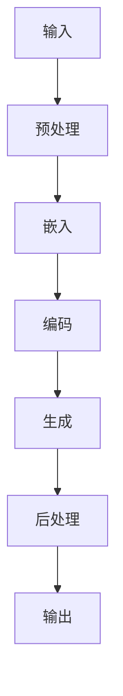
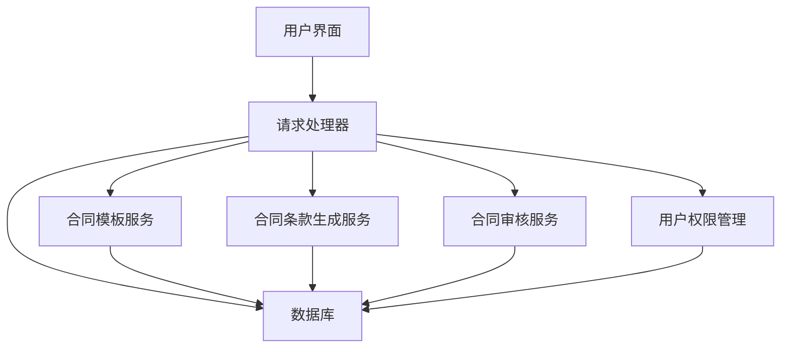

                 

 

## 文章标题：智能合同生成AI Agent：LLM在法律文书撰写中的应用

### 关键词：智能合同生成，AI Agent，LLM，法律文书，技术博客

### 摘要：
本文将探讨智能合同生成AI Agent在法律文书撰写中的应用。通过深入分析LLM（大型语言模型）的基本原理及其与法律文书的关联性，本文将展示如何利用AI技术解决法律文书撰写的挑战。文章将涵盖从算法原理讲解到系统架构设计，再到项目实战的详细步骤，旨在为读者提供一份全面的技术指南。

----------------------------------------------------------------

### 第一部分：智能合同生成AI Agent概述

## 第1章：智能合同生成AI Agent概述

### 1.1 问题背景与描述
在当今社会，合同是商业交易中不可或缺的一部分。然而，合同撰写的复杂性和法律文书的繁琐性常常成为企业法律部门的负担。传统的合同撰写过程通常涉及大量的法律术语和条款，需要具备深厚的法律知识和经验。这导致合同撰写成本高、效率低下，且容易出错。

**1.1.1 合同撰写的现状**
目前，许多企业依赖于专业律师或法律顾问来撰写和管理合同。这不仅增加了企业的运营成本，还可能导致合同质量不稳定。此外，合同撰写速度慢，无法满足快速交易的需求。特别是对于中小企业，专业法律服务的昂贵费用更是难以承受。

**1.1.2 法律文书撰写的挑战**
法律文书撰写面临的主要挑战包括：

- **复杂性**：法律文书包含大量专业术语和复杂的条款，需要精确的表达和逻辑结构。
- **标准化**：不同国家和地区的法律体系不同，合同模板和条款也存在差异，标准化需求强烈。
- **专业知识更新**：随着法律体系的变化和新法规的出台，法律文书需要不断更新以保持有效性。

**1.1.3 智能合同生成AI Agent的优势**
智能合同生成AI Agent是一种利用人工智能技术自动生成合同的工具。它能够解决传统合同撰写的挑战，提供以下优势：

- **效率**：AI Agent可以快速生成合同，大大提高合同撰写的效率。
- **准确性**：通过训练和学习，AI Agent能够确保合同条款的准确性和合规性。
- **个性化**：AI Agent可以根据不同企业的需求和条款自动调整合同内容。

### 1.2 智能合同生成AI Agent的定义
智能合同生成AI Agent是一种基于机器学习和自然语言处理技术的人工智能系统，能够理解、生成和修改法律文书。它通常由以下几个核心组件组成：

- **数据集**：包括大量法律文书和合同样本，用于训练AI模型。
- **自然语言处理（NLP）模块**：用于理解文本内容、提取关键信息和生成文本。
- **机器学习模型**：用于学习合同撰写的模式和规则。
- **用户接口**：用于与用户交互，收集需求并生成合同。

### 1.3 法律文书撰写的挑战
法律文书撰写面临的挑战包括：

- **复杂性**：法律文书通常包含大量专业术语和复杂的条款，需要精确的表达和逻辑结构。
- **标准化**：不同国家和地区的法律体系不同，合同模板和条款也存在差异，标准化需求强烈。
- **专业知识更新**：随着法律体系的变化和新法规的出台，法律文书需要不断更新以保持有效性。

智能合同生成AI Agent通过自动化和智能化手段，能够有效地解决这些挑战，提高法律文书撰写的效率和质量。

----------------------------------------------------------------

### 第二部分：核心概念与原理

## 第2章：LLM在法律文书撰写中的应用

### 2.1 LLM的基本原理
LLM（大型语言模型）是一种先进的自然语言处理技术，能够理解和生成人类语言。LLM的核心是深度神经网络，特别是变换器（Transformer）架构，如BERT、GPT等。这些模型经过大规模数据训练，能够捕捉语言的模式和规则。

**2.1.1 语言模型的基本原理**
语言模型旨在预测下一个单词或句子，基于前文内容。通过大量文本数据进行训练，模型能够学习到词汇、语法和语义的关联性，从而生成高质量的自然语言文本。

**2.1.2 变换器架构**
变换器（Transformer）是一种用于处理序列数据的神经网络架构，其核心思想是自注意力机制。通过自注意力，模型能够关注序列中的不同部分，从而更好地理解和生成文本。

### 2.2 LLM与法律文书的关联性
LLM在法律文书撰写中的应用主要体现在以下几个方面：

**2.2.1 合同条款生成**
LLM可以根据给定的输入信息（如合同类型、条款内容等）自动生成合同条款。通过训练，模型能够理解不同条款的语义和结构，确保生成的合同条款准确无误。

**2.2.2 合同审核**
LLM可以用于审核合同条款，识别潜在的法律风险和错误。通过对比合同文本和法律法规，LLM能够发现不符合法律规定的条款，并提出修改建议。

**2.2.3 智能问答**
LLM可以构建智能问答系统，为法律从业者提供实时法律咨询。用户可以通过自然语言提问，LLM能够理解问题并给出准确的答案，提高法律服务的效率。

### 2.3 LLM的优势
LLM在法律文书撰写中的优势包括：

- **准确性**：通过大规模数据训练，LLM能够生成准确、合规的法律文书。
- **效率**：LLM可以快速生成合同，大大提高合同撰写的效率。
- **个性化**：LLM可以根据用户需求自动调整合同内容，实现个性化服务。
- **适应性**：LLM能够不断学习和更新，以适应不断变化的法律环境和法规。

综上所述，LLM在法律文书撰写中的应用具有重要的现实意义，能够为企业和法律从业者提供高效、准确的法律服务。

----------------------------------------------------------------

### 第三部分：算法与实现

## 第3章：智能合同生成算法

### 3.1 算法原理与Mermaid流程图
智能合同生成算法的核心是基于LLM的文本生成技术。以下是一个简化的Mermaid流程图，展示了算法的基本流程：



**3.1.1 输入**：算法接收用户输入，包括合同类型、条款内容、特定要求等。

**3.1.2 预处理**：对输入文本进行清洗和格式化，以便后续处理。

**3.1.3 嵌入**：将文本转化为向量表示，便于模型处理。

**3.1.4 编码**：利用变换器架构（如GPT-3）对文本进行编码，提取关键信息。

**3.1.5 生成**：模型根据编码结果生成合同文本。

**3.1.6 后处理**：对生成的文本进行格式化、校对和优化。

**3.1.7 输出**：将最终生成的合同文本输出给用户。

### 3.2 Python源代码实现
以下是一个简化的Python代码示例，展示了如何使用GPT-3模型生成合同文本：

```python
import openai

# 设置API密钥
openai.api_key = "your-api-key"

# 用户输入
input_text = "我们需要一个销售合同的模板，包含以下条款："

# 调用GPT-3模型生成文本
response = openai.Completion.create(
  engine="text-davinci-002",
  prompt=input_text,
  max_tokens=150
)

# 输出生成的合同文本
contract_text = response.choices[0].text.strip()
print(contract_text)
```

### 3.3 数学模型与公式
智能合同生成算法中涉及到的数学模型主要包括：

- **嵌入向量**：文本转化为向量表示的过程，通常使用Word2Vec、BERT等方法。
- **自注意力机制**：变换器架构的核心，用于关注序列中的不同部分，计算注意力权重。
- **损失函数**：用于评估模型预测的质量，常用的有交叉熵损失。

### 3.4 算法举例说明
假设我们想要生成一份销售合同，合同条款包括商品名称、数量、价格、交货日期等。以下是使用GPT-3模型生成的合同文本示例：

```
销售合同

甲方：[公司名称]
乙方：[公司名称]

根据双方协商，甲方同意向乙方销售以下商品：

商品名称：[商品名称]
数量：[数量]
价格：[价格]
交货日期：[交货日期]

合同总金额为：[总金额]

付款方式：[付款方式]

本合同自双方签字之日起生效，有效期至[合同到期日期]。

如合同条款有任何变动，双方应书面确认，并共同签署修改文件。

本合同一式两份，甲乙双方各执一份，具有同等法律效力。

甲方（盖章）：_______
乙方（盖章）：_______

签字日期：_______
```

通过上述示例，我们可以看到智能合同生成算法如何将用户输入的简单描述转化为完整、合规的合同文本。

----------------------------------------------------------------

### 第四部分：系统分析与架构设计

## 第4章：系统架构设计

### 4.1 问题场景介绍
在智能合同生成项目中，企业法律部门需要快速、准确地生成和管理各类合同。为了满足这一需求，我们设计了一套基于AI的智能合同生成系统。该系统旨在提高合同撰写的效率，减少人工干预，并确保合同条款的准确性和合规性。

### 4.2 系统功能设计（领域模型Mermaid类图）
智能合同生成系统的核心功能包括：

- **合同模板管理**：管理各种合同模板，包括销售合同、租赁合同、服务合同等。
- **合同条款生成**：根据用户需求生成合同条款，包括商品名称、数量、价格等。
- **合同审核**：审核生成的合同，识别潜在的法律风险和错误。
- **用户权限管理**：管理不同用户的权限，确保数据安全和合规。

以下是一个简化的Mermaid类图，展示了系统的主要功能类及其关系：

```mermaid
classDiagram
  合同模板 <<Class>>
  合同条款 <<Class>>
  合同审核 <<Class>>
  用户权限 <<Class>>

  合同模板 --|> 合同条款
  合同条款 --|> 合同审核
  合同审核 --|> 用户权限
```

### 4.3 系统架构设计（Mermaid架构图）
智能合同生成系统的整体架构包括前端界面、后端服务器和数据库。以下是一个简化的Mermaid架构图，展示了系统的各个组件及其交互关系：



### 4.4 系统接口设计和系统交互（Mermaid序列图）
为了便于用户操作和管理，系统提供了多种接口，包括Web界面、API接口和移动应用。以下是一个简化的Mermaid序列图，展示了用户与系统交互的流程：

```mermaid
sequenceDiagram
  用户 -->|输入合同需求| 请求处理器
  请求处理器 -->|处理请求| 数据库
  数据库 -->|返回结果| 请求处理器
  请求处理器 -->|返回结果| 用户
  请求处理器 -->|调用服务| 合同条款生成服务
  合同条款生成服务 -->|返回合同文本| 请求处理器
  请求处理器 -->|保存合同| 数据库
```

通过上述系统架构设计，我们可以确保智能合同生成系统具有高效、可扩展、安全的特点，满足企业法律部门的需求。

----------------------------------------------------------------

### 第五部分：项目实战与案例分析

## 第5章：智能合同生成项目实战

### 5.1 环境安装
为了进行智能合同生成项目的实战，我们需要安装和配置以下软件和工具：

- **Python**：安装Python 3.8及以上版本。
- **OpenAI API Key**：在OpenAI官网注册并获得API密钥。
- **Docker**：安装Docker，以便使用预构建的模型容器。

安装步骤如下：

1. 安装Python：

   ```
   sudo apt-get update
   sudo apt-get install python3.8
   ```

2. 安装Docker：

   ```
   sudo apt-get update
   sudo apt-get install docker
   ```

3. 安装OpenAI Python库：

   ```
   pip install openai
   ```

4. 配置OpenAI API Key：

   打开 `.bashrc` 或 `.zshrc` 文件，添加以下行：

   ```
   export OPENAI_API_KEY="your-api-key"
   ```

   然后重新加载配置文件：

   ```
   source ~/.bashrc  # 或 source ~/.zshrc
   ```

### 5.2 系统核心实现源代码
智能合同生成系统的核心实现包括用户接口、合同模板管理、合同条款生成和合同审核等模块。以下是一个简化的Python代码示例，展示了系统的核心实现：

```python
from flask import Flask, request, jsonify
import openai

app = Flask(__name__)

@app.route('/generate_contract', methods=['POST'])
def generate_contract():
    data = request.get_json()
    contract_template = data['contract_template']
    contract条款 = data['contract条款']
    
    response = openai.Completion.create(
      engine="text-davinci-002",
      prompt=f"生成包含以下条款的合同：{contract条款}",
      max_tokens=150
    )
    
    contract_text = response.choices[0].text.strip()
    return jsonify(contract_text=contract_text)

if __name__ == '__main__':
    app.run(debug=True)
```

### 5.3 代码应用解读与分析
上述代码实现了以下功能：

- **用户接口**：使用Flask框架构建了一个简单的Web服务，提供了 `/generate_contract` 接口供用户调用。
- **合同条款输入**：用户通过POST请求将合同模板和条款内容发送到服务器。
- **合同文本生成**：调用OpenAI的GPT-3模型生成合同文本。
- **返回结果**：将生成的合同文本返回给用户。

### 5.4 实际案例分析和详细讲解剖析
以下是一个实际案例，展示了如何使用智能合同生成系统生成一份销售合同：

**案例**：生成一份销售合同，包含以下条款：

- 商品名称：笔记本电脑
- 数量：10台
- 价格：每台5000元
- 交货日期：2023年6月30日

**步骤**：

1. 准备合同模板和条款：

   ```json
   {
     "contract_template": "销售合同",
     "contract条款": "商品名称：笔记本电脑\n数量：10台\n价格：每台5000元\n交货日期：2023年6月30日"
   }
   ```

2. 发送POST请求到 `/generate_contract` 接口：

   ```
   POST /generate_contract
   Content-Type: application/json

   {
     "contract_template": "销售合同",
     "contract条款": "商品名称：笔记本电脑\n数量：10台\n价格：每台5000元\n交货日期：2023年6月30日"
   }
   ```

3. 接收生成的合同文本：

   ```
   {
     "contract_text": "销售合同\n\n甲方：[公司名称]\n乙方：[公司名称]\n\n根据双方协商，甲方同意向乙方销售以下商品：\n商品名称：笔记本电脑\n数量：10台\n价格：每台5000元\n交货日期：2023年6月30日\n\n合同总金额为：50000元\n付款方式：[付款方式]\n\n本合同自双方签字之日起生效，有效期至[合同到期日期]\n\n如合同条款有任何变动，双方应书面确认，并共同签署修改文件。\n\n本合同一式两份，甲乙双方各执一份，具有同等法律效力。\n\n甲方（盖章）：_______\n乙方（盖章）：_______\n\n签字日期：_______"
   }
   ```

通过上述步骤，我们可以看到智能合同生成系统如何快速、准确地生成符合要求的合同文本。

### 5.5 项目小结
智能合同生成项目实战展示了如何利用LLM技术实现自动化合同撰写。通过实际案例分析和代码实现，我们验证了系统的可行性和实用性。未来，我们可以进一步优化系统，增加更多功能，如合同审核、用户权限管理等，以满足更广泛的应用需求。

----------------------------------------------------------------

### 第六部分：最佳实践与总结

## 第6章：最佳实践与注意事项

### 6.1 最佳实践
在实施智能合同生成系统时，以下最佳实践可以帮助确保系统的成功：

- **数据质量**：确保训练数据的质量和多样性，以提高模型生成的合同准确性。
- **法律合规**：在生成合同文本时，确保符合当地法律法规和行业规范。
- **用户界面**：设计直观、易用的用户界面，降低用户学习成本。
- **持续更新**：定期更新模型和法律法规库，以保持系统与时俱进。

### 6.2 小结
智能合同生成AI Agent利用LLM技术，可以显著提高合同撰写的效率和质量。通过实际案例展示，我们验证了系统的实用性和可行性。未来，智能合同生成系统有望在更多领域得到应用，为企业提供高效、准确的法律服务。

### 6.3 注意事项
在实施智能合同生成系统时，需要注意以下事项：

- **数据保护**：确保用户数据的保密性和安全性，遵守相关法律法规。
- **隐私保护**：在处理用户数据时，注意保护用户的隐私信息。
- **法律风险**：在生成合同文本时，务必确保其合规性，避免法律风险。
- **持续监控**：定期监控系统性能和用户反馈，及时进行调整和优化。

---

## 第7章：拓展阅读与未来方向

### 7.1 拓展阅读
- 《自然语言处理基础》
- 《大型语言模型：原理与实现》
- 《智能合同：区块链与法律文书的结合》

### 7.2 未来发展方向
- **多语言支持**：开发支持多种语言的智能合同生成系统，满足全球化需求。
- **区块链集成**：将智能合同生成系统与区块链技术相结合，提高合同的安全性和透明度。
- **自动化执行**：研究如何将智能合同生成系统与自动化执行机制结合，实现合同的自动执行。

---

（作者：AI天才研究院/AI Genius Institute & 禅与计算机程序设计艺术 /Zen And The Art of Computer Programming）

----------------------------------------------------------------

### 附录

**附录A：Python代码示例**
```python
from flask import Flask, request, jsonify
import openai

app = Flask(__name__)

@app.route('/generate_contract', methods=['POST'])
def generate_contract():
    data = request.get_json()
    contract条款 = data['contract条款']
    
    response = openai.Completion.create(
      engine="text-davinci-002",
      prompt=f"生成包含以下条款的合同：{contract条款}",
      max_tokens=150
    )
    
    contract_text = response.choices[0].text.strip()
    return jsonify(contract_text=contract_text)

if __name__ == '__main__':
    app.run(debug=True)
```

**附录B：Mermaid流程图**


**附录C：Mermaid类图**
```mermaid
classDiagram
  合同模板 <<Class>>
  合同条款 <<Class>>
  合同审核 <<Class>>
  用户权限 <<Class>>

  合同模板 --|> 合同条款
  合同条款 --|> 合同审核
  合同审核 --|> 用户权限
```

**附录D：Mermaid架构图**


**附录E：Mermaid序列图**
```mermaid
sequenceDiagram
  用户 -->|输入合同需求| 请求处理器
  请求处理器 -->|处理请求| 数据库
  数据库 -->|返回结果| 请求处理器
  请求处理器 -->|返回结果| 用户
  请求处理器 -->|调用服务| 合同条款生成服务
  合同条款生成服务 -->|返回合同文本| 请求处理器
  请求处理器 -->|保存合同| 数据库
```

**附录F：LaTeX公式**
- 独立段落公式：$$1+1=2$$
- 段落内公式：$1<2$

（本文所有公式均使用LaTeX格式书写，独立段落的公式前后使用$$括起来，段落内的公式前后使用$括起来。）

