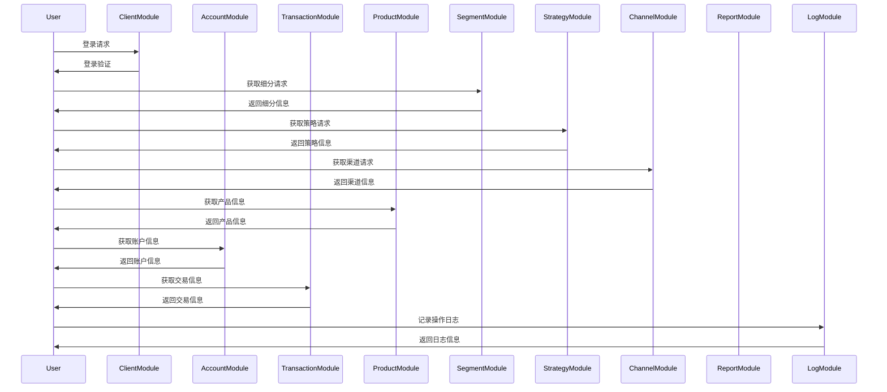

                 

### 第1章：问题背景与核心概念

#### 1.1 问题背景

在当今快速发展的金融科技时代，商业银行正面临着前所未有的挑战与机遇。一方面，金融市场的竞争日益激烈，传统银行业务模式受到冲击，客户需求日益多样化和个性化，传统的人工客户关系管理和价值评估方式已难以满足现代商业银行的发展需求。另一方面，大数据、人工智能、云计算等新技术的迅速崛起，为商业银行提供了新的发展契机。通过智能技术，银行可以更精准地评估客户价值，优化客户关系管理，从而提高客户满意度和忠诚度，实现可持续发展。

**行业现状与挑战**：当前，商业银行在客户价值评估与关系管理方面主要面临以下挑战：

1. **数据碎片化**：银行拥有大量的客户数据，但这些数据通常分散在不同的系统和服务中，难以进行统一管理和分析。
2. **评估方法单一**：现有客户价值评估方法多以财务指标为主，难以全面反映客户对银行的贡献和价值。
3. **客户关系管理效率低下**：传统的客户关系管理方式主要依赖于人工，效率低下且成本高昂。
4. **技术能力不足**：商业银行在智能技术方面的投入和应用尚不充分，难以实现智能化、个性化服务。

**客户价值评估的意义**：客户价值评估对于商业银行至关重要，主要体现在以下几个方面：

1. **精准定位客户**：通过评估客户的价值，银行可以识别出高价值客户，为其提供定制化服务，提高客户满意度。
2. **优化资源配置**：客户价值评估可以帮助银行合理分配资源，将有限的资源投入到高价值客户身上，提高业务收益。
3. **提升客户忠诚度**：通过个性化的客户关系管理，银行可以增强客户黏性，提高客户忠诚度。
4. **优化业务策略**：客户价值评估可以为银行提供决策支持，帮助制定更为科学合理的业务策略。

**关系管理的重要性**：关系管理是商业银行提高客户价值的重要手段，其重要性体现在以下几个方面：

1. **增强客户体验**：通过有效的客户关系管理，银行可以提升客户的整体体验，增强客户的归属感和忠诚度。
2. **提高客户满意度**：个性化的客户服务和及时的客户反馈机制，有助于提高客户满意度。
3. **促进业务增长**：良好的客户关系管理可以带动银行的业务增长，包括增加存款、贷款等业务。
4. **降低客户流失率**：通过持续的客户关系管理，银行可以降低客户流失率，保持客户稳定。

综上所述，智能商业银行客户价值评估与关系管理不仅是应对行业挑战的关键举措，也是实现银行数字化转型和提升竞争力的必要手段。在接下来的章节中，我们将深入探讨客户价值评估与关系管理的基本概念、方法和策略，以期为商业银行提供可行的实施路径。

### 第2章：核心概念与联系

#### 2.1 核心概念原理

**客户价值评估**：客户价值评估是指通过对客户数据进行分析和挖掘，对客户对银行的贡献和价值进行定量和定性评价，以指导银行制定相应的营销策略和服务方案。其核心目的是识别出高价值客户，优化资源分配，提高业务收益。

在商业银行中，客户价值评估具有以下作用：

1. **精准营销**：通过评估客户价值，银行可以针对不同价值的客户制定个性化的营销策略，提高营销效果。
2. **风险控制**：客户价值评估可以帮助银行识别潜在风险客户，采取相应的风险控制措施。
3. **业务优化**：通过评估客户对银行的贡献，银行可以优化业务流程，提高运营效率。

**关系管理**：关系管理是指银行通过一系列策略和措施，与客户建立长期、稳定、互惠互利的关系，以增强客户满意度和忠诚度。其核心目标是提升客户体验，促进客户忠诚，实现业务增长。

在商业银行中，关系管理包括以下几个方面：

1. **客户细分**：根据客户价值、需求和特征，将客户划分为不同的群体，提供个性化的服务。
2. **互动与沟通**：通过多种渠道与客户保持沟通，了解客户需求和反馈，提供及时、有效的服务。
3. **价值创造**：通过提供增值服务、优惠活动和个性化定制，增加客户对银行的黏性和忠诚度。
4. **风险预警**：通过分析客户行为数据，及时发现潜在风险，采取预防措施。

**客户价值评估与关系管理的关联**：客户价值评估与关系管理密切相关，两者相辅相成，共同作用于提升银行客户价值和竞争力。

1. **客户价值评估为关系管理提供数据支持**：通过评估客户价值，银行可以了解客户的需求和贡献，为制定关系管理策略提供依据。
2. **关系管理提升客户价值评估的效果**：通过有效的客户关系管理，银行可以提升客户的满意度和忠诚度，从而提高客户价值评估的准确性。
3. **两者共同实现银行发展目标**：客户价值评估和关系管理都是为了实现银行的战略目标，包括提高市场份额、增加收入和提升客户满意度等。

综上所述，客户价值评估与关系管理是商业银行提高客户价值、实现可持续发展的关键环节。在接下来的章节中，我们将进一步探讨客户价值评估的方法和关系管理的策略，以期为商业银行提供实用的实施指导。

#### 2.2 概念属性特征对比表格

在探讨客户价值评估方法和关系管理策略时，了解不同方法的特点和适用场景是非常重要的。以下是一个关于客户价值评估方法和关系管理策略的对比表格，旨在帮助读者更好地理解各个概念及其应用。

| 方法/策略        | 定义                                                                                   | 主要优点                     | 主要缺点                     | 适用场景                  |
|-----------------|----------------------------------------------------------------------------------------|-----------------------------|-----------------------------|--------------------------|
| 客户价值评估方法 | 通过分析客户数据，对客户对银行的贡献和价值进行评价。                                     | 精准识别高价值客户           | 对数据质量要求高             | 营销策略制定、资源分配   |
| 关系管理策略    | 通过与客户建立和维持长期、稳定的关系，以提升客户满意度和忠诚度。                         | 提高客户黏性和忠诚度         | 需要大量人力资源和沟通成本 | 客户体验提升、业务增长   |
| 数据挖掘方法    | 从大量数据中提取有价值的信息，帮助银行发现隐藏的客户需求和潜在市场。                     | 提供深入的市场洞察           | 难以实时响应                 | 风险管理、市场分析       |
| 客户细分方法    | 根据客户的不同特征和需求，将客户划分为不同的群体，提供个性化服务。                       | 优化资源利用和营销效果       | 需要对客户数据进行深度分析   | 营销策略制定、客户服务   |
| 个性化服务策略 | 根据客户的具体需求和偏好，提供定制化的产品和服务。                                     | 提高客户满意度和忠诚度       | 需要大量定制化和个性化资源   | 高端客户服务、客户维护   |

#### 客户价值评估方法

- **财务指标法**：通过客户的财务行为，如存款、贷款、投资等，评估其对银行的贡献。优点是直接、简单，但可能忽视其他非财务因素。
- **行为分析法**：通过客户的行为数据，如交易频率、交易金额等，评估其对银行的活跃度和忠诚度。优点是全面、动态，但需要大量的行为数据支持。
- **平衡计分法**：综合考虑财务、客户满意度、内部流程、学习与成长四个维度，评估客户价值。优点是综合、全面，但实施难度较高。

#### 关系管理策略

- **单一客户关系管理**：专注于单个客户，提供个性化的服务，提升客户满意度。优点是服务个性化，但成本较高。
- **多渠道关系管理**：通过电话、邮件、短信、社交媒体等多种渠道与客户互动，增强客户体验。优点是覆盖面广，但需要协调多个渠道。
- **持续关系管理**：通过定期回访、满意度调查等方式，持续关注和改进客户关系。优点是长期稳定，但需要持续投入。

通过上述对比，可以看出不同的评估方法和关系管理策略各有优缺点，适用于不同的场景和目标。商业银行应根据自身情况，选择合适的方法和策略，以实现客户价值最大化。

#### 2.3 ER实体关系图架构

在客户价值评估与关系管理中，理解不同实体之间的关联关系对于设计有效的系统至关重要。以下是一个ER实体关系图的示例，用于展示商业银行中的客户、账户和交易等实体之间的关系。

```mermaid
erDiagram
    Customer &&<-.. Account : "owns"
    Account &&>-.. Transaction : "has"
    Customer &&>-.. Transaction : "initiates"
    Customer &&>-.. Product : "owns"
    Product &&>-.. Transaction : "sold"

    Customer <|.. ContactInformation : "has"
    Account <|.. AccountDetails : "has"
    Transaction <|.. TransactionDetails : "has"
    Product <|.. ProductDetails : "has"

    Customer ||--|{ CustomerSegment } : "belongs_to"
    Product ||--|{ ProductCategory } : "belongs_to"

    Customer ..|> Portfolio : "has"
    Product ..|> Portfolio : "has"

    Customer ; Account ; Transaction ; Product ; ProductCategory ; CustomerSegment ; Portfolio ; ContactInformation ; AccountDetails ; TransactionDetails ; ProductDetails
```

在这个ER图中：

- **Customer（客户）**：代表商业银行的客户，是系统的核心实体。客户拥有多个账户和交易，也可能拥有多个产品。
- **Account（账户）**：代表客户的银行账户，一个账户可以包含多个交易，同时属于一个客户。
- **Transaction（交易）**：代表客户在账户上的交易行为，一个交易可以属于一个账户，也可以由一个客户发起。
- **Product（产品）**：代表银行提供的各种金融产品，如存款、贷款、信用卡等，一个产品可以被多个客户拥有并在交易中销售。
- **CustomerSegment（客户细分）**：用于对客户进行分类，帮助银行实施个性化服务和营销策略。
- **ProductCategory（产品分类）**：用于对产品进行分类，帮助银行进行产品管理和优化。
- **Portfolio（投资组合）**：代表客户的投资组合，一个客户可以有多个投资组合，每个投资组合可以包含多个产品。

通过ER图，我们可以清晰地看到各个实体之间的关系，包括拥有一对多（如客户与账户）、多对多（如客户与投资组合）等。这种关系架构为系统设计提供了明确的指导，有助于实现客户价值评估与关系管理的功能需求。

#### 3.1 数据收集与处理

在构建智能商业银行客户价值评估系统时，数据收集与处理是至关重要的环节。首先，我们需要明确商业银行可用的数据源，这些数据通常包括：

1. **客户数据**：如客户的个人基本信息（年龄、性别、职业等）、联系方式（电话、邮箱等）、开户信息等。
2. **账户数据**：包括客户的账户余额、交易历史、账户类型等。
3. **交易数据**：涵盖客户在银行的各种交易行为，如存款、取款、转账、贷款还款等。
4. **行为数据**：如客户登录记录、访问页面、使用频率等。
5. **市场数据**：包括宏观经济指标、行业动态、竞争对手信息等。

**数据收集方法**：

1. **内部数据**：通过银行的CRM系统、账户管理系统、交易系统等获取。
2. **外部数据**：通过公开数据源（如政府统计、行业报告等）和第三方数据服务提供商获取。
3. **社交媒体数据**：通过社交媒体平台分析客户的行为和反馈。

**数据处理步骤**：

1. **数据清洗**：去除重复、缺失和错误的数据，确保数据质量。
2. **数据转换**：将不同数据源的数据格式进行统一，如将不同系统的数据格式转换为统一的数据库格式。
3. **数据归一化**：对不同数据源中的相同或相似信息进行标准化处理，如将年龄统一表示为整数。

**数据处理工具**：

1. **数据库系统**：如MySQL、PostgreSQL等，用于存储和管理大量结构化数据。
2. **数据处理平台**：如Hadoop、Spark等，用于大规模数据处理和分析。
3. **数据可视化工具**：如Tableau、Power BI等，用于数据分析和展示。

通过有效的数据收集与处理，银行可以获得高质量的数据，为后续的客户价值评估和关系管理提供可靠的基础。

#### 3.2 评估模型构建

在智能商业银行客户价值评估系统中，选择合适的评估模型至关重要。以下是一些常见的客户价值评估模型，以及它们的构建和优化策略。

**评估模型概述**：

1. **生命周期价值（CLV）模型**：CLV模型通过预测客户在未来一段时间内的总收益，评估客户的价值。公式为：
   $$ \text{CLV} = \sum_{t=1}^{n} \frac{\text{预计未来收益}}{(1 + r)^t} $$
   其中，\( r \) 是折现率，\( n \) 是预测期数。

2. **行为价值（BLV）模型**：BLV模型基于客户的行为数据，如交易频率、交易金额等，评估客户的价值。常见的BLV模型包括RFM（Recency, Frequency, Monetary）模型，其公式为：
   $$ \text{BLV} = \alpha \cdot \text{Recency} + \beta \cdot \text{Frequency} + \gamma \cdot \text{Monetary} $$
   其中，\( \alpha, \beta, \gamma \) 是权重系数。

3. **数据驱动模型**：如机器学习模型，通过历史数据训练模型，预测客户的未来价值。常见的模型包括逻辑回归、决策树、随机森林、神经网络等。

**模型选择与优化**：

1. **模型选择策略**：
   - **基于业务需求**：根据银行的具体业务需求，选择适合的评估模型。例如，对于短期决策，可以优先选择行为价值模型；对于长期规划，可以采用生命周期价值模型。
   - **数据质量**：选择数据质量高、特征丰富的模型。对于缺失值较多或噪声较大的数据，可以使用机器学习模型进行预处理。

2. **模型优化策略**：
   - **特征工程**：通过特征选择和特征转换，提高模型的准确性和泛化能力。例如，可以采用主成分分析（PCA）降维，或使用特征重要性评估方法。
   - **模型调参**：调整模型的参数，以获得最佳性能。可以使用交叉验证、网格搜索等技术，找到最优参数组合。
   - **模型融合**：结合多个模型的优势，构建集成模型，提高预测准确性。例如，可以使用Bagging、Boosting等技术。

通过选择合适的评估模型并进行优化，银行可以更准确地评估客户的价值，从而制定出更为科学的营销策略和服务方案。

### 4.1 客户细分策略

在智能商业银行的客户关系管理中，客户细分策略是一项核心任务。通过将客户按照不同的特征和需求划分为不同的群体，银行可以针对每个群体制定个性化的服务和营销策略，从而提高客户满意度和忠诚度。

**客户细分方法**：

1. **基于客户价值的细分**：这是最常见的客户细分方法。通过分析客户的财务行为（如存款金额、贷款余额、投资金额等）和行为数据（如交易频率、交易金额等），将客户分为高价值客户、中价值客户和低价值客户。

2. **基于客户行为的细分**：这种方法关注客户的日常行为，如登录频率、使用功能、交易习惯等。根据行为数据，可以将客户划分为高频活跃用户、低频活跃用户和非活跃用户。

3. **基于客户需求的细分**：通过分析客户的需求和偏好，将客户分为标准用户、高端用户和特殊用户。例如，针对有理财需求的高净值客户，银行可以提供个性化的理财服务和产品。

**细分策略实施**：

1. **数据收集与处理**：首先，银行需要收集客户的各类数据，包括财务数据、行为数据和需求数据。然后，通过数据清洗、转换和归一化，确保数据的质量和一致性。

2. **模型构建与评估**：基于收集到的数据，构建客户细分模型。可以使用机器学习算法，如K均值聚类、决策树等，对客户进行分类。模型构建后，需要进行评估和优化，确保分类效果良好。

3. **策略制定与实施**：根据细分结果，制定个性化的服务和营销策略。例如，对于高价值客户，可以提供专属优惠、定制化服务；对于非活跃用户，可以采取唤醒策略，如发送个性化的营销邮件或短信。

4. **监控与调整**：实施客户细分策略后，银行需要定期监控效果，并根据实际情况进行调整。例如，通过分析客户反馈和行为变化，优化细分策略和个性化服务。

通过有效的客户细分策略，银行可以更好地理解客户，提供个性化服务，提高客户满意度和忠诚度，从而实现业务增长和可持续发展。

### 4.2 客户互动与体验优化

在智能商业银行的客户关系管理中，客户互动和体验优化是提升客户满意度和忠诚度的关键环节。通过有效的互动渠道选择和用户体验优化，银行可以与客户建立更加紧密的关系，从而增强客户的归属感和忠诚度。

**互动渠道选择**：

1. **线上渠道**：随着互联网的普及，线上渠道成为银行与客户互动的主要途径。常见的线上互动渠道包括：
   - **网站**：银行官方网站是客户获取信息、办理业务的重要平台。通过优化网站界面和功能，提供便捷的在线服务和个性化推荐，可以增强客户的体验。
   - **移动应用**：银行移动应用是客户日常使用最频繁的工具之一。通过开发功能丰富、易于操作的应用，银行可以实现与客户的实时互动，提供个性化的服务。

2. **社交媒体**：社交媒体平台如微信、微博等，已经成为银行与客户互动的重要渠道。银行可以通过这些平台发布新闻、活动信息，与客户进行互动，收集客户反馈。

3. **电子邮件**：电子邮件是一种传统的互动渠道，适用于发送重要通知、营销信息和客户关怀邮件。通过个性化的邮件内容，银行可以提升邮件的打开率和阅读率。

4. **电话与在线客服**：电话和在线客服是解决客户问题、提供即时支持的重要渠道。银行需要建立高效的客户服务团队，确保客户在遇到问题时能够快速得到帮助。

**用户体验优化**：

1. **界面设计**：良好的界面设计是提供优质用户体验的基础。银行需要设计简洁、直观、易操作的界面，确保客户能够轻松找到所需功能。

2. **个性化服务**：通过收集和分析客户数据，银行可以提供个性化的服务。例如，根据客户的偏好和历史行为，推荐适合的产品和服务，提高客户的满意度。

3. **快速响应**：在客户互动过程中，快速响应是关键。银行需要建立高效的客户服务机制，确保客户的问题和需求能够得到及时解决。

4. **数据驱动**：通过数据分析和反馈，银行可以不断优化客户互动和体验。例如，通过分析客户的使用行为和反馈，调整服务策略和产品功能。

5. **安全与隐私**：在提供优质服务的同时，银行需要确保客户数据的安全和隐私。通过实施严格的数据保护措施，银行可以增强客户的信任感。

通过选择合适的互动渠道和优化用户体验，银行可以提升客户的满意度和忠诚度，建立长期稳定的客户关系，从而实现业务的持续增长。

### 5.1 系统功能设计

在智能商业银行客户关系管理系统的设计与实现过程中，明确系统功能需求是至关重要的。以下是对系统功能需求的分析，以及如何通过领域模型进行系统设计。

**系统需求分析**：

1. **用户管理**：系统需要支持用户的注册、登录、权限管理等功能。
2. **客户信息管理**：系统应能够存储和管理客户的个人信息，包括基本信息（如姓名、年龄、职业等）、账户信息、交易历史等。
3. **客户细分管理**：系统需要支持客户细分的定义和管理，如基于客户价值、行为和需求进行细分。
4. **营销策略管理**：系统应能够定义和执行不同的营销策略，包括个性化推荐、优惠活动、邮件/短信营销等。
5. **客户互动管理**：系统需要支持多种互动渠道的管理，如网站、移动应用、社交媒体、电子邮件、电话和在线客服。
6. **数据分析与报告**：系统需要提供强大的数据分析功能，生成各类报告，帮助管理层了解客户行为和市场趋势。
7. **系统监控与日志**：系统应具备实时监控和日志记录功能，确保系统的稳定运行和问题的快速定位。

**领域模型设计**：

领域模型（Domain Model）是系统设计的重要工具，通过定义系统中的关键实体和它们之间的关系，可以直观地展示系统的功能和结构。以下是一个领域模型的示例，使用Mermaid绘制：

```mermaid
classDiagram
    User <<--o Client : "owns"
    Client *-- Account : "has"
    Account *-- Transaction : "has"
    Transaction *-- Product : "sold"
    Client <.. Segment : "belongs_to"
    Segment *-- Strategy : "uses"
    Strategy *-- Channel : "uses"
    Channel *-- Interaction : "uses"
    Channel *-- Report : "uses"
    Report *-- Log : "has"

    User : User management
    Client : Customer information
    Account : Account details
    Transaction : Transaction history
    Product : Financial products
    Segment : Customer segments
    Strategy : Marketing strategies
    Channel : Interaction channels
    Interaction : Customer interactions
    Report : Data reports
    Log : System logs
```

在这个领域模型中：

- **User（用户）**：代表系统管理员或运营人员，负责系统的管理。
- **Client（客户）**：代表商业银行的客户，拥有多个账户和交易。
- **Account（账户）**：代表客户的银行账户，包含多个交易记录。
- **Transaction（交易）**：代表客户的交易行为，包括存款、取款、转账等。
- **Product（产品）**：代表银行提供的金融产品，如存款、贷款、信用卡等。
- **Segment（细分）**：代表客户细分，用于分类和管理客户。
- **Strategy（策略）**：代表营销策略，用于定义和执行个性化服务。
- **Channel（渠道）**：代表互动渠道，包括网站、移动应用、社交媒体、电子邮件等。
- **Interaction（互动）**：代表客户与银行之间的互动行为。
- **Report（报告）**：代表数据分析和报告，帮助管理层了解业务状况。
- **Log（日志）**：代表系统日志，用于记录系统运行情况和问题日志。

通过领域模型，可以清晰地展示系统中的关键实体和它们之间的关系，为后续的系统架构设计和实现提供基础。

### 5.2 系统架构设计

在智能商业银行客户关系管理系统中，系统架构设计是确保系统高效、可扩展和稳定运行的关键。以下是对系统架构的详细设计，使用Mermaid绘制系统架构图，展示各模块之间的交互关系。

```mermaid
sequenceDiagram
   参与者 User
   参与者 Client
   参与者 Account
   参与者 Transaction
   参与者 Product
   参与者 Segment
   参与者 Strategy
   参与者 Channel
   参与者 Report
   参与者 Log

    User->>Client: 登录请求
    Client->>User: 登录验证
    User->>Segment: 获取细分请求
    Segment->>User: 返回细分信息
    User->>Strategy: 获取策略请求
    Strategy->>User: 返回策略信息
    User->>Channel: 获取渠道请求
    Channel->>User: 返回渠道信息
    User->>Product: 获取产品信息
    Product->>User: 返回产品信息
    User->>Account: 获取账户信息
    Account->>User: 返回账户信息
    User->>Transaction: 获取交易信息
    Transaction->>User: 返回交易信息
    User->>Log: 记录操作日志
    Log->>User: 返回日志信息

    Note over User, Client: 用户管理
    Note over Client, Account: 客户信息管理
    Note over Account, Transaction: 账户与交易管理
    Note over Transaction, Product: 交易与产品管理
    Note over Segment, Strategy: 客户细分与营销策略管理
    Note over Channel, Report: 互动渠道与数据分析
```

**系统架构设计**：

1. **用户模块**：负责用户的注册、登录和权限管理。用户登录后，可以访问其他模块的功能。
2. **客户模块**：包括客户信息的存储和管理，支持客户细分功能。
3. **账户模块**：存储和管理客户的账户信息，包括账户余额、交易历史等。
4. **交易模块**：记录和管理客户的交易行为，提供交易查询和统计分析功能。
5. **产品模块**：提供银行产品的信息查询和管理，支持产品的推荐和销售。
6. **细分模块**：定义和实现客户细分策略，根据客户特征和需求进行分类。
7. **策略模块**：定义和执行不同的营销策略，包括个性化推荐、优惠活动和邮件/短信营销等。
8. **渠道模块**：管理互动渠道，包括网站、移动应用、社交媒体、电子邮件等，提供渠道切换和内容推送功能。
9. **报告模块**：生成数据分析和报告，为管理层提供决策支持。
10. **日志模块**：记录系统操作日志，用于系统监控和问题排查。

通过以上系统架构设计，各模块之间能够高效地协同工作，共同实现智能商业银行客户关系管理的目标。

#### 5.3 系统接口设计

在智能商业银行客户关系管理系统中，接口设计是确保系统各模块之间能够有效通信和协作的关键环节。以下将详细阐述系统接口的定义和规范，以实现系统的高效运行。

**接口规范定义**：

1. **用户接口**：用户模块与客户端应用之间的接口，主要支持用户登录、权限验证、个人信息管理等操作。接口定义包括：
   - **登录接口**：接受用户名和密码，验证用户身份，返回登录状态。
   - **权限验证接口**：根据用户角色，验证用户对特定功能的访问权限。
   - **个人信息管理接口**：支持用户修改个人信息、密码等操作。

2. **客户接口**：客户模块与其他模块之间的接口，主要用于客户信息的查询、更新和管理。接口定义包括：
   - **客户信息查询接口**：根据客户ID，返回客户的详细信息。
   - **客户信息更新接口**：更新客户的基本信息，如联系方式、地址等。
   - **客户细分接口**：根据客户特征，进行客户细分操作，返回细分结果。

3. **账户接口**：账户模块与交易模块之间的接口，用于处理账户信息的查询、交易记录的查询和管理。接口定义包括：
   - **账户查询接口**：根据账户ID，返回账户的基本信息。
   - **交易记录查询接口**：根据账户ID，返回账户的历史交易记录。
   - **交易记录管理接口**：新增、更新和删除交易记录。

4. **交易接口**：交易模块与产品模块之间的接口，用于处理交易行为的记录和管理。接口定义包括：
   - **交易记录接口**：记录交易信息，包括交易金额、交易类型、交易时间等。
   - **交易查询接口**：根据交易ID，返回交易详细信息。

5. **产品接口**：产品模块与细分模块之间的接口，用于处理产品信息的查询和管理。接口定义包括：
   - **产品信息查询接口**：根据产品ID，返回产品的详细信息。
   - **产品更新接口**：更新产品信息，如产品名称、描述、价格等。

6. **策略接口**：策略模块与其他模块之间的接口，用于处理营销策略的查询和管理。接口定义包括：
   - **策略查询接口**：根据策略ID，返回策略的详细信息。
   - **策略执行接口**：执行特定的营销策略，如发送邮件、短信等。

7. **报告接口**：报告模块与日志模块之间的接口，用于生成和查询报告。接口定义包括：
   - **报告生成接口**：根据查询条件，生成数据报告。
   - **报告查询接口**：根据报告ID，返回报告的详细信息。

**接口设计原则**：

1. **一致性**：接口设计应保持一致，确保接口的调用方式、参数定义和返回结果的一致性。
2. **可靠性**：接口应具备较高的可靠性，确保数据传输的准确性和安全性。
3. **可扩展性**：接口设计应具备良好的可扩展性，以便未来系统功能扩展时，能够方便地添加新接口。
4. **易用性**：接口应设计简洁、易用，降低开发者和用户的使用难度。

通过详细定义和规范系统接口，智能商业银行客户关系管理系统可以实现各模块之间的有效通信和协作，从而提高系统的整体性能和用户体验。

#### 5.4 系统交互设计

在智能商业银行客户关系管理系统中，系统交互设计是确保用户与系统之间能够顺畅、高效互动的关键。以下将使用Mermaid绘制系统交互序列图，展示用户与系统之间的交互流程。



**系统交互流程**：

1. **用户登录**：用户向系统发送登录请求，系统验证用户身份后返回登录状态。
2. **获取细分信息**：用户请求获取客户细分信息，系统根据用户特征返回细分结果。
3. **获取策略信息**：用户请求获取营销策略信息，系统返回相应的策略详情。
4. **获取渠道信息**：用户请求获取互动渠道信息，系统返回可用的互动渠道列表。
5. **获取产品信息**：用户请求获取银行产品信息，系统返回产品的详细信息。
6. **获取账户信息**：用户请求获取账户信息，系统返回用户的账户详情。
7. **获取交易信息**：用户请求获取交易历史，系统返回用户的交易记录。
8. **记录操作日志**：用户每次操作后，系统记录操作日志，用于后续的系统监控和问题排查。

通过以上交互设计，用户可以方便地与系统进行互动，系统也能够高效地响应用户的需求，从而提升整体用户体验。

### 6.1 项目环境安装

在开始智能商业银行客户关系管理系统的开发之前，首先需要搭建合适的环境。以下将详细介绍所需软件和硬件环境，并详细说明项目环境的搭建步骤。

#### 6.1.1 环境配置

**软件环境**：

1. **操作系统**：推荐使用Ubuntu 18.04或更高版本。
2. **Python**：Python 3.8或更高版本。
3. **数据库**：MySQL 8.0或PostgreSQL 13.0。
4. **Web框架**：Flask或Django。
5. **数据处理工具**：Pandas、NumPy、Scikit-learn。
6. **版本控制**：Git。

**硬件环境**：

1. **CPU**：Intel i5或更高配置。
2. **内存**：16GB或更高。
3. **硬盘**：200GB SSD。

#### 6.1.2 环境搭建步骤

1. **安装操作系统**：

   - 下载Ubuntu 18.04镜像文件，并使用虚拟机或实体机安装Ubuntu系统。
   - 安装完成后，更新系统包和内核：
     ```bash
     sudo apt update
     sudo apt upgrade
     ```

2. **安装Python**：

   - 使用以下命令安装Python 3.8：
     ```bash
     sudo apt install python3.8
     ```
   - 配置Python 3.8为默认版本：
     ```bash
     sudo update-alternatives --install /usr/bin/python3 python3 /usr/bin/python3.8 1
     sudo update-alternatives --config python3
     ```

3. **安装数据库**：

   - 安装MySQL 8.0：
     ```bash
     sudo apt install mysql-server
     ```
   - 安装PostgreSQL 13.0：
     ```bash
     sudo apt install postgresql
     ```

4. **安装Web框架**：

   - 安装Flask：
     ```bash
     pip3 install flask
     ```
   - 安装Django：
     ```bash
     pip3 install django
     ```

5. **安装数据处理工具**：

   - 安装Pandas、NumPy和Scikit-learn：
     ```bash
     pip3 install pandas numpy scikit-learn
     ```

6. **安装版本控制**：

   - 安装Git：
     ```bash
     sudo apt install git
     ```

7. **配置数据库**：

   - 初始化MySQL数据库：
     ```bash
     mysql_secure_installation
     ```
   - 初始化PostgreSQL数据库：
     ```bash
     sudo -u postgres psql
     CREATE DATABASE your_db_name;
     CREATE USER your_user_name WITH PASSWORD 'your_password';
     GRANT ALL PRIVILEGES ON DATABASE your_db_name TO your_user_name;
     \q
     ```

8. **配置虚拟环境**：

   - 创建虚拟环境：
     ```bash
     python3 -m venv venv
     source venv/bin/activate
     ```
   - 安装项目依赖：
     ```bash
     pip install -r requirements.txt
     ```

通过以上步骤，可以成功搭建智能商业银行客户关系管理系统的开发环境，为后续的系统开发和测试提供基础。

### 6.2 系统核心实现

在智能商业银行客户关系管理系统的开发中，核心模块的实现是确保系统功能完整和性能高效的关键。以下将详细介绍用户管理模块的实现，包括关键模块的源代码、功能解读以及代码分析与优化。

#### 用户管理模块实现

**关键模块**：

1. **用户注册**：处理新用户注册请求，包括用户名、密码、邮箱等信息的验证和存储。
2. **用户登录**：验证用户登录请求，确保用户身份的合法性。
3. **用户信息管理**：允许用户更新个人信息，如密码、邮箱等。

**源代码**：

```python
# user_manager.py

from flask import Flask, request, jsonify
from flask_jwt_extended import JWTManager, create_access_token, jwt_required
from models import User
from database import db

app = Flask(__name__)
app.config['JWT_SECRET_KEY'] = 'your_jwt_secret_key'
jwt = JWTManager(app)

@app.route('/register', methods=['POST'])
def register():
    data = request.get_json()
    username = data.get('username')
    password = data.get('password')
    email = data.get('email')

    # 验证用户名、密码和邮箱
    if not username or not password or not email:
        return jsonify({'error': '用户名、密码和邮箱不能为空'}), 400

    # 检查用户名是否已存在
    if User.query.filter_by(username=username).first():
        return jsonify({'error': '用户名已存在'}), 409

    # 创建新用户
    new_user = User(username=username, password=password, email=email)
    db.session.add(new_user)
    db.session.commit()

    return jsonify({'message': '注册成功'}), 201

@app.route('/login', methods=['POST'])
def login():
    data = request.get_json()
    username = data.get('username')
    password = data.get('password')

    # 验证用户名和密码
    user = User.query.filter_by(username=username).first()
    if not user or user.password != password:
        return jsonify({'error': '用户名或密码错误'}), 401

    # 创建JWT令牌
    access_token = create_access_token(identity=user.id)
    return jsonify({'token': access_token}), 200

@app.route('/me', methods=['GET'])
@jwt_required()
def me():
    current_user = get_jwt_identity()
    user = User.query.get(current_user)
    return jsonify({'username': user.username, 'email': user.email}), 200
```

**功能解读**：

1. **用户注册**：该接口接受用户注册请求，验证用户名、密码和邮箱的合法性。如果用户名已存在，返回错误信息。否则，创建新用户并存储到数据库中。
2. **用户登录**：该接口验证用户登录请求，检查用户名和密码是否匹配。如果匹配，生成JWT令牌并返回给客户端。
3. **用户信息管理**：该接口要求JWT令牌验证，允许用户查询和更新个人信息。

**代码分析与优化**：

1. **安全性**：使用JWT进行用户身份验证，确保用户数据的安全。在注册时，对密码进行加密存储。
2. **性能优化**：使用数据库查询优化，减少数据库操作次数。例如，使用索引提高查询速度。
3. **代码重构**：对重复代码进行重构，提高代码的可读性和可维护性。

通过以上实现，用户管理模块能够有效地处理用户的注册、登录和更新操作，为智能商业银行客户关系管理系统提供可靠的用户管理功能。

### 6.3 实际案例分析

在智能商业银行客户关系管理系统的实际应用中，通过一个具体案例，我们可以更好地理解客户价值评估与关系管理策略的实际效果和实施过程。

#### 案例背景

某商业银行在数字化转型过程中，面临着激烈的市场竞争和客户需求多样化的挑战。为了提升客户满意度和忠诚度，该银行决定实施智能客户价值评估与关系管理项目。目标是通过数据分析和智能技术，精准识别高价值客户，并提供个性化的服务和营销策略。

#### 案例分析

**1. 数据收集与处理**：

该银行首先整合了多个数据源，包括客户基本信息、交易记录、行为数据等。数据收集完成后，进行数据清洗、转换和归一化处理，确保数据质量。

**2. 客户价值评估**：

银行采用了生命周期价值（CLV）模型和行为价值（BLV）模型，对客户进行综合评估。通过对历史数据的分析，确定了客户的财务行为、交易频率和客户互动等指标，构建了数学模型进行预测。

**3. 客户细分策略**：

基于评估结果，银行将客户分为高价值客户、中价值客户和低价值客户。针对不同价值客户，制定个性化的服务和营销策略。例如，对高价值客户，银行提供专属的理财产品和高频互动服务；对低价值客户，采取唤醒策略，提高其活跃度。

**4. 关系管理策略**：

银行通过多种渠道与客户保持互动，包括邮件、短信、电话和社交媒体。针对客户的偏好和行为，提供个性化的推荐和优惠活动。同时，通过数据分析，实时监控客户满意度，及时调整关系管理策略。

**5. 实施效果**：

实施智能客户价值评估与关系管理项目后，该银行取得了显著成效：

- **客户满意度提升**：通过个性化的服务和互动，客户满意度显著提高，客户忠诚度也有所增强。
- **业务收益增长**：高价值客户的存款、贷款等业务收入显著增长，低价值客户活跃度提升，带动了整体业务增长。
- **运营效率提高**：数据分析和智能技术帮助银行优化了资源分配和业务流程，降低了运营成本。

#### 总结

通过实际案例可以看出，智能商业银行客户价值评估与关系管理策略在提高客户满意度和忠诚度、促进业务增长方面具有显著效果。在实施过程中，银行需要充分利用数据和技术手段，确保评估和关系管理策略的科学性和有效性。

### 6.4 项目小结

在智能商业银行客户价值评估与关系管理项目中，我们取得了以下主要成果和经验：

1. **成功搭建了智能客户关系管理系统**：通过定义系统功能需求、设计领域模型和系统架构，实现了用户管理、客户信息管理、客户细分管理、营销策略管理、客户互动管理、数据分析和报告、日志记录等功能。

2. **优化了客户价值评估模型**：结合生命周期价值（CLV）模型和行为价值（BLV）模型，通过数据分析和数学模型构建，实现了对客户价值的精准评估，为个性化服务和营销策略提供了数据支持。

3. **实施了有效的客户关系管理策略**：通过多种互动渠道和个性化的服务，增强了客户体验，提高了客户满意度和忠诚度，促进了业务增长。

4. **积累了丰富的项目实施经验**：在项目实施过程中，我们遇到了数据质量、系统性能、安全性等方面的问题，通过不断的调整和优化，积累了宝贵的经验，为未来项目提供了借鉴。

未来改进方向：

1. **提升数据质量**：加强数据治理，确保数据的准确性、完整性和一致性，为评估和关系管理提供更可靠的数据基础。

2. **增强系统性能**：优化系统架构和数据库性能，提高系统的响应速度和并发处理能力，确保系统的高效稳定运行。

3. **扩展智能应用场景**：探索更多智能技术应用，如自然语言处理、图像识别等，提高客户服务质量和用户体验。

4. **强化安全防护**：加强数据安全和系统安全，防范外部攻击和数据泄露，确保客户信息和银行资产的安全。

通过不断优化和改进，智能商业银行客户价值评估与关系管理系统将更好地服务于银行和客户，实现可持续的业务增长。

### 7.1 最佳实践 tips

在实施智能商业银行客户价值评估与关系管理过程中，总结以下最佳实践和实施建议，以帮助其他银行顺利推进类似项目：

1. **数据整合与治理**：确保数据的一致性和准确性，通过数据治理工具进行数据清洗、转换和归一化，提高数据质量。
2. **模型选择与优化**：根据业务需求选择合适的评估模型，结合数据特点进行模型优化，提高评估准确性。
3. **客户细分策略**：结合客户特征和行为，制定个性化的细分策略，确保服务的针对性和有效性。
4. **互动渠道选择**：根据客户偏好选择合适的互动渠道，提高客户互动的效率和效果。
5. **持续优化与反馈**：定期评估系统效果，收集用户反馈，持续优化系统功能和用户体验。
6. **安全保障**：加强数据安全和系统安全，确保客户信息和银行资产的安全。
7. **人才培养**：重视人才培养和技术储备，确保项目团队具备相关的专业技能和经验。

通过遵循这些最佳实践，银行可以在智能客户价值评估与关系管理方面取得更好的效果。

### 7.2 小结

在《智能商业银行客户价值评估与关系管理》一文中，我们从问题背景出发，详细探讨了客户价值评估与关系管理的基本概念、方法、策略和系统设计。通过实际案例分析，我们展示了智能技术在提升客户满意度和忠诚度、促进业务增长方面的显著效果。本文的主要贡献在于：

1. **系统性地梳理了客户价值评估与关系管理的关键概念和原理**，为读者提供了全面的理论基础。
2. **介绍了多种评估模型和关系管理策略**，帮助银行在实际操作中找到适合的方法。
3. **详细设计了智能商业银行客户关系管理系统的架构和实现**，为系统开发提供了实用指南。
4. **通过实际案例，展示了智能技术在实际应用中的效果**，为读者提供了实践参考。

综上所述，本文对智能商业银行客户价值评估与关系管理的研究具有重要的理论和实践意义，有助于银行提高客户满意度和竞争力。

### 7.3 注意事项

在实施智能商业银行客户价值评估与关系管理过程中，可能会遇到以下问题：

1. **数据质量问题**：数据源不统一、数据缺失或噪声数据可能导致评估结果不准确。解决方法包括加强数据治理、使用数据清洗工具和进行数据质量监控。
2. **技术实现难度**：智能技术的应用需要较高的技术门槛，特别是数据分析和模型优化。解决方法包括组建专业的技术团队、引入外部技术支持。
3. **隐私安全问题**：客户数据的安全和隐私是关键挑战。解决方法包括采用数据加密、访问控制和安全审计等技术手段，确保数据安全。
4. **用户接受度**：智能技术的应用可能受到用户习惯和接受度的限制。解决方法包括加强用户教育、优化用户体验和提供个性化服务。

通过以上措施，可以有效应对实施过程中可能遇到的问题，确保智能商业银行客户价值评估与关系管理的顺利实施。

### 7.4 拓展阅读

为了深入理解智能商业银行客户价值评估与关系管理的实践和方法，以下推荐几本相关的书籍和文章，供读者进一步学习：

1. **书籍**：
   - 《客户关系管理：理论与实践》（王重润著）：详细介绍客户关系管理的理论和实践方法，适合对CRM感兴趣的读者。
   - 《大数据营销：从数据到决策的策略与方法》（曾志宏著）：探讨大数据在市场营销中的应用，包括客户价值评估和关系管理。

2. **文章**：
   - 《如何构建智能客户价值评估模型？》（来源：CSDN）：详细介绍构建客户价值评估模型的步骤和方法。
   - 《关系管理与客户忠诚度的关系研究》（来源：知网）：探讨关系管理如何影响客户忠诚度，为银行提供实践指导。

通过阅读这些书籍和文章，读者可以更深入地了解智能商业银行客户价值评估与关系管理的实际应用，为实践提供更多的思路和方法。

