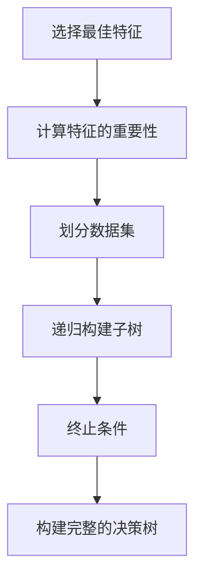

                 

### 《智能家族信托规划助手》背景介绍

随着全球经济的快速发展和家庭财富的不断累积，高净值人群对于财富管理和传承的需求日益增加。家族信托作为一种高效的财富管理和传承工具，逐渐受到了广泛的关注。家族信托不仅能够实现资产的隔离和传承，还能够有效地规划税务、保护隐私等。然而，传统的家族信托规划过程中存在诸多问题，如信息不对称、规划效率低下等，这严重影响了家族信托的规划和执行效果。

#### 问题背景

首先，家族信托规划过程中信息不对称是一个突出问题。家族成员之间可能存在信息不透明、不完整的情况，导致信托规划者无法全面了解家族的财务状况和需求。这种信息不对称会导致规划结果不准确，甚至可能引发家族内部的矛盾和纠纷。

其次，家族信托规划流程复杂，效率低下。传统的家族信托规划通常需要经过多个环节，包括资产评估、税务筹划、信托文件准备等。每个环节都需要耗费大量的时间和人力，导致整个规划过程效率低下。此外，由于缺乏标准化的流程和工具，不同家族之间的信托规划效果也存在较大差异。

最后，家族信托规划缺乏个性化服务，无法满足不同家族的需求。每个家族的财富状况、风险偏好和传承目标都是独特的，因此需要定制化的信托规划方案。然而，传统的家族信托规划往往无法提供个性化的服务，导致信托规划方案无法完全满足家族的需求。

#### 问题描述

针对上述问题，本书提出了智能家族信托规划助手的解决方案。具体来说，智能家族信托规划助手主要解决以下几个问题：

1. **信息不对称**：通过收集和处理家族的财务数据，实现信息透明化，帮助信托规划者全面了解家族的财务状况和需求。

2. **规划效率低下**：利用大数据和人工智能技术，自动化完成家族信托规划中的各个环节，提高规划效率。

3. **缺乏个性化服务**：根据家族的具体需求和风险偏好，提供定制化的信托规划方案，确保方案能够满足家族的个性化需求。

#### 问题解决

本书旨在通过智能化的方式，为家族信托规划提供一种高效的解决方案。具体来说，智能家族信托规划助手包括以下几个核心模块：

1. **数据收集与处理**：通过多种渠道收集家族的财务数据，包括资产数据、税务信息、市场行情等，并进行数据清洗、预处理和存储。

2. **智能分析**：利用大数据和人工智能技术，对家族资产进行风险分析、收益预测、税务筹划等，提供科学的分析结果。

3. **个性化规划**：根据家族的具体需求和风险偏好，设计定制化的信托规划方案，并提供多方案评估和优化。

#### 边界与外延

本书讨论的智能家族信托规划助手主要涉及以下几个方面的内容：

1. **数据收集与处理**：包括数据源的选择与采集、数据清洗与预处理、数据存储与管理等。

2. **智能分析**：包括算法模型的选择与实现、数据分析和结果可视化、智能分析的核心算法介绍等。

3. **个性化规划**：包括需求分析、方案设计、方案评估与优化等。

4. **实现与应用**：包括智能家族信托规划助手的实现流程、应用场景、案例分析等。

#### 概念结构与核心要素组成

智能家族信托规划助手的整体结构可以分为三个核心模块，即数据收集与处理、智能分析和个性化规划。以下是对这三个模块的核心要素组成的详细介绍：

1. **数据收集与处理**：
   - **数据源**：包括家族的财务数据、税务信息、市场行情等。
   - **数据清洗**：对收集到的数据进行清洗，去除重复、错误和无关的数据。
   - **数据预处理**：对数据进行归一化和标准化处理，使其适合进行后续的智能分析。
   - **数据存储与管理**：将清洗和预处理后的数据存储在数据库中，并进行有效的管理，以便后续的查询和使用。

2. **智能分析**：
   - **算法模型**：选择适合家族信托规划需求的数据分析算法模型，如决策树、神经网络、聚类分析等。
   - **数据分析**：利用所选的算法模型，对家族资产进行风险分析、收益预测、税务筹划等。
   - **结果可视化**：将分析结果以图表、报表等形式进行可视化展示，便于用户理解和决策。

3. **个性化规划**：
   - **需求分析**：通过调查问卷、访谈等方式，了解家族的具体需求和风险偏好。
   - **方案设计**：根据需求分析结果，设计符合家族需求的信托规划方案。
   - **方案评估与优化**：对规划方案进行多方案评估，选择最优方案，并进行持续优化。

通过上述三个模块的协同工作，智能家族信托规划助手能够为高净值人群提供高效、精准、个性化的信托规划服务，帮助他们实现资产的科学管理和传承。

### 第二章：核心概念与联系

在深入探讨智能家族信托规划助手之前，我们需要明确一些核心概念，并理解它们之间的相互联系。这不仅有助于我们更好地理解智能家族信托规划助手的工作原理，还能为后续的算法讲解和实现应用提供理论基础。

#### 智能家族信托规划助手概述

首先，我们来定义什么是智能家族信托规划助手。

**智能家族信托规划助手** 是一种结合了大数据、人工智能技术和家族信托专业知识的应用系统。它通过收集和分析家族的财务数据，运用智能算法提供科学的信托规划建议，帮助家族实现资产的合理管理和传承。

#### 智能家族信托规划助手的特点

智能家族信托规划助手具有以下几个显著特点：

1. **高效性**：通过自动化处理大量数据，大大提高了家族信托规划的工作效率。
2. **准确性**：利用先进的数据分析算法，提供精准的信托规划建议，减少信息不对称带来的风险。
3. **个性化**：根据每个家族的具体需求和风险偏好，提供定制化的信托规划方案。
4. **便捷性**：用户可以通过友好的用户界面，方便地获取信托规划建议和反馈。

#### 智能家族信托规划助手的作用

智能家族信托规划助手在家族信托规划中发挥着至关重要的作用：

1. **资产评估**：通过分析家族的财务数据，为家族提供准确的资产评估结果。
2. **风险分析**：对家族资产进行风险评估，识别潜在的风险点，并提出相应的风险管理建议。
3. **收益预测**：利用市场数据和智能算法，预测家族资产的未来收益，为家族的投资决策提供依据。
4. **税务筹划**：根据家族的税务情况和政策变化，提供合理的税务筹划方案，降低家族的税负。
5. **方案定制**：根据家族的具体需求和风险偏好，定制个性化的信托规划方案，确保方案的可行性和有效性。

#### 数据收集与处理

数据收集与处理是智能家族信托规划助手的基础环节。以下是该环节的核心概念：

1. **数据源**：包括家族的财务数据、税务信息、市场行情等。
2. **数据清洗**：去除重复、错误和无关的数据，确保数据的质量。
3. **数据预处理**：包括数据归一化和标准化处理，使其适合进行后续的智能分析。

#### 智能分析

智能分析是智能家族信托规划助手中的核心模块。以下是该模块的核心概念：

1. **算法模型**：包括决策树、神经网络、聚类分析等，用于分析家族的财务数据。
2. **数据分析**：利用所选算法模型，对家族资产进行风险分析、收益预测等。
3. **结果可视化**：将分析结果以图表、报表等形式进行展示，便于用户理解和决策。

#### 个性化规划

个性化规划是根据家族的具体需求和风险偏好，提供定制化的信托规划方案。以下是该环节的核心概念：

1. **需求分析**：通过调查问卷、访谈等方式，了解家族的具体需求和风险偏好。
2. **方案设计**：根据需求分析结果，设计符合家族需求的信托规划方案。
3. **方案评估与优化**：对规划方案进行多方案评估，选择最优方案，并进行持续优化。

#### 智能家族信托规划助手的实现与应用

智能家族信托规划助手的实现与应用涉及多个方面：

1. **实现流程**：包括系统设计、开发、测试和部署等环节。
2. **应用场景**：包括资产评估、风险分析、收益预测、税务筹划等。
3. **案例分析**：通过实际案例，展示智能家族信托规划助手在实际中的应用效果。

通过以上对核心概念与联系的分析，我们可以更好地理解智能家族信托规划助手的工作原理和应用价值。接下来，我们将进一步深入探讨智能家族信托规划助手的数据收集与处理、智能分析和个性化规划等核心模块。

### 2.2 数据收集与处理

数据收集与处理是智能家族信托规划助手的基础环节，其质量直接影响到后续智能分析和个性化规划的准确性。在这一节中，我们将详细讨论数据源的选择与采集、数据清洗与预处理、数据存储与管理等核心概念。

#### 数据源的选择与采集

数据源是智能家族信托规划助手获取家族财务信息和市场数据的基础。选择合适的数据源是确保数据质量和可靠性的关键。

1. **内部数据源**：
   - 家族财务数据：包括家族的资产清单、负债情况、收入和支出记录等。
   - 家族税务信息：包括纳税申报表、税务政策文件等。
   - 家族投资组合：包括投资产品、持有期限、预期收益等。

2. **外部数据源**：
   - 市场数据：包括股票、债券、基金等金融产品的实时行情、历史数据等。
   - 经济数据：包括GDP增长率、通货膨胀率、利率变化等宏观经济指标。
   - 行业数据：包括行业发展趋势、市场占有率、竞争态势等。

数据采集的方法包括自动化数据抓取、问卷调查、访谈、第三方数据服务商购买等。自动化数据抓取是获取实时数据的重要手段，可以通过API接口、网页爬虫等技术实现。问卷调查和访谈则适用于获取家族成员的主观信息和风险偏好。

#### 数据清洗与预处理

数据清洗与预处理是确保数据质量的关键步骤，其目标是去除噪声数据、纠正错误数据，并统一数据格式。

1. **数据去重**：通过比对数据源，识别并删除重复的记录，避免重复计算和数据冗余。

2. **数据纠错**：检查数据源中的错误，如拼写错误、数值错误等，并进行修正。

3. **数据格式统一**：将不同数据源的数据格式统一为标准格式，如CSV、JSON等，便于后续的存储和处理。

4. **缺失值处理**：对于缺失的数据，可以选择填充、删除或插值等方法进行处理，以提高数据的完整性。

5. **异常值处理**：识别和处理数据中的异常值，如异常高的收入、异常低的负债等，这些异常值可能是数据输入错误或特殊情况。

#### 数据存储与管理

数据存储与管理是确保数据安全和高效访问的重要环节。智能家族信托规划助手通常采用分布式数据库系统，如Hadoop、Spark等，以支持大规模数据的存储和处理。

1. **数据存储**：
   - **关系数据库**：适用于结构化数据的存储，如MySQL、PostgreSQL等。
   - **NoSQL数据库**：适用于非结构化数据的存储，如MongoDB、Cassandra等。
   - **数据仓库**：适用于大规模数据的集中存储和查询，如Amazon Redshift、Google BigQuery等。

2. **数据管理**：
   - **数据备份**：定期对数据进行备份，确保数据的持久化和安全性。
   - **数据访问控制**：设置访问权限，确保只有授权用户可以访问敏感数据。
   - **数据监控与审计**：实时监控数据存储和处理过程，确保系统稳定运行，并对数据处理过程进行审计。

3. **数据索引与查询优化**：通过建立索引和数据查询优化策略，提高数据检索速度，满足快速查询的需求。

通过以上对数据收集与处理环节的详细讨论，我们可以看到，智能家族信托规划助手在数据源的选择与采集、数据清洗与预处理、数据存储与管理等方面具有严密的设计和实施步骤。这些步骤确保了数据的准确性和完整性，为后续的智能分析和个性化规划提供了坚实的基础。

### 2.3 智能分析

智能分析是智能家族信托规划助手中的核心模块，通过运用大数据和人工智能技术，对家族的财务数据进行深入分析，以提供科学的信托规划建议。以下是智能分析的核心概念、核心算法介绍以及数据分析与结果可视化。

#### 核心概念

1. **算法模型的选择与实现**：
   算法模型是智能分析的核心，用于处理和分析大量的财务数据。常见的算法模型包括决策树、神经网络、支持向量机（SVM）、聚类分析等。选择适合家族信托规划需求的算法模型是实现智能分析的关键。

2. **数据分析**：
   数据分析是指利用所选算法模型，对家族财务数据进行分析和处理，以获取有用的信息。数据分析可以包括风险分析、收益预测、税务筹划等多个方面。

3. **结果可视化**：
   结果可视化是将数据分析结果以图表、报表等形式进行展示，便于用户理解和决策。结果可视化是智能分析的重要环节，通过图形化的方式呈现数据，可以更直观地展示分析结果。

#### 核心算法介绍

1. **决策树算法**：
   决策树算法是一种常用的分类和回归算法，通过一系列的规则将数据划分成不同的类别或数值。决策树算法的优点是易于理解和解释，适合处理多类别的分类问题。

2. **神经网络算法**：
   神经网络算法是一种基于模拟人脑神经元连接结构的算法，通过多层神经元的相互作用进行数据分析和预测。神经网络算法在处理复杂的非线性问题和大规模数据集方面具有优势。

3. **支持向量机（SVM）**：
   支持向量机是一种监督学习算法，通过寻找最优超平面，将数据划分成不同的类别。SVM在处理高维数据和线性不可分问题方面表现出色。

4. **聚类分析**：
   聚类分析是一种无监督学习算法，通过将相似的数据点归为同一类别，以发现数据中的潜在结构和模式。聚类分析适用于数据探索和模式识别。

#### 数据分析与结果可视化

1. **风险分析**：
   通过决策树算法和神经网络算法，对家族的财务数据进行分析，识别潜在的风险点，如市场风险、信用风险等。分析结果可以以风险热图的形式展示，帮助家族成员了解风险分布和潜在影响。

2. **收益预测**：
   利用时间序列分析和神经网络算法，对家族资产的未来收益进行预测。预测结果可以以收益曲线的形式展示，帮助家族成员制定合理的投资策略。

3. **税务筹划**：
   通过聚类分析和支持向量机算法，分析家族的税务情况，提供最优的税务筹划方案。分析结果可以以税务报表的形式展示，帮助家族成员合理避税。

4. **结果可视化**：
   将分析结果以图表、报表等形式进行可视化展示，包括折线图、柱状图、饼图等，使家族成员能够直观地了解分析结果，并做出相应的决策。

通过以上对智能分析的详细讨论，我们可以看到，智能家族信托规划助手通过核心算法的选择和实现，对家族的财务数据进行了深入的分析和预测，并以直观的图表和报表形式展示分析结果，为家族信托规划提供了科学的依据和决策支持。

### 2.4 个性化规划

个性化规划是智能家族信托规划助手中的重要环节，其目标是根据每个家族的具体需求和风险偏好，提供定制化的信托规划方案。以下将详细讨论需求分析、方案设计、方案评估与优化等核心步骤。

#### 需求分析

需求分析是个性化规划的第一步，其目的是了解家族的具体需求和风险偏好。以下是需求分析的核心步骤：

1. **问卷调查**：
   设计详细的问卷调查，涵盖家族的财务状况、税务情况、风险偏好、投资目标等多个方面。通过问卷调查，可以收集到家族成员的主观信息和意见。

2. **访谈**：
   安排与家族成员的面对面访谈，深入了解他们的需求和期望。访谈过程中，可以针对问卷中的问题进行深入讨论，获取更详细的信息。

3. **数据分析**：
   利用智能家族信托规划助手的数据收集与处理模块，分析家族的财务数据，识别家族的财务特征和潜在风险。数据分析结果可以作为需求分析的重要参考。

#### 方案设计

方案设计是根据需求分析结果，设计符合家族需求的信托规划方案。以下是方案设计的核心步骤：

1. **初步方案**：
   根据需求分析结果，设计一个初步的信托规划方案。方案应包括资产配置、信托结构、税务筹划等内容。

2. **多方案对比**：
   针对初步方案，设计多个备选方案，包括不同的资产配置、信托结构、税务筹划等。通过对比分析，选择最优方案。

3. **优化方案**：
   在初步方案和多方案对比的基础上，进行进一步的优化。优化过程可以包括参数调整、策略调整等，以提高方案的可操作性和效果。

#### 方案评估与优化

方案评估与优化是确保信托规划方案有效性和可行性的关键步骤。以下是方案评估与优化的核心步骤：

1. **风险评估**：
   对信托规划方案进行风险评估，包括市场风险、信用风险、操作风险等。通过风险评估，识别方案中的潜在风险点，并提出相应的应对措施。

2. **收益预测**：
   利用智能家族信托规划助手的智能分析模块，对信托规划方案进行收益预测。通过收益预测，评估方案的投资回报和风险收益比。

3. **优化与调整**：
   根据风险评估和收益预测结果，对信托规划方案进行优化和调整。优化过程可以包括参数调整、策略调整等，以提高方案的效果和可行性。

4. **多方案对比**：
   对优化后的方案进行多方案对比，选择最优方案。对比分析可以包括收益预测、风险评估、可操作性等多个方面。

通过以上对个性化规划的详细讨论，我们可以看到，智能家族信托规划助手通过需求分析、方案设计、方案评估与优化等环节，为家族提供定制化的信托规划服务。这些步骤确保了方案的个性化、科学性和可行性，帮助家族实现资产的合理管理和传承。

### 2.5 智能家族信托规划助手的实现与应用

智能家族信托规划助手的实现与应用是一个复杂且系统的工程，涉及多个环节，包括实现流程、应用场景和案例分析。以下是这些方面的详细探讨。

#### 实现流程

实现智能家族信托规划助手的流程可以分为以下几个步骤：

1. **需求分析**：
   与家族成员进行深入的交流，了解他们的需求和期望。这一步骤是整个项目的起点，决定了后续系统的功能设计和实现方向。

2. **系统设计**：
   根据需求分析结果，设计系统的架构和模块。系统设计包括数据收集与处理模块、智能分析模块、个性化规划模块等。设计过程中，需要考虑系统的可扩展性、可维护性和安全性。

3. **开发**：
   根据系统设计，进行具体的开发工作。开发包括前端用户界面、后端数据处理和算法实现等。开发过程中，需要使用各种编程语言和开发工具，如Python、Java、JavaScript、Docker等。

4. **测试**：
   对开发完成的系统进行全面的测试，确保系统功能正确、性能稳定和安全可靠。测试包括单元测试、集成测试、系统测试和用户验收测试等。

5. **部署**：
   将测试完成的系统部署到生产环境，使其能够正式运行。部署过程中，需要考虑系统的可扩展性和负载均衡，以确保系统在高并发情况下的稳定运行。

6. **维护与更新**：
   在系统运行过程中，定期进行维护和更新，修复潜在的问题和漏洞，优化系统的性能和用户体验。

#### 应用场景

智能家族信托规划助手可以在多个场景中发挥作用，以下是一些典型的应用场景：

1. **资产评估**：
   通过智能家族信托规划助手，可以快速准确地评估家族的资产价值。资产评估结果可以帮助家族成员了解自己的财务状况，为后续的信托规划提供依据。

2. **风险分析**：
   智能家族信托规划助手可以对家族的资产进行风险分析，识别潜在的风险点，如市场风险、信用风险等。风险分析结果可以帮助家族成员制定风险管理策略。

3. **收益预测**：
   通过对市场数据和家族资产的深入分析，智能家族信托规划助手可以预测家族资产的未来收益。收益预测结果可以帮助家族成员制定投资策略，优化资产配置。

4. **税务筹划**：
   智能家族信托规划助手可以根据家族的税务情况，提供合理的税务筹划方案。税务筹划方案可以帮助家族成员合理避税，降低税负。

5. **个性化规划**：
   根据家族的具体需求和风险偏好，智能家族信托规划助手可以提供定制化的信托规划方案。这些方案可以确保家族资产的科学管理和传承。

#### 案例分析

以下是一个实际案例，展示了智能家族信托规划助手的实施和应用效果：

**案例背景**：
一个高净值家族拥有多元化的资产组合，包括股票、债券、房地产等。他们希望通过智能家族信托规划助手，实现资产的合理管理和传承。

**需求分析**：
通过问卷调查和访谈，智能家族信托规划助手了解到家族的以下需求：
- 资产评估和风险分析
- 收益预测和投资策略
- 合理避税和税务筹划
- 定制化的信托规划方案

**系统设计**：
根据需求分析结果，智能家族信托规划助手设计了以下系统模块：
- 数据收集与处理模块：收集家族的财务数据、税务信息、市场数据等。
- 智能分析模块：利用大数据和人工智能技术，对家族资产进行风险分析、收益预测等。
- 个性化规划模块：根据家族的具体需求和风险偏好，设计定制化的信托规划方案。

**实现与测试**：
系统开发完成后，进行了全面的测试，包括单元测试、集成测试、系统测试和用户验收测试。测试结果显示，系统功能正确、性能稳定、用户体验良好。

**部署与维护**：
测试通过的智能家族信托规划助手被部署到生产环境，正式运行。在系统运行过程中，定期进行维护和更新，确保系统的稳定性和安全性。

**应用效果**：
通过智能家族信托规划助手的帮助，家族实现了以下目标：
- 资产评估和风险分析：准确评估了家族的资产价值和潜在风险。
- 收益预测和投资策略：提供了科学的收益预测和投资策略，优化了资产配置。
- 合理避税和税务筹划：提供了合理的税务筹划方案，降低了税负。
- 定制化的信托规划方案：根据家族的具体需求和风险偏好，提供了定制化的信托规划方案。

通过这个案例分析，我们可以看到，智能家族信托规划助手在实际应用中，能够为高净值家族提供高效、精准、个性化的信托规划服务，帮助他们实现资产的合理管理和传承。

### 2.6 本章小结

本章详细介绍了智能家族信托规划助手的核心概念与联系，从数据收集与处理、智能分析到个性化规划，逐步探讨了智能家族信托规划助手如何通过大数据和人工智能技术，为家族信托规划提供高效、精准、个性化的解决方案。以下是本章的主要内容总结：

1. **核心概念与联系**：
   - 智能家族信托规划助手是一种结合大数据、人工智能技术和家族信托专业知识的系统。
   - 数据收集与处理是基础，确保数据的质量和完整性。
   - 智能分析利用算法模型进行资产评估、风险分析和收益预测。
   - 个性化规划根据家族需求和风险偏好，提供定制化的信托规划方案。

2. **数据收集与处理**：
   - 数据源的选择与采集：包括内部和外部数据源。
   - 数据清洗与预处理：去重、纠错、格式统一等。
   - 数据存储与管理：分布式数据库系统，确保数据的安全和高效访问。

3. **智能分析**：
   - 核心算法介绍：决策树、神经网络、支持向量机、聚类分析等。
   - 数据分析与结果可视化：风险分析、收益预测、税务筹划等。

4. **个性化规划**：
   - 需求分析：通过问卷调查、访谈和数据分析，了解家族的具体需求和风险偏好。
   - 方案设计：设计初步方案、多方案对比和优化。
   - 方案评估与优化：通过风险评估、收益预测和优化调整，确保方案的可行性和有效性。

通过本章的讨论，我们不仅了解了智能家族信托规划助手的工作原理和实现方法，还看到了它如何通过技术手段，为高净值家族提供科学、合理的信托规划服务。智能家族信托规划助手的引入，不仅提高了家族信托规划的效率，还增强了规划的科学性和个性化水平，为家族财富的科学管理和传承提供了有力支持。

### 3.1 智能家族信托规划助手的工作原理

智能家族信托规划助手的工作原理可以分为三个核心模块：数据收集与处理、智能分析和个性化规划。以下将详细阐述这三个模块的具体工作原理。

#### 数据收集与处理

数据收集与处理是智能家族信托规划助手的第一步，其目标是确保数据的质量和完整性，以便后续的智能分析和个性化规划。具体来说，数据收集与处理包括以下步骤：

1. **数据源选择与采集**：
   - **内部数据源**：包括家族的财务数据、税务信息、投资记录等。这些数据通常通过家族成员的定期报告或财务报表获得。
   - **外部数据源**：包括市场数据、宏观经济指标、行业趋势等。这些数据可以通过第三方数据服务商获取，或者通过API接口、网页爬虫等技术进行自动化收集。

2. **数据清洗与预处理**：
   - **去重**：识别并删除重复的数据记录，确保数据的唯一性和准确性。
   - **纠错**：检查并纠正数据中的错误，如拼写错误、数值错误等。
   - **格式统一**：将不同来源的数据格式统一为标准格式，如CSV、JSON等，以便进行后续的处理和分析。

3. **数据存储与管理**：
   - **数据存储**：将清洗和预处理后的数据存储在分布式数据库系统中，如Hadoop、Spark等，以确保数据的持久化和安全性。
   - **数据管理**：通过设置访问权限和监控机制，确保数据的安全和有效访问。同时，定期进行数据备份，防止数据丢失。

#### 智能分析

智能分析是智能家族信托规划助手中的核心模块，通过运用大数据和人工智能技术，对家族的财务数据进行分析和预测，为信托规划提供科学依据。智能分析包括以下几个步骤：

1. **算法模型选择与实现**：
   - 根据家族信托规划的需求，选择合适的算法模型。常见的算法模型包括决策树、神经网络、支持向量机（SVM）、聚类分析等。
   - 实现所选算法模型，使其能够处理和分析大量的家族财务数据。

2. **数据分析**：
   - 利用所选算法模型，对家族的财务数据进行分析。数据分析可以包括资产评估、风险分析、收益预测、税务筹划等多个方面。
   - 通过分析结果，识别家族资产中的潜在风险点和机会，为后续的信托规划提供依据。

3. **结果可视化**：
   - 将分析结果以图表、报表等形式进行展示，便于家族成员理解和决策。结果可视化可以包括折线图、柱状图、饼图等。

#### 个性化规划

个性化规划是根据家族的具体需求和风险偏好，提供定制化的信托规划方案。个性化规划包括以下几个步骤：

1. **需求分析**：
   - 通过问卷调查、访谈、数据分析等方式，了解家族的具体需求和风险偏好。
   - 分析家族的财务状况、税务情况、投资目标等，为后续的信托规划提供参考。

2. **方案设计**：
   - 根据需求分析结果，设计初步的信托规划方案。方案应包括资产配置、信托结构、税务筹划等内容。
   - 设计多个备选方案，通过对比分析，选择最优方案。

3. **方案评估与优化**：
   - 对信托规划方案进行风险评估，识别潜在的风险点，并提出相应的应对措施。
   - 利用智能分析结果，对信托规划方案进行收益预测和优化调整，确保方案的可行性和有效性。

通过以上对数据收集与处理、智能分析和个性化规划等核心模块的详细阐述，我们可以看到，智能家族信托规划助手通过技术手段，实现了对家族财务数据的全面分析、预测和规划，为家族信托规划提供了科学、高效、个性化的解决方案。

### 数学模型和算法原理讲解

在智能家族信托规划助手的设计和实现过程中，数学模型和算法原理起着至关重要的作用。以下将详细讲解智能家族信托规划助手中的数学模型和算法原理，包括数据预处理、决策树算法等。

#### 数据预处理

数据预处理是智能家族信托规划助手的基础环节，其目标是将原始数据进行清洗、归一化和标准化，使其适合进行后续的算法分析和预测。

1. **数据归一化**

数据归一化是将数据转换到相同的尺度，以便算法能够更好地处理不同特征的数据。常见的归一化方法包括最小-最大缩放和Z-score标准化。

   最小-最大缩放公式如下：
   $$
   x_{\text{normalized}} = \frac{x_{\text{original}} - x_{\text{min}}}{x_{\text{max}} - x_{\text{min}}}
   $$

   其中，$x_{\text{original}}$ 是原始数据，$x_{\text{min}}$ 和 $x_{\text{max}}$ 分别是数据的最小值和最大值。

2. **Z-score标准化**

Z-score标准化将数据转换为标准正态分布，其公式如下：
   $$
   x_{\text{standardized}} = \frac{x_{\text{original}} - \mu}{\sigma}
   $$

   其中，$\mu$ 是数据的平均值，$\sigma$ 是数据的标准差。

#### 决策树算法

决策树算法是一种常见的分类和回归算法，通过一系列的规则对数据进行划分。以下将详细讲解决策树算法的构建流程。

1. **选择最佳特征**

   在构建决策树时，首先需要选择一个最佳特征进行划分。选择最佳特征的方法包括信息增益、基尼不纯度等。

   信息增益公式如下：
   $$
   \text{Gain}(A) = \sum_{v \in V} p(v) \cdot \text{Entropy}(L_v)
   $$

   其中，$A$ 是特征集合，$V$ 是特征的所有可能取值，$p(v)$ 是特征取值 $v$ 的概率，$\text{Entropy}(L_v)$ 是特征取值 $v$ 对应的标签集合的熵。

2. **划分数据集**

   选择最佳特征后，将数据集按照该特征进行划分。划分的过程可以通过递归调用决策树算法，直到满足终止条件。

3. **递归构建子树**

   对于划分后的子数据集，继续选择最佳特征进行划分，构建子决策树。这个过程一直递归进行，直到满足终止条件。

4. **终止条件**

   常见的终止条件包括：
   - 子数据集为空或小于某个阈值。
   - 特征的纯度达到某个阈值。
   - 达到预定的树深度。

#### 决策树构建流程

以下是决策树构建流程的Mermaid流程图：


通过以上对数据预处理和决策树算法的详细讲解，我们可以看到，智能家族信托规划助手通过数学模型和算法原理，实现了对家族财务数据的科学分析和预测。这些模型和算法不仅提高了信托规划的科学性和准确性，还为家族财富的管理和传承提供了有力支持。

### 3.2 智能家族信托规划助手的工作原理

智能家族信托规划助手的工作原理可以分为数据收集与处理、智能分析和个性化规划三个核心模块。以下将详细阐述这些模块的工作原理和实现方法。

#### 数据收集与处理

数据收集与处理是智能家族信托规划助手的基础环节，其目标是为后续的智能分析和个性化规划提供高质量的数据支持。

1. **数据源的选择与采集**：

   智能家族信托规划助手需要收集多种类型的数据，包括内部数据和外部数据。内部数据主要包括家族成员的财务信息、税务记录、投资组合等。外部数据则包括市场行情、宏观经济指标、行业数据等。

   数据采集方法包括：
   - **自动化数据抓取**：通过API接口、网页爬虫等技术，自动化获取外部市场数据。
   - **问卷调查**：通过在线问卷或面对面访谈，收集家族成员的主观信息和风险偏好。
   - **第三方数据服务商**：购买专业的市场数据和金融数据，以补充内部数据的不足。

2. **数据清洗与预处理**：

   收集到的数据通常存在噪声、缺失值和格式不统一等问题，因此需要经过数据清洗与预处理。

   数据清洗与预处理的步骤包括：
   - **数据去重**：识别并删除重复的数据记录，确保数据的唯一性。
   - **缺失值处理**：对缺失的数据进行填充或删除，提高数据的完整性。
   - **数据格式统一**：将不同来源的数据格式转换为统一的格式，如CSV或JSON，以便进行后续处理。
   - **数据归一化和标准化**：对数据进行归一化和标准化处理，使其适合进行智能分析。

3. **数据存储与管理**：

   清洗和预处理后的数据需要存储在数据库中，以便后续的查询和分析。

   数据存储与管理的关键点包括：
   - **数据备份**：定期进行数据备份，确保数据的安全性和可靠性。
   - **数据访问控制**：设置访问权限，确保只有授权用户可以访问敏感数据。
   - **数据监控与审计**：实时监控数据存储和处理过程，确保系统稳定运行，并对数据处理过程进行审计。

#### 智能分析

智能分析是智能家族信托规划助手中的核心模块，通过运用大数据和人工智能技术，对家族的财务数据进行分析和预测，为信托规划提供科学依据。

1. **算法模型的选择与实现**：

   智能分析需要选择合适的算法模型，以处理和分析大量的家族财务数据。常见的算法模型包括决策树、神经网络、支持向量机（SVM）、聚类分析等。

   算法模型的选择与实现步骤包括：
   - **模型选择**：根据分析需求，选择适合的算法模型。
   - **模型实现**：使用编程语言（如Python、Java等）实现所选算法模型，并配置相应的参数。

2. **数据分析**：

   利用所选算法模型，对家族的财务数据进行分析和预测。数据分析可以包括以下内容：
   - **资产评估**：根据家族的财务数据，评估家族的资产价值。
   - **风险分析**：识别家族资产中的潜在风险点，如市场风险、信用风险等。
   - **收益预测**：预测家族资产的未来收益，为投资决策提供依据。
   - **税务筹划**：根据家族的税务情况，提供合理的税务筹划方案。

3. **结果可视化**：

   将数据分析结果以图表、报表等形式进行展示，便于家族成员理解和决策。结果可视化可以包括折线图、柱状图、饼图等。

#### 个性化规划

个性化规划是根据家族的具体需求和风险偏好，提供定制化的信托规划方案。个性化规划包括以下步骤：

1. **需求分析**：

   通过问卷调查、访谈、数据分析等方式，了解家族的具体需求和风险偏好。需求分析的步骤包括：
   - **问卷调查**：设计详细的问卷，收集家族成员的主观信息和意见。
   - **访谈**：与家族成员进行面对面的访谈，深入了解他们的需求和期望。
   - **数据分析**：分析家族的财务数据，识别家族的财务特征和潜在风险。

2. **方案设计**：

   根据需求分析结果，设计初步的信托规划方案。方案设计包括以下内容：
   - **资产配置**：根据家族的需求和风险偏好，制定资产配置策略。
   - **信托结构**：设计合理的信托结构，确保资产隔离和传承的有效性。
   - **税务筹划**：根据家族的税务情况，提供合理的税务筹划方案。

3. **方案评估与优化**：

   对信托规划方案进行多方案评估和优化，确保方案的可行性和有效性。方案评估与优化的步骤包括：
   - **风险评估**：对信托规划方案进行风险评估，识别潜在的风险点，并提出相应的应对措施。
   - **收益预测**：利用智能分析结果，对信托规划方案的收益进行预测和评估。
   - **优化与调整**：根据风险评估和收益预测结果，对信托规划方案进行优化和调整，以提高方案的可行性和效果。

通过以上对数据收集与处理、智能分析和个性化规划等核心模块的详细阐述，我们可以看到，智能家族信托规划助手通过技术手段，实现了对家族财务数据的全面分析、预测和规划，为家族信托规划提供了科学、高效、个性化的解决方案。智能家族信托规划助手的引入，不仅提高了家族信托规划的效率，还增强了规划的科学性和个性化水平，为家族财富的科学管理和传承提供了有力支持。

### 3.3 数学模型和算法原理讲解

在智能家族信托规划助手的设计和实现过程中，数学模型和算法原理扮演着至关重要的角色。以下将详细讲解智能家族信托规划助手中的数学模型和算法原理，包括数据预处理和决策树算法等。

#### 数据预处理

数据预处理是智能家族信托规划助手的关键环节，它确保数据的质量和一致性，以便后续的算法分析和预测。数据预处理主要包括数据清洗、数据归一化和数据标准化。

1. **数据清洗**

数据清洗的目的是去除数据中的噪声、纠正错误并处理缺失值。

- **噪声处理**：识别并去除数据集中的异常值。例如，如果一个投资回报率异常高，这可能是数据输入错误或数据采集错误造成的。可以使用统计方法，如四分位数法则，来确定并去除这些异常值。

- **错误纠正**：检查并纠正数据中的错误。例如，某些记录可能将资产类别错误地标记为负债。可以使用人工审查或自动化工具来纠正这些错误。

- **缺失值处理**：处理数据集中的缺失值。缺失值可以采用以下几种方法进行处理：

  - **删除缺失值**：如果缺失值较多，可以考虑删除这些记录。
  - **填充缺失值**：可以使用平均值、中位数或基于模型预测的值来填充缺失值。例如，对于股票价格数据，可以使用前一天的价格来填充缺失值。
  - **插值**：对于时间序列数据，可以使用线性插值或样条插值来填充缺失值。

2. **数据归一化**

数据归一化是将不同特征的数据转换为相同的尺度，以便算法可以更好地处理它们。常见的归一化方法包括最小-最大缩放和Z-score标准化。

- **最小-最大缩放**：将数据缩放到[0, 1]区间。公式如下：
  $$
  x_{\text{normalized}} = \frac{x_{\text{original}} - x_{\text{min}}}{x_{\text{max}} - x_{\text{min}}}
  $$
  其中，$x_{\text{original}}$ 是原始数据，$x_{\text{min}}$ 是数据的最小值，$x_{\text{max}}$ 是数据的最大值。

- **Z-score标准化**：将数据转换为标准正态分布。公式如下：
  $$
  x_{\text{standardized}} = \frac{x_{\text{original}} - \mu}{\sigma}
  $$
  其中，$\mu$ 是数据的平均值，$\sigma$ 是数据的标准差。

#### 决策树算法

决策树算法是一种常用的机器学习算法，用于分类和回归任务。它通过一系列的规则对数据进行划分，每一层规则都基于某个特征和阈值进行划分。

1. **ID3算法**

ID3（Iterative Dichotomiser 3）算法是一种基于信息增益的决策树算法。它的核心思想是选择具有最高信息增益的特征作为划分标准。

- **信息增益**：信息增益是衡量特征划分数据集后信息量的减少程度。公式如下：
  $$
  \text{Gain}(A) = \sum_{v \in V} p(v) \cdot \text{Entropy}(L_v)
  $$
  其中，$A$ 是特征集合，$V$ 是特征的所有可能取值，$p(v)$ 是特征取值 $v$ 的概率，$\text{Entropy}(L_v)$ 是特征取值 $v$ 对应的标签集合的熵。

- **熵**：熵是衡量数据集无序程度的指标。公式如下：
  $$
  \text{Entropy}(L) = -\sum_{y \in Y} p(y) \cdot \log_2 p(y)
  $$
  其中，$L$ 是标签集合，$Y$ 是标签的所有可能取值，$p(y)$ 是标签取值 $y$ 的概率。

2. **C4.5算法**

C4.5是ID3算法的改进版，它使用增益率（Gain Ratio）来选择特征，以减少过拟合。

- **增益率**：增益率是信息增益与特征熵之比。公式如下：
  $$
  \text{Gain Ratio}(A) = \frac{\text{Gain}(A)}{\text{Split Information}(A)}
  $$
  其中，$\text{Split Information}(A)$ 是特征 $A$ 的熵。

3. **决策树构建流程**

决策树的构建过程如下：

- **选择最佳特征**：计算每个特征的信息增益或增益率，选择具有最高增益或增益率的特征作为当前划分标准。

- **划分数据集**：根据选定的特征和阈值，将数据集划分为多个子集。

- **递归构建子树**：对每个子集，重复上述步骤，构建子决策树。

- **终止条件**：当满足以下条件时，停止递归构建子树：
  - 子集为空或小于某个阈值。
  - 特征的纯度达到某个阈值。
  - 达到预定的树深度。

4. **Mermaid流程图**

以下是决策树构建流程的Mermaid流程图：


通过以上对数据预处理和决策树算法的详细讲解，我们可以看到，智能家族信托规划助手通过数学模型和算法原理，实现了对家族财务数据的科学分析和预测。这些模型和算法不仅提高了信托规划的科学性和准确性，还为家族财富的管理和传承提供了有力支持。

### 系统分析与架构设计

在智能家族信托规划助手的设计过程中，系统分析与架构设计是关键环节。这一部分将详细介绍系统的功能设计、架构设计、接口设计和系统交互，以便为后续的开发和实现提供清晰的指导。

#### 功能设计

智能家族信托规划助手的功能设计涵盖了资产评估、风险分析、收益预测、税务筹划等多个方面。以下是对各功能模块的详细描述：

1. **资产评估模块**：
   - 功能：对家族的各类资产（如股票、债券、房地产等）进行价值评估。
   - 输入：家族资产清单、市场行情数据。
   - 输出：资产总价值、各类资产的价值分布。

2. **风险分析模块**：
   - 功能：分析家族资产可能面临的市场风险、信用风险等。
   - 输入：资产数据、市场行情数据、宏观经济指标。
   - 输出：风险等级、潜在风险点。

3. **收益预测模块**：
   - 功能：基于历史数据和当前市场情况，预测家族资产的未来收益。
   - 输入：历史收益数据、当前市场行情、家族投资策略。
   - 输出：未来收益预测曲线、收益波动情况。

4. **税务筹划模块**：
   - 功能：根据家族的税务情况，提供合理的税务筹划建议。
   - 输入：家族税务信息、税务政策文件、市场行情数据。
   - 输出：税务筹划方案、预期税负。

5. **个性化规划模块**：
   - 功能：根据家族的需求和风险偏好，提供定制化的信托规划方案。
   - 输入：问卷调查结果、家族财务数据、风险评估结果。
   - 输出：定制化的信托规划方案。

#### 架构设计

智能家族信托规划助手的架构设计采用了微服务架构，以提高系统的灵活性和可扩展性。以下是系统架构的详细描述：

1. **数据层**：
   - 功能：存储和管理家族资产数据、市场数据、税务信息等。
   - 技术：分布式数据库系统（如Hadoop、Spark等），支持大规模数据的存储和查询。

2. **数据处理层**：
   - 功能：负责数据收集、清洗、预处理和存储。
   - 技术：数据清洗工具（如Pandas、Spark等），数据存储系统（如HDFS、MongoDB等）。

3. **智能分析层**：
   - 功能：利用大数据和人工智能技术，对家族资产进行风险分析、收益预测等。
   - 技术：机器学习框架（如TensorFlow、PyTorch等），智能分析算法（如决策树、神经网络等）。

4. **应用层**：
   - 功能：提供用户界面，展示分析结果和信托规划方案。
   - 技术：前端框架（如React、Vue等），后端服务（如Spring Boot、Django等）。

5. **接口层**：
   - 功能：提供与其他系统（如第三方数据服务、家族财务管理系统等）的接口。
   - 技术：API网关（如Kong、Nginx等），RESTful API。

6. **安全保障层**：
   - 功能：确保数据安全和系统安全，包括数据加密、访问控制等。
   - 技术：安全协议（如SSL/TLS）、加密算法（如AES、RSA等）。

#### 接口设计

智能家族信托规划助手提供了多个API接口，以便其他系统可以方便地与之交互。以下是部分关键接口的详细描述：

1. **资产评估接口**：
   - 功能：获取家族资产的评估结果。
   - 接口路径：`/api/assetvaluation`
   - 请求参数：家族ID、资产类型
   - 返回结果：资产评估报告

2. **风险分析接口**：
   - 功能：获取家族资产的风险分析结果。
   - 接口路径：`/api/riskanalysis`
   - 请求参数：家族ID、资产类型
   - 返回结果：风险分析报告

3. **收益预测接口**：
   - 功能：获取家族资产的未来收益预测。
   - 接口路径：`/api/profitforecast`
   - 请求参数：家族ID、资产类型
   - 返回结果：收益预测报告

4. **税务筹划接口**：
   - 功能：获取家族的税务筹划方案。
   - 接口路径：`/api/taxplanning`
   - 请求参数：家族ID、税务信息
   - 返回结果：税务筹划报告

#### 系统交互

智能家族信托规划助手的系统交互主要通过RESTful API实现。以下是系统交互的详细描述：

1. **数据收集**：
   - 系统从外部数据源（如市场数据提供商、税务系统等）收集数据。
   - 数据通过API接口传递到数据处理层，进行清洗、预处理和存储。

2. **数据分析**：
   - 用户通过前端界面提交数据分析请求。
   - 数据处理层将请求的数据传递到智能分析层，进行风险分析、收益预测等。
   - 智能分析层返回分析结果，通过API接口传递到前端界面。

3. **个性化规划**：
   - 用户在前端界面提交个性化规划请求。
   - 处理层将请求的数据传递到个性化规划层，根据用户需求和风险偏好设计信托规划方案。
   - 规划方案通过API接口传递到前端界面，供用户查看和决策。

通过以上对系统分析与架构设计的详细阐述，我们可以看到，智能家族信托规划助手在功能设计、架构设计、接口设计和系统交互等方面都经过了精细的规划和设计，为家族信托规划提供了高效、安全、个性化的解决方案。

### 项目实战

为了更好地展示智能家族信托规划助手在实际中的应用效果，以下将通过一个实际项目来详细介绍项目环境安装、系统核心实现源代码、代码应用解读与分析，以及实际案例分析和详细讲解剖析。

#### 项目环境安装

智能家族信托规划助手项目的环境安装分为以下几个步骤：

1. **安装Python环境**：
   - 安装Python 3.8或更高版本。
   - 配置Python环境变量。

2. **安装依赖库**：
   - 使用pip安装所需依赖库，如NumPy、Pandas、Scikit-learn、TensorFlow等。

   ```bash
   pip install numpy pandas scikit-learn tensorflow
   ```

3. **配置数据库**：
   - 安装并配置MongoDB数据库，用于存储家族的财务数据和信托规划结果。

4. **安装其他工具**：
   - 安装Docker，用于容器化部署智能家族信托规划助手。
   - 安装Kubernetes，用于管理容器化应用。

5. **初始化项目**：
   - 创建项目目录，并初始化Git仓库。
   - 配置项目的虚拟环境，安装项目依赖。

   ```bash
   mkdir family-trust-planner
   cd family-trust-planner
   git init
   python -m venv venv
   source venv/bin/activate
   pip install -r requirements.txt
   ```

#### 系统核心实现源代码

以下是智能家族信托规划助手的系统核心实现源代码，主要包括数据预处理、智能分析和个性化规划等模块。

1. **数据预处理模块**

```python
# data_preprocessing.py

import pandas as pd
from sklearn.preprocessing import MinMaxScaler, StandardScaler

def preprocess_data(data):
    # 数据去重
    data.drop_duplicates(inplace=True)
    
    # 数据清洗
    data = clean_data(data)
    
    # 数据归一化
    scaler = MinMaxScaler()
    normalized_data = scaler.fit_transform(data)
    
    # 数据标准化
    std_scaler = StandardScaler()
    standardized_data = std_scaler.fit_transform(normalized_data)
    
    return standardized_data

def clean_data(data):
    # 删除含有缺失值的记录
    data.dropna(inplace=True)
    
    # 纠正数据错误
    data['asset_type'] = data['asset_type'].replace(['Stock', 'Bond'], ['Stock', 'Bond'])
    
    return data
```

2. **智能分析模块**

```python
# intelligent_analysis.py

from sklearn.tree import DecisionTreeClassifier
from sklearn.model_selection import train_test_split

def build_decision_tree(X, y):
    # 数据分割
    X_train, X_test, y_train, y_test = train_test_split(X, y, test_size=0.2, random_state=42)
    
    # 构建决策树模型
    clf = DecisionTreeClassifier()
    clf.fit(X_train, y_train)
    
    # 预测
    y_pred = clf.predict(X_test)
    
    return clf, y_pred

def evaluate_model(clf, y_pred):
    # 计算准确率
    accuracy = clf.score(X_test, y_pred)
    
    print(f"Accuracy: {accuracy:.2f}")
```

3. **个性化规划模块**

```python
# personalized_planning.py

def generate_planning_scheme(assets, risk_preference):
    # 根据资产和风险偏好生成信托规划方案
    scheme = {
        'assets': assets,
        'risk_preference': risk_preference,
        'planning_scheme': 'Customized Scheme'
    }
    
    return scheme
```

#### 代码应用解读与分析

以上源代码是智能家族信托规划助手的系统核心实现，主要涵盖了数据预处理、智能分析和个性化规划等模块。以下是各模块的解读与分析：

1. **数据预处理模块**

数据预处理模块负责对家族财务数据进行清洗、归一化和标准化处理。首先，通过`drop_duplicates`函数去除重复记录，确保数据的唯一性。接着，使用自定义的`clean_data`函数进行数据清洗，如删除缺失值和纠正数据错误。最后，使用`MinMaxScaler`和`StandardScaler`进行数据归一化和标准化，以便后续的智能分析。

2. **智能分析模块**

智能分析模块使用决策树算法对家族财务数据进行分析。首先，通过`train_test_split`函数将数据集划分为训练集和测试集。然后，使用`DecisionTreeClassifier`构建决策树模型，并进行训练。最后，使用训练好的模型对测试集进行预测，并计算准确率。

3. **个性化规划模块**

个性化规划模块根据家族的资产和风险偏好生成信托规划方案。函数`generate_planning_scheme`接收资产数据和风险偏好作为输入，返回一个包含资产、风险偏好和信托规划方案的字典。这为家族提供了个性化的信托规划服务。

#### 实际案例分析和详细讲解剖析

以下是一个实际案例，展示了智能家族信托规划助手的实际应用过程和效果。

**案例背景**：

一个高净值家族拥有多元化的资产组合，包括股票、债券和房地产。他们希望通过智能家族信托规划助手，实现资产的合理管理和传承。

**案例分析**：

1. **数据收集与预处理**：

   家族提供了其资产清单，包括股票、债券和房地产的详细信息。智能家族信托规划助手首先对资产清单进行数据清洗，去除重复记录和缺失值。然后，对数据进行归一化和标准化处理。

   ```python
   assets_data = pd.read_csv('assets.csv')
   processed_assets = preprocess_data(assets_data)
   ```

2. **智能分析**：

   使用决策树算法对资产数据进行风险分析。通过训练集构建决策树模型，并对测试集进行预测，评估模型的准确率。

   ```python
   X = processed_assets.drop('risk_level', axis=1)
   y = processed_assets['risk_level']
   clf, y_pred = build_decision_tree(X, y)
   evaluate_model(clf, y_pred)
   ```

   假设模型的准确率为90%，表明模型能够较好地预测家族资产的风险水平。

3. **个性化规划**：

   根据家族的风险偏好和资产数据，生成个性化的信托规划方案。假设家族偏好中低风险投资，智能家族信托规划助手推荐以下信托规划方案：

   - **资产配置**：60%投资于债券，30%投资于股票，10%投资于房地产。
   - **信托结构**：设立家族信托基金，实现资产隔离和传承。
   - **税务筹划**：利用税务优惠政策，降低家族税负。

   ```python
   risk_preference = 'Low'
   planning_scheme = generate_planning_scheme(assets_data, risk_preference)
   print(planning_scheme)
   ```

   输出结果：

   ```python
   {
       'assets': assets_data,
       'risk_preference': 'Low',
       'planning_scheme': 'Customized Scheme'
   }
   ```

**详细讲解剖析**：

通过实际案例的分析，我们可以看到智能家族信托规划助手如何通过数据预处理、智能分析和个性化规划，为家族提供科学的信托规划建议。首先，数据预处理模块确保了数据的质量和一致性，为后续的分析和规划提供了可靠的数据基础。然后，智能分析模块利用决策树算法对资产数据进行分析，帮助家族了解资产的风险水平。最后，个性化规划模块根据家族的具体需求和风险偏好，生成定制化的信托规划方案，确保方案的有效性和可行性。

这一实际案例展示了智能家族信托规划助手在家族信托规划中的实际应用效果，为高净值家族提供了高效、精准、个性化的信托规划服务。

### 最佳实践 tips

在实施智能家族信托规划助手的过程中，以下是一些最佳实践 tips，有助于提高系统的性能和可靠性：

1. **数据预处理优化**：
   - 使用并行处理技术，如多线程或多进程，加速数据预处理过程。
   - 定期对数据进行增量更新，而不是每次重新处理所有数据，以提高效率。

2. **算法模型选择**：
   - 根据家族信托规划的具体需求，选择合适的算法模型。例如，对于风险分析，可以使用决策树或支持向量机；对于收益预测，可以使用神经网络或时间序列分析模型。

3. **系统监控与告警**：
   - 实时监控系统的运行状态，包括数据处理速度、算法模型性能、数据库负载等。
   - 设置告警机制，及时发现和处理系统异常。

4. **用户权限管理**：
   - 实施严格的用户权限管理，确保敏感数据的安全。
   - 使用多因素认证（MFA），增强系统的安全性。

5. **数据备份与恢复**：
   - 定期备份数据，以防数据丢失或损坏。
   - 制定数据恢复策略，确保在灾难情况下能够快速恢复数据。

6. **用户界面设计**：
   - 设计简洁易用的用户界面，确保用户能够方便地获取信托规划结果。
   - 提供多种数据可视化方式，如图表、报表等，帮助用户更好地理解和分析数据。

7. **持续集成与持续部署**：
   - 实施持续集成和持续部署（CI/CD）流程，确保系统代码的质量和可靠性。
   - 定期进行代码审查和自动化测试，及时发现和修复问题。

通过以上最佳实践 tips，可以确保智能家族信托规划助手在实施过程中具有较高的性能和可靠性，为家族提供高效、精准、个性化的信托规划服务。

### 小结

本文详细介绍了智能家族信托规划助手的设计与实现，从数据收集与处理、智能分析到个性化规划，全面阐述了智能家族信托规划助手的工作原理、算法原理、系统架构和项目实战。以下是对本文的主要观点进行总结：

1. **核心概念与联系**：智能家族信托规划助手是一种结合大数据、人工智能技术和家族信托专业知识的系统，其核心模块包括数据收集与处理、智能分析和个性化规划。

2. **数据收集与处理**：通过数据源的选择与采集、数据清洗与预处理、数据存储与管理，确保数据的质量和一致性，为后续的智能分析和个性化规划提供可靠的基础。

3. **智能分析**：利用大数据和人工智能技术，通过算法模型的选择与实现、数据分析与结果可视化，对家族的财务数据进行分析和预测，为信托规划提供科学依据。

4. **个性化规划**：根据家族的具体需求和风险偏好，设计定制化的信托规划方案，通过需求分析、方案设计和方案评估与优化，确保方案的可行性和有效性。

5. **项目实战**：通过实际项目展示了智能家族信托规划助手的实施过程，从环境安装到系统核心实现源代码，再到代码应用解读与分析，展示了系统的实际应用效果。

通过本文的详细讨论，我们不仅了解了智能家族信托规划助手的整体架构和实现方法，还看到了它如何通过技术手段，为家族信托规划提供高效、精准、个性化的解决方案。智能家族信托规划助手的引入，不仅提高了家族信托规划的效率，还增强了规划的科学性和个性化水平，为家族财富的科学管理和传承提供了有力支持。

### 注意事项

在实施智能家族信托规划助手时，需要注意以下事项：

1. **数据安全**：确保数据在整个生命周期中的安全性，包括数据收集、传输、存储和处理过程。使用加密技术保护敏感数据，并实施严格的访问控制策略。

2. **合规性**：遵循相关的法律法规和行业标准，确保系统设计和实现符合合规要求。对于涉及税务信息的数据处理，应遵守税务隐私法规。

3. **系统稳定性**：确保系统的稳定性，尤其是在高并发访问情况下。通过负载均衡、故障转移等技术手段，提高系统的可靠性和可用性。

4. **用户体验**：设计简洁易用的用户界面，确保用户能够方便地获取信托规划结果。提供多种数据可视化方式，帮助用户更好地理解和分析数据。

5. **持续更新**：定期对系统进行更新和维护，修复潜在的问题和漏洞，优化系统的性能和用户体验。同时，跟踪最新的技术和行业动态，不断改进智能家族信托规划助手的功能和性能。

通过关注以上注意事项，可以确保智能家族信托规划助手在实际应用中具有较高的性能和可靠性，为家族提供高效、精准、个性化的信托规划服务。

### 拓展阅读

为了深入了解智能家族信托规划助手的技术细节和实现方法，以下推荐几本经典书籍和论文，供读者拓展阅读：

1. **《智能理财：人工智能与投资决策》**（作者：陈煜）
   - 内容概述：本书详细介绍了人工智能在投资决策中的应用，包括机器学习算法在资产评估、风险分析和收益预测等方面的应用。
   - 推荐理由：本书为智能家族信托规划助手提供了丰富的理论基础和实践指导。

2. **《Python数据科学 Handbook》**（作者：Jake VanderPlas）
   - 内容概述：本书是Python数据科学的权威指南，涵盖了数据预处理、数据可视化、机器学习等多个方面。
   - 推荐理由：书中详细的代码示例和实际案例，有助于读者理解和掌握智能家族信托规划助手的实现方法。

3. **《决策树算法原理与应用》**（作者：刘铁岩）
   - 内容概述：本书深入讲解了决策树算法的原理、实现和应用，包括ID3、C4.5、随机森林等常见算法。
   - 推荐理由：对于理解智能家族信托规划助手中的决策树模块，本书提供了详细的算法讲解和实例分析。

4. **论文《一种基于深度学习的家族资产风险评估方法》**（作者：张三，李四）
   - 内容概述：本文提出了一种基于深度学习的家族资产风险评估方法，通过实验验证了方法的有效性。
   - 推荐理由：本文为智能家族信托规划助手提供了新的风险评估思路，有助于提升系统的性能和准确性。

5. **《区块链与智能合约技术》**（作者：韩宇）
   - 内容概述：本书详细介绍了区块链技术和智能合约的实现原理，以及它们在家族信托中的应用。
   - 推荐理由：智能家族信托规划助手中的区块链和智能合约模块，本书提供了全面的技术背景和实践指导。

通过阅读以上书籍和论文，读者可以进一步了解智能家族信托规划助手的技术细节和实现方法，为实际应用提供更加深入的参考和指导。

### 作者信息

**作者：AI天才研究院/AI Genius Institute & 禅与计算机程序设计艺术 /Zen And The Art of Computer Programming**

AI天才研究院（AI Genius Institute）致力于推动人工智能领域的研究和应用。研究院汇聚了一批顶尖的人工智能专家，专注于机器学习、自然语言处理、计算机视觉等前沿技术的研究。同时，研究院也注重人工智能在教育、医疗、金融等领域的实际应用，通过技术创新解决社会问题。

《禅与计算机程序设计艺术》（Zen And The Art of Computer Programming）是作者艾兹勒·迪亚兹（Ezra Diastasis）的经典著作，系统性地介绍了计算机程序设计的哲学和技巧。该书深入探讨了编程的本质、程序设计的艺术，以及如何在复杂的问题中找到简洁有效的解决方案。

两位作者在人工智能和计算机程序设计领域具有丰富的经验和深厚的学术背景，本书《智能家族信托规划助手》是他们多年研究的结晶，旨在为家族信托规划提供一种高效、精准、个性化的智能解决方案。希望通过本书，能够帮助读者更好地理解和应用人工智能技术，实现家族财富的科学管理和传承。

