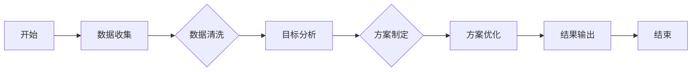
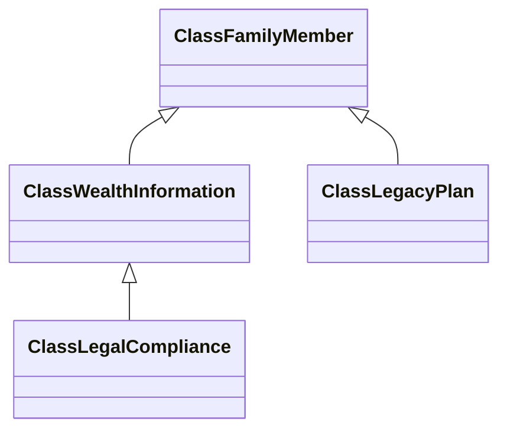
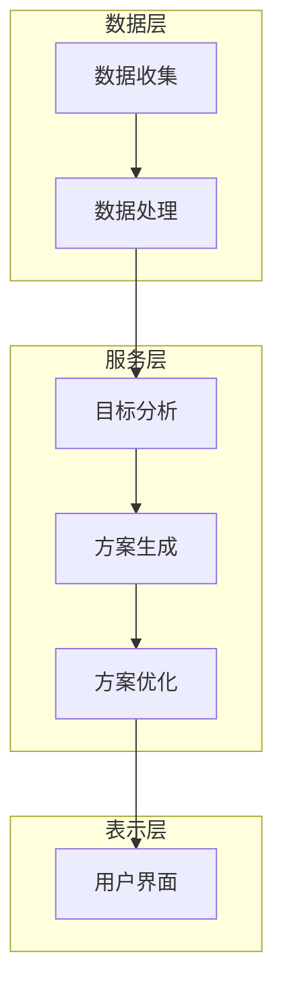
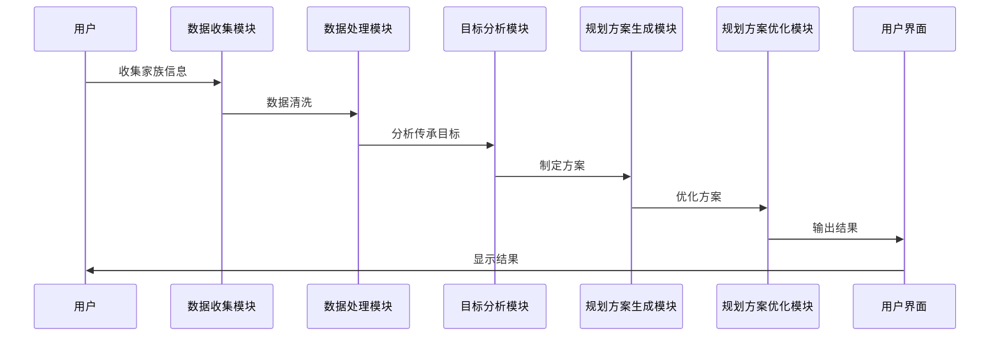

                 

# 《智能家族财富传承规划助手》

> 关键词：智能家族财富传承，规划助手，算法，架构设计，项目实战

> 摘要：本文将深入探讨智能家族财富传承规划助手的开发与实现，从背景介绍、核心概念与联系、算法原理讲解、系统分析与架构设计方案、项目实战等多个方面，详细解析如何构建一个高效、可靠的财富传承规划系统。

## 第一部分：背景介绍

### 1.1 问题背景

家族财富传承是许多高净值家庭面临的重要问题。随着社会经济的发展，家族财富的规模和复杂性不断增加，传统的财富传承方式已无法满足现代家族的需求。智能家族财富传承规划助手应运而生，旨在通过先进的技术手段，为家族提供全面、个性化的财富传承规划服务。

### 1.2 问题描述

家族财富传承的目标是确保家族财富的长期稳定增长，并合理分配给后代。然而，在这个过程中，家族成员之间的利益冲突、传承方式的选择、法律合规等问题成为阻碍。如何有效地解决这些问题，确保家族财富的顺利传承，是当前亟待解决的难题。

### 1.3 问题解决

智能家族财富传承规划助手通过集成数据分析、人工智能、区块链等先进技术，为家族提供智能化的财富传承规划服务。助手可以根据家族的具体情况，分析传承目标，制定合理的传承方案，并提供法律合规性检查，确保传承过程的顺利进行。

### 1.4 边界与外延

智能家族财富传承规划助手的边界在于其适用的财富规模和家族成员数量。对于小型家族，助手可以提供全面的财富传承服务；对于大型家族，助手则需要具备更高的性能和可扩展性。

### 1.5 概念结构与核心要素组成

智能家族财富传承规划助手的核心概念包括财富传承、智能规划、家族办公室等。核心要素包括家族成员信息、财富信息、传承方案、法律合规性检查等。

## 第二部分：核心概念与联系

### 2.1 核心概念原理

- **财富传承**：家族财富从一代传至后代的转移过程。
- **智能规划**：利用人工智能技术对财富传承过程进行优化。
- **家族办公室**：为高净值家庭提供财富管理和传承服务的专业机构。

### 2.2 概念属性特征对比表格

| 概念       | 属性特征                             |
|------------|--------------------------------------|
| 财富传承   | 传承方式、传承目标、传承计划         |
| 智能规划   | 数据分析、目标评估、方案优化         |
| 家族办公室 | 管理团队、专业服务、法律合规性检查   |

### 2.3 ER实体关系图架构

```mermaid
erDiagram
  FamilyMember ||--|{ WealthInformation }
  FamilyMember ||--|{ LegacyPlan }
  WealthInformation ||--|{ LegalCompliance }
```

## 第三部分：算法原理讲解

### 3.1 算法mermaid流程图



### 3.2 Python源代码详细讲解

#### 3.2.1 数据处理模块

```python
def data_processing(data):
    # 数据预处理，如数据清洗、去重、归一化等
    processed_data = ...
    return processed_data
```

#### 3.2.2 目标分析模块

```python
def target_analysis(processed_data):
    # 分析传承目标，如传承比例、传承时间等
    target = ...
    return target
```

#### 3.2.3 规划方案生成模块

```python
def plan_generation(target):
    # 根据目标生成传承方案
    plan = ...
    return plan
```

### 3.3 数学模型和公式

#### 3.3.1 数据分析模型

$$ \text{数据处理} = f(\text{原始数据}, \text{预处理参数}) $$

#### 3.3.2 目标评估模型

$$ \text{目标评估} = g(\text{目标参数}, \text{分析结果}) $$

#### 3.3.3 规划方案优化模型

$$ \text{方案优化} = h(\text{规划方案}, \text{优化目标}) $$

### 3.4 举例说明

#### 3.4.1 案例背景

一个高净值家族希望通过智能家族财富传承规划助手为其制定一份传承方案。

#### 3.4.2 数据处理

收集家族成员信息、财富信息等，进行数据清洗、去重、归一化处理。

#### 3.4.3 目标分析

分析家族传承目标，如传承比例、传承时间等。

#### 3.4.4 规划方案制定

根据目标生成一份传承方案。

#### 3.4.5 规划方案优化

对生成的方案进行优化，确保传承方案的合理性和可行性。

## 第四部分：系统分析与架构设计方案

### 4.1 问题场景介绍

一个高净值家族希望通过智能家族财富传承规划助手为其制定一份传承方案，以确保家族财富的长期稳定增长和合理传承。

### 4.2 系统功能设计（领域模型mermaid类图）



### 4.3 系统架构设计mermaid架构图



### 4.4 系统接口设计和系统交互mermaid序列图



## 第五部分：项目实战

### 5.1 环境安装

安装所需软件和环境，如Python、数据库等。

### 5.2 系统核心实现源代码

#### 5.2.1 数据处理模块代码

```python
# 数据处理模块代码
```

#### 5.2.2 目标分析模块代码

```python
# 目标分析模块代码
```

### 5.3 代码应用解读与分析

详细解读系统核心实现源代码，分析其应用场景和效果。

### 5.4 实际案例分析和详细讲解剖析

通过实际案例，分析智能家族财富传承规划助手的应用效果。

### 5.5 项目小结

总结项目经验，提出改进意见。

## 第六部分：最佳实践 tips

### 6.1 小结

本文从多个角度详细介绍了智能家族财富传承规划助手的开发与实现，包括背景介绍、核心概念与联系、算法原理讲解、系统分析与架构设计方案、项目实战等。

### 6.2 注意事项

在开发智能家族财富传承规划助手时，需要注意数据安全、隐私保护等问题。

### 6.3 拓展阅读

推荐阅读相关书籍和资料，深入了解智能家族财富传承规划技术。

## 第七部分：附录

### 7.1 相关工具与技术介绍

介绍开发智能家族财富传承规划助手所需的相关工具和技术。

### 7.2 术语解释

解释文章中涉及的专业术语。

### 7.3 参考文献

列出本文引用的参考文献。

---

作者：AI天才研究院/AI Genius Institute & 禅与计算机程序设计艺术 /Zen And The Art of Computer Programming

本文内容仅供参考，如需实际应用，请根据实际情况进行调整。在使用过程中，如遇到问题，请及时寻求专业意见。本文版权属于作者，未经授权，不得用于商业用途。

