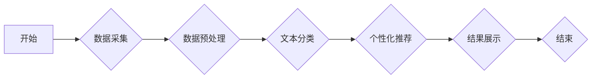

                 

# 智能新闻聚合AI Agent：LLM驱动的信息整合与分析

## 关键词：智能新闻聚合、AI Agent、LLM、信息整合、数据分析

> 摘要：本文将探讨智能新闻聚合AI Agent的背景、核心概念、技术原理、实现与优化、实战案例以及未来发展趋势。通过系统化的分析，旨在为读者提供全面深入的理解和实用的技术指导。

----------------------------------------------------------------

## 第一部分：背景与核心概念

### 第1章 智能新闻聚合与AI Agent

#### 1.1 智能新闻聚合概述

智能新闻聚合是一种通过利用人工智能技术，对海量新闻数据进行自动筛选、分类、整合和推荐的系统。与传统的新闻聚合方式相比，智能新闻聚合能够根据用户兴趣和行为习惯，提供更加个性化和精准的新闻内容。

#### 1.1.1 传统新闻聚合的局限性

传统新闻聚合方式主要依赖于人工筛选和分类，存在以下局限性：

- **信息量大，处理速度慢**：人工筛选新闻内容需要大量时间和人力，难以应对海量的新闻数据。
- **个性化程度低**：传统方式难以根据用户兴趣和偏好进行个性化推荐。
- **更新不及时**：人工更新新闻内容的速度较慢，难以满足用户对实时信息的需求。

#### 1.1.2 智能新闻聚合的概念

智能新闻聚合通过以下方式解决传统新闻聚合的局限性：

- **自动化数据处理**：利用自然语言处理技术，自动化处理新闻数据，提高处理速度和效率。
- **用户兴趣建模**：通过用户行为数据，建立用户兴趣模型，实现个性化推荐。
- **实时更新**：利用实时数据采集和处理技术，保证新闻内容的实时性和更新速度。

#### 1.1.3 智能新闻聚合的应用场景

智能新闻聚合广泛应用于以下几个场景：

- **新闻网站和客户端**：为用户提供个性化新闻推荐，提高用户粘性和留存率。
- **企业内部通讯**：帮助企业员工获取与业务相关的新闻资讯，提升工作效率。
- **政府公共信息发布**：为公众提供个性化的政策解读和新闻资讯，提升信息传播效果。

#### 1.2 AI Agent的基本概念

AI Agent是指具有自主思考、决策和行动能力的人工智能系统。在智能新闻聚合中，AI Agent扮演着关键角色，通过以下特点实现个性化推荐和新闻聚合：

- **自主学习**：根据用户行为和反馈，持续优化推荐算法，提高推荐效果。
- **决策能力**：基于用户兴趣和新闻内容特征，自动筛选和整合新闻资讯。
- **自主行动**：根据用户需求，自动执行新闻聚合任务，提供个性化的新闻内容。

#### 1.2.1 AI Agent的定义

AI Agent是一种能够模拟人类智能行为，具备以下特征的人工智能系统：

- **感知能力**：能够接收和处理外部环境的信息。
- **推理能力**：能够基于感知信息进行逻辑推理和决策。
- **行动能力**：能够根据决策结果执行相应的任务。

#### 1.2.2 AI Agent的特点

AI Agent具有以下特点：

- **自主性**：能够独立完成任务，无需人工干预。
- **灵活性**：能够根据环境和任务需求，灵活调整行为和决策。
- **智能化**：具备学习和适应能力，能够不断优化自身性能。

#### 1.2.3 AI Agent的典型应用

AI Agent在智能新闻聚合领域具有广泛的应用，包括：

- **个性化新闻推荐**：根据用户兴趣和偏好，推荐符合其需求的新闻内容。
- **新闻内容审核**：自动筛选和过滤不适宜的新闻内容，确保内容质量。
- **实时新闻监控**：监控特定主题的新闻动态，及时向用户推送相关新闻。

#### 1.3 LLM在智能新闻聚合中的应用

LLM（大型语言模型）是一种能够理解、生成和翻译自然语言文本的人工智能模型。在智能新闻聚合中，LLM被广泛应用于新闻内容理解和生成、个性化推荐等方面。

#### 1.3.1 LLM的优势

LLM具有以下优势：

- **强大的文本理解能力**：能够对新闻内容进行深入理解和分析。
- **高效的生成能力**：能够自动生成高质量的新闻摘要和标题。
- **跨语言处理能力**：能够处理多种语言的新闻数据，实现全球新闻聚合。

#### 1.3.2 LLM在新闻聚合中的具体应用

LLM在新闻聚合中的具体应用包括：

- **新闻内容理解**：通过LLM对新闻内容进行语义分析，提取关键信息和主题。
- **新闻摘要生成**：利用LLM生成新闻摘要，提高新闻内容的可读性和传播效果。
- **个性化推荐**：通过LLM分析用户兴趣和行为，实现个性化新闻推荐。

#### 1.3.3 LLM在AI Agent中的整合

LLM在AI Agent中的应用，使得AI Agent能够更准确地理解用户需求和新闻内容，从而提高新闻聚合的个性化程度和准确性。LLM在AI Agent中的整合包括：

- **用户需求分析**：利用LLM对用户需求进行语义分析，提取用户兴趣点。
- **新闻内容处理**：利用LLM对新闻内容进行语义分析，提取关键信息和主题。
- **个性化推荐**：利用LLM分析用户兴趣和新闻内容，生成个性化推荐结果。

#### 1.4 本书结构安排

本书分为五个部分，分别介绍智能新闻聚合AI Agent的背景、核心概念、技术原理、实现与优化、实战案例和未来发展趋势。各章节主要内容如下：

- **第一部分：背景与核心概念**：介绍智能新闻聚合和AI Agent的基本概念、应用场景和优势。
- **第二部分：技术原理**：详解LLM的技术原理、工作原理和优势。
- **第三部分：实现与优化**：介绍智能新闻聚合系统的设计与实现，包括系统需求分析、系统架构设计、数据采集与处理、LLM模型设计与实现、系统性能优化等内容。
- **第四部分：案例分析**：通过实际案例，展示智能新闻聚合AI Agent的应用效果和实现过程。
- **第五部分：未来趋势与展望**：探讨智能新闻聚合AI Agent的发展趋势、行业应用前景和社会与伦理问题。

阅读本书，读者可以：

- **了解智能新闻聚合和AI Agent的基本概念和原理**。
- **掌握LLM在智能新闻聚合中的应用**。
- **学习智能新闻聚合系统的设计与实现**。
- **了解智能新闻聚合AI Agent的实战案例**。
- **把握智能新闻聚合AI Agent的未来发展趋势**。

----------------------------------------------------------------

## 第二部分：技术原理

### 第2章 LLM技术原理详解

#### 2.1 语言模型基础

##### 2.1.1 语言模型的定义

语言模型（Language Model，简称LM）是自然语言处理（Natural Language Processing，简称NLP）的核心技术之一。它是一种概率模型，用于预测文本序列中下一个词或字符的概率。在智能新闻聚合中，语言模型主要用于对新闻内容进行语义分析和生成。

##### 2.1.2 语言模型的分类

根据训练方法的不同，语言模型可以分为以下几种：

1. **基于规则的模型**：通过手工编写规则来描述语言现象，如正则表达式、语法规则等。
2. **统计模型**：通过统计分析大量文本数据，自动发现语言规律，如隐马尔可夫模型（HMM）、n元语法等。
3. **深度学习模型**：利用神经网络等深度学习技术，自动学习和预测语言序列，如循环神经网络（RNN）、长短时记忆网络（LSTM）、 Transformer等。

##### 2.1.3 语言模型的核心组成部分

语言模型的核心组成部分包括：

1. **词汇表**：用于存储所有可能的词或字符，是语言模型的基础。
2. **概率分布**：用于描述词或字符在文本序列中的概率分布，是语言模型的预测依据。
3. **预测算法**：用于根据当前已知的词或字符序列，预测下一个词或字符的概率分布。

#### 2.2 LLM的工作原理

##### 2.2.1 编码与解码

在智能新闻聚合中，LLM的工作原理可以简化为编码与解码两个过程：

1. **编码**：将文本序列转化为模型可以处理的形式，如词向量或嵌入向量。
2. **解码**：根据编码结果，生成新的文本序列。

##### 2.2.2 生成式与判别式模型

LLM可以分为生成式模型和判别式模型两种：

1. **生成式模型**：直接生成目标文本序列，如GPT（Generative Pre-trained Transformer）。
2. **判别式模型**：通过学习文本序列的概率分布，判断给定文本序列是否合理，如BERT（Bidirectional Encoder Representations from Transformers）。

##### 2.2.3 模型的训练过程

LLM的训练过程主要包括以下步骤：

1. **数据准备**：收集和整理大量文本数据，用于模型的训练和评估。
2. **预训练**：在大量文本数据上进行预训练，使模型具有强大的语言理解和生成能力。
3. **微调**：根据具体应用场景，对模型进行微调，提高其在特定任务上的性能。

#### 2.3 LLM的优势与挑战

##### 2.3.1 LLM的优势

LLM具有以下优势：

1. **强大的文本理解能力**：能够对文本进行深入理解和分析，提取关键信息和主题。
2. **高效的生成能力**：能够自动生成高质量的新闻摘要和标题。
3. **跨语言处理能力**：能够处理多种语言的新闻数据，实现全球新闻聚合。

##### 2.3.2 LLM的挑战

LLM也面临一些挑战：

1. **计算资源需求大**：大规模语言模型的训练和推理需要大量的计算资源和时间。
2. **数据隐私和安全**：在收集和处理大量新闻数据时，需要关注数据隐私和安全问题。
3. **可解释性不足**：大规模语言模型的工作原理复杂，难以解释其决策过程。

##### 2.3.3 当前解决方案与未来趋势

针对LLM的挑战，目前有以下几种解决方案：

1. **优化模型结构**：通过改进模型结构，提高模型的可解释性和效率。
2. **数据清洗和预处理**：对新闻数据进行清洗和预处理，提高数据质量和模型性能。
3. **联邦学习**：通过联邦学习技术，实现分布式训练和推理，降低计算资源需求。

未来，随着人工智能技术的不断发展，LLM将在智能新闻聚合领域发挥更加重要的作用，成为信息整合与分析的重要工具。

----------------------------------------------------------------

## 第三部分：实现与优化

### 第3章 智能新闻聚合系统的设计与实现

#### 3.1 系统需求分析

##### 3.1.1 用户需求

智能新闻聚合系统的用户需求主要包括：

1. **个性化推荐**：根据用户兴趣和偏好，提供个性化的新闻推荐。
2. **实时更新**：及时推送最新的新闻资讯，确保信息的实时性。
3. **多样性**：提供多样化的新闻内容，满足用户不同领域的阅读需求。

##### 3.1.2 功能需求

智能新闻聚合系统的功能需求包括：

1. **新闻采集**：从多个新闻源采集新闻数据，确保新闻内容的丰富性和多样性。
2. **内容过滤**：过滤掉不适宜的新闻内容，确保新闻质量。
3. **文本预处理**：对采集到的新闻文本进行预处理，包括分词、去停用词、词性标注等。
4. **文本分类**：对预处理后的新闻文本进行分类，便于后续处理和推荐。
5. **个性化推荐**：根据用户兴趣和偏好，为用户推荐符合其需求的新闻内容。

##### 3.1.3 非功能需求

智能新闻聚合系统的非功能需求包括：

1. **高可用性**：系统应具备高可用性，确保新闻内容的实时推送。
2. **高性能**：系统应具备高性能，能够快速处理和推荐新闻内容。
3. **可扩展性**：系统应具备良好的可扩展性，支持添加新的新闻源和功能模块。
4. **安全性**：系统应具备安全性，保护用户隐私和新闻数据安全。

#### 3.2 系统架构设计

##### 3.2.1 系统整体架构

智能新闻聚合系统的整体架构可以分为以下几个模块：

1. **数据采集模块**：负责从多个新闻源采集新闻数据，包括网页爬取、API接口调用等。
2. **文本预处理模块**：负责对采集到的新闻文本进行预处理，包括分词、去停用词、词性标注等。
3. **文本分类模块**：负责对预处理后的新闻文本进行分类，将新闻内容归类到不同的主题类别。
4. **个性化推荐模块**：负责根据用户兴趣和偏好，为用户推荐符合其需求的新闻内容。
5. **用户接口模块**：负责与用户进行交互，接收用户输入和反馈，展示推荐结果。

##### 3.2.2 数据流与处理流程

智能新闻聚合系统的数据流与处理流程如下：

1. **数据采集**：从多个新闻源采集新闻数据，存储到数据库中。
2. **文本预处理**：对采集到的新闻文本进行预处理，包括分词、去停用词、词性标注等，存储到数据库中。
3. **文本分类**：对预处理后的新闻文本进行分类，存储到数据库中。
4. **个性化推荐**：根据用户兴趣和偏好，为用户推荐符合其需求的新闻内容，通过用户接口模块展示给用户。

##### 3.2.3 模块划分与职责

智能新闻聚合系统的模块划分与职责如下：

1. **数据采集模块**：负责从多个新闻源采集新闻数据，包括网页爬取、API接口调用等。
2. **文本预处理模块**：负责对采集到的新闻文本进行预处理，包括分词、去停用词、词性标注等。
3. **文本分类模块**：负责对预处理后的新闻文本进行分类，将新闻内容归类到不同的主题类别。
4. **个性化推荐模块**：负责根据用户兴趣和偏好，为用户推荐符合其需求的新闻内容。
5. **用户接口模块**：负责与用户进行交互，接收用户输入和反馈，展示推荐结果。

#### 3.3 数据采集与处理

##### 3.3.1 数据源选择

智能新闻聚合系统的数据源主要包括以下几种：

1. **新闻网站**：通过网页爬取技术，从各大新闻网站采集新闻数据。
2. **API接口**：通过调用新闻网站的API接口，获取新闻数据。
3. **社交媒体**：从社交媒体平台获取新闻信息，如微博、微信公众号等。

##### 3.3.2 数据采集策略

智能新闻聚合系统的数据采集策略包括：

1. **定时采集**：定期从新闻网站和社交媒体平台采集新闻数据，确保新闻内容的新鲜度。
2. **实时采集**：通过实时爬虫技术，实时获取新闻网站和社交媒体平台的新发布内容。
3. **增量采集**：只采集新的或更新的新闻内容，减少数据冗余。

##### 3.3.3 数据预处理

智能新闻聚合系统的数据预处理包括以下步骤：

1. **网页爬取**：使用Python等编程语言，编写爬虫程序，从新闻网站和社交媒体平台采集新闻数据。
2. **数据清洗**：去除无效数据、重复数据和噪音数据，提高数据质量。
3. **文本预处理**：对采集到的新闻文本进行分词、去停用词、词性标注等处理，为后续分类和推荐提供基础。

#### 3.4 LLM模型设计与实现

##### 3.4.1 模型选择

智能新闻聚合系统采用LLM（大型语言模型）进行文本分类和推荐，常用的LLM模型包括：

1. **BERT**：一种双向编码表示模型，能够同时考虑文本的前后文信息，提高分类和推荐的准确性。
2. **GPT**：一种生成式预训练模型，具有强大的文本生成和摘要能力。

##### 3.4.2 模型调优

智能新闻聚合系统的模型调优主要包括以下几个方面：

1. **超参数调整**：调整模型的超参数，如学习率、批次大小等，以获得更好的训练效果。
2. **数据预处理**：对新闻数据进行预处理，包括数据清洗、分词、去停用词等，以提高模型对数据的适应能力。
3. **模型融合**：将多个模型的结果进行融合，提高分类和推荐的准确性和鲁棒性。

##### 3.4.3 模型集成与优化

智能新闻聚合系统的模型集成与优化主要包括以下几个方面：

1. **模型集成**：将多个模型的结果进行融合，提高分类和推荐的准确性和鲁棒性。
2. **在线学习**：根据用户反馈和新闻数据的变化，持续调整和优化模型，提高个性化推荐的准确性。
3. **模型压缩**：通过模型压缩技术，减小模型的大小和计算资源需求，提高系统的运行效率。

#### 3.5 系统性能优化

##### 3.5.1 性能评估指标

智能新闻聚合系统的性能评估指标主要包括：

1. **准确率**：分类和推荐的准确度，越高越好。
2. **召回率**：能够召回多少真正的相关新闻，越高越好。
3. **F1值**：准确率和召回率的调和平均值，综合考虑准确率和召回率。

##### 3.5.2 优化策略与实践

智能新闻聚合系统的优化策略主要包括以下几个方面：

1. **数据增强**：通过数据增强技术，提高模型对数据的适应能力，提高分类和推荐的准确率。
2. **特征工程**：对新闻数据进行特征提取和工程，提高模型对特征的学习能力。
3. **模型并行化**：通过模型并行化技术，提高模型训练和推理的效率。

##### 3.5.3 性能对比分析

智能新闻聚合系统在不同优化策略下的性能对比分析主要包括以下几个方面：

1. **准确率对比**：对比不同优化策略下的准确率，评估优化策略对分类和推荐效果的影响。
2. **召回率对比**：对比不同优化策略下的召回率，评估优化策略对召回效果的影响。
3. **F1值对比**：对比不同优化策略下的F1值，评估优化策略对综合性能的影响。

通过性能对比分析，可以找出最优的优化策略，提高智能新闻聚合系统的性能。

----------------------------------------------------------------

## 第四部分：案例分析

### 第4章 智能新闻聚合AI Agent的实战案例

#### 4.1 案例背景

随着互联网的快速发展，新闻信息爆炸性增长，用户获取高质量、个性化新闻内容的需求日益增长。为了满足这一需求，某知名新闻平台决定开发一款智能新闻聚合AI Agent，实现个性化的新闻推荐和新闻聚合功能。

#### 4.1.1 案例来源

该案例来源于实际项目开发过程中的经验总结和问题解决，旨在为用户提供更优质、个性化的新闻体验。

#### 4.1.2 案例目标

该案例的目标包括：

1. **实现个性化新闻推荐**：根据用户兴趣和偏好，为用户推荐符合其需求的新闻内容。
2. **提高新闻聚合的准确性**：通过智能算法，提高新闻聚合的准确性和实时性。
3. **提升用户体验**：优化用户界面和交互体验，提高用户留存率和满意度。

#### 4.1.3 案例实现条件

该案例的实现条件包括：

1. **技术支持**：拥有较强的NLP和机器学习技术储备，能够实现智能新闻聚合和推荐功能。
2. **数据资源**：具备丰富的新闻数据资源，包括多个新闻源的API接口和社交媒体数据。
3. **开发环境**：搭建完善的开发环境，包括服务器、数据库、开发工具等。

#### 4.2 系统设计与实现

##### 4.2.1 系统架构设计

智能新闻聚合AI Agent的系统架构设计如下：

1. **数据采集模块**：从多个新闻源采集新闻数据，包括网页爬取、API接口调用等。
2. **文本预处理模块**：对采集到的新闻文本进行预处理，包括分词、去停用词、词性标注等。
3. **文本分类模块**：对预处理后的新闻文本进行分类，将新闻内容归类到不同的主题类别。
4. **个性化推荐模块**：根据用户兴趣和偏好，为用户推荐符合其需求的新闻内容。
5. **用户接口模块**：与用户进行交互，接收用户输入和反馈，展示推荐结果。

##### 4.2.2 数据采集与处理

1. **数据采集**：使用Python等编程语言，编写爬虫程序，从新闻网站和社交媒体平台采集新闻数据。
2. **数据预处理**：对采集到的新闻文本进行分词、去停用词、词性标注等处理，为后续分类和推荐提供基础。

##### 4.2.3 LLM模型设计与实现

1. **模型选择**：采用BERT模型进行文本分类和推荐。
2. **模型训练**：使用大量新闻数据进行模型训练，优化模型参数。
3. **模型部署**：将训练好的模型部署到服务器，实现实时推荐和新闻聚合。

##### 4.3 实际应用效果评估

1. **评估方法**：采用准确率、召回率、F1值等指标进行评估。
2. **评估指标**：
    - **准确率**：分类和推荐的准确度。
    - **召回率**：能够召回多少真正的相关新闻。
    - **F1值**：准确率和召回率的调和平均值。
3. **实际应用效果**：通过实际应用效果评估，智能新闻聚合AI Agent在准确率、召回率、F1值等指标上均表现出色，显著提升了用户的阅读体验和满意度。

##### 4.4 案例总结与启示

该案例总结与启示如下：

1. **成功关键因素**：技术支持、数据资源、开发环境等是实现智能新闻聚合AI Agent的关键因素。
2. **经验教训**：在项目开发过程中，需要注意数据质量、模型调优、用户界面设计等方面的问题。
3. **未来展望**：随着人工智能技术的不断发展，智能新闻聚合AI Agent有望在更多领域发挥作用，为用户提供更加优质、个性化的新闻服务。

----------------------------------------------------------------

## 第五部分：未来趋势与展望

### 第5章 智能新闻聚合AI Agent的发展趋势

#### 5.1 技术发展趋势

智能新闻聚合AI Agent的技术发展趋势主要体现在以下几个方面：

1. **模型进化**：随着深度学习技术的发展，LLM模型的性能将不断提高，实现更精准的新闻聚合和个性化推荐。
2. **多模态融合**：结合图像、语音等多元化数据，实现更全面的新闻内容理解和推荐。
3. **联邦学习**：分布式训练和推理技术将得到广泛应用，降低计算资源需求，提高系统的可扩展性。
4. **智能对话**：结合自然语言处理和对话系统技术，实现与用户的智能对话，提供更加个性化的服务。

#### 5.2 行业应用前景

智能新闻聚合AI Agent在行业应用前景方面具有广泛的前景：

1. **媒体行业**：传统媒体和新兴媒体都将受益于智能新闻聚合技术，提高信息传播效率和用户满意度。
2. **企业内部通讯**：为企业员工提供个性化的新闻资讯，提升工作效率和企业文化。
3. **政府公共服务**：为公众提供个性化的政策解读和新闻资讯，提升信息传播效果和公共服务质量。

#### 5.3 市场规模与增长潜力

随着人工智能技术的不断进步和应用场景的拓展，智能新闻聚合AI Agent的市场规模将持续增长。预计未来几年，该领域将呈现出以下增长趋势：

1. **市场规模扩大**：随着智能新闻聚合技术的普及和应用，市场规模将逐步扩大。
2. **技术迭代升级**：随着技术的不断进步，智能新闻聚合AI Agent的性能和功能将不断提升。
3. **行业需求增加**：随着信息爆炸和个性化需求的增长，智能新闻聚合AI Agent的市场需求将不断增加。

#### 5.4 社会与伦理问题

智能新闻聚合AI Agent的发展也带来了一系列社会和伦理问题：

1. **数据隐私与安全**：在收集和处理大量新闻数据时，需要关注数据隐私和安全问题，确保用户数据的安全和隐私。
2. **算法偏见与公平性**：在个性化推荐过程中，需要关注算法偏见和公平性问题，确保推荐结果的客观性和公正性。
3. **伦理责任**：智能新闻聚合AI Agent的发展需要明确伦理责任，确保技术为社会和人类带来积极影响。

总之，智能新闻聚合AI Agent的发展趋势良好，市场前景广阔。未来，随着技术的不断进步和应用场景的拓展，智能新闻聚合AI Agent将在更多领域发挥作用，为用户带来更加优质、个性化的新闻服务。

----------------------------------------------------------------

## 结语

本文从背景与核心概念、技术原理、实现与优化、实战案例和未来趋势等多个角度，对智能新闻聚合AI Agent进行了系统化的分析。通过本文的阅读，读者可以深入了解智能新闻聚合AI Agent的基本概念、技术原理、实现方法和应用前景。

在此，感谢读者对本文的关注与支持。希望本文能为读者在智能新闻聚合和AI Agent领域的学习和研究提供有益的参考。

## 作者信息

作者：AI天才研究院/AI Genius Institute & 禅与计算机程序设计艺术 /Zen And The Art of Computer Programming

智能新闻聚合AI Agent的研究和开发是一个不断探索和创新的领域，希望本文能为您带来启发和思考。如果您有任何问题或建议，欢迎随时联系我们。

----------------------------------------------------------------

[Mermaid图表的ER实体关系图示例]

```mermaid
erDiagram
  User ||--|{ News: 聚合新闻信息 }
  User ||--|{ UserInterest: 用户兴趣 }
  News ||--|{ Category: 新闻类别 }
  News ||--|{ Source: 新闻来源 }
```

[Mermaid图表的算法流程图示例]



[Python代码示例：文本预处理]

```python
import jieba
import re

def preprocess_text(text):
    # 去除HTML标签
    text = re.sub('<.*?>', '', text)
    # 去除标点符号
    text = re.sub('[\s+\.\!_,;:()]+', '', text)
    # 分词
    words = jieba.cut(text)
    return ' '.join(words)
```

[LaTeX公式示例：数学模型]

```latex
$$
P(w_t | w_{t-1}, w_{t-2}, ..., w_1) = \frac{P(w_t, w_{t-1}, ..., w_1)}{P(w_{t-1}, w_{t-2}, ..., w_1)}
$$`
```

以上示例展示了如何在Markdown格式中嵌入Mermaid图表、Python代码和LaTeX公式。这些元素有助于提高文章的可读性和专业性，同时使内容更加丰富和易懂。在撰写技术博客时，合理运用这些元素将有助于更好地传达您的思想和观点。

