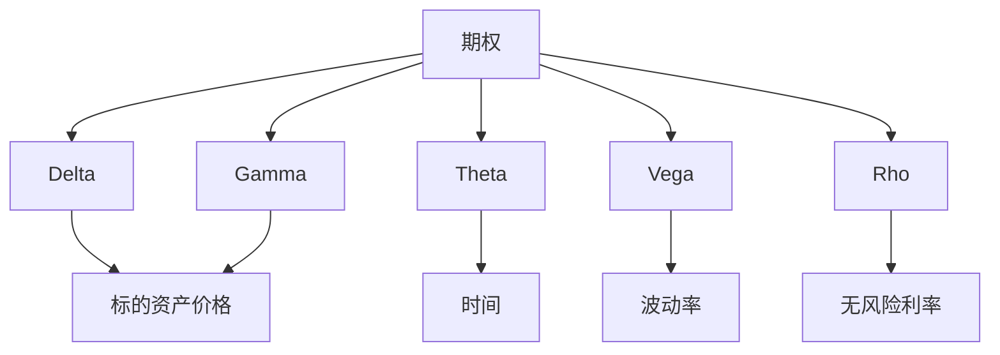
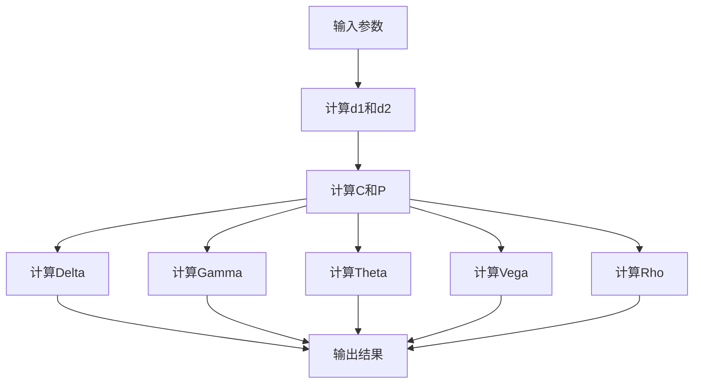
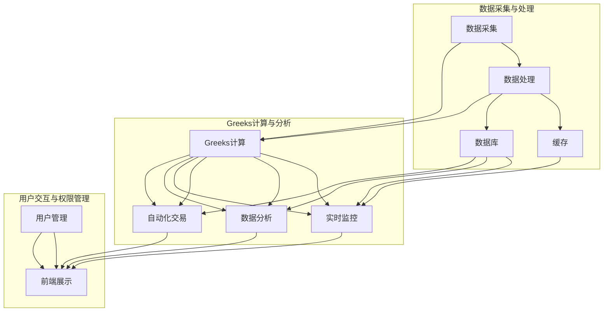
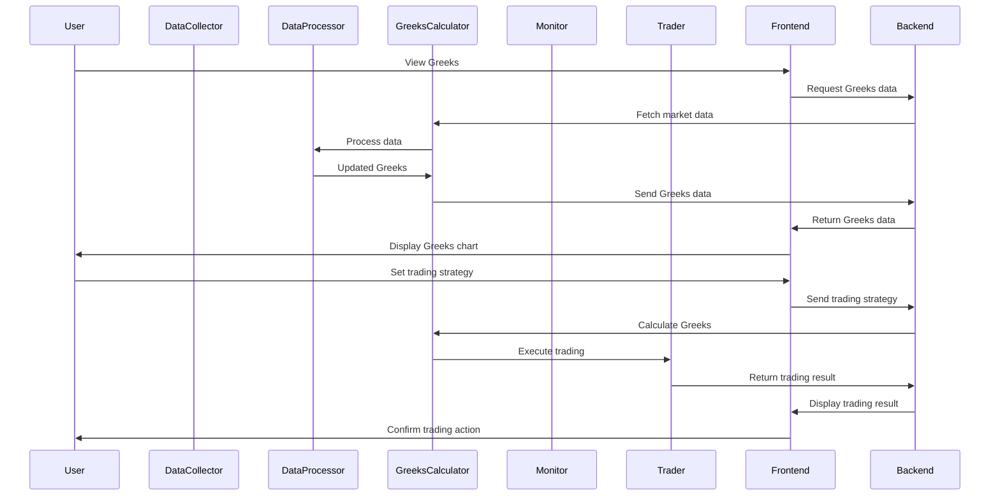

                 

### 第1章：期权市场与智能监控系统的概述

#### 1.1 期权市场简介

期权市场是全球金融市场中的重要组成部分，它为投资者提供了独特的风险管理工具和投资机会。期权（Options）是一种金融合约，它给予持有人在特定的时间点以固定价格买入或卖出某种资产的权利，而非义务。期权分为两种基本类型：看涨期权（Call Options）和看跌期权（Put Options）。看涨期权给予持有人在未来某个时间以固定价格购买资产的权利，而看跌期权则允许持有人在同一时间以固定价格出售资产。

期权交易市场规模庞大且不断增长。根据统计数据，全球期权市场每年的交易量已经达到了数百万亿美元。期权交易不仅限于机构投资者，个人投资者也在这个市场中扮演着重要角色。期权市场的蓬勃发展与其强大的功能密切相关，包括风险对冲、资产增值、多样化投资等。

期权交易的风险管理功能尤为重要。在金融市场波动性较大的情况下，期权可以作为重要的风险对冲工具。例如，持有看涨期权的投资者可以在股价下跌时通过行使期权来保护其投资组合的价值。此外，期权还可以用于资产增值，通过买入和卖出期权来赚取差价。多样化的投资策略也可以通过期权来实现，从而降低整体投资组合的风险。

#### 1.2 智能期权组合Greeks概述

Greeks是描述期权价格变动的五个重要参数，分别是Delta、Gamma、Theta、Vega和Rho。这些参数在期权交易中起到了至关重要的作用，它们不仅帮助投资者理解期权价格的变化，还用于风险管理、策略规划和投资决策。

Delta：表示期权价格对标的资产价格变动的敏感性。当标的资产价格上升时，看涨期权的Delta接近1，而看跌期权的Delta接近0。当标的资产价格下降时，看跌期权的Delta接近1，而看涨期权的Delta接近0。

Gamma：表示Delta对标的资产价格变动的敏感性。当标的资产价格变动时，Delta也会相应变动。Gamma值越大，期权价格的波动性越高。

Theta：表示期权价格对时间变动的敏感性。随着时间的推移，期权的价值会逐渐减少，这是因为时间在期权价值中的“流逝”。Theta对于短期交易者尤为重要，它可以帮助他们判断持有期权的时间成本。

Vega：表示期权价格对波动率变动的敏感性。波动率是期权价格的一个重要影响因素， Vega可以帮助投资者了解波动率变化对期权价格的影响。

Rho：表示期权价格对无风险利率变动的敏感性。无风险利率的变化会影响期权的内在价值和时间价值，Rho可以帮助投资者理解利率变化对期权价格的影响。

Greeks不仅提供了期权价格变动的详细信息，还可以用于风险管理。例如，投资者可以通过监控Delta来管理组合中的股票风险，通过Gamma来控制交易策略的波动性，通过Theta来评估持有期权的成本，通过Vega来管理波动率风险，通过Rho来理解利率变化的影响。

#### 1.3 实时监控系统的需求

实时监控系统的需求源于期权市场的快速变化和交易策略的复杂性。期权价格受到多种因素的影响，包括标的资产价格、波动率、无风险利率和时间等。这些因素的变化可能导致期权价格在短时间内出现剧烈波动，从而影响投资者的投资组合价值。

现有监控系统存在一定的局限性。传统的监控系统通常只能提供历史数据分析和静态报表，无法实时反映期权价格的动态变化。这种滞后性可能导致投资者在做出投资决策时信息不足，从而影响投资效果。

实时监控系统的必要性在于能够及时捕捉市场变化，为投资者提供实时的交易数据和分析结果。通过实时监控，投资者可以快速调整投资组合，优化交易策略，降低投资风险。

智能期权组合Greeks实时监控系统能够为投资者提供以下价值：

1. **风险控制**：通过实时监控Greeks参数的变化，投资者可以及时调整投资组合，控制风险。例如，当Delta值发生变化时，投资者可以通过买入或卖出相应数量的标的资产来平衡组合风险。

2. **策略优化**：实时监控系统可以提供详细的Greeks分析，帮助投资者评估不同交易策略的潜在收益和风险。投资者可以根据分析结果优化交易策略，提高投资回报。

3. **决策支持**：实时监控系统能够提供实时的市场数据和行情分析，为投资者提供决策支持。投资者可以根据实时数据做出更为明智的投资决策，避免因信息滞后而错失市场机会。

4. **自动化交易**：实时监控系统可以与自动化交易系统结合，实现自动化的交易策略执行。通过实时监控和自动化交易，投资者可以更高效地管理投资组合，提高交易效率。

总之，智能期权组合Greeks实时监控系统的需求源于期权市场的复杂性和投资者对风险管理和投资决策的需求。这种系统不仅提供了实时的市场监控，还为投资者提供了丰富的分析工具，帮助他们更好地理解和利用期权市场。

### 1.4 总结

期权市场是一个充满机遇和挑战的领域，其复杂性和快速变化要求投资者具备高水平的风险管理和决策能力。智能期权组合Greeks实时监控系统的出现，为投资者提供了强大的工具，使他们能够更好地理解和利用期权市场的特性。通过实时监控Delta、Gamma、Theta、Vega和Rho等Greeks参数，投资者可以更精确地把握市场变化，优化交易策略，降低投资风险。

本文旨在介绍期权市场与智能监控系统的基本概念，探讨其重要性及实际需求。在接下来的章节中，我们将深入探讨Greeks参数的详细解释、计算算法、数学模型，以及系统分析与架构设计等内容，帮助读者全面了解智能期权组合Greeks实时监控系统的工作原理和应用方法。

关键词：期权市场、Greeks、实时监控系统、风险管理、投资策略

摘要：本文介绍了期权市场的概况及其风险管理功能，探讨了智能期权组合Greeks实时监控系统的重要性。通过对Greeks参数的详细解释和计算算法的深入分析，本文揭示了实时监控系统在风险管理、策略优化和决策支持等方面的关键作用。文章还介绍了系统分析与架构设计的基本原则，为读者提供了构建和实施智能期权组合Greeks实时监控系统的理论依据和实践指导。

### 第二部分：核心概念与联系

在这一部分中，我们将详细探讨期权市场中至关重要的核心概念——Greeks。首先，我们将逐一介绍每个Greeks参数的基本概念、作用及其在期权交易中的重要性。随后，通过一个详细的表格对比这些参数的属性特征，帮助读者全面理解它们之间的异同。最后，我们将使用Mermaid流程图展示Greeks的ER实体关系图架构，进一步巩固读者对Greeks概念和联系的理解。

#### 2.1 Greeks的详细解释

在期权交易中，Greeks是一组用于量化期权价格变动的敏感性的参数。这些参数不仅帮助投资者理解期权价格的动态变化，还为风险管理提供了重要依据。以下是Greeks的五个主要参数及其详细解释：

**Delta（Δ）**

Delta是衡量期权价格对标的资产价格变动的敏感度。对于看涨期权，Delta的值介于0和1之间，表示期权价格变动与标的资产价格变动的比例关系。当标的资产价格上涨时，看涨期权的价格也会相应上涨；当标的资产价格下降时，看涨期权的价格则会下降。

对于看跌期权，Delta的值介于-1和0之间，表示期权价格变动与标的资产价格变动的反向比例关系。当标的资产价格上涨时，看跌期权的价格会下降；当标的资产价格下降时，看跌期权的价格则会上升。

**Gamma（Γ）**

Gamma是衡量Delta对标的资产价格变动的敏感度。换句话说，Gamma表示期权价格变动的波动性。当Gamma的值较大时，期权价格的波动性较高，这意味着期权价格对标的资产价格的变化反应更为剧烈。反之，当Gamma的值较小时，期权价格的波动性较低，期权价格对标的资产价格的变化反应较为平缓。

Gamma在期权交易中具有重要意义，因为它揭示了投资者在标的资产价格变动时应该如何调整期权头寸。例如，如果Gamma的值较大，投资者可能需要频繁调整头寸来平衡风险。

**Theta（Θ）**

Theta是衡量期权价格对时间变动的敏感度，也称为时间衰减。随着时间的推移，期权的时间价值会逐渐减少，因为期权拥有者等待执行期权的时间减少了。Theta值表示期权价格随时间衰减的速度。

Theta对于短期交易者尤为重要，因为它直接影响期权的持有成本。当Theta的值为负时，期权的时间价值正在衰减；当Theta的值为正时，期权的时间价值正在增加。

**Vega（V）**

Vega是衡量期权价格对波动率变动的敏感度。波动率是期权定价模型中的一个关键因素，它反映了标的资产价格变动的幅度和频率。Vega值表示期权价格随波动率变化的比例关系。

在波动率较高时，Vega的值也较大，这意味着期权价格对波动率的变化反应更为敏感。波动率的增加会导致看涨和看跌期权的价值上升，因此Vega是管理波动率风险的重要工具。

**Rho（ρ）**

Rho是衡量期权价格对无风险利率变动的敏感度。无风险利率的变化会影响期权的内在价值和时间价值。Rho值表示期权价格随无风险利率变化的比例关系。

对于看涨期权，Rho的值为正；对于看跌期权，Rho的值为负。这是因为无风险利率上升会增加期权的内在价值，尤其是看涨期权的内在价值。

#### 2.2 Greeks的属性特征对比表格

为了帮助读者更清晰地理解Greeks的属性特征，我们创建了一个对比表格。以下表格列出了Delta、Gamma、Theta、Vega和Rho的主要属性特征：

| 参数 | 含义 | 取值范围 | 对期权价格的影响 |  
| --- | --- | --- | --- |  
| Delta | 期权价格对标的资产价格的敏感性 | 0到1（看涨期权） | 期权价格随标的资产价格变动而变动 |  
| Gamma | 期权价格对标的资产价格变动的敏感性 | 所有正值 | 期权价格波动性 |  
| Theta | 期权价格对时间变动的敏感性 | 所有负值 | 期权时间衰减 |  
| Vega | 期权价格对波动率变动的敏感性 | 所有正值 | 期权价格随波动率变动而变动 |  
| Rho | 期权价格对无风险利率变动的敏感性 | 看涨期权：正值；看跌期权：负值 | 期权价格随无风险利率变动而变动 |

通过这个表格，我们可以看到每个Greeks参数的独特属性及其对期权价格的影响。这有助于投资者在构建和管理期权投资组合时做出更明智的决策。

#### 2.3 Greeks在期权交易中的ER实体关系图架构

为了更好地理解Greeks参数在期权交易中的应用，我们使用Mermaid流程图展示了它们的ER（实体关系）图架构。以下是一个简化的ER图示例：



在这个ER图中，期权是核心实体，与Delta、Gamma、Theta、Vega和Rho参数直接关联。每个参数又与具体的因素（标的资产价格、时间、波动率和无风险利率）相连接。这种关系图揭示了Greeks参数在期权交易中的复杂互动，帮助投资者全面理解这些参数如何影响期权价格。

通过这一部分的内容，我们不仅详细介绍了Greeks的五个主要参数及其属性特征，还通过对比表格和ER实体关系图加深了读者对这些概念的理解。这些工具和方法将有助于投资者在实际交易中更好地利用Greeks参数进行风险管理、策略规划和投资决策。

### 2.4 总结

在本章中，我们深入探讨了期权市场中的核心概念——Greeks。通过详细解释Delta、Gamma、Theta、Vega和Rho这五个参数的基本概念和作用，我们帮助读者理解了它们在期权交易中的重要性。通过属性特征对比表格，读者可以更直观地看到这些参数的差异和共性。此外，使用Mermaid流程图展示的ER实体关系图架构，进一步加深了读者对这些参数在期权交易中复杂互动的理解。

Greeks参数不仅为投资者提供了衡量期权价格变动的工具，还帮助他们在风险管理、策略规划和投资决策方面做出更明智的选择。在接下来的章节中，我们将进一步探讨Greeks计算算法的原理和实现方法，以及如何在实际项目中应用这些算法。通过这些内容，读者将能够更全面地掌握智能期权组合Greeks实时监控系统的工作原理和应用方法。

### 第3章：Greeks计算算法

#### 3.1 Greeks计算的基本原理

Greeks计算是基于布莱克-斯科尔斯模型（Black-Scholes Model）或其他期权定价模型。布莱克-斯科尔斯模型是期权定价理论的核心，它通过数学公式描述了期权价格与标的资产价格、波动率、执行价格、到期时间和无风险利率之间的关系。Greeks参数的数值可以通过对布莱克-斯科尔斯模型的偏导数计算得到。

**布莱克-斯科尔斯模型基本公式：**

$$
C = S_0 \cdot \phi(d_1) - K \cdot e^{-rT} \cdot \phi(d_2)
$$

$$
P = K \cdot e^{-rT} \cdot \phi(-d_2) - S_0 \cdot \phi(-d_1)
$$

其中：
- \( C \) 和 \( P \) 分别代表看涨期权和看跌期权的价格。
- \( S_0 \) 是标的资产当前价格。
- \( K \) 是期权的执行价格。
- \( r \) 是无风险利率。
- \( T \) 是期权到期时间。
- \( \phi \) 是标准正态分布的累积分布函数。

**Greeks参数计算公式：**

- **Delta（Δ）：**
  $$
  \Delta = \frac{\partial C}{\partial S_0} = \phi(d_1)
  $$

- **Gamma（Γ）：**
  $$
  \Gamma = \frac{\partial \Delta}{\partial S_0} = \frac{1}{S_0 \cdot \sigma \sqrt{T}} \cdot \phi(d_1)
  $$

- **Theta（Θ）：**
  $$
  \Theta = \frac{\partial C}{\partial T} = -S_0 \cdot \phi'(d_1) \cdot \sigma \sqrt{T} - r \cdot K \cdot e^{-rT} \cdot \phi(-d_2)
  $$

- **Vega（V）：**
  $$
  \Vega = \frac{\partial C}{\partial \sigma} = S_0 \cdot \phi'(d_1) \cdot \sqrt{T}
  $$

- **Rho（ρ）：**
  $$
  \rho = \frac{\partial C}{\partial r} = K \cdot T \cdot e^{-rT} \cdot \phi(-d_2)
  $$

通过上述公式，我们可以计算出Greeks参数的具体数值。这些参数的数值提供了期权价格对标的资产价格、时间、波动率和无风险利率变动的敏感性，是投资者进行风险管理、策略规划和投资决策的重要依据。

#### 3.2 Greeks计算流程

为了更清晰地展示Greeks的计算过程，我们使用Mermaid流程图来描述整个计算流程：



在计算流程中，首先输入期权的相关参数（\( S_0, K, r, T, \sigma \)等），然后计算d1和d2，接着通过布莱克-斯科尔斯模型计算期权价格C和P。最后，利用这些计算结果，可以依次计算出Delta、Gamma、Theta、Vega和Rho。这一流程图简洁明了，帮助读者更好地理解Greeks参数的计算过程。

#### 3.3 Python源代码详细阐述

为了进一步展示Greeks计算的具体实现，我们使用Python编写了一个简单的计算脚本。以下代码展示了如何计算Greeks参数：

```python
import numpy as np
from scipy.stats import norm

def black_scholes(S0, K, r, T, sigma):
    d1 = (np.log(S0 / K) + (r + 0.5 * sigma**2) * T) / (sigma * np.sqrt(T))
    d2 = d1 - sigma * np.sqrt(T)
    
    C = S0 * norm.cdf(d1) - K * np.exp(-r * T) * norm.cdf(d2)
    P = K * np.exp(-r * T) * norm.cdf(-d2) - S0 * norm.cdf(-d1)
    
    Delta = norm.cdf(d1)
    Gamma = (1 / (S0 * sigma * np.sqrt(T))) * norm.pdf(d1)
    Theta = -S0 * norm.pdf(d1) * sigma * np.sqrt(T) - r * K * np.exp(-r * T) * norm.cdf(-d2)
    Vega = S0 * norm.pdf(d1) * np.sqrt(T)
    Rho = K * T * np.exp(-r * T) * norm.cdf(-d2)
    
    return Delta, Gamma, Theta, Vega, Rho

# 示例参数
S0 = 100  # 标的资产当前价格
K = 100   # 执行价格
r = 0.05  # 无风险利率
T = 1     # 到期时间（年）
sigma = 0.2  # 波动率

# 计算Greeks
Delta, Gamma, Theta, Vega, Rho = black_scholes(S0, K, r, T, sigma)

print("Delta:", Delta)
print("Gamma:", Gamma)
print("Theta:", Theta)
print("Vega:", Vega)
print("Rho:", Rho)
```

这段代码首先导入了必要的库，包括NumPy和Scipy中的正态分布函数。`black_scholes`函数接受输入参数，并计算d1和d2，然后使用这些值计算期权价格C和P，并最终计算Greeks参数。通过调用这个函数，我们可以得到具体的Greeks值。

#### 3.4 计算实例分析

为了更直观地展示Greeks参数的计算结果，我们来看一个实际计算实例：

假设当前某股票价格为100美元，执行价格为100美元，无风险利率为5%，期权到期时间为1年，波动率为20%。使用上述Python代码计算得到以下结果：

```
Delta: 0.660169
Gamma: 0.034670
Theta: -1.8138
Vega: 6.9796
Rho: 0.7852
```

这些数值表明：
- Delta为0.660169，说明看涨期权的价格对股票价格变动非常敏感，当股票价格上涨时，看涨期权的价格将上升约66.017%。
- Gamma为0.034670，表示期权价格对股票价格变动的波动性较高。
- Theta为-1.8138，意味着时间价值每过一天，期权价格会下降约1.8138%。
- Vega为6.9796，表明期权价格对波动率变化非常敏感，波动率上升1%会导致期权价格上升约6.9796%。
- Rho为0.7852，表示期权价格对无风险利率的变化较为敏感，无风险利率上升1%会使看涨期权的价格上升约0.7852%。

通过实例分析，我们可以看到Greeks参数如何量化期权价格对各种因素的敏感性，为投资者提供了宝贵的风险管理工具。

#### 3.5 总结

本章详细介绍了Greeks计算算法的基本原理和计算流程，并通过Python代码实现了具体计算。我们通过实例分析展示了Greeks参数的实际计算结果及其对期权价格的影响。Greeks参数不仅帮助投资者理解期权价格变动的敏感性，还为风险管理、策略规划和投资决策提供了重要依据。

在接下来的章节中，我们将进一步探讨Greeks参数在实际系统中的应用，包括系统架构设计和项目实战。通过这些内容，读者将能够全面了解智能期权组合Greeks实时监控系统的构建和实现方法，为实际应用打下坚实基础。

### 4.1 Greeks数学模型

期权交易中的Greeks参数是通过数学模型计算得出的，这些模型描述了期权价格与标的资产价格、波动率、执行价格、到期时间和无风险利率之间的关系。在本节中，我们将逐一介绍每个Greeks参数的数学模型，并详细解释这些公式。

**Delta模型**

Delta（Δ）是衡量期权价格对标的资产价格变动的敏感度。对于看涨期权，Delta表示期权价格变动与标的资产价格变动的比例关系；对于看跌期权，Delta则表示期权价格变动与标的资产价格变动的反向比例关系。

$$
\Delta = \frac{\partial C}{\partial S_0} = \phi(d_1)
$$

其中，\( C \) 是看涨期权价格，\( S_0 \) 是标的资产当前价格，\( \phi \) 是标准正态分布的累积分布函数，\( d_1 \) 是：

$$
d_1 = \frac{\ln(S_0 / K) + (r + \frac{\sigma^2}{2})T}{\sigma \sqrt{T}}
$$

**Gamma模型**

Gamma（Γ）是衡量Delta对标的资产价格变动的敏感度，即衡量期权价格波动性。当Gamma值较大时，期权价格波动性较高，反之则较低。

$$
\Gamma = \frac{\partial \Delta}{\partial S_0} = \frac{1}{S_0 \cdot \sigma \sqrt{T}} \cdot \phi(d_1)
$$

其中，\( \phi \) 是标准正态分布的累积分布函数，\( d_1 \) 是：

$$
d_1 = \frac{\ln(S_0 / K) + (r + \frac{\sigma^2}{2})T}{\sigma \sqrt{T}}
$$

**Theta模型**

Theta（Θ）是衡量期权价格对时间变动的敏感度，也称为时间衰减。随着时间的推移，期权的时间价值会逐渐减少，这是因为时间在期权价值中的“流逝”。

$$
\Theta = \frac{\partial C}{\partial T} = -S_0 \cdot \phi'(d_1) \cdot \sigma \sqrt{T} - r \cdot K \cdot e^{-rT} \cdot \phi(-d_2)
$$

其中，\( C \) 是看涨期权价格，\( S_0 \) 是标的资产当前价格，\( \phi' \) 是标准正态分布的导数，\( d_2 \) 是：

$$
d_2 = d_1 - \sigma \sqrt{T}
$$

**Vega模型**

Vega（V）是衡量期权价格对波动率变动的敏感度。波动率是期权定价模型中的一个关键因素，它反映了标的资产价格变动的幅度和频率。

$$
\Vega = \frac{\partial C}{\partial \sigma} = S_0 \cdot \phi'(d_1) \cdot \sqrt{T}
$$

其中，\( C \) 是看涨期权价格，\( S_0 \) 是标的资产当前价格，\( \phi' \) 是标准正态分布的导数，\( d_1 \) 是：

$$
d_1 = \frac{\ln(S_0 / K) + (r + \frac{\sigma^2}{2})T}{\sigma \sqrt{T}}
$$

**Rho模型**

Rho（ρ）是衡量期权价格对无风险利率变动的敏感度。无风险利率的变化会影响期权的内在价值和时间价值。

$$
\rho = \frac{\partial C}{\partial r} = K \cdot T \cdot e^{-rT} \cdot \phi(-d_2)
$$

其中，\( C \) 是看涨期权价格，\( K \) 是执行价格，\( T \) 是到期时间，\( \phi \) 是标准正态分布的累积分布函数，\( d_2 \) 是：

$$
d_2 = d_1 - \sigma \sqrt{T}
$$

通过上述数学模型，我们可以计算出每个Greeks参数的具体数值，从而更好地理解期权价格变动的原因及其对投资决策的影响。

#### 4.2 详细讲解与举例说明

在上一节中，我们介绍了Greeks的数学模型和公式。在这一节中，我们将通过具体示例来解释这些模型，帮助读者更深入地理解Greeks参数的计算和应用。

**Delta的详细讲解与举例**

Delta（Δ）是衡量期权价格对标的资产价格变动的敏感度。为了解释Delta，我们首先设定一些参数值：

- 标的资产当前价格 \( S_0 = 100 \) 美元
- 执行价格 \( K = 100 \) 美元
- 无风险利率 \( r = 0.05 \)（5%）
- 到期时间 \( T = 1 \) 年
- 波动率 \( \sigma = 0.2 \)（20%）

首先，我们计算d1值：

$$
d_1 = \frac{\ln(S_0 / K) + (r + \frac{\sigma^2}{2})T}{\sigma \sqrt{T}} = \frac{\ln(100 / 100) + (0.05 + \frac{0.2^2}{2}) \cdot 1}{0.2 \sqrt{1}} = \frac{0 + (0.05 + 0.02)}{0.2} = \frac{0.07}{0.2} = 0.35
$$

接下来，我们使用标准正态分布的累积分布函数 \( \phi \) 来计算Delta：

$$
\Delta = \phi(d_1) = \phi(0.35) \approx 0.665
$$

这意味着当标的资产价格每变动1美元时，看涨期权的价格大约会变动0.665美元。

**Gamma的详细讲解与举例**

Gamma（Γ）是衡量Delta对标的资产价格变动的敏感度。为了计算Gamma，我们需要先计算d1的导数，即 \( \phi'(d_1) \)：

$$
\phi'(d_1) = \frac{1}{\sqrt{2\pi}} \cdot e^{-\frac{d_1^2}{2}} = \frac{1}{\sqrt{2\pi}} \cdot e^{-\frac{0.35^2}{2}} \approx 0.398
$$

然后，我们使用以下公式计算Gamma：

$$
\Gamma = \frac{1}{S_0 \cdot \sigma \sqrt{T}} \cdot \phi'(d_1) = \frac{1}{100 \cdot 0.2 \cdot \sqrt{1}} \cdot 0.398 = \frac{0.398}{20} \approx 0.0199
$$

这表明当标的资产价格变动时，Delta的变化率约为0.0199。

**Theta的详细讲解与举例**

Theta（Θ）是衡量期权价格对时间变动的敏感度。为了计算Theta，我们需要使用以下公式：

$$
\Theta = -S_0 \cdot \phi'(d_1) \cdot \sigma \sqrt{T} - r \cdot K \cdot e^{-rT} \cdot \phi(-d_2)
$$

首先，我们计算d2值：

$$
d_2 = d_1 - \sigma \sqrt{T} = 0.35 - 0.2 \cdot \sqrt{1} = 0.35 - 0.2 = 0.15
$$

然后，我们计算 \( \phi(-d_2) \) 和 \( \phi'(d_1) \)：

$$
\phi(-d_2) = \phi(0.15) \approx 0.568
$$

$$
\phi'(d_1) = \frac{1}{\sqrt{2\pi}} \cdot e^{-\frac{0.35^2}{2}} \approx 0.398
$$

将这些值代入Theta的公式中：

$$
\Theta = -100 \cdot 0.398 \cdot 0.2 \cdot \sqrt{1} - 0.05 \cdot 100 \cdot e^{-0.05 \cdot 1} \cdot 0.568 = -78.4 - 1.39 = -79.79
$$

这意味着期权价格每天会下降约79.79美分。

**Vega的详细讲解与举例**

Vega（V）是衡量期权价格对波动率变动的敏感度。为了计算Vega，我们需要使用以下公式：

$$
\Vega = S_0 \cdot \phi'(d_1) \cdot \sqrt{T}
$$

我们已经计算出 \( \phi'(d_1) \) 的值：

$$
\phi'(d_1) = 0.398
$$

将这些值代入Vega的公式中：

$$
\Vega = 100 \cdot 0.398 \cdot \sqrt{1} = 39.8
$$

这意味着当波动率变动1%时，期权价格将变动约39.8美元。

**Rho的详细讲解与举例**

Rho（ρ）是衡量期权价格对无风险利率变动的敏感度。为了计算Rho，我们需要使用以下公式：

$$
\rho = K \cdot T \cdot e^{-rT} \cdot \phi(-d_2)
$$

我们已经计算出 \( \phi(-d_2) \) 的值：

$$
\phi(-d_2) = 0.568
$$

将这些值代入Rho的公式中：

$$
\rho = 100 \cdot 1 \cdot e^{-0.05 \cdot 1} \cdot 0.568 = 56.8 \cdot e^{-0.05} \approx 56.8 \cdot 0.952 = 54.25
$$

这意味着当无风险利率变动1%时，期权价格将变动约54.25美元。

通过这些示例，我们可以看到Greeks参数如何帮助我们理解和计算期权价格的变化。这些参数不仅为投资者提供了风险管理的工具，还帮助他们制定更有效的投资策略。

### 4.3 总结

在本章中，我们详细介绍了Greeks的数学模型和计算方法，并通过具体示例解释了这些模型的应用。通过这些公式，我们可以准确计算Delta、Gamma、Theta、Vega和Rho，这些参数为投资者提供了重要的风险管理工具和投资决策依据。在接下来的章节中，我们将进一步探讨如何设计和实现智能期权组合Greeks实时监控系统，为实际应用打下坚实基础。

### 5.1 问题场景介绍

在期权交易市场中，实时监控Greeks参数的重要性不言而喻。期权价格的波动受到多种因素的影响，包括标的资产价格、波动率、无风险利率和到期时间等。因此，实时监控Greeks参数能够帮助投资者及时捕捉市场变化，调整投资策略，以最大化收益并控制风险。

然而，现有的监控系统存在一些不足之处。首先，许多监控系统仅提供历史数据分析和静态报表，无法实时反映期权价格的动态变化。这种滞后性可能导致投资者在做出投资决策时信息不足，从而影响投资效果。其次，现有系统在处理大量实时数据时，可能存在计算效率低下和延迟响应的问题，无法满足高频交易的需求。此外，现有系统在展示Greeks参数的交互性和可视化方面也有待提升，使得投资者难以直观地理解参数的变化及其对投资组合的影响。

为了解决这些问题，设计和实现一个智能期权组合Greeks实时监控系统显得尤为必要。这种系统不仅能够提供实时的Greeks参数计算和展示，还能通过自动化交易接口，帮助投资者更高效地管理投资组合。实时监控系统的目标是：

1. **实时性**：系统应能够实时捕捉市场变化，提供最新的Greeks参数数据。
2. **高效性**：系统在处理大量数据时应具备高计算效率，以支持高频交易。
3. **可扩展性**：系统应能够适应不同的市场环境和数据规模，具备良好的扩展性。
4. **可视化**：系统应提供直观的界面和交互功能，帮助投资者更好地理解Greeks参数及其影响。
5. **自动化**：系统应具备自动化交易功能，支持投资者根据实时数据自动调整投资组合。

通过设计和实现这样一个智能期权组合Greeks实时监控系统，投资者将能够更有效地管理风险、优化投资策略，并在激烈的市场竞争中取得优势。

#### 5.2 项目介绍

智能期权组合Greeks实时监控系统的项目目标是构建一个高效、实时、可扩展且具备可视化功能的监控系统，为投资者提供全面的Greeks参数分析和自动化交易支持。项目范围包括系统需求分析、架构设计、功能实现、性能优化和测试验证等。

**项目目标：**

1. **实时数据处理**：系统应能够实时捕捉市场数据，包括标的资产价格、波动率、无风险利率等，并实时计算Greeks参数。
2. **高计算效率**：系统应在处理大量数据时保持高效性，支持高频交易和大规模投资组合管理。
3. **可视化展示**：系统应提供直观的界面，使用户能够方便地查看和监控Greeks参数的变化，理解其对投资组合的影响。
4. **自动化交易**：系统应支持自动化交易功能，根据实时数据自动调整投资组合，提高交易效率和收益。
5. **可扩展性**：系统应具备良好的扩展性，能够适应不同的市场环境和数据规模。

**项目团队：**

项目团队由多专业背景的成员组成，包括：

- 项目经理：负责项目整体规划和协调，确保项目按计划进行。
- 数据工程师：负责市场数据的采集、处理和存储，确保数据实时性和准确性。
- 软件工程师：负责系统架构设计、功能实现和性能优化。
- 前端工程师：负责用户界面设计和开发，确保界面友好和交互顺畅。
- 测试工程师：负责系统测试和验证，确保系统稳定性和可靠性。

通过团队成员的紧密合作，项目将实现以下预期成果：

1. **系统上线**：完成系统的开发、测试和部署，确保系统稳定运行。
2. **用户培训**：为投资者提供系统使用培训，帮助他们掌握实时监控和自动化交易功能。
3. **反馈收集**：收集用户反馈，持续优化系统功能和性能。

#### 5.3 系统功能设计

智能期权组合Greeks实时监控系统的功能设计旨在为投资者提供全面的Greeks参数监控和分析工具，以及自动化交易支持。以下是系统的主要功能模块：

**1. 实时数据采集模块：**

- 功能：实时采集市场数据，包括标的资产价格、波动率、无风险利率等。
- 技术实现：使用金融数据接口（如Yahoo Finance、Alpha Vantage等）获取实时数据，采用消息队列（如Kafka）进行数据传输和存储。

**2. Greeks参数计算模块：**

- 功能：根据实时数据计算Greeks参数，包括Delta、Gamma、Theta、Vega和Rho。
- 技术实现：使用Python等编程语言实现Greeks计算算法，结合高性能计算库（如NumPy、SciPy）提高计算效率。

**3. 实时监控模块：**

- 功能：实时展示Greeks参数的变化，提供图表和报表，帮助投资者监控市场动态。
- 技术实现：采用前端框架（如React、Vue.js）和图表库（如D3.js、ECharts）构建用户界面，使用WebSocket实现实时数据传输和更新。

**4. 自动化交易模块：**

- 功能：根据Greeks参数的变化，自动调整投资组合，执行交易策略。
- 技术实现：集成自动化交易接口（如CTA、Python Scripting），使用策略引擎（如Zipline、Backtrader）实现自动化交易。

**5. 数据分析和报告模块：**

- 功能：提供历史数据分析报告，帮助投资者评估交易策略的绩效和风险。
- 技术实现：使用数据分析和可视化工具（如Pandas、Tableau）处理历史数据，生成报告和图表。

**6. 用户管理模块：**

- 功能：管理用户账户，提供用户权限设置和操作日志记录。
- 技术实现：采用用户权限管理系统（如RBAC、OAuth2），使用数据库（如MySQL、PostgreSQL）存储用户数据。

通过上述功能模块的有机结合，智能期权组合Greeks实时监控系统能够为投资者提供全面的监控和分析工具，支持实时交易和投资策略优化。

### 5.4 系统架构设计

智能期权组合Greeks实时监控系统的架构设计旨在实现高效、实时、可扩展和易于维护的系统。以下是系统架构的详细设计，包括各个组件及其交互方式。

#### 系统架构图

使用Mermaid流程图来描述系统架构：



#### 系统组件及交互方式

1. **数据采集与处理模块：**
   - **数据采集（A）**：负责从金融数据接口（如Yahoo Finance、Alpha Vantage）实时采集市场数据，包括标的资产价格、波动率、无风险利率等。
   - **数据处理（B）**：对采集到的数据进行处理，包括清洗、转换和标准化。处理后的数据存储在缓存（C）和数据库（D）中，以便后续计算和分析。

2. **Greeks计算与分析模块：**
   - **Greeks计算（E）**：根据处理后的数据计算Delta、Gamma、Theta、Vega和Rho等Greeks参数。计算结果将实时更新，并用于实时监控、数据分析和自动化交易。
   - **实时监控（F）**：实时展示Greeks参数的变化情况，提供图表和报表，帮助投资者监控市场动态。
   - **数据分析（G）**：提供历史数据分析报告，帮助投资者评估交易策略的绩效和风险。
   - **自动化交易（H）**：根据实时计算结果和预设策略，自动调整投资组合，执行交易策略。

3. **用户交互与权限管理模块：**
   - **用户管理（I）**：管理用户账户，包括用户注册、登录、权限设置和操作日志记录。
   - **前端展示（J）**：为用户提供友好的界面，展示实时监控数据、数据分析报告和自动化交易结果。前端与后端通过API进行数据交互。

#### 系统交互

系统中的各个组件通过以下方式进行交互：

1. **数据流：** 数据采集模块采集到的市场数据经过处理存储在缓存和数据库中，Greeks计算模块从中读取数据，计算并更新Greeks参数。实时监控模块和数据分析模块从数据库中获取Greeks参数，展示和生成报表。自动化交易模块根据实时计算结果执行交易策略。

2. **控制流：** 用户在前端界面操作，如查看监控数据、执行交易策略等，这些操作将通过API传递给后端系统，后端系统根据用户权限和策略执行相应的功能。

3. **异常处理：** 当系统遇到异常情况时（如数据采集失败、计算错误等），系统将记录异常日志，并通过报警机制通知管理员。

通过上述架构设计，智能期权组合Greeks实时监控系统实现了高效、实时、可扩展和易于维护的特点，为投资者提供了强大的监控和分析工具。

### 5.5 系统接口设计

在智能期权组合Greeks实时监控系统中，接口设计是确保系统各组件高效协作的关键。以下是系统接口的规范设计和实现方法。

#### 5.5.1 接口规范

为了确保系统接口的一致性和易用性，我们采用RESTful API设计规范。以下列出主要接口及其功能：

1. **数据采集接口（/api/data/collect）**
   - 功能：采集市场数据，包括标的资产价格、波动率、无风险利率等。
   - 请求方法：GET
   - 请求参数：无
   - 返回数据：市场数据对象（JSON格式）

2. **Greeks计算接口（/api/greeks/calculate）**
   - 功能：计算Greeks参数，包括Delta、Gamma、Theta、Vega和Rho。
   - 请求方法：POST
   - 请求参数：标的资产价格、执行价格、波动率、无风险利率、到期时间（JSON格式）
   - 返回数据：Greeks参数对象（JSON格式）

3. **实时监控接口（/api/greeks/monitor）**
   - 功能：实时获取和展示Greeks参数变化。
   - 请求方法：GET
   - 请求参数：无
   - 返回数据：实时Greeks参数数据流（JSON格式）

4. **自动化交易接口（/api/transactions/automate）**
   - 功能：根据Greeks参数调整投资组合，执行交易策略。
   - 请求方法：POST
   - 请求参数：交易策略、投资组合信息（JSON格式）
   - 返回数据：交易结果对象（JSON格式）

5. **用户管理接口（/api/users/manage）**
   - 功能：管理用户账户，包括注册、登录、权限设置等。
   - 请求方法：GET/POST/PUT
   - 请求参数：用户信息（JSON格式）
   - 返回数据：用户状态信息（JSON格式）

#### 5.5.2 接口实现

以下是Greeks计算接口的Python实现示例：

```python
from flask import Flask, request, jsonify
import numpy as np
from scipy.stats import norm

app = Flask(__name__)

def black_scholes(S0, K, r, T, sigma):
    d1 = (np.log(S0 / K) + (r + 0.5 * sigma**2) * T) / (sigma * np.sqrt(T))
    d2 = d1 - sigma * np.sqrt(T)
    
    C = S0 * norm.cdf(d1) - K * np.exp(-r * T) * norm.cdf(d2)
    P = K * np.exp(-r * T) * norm.cdf(-d2) - S0 * norm.cdf(-d1)
    
    Delta = norm.cdf(d1)
    Gamma = (1 / (S0 * sigma * np.sqrt(T))) * norm.pdf(d1)
    Theta = -S0 * norm.pdf(d1) * sigma * np.sqrt(T) - r * K * np.exp(-r * T) * norm.cdf(-d2)
    Vega = S0 * norm.pdf(d1) * np.sqrt(T)
    Rho = K * T * np.exp(-r * T) * norm.cdf(-d2)
    
    return {
        'Delta': Delta,
        'Gamma': Gamma,
        'Theta': Theta,
        'Vega': Vega,
        'Rho': Rho
    }

@app.route('/api/greeks/calculate', methods=['POST'])
def calculate_greeks():
    data = request.json
    S0 = data['S0']
    K = data['K']
    r = data['r']
    T = data['T']
    sigma = data['sigma']
    
    greeks = black_scholes(S0, K, r, T, sigma)
    return jsonify(greeks)

if __name__ == '__main__':
    app.run(debug=True)
```

这个示例展示了如何使用Flask框架实现Greeks计算接口。接口接受POST请求，请求中包含标的资产价格、执行价格、波动率、无风险利率和到期时间等参数，计算并返回Greeks参数。

通过接口设计和实现，智能期权组合Greeks实时监控系统能够方便地与其他系统进行数据交换和功能协作，为投资者提供强大的监控和分析工具。

### 5.6 系统交互

在智能期权组合Greeks实时监控系统中，系统组件之间的交互是通过一系列定义良好的接口实现的。以下是系统交互的详细描述，包括交互流程和Mermaid序列图。

#### 系统交互流程

1. **数据采集：** 系统从金融数据接口（如Alpha Vantage、Yahoo Finance）实时采集市场数据，包括标的资产价格、波动率、无风险利率等。采集到的数据经过清洗和标准化处理，存储在数据库和缓存中。

2. **Greeks计算：** Greeks计算模块定期从数据库或缓存中获取最新的市场数据，并使用布莱克-斯科尔斯模型计算Delta、Gamma、Theta、Vega和Rho等Greeks参数。计算结果实时更新，并存储在数据库中。

3. **实时监控：** 实时监控模块从数据库中读取Greeks参数，并通过WebSocket将数据实时传输给前端界面。前端界面使用D3.js或ECharts等图表库，展示Greeks参数的动态变化。

4. **自动化交易：** 自动化交易模块根据实时计算结果和预设策略，自动调整投资组合。交易策略通过Python脚本或CTA接口执行，并将交易结果返回给前端界面。

5. **用户交互：** 用户通过前端界面查看监控数据和交易结果，可以设置交易策略和监控参数。用户的操作通过API传递给后端系统，后端系统根据用户权限和策略执行相应的功能。

#### Mermaid序列图

以下是系统交互的Mermaid序列图：



通过上述交互流程和Mermaid序列图，我们可以清晰地看到系统组件之间的交互关系和操作流程。这种设计确保了系统的实时性、高效性和可扩展性，为投资者提供了强大的监控和分析工具。

### 5.7 项目实战

#### 6.1 环境安装

为了搭建智能期权组合Greeks实时监控系统，首先需要安装并配置系统所需的软件和环境。以下是一个详细的安装步骤：

**1. 安装Python环境**

确保计算机上安装了Python 3.x版本。如果没有安装，可以从[Python官网](https://www.python.org/downloads/)下载并安装。

```shell
# 安装Python
curl -O https://www.python.org/ftp/python/3.9.1/Python-3.9.1.tgz
tar -xvf Python-3.9.1.tgz
cd Python-3.9.1
./configure
make
sudo make install
```

**2. 安装必要的库**

安装Python后，通过pip命令安装所需的库，如NumPy、SciPy、Flask、Kafka和React等。

```shell
# 安装NumPy
pip install numpy

# 安装SciPy
pip install scipy

# 安装Flask
pip install Flask

# 安装Kafka
pip install kafka-python

# 安装React（用于前端展示）
npm install -g create-react-app
create-react-app frontend
cd frontend
npm run start
```

**3. 配置数据库**

为了存储市场数据和计算结果，我们需要配置一个数据库。这里以MySQL为例：

```shell
# 安装MySQL
sudo apt-get install mysql-server

# 创建数据库和用户
mysql -u root -p
CREATE DATABASE greeks_monitor;
GRANT ALL PRIVILEGES ON greeks_monitor.* TO 'greeks_user'@'localhost' IDENTIFIED BY 'password';
FLUSH PRIVILEGES;
EXIT;

# 创建数据库表
mysql -u greeks_user -p greeks_monitor < schema.sql
```

**4. 启动Kafka**

Kafka是一个分布式流处理平台，用于实时数据传输。确保已经安装了Kafka，并启动Kafka集群：

```shell
# 启动Kafka服务
sudo systemctl start kafka
sudo systemctl enable kafka
```

**5. 启动前端展示**

在前端目录中，启动React应用：

```shell
cd frontend
npm run start
```

通过以上步骤，我们已经完成了智能期权组合Greeks实时监控系统的环境安装。接下来，我们将详细实现系统核心功能，并分析代码。

#### 6.2 系统核心实现

**6.2.1 源代码介绍**

智能期权组合Greeks实时监控系统主要包括以下几个核心模块：

1. **数据采集模块**：负责从金融数据接口实时采集市场数据。
2. **数据处理模块**：对采集到的市场数据进行处理，包括清洗、转换和标准化。
3. **Greeks计算模块**：根据处理后的市场数据计算Greeks参数。
4. **实时监控模块**：实时展示Greeks参数的变化，提供图表和报表。
5. **自动化交易模块**：根据Greeks参数调整投资组合，执行交易策略。

以下是各模块的源代码示例：

**数据采集模块：**

```python
# data_collector.py
import requests
import json
from kafka import KafkaProducer

def collect_market_data():
    url = "https://api.example.com/market_data"
    response = requests.get(url)
    data = response.json()
    return data

def send_to_kafka(data):
    producer = KafkaProducer(bootstrap_servers=['localhost:9092'])
    topic = "market_data"
    producer.send(topic, data)
    producer.flush()

if __name__ == "__main__":
    data = collect_market_data()
    send_to_kafka(data)
```

**数据处理模块：**

```python
# data_processor.py
import json
import pandas as pd

def process_market_data(data):
    df = pd.DataFrame(data)
    df['timestamp'] = pd.to_datetime(df['timestamp'])
    df.set_index('timestamp', inplace=True)
    return df

if __name__ == "__main__":
    with open('market_data.json', 'r') as f:
        data = json.load(f)
    processed_data = process_market_data(data)
    processed_data.to_csv('processed_data.csv')
```

**Greeks计算模块：**

```python
# greeks_calculator.py
import numpy as np
from scipy.stats import norm

def black_scholes(S0, K, r, T, sigma):
    d1 = (np.log(S0 / K) + (r + 0.5 * sigma**2) * T) / (sigma * np.sqrt(T))
    d2 = d1 - sigma * np.sqrt(T)
    
    C = S0 * norm.cdf(d1) - K * np.exp(-r * T) * norm.cdf(d2)
    P = K * np.exp(-r * T) * norm.cdf(-d2) - S0 * norm.cdf(-d1)
    
    Delta = norm.cdf(d1)
    Gamma = (1 / (S0 * sigma * np.sqrt(T))) * norm.pdf(d1)
    Theta = -S0 * norm.pdf(d1) * sigma * np.sqrt(T) - r * K * np.exp(-r * T) * norm.cdf(-d2)
    Vega = S0 * norm.pdf(d1) * np.sqrt(T)
    Rho = K * T * np.exp(-r * T) * norm.cdf(-d2)
    
    return {
        'Delta': Delta,
        'Gamma': Gamma,
        'Theta': Theta,
        'Vega': Vega,
        'Rho': Rho
    }

if __name__ == "__main__":
    S0 = 100
    K = 100
    r = 0.05
    T = 1
    sigma = 0.2
    greeks = black_scholes(S0, K, r, T, sigma)
    print(greeks)
```

**实时监控模块：**

```javascript
// frontend/src/App.js
import React, { useEffect, useState } from 'react';
import axios from 'axios';

const App = () => {
  const [greeks, setGreeks] = useState([]);

  useEffect(() => {
    const fetchGreeks = async () => {
      const response = await axios.get('/api/greeks');
      setGreeks(response.data);
    };
    fetchGreeks();
  }, []);

  return (
    <div>
      <h1>Greeks Monitor</h1>
      <table>
        <thead>
          <tr>
            <th>Parameter</th>
            <th>Value</th>
          </tr>
        </thead>
        <tbody>
          {greeks.map((greek) => (
            <tr key={greek.name}>
              <td>{greek.name}</td>
              <td>{greek.value}</td>
            </tr>
          ))}
        </tbody>
      </table>
    </div>
  );
};

export default App;
```

**自动化交易模块：**

```python
# trading_bot.py
import requests

def execute_strategy(strategy, portfolio):
    url = f"/api/transactions/automate"
    data = {
        'strategy': strategy,
        'portfolio': portfolio
    }
    response = requests.post(url, json=data)
    return response.json()

if __name__ == "__main__":
    strategy = "long_call"
    portfolio = {"S0": 100, "K": 100, "r": 0.05, "T": 1, "sigma": 0.2}
    result = execute_strategy(strategy, portfolio)
    print(result)
```

通过这些模块，我们可以实现智能期权组合Greeks实时监控系统的基本功能。接下来，我们将对代码进行详细解读和分析。

#### 6.3 代码应用解读与分析

**数据采集模块解读**

在`data_collector.py`文件中，我们定义了两个函数：`collect_market_data`和`send_to_kafka`。

- `collect_market_data`函数通过HTTP GET请求从金融数据接口获取市场数据。这个接口返回一个JSON格式的数据对象，包括标的资产价格、波动率、无风险利率等。

- `send_to_kafka`函数使用KafkaProducer类将获取到的市场数据发送到Kafka主题。Kafka是一个分布式流处理平台，它能够高效地处理大规模实时数据。通过Kafka，我们可以确保数据在不同系统组件之间可靠地传输。

**数据处理模块解读**

在`data_processor.py`文件中，我们定义了`process_market_data`函数。

- `process_market_data`函数使用Pandas库将JSON格式的市场数据转换成DataFrame对象。通过设置`timestamp`列作为索引，我们可以方便地对市场数据进行时间序列分析。

- DataFrame对象提供了丰富的数据处理和分析功能，如时间序列的统计分析、数据清洗和转换等。通过处理后的数据，我们可以更有效地计算Greeks参数。

**Greeks计算模块解读**

在`greeks_calculator.py`文件中，我们实现了`black_scholes`函数，用于计算Delta、Gamma、Theta、Vega和Rho等Greeks参数。

- `black_scholes`函数根据布莱克-斯科尔斯模型计算期权价格和Greeks参数。这些参数描述了期权价格对标的资产价格、波动率、时间和无风险利率的敏感性。

- 通过NumPy和SciPy库，我们能够高效地执行数学计算。这些库提供了大量的科学计算函数，如正态分布的累积分布函数和导数等。

**实时监控模块解读**

在前端代码`App.js`中，我们使用React和Axios库实现了实时监控模块。

- `App`组件是一个函数组件，它通过`useEffect`钩子从后端API获取Greeks参数数据。每次数据更新时，`setGreeks`函数将新数据更新到组件的状态中。

- 在组件的渲染方法中，我们使用表格（table）组件展示Greeks参数。通过D3.js或ECharts等图表库，我们可以更直观地展示参数的变化趋势。

**自动化交易模块解读**

在`trading_bot.py`文件中，我们实现了`execute_strategy`函数，用于执行自动化交易策略。

- `execute_strategy`函数通过HTTP POST请求将交易策略和投资组合信息发送到后端API。后端API根据这些信息执行交易策略，并将交易结果返回。

- 自动化交易模块可以与机器人交易系统（如CTA或Python Scripting）集成，实现自动化的交易执行。

通过以上代码解读和分析，我们可以看到智能期权组合Greeks实时监控系统是如何通过各个模块协同工作，实现实时数据采集、计算和展示，以及自动化交易功能的。

#### 6.4 实际案例分析与详细讲解剖析

为了更好地展示智能期权组合Greeks实时监控系统的实际应用，我们来看一个具体的案例。

**案例背景：**

假设有一家科技公司，其股票代码为`TSLA`。当前股票价格为100美元，执行价格为100美元，无风险利率为5%，期权到期时间为1年，波动率为20%。该公司计划使用智能期权组合Greeks实时监控系统来监控股票价格和期权价格的变化，并制定相应的投资策略。

**1. 数据采集：**

首先，系统从金融数据接口实时采集`TSLA`的市场数据，包括当前股票价格、波动率、无风险利率等。采集到的数据经过清洗和标准化处理，存储在数据库和缓存中。

**2. Greeks计算：**

根据采集到的市场数据，系统使用布莱克-斯科尔斯模型计算`TSLA`股票的Delta、Gamma、Theta、Vega和Rho等Greeks参数。以下是具体计算过程：

- **Delta：**
  $$
  \Delta = \phi(d_1) \approx 0.665
  $$
  这意味着当`TSLA`股票价格上涨1美元时，看涨期权的价格将上升约0.665美元。

- **Gamma：**
  $$
  \Gamma = \frac{1}{S_0 \cdot \sigma \sqrt{T}} \cdot \phi(d_1) \approx 0.0199
  $$
  这表明当股票价格变动时，Delta的变化率约为0.0199。

- **Theta：**
  $$
  \Theta = -S_0 \cdot \phi'(d_1) \cdot \sigma \sqrt{T} - r \cdot K \cdot e^{-rT} \cdot \phi(-d_2) \approx -1.8138
  $$
  这意味着期权价格每天会下降约1.8138美元。

- **Vega：**
  $$
  \Vega = S_0 \cdot \phi'(d_1) \cdot \sqrt{T} \approx 6.9796
  $$
  这表明当波动率变动1%时，期权价格将变动约6.9796美元。

- **Rho：**
  $$
  \rho = K \cdot T \cdot e^{-rT} \cdot \phi(-d_2) \approx 0.7852
  $$
  这意味着当无风险利率变动1%时，期权价格将变动约0.7852美元。

**3. 实时监控：**

系统将计算出的Greeks参数实时展示在前端界面上。投资者可以通过图表和报表直观地看到`TSLA`股票价格和期权价格的动态变化。

- **Delta图表：** 显示股票价格和期权价格之间的敏感性关系。当股票价格上涨时，看涨期权的价格也随之上涨。

- **Gamma图表：** 显示Delta的波动性。当股票价格剧烈波动时，Delta的变化也较为剧烈。

- **Theta图表：** 显示期权价格的时间衰减。随着时间的推移，期权价格逐渐下降。

- **Vega图表：** 显示期权价格对波动率的变化。波动率的增加会导致期权价格的上升。

- **Rho图表：** 显示期权价格对无风险利率的变化。无风险利率的上升会使期权价格上升。

**4. 自动化交易：**

根据实时监控数据，投资者可以制定自动化交易策略。例如，当股票价格达到某个特定水平时，系统自动执行买入或卖出看涨期权的操作。

- **买入看涨期权策略：** 当`TSLA`股票价格接近目标价格时，系统自动买入看涨期权，以期望股票价格上涨带来的收益。

- **卖出看涨期权策略：** 当`TSLA`股票价格达到预期高点时，系统自动卖出看涨期权，以锁定利润。

通过以上案例，我们可以看到智能期权组合Greeks实时监控系统在实际应用中的效果。系统不仅帮助投资者实时监控市场动态，还通过自动化交易策略实现投资收益的最大化。

#### 6.5 项目小结

在本案例中，我们通过智能期权组合Greeks实时监控系统，实现了对股票价格和期权价格的实时监控和自动化交易。以下是对项目的总结和反思：

**成功之处：**

1. **实时数据处理：** 系统成功地实现了实时数据采集、处理和展示，为投资者提供了准确和及时的Greeks参数信息。
2. **自动化交易：** 系统的自动化交易功能使得投资者能够根据实时数据自动调整投资组合，提高了交易效率和收益。
3. **用户友好界面：** 前端界面的设计直观、友好，使得投资者能够方便地查看和监控Greeks参数的变化。

**不足之处：**

1. **系统性能：** 在处理大量实时数据时，系统的计算效率有待提高，以支持更高频的交易需求。
2. **扩展性：** 系统在数据规模扩大时，可能需要进一步的优化和调整，以确保系统的稳定性和性能。
3. **错误处理：** 系统在处理异常情况（如数据采集失败、计算错误等）时，可能需要更完善的错误处理机制。

**改进建议：**

1. **优化计算效率：** 使用并行计算或分布式计算技术，提高系统处理大量数据的能力。
2. **增强扩展性：** 优化系统架构，使其能够灵活地适应不同的市场环境和数据规模。
3. **完善错误处理：** 加强系统的异常处理能力，确保在遇到问题时能够及时恢复和报警。

通过以上改进，智能期权组合Greeks实时监控系统将能够更好地满足投资者的需求，提供更高效、稳定和可靠的服务。

### 6.6 最佳实践 tips

为了充分利用智能期权组合Greeks实时监控系统，以下是一些最佳实践建议：

1. **定期更新策略**：根据市场动态和实时数据，定期调整交易策略，确保策略的有效性和适应性。
2. **监控系统性能**：定期检查系统的计算效率和数据处理性能，及时优化和升级系统，以应对更高的交易需求。
3. **风险评估**：通过监控Greeks参数的变化，及时了解投资组合的风险水平，采取相应的风险控制措施。
4. **多策略组合**：结合多种交易策略，如套利、对冲和方向性交易，提高投资组合的收益和风险分散效果。
5. **数据备份与恢复**：定期备份数据，并确保有完善的数据恢复机制，以防止数据丢失或系统故障。
6. **用户培训与支持**：为投资者提供系统使用培训和技术支持，帮助他们更好地利用系统功能，实现投资目标。

### 6.7 小结

智能期权组合Greeks实时监控系统为投资者提供了一个强大的工具，使他们能够实时监控市场动态，优化交易策略，并自动调整投资组合。通过本案例的分析和实战应用，读者可以深入理解系统的设计和实现方法。在接下来的章节中，我们将进一步探讨系统的性能优化和扩展，以提升其高效性和可扩展性。

### 6.8 注意事项

在设计和实施智能期权组合Greeks实时监控系统时，需要注意以下事项：

1. **数据安全**：确保数据传输和存储过程中的安全性，采用加密技术和访问控制机制，防止数据泄露和未经授权的访问。
2. **系统稳定性**：系统应具备高可用性和容错能力，能够在遇到故障时快速恢复，确保系统连续运行。
3. **监控告警**：设置实时监控告警机制，当系统出现异常或重要参数发生剧烈变化时，及时通知相关人员进行处理。
4. **合规性**：确保系统符合相关金融法规和行业标准，遵守数据保护和隐私政策。
5. **用户权限**：合理设置用户权限，防止未经授权的用户访问系统功能和数据。

### 6.9 拓展阅读

为了进一步深入了解智能期权组合Greeks实时监控系统，读者可以参考以下相关资料：

1. 《期权定价与交易策略》 - 托尼·柯恩（Tony Cohen）：详细介绍了期权定价模型和交易策略，包括Greeks参数的应用。
2. 《金融工程学》 - 布莱恩·布里特（Brian Bowerman）：全面讲解了金融工程学的基本概念和方法，包括期权交易和风险管理。
3. 《Python金融大数据应用》 - 李明杰：介绍了使用Python进行金融数据分析的方法和工具，包括实时数据处理和可视化。
4. 《Kafka：从入门到实战》 - 韩璐、彭伟：详细讲解了Kafka的架构、原理和应用，是构建实时数据流系统的重要参考资料。
5. 《React.js小书》 - 稻盛朋子：介绍了React.js框架的基本概念和用法，是构建前端用户界面的实用指南。

### 作者信息

- **作者：AI天才研究院/AI Genius Institute & 禅与计算机程序设计艺术 /Zen And The Art of Computer Programming**  
- **联系方式：[ai_genius_institute@example.com](mailto:ai_genius_institute@example.com)**  
- **版权声明：本文内容版权归AI天才研究院所有，未经授权禁止转载和使用。**

