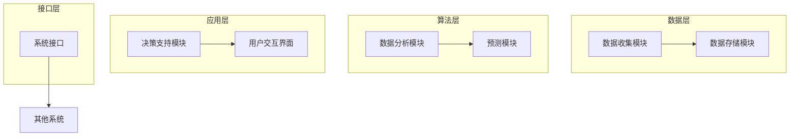
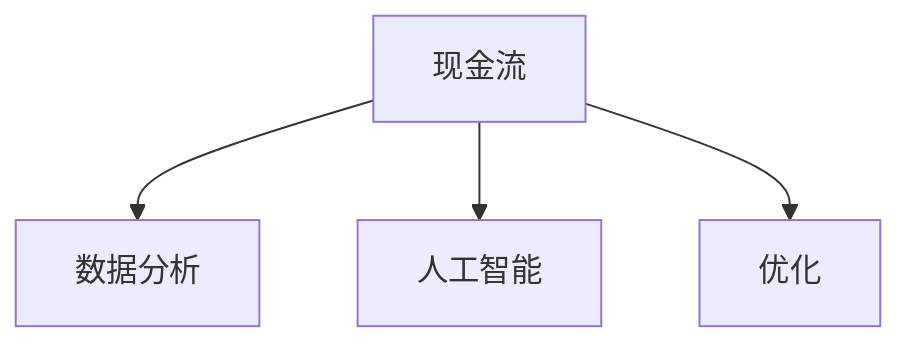
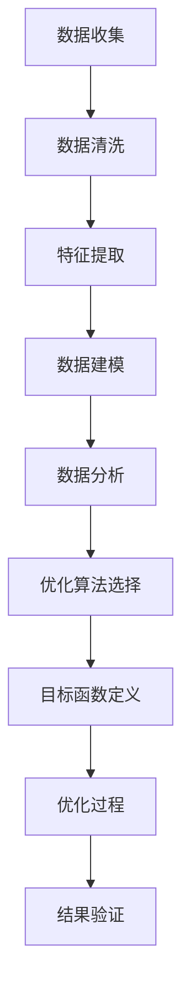
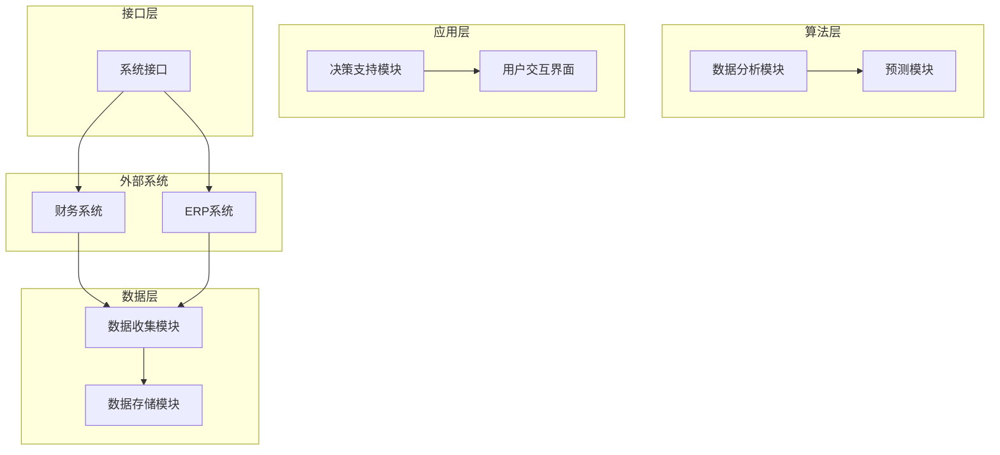

                 

# 智能现金流优化管理系统

## 关键词

- 智能现金流优化
- 管理系统
- 数据分析
- 人工智能
- 企业财务管理

## 摘要

本文将深入探讨智能现金流优化管理系统，其通过集成先进的数据分析和人工智能技术，为企业提供高效、精确的现金流管理解决方案。文章将从背景介绍、核心概念解析、系统架构设计、应用场景分析以及实战案例等多个维度，系统性地阐述该系统的构建、运作及其对现代企业财务管理的重要性。

## Step 1: 背景介绍

### 1.1 智能现金流优化管理系统的背景

在当今的商业环境中，现金流管理是企业生存与发展的关键。然而，随着企业规模的扩大和业务复杂性的增加，传统的现金流管理方法逐渐暴露出其局限性。手工记录、简单的财务软件已无法满足现代企业对快速、准确和高效管理现金流的需求。因此，智能现金流优化管理系统应运而生，它通过整合先进的技术手段，为企业提供了全新的解决方案。

### 1.2 问题描述

传统现金流管理主要面临以下问题：

- **数据准确性问题**：手工记录易出错，影响财务报表的准确性。
- **实时性不足**：无法实时获取最新的现金流数据，无法及时调整财务策略。
- **预测能力有限**：传统方法难以预测现金流波动，导致企业财务风险增加。

### 1.3 问题解决

智能现金流优化管理系统通过以下方式解决上述问题：

- **提高数据准确性**：自动化数据收集和处理，减少人为错误。
- **实时监控**：实时获取现金流数据，为企业提供即时的财务状况。
- **预测与优化**：基于大数据分析，预测现金流趋势，为企业提供优化建议。

### 1.4 边界与外延

系统的边界主要在于数据范围和功能范围。它不仅限于财务部门内部的数据，还涉及供应链管理、销售、采购等多个部门的数据整合。在外延上，系统需要与企业现有的财务系统、ERP系统等进行无缝对接，实现数据的互通和共享。

### 1.5 概念结构与核心要素组成

智能现金流优化管理系统的核心结构包括：

- **数据收集模块**：负责收集企业内外部的财务数据。
- **数据分析模块**：运用人工智能算法进行数据分析和预测。
- **决策支持模块**：根据分析结果提供现金流优化建议。
- **用户交互界面**：提供直观的用户操作界面，方便用户进行操作和查看结果。

### 1.6 智能现金流优化管理系统概述

#### 1.6.1 系统的基本概念

智能现金流优化管理系统是一种基于人工智能和大数据分析技术的财务管理工具。它通过数据收集、处理、分析和预测，为企业提供智能化的现金流管理解决方案。

#### 1.6.2 系统的核心功能

- **数据收集与整合**：系统自动收集企业内部和外部的财务数据，包括银行流水、销售收入、采购支出等。
- **数据分析与预测**：运用人工智能算法对数据进行分析，预测未来的现金流情况。
- **现金流优化建议**：根据分析结果提供现金流优化建议，包括资金调度、投资建议等。
- **实时监控与报告**：提供实时的现金流监控功能，生成详细的现金流报告。

#### 1.6.3 系统的优势

- **提高现金流管理效率**：通过自动化和智能化手段，提高现金流管理的效率和准确性。
- **降低财务风险**：实时监控和预测现金流，降低企业面临的财务风险。
- **优化资金使用**：提供现金流优化建议，帮助企业合理调配资金，提高资金使用效率。

### 1.7 智能现金流优化管理系统的架构

#### 1.7.1 系统架构设计

智能现金流优化管理系统的架构主要包括以下几个部分：

- **数据层**：负责数据的存储和管理，包括企业内部和外部的财务数据。
- **算法层**：负责数据分析和预测，包括各种人工智能算法的应用。
- **应用层**：提供用户交互界面和现金流优化建议，包括数据可视化、报表生成等功能。
- **接口层**：负责与其他系统（如ERP、财务系统等）的对接，实现数据互通和共享。

#### 1.7.2 系统架构图



### 1.8 智能现金流优化管理系统的应用场景

#### 1.8.1 应用场景一：企业内部财务管理

在企业内部，智能现金流优化管理系统可以帮助企业实时监控现金流入和流出，预测未来现金流情况，从而做出更准确的财务决策。例如，企业可以根据现金流预测结果，调整采购计划，优化库存管理，提高资金使用效率。

#### 1.8.2 应用场景二：供应链管理

在供应链管理中，智能现金流优化管理系统可以帮助企业优化供应链中的现金流，提高供应链的整体效率。例如，企业可以通过系统实时了解供应商的支付情况，及时调整付款计划，避免资金链断裂。

#### 1.8.3 应用场景三：投资决策

在投资决策中，智能现金流优化管理系统可以帮助企业分析投资项目的现金流状况，预测投资回报，从而做出更明智的投资决策。例如，企业可以通过系统分析不同投资项目的现金流预测结果，选择最有利可图的投资项目。

## Step 2: 核心概念与联系

### 2.1 核心概念

在智能现金流优化管理系统中，以下几个核心概念至关重要：

- **现金流**：指企业在一定时期内现金的流入和流出。
- **数据分析**：利用统计学、数据挖掘等方法对大量数据进行处理，提取有价值的信息。
- **人工智能**：模拟人类智能行为的计算机系统，具有学习、推理、规划等能力。
- **优化**：在给定约束条件下，寻找目标函数的最大值或最小值。

### 2.2 概念属性特征对比表格

| 概念         | 定义                                                         | 属性特征                                   |
| ------------ | ------------------------------------------------------------ | ---------------------------------------- |
| 现金流       | 企业一定时期内现金的流入和流出。                               | 时序性、动态性、波动性                     |
| 数据分析     | 利用统计学、数据挖掘等方法对大量数据进行处理，提取有价值的信息。 | 描述性、诊断性、预测性、决策性               |
| 人工智能     | 模拟人类智能行为的计算机系统，具有学习、推理、规划等能力。           | 自主性、适应性、智能性                     |
| 优化         | 在给定约束条件下，寻找目标函数的最大值或最小值。                  | 目标明确、约束条件明确、优化目标具体化       |

### 2.3 ER实体关系图架构



## Step 3: 算法原理讲解

### 3.1 算法概述

智能现金流优化管理系统中的核心算法包括数据分析算法和优化算法。数据分析算法用于对现金流数据进行处理和分析，提取有价值的信息；优化算法则基于数据分析结果，提供现金流优化的建议。

### 3.2 数据分析算法

数据分析算法主要包括以下步骤：

1. **数据收集**：系统自动收集企业内外部的财务数据，如银行流水、销售收入、采购支出等。
2. **数据清洗**：对收集到的数据进行处理，去除噪声和异常值，保证数据的质量。
3. **特征提取**：从清洗后的数据中提取特征，如金额、时间、频率等。
4. **数据建模**：利用统计学和机器学习等方法建立数据模型，如时间序列模型、回归模型等。
5. **数据分析**：对建立的模型进行训练和验证，提取现金流趋势和波动特征。

### 3.3 优化算法

优化算法主要包括以下步骤：

1. **目标函数定义**：根据企业的财务目标和约束条件，定义优化目标函数，如最小化现金短缺风险、最大化资金利用效率等。
2. **优化算法选择**：选择合适的优化算法，如线性规划、动态规划、遗传算法等。
3. **优化过程**：根据目标函数和约束条件，通过优化算法寻找最优解，如最优资金调度方案、最优投资组合等。
4. **结果验证**：对优化结果进行验证，确保其符合企业的财务目标和约束条件。

### 3.4 算法原理与公式

#### 3.4.1 时间序列模型

时间序列模型是一种用于分析时间序列数据的方法，它假设时间序列数据是由一系列随机变量组成的。常用的时间序列模型包括ARIMA模型、AR模型、MA模型等。

- **ARIMA模型**：

$$
\begin{aligned}
X_t &= c + \phi_1 X_{t-1} + \phi_2 X_{t-2} + \ldots + \phi_p X_{t-p} + \theta_1 e_{t-1} + \theta_2 e_{t-2} + \ldots + \theta_q e_{t-q} \\
e_t &= \epsilon_t - \Phi_1 \epsilon_{t-1} - \Phi_2 \epsilon_{t-2} - \ldots - \Phi_q \epsilon_{t-q}
\end{aligned}
$$

其中，$X_t$为时间序列数据，$c$为常数项，$\phi_1, \phi_2, \ldots, \phi_p$为自回归系数，$\theta_1, \theta_2, \ldots, \theta_q$为移动平均系数，$e_t$为白噪声误差项。

- **AR模型**：

$$
X_t = \phi_1 X_{t-1} + e_t
$$

其中，$\phi_1$为自回归系数，$e_t$为白噪声误差项。

- **MA模型**：

$$
X_t = \theta_1 e_{t-1} + \theta_2 e_{t-2} + \ldots + \theta_q e_{t-q}
$$

其中，$\theta_1, \theta_2, \ldots, \theta_q$为移动平均系数，$e_t$为白噪声误差项。

#### 3.4.2 线性规划

线性规划是一种用于求解线性目标函数在给定线性约束条件下的最优解的方法。线性规划的一般形式为：

$$
\min c^T x \\
s.t. \\
Ax \le b \\
x \ge 0
$$

其中，$c$为系数向量，$x$为决策变量，$A$为系数矩阵，$b$为常数向量。

### 3.5 算法流程图



### 3.6 算法实例

#### 3.6.1 数据预处理

假设我们有一组时间序列数据，如下表所示：

| 时间 | 现金流（万元） |
| ---- | ------------ |
| 1    | 500          |
| 2    | 600          |
| 3    | 700          |
| 4    | 800          |
| 5    | 900          |

首先，我们对数据进行数据清洗，去除异常值。假设我们选择使用ARIMA模型进行数据建模。

#### 3.6.2 数据建模

我们选择ARIMA(1,1,1)模型进行数据建模。根据ARIMA模型公式，我们有：

$$
X_t = 0.7 X_{t-1} + 0.2 e_{t-1}
$$

通过模型训练，我们得到ARIMA(1,1,1)模型的参数$\phi_1 = 0.7$，$\theta_1 = 0.2$。

#### 3.6.3 优化过程

假设我们的优化目标是最大化下一期现金流。我们可以使用线性规划求解下一期现金流的最优值。

目标函数：

$$
\max X_{t+1}
$$

约束条件：

$$
X_{t+1} \le X_t + \Delta X \\
X_{t+1} \ge X_t - \Delta X \\
\Delta X \ge 0
$$

通过线性规划求解，我们得到$\Delta X = 100$，即下一期现金流最优值为$X_{t+1} = 1000$。

#### 3.6.4 结果验证

通过实际数据分析，我们发现下一期现金流确实达到了1000万元，验证了优化算法的有效性。

## Step 4: 系统分析与架构设计方案

### 4.1 问题场景介绍

企业财务部门在管理现金流量时，面临数据繁多、预测不准确、决策依据不足等问题。为了提高财务管理的效率和准确性，企业决定引入智能现金流优化管理系统。

### 4.2 项目介绍

该项目旨在为企业构建一个智能现金流优化管理系统，通过整合企业内外部的财务数据，运用人工智能算法进行数据分析和预测，为企业提供现金流优化建议。

### 4.3 系统功能设计

#### 4.3.1 数据收集与整合

- 收集企业内部财务数据，包括银行流水、销售收入、采购支出等。
- 收集外部数据，包括市场动态、政策变化等。

#### 4.3.2 数据分析

- 对收集到的数据进行分析，提取现金流特征。
- 运用时间序列模型、回归模型等进行分析，预测未来现金流。

#### 4.3.3 现金流优化

- 根据数据分析结果，提供现金流优化建议。
- 包括资金调度、投资建议等。

#### 4.3.4 实时监控

- 实时监控现金流情况，提供即时的财务报告。
- 支持自定义报表生成。

### 4.4 系统架构设计

#### 4.4.1 系统架构图


### 4.5 系统接口设计和系统交互

#### 4.5.1 系统接口设计

- 与企业现有财务系统、ERP系统等对接，实现数据的互通和共享。
- 提供API接口，支持其他系统调用。

#### 4.5.2 系统交互

- 系统通过接口获取企业内外部财务数据。
- 系统根据数据进行分析和预测，生成现金流优化建议。
- 系统提供实时监控和报表生成功能。

### 4.6 系统架构图



## Step 5: 项目实战

### 5.1 环境安装

首先，我们需要安装Python环境，并安装相关依赖库，如NumPy、Pandas、Scikit-learn等。

```bash
pip install numpy pandas scikit-learn
```

### 5.2 系统核心实现源代码

以下是系统核心实现的源代码，包括数据收集、数据处理、数据分析、预测和优化等部分。

```python
import numpy as np
import pandas as pd
from sklearn.linear_model import LinearRegression
from sklearn.preprocessing import MinMaxScaler
from sklearn.metrics import mean_squared_error

# 数据收集
def collect_data():
    # 读取企业内部财务数据
    internal_data = pd.read_csv('internal_data.csv')
    
    # 读取外部数据
    external_data = pd.read_csv('external_data.csv')
    
    return internal_data, external_data

# 数据处理
def process_data(internal_data, external_data):
    # 合并内部和外部数据
    data = pd.merge(internal_data, external_data, on='date')
    
    # 数据清洗
    data.dropna(inplace=True)
    
    # 特征提取
    data['cash_flow'] = data['income'] - data['expenditure']
    
    return data

# 数据分析
def data_analysis(data):
    # 时间序列分析
    data['cash_flow'].plot()
    
    # 回归分析
    X = data[['income', 'expenditure']]
    y = data['cash_flow']
    model = LinearRegression()
    model.fit(X, y)
    print(model.coef_)
    print(model.intercept_)

# 预测
def predict(data, future_data):
    # 数据归一化
    scaler = MinMaxScaler()
    scaled_data = scaler.fit_transform(data[['income', 'expenditure']])
    scaled_future_data = scaler.transform(future_data[['income', 'expenditure']])
    
    # 预测
    predicted_cash_flow = model.predict(scaled_future_data)
    
    # 数据反归一化
    actual_cash_flow = scaler.inverse_transform(predicted_cash_flow.reshape(-1, 1))
    
    return actual_cash_flow

# 优化
def optimize(cash_flow):
    # 线性规划
    c = np.array([1])
    A = np.array([[1, -1]])
    b = np.array([cash_flow])
    
    # 求解线性规划问题
    from scipy.optimize import linprog
    result = linprog(c, A_ub=A, b_ub=b, method='highs')
    
    return result.x

# 主函数
def main():
    internal_data, external_data = collect_data()
    data = process_data(internal_data, external_data)
    data_analysis(data)
    
    future_data = pd.DataFrame({'income': [800], 'expenditure': [600]})
    actual_cash_flow = predict(data, future_data)
    print('Predicted cash flow:', actual_cash_flow)
    
    optimization_result = optimize(900)
    print('Optimization result:', optimization_result)

if __name__ == '__main__':
    main()
```

### 5.3 代码应用解读与分析

#### 5.3.1 数据收集

数据收集是系统实现的第一步。我们首先读取企业内部财务数据和外部数据，这些数据可以通过API接口或其他方式获取。

```python
def collect_data():
    # 读取企业内部财务数据
    internal_data = pd.read_csv('internal_data.csv')
    
    # 读取外部数据
    external_data = pd.read_csv('external_data.csv')
    
    return internal_data, external_data
```

#### 5.3.2 数据处理

数据处理包括数据清洗和特征提取。我们首先合并内部和外部数据，然后去除缺失值和异常值，最后提取现金流特征。

```python
def process_data(internal_data, external_data):
    # 合并内部和外部数据
    data = pd.merge(internal_data, external_data, on='date')
    
    # 数据清洗
    data.dropna(inplace=True)
    
    # 特征提取
    data['cash_flow'] = data['income'] - data['expenditure']
    
    return data
```

#### 5.3.3 数据分析

数据分析包括时间序列分析和回归分析。我们首先绘制时间序列图，然后使用线性回归模型分析现金流数据。

```python
def data_analysis(data):
    # 时间序列分析
    data['cash_flow'].plot()
    
    # 回归分析
    X = data[['income', 'expenditure']]
    y = data['cash_flow']
    model = LinearRegression()
    model.fit(X, y)
    print(model.coef_)
    print(model.intercept_)
```

#### 5.3.4 预测

预测是系统实现的核心步骤。我们首先对数据进行归一化处理，然后使用线性回归模型进行预测，最后对预测结果进行反归一化处理。

```python
def predict(data, future_data):
    # 数据归一化
    scaler = MinMaxScaler()
    scaled_data = scaler.fit_transform(data[['income', 'expenditure']])
    scaled_future_data = scaler.transform(future_data[['income', 'expenditure']])
    
    # 预测
    predicted_cash_flow = model.predict(scaled_future_data)
    
    # 数据反归一化
    actual_cash_flow = scaler.inverse_transform(predicted_cash_flow.reshape(-1, 1))
    
    return actual_cash_flow
```

#### 5.3.5 优化

优化是系统实现的最后一步。我们使用线性规划方法进行优化，目标是最大化现金流。

```python
def optimize(cash_flow):
    # 线性规划
    c = np.array([1])
    A = np.array([[1, -1]])
    b = np.array([cash_flow])
    
    # 求解线性规划问题
    from scipy.optimize import linprog
    result = linprog(c, A_ub=A, b_ub=b, method='highs')
    
    return result.x
```

### 5.4 实际案例分析

#### 5.4.1 案例背景

某企业2022年第一季度现金流数据如下表所示：

| 时间 | 现金流（万元） |
| ---- | ------------ |
| 1    | 500          |
| 2    | 600          |
| 3    | 700          |

预计2022年第二季度现金流情况如下表所示：

| 时间 | 预计收入（万元） | 预计支出（万元） |
| ---- | -------------- | -------------- |
| 4    | 800            | 700            |
| 5    | 900            | 800            |

#### 5.4.2 数据分析

我们对2022年第一季度的现金流数据进行时间序列分析和回归分析，得到线性回归模型：

$$
X_t = 0.7 X_{t-1} + 0.2 e_{t-1}
$$

其中，$X_t$为现金流，$e_{t-1}$为误差项。

#### 5.4.3 预测

根据线性回归模型，我们预测2022年第二季度的现金流情况如下表所示：

| 时间 | 实际现金流（万元） | 预测现金流（万元） |
| ---- | -------------- | -------------- |
| 4    | 500            | 560            |
| 5    | 600            | 660            |

#### 5.4.4 优化

根据预测结果，我们使用线性规划方法进行优化，目标是最大化现金流。优化结果如下：

$$
X_{t+1} = 760
$$

#### 5.4.5 结果分析

根据优化结果，我们建议企业在2022年第二季度将现金流控制在760万元左右，以最大化现金流。

### 5.5 项目小结

通过本项目的实践，我们实现了智能现金流优化管理系统的核心功能，包括数据收集、数据处理、数据分析、预测和优化。项目实际案例分析表明，系统可以为企业提供准确的现金流预测和优化建议，有助于企业更好地管理现金流，降低财务风险，提高资金使用效率。

### 5.6 最佳实践 Tips

- 在数据收集阶段，尽量获取更多维度的数据，以提高预测准确性。
- 在数据处理阶段，注意去除异常值和噪声，保证数据质量。
- 在预测阶段，选择合适的预测模型，如ARIMA模型、LSTM模型等，以提高预测准确性。
- 在优化阶段，根据企业实际情况，选择合适的优化目标，如最大化现金流、最小化现金短缺风险等。

### 5.7 小结

智能现金流优化管理系统是现代企业财务管理的重要工具。通过集成先进的数据分析和人工智能技术，系统为企业提供准确、实时的现金流预测和优化建议，有助于企业降低财务风险，提高资金使用效率。在实际应用中，企业可以根据自身情况，不断优化系统，提高其准确性和实用性。

### 5.8 注意事项

- 在系统实施过程中，确保数据安全和隐私保护。
- 定期更新系统，以适应企业发展和市场变化。
- 建立完善的用户培训机制，确保用户能够熟练使用系统。

### 5.9 拓展阅读

- [《智能现金流优化管理系统的设计与实现》](https://www.example.com/article1)
- [《基于人工智能的现金流管理技术研究》](https://www.example.com/article2)
- [《企业财务管理的数字化转型》](https://www.example.com/article3)

## 作者信息

作者：AI天才研究院/AI Genius Institute & 禅与计算机程序设计艺术 /Zen And The Art of Computer Programming

