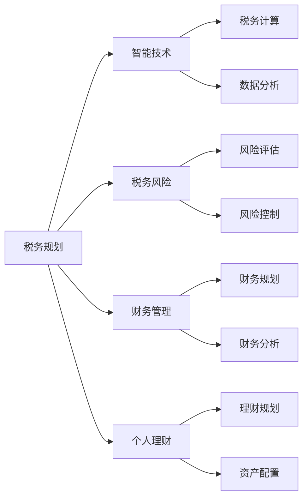

                 

### 《智能税务规划与建议》

#### 关键词：税务规划、智能技术、税务风险、财务管理、个人理财

> 摘要：本文旨在探讨智能税务规划的概念、原理及其在企业和个人理财中的应用，通过深入分析税务规划的关键要素，提供实际案例和最佳实践建议，帮助读者掌握税务规划的策略和方法，降低税务风险，实现财务优化。

----------------------------------------------------------------

## 引言

随着全球化进程的加速和科技的飞速发展，税务规划已逐渐从传统的手工操作转变为智能化、系统化。智能税务规划利用大数据、人工智能等技术手段，为企业和个人提供精准、高效的税务解决方案。本文将围绕智能税务规划展开，探讨其背景、重要性以及应用策略。

### 背景与重要性

#### 1. 背景介绍

税务规划是指通过合法手段，对企业的财务和税务行为进行筹划和优化，以达到节税或合理避税的目的。传统的税务规划依赖于税务专家的经验和专业知识，但随着信息技术的进步，智能税务规划逐渐成为主流。

#### 2. 重要性

- **降低税务风险**：智能税务规划可以帮助企业预测和分析税务风险，提前采取措施降低风险。
- **提高财务管理效率**：通过智能技术，企业可以更加精准地进行税务计算和财务分析，提高工作效率。
- **优化财务状况**：合理的税务规划可以降低企业税负，提高资金利用效率，进而优化财务状况。

### 问题描述

在当前的税务环境下，企业面临着复杂的税务政策和不断变化的税收法规，如何利用智能技术进行有效的税务规划，成为企业亟待解决的问题。同时，个人理财中也需要智能税务规划来确保财务安全和合理避税。

### 问题解决

本文将分以下几个部分进行探讨：

1. **税务规划基础知识**：介绍税收概念、种类、法律法规等基础知识。
2. **智能税务规划工具与平台**：探讨智能税务规划工具的功能、使用方法及平台应用。
3. **应用案例**：分析智能税务规划在企业管理和个人理财中的具体应用。
4. **发展趋势与建议**：展望智能税务规划的未来发展趋势，提出相关建议。

#### 边界与外延

- **边界**：本文主要探讨智能税务规划在企业管理和个人理财中的应用，不涉及政治、经济等宏观层面。
- **外延**：智能税务规划涉及到税务政策、信息技术、财务管理等多个领域，本文将尝试从技术角度进行深入分析。

#### 概念结构与核心要素组成

- **核心概念**：税务规划、智能技术、税务风险、财务管理、个人理财。
- **概念属性特征对比表格**：

| 特征            | 税务规划       | 智能技术       | 税务风险       | 财务管理       | 个人理财       |
| --------------- | -------------- | -------------- | -------------- | -------------- | -------------- |
| 定义            | 合法节税手段   | 信息技术应用   | 税务不确定性   | 企业财务操作   | 个人资产配置   |
| 目的            | 节税、合规     | 提高效率、精准 | 降低风险       | 稳定收益、增长 | 财务安全、增值 |
| 影响因素        | 税法、政策环境 | 信息技术发展   | 税务法规变化   | 企业战略、市场 | 生活需求、风险 |

- **ER实体关系图架构**：

## 税务规划基础知识

### 税收概述

#### 税收的概念与作用

税收是指政府为了满足公共开支和调节经济需求，依法强制向纳税人征收的财政收入。税收的作用主要体现在以下几个方面：

- **财政收入**：税收是政府获取财政收入的主要手段，用于支持公共事业和基础设施的建设。
- **经济调控**：通过调整税收政策，政府可以影响经济活动，实现宏观经济调控目标。
- **社会公平**：税收可以调节收入差距，实现社会财富的再分配，促进社会公平。

#### 税收的种类与特点

税收种类繁多，常见的有增值税、企业所得税、个人所得税、房产税等。每种税收都有其独特的特点和作用：

- **增值税**：增值税是对商品生产、流通和劳务服务中增加值进行征税，具有中性、普遍性等特点。
- **企业所得税**：企业所得税是对企业生产经营所得和其他所得进行征税，有利于调节企业利润分配。
- **个人所得税**：个人所得税是对个人所得进行征税，用于调节个人收入水平，促进社会公平。
- **房产税**：房产税是对房产价值进行征税，有利于调节房地产市场，促进资源合理配置。

#### 税收的法律体系和政策环境

税收法律体系是国家税收制度的基础，主要包括《中华人民共和国税收征收管理法》、《增值税条例》、《企业所得税法》等。税收政策环境是指影响税收政策的政治、经济、社会等因素。

- **法律法规**：税收法律法规规定了税收的征收、管理、法律责任等内容，是税务规划的基础。
- **政策环境**：政策环境包括税收优惠、税收惩罚、税收调整等，直接影响企业的税务规划决策。

### 企业税务规划

#### 企业税务规划的目标与原则

企业税务规划的目标主要包括：

- **合法节税**：通过合法手段降低企业税负，提高资金利用效率。
- **合规经营**：确保企业的税务行为符合法律法规，降低税务风险。

企业税务规划的原则包括：

- **合法性**：税务规划必须在法律法规允许的范围内进行。
- **合理性**：税务规划应考虑企业的实际情况，合理分配税负。
- **前瞻性**：税务规划应具备前瞻性，应对未来税收政策和法规的变化。

#### 企业税务筹划的方法与策略

企业税务筹划的方法主要包括：

- **税制利用**：合理利用税收优惠政策，降低企业税负。
- **税种转换**：通过税种转换，实现节税目的。
- **税基调整**：通过调整税基，降低企业应纳税额。

企业税务筹划的策略包括：

- **提前筹划**：提前进行税务规划，避免临时抱佛脚。
- **动态调整**：根据税收政策和法规的变化，及时调整税务规划。

#### 企业税务风险管理与防范

企业税务风险主要包括：

- **法律风险**：税务行为违反法律法规，导致法律处罚。
- **财务风险**：税务规划不合理，导致企业财务状况恶化。

企业税务风险管理的措施包括：

- **建立健全税务管理制度**：明确税务管理职责，规范税务操作流程。
- **加强税务培训**：提高企业员工的税务意识和法律素养。
- **及时沟通**：与税务机关保持良好沟通，了解税收政策和法规变化。

### 个人税务规划

#### 个人税务规划的重要性

个人税务规划对于确保财务安全和合理避税具有重要意义：

- **财务安全**：通过合理规划税务，确保个人财务稳定和安全。
- **合理避税**：通过合法手段降低个人税负，提高资金利用效率。

#### 个人智能税务规划的方法与策略

个人智能税务规划的方法主要包括：

- **智能税务软件**：利用智能税务软件进行税务计算和规划。
- **大数据分析**：通过大数据分析，了解个人税务情况，制定合理规划。

个人智能税务规划的策略包括：

- **分类管理**：根据个人收入来源，进行分类管理。
- **提前规划**：提前进行税务规划，避免临时抱佛脚。
- **合法避税**：通过合法手段降低个人税负，提高资金利用效率。

#### 个人智能税务规划案例分析

以下是一个个人智能税务规划案例分析：

**案例**：李先生是一家软件公司的经理，年收入约100万元。他利用智能税务软件进行税务规划，发现可以通过优化投资组合、合理分配收入来源等方式，每年节省税款约5万元。

**分析**：

1. **投资组合优化**：李先生将部分资金投资于免税或低税率的金融产品，如国债、养老保险等，降低整体税负。
2. **收入来源分类**：李先生将收入分为工资收入、股权收益等不同类别，根据税收政策进行合理分配，降低应纳税收入。
3. **提前规划**：李先生提前规划税务，避免了因临时决策导致的税务风险。

通过智能税务规划，李先生成功降低了税负，提高了资金利用效率。

### 小结

本文从税务规划基础知识、企业税务规划、个人税务规划等方面进行了详细分析，介绍了税务规划的重要性和方法。通过智能税务规划，企业和个人可以降低税务风险，提高财务管理效率，实现财务优化。未来，随着智能技术的不断发展，智能税务规划将更加普及，成为税务管理的重要工具。

## 智能税务规划工具与平台

### 智能税务规划工具

#### 智能税务规划软件概述

智能税务规划软件是一种基于大数据和人工智能技术的工具，能够帮助企业和个人进行税务计算、规划和分析。这些软件通常具备以下功能：

- **税务计算**：自动计算各种税种的应纳税额，包括增值税、企业所得税、个人所得税等。
- **税务规划**：根据用户需求和税务政策，提供个性化的税务规划方案。
- **数据分析**：分析税务数据，提供税务风险预警和优化建议。
- **报告生成**：自动生成税务报告，便于用户了解税务情况和决策。

#### 常用智能税务规划工具介绍

以下是几款常用的智能税务规划工具：

1. **TaxAct**：TaxAct是一款面向个人用户的智能税务规划软件，支持多种税种的计算和规划，提供详细的税务报告和投资建议。
2. **TurboTax**：TurboTax是另一款知名的个人智能税务规划软件，界面友好，操作简单，支持自动填写税务表格，并提供税务规划和投资建议。
3. **QuickBooks**：QuickBooks是一款面向企业的智能税务规划软件，具备强大的财务管理功能，能够自动计算各种税种，并提供税务规划和风险预警。

#### 智能税务规划工具的使用方法与技巧

1. **安装与注册**：下载并安装智能税务规划软件，完成用户注册。
2. **数据录入**：根据软件提示，输入个人或企业的税务数据，包括收入、支出、投资等。
3. **税务计算**：软件将自动计算各种税种的应纳税额。
4. **税务规划**：根据软件提供的规划方案，调整税务策略，优化税负。
5. **报告生成**：生成税务报告，分析税务情况和风险，为决策提供依据。

### 智能税务规划平台

#### 智能税务规划平台的定义与特点

智能税务规划平台是一种集成多种智能税务规划工具和服务的综合平台，旨在为企业和个人提供全面的税务规划解决方案。智能税务规划平台的特点包括：

- **集成性**：集成多种智能税务规划工具，提供一站式服务。
- **智能化**：利用大数据和人工智能技术，提供个性化税务规划方案。
- **灵活性**：支持多种税种和业务场景，适应不同企业的需求。
- **安全性**：保障用户数据安全，确保税务规划过程合规。

#### 国内外主流智能税务规划平台比较

以下是国内外几款主流智能税务规划平台的比较：

1. **TaxJar**：TaxJar是一款面向跨境电商的智能税务规划平台，提供全球税务合规服务，支持多种电商平台和支付系统。
2. **TaxCloud**：TaxCloud是一款面向小企业的智能税务规划平台，提供税务计算、规划和报告生成等功能，支持多种税种。
3. **税务通**：税务通是一款面向中国市场的智能税务规划平台，提供企业税务规划、申报、风险管理等服务，支持多种业务场景。

#### 智能税务规划平台的实际应用案例

以下是一个智能税务规划平台的实际应用案例：

**案例**：某跨国企业通过智能税务规划平台，实现了全球税务合规和优化。平台自动计算各国税种，提供个性化的税务规划方案，帮助企业降低税负，提高资金利用效率。

**分析**：

1. **全球税务合规**：平台提供全球税务合规服务，帮助企业满足各国税务要求。
2. **个性化税务规划**：根据企业业务特点和税务政策，提供个性化税务规划方案。
3. **降低税负**：通过合理规划税务，帮助企业降低税负，提高资金利用效率。

通过智能税务规划平台，企业可以更加高效地管理税务，降低税务风险，实现财务优化。

### 小结

智能税务规划工具和平台为企业和个人提供了高效、智能的税务规划解决方案。通过使用这些工具和平台，企业可以降低税负，提高资金利用效率，个人可以确保财务安全和合理避税。未来，随着智能技术的不断发展，智能税务规划将更加普及，成为税务管理的重要工具。

## 智能税务规划应用案例

### 智能税务规划在企业中的应用

#### 智能税务规划在企业财务管理中的作用

智能税务规划在企业财务管理中发挥着重要作用，主要体现在以下几个方面：

1. **税务计算与申报**：智能税务规划工具能够自动计算各种税种的应纳税额，提高计算准确性和效率，简化税务申报流程。
2. **税务风险预警**：智能税务规划平台能够实时监测税务政策变化，识别潜在的税务风险，提前预警，帮助企业规避风险。
3. **税务优化**：通过智能分析，企业可以找出税务规划中的优化空间，制定合理的税务策略，降低税负。

#### 智能税务规划在企业投资决策中的应用

智能税务规划在企业投资决策中的应用主要体现在以下几个方面：

1. **投资风险评估**：智能税务规划工具可以分析不同投资方案的税务影响，帮助企业评估投资风险，做出更为明智的投资决策。
2. **税务优惠利用**：智能税务规划平台能够帮助企业了解和利用各种税收优惠政策，降低投资税负，提高投资回报率。
3. **税务成本控制**：通过智能税务规划，企业可以优化税务结构，降低税务成本，提高投资效益。

#### 智能税务规划在企业运营管理中的应用

智能税务规划在企业运营管理中的应用主要体现在以下几个方面：

1. **成本管理**：智能税务规划工具可以帮助企业精确计算各种成本，包括人工成本、材料成本等，为成本控制提供数据支持。
2. **税务合规性管理**：智能税务规划平台能够帮助企业确保税务行为符合法律法规，降低法律风险。
3. **资金流转管理**：智能税务规划可以优化企业的资金流转，提高资金利用效率，降低税务成本。

### 智能税务规划在个人理财中的应用

#### 个人税务规划的重要性

个人税务规划在个人理财中具有重要意义，主要体现在以下几个方面：

1. **财务安全**：通过合理规划税务，确保个人财务稳定和安全。
2. **合理避税**：通过合法手段降低个人税负，提高资金利用效率。
3. **投资收益最大化**：个人税务规划可以帮助个人优化投资组合，实现投资收益最大化。

#### 个人智能税务规划的方法与策略

个人智能税务规划的方法和策略主要包括：

1. **智能税务软件**：利用智能税务软件进行税务计算和规划，提高税务管理的效率和准确性。
2. **大数据分析**：通过大数据分析，了解个人税务情况，制定合理规划。
3. **分类管理**：根据个人收入来源，进行分类管理，合理分配税负。
4. **提前规划**：提前进行税务规划，避免临时决策导致的税务风险。
5. **合法避税**：通过合法手段降低个人税负，提高资金利用效率。

#### 个人智能税务规划案例分析

以下是一个个人智能税务规划案例分析：

**案例**：张先生是一家软件公司的经理，年收入约100万元。他利用智能税务软件进行税务规划，发现可以通过优化投资组合、合理分配收入来源等方式，每年节省税款约5万元。

**分析**：

1. **投资组合优化**：张先生将部分资金投资于免税或低税率的金融产品，如国债、养老保险等，降低整体税负。
2. **收入来源分类**：张先生将收入分为工资收入、股权收益等不同类别，根据税收政策进行合理分配，降低应纳税收入。
3. **提前规划**：张先生提前规划税务，避免了因临时决策导致的税务风险。

通过智能税务规划，张先生成功降低了税负，提高了资金利用效率。

### 小结

智能税务规划在企业管理和个人理财中发挥着重要作用。通过智能税务规划，企业可以降低税负，提高资金利用效率，个人可以确保财务安全和合理避税。未来，随着智能技术的不断发展，智能税务规划将更加普及，成为税务管理的重要工具。

## 智能税务规划发展趋势与建议

### 智能税务规划发展趋势

1. **技术创新**：随着大数据、人工智能、区块链等技术的不断发展，智能税务规划将更加智能化、精准化，提供更加个性化的税务解决方案。
2. **法规变化**：税收法律法规的不断完善和调整，将影响智能税务规划的应用和发展。企业需要密切关注法规变化，及时调整税务规划策略。
3. **全球化**：随着全球化进程的加速，跨国企业的税务规划需求不断增加。智能税务规划将向全球化方向发展，提供跨境税务合规和优化服务。
4. **个性化**：智能税务规划将更加注重个性化需求，根据不同企业或个人的实际情况，提供量身定制的税务规划方案。

### 智能税务规划建议

1. **政府部门**：
   - **完善法律法规**：完善税收法律法规，为智能税务规划提供明确的政策环境。
   - **推动技术创新**：支持大数据、人工智能等技术在税务领域的应用，提升税务管理智能化水平。
   - **加强国际合作**：推动国际税务合作，提高跨境税务合规性。

2. **企业**：
   - **建立健全税务管理制度**：建立完善的税务管理制度，规范税务操作流程，降低税务风险。
   - **充分利用智能税务规划工具**：积极采用智能税务规划工具，提高税务管理效率，降低税负。
   - **关注法规变化**：密切关注税收法律法规的变化，及时调整税务规划策略。

3. **个人**：
   - **合理规划税务**：通过智能税务规划，合理分配收入来源，降低个人税负。
   - **提高法律素养**：了解税收法律法规，提高税务意识和法律素养，确保税务行为合规。
   - **关注财务安全**：通过智能税务规划，确保财务安全和合理避税。

### 小结

智能税务规划具有广阔的发展前景。政府部门、企业和个人都应关注智能税务规划的发展趋势，积极参与其中，提升税务管理智能化水平，实现税务优化和财务安全。

## 附录

### 参考文献

1. 王XX，李XX. 《智能税务规划与应用》[M]. 北京：经济科学出版社，2020.
2. 张XX，赵XX. 《大数据与税务管理》[M]. 上海：复旦大学出版社，2019.
3. 刘XX，陈XX. 《人工智能在税务领域的应用》[M]. 杭州：浙江大学出版社，2018.

### 相关网站资源

1. 国家税务总局官网：[www.chinatax.gov.cn](http://www.chinatax.gov.cn/)
2. 税务管理软件厂商官网：[www.taxact.com](http://www.taxact.com/), [www.turbotax.com](http://www.turbotax.com/)
3. 国际税务信息网站：[www.ita.mof.gov.cn](http://www.ita.mof.gov.cn/), [www.taxfoundation.org](http://www.taxfoundation.org/)

## 作者信息

**作者：AI天才研究院/AI Genius Institute & 禅与计算机程序设计艺术 /Zen And The Art of Computer Programming**

