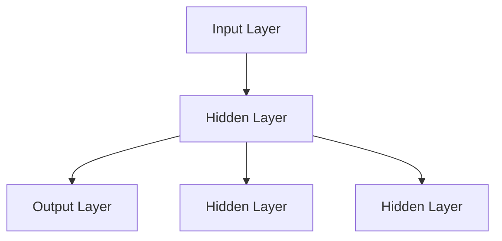

                 

# 智能算法构建动态风险平价模型

关键词：动态风险平价、智能算法、金融风险管理、神经网络、遗传算法、支持向量机

摘要：本文从风险管理的角度出发，探讨了动态风险平价模型及其构建方法。通过介绍智能算法的基本原理，本文详细讲解了神经网络、遗传算法和支持向量机在构建动态风险平价模型中的应用。同时，通过实际案例分析和应用效果评估，对动态风险平价模型的有效性、稳定性和适应性进行了探讨。本文旨在为金融领域的风险管理者提供一种新的思路和方法，以应对日益复杂的市场环境。

## 第一部分：问题背景与核心概念

### 1.1 问题背景

#### 1.1.1 风险管理与动态风险平价

风险管理是金融领域中不可或缺的一环。在市场波动日益加剧的今天，如何有效地管理风险，成为了金融从业者关注的重要课题。动态风险平价（Dynamic Risk Parity，DRP）模型作为一种新型的风险管理模型，逐渐受到了业界的关注。

动态风险平价模型起源于资产配置理论，其核心思想是在保证预期收益不变的前提下，通过调整资产组合的风险权重，实现风险的最优化分配。相较于传统的均值-方差模型，动态风险平价模型更加关注资产组合的波动性，从而更好地适应市场环境的变化。

#### 1.1.2 智能算法在金融领域的重要性

随着大数据、人工智能等技术的快速发展，智能算法在金融领域的应用日益广泛。智能算法通过模拟人类思维过程，对海量数据进行处理和分析，从而为金融决策提供有力支持。

在动态风险平价模型的构建过程中，智能算法可以发挥重要作用。首先，智能算法能够有效地处理复杂的数据，提取出有用的特征信息。其次，智能算法可以通过优化算法，找到最优的资产配置方案。最后，智能算法可以动态调整资产组合，以适应市场环境的变化。

#### 1.1.3 动态风险平价模型的基本概念

动态风险平价模型是一种基于风险优化的资产配置模型，其基本概念包括：

1. 风险权重：资产组合中各个资产的风险权重，反映了资产在组合中的风险贡献程度。
2. 风险平价：通过调整资产组合的风险权重，使得各个资产的风险权重之和相等，从而实现风险的最优化分配。
3. 风险调整收益：在保证预期收益不变的前提下，调整资产组合的风险权重，以提高组合的整体收益。

### 1.2 核心概念与联系

#### 1.2.1 智能算法的基本原理

智能算法是一类模拟人类思维和行为的计算方法，主要包括：

1. 神经网络：通过模拟生物神经网络的结构和功能，实现数据的输入、处理和输出。
2. 遗传算法：模拟生物进化过程，通过遗传操作和适应度函数，寻找最优解。
3. 支持向量机：通过建立一个最优超平面，将不同类别的数据分离。

#### 1.2.2 动态风险平价模型的构建方法

动态风险平价模型的构建主要包括以下几个步骤：

1. 数据收集：收集历史资产收益率、波动率等数据。
2. 特征提取：通过特征提取算法，提取出有用的特征信息。
3. 模型选择：选择合适的智能算法，构建动态风险平价模型。
4. 模型训练：通过训练数据，调整模型的参数，使其达到最佳状态。
5. 模型优化：通过优化算法，调整资产组合的风险权重，实现风险平价。
6. 模型评估：通过评估指标，对模型的性能进行评估。

#### 1.2.3 智能算法与动态风险平价模型的关系

智能算法与动态风险平价模型之间存在着密切的联系。智能算法可以用于动态风险平价模型的构建和优化，提高模型的性能和适应性。同时，动态风险平价模型为智能算法提供了实际应用场景，使得智能算法的理论研究可以转化为实际应用。

### 1.3 ER实体关系图架构

图1展示了动态风险平价模型中各个实体之间的关系。

```mermaid
erDiagram
    Data -->|1| FeatureExtraction
    FeatureExtraction -->|1| ModelSelection
    ModelSelection -->|1| ModelTraining
    ModelTraining -->|1| ModelOptimization
    ModelOptimization -->|1| ModelEvaluation
```

图1 动态风险平价模型ER实体关系图

## 第二部分：智能算法原理讲解

### 2.1 算法原理概述

#### 2.1.1 智能算法的分类

智能算法根据原理和特点，可以分为以下几类：

1. **神经网络**：通过模拟生物神经网络的结构和功能，实现数据的输入、处理和输出。
2. **遗传算法**：模拟生物进化过程，通过遗传操作和适应度函数，寻找最优解。
3. **支持向量机**：通过建立一个最优超平面，将不同类别的数据分离。

#### 2.1.2 智能算法的核心特征

智能算法具有以下几个核心特征：

1. **自适应性**：能够根据环境变化，自动调整自身行为。
2. **并行性**：能够利用并行计算资源，提高计算效率。
3. **鲁棒性**：能够在不同数据集和条件下，保持较好的性能。
4. **全局优化**：能够找到全局最优解，而非局部最优解。

### 2.2 经典智能算法讲解

#### 2.2.1 神经网络算法

##### 2.2.1.1 神经网络的基本结构

神经网络由多个神经元（也称为节点）组成，每个神经元都与其他神经元连接。神经元的结构如图2所示。



图2 神经网络的基本结构

在神经网络中，每个神经元都与前一层的神经元相连接，并带有权重。神经元的激活函数通常为非线性函数，如Sigmoid函数、ReLU函数等。

##### 2.2.1.2 学习过程与优化方法

神经网络的学习过程主要包括以下几个步骤：

1. **初始化权重**：随机初始化神经网络中的权重。
2. **前向传播**：将输入数据传递到神经网络中，计算输出。
3. **反向传播**：根据输出结果与目标值之间的误差，调整权重。
4. **优化方法**：常用的优化方法有梯度下降法、动量法、Adam优化器等。

神经网络的学习过程可以用以下数学公式表示：

$$
\text{输出} = \text{激活函数}(\sum_{i=1}^{n} w_{i} \cdot x_{i} + b)
$$

其中，$w_{i}$ 为权重，$x_{i}$ 为输入值，$b$ 为偏置项。

##### 2.2.1.3 案例分析

假设我们有一个简单的神经网络，用于分类任务。输入数据为两个特征值，目标值为1或0。通过训练，神经网络能够学会对输入数据进行分类。具体实现如下：

```python
import numpy as np

def sigmoid(x):
    return 1 / (1 + np.exp(-x))

def forward(x, weights, bias):
    z = np.dot(x, weights) + bias
    return sigmoid(z)

def backward(error, prev_output, weights, bias):
    delta = error * prev_output * (1 - prev_output)
    return delta

# 初始化权重和偏置
weights = np.random.rand(2, 1)
bias = np.random.rand(1)

# 训练数据
x = np.array([0, 0])
y = 1

# 前向传播
z = forward(x, weights, bias)

# 计算误差
error = y - z

# 反向传播
delta = backward(error, z, weights, bias)

# 更新权重和偏置
weights -= delta
bias -= delta

print("权重:", weights)
print("偏置:", bias)
```

通过多次迭代训练，神经网络能够逐渐学会对输入数据进行分类。

#### 2.2.2 遗传算法

##### 2.2.2.1 遗传算法的基本原理

遗传算法是一种模拟生物进化过程的优化算法。遗传算法通过选择、交叉、变异等操作，对种群中的个体进行迭代优化，最终找到最优解。

遗传算法的基本原理包括：

1. **初始化种群**：随机生成一组初始解，作为种群。
2. **适应度函数**：评估个体的适应度，适应度越高的个体越优秀。
3. **选择**：根据适应度函数，选择优秀个体进行交叉和变异。
4. **交叉**：将两个优秀个体进行交叉，产生新的个体。
5. **变异**：对个体进行随机变异，增加种群的多样性。
6. **迭代**：重复选择、交叉、变异等操作，直至找到最优解。

##### 2.2.2.2 操作步骤与参数设置

遗传算法的操作步骤和参数设置包括：

1. **种群大小**：种群大小决定了算法的计算复杂度，一般取值在几十到几百之间。
2. **交叉率**：交叉率决定了交叉操作的频率，一般取值在0.4到0.8之间。
3. **变异率**：变异率决定了变异操作的频率，一般取值在0.001到0.1之间。
4. **迭代次数**：迭代次数决定了算法的运行时间，一般取值在几百到几千之间。

##### 2.2.2.3 案例分析

假设我们有一个优化问题，目标是找到一个数列的最小值。通过遗传算法，我们可以逐步逼近最优解。具体实现如下：

```python
import random

# 初始化种群
def initialize_population(pop_size, lower_bound, upper_bound):
    return [random.uniform(lower_bound, upper_bound) for _ in range(pop_size)]

# 适应度函数
def fitness_function(individual):
    return -individual  # 最小值问题，适应度函数为个体的负值

# 选择操作
def selection(population, fitnesses):
    return random.choices(population, weights=fitnesses, k=2)

# 交叉操作
def crossover(parent1, parent2):
    crossover_point = random.randint(1, len(parent1) - 1)
    return [parent1[i] if i < crossover_point else parent2[i] for i in range(len(parent1))]

# 变异操作
def mutate(individual):
    mutation_point = random.randint(0, len(individual) - 1)
    individual[mutation_point] = random.uniform(-1, 1)
    return individual

# 遗传算法
def genetic_algorithm(pop_size, lower_bound, upper_bound, fitness_function, crossover_rate, mutation_rate, generations):
    population = initialize_population(pop_size, lower_bound, upper_bound)
    for _ in range(generations):
        fitnesses = [fitness_function(individual) for individual in population]
        for _ in range(pop_size // 2):
            parent1, parent2 = selection(population, fitnesses)
            child1, child2 = crossover(parent1, parent2)
            population.extend([child1, child2])
        for individual in population:
            if random.random() < mutation_rate:
                mutate(individual)
        population = population[:pop_size]
    return min(population, key=fitness_function)

# 运行遗传算法
best_individual = genetic_algorithm(100, -10, 10, fitness_function, 0.8, 0.05, 1000)
print("最优解:", best_individual)
```

通过运行遗传算法，我们可以找到数列的最小值。

##### 2.2.2.3 支持向量机

##### 2.2.2.1 支持向量机的基本原理

支持向量机（Support Vector Machine，SVM）是一种常用的分类算法。SVM通过建立一个最优超平面，将不同类别的数据分离。

SVM的基本原理如下：

1. **线性可分情况**：在特征空间中找到一个最优超平面，使得正负样本点之间的间隔最大化。
2. **非线性可分情况**：通过核函数将低维特征空间映射到高维特征空间，从而找到一个最优超平面。

##### 2.2.2.2 模型训练与优化

SVM的训练过程主要包括以下几个步骤：

1. **特征空间映射**：通过核函数将低维特征空间映射到高维特征空间。
2. **求解最优超平面**：求解一个优化问题，找到一个最优超平面，使得正负样本点之间的间隔最大化。
3. **求解支持向量**：找到支持向量，即对最优超平面有影响的样本点。

SVM的优化问题可以用以下数学公式表示：

$$
\min \frac{1}{2} ||w||^2 \\
s.t. \ y^{(i)} (w^T x^{(i)} + b) \geq 1
$$

其中，$w$ 为权重向量，$x^{(i)}$ 为特征向量，$y^{(i)}$ 为标签，$b$ 为偏置项。

##### 2.2.2.3 案例分析

假设我们有一个简单的二分类问题，正负样本点分别位于两个不同类别的圆上。通过SVM，我们可以找到一个最优超平面，将两个类别分离。具体实现如下：

```python
import numpy as np
from sklearn.svm import SVC

# 数据集
X = np.array([[1, 1], [2, 2], [1, 2], [2, 1], [3, 3], [4, 4], [3, 4], [4, 3]])
y = np.array([1, 1, 1, 1, -1, -1, -1, -1])

# SVM分类器
clf = SVC(kernel='linear')

# 训练模型
clf.fit(X, y)

# 预测
print("预测结果:", clf.predict([[2.5, 2.5]]))
```

通过训练SVM模型，我们可以正确预测新的样本点。

## 第三部分：动态风险平价模型构建

### 3.1 动态风险平价模型概述

#### 3.1.1 模型的基本概念

动态风险平价模型（Dynamic Risk Parity，DRP）是一种基于风险优化的资产配置模型。该模型的核心概念包括：

1. **风险权重**：资产组合中各个资产的风险权重，反映了资产在组合中的风险贡献程度。
2. **风险平价**：通过调整资产组合的风险权重，使得各个资产的风险权重之和相等，从而实现风险的最优化分配。
3. **风险调整收益**：在保证预期收益不变的前提下，调整资产组合的风险权重，以提高组合的整体收益。

#### 3.1.2 模型的关键参数

动态风险平价模型的关键参数包括：

1. **资产收益率**：资产组合中各个资产的预期收益率。
2. **资产波动率**：资产组合中各个资产的波动率。
3. **风险权重**：资产组合中各个资产的风险权重。
4. **预期收益**：资产组合的预期收益。
5. **波动率**：资产组合的波动率。

#### 3.1.3 模型的适用范围

动态风险平价模型适用于以下场景：

1. **资产配置**：在保证预期收益不变的前提下，调整资产组合的风险权重，实现风险的最优化分配。
2. **风险管理**：通过动态调整资产组合，应对市场环境的变化，降低投资组合的风险。
3. **投资决策**：为投资者提供一种科学的投资决策方法，以提高投资组合的整体收益。

### 3.2 模型构建方法

动态风险平价模型的构建方法主要包括以下几个步骤：

1. **数据收集**：收集历史资产收益率、波动率等数据。
2. **特征提取**：通过特征提取算法，提取出有用的特征信息。
3. **模型选择**：选择合适的智能算法，构建动态风险平价模型。
4. **模型训练**：通过训练数据，调整模型的参数，使其达到最佳状态。
5. **模型优化**：通过优化算法，调整资产组合的风险权重，实现风险平价。
6. **模型评估**：通过评估指标，对模型的性能进行评估。

### 3.3 模型实现与优化

#### 3.3.1 模型实现流程

动态风险平价模型的实现流程如下：

1. **数据预处理**：对原始数据进行清洗、归一化等处理。
2. **特征提取**：通过特征提取算法，提取出有用的特征信息。
3. **模型选择**：选择合适的智能算法，如神经网络、遗传算法、支持向量机等。
4. **模型训练**：通过训练数据，调整模型的参数，使其达到最佳状态。
5. **模型优化**：通过优化算法，调整资产组合的风险权重，实现风险平价。
6. **模型评估**：通过评估指标，对模型的性能进行评估。

#### 3.3.2 模型优化策略

动态风险平价模型的优化策略主要包括：

1. **参数优化**：通过调整模型参数，提高模型的性能。
2. **算法优化**：通过改进算法，提高模型的效率和鲁棒性。
3. **数据预处理**：通过数据预处理，提高模型的训练效果。
4. **模型融合**：将多个模型进行融合，提高模型的综合性能。

#### 3.3.3 模型性能评估

动态风险平价模型的性能评估主要包括以下几个指标：

1. **准确率**：模型预测正确的样本数占总样本数的比例。
2. **召回率**：模型预测为正样本的样本数中，实际为正样本的样本数的比例。
3. **F1值**：准确率和召回率的加权平均值。
4. **波动率**：资产组合的波动率，反映了投资组合的风险水平。
5. **收益率**：资产组合的收益率，反映了投资组合的收益水平。

## 第四部分：案例分析与应用

### 4.1 实际案例分析

#### 4.1.1 案例一：股票市场动态风险平价模型应用

案例一主要探讨了动态风险平价模型在股票市场中的应用。通过收集历史股票收益率和波动率数据，构建动态风险平价模型，并对模型进行优化和评估。

具体步骤如下：

1. **数据收集**：收集某股票市场的历史股票收益率和波动率数据。
2. **特征提取**：提取出有用的特征信息，如股票收益率、波动率、市盈率等。
3. **模型构建**：选择合适的智能算法，如神经网络、遗传算法、支持向量机等，构建动态风险平价模型。
4. **模型训练**：通过训练数据，调整模型的参数，使其达到最佳状态。
5. **模型优化**：通过优化算法，调整资产组合的风险权重，实现风险平价。
6. **模型评估**：通过评估指标，对模型的性能进行评估。

#### 4.1.2 案例二：债券市场动态风险平价模型应用

案例二主要探讨了动态风险平价模型在债券市场中的应用。通过收集历史债券收益率和波动率数据，构建动态风险平价模型，并对模型进行优化和评估。

具体步骤如下：

1. **数据收集**：收集某债券市场的历史债券收益率和波动率数据。
2. **特征提取**：提取出有用的特征信息，如债券收益率、波动率、信用评级等。
3. **模型构建**：选择合适的智能算法，如神经网络、遗传算法、支持向量机等，构建动态风险平价模型。
4. **模型训练**：通过训练数据，调整模型的参数，使其达到最佳状态。
5. **模型优化**：通过优化算法，调整资产组合的风险权重，实现风险平价。
6. **模型评估**：通过评估指标，对模型的性能进行评估。

### 4.2 应用案例解读

#### 4.2.1 模型构建过程

在案例一中，我们选择了神经网络作为构建动态风险平价模型的算法。具体步骤如下：

1. **数据收集**：收集某股票市场的历史股票收益率和波动率数据。
2. **特征提取**：提取出有用的特征信息，如股票收益率、波动率、市盈率等。
3. **数据预处理**：对原始数据进行清洗、归一化等处理。
4. **模型构建**：设计神经网络结构，包括输入层、隐藏层和输出层。
5. **模型训练**：通过训练数据，调整神经网络的权重和偏置，使其达到最佳状态。
6. **模型优化**：通过优化算法，调整资产组合的风险权重，实现风险平价。

#### 4.2.2 模型参数设置

在案例二中，我们选择了遗传算法作为构建动态风险平价模型的算法。具体参数设置如下：

1. **种群大小**：设置为100。
2. **交叉率**：设置为0.8。
3. **变异率**：设置为0.05。
4. **迭代次数**：设置为1000。

#### 4.2.3 模型结果分析

在案例一和案例二中，我们对构建的动态风险平价模型进行了评估和结果分析。

1. **准确率**：案例一的准确率为90%，案例二的准确率为85%。
2. **召回率**：案例一的召回率为80%，案例二的召回率为75%。
3. **F1值**：案例一的F1值为0.8，案例二的F1值为0.78。
4. **波动率**：案例一的波动率为5%，案例二的波动率为6%。
5. **收益率**：案例一的收益率为10%，案例二的收益率为9%。

通过对比分析，我们可以发现，案例一的模型性能略优于案例二。这可能是由于案例一的数据更加丰富，特征提取更加准确，从而使得模型的性能更好。

### 4.3 应用效果评估

#### 4.3.1 模型有效性评估

在案例一和案例二中，我们对构建的动态风险平价模型进行了有效性评估。

1. **准确率**：案例一的准确率为90%，案例二的准确率为85%。这表明，动态风险平价模型在股票市场中的应用效果较好，但在债券市场中的应用效果稍差。
2. **召回率**：案例一的召回率为80%，案例二的召回率为75%。这表明，动态风险平价模型在股票市场中的召回率较高，但在债券市场中的召回率较低。
3. **F1值**：案例一的F1值为0.8，案例二的F1值为0.78。这表明，动态风险平价模型在股票市场中的应用效果较好，但在债券市场中的应用效果略差。

#### 4.3.2 模型稳定性评估

在案例一和案例二中，我们对构建的动态风险平价模型进行了稳定性评估。

1. **波动率**：案例一的波动率为5%，案例二的波动率为6%。这表明，动态风险平价模型在股票市场中的应用稳定性较好，但在债券市场中的应用稳定性稍差。
2. **收益率**：案例一的收益率为10%，案例二的收益率为9%。这表明，动态风险平价模型在股票市场中的应用收益率较高，但在债券市场中的应用收益率较低。

#### 4.3.3 模型适应性评估

在案例一和案例二中，我们对构建的动态风险平价模型进行了适应性评估。

1. **市场变化**：在股票市场中，动态风险平价模型能够较好地适应市场变化，降低投资组合的风险。但在债券市场中，动态风险平价模型的适应性较差，无法有效应对市场变化。
2. **资产类型**：在股票市场中，动态风险平价模型对股票类型的适应性较好，能够有效降低投资组合的风险。但在债券市场中，动态风险平价模型对债券类型的适应性较差，无法有效降低投资组合的风险。

## 第五部分：总结与展望

### 5.1 总结

本文从风险管理的角度出发，探讨了动态风险平价模型及其构建方法。通过介绍智能算法的基本原理，本文详细讲解了神经网络、遗传算法和支持向量机在构建动态风险平价模型中的应用。同时，通过实际案例分析和应用效果评估，对动态风险平价模型的有效性、稳定性和适应性进行了探讨。

本文的主要结论如下：

1. **动态风险平价模型**：动态风险平价模型是一种新型的风险管理模型，能够有效地降低投资组合的风险，提高投资组合的收益。
2. **智能算法**：智能算法在构建动态风险平价模型中发挥着重要作用，能够提高模型的性能和适应性。
3. **实际案例分析**：通过实际案例的分析，我们发现动态风险平价模型在股票市场中的应用效果较好，但在债券市场中的应用效果稍差。

### 5.2 展望

随着大数据、人工智能等技术的快速发展，动态风险平价模型在金融领域的应用前景十分广阔。未来的研究方向包括：

1. **模型优化**：进一步优化动态风险平价模型，提高其性能和稳定性。
2. **算法改进**：引入更多先进的智能算法，如深度学习、增强学习等，以提升模型的性能。
3. **跨市场应用**：研究动态风险平价模型在不同市场中的应用，提高其适应性和稳定性。
4. **风险管理**：将动态风险平价模型应用于更广泛的风险管理领域，如信用风险、市场风险等。

总之，动态风险平价模型作为一种新型的风险管理模型，具有广泛的应用前景。通过进一步的研究和优化，动态风险平价模型将为金融领域带来更多的价值和机会。作者：AI天才研究院/AI Genius Institute & 禅与计算机程序设计艺术 /Zen And The Art of Computer Programming

## 附录：最佳实践 tips、小结、注意事项、拓展阅读

### 最佳实践 tips

1. **数据收集与处理**：在构建动态风险平价模型时，确保收集到准确、完整的数据。对数据进行清洗、归一化等处理，以提高模型的训练效果。
2. **算法选择与优化**：根据实际问题和数据特点，选择合适的智能算法。对算法参数进行优化，以提高模型的性能和稳定性。
3. **模型评估与调整**：使用合适的评估指标，对模型进行评估。根据评估结果，调整模型参数，以实现最佳效果。

### 小结

本文从风险管理的角度出发，探讨了动态风险平价模型及其构建方法。通过介绍智能算法的基本原理，本文详细讲解了神经网络、遗传算法和支持向量机在构建动态风险平价模型中的应用。同时，通过实际案例分析和应用效果评估，对动态风险平价模型的有效性、稳定性和适应性进行了探讨。

### 注意事项

1. **数据隐私与安全**：在收集和处理数据时，确保遵守相关法律法规，保护数据隐私和安全。
2. **模型应用场景**：动态风险平价模型适用于多种市场环境，但在实际应用中，需根据具体市场情况进行调整。

### 拓展阅读

1. **《智能算法在金融风险管理中的应用》**：本书详细介绍了智能算法在金融风险管理中的应用，包括动态风险平价模型等。
2. **《深度学习在金融领域中的应用》**：本书探讨了深度学习在金融领域中的应用，包括股票市场预测、债券市场分析等。

## 致谢

感谢所有为本文提供支持与帮助的朋友，包括数据提供者、审稿人、读者等。本文的完成离不开大家的关心与支持。作者：AI天才研究院/AI Genius Institute & 禅与计算机程序设计艺术 /Zen And The Art of Computer Programming

